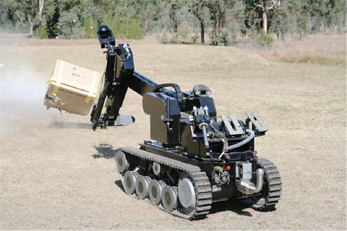
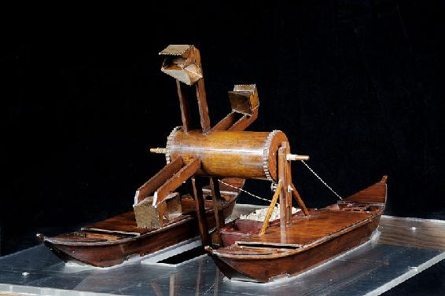
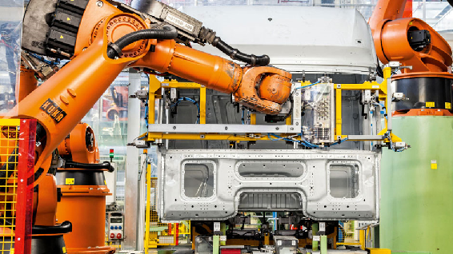
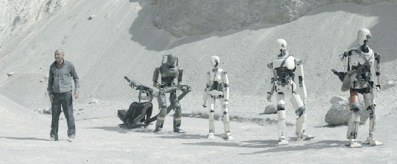
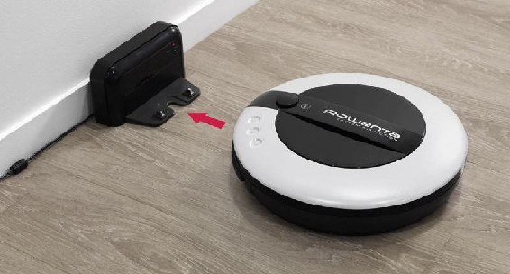
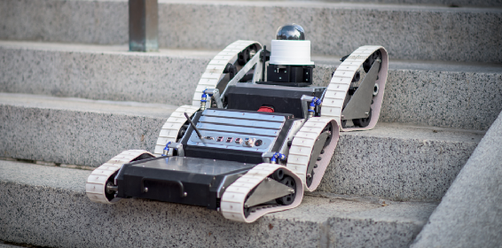
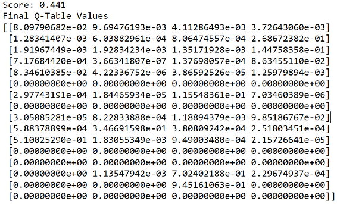

# 八、采用深度强化学习的机器人控制系统

机器人现在是我们生活环境中不可或缺的一部分。在工业领域，它们代表着对人类的一种有效帮助，取代了人们从事的令人生厌的工作。机器人控制系统的任务是执行计划好的运动序列，并在有障碍物的情况下识别替代路径。在这一章中，我们将讨论机器人在简单的迷宫环境中的导航问题，在这种环境中，机器人必须依靠其机载传感器来执行导航任务。

本章包括以下主题:

*   机器人控制概述
*   控制机器人移动性的环境
*   q 学习
*   深度学习

在本章的最后，读者将学习机器人控制理论的基础。探索机器人技术的发展，不同类型的机器人。学习控制架构的基本概念。通过 Q 学习和深度 Q 学习算法，学习使用当前最佳策略估计来生成系统行为。了解如何通过这些技术处理机器人控制的机动性。


# 机器人控制

**机器人**是一种机器，它使用人工智能过程，根据提供的命令执行特定的动作，这些命令或者基于直接的人类监督，或者独立地基于一般准则。这些任务通常应该在禁止性的或与人类条件不相容的环境中执行，以代替或帮助人类，例如在制造、建造或处理重的和危险的材料中，或者简单地将人从义务中解放出来。下图显示了一个爆炸物处理机器人:



机器人应该通过感知和行动之间的反馈，而不是通过人类的直接控制，来配备引导连接。动作可以采取电磁马达或致动器的形式，移动肢体，打开和关闭手爪，或移动机器人。由外部或内部机器人计算机或微控制器运行的程序提供逐步控制和反馈。基于这个定义，机器人概念可以包括几乎所有的自动化设备。


# 机器人概述

**机器人学**是一门研究智能生物行为的科学，并试图开发一些方法，使一种称为机器人的机器能够感知周围环境并与之互动(传感器和执行器)，以执行特定的任务。

它代表了人类对各种问题的解决方案，人类可以摆脱太枯燥、太耗时、太危险、太累、太简单或太精确的任务。这门学科源于人类创造具有人工智能的人工和自主设备的愿望。

下图显示了 MQ-1“捕食者”携带多光谱瞄准系统，具有固有的 AGM-114“地狱火”导弹瞄准能力，并将光电、红外、激光指示器和激光照明器集成到单个传感器组件中:


机器人学不仅重要的是学习如何建造和使用机器人，而且重要的是学习一种推理和实验的方法；事实上，它收集了许多跨学科的研究，如力学，电子学，信息技术，传感器，人工智能和数学。

1979 年，美国机器人研究所给出了机器人的定义，机器人是一种可编程的多功能工具，旨在通过各种编程的运动来移动材料、部件或工具。

二十年后，这个定义可能会被认为是不完整的，因为现在机器人被视为科学和工业中取代人类的工具。它可以，也可以不像人一样，履行或不履行人的职责。

在科幻小说中，机器人可以与人竞争，反叛，甚至灭绝的担忧是一个非常常见的话题。记住这个术语来自一个捷克语单词，robota，意思是强迫劳动；机器人一词最早是在 1920 年捷克作家卡雷尔·恰佩克(Karel chapek)的戏剧《r . u . r 》( r . u . r .)中用来指虚构的人形机器人，但卡雷尔的哥哥约瑟夫·恰佩克才是这个词的真正发明者。

在系列故事 *I、机器人*、*艾萨克·阿西莫夫*中，阐述了机器人三定律，试图控制机器人与人类之间的竞争:

*   机器人不得伤害人类，也不得坐视人类受到伤害
*   机器人必须服从人类给它的任何命令，除非这些命令与第一定律相冲突
*   机器人必须保护自己的存在，只要这种保护不违反第一或第二定律

机器人的特征可以概括如下:

*   **可编程性**:设计者可以随意组合的处理能力
*   **移动性**:与环境进行物理互动的可能性
*   灵活性:表现出适应环境的行为的能力
*   自主性:在不受其他成员干扰或制约的情况下履行自己职责的可能性

这些功能之所以成为可能，是因为每个机器人设备中都有两个基本元素:传感器和致动器。传感器是一种将需要测量的物理量转换成不同性质的信号(通常是电信号)的装置，这种信号更容易测量或记忆。致动器是一种将能量从一种形式转换成另一种形式的装置，因此它代替人在物理环境中起作用。也就是说，用于操作机械构件或根据通过电子控制系统发送的命令干预液压回路的任何装置。


# 机器人进化

自动化设备的建造可以追溯到古代，实际上是在公元前 400-350 年之间。塔兰托的希腊建筑师建造了一只由蒸汽喷射推动的飞翔的鸽子。公元 1200 年，第一台基本的自动机器开始制造:罗杰·培根创造了一个会说话的脑袋。

这意味着建造一个人造个体的想法，被赋予运动和行动的自主性，因此不是最近几个世纪的事情，也不是信息技术和机器人技术发展的结果。下图展示了在米兰 L. Da Vinci 国家科学技术博物馆展出的 Leonardo da Vinci 的挖掘船:



为了描述机器人的进步水平，可以使用术语**代机器人**。这个术语是由卡耐基梅隆大学机器人研究所的首席研究科学家汉斯·莫拉维克教授在描述机器人技术的近期发展时创造的。


# 第一代机器人

始于 1970 年的第一代机器人是机械臂，是可编程的机器，不能控制实际的执行模式，也不能与外部环境交互。

第一代机器人是低技术设备；事实上，它们不是在伺服控制下运行的。它们非常吵，因为臂本身和用于限制其运动的机械止动件之间的撞击产生噪音。这些类型的机器人主要用于工业，事实上，在那些年里，它们被用于装卸货物或进行简单的材料搬运。


# 第二代机器人

另一方面，装配线是第二代机器人的一部分。它由能够识别外部环境的可编程机器组成。所使用的技术质量中等，与第一代不同，机械臂配备了伺服控制，可以编程进行点对点位移。下图显示了梅赛德斯工厂的装配线:



这些由常规可编程逻辑控制器或小型计算机控制，也是可编程的。他们有专用于特定应用的特定软件。因此，如果机器人打算执行某项任务，如装载机器，就很难将其用于另一项操作，如焊接。为了做到这一点，控制系统必须改变。这种机器的诊断能力很差，因此由用户决定是否追溯可能故障的实际原因。


# 第三代机器人

这些是可自我编程的机器，能够以复杂的方式(视觉、声音等)与外部环境和外部操作员进行交互，并能够自我指导以执行指定的任务。第三代(20 世纪 80 年代末)现在已经发展到能够执行高度复杂的操作，如空间检查、自适应电弧焊和装配操作。下图显示的是 Sojourner，它是火星探路者机器人火星漫游车，于 1997 年 7 月 4 日着陆:


所使用的技术是高标准的，编程可以使用可抓握的键盘在线完成，也可以通过视频显示器离线完成。编程语言不像第二代那样在低层次上工作。

它们可以与 CAD 数据库或主机连接，进行数据加载/卸载。它们还能够向操作员发送消息，描述任何故障的性质和位置。同时使用这种机器人是为了执行智能任务。


# 第四代机器人

第四代机器人被认为是未来的机器人。这些机器人被称为机器人或人形机器人，或具有模仿人类动作和功能的人类特征的自动机。下图是从电影《自动机》(加布·依班娜导演，安东尼奥·班德拉斯主演)中提取的一些机器人:



在这里，这项研究分为两部分:一方面，学者们专注于令人惊讶的人形生物，类似于有硅脸、化妆和衣服的假人。另一方面，所谓的两足动物已经发展起来，具有人类的形状，但类似于卡通机器人，也具有学习和使用各种运动移动的能力。它们不再仅仅是工业机器人，也是社交机器人，有时被用来研究人类的社交互动。


# 机器人自主

机器人分类的一个重要内涵是它们必须表现出的自主程度。自主意味着在动态和非结构化的环境中运行而不需要持续人为干预的能力。在这样的环境中，许多具体情况都是未知的*先验*，迫使机器人(或任何自主系统)能够检测当前情况的显著特征，并相应地采取行动，决定采取什么行动。此外，长时间避免人工干预的需要意味着必须依赖机器人自我管理和生存的全部能力(例如，通过避免保持身体被阻挡或完全耗尽能量储备)。下图显示了一个机器人吸尘器，它可以恢复位置，为电池充电:



考虑到工业机器人在生产过程中执行重复性任务，这种类型的机器显然需要很少的自主性。事实上，这些机器通常只需执行一系列预定的、任意复杂的动作，这些动作是在机器人的设计和编程中定义的。

通常，这些机器在特别设计的保护单元(工作单元)内执行它们的任务，以便于操作，其中，出于安全原因，当这些机器在操作时，甚至禁止进入。这种类型的机器人可以被开发成在工作环境的许多方面都是理所当然的，并且在大多数情况下，采用经典的自动控制算法，甚至是非常复杂的算法，就足以通过利用从环境中通过通常的反馈回路获得的有用信息来为机器人提供最佳操作的能力。

在环境不能被人工改变的情况下，因此事先不知道*，很明显，机器人必须具有一定的自主性，以应对这种情况带来的困难和危险。*

*

# 机器人机动性

自治系统的一个典型特征是移动性。执行预定任务的机器人需要在环境中进行物理移动，并且必须不可避免地具有一定的自主性，使其能够安全移动，避开障碍物，并且不对附近的任何生物构成威胁，如下图所示:


显然，可以识别不同级别的自主性，从从不或几乎从不需要人类干预的完全自主系统，到根据它们是否完全依赖于给它们的命令或部分操作是否由机器人本身决定而或多或少自主的遥控系统。


# 自动控制

从技术上讲，机器人可以被视为一种特殊类型的自动控制，也就是说，一个自动机在物理上位于一个环境中，它可以通过称为传感器的组件感知某些特征，并可以对其执行动作，目的是对其进行改变。这些动作由所谓的致动器来执行。介于由传感器进行的测量和给予致动器的命令之间的所有东西可以被定义为机器人的控制程序或控制器。这是机器人智能被编码的组成部分，在某种意义上，它因此构成了必须指导其行动以获得所需行为的大脑。控制器可以通过多种方式实现:通常是运行在一个或多个物理集成到系统(板载)中的微控制器上的软件，但也可以通过直接连接到机器人硬件的电子电路(模拟或数字)获得。软件的抽象性质显然使其成为最灵活的解决方案，因为这种实体本身可以很容易地从一种存储介质转移到另一种存储介质:因此，要改变控制器，以及机器人所采取的整个行为，改变控制软件而硬件保持不变就足够了，从而允许我们几乎不需要任何成本就可以进行改变。


# 控制架构

作为一个软件，即使是机器人控制程序，也可以应用软件工程的经典原则。首先，考虑与控制器的软件架构的定义有关的定义，即在分析阶段采用的高级结构和范例来构建控制问题，并在设计阶段对解决方案进行建模。在机器人系统的控制软件的具体情况下，通常使用的术语是**控制架构**。

控制架构可以被定义为提供原则的抽象，根据这些原则来组织控制系统，定义其结构，同时对解决控制问题的方式施加约束。

为了使架构适合于特定控制系统的开发，它必须尽可能地反映需求，从而反映期望的特性。在自治系统控制器的情况下，这种架构应该享有的属性可以总结如下:

*   **环境反应**:机器人应该对环境中的突然变化做出反应，并且应该能够考虑外部事件，其时机与它正在执行的任务的正确和有效执行相兼容(硬时间限制或软实时)。

*   智能行为(Intelligent behavior):这要求机器人遵循常识规则，以展现智能行为，并根据任务目标对外部刺激做出反应。
*   **多个传感器的集成**:单独使用的传感器通常具有有限的精度、可靠性和适用性，因此必须通过集成来自多个互补传感器的读数进行补偿，这些传感器可能具有不同的性质，必须通过系统控制(传感器冗余)来充分利用。
*   **追求多个目标**:控制系统应该能够实现或保持各种目标，这些目标在某些情况下可能会相互矛盾。
*   **Robustness**: The robot should have the ability to continue to do its job discreetly (obviously within the limits of the possible) even in the face of imperfect input, unexpected events, and sudden malfunctions. In the following picture is shown a robot equipped with a particular technology that allows it to climb up and down the stairs:

    

*   **可靠性**:委托给机器人的任务应该在没有故障和不降低性能的情况下执行。
*   **可编程性**:一个非常有趣的特性是，即使在执行时，也可以让机器人执行在一定抽象层次上描述的任务，而不是开发只能够管理设计阶段设想的任务的控制系统。
*   **模块化**:机器人的控制系统应该细分成更简单的子系统(模块、组件)，这些子系统可以单独设计、开发和测试，然后逐步集成。
*   **灵活性**:控制系统的开发通常依赖于持续的实验，其结果用于指导当前解决方案的开发，尤其是修改，因此一个架构越允许我们创建灵活且易于更改的控制器，就越有可能遵循这一策略。

*   **可扩展性**:由系统的模块化和灵活性产生的一种属性，允许增量开发，并通过其组件的集成、验证和改进而延长。
*   **可扩展性**:系统应能够根据可用的计算资源轻松扩展，例如，在用更强大的型号替换处理器或创建由几个互连微控制器组成的并行基础设施时(在这种情况下，控制必须设计为物理分布式系统)。
*   **适应性**:由于周围环境的特性可能会发生不可预测的变化，因此控制系统的一个非常有用的特性是适应这些变化并相应地改变控制策略的能力(容量等特性是运行时需要学习的)。

一般来说，每种架构都依赖于特定的控制策略。


# 冰冻湖环境

FrozenLake 环境是一个 4 × 4 的网格，包含四个可能的区域:安全区(S)、冻结区(F)、球洞(H)和球门(G)。代理控制一个角色在网格世界中的移动，并绕着网格移动，直到它到达目标或洞。网格的一些瓦片是可行走的，其他的导致代理人掉进水里。如果它掉进了洞里，它必须从头开始，并被奖励值 0。此外，代理的移动方向是不确定的，并且仅部分取决于所选择的方向。代理人因找到一条通往目标方块的可行走路径而获得奖励。代理有四种可能的移动:上，下，左，右。这个过程一直持续，直到它从每一个错误中吸取教训，最终达到目标。

使用如下所示的网格来描述表面:

*   SFFF (S:起点，安全)
*   FHFH(女:冰面，安全)
*   FFFH(霍尔，去死吧)
*   HFFG (G:球门，飞盘所在的位置)

下图所示为 FrozenLake 网格(4 × 4):


当你到达目标或掉进洞里时，这一集就结束了。如果你达到了目标，你会得到 1 英镑的奖励，否则就等于零。


# Q 学习解决方案

q 学习是最常用的强化学习算法之一。这是因为它能够在不需要环境模型的情况下比较可用操作的预期效用。由于这种技术，有可能在一个完成的**马尔可夫决策过程**(**)中为每个给定的状态找到一个最优的行动。**

 **由于学习过程，强化学习问题的一般解决方案是估计评估函数。该功能必须能够通过奖励的总和来评估特定政策的便利性或其他方面。事实上，Q-learning 试图最大化 *Q* 函数(action-value function)的值，它代表了当我们在状态 *s* 中执行动作 *a* 时的最大贴现未来报酬。

让我们通过提供基于 Q 学习的第一个解决方案来面对控制机器人的问题。在下面的代码中，提出了针对 FrozenLake 问题的 Q 学习解决方案:

```py
import gym
import numpy as np
env = gym.make('FrozenLake-v0') QTable = np.zeros([env.observation_space.n,env.action_space.n]) alpha = .80 gamma = .95 NumEpisodes = 2000 
RewardsList = [] for i in range(NumEpisodes):
 CState = env.reset()
 SumReward = 0
 d = False
 j = 0
 while j < 99:
 j+=1
 Action = np.argmax(QTable[CState,:] + np.random.randn(1,env.action_space.n)*(1./(i+1)))
 NState,Rewards,d,_ = env.step(Action)
 QTable[CState,Action] = QTable[CState,Action] + alpha*(Rewards + gamma*np.max(QTable[NState,:]) - QTable[CState,Action])
 SumReward += Rewards
 CState = NState
 if d == True:
 break
  RewardsList.append(SumReward)
print ("Score: " + str(sum(RewardsList)/NumEpisodes))
print ("Final Q-Table Values")
print (QTable)
```

像往常一样，我们将逐行分析代码。让我们从导入库开始:

```py
import gym
import numpy as np
```

然后，我们继续通过调用`make`方法来创建环境:

```py
env = gym.make('FrozenLake-v0')
```

这个方法创建了我们的代理将在其中运行的环境。现在，让我们从`QTable`开始初始化参数:

```py
QTable = np.zeros([env.observation_space.n,env.action_space.n])
```

`QTable`的行数等于观察空间的大小(`env.observation_space.n`)，而列数等于动作空间的大小(`env.action_space.n`)。FrozenLake 环境为 4 x 4 网格中的每个单元格提供了一个状态和四个动作(上、下、左、右)，返回一个 16 x 4 的表格。使用`np.zeros()`函数用全零初始化该表，该函数返回一个给定形状和类型的新数组，用零填充。

现在，我们定义一些参数:

```py
alpha = .8
gamma = .95
```

`alpha`是学习率，`gamma`是折现因子。

学习率决定了新获得的信息在多大程度上超越了旧信息。因子 0 使代理什么都不学(专门利用先验知识)，而因子 1 使代理只考虑最近的信息(忽略先验知识探索可能性)。这就是勘探开发的困境。理想情况下，代理人必须探索每种状态下所有可能的行为，找到在实现其目标的过程中利用它而得到实际上最大回报的状态。

折扣系数决定了未来奖励的重要性。0 的因子只会考虑当前的奖励，而接近 1 的因子会让它争取长期的高奖励。

现在，我们设置剧集的数量:

```py
NumEpisodes = 2000
```

但是，我们所说的插曲是什么意思呢？代理将通过经验学习，没有老师，这是一种无监督的学习。代理将从一个状态探索到另一个状态，直到它到达目标。我们称每次探索为一集。每一集包括代理从初始状态到目标状态的移动。每次代理到达目标状态，程序就进入下一集。

现在，我们将创建一个包含总体奖励的列表:

```py
RewardsList = []
```

此时，设置参数后，可以开始 Q 学习循环:

```py
for i in range(NumEpisodes):
```

因此，我们使用`reset()`方法初始化系统:

```py
CState = env.reset()
```

现在，我们为剧集任务设置一个控件:

```py
d = False
```

当`d`变为`True`时，表示该集已经结束。然后，循环计数器被初始化:

```py
j = 0
```

是时候实现 Q 学习表算法了:

```py
while j < 99:
```

我们在每个新步骤增加循环计数器:

```py
j += 1
```

现在，我们必须选择一项行动:

```py
Action = np.argmax(QTable[CState,:] + np.random.randn(1,env.action_space.n)*(1./(i+1)))
```

从`QTable`中贪婪地选择一个动作。添加噪声是因为环境是未知的，所以必须以某种方式探索它——您的代理将使用随机性的力量来这样做。使用了两个功能:`np.argmax`和`np.random.randn`。`np.argmax`返回从标准正态分布返回一个样本(或多个样本)的最大值沿`axis.np.random.randn`的指数。

现在，我们使用`step()`方法来返回新的状态，以响应我们调用它的动作。显然，我们传递给方法的动作就是我们刚刚决定的动作:

```py
NState,Rewards,d,_ = env.step(Action)
```

正如我们所说的，该方法返回以下四个值:

*   `observation`:一个特定环境的物体，代表你对环境的观察。

*   `reward`:上一次行动获得的奖励金额。规模因环境而异，但目标始终是增加你的总回报。它的类型是`float`。

*   `done`:是否又到了重置环境的时候了。大多数(但不是全部)任务被划分为定义明确的片段，完成`True`表示该片段已经终止。它的类型是`Boolean`。

*   `info`:对调试有用的诊断信息。它有时对学习很有用。它的类型是`dict`。

然后我们可以用新知识更新`QTable`:

```py
QTable[CState,Action] = QTable[CState,Action] + alpha*(Rewards + 
gamma*np.max(QTable[NState,:]) - QTable[CState,Action])
```

现在，我们用刚刚获得的奖励来更新奖励的总和。请记住，对于我们保持直杆的每个时间步长，我们会得到+1 `reward`:

```py
SumReward += reward
```

现在，我们将为下一个学习周期设置状态:

```py
CState = Nstate
        if d == True:
            break
```

每集结束时，奖励列表会增加一个新值:

```py
RewardsList.append(SumReward)
```

最后，我们打印结果:

```py
print ("Score: " +  str(sum(RewardsList)/NumEpisodes))
print ("Final Q-Table Values")
print (QTable)
```

下面显示的是最终的`Q-Table`:



为了改善结果，需要重新调整配置参数。** **

# 深度 Q 学习解决方案

在下面的代码中，提出了针对 FrozenLake 问题的深度 Q 学习解决方案:

```py
import gym
import numpy as np
from keras.models import Sequential
from keras.layers.core import Dense, Reshape
from keras.layers.embeddings import Embedding
from keras.optimizers import Adam
from rl.agents.dqn import DQNAgent
from rl.policy import BoltzmannQPolicy
from rl.memory import SequentialMemory
 ENV_NAME = 'FrozenLake-v0'
 env = gym.make(ENV_NAME)
np.random.seed(1)
env.seed(1)
Actions = env.action_space.n
 model = Sequential()
model.add(Embedding(16, 4, input_length=1))
model.add(Reshape((4,)))
print(model.summary())
 memory = SequentialMemory(limit=10000, window_length=1)
policy = BoltzmannQPolicy()
Dqn = DQNAgent(model=model, nb_actions=Actions,
               memory=memory, nb_steps_warmup=500,
               target_model_update=1e-2, policy=policy,
               enable_double_dqn=False, batch_size=512
               )
Dqn.compile(Adam())
 Dqn.fit(env, nb_steps=1e5, visualize=False, verbose=1, log_interval=10000)
 Dqn.save_weights('dqn_{}_weights.h5f'.format(ENV_NAME), overwrite=True)
 Dqn.test(env, nb_episodes=20, visualize=False)

```

正如在目前提出的所有示例中所做的那样，我们将逐行分析这段代码，以理解它的操作原理。代码的第一部分用于导入库:

```py
import numpy as np
import gym
```

首先，我们导入`numpy`库，它将用于设置种子值。因此，我们导入了`gym`库，它将帮助我们定义环境。完成这些后，我们导入`keras`库的一些函数来构建一个神经网络模型:

```py
from keras.models import Sequential
from keras.layers.core import Dense, Reshape
from keras.layers.embeddings import Embedding
from keras.optimizers import Adam
```

Keras 是一种高级神经网络 API，用 Python 编写，能够在 TensorFlow、CNTK 或 Theano 之上运行。它的开发重点是支持快速实验。使用 Keras，我们将能够在最短的时间内从想法到结果，这样您就可以花更多的时间来分析结果。一、导入`Sequential`模型；`Sequential`模型是层的线性堆叠。然后，导入一些`keras`图层:`Dense`和`Reshape`。

一个`Dense`模型是一个全连接的神经网络层。`Reshape`层将输出重新整形为某种形状。然后`Embedding`层被导入。这一层将正整数(索引)转化为固定大小的密集向量。该层只能用作模型中的第一层。最后，导入`Adam`优化器。让我们转到导入 Keras-RL 库:

```py
from rl.agents.dqn import DQNAgent
from rl.policy import BoltzmannQPolicy
from rl.memory import SequentialMemory
```

Keras-RL 库用 Python 实现了一些最先进的深度强化学习算法，并与深度学习 Keras 库无缝集成。`DQNAgent`、策略和内存模型被导入。作为策略，`BoltzmannQPolicy`被导入。这个策略在 *q* 值上建立一个概率法则，并根据这个法则返回一个随机选择的动作。现在，我们将定义环境:

```py
ENV_NAME = 'FrozenLake-v0'
```

这样，我们已经设置了环境的名称，所以让我们来获取它:

```py
env = gym.make(ENV_NAME)
```

为了设置`seed`值，使用了`numpy`库的`random.seed()`函数:

```py
np.random.seed(1)
```

`seed()`函数设置随机数发生器的种子，这对于创建模拟或可再现的随机对象很有用。每当你想得到一个可重复的随机结果时，你必须使用这个函数。`seed`还必须为环境设置:

```py
env.seed(1)
```

现在，我们将提取代理可用的操作:

```py
Actions = env.action_space.n
```

`Actions`变量现在包含了所选环境中所有可用的动作。健身房不会一直告诉你这些动作是什么意思，只会告诉你哪些是可用的。现在，我们将使用 Keras 库构建一个简单的神经网络模型:

```py
model = Sequential()
model.add(Embedding(16, 4, input_length=1))
model.add(Reshape((4,)))
print(model.summary())
```

现在神经网络模型可以使用了，让我们配置和编译我们的代理。使用 DQN 的一个问题是，算法中使用的神经网络往往会忘记以前的经验，因为它会用新的经验覆盖它们。所以，我们需要一个以前的经验和观察的列表，用以前的经验来改造模型。为此，定义了一个包含先前经验的`Memory`变量:

```py
Memory = SequentialMemory(limit=10000, window_length=1)
```

现在，我们将设置策略:

```py
Policy = BoltzmannQPolicy()
```

我们只需要定义代理:

```py
Dqn = DQNAgent(model=model, nb_actions=Actions, memory=memory, nb_steps_warmup=500, target_model_update=1e-2, policy=policy, enable_double_dqn=False, batch_size=512)
```

让我们继续编译模型:

```py
Dqn.compile(Adam())
```

该命令编译用于培训和测试的代理和底层模型。现在代理已经准备好了，我们可以训练它了:

```py
Dqn.fit(env, nb_steps=1e5, visualize=False, verbose=1, log_interval=10000)
```

`fit()`函数在给定的环境中训练代理。在训练结束时，有必要保存获得的重量:

```py
Dqn.save_weights('dqn_{}_weights.h5f'.format(ENV_NAME), overwrite=True)
```

保存网络或整个结构的重量发生在 HDF5 文件中，这是一种高效灵活的存储系统，支持复杂的多维数据集。最后，我们将针对`20`集评估我们的算法:

```py
Dqn.test(env, nb_episodes=20, visualize=False)
```

我们的代理现在能够识别允许他们达到目标的路径。


# 摘要

在这一章中，你学习了机器人控制理论的基础。**机器人**是一种根据提供的命令执行特定动作的机器。为了描述一个机器人的进步水平，可以使用术语**一代机器人**。不同代的机器人被用来区分相关的特征。已经讨论了机器人自主性和机器人移动性主题，以理解如何处理与机器人自主控制相关的问题。

然后，我们观察了冰冻湖的环境。这是一个 4 × 4 的网格，包含四个可能的区域:安全区(S)、冻结区(F)、球洞(H)和球门(G)。代理控制一个角色在网格世界中的移动，并绕着网格移动，直到它到达目标或洞。这种环境特别适合于模拟与机器人在充满障碍的环境中的移动性相关的问题。在定义了环境之后，我们创建了一个代理，它能够在环境中移动，并使用基于 Q-learning 的算法找到目标。后来，通过使用基于深度 Q 学习的算法解决了相同的问题。***