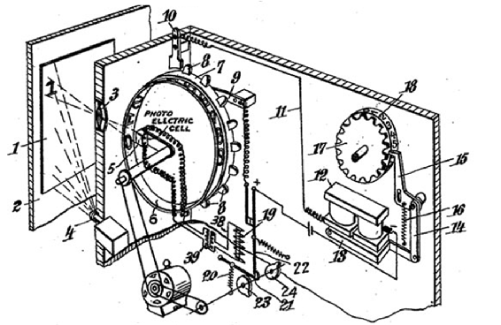
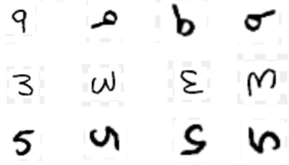
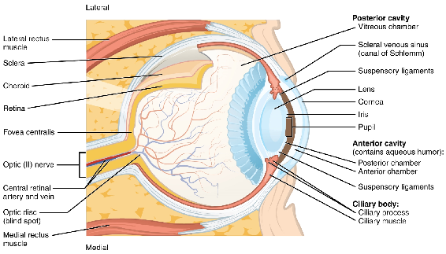
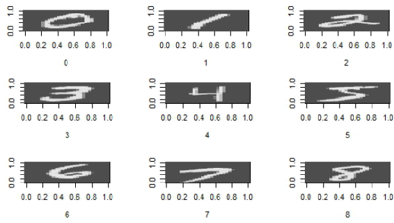
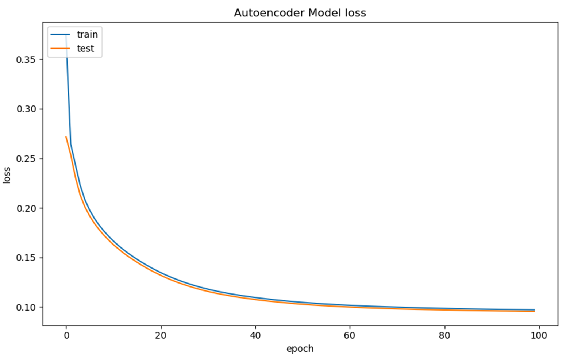
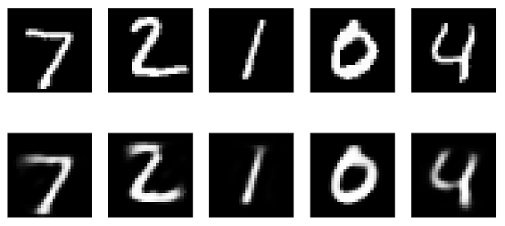

# 九、手写数字识别器

术语**手写识别** ( **HWR** )指的是计算机从纸质文档、照片和触摸屏等来源接收和解释可理解的手写输入的能力。可以用光学扫描(**光学字符识别** ( **OCR** ))或智能文字识别在一张纸上检测出书写的文字。或者，可以检测笔尖的移动，例如从计算机屏幕的表面，这是一个通常更容易的任务，因为有更多的线索可用。这些活动涉及广泛的实际应用，包括识别平板电脑上的在线拼写、识别邮政编码以帮助对发送的邮件进行分类，以及在金融交易中验证签名。

在本章中，您将学习用 Python 构建手写数字识别器。您将使用图像数据集，并使用它来构建图像识别模型。本章的目标是学习如何将强化学习概念应用于手写数字识别。到本章结束时，您将已经使用图像数据集在 Python 中构建了一个手写数字识别模型。

涵盖了以下主题:

*   图像识别概念
*   光学字符识别
*   自编码器
*   深度 Q 网络
*   手写数字识别

在本章结束时，读者将学习图像识别的基本概念，OCR 如何工作，如何实现手写数字识别的自编码器，以及如何使用自编码器和 Q-learning 来提高算法的性能。


# 手写数字识别

手写数字识别是近几十年来全世界研究者普遍面临的问题。这是一个很难实现的问题，因为现有的书写风格存在很大的差异。这个问题已经通过一种手写数字识别方法得到解决，该方法在没有任何人工交互的情况下识别并分类从 0 到 9 的手写数字。这样，计算机从一系列图像中智能地解释手写输入的能力得到了验证。

由于其巨大的实际应用和重要的财务影响，手写数字识别仍然是一个至关重要的部门。它涉及广泛的实际应用，包括识别平板电脑上的在线拼写、识别邮政编码以帮助对发送的邮件进行分类，以及在金融交易中验证签名。

书法的识别过程存在几个问题，例如手写图像具有各种尺寸，因此在系统进行识别之前必须进行归一化。因此，困难不仅仅来自于可以书写一个数字的许多不同的方法，还来自于所使用的应用所强加的不同要求。此外，在样本页边空白方面，人们书写的粗细程度不同，书写的位置也不同。众所周知，人们不同的写作风格取决于诸如年龄、资历、情态和背景等特征。由此可见，手写数字的识别是一项相对复杂的研究任务。事实上，即使是同一个人在不同时间写出来的数字也可能不一样。因此，开发一个能够识别无限多书写者的通用识别器几乎是不可能的。


# 光学字符识别

为了实现更简单的人机交互，我们一直对自动识别书写的问题特别敏感。特别是在最近几年，由于非常强烈的经济利益和日益强大的处理现代计算机数据的能力，这个问题已经有了有趣的发展和越来越有效的解决方案。特别是，一些国家，如日本，以及整个亚洲国家，在研究和财政资源方面进行了大量投资，制造了最先进的 OCR。

很容易理解这些国家对这一研究领域的兴趣。事实上，我们试图创造能够解释这些文化的表意文字特征的设备，以便在与机器的交互中更加舒适。由于目前没有输入设备，如键盘，可以代表成千上万的字符，我们试图通过数字化扫描直接从脚本中获取这些信息。然而，即使在西方，也非常重视对书写的光学识别的研究。有许多应用肯定受益于自动读数；例如，想一想预印模型的自动解释或信封上邮寄地址和代码的识别。

解决该问题的方法基本上有两种类型:基于模式匹配或基于模型比较的方法和基于结构分析的方法。通常，这两种技术结合使用，可以在识别和速度方面取得显著的效果。

在 OCR 上获得的第一批专利可以追溯到 20 世纪 30 年代，在德国由 Tausheck(1929-下图所示的阅读机器)注册，在美国由 Hendel (1933)注册。下图显示了一个 Tausheck 阅读器方案:



基本思路是一样的，非常简单。两者都使用基于掩模覆盖方法(模板/掩模匹配)的简单机器。所使用的设备，当然，反映了当时的技术，并基于光学机械的方法。穿过机械掩模的光被传感器捕获，然后被采集。基于两个元素的物理重叠，给定字符的识别与样本和原型之间或多或少的对应性相关联。事实上，如果光不能到达传感器，就有一个完美的重叠，从而识别字符。这种方法是基于形式重叠的欧几里得公理。

这种方法当然是有效的，但是在通用性方面有很大的差距。与原型相比，样本符号的微小变化可能对应于无法识别字符。如果样本角色比原型稍小或稍大，或者相对于原型稍有旋转，这种观察也适用。下图显示了数字在旋转过程中的变化情况:



这些简单的改变会导致识别错误。这种考虑表明，仅基于重叠的方法在识别方面不会产生好的结果，即使这种方法具有简单、直观并且在算法层面和机械层面都易于应用的巨大优势。因此，从一开始，人们就强烈地感觉到问题在于找到一种在样本和原型之间进行比较的方法，这种方法对于缩放和旋转是不变的。

另一个重要的考虑是样品和原型之间的比较。在基于重叠的方法中，比较两个符号的特征和形状，但这只是进行的一种方式。事实上，我们可以比较其他一些特性(特征)，这些特性也可以是从对符号进行的适当测量中提取的数值。例如，可以相对于正交笛卡尔轴或重心的质量或位置等来计算符号的惯性矩。相似的符号将具有相似的或以其他方式包含在某个邻近范围内的测量值。

如果要量化的特征将是 *n* ，我们可以将每个符号表示为一个 *n* 维超空间中的一个点。近年来，OCR 取得了相当大的进步，但是 Tausheck 和 Hendel 的机器的基本思想仍然有效。这种直觉是基于重叠形式的原理，并且赋予了被称为模板匹配方法的一系列方法以生命，这些方法与结构方法一起构成了书法识别软件的两股开发。


# 计算机视觉

计算机视觉是一组旨在从**二维**(**)图像开始创建真实世界(3D)的近似模型的过程。人工视觉的主要目的是再现人类的视觉。“看”不仅被理解为获取一个地区的 2D 照片，而且首先被理解为对该地区内容的解释。信息在这里被理解为暗示自动决策的东西。**

 **计算机视觉系统由光学、电子和机械组件的集成构成，允许我们获取、记录和处理可见光光谱内和可见光光谱外(红外、紫外、X 射线等)的图像。精心制作的结果是为了控制、分类、选择等各种目的而识别图像的某些特征。

人工视觉处理来自电子介质(例如，网络摄像机)的图像的获取、记录和处理，以便识别图像的某些特征，用于控制、分类和选择的各种目的。所有高度进化的生物几乎都会立即进行这些运算，而对于计算器来说，对输入数据进行返工和标准化是一个复杂的初步过程。由于这个原因，很难再造一个视觉计算机系统，它也有一小部分与人类的相似。

为了使建立在电子学基础上的计算机科学世界更接近建立在生物学和化学基础上的动物视觉世界，我们必须问自己，我们的眼睛是如何接收外界信息的。

如果我们发现自己在一个红色物体的前面，我们会立即感知到视觉感受，尽管这个物体和红色光束都没有到达我们的视觉神经。发生的情况是，物体反射了一定频率的光，在视网膜上引起了一系列的光化学变化，这些变化又被转化为适当的神经元脉冲，视神经将这些脉冲传输到大脑的视觉中心。从某种角度来看，神经冲动是代表红色物体的符号，我们的大脑可以对其进行解码，以更准确地表征外部世界。下图是眼睛的结构(来源:OpenStax College-Rice University):



抛开对动物视觉功能的深入研究，很容易看出生物视觉系统和为机器开发的视觉系统之间存在根本差异。首先，视网膜和大脑皮层中的神经细胞同时处理化学和电刺激，而硅树脂电路没有化学处理的可能性。其次，神经元之间的连接非常多，并且分布在三维空间中，而数字计算机的组件具有较少的连接，并且这些连接主要在二维空间中发展。

在处理视觉主题时，我们不能忽视其他基本方面，如算法问题(即找到完成视觉行为的正确步骤序列)和计算问题(即需要什么计算活动)。

如果硬件(生物的和电子的)不能执行，一个有效和优雅的算法是没有用的；另一方面，有可能构成特定视觉过程的算法——而且非常有效——不能在同一个硬件结构中共存。

视觉的这三个方面在模拟生物视觉的软件开发中引入了许多变量，这大大增加了执行甚至最简单的感知活动所必需的计算复杂性。** **

# 使用自编码器的手写数字识别

自编码器是一种神经网络，其目的是以小尺寸编码其输入。获得的结果将用于重建输入本身。自编码器由以下两个子网的联合组成:

*   编码器，计算 *z = ϕ(x)* 函数，给定一个 *x* 输入，编码器将其编码为一个 *z* 变量，也称为潜在变量。 *z* 变量的尺寸通常比 *x* 小得多。
*   解码器，计算 *x' = ψ(z)* 函数。

由于 *z* 是编码器产生的 *x* 的代码，解码器必须对其进行解码，使得*x’*类似于 *x* 。

自编码器的训练旨在最小化输入和结果之间的**均方误差** ( **MSE** )。

MSE 是输出和目标之间的均方差。较低的值表示较好的结果。零表示没有错误。

对于 *n* 个观测值，MSE 由以下公式给出:


最后，我们可以总结为，编码器以压缩的形式对输入进行编码，解码器从中返回输入的重构。

让我们定义以下术语:

*   *W* :输入—隐藏权重
*   *V* :隐藏—输出权重

先前的公式变成:


它们也变成了:


最后，自编码器的培训旨在最大限度地减少以下数量:


自编码器的目的不仅仅是对输入进行某种压缩或寻找同一函数的近似值。有一些技术允许从一个降维的隐藏层开始，指导模型给予某些数据属性更大的重要性，从而基于相同的数据产生不同的表示。

因此，自编码器是一种神经网络，其目的是将其输入编码成小尺寸，并且获得的结果能够重建输入本身。自编码器由以下两个子网的联合组成:编码器和解码器。向这些函数添加了另一个损失函数，该损失函数被计算为数据的压缩表示和解压缩表示之间的信息损失量之间的距离。编码器和解码器相对于距离函数是可微分的，因此可以使用随机梯度来优化编码/解码函数的参数，以最小化重建的损失。

以下示例代码使用 Keras 环境中的自编码器解决了手写数字识别问题:

```py
from keras.layers import Input, Dense
from keras.models import Model
from keras.datasets import mnist
import numpy as np
(x_train, _), (x_test, _) = mnist.load_data()
print (x_train.shape)
print (x_test.shape)
x_train = x_train.astype('float32') / 255
x_test = x_test.astype('float32') / 255
x_train = x_train.reshape((len(x_train), np.prod(x_train.shape[1:])))
x_test = x_test.reshape((len(x_test), np.prod(x_test.shape[1:])))
print (x_train.shape)
print (x_test.shape)

InputModel= Input(shape=(784,))
EncodedLayer = Dense(32, activation='relu')(InputModel)
DecodedLayer = Dense(784, activation='sigmoid')(EncodedLayer)
AutoencoderModel = Model(InputModel, DecodedLayer)
AutoencoderModel.compile(optimizer='adadelta', loss='binary_crossentropy')

history = AutoencoderModel.fit(x_train, x_train,
                epochs=100,
                batch_size=256,
                shuffle=True,
                validation_data=(x_test, x_test))

DecodedDigits = AutoencoderModel.predict(x_test)

import matplotlib.pyplot as plt

plt.plot(history.history['loss'])
plt.plot(history.history['val_loss'])
plt.title('Autoencoder Model loss')
plt.ylabel('loss')
plt.xlabel('epoch')
plt.legend(['train', 'test'], loc='upper left')
plt.show()
n=5
plt.figure(figsize=(20, 4))
for i in range(n):
    ax = plt.subplot(2, n, i + 1)
    plt.imshow(x_test[i].reshape(28, 28))
    plt.gray()
    ax.get_xaxis().set_visible(False)
    ax.get_yaxis().set_visible(False)
    ax = plt.subplot(2, n, i + 1 + n)
    plt.imshow(DecodedDigits[i].reshape(28, 28))
    plt.gray()
    ax.get_xaxis().set_visible(False)
    ax.get_yaxis().set_visible(False)
plt.show()
```

像往常一样，我们将逐行分析代码。


# 加载数据

这是一个手写数字的数据库，由 60，000 个 28 x 28 的 10 位数字的灰度图像以及 10，000 个图像的测试集组成。Keras 库中已有该数据集。下图显示了来自`mnist`数据集的 0-8 图像样本:



在代码的第一部分，我们导入稍后将使用的库:

```py
from keras.layers import Input, Dense
from keras.models import Model
```

这段代码导入了以下函数:

*   `Input`:用于实例化一个 Keras 张量。Keras 张量是来自底层后端(Theano、TensorFlow 或 CNTK)的张量对象。我们用某些属性来扩充它，使我们只需知道模型的输入和输出就可以构建一个 Keras 模型。

*   `Dense`:用于实例化一个规则密集连接的 *NN* 层。
*   `Model`:用于定义模型。模型是你可以总结、拟合、评估和预测的东西。Keras 提供了一个`Model`类，您可以使用它从您创建的层中创建一个模型。它只要求您指定输入和输出图层。

然后导入以下库:

```py
import numpy as np
import matplotlib.pyplot as plt
```

首先我们导入`numpy`库，因此我们导入`matplotlib.pyplot`，我们将使用它来绘制图形。要导入数据集，只需使用以下代码:

```py
from keras.datasets import mnist
(x_train, y_train), (x_test, y_test) = mnist.load_data()
```

返回以下元组:

*   `x_train, x_test`:具有`(num_samples, 28, 28)`形状的灰度图像数据的 uint8 阵列
*   `y_train, y_test`:具有`(num_samples)`形状的数字标签(0-9 范围内的整数)的 uint8 数组

现在我们必须将 0 到 1 之间的所有值标准化。MNIST 图像以像素格式存储，其中每个像素(总共 28 x 28)存储为 8 位整数，给出了从 0 到 255 的可能值范围。通常，0 表示黑色，255 表示白色。介于两者之间的值构成了不同的灰度。现在，要归一化 0 到 1 之间的所有值，只需将每个值除以 255。因此，包含值 255 的像素将变为 1，而包含 0 的像素将保持原样；介于两者之间的是所有其他的价值观:

```py
x_train = x_train.astype('float32') / 255
x_test = x_test.astype('float32') / 255
```

通过使用`astype()`函数，我们转换了`float32`中的输入数据(单精度浮点:符号位、8 位指数、23 位尾数)。正如我们所说，每个样本图像由一个 28 x 28 的矩阵组成。为了减少维数，我们将 28 x 28 的图像展平成大小为 784 的向量:

```py
x_train = x_train.reshape((len(x_train), np.prod(x_train.shape[1:])))
x_test = x_test.reshape((len(x_test), np.prod(x_test.shape[1:])))
```

函数给一个数组一个新的形状而不改变它的数据。新形状应该与原始形状兼容。新形状的第一维是从`len()`、`(len(x_train)`和`len(x_test))`函数返回的观察值的数量。第二维表示起始数据的最后两维的乘积(28 x 28 = 784)。为了更好地理解这种转换，我们首先打印起始数据集的形状，然后打印转换后数据集的形状:

```py
print (x_train.shape)
print (x_test.shape)
```

以下是数据集整形前后的结果:

```py
(60000, 28, 28)
(10000, 28, 28)
(60000, 784)
(10000, 784)
```


# 模型架构

现在我们将使用 Keras functional API 构建模型。正如我们之前看到的，首先我们必须定义输入:

```py
InputModel = Input(shape=(784,))
```

这将返回一个表示输入占位符的张量。稍后，我们将使用这个占位符来定义一个模型。此时，我们可以向模型的架构添加层:

```py
EncodedLayer = Dense(32, activation='relu')(InputModel)
```

`Dense`类用于定义一个完全连接的层。我们已经指定了层中神经元的数量作为第一个自变量(`32`)，使用`activation`自变量(`relu`)的`activation`函数，最后是层的输入张量(`InputModel`)。

记住，给定一个 *x* 输入，编码器将其编码成一个 *z* 变量，也称为潜变量。 *z* 变量的尺寸通常比 *x* 小得多；在我们的例子中，我们以 24.5 的压缩因子从`784`传递到`32`。

现在让我们添加解码层:

```py
DecodedLayer = Dense(784, activation='sigmoid')(EncodedLayer)
```

这一层是输入的有损重建。另一次，我们使用了带有`784`神经元的`Dense`类(输出空间的维度)、`sigmoid` `activation`函数和`EncodedLayer`输出作为输入。现在我们必须实例化一个模型，如下所示:

```py
AutoencoderModel = Model(InputModel, DecodedLayer)
```

该模型将包括在给定`InputModel`(输入)的情况下计算`DecodedLayer`(输出)所需的所有层。以下是`Model`类的一些有用属性:

*   `model.layers`:组成模型图的层的展平列表
*   `model.inputs`:输入张量列表
*   `model.outputs`:输出张量列表

因此，我们必须为训练配置模型。为此，我们将使用`compile`方法，如下所示:

```py
AutoencoderModel.compile(optimizer='adadelta', loss='binary_crossentropy')
```

此方法为训练配置模型。只使用了两个参数:

*   `optimizer`:字符串(优化器名称)或优化器实例。
*   `loss`:字符串(目标函数名称)或目标函数。如果模型有多个输出，您可以通过传递字典或损失列表，对每个输出使用不同的损失。模型将最小化的损失值将是所有单个损失的总和。

我们已经使用了`adadelta`优化器。该方法仅使用一阶信息，随时间动态适应，并且具有超越普通随机梯度下降的最小计算开销。该方法不需要手动调整学习率，并且对噪声梯度信息、不同的模型结构选择、各种数据模态和超参数的选择表现出鲁棒性。

此外，我们使用了`binary_crossentropy`作为`loss`函数。`loss`函数是计算上可行的函数，代表分类问题中预测不准确所付出的代价。

此时，我们可以训练模型:

```py
history = AutoencoderModel.fit(x_train, x_train,
                                batch_size=256,
                                epochs=100,
                                shuffle=True,
                                validation_data=(x_test, x_test))
```

`fit`方法为固定数量的`epochs`(数据集上的迭代)训练模型。这里解释了传递的参数，以便更好地理解它们的含义:

*   `x`:训练数据的 Numpy 数组(如果模型有单个输入)，或者 Numpy 数组的列表(如果模型有多个输入)。如果模型中的输入层已命名，您还可以传递一个将输入名称映射到 Numpy 数组的字典。如果从框架原生张量(例如 TensorFlow 数据张量)馈电，则`x`可以是`None`(默认)。
*   `y`:如果模型只有一个输出，则为目标(标签)数据的 Numpy 数组，如果模型有多个输出，则为 Numpy 数组的列表。如果模型中的输出层被命名，您还可以传递一个将输出名称映射到 Numpy 数组的字典。如果从框架原生张量(例如 TensorFlow 数据张量)馈电，则`y`可以是`None`(默认)。
*   `batch_size`:整数或者`None`。这是每次梯度更新的样本数。如果未指定，`batch_size`将默认为`32`。
*   `epochs`:整数。它是训练模型的历元数。一个历元是对所提供的全部`x`和`y`数据的迭代。请注意，结合`initial_epoch`，时期应理解为时期的最终数量。该模型不是针对由历元给定的迭代次数来训练的，而是仅仅训练到到达索引历元的历元为止。
*   `shuffle`:决定是否在每个历元或`str`(对于`batch`)之前混洗训练数据的布尔值。`batch`是处理 HDF5 数据局限性的特殊选项；它以批量大小的块进行洗牌。当`steps_per_epoch`不是`None`时，它不起作用。
*   `validation_data`:一个元组(`x_val`和`y_val`)或元组(`x_val`、`y_val`和`val_sample_weights`)，在每个时期结束时对其评估损失和任何模型度量。该模型不会根据此数据进行训练。`validation_data`将覆盖`validation_split`。

返回一个`History`对象。它的`history.history`属性记录了连续时期的训练损失值和度量值，以及验证损失值和验证度量值(如果适用)。

我们的模型现在已经准备好了，所以我们可以用它来自动重建手写数字。为此，我们将使用`predict()`方法:

```py
DecodedDigits = AutoencoderModel.predict(x_test)
```

该方法为输入样本生成输出预测(`x_test`)。运行这个示例，您应该会看到每个`100`时期的消息，打印每个时期的损失和精度，然后是对训练数据集上的训练模型的最终评估。如下图所示:


为了了解`loss`函数在时期内如何变化，在训练和验证数据集上创建一个`loss`在训练时期内的图会很有用。为此，我们将使用 Matplotlib 库，如下所示:

```py
plt.plot(history.history['loss'])
plt.plot(history.history['val_loss'])
plt.title('Autoencoder Model loss')
plt.ylabel('loss')
plt.xlabel('epoch')
plt.legend(['train', 'test'], loc='upper left')
plt.show()
```

下图显示了训练和验证数据集在训练时期的损失图:



我们的工作完成了；我们只需验证所获得的结果。我们可以将开始的手写数字和从我们的模型重建的数字打印到屏幕上。当然，我们将只对数据集中包含的 60，000 个数字中的一部分进行处理；事实上，我们将仅限于显示前五个。在这种情况下，我们还将使用 Matplotlib 库:

```py
n=5
plt.figure(figsize=(20, 4))
for i in range(n):
    ax = plt.subplot(2, n, i + 1)
    plt.imshow(x_test[i].reshape(28, 28))
    plt.gray()
    ax.get_xaxis().set_visible(False)
    ax.get_yaxis().set_visible(False)
    ax = plt.subplot(2, n, i + 1 + n)
    plt.imshow(DecodedDigits[i].reshape(28, 28))
    plt.gray()
    ax.get_xaxis().set_visible(False)
    ax.get_yaxis().set_visible(False)
plt.show()
```

结果如以下截图所示:



正如您在前面的截图中看到的，结果非常接近原始结果，这意味着该模型工作良好。


# 深度自编码器 Q 学习

正如我们在前面的章节中看到的，强化学习对高维输入数据的适应性不足。通过使用低维特征向量来表示高维输入，克服了这个问题。然而，寻找有用的特征向量可能是复杂的，因为它需要对问题有很好的理解。

改变数据维度的一种方法是自编码器。自编码器是具有隐藏层的人工神经网络，其具有输入数据的期望维度；输入和输出级别具有相同数量的单位。在这些模型中，网络被训练以在输出级别中再现输入值。正如我们在上一节中看到的，自编码器学习两个功能:编码器功能和解码器功能。

在强化学习过程中，可用的数据量不断增加。该数据可用于找到更好的低维表示。然而，每次收集新数据时重新应用新特征需要对所有数据训练新的自编码器，这通常需要很长时间。

在训练的每次迭代之后，评估重建误差，并且适当地修改隐藏单元的数量。如果误差非常大，则添加新特征。如果误差减小，则合并相似的特征以降低模型的复杂性。

以下代码片段显示了 Q-learning 算法的伪代码，如[第 1 章](fc93c240-db20-461c-914a-1b438abf288e.xhtml)、*Keras 强化学习概述*中所述:

```py
set parameters α,γ, ε
Initialize arbitrary action-value function
Repeat (for each episode)
   observe current state s
   choose a from s using policy from action-value function
   Repeat (for each step in episode)
      take action a
      observe r, s'
      update action-value function
      update s
```

正如前面代码中已经提到的，有必要使用低维特征向量来表示高维输入数据。学习该任务功能的一种方法是使用自编码器。然而，这需要收集足够的输入数据来找到有用的表示。一般来说，通过从大量输入数据中进行 Q 学习来训练代理的过程类似于下面的伪代码:

```py
collect initial input data
train autoencoder on available input data
set parameters α,γ, ε
Initialize arbitrary action-value function
Repeat (for each episode)
   observe current state H
   transform observation into low dimensional representation s
   choose a from s using policy from action-value function
   Repeat (for each step in episode)
      take action a
      observe r, s'
      update action-value function
      update s
```

这样，自编码器仅在最初给定的输入数据上被训练。然后初始化参数和动作值函数。然后插入 Q 学习循环，其中使用自编码器将观察到的当前状态转换成其低维特征的表示。使用这个特征向量，Q 学习照常执行。为了收集找到有用的特征向量所需的数据，我们需要在实际开始形成代理之前做大量的实验。


# 摘要

在本章中，您学习了如何解决手写数字识别问题。从 OCR 和计算机视觉概念的基础开始，我们学习了如何制作简单的图像。

然后，使用自编码器进行手写数字识别。自编码器是一种神经网络，其目的是将其输入编码成小尺寸，并且所获得的结果能够重建输入本身。自编码器的目的不仅仅是对输入进行某种压缩或寻找相同函数的近似；但是有一些技术允许我们指导模型(从一个降维的隐藏层开始)给予一些数据属性更大的重要性。因此，它们基于相同的数据产生不同的表示。

最后，加入了自编码器和强化学习的概念来提高模型的性能。**