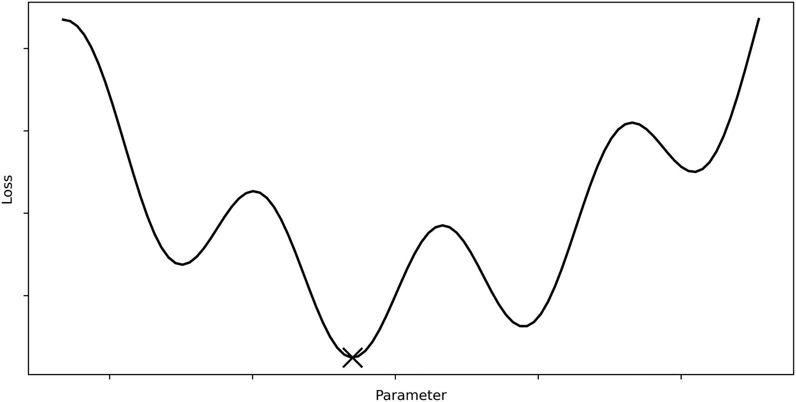
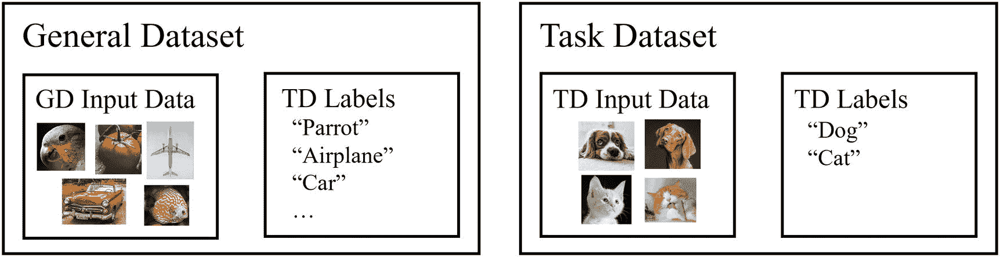
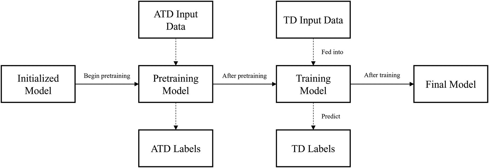
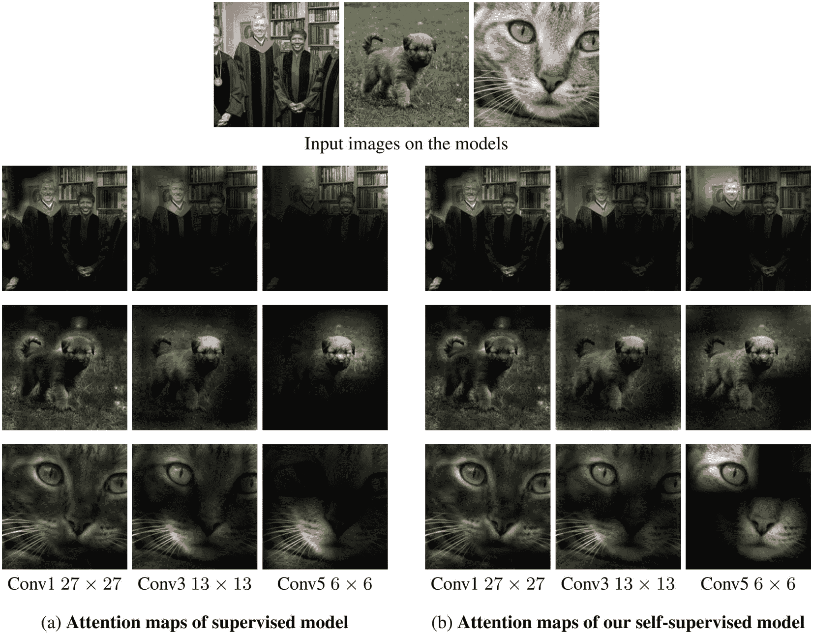

# 2.预训练策略与迁移学习

> 从任何能激发灵感或激发你想象力的地方偷窃……不要费心隐藏你的偷窃行为——如果你喜欢就庆祝吧。无论如何，记住让·吕克·戈达尔 T2 所说的:“重要的不是你把东西从哪里拿走，而是你把它们带到哪里。”
> 
> —吉姆·贾姆什，美国电影导演 <sup>[1](#Fn1)</sup>

为大多数现代数据集获得良好的深度神经网络是一项困难的任务。优化者需要遍历非常高维度、锯齿状的损失景观，并使用有限的工具集来区分好的和一般的解决方案。因此，你很少会看到现代深度学习设计解决相对研究充分的问题类型，在初始化后立即根据数据训练神经网络——直接从头开始训练，很难获得可行的好结果。

因此，深度学习设计中嵌入的分析创造力的一部分是需要将这项困难的任务——用深度神经网络建模复杂现象——转变为更容易接近和有效的过程。

在这一章中，我们将讨论预训练策略和迁移学习:本质上，创造性地从数据集和其他模型的权重中窃取知识来解决问题。

## 发展创造性的培训结构

一个模型的*训练结构*由它被训练的一般“流程”组成——它被训练的数据集、它被训练的实体的顺序、这些数据集是如何得到的，等等。这里，我们假设学习的标准监督模式，其中模型呈现为一个数据集，该数据集由输入数据(*x*—模型接受的内容)和标签(*y*—对应于模型应该输出的内容)组成(图 [2-1](#Fig1) )。模型的最终任务*是接收输入数据并输出正确的标签；这个数据集就是*任务数据集*。虽然我们可以在其他数据集上训练模型并执行其他任务，但执行这些辅助任务的目的是帮助模型成功完成最终任务。这种术语上的区别以后会证明是有帮助的。*


图 2-1

任务数据集结构

最简单的培训结构是第 [1](1.html) 章中讨论的初始化-培训-完成流程(图 [2-2](#Fig2) )。该模型在初始化后立即开始训练，输入数据并预测标签。在训练之后，我们选择一个最终的模型，它可以是完成训练之后的模型，或者类似于恢复最佳表现模型的权重(类似于 Keras 的回调)。


图 2-2

初始化和训练的简单训练结构

让我们看看如何改变这个简单的培训结构，以更容易地提高培训绩效。

### 预培训的力量

“pretraining”中的“pre”表示在数据集上正式训练模型之前*发生的过程(图 [2-3](#Fig3) )。*


图 2-3

预训练的训练结构表征

鉴于我们希望预训练有益于训练，预训练应该以一种使训练“更容易”的方式来定位模型有了预训练步骤，模型的性能应该比没有预训练时更好。如果预训练使模型性能变差，您应该重新评估您的预训练方法。

在预训练中，必须训练模型来执行不同于其基于输入数据预测标签的最终任务的任务。这个预训练任务理想地呈现了最终任务的重要“上下文”和技能，使得模型可以在最终任务上获得更好的性能。

在讨论具体的预训练方法之前，我们需要对模糊的术语“更容易”和“更好的性能”的含义有一个直观的理解；这将使我们更好地理解如何使用和设计预训练策略。人们经常讨论预训练的两个主要优点:

*   *时间*:预训练可以减少神经网络收敛到某个解所需的时间。

*   *更好的指标得分*:模型获得的指标得分比没有预训练时高/低(取决于指标)。例如，它获得较低的交叉熵分数或较高的准确度。

虽然这是预训练的两个主要属性，但它们是一个潜在现象的结果:从概念上讲，预训练的过程使优化器“更接近”损失情况下的真实解决方案。

考虑下面的损失情况:神经网络优化器的目标是找到一组参数，使得相应的损失最小化。这种景观有几个在大多数现代损失景观中常见的特征:它有几个局部最小值，但只有一个全局最小值和倾斜的锯齿状波动(图 [2-4](#Fig4) )。



图 2-4

标记了全局最小值的样本损失图

没有预训练的模型可以初始化并遵循以下路径。因为它遇到的第一个极小值或多或少是浅的，比方说优化算法克服它并发现下一个极小值。由于这个最小值位于一个更深的坑中，并且优化器已经行进了很长一段距离，它将很可能判断这是全局最优值，并在该位置收敛(图 [2-5](#Fig5) )。


图 2-5

没有预训练的优化器移动示例

然而，通过预训练，我们能够使模型“更接近”损失景观的真正全局最小值，从而使其更快地收敛到更优的解决方案，因为它已经从“接近”全局最优的地方开始。相应地，我们可以使用风险较小或行为不稳定的优化器，因为它从一个方便的位置开始(图 [2-6](#Fig6) )。

请记住，预训练并不一定会使模型在距离的字面意义上“更接近”最佳值，而是使模型比没有经过预训练时更方便或“更容易”找到最佳值。非常接近全局最优但具有几个非常深的局部最小值和非常高的局部最大值的优化器将比更远但其路径更平滑且更容易下降的优化器更难达到全局最优。“更接近”的确切含义取决于损失情况的形状、优化器的行为以及许多其他因素。然而，为了简单起见，从“导航到全局最优有多容易”的角度考虑“更接近”就足够了。


图 2-6

带预训练的优化器移动示例

注意，预训练任务的实际损失情况不同于最终任务的损失情况(如图 [2-6](#Fig6) 所示)。这并不是说预训练在最终任务的损失范围内运作，并将模型移动到一个方便的位置——这只是在任务数据集上进行训练，而不是预训练。

相反，在预训练中，我们依赖于预训练任务和模型旨在执行的最终任务的损失情况之间的相似性。因此，在预训练任务中成功的模型应该在最终任务的损失景观中处于通常成功的位置，从该位置它可以进一步改进。这也意味着，如果您认为预训练数据集和任务数据集的损失情况非常“不同”，则预训练可能没有帮助由于技术原因，这两者通常无法进行定量比较，因此您需要决定在特定环境中进行预训练的必要性和性能提升。

这种可视化的描述更像是一种概念性的方法，可以帮助你理解预训练的目的，从而帮助你设计和使用预训练策略。当然，它并不完全代表现代神经网络优化器运行的高维空间，或者迁移学习损失景观形状和操纵的技术。例如，如图 [2-6](#Fig6) 所示，预训练不太可能使模型达到优化器不会遇到局部最小值的程度。尽管如此，我们可以使用这个概念框架来证明和解释预训练的两个关键优势——速度和更好的度量分数。

*   *速度*:预训练使模型“更接近”优化器“满意”(可以收敛)的解决方案，因为它已经完成了大部分工作。此外，大多数现代优化策略都包括递减的学习速率。未受益于预训练的神经网络需要行进更多距离(可能是距离，可能是克服像局部最小值或最大值这样的障碍)才能接近真实解。到那时，可以预计它的学习率已经显著衰减，它可能无法走出局部极小值。另一方面，如果预训练模型已经开始接近真实解，其学习速率开始“新鲜”且不延迟；它可以快速克服位于它和真实解之间的局部最小值。

*   *更好的度量分数*:预训练减少了模型和真实解决方案之间的障碍数量。因此，该模型更有可能收敛到真实解。此外，如前所述，优化器的学习率比没有预训练的优化器更“新鲜”地接近真实解，因此更不容易受到可能欺骗没有预训练的优化器的小障碍的影响。

接下来，我们将在这个概念模型的基础上讨论两种预训练方法背后的直觉:迁移学习和自我监督学习。

### 迁移学习直觉

迁移学习的前提是，从解决一个问题中获得的知识可以用来解决另一个问题。通常，从更一般的问题中获得的知识用于帮助模型解决更具体的问题。

考虑两个数据集:一个通用数据集和一个任务数据集。通用数据集用于预训练，而模型的最终目的是在任务数据集上表现良好(图 [2-7](#Fig7) )。


图 2-7

常规数据集和任务数据集的可视化表示。GD =通用数据集，TD =任务数据集

在迁移学习中，首先在通用数据集上训练初始化的模型，以提供在任务数据集上成功所需的上下文和技能。在通用数据集上对模型进行预训练后，再在任务数据集上对其进行训练。该培训结构如图 [2-8](#Fig8) 所示。因为从预训练结束到预训练开始都保留了权重，所以该模型已经获得了用于预训练的重要技能和表示，当在通用数据集上训练时可以使用这些技能和表示。


图 2-8

迁移学习的训练结构视觉表征

通常，迁移学习的预培训部分不是在内部(由你自己)完成的。选择一个合适的通用数据集并概念化、实现和训练一个模型以在该通用数据集上很好地执行是大量的工作，但这不是必需的。大多数深度学习框架(图 [2-9](#Fig9) )中都有一个预训练模型库，如 Keras/TensorFlow 和 PyTorch，以及其他来源，如 pypi 库、在线代码论坛和托管网站。这些预训练模型中的每一个都是在一些通用数据集上训练的，可供您使用。


图 2-9

模型库中的预训练模型。GD =通用数据集。GD1、GD2、…、GDX 表示几个不同的通用数据集，在这些数据集上相应地训练了几个预训练模型。注意，在实践中，一般数据集和预训练模型之间的关系是一对多的(具有不同架构的许多预训练模型在相同的一般数据集上被训练)

然后，您可以选择一个已经预训练的模型，并开始在您的特定任务数据集上训练它们(图 [2-10](#Fig10) )。


图 2-10

使用来自预训练模型库的模型来直接开始对任务数据集的训练

这组预训练模型可以使用的问题的数量远远超过存储库中预训练模型的数量。不过，这很好，因为我们可以预期每个预训练的模型都能够应用于广泛的问题类型，因为每个模型都被预期拥有某种形式的“一般知识”

例如，假设我们想要训练一个模型来对狗和猫的图像进行分类(图 [2-11](#Fig11) )。我们决定使用迁移学习，并选择各种现实生活中的物品和物体的通用数据集，如鹦鹉、飞机、汽车、西红柿、鱼等。出于这个例子的目的，假设狗和猫的图像不存在于一般的数据集中。



图 2-11

示例任务数据集和通用数据集

一般数据集和任务数据集之间似乎没有什么联系。但是，如果我们远离人类本能的基于话题的思维——“这是车，那是狗；它们属于不同的类别(即交通工具和动物)”——我们可以看到许多相似之处。

*   *有很多边*:边定义了飞机、汽车、鱼的形状；同样，它们在定义狗或猫的头部形状时也很重要。

*   *光线很重要*:由于两个数据集都是三维物体的二维表示，光线很重要，因为它有助于确定物体的形状和轮廓。

*   纹理很重要:现实生活中的物体通常有相似的形状，但却因其表面的纹理而不同。同样，这似乎对区分狗和猫的图像很重要。

在通用数据集上成功的模型必须已经适应并考虑了通用数据集的这些特征。在某种意义上，它“理解”如何“解释”边缘、光的动态、纹理和其他重要的品质。之后需要做的就是将学到的技能和表达方式应用到一个相似但更具体的任务中。

您可能会问，“为什么不直接处理任务数据集呢？当模型可以为任务数据集更具体和直接地开发这些技能时，为什么要开发这些辅助技能？”事实上，在某些情况下，迁移学习并不是一个合适的选择。然而，在大多数足够困难的任务中，通过迁移学习进行预训练有助于建立学习的基础，这对于模型本身来说是很难建立的。

想象一下，你正在通过重复的例子教一个小孩如何将两位数相加。你有两种可能的教学策略:

*   通过反复给孩子看例子(如 23+49=72)，直接教孩子加两位数。

*   首先，通过反复向孩子展示例子(如 3+9=12，2+6=8)，教孩子如何添加一位数。然后，通过反复给孩子看例子(如 23+49=72)，教孩子做两位数的加法。

后者更有可能是一个成功的策略，因为从对加法一无所知到加一位数到加两位数的平均跳跃长度比从对加法一无所知到加两位数的平均跳跃长度要小得多。迁移学习应该通过同样的直觉来操作，即把一个一般的任务教给模型，这样一个更具体的、最终的任务就变得更容易完成。

### 自我监督学习直觉

自我监督学习遵循预训练的逻辑——在任务数据集上训练模型之前，执行某种预训练任务，以使其更好地获得在最终任务中表现良好所需的表示和技能。

自我监督学习和迁移学习之间的区别在于，在迁移学习中，预训练数据集不同于任务数据集，而在自我监督学习中，预训练数据集是从任务数据集的输入数据构建的。因此，虽然您需要两个数据集来构建完整的迁移学习培训结构，但在技术上只需要一个数据集来构建完整的自我监督学习培训结构(图 [2-12](#Fig12) )。

Note

这里，我们使用一个独特的定义来定义“不同的”数据集。如果数据集 A 可以完全从数据集 B 中导出(例如，通过翻转图像或改变图像颜色)，出于这个概念的目的，这两个数据集没有不同，即使在技术层面上，一个数据集中有在另一个数据集中找不到的训练实例。另一方面，如果数据集 A 不能完全从数据集 B 派生(例如，从 CelebA 派生 ImageNet)，那么这两个数据集是不同的。这里构成“差异”的主要焦点是数据集的信息内容，而不是单个特定的训练实例。这使我们能够区分迁移学习和自我监督学习。


图 2-12

自我监督学习数据集。ATD =改变的任务数据集

需要注意的是，修改后的任务数据集通常仅来自任务数据集的输入数据。例如，如果模型的任务是识别图像是狗还是猫，则改变的任务数据集只能建立在图像(任务数据集的输入数据)上，而不是标签(任务数据集的标签)上。

设计改变的任务数据集是成功的深度学习解决方案中蕴含的创造力的迷人展示。有许多根据任务数据集构造标注以形成变更后的任务数据集的方法示例:

*   在一些数据中添加噪声，而在其他数据中不添加噪声。训练模型以对添加了噪声的数据实例进行分类(这是一个二元分类问题:噪声/无噪声)。这可以帮助模型更好地分离噪声和数据，使其能够开发数据关键特征的底层表示。

*   向数据集中的所有实例添加不同程度的噪声。训练模型对噪声的程度进行分类(这是一个回归问题)。例如，如果改变高斯噪声的标准偏差，模型将预测标准偏差。这不仅有助于模型检测是否存在噪声，而且有助于检测噪声的存在程度。虽然这是一个更困难的预训练任务，但鼓励模型开发关键特征和数据结构的复杂表示。

*   假设有一个彩色图像数据集，颜色对于模型的最终任务很重要。将图像转换为灰度，并训练模型从相应的灰度图像构建彩色图像(这是一个图像到图像的任务)。在这种情况下，改变的任务数据集输入数据是灰度图像，而标签是彩色图像。通过这种自我监督的预训练练习，模型获得了对某些对象应该是什么颜色的理解。

*   假设有一个模型需要执行文本分类的 NLP(自然语言处理)任务。获取文本样本(任务数据集的输入数据)并随机隐藏其中一个单词。训练模型来预测隐藏的单词是什么。例如，当给定“正在下雨和狗”时，该模型将预测“猫”这使得模型能够双向理解单词之间的相互关系——它需要利用隐藏单词前后的信息。这种自我监督学习的方法通常用于现代 NLP 架构中。

在上述每个示例中，都不需要任务数据集的标签——仅任务数据集的输入数据或 *x* 用于构建这些监督数据集。作为深度学习工程师，您可以对任务数据集输入数据进行一些更改，并根据该更改构造标签。

一旦改变的任务数据集从任务数据集的输入数据中导出，它可以用于预训练训练结构(图 [2-13](#Fig13) )。



图 2-13

自我监督学习训练结构

请注意，在自我监督学习(以及一般的预训练)中，获得高性能指标并不是最终目标。事实上，如果一个模型在预训练任务中表现得太好，可能是预训练任务太容易了，因此不支持有价值的技能的增长和正式训练的数据表示。另一方面，如果模型表现很差，预训练任务可能太困难。

应该注意的是，自监督学习在技术上是无监督学习，因为我们是在没有任何标签知识的情况下从输入数据中提取洞察。然而，自监督学习是一个更常用和更合适的术语:这种操作无疑具有监督的特征，这使其与传统的无监督机器学习算法(如 K-means)相区别，因为虽然数据生成(构建改变的任务数据集)在技术上是无监督的，但学习过程(梯度更新等)是无监督的。)被监督。

自我监督学习也很有价值，因为它允许我们在不需要标签的情况下捕捉有价值的信息。Datamation 估计，非结构化数据的数量每年以 55%到 65%的速度增长， <sup>[2](#Fn2)</sup> 国际数据公司预计，到 2025 年，80%的数据将是非结构化的。 <sup>[3](#Fn3)</sup> 非结构化数据被定义为不容易适合标准数据库模型的数据。因此，非结构化数据的一个辅助特征是，很少有相应的标签来训练大规模深度学习模型。然而，自我监督学习的逻辑允许我们在没有标签的非结构化数据中找到隐藏的结构，并利用这些知识来解决监督问题。

出于这个原因，自我监督学习对于在小数据集上进行训练尤其有价值，在小数据集上几乎没有标签。通过自我监督学习进行预训练可以使模型获得重要的洞察力，这可能是仅用传统训练结构无法获得的。

与迁移学习不同，没有自我监督预训练模型的存储库，因为在自我监督学习中，预训练任务必须基于任务数据集来设计。然而，如果你很好地掌握了编程和数据流，为自我监督学习修改任务数据集通常并不困难(见第 [1](1.html) 章)。

Yann LeCun 在 2020 年 AAAI(人工智能促进协会)会议上提供了一个关于人类和动物如何学习的自我监督学习的模拟:

> 自我监督学习……基本上就是学习填空。基本上就是在学习一个任务之前先学习代表世界的想法。这是婴儿和动物的行为。我们在世界上跑来跑去，在我们学习任何任务之前，我们知道它是如何工作的。一旦我们对世界有了很好的描述，学习一项任务就需要很少的试验和样本。
> 
> ——Yann le Cun，脸书首席人工智能科学家，在 AAAI 20 <sup>[4](#Fn4)</sup> 演讲

迁移学习和自我监督学习都属于预训练的一般策略，并且相似之处在于模型在任务数据集上训练之前参与一些监督任务。然而，这两种预训练方法不仅在技术上(即，如前所述的“不同”数据集与“相同”数据集)不同，而且在结果和开发的知识方面也不同。

*   迁移学习倾向于发展“预测*技能*”也就是说，迁移学习的权重来自一般数据集，一般数据集通常来自与任务数据集显著不同的上下文(主题/内容方面)。迁移学习的大部分价值在于它开发的预测技能——学习如何识别边缘、寻找纹理、处理颜色等。而不是数据集的内容或主题的实际知识。

*   自我监督学习倾向于发展“代表世界的知识”它构建了“世界”或上下文的基本表示，模型需要理解这些表示才能在任务数据集上很好地执行。预测——比如——噪声是否被添加到训练实例中的实际技能可能用处不大，但获得这一技能的过程需要理解数据“世界”。自我监督学习允许模型对构建基本表示和“感受”数据集的内容和主题有所了解。

当然，这并不是说迁移学习不能发展代表世界的知识，或者自我监督学习不能发展重要的技能。相反，这些是迁移学习和自我监督学习的根本“精神”或“特征”,可以用来指导直觉以及从这两种方法中可以期待什么。

你可能会注意到，我们一直在通过相对流动和艺术的描述词和想法探索这些概念——“提取洞察力”、“发展表现”、“世界表现”。虽然教科书可能试图用方程和数学关系来阐述这些想法，但事实是，即使是最现代的深度学习知识也无法完全解释和理解神经网络行为的深度。对神经网络如何运作和“学习”有一个直观的理解——即使它在数学上并不严格——对于成功和高效的设计是有价值的。

接下来，我们将探索预训练中的实际概念，以理解如何操纵神经网络架构来实现迁移学习和自我监督学习。

## 迁移学习实践理论

之前，我们讨论了概念框架，以获得对迁移学习是什么、它做什么以及它如何操作的直观理解。然而，由于在实施迁移学习时有许多“隐藏”的考虑因素，在这一节中，我们将探索理论的更实际的方面——帮助您实施迁移学习的概念和想法。

本节的目的不是提供具体的代码或讨论示例(这将留到下一节)，而是介绍实现预训练的重要概念，如预训练模型的结构以及预训练模型在 Keras 中的组织方式。

### 迁移学习模型和模型结构

需要了解几个重要的预训练模型和数据集。在本节中，我们将主要探索基于图像的模型，尽管您可以将大部分逻辑应用于其他上下文。基于图像的预训练模型通常遵循标准结构，由两个关键步骤组成:特征提取和特征解释(图 [2-14](#Fig14) )。


图 2-14

基于图像的预训练模型的概念组件

特征提取的目的是将信息组合成有意义的观察结果，如识别和放大(或缩小)某些边缘、形状或颜色模式的存在。经过良好调整的特征提取组件能够识别和放大与问题相关的特征。例如，如果问题是对各种形状的灰度图像进行分类，那么特征提取组件必须高度能够检测和放大边缘的形状。

特征解释解释编译提取的特征，以对图像做出最终判断。它接收有关图像特征的提取信息，并可以对图像的各个区域进行比较和其他复杂的分析。良好调整的特征解释组件能够有效地聚集和理解与目标输出相关的提取特征。

在实际中，“特征提取”和“特征解释”的角色是由卷积和全连通的组件来扮演的(图 [2-15](#Fig15) )。卷积组件通常由卷积、池和其他基于图像的特征提取层等层组成。全连接组件通常由全连接或致密(在 Keras 术语中)层组成。


图 2-15

基于图像的预训练模型的实际组成部分

1.  原始输入被传递到卷积组件进行特征提取。

2.  预训练模型的卷积组件接收原始输入，并执行卷积、池化和其他图像处理层，以从图像中提取特征。然后，它将提取的特征传递给展平组件。

3.  由于卷积组件执行接收和输出图像形式的数据的操作，展平组件接收二维数据(空间上，不计算颜色深度)。拼合将二维提取要素转换为一维数据，以便完全连接的图层可以对要素进行操作。

4.  完全连接的组件，也称为神经网络的“顶部”或“头部”，接收包含来自提取的特征的信息的一维扁平数据。在通过一系列完全连接的层(和其他相应的层，如激活、丢失等)解释提取的特征之后。)，全连接层输出神经网络的输出。

我们将在后面的章节中更深入地讨论某些架构，但是这里我们将对重要的模型做一个快速的概述。

在 Keras 中，预训练的模型被安排到模块中，从这些模块中可以在`keras.applications.module_name`中找到该模型和相关函数。例如，如果您想找到预训练模型和与 InceptionV3 模型相关的处理函数，您可以在`keras.applications.inception_v3`中找到它。除了预训练的模型对象之外，这些模块通常包含应用于数据或模型输出的处理函数。我们将很快看到这些处理函数如何与模型相关联地工作。

#### imagenes 数据集

ImageNet 是图像识别中最重要的数据集之一。费-李非教授从 2007 年初开始在普林斯顿大学研究 ImageNet。在图像领域的神经网络应用的整个发展过程中，ImageNet 一直是一个核心数据集，在此基础上构思、测试和重新发明了新的方法和设计。

ImageNet 数据集在结构上是根据 WordNet 层次结构组织的，其中对象按照彼此的层次关系排列(图 [2-16](#Fig16) )。


图 2-16

WordNet 层级组织的假设示例分支

ImageNet 中的每个“有意义的概念”都被称为“同义词集”或“同义词集”每个“同素集”可以用多个词或一系列词来描述。ImageNet 包含超过 100，000 个同义词集；每个 synset 平均包含 1000 个图像。在 22，000 个对象中，ImageNet 包含超过 1，400 万张图像。

> ImageNet 项目受到计算机视觉研究中两个重要需求的启发。首先是需要在计算机视觉中建立一个清晰的北极星问题…其次，迫切需要更多的数据来实现更通用的机器学习方法。自从数字时代的诞生和网络规模数据交换的可用性以来，这些领域的研究人员一直在努力设计越来越复杂的算法来索引、检索、组织和注释多媒体数据。但是好的研究需要好的资源……这两个理性的结合促使我们建立了 ImageNet。
> 
> —ImageNet 研究团队 <sup>[5](#Fn5)</sup>

ImageNet 大规模视觉识别挑战从 2010 年持续到 2017 年，有助于图像处理深度学习工作的发展。因此，Keras/TensorFlow 和其他深度学习框架中可用的许多预训练模型都是在 ImageNet 数据集上预训练的。在 ImageNet 数据集上预先训练的模型已经发展了识别三维空间和对象的图像的边缘、纹理和其他属性的技能。

#### 瑞斯网

ResNet 架构或残差神经网络于 2015 年推出。ResNet 在 2015 年 ImageNet 挑战赛中获得第一名，在测试数据集上获得了 3.57%的错误率。ResNet 使用剩余连接或跳过连接，即跳过至少一个中间层的层之间的连接。我们将在后面的章节中探讨神经网络架构中的这些设计和策略。

Keras/TensorFlow 提供了几种不同版本的 ResNet 体系结构:ResNet50、ResNet101、ResNet152、ResNet50V2、ResNet101V2 和 ResNet152V2。“ResNet”后面的数字(如“ResNet50”中的“50”)表示其中的层数。因此，ResNet152V2 的层数比 ResNet101V2 多。

ResNet 也有两个版本，有两个(非常普遍的)主要区别:

*   ResNetV1 比 ResNetV2 增加了更多的非线性。因此，V2 体系结构为整个网络中的数据流提供了更直接、更清晰的路径。

*   ResNetV1 在批量标准化之前通过卷积层和激活层传递数据，而 ResNetV2 在卷积层之前通过批量标准化和激活层传递数据(反向)。

您可以在`keras.applications`内的相应模块中找到 Keras ResNet 模型架构:

*   ResNet50： `keras.applications.resnet50.ResNet50()`

*   ResNet101： `keras.applications.resnet.ResNet101()`

*   ResNet152： `keras.applications.resnet50.ResNet152()`

*   ResNet50V2： `keras.applications.resnet_v2.ResNet50V2()`

*   ResNet101V2： `keras.applications.resnet_v2.ResNet101V2()`

*   ResNet152V2： `keras.applications.resnet_v2.ResNet152V2()`

我们将在后面探讨如何使用给定模型对象的架构。

#### 不规则 3

2015 InceptionV3 模型是来自 Inception 模型家族的流行模型，使用基于模块/单元的结构，其中某些层集合是重复的。通过减少必要的参数数量并限制需要消耗的存储器和资源，初始网络在计算上更加高效。InceptionV3 的设计主要关注最小化计算成本，而 ResNet 则关注最大化精度。

你可以在`keras.applications.inception_v3.InceptionV3()`找到 InceptionV3 模型架构。

受 ResNet 高性能的启发，Inception-ResNet 架构通过合并残差来使用混合模块。相应地，Inception-ResNet 通常具有低计算成本和高性能。

你可以在`keras.applications.inception_resnet_v2.InceptionVResNet2()`找到 Inception-ResNetV2 架构。

有关剩余连接、基于单元的结构和 InceptionV3 架构的更多具体技术讨论，请参见第 [6](6.html) 章。

#### MobileNet(移动网络)

2017 款 MobileNet 旨在在手机深度学习应用程序上表现良好。移动网络使用深度方向可分离的卷积，这些卷积不仅适用于空间，也适用于深度方向。MobileNet 的参数比 Inception 多，但比 ResNet 少；相应地，通常观察到 MobileNet 的性能比 ResNet 差，但比 Inception 好。

Note

当我们比较模型时(例如，“MobileNet 与 ResNet”)，请记住，我们指的是整个体系结构系列。大多数模型都有不同版本和深度的架构。当比较模型系列时，我们指的是可比较版本和层的架构。

Keras/TensorFlow 提供了 MobileNet、MobileNetV1、MobileNetV2、MobileNetV3Small 和 MobileNetV3Large 四个版本。与 MobileNetV1 一样，MobileNetV2 使用深度方向可分离的卷积，但也引入了线性瓶颈和瓶颈之间的快捷连接。MobileNetV2 可以有效地提取用于对象检测和分割的特征，并且通常在实现与 MobileNetV1 相同的性能方面执行得更快。MobileNetV3Small 和 MobileNetV3Large 是专为低资源和高资源消耗场景设计的 MobileNet 架构，源自神经架构搜索算法(我们将在后面的章节中讨论神经架构搜索和其他方法)。

您可以在`keras.applications`内的相应模块中找到 Keras ResNet 模型架构:

*   MobileNetV1: `keras.applications.mobilenet.MobileNet()`

*   MobileNetV2: `keras.applications.mobilenet_v2.MobileNetV2()`

*   MobileNetV3Small: `keras.applications.MobileNetV3Small()`

*   MobileNetV3Large: `keras.applications.MobileNetV3Large()`

#### 效率网

深度卷积神经网络不断变大，试图变得更强大。然而，这种放大究竟是如何进行的却各不相同。一些方法通过增加网络处理的图像中的像素数来增加图像的分辨率。其他人通过增加更多层来增加网络的深度，或者通过增加每层中节点的数量来增加网络的宽度。

2019 EfficientNet 系列模型是一种通过复合缩放来放大神经网络的新方法，其中网络的分辨率、深度和宽度是同等缩放的。通过在名为 EfficientNetB0 的小型基础模型上使用这种扩展方法，随着扩展幅度的增加，产生了七种复合扩展架构，分别命名为 EfficientNetB1、EfficientNetB2、…、EfficientNetB7。EfficientNet 系列模型在计算和时间上都是强大而高效的。复合缩放允许 EfficientNet 在 ImageNet 数据集上提高 MobileNet 和 ResNet 等模型的性能。

您可以在`keras.applications`中的相应模块中找到 EfficientNet 模型架构的 Keras 实现:

*   效率网络 0: `keras.applications.efficientnet.EfficientNetB0()`

*   效率网络 1: `keras.applications.efficientnet.EfficientNetB1()`

*   效率网络 2: `keras.applications.efficientnet.EfficientNetB2()`

    …

*   效率网 B6: `keras.applications.efficientnet.EfficientNetB6()`

*   效率网络 7: `keras.applications.efficientnet.EfficientNetB7()`

在第 [6](6.html) 章的案例研究中找到关于 EfficientNet 的更具体的技术性讨论。

#### 其他型号

Keras/TensorFlow 在`keras.applications`中提供了许多其他预训练模型。要查看它们，请参考 TensorFlow 文档，该文档不仅提供了有关用法、参数和方法的信息，还包括每个预训练模型对应论文的链接: [`www.tensorflow.org/api_docs/python/tf/keras/applications`](http://www.tensorflow.org/api_docs/python/tf/keras/applications) 。在本章的后面，我们还将介绍如何将 PyTorch 模型转换为 Keras/TensorFlow 模型，以利用 PyTorch 的预训练模型库。

### 改变预训练模型架构

为了改变预训练的模型架构，通常只传输预训练模型的卷积分量。回想一下，迁移学习主要是将从一个通用数据集中学到的技能转移到一个特定的任务数据集中应用。由于任务数据集不同于一般数据集，虽然在任务数据集上操作的模型仍将受益于通过迁移学习转移的特征提取技能，但它需要开发自己的解释。

作为一个概念上的类比，假设你是一名艺术专业的学生，接受过分析印象派时代作品的训练——莫奈、雷诺阿、马蒂斯等的艺术。如果现在你要接近毕加索和波洛克这样的当代作品，你会想

*   *…保留特征提取技能*:你作为一名艺术学生所学到的基本特征提取能力，对于开发和组织有意义的、敏锐的、可用于解释的观察非常重要。如果不理解如何看待和拿走对艺术的观察(没有真正解释它们)，就没有观察可以作为解释的基础。

*   *…但是发展一套新的解释*:既然你已经保持了你的特征提取技能，并且已经发展了一套观察(提取的特征)，那么在大多数情况下，通过印象派解释来分析当代作品是没有意义的。相反，这些新数据需要一套适合当代艺术背景的新解释。

因此，虽然提取特征的技能是有价值的，并且可以几乎普遍地转移到大多数一般相似的问题上，但通常对所述特征的解释差异很大，以至于最成功的策略是构建一个定制的完全连接的组件，而不是转移它(图 [2-17](#Fig17) )。


图 2-17

将重量从预训练模型转移到定制模型的过程。PM =预训练模型，CM =定制模型。“已更新”表示相应的组件正在接受再培训/更新

然而，在某些情况下，问题集可能非常相似，因此全连接层权重也可能被转移(图 [2-18](#Fig18) )。该方法不需要对预训练模型进行架构操作，因为来自预训练模型的所有权重都被转移。要使用这种方法，只需实例化预训练模型，并在任务数据集上对其进行训练，无需任何架构操作。


图 2-18

将权重从预训练模型转移到自定义模型的替代过程，其中预训练模型的卷积和 FC 分量都被转移

另一种方法是保留预训练模型的完全连接组件，然后添加更多自定义层(图 [2-19](#Fig19) )。回想一下艺术学生的类比:你从你接受训练的印象派风格的解释角度出发，但是另外发展你的解释的新的解释*来解释新的问题类型。然而，这种方法通常比仅在卷积分量中转移权重更少使用，因为为了有效，神经网络必须显著加深(增加更多层)，这可能造成更新权重、时间和模型性能的问题。不过，在某些情况下，这可能是最佳策略。*


图 2-19

将权重从预训练模型转移到定制模型的替代过程，其中预训练模型的卷积和 FC 分量都被转移，并且新的全连接层被添加到定制模型

虽然我们将只通过例子来探索第一种方法，但所有方法都可以通过第 [1](1.html) 章中介绍的工具来实现，比如函数式 API。模型可以像功能层一样处理，表示为输入的功能。参见第 3 章[对神经网络架构操作的更复杂的探索。](3.html)

### 神经网络“顶级”包容性

所有 Keras/TensorFlow 预训练模型都有一个重要参数，名为`include_top`，它允许我们轻松实现第一种方法，即改变预训练模型架构以进行训练。

回想一下，基于图像的神经网络架构的全连接组件通常被称为其“顶部”因此，如果`include_top`参数设置为`True`，则完全连接的组件将保留在实例化的预训练模型对象中。另一方面，如果`include_top`参数被设置为`False`，则完全连接的组件将不会被保留，并且实例化的预训练模型对象将仅包含输入和卷积组件。

重要的是要认识到，当没有顶部时，输入图像的形状或多或少是任意的(见注)，因为卷积层不依赖于绝对的形状。卷积层可以作用于几乎任何形状的图像(参见限定词“几乎”的注释)，因为它只是在图像上“滑动”滤镜。另一方面，全连通组件中的密集层只能作用于特定形状的输入。因此，如果`include_top`参数被设置为`True`，那么您的输入数据的形状也会被限制为模型被预训练时的数据形状。

Note

输入图像形状不是完全任意的。如果图像形状过小，图像可能不够大，无法覆盖整个网络的有效深度，因为过滤器依赖于最小图像尺寸。人们不能在 16×16 像素的图像上用核大小(3，3)执行 10 次卷积，因为在序列的中间，特征图将被减少得太多，以至于太小而不能对其执行卷积。如果您正在使用一个具有小输入大小的模型体系结构，并且在定义该体系结构时抛出一个错误，那么这很可能是罪魁祸首。

还应该注意的是，没有顶部意味着输入的大小是任意的，但这并不意味着你应该过分改变图像的输入形状。比方说，一个模型在 512x512 像素的图像上进行训练，您通过提取该模型的卷积分量(及其权重)来使用迁移学习。如果您要在 32x32 像素的图像上训练模型(可能会调整图像大小)，即使该操作在技术上是有效的，但传递的权重或多或少会变得无用，因为原始模型中的技能是在更高分辨率的像素图像上开发的。简而言之，利用无顶的图像大小的相对随意性，但也要有所保留地对待图像大小的自由。

### 分层冷冻

分层冻结是实现迁移学习的有用工具。当层被“冻结”时，其权重是固定的，并且不能被训练。迁移学习的目的是利用预训练模式开发的重要技能。因此，通常冻结预训练模型的卷积组件，只训练自定义的全连接组件(图 [2-20](#Fig20) )。这样，学习并存储在卷积分量的权重中的特征提取技能被保持原样，但是解释性全连接分量被训练成最好地解释所提取的特征。在这之后，有时整个网络被训练用于微调。这允许卷积分量根据全连接分量中开发的解释进行更新。要知道，过多的微调会导致过度拟合。

想想与艺术学生类比相关的层冻结。最初，你想利用你在艺术训练中发展的特征提取技能，并根据提取的特征构建当代艺术的新解释。然而，在您为特定问题构建了新的解释之后，您可能会发现回过头来稍微更新您的特征提取技能以更好地服务于您的新解释能力是有帮助的。


图 2-20

一种多步分层冷冻方法

在实践层面上，层冻结对实践成功有极大的帮助。虽然随着计算能力的增加，建立大规模神经网络和调用`.fit()`可以很容易，但事实仍然是，通过蛮力优化数亿(甚至数十亿)的参数并获得良好的性能并不容易。层冻结允许神经网络一次专注于优化其架构的一个部分，并允许您通过限制神经网络与学习的预训练权重的偏差来更好地使用预训练获得的权重。

## 实施迁移学习

在本节中，我们将讨论使用 Keras/TensorFlow 实现迁移学习的三个示例:

1.  *没有架构或重量变化*:使用(ImageNet)预训练模型实现其原始目的的练习——预测图像中的对象。也有助于处理整形输入和使用与预训练模型模块相关的编码和解码功能

2.  *无层冻结的转移学习*:使用从卷积组件转移权重的标准程序，并构建定制的全连接组件，无层冻结。有助于使用函数式 API 和使用`include_top`参数来操作模型架构

3.  *使用层冻结的转移学习*:使用标准程序从卷积组件转移权重，并构建自定义全连接组件，使用层冻结

我们还将讨论如何通过将 PyTorch 的预训练模型库转换成 Keras/TensorFlow 模型来利用它们。

### 一般实现结构:模板

在我们建立迁移学习模型之前，让我们首先编译之前讨论的主题和方法，为迁移学习的一般实现结构设计一个模板:

1.  从 Keras/TensorFlow 预训练模型库中或从其他来源选择适当的模型，如提供预训练模型或 PyTorch 实现的 pypi 库。

2.  使用所需的架构设置实例化模型(包括或不包括顶部)。

3.  设置模型的输入和输出流，使其与数据相匹配。这可能需要使用整形层、使用输入层、添加完全连接的组件以便解释和输出提取的特征、某种其他机制或某种组合。

4.  根据需要冻结图层。

5.  编译和安装。

6.  如有必要，更改冻结的图层，然后重新编译和拟合。

还应该注意的是，虽然在这种情况下我们讨论的是基于图像的预训练模型，但是随着迁移学习在图像领域开始广泛发展，特征提取部分和解释部分的逻辑也可以应用于其他问题领域。

### 没有架构或重量变化

如果我们不改变架构，我们就不能调整预训练模型的输入或输出。因此，如果我们不想对架构进行任何更改，我们必须使用预训练模型来实现其最初的目的。

在 ImageNet 数据集上对 InceptionV3 模型进行了训练。因此，它获取大小为`(299,299,3)`的图像，并返回一个输出向量，该向量带有该图像属于 1000 个类别之一的概率。

让我们首先加载一个示例图像来演示 InceptionV3 将如何工作(清单 [2-1](#PC1) )。我们将使用`requests`读取一个 URL，`PIL`读取相应的图像(图 [2-21](#Fig21) )，使用`numpy`将图像转换成一个数组。


图 2-21

将由在 ImageNet 数据集上训练的模型架构分类的样本图像

```py
import PIL, requests, numpy as np
from PIL import Image
url = 'https://cdn.pixabay.com/photo/2018/04/13/21/24/lion-3317670_1280.jpg'
im = np.array(Image.open(requests.get(url, stream=True).raw))

Listing 2-1Loading image of a lion

```

让我们从导入必要的层、应用程序和函数开始(清单 [2-2](#PC2) ):

*   `keras.layers.Input`层定义了输入大小，并且是构建神经网络所必需的(或者以某种其他形式，如`input_shape`参数)。

*   `keras.layers.experimental.preprocessing.Resizing`层将图像调整为新的形状。我们可以用它来将任意大小的图像整形为形状`(299,299,3)`,使其成为 InceptionV3 的正确输入形状。

*   `keras.applications.inception_v3.InceptionV3`模型是核心的 InceptionV3 模型，可以相对于其他层使用和操作。

*   `keras.applications.inception_v3.preprocess_input`对数据进行预处理，使其格式与训练第 3 版的格式相同。如果输入未经预处理，预训练的权重可能不适合未处理的输入，并产生不准确的结果。

```py
from keras.layers import Input
from keras.layers.experimental.preprocessing import Resizing
from keras.applications.inception_v3 import InceptionV3
from keras.applications.inception_v3 import preprocess_input

Listing 2-2Importing necessary libraries

```

我们可以使用这些层来设置一系列的数据输入和预处理(列表 [2-3](#PC3) )。首先，`Input`层以`(None, None, 3)`的形状取入数据；`None`表示没有精确指定该维度的确切值。这允许我们将任何大小的图像传递到神经网络输入中。`Resizing`层将输入图像整形为 InceptionV3 的正确形状。第三层将调整大小后的数据预处理成 InceptionV3 格式。

```py
input_layer = Input((None, None, 3))
reshape_layer = Resizing(299,299)(input_layer)
preprocess_layer = preprocess_input(reshape_layer)

Listing 2-3Building input of a transfer learning neural network

```

`preprocess_layer`的输出(调整大小、预处理输入数据的结果)作为输入传递给`InceptionV3`模型。请注意，我们没有对模型架构或权重进行任何更改，因此我们设置了`inlucde_top=True`和`weights='imagenet'`。我们可以将模型视为一个层，它接受前一层的输出，并可以作为输入传递给下一层:inception v3 = inception v3(include _ top = True，weights = " imagenet ")(preprocess _ layer)。

请注意，您可以将权重设置为`None`,以便只使用模型架构，而不使用预先训练的权重。虽然这并不完全算作迁移学习，但当任务数据集与预训练数据集如此不同，以至于任何预训练权重都不会有太大好处，但希望利用一些架构的特性，如效率或功率时，您可能希望使用这种方法。

我们可以使用`keras.models.Model`从这组层中创建一个模型(注意，预训练模型被视为一个层，因此被视为一个`outputs`层):model = keras . models . model(inputs = input _ layer，outputs=Inceptionv3)。

既然模型已经创建好了，我们可以用它来做预测(清单 [2-4](#PC4) )。我们将使用`decode_predictions`函数来帮助我们解析 InceptionV3 模型的输出，它的原始形式是一个数字列表。图像的模型预测(存储在变量`im`中)可以传递到`decode_predictions`中，以获得可解释的结果。

```py
from keras.applications.inception_v3 import decode_predictions
reshaped_im = np.array([im])
print(decode_predictions(model.predict(reshaped_im)))

Listing 2-4Running and decoding predictions for a pretrained model

```

请注意，模型需要四维数据，例如，形状为`(100,299,299,3)`的数据，表示它由 100 个 299x299 像素的 RGB 彩色图像组成。即使我们提交的是一个单独的图像进行预测，它仍然需要是四维的。实现这一点的一个简单方法是用`np.array([im])`将它作为一个元素包装在另一个数组中。

解码预测结果的每个元素都采用格式`(class name, class description, probability)`。解码预测的结果显示，InceptionV3 已经正确识别了图像的对象——一只狮子，有 91%的置信度(列表 [2-5](#PC5) )。

```py
[[('n02129165', 'lion', 0.91112673),
  ('n02112137', 'chow', 0.008575964),
  ('n02130308', 'cheetah', 0.0024228022),
  ('n04328186', 'stopwatch', 0.00097137265),
  ('n02106030', 'collie', 0.00083191396)]]

Listing 2-5Results of InceptionV3 decoded predictions on an image of a lion

```

类似的过程可以应用于通过 Keras 提供的其他预训练模型。大多数 Keras 预训练模型都有相关的`preprocess_input`和`decode_predictions`功能。

### 无层冻结迁移学习

如果我们想为我们自己的任务数据集调整预训练模型，我们需要做一些最小的架构更改，以便输入和输出可以适应我们的数据集。这遵循了与先前应用非常相似的结构，没有架构或重量变化。

让我们从导入必要的层和模型开始(清单 [2-6](#PC6) ):

*   `keras.layers.Input`层定义了输入形状。

*   `keras.layers.Dense`层提供了神经网络的“解释”或“预测”能力。

*   `keras.layers.GlobalAveragePooling2D`层将图像数据“折叠”成其元素的平均值。例如，具有形状`(a, b, c, d)`的图像数据随后将具有形状`(a, d)`，其中`(b, c, d)`是每个图像元素的形状，并且存在`a`训练实例。全局平均池的替代方法是原始展平层。Flatten 层(`keras.layers.Flatten()`)与全局平均池层不同，它保留了多维数据的所有元素，并通过将它们首尾相连地堆叠起来，将其转换为一维数据。因此，具有形状`(a, b, c, d)`的图像数据将具有形状`(a, b*c*d)`。

*   `keras.applications.inception_v3.InceptionV3`模型为 InceptionV3 模型提供了架构和预训练权重。

```py
from keras.layers import Input, Dense, GlobalAveragePooling2D
from keras.applications.inception_v3 import InceptionV3

Listing 2-6Importing important layers for transfer learning

```

让我们从定义输入层和它所输入的 InceptionV3 模型开始(清单 [2-7](#PC7) )。

```py
input_layer = Input((512,512,3))
inceptionv3 = InceptionV3(include_top=False,
                          weights='imagenet')(input_layer)

Listing 2-7Building the input and pretrained model of a transfer learning model

```

请注意，我们保留了 ImageNet 权重，但不包括顶部。虽然我们希望保留卷积层中的特征提取技能，但因为我们将预训练模型用于我们自己的目的，所以我们不需要解释全连接分量的权重。

因为我们没有保留神经网络的顶部，所以截断的 InceptionV3 模型的输出是图像。全局平均池模型允许我们压缩图像形式的数据(这是扁平化组件)。之后，我们可以放置两个更密集的图层来“解释”提取的特征，再放置一个图层来形成输出图层(清单 [2-8](#PC8) )。

```py
pooling = GlobalAveragePooling2D()(inceptionv3)
custom_dense_1 = Dense(256, activation='relu')(pooling)
custom_dense_2 = Dense(64, activation='relu')(custom_dense_1)
output_layer = Dense(1, activation='sigmoid')(custom_dense_2)

Listing 2-8Building the flatten and custom FC components of the transfer learning model

```

我们可以像这样形成一个模型(清单 [2-9](#PC9) )。

```py
model = keras.models.Model(inputs = input_layer, outputs = output_layer)

Listing 2-9Compiling the transfer learning model into a Keras model

```

用 keras.utils.plot_model(model，show_shapes=True)可视化模型显示数据随时间变化的形状(图 [2-22](#Fig22) )。该可视化还展示了 InceptionV3 模型被非常类似于标准层地对待。


图 2-22

使用迁移学习的示例模型架构图

可以对模型进行相应的编译和训练。应该注意的是，考虑到现代深度学习数据集的复杂性质，通常全连接部分更长且更复杂。

### 分层冻结的迁移学习

为了冻结一个层，设置`layer_obj.trainable=False`。

我们需要首先实例化该层，将`trainable`属性设置为`False`(列表 [2-10](#PC10) )。

```py
inception_model = InceptionV3(include_top = False, weights = 'imagenet')

Listing 2-10Instantiating the pretrained model as a layer without directly taking in inputs

```

然后，我们可以使用函数式 API 的语法，将这个预训练的模型对象作为标准层与其他层结合使用(清单 [2-11](#PC11) )。

```py
input_layer = Input((512,512,3))
inceptionv3 = inception_model(input_layer)
pooling = GlobalAveragePooling2D()(inceptionv3)
...

Listing 2-11Compiling layers into a transfer learning model

```

在构建了模型的剩余部分并用`keras.models.Model`将各层聚合成一个模型之后，您可以调用`model.summary()`来获得模型参数的概要(清单 [2-12](#PC12) )。注意，大多数参数都是可训练的。少量不可训练的参数被构建到模型的架构中。

```py
Total params: 22,343,841
Trainable params: 22,309,409
Non-trainable params: 34,432

Listing 2-12Number of trainable and non-trainable parameters before layer freezing

```

你现在可以调用`inception_model.trainable = False`来冻结该层。通过将图层重新聚合到一个新的模型中并调用`model.summary()`，可以看到图层冻结的结果(列表 [2-13](#PC13) )。因为完整模型中的大多数参数是从预训练模型转移的权重，所以在层冻结之后，大多数参数是不可训练的。

```py
Total params: 22,343,841
Trainable params: 541,057
Non-trainable params: 21,802,784

Listing 2-13Number of trainable and non-trainable parameters after layer freezing

```

调用`model.summary()`是再次检查层冻结是否有效的好方法。当执行几种形式和系列的神经网络操作时，可能难以跟踪和分离不同形式的函数和实例化对象。

您可以使用`inception_model.trainable = True`解冻，并再次继续拟合以进行微调。

也可以用类似的方法冻结单个层，或将层聚合到模型中，然后解冻层组。

### 访问 PyTorch 模型

Keras/TensorFlow 提供了大量预训练模型的选择，像 model zoo ( [`https://modelzoo.co/`](https://modelzoo.co/) )或 pypi 库这样的平台在 Keras/TensorFlow 中提供了广泛的预训练模型和/或架构。

PyTorch 是 Keras/TensorFlow 的主要替代框架，它提供了更多预训练模型的选择。如果 PyTorch 预训练模型尚未在 Keras/TensorFlow 中实现，有一种简单的方法可以将 PyTorch 模型转换为 Keras 模型对象，以便您可以使用熟悉的方法和步骤来处理模型。

PyTorch 和 Keras/TensorFlow 以及大多数其他框架都建立在开放神经网络交换(ONNX)的基础上，这是一个人工智能生态系统，建立了代表各种人工智能算法的标准。ONNX 的目的是通过跨框架的算法表示的转换来鼓励创新。相应的，要将一个模型从 PyTorch 转换成 Keras/TensorFlow，首先将 PyTorch 模型转换成 ONNX 格式，然后再从 ONNX 格式转换成 Keras/TensorFlow 框架(图 [2-23](#Fig23) )。


图 2-23

将 PyTorch 模型转换为 Keras/TensorFlow 模型的图表

我们先用`pip install torch`安装 PyTorch。可以导入为`import torch`。

您可以在 [`https://pytorch.org/vision/stable/models.html`](https://pytorch.org/vision/stable/models.html) 找到 PyTorch 基于图像的预训练模型列表(注意，您也可以访问其他非基于图像的预训练模型)。这些基于图像的预训练模型可以在`torchvision.models.model_name`访问。你可以用`pip install torchvision`通过 pip 安装 TorchVision。

出于这个例子的目的，我们将把 SqueezeNet 模型的 PyTorch 实现转换成 Keras。2016 年 SqueezeNet 模型专注于保持模型性能，同时降低计算成本，特别是通过使用 1x1 卷积来减少参数数量。第一步是实例化 PyTorch 模型(清单 [2-14](#PC14) )。

```py
from torchvision import models
pytorch_model = models.squeezenet1_0(pretrained=True)

Listing 2-14Using PyTorch to instantiate a PyTorch pretrained model

```

现在我们已经实例化了 PyTorch 模型，我们可以使用`pytorch2keras`模型将它转换成 Keras 模型，这个模型可以通过带有`pip install pytorch2keras`的 pip 安装。

让我们从导入`pytorch_to_keras`函数开始(清单 [2-15](#PC15) )。

```py
from pytorch2keras.converter import pytorch_to_keras

Listing 2-15Importing the necessary function to convert a PyTorch model to a Keras model

```

`pytorch_to_keras`函数接受三个参数:PyTorch 模型、输入张量和输入张量的形状(清单 [2-16](#PC16) )。

```py
from torch.autograd import Variable
from torch import FloatTensor
input_np = np.random.uniform(0, 1, (1, 3, 256, 256))
input_var = Variable(FloatTensor(input_np))
keras_model = pytorch_to_keras(pytorch_model,
                               input_var,
                               [(3, None, None,)])

Listing 2-16Converting a PyTorch model to a Keras model. Note that we did not explicitly import it, but np refers to numpy; this can be imported as import numpy as np

```

`input_np`变量以通道优先的格式定义输入的形状，其中图像的“深度”被列为形状的第一个元素。`torch.FloatTensor`和`torch.autograd.Variable`函数将 numpy 数组的形状转换成有效的张量格式。

生成的 Keras 模型可以被可视化，以再次检查架构是否已经被正确地转移，然后被编译和装配。

请注意，如果 ONNX 不支持导出某些层或操作，并非所有 PyTorch 架构都可以转换为 Keras/TensorFlow。查看`pytorch2keras` GitHub 上的可转移层列表: [`https://github.com/gmalivenko/pytorch2keras`](https://github.com/gmalivenko/pytorch2keras) 。

## 实现简单的自我监督学习

在这一节中，我们将讨论初级自我监督学习的实现。你会发现许多深度学习概念是交织在一起的，因此我们需要等到第 [3](3.html) 章，因为我们首先需要对自动编码器有一个很强的理解，然后才能理解它们在预训练中的有效使用。

在更复杂形式的自监督学习中，通常通过添加更多层来在预训练任务之后执行对架构的修改，通常是为了使输出成为在任务数据集上训练的期望形状，或者增加更多的处理能力。在自我监督学习的一个更简单的应用中，我们将设计我们的自我监督预训练策略，使得在预训练之后和任务数据集上的正式训练之前，不需要进行任何架构改变。

为了设计一个不需要任何架构改变的自监督预训练策略，我们需要主要关注输入和输出。如果预训练任务的 *x* 和 *y* 的形状与最终任务的形状相匹配，那么就不需要改变架构来适应它。

考虑对图像中的人的性别进行分类的任务。这里我们有 *x* =图像和 *y* =一维向量(一个值:0 或 1，表示性别)。因此，我们的自我监督预训练任务应该类似地要求模型接受图像并输出一个值。

对于这个例子，自我监督的预训练任务将是识别噪声的程度。对于每个训练示例，我们将添加具有特定标准差σ的高斯噪声。给定噪声图像，用于预训练的模型的目标是预测噪声的程度σ。为了执行这样的任务，模型需要识别模型中的哪些特征算作噪声，哪些不是，因此它致力于发现和表示人脸的基本结构和模式。添加高斯噪声改变了图像的颜色，而不是某些特征的“位置”;然而，由于颜色决定了阴影、边缘和其他特征的存在，这些特征定义了女性和男性面部通常的样子，因此很好地理解图像之间像素颜色之间的常见关系将是有价值的。此外，它使模型更接近能够对小扰动和噪声具有鲁棒性。

从根本上说，在没有架构变化的基础上，构建自我监督学习预训练策略主要与数据有关。我们可以建立两个数据集——用于预训练的扩充任务数据集和用于正式训练的任务数据集——并按此顺序在这两个数据集上拟合模型。在对增强的任务数据集进行训练之后，理想情况下，该模型将已经开发出它将要进入的“世界”的表示，并且可以比没有经过预训练时更清楚地接近最终任务，并且具有更复杂的理解。

为了构建扩充的任务数据集，我们将使用`.map`方法将图像从目录加载到高效的 TensorFlow 数据集格式(参见第 [1 章](1.html))。为了简洁起见，这里我们将只提供在构造改变的数据集时要映射的函数。

让我们首先定义一个函数`parse_file`，它接受一个文件的路径，并使用 TensorFlow 输入/输出和图像操作来读取图像并将其转换为适当的格式(清单 [2-17](#PC17) )。该函数返回包含图像信息的张量，我们可以对其执行操作。

```py
def parse_file(filename):
    raw_image = tf.io.read_file(filename)
    image = tf.image.decode_png(raw_image, channels=3)
    image = tf.image.convert_image_dtype(image, tf.float32)
    image = tf.image.resize(image, [512,512])
    return image

Listing 2-17Function to parse a file path using TensorFlow functions

```

`alter_data`功能将是`.map()`(列表 [2-18](#PC18) )中使用的“终极功能”。首先，我们使用`parse_file`函数从图像中收集信息。接下来我们将使用 TensorFlow 的`tf.random.uniform()`函数从 0 到 0.5 范围内的均匀分布中随机选取一个数；这将是所应用的高斯噪声的标准偏差。使用标准偏差和平均值 0.0，我们将产生一个与图像形状相同的高斯噪声张量。通过将图像张量和噪声张量相加，可以将噪声应用于图像。最后，我们返回修改后的图像(现在已经应用了噪声)和标准偏差(标签)。任务数据集已经被改变，使得预训练的任务是预测应用于图像的噪声程度。

```py
def alter_data(filename, label):
    image = parse_file(filename)
    std = tf.random.uniform(shape=[1], minval=0, maxval=0.5)
    noise = tf.random.normal(shape=tf.shape(image),
    mean=0.0, stddev=std, dtype=tf.float32)
    image = tf.add(image, noise)
    return image, std

Listing 2-18TensorFlow function to implement an alteration to the dataset for pretraining

```

如果您有一个多维输出，您也可以让模型预测亮度、色调等的变化。–对这项任务很重要的功能。TensorFlow 提供了大量图像处理和数学运算，您可以使用它们来更改数据。在构造函数进行映射时，最好坚持使用 TensorFlow 函数和对象，以避免错误或计算效率低下。

我们可以看到我们改变的视觉效果(图 [2-24](#Fig24) )。


图 2-24

来自改变的任务数据集的示例图像。图像从左到右的噪声(标签)的标准偏差为 0.003、0.186 和 0.304

然后，您可以在两个数据集(清单 [2-19](#PC19) )上拟合模型(在编译和执行其他必要步骤之后)。注意，与用于拟合任务数据集的历元数相比，模型用于拟合更改的任务数据集的历元数因任务的复杂性和更改的任务数据集的设计以及其他因素(如可用的计算资源和数据集的大小)而显著不同。如果任务非常复杂，并且更改后的任务数据集提供了任务数据集的难以获得但有意义且深刻的表示(例如，现代 NLP 问题)，则在更改后的任务数据集上训练模型一段时间可能是有成效的。另一方面，在更简单的任务中，如在这个对图像中的人的性别进行分类的例子中，并且对于提供有意义的表示但对于表示任务数据集的世界来说不完整的改变的任务数据集，预训练可能不需要持续那么长时间。了解预训练和正式训练之间的关系需要经验和时间，但是尝试你独特的条件和环境是有好处的。

```py
model.fit(altered_task_dataset, epochs=10)
model.fit(task_dataset, epochs=40)

Listing 2-19Performing pretraining and ultimate training

```

还应该注意，在这种情况下，改变的任务数据集和任务数据集是不同类型的问题——前者是回归问题(预测连续值)，而后者是分类问题(对图像进行分类)。在这种情况下，这种差异不是问题，因为两个数据集中的所有标签都位于 0 和 1 之间，这意味着具有 sigmoid 激活函数输出的标准模型可以对两者进行操作。二元交叉熵对于在 0 和 1 之间有界的回归问题也是有效的损失函数，尽管如果您愿意，您可以在对改变的任务数据集进行训练之前，使用正式的基于回归的损失函数(例如，MSE、Huber)来编译模型，并且在对任务数据集进行训练之前，使用二元交叉熵(或者用于分类的一些其他损失函数)来重新编译模型。在更高级的情况下，从改变的任务数据集调整到任务数据集需要进行架构修改。在本章的第二个案例研究中，以及在关于自动编码器的第 [3](3.html) 章中，你会找到这样的例子。借助自动编码器工具，我们可以执行更复杂的预训练策略，例如使用图像到图像的预训练任务(例如，着色、去噪、分辨率恢复)来预训练模型，以执行图像到矢量或图像到图像的任务。

## 个案研究

这三个案例研究让我们探索迁移学习和自我监督学习的新思想和最新研究。就实现而言，一些想法可能超出了本书的范围，但在设计深度学习方法时，它们提供了新的视角和值得思考的事情。

### 迁移学习案例研究:迁移学习的对抗性开发

随着深度学习模型越来越多地部署在常见的生产中，将对抗性学习新兴领域的研究结果纳入深度学习设计变得越来越重要。对抗性学习关注的是如何利用深度学习模型中的弱点，通常是通过做出人眼察觉不到的小变化，但完全改变模型的输出。深度学习中的漏洞可能会导致危险的结果——例如，想象一下，如果对交通标志的恶意或意外更改导致自动驾驶汽车突然加速或刹车。

在 2020 年的一篇题为“对深度模型的目标不可知攻击:利用迁移学习的安全漏洞”的论文中，沙赫巴兹·雷扎伊和刘鑫 <sup>[6](#Fn6)</sup> 探索了对抗性学习如何应用于迁移学习。因为许多深度学习的现代应用使用迁移学习，所以恶意黑客可以分析预训练模型的架构和权重，以利用部署模型中的弱点。

Rezaei 和 Liu 表明，黑客只要知道应用程序模型中使用的预训练模型，就可以开发出对抗性的输入，从而导致任何想要的结果。因为黑客不需要知道应用模型的权重或架构或它被重新训练的数据，所以攻击方法是*目标竞争*，这允许它利用广泛部署的深度学习模型，这些模型利用公开可用的预训练模型。

考虑下面的模型结构，它使用迁移学习的简单形式(图 [2-25](#Fig25) )。模型的输入通过预训练模型(卷积和 FC 分量)传递。预训练模型的输出(三维向量)通过自定义(新添加的)FC 层，从而产生输出(二维向量)。FC 层的权重被标记，例如，预训练模型输出的顶部节点和自定义 FC 层的底部节点之间的连接为 4。为简单起见，忽略每个节点中的偏置项。


图 2-25

标记了黑客可见性的迁移学习模型架构示例

黑客只能访问预训练模型，而不能访问自定义 FC 层以及处理预训练模型输出的任何操作。

假设黑客想要构建一个输入来触发某个输出神经元，比如自定义 FC 层中的底层神经元。黑客可以构建一个输入，使得预训练模型的顶部神经元输出是某个非常大的数字，而所有其他输出神经元都是 0。当乘以相应的权重时，完整模型的输出产生 10 和 40；通过 softmax 激活函数放大了这种差异，完整模型的底部输出神经元是模型的最终决策，正如所期望的那样，因为它具有最大的关联值/概率(图 [2-26](#Fig26) )。


图 2-26

示例迁移学习模型架构，其具有被激活以触发来自模型的特定输出的预训练模型输出神经元

或者，如果黑客想要激活完整模型的顶部输出神经元，它可以设计一个输入，使得预训练模型的输出神经元除了底部神经元之外都是零，底部神经元将是一个任意大的数字(图 [2-27](#Fig27) )。


图 2-27

示例迁移学习模型架构，其具有被激活以触发来自模型的特定输出的预训练模型输出神经元

然而，由于黑客不知道定制 FC 层中预训练模型之外的权重，他们可以执行强力搜索来试图迫使模型输出特定结果。在这个搜索中，黑客的目标是构造一个输入，使得预训练模型的输出第一次是[*a*，0，…，0，0]，第二次是[0，*a*，…，0，0]，等等，直到最后一次，[0，0，…，0，*a*，其中*a*是某个任意大的数。对于每个期望的输出，整个网络输出中的一些节点将被激活。黑客只需记录下，对于预训练模型的每个设计输出，整个网络的哪个输出节点被激活。

应当注意，为了使该策略能够激活完整模型的每个输出节点，对于完整模型的每个输出节点，必须存在从预训练模型的输出节点的连接，该连接的权重大于从该预训练模型的输出节点到完整模型中任何其他输出节点的连接。这在更复杂的数据集中可能是不正确的，尤其是大量的多类问题，但是在大多数网络中，这种策略“强迫”网络预测几乎任何想要的结果。

因为问题现在已经归结为找到将导致预训练组件的特定输出的模型的输入，黑客可以使用类似梯度下降的方法来解决下面的优化问题:*调整输入图像的值，使得预训练模型的输出可以尽可能接近地匹配期望的输出(最小化预训练模型的输出和期望的输出之间的误差)*。在这种情况下，期望的输出是这样一种情况，其中除了一个以外，所有的输出节点都是零，并且这个非零节点是某个非常大的数。优化算法从标准输入图像开始，并对图像进行小的改变，使得预先训练的模型的输出是期望的输出，从而构建对抗图像。通过转移学习将这种对立的图像传递给使用预训练模型的模型可以愚弄它，即使对人眼来说没有明显的变化(图 [2-28](#Fig28) )。


图 2-28

左图:优化算法的示例输入图像。右图:为产生某个网络输出而生成的敌对图像示例。(作者沙赫巴兹·雷扎伊和刘鑫。)

对原始输入图像进行小的、专门的失真导致模型在第一和第二图像之间进行不同的分类。此外，这可以在没有任何完整网络权重或架构知识的情况下完成——这是一个令人印象深刻的壮举。

随着(完整神经网络的)目标类别数量的增加，攻击方法的性能下降——但仍然高得惊人。考虑攻击在一个神经网络上的性能，该网络使用马萨诸塞州大学在野外(LFW)数据集上标记的 VGG 人脸预训练模型(表 [2-1](#Tab1) )。

表 2-1

不同数量目标类别的攻击性能指标。目标类:完整神经网络中目标类/输出节点的数量。NABAC:破坏所有类的尝试次数，指的是攻击“破坏”一个类所需的查询次数(强制模型将该类中的一个项目错误分类为另一个类)。有效性(x%):触发具有 x%置信度的目标类别的对抗性输入与对抗性输入总数的比率。(作者沙赫巴兹·雷扎伊和刘鑫。)

<colgroup><col class="tcol1 align-left"> <col class="tcol2 align-left"> <col class="tcol3 align-left"> <col class="tcol4 align-left"></colgroup> 
| 

目标类别

 | 

纳比卡

 | 

有效性(95%)

 | 

有效性(99%)

 |
| --- | --- | --- | --- |
| five | 48.25 ± 42.5 | 91.68% ± 5.69 | 87.82% ± 6.98 |
| Ten | 149.97 ± 132.15 | 88.87% ± 2.46 | 83.07% ± 3.31 |
| Fifteen | 323.36 ± 253.56 | 87.79%± 2.42 | 82.08% ± 2.74 |
| Twenty | Four hundred and thirteen | 87.17% | 79.16% |

随着目标类数量的增加，攻击需要进行更多的查询来破坏所有类，其有效性下降。

在简化的示例中，在预训练模型之后仅添加了一个完全连接的层。虽然这是将预训练模型集成到模型结构中的一种方法，但通常会添加更多的层。随着随后添加的层数增加，性能也会下降(表 [2-2](#Tab2) )。

表 2-2

不同层数的攻击性能指标。(作者沙赫巴兹·雷扎伊和刘鑫。)

<colgroup><col class="tcol1 align-left"> <col class="tcol2 align-left"> <col class="tcol3 align-left"> <col class="tcol4 align-left"></colgroup> 
| 

**#新图层**

 | 

纳巴茨

 | 

**有效性(95%)**

 | 

**有效性(99%)**

 |
| --- | --- | --- | --- |
| one | 48.25 ± 42.5 | 91.68% ± 5.69 | 87.82% ± 6.98 |
| Two | 51.87 ± 39.94 | 91.57% ± 4.87 | 86.45% ± 5.35 |
| three | 257.26 ± 387.16 | 89% ± 8.20 | 85.67% ± 8.88 |

尽管如此，即使目标类和新层的数量增加，效率也很高。这项研究是一项有趣的调查，调查迁移学习对现实应用中模型部署的影响。在设计深度学习方法时，重要的是要关注现实世界中的部署和模型的作用，而不是在密闭的实验室环境中。

这个概述是对研究的简化；要阅读更多内容，可以在 [`https://openreview.net/pdf?id=BylVcTNtDS`](https://openreview.net/pdf%253Fid%253DBylVcTNtDS) 找到论文。

### 自我监督学习案例研究:预测旋转

在“通过预测图像旋转的无监督表示学习”中，Spyros Gidaris、Praveer Singh 和 Nikos Komodakis <sup>[7](#Fn7)</sup> 提出了一种简单的自我监督学习方法，该方法开发了数据的强表示并产生了有效的结果。

Gidaris 等人提出了一种预训练策略，其中图像随机旋转 0、90、180 或 270 度，并且模型预测图像旋转的角度。基于旋转的自监督学习预训练策略的设计背后的核心直觉是，模型必须首先理解图像中描绘的模型的概念，以便识别应用于图像的旋转。此外，一个成功的模型有一种对物体的“自然方位”的感觉，因而有重力和其他力应该作用于图像中的物体。

> 除非首先学会识别和检测图像中的对象类别及其语义部分，否则 ConvNet 模型基本上不可能有效地执行上述旋转识别任务。更具体地说，为了成功地预测图像的旋转，ConvNet 模型必须学会定位图像中的显著对象，识别它们的方向和对象类型，然后将对象方向与每种类型的对象在可用图像中倾向于描绘的主要方向相关联。
> 
> —Gidaris 等人，“通过预测图像旋转进行无监督表示学习”

在无法访问未旋转的原始图像的情况下，假设图像旋转了θ度(从θ = 0、90、180、270 度中选择)，网络必须最大化图像旋转θ度的概率(图 [2-29](#Fig29) )。


图 2-29

通过预测旋转在自我监督学习下卷积神经网络的预测目标。(作者吉达里等人)

为了直观地看到自我监督学习与标准监督学习(仅在任务数据集上训练模型，而不构建预训练任务)的学习表示的差异，Gidaris 等人可视化了用标准监督程序训练的模型和用自我监督程序训练的另一个模型的注意力地图(图 [2-30](#Fig30) )。



图 2-30

给定三个示例输入图像，来自监督模型和自监督模型的不同层的注意力图。(作者吉达里等人)

卷积层的注意力图可以通过计算该层的特征图并聚集它们来找到。您可以直观地看到，来自自我监督模型的注意力地图更加关注高级对象，如眼睛、鼻子、尾巴和头部——符合执行对象识别所需的重要特征。

Note

您可以通过引用单个层(假设每个层都与您使用 Functional API 定义的变量相关联)来从 Keras 中神经网络的中间层提取要素，从而执行类似的操作。可视化图层权重和要素有助于了解自我监督学习在制图表达能力方面的改进。

有趣的是，Gidaris 等人发现，对 0-90-180-270°旋转进行分类比其他旋转执行得更好，如 0-180°旋转、90-270°旋转和 0 -45 -90 -135 -180 -225 -270 -315(表 [2-3](#Tab3) )。这一结果强调了试验各种自我监督策略的重要性，以探索哪种策略最适合你的特定问题和方法。

表 2-3

预测所需的不同旋转在 CIFAR-10 分类上的性能。(作者吉达里等人)

<colgroup><col class="tcol1 align-left"> <col class="tcol2 align-left"> <col class="tcol3 align-left"></colgroup> 
| 

旋转次数

 | 

旋转

 | 

CIFAR-10 分类精度

 |
| --- | --- | --- |
| eight | 0°-45°-90°-135°-180°-225°-270°-315° | Eighty-eight point five one |
| four | 0°-90°-180°-270° | **89.06** |
| Two | 0°-180° | Eighty-seven point four six |
| Two | 90°-270° | Eighty-five point five two |

我们可以相对容易地通过预测旋转来实现自我监督学习。我们将使用 CIFAR-10 数据集，可以用(x_train，y_train)，(x_test，y _ test)= Keras . datasets . CIFAR 10 . load _ data()直接从 Keras 数据集加载。加载数据后的第一步是生成自我监督的变更任务数据，在这种情况下，预测图像旋转的角度(清单 [2-20](#PC20) )。虽然有更有效的方法，但我们将简单地遍历 x_train 中的每个数据实例，随机将其旋转 0、90、180 或 270 度，并将旋转后的图像和相应的标签保存到一个新列表中。scipy 库的 scipy.ndimage.rotate(img，deg)允许我们轻松地执行旋转。

```py
from scipy.ndimage import rotate
ss_x_train, ss_y_train = [], []
for ind in range(len(x_train)):
    rot = np.random.choice([0, 90, 180, 270])
    if rot==0:
        ss_x_train.append(rotate(x_train[ind], rot))
        ss_y_train.append([1,0,0,0])
    elif rot==90:
        ss_x_train.append(rotate(x_train[ind], rot))
        ss_y_train.append([0,1,0,0])
    elif rot==180:
        ss_x_train.append(rotate(x_train[ind], rot))
        ss_y_train.append([0,0,1,0])
    elif rot==270:
        ss_x_train.append(rotate(x_train[ind], rot))
        ss_y_train.append([0,0,0,1])
ss_x_train = np.array(ss_x_train)
ss_y_train = np.array(ss_y_train)

Listing 2-20Constructing rotation-based altered task dataset

```

我们将使用 EfficientNetB4 架构(不使用其权重)来预测应用了四次旋转中的哪一次(清单 [2-21](#PC21) )。请注意，EfficientNetB4 架构的输出是 100 维的，它通过最后一层投射到四个所需的输出中。乍一看，一种更有效的方法似乎是简单地将基础 EfficientNetB4 模型中的输出类数量定义为 4。我们将很快看到为什么这种设计需要这种自我监督的学习操作。

此外，我们使用 input_tensor=inp，而不是前面讨论的 input_shape=(a，b，c)和 base_model(params)(inp)语法。如果我们使用后一种方法，变量 base 将存储一个张量(即模型的输出)，而不是模型本身。我们需要能够访问 EfficientNet 基础模型，以便在自我监督流程完成后将其转移到新的架构中。

```py
inp = L.Input((32,32,3))
base = EfficientNetB4(input_tensor=inp,
                      weights=None,
                      classes=100)
out = L.Dense(4, activation='softmax')(base.output)
model = Model(inputs=inp,
              outputs=out)

Listing 2-21Constructing model architecture

```

该模型可以在改变的任务数据集上编译和拟合(清单 [2-22](#PC22) )。在这种情况下，由于数据集非常小(主要是因为图像分辨率小，而不是因为数据集中的项目数)，传递 numpy 数组就足够了，不需要 TensorFlow 数据集转换。

```py
model.compile(optimizer='adam',
              loss='categorical_crossentropy',
              metrics=['accuracy'])
model.fit(ss_x_train, ss_y_train,
          epochs=100)

Listing 2-22Constructing model architecture

```

然而，在适应改变的任务数据集之后，我们遇到了一个问题:当前模型仅输出四个值，因为改变的任务数据集具有四个唯一的标签，但是任务数据集(即正式的 CIFAR-10)数据集具有十个类。这需要架构上的修改。

这就是为更改的任务数据集定义专门的输出层，并且在对更改的任务数据集进行训练时不在基本 EfficientNetB4 模型中指定`classes=4`的原因:我们可以提取基本模型，并将其附加到一个具有十个类的新输出层，如下所示(清单 23)。此外，因为我们将`base`定义为一个模型而不是一个输出张量，所以我们可以通过`base(inp)`很容易地将它通过输入连接起来。

```py
inp = L.Input((32,32,3))
base_out = base(inp)
out = L.Dense(10, activation='softmax')(base_out)
model = Model(inputs=inp,
              outputs=out)

Listing 2-23Constructing model architecture

```

如果我们训练了一个输出四个类的基本模型，然后附加了另一个输出十个类的层，这是另一个技术上可用的选项(因为代码运行)，由于四个类的输出造成的瓶颈，性能可能会很差。在这种情况下，请不要将 EfficientNet 模型视为输出 100 个类，而是输出 100 个功能，这些功能经过编译并用于在输出层做出决策。基本模型仍然包含从自我监督学习中学习到的所有权重。然后可以在任务数据集上编译和训练新模型。

这种自监督学习方法极大地改善了各种对象检测任务的无监督特征学习的最新结果，包括 ImageNet、PASCAL 和 CIFAR-10。

Gidaris 等人的工作指出，存在简单而有效的方法来应用自我监督学习，以提高深度学习模型的性能。

### 自我监督学习案例研究:学习图像上下文和设计重要的预训练任务

之前，我们讨论了相对简单的自我监督学习示例，如向任务数据集添加噪声，以及预训练模型以预测噪声的程度。其他例子在概念上很简单(尽管可能难以实现或完成)，比如预处理模型以给灰度图像着色。虽然有时更简单的自我监督策略(如预测旋转角度)是有效的，但在其他场合，为了更大的性能提升，需要使用更复杂的预训练任务。

Carl Doersch、Abhinav Gupta 和 Alexei A. Efros 在他们 2016 年的论文“通过上下文预测进行无监督的视觉表征学习”中提出了一种复杂、创造性和有效的自我监督学习预训练任务。他们的设计是一个很好的案例，研究了在设计一个成功的自我监督的预训练策略时需要考虑的影响和可能性。

在上下文预测预训练任务中，模型必须预测一个补丁与另一个补丁的相对位置或上下文(图 [2-31](#Fig31) )。补丁是图像的小正方形区域。该模型被输入一个基础面片(用蓝色标出)和一个从基础面片周围的八个区域中选择的相邻面片(用红色虚线标出)，并被训练来预测相邻面片相对于基础面片的位置。在本例中，标签应该是“左上”


图 2-31

上下文和补丁关系示例

可以描述相邻面片相对于基础面片的位置的每个大致方向都与一个数字相关联。因此，该模型接受两幅图像(基础补片和相邻补片)并输出一个向量，该向量指示相邻补片相对于基础补片最有可能位于哪个区域(图 [2-32](#Fig32) )。


图 2-32

为相邻面片方向分配编号

为了执行这一预训练任务，Doersch 等人构建了一个多输入网络，该网络接收两个输入，通过一系列基于图像的层在单独的“分支”中处理图像，合并这两个分支，处理合并的结果，并输出一个输入相对于另一个输入的位置(图 [2-33](#Fig33) )。图 [2-33](#Fig33) 中的虚线表示共享权重，这意味着两层的权重相同。我们将在后面的章节中讨论多输入网络、分支和权重分配。


图 2-33

用于执行预训练任务的双输入架构

这种预训练任务，至少在理论上，需要对某些项目的核心特征和对象属性之间的高层关系有深刻的理解。这使它变得困难，甚至对人类来说也是如此。试着回答这两个视觉问题(图 [2-34](#Fig34) )。


图 2-34

具有两对输入的“问题”示例

然而，Doersch 等人发现，神经网络正在学习“琐碎的解决方案”——也就是说，它正在寻找与 Doersch 等人希望它学习的概念无关的预训练任务的捷径和简单方法。

例如，像边界图案或跨面片的纹理连续性这样的低级线索充当神经网络可以利用的琐碎捷径，而无需学习它理想情况下学习的高级关系。为了解决这个问题，Doersch 等人在补丁之间增加了大约一半长度的补丁宽度，并为每个补丁位置增加了多达 7 个像素的随机“抖动”。(这些直观地显示在图 [2-32](#Fig32) 中。)通过这些修改，网络不能可靠地利用琐碎的捷径，如纹理和线条的延续。

然而，另一个意想不到的问题出现了:一种被称为色差的现象，即光线根据其波长在不同的点穿过透镜焦点。因此，在受色差影响的相机镜头中，一种颜色(通常是绿色)相对于其他颜色通道(红色和蓝色)向图像中心“收缩”。因此，该网络可以通过检测绿色和品红色(该颜色包括非绿色通道，红色和蓝色)之间的分离的形状和位置来解析小块的绝对位置。给定关于两个补片的绝对位置的知识，找到相对位置因此成为一个琐碎的任务。

为了解决这个问题，Doersch 等人从每个补丁中随机丢弃三个颜色通道中的两个，并用高斯噪声替换丢弃的通道。这种方法防止神经网络利用颜色通道中的信息，而是在其预训练任务中专注于一般的形状和边缘-更高级的特征。

通过对架构进行修改，如仅使用一个“分支”并添加更多卷积层，Doersch 等人将两个图像到矢量的架构转换为图像到矢量的架构。作者在 PASCAL 视觉对象类(VOC)挑战上测试了这种预训练的架构，并发现这种自我监督的学习策略在不使用数据集中不包括的标签的情况下(据他们所知，在论文发表时)是最好的结果。作者在其他数据集中发现，这种上下文预测任务显著提高了模型性能。

本文既是一个经过深思熟虑的自我监督学习预训练任务的例子，也是一个通过阻止琐碎的解决方案来修改预训练任务以实现最终目标的过程的例子。自我监督学习为我们提供了一种聪明的方法来寻找、提取和利用丰富的见解和信息，而无需搜索昂贵的标签和在数据集之外徘徊。

## 要点

在本章中，我们讨论了预训练、迁移学习和自我监督学习背后的直觉和实现:

*   预训练是在模型的正式训练之前执行的任务，可以使模型更好地完成其最终任务。

*   因为预训练将模型移动到损失景观中更方便的位置，所以它可以比没有预训练的模型更快地达到更好的解决方案。因此，预训练通常有两个提高模型性能的关键优势:减少时间和更好的度量分数。

*   迁移学习使用两个独立的数据集——一个通用数据集和一个任务数据集。该模型首先在通用数据集上训练，然后从任务中学习的权重和“技能”被转移到在任务数据集上训练的另一个模型。预训练的模型通常保存在公开可用的存储库中，可以在您自己的模型中访问和使用。
    *   基于图像的预训练模型通常包括两个部分:特征提取部分和完全连接部分(“顶部”)。您可以(a)仅保留特征提取组件并构建自定义 FC 组件，(b)仅保留特征提取组件和完全连接的组件，或者(c)保留特征提取组件和 FC 组件，但随后添加更多层。

    *   层冻结允许您使用迁移学习有选择地训练模型的某些部分，以更好地利用预训练的权重。通常，来自预训练模型的权重被冻结，并且定制添加的层被训练。在这个步骤之后，有时预训练的模型被解冻，并且整个网络被训练以对数据进行微调。

    *   Keras/TensorFlow 内置了一个预训练模型库，这些模型被组织成模块，其中每个模块都包含预训练模型和相关函数(通常用于编码和解码)。重要的预训练模型包括 ResNet 系列、InceptionV3 模型、MobileNet 系列和 EfficientNet 系列。Keras/TensorFlow 模型在 ImageNet 数据集上进行了预训练。您还可以将 PyTorch 模型转换为 Keras/TensorFlow 模型，以利用 PyTorch 的大型预训练模型库。

*   自监督学习在从任务数据集的输入数据导出的改变的任务数据集上使用预训练。变更后的任务数据集的 *x* 和 *y* 完全只来自任务数据集的 *x* ，往往是通过执行扭曲或动作来生成标签。自我监督学习有助于将模型定向为表示和理解数据集的“世界”,从而为理解任务数据集的动态和核心特征做好准备。
    *   自我监督学习对于在具有很少标签的小数据集上进行训练，或者当存在大量本来不会被使用的未标记数据时，特别有价值。

*   迁移学习和自我监督学习有两个主要区别。首先，在迁移学习中，预训练数据集和任务数据集通常来自完全不同的来源，而在自我监督学习中，预训练数据集来自任务数据集的输入数据。其次，迁移学习旨在发展“技能”，而自我监督学习鼓励“世界的表现”。

虽然我们在本章中实现了相对简单的模型和方法，但是通过这些概念工具以及对迁移学习和自我监督学习的设计直觉，您将能够构建许多更复杂的训练结构，例如堆叠预训练模型(“双迁移学习”)或设计创新的自我监督预训练方法。

在下一章中，我们将扩展对高级神经网络结构和自动编码器操作的研究，自动编码器是一种常用于开发成功训练结构的通用工具。

<aside aria-label="Footnotes" class="FootnoteSection" epub:type="footnotes">Footnotes [1](#Fn1_source)

电影制作人杂志第 53 期——2004 年 1 月 22 日，冬季。

  [2](#Fn2_source)

[`www.datamation.com/big-data/structured-vs-unstructured-data/`](http://www.datamation.com/big-data/structured-vs-unstructured-data/) 。

  [3](#Fn3_source)

[`https://solutionsreview.com/data-management/80-percent-of-your-data-will-be-unstructured-in-five-years/`](https://solutionsreview.com/data-management/80-percent-of-your-data-will-be-unstructured-in-five-years/) 。

  [4](#Fn4_source)

[`www.youtube.com/watch?v=UX8OubxsY8w`](http://www.youtube.com/watch%253Fv%253DUX8OubxsY8w) 。

  [5](#Fn5_source)

[`https://image-net.org/about.php`](https://image-net.org/about.php) 。

  [6](#Fn6_source)

沙赫巴兹·雷扎伊和刘鑫，“对深度模型的目标不可知攻击:利用迁移学习的安全漏洞”，2019 年。论文链接: [`https://arxiv.org/pdf/1904.04334.pdf`](https://arxiv.org/pdf/1904.04334.pdf) 。代码链接(Keras/TensorFlow 实现): [`https://github.com/shrezaei/Target-Agnostic-Attack`](https://github.com/shrezaei/Target-Agnostic-Attack) 。

  [7](#Fn7_source)

Sypros Gidaris，Praveer Singh 和 Nikos Komodakis，“通过预测图像旋转进行无监督表示学习”，2018 年。论文链接: [`https://arxiv.org/pdf/1803.07728.pdf`](https://arxiv.org/pdf/1803.07728.pdf) 。代码链接: [`https://github.com/gidariss/FeatureLearningRotNet`](https://github.com/gidariss/FeatureLearningRotNet) (PyTorch 实现，但主要思想可以由用户翻译成 Keras/TensorFLow 语法)。

  [8](#Fn8_source)

Carl Doersch，Abhinav Gupta，和 Alexei A. Efros，“通过内容预测的无监督视觉表示学习”，2016 年。论文链接: [`https://arxiv.org/pdf/1505.05192.pdf`](https://arxiv.org/pdf/1505.05192.pdf) 。代码链接: [`https://github.com/cdoersch/deepcontext`](https://github.com/cdoersch/deepcontext) (在 Caffe 中实现，但是思路可以翻译成 Keras/TensorFlow 语法)。

 </aside>