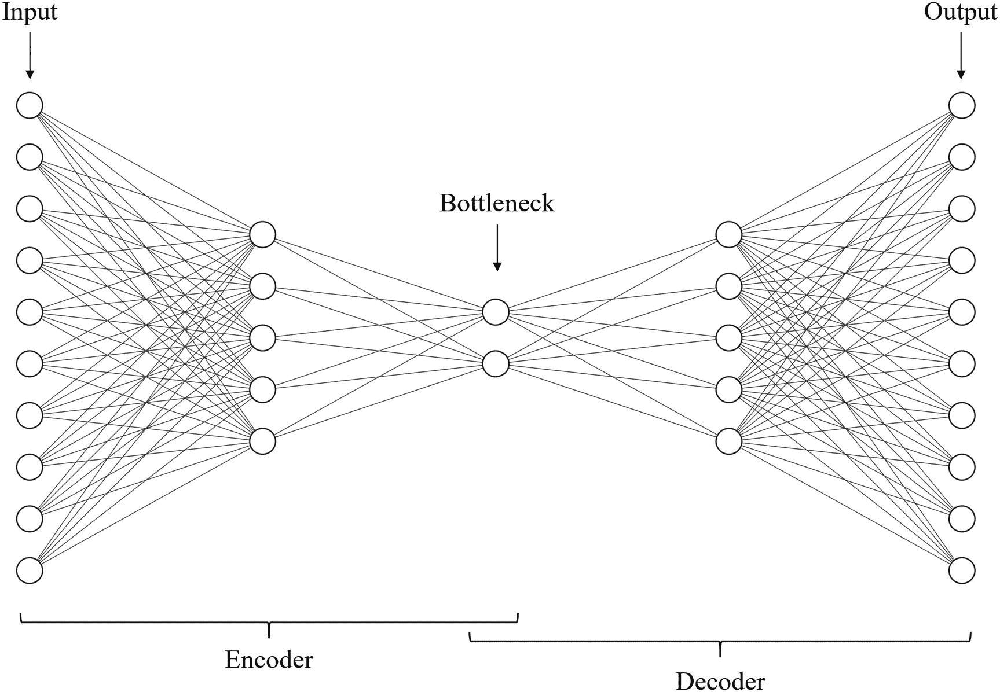
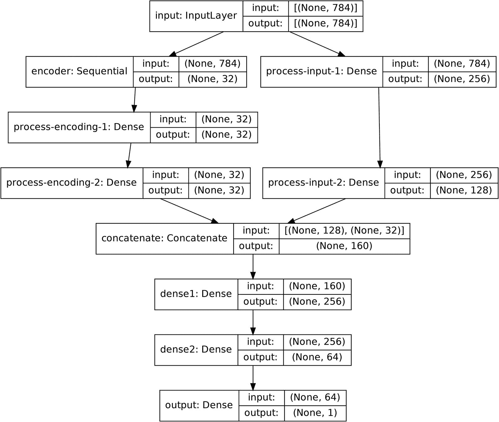
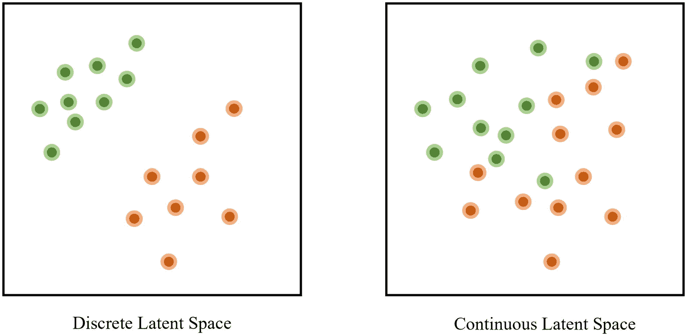
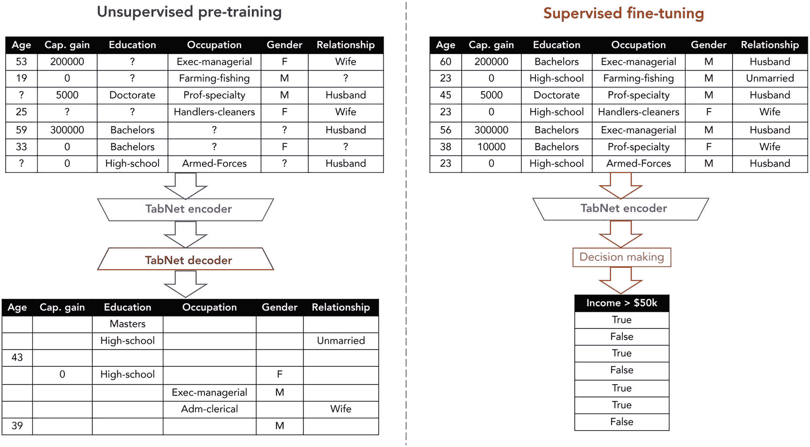

# 三、自编码器的多功能性

> 如果是正确的话，一个字抵得上一千幅画。
> 
> —爱德华·阿比，美国作家兼散文家 <sup>[1](#Fn1)</sup>

编码和解码实体的概念——思想、图像、物理材料、信息等等——是一个特别深刻和重要的概念，因为它深深地根植于我们如何体验和理解我们周围的环境。编码和解码信息是交流和学习中的一个关键过程。每次你与人交流，观察天气，阅读一本书——就像这本书——或者以某种方式与信息互动，你都在参与一个编码和解码、观察和解释的过程。我们可以通过自编码器的深度学习概念来利用这一想法。

本章将从探索自编码器背后的直觉和理论以及如何使用它们开始。它还将涵盖 Keras 神经网络操作方法和神经网络设计，它们不仅是实现自编码器的组成部分，也是后面章节中其他更复杂的神经网络设计的组成部分。本章的另一半将致力于通过五个应用来探索自编码器的多功能性。虽然 autoencoder 是一个简单的概念，但它与解决深度学习问题的努力相结合，可以成为一个平庸和成功的解决方案。

## 自编码器直觉和理论

虽然我们将阐明编码和解码更具体地指的是什么，与自编码器背后的直觉相关，但现在它们可以被认为是彼此不可分割地联系在一起的抽象操作。对我们来说，对一个对象进行编码，就是在失去可量化信息的情况下对其进行表示。例如，我们可以通过总结对一本书进行编码，或者用关键的感官方面对一次经历进行编码，比如显著的触觉或听觉。解码就是接受对象的编码表示并重建对象。编码和解码的目的是“一起工作”,使得重建尽可能精确。例如，一本书的有效摘要(编码)是一种读者可以或多或少地以很高的准确度构建该书的主要思想的摘要。

假设有人给你看一张狗的图片。他们让你看那幅图像几秒钟，把它拿走，然后让你通过画来重建图像。在这几秒钟内，理想情况下，你应该已经提取了图像的关键特征，这样你就可以通过一些有效的方法尽可能精确地绘制它。也许你记得那只狗面朝右，头直立，它很高，看起来像是站着不动。

有趣的是，这些都是高级抽象概念——例如，要推断一个物体面向某个方向，你必须知道该物体各个部分的方向之间的关系(例如，如果头部面向一个方向，尾巴应该面向另一个方向),并能够在空间环境中表示它们。或者，知道一只狗是高的需要知道一只“标准”或“矮”的狗看起来像什么。要确定没有运动，需要知道这类物体的运动是什么样的。

这里的关键思想是，为了在复杂对象和关系的上下文中有效地压缩和重建对象，该对象必须相对于其他对象被压缩。以高重建性能来压缩孤立的对象比利用附加的相关知识集来压缩对象更困难或者性能更差。这就是为什么恢复一只狗的图像比恢复一个不熟悉的物体的图像更容易。有了狗的图像，你首先识别对象是狗，从而识别与“狗”实体相关的知识是相关的，然后可以观察图像如何偏离狗的模板。解码时，如果你已经知道图像是一只狗(一个技术细节:这个信息可以通过编码传递)，你可以通过首先初始化与狗相关的知识来完成大部分繁重的工作——它的标准解剖结构、行为和性格。然后，您可以根据需要添加偏差和细节。

因为复杂实体的有效压缩需要构建高效的知识表示和快速检索，所以这种编码-解码操作对在深度学习中非常有用。这一对操作通常被称为自编码器结构，尽管我们将更深入地探讨它需要什么。因为编码和解码的过程对于学习来说是如此重要，并且有助于开发有效的知识表示，所以自编码器在深度学习中有许多应用。

同样，应该说，这种对上下文的依赖使得自编码器对于像图像压缩这样需要更通用的信息提取方法的任务来说通常是一种糟糕的方法。自编码器作为数据压缩工具受限于它们正在处理的数据的上下文，即使在该上下文中，其性能也至多等同于现有的更通用的压缩算法。例如，如果你给一个标准的自编码器输入数以千计的菠萝图像，你只能训练它有效地编码几个菠萝图像；例如，自编码器将无法重建 x 光图像。这是批判性地评估深度学习作为解决某些问题的方法的可行性的一个很好的例子，也是一个非常需要的提醒，即深度学习不是一个通用的解决方案，需要与其他组件合作才能产生一个完整的产品。

考虑以下由自编码器对 MNIST 数字数据集中的图像进行的重建，该自编码器被强制将每幅图像编码为仅四个数字，然后从这四个数字中解码图像(图 [3-1](#Fig1) )。我们可以观察到网络依赖于数字的“模板”。例如，最初的数字“5”具有非常独特的形状，具有尖锐的边缘和关节，但网络的重建看起来像一个不同的图像——尽管它表达了相同的“5”概念，但它更圆，更少风格。对于数字“0”、“4”、“1”和“9”，也可以观察到类似的模式在这里，我们看到自编码器不仅仅是为图像找到一个有效的压缩算法，而且还执行聚类和一点“软”分类，以帮助重建输入图像的一般概念。


图 3-1

顶行:输入/原始图像。底部一行:重建的输入

尽管 autoencoder 是一项无人监管的任务，没有标签，但它能够执行高效的聚类，并学习数据的关键特征、属性和结构。

形式上，自编码器由三个通用组件组成:编码器、瓶颈和解码器(图 [3-2](#Fig2) )。这些组件并不相互排斥；它们重叠。编码器接收输入并输出编码表示，解码器接收编码表示并将其解码为输出。“瓶颈”是指编码器和解码器之间共享的节点:它是编码器的输出和解码器的输入。可以认为它保存了输入的编码表示。它也被称为潜在空间，“潜在”来自拉丁语“隐藏”的意思——它是一个包含压缩/编码数据的“隐藏”表示的空间，只能由解码器解密。



图 3-2

自编码器图的组件

自编码器的输入和输出具有相同的大小，因为自编码器在重建任务上受过训练——给定一个输入项，目标是以尽可能高的精度重建输出。这是自编码器的一个重要特性，也是我们如何设计这些结构的核心。

训练神经网络“什么都不做”——输出任何输入——对于许多架构来说是一项微不足道的任务。然而，是什么让 autoencoder 对各种各样的应用如此有意义和有用，是瓶颈。与以原始形式表示输入数据(或者用任何其他数据存储单元代替节点)所需的节点数量相比，瓶颈层中节点数量的减少使得重构任务变得困难，并且迫使自编码器开发有效的编码和解码方法。图 [3-3](#Fig3) 和 [3-4](#Fig4) 显示了在 MNIST 数字数据集上训练的两个自编码器的重建表示，其中一个比另一个具有更大的瓶颈。显然，第一个自编码器的自编码器太小，无法开发相当精确的重建，而另一个自编码器能够开发一定程度的细节——五点的尖度，九点的茎的轻微卷曲——这可能会引起人们对任务是否太琐碎的关注。不过，这取决于您使用自编码器的应用。


图 3-4

具有大瓶颈尺寸的自编码器对原始图像及其重建


图 3-3

小瓶颈尺寸自编码器对原始图像及其重建

autoencoder 使用中的大部分“肉”存在于它们的应用中。我们将从讨论如何为表格数据和图像数据设计和实现自编码器开始。然后，我们将探索自编码器的五个应用的直觉和实现。

## 自编码器实现的设计

根据应用的形式，在实现自编码器时需要考虑很多因素。在本节中，我们将通过示例广泛讨论在一维(矢量)和二维(表格)数据上设计自编码器的注意事项。

### 表格数据的自编码器

表格数据，就我们的目的而言，是指可以以`(n, s)`的形式放入的数据，其中`n`表示数据点的数量，`s`表示每个数据点中元素的数量。整个数据集可以放入一个二维表中，其中每一行表示一个特定的数据点，每一列表示该数据点的一个特征。

为表格数据构建自编码器是一个合适的起点，因为任何一层上的数据形状都可以通过简单地改变该层上的节点数量来轻松操作。其他形式的数据，如图像，更难处理。能够操作形状对于自编码器设计至关重要，因为编码和解码实体的概念附带了相对严格的指令，说明数据在编码前、编码后和解码前的形状。

标准自编码器(通常简称为“AE”)和“深度自编码器”之间的区别也应该在这里指出。虽然确切的术语似乎还没有稳定下来，但通常自编码器指的是浅自编码器结构，而深自编码器包含更多的深度。通常，这是由输入数据的复杂性决定的，因为更复杂形式的数据通常需要更大的深度。因为可以以表格格式排列的数据通常没有图像或文本数据(或神经网络擅长建模的其他种类的高度专业化和复杂的数据)复杂，所以通常可以安全地将高分辨率图像或文本集上使用的自编码器结构称为深度自编码器，将表格数据上使用的自编码器结构称为简单的自编码器。

在本例中，我们将使用 784 维数据构建一个自编码器。也就是说，每个数据点由 784 个特征组成。让我们从导入必要的模型和模块开始。为了方便起见，我们将使用`import keras.layers as L`方法处理导入层，而不是通过名称单独导入每个层(清单 [3-1](#PC1) )。此外，因为在这种情况下不需要使用函数式 API 我们不是在构建非线性拓扑，也不需要对某个层进行如此强的访问来保证为其分配自己的变量——我们将选择更简单的顺序模型结构。

```py
import keras.layers as L
from keras.models import Sequential

Listing 3-1Importing important layers and models

```

一旦我们初始化了顺序模型结构，我们就可以添加输入层，它接收 784 维的输入数据。

现在，我们将构建自编码器的编码组件(清单 [3-2](#PC2) )。编码器应连续减小数据的大小，以指导编码过程。在这种情况下，大小的第一次减少是从 784 个节点减少到 256 个节点；二是从 256 个节点到 64 个节点；第三种是从 64 个节点到 32 个节点。通过减少每个`Dense`层中的节点数量，我们减少了自编码器表示输入数据的空间。

```py
model = Sequential()
model.add(L.Input((784,)))
model.add(L.Dense(256, activation='relu'))
model.add(L.Dense(64, activation='relu'))
model.add(L.Dense(32, activation='relu'))

Listing 3-2Building a simple encoder using Dense layers for tabular data

```

编码器的最后一层包含 32 个节点，表明瓶颈将是 32 个节点宽。这意味着，在最极端的情况下，自编码器必须找到具有 32 个值的 784 个特征的表示。

还应该注意，每层中的节点数量通常是 2 的幂。你会在本书的例子和研究人员设计的神经网络架构中看到这种模式(其中一些出现在案例研究中)。许多人认为这是方便记忆和有意义地缩放节点数量的好方法(当节点数量很高时，有意义的变化是*成比例的*而不是相加的)。但是，如果您的设计需要的节点数量不符合这一约定，那么就不需要这一约定。

然后我们可以添加解码器层，这应该会连续扩展神经网络从其编码表示中解码数据的空间(清单 [3-3](#PC3) )。虽然这不是自编码器成功的必要条件，但为了方便起见，解码器通常与编码器对称。这里，解码器执行与编码器相同的步骤，但是“相反”第一次扩展是从 32 个节点的编码表示扩展到 64 个节点；二是从 64 个节点到 256 个节点；最后是从 256 个节点到 600 个节点，原始输入数据的形状。

```py
model.add(L.Dense(64, activation='relu'))
model.add(L.Dense(256, activation='relu'))
model.add(L.Dense(784, activation='sigmoid'))

Listing 3-3Building a simple decoder using Dense layers for tabular data

```

注意，在这个例子中，模型最后一层的激活是 sigmoid 激活函数。传统上，我们将 sigmoid 激活(或其他相关的弯曲和有界函数和适应)放在最后一层，以约束用于分类问题的神经网络。这可能适合也可能不适合你的特定任务。

如果您的输入数据完全由二进制数据组成，或者可以适当地转换成这种形式，那么 sigmoid 可能是一种合适的激活方式。确保您的输入数据得到正确缩放是很重要的；例如，如果一个要素是二进制的，只包含值 10 和 20，那么您需要调整该要素，使其只包含值 0 和 1。或者，如果您的要素不是严格的二元要素，而是倾向于围绕两个边界进行聚类，那么 sigmoid 也可能是一个合适的选择。

另一方面，如果一个特征相对均匀地分布在一个较大的范围内，则可能不适合使用 sigmoid 激活。sigmoid 函数是倾斜的，使得输出接近 0.5 的中间值比输出接近 0 或 1 的中间值更“棘手”；如果这不能充分代表一个特征的分布，还有其他的选择。像 ReLU(整流线性单位，定义为 *y* = max( *x* ，0))这样的激活可能更合适。然而，如果你的特性也在负输出范围内，使用线性激活(简单地说 *y = x* )。请注意，根据表格数据中要素的特征，您将需要选择不同的损失和度量-主要考虑回归或分类。

用于表格数据的自编码器的一个挑战是，表格数据通常不像图像或文本那样由统一的上下文因素结合在一起。一个特性可能来自与另一个特性完全不同的上下文，因此您可能同时拥有一个连续特性和一个分类特性，而表格自编码器必须同时适应这两个特性。这里，需要特征工程(例如，将分类特征编码为连续值)来“统一”特征的问题类型。

使用 plot_model()绘制模型向我们展示了在编码步骤中尺寸的连续减小和在解码步骤中尺寸的连续增大，正如所预期的那样(图 [3-5](#Fig5) )。


图 3-5

仅对表格数据使用密集图层的自编码器示例

然而，当构建自编码器时，通常*划分的*设计优于顺序堆叠的层。划分的设计指的是将一个模型实现为几个子模型之间的关系。通过使用划分的设计，我们可以很容易地访问和操作子模型。此外，模型的功能和组件也更加清晰。在自编码器中，两个子模型是编码器和解码器。

为了使用划分的设计进行构建，首先要定义每个子模型的架构。然后，使用 Functional API 将每个子模型定义为另一个对象的输入，并使用`keras.models.Model`将子模型聚合成一个总体模型。

让我们像以前一样构建相同的架构，但是使用划分的设计(列表 [3-4](#PC4) )。请注意，您可以将`name='name'`参数传递到模型中，为其附加一个名称，供以后参考。

```py
encoder = Sequential(name='encoder')
encoder.add(L.Input((784,)))
encoder.add(L.Dense(256, activation='relu'))
encoder.add(L.Dense(64, activation='relu'))
encoder.add(L.Dense(32, activation='relu'))
decoder = Sequential(name='decoder')
decoder.add(L.Input((32,)))
decoder.add(L.Dense(64, activation='relu'))
decoder.add(L.Dense(256, activation='relu'))
decoder.add(L.Dense(784, activation='sigmoid'))

Listing 3-4Building a simple encoder and decoder using Dense layers for tabular data with compartmentalized design

```

一旦我们定义了子模型(分别是`encoder`和`decoder`，我们就可以将它们视为层，并使用功能 API 将它们聚合成一个总体模型(清单 [3-5](#PC5) )。回想一下，我们可以将模型视为函数式 API 中的层，方法是将它们编写为前一个对象的函数。

```py
ae_input = L.Input((784,), name='input')
ae_encoder = encoder(ae_input)
ae_decoder = decoder(ae_encoder)

from keras.models import Model
ae = Model(inputs = ae_input,
           outputs = ae_decoder)

Listing 3-5Compiling sub-models into an overarching model – the autoencoder – with compartmentalized design and the Functional API

```

当绘制总体模型的架构时(图 [3-6](#Fig6) ，Keras 现在只显示组成它的直接层和子模型。这有助于理解具有许多层的自编码器的一般架构和数据流，而无需了解每个层的具体功能。


图 3-6

使用分隔设计构建的自编码器架构的可视化

对自编码器使用划分设计的主要实际好处是，在编译和调整之后，我们可以调用`encoder.predict(input_data)`来获得学习到的编码。如果你不使用划分的设计，你也可以使用第 [2 章](2.html)中讨论的层检索方法(例如 get_layer())来创建一个由编码层组成的模型对象，但是这比必要的工作要多，而且不太容易移植。对于我们将在本章后半部分讨论的许多自编码器应用来说，访问编码器的数据编码是必要的。

如第 [2](2.html) 章所述，除了自编码器之外，你可以将这种实现设计方法与各种其他结构一起使用，以轻松冻结整个层组，或者获得这里提到的划分设计的其他好处，如更好的组织或更容易的模型引用。例如，这种划分的设计可以用来将使用迁移学习的模型分成两个子模型:预训练卷积组件和自定义全连接层。通过调用 submodel.trainable = False，可以很容易地冻结预训练的卷积分量。

### 图像数据的自编码器

为图像数据构建自编码器的逻辑与为表格数据构建自编码器的逻辑相同:编码器应该使用“简化”操作将输入压缩为编码表示，解码器应该使用“放大”操作将编码表示扩展为输出。但是，我们需要做一些额外的考虑，以适应数据形状日益增加的复杂性。

“放大”操作需要是“缩小”操作的某种“逆”操作。对于密集层来说，这不是什么大问题，因为放大和缩小操作都可以简单地通过增加或减少下一层中节点的数量来完成。然而，由于卷积层和池层等常见的基于图像的层只能是简化操作，因此我们需要明确指出，解码组件不仅是“反向的”编码组件(如为表格数据构建自编码器中所述)，而且是逐步反转编码操作。这给编码器和解码器的构建带来了复杂性。

尽管在使用深度自编码器处理语言和高级表格数据方面有所发展，但自编码器主要用于图像数据。正因为如此，要成功处理大多数与图像相关的深度学习任务，对自编码器的广泛知识是必要的。

### 图像数据形状结构和变换

因为形状对于卷积自编码器的设计非常重要，所以首先，我们必须简要讨论图像形状及其变换方法。

图像具有形状`(a, b, c)`。使用常用的通道-最后符号，`a`和`b`代表图像的空间维度，`c`代表通道数或深度(图 [3-7](#Fig7) )。例如，标准彩色图像有三个通道，对应于 RGB 图像中的红色、绿色和蓝色值。基于图像的图层通常可以通过改变图像形状的所有三个元素来处理图像。


图 3-7

图像的三维插图

表 [3-1](#Tab1) 列举了卷积神经网络中使用的四个关键层。注意，通常图像的高度和宽度是相同的(图像是正方形的)，这使得探索转换更加简单。该表假定为正方形，尽管您可以将类似的逻辑应用于矩形输入。此外，该表假设使用跨度 1，并且输入是空间二维的，尽管该逻辑同样适用于其他形式。

表 3-1

卷积神经网络中的重要层及其对图像形状的变换

<colgroup><col class="tcol1 align-left"> <col class="tcol2 align-left"> <col class="tcol3 align-left"> <col class="tcol4 align-left"></colgroup> 
| 

**层**

 | 

**参数**

 | 

**输出给定的输入形状** `(a, a, c)`

 | 

**描述**

 |
| --- | --- | --- | --- |
| 盘旋 | 内核形状= `(x, y)`过滤器数量= `n`Padding = "same "或" valid " | 如果`padding = 'valid'` : `(a-(x-1), a-(x-1), n)`如果`padding = 'same'` : `(a, a, n)` | 二维卷积将形状核心`(x, y)`滑过图像。因此，它将减少图像的空间尺寸的`x-1`和`y-1`像素。一般来说`x=y`(因此内核是方形的)，但是一些架构使用矩形内核，这在某些领域是成功的。参见章节 [6](6.html) 关于 InceptionV3 架构的案例研究，探索卷积因子分解和非方形内核形状。但是，如果“填充”设定为“相同”，则图像会被填充(额外的“空白”尺寸会添加到其大小中)，以便在执行卷积时，生成的图像与前一个图像具有相同的形状。我们稍后会看到为什么这是有帮助的。 |
| 联营 | 池大小= `(x, x)`Padding = "same "或" valid " | 如果`a`能被`x`和`padding='same'`或`'valid'`整除:`(a/x, a/x, c)`如果`a`不能被`x`和`padding='valid'`整除:`(floor(a/x), floor(a/x), c)`如果`a`不能被`x`和`padding='same'`整除:`(ceil(a/x), ceil(a/x), c)`<sup>T5】2</sup> | 二维池操作通过在图像上放置大小为`(x, x)`的非重叠(与重叠的卷积不同)窗口来“总结”重要的发现，提供了一种更快的方法来减小图像形状的大小。联营通常以平均联营(联营窗口中的所有元素被平均)或最大联营(联营窗口中的最大元素被传递)的形式使用。池化将图像大小除以池化窗口各自的尺寸。但是，因为图像有时可能不是窗口各自尺寸的精确倍数，所以您可以使用填充模式来帮助确定输出的精确形状。 |
| 转置卷积 | 内核形状= `(x, y)`过滤器数量= `n`Padding = "same "或" valid " | 如果`padding = 'valid'` : `(a+(x-1), a+(x-1), n)`如果`padding = 'same'` : `(a, a, n)` | 转置卷积可以被认为是卷积的“逆”。如果您将一个输入通过卷积层，然后通过转置卷积层(具有相同的内核形状)，您最终会得到相同的形状。当您构建解码器时，使用转置卷积层代替编码器中的卷积层来增加图像形状的大小。与卷积层一样，您也可以选择填充模式。 |
| 上采样 | 上采样因子:`(x, y)` | `(a*x, a*y, n)` | 上采样层简单地以某一因子“放大”图像，而不改变任何图像实际值。例如，数组`[[1, 2], [3, 4]]`将以(2，2)的上采样因子被简单地上采样为`[[1, 1, 2, 2], [1, 1, 2, 2, ], [3, 3, 4, 4], [3, 3, 4, 4]]`。上采样层可以被认为是池化操作的逆操作——当池化将图像大小中的维度除以某个数量(假设没有使用填充)时，上采样将图像大小乘以该数量。上采样不能使用填充。当您构建解码器时，使用上采样层代替编码器中的池层来增加图像形状的大小。 |

注意，只有卷积和转置卷积层包含权重；池化和上采样是聚合提取特征的简单方法，无需任何特定的可学习参数。此外，请注意默认填充方法是“有效的”

有许多方法可以构建卷积自编码器。我们将讨论许多方法，从一个简单的卷积自编码器开始，不引入池概念。

### 无池卷积自编码器

如前所述，自编码器通常是对称构建的，但基于图像的自编码器更是如此。在这种情况下，*而不是*对称地构建自编码器需要大量艰苦的形状跟踪和操作。

让我们从构建一个编码器开始，它接收形状为`(256, 256, 3)`的数据，然后用卷积层对其进行编码(列表 [3-6](#PC6) )。在许多卷积自编码器设计中，滤波器的数量随着图像尺寸的减小而增加。确保就网络可用的存储量而言，过滤器数量的增加不会超过图像大小的减少，这样，整个编码器的数据存储容量会减少(相应地，整个解码器的数据存储容量会增加)。

```py
encoder = Sequential()
encoder.add(L.Input((64, 64, 3)))
encoder.add(L.Conv2D(8, (3, 3)))
encoder.add(L.Conv2D(8, (3, 3)))
encoder.add(L.Conv2D(16, (3, 3)))
encoder.add(L.Conv2D(16, (3, 3)))
encoder.add(L.Conv2D(32, (3, 3)))
encoder.add(L.Conv2D(32, (3, 3)))

Listing 3-6Building an encoder for image data using convolutions without pooling

```

在这种情况下，我们不断增加滤波器的数量(从最初的 3 个通道增加到 8、16 和 32 个通道)，同时保持滤波器大小为`(3,3)`。

通过用 plot_model 可视化(图 [3-8](#Fig8) ，我们看到图像的形状是如何根据卷积层随时间变化的。编码器的输出是形状(52，52，32)的压缩图像。然而，你会注意到这个模型违反了滤镜数量不能超过没有合并的图像大小的减少的要求——“编码表示”大于输入(`64*64*3` < `52*52*32`)！这是因为卷积根本不是快速减小图像大小的好方法。我们需要统筹解决这个问题。现在，为了简单起见，我们将忽略这个问题。


图 3-8

一个示例卷积编码器的体系结构，没有汇集，仅使用卷积层

我们可以构建我们的解码器，通过反转层的顺序来“镜像”编码器，并使用反转层来“撤销”编码(列表 [3-7](#PC7) ，图 [3-9](#Fig9) )。我们知道解码器将接受大小为(52，52，32)的编码表示。


图 3-9

没有汇集并且仅使用卷积层的示例卷积解码器的架构

```py
decoder = Sequential()
decoder.add(L.Input((52, 52, 32)))
decoder.add(L.Conv2DTranspose(32, (3, 3)))
decoder.add(L.Conv2DTranspose(32, (3, 3)))
decoder.add(L.Conv2DTranspose(16, (3, 3)))
decoder.add(L.Conv2DTranspose(16, (3, 3)))
decoder.add(L.Conv2DTranspose(8, (3, 3)))
decoder.add(L.Conv2DTranspose(8, (3, 3)))

Listing 3-7Building a decoder for image data using convolutions without pooling

```

有一个问题——解码器的输出是 shape (64，64，8)，而输入是 shape (64，64，3)。有两种方法可以解决这个问题。你可以把最后一层改成`L.Conv2DTranspose(3, (3, 3))`，这样它就有三个通道。或者，您可以在解码器的末尾添加另一层:`L.Conv2DTranspose(3, (1, 1))`。因为它的过滤器大小为(1，1)，所以图像的宽度和高度没有改变，但是通道的数量从 8 折叠为 3。

因为卷积自编码器(以及一般的网络)依赖于重复的卷积和其他操作，所以使用 for 循环和必要的参数索引列表来构建它们通常是一个好的实践。例如，我们可以如下更有效地重写编码器(清单 [3-8](#PC8) )。

```py
num_filters = [8, 16, 32]

encoder = Sequential()
encoder.add(L.Input((64, 64, 3)))
for i in range(3):
    encoder.add(L.Conv2D(num_filters[i], (3,3)))
    encoder.add(L.Conv2D(num_filters[i], (3,3)))

Listing 3-8Building long, repeated architectures using for loops and lists of parameters accordingly referenced within the loop

```

在这种情况下，由于每层中的过滤器数量有一个清晰的模式，您甚至可以在不索引参数列表的情况下编写它(清单 [3-9](#PC9) )。

```py
encoder = Sequential()
encoder.add(L.Input((64, 64, 3)))
for i in range(3):
    encoder.add(L.Conv2D(2**(i+3), (3,3)))
    encoder.add(L.Conv2D(2**(i+3), (3,3)))

Listing 3-9Building long, repeated architectures using for loops without lists of parameters accordingly referenced within the loop

```

这种设计的一个主要好处是，你可以简单地通过增加迭代次数来扩展网络的深度——增加代码循环，使你不必手动键入大量代码。

### 卷积自编码器矢量瓶颈设计

通常，瓶颈(编码器的输出和解码器的输入)不会作为图像留下——它通常被展平为一个矢量，然后重新成形为一个图像。他们从中得到的主要好处是，我们能够获得独立于任何空间维度的图像的矢量表示，这使得它们更加“干净”并且易于使用。此外，它们可以更容易地与预训练等应用一起使用(稍后将详细介绍)。

为此，我们需要在编码器的末尾添加一个展平层(列表 [3-10](#PC10) ，图 [3-10](#Fig10) )。因为展平图像通常会产生非常大的矢量，所以通常会应用一些密集的图层来进一步处理和减小它的大小。另一个替代方案是 GlobalAveragePooling2D 或 GlobalMaxPooling2D 层，它产生一个更小的输出向量(平均/取每个滤镜的最大值)；该层遵循与展平层相同的语法。


图 3-10

示例卷积编码器的体系结构，没有池化，仅使用卷积层，使用向量瓶颈设计

```py
encoder = Sequential()
encoder.add(L.Input((64, 64, 3)))

#convolutional component
encoder.add(L.Conv2D(8, (3,3)))
encoder.add(L.Conv2D(16, (3,3)))

#flattening and processing
encoder.add(L.Flatten())
encoder.add(L.Dense(256, activation='relu'))
encoder.add(L.Dense(32))

Listing 3-10The architecture of an example convolutional encoder without pooling and only using convolutional layers with a vector-based bottleneck. For simplicity, the convolutional component has been reduced to two convolutional layers

```

视觉化尤其有助于我们理解形状的变化。我们看到，在展平之前，编码器已经将图像编码为形状为(60，60，16)的图像，该图像被展平为维数为 57，600 的向量。编码器的输出是 32 维的向量。

我们需要这些信息来构建解码器(列表 [3-11](#PC11) ，图 [3-11](#Fig11) )。编码器接收编码表示，这是一个维数为 32 的向量。然后，它使用密集层将其大小增加到与编码器展平后的数据相同的大小，即(57600，)。从那里，我们可以将向量整形为形状为(60，60，16)的图像，以便可以对其应用逆卷积运算。


图 3-11

示例卷积编码器的体系结构，没有池化，仅使用卷积层，使用向量瓶颈设计

```py
decoder = Sequential()
decoder.add(L.Input((32,)))

#processing and reshaping
decoder.add(L.Dense(256, activation='relu'))
decoder.add(L.Dense(57_600, activation='relu'))
decoder.add(L.Reshape((60, 60, 16)))

#applying transpose-convolutional layers
decoder.add(L.Conv2DTranspose(16, (3,3)))
decoder.add(L.Conv2DTranspose(8, (3,3)))
decoder.add(L.Conv2D(3, (1,1)))

Listing 3-11The architecture of an example convolutional decoder without pooling and only using convolutional layers with a vector-based bottleneck

```

回想一下，为了解决输入图像中的通道数问题，我们增加了一个滤波器大小为(1，1)的额外卷积层，以保持图像大小，但减少通道数。

### 具有汇集和填充的卷积自编码器

虽然我们在技术上成功地构建了卷积自编码器，因为输入和输出在形状上是相同的，但我们未能坚持自编码器设计的一个基本原则:编码器应该逐渐减小数据的大小。我们需要池来快速减少图片的大小。

卷积神经网络一般以卷积层-卷积层-池层(卷积层数不等)的模块(图 [3-12](#Fig12) )构造。这些模块可以反复重复。通过在特征提取的几个卷积层之后使用汇集层，可以聚集这些提取的特征，并且可以将关键亮点传递到下一个卷积层，用于进一步的特征提取和处理。(你可以在第 [6](6.html) 章找到基于模块/单元的架构设计的更详细的讨论。)


图 3-12

卷积自编码器中基于重复模块/单元的设计示例

然而，当结合池使用卷积层时，我们会遇到图像大小不能被池因子整除的问题。例如，考虑形状(64，64，3)的图像。在对其应用具有滤波器大小(2，2)的卷积层之后，图像具有(63，63，3)的新形状。如果我们想应用大小为(2，2)的池，我们需要使用填充来确定池的输出是(31，31，3)还是(32，32，3)。这几乎不是标准卷积神经网络的问题。然而，在自编码器中，我们不仅需要考虑编码器中的操作，还需要考虑解码器中相应的反向“撤销”操作。上采样层没有填充层。因此，如果我们将大小为(2，2)的上采样应用于大小为(31，31，3)的图像，我们将获得大小为(62，62，3)的图像；如果我们将其应用于大小为(32，32，3)的图像，我们将获得大小为(64，64，3)的图像。在这种情况下，没有简单的方法可以获得(63，63，3)的原始图像大小。

您可以尝试使用特定的填充并手动添加填充层，但这需要大量的工作，并且难以系统地操作和组织。

为了解决这个问题，一种用池和卷积层构建卷积自编码器的方法是在所有卷积层上使用`padding='same'`。这意味着卷积层对图像的形状没有影响——在执行卷积之前，图像会在侧面进行填充，以使输入和输出图像具有相同的形状。卷积仍在改变图像的内容，但图像大小保持不变。消除卷积层的影响大大简化了图像形状的管理。除了这种简化之外，填充还允许卷积处理图像边缘上的特征，通过增加更多的缓冲空间使得边缘特征可以由内核的中心来处理，这些特征可能在没有填充的情况下被忽略。

让我们用所有卷积层的`padding='same'`为自编码器构建一个编码器(列表 [3-12](#PC12) )。

```py
encoder = Sequential()
encoder.add(L.Input((64, 64, 3)))

#convolutional component
for i in range(3):
    encoder.add(L.Conv2D(2**(i+3), (3,3),
                padding='same'))
    encoder.add(L.Conv2D(2**(i+3), (3,3),
                padding='same'))
    encoder.add(L.MaxPooling2D((2,2)))

#flattening and processing
encoder.add(L.Flatten())
encoder.add(L.Dense(256, activation='relu'))
encoder.add(L.Dense(32))

Listing 3-12The architecture of an example convolutional encoder with pooling and padding, using a vector-based bottleneck

```

从可视化(图 [3-13](#Fig13) )中，我们可以看到，尽管我们阻止了卷积层减小尺寸，但通过添加池，我们能够显著降低特征图的分辨率。展平后的向量(在任何处理之前)是 2048 维的–与没有合并的 57600 维展平后的向量相比！


图 3-13

具有池化和填充的完整卷积编码器

我们可以相应地构造解码器(列表 [3-13](#PC13) ，图 [3-14](#Fig14) )。和编码器中的卷积层一样，解码器中的转置卷积层必须使用`padding='same'`来保证对称性。


图 3-14

具有汇集和填充功能的完整卷积解码器

```py
decoder = Sequential()
decoder.add(L.Input((32,)))

#processing and reshaping
decoder.add(L.Dense(256, activation='relu'))
decoder.add(L.Dense(2048, activation='relu'))
decoder.add(L.Reshape((8, 8, 32)))

#applying transpose-convolutional layers
for i in range(3):
    decoder.add(L.UpSampling2D((2,2)))
    decoder.add(L.Conv2DTranspose(2**(3-i), (3,3),
                padding='same'))
    decoder.add(L.Conv2DTranspose(2**(3-i), (3,3),
                padding='same'))

#adding additional layer to collapse channels
decoder.add(L.Conv2D(3, (1,1)))

Listing 3-13The architecture of an example convolutional decoder with pooling and padding, using a vector-based bottleneck

```

当然，这种方法依赖于具有一定大小的输入。在这种情况下，输入大小必须是 2 的幂，因为每个池化因子都会将图像的空间尺寸缩小 2 倍。您可以在输入后立即插入一个整形图层，或者对数据集进行整形以适应这种情况。这种方法的主要优点是，它使组织形状变换的对称性变得更加简单。例如，如果您知道您想要展平之前编码图像的形状为(16，16，x) <sup>[3](#Fn3)</sup> ，并且您想要三个大小为(2，2)的池层和三个大小为(3，3)的池层，您可以计算出相应的输入形状的宽度和高度为 16 ^ 2<sup>3</sup>3<sup>3</sup>像素。

## 其他数据表单的自编码器

使用这种逻辑，您可以为所有形式的数据构建自编码器。例如，您可以使用递归层来编码和解码文本形式的数据，只要您添加的每个编码层都有一个精确的反向解码层。尽管许多自编码器工作都是基于图像的，但最近的工作正在探索自编码器在非基于图像的数据类型中的许多应用。有关自编码器在非图像数据中的应用示例，请参见本章的第三个案例研究。

## 自编码器应用

正如我们所见，自编码器的概念相对简单。但是，由于需要保持输入和输出的大小相同，我们已经看到，为复杂的数据表单实现自编码器架构可能需要大量的预先考虑和预先规划。好消息是，在大多数自编码器中，实现自编码器架构是最耗时的步骤。一旦构建了自编码器结构(使用首选的划分设计)，您就可以轻松地将它应用于多种应用，以满足您的需求。

### 使用自编码器去噪

去噪自编码器的目的很大程度上由其名称所暗示:在该上下文中的“de”前缀意味着“远离”或“相对”，因此去噪是移动“相对”或去除噪声。去噪实现简单，可用于多种目的。

#### 直觉和理论

在一个标准的自编码器中，模型被训练来重建它被给予的任何输入。去噪自编码器是相同的，但是模型必须重建噪声输入的去噪版本(图 [3-15](#Fig15) )。标准自编码器中的编码器仅需要开发能够以低重构误差解码的输入图像的表示(这可能非常困难)，而去噪自编码器中的编码器还必须开发对任何噪声都鲁棒的表示。去噪自编码器可用于对杂乱的信号、图像、文本、表格数据和其他形式的数据去噪。

Note

去噪自编码器通常缩写为 DAE。您可能会注意到这与“deep autoencoder”的缩写相冲突。因为术语“去噪自编码器”相对来说比“深度自编码器”更成熟、定义更明确，所以当您在大多数上下文中看到缩写“DAE”时，可以放心地认为它指的是去噪自编码器。为了清楚起见，在本书中，我们将倾向于不使用缩写“DAE”；如果使用的话，会参考去噪自编码器而不是深度自编码器。


图 3-15

去噪自编码器组件的概念图

当然，去噪自编码器的概念首先假设您的数据相对没有噪声。因为去噪自编码器依赖原始数据作为基础事实来对该原始数据的噪声版本执行去噪，所以如果原始数据本身噪声很大，则自编码器将学习任意且噪声很大的表示过程。如果用于训练去噪自编码器的数据具有高度的噪声，则在许多情况下，使用去噪自编码器和标准自编码器之间几乎没有区别。事实上，使用前者可能会对您的工作流程造成更大的损害，因为您可能是在假设去噪自编码器正在学习对噪声具有鲁棒性的数据的有意义表示的情况下进行操作的，但事实并非如此。

输入的噪声可以通过三种方法构建(图 [3-16](#Fig16) ):将噪声作为一个层直接插入数据集，或作为一个数据生成器。使用哪种方法取决于您的问题类型:


图 3-16

去噪自编码器中引入噪声的三种方法

*   *将噪声应用为一个层*:在自编码器的输入之后直接插入一个随机噪声添加层，这样在对其执行任何编码和解码之前，噪声被应用到输入。这种方法的主要优点是，该模型学习对同一原始图像的多个有噪声版本具有鲁棒性，因为每次该模型通过该模型时，应用不同的噪声。然而，在应用去噪自编码器之前，需要去除噪声添加层；它只是在训练期间作为一种人工工具，在应用中，我们期望输入已经是“自然的”噪声。使用这种方法时，您可以像为自编码器创建数据集一样创建数据集，输入和输出是相同的。

*   *直接对数据集施加噪声*:在训练之前，在数据集构建过程中直接对数据集施加噪声，使得数据中包含的 *x* 为噪声数据， *y* 为原始数据。使用这种方法的主要优势是可定制性:您可以使用任何想要的函数来构造数据集，因为它不在神经网络的范围内，因此不受 Keras 和 TensorFlow 的限制。您可能希望添加复杂形式的噪波，这些噪波在 Keras/TensorFlow 中不可用作默认层或生成器。此外，不需要操纵自编码器的各个噪声添加层。但是，您有过度拟合的风险(特别是对于小数据集和大架构)，因为自编码器只能看到每个原始输入实例的一种有噪声的形式。当然，您可以手动生成每个实例的几个嘈杂的形式，尽管这可能会花费更多的时间并且效率较低。

*   *通过数据生成器*应用噪声:Keras/TensorFlow 包含一个`ImageDataGenerator`对象，可以对图像执行各种增强和其他形式的噪声，如调整亮度、进行小的旋转和剪切，或者扭曲色调。此外，图像数据发生器类似于基于层的方法，因为网络暴露于输入数据的许多不同噪声表示，数据在每个前馈运动中通过随机发生器，并在网络正式处理之前发生失真。使用数据生成器的主要优势在于，与图层相比，您可以在数据中应用更自然或更容易出现的噪声形式，这可以实现更“人工”的噪声形式，如向图像添加高斯噪声。此外，在训练去噪自编码器之后，不需要操纵噪声添加层。但是，图像数据生成器仅限于图像，这意味着您需要对其他形式的数据使用另一种方法。

去噪自编码器主要用于去噪我们预期会有噪声的输入数据。您可以在输入后直接插入去噪自编码器，这样执行某些监督任务的神经网络会接收到输入的去噪版本(图 [3-17](#Fig17) )。


图 3-17

一种使用去噪自编码器在处理去噪输入之前对输入数据执行去噪的方法。您也可以取消对去噪自编码器的冻结，以便以后进行微调

考虑一个任务，其中模型必须对音频输入的声音进行分类。例如，如果音频输入是鸟鸣，模型应该能够输出标签“鸟”的表示，或者如果音频输入是狮子的吼声，它应该能够输出标签“狮子”的表示。可以想象，现实生活音频数据集中的一个挑战是，许多音频输入将包含重叠的声音。例如，如果鸟鸣的音频剪辑来自一个被大都市喧嚣包围的公园，背景将包含汽车行驶和人们交谈的声音。为了取得成功，模型需要能够消除这些背景噪音的来源，并隔离核心的主要声音。

为此，假设您获得了另一个没有背景噪声的真实声音数据集。您可以人为添加某种形式的噪声，类似于您在噪声数据集中可能遇到的噪声。例如，您可以使用 Python 中的音频处理库将没有背景噪声的声音与更小、更暗的背景噪声叠加。去噪自编码器成功的关键是您人工生成的噪声与数据中预期的噪声形式相似。例如，将高斯噪声添加到图像中可能对去噪任务没有太大帮助，除非您想要去噪的数据集包含高斯噪声。(您可能会发现，就创建自我监督的预训练任务而言，添加某种形式的噪声比完全不添加噪声要好，但这将在后面详细讨论。)您训练去噪自编码器从噪声覆盖的信号中重建原始的无噪声声音信号，然后在对真实声音进行分类之前，使用去噪自编码器去噪。

不过，去噪也可以以其他形式出现。例如，您可以在最终任务上训练模型之前，使用去噪自编码器对整个数据集去噪，而不是在体系结构上将去噪自编码器插入到最终任务上操作的模型中。如果您期望将“终极”模型应用于部署中相对干净的数据，但是知道可用的训练数据是有噪声的，那么这可能是成功的。重要的是要很好地理解您的特定问题，以便您可以成功地实施和操作您的去噪自编码器设计。

#### 履行

在我们对去噪自编码器的实现的讨论中，我们将假设自编码器用于表格数据。该逻辑和语法仍然可以应用于对其他数据(如图像或序列数据)的去噪自编码器的使用，并对该特定数据格式进行必要的考虑。

##### 感应噪声

如上所述，有三种诱发噪声的实用方法。

一种方法是在输入之后直接插入一个噪声层(列表 [3-14](#PC14) ，图 [3-18](#Fig18) )。此方法最有用的图层可能是`keras.layers.GaussianNoise`图层，它添加了具有指定标准偏差的高斯噪声。对于非常严重的噪声形式，您也可以使用像 dropout 或其他修改这样的层(尽管这扩展了我们认为严格意义上的去噪自编码器的限制)。你也可以为更复杂的噪声添加操作编写你自己的定制层。


图 3-18

通过层方法引入噪声的示例实现

```py
ae_input = L.Input((784,), name='input')
ae_noising = L.GaussianNoise(0.1, name='noising')(ae_input)
ae_encoder = encoder(ae_noising)
ae_decoder = decoder(ae_encoder)
ae = Model(inputs = ae_input,
           outputs = ae_decoder)

Listing 3-14Layer-based method of inducing noise into a denoising autoencoder

```

另一种引入噪声的方法是直接将其应用于数据集，理想情况下是在创建 TensorFlow 数据集时的解析期间(清单 [3-15](#PC15) )。创建解析函数时，可以使用各种TensorFlow图像操作来引入随机形式的噪声。在此示例中，未解析的 TensorFlow 数据集由每个实例的文件名和标签组成(尽管如果您知道您将仅在无监督学习中使用未解析的数据集，您可能会发现以另一种格式排列它会有所帮助)。

在这个例子中，我们使用两个有用的`tf.image.random_x`操作将随机噪声引入图像，这改变了亮度和 JPEG 质量噪声。(后者是指 JPEG 图像中的一种现象，由于压缩算法的原因，视觉伪像使图像失真。如果数据集由 JPEG 格式的图像组成，或者包含以电子方式传输的图像(可能曾经是 JPEG 格式的),这将非常有用。)应该注意的是，当指定噪点范围时，例如，在 JPEG 质量中，示例中的“80”和“100”是最低和最高 JPEG 质量，您应该保留没有噪点应用于图像的情况的可能性。这使得该模型不仅可以对噪声图像进行降噪，还可以首先识别噪声的存在。我们通过将 JPEG 质量上限设为 100%来构建这种可能性，其中`random_jpeg_quality`函数的输出与输入相同。像`random_brightness`这样的函数只需要一个最大噪声界限，因此你可以假设会有一些满足这个良好实践的最小噪声水平的例子。

```py
def parse_file(filename, label):
    orig_img = do_preprocessing_stuff(filename)
    rand_img = tf.image.random_brightness(image, 0.01)
    rand_img = tf.image.random_jpeg_quality(image, 80, 100)
    return rand_img, orig_img

Listing 3-15Example function to pre-alter the dataset with noise using .map() on a TensorFlow dataset

```

将某些噪声引入图像数据的第三种方法是使用 Keras/TensorFlow `ImageDataGenerator`(列表 [3-16](#PC16) )。我们首先实例化一个带有噪声增强参数的`ImageDataGenerator`对象(随机改变亮度的范围，小水平的剪切，等等。).使用`.flow`或`.flow_from_x`向图像数据发生器对象提供数据。如果使用`.flow_from_directory`，请务必设置`class_mode='input'`，以便图像数据生成器不采用标签，并将数据生成器安排为分类问题。

```py
from keras.preprocessing.image import ImageDataGenerator
idg = ImageDataGenerator(rotation_range=30,
                         width_shift_range=5,
                         ...)

idg_flow = idg.flow_from_directory(
    directory = '/directory/data',
    class_mode = 'input'
)

Listing 3-16Using the Image Data Generator method of inducing noise into an image dataset. Substitute augmentation_params for augmentation parameters. See Chapter 1 for a detailed discussion of Image Data Generator usage

```

你也可以使用`ImageDataGenerator`和`class_mode='input'`作为自编码器的替代数据源(不仅仅是去噪),而不是使用 TensorFlow 数据集。如果您决定将图像数据生成器用于自编码器，请务必小心控制用于特定目的的增强参数。例如，如果您正在训练一个标准的自编码器，其中的输入与理想输出相同，请确保通过相应地调整增强参数来消除所有人为噪声源。

##### 使用去噪自编码器

如果您正在使用将噪声引入去噪自编码器的层方法，当在另一个应用中使用去噪自编码器时，您将需要移除添加噪声的层(清单 [3-17](#PC17) )。假设变量`ae`指的是具有噪声添加层、划分设计和适当命名的去噪自编码器。我们可以使用`.get_layer(name)`方法按名称检索一个层或层组，并将它们构建成一个“最终去噪自编码器”模型，而不添加噪声层。该示例仅检索编码层和解码层，它们存储在去噪和解码时执行编码关键步骤的权重，从而消除了最终模型中的噪声添加层。在这里，您可以看到命名、分区设计和其他组织性良好实践在操纵网络结构方面带来的诸多好处。

```py
final_dae_input = L.Input((784,), name='input')
final_dae_encoder = ae.get_layer('encoder')(final_dae_input)
final_dae_decoder = ae.get_layer('decoder')(final_dae_encoder)
final_dae = Model(inputs=final_dae_input,
                  outputs=final_dae_decoder)

Listing 3-17Removing the noise-inducing layer in a denoising autoencoder

```

如果你正在处理一个没有划分或者有许多层需要被转移的模型，你也可以通过它的索引来引用每一层(列表 [3-18](#PC18) )。首先定义输入层和输入层之后的层。在这种情况下，我们希望在最终去噪自编码器模型中跟随输入层的层/层组是编码器，我们可以将其称为`ae.layers[2]`，因为它是包含噪声添加层的原始去噪自编码器架构中的第三层/组件。从那里，我们可以迭代地遍历剩余的层，并使用函数式 API 语法将每一层附加到上一层。

```py
inp = L.Input((784,), name='input')
x = ae.layers[2](inp)
for layer in ae.layers[3:]:
    x = layer(x)
final_dae = Model(inputs=inp, outputs=x)

Listing 3-18Alternate method of removing the noise-inducing layer in a denoising autoencoder

```

请记住，使用非线性拓扑时，这种方法很复杂。

通过使用这两种方法中的任何一种，您都可以将相关权重转移到最终模型中，而无需中间层。你会发现这种从模型中“手术式”移除不需要的层的方法在其他应用中很有帮助，尤其是在迁移学习中。去除噪声层后得到的模型(图 [3-19](#Fig19) )可用于验证测试。


图 3-19

去除高斯噪声层后的去噪自编码器

一旦你获得了一个“干净的”自编码器，你就可以把它作为预处理段插入到另一个模型中去噪输入数据(图 [3-20](#Fig20) ，列表 [3-19](#PC19) )。


图 3-20

在输入被传递到后续层进行处理之前，使用去噪自编码器来解码输入

```py
process = Sequential(name='processing')
process.add(L.Input((784,)))
process.add(L.Dense(256, activation='relu'))
process.add(L.Dense(1, activation='sigmoid'))

inp = L.Input((784,), name='input')
denoising = ae(inp)
processing = process(denoising)
ult_model = Model(inputs=inp,
                  outputs=processing)

Listing 3-19Using a denoising autoencoder to denoise inputs before they are passed onto another model for further processing

```

您可以根据需要设置自己的图层冻结策略(参见第 [2](2.html) 章),以满足自己的目的。例如，您可以决定冻结去噪自编码器中用于大多数训练的权重，然后解冻整个网络，并在之后执行一些微调。

### 使用自编码器进行预训练

自编码器的另一个应用是用于预训练。回想一下，预训练是用来提供“环境”的，这样它就可以发展某些技能或表现，从而成功地完成最终任务。在第 [2](2.html) 章中，我们讨论了各种预训练方法和策略。我们将基于前面的讨论来演示在预训练环境中何时以及如何使用自编码器。有了关于自编码器和预训练的丰富知识，您会发现自编码器预训练的直觉和实现非常简单。

#### 直觉

在预训练中使用自编码器属于自我监督学习的范畴。你可以认为自编码器是自我监督学习的最简单形式。回想一下，在自我监督学习中，模型是在改变的数据集上训练的，该数据集仅在任务数据集的输入数据而不是标签上构建。例如，一些自我监督的学习任务涉及预测图像旋转的程度或添加到某组数据中的噪声程度。然而，在标准的自编码器中，除了将数据实例移动到数据集中使得每个实例的输入和输出相同之外，不需要对数据进行任何改变。

通常，当使用自编码器进行预训练时，整个自编码器在预训练数据集上进行训练，提取编码器，将更多层附加到编码器，并在任务数据集上训练新形成的模型(图 [3-21](#Fig21) )。因为编码器从无监督的预训练任务中提取数据的重要表示，所以使用编码器进行预训练的希望在于它从表示和编码输入的关键特征的基本能力开始。然后，附加图层可以将编码的关键要素处理为任务数据集的输出。


图 3-21

使用自编码器进行预训练的概念图。自编码器的输入数据是相同的。“网络”用来指附加到编码器的层。这并不完全准确，但它代表了这样一种思想，即有另一个“小型网络”处理编码器的输出，将编码器输出的任何编码表示映射到输出中

如果您计划使用自编码器进行预训练，那么您必须考虑一个关键因素，即构建多大的瓶颈(以及相应的编码器和解码器组件的宽度):编码器之后附加的层必须处理的信息量。如果您的瓶颈很大，任务可能很琐碎，网络可能不会开发有意义的表示和过程来理解输入。在这种情况下，编码器之后的处理层将接收大量特征，但每个特征不会包含太多有价值的信息。另一方面，如果瓶颈太小，模型可能会开发出有意义的表示，但是后面的处理层可能没有足够的功能来处理。这是一个需要经验和实验的平衡过程。

与预训练一样，最好有策略地冻结组件，以充分利用预训练产生的编码器重量(图 [3-22](#Fig22) )。像许多预训练任务一样，通常好的做法是冻结预训练组件——在本例中是编码器——并训练后续组件以更好地解释编码器的输出，然后解冻预训练组件，以便可以微调整个网络。


图 3-22

在整个训练和微调过程中，用于预训练的自编码器组件是如何冻结或解冻的

如果您使用这种使用图像数据的自编码器进行预训练的方法，并遵循围绕瓶颈对数据进行展平和整形的设计，以便瓶颈是矢量而不是图像，您会发现数据转换的结构特别清晰。编码器将图像转换为矢量，随后的处理组件将该矢量(包含输入的编码表示)处理为所需的输出。因此，在这种情况下，编码器充当卷积组件，随后的处理层充当基于图像的深度学习模型的全连接组件。这不仅增加了概念和组织的清晰性，还允许您进一步操作这些自编码器，通过迁移学习工具预训练设计以获得更好的性能(参见第 [2](2.html) 章)。

请注意，在使用自编码器进行预训练时，除了标准的自编码器之外，您还可以使用各种各样的自编码器训练结构，其中输入等同于所需的输出。

例如，去噪是一项强大的自我监督任务，可以通过去噪自编码器解决(图 [3-23](#Fig23) )。


图 3-23

使用非标准自编码器任务进行预训练的示例，如降噪自编码器

然而，当您选择自我监督任务来训练您的自编码器时，对自我监督任务将完成什么有一个强有力的概念性理解是很重要的。在这种自我监督的情况下，去噪自编码器主要通过识别和纠正人工插入的噪声来提供对数据关键特征的深刻理解，其次才是实际去噪能力。这意味着，在开发用于预训练的去噪自编码器时，您不需要如此小心地确保人工噪声类似于数据集中的真实噪声。当然，了解去噪自编码器的设置可以让您最大限度地受益于去噪(即，编码器开发对噪声或多或少鲁棒的表示)和自我监督学习(即，编码器通过学习从真正有意义的对象中分离噪声伪像来开发关键特征和思想的抽象表示)。

Note

应该注意的是，去噪和自监督学习的概念并不是完全相互独立的。为了适当地对输入进行去噪，模型必须开发输入中的关键特征和概念的表示，这是自监督学习的目标。

这种操纵自编码器进行预训练的简单性和概念上的容易性使它们在现代深度学习设计中格外受欢迎。

#### 履行

假设您已经使用了划分的设计，实现用于预训练的自编码器是简单的。回想一下为演示表格数据的自编码器的构造而构建的 autoencoder 结构，它接收具有 784 个特征的数据，并在重构 784 个特征之前将其压缩到瓶颈层的 32 个神经元中。

本着划分设计的精神，让我们构建一个组件，它接收编码器的输出，并通过一系列密集层对其进行处理以导出输出(在本例中，对于二进制分类问题，列出了 [3-20](#PC20) )。请注意，该组件接收 32 维数据，因为编码器输出 32 维的编码表示。

```py
process = Sequential(name='processing')
process.add(L.Input((32,)))
process.add(L.Dense(16, activation='relu'))
process.add(L.Dense(10, activation='sigmoid'))

Listing 3-20Building a sub-model to process the outputs of the encoded features

```

即使我们将编码器和解码器模型编译到自编码器中，我们仍然可以单独引用编码器和解码器，并保留它们的权重。只有预训练的编码器和处理组件的最终模型可以用功能 API 来构建(清单 [3-21](#PC21) )。

```py
inp = L.Input((784,), name='input')
encoding = encoder(inp)
processing = process(encoding)
ult_model = Model(inputs=inp,
                  outputs=processing)

Listing 3-21Using the processing sub-model with the encoder in an overarching model for a supervised task

```

确保冻结适当的层。

### 使用自编码器进行降维

自编码器的概念最初是作为一种降维方法提出的。因为降维的应用几乎“内置”在自编码器的设计中，所以您会发现使用自编码器进行降维非常容易实现。然而，在为自编码器执行降维时，仍然有很多要考虑的；通过正确的设计，自编码器可以提供一种独特的降维方法，这种方法比其他现有方法更强大、更通用。

#### 直觉

降维通常作为一项无监督的任务来执行，其中数据必须用比当前更少的维度来表示。许多维数约简算法，如主成分分析(PCA)和 t-随机邻居嵌入(t-SNE ),试图根据数据的哪些特征在约简中最有价值的某些数学表述，将数据投影到较低的空间中。例如，主成分分析试图保持全局方差，而 SNE 霸王龙则试图捕捉局部方差。因为不同的降维算法是为了优先保留数据的不同特征而构建的，所以它们在性质上是根本不同的，从而限制了它们在各种数据集上的有效性。

然而，在降维的自编码器方法中，自编码器被训练成在输入通过瓶颈后重建输入。安装自编码器后，拆下编码器，通过让输入通过编码器并接收其输出，可以对任何输入进行降维(图 [3-24](#Fig24) )。


图 3-24

使用自编码器降维的概念图

因此，自编码器在两个关键方面与其他降维算法明显不同:适应性和有价值特征的表达。

*   *适应性*:像 PCA 和 t-SNE 这样的算法允许用户通过操作一些参数来调整算法以适应他们的数据集，但这一数量远远超过了自编码器的适应性。因为自编码器更多的是一个概念，而不是一个算法，它们可以更好地适应您的特定问题。您可以更改自编码器结构的深度和宽度、每层中的激活、损失函数、正则化以及神经网络体系结构和训练设计的许多其他功能，以更改自编码器在执行降维时的行为方式。这也意味着，只有当您意识到对自编码器结构的不同操作如何转化为其行为的变化*和*处理数据集降维所需的降维算法的行为时，使用自编码器降维才有可能成功。

*   *有价值特征的表达*:自编码器优先考虑数据的某些特征，并以不同于 PCA 和 t-SNE 等算法的方式优化数据的缩减。自编码器试图最小化重建损失，而 PCA 和 t-SNE 试图最大化一些相对明确的优先化的数学公式，如局部或全局结构的保持(例如，方差)。这些公式试图在降维的背景下捕捉“信息”所包含的内容。另一方面，至少从表面上看，自编码器似乎没有将这些优先级明确构建到它们的设计中——它们只是简单地使用任何可以最可靠地重建原始输入的缩减。也许自编码器是从广义和概念性意义上捕捉“信息”的最忠实的代表之一——它不局限于构成信息保存的任何特定的明确假设(即，*意味着*的保存)，而是采用重建原始项目所需的任何程序和假设(即，使用任何必要的手段获得最佳的*结果*的保存)。

这两个特征可能是优点也可能是缺点。例如，如果数据集过于复杂或难以理解，适应性可能是一种诅咒，而不是一种工具。此外，适应性的增加并不一定意味着适应的可解释性增加；也就是说，虽然自编码器拥有更大范围的可能行为，但是识别对架构的哪些改变将对应于某些改变(或者没有改变)并不一定是简单的。注意，自编码器对有价值特征的表达是由其损失函数确定的，该损失函数使用模型预测作为一个组件，该组件取决于模型架构(以及其他建模细节)。在这一连串的考虑中找到自己的路，可能比调整其他降维方法中相对可解释的参数更困难。

用于降维的现代自编码器最常用于非常高维的数据，因为深度学习已经发展到在复杂形式的数据上最成功。为减少低维数据而开发的更传统的算法，如 PCA，不太可能适用于基于 NLP 的模型和高分辨率图像中的单词嵌入等数据。t-SNE 是高维数据的常用选择，但主要用于可视化目的。如果你想最大化降维的信息丰富性，并愿意牺牲一些可解释性，自编码器通常是一个不错的选择。

#### 履行

使用自编码器进行降维不需要构建和训练原始自编码器的更多代码(参见前面关于为表格和二维数据构建自编码器的章节)。假设 autoencoder 是用划分设计构建的，您可以简单地调用`encoder.predict(input_data)`，其中 encoder 对应于编码器架构，`input_data`表示您想要编码的数据。

### 使用自编码器生成特征

特征生成和特征工程通常被认为是经典机器学习的遗物，在经典机器学习中，设计少量新特征可以提高机器学习模型的性能。然而，在涉及相对更复杂形式的数据的深度学习应用中，在许多情况下，使用标准的特征工程方法，如寻找一组列或宁滨的行均值，是不成功的或者提供了最小的改进。

然而，通过自编码器，我们能够使用具有深度学习方法的能力和深度的实体来执行深度学习的特征生成。

#### 直觉

自编码器的编码组件可用于为模型生成新特征，以便在执行任务时接受和处理。因为编码器已经学会接受标准输入并对其进行压缩，使得编码表示中的每个特征都包含来自标准输入的最重要的信息，所以可以利用这些编码特征来帮助预测另一个模型。

从功能上来说，这个想法几乎等同于降维的自编码器。但是，使用自编码器生成特征需要额外的步骤来生成新特征并将新特征输入到模型中。

我们之前已经看到，在使用自编码器进行预训练时采用了类似的概念，其中编码器与经过训练的自编码器分离，并直接插入到另一个网络的输入之后，使得编码器之后的模型组件接收输入的丰富的关键特征和表示。但是，特征生成的目的是生成或添加特征，而不是替换它们。因此，当使用自编码器生成特征时，编码器提供一组编码的、信息丰富的特征，这些特征与原始特征组一起被考虑。

举例来说，考虑这两个小数据集，由原始特征和装配在原始特征上的假想自编码器生成的特征组成(图 [3-25](#Fig25) )。


图 3-25

假设数据集:原始要素和生成要素(由经过训练的自编码器中的编码器输出生成)。这些表格中的确切数字是假设的(随机产生的)

当使用自编码器进行预训练时，自编码器被训练以重建原始特征，编码器被转移到新模型，以在输入后直接提供特征提取机制(图 [3-26](#Fig26) )。因此，执行这些特征的大部分解释的网络的剩余部分不能直接访问原始特征。相反，它通过编码器模型的压缩和“解释”来理解原始特征。


图 3-26

仅使用从编码器生成的特征作为网络的输入

然而，这种特殊的方法带来了一个问题:即使来自自编码器的编码器几乎总是能提升模型(如果设计和训练得当)，编码器是否会通过强制模型严格地通过自编码器的镜头获取信息来限制模型的性能？有时，在训练之后进行一点微调(其中编码器权重被解冻，并且整个模型被训练)就足以解决这个问题。

不过，在某些情况下，即使是微调也不足以解决这个问题。如果自编码器在重建中没有获得相对较高的性能(即，中等的、一般的性能)，则迫使模型仅接受一般水平的特征会限制其性能。或者，如果数据不是非常复杂，如表格数据或低分辨率图像，让编码器压缩原始输入可能是有价值的，但不是完全必要的。在许多情况下，用于不太复杂的数据的模型受益于对原始输入和编码要素的处理。

当使用自编码器生成特征时，编码器的输出与原始输入数据连接(或通过其他机制合并)，这样网络的其余部分可以考虑和处理两组特征(图 [3-27](#Fig27) )。这种特征生成方法可以被认为是为网络的其余部分提供了“两全其美”的途径，即访问原始的、未更改的数据和对原始数据的进一步解释。这里，网络试图决定如何对每组特征进行加权和处理，以优化其性能。


图 3-27

使用从编码器生成的特征和原始特征作为网络的输入

在架构上，我们可以用非线性拓扑来表示，其中输入层同时馈入编码器和编码器的输出(图 [3-28](#Fig28) )。


图 3-28

如何在带有要素生成的预测任务中使用拟合的自编码器的概念图，其中原始要素和生成的要素都被输入到剩余的网络层进行处理

这在性质上类似于在训练变分自编码器时引入噪声的基于层的方法。您可以通过编码器传递数据，将编码的要素连接到原始数据集，然后将合并的数据集输入到标准网络架构中。然而，这种在神经网络之外对数据进行更改的方法做了更多不必要的工作——使用函数式 API 添加编码器比弄乱预测和数据组织要容易得多，特别是如果数据集较大的话。将编码器模型直接添加到新模型中会自动将这些关系和数据流放置到位。

#### 履行

像许多 autoencoder 应用一样，使用我们之前开发的工具，实现用于特征生成的 auto encoder 非常简单。使用函数式 API 的三行代码允许我们定义输入层、编码器以及原始数据和生成的特征合并的接合处(清单 [3-22](#PC22) )。

```py
inp = L.Input((784,))
encoding = encoder(inp)
merge = L.Concatenate()([inp, encoding])

Listing 3-22Creating the feature generation component of the autoencoder, in which inputs are passed through the encoder and concatenated to those outputs

```

之后，我们可以添加更密集的层来处理合并的特征(图 [3-29](#Fig29) ，列表 [3-23](#PC23) )。


图 3-29

用于特征生成的自编码器架构的假想图

```py
dense1 = L.Dense(256, activation='relu')(merge)
dense2 = L.Dense(64, activation='relu')(dense1)
output = L.Dense(1, activation='sigmoid')(dense2)
model = Model(inputs=inp, outputs=output)

Listing 3-23Processing the concatenated features

```

务必设置`encoding.trainable = False`，因为编码器的权重——提取核心特征和表示方法的基础——应在训练期间冻结。与自编码器用于预训练相比，微调的需要不太重要。

您还可以构建更复杂的拓扑结构，以便更好地利用编码器的编码功能，方法是首先独立处理原始功能和生成的功能，然后进行合并和进一步处理(图 [3-30](#Fig30) ，列表 [3-24](#PC24) )。



图 3-30

自编码器架构的假想图，用于在连接前对编码器输出和原始功能进行进一步处理的功能生成

```py
inp = L.Input((784,))
encoding = encoder(inp)

# processing the input independently
p_inp_1 = L.Dense(256, activation='relu')(inp)
p_inp_2 = L.Dense(128, activation='relu')(p_inp_1)

# processing the encoder output independently
p_encoding_1 = L.Dense(32, activation='relu')(encoding)
p_encoding_2 = L.Dense(32, activation='relu')(p_encoding_1)

# merge and process
merge = L.Concatenate()([p_inp_2,
                         p_encoding_2])
dense1 = L.Dense(256, activation='relu')(merge)
dense2 = L.Dense(64, activation='relu')(dense1)
output = L.Dense(1, activation='sigmoid')(dense2)

# aggregate into model
model = Model(inputs=inp, outputs=output)

# freeze encoder weights
encoding.trainable = False

Listing 3-24Processing the encoded representation and the original input separately before they are concatenated

```

大体上，您可以使用这些架构操作来构建各种复杂的非线性拓扑，以利用预训练方法。

### 使用可变自编码器生成数据

变分自编码器是自编码器的更现代的概念之一。它服务于深度学习中一个相对较新的发展子领域:数据生成。虽然变分自编码器最常用于生成图像，但它们也可用于生成语言数据和表格数据。虽然图像生成可用于生成照片级真实感图像，但更实用的可变自编码器通常用于生成更多数据来训练另一个模型，这对于小数据集可能很有用。因为变分自编码器严重依赖于潜在空间的概念，它们允许我们通过以某种方式遍历潜在空间来操纵它们的输出。这使得它能够在生成的输出中提供比其他数据生成方法(如生成式对抗网络(GANs ))更多的控制和稳定性。

#### 直觉

自编码器的目标是尽可能一致地重建原始输入数据。另一方面，变分自编码器的目标是产生具有合理变化的类似图像——因此，命名为“*变分*”*自编码器*。

使用变分自编码器生成的基本思想并不复杂:不仅潜在空间内的单个点(对应于数据集中的数据点)被有意义地排列，以便它们可以被解码成它们的原始形式，而且潜在*空间*本身——由现有数据点内和周围的所有空间组成——被编码器映射，以便它包含与数据集相关的关系。因此，我们可以对潜在空间中的点进行采样，这些潜在空间没有被来自数据集的数据点的现有编码表示所占据，并对它们进行解码以生成不属于原始数据集的新数据项。

例如，考虑两类数据(也许是狗和猫的图像，或者是手写数字“0”和“1”)。当然，autoencoder 在训练时不会被赋予这些标签，但它可能能够执行这些图像的分离和放置，以使这两类图像大体上相互分离(图 [3-31](#Fig31) )。因此，如果我们想要一个类似狗的图像，我们可以从数据集中传入一个狗的实际图像，对潜在空间中的相应位置进行一些改变以引入变化，并对偏差/变化点进行解码以输出一个稍微不同的狗的图像。


图 3-31

对数据点的潜在空间点附近的潜在空间区域进行解码，以生成数据的变体——不同但具有相似特征的数据。中间的方框表示潜在空间——瓶颈区域中输入数据已映射到的点，这些点将被映射回重建版本

或者，您可以从潜在空间中随机选择几个点，并对其进行解码以生成相应的图像(图 [3-32](#Fig32) )。这种方法更常用于生成大量不同的数据，因为对现有点进行小的偏离或变化仍然会限制生成的图像与原始图像相对相似。通过从潜在空间中完全随机地选择几个点，您可以生成更加多样化的数据集。


图 3-32

从潜在空间中随机取样，以产生生成数据的广泛多样的数据集

此时，我们可以编写使用自编码器生成数据的一般过程，如下所示:

1.  训练自编码器完成重建任务。

2.  在潜在空间中随机选择几个点，或者通过改变现有的数据点(确保在合理的范围内)。

3.  将这些点中的每一个解码成各自生成的图像。

虽然这种一般的逻辑和直觉是有效的，但我们所做的假设存在一个问题:对于标准的自编码器，潜在空间是不连续的；更确切地说，它更有可能是高度离散的，被分成多个集群。连续性不太可能有助于重建输入，因为它放大了小“失误”和“错误”的影响；更确切地说，采用分立设计可以为成功提供一些最低限度的“保证”(图 [3-33](#Fig33) )。

例如，考虑一个自编码器试图重建数字“0”和“1”的图像假设自编码器的潜在空间是离散的，这意味着有目的的间隙来分隔图像簇(在这种情况下，看起来包含数字“0”的图像与看起来包含数字“1”的图像)。即使编码器没有很好地编码包含数字“0”的图像的图像(它没有被定位在潜在空间中的最佳位置)，它仍然可能在标记为“0”的图像簇内，因为在潜在空间中有大的间隙将包含“0”的图像与包含“1”的图像分开这意味着解码器仍然会重建一个与“0”形状相似的图像——即使它没有捕捉到图像的细节，它也捕捉到了主要思想。



图 3-33

自编码器中的离散与连续潜在空间

另一方面，假设潜在空间是连续的，这意味着没有有目的的间隙来分隔图像簇。如果在包含数字“0”的编码图像的定位中存在类似的偏差，它可能会被解码器重建为“1”——不存在将“0”和“1”的概念彼此分开的间隙或障碍。

因此，自编码器中的离散性对于自编码器来说是一个有用的工具，可以通过分割主要思想来提高重建的性能。已经根据经验观察到，成功的自编码器倾向于产生离散的潜在空间。

然而，这对于生成数据来说是一个挑战，因为当我们从潜在空间随机采样时，我们假设该空间是连续的。例如，如果我们对潜在空间中的一个点进行采样，而这个点恰好位于离散集群之间的一个“间隙”中，会发生什么情况(图 [3-34](#Fig34) )？


图 3-34

从解码器还没有学会解码的潜在空间的“间隙”区域进行采样，会导致奇怪和非常不现实的输入

你可能会假设在这个“间隙”中解码一个随机采样点会产生某种介于这两类之间的图像。然而，解码器从未暴露于来自该区域的潜在空间中的点，因此不具有解释它的经验和知识。因此，解码器可能会输出某种与原始数据集毫无关系的乱码。

因此，变型自编码器采用两个关键变化来迫使自编码器开发连续的潜在空间，使得潜在空间既可以被随机采样(实现多样化的生成数据集)，又可以被解码的潜在空间点将产生真实/合理的输出(实现似是而非的生成数据集)。基本上，这些变化迫使自编码器学习连续分布，而不是潜在空间中的离散位置:

*   编码器学习潜在空间中变量的最佳平均值和标准偏差，从潜在空间中对编码表示进行采样，并传递给解码器进行解码。

*   变分自编码器在自定义损失函数上进行优化:重建损失(这是交叉熵、均方误差或任何其他使用的标准自编码器损失函数)和 KL 散度的混合，以防止模型“作弊”(稍后将详细介绍这种“作弊”)。

在输入通过几个处理层对数据进行编码后，它被分成两个向量，分别代表一个均值向量和一个标准差向量。假设潜在变量来自正态分布，我们可以使用均值和标准差来随机抽样编码表示。这意味着相同的输入可以用不同的编码表示编码两次。这种编码表示(现在有一些变化)被解码并训练为输出(图 [3-35](#Fig35) )。


图 3-35

一种可变自编码器的体系结构

variable auto encoder 的架构展示了深度学习的某种魅力:我们可以根据自己的愿望，通过几次适当的推动，深刻地塑造神经网络的思维过程。例如，你可能想知道:如果某些潜在变量不是正态分布的呢？随着时间的推移，网络将调整编码和解码过程以适应正态分布，因为我们使用正态分布假设来选择编码表示。如果它不适应，它就不会获得最佳性能。因为现代神经网络具有可靠的高处理能力，所以我们可以期望变分自编码器以高确定性学习这种适应。这反过来允许我们更自由地在模型中强加(合理的)期望，作为实现某种目的的手段。

同样，即使我们希望编码后的分支代表潜在变量的均值和标准差，我们也不会在这两个分支之前建立任何动手机制来手动告诉网络均值或标准差是什么。相反，我们假设当生成编码表示(期望)时，每个分支承担分布的平均值和标准偏差的角色，并允许网络适应该期望。这种基于预期的设计允许你更快更容易地实现深度学习的想法。

通过足够的训练，自编码器逐渐理解每个潜在变量的概率分布，通过设计使潜在空间连续(图 [3-36](#Fig36) )。自编码器不是学习点的绝对位置，而是学习每个原始输入周围的概率“云”，以获得原始输入变化的经验。这允许自编码器更平滑地在潜在空间中插值。


图 3-36

标准自编码器学习数据在潜在空间中的绝对位置，而变型自编码器学习概率分布

然而，网络仍然有一种方法可以作弊:通过将代表标准差的分支设置为任意小，网络可以减少潜在空间中每个学习点周围的变化，这样它在功能上与学习绝对点的位置相同(图 [3-37](#Fig37) )。因为我们知道自编码器将倾向于建立离散的空间，变型自编码器实现了另一种机制来迫使自编码器学习连续的空间:KL 散度。


图 3-37

实际上，变型自编码器可以通过形成聚类模式和减少标准偏差来“欺骗”和复制标准自编码器的绝对点学习

KL 散度，或 Kullback-Leibler 散度，衡量两个概率分布之间的散度或差异水平(粗略地说)。出于变分自编码器的目的，当平均值为 0 且标准偏差为 1 时，KL 散度被最小化，因此作为正则化项，惩罚网络的聚类或降低标准偏差。

如果变分自编码器仅在 KL 散度上被优化，它将倾向于将所有点向中心聚集，而不考虑解码能力，因为 KL 散度与编码器输出的分布参数有关，而与解码器的能力无关。因此，像仅使用重建损失一样，潜在空间不能被内插(图 [3-38](#Fig38) )。


图 3-38

仅使用重建损失与仅使用 KL 损失时潜在空间表征的结果

为了解决这个问题，根据重建损失和 KL 损失的总和来训练变分自编码器。因此，变分自编码器必须同时开发可以被解码成原始表示的编码表示，但是如果这些表示利用了聚类、低标准偏差和离散空间的其他标记，那么将会受到惩罚。变分自编码器是一个独特的模型，因为它的目标不能被任何一个现有的损失函数清楚地表达，因此被公式化为两个函数的组合。

现在，你可以在学习表征的领域内随机均匀地对潜在空间进行采样，并产生一组多样且真实的生成图像。此外，我们的插值直觉逻辑适用:如果你想可视化“在两个图像之间”的东西(例如，一只猫和一只狗或数字“1”和“9”)，你可以找到潜在空间中相应两点之间的点，并解码它。

#### 履行

实现可变自编码器比实现其他自编码器应用更困难，因为我们需要访问和操作自编码器本身(潜在空间)内的组件，而以前唯一重要的步骤是改变输入和输出流。幸运的是，这对于在 Keras 中构建更复杂的神经网络结构是一个有用的练习。

Tip

回想一下，在函数式 API 中，每一层都被分配给一个变量。虽然您应该始终小心和具体地使用您的变量命名，但对于复杂和非线性的神经网络架构(如变分自编码器)来说尤其如此。您需要跟踪跨几个组件的几个层之间的关系，因此建立一个最适合您的命名约定和代码组织。如果你犯了错误，你会遇到图形构造错误。如果在调试这些错误时需要指导，经常使用`plot_model`和`show_shapes=True`来显示哪里出错了。

让我们从实现编码器开始。之前，我们使用顺序模型构建结构来构建编码器和解码器，因为编码器和解码器不是拓扑非线性的，并且我们不需要参考任何中间层。然而，在变分自编码器中，这两个条件都是真实的；因此，我们将使用函数式 API 构建编码器(清单 [3-25](#PC25) )。

```py
enc_inputs = L.Input((784,), name='input')
enc_dense1 = L.Dense(256, activation='relu',
                     name='dense1')(enc_inputs)
enc_dense2 = L.Dense(128, activation='relu',
                     name='dense2')(enc_dense1)

Listing 3-25Implementing the first layers of the encoder for a variational autoencoder

```

在输入被几个密集层(或卷积或任何合适的层，给定你的数据类型)处理后，网络分成两个分支，代表潜在变量分布的平均值和标准差(列表 [3-26](#PC26) )。注意，在实践中，网络学习对数标准偏差而不是原始标准偏差，以防止负解。您可能还会看到一些使用对数方差的方法，这在功能上与使用标准差没有什么不同(方差只是标准差的平方)。回想一下，使用基于期望的设计，我们可以期望网络学习期望，只要我们设置它们(并且期望不太难达到)，因此您可以或多或少地指导模型学习您希望它学习的任何属性。

```py
means = L.Dense(32, name='means')(enc_dense2)
log_stds = L.Dense(32, name='log-stds')(enc_dense2)

Listing 3-26Creating the branches to represent the mean and log standard deviations of the latent variable distributions

```

我们建立了两个分支，代表潜在变量分布的平均值和对数标准差。在这种情况下，我们的潜在空间有 32 个维度(就像一个具有 32 个瓶颈节点的标准自编码器)，用一个平均值和一个对数标准偏差值来描述分布。为了获得编码器的输出——输入的编码表示——我们需要接受均值和标准差，从该分布中随机抽样，并输出该随机样本(清单 [3-27](#PC27) )。这种操作不是作为 Keras/TensorFlow 中的默认层构建的，所以我们必须自己构建。

为了构建定制层，我们可以利用`keras.layers.Lambda()`方法来构建执行操作的层。它可以按如下方式使用。

```py
def custom_func(args):
    param1, param2 = args
    perform_tf_operation(param1, param2)
    ...
    return result

custom_layer = L.Lambda(custom_func)([inp1, inp2])

Listing 3-27Structure of creating a custom layer that performs TensorFlow operations on inputs using Lambda layers

```

在本例中，`custom_layer`接收前两层的输出。但是，Keras 将这些数据一起放在一个包含自定义函数所有参数的参数变量中，该变量可以在自定义函数中解包。此外，所有操作必须是 Keras/TensorFlow 操作(有关 Keras 的低级操作，请参见 Keras 后端)。注意，如果必要的话，你可以使用类似 TensorFlow 的`py_func`(见第 [1 章](1.html))的方法将 Python 函数转换成 TensorFlow 操作。

可变自编码器的自定义采样层采用平均值和对数标准偏差。在自定义采样函数中，我们接受自变量变量，并将其分解为一个张量，其中包含每个潜在变量的均值和对数标准差。然后，我们生成一个随机的，正态分布的物体形状张量`means`和`log_stds`作为`eps`，或ε。我们可以用公式*μ*+*e*<sup>*ln*(*σ*)</sup>*ϵ*，干净直观地简化为*μ*+*σ**ϵ*(列表 [3-28](#PC28) )。

```py
def sampling(args):
    means, log_stds = args
    eps = tf.random.normal(shape=(tf.shape(means)[0], 32),
                           mean=0, stddev=0.15)
    return means + tf.exp(log_stds) * eps

x = L.Lambda(sampling, name='sampling')([means, log_stds])

Listing 3-28Creating a custom layer to sample encoded representations from the mean and log standard deviations of latent variables

```

用于创建ε变量的`shape`参数在本例中表示为`(tf.shape(means)[0], 32)`。备选方法包括`(tf.shape(log_stds)[0], 32)`和`(tf.shape(means)[0], tf.shape(means)[1])`:都抓住了同一个想法。为了使实际采样( *μ* + *σ* *ϵ* )成功，均值、标准差/对数标准差和ε正态分布随机性的张量需要大小相同。因为这个数据是一维的，我们知道采样层的输入形状将是`(batch_size, latent_space_size)`的形式。我们还没有指定批量大小，所以我们简单地使用了`tf.shape(mean)[0]`。然而，我们知道潜在空间的大小——32 维。对于更复杂的数据类型，理解您正在处理的采样数据的输入形式非常重要。

还应该注意，虽然生成ε张量的平均值应该保持为 0，但标准偏差可以根据您希望引入的变化量而改变。更多的变化可以让模型更好地插值并产生更真实和多样化的结果，但太多的变化可能会引入太多的噪声，可能难以解码。另一方面，较小的变化允许解码器更好地解码图像，但是可能导致潜在空间中较少的探索和“间隙”的平滑内插。

我们现在可以将这些层聚合到自编码器中(清单 [3-29](#PC29) )。

```py
encoder = keras.Model(inputs=enc_inputs,
                      outputs=[means, log_stds, x],
                      name='encoder')

Listing 3-29Aggregating the encoder model

```

注意，我们输出`means`、`log_stds`和`x`，而在原始设计中，编码器仅真正输出`x`，即采样编码表示。回想一下，变分自编码器的损失函数是专门的:重建损失和 KL 发散的混合。为了计算 KL 散度损失，损失函数需要访问平均值和标准偏差。因此，为了提供这种访问，我们将列出`means`和`log_stds`作为编码器模型的输出。虽然我们不会在解码器中使用它们，但这允许我们的损失函数工作。编码器架构如下(图 [3-39](#Fig39) )。


图 3-39

构建可变自编码器的编码器

构建解码器相对简单:像标准的 autoencoder 一样，它接受一个编码表示(在本例中是一个 32 维向量)并逐步解码它(清单 [3-30](#PC30) )。

```py
dec_inputs = L.Input((32,), name='input')
dec_dense1 = L.Dense(128, activation='relu',
                     name='dense1')(dec_inputs)
dec_dense2 = L.Dense(256, activation='relu',
                     name='dense2')(dec_dense1)
output = L.Dense(784, activation='sigmoid',
                 name='output')(dec_dense2)
decoder = keras.Model(inputs=dec_inputs,
                      outputs=output,
                      name='decoder')

Listing 3-30Creating and aggregating the decoder model

```

我们可以将这两个组件结合到一个变化的自编码器模型中(清单 [3-31](#PC31) )。

```py
vae_inputs = enc_inputs
encoded = encoder(vae_inputs)
decoded = decoder(encoded[2])
vae = keras.Model(inputs=vae_inputs,
                  outputs=decoded,
                  name='vae')

Listing 3-31Aggregating the encoder and decoder sub-models into an overarching variational autoencoder model

```

这种将组件组合到一个模型中的方法类似于用于标准自编码器的方法，但有两个主要区别。首先，变型自编码器的输入不是唯一的`keras.layers.Input`或`keras.Input`输入机制，而是编码器的输入(`enc_inputs`)。这是因为变分自编码器的损失函数的设计:因为模型必须能够访问编码器的输出，所以编码器的输入也必须与变分自编码器本身在同一“级别”上。请注意，这是一个有效的操作，因为我们没有进行任何实际的架构更改(即，重新路由层或向一个层添加多个分支)，只是简化了通过两个输入层传递数据的技术上冗余(但可能对组织有帮助)的过程。其次，解码器不接收整个编码器输出，而是对其进行索引(`decoded = decoder(encoded[2])`)。回想一下，为了使损失函数的 KL 散度分量能够访问分布参数，编码器输出包含平均值和对数标准偏差的张量，以及实际的编码表示。解码器仅接收编码表示，这是编码器的第三个输出，因此相应地进行索引。

拟合之前剩下的就是构造损失函数。回想一下，我们的损失函数是重建损失(在这种情况下，我们将使用二进制交叉熵)和 KL 散度损失的组合。创建重建损失很容易，因为它已经在 Keras 中实现了(清单 [3-32](#PC32) )。

```py
from keras.losses import binary_crossentropy
reconst_loss = binary_crossentropy(vae_inputs, decoded)

Listing 3-32Building the reconstruction loss component of the variational autoencoder’s custom loss function

```

建立 KL 散度更困难。虽然 KL 散度已经在 Keras/TensorFlow 中实现，但在我们的情况下，我们需要构建一个自定义的简化 KL 散度，它不接受预测和基本事实标签，而是平均值和标准差，测量分布与平均值为 0 和标准差为 1 的分布有多远(清单 [3-33](#PC33) )。

```py
kl_loss = 1 + log_stds - tf.square(means) - tf.exp(log_stds)
kl_loss = tf.square(tf.reduce_sum(kl_loss, axis=-1))

Listing 3-33Building the KL divergence loss component of the variational autoencoder’s custom loss function

```

请注意，`tf.reduce_sum`允许您对指定轴上每个项目的损失求和；这对于处理批处理是必要的，在批处理中，每批有多个数据点。

最终的变分自编码器损失可以表示为重建损失和 KL 发散损失之和(列表 [3-34](#PC34) )。`tf.reduce_mean`平均每个数据点的损失，得出最终损失值。

```py
vae_loss = tf.reduce_mean(reconst_loss + kl_loss)

Listing 3-34Combining reconstruction and KL divergence loss into the VAE loss

```

我们需要对变分自编码器的唯一损失函数再做一个调整:通常，损失函数被传递到模型的`.compile()`函数中。然而，在这种情况下我们不能这样做，因为我们的损失函数的输入不是 Keras 数据流假设损失函数在编译时采用的预测和基本事实标签:相反，它采用特定图层的输出。因此，我们使用`vae.add_loss(vae_loss)`将损失函数附加到变分自编码器上。

然后可以编译该模型(没有已经附加的损失函数),并根据数据进行拟合。因为有如此多的关键参数决定了可变自编码器的行为(结构尺寸、采样标准偏差等。)，在达到相对最佳的性能之前，您可能需要调整几次模型参数。

我们已经采取了几项措施来调整我们的模型结构和实现，以适应可变自编码器损失函数的独特性质。虽然这本书——以及许多教程——将以线性格式呈现这类架构的构建，但构建这些模型的实际过程绝不是连续的。真正知道您正在处理的独特情况是否需要某种变通方法，或者是否需要以某种方式重写或重新表达的唯一方法是进行实验。在这种情况下，首先写下编码器和解码器的基本架构，实现自定义损失函数，然后测试和实验需要对架构和/或损失函数进行哪些更改才能使其正常工作，必要时可参考文档和在线论坛。

## 个案研究

在这些案例研究中，我们将讨论自编码器在近期研究中的各种应用。一些可以通过现有的实现来访问，而另一些可能超出了我们当前的实现技能——尽管如此，这些案例研究提供了自编码器多功能性的丰富而有趣的例子，并提出了它们在现代深度学习中的相关性的经验证据。

### 用于预训练案例研究的自编码器:TabNet

众所周知，深度学习很少用于表格数据。一个常见的批评是，深度学习对于更简单的表格数据集来说“矫枉过正”，其中神经网络的巨大拟合能力过度拟合数据集，而没有开发任何有意义的表示。通常，基于树的机器学习模型和框架，如 XGBoost、LightGBM 和 CatBoost，被用来处理表格数据。

然而，特别是对于较大的表格数据集，深度学习有很多好处。它的复杂性允许它以多模态的方式使用表格数据(将表格数据与图像、文本和其他数据一起考虑)，自行优化工程特征，并在深度学习领域使用表格数据，如生成式建模和半监督学习(见第 [7](7.html) 章)。

在 2020 年的论文《TabNet:专注的可解释表格学习》中， <sup>[4](#Fn4)</sup> 塞尔詹·奥·阿里克和托马斯·普菲斯特提出了一种名为 TabNet 的表格数据深度学习架构。Arik 和 Pfister 强调了 TabNet 架构和设计的三个关键方面:

*   *端到端设计* : TabNet 不需要将表格数据用于其他方法时所需的特征处理和其他预处理方法。

*   *顺序注意*:注意是一种通常在语言模型中使用的机制，允许模型开发和理解序列中各种实体之间的关系。在 TabNet 中，顺序注意允许模型在每一步选择它应该考虑的特征。此外，这使得模型的决策过程具有更大的可解释性。

*   *无监督预训练*:使用基于 autoencoder 的架构对 TabNet 进行预训练，以表格方式预测屏蔽的列值。这导致了显著的性能和改进。TabNet 第一次展示了对表格数据进行自我监督预训练的巨大改进。

为了这个案例研究的目的，通过自编码器结构的无监督预训练是焦点。

使用一个编码器和一个解码器，通过自我监督学习对 TabNet 进行训练，以重构屏蔽的列值(图 [3-40](#Fig40) )。预训练完成后，拆下编码器并进行改造，以适应监督任务。通过预训练，使得解码器基于 TabNet 编码器的编码表示来重建丢失的输入，TabNet 编码器开发了在给定现有信息的情况下提取和聚集关键信息的有效过程。此外，它必须对表格数据集的每个列之间的关系有深入的了解。这些表示和知识允许 TabNet 更容易地适应某种决策，其中信息丰富的编码表示只需要进一步解释和适应特定的分类任务。



图 3-40

有监督微调前无监督预训练的 TabNet 方法。由 Arik 和 Pfister 制作

当在广泛的问题上进行测试时，TabNet 的表现与标准的基于决策树的深度学习方法相同或更好(表 [3-2](#Tab2) )。2017 年推出的森林覆盖类型数据集是一项分类任务；TabNet 的表现远远超过 XGBoost、LightGBM 和 CatBoost。它还改进了 AutoML 表自动搜索框架的性能，而不需要像 AutoML 表要求的那样使用全面的参数搜索。

表 3-2

森林覆盖类型数据集上的性能

<colgroup><col class="tcol1 align-left"> <col class="tcol2 align-left"></colgroup> 
| 

模型

 | 

测试准确度(%)

 |
| --- | --- |
| XGBoost | Eighty-nine point three four |
| 莱特格姆 | Eighty-nine point two eight |
| CatBoost | Eighty-five point one four |
| 自动 ML 表 | Ninety-four point nine five |
| 平板电脑 | Ninety-six point nine nine |

Sarcos 数据集是与拟人机器人手臂的动力学相关的问题，其中 7 个关节位置、7 个关节速度和 7 个关节加速度(21 维输入空间)必须映射到 7 个关节扭矩。只有 6300 个参数的 TabNet 模型在该数据集上的 MSE 低于任何其他测试的非 TabNet 模型(表 [3-3](#Tab3) )。一个拥有 175 万个参数的大型 TabNet 模型实现了远低于其他模型的惊人的低测试误差。

表 3-3

在 Sarcos 数据集上的性能

<colgroup><col class="tcol1 align-left"> <col class="tcol2 align-left"> <col class="tcol3 align-left"></colgroup> 
| 

模型

 | 

测试 MSE

 | 

模型尺寸

 |
| --- | --- | --- |
| 随机森林 | Two point three nine | 16.7 千 |
| 随机决策树 | Two point one one | 28 K |
| 多层感知机 | Two point one three | 0.14 米 |
| 自适应神经树 | One point two three | 0.60 米 |
| 梯度增强树 | One point four four | 0.99 米 |
| 小平板电脑 | One point two five | 6.3 K |
| 中型 TabNet | Zero point two eight | 0.59 米 |
| 大型 TabNet | Zero point one four | 1.75 米 |

此外，对比经过预训练和未经预训练的 TabNet 的性能的实验表明，预训练显著提高了性能，尤其是在未标记数据集远大于标记数据集的情况下(表 [3-4](#Tab4) )。这是有意义的——自我监督的预训练允许模型利用纯监督训练过程无法利用的未标记数据。预训练既提高了测试精度，又加快了收敛速度。

表 3-4

中型 TabNet 模型在 Higgs 玻色子数据集上的性能。在其他数据库中也观察到了类似的预训练改进

<colgroup><col class="tcol1 align-left"> <col class="tcol2 align-left"> <col class="tcol3 align-left"></colgroup> 
| 

训练数据集大小

 | 

测试准确度(%)

 |
| --- | --- |
| 

没有预训练

 | 

带预训练

 |
| --- | --- |
| 1 K | 57.47 ± 1.78 | 61.37 ± 0.88 |
| 10 K | 66.66 ± 0.88 | 68.06 ± 0.39 |
| 10 万英镑 | 72.92 ± 0.21 | 73.19 ± 0.15 |

要使用 TabNet 模型，请使用 pip install tabnet 安装 tabnet 库。实现了两个相关的现成的 TabNet 模型:tabnet。分类器和。TabNetRegressor，分别用于分类和回归任务(清单 [3-35](#PC35) )。这些模型可以像标准 Keras 模型一样进行编译和拟合。

在 TabNet 分类器模型中有几个关键特征需要注意:feature_columns 接受特征列的列表或元组来指示特征的数量，但也可以通过 num_features 来指定；num_classes 表示输出类的数量；feature_dim 确定特征变换块中隐藏表示的维数；output_dim 确定每个决策步骤的输出的维度。

```py
from tabnet import TabNetClassifier
model = TabNetClassifier(feature_columns=None,
                         num_classes=10,
                         num_features=784,
                         feature_dim=32,
                         output_dim=16)
model.compile(optimizer='adam',
              loss='sparse_categorical_crossentropy',
              metrics=['accuracy'])
model.fit(x_train, y_train, epochs=100)

Listing 3-35Instantiating a TabNet classifier from the tabnet library

```

在内存允许的情况下，用逐渐衰减的高初始学习率和训练数据集大小的 1%到 10%之间的大批量来拟合模型是很重要的。有关更具体建模的语法信息，请参见文档。

### 去噪自编码器案例研究:中文拼写检查器

像许多其他欧洲语言一样，英语依赖于将字母状的实体按顺序拼凑成单词。英语中的拼写错误可以通过简单的基于规则的方法相对较好地解决，在这种方法中，规则手册将常见的拼写错误的单词映射到正确的拼写中。然而，深度学习模型能够考虑周围文本的上下文，以便就用户打算使用什么单词做出更明智的决定，并修复语法错误和其他语言错误。

然而，中文的“单词”是字符而不是字符串。汉语中的错误通常是两个主要错误的结果:视觉相似性(两个字符共享相似的视觉特征)和语音相似性(两个字符发音相似或相同)。因为中文和英文具有不同的结构，因此对于纠正拼写有不同的要求，所以许多适用于英文和其他欧洲语言的深度学习方法不能轻易地移植到中文。

在“FASPell:一种基于 DAE-Decoder 范型的快速、适应性强、简单、强大的中文拼写检查器”中，洪玉忠、、、、刘楠和提出了一种基于去噪自编码器架构的深度学习方法来纠正中文拼写。

该方法由两部分组成:屏蔽语言模型和置信度-相似度解码器。屏蔽语言模型接收样本文本，并输出几个候选文本进行替换。置信度-相似度解码器从这些候选项中选择替换项，以形成完整的拼写检查句子。

屏蔽语言模型用作去噪自编码器(从输入中解析“噪声”——拼写错误)，使用类似 BERT 的结构。在像 BERT 这样的模型中，预训练通常是通过随机屏蔽某些单词并训练模型来预测被屏蔽的单词来进行的。然而，使用随机掩码导致的错误并不代表汉语拼写中的真实错误。FASPell 中预先训练的屏蔽语言模型在由三个过程构建的复合数据集上进行微调:

*   *标准屏蔽*:数据集的一部分使用与 BERT 相同的随机屏蔽:一些字符用`[MASK]`标记屏蔽，模型根据上下文预测哪个字符被屏蔽。这是在没有错误的文本上执行的。

*   *错误自屏蔽*:文本中的错误被“屏蔽”为自身。目标标签对应于正确的字符。该模型必须识别出存在误差并执行校正以获得完美的性能。

*   *非* - *错误自屏蔽*:文本中正确的字符也被“屏蔽”为自己，目标标签就是那个字符。这是为了防止过度拟合。在这种情况下，模型必须确定没有错误，并允许它不加修改地通过模型。

虽然屏蔽语言模型为拼写纠正提供了基础，但它本身是一个薄弱的中文拼写检查器——增加了置信度-相似度解码器来提高性能。

解码器试图处理和理解由屏蔽语言模型生成的去噪候选。解码器考虑每个字符中屏蔽语言模型的置信度和字符之间的相似性。两个字符之间的相似性被计算为它们的视觉和语音相似性的组合。

比较被屏蔽语言模型的置信度和字符相似度的逻辑如下(图 [3-41](#Fig41) )。假设屏蔽语言模型提出了一个具有高置信度并且与原始错误字符非常相似的字符替换。高置信度指示屏蔽语言模型确信校正是正确的。因为原始的错误字符与校正高度相似，所以我们更确信校正是正确的，因为错误与正确字符的相似程度更高。


图 3-41

整个 FASPell 模型的架构和示例数据流，包括屏蔽语言模型和置信度-相似度解码器。洪等制作

另一方面，如果屏蔽语言模型在一个校正中具有高置信度，但是该校正和原始字符具有很小的相似性，则必须密切比较这两个信号。如果屏蔽语言模型的置信度足够高，超过了原始字符和校正之间的低相似度，则接受校正。对于句子中的每个字符，最大化模型置信度和与原始字符的相似性的校正被接受并插入到最终输出中。

FASPell 设计在错误检测和纠正方面都达到了最先进的性能(表 [3-5](#Tab5) )，优于 Wang 等人(2018)和 Yeh 等人(2013)提出的现有中文拼写纠正系统。

表 3-5

FASPell 在各种拼写任务中的表现，用三种不同的标准来衡量

<colgroup><col class="tcol1 align-left"> <col class="tcol2 align-left"> <col class="tcol3 align-left"> <col class="tcol4 align-left"> <col class="tcol5 align-left"> <col class="tcol6 align-left"> <col class="tcol7 align-left"></colgroup> 
| 

模型

 | 

侦查

 | 

修正

 |
| --- | --- | --- |
| 

精确

 | 

回忆

 | 

子一代

 | 

精确

 | 

回忆

 | 

子一代

 |
| --- | --- | --- | --- | --- | --- |
| Wang 等人。 | Fifty-four | Sixty-nine point three | Sixty point seven | 未报告 | 未报告 | Fifty-two point one |
| 是的，等等。 | 未报告 | 未报告 | 未报告 | Seventy point three | Sixty-two point five | Sixty-six point two |
| 阿斯佩尔 | Seventy-six point two | Sixty-three point two | Sixty-nine point one | Seventy-three point one | Sixty point five | Sixty-six point two |

此外，移除对屏蔽语言模型的微调和移除置信度-相似度解码器通常都会显著降低性能，这证明了这两个元素在使传统去噪自编码器风格的屏蔽语言模型适应中文文本的独特挑战方面发挥的重要作用(表 [3-6](#Tab6) )。

表 3-6

不同版本的 FASPell 在各种拼写任务中的表现，用三种不同的标准来衡量

<colgroup><col class="tcol1 align-left"> <col class="tcol2 align-left"> <col class="tcol3 align-left"> <col class="tcol4 align-left"> <col class="tcol5 align-left"> <col class="tcol6 align-left"> <col class="tcol7 align-left"></colgroup> 
| 

模型

 | 

侦查

 | 

修正

 |
| --- | --- | --- |
| 

精确

 | 

回忆

 | 

子一代

 | 

精确

 | 

回忆

 | 

子一代

 |
| --- | --- | --- | --- | --- | --- |
| 阿斯佩尔 | Seventy-six point two | Sixty-three point two | Sixty-nine point one | Seventy-three point one | Sixty point five | Sixty-six point two |
| 无微调的 FASPell | Seventy-five point five | Forty point nine | Fifty-three | Seventy-three point two | Thirty-nine point six | Fifty-one point four |
| 无置信度-相似性解码器的 FASPell | Forty-two point three | Forty-one point one | Forty-one point six | Thirty-two point two | Thirty-one point three | Thirty-one point eight |
| 无微调或置信度相似性解码器的 FASPell | Sixty-five point two | Forty-seven point eight | Fifty-five point two | Forty-eight point four | Thirty-five point four | Forty point nine |

FASPell 展示了针对您的特定任务调整自编码器的重要性。通过改变训练去噪自编码器的内容和方法，并添加置信度-相似度解码器以将字符相似度的知识纳入对去噪自编码器输出的理解，FASPell 能够解决标准预训练自编码器设计中的一个关键缺点。

### 可变自编码器案例研究:文本生成

之前，我们研究了图像数据的可变自编码器。回想一下，变分自编码器特别有价值，因为我们可以通过改变潜在空间中的采样位置来控制生成的数据。这允许对文本的情感和写作风格等属性进行精细控制，这是其他生成方法所无法实现的。

变化的自编码器通常在图像上与正确的设计一起工作。然而，将变分自编码器应用于文本生成，其中卷积层被递归层取代，是更加困难的。回想一下，变分自编码器的损失是重建损失和 KL 发散的总和。KL 散度作为正则化项，可以通过将潜在变量分布更紧密地聚集在一起来优化。

当训练用于基于递归结构的自然语言任务的变分自编码器时(图 [3-42](#Fig42) ，损失函数的 KL 散度项趋向于*崩溃*或下降到 0。这意味着所有的潜在变量分布基本上都在彼此之上，尽可能紧密地聚集在一起。因为这些重叠的分布很难解码和理解，所以生成文本的解码器完全忽略了这些潜在的表示。相反，因为基于 RNN(循环神经网络)的解码器具有显著的建模能力，所以解码器可以产生重建误差分数相对较低的文本，而不依赖于解码器提供的编码表示。


图 3-42

用于文本生成的传统的基于 LSTM 的变分自编码器遭受 KL 发散项崩溃

这导致重复和非原创的输出“欺骗”损失函数，就像这些样本生成的推文。

```py
@userid @userid @userid @userid @userid
@userid thanks for the follow
@userid @userid @userid @userid @userid @userid @userid @userid @userid
@userid @userid thanks for the follow

```

在“用于文本生成的混合卷积变分自编码器”中，Stanislau Semeniuta、Aliaksei Severyn 和 Erhardt Barth <sup>[6](#Fn6)</sup> 提出了一种基于变分自编码器的结构来解决这个问题。使用他们的方法，生成的输出更加真实和多样化:

```py
@userid All the best!!
@userid you should come to my house tomorrow
I wanna go to the gym and I want to go to the beach
@userid and it's a great place
@userid I hope you're feeling better

```

该架构包括卷积层和递归层的混合；编码器完全由卷积层组成，而解码器结合了去卷积(如转置卷积)和传统的 RNN。选择去卷积层而不是递归层有两个主要原因:去卷积层具有更高效的 GPU 实现，前馈架构比递归架构更容易优化，因为需要更一致和更少的步骤。

通过在变化的自编码器格式中使用标准卷积和去卷积层，序列的关键特征可以被学习并映射到连续的潜在空间(图 [3-43](#Fig43) )。采样的编码表示可以通过一系列去卷积来解码。这个卷积变分自编码器的输出通过传统的 LSTM 网络进行进一步处理(图 [3-44](#Fig44) )。递归组件专门用于通过考虑序列来考虑各种文本的实体之间的依赖性。这减轻了卷积/去卷积层的任务负担，这些层不是为成功执行该任务而构建的。


图 3-44

混合方法的 LSTM 组件，其中生成的特征通过 LSTM 式模型进一步解码为文本，以捕获句子实体之间复杂的基于序列的依赖关系


图 3-43

变分自编码器的前馈组件。输入通过底部进入，并通过卷积和反卷积进行处理，以生成一组生成的特征

这种架构允许有意义的文本生成，而无需使用过多的重复层堆栈。然而，要完全解决 KL 发散崩溃问题，还需要其他三种机制:

*   *输入丢失*:对输入应用一个丢失层，使得输入，甚至在编码之前，已经以随机方式被破坏。

*   *KL 项退火*:通过随时间逐渐增加损失函数中 KL 散度项的权重，神经网络从标准自编码器转变为变分自编码器。

*   *辅助重建项*:损失增加了一个专门的项，只有通过有意义的重建和编码才能优化。这加剧了损失函数的重建分量的重要性。

使用卷积递归混合变分自编码器，并对优化策略进行适当修改，会产生更加成功的模型，该模型能够产生多样且真实的输出。通过对潜在空间中的两点进行线性插值，我们能够从一条推文过渡到一条完全不同的推文:

```py
@userid I do that too. I have to wait a lot of people too
@userid I do not know about it and then I can find a contest
@userid I am so excited for this summer I hope you are well
@userid i don't know what to do in the morning i love you so much for the shoutout
@userid i don't know what to do if you don't mind follow me i love you so much xx
@userid it would be awesome to hear it's a great place to see you around the weekends
@userid it would be awesome to hear I'm so excited for the summer I'm going to see them

```

Semeniuta、Severyn 和 Barth 的工作表明，除了针对特定挑战的针对性明确的具体机制之外，如何创造性地组合各层并超越特定模型类型的预先包装的边界，可以带来显著更好的性能。

## 要点

在本章中，我们讨论了表格和图像数据的自编码器的直觉和实现，以及五个关键的自编码器应用:通过去噪自编码器去噪、预训练、降维、特征生成和通过变分自编码器生成数据。

*   自编码器在开发数据集的重要表示和从数据中提取关键信息和特征的有效过程中对数据进行编码和解码。自编码器依赖数据集的上下文来支持它们的有效表示。因此，虽然它们不是很好的通用压缩算法，但它们有许多应用，这些应用利用 autoencoder 的独特能力，以无人监管的方式学习复杂的关系和数据表示。

*   自编码器设计中的一个关键权衡是瓶颈的大小:太小的瓶颈可能会使任何编码任务变得太困难而不切实际，而太大的瓶颈可以在不开发有意义的表示的情况下轻松解决。

*   通过将模型定义为子模型之间的一系列关系，在实现自编码器和其他复杂的神经网络结构时使用划分的设计。这使得实现 autoencoder 应用变得非常容易，并且在概念上也更容易理解和操作。

*   要为表格数据构建自编码器，只需堆叠密集层，编码器中的神经元数量逐渐减少，解码器中的神经元数量逐渐增加。要为图像数据构建自编码器，请在编码器中使用卷积层和池层，在解码器中转置卷积层和上采样层。卷积自编码器通常在瓶颈周围的区域进行展平和整形，使得编码器的输出(编码表示)是一个矢量。在卷积层中使用`padding='same'`,以便于控制形状大小。只要每个编码层都有一个逆解码层，也可以为其他数据类型构建自编码器。

*   去噪自编码器是经过训练的自编码器，用于从损坏的噪声输入中重建原始数据。如果使用去噪自编码器对数据集进行去噪，请确保噪声的形式是真实的，并且存在于数据集中。当实现去噪自编码器时，可以作为应用于数据集的层或者作为图像数据生成器(在图像的情况下)引入噪声。

*   当使用自编码器进行预训练时，自编码器首先在无监督的数据上进行训练，以提取关键思想和表示。然后，分离编码器，并在它之后添加定制处理层，以改变模型结构，使得它可以执行监督任务。编码器权重通常是固定的，从而可以训练下面的层来解释编码表示的输出；随后可以进行一些微调来优化性能。

*   自编码器在两个关键方面不同于其他降维算法:更高的适应性和以模型为中心的有价值特征的表达。这些可以简单地通过让编码器预测某些数据输入的编码表示来实现。

*   使用自编码器生成要素类似于使用它们进行降维，但编码后的要素会连接到原始数据集，而不是替换原始数据集。这可以用非线性架构来实现，其中输入既通过编码器又连接到编码器的输出；然后，这些丰富的数据可以通过一系列处理层进行解释，并用于生成输出。

*   变分自编码器允许通过选择潜在空间中的位置并解码它们来生成新数据。然而，因为标准自编码器倾向于产生不能随机采样的离散空间，所以变型自编码器实现了两个关键变化以强制开发连续潜在空间:学习潜在变量的*概率分布*而不是绝对位置，以及将 KL 散度添加到损失函数中以在潜在空间的形成中提供正则化。变化的自编码器依赖于相对更低级的操作，但是可以通过良好的组织和积极的实验来完成。

自编码器是非常通用的结构，几乎可以用于任何深度学习设计。当你处理一个新的深度学习问题并需要从某个地方开始时，请记住它们——自编码器为开发知识和构建重要的表示提供了一个很好的起点。

在下一章中，我们将讨论模型压缩以及它对深度学习未来的令人兴奋的影响。

<aside aria-label="Footnotes" class="FootnoteSection" epub:type="footnotes">Footnotes [1](#Fn1_source)

爱德华·阿比(1984)。《墙外:来自外部的散文》，第 11 页，麦克米伦出版社。

  [2](#Fn2_source)

“下限”和“上限”分别指四舍五入到较低和较高的整数。例如，10/3 的下限是 3，而上限是 4。因此，如果您对 shape (10，10，3)的图像使用 pooling with `padding = ‘same’`，输出将是(3，3，3)；如果使用`padding = ‘valid’`，输出将是(4，4，3)。

  [3](#Fn3_source)

这里通道的数量是任意的，因为池化不影响张量的深度。

  [4](#Fn4_source)

阿里克。和 t .普菲斯特(2021)。TabNet:专注的可解释表格学习。*AAAI 人工智能会议论文集*， *35* (8)，6679–6687。从 [`https://ojs.aaai.org/index.php/AAAI/article/view/16826`](https://ojs.aaai.org/index.php/AAAI/article/view/16826) 中检索。代码链接(小改动的 TabNet 的 Keras/TensorFlow 实现): [`https://github.com/titu1994/tf-TabNet`](https://github.com/titu1994/tf-TabNet) 。

  [5](#Fn5_source)

洪玉忠，，，刘楠，，“FASPell:基于 DAE-Decoder 范式的快速、适应性强、简单、强大的中文拼写检查器”，2019 年。论文链接: [`https://aclanthology.org/D19-5522.pdf`](https://aclanthology.org/D19-5522.pdf) 。代码链接: [`https://github.com/iqiyi/FASPell`](https://github.com/iqiyi/FASPell) 。

  [6](#Fn6_source)

Stanislau Semeniuta 和 Aliaksei Severyn 和 Erhardt Barth，“用于文本生成的混合卷积变分自编码器”，2017 年。论文链接: [`https://arxiv.org/pdf/1702.02390.pdf`](https://arxiv.org/pdf/1702.02390.pdf) 。代码链接: [`https://github.com/ryokamoi/hybrid_textvae/blob/master/model/decoder.py`](https://github.com/ryokamoi/hybrid_textvae/blob/master/model/decoder.py) (no-Keras TensorFlow 实现)。

 </aside>