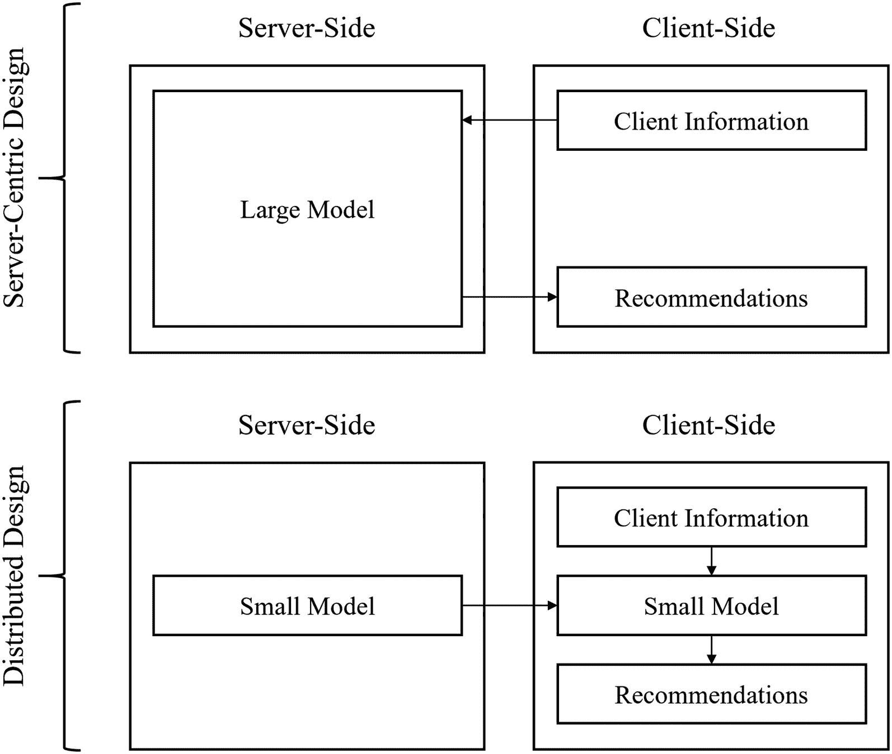

# 四、用于实际部署的模型压缩

> 我的抱负是用 10 句话说出其他人在一本书里说过的话。
> 
> —弗里德里希·尼采，哲学家兼作家 <sup>[1](#Fn1)</sup>

在最近几十年深度学习的匆忙发展过程中，模型压缩相对来说最近变得非常重要。毫无疑问，模型压缩方法已经存在并被记录了几十年，但深度学习最近发展的重点是扩展和增加深度学习模型的规模，以提高它们的预测能力。今天的很多现代卷积网络包含了上亿个参数，自然语言处理模型已经达到了几千亿*亿*个参数(并且还在统计)。

虽然这些大规模架构推进了深度学习可以做什么的边界，但它们的可用性和可行性通常仅限于研究实验室和组织内其他高性能部门的领域，这些部门拥有支持如此大规模操作的硬件和计算能力。*模型压缩*关注的是推进模型的“成本”,同时尽可能保持其性能。因为模型压缩的主要目的是最大化效率而不是性能，所以它是将深度学习进展从研究实验室转移到卫星和手机等实际应用的关键。

模型压缩通常是许多深度学习指南中缺失的一章，但重要的是要记住，深度学习模型越来越多地用于实际应用中，这对人们可以设计深度学习模型的广度施加了限制。通过学习模型压缩，您可以将深度学习设计的艺术建立在一个实用的框架中，以便部署和超越。

## 模型压缩简介

当我们执行模型压缩时，我们试图在尽可能保持模型性能的同时降低模型的“成本”。这里使用的术语“成本”故意模糊，因为它包含许多属性。存储和操作神经网络的最直接成本是它所拥有的参数数量。如果一个神经网络包含数千亿个参数，它将比包含数万个参数的网络占用更多的存储空间。移动电话等存储能力较低的应用甚至不太可能在现代深度学习设计的较大一端存储和运行模型。然而，还有许多其他因素——所有这些因素都相互关联——会影响运行深度学习模型的成本:

Note

由于模型压缩在很大程度上与部署有关，我们将使用相应的语言:“服务器端”和“客户端”粗略地说，出于本书的目的，“服务器端”指的是在服务于客户端的服务器上执行的计算，而“客户端”指的是在客户端的本地资源上执行的计算。



图 4-1

隐私需要一个小模型。虽然它可能无法完全量化，但它是模型成本的一个重要方面

*   *延迟*:深度学习模型的延迟是处理一个单位数据所花费的时间。延迟通常涉及部署的深度学习模型进行预测所需的时间。例如，如果你使用深度学习算法来推荐搜索结果或其他项目，高延迟意味着缓慢的结果。缓慢的结果会吓跑用户。延迟通常与模型的大小相关，因为较大的模型需要更多的时间。然而，模型的延迟也可能因其他因素而变得复杂，如计算的复杂性(假设某一层没有很多参数，但执行复杂、密集的计算或高度非线性的拓扑)。

*   *服务器端计算和功耗*:计算就是金钱！在许多情况下，深度学习模型存储在服务器端，服务器端不断计算预测，并将这些预测发送到客户端。如果你的模型在计算上是昂贵的，它将在服务器端招致沉重的文字成本。

*   隐私:在当今的技术环境中，这是一个抽象但日益重要的因素。遵循将所有用户信息发送到中央服务器进行预测的前述模式的服务(例如，将您的视频浏览历史发送到中央服务器以推荐新视频，然后发送回并显示在您的设备上)越来越受到隐私问题的困扰，因为所有用户信息都存储在中央位置的一个点上。新的分布式系统正被越来越多地使用(例如，联合学习)，其中模型的版本被发送到每个用户的个人设备，并产生对用户数据的预测，而无需将用户数据发送到中央位置。当然，这需要模型足够小，以便在用户的设备上合理操作。因此，不能在分布式部署中使用的大型模型可以被认为招致了缺乏隐私的代价(图 [4-1](#Fig1) )。

除了模型的实际性能之外，这些都是在部署过程中必须考虑的模型成本因素。成本低但性能差的模型不能比性能好但成本高的模型在实际应用中部署得更多。对神经网络的研究表明，神经网络包含一定量的冗余，即特定问题根本不需要的额外空间。这是有道理的:一小组架构设计可以容纳绝大多数的深度学习问题，但并不是所有的深度学习问题在难度上都是一样的，因此我们不应该期望每个问题对每个架构的“使用”都是一样的。消除冗余对性能没有任何影响，或者影响很小。不过，除了这种冗余，我们还面临着性能和成本之间的权衡。随着我们降低模型产生的成本，我们也降低了模型的性能(图 [4-2](#Fig2) )。


图 4-2

模型性能和模型压缩之间的假设关系，带有冗余阈值——持续模型压缩导致模型性能急剧下降之前的阈值——标记。实际关系可能因上下文和模型压缩类型而异

哪种组合是最佳的取决于您的特定任务和资源可用性。有时，与成本属性相比，性能并不是最重要的。例如，考虑一个移动应用上的深度学习模型，其任务是推荐要打开的应用或其他项目——在这里，模型是否完美并不重要，重要的是模型不会消耗太多的移动电话存储和计算。如果这样的应用消耗了他们电话的大量资源，即使这样的应用运行良好，用户也很可能对网络不满意。(事实上，深度学习甚至可能不是这种情况下的正确方法——更简单的机器学习或统计模型可能就足够了。)另一方面，考虑一种内置于医疗设备中的深度学习模型，该模型旨在快速诊断和建议医疗行动。对于模型来说，完全准确可能比快几秒钟更重要。

模型压缩令人着迷，因为它展示了完全解决深度学习问题所需的问题解决的真正广度。深度学习不仅关注通过指标改善模型性能，还关注开发可用于现实生活应用的实用深度学习。

它在推进对深度学习的理论理解方面也很有价值，因为它迫使我们提出关于神经网络和深度学习本质的关键问题:如果模型压缩可以如此有效地从网络中删除大量信息，而性能略有下降，那么网络中被压缩“远离”的原始组件最初有什么用途？神经网络训练从根本上来说是一个通过调整权重来改善解决方案的过程，还是一个 T2 发现的过程，在大量糟糕的解决方案中找到一个好的解决方案？网络对微小变化的鲁棒性有多强？我们将探讨这些问题，并讨论它们对实际部署的好处。

在本章中，我们将讨论三种关键的深度学习模型压缩算法:剪枝、量化和权重聚类。还存在其他深度学习模型压缩/缩减方法——特别是神经架构搜索(NAS)。但是，本章不讨论它，因为它在下一章更合适。

## 修剪

当您想到神经网络中的参数数量时，您可能会将参数与完全连接的密集网络中每层节点之间的连接联系起来，或者可能与卷积神经网络中的过滤器值联系起来。当您调用`model.summary()`并看到八位数或九位数的参数计数时，您可能会问:所有这些参数对于预测问题都是必要的吗？

如前所述，通过简单的推理，您可以合理地预期，很可能您没有构建具有“完美”数量的参数的神经网络架构来成功完成其任务，因此，如果网络没有表现不佳，它可能使用了比它真正需要的更多的参数。修剪是通过显式删除这些“多余”参数来解决这些问题的直接方法。此外，它在各种架构中的成功提出了理论深度学习中的重要问题。

### 普鲁士理论和直觉

想象一下，你想减少生活空间中的舒适——你认为可能有比你工作所需更多的东西，保持所有的舒适会增加你的生活成本。你已经改变了你的生活空间，着眼于最大限度地减少对你工作能力的影响——你仍然保留着你的电脑、良好的 Wi-Fi 和稳定的电力。然而，你已经减少了可能有助于你工作但从根本上来说是辅助性的舒适，比如取消或捐赠电视订阅、一张漂亮的沙发或当地交响乐的门票。

生活空间的这种变化理论上不应该影响你的工作，只要你有合理的弹性——你的精神设施没有受到明显的损害，不会损害你履行工作职能的能力(也许它会影响你的舒适度，但这不是这次讨论的一个因素)。与此同时，你设法削减了一般生活费用。

然而，你有点迷失方向:你本能地伸手去拿角落里一盏被移走的灯。你发现自己很失望，不能再无限制地看电视了。对这个空间做出这些改变需要*重新定位*自己。需要几个小时(甚至几天)的探索和适应来适应这些新的变化。一旦你完成了适应，你应该准备好在这个新改造的空间工作，就像你在以前的生活空间一样。

然而，应该注意的是，如果你以前的生活空间和你现在的生活空间差距太大，你可能永远无法恢复——例如，移走你的锻炼设备、所有娱乐资源和其他非常接近但仍不会直接影响你工作的物品。如果你通过减少自来水和电力来进一步削减生活成本，你的工作能力将会直接受损。

让我们倒回去:你退后一步，看看你的生活空间，决定它有太多不必要的舒适，你想削减这些舒适。你可以一下子拿走所有的舒适，但是你却决定直接的、绝对的差别可能对你来说太明显了。相反，你决定开始一个*迭代*之旅，在这个过程中，你每周移除一两件最不重要的东西，并且每当你觉得移除更多的东西会对你的核心工作设施造成损害时就停下来。这样，你就有时间适应一系列的小差异。

减少生活空间舒适性的逻辑与修剪的逻辑是并行的——它提供了一个有用的直观模型，可以用来判断如何进行修剪活动。

修剪最初是在 Yann le Cun 1990 年的作品“最佳大脑损伤”中构思的——并非所有参数都对输出有显著贡献，因此这些参数可以在最佳形式的“大脑”(神经网络)损伤中被修剪掉。

通常在网络已经被充分训练之后执行修剪，使得参数重要性的评估是有意义的，并且不仅仅基于随机初始化或训练早期阶段的值。以便确定哪些神经网络实体(节点、连接、层等。)对输出的贡献最大或最小，则必须根据一些重要性标准来评估每个实体。最不重要的实体被删除(图 [4-3](#Fig3) )。在实践中，移除简单地意味着将参数设置为零，这样存储起来要便宜得多。


图 4-3

非结构化修剪的可视化

这种删除整个连接、节点和其他神经网络实体的行为可以被认为是一种架构修改的形式。为了获得最佳性能，需要通过微调将模型重新定向到新的架构。这种微调可以简单地通过在更多数据上训练新架构来执行。

因此，修剪遵循以下一般迭代过程(图 [4-4](#Fig4) )。


图 4-4

修剪过程

在这种意义上，您可以将修剪视为“定向”丢弃，其中连接不是随机丢弃的，而是根据重要性标准进行修剪。因为修剪是定向的而不是随机的，所以与丢弃的权重的合理百分比相比，可以以合理的性能修剪更极端百分比的权重。

实现修剪时，可以指定要修剪的参数的初始百分比和要修剪的参数的结束百分比；TensorFlow 将为您计算出每一步要移除多少。

已经提出了许多评估参数重要性的方法:

*   幅度修剪:这是最简单的修剪形式:如果一个权重较高，它就被认为更重要。给定足够的微调，较小的权重不太重要，并且可以被删减，对模型性能几乎没有影响。尽管已经提出了许多更复杂的方法，但是它们通常不能实现比幅度修剪高得多的性能。我们将在本书中使用基于幅度的剪枝方法。

*   *滤波器修剪*:修剪卷积神经网络需要额外的考虑，因为修剪一个滤波器需要移除下面所有不再存在的输入通道。在卷积网络中，使用基于幅度的修剪方法(滤波器中的平均权重值)效果很好。

*   *对性能影响最小*:更复杂的压缩方法是选择权重或其他网络实体，以最大程度地减少神经网络成本变化。

仅修剪连接的操作被称为非结构化修剪。非结构化修剪会导致稀疏矩阵，这在许多情况下会导致计算困难和效率低下。通过修剪其他较大的神经网络实体，您可能能够以降低精度(和潜在的较低性能)为代价实现甚至更好的压缩。

*   *修剪* *神经元*:取一个神经元的传入和传出权重的平均值，使用基于幅度的方法完全去除多余的神经元。其他更复杂的标准可以用来修剪整个神经元。这允许更快地移除多组权重，这在大型架构中很有帮助。

*   *修剪* *块*:块稀疏格式在内存中连续存储块，以减少不规则的内存访问。修剪整个内存块类似于修剪成簇的网络部分的神经元，但更注重硬件的性能和能效。

*   *修剪* *层*:层可以通过基于规则的方法进行修剪——例如，在训练过程中每三层修剪一次，这样模型在训练过程中会慢慢缩小，但会适应和压缩信息。图层的重要性也可通过其他分析来确定，这些分析可确定图层对模型输出的影响。

每个神经网络和每个任务都需要不同的雄心勃勃的修剪运动；一些神经网络已经建立得相对较轻，进一步的修剪可能会严重损害网络的关键处理设施。另一方面，在简单任务上训练的大型网络可能不需要其绝大多数参数。

使用修剪，90%到 95%的网络参数可以被可靠地修剪掉，而对性能几乎没有损害。

### 修剪实施

为了实现修剪(以及其他模型压缩方法)，我们将需要其他库的帮助。TensorFlow 模型优化库与 Keras/TensorFlow 模型一起使用，但单独安装(`pip install tensorflow-model-optimization`)。应当注意，TensorFlow 模型优化库相对较新，因此不如较大的库开发得好；您可能会遇到一个相对较小的论坛社区来处理警告和错误。但是 TensorFlow 模型优化文档写得很好，包含了额外的例子，必要时可以参考。我们还需要`os`、`zipfile`和`tempfile`库(默认情况下应该包含在 Python 中)，这些库允许我们了解运行深度学习模型的成本。

尽管 TensorFlow 模型优化大大有助于实现修剪所需的代码，但它涉及几个步骤，需要有条不紊地进行。此外，请注意，由于剪枝和模型压缩方面的密集工作相对较新，在撰写本书时，TensorFlow 模型优化不支持各种剪枝标准和调度。但是，它当前的产品应该能够满足大多数压缩需求的修剪需求。

#### 设置数据和基准模型

在本节中，为了简单起见，我们将在 MNIST 数据的表格版本上训练(并删减)一个前馈模型。不过，这种逻辑也适用于其他更复杂的架构，比如卷积或循环神经网络。

您可以直接从`keras.datasets`加载 MNIST 数据，并使用 numpy 和`keras.utils`进行必要的调整(列表 [4-1](#PC1) )。

```py
# import keras
import keras

# load mnist data
mnist = keras.datasets.mnist
(x_train, y_train), (x_test, y_test) = mnist.load_data()

# reshape from image data (28,28) into flat data (784,)
x_train = x_train.reshape((len(x_train), 28*28))
x_test = x_test.reshape((len(x_test), 28*28))

# one-hot encode labels
y_train = keras.utils.to_categorical(y_train)
y_test = keras.utils.to_categorical(y_test)

Listing 4-1Loading MNIST data

```

MNIST 数据集显然是一个相对简单的数据集，但对于我们的基准模型，我们将构建一个故意冗余的模型，其神经元和层数比所需的多得多。这个模型(清单 [4-2](#PC2) )将包含 10 个隐藏层，每组两层包含相同的 2 的递减幂(从 512 到 32)，这样隐藏层中的神经元数量为 512-512-256-256-128-128-…

```py
# import layers
import keras.layers as L
# construct Sequential model
model = keras.Sequential()

# construct Input
model.add(L.Input((784,)))

# construct processing layers
for i in list(range(5,10))[::-1]:
    model.add(L.Dense(2**i, activation='relu'))
    model.add(L.Dense(2**i, activation='relu'))

# construct output layer
model.add(L.Dense(10, activation='softmax'))

Listing 4-2Constructing a simple and redundant baseline model

```

我们可以用合适的参数相应地编译和拟合模型(清单 [4-3](#PC3) )。

```py
model.compile(optimizer='adam',
              loss='categorical_crossentropy',
              metrics=['accuracy'])
model.fit(x_train, y_train, epochs=15)

Listing 4-3Compiling and fitting baseline model

```

#### 创建成本指标

如简介中所述，模型压缩是一种权衡。为了了解压缩的优势，我们需要创建一些成本指标进行比较，以便更好地了解存储空间、参数数量和延迟等因素。这些度量不仅可以应用于剪枝模型，而且通常可以应用于压缩模型；它们充当导航压缩权衡的北极星。

##### 存储大小

要获得用于存储压缩模型的文件的大小，我们需要遵循以下过程:

1.  创建一个临时文件来存储模型权重。

2.  将模型权重存储在创建的临时文件中。

3.  创建一个临时文件来存储压缩的模型权重文件。

4.  获取并返回压缩文件的大小。

让我们从导入必要的库开始(清单[4-4](#PC4))—`zipfile`提供压缩功能，`tempfile`允许创建临时文件，`os`允许获取特定文件的大小。

```py
import zipfile as zf, tempfile, os

Listing 4-4Importing necessary libraries for storage size

```

`tempfile.mkstemp('.ending')`函数允许我们创建一个带有特定文件结尾的临时文件。该函数返回一个元组，其中第一个元素是打开文件的 OS 级句柄，第二个元素是文件的路径名。因为我们只关心文件的路径，所以我们忽略了第一个元素。

获得创建的路径后，我们可以将模型的权重保存到该路径。不过，Keras/TensorFlow 提供了许多其他保存模型的方法，您可能希望根据应用来使用这些方法。使用`model.save_weights()`只保存模型的权重，而不保存其他属性，如可重载的架构。您可以保存整个模型，这样它就可以完全重新加载，用于推理或用`keras.models.save_weights(model, path)`进行进一步的训练。如果不需要优化器，则将`include_optimizer`设置为`False`(重新加载模型只是为了推断，而不是为了进一步训练)。

可以使用这些组件定义该功能，如下所示(列表 [4-5](#PC5) )。

```py
def get_size(model):

    # create file for weights
    _, weightsfile = tempfile.mkstemp(".h5")

    # save weights to file
    model.save_weights(weightsfile)

    # create file for zipped weights file
    _, zippedfile = tempfile.mkstemp(".zip")

    # zip weights file
    with zf.ZipFile(zippedfile, "w",
                    compression=zf.ZIP_DEFLATED) as f:
        f.write(weightsfile)

    # return size of model, in megabytes
    return str(os.path.getsize(zippedfile)/float(2**20))+' MB'

Listing 4-5Writing function to get the size to store a model

```

为了获得模型所需的存储，我们只需将模型对象作为参数传递给`get_size`函数。

我们可以比较压缩的未修剪模型和压缩的修剪模型所需的存储容量。由于固定的存储要求以及不同模型体系结构和其他属性存储方式的变化，对存储要求进行删减的结果可能会有所不同。

##### 潜伏

虽然延迟可以通过多种方式计算，并针对特定应用进行多种调整，但在这种情况下，网络延迟只是指网络对之前未见过的样本进行预测所花费的平均时间量(列表 [4-6](#PC6) )。

```py
import time
def get_latency(model):
    start = time.time()
    res = model.predict(x_test)
    end = time.time()
    return (end-start)/(len(x_test))

Listing 4-6Writing function to get the latency of a model

```

尽管在某些情况下这可能无关紧要，但是对培训和部署的分离做出有意识的决定是一个很好的实践。在这种情况下，延迟是一个指标，旨在了解模型在部署环境中的推理速度，这意味着它将对以前没有见过的数据进行推理。这些决定允许头脑清晰。

##### 参数度量

参数的数量并不是真正面向目标的度量，这意味着参数的数量不能用来精确地表示存储或运行模型的实际成本。但是，它很有用，因为它是修剪对模型中参数数量的影响的直接度量。请注意，虽然存储和延迟适用于所有压缩方法，但与原始模型中的参数数量相比，计算删减参数的数量仅适用于删减。

您可以通过`model.get_weights()`获得模特的体重列表。对于顺序模型，索引第 *i* 层对应于第 *i* 层中的权重。对层的权重调用`np.count_nonzero()`会返回该层中非零参数的数量。重要的是计算非零参数的数量，而不是参数的数量；回想一下，在实践中，删减的权重被简单地设置为 0。

因此，我们可以使用列表理解找到模型中参数的总数:`sum([np.count_nonzero(l) for l in orig_model.get_weights()])`。使用原始模型和修剪模型的参数计数，我们可以获得一个修剪后的原始权重比，表明原始权重的多少部分在修剪中被保留，以及压缩比，表明原始权重的多少部分被修剪掉(清单 [4-7](#PC7) )。

```py
from numpy import count_nonzero as nz
def get_param_metrics(orig_model, pruned_model):

    orig_model_weights = orig_model.get_weights()
    om_params = sum([np.nz(l) for l in orig_model_weights])

    p_model_weights = pruned_model.get_weights()
    p_params = sum([np.nz(l).size for l in p_model_weights])

    return {'Original Model Parameter Count:': om_params,
            'Pruned Model Parameter Count': p_params,
            'Pruned to Original Weights Ratio': p_params/om_params,
            'Compression Ratio': 1 - p_params/om_params}

Listing 4-7Writing function to get parameter metrics

```

该函数提供了一种简单快捷的方法来比较修剪前后的参数数量。

#### 修剪整个模型

先导入 TensorFlow 模型优化库作为其常用缩写，`tfmot`(列表 [4-8](#PC8) )。

```py
import tensorflow_model_optimization as tfmot

Listing 4-8Importing TensorFlow Model Optimization

```

首先，我们需要为修剪提供几个参数:

*   *初始稀疏度*:开始的初始稀疏度。例如，初始稀疏度`0.50`指示网络从其 50%的参数被修剪开始。

*   *最终稀疏度*:剪枝完成后达到的最终稀疏度。例如，`0.95`的最终稀疏度指示当修剪完成时，95%的网络被修剪。

*   *开始步骤*:开始的步骤。这通常为 0，以删除全部数据。

*   *结束步*:训练数据的步数。

*   *频率*:执行修剪的频率(即每`[frequency]`步修剪一次网络)。

这里，一个步骤表示一个批次，因为网络通常在每个批次之后执行更新。假设开始步骤为 0，结束步骤指示网络在训练期间应该运行的批次总数。我们可以算成。(请注意，Keras 中的默认批量大小是 32。)

这些参数将被传递到修剪计划中(清单 [4-9](#PC9) )。在这种情况下，我们使用多项式衰减，其中权重以多项式方式被连续修剪，使得被修剪的权重的百分比从初始稀疏度增加到最终稀疏度。更新频率应该足够小，使得修剪期间稀疏度的每次增加不会太大，但是足够大，使得网络有时间适应修剪操作。在这种情况下，我们从 50%的稀疏度开始，并努力删除网络中 95%的参数。

```py
from tfmot.sparsity.keras import PolynomialDecay as PD
schedule = PD(initial_sparsity=0.50,
              final_sparsity=0.95,
              begin_step=0,
              end_step=end_step,
              frequency=128)

Listing 4-9Creating a polynomial decay schedule for pruning

```

TensorFlow Model Optimization 还提供了`ConstantSparsity`计划(`tfmot.sparsity.keras.ConstantSparsity`)，该计划在整个训练过程中保持恒定的稀疏度。恒定稀疏度在整个训练过程中保持相同的稀疏度，而不是缓慢增加修剪参数的百分比。虽然多项式衰减通常是优选的，但是这对于较简单的任务可能更为理想，因为它允许网络适应删减的参数。

这个时间表可以传递到一个参数字典中(清单 [4-10](#PC10) )。该参数字典被解包，并与要修剪的模型一起用作`sparsity.prune_low_magnitude function`中的参数，该参数自动修剪低幅度的权重。

```py
pruning_params = {
    'pruning_schedule': schedule
}
pruned_model = tfmot.sparsity.keras.prune_low_magnitude(model, **pruning_params)

Listing 4-10Creating a pruned model with pruning parameters. If you are unfamiliar, the ** kwargs syntax in Python passes the dictionary keys and values as parameter inputs to a function

```

回想一下，在修剪过程中，应该在修剪开始之前对模型进行充分的数据训练。然而，我们将我们的修剪模型建立在我们已经预先训练过的原始的未修剪模型上。重量被转移。如果不执行预训练，修剪的结果可能会更差。

这个模型可以像标准的 Keras 模型一样对待。在训练之前，需要进行编译，就像任何 Keras 模型一样(列表 [4-11](#PC11) )。

```py
pruned_model.compile(loss='categorical_crossentropy',
                     optimizer='adam',
                     metrics=['accuracy'])

Listing 4-11Compiling a pruned model

```

为了执行修剪步骤，我们需要使用`UpdatePruningStep()`回调。该回调可用于装配(清单 [4-12](#PC12) )。

```py
update_pruning = tfmot.sparsity.keras.UpdatePruningStep()
pruned_model.fit(x_train, y_train,
                 epochs=15,
                 callbacks=[update_pruning])

Listing 4-12Fitting a pruned model with the Update Pruning Step callback

```

在修剪过程中，TensorFlow 模型优化会自动添加参数来帮助修剪-每个参数都被屏蔽。如果您在这个阶段计算模型的参数数量，您会注意到它比最初的参数数量要多得多。

为了收获修剪的果实，使用`tfmot.keras.sparsity.strip_pruning`移除修剪训练过程中的工件:`pruned_model = tfmot.keras.sparsity.strip_pruning(pruned_model)`。这是必要的，加上标准的压缩算法，以实现压缩的好处。

修剪完成后，最好通过重新编译并再次拟合数据来微调模型(清单 [4-13](#PC13) )。

```py
pruned_model.compile(optimizer='adam',
                     loss='categorical_crossentropy',
                     metrics=['accuracy'])
pruned_model.fit(x_train, y_train, epochs=10)

Listing 4-13Fine-tuning after a model has been pruned

```

微调之后，您可以评估`pruned_model`的性能，以了解性能的下降以及压缩和成本的提高。

如果要保存模型，调用`pruned_model.save(filepath)`。当重新加载时，确保您在`tfmot.sparsity.keras.prune_scope`范围下重新加载模型，这允许对保存的模型进行反序列化(清单 [4-14](#PC14) )。

```py
with tfmot.sparsity.keras.prune_scope():
    pruned_model = keras.models.load_model(filepath)

Listing 4-14Fine-tuning after a model has been pruned

```

如果您只保存权重(`model.save_weights()`)，读取通过模型检查点回调修剪的模型，或者使用保存的模型(`tf.saved_model.save(model, filepath)`)，则修剪范围下的反序列化是不必要的。

#### 修剪单独的层

回想一下，在修剪整个模型时，我们在整个模型上调用了 tfmot.keras. `sparsity.prune_low_magnitude()`。修剪单个层的一种方法是在编译单个层时调用 tfmot.keras. `sparsity.prune_low_magnitude()`。这与功能 API 和顺序 API 中的层对象兼容。

在这个神经网络的例子中，除了输入层之后和输出层之前的第一个和最后一个密集层之外，我们修剪所有层(列表 [4-15](#PC15) )。在选择要修剪的图层时，避免过分修剪负责特征提取的初始图层和对模型的知识构建能力至关重要的图层。

```py
from tfmot.sparsity.keras import prune_low_magnitude as plm

pruned_model = keras.Sequential()
pruned_model.add(L.Input((784,)))
pruned_model.add(L.Dense(2**9))
pruned_model.add(plm(L.Dense(2**8), **pruning_params))
pruned_model.add(plm(L.Dense(2**7), **pruning_params))
pruned_model.add(plm(L.Dense(2**6), **pruning_params))
pruned_model.add(plm(L.Dense(2**5)))
pruned_model.add(L.Dense(10, activation='softmax'))

Listing 4-15Pruning individual layers by adding wrappers around layers. Activations are left out for the purpose of brevity

```

独立修剪层的好处是，您可以对不同的层使用不同的修剪计划，例如，通过减少修剪开始时参数较少的层。然后可以编译该模型，并使用前面讨论过的`UpdatePruningStep()`回调函数进行调整，之后再进行微调。

然而，这种选择要修剪的层的方法的缺点是，在修剪之前不能进行任何预训练，因为层从它们被定义时就被包装在修剪包装器中。与修剪前对数据进行预处理相比，这会导致更差的结果。为了在已经训练好的模型上选择特定的层进行修剪，我们需要使用带有克隆功能的`keras.models.clone_model(model)`来*克隆*该模型。克隆功能将每一层映射到另一层；在这种情况下，我们可以使用图层的修剪版本来映射我们想要修剪的图层(图 [4-5](#Fig5) )。


图 4-5

选择要修剪图层的克隆函数法

让我们构建一个克隆函数，它要么将一个层映射到其自身的修剪版本，要么如果我们不想对其执行修剪，则返回原始层(清单 [4-16](#PC16) )。有许多方法可以选择量化哪些层；您可以修剪某些类型的图层、按名称修剪图层、修剪图层在网络中的位置等。如果一个层满足剪枝的条件，我们返回包装在剪枝包装中的层。否则，我们原封不动地返回图层。

```py
def cloning_func(layer):

    # is it a Dense layer?
    if isinstance(layer, keras.layers.Dense):
        return plm(layer)

    # does it have a certain name?
    if layer.name == 'dense5':
        return plm(layer)

    # if does not meet any conditions for pruning
    return layer

Listing 4-16Defining a cloning function to map a layer to the desired state

```

使用这个函数，我们可以在克隆原始模型时通过将它作为克隆函数传递来注释模型(清单 [4-17](#PC17) )。

```py
pruned_model = keras.models.clone_model(
    model,
    clone_function = cloning_func
)

Listing 4-17Using the cloning function with Keras’ clone_model function

```

然后，像往常一样编译和安装(使用更新修剪步骤回调)。

### 理论深度学习中的修剪:彩票假说

剪枝是一种特别重要的方法，不仅用于模型压缩，而且用于推进对深度学习的理论理解。乔纳森·弗兰克尔(Jonathan Frankle)和迈克尔·卡宾(Michael Carbin)在 2019 年发表的论文“彩票假说:寻找稀疏、可训练的神经网络” <sup>[2](#Fn2)</sup> 建立在修剪的经验成功基础上，以制定彩票假说，这是一个理论假说，重新定义了我们如何看待神经网络知识表示和学习。

修剪已经证明，神经网络中的参数数量可以减少 90%以上，而对性能指标几乎没有损害。但是，修剪的前提条件是必须在大型模型上进行修剪；与修剪后的网络大小相同的小的、经过训练的网络仍然不会像修剪后的网络那样运行。已经观察到，修剪的一个关键组成部分是*减少*的元素；这些知识必须首先通过一个大型模型来学习，然后通过迭代减少到更少的参数。人们不能从模仿修剪模型的架构开始，并期望产生与修剪模型相当的结果。这些发现是彩票假说的经验动机。

彩票假说指出，初始化的网络包含子网，当孤立地训练时，这些子网达到与具有相似训练量的原始网络相当的性能。这些获胜的子网被称为“获胜标签”它在 Frankle 和 Carbin 的论文中正式提出如下:

> 一个随机初始化的密集神经网络包含一个子网络，该子网络被初始化，使得在隔离训练时，它可以在最多相同次数的迭代训练后匹配原始网络的测试精度。

彩票假说的主要贡献在于解释了权重初始化在神经网络开发中的作用:以方便的初始化值开始的权重被优化器“挑选”出来，并“开发”成在最终训练好的网络中扮演有意义的角色。当优化器确定如何更新某些权重时，神经网络内的某些子网被委派承载大部分信息流，这仅仅是因为它们的初始化权重是激发增长的正确值。另一方面，以差的初始值开始的权重作为不便和多余的权重变暗；这些都是在修剪中被修剪掉的“丢票”。修剪揭示了包含“中奖票”的架构神经网络正在运行巨大的彩票；“赢家”被放大，“输家”被衰减。

你可以从这个角度把神经网络想象成一个巨大的包裹，里面有一个微小的有价值的产品和许多填充物。绝大多数的价值存在于实际包装的一小部分中，但是你首先需要包装来找到里面的产品。然而，一旦你有了产品，就不再需要盒子了。相应地，鉴于初始化值是网络成功的关键，您可以用相同的相应初始化值重新训练修剪后的模型架构，并获得与原始网络相似的性能。

这个假设重新定义了我们如何看待神经网络的训练过程。机器学习模型的传统观点一直是，模型从一组“坏”参数(“初始猜测”)开始，通过找到使损失函数最大程度减少的更新来迭代改进这些参数。然而，随着现代神经网络的庞大甚至可能的“过度参数化”，彩票假说暗示了一种理解训练的新逻辑:学习主要是一个不仅是*提高*而且是*搜索*的过程。通过搜索有希望的子网络和改进有希望的子网络以变得更有希望的交替模式来开发有希望的子网络。这种在现代深度学习的大背景下理解参数更新的新视角可能会推动理论理解和实践发展的进一步创新。例如，我们现在了解到，权重的初始化在子网的成功中起着关键作用，这可以指导进一步的研究，以了解权重初始化如何相对于训练的子网性能进行操作。

彩票假说解释了深度学习中许多观察到的现象，超越了修剪的成功和动态:

*   人们经常观察到，增加神经网络的参数化会导致性能的提高。彩票假说告诉我们，过度参数化不一定固有地与更大的预测能力联系在一起，但是具有更大量参数的网络能够运行更大的彩票，从而产生更好和更多的中奖彩票。如果彩票假说是真的，它可能会为如何提高中奖彩票的质量而不是蛮干增加彩票运营的规模提供一个北极星。

*   已经观察到，将所有权重初始化为 0 的性能比随机化权重的其他初始化方法差得多。彩票假说告诉我们，网络依赖于初始随机权重的多样性来选择特定的中奖彩票。如果所有的权重都是 0，网络从一开始就不能区分有前途的子网。

因为修剪去除了“失败的票据”，所以 Frankle 和 Carbin 提出了一种基于修剪的方法来识别成功的票据:

1.  随机初始化一个神经网络。

2.  训练神经网络直到收敛。

3.  修剪掉训练好的神经网络中的 *p* %的参数。

4.  将未修剪的参数重置为其原始初始值。

彩票假说和无疑在我们对神经网络的理解方面的进一步理论进展(由模型压缩中的经验观察现象指导)将继续作为加速改进我们的模型建立方法的垫脚石。

## 量化

虽然修剪减少了参数的数量，但是量化降低了每个参数的精度。因为每个被量化的参数都不太精确，所以模型作为一个整体需要更少的存储空间，并且减少了延迟。用 TensorFlow 模型优化实现量化的过程与实现剪枝的过程非常相似。

### 量子化理论和直觉

传统上，神经网络使用 32 位来表示参数；虽然这对于具有使用这种精度的计算能力的现代深度学习环境中的训练来说是好的，但是在需要更低存储和更快预测的应用中是不可行的。在量化中，参数从 32 位表示减少到 8 位整数表示，导致内存需求减少四分之三。

在数学中，量化是一组连续值到一组更小的离散值的映射(图 [4-6](#Fig6) )。在深度学习中，量化是指一系列广泛的方法，可用于通过类似的方法来降低参数的精度。通常，这是通过将值分成信息桶来实现的。在二进制量化中，值被量化到两个桶中；在三进制量化中，值被量化成三个桶。然而，二进制和三进制量化可能过于极端，这就是为什么大多数部署的模型采用多位到多位量化方法。如何放置这些仓、每个仓有多大以及执行该映射的其他参数取决于所使用的量化策略。


图 4-6

连续与分仓、离散表示

(您可以将基于幅度的修剪视为量化的一种选择性形式，其中幅度小于某个阈值的权重被“量化为 0 ”,其他权重被归入自身。)

回忆一下生活空间的比喻进行修剪。与其直接从你的生活空间中移除某些物品，不如想象一下把保留每一件物品的成本降低一点。你决定降低你的电视订阅等级，减少你电灯的耗电量，一周叫一次外卖而不是一周两三次，以及其他一些补偿来降低你的体验成本。

后处理量化是在模型被训练之后对其执行的量化过程。虽然这种方法实现了良好的压缩率，并具有减少等待时间的优点，但是通过量化在每个权重中执行的小的近似中的误差会累积，并导致性能的显著下降。

像修剪的迭代方法一样，量化通常不会一次在整个网络上执行——这是一个太不和谐的变化，就像一次修剪掉网络 95%的参数无助于恢复一样。相反，在对模型进行预训练后——理想情况下，预训练会开发出有意义且健壮的表示，可用于帮助模型从压缩中恢复——模型会经历量化感知训练，即 QAT(图 [4-7](#Fig7) )。

在整个量化感知训练中，模型本身保持未量化，用标准 32 位表示其所有参数。然而，需要考虑量化误差:在网络的前馈阶段，网络的输出与网络被量化时的输出相同。也就是说，在任何预测之前，网络经历“模拟量化”——为了预测的目的，其参数被量化。这个模拟的量化输出用于更新模型参数，这些参数仍然是未量化的。因此，虽然模型本身在整个量化感知训练中保持未量化，但它学习开发参数，这些参数将在模型被量化时继承*。该模型未量化，因为用更精确的参数更新模型参数要容易得多。*


图 4-7

量化感知训练

在量化感知训练之后，模型被正式量化——它的参数被分箱，并且它使用 8 位整数表示(或者一些其他表示，取决于实现)。由于量化感知训练的准备工作，该模型在量化时应开发出稳健且成功的参数(图 [4-8](#Fig8) )。


图 4-8

量化过程

通过量化，模型的存储需求和延迟可以显著降低，而对性能几乎没有影响。

### 量化实现

像修剪一样，您可以量化整个模型或单独量化层。

#### 量化整个模型

量化需要预训练以获得最佳性能。让我们首先根据 15 个时期的 MNIST 数据拟合一个大型基础模型(清单 [4-18](#PC18) )。

```py
import keras
import keras.layers as L

model = keras.Sequential()
model.add(L.Input((784,)))
for i in list(range(5,10))[::-1]:
    model.add(L.Dense(2**i, activation='relu'))
    model.add(L.Dense(2**i, activation='relu'))
model.add(L.Dense(10, activation='softmax'))
model.compile(optimizer='adam',
              loss='categorical_crossentropy',
              metrics=['accuracy'])
model.fit(x_train, y_train, epochs=15)

Listing 4-18Base model for MNIST data; this will be used for applying quantization

```

该特定模型获得了 0.0387 的训练损失和 0.9918 的训练精度。在评估中，它的损失分数为 0.1513，准确度为 0.9720。训练和测试性能之间的这种差异表明某种压缩方法可能适用于这里。

要对整个模型执行量化感知训练，从`tfmot.quantization.keras`导入`quantize_model`函数，并将其应用于模型(清单[4-19](#PC19))；这在每一层上执行“量化注释”,允许量化感知训练。因为这从模型中移除了优化器，所以我们需要重新编译它。

```py
from tfmot.quantization.keras import quantize_model
qat_model = quantize_model(model)
qat_model.compile(optimizer='adam',
                   loss='categorical_crossentropy',
                   metrics=['accuracy'])

Listing 4-19Setting up Quantization Aware Training

```

调用`quantized_model.evaluate(x_test, y_test)`，你会注意到模型表现很差。就像适应一个新的生活空间一样，我们需要对量化模型进行一些额外的训练。当执行这种额外的微调时，请确保您有一个较高的批量，并为少量的时期进行训练(列表 [4-20](#PC20) )。在低精度训练中，小批量训练会导致激进的体重更新，这种体重更新会导致体重下降而无法恢复。几个时期的大批量训练应该足以将模型导向良好的性能。

```py
qat_model.fit(x_train, y_train,
              batch_size=512,
              epochs=3)

Listing 4-20Performing Quantization Aware Training

```

现在，这个模型是*量子化感知的*，这意味着它拥有量子化的必要设施，但它在技术上不是量子化的。为了获得量化的好处，我们需要将模型转换成 TFLite 模型，这是 TensorFlow 针对轻量级应用的解决方案(清单 [4-21](#PC21) )。

```py
converter = tf.lite.TFLiteConverter.from_keras_model(
    qat_model)
converter.optimizations = [tf.lite.Optimize.DEFAULT]
quantized_tflite_model = converter.convert()

Listing 4-21Converting to TFLite model to actually quantize model

```

然后，我们可以保存并压缩我们的 TFLite 模型，以查看存储优势(清单 [4-22](#PC22) )。

```py
# store TFLite model
with open('model.tflite', 'wb') as f:
    f.write(quantized_tflite_model)

# zip the file the model is stored in
_, zippedfile = tempfile.mkstemp(".zip")
with zf.ZipFile(zippedfile, "w",
                compression=zf.ZIP_DEFLATED) as f:
    f.write('model.tflite')

# output size of model
str(os.path.getsize(zippedfile) / float(2 ** 20)) + ' MB'

Listing 4-22Realizing storage benefits from TFLite model

```

像修剪模型一样，您可以通过各种模型保存和权重保存方法将模型存储到文件路径中。如果通过直接保存整个模型来加载权重，请确保在范围`tfmot.quantization.keras.quantize_scope`下重新加载模型。

#### 量化各个层

像修剪一样，量化单个层提供了特异性的优势，因此性能下降更小，压缩成本可能比完全量化的模型更小。

当选择哪些层可以被量化时，可以使用`tfmot.quantization.keras.quantize_annotate_layer`，当在顺序或函数 API 中使用它时，可以将它包裹在层周围，就像`prune_low_magnitude()`一样。量化单个层时，尝试量化后面的层，而不是初始层。

如果您正在部署量化模型，请记住一些后端可能只支持完全量化的模型。在这种情况下，您会想要量化整个模型，而不是选择某些层来量化(清单 [4-23](#PC23) )。

```py
from tfmot.quantization.keras import quantize_annotate_layer as qal

annotated_model = keras.Sequential()
annotated_model.add(L.Input((784,)))
annotated_model.add(qal(L.Dense(2**9)))
annotated_model.add(L.Activation('relu'))
annotated_model.add(qal(L.Dense(2**8)))
annotated_model.add(L.Activation('relu'))
annotated_model.add(qal(L.Dense(2**7)))
annotated_model.add(L.Activation('relu'))
annotated_model.add(L.Dense(2**6, activation='relu'))
annotated_model.add(L.Dense(2**5, activation='relu'))
annotated_model.add(L.Dense(10, activation='softmax'))

Listing 4-23Quantizing individual layers by wrapping quantization annotations to individual layers while defining them

```

注意，在这一点上，你应用了`quantize_annotate_layer`的层只是被注释了。为了将它们转换成实际的量化层，我们需要使用`quantize_apply`(列表 [4-24](#PC24) )。

```py
from tfmot.quantization.keras import quantize_apply
quantized_model = quantize_apply(annotated_model)

Listing 4-24Applying quantization to the annotated layers

```

当使用`quantize_model`量化整个模型时，不需要`quantize_apply`函数，因为`quantize_model`函数作为一种“快捷方式”,在可以应用“默认”参数的一般情况下，它会自动注释和应用量化(即，不需要通过量化特定层进行定制)。

然后，可以使用前面讨论过的相同训练原则来编译和拟合该模型——低时期数、高批量。

像修剪一样，选择要量化的层的首选方法是定义一个克隆函数并使用`keras.models.clone_model(model)`(列表 [4-25](#PC25) )。

```py
def cloning_func(layer):

    # is it a Dense layer?
    if isinstance(layer, keras.layers.Dense):
        return qal(layer)

    # does it have a certain name?
    if layer.name == 'dense5':
        return qal(layer)

    # if does not meet any conditions for quantization
    return layer

Listing 4-25Defining a quantization annotation cloning function

```

使用这个函数，我们可以在克隆原始模型时通过将它作为克隆函数传递来注释模型(清单 [4-26](#PC26) )。

```py
annotated_model = keras.models.clone_model(
    model,
    clone_function = cloning_func
)

Listing 4-26Applying the cloning function to a (pretrained) base model

```

然后，将`quantize_apply`函数应用于带注释的模型，并像平常一样进行编译和拟合。

## 权重聚类

权重聚类当然不太受欢迎，但仍然是非常有价值和简单的模型压缩方法(图 [4-9](#Fig9) )。

### 权重聚类理论与直觉

权重聚类是剪枝和量化的结合——它通过略微调整每个权重值来减少*唯一*权重的数量。给定用户指定数量的聚类 *n* ，权重聚类算法为每个权重值分配一个聚类，并将权重值设置为该权重值的质心(图 [4-9](#Fig9) )。


图 4-9

权重聚类

属于一个簇的权重都共享相同的值，因此允许更有效的存储方式。类似于量化，存储需求的减少是一个精度问题；每个参数的精确值可以由相关质心值的索引代替。这些精确值可以在质心值的可索引列表中存储一次(图 [4-10](#Fig10) )。(注意，即使不使用这种质心索引方法，压缩算法也能够利用重复值。)


图 4-10

通过索引的权重聚类

权重聚类中的关键参数是确定聚类的数量。像要修剪的参数百分比一样，这是性能和压缩之间的权衡。如果簇的数量非常多，则每个参数从其原始值到其指定的质心值的变化非常小，从而允许更高的精度和更容易从压缩操作中恢复。但是，由于增加了存储质心值和潜在索引本身的存储需求，它降低了压缩结果。另一方面，如果聚类的数量太少，模型的性能可能会受到严重损害，以至于无法恢复——模型可能无法在某一组固定参数的情况下合理运行。

### 权重聚类实现

与修剪和量化一样，您可以对整个模型或单个层的权重进行聚类。

#### 整个模型上的权重聚类

像修剪和量化一样，权重聚类需要预训练`model`。为了对模型执行权重聚类，我们首先需要提供聚类参数。有两个关键参数需要提供:聚类的数量和质心初始化的方法。虽然在这个例子中选择的初始化方法是基于密度的采样，但是您也可以使用`CentroidInit.LINEAR`，其中簇质心在最小值和最大值之间均匀分布；`CentroidInit.RANDOM`，质心从最小值和最大值之间的均匀分布中随机抽取；以及`CentroidInit.KMEANS_PLUS_PLUS`，它使用 K-means++算法(列表 [4-27](#PC27) )。

```py
CentroidInit = tfmot.clustering.keras.CentroidInitialization

clustering_params = {
    'number_of_clusters': 30,
    'cluster_centroids_init': CentroidInit.DENSITY_BASED
}

Listing 4-27Defining clustering parameters

```

要对整个模型执行聚类，使用带有指定参数的`tfmot.clustering.keras`中的`cluster_weights()`函数(清单 [4-28](#PC28) )。

```py
from tfmot.clustering.keras import cluster_weights
clustered_model = cluster_weights(model, **clustering_params)

Listing 4-28Creating a weight-clustered model with the specified clustering parameters

```

然后，可以对权重聚类模型进行编译，并根据原始数据进行拟合，以进行微调。

为了实现聚类的压缩优势，使用`strip_clustering()`从权重聚类中清除任何工件的模型(清单 [4-29](#PC29) )。

```py
from tfmot.clustering.keras import strip_clustering
final_model = strip_clustering(clustered_model)

Listing 4-29Stripping clustering artifacts to realize compression benefits after fitting

```

之后，将代码转换成 TFLite 模型，并评估压缩后的 TFLite 模型的大小，以查看存储大小的减少。您还可以通过使用我们之前在修剪部分定义的函数来评估模型的延迟，但是要确保通过编译来重新附加一个优化器。

像修剪和量化模型一样，您可以通过各种模型保存和权重保存方法将权重聚类模型存储到文件路径。如果通过直接保存整个模型来加载权重，请确保在范围`tfmot.clustering.keras.cluster_scope`下重新加载模型。

#### 单个图层上的权重聚类

单个层上的权重聚类遵循与单个层上的修剪和量化相同的语法，但是使用`tfmot.clustering.keras.cluster_weights`而不是`tfmot.quantization.keras.quantize_apply`或`tfmot.sparsity.prune_low_magnitude`。与这些其他压缩方法一样，您可以在架构中构建每一层时对其应用权重聚类，也可以在克隆现有模型时将其作为克隆功能。将压缩方法应用到各个层的后一个过程是优选的，因为它允许方便的预训练和微调。

## 协作优化

通常，单独使用压缩方法可以获得良好的结果。然而，当这些压缩方法结合使用时，您可以获得更高的压缩性能:协作优化背后的基本思想是，压缩方法可以链接在一起，这样每个压缩方法都以自己独特的方法压缩模型，以获得比只应用一种(按比例缩放)压缩方法更成功的净压缩(图 [4-11](#Fig11) )。深度学习的实际部署几乎总是采用协作优化，而不是孤立的一种压缩方法。


图 4-11

压缩后模型尺寸比与压缩方法精度损失的关系。对于一定的精度损失，修剪+量化能够在压缩后实现比仅修剪或仅量化小得多的模型大小比。SVD 是另一种没有修剪和量化成功的模型压缩技术

给定已经讨论过的三种压缩方法，有三种两种方法的组合:

*   量化和加权聚类，或保持量化的聚类

*   量化和修剪，或稀疏保持量化

*   修剪和权重聚类，或稀疏保持聚类

这些方法的命名意义重大，因为它暗示了这些操作的应用顺序。例如，如果我们要应用加权聚类和量化，最好是先应用加权聚类，然后再应用量化，而不是反过来。使用协作优化时，通常有一个“操作顺序”:

```py
pruning, weight clustering, quantization

```

这些方法经过排序，使得每种压缩方法对其他压缩方法的干扰尽可能小。例如，剪枝和权重聚类需要相对高精度的信息，如果首先执行量化，将会被严重破坏。修剪依赖于大量不同的参数来排序和选择；如果在修剪之前进行权重聚类，将会显著降低值的多样性，从而破坏修剪的效果(图 [4-12](#Fig12) )。


图 4-12

模型压缩方法的应用顺序对协作优化模型的性能的影响。在修剪之前执行量化或者在修剪之前执行权重聚类和权重聚类破坏了第二种压缩方法的效果，因此是低效的过程

但是，在应用协作优化时，不能简单地应用一个又一个方法。即使给定我们的“操作顺序”来优化链接方法的性能，实际上添加一个额外的压缩方法会严重削弱前一个方法的效果(图 [4-13](#Fig13) )。例如，考虑权重聚类和修剪——修剪将被修剪的参数设置为零，但是权重聚类将参数设置为它们的质心值。因此，如果在修剪之后执行权重聚类，则许多被修剪的参数将是“未修剪的”,因为它们被设置为非零质心值。


图 4-13

在修剪后执行权重聚类而不使用稀疏保持聚类的撤销效果。尽管这种情况下的差异很小，但是它可以在每个权重矩阵上显著地复合，从而对修剪的效果造成巨大的损害

因此，需要量化和聚类的专门版本来执行它们各自的压缩方法，同时保持先前方法的压缩效果(图 [4-14](#Fig14) )。


图 4-14

协同优化中模型压缩保持的重要性

### 稀疏保持量化

在稀疏保持量化中，修剪之后是量化(图 [4-15](#Fig15) )。

使用前面在修剪小节中讨论的代码和方法，获得一个`pruned_model`。您可以使用之前定义的度量标准来验证修剪过程是否成功。使用`strip_pruning`功能(`tfmot.sparsity.keras.strip_pruning`)从修剪程序中移除工件；为了执行量化，这是必要的。

回想一下，为了诱导模型的量化感知训练，您使用了`quantize_model()`函数，然后编译并拟合了模型。然而，执行修剪保持量化感知训练需要额外的步骤。`quantize_annotate_model()`函数不用于实际量化模型，而是用于提供注释，指示整个模型应该被量化。`quantize_annotate_model()`用于量化过程的更具体定制，而`quantize_model()`可以被认为是“默认”量化方法。(你可能还记得`quantize_annotate_layer()`被用于另一个特定的定制——特定于层的量化。)

在整个模型被注释之后，我们使用`quantize_apply()`函数来量化被注释的模型。在这个函数中，我们可以指定保留另一种压缩方法，在本例中是修剪。这是通过传递一个`tfmot.experimental.combine`对象来指定的，该对象指示在“组合”或“协作”时要保留的压缩方法。然后可以照常编译和拟合剪枝保持量化感知训练模型。


图 4-15

稀疏保持量化的协同优化

完整的代码如下(清单 [4-30](#PC30) )。

```py
# removing pruning artifacts for quantization
from tfmot.pruning.keras import strip_pruning
pruned_model = strip_pruning(pruned_model)

# annotate entire model
from tfmot.quantization.keras import quantize_annotate_model
annot_quant_model = quantize_annotate_model(pruned_model)

# specify combining method (pruning)
from tfmot.experimental.combine import Default8BitClusterPreserveQuantizeScheme as preserve_pruning

# apply quantization to annotated model
from tfmot.quantization.keras import quantize_apply
pqat_model = quantize_apply(annot_quant_model,
                            preserve_pruning())

# compile and fit
pqat_model.compile(...)
pqat_model.fit(...)

Listing 4-30Performing sparsity preserving quantization after pruning

```

### 聚类保持量化

在聚类保持量化中，权重聚类之后是量化(图 [4-16](#Fig16) )。

使用前面“权重聚类”一节中讨论的代码和方法，获得一个`clustered_model`。从这里开始，过程几乎与稀疏保持量化相同:从`clustered_model`中剥离聚类工件后，对模型进行注释，并使用`quantize_apply`对注释层进行量化。在`quantize_apply`中指定保存哪种压缩方法时，使用`Default8BitClusterPreserveQuantizeScheme`而不是`Default8BitPrunePreserveQuantizeScheme`。


图 4-16

聚类保持量化的协同优化

### 稀疏保持聚类

在稀疏保持聚类中，修剪之后是权重聚类(图 [4-17](#Fig17) )。

稀疏保持聚类遵循与聚类保持量化和稀疏保持量化稍微不同的过程。

使用前面在修剪小节中讨论的代码和方法，获得一个`pruned_model`。用`strip_pruning`剥离修剪工件。

我们需要导入`cluster_weights`函数进行权重聚类；之前我们是从`tfmot.clustering.keras.cluster_weights`导入的。但是，要使用稀疏保持聚类，我们需要从不同的地方导入函数:从 tensor flow _ model _ optimization . python . core . clustering . keras . experimental . cluster 导入 cluster_weights。

现在，我们可以像以前一样，用一个额外的“`preserve_sparsity`”参数提供权重聚类参数(清单 [4-31](#PC31) )。

```py
# specify centroid initialization style
from tfmot.clustering.keras import CentroidInitialization
CentroidInit = CentroidInitialization.DENSITY_BASED

# put clustering parameters into dictionary
clustering_params = {'number_of_clusters': 8,
                     'cluster_centroids_init': CentroidInit,
                     'preserve_sparsity': True}

Listing 4-31Defining clustering parameters with sparsity preservation marked

```

然后，将`cluster_weights`函数应用于带有聚类参数的剥离剪枝模型，并进行编译和拟合(清单 [4-32](#PC33) )。


图 4-17

保持稀疏性聚类的协同优化

```py
# create sparsity preserving clustering model
spc = cluster_weights(pruned_model, **clustering_params)

# compile and fit
spc.compile(...)
spc.fit(...)

Listing 4-32Performing sparsity preserving clustering after pruning

```

## 个案研究

在这些案例研究中，我们将展示用这些压缩方法和所展示方法的其他变体进行实验的研究，以提供对模型压缩的进一步具体探索。

### 极度协作优化

2016 年的论文“深度压缩:通过修剪、训练量化和霍夫曼编码压缩深度神经网络” <sup>[3](#Fn3)</sup> 由宋寒、毛和威廉·戴利(William J. Dally)撰写，是协同优化方面的一次重要飞跃。

论文提出了三级压缩流水线:剪枝、权重聚类和量化(组合在一起作为一种方法)，以及霍夫曼编码(图 [4-18](#Fig18) )。这种压缩流水线在 ImageNet 数据集上将 AlexNet 和 VGG-16 等大型模型逐步压缩 35 倍至 49 倍，而不会导致任何精度损失。此外，延迟减少了三到四倍，能效提高了三到七倍。通过以这种顺序链接压缩方法，压缩方法之间的干扰最小，从而导致惊人的大压缩:


图 4-18

剪枝、权重聚类、量化和霍夫曼编码之间的协作优化

1.  回想一下，修剪最好作为一个迭代过程来执行，在该过程中，连接被修剪，并且网络在这些被修剪的连接上被微调。在本文中，修剪将模型大小减少了 9 到 13 倍，而精度没有降低。

2.  回想一下，权重聚类是通过对具有相似值的权重进行聚类并将权重设置为其各自的质心值来执行的，而量化是通过训练模型以适应较低精度的权重来执行的。在修剪之后，结合量化的权重聚类将原始模型大小减少了 27 到 31 倍。

3.  霍夫曼编码是计算机科学家大卫·a·霍夫曼在 1952 年提出的一种压缩技术。它允许无损数据压缩，用更少的比特表示更常见的符号。霍夫曼编码不同于先前讨论的模型压缩方法，因为它是训练后压缩方案；也就是说，该方案成功运行不需要模型微调。霍夫曼编码允许进一步压缩——最终的模型被压缩到原来的 35 到 49 倍。

这个压缩流水线成功地将大型架构压缩了几十倍，对错误几乎没有影响，这是一个令人难以置信的壮举(表 [4-1](#Tab1) )。

表 4-1

该协作优化压缩模型在 MNIST 上针对 LeNet 和 AlexNet 以及在 ImageNet 上针对 VGG-16 模型的性能

<colgroup><col class="tcol1 align-left"> <col class="tcol2 align-left"> <col class="tcol3 align-left"> <col class="tcol4 align-left"> <col class="tcol5 align-left"></colgroup> 
| 

网络

 | 

前 1 名错误

 | 

前 5 大错误

 | 

因素

 | 

压缩率

 |
| --- | --- | --- | --- | --- |
| 莱内-300-100 压缩的 | 1.64%1.58% | – | 1070 KB27 KB | 40 次 |
| 莱内-5 压缩的 | 0.80%0.74% | – | 1720 KB44 KB | 39 次 |
| 阿勒克斯网压缩的 | 42.78%42.78% | 19.73%19.70% | 240 兆字节 6.9 兆字节 | 35 次 |
| VGG-16 压缩的 | 31.50%31.17% | 11.32%10.91% | 552 兆字节 11.3 兆字节 | 49 次 |

韩、毛和戴利对协同优化的动态过程提供了重要的见解。例如，量化前的修剪不会损害量化——修剪和量化的模型的性能几乎与只进行量化的模型相同(当然，修剪和量化的模型具有更少的参数)(图 [4-19](#Fig19) )。这展示了理想协作优化的一个关键属性:在各种压缩攻击中找到优势。通过链接一组不同的压缩方法，每种方法攻击不同的表示冗余，该模型从所有“角度”去除了低效的表示，因此导致更高的压缩率，同时仍然保持良好性能所必需的基本设施。


图 4-19

应用各种压缩方法的模型的性能

### 重新思考量化以实现更深层次的压缩

回想一下，当执行量化时，量化感知训练用于将模型定向为学习对量化鲁棒的权重。这是通过在模型进行预测时模拟量化环境来实现的。

然而，量化感知训练提出了一个关键问题:因为量化有效地“离散化”或“存储”了功能上“连续”的权重值，所以相对于输入的导数几乎在任何地方都为零，这给梯度更新计算带来了问题。为了解决这个问题，在实践中使用直通估计器。顾名思义，直通估计器将离散化层的输出梯度估计为其输入梯度，而不考虑实际离散化层的实际导数。直通估计器与相对较不积极的量化(即，较早实现的 8 位整数量化)一起工作，但是不能为更严重的压缩(例如，4 位整数)提供足够的估计。

为了解决这个问题，Angela Fan 和 Pierre Stock，以及本杰明·格拉哈姆、爱德华·格雷夫、雷米·格里邦瓦尔、埃尔韦·杰古和阿曼德·朱林在他们的论文“用量化噪声进行极端模型压缩的训练”中提出了量化噪声，这是一种将压缩模型定向到开发量化鲁棒权重的新方法。

量化噪声不是模拟整个模型的量化，就像在量化感知训练中一样，而是模拟模型的*部分的量化——随机选择的权重子集在每次向前传递期间被模拟量化(图 [4-20](#Fig20) )。这意味着大多数权重用更清晰的梯度更新。*


图 4-20

无量化噪声与有量化噪声的训练演示

在语言建模和图像分类领域，量化噪声显著提高了低精度压缩方法相对于量化感知训练的性能(表 [4-2](#Tab2) )。

表 4-2

语言建模任务:WikiText-103 上的 16 层 transformer。图像分类:ImageNet 1k 上的 EfficientNetB3。“Comp。”指的是“压缩”“PPL”指的是困惑，这是 NLP 任务的一个度量标准(越低越好)。QAT 指的是量化感知训练；QN 指的是量化噪声。

<colgroup><col class="tcol1 align-left"> <col class="tcol2 align-left"> <col class="tcol3 align-left"> <col class="tcol4 align-left"> <col class="tcol5 align-left"> <col class="tcol6 align-left"> <col class="tcol7 align-left"></colgroup> 
| 

量化方法

 | 

语言建模

 | 

图像分类

 |
| --- | --- | --- |
| 

大小

 | 

比较。

 | 

人

 | 

大小

 | 

比较。

 | 

前 1 名

 |
| --- | --- | --- | --- | --- | --- |
| 未压缩方法 | Nine hundred and forty-two | 1x | Eighteen point three | Forty-six point seven | 1x | Eighty-one point five |
| 4 位整数量化–接受过 QAT 培训–与 QN 一起训练 | One hundred and eighteenOne hundred and eighteenOne hundred and eighteen | 8x8x8x | Thirty-nine point fourThirty-four point oneTwenty-one point eight | Five point eightFive point eightFive point eight | 8x8x8x | Forty-five point threeFifty-nine point fourSixty-seven point eight |
| 8 位整数量化–接受过 QAT 培训–与 QN 一起训练 | Two hundred and thirty-sixTwo hundred and thirty-sixTwo hundred and thirty-six | 4x4x4x | Nineteen point sixTwenty-oneEighteen point seven | Eleven point sevenEleven point sevenEleven point seven | 4x4x4x | Eighty point sevenEighty point eightEighty point nine |

虽然本章介绍的定点标量量化方法(如`int8`量化)通过“舍入”降低了参数值的精度，但也存在其他量化方法。Fan 和 Stock 还探索了关于*乘积量化*的量化噪声，这是一种将高维向量空间分解成几个单独量化的子空间的方法。像量化感知训练和迭代修剪的基本原理一样，乘积量化最好迭代执行。这种迭代乘积量化(iPQ)方法通常比舍入到某个比特级精度获得更高的压缩率(表 [4-3](#Tab3) )。

表 4-3

带量化噪声的 iPQ 与未压缩模型的性能比较

<colgroup><col class="tcol1 align-left"> <col class="tcol2 align-left"> <col class="tcol3 align-left"> <col class="tcol4 align-left"> <col class="tcol5 align-left"> <col class="tcol6 align-left"> <col class="tcol7 align-left"></colgroup> 
| 

量化方法

 | 

语言建模

 | 

图像分类

 |
| --- | --- | --- |
| 

大小

 | 

比较。

 | 

人

 | 

大小

 | 

比较。

 | 

前 1 名

 |
| --- | --- | --- | --- | --- | --- |
| 未压缩方法 | Nine hundred and forty-two | 1x | Eighteen point three | Forty-six point seven | 1x | Eighty-one point five |
| 葡萄牙–接受过 QAT 培训–与 QN 一起训练 | Thirty-eightThirty-eightThirty-eight | 25x25x25x | Twenty-five point twoForty-one point twoTwenty point seven | Three point threeThree point threeThree point three | 14x14x14x | Seventy-nineFifty-five point sevenEighty |

### 负责任的压缩:压缩模型忘记了什么？

当我们谈到压缩时，我们考虑的两个关键数字是模型性能和压缩因子。这两个数字通常是平衡的，并用于确定模型压缩操作的成功与否。我们经常看到压缩的增加伴随着性能的下降，但是您是否想知道压缩过程牺牲了哪些类型的数据输入？通用性能指标背后隐藏着什么？

在“压缩深度神经网络忘记了什么？”莎拉·胡克，以及亚伦·库维尔、格雷戈里·克拉克、扬恩·多芬和安德里亚·弗洛姆，研究的正是这个问题:压缩方法如何影响压缩模型通过压缩被迫“忘记”的知识？Hooker 等人的发现表明，仅仅关注测试集精度等标准性能指标可能不足以揭示压缩对模型真实泛化能力的影响。

修剪识别样本(pie)是模型的定义输入，其中在修剪和未修剪模型的预测之间存在高度不一致。Hooker 等人发现，像测试集精度这样的通用指标隐藏了关于修剪对模型泛化能力的影响的重要信息；像修剪*这样的模型压缩方法并不统一地影响模型的数据，以处理数据集*分布中的实例。相反，一小部分数据受到不成比例的影响(图 [4-21](#Fig21) )。


图 4-21

对于某些 ImageNet 类，增加或减少压缩模型的召回。彩色条表示压缩的影响在统计上显著的类别。随着更高百分比的权重被删减，有更多的类在统计上受到压缩的显著影响。请注意，有趣的是，量化比修剪更少受到这些泛化漏洞的影响

来自数据集分布长尾的数据实例——即不太常见的或更复杂的数据实例——在模型压缩中更经常被“牺牲”。艾尔的妓女。要求人类受试者标记剪枝识别样本的组成部分，并发现 pie 对人类和模型来说都更难分类；pie 通常更复杂，由多个对象组成，质量较低，或者模糊不清(图 [4-22](#Fig22) )。修剪会迫使压缩模型牺牲对这些特定实例的理解，从而暴露压缩模型泛化中的漏洞。


图 4-22

修剪识别出的样本更难分类并且更少被代表

此外，压缩模型更倾向于人类能够承受的微小变化。压缩率越高，模型对亮度、对比度、模糊、缩放和 JPEG 噪声等变化的鲁棒性越差。这也增加了部署中使用的压缩模型对对抗性攻击的脆弱性，或通过做出人类察觉不到的微小累积变化来破坏模型输出的攻击(参见第 [2](2.html) 章，案例研究 1，关于利用迁移学习特性的对抗性攻击)。

除了对模型的稳健性和安全性提出担忧外，这些发现还对模型压缩在增加公平性讨论中的作用提出了质疑。鉴于模型压缩会极大地影响模型处理类别中代表性较低的项目的能力，模型压缩会放大数据集表示中的现有差异。

Hooker 等人的工作提醒我们，神经网络是复杂的实体，通常可能需要比广泛的度量标准所建议的更多的探索和考虑，并在未来的模型压缩工作中留下了需要回答的重要问题。

## 要点

在本章中，我们讨论了三种关键模型压缩方法的直觉和实现——修剪、量化和权重聚类——以及将这些压缩方法链接在一起的协作优化技术——稀疏保持量化、聚类保持量化和稀疏保持聚类:

*   模型压缩的目标是在尽可能保持模型性能的同时降低模型的“成本”。模型的“成本”包含许多因素，包括存储、延迟、服务器端计算和功耗以及隐私。模型压缩是实际部署的核心要素，也是推进深度学习理论理解的关键。

*   在修剪中，不重要的参数或其他更结构化的网络元素通过设置为 0 而被“移除”。这允许更高效的网络存储。修剪遵循一个迭代过程-首先，评估网络元素的重要性，并修剪掉最不重要的网络元素。然后，根据数据对模型进行微调，以适应删减后的元素。这个过程重复进行，直到所需百分比的参数被删除。一个流行的参数重要性标准是根据量值(基于量值的修剪)，其中具有较小量值的参数被认为对模型的输出不太重要，并被设置为零。

*   在量化中，参数以较低的精度存储(通常是 8 位整数形式)。这大大减少了量化模型的存储和延迟。但是，执行后处理量化会导致累积的不准确性，从而导致模型性能大幅下降。为了解决这个问题，量化模型首先经历量化感知训练，其中模型处于模拟的量化环境中，并且学习对量化鲁棒的权重。

*   在权重聚类中，分配给一个聚类并设置为该聚类的形心值的权重，使得值彼此相似的权重(即同一聚类的一部分)稍微调整为相同。这种值的冗余允许更有效的存储。权重聚类的结果在很大程度上取决于所选择的聚类数。

*   在协同优化中，几种模型压缩方法被链接在一起。通过将模型压缩方法结合在一起，我们可以利用每种方法独特的压缩优势。但是，这些方法必须按顺序附加，并且在实现时要特别注意保持前一个方法的压缩效果。

模型压缩方法可以使用 TensorFlow 模型优化库来实现。要实现模型压缩方法，请使用适当的 TensorFlow 模型优化函数将现有的 Keras 模型包装在“可修剪的”、“可量化的”或“可聚集的”层中。在执行模型压缩之后，从这些层中移除压缩包装。通常，您需要应用压缩算法(例如，GZIP)并将模型转换为 TFLite，以查看压缩的其余部分。

*   模型压缩(主要是修剪)会迫使模型牺牲对数据分布长尾末端的理解，从而降低模型的泛化能力。它还增加了压缩模型对敌对攻击的脆弱性，并提出了公平性的问题。

在下一章中，我们将讨论具有元优化的深度学习设计的自动化。

<aside aria-label="Footnotes" class="FootnoteSection" epub:type="footnotes">Footnotes [1](#Fn1_source)

尼采，弗里德里希，《偶像的黄昏:或者，如何用锤子进行哲学化》，*项目古腾堡*，1911 年， [`www.gutenberg.org/files/52263/52263-h/52263-h.htm`](http://www.gutenberg.org/files/52263/52263-h/52263-h.htm) 。

  [2](#Fn2_source)

乔纳森·弗兰克尔和迈克尔·卡宾，“彩票假说:寻找稀疏、可训练的网络”，2019 年。论文链接: [`https://arxiv.org/pdf/1803.03635.pdf`](https://arxiv.org/pdf/1803.03635.pdf) 。链接代码: [`https://github.com/google-research/lottery-ticket-hypothesis`](https://github.com/google-research/lottery-ticket-hypothesis) 。

  [3](#Fn3_source)

宋晗、毛、威廉 j .戴利，“深度压缩:用剪枝、训练量化和霍夫曼编码压缩深度神经网络”，2016。论文链接: [`https://arxiv.org/pdf/1510.00149.pdf`](https://arxiv.org/pdf/1510.00149.pdf) 。链接到代码: [`https://github.com/songhan/Deep-Compression-AlexNet`](https://github.com/songhan/Deep-Compression-AlexNet) (Caffe 实现)。

  [4](#Fn4_source)

Angela Fan、Pierre Stock、本杰明·格拉哈姆、Edouard Grave、Remi Gribonval、Herve Jegou 和 Armand Joulin，“极端模型压缩的量化噪声训练”，2021 年。论文链接: [`https://arxiv.org/pdf/2004.07320.pdf`](https://arxiv.org/pdf/2004.07320.pdf) 。链接到代码: [`https://github.com/pytorch/fairseq/blob/master/examples/quant_noise/README.md`](https://github.com/pytorch/fairseq/blob/master/examples/quant_noise/README.md) (PyTorch 实现)。

  [5](#Fn5_source)

萨拉·胡克、亚伦·库维尔、格雷戈里·克拉克、扬·多芬和安德里亚·弗洛姆，“压缩深度神经网络忘记了什么？”, 2020.论文链接: [`https://arxiv.org/pdf/1911.05248.pdf`](https://arxiv.org/pdf/1911.05248.pdf) 。链接代码: [`https://github.com/google-research/google-research/tree/master/pruning_identified_exemplars`](https://github.com/google-research/google-research/tree/master/pruning_identified_exemplars) 。

 </aside>