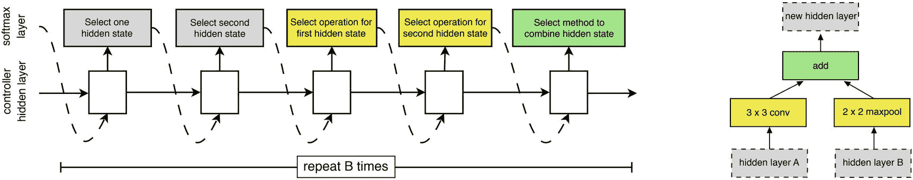

# 五、通过元优化实现模型设计自动化

> 学会如何学习是人生最重要的技能。
> 
> —托尼·布赞，作家兼教育顾问

随着我们发现我们需要学习的内容在一生中不断变化，我们找到了适合我们的新的学习方法。通过你的教育，你可能认为蛮力解决几十个重复的，变化最小的问题有助于掌握代数基础，用荧光笔和笔记积极阅读有助于你在更高级的英语课上取得成功，以及后来在更高级的主题中，理解概念框架和直觉比死记硬背解决一系列问题更有帮助。

最终，学习的任务不仅仅是在一定的学习条件下优化你对内容的掌握，而是优化那些学习条件。为了成为学习过程的有效代理人和设计者，我们必须认识到学习是多层次的，不仅受我们在代理人当前可能操作的学习框架内的进度的控制，而且受学习框架本身的控制。

这种必要性适用于神经网络设计。设计神经网络需要做出许多选择，其中许多选择往往让人感觉随意，因此无法优化。虽然直觉在构建模型架构中肯定是有价值的指导，但是神经网络设计的许多方面是人类设计者根本无法手动有效调整的，尤其是当涉及多个变量时。

*元优化*，在本文中也称为元学习或自动 ML，是“学习如何学习”的过程——元模型(或“*控制器*模型”)为*控制的*模型的验证性能找到最佳参数。凭借其工具和关于底层动态和最佳用例的知识，元优化是一个有价值的方法盒，可以帮助您开发更结构化、更高效的模型。

## 元优化简介

深度学习模型本身就是一个学习者，优化其指定的权重，以最大限度地提高其在给定训练数据上的性能。*元优化*涉及在更高层次上优化第一个模型中的“固定”参数的另一个模型，这样当在那些固定参数的条件下训练时，第一个模型将学习使其在测试数据集上的性能最大化的权重(图 [5-1](#Fig1) )。在机器学习中——元优化经常被应用的领域——这些固定参数可以是支持向量分类器中的伽马参数、 *k* 最近邻算法中的 *k* 的值，或者梯度推进模型中的树的数量。在深度学习的背景下——这是本书的重点，也是本章中元优化的应用——这些因素包括模型的架构和训练程序的元素，如优化器的选择或学习速率。

Note

这里，为了清楚起见，我们有选择地使用术语“参数”和“权重”，即使这两个或多或少是同义词。“参数”是指模型基本结构中的更广泛的因素，这些因素在训练期间保持不变，并影响所学知识的结果。“权重”指的是可变的、可训练的值，用于表示模型的学习知识。


图 5-1

元优化中控制器模型与受控模型的关系

所谓的“幼稚”元优化算法使用以下一般结构:

1.  为建议的受控模型选择结构参数。

2.  获得在那些选定的结构参数下训练的受控模型的性能。

3.  重复一遍。

有两种公认的简单的元优化算法用作比较复杂的元优化方法的基准:

*   *网格搜索*:在网格搜索中，尝试并评估每个参数的用户指定值列表的每种组合。考虑一个假设模型，它有两个我们想要优化的结构参数， *A* 和 *B* 。用户可以将 *A* 的搜索空间指定为【1，2，3】，将 *B* 的搜索空间指定为【0.5，1.2】。这里，“搜索空间”表示将被测试的每个参数的值。网格搜索将为这些参数的每个组合训练六个模型-*A*= 1 和 *B* = 0.5， *A* = 1 和 *B* = 1.2， *A* = 2 和 *B* = 0.5，等等。

*   *随机搜索*:在随机搜索中，用户提供关于每个结构参数可能呈现的潜在值的可行分布的信息。例如， *A* 的搜索空间可以是具有平均值 2 和标准偏差 1 的正态分布，而 *B* 的搜索空间可以是来自值列表[0.5，1.2]的统一选择。然后，随机搜索将随机采样参数值，并返回性能最佳的一组值。

网格搜索和随机搜索被认为是简单的搜索算法，因为它们没有将之前选择的结构参数的结果纳入下一组结构参数的选择中；它们只是盲目地重复“查询”结构参数，并返回性能最佳的集合。虽然网格和随机搜索在某些元优化问题中有其一席之地——网格搜索足以解决小型元优化问题，而随机搜索被证明是训练成本相对较低的模型的惊人强大策略——但它们无法为更复杂的模型(如神经网络)产生持续强大的结果。问题不在于这些天真的方法不能产生好的参数集，而在于它们需要太长的时间来完成。

元优化区别于优化问题的其他领域的独特特征的一个关键组成部分是评估步骤在放大元优化系统中的任何低效方面的影响。通常，为了量化某些选定的结构参数有多好，模型在这些结构参数下被完全训练，并且其在测试集上的性能被用作评估。(参见代理评估的“神经架构搜索”部分，了解更快的替代方案)。在神经网络的环境中，这个评估步骤可能需要几个小时。因此，一个有效的元优化系统应该在得到一个好的解决方案之前，试图要求尽可能少的模型被建立和训练。(与标准神经网络优化相比，在标准神经网络优化中，模型查询损失函数，并在几个小时的跨度内从几十万到几百万次相应地更新其权重。)

为了防止在选择新的结构参数进行评估时效率低下，用于神经网络等模型的成功的元优化方法包括另一个步骤——将来自先前“实验”的知识整合到确定下一组最佳参数的选择中:

1.  为建议的受控模型选择结构参数。

2.  获得在那些选定的结构参数下训练的受控模型的性能。

3.  将关于所选结构参数和在这些参数下训练的模型的性能之间的关系的知识结合到下一次选择中。

4.  重复一遍。

即使有了这些适应，元优化方法也是计算和时间资源的负担。元优化活动成功的一个主要因素是你如何定义*搜索空间*——元优化算法可以从中提取的值的可行分布。选择搜索空间是另一个权衡。显然，如果你指定了一个太大的搜索空间，元优化算法将需要选择和评估更多的结构参数，以达到一个好的解决方案。每个额外的参数都以显著的因子扩大了现有的搜索空间，因此留下太多的参数来通过元优化算法进行优化可能会比用户指定的值或随机搜索的性能更差，这不需要处理导航极其稀疏的空间的复杂性。

这里有一个元优化设计的重要原则:*尽可能保守地确定元优化要优化的参数*。例如，如果您知道批处理规范化将有利于网络的性能，那么使用元优化来确定批处理规范化是否应该包含在网络架构中可能是不值得的。此外，如果您决定应该通过元优化来优化某个参数，请尝试减小它的“大小”例如，这可能是一个参数可以采用的可能值的数量或范围，可能值的范围。

另一方面，如果你定义了一个太小的搜索空间，你应该问自己另一个问题——*元优化是否值得首先执行*？例如，元优化算法很可能非常有效地为定义为{ *A* :平均值为 1 且标准偏差为 0.001 的正态分布和 *B* :从 3.2 到 3.3 的均匀分布}的搜索空间找到最佳参数集，但这没有用。用户可能已经设置了 *A* =1 和 *B* =3.25，对最终模型的性能没有明显影响。

Note

什么是“小”或“大”范围取决于参数的性质和使模型性能发生明显变化所需的变化。如果参数是支持向量机中的 C 参数，则从均值为 0.005 且标准偏差为 0.001 的正态分布中采样的参数可以产生非常相似的模型。然而，如果参数是深度学习模型的学习速率，则这种分布很可能会在模型测试性能中产生可见的差异。

因此，元优化中至关重要的平衡是设计一个足够保守而不冗余的搜索空间，但又足够自由和“开放”以产生重要的结果。

本章将讨论适用于深度学习的两种形式的元优化:通用超参数优化和神经架构搜索(n as)，以及 Hyperopt、Hyperas 和 Auto-Keras 库。

## 一般超参数优化

一般超参数优化是元优化中的一个广阔领域，涉及优化各种模型参数的一般方法。这些方法不是为神经网络设计而显式构建的，因此需要额外的工作来获得有效的结果。

在本节中，我们将讨论贝叶斯优化-机器和深度学习的领先通用超参数优化方法，以及流行的元优化库 Hyperopt 及其附带的 Keras 包装器 Hyperas 的使用，以优化神经网络设计。

### 贝叶斯优化直觉和理论

这里有一个函数: *f* ( *x* )。在给定某个输入的情况下，您只能访问它的输出，并且您知道它的计算成本很高。你的任务是找到尽可能减少函数输出的输入集。

这种设置被称为黑盒优化问题，因为试图找到问题解决方案的算法或实体只能获得很少的函数信息(图 [5-2](#Fig2) )。您只能访问传递到函数中的任何输入的输出，而不能访问导数，除非使用基于梯度的方法，该方法已在神经网络领域证明是成功的。此外，因为评估 *f* ( *x* )是昂贵的(即，花费大量时间来获得输入的输出)，我们不能采用从简单的网格搜索到更复杂的模拟退火的大量非梯度优化方法。这些方法需要对黑盒函数进行大量的查询，以发现相当好的执行结果。


图 5-2

目标函数最小化。顶部——黑盒功能；底部——明确定义的损失函数(在本例中为 MSE)

贝叶斯优化经常被用在这类黑盒优化问题中，因为它成功地用相对少量的对目标函数 *f* ( *x* )的所需查询获得可靠的好结果。除了许多其他库之外，Hyperopt 还使用基于贝叶斯优化基本模型的优化算法。贝叶斯建模的精神是从一组*先验*信念开始，并不断用新信息更新该组信念以形成后验信念。正是这种不断更新的精神——在需要的地方搜索新信息——使得贝叶斯优化成为黑盒优化问题中一个强大而通用的工具。

考虑这个假设的目标函数， *c* ( *x* )(图 [5-3](#Fig3) )。在元学习/元优化的上下文中， *c* ( *x* )表示某个模型的损失或成本，而 *x* 表示在被优化的模型中使用的一组参数。


图 5-3

假设成本函数——带有某个参数 x 的模型产生的损失。为了形象化，在这种情况下，我们只优化一个参数

因为这是一个黑盒函数，贝叶斯优化算法并不“知道”它的完整形状，它通过一个*代理函数*来开发它自己“认为”目标函数看起来像什么的表示(图 [5-4](#Fig4) )。代理函数近似于目标函数，并表示关于目标函数如何表现的当前信念集。


图 5-4

示例代理函数以及代理函数如何通知目标函数中新点的采样

注意，这里的代理模型的表示是确定性的，但实际上它是一个概率模型，返回 *p* ( *y* | *x* )或给定输入 *x* 时目标函数的输出为 *y* 的概率。概率代理模型在贝叶斯函数中更新更容易、更自然。

基于替代函数，该算法可以识别哪些点看起来“有希望”，以及哪些区域需要更多勘探，并相应地从这些有希望的区域采集样本(图 [5-5](#Fig5) )。请注意，这里有一个探索-利用的权衡动态:如果算法只从立即建议为最小值(纯粹利用)的区域采样，它将完全忽略第一轮采样中没有捕捉到的其他有希望的最小值。同样，如果算法纯粹是探索性的，它的行为将与随机搜索没有什么不同，因为它没有考虑以前的发现。*获取函数*负责确定如何更新代理函数。


图 5-5

用采样点的新的第二次迭代更新代理函数

经过几次迭代后，贝叶斯优化算法很有可能已经获得了黑盒函数中最小值的相对精确的表示。

因为在确定下一组采样参数时，随机或网格搜索不考虑任何先前的结果，所以这些“天真”的算法在计算下一组要采样的参数时节省了时间。然而，贝叶斯优化算法用来确定下一个采样点的额外计算被用来以更少的查询更智能地构造代理函数。净方面，对目标函数的必要查询的减少超过了确定下一个采样点的时间增加，使得贝叶斯优化方法更有效。

这个优化过程更抽象地称为*基于模型的顺序优化(SMBO)* 。它作为一个中心概念或模板运行，各种模型优化策略可以根据它来制定和比较，并且包含一个关键特征:用新信息更新的目标函数的替代函数，并且用于确定新的采样点。在各种 SMBO 方法中，主要的区别是获取函数的设计和构造代理模型的方法。Hyperopt 使用树形结构 Parzen 估计器(TPE)代理模型和采集策略。

预期改善测量量化了关于待优化的参数组的预期改善， *x* 。例如，如果代理模型 *p* ( *y* | *x* )对于小于某个阈值*y*y<sup>∫</sup>的所有值评估为零，也就是说，一组输入参数 *x* 产生小于*y*<sup>∫</sup>的目标函数的输出的概率为零，则存在

树形结构的 Parzen 估计器(图 [5-6](#Fig6) )是为实现一组参数 *x* 而构建的，这些参数可以最大化预期的改进。像贝叶斯优化中使用的所有代理函数一样，它返回*p*(*y*|*x*)——在给定输入 *x* 的情况下，目标函数输出为 *y* 的概率。它不是直接获得这个概率，而是使用贝叶斯法则:


*p* ( *x* | *y* )项表示给定输出 *y* 时目标函数的输入为 *x* 的概率。为了对此进行计算，使用了两个分布函数:如果输出 *y* 小于某个阈值*y*T18】∫并且如果输出 *y* 小于某个阈值*y*y<sup>∫</sup>则使用 *g* ( *x* )。为了对产生小于阈值的目标函数输出的 *x* 的值进行采样，策略是从 *l* ( *x* )而不是 *g* ( *x* )中提取。(其他术语， *p* ( *y* )和 *p* ( *x* )由于不涉及条件句，所以很容易计算。)通过目标函数评估具有最高预期改进的采样值。结果值用于更新概率分布 *l* ( *x* )和 *g* ( *x* )以便更好地预测。


图 5-6

可视化树形结构 Parzen 估计器策略相对于基于顺序模型的优化程序的位置

这有点重数学，但最终树结构 Parzen 估计器策略试图通过不断更新其两个内部概率分布来找到最佳目标函数输入进行采样，以最大限度地提高预测质量。

Note

您可能想知道——树形结构 Parzen 估计器策略的树形结构是什么？在最初的 TPE 论文中，作者提出算法名称的“树”部分源自超参数空间的树状性质:为一个超参数选择的值决定了其他参数的可能值集。例如，如果我们正在优化一个神经网络的结构，我们首先确定层数，然后再确定第三层的节点数。

### Hyperopt 语法、概念和用法

Hyperopt 是一个流行的贝叶斯优化框架。它灵活的语法允许您在任何框架上为任何目的测试超参数调优。使用远视需要三个关键要素(图 [5-7](#Fig7) ):


图 5-7

超图框架中搜索空间、目标函数和搜索操作之间的关系

*   *目标函数*:这是一个接受超参数字典(目标函数的输入)并输出这些超参数的“良好度”(目标函数的输出)的函数。在元学习的上下文中，目标函数接受超参数，使用超参数建立模型，训练模型，并返回模型在验证/测试数据上的性能。“更好”在 Hyperopt 中是“更少”的同义词，所以要确保准确性之类的指标被否定。

*   *搜索空间*:这是 Hyperopt 将搜索的参数空间。它被实现为一个参数字典，其中的关键字是参数的名称(供您以后参考)，对应的值是一个 Hyperopt 搜索空间目标，它定义了该参数的采样值的分布范围和类型。

*   *搜索*:一旦您定义了目标函数和搜索空间，您就可以启动实际的搜索功能，该功能将从搜索中返回最佳参数集。

用`pip install hyperopt`安装 Hyperopt，用`import hyperopt`导入。

#### Hyperopt 语法概述:寻找简单目标函数的最小值

为了说明 Hyperopt 中的基本语法和概念，我们将使用 Hyperopt 解决一个非常简单的问题:求*f*(*x*)=(*x*1)<sup>2</sup>的最小值。我们先用`hyperopt.hp`(清单 [5-1](#PC1) )来定义搜索空间。

```py
from hyperopt import hp
space = {'x':hp.uniform('x',-1000,1000)}

Listing 5-1Importing the Hyperopt library and defining the search space for a single parameter using hyperopt.hp

```

在这种情况下，我们告诉 Hyperopt，搜索空间由一个带有标签“`x`”的参数组成，它可以从–1000 到 1000 的均匀分布中合理地找到。然而，根据领域知识，我们知道使目标函数最小化的最佳值`x`更有可能接近零，而不是从–1000 到 1000 的任何值。理想情况下，我们希望优化器对接近零的`x`值的采样频率高于接近 1000 或–1000 的值。我们可以通过使用其他空间(见图 [5-8](#Fig8) )来制定关于最佳值接近某个值的概率的领域知识:


图 5-8

正态和量化正态分布的可视化(上图)以及对数正态和量化对数正态分布的可视化(下图)。量化的分布可视化并不完全真实——落入采样“段”的值被赋予相同的值

*   `hp.normal(label, mu, sigma)`:该参数的搜索空间分布为均值`mu`和标准差`sigma`的正态分布。

*   `hp.lognormal(label, mu, sigma)`:该参数的搜索空间分布为对数正态分布，均值为`mu`，标准差为`sigma`。它是对只返回正值的`hp.normal`的修改。这对于像神经网络的学习速率这样的参数是有用的，这些参数是连续的，并且在某个点上包含一个集中的可能性，但是需要一个正值。

*   `hp.qnormal(label, mu, sigma, q)`和`hp.qlognormal(label, mu, sigma, q)`:这些作为准连续参数的分布，像神经网络中的层数或一层内的节点数——虽然这些不是连续的(3.5 层的网络是无效的)，但它们包含传递性的相对关系(4 层的网络比 3 层的网络长)。相应地，我们可能希望制定某些关系，比如希望层数短于或长于。`hp.qnormal`和`hp.qlognormal`通过执行以下操作来“量化”`hp.normal`和`hp.lognormal`的输出:，其中 *o* 是“未量化”操作的输出， *q* 是量化因子。例如，`hp.qnormal('x', 5, 3, 1)`定义了一个“正态分布”整数(`q = 1`)的搜索空间，平均值为 5，标准差为 3。

如果搜索空间不是连续的或准连续的，而是一系列离散的、不可比较的选择，使用`hp.choice()`，它接受一个可能选择的列表。

在这种情况下，我们可以使用标准的正态分布来更准确地描述我们认为参数的最佳位置(列表 [5-2](#PC2) )。

```py
from hyperopt import hp
space = {'x':hp.normal('x', mu=0, sigma=10)}

Listing 5-2Defining a simple Hyperopt space

```

我们现在可以定义目标函数，只需要从`x`中减去 1，然后平方:`obj_func = lambda params: (params['x']-1)**2`。

如果目标函数总是返回有效的输出，或者您已经配置了搜索空间，使得任何无效的输入都不可能被传递到目标函数中，那么只返回目标函数的相关输出就可以了。然而，如果不是这样，Hyperopt 提供了一个额外的特性，如果某些参数组合可能无效，这个特性可能是有用的:状态。例如，如果我们试图找到的最小值，输入 *x* = 0 将是无效的。但是，没有简单的方法来限制搜索空间以排除 *x* = 0。如果 *x* ≠ 0，目标函数的输出为`{'loss':value, 'status':'ok'}`。但是，如果输入参数等于 0，目标函数返回`{'status':'fail'}`。

在建模环境中，某些参数构造可能无效。考虑到限制搜索空间是不可能的或者太困难，您可以使用 try/except 捕获机制来构造您的目标函数，这样在构建图形时 Keras 抛出的任何错误都会以失败状态的形式传递给 Hyperopt(清单 [5-3](#PC3) )。

```py
def obj_func(params):
    try:
        model = build_model().train(data)
        loss = evaluate(model)
        return {'loss':loss, 'status':'ok'}
    except:
        return {'status':'fail'}

Listing 5-3An objective function with ok/fail status

```

既然已经定义了搜索空间和目标函数，我们可以开始搜索，以找到在搜索空间中指定的最小化目标函数的参数值(列表 [5-4](#PC4) )。

```py
from hyperopt import fmin, tpe
best = fmin(obj_func, space, algo=tpe.suggest, max_evals=500)

Listing 5-4Hyperopt minimization procedure

```

这里，`algo=tpe.suggest`使用树形结构的 Parzen 估计器优化算法，并且`max_evals=500`让 Hyperopt 知道代码将最多容许目标函数的 500 次评估。在建模的上下文中，`max_evals`表示将要构建和训练的模型的最大数量，因为目标函数的每次评估都需要构建新的模型架构、训练它、评估它并返回它的性能。

搜索完成后，`best`是找到的最佳参数的字典。`best['x']`应该包含一个非常接近 1 的值(真正的最小值)。

#### 利用远视优化训练程序

模型的训练过程中涉及的参数包括学习速率、优化器的选择、回调以及如何训练模型而不是模型的架构中涉及的其他参数。让我们使用 Hyperopt 来确定训练的最佳优化器和学习率。我们需要为这两个参数定义特定的搜索空间类型:

*   对于优化器:这将找到训练网络的最佳优化器。

*   `hp.lognormal('lr', mu=0.005, sigma=0.001)`对于优化器学习率:这里使用对数正态分布，因为学习率必须为正。

我们可以在字典中定义这两个空间(列出 [5-5](#PC5) )。注意，我们导入优化器对象，而没有实际实例化它们(即，`keras.optimizers.Adam`而不是`keras.optimizers.Adam()`)。这是因为我们需要将学习率作为参数传递到参数对象的实例化中，这将在我们在目标函数中构建模型时进行。

```py
from keras.optimizers import Adam, RMSprop, SGD
optimizers = [Adam, RMSprop, SGD]
space = {'optimizer':hp.choice('optimizer',optimizers),
         'lr':hp.lognormal('lr', mu=0.005, sigma=0.001)}

Listing 5-5Defining a search space for model optimizer and learning rate

```

目标函数将接受从搜索空间采样的参数字典，并使用它们来训练模型架构(列表 [5-6](#PC6) )。在这种特殊情况下，我们将通过模型在测试数据集上的准确性来衡量模型性能。我们在目标函数中执行以下操作:

1.  *构建模型*:我们将使用一个简单的序列模型，其中包含一个卷积和全连接组件。这可以在不访问`params`字典的情况下构建，因为我们没有调整任何影响架构构建方式的超参数。

2.  *编译*:这是模型构建和训练的相关组件，因为我们正在调优的参数(优化器和学习率)在这一步中被明确使用。我们将用采样的学习率实例化采样的优化器，然后将具有该学习率的优化器对象传递到`model.compile()`。我们还将把`metrics=['accuracy']`传递到编译中，这样我们就可以在评估中访问测试数据上的模型的准确性，作为目标函数的输出。

3.  *拟合模型*:我们像往常一样拟合一些时期的模型。

4.  *评估准确性*:我们可以调用`model.evaluate()`来返回一个根据测试数据计算的损失和度量的列表。第一要素是损耗，第二要素是精度；我们相应地索引评估的输出以评估准确性。

5.  *返回验证集*的否定精度:精度被否定，因此越小越好

```py
from keras.models import Sequential
import keras.layers as L

def objective(params):

    # build model
    model = Sequential()
    model.add(L.Input((32,32,3)))
    for i in range(4):
        model.add(L.Conv2D(32, (3,3), activation='relu'))
    model.add(L.Flatten())
    model.add(L.Dense(64, activation='relu'))
    model.add(L.Dense(1, activation='sigmoid'))

    # compile
    optimizer = params['optimizer'](lr=params['lr'])
    model.compile(loss='binary_crossentropy',
                  optimizer=optimizer,
                  metrics=['accuracy'])

    # fit
    model.fit(x_train, y_train, epochs=20, verbose=0)

    # evaluate accuracy (second elem. w/ .evaluate())
    acc = model.evaluate(x_test, y_test, verbose=0)[1]

    # return negative of acc such that smaller = better
    return -acc

Listing 5-6Defining the objective function of a training procedure-optimizing operation

```

注意，我们用`model.fit()`和`model.evaluate()`指定了`verbose=0`，这可以防止 Keras 在培训期间打印进度条和指标。虽然这些进度条在单独训练 Keras 模型时很有帮助，但在使用 Hyperopt 进行超参数优化的情况下，它们会干扰 Hyperopt 自己的进度条打印。

我们可以使用目标函数和搜索空间，以及树结构的 Parzen 估计器和最大评估数，进入`fmin`函数:best = fmin(objective，space，algo=tpe.suggest，max_evals=30)。

搜索完成后，`best`应该包含搜索空间中指定的每个参数的最佳性能值的字典。为了在您的模型中使用这些最佳参数，您可以在目标函数中重建模型，并用`best`字典替换`params`字典。

为了获得更好的性能，应该进行两项调整:

*   *提前停止回调*:这在性能达到稳定水平后停止训练，以尽可能地节省资源(计算和时间方面)，因为元优化是一种固有的昂贵操作。这通常可以与大量的时代相结合，这样每一个模型设计都是朝着成果进行训练的——它的潜力被尽可能合理地提取，并且在似乎没有更多潜力可提取之后训练停止。

*   *在评估前使用权重重载的模型检查点回调*:与其在神经网络完成训练后评估其状态，不如评估该神经网络的最佳“版本”。这可以通过模型检查点回调来完成，它保存了性能最好的模型的权重。在评估模型的性能之前，重新加载这些权重。

这两项措施将进一步提高搜索的效率。

#### 使用 Hyperopt 优化模型架构

尽管 Hyperopt 通常用于调整模型训练过程中的参数，但是您也可以使用它对模型架构进行微调优化。不过，重要的是要考虑是否应该使用像 Hyperopt 这样的通用元优化方法，或者像 Neural Architecture Search 这样的更专业的架构优化方法。如果你想优化模型架构中的大的变化，最好是通过 Auto-Keras 使用神经架构搜索(这将在本章后面介绍)。另一方面，如果你想优化小的变化，Auto-Keras 可能不会提供你想要的精度水平，因此 Hyperopt 可能是更好的解决方案。请注意，如果您打算优化的架构变化非常小(如找到层中神经元的最佳数量)，那么即使优化也可能不会有什么结果，前提是您已经设置了一个合理的默认参数。

使用一般优化框架(如 Hyperopt)进行优化的良好架构组件既不会太大而无法使用更专业的神经架构搜索方法进行优化，也不会太小而无法忽略模型性能，这些组件包括

*   *某块/组件中的层数*(假设范围足够长):层数是模型架构中的一个非常重要的因素，尤其是如果它是通过基于块/单元的设计来复合的。

*   *存在批量标准化*:批量标准化是帮助平滑损失空间的重要层。然而，它只有在特定的地点和特定的频率下才能成功。

*   *缺失层的存在和速率*:像批量规范化一样，缺失可以是一种非常强大的规范化方法。成功使用辍学需要放置在特定的位置，具有特定的频率，以及良好的辍学率。

对于本例，我们将调整模型架构的三个一般因素:卷积组件中的层数、密集组件中的层数以及每层之间插入的脱落层的脱落率。(您还可以调整所有脱落层的脱落率，这提供了较少的可定制性，但在某些情况下可能更成功。)

因为我们正在跟踪几个脱落层的脱落率，所以我们不能仅仅将其定义为搜索空间中的单个参数。相反，我们需要自动存储和组织搜索空间中对应于每个漏失层的几个参数。

让我们首先定义一些我们以后需要重复使用的关键变量(清单 [5-7](#PC7) )。我们愿意接受从最少 3 层到最多 8 层的任何数量的卷积层，以及从 2 到 5 的任何数量的密集层。(当然，您可以根据您的具体问题对此进行调整。)

```py
min_num_convs = 3
max_num_convs = 8
min_num_dense = 2
max_num_dense = 5

Listing 5-7Defining key parameters

```

使用这些信息，我们将生成两个列表，`conv_drs`和`dense_drs`，它们分别包含卷积和密集分量中每一层的丢失率的超点搜索空间对象(列表 [5-8](#PC8) )。这允许我们有效地存储多个相关但不同的搜索参数；在构建模型时，可以通过索引轻松访问这些内容。我们使用字符串格式为 Hyperopt 搜索空间提供唯一的字符串名称。注意，虽然您为每个搜索空间参数提供的名称是任意的(用户通过其他方式访问每个参数)，但 Hyperopt 需要(a)字符串名称和(b)唯一的名称(即，没有两个参数可以有相同的名称)。

```py
conv_drs, dense_drs = [], []
for layer in range(max_num_convs):
    conv_drs.append(hp.normal(f'c{layer}', 0.15, 0.1))
for layer in range(max_num_dense):
    dense_drs.append(hp.normal(f'd{layer}', 0.2, 0.1))

Listing 5-8Creating an organized list of dropout rates

```

请注意，我们正在为卷积和全连接组件构建与最大层数一样多的搜索空间变量，这意味着如果采样的层数小于最大数目，将会有冗余(即，将不使用某些丢失率)。这很好；远视会处理好，适应这些关系。此外，我们正在为辍学率定义一个正常的搜索空间，理论上可以对小于 0 或大于 1 的值进行采样(即无效的辍学率)。我们将在目标函数中调整这些，以演示当 Hyperopt 没有提供符合您特定需求的函数时对搜索空间的自定义操作(在这种情况下，是两端有界的正态分布)。

我们可以使用这些参数来创建搜索空间(清单 [5-9](#PC9) )。在定义卷积和密集分量的层数时，我们使用带`q=1`的量化均匀分布来采样从`min_num_convs/dense`到`max_num_convs/dense`的所有整数(含)。此外，注意我们传入了`'conv_dr'`和`'dense_dr'`参数的列表。Hyperopt 将把这个(或包含几个 Hyperopt 搜索空间对象的任何其他数据类型)解释为参数的子类，这些参数将像任何其他参数一样进行调整。

```py
space = {'#convs':hp.quniform('#convs',
                              min_num_convs,
                              max_num_convs,
                              q=1),
         '#dense':hp.quniform('#dense',
                              min_num_dense,
                              max_num_dense,
                              q=1),
         'conv_dr':conv_drs,
         'dense_dr':dense_drs}

Listing 5-9Defining the search space for optimizing neural network architecture

```

在这种情况下构建目标函数是一个复杂的过程，所以我们将分多个部分来构建它。

回想一下，辍学率的超点搜索空间被定义为正态分布，这意味着可以对无效的辍学率(小于 0 或大于 1)进行采样。我们可以处理在目标函数开始时无效的采样参数(列表 [5-10](#PC10) )。

如果辍学率大于 0.9，我们将其设置为 0.9 (Keras 不接受等于 1 的辍学率，任何大于 90%的辍学率都不可能成功)。另一方面，如果辍学率小于 0，我们将其设置为 0。给定在搜索空间中定义的均值和标准差参数，不太可能对它们中的任何一个进行采样，但是定义这些捕捉机制以防止扰乱优化过程的错误是很重要的。注意，另一种选择是返回`{'status':'fail'}`来指示无效的参数。贝叶斯优化算法将适应任何这些措施。

```py
def objective(params):

    # convert set of params to list for mutability
    conv_drs = list(params['conv_dr'])
    dense_drs = list(params['dense_dr'])

    # make sure dropout rate is 0 <= r < 1
    for ind in range(len(conv_drs)):
        if conv_drs[ind] > 0.9:
            conv_drs[ind] = 0.9
        if conv_drs[ind] < 0:
            conv_drs[ind] = 0
    for ind in range(len(dense_drs)):
        if dense_drs[ind] > 0.9:
            dense_drs[ind] = 0.9
        if dense_drs[ind] < 0:
            dense_drs[ind] = 0
    ...

Listing 5-10Beginning to define the objective function – correcting for dropout rates sampled in an invalid domain

```

然后，我们可以构建模型“模板”(顺序基础模型)，并为其附加一个输入(清单 [5-11](#PC11) )。

```py
...
# build model template + input
model = Sequential()
model.add(L.Input((32,32,3)))
...

Listing 5-11Defining the model template and input in the objective function

```

当构建卷积组件时，我们通过 for 循环添加输入参数中指定的卷积层(清单 [5-12](#PC12) )。注意，我们将采样的卷积层数`params['#convs']`包装在一个`int()`函数中；量化值的输出在技术上不是整数(例如，`3.0`，`4.0`)，而 Python 需要一个整数对象输入到`range()`函数。在每个卷积层之后，我们添加一个漏失层，通过索引之前定义的`conv_drs`漏失率列表来访问漏失率。通过将辍学率组织成易于访问和存储的列表格式，我们能够将几个参数集成到优化过程中。

```py
...
# build convolutional component
for ind in range(int(params['#convs'])):

    # add convolutional layer
    model.add(L.Conv2D(32, (3,3), activation='relu'))

    # add corresponding dropout rate
    model.add(L.Dropout(conv_drs[ind]))

# add flattening for dense component
model.add(L.Flatten())
...

Listing 5-12Building the convolutional component in the objective function

```

构建密集组件遵循相同的逻辑(清单 [5-13](#PC13) )。

```py
...
# build dense component
for ind in range(int(params['#dense'])):

    # add dense layer
    model.add(L.Dense(32, activation='relu'))

    # add corresponding dropout rate
    model.add(L.Dropout(dense_drs[ind]))
...

Listing 5-13Building the dense component in the objective function

```

之后，添加模型输出，并执行前面讨论的编译、拟合、评估和返回目标函数输出的剩余步骤。

正如您所看到的，Hyperopt 允许对模型的特定元素进行大量的控制，即使它需要多做一点工作——您的想象力(和组织能力)是极限！

### Hyperas 语法、概念和用法

Hyperopt 为您的特定优化需求提供了大量的可定制性和适应性，但这可能需要大量的工作，尤其是对于相对简单的任务。Hyperas 是一个在 Hyperopt 上运行的包装器，但是专门用于元优化 Keras 模型的语法。Hyperas 的主要优点是，您可以用比 Hyperopt 语法所需代码少得多的代码来定义要优化的参数。

Note

虽然 Hyperas 是一个有用的资源，但知道如何使用 hyperpt 很重要，因为(a)通常，首先需要元优化的问题非常复杂，足以保证使用 hyperpt ,( b)Hyperas 是一个开发程度较低且稳定的包(目前由所有者存档)。此外，请注意，在 Kaggle 或 Colab 等环境中使用 Hyperas 和 Jupyter 笔记本电脑会有一些复杂问题，如果您正在处理这些情况，使用 Hyperopt 可能会更容易。

用`pip install hyperas`安装 Hyperas，用`import hyperas`导入。

#### 利用 Hyperas 优化培训流程

让我们使用 Hyperas 的语法通过找到优化器和学习率的最佳组合来执行模型训练过程的相同优化。Hyperas 有三个主要组成部分(图 [5-9](#Fig9) ):


图 5-9

Hyperas 框架的关键组件——数据馈送器、目标函数和搜索操作

*   *Data feeder function* :必须定义一个函数来加载数据，进行任何预处理，返回四组数据: *x* train， *y* train， *x* test， *y* test(按此顺序)。通过将数据馈送过程定义为一个函数，Hyperas 可以创建快捷方式来防止模型训练中数据加载的冗余。

*   *目标函数*:该函数从数据进给函数中获取四组数据。它使用要优化的参数的唯一标记来构建模型，拟合训练数据，并返回用于评估的任何损失。目标函数应该返回一个包含三个键值对的字典:损失、状态和评估损失的模型。

*   *最小化*:该函数接受目标函数(模型创建函数)和数据馈送函数，以及来自 Hyperopt 的树形 Parzen 估计算法和一个`max_evals`参数。因为 Hyperas 是通过大量记录实现的，所以最小化过程需要一个`hyperopt.Trials()`对象，它作为一个附加的文档/记录对象。(你也可以通过这个进入`fmin()`进行远视，虽然这不是必须的。)

假设已经创建了数据馈送函数，我们将创建目标函数(清单 [5-14](#PC14) )。它与 Hyperopt 中的目标函数几乎相同，但有两个关键区别:目标函数接受四组数据，而不是参数字典，可优化的参数完全在目标函数中定义，用户只需进行必要的附加和处理。

要指定一个可优化的参数，请将一个`hyperas.distributions`搜索空间分布对象(例如`{{hyperas.distributions.choice(['a','b','c'])}}`)用双括号括起来。Hyperas 包含在 Hyperopt 中实现的所有发行版。注意，不需要标签，这允许容易地定义许多可优化的参数。双大括号语法只能在目标函数的上下文中使用，Hyperas 使用 Jinja 样式进行模板替换和临时文件。请注意，因为 Hyperas 是在单独的“环境”中创建这些模型，所以您可能需要在目标函数中再次重新导入某些模型或层。在这种情况下，我们导入`Sequential`模型和 Keras 层。

```py
from hyperas.distributions import choice, lognormal
from keras.optimizers import Adam, RMSprop, SGD

def obj_func(x_train, y_train, x_test, y_test):

    # import keras layers and sequential model
    from keras.models import Sequential
    import keras.layers as L

    # define model
    model = Sequential()
    model.add(L.Input((32,32,3)))
    for i in range(4):
        model.add(L.Conv2D(32, (3,3), activation='relu'))
    model.add(L.Flatten())
    model.add(L.Dense(64, activation='relu'))
    model.add(L.Dense(1, activation='sigmoid'))

    # sample lr and optimizer (not instantiated yet)
    lr = {{lognormal(mu=0.005, sigma=0.001)}}
    optimizer_obj = {{choice([Adam, RMSprop, SGD])}}

    # instantiate sampled optimizer with sampled lr
    optimizer = optimizer_obj(lr=lr)

    # compile with sampled parameters
    model.compile(loss='binary_crossentropy',
                  optimizer=optimizer,
                  metrics=['accuracy'])

    # fit and evaluate
    model.fit(x_train, y_train, epochs=1, verbose=0)
    acc = model.evaluate(x_test, y_test, verbose=0)[1]

    # return loss, OK status, and trained candidate model
    return {'loss':-acc, 'status':'ok', 'model':model}

Listing 5-14Objective function

for optimizing training procedure in Hyperas

```

要执行优化，使用`hyperas.optim.minimize`函数(列表 [5-15](#PC15) )，该函数有助于从优化过程中返回最佳参数和最佳模型。(回想一下，Hyperopt 只返回最佳的参数集，您需要将它存储到重建的模型中。)`optim.minimize()`接受用户指定的目标函数和数据馈送函数，以及来自 Hyperopt 的`tpe.suggest`和`Trials()`实体。如果你在 Jupyter 笔记本上工作，`optim.minimize()`也要求你的笔记本的名字。

```py
from hyperas import optim
from hyperopt import tpe, Trials
best_pms, best_model = optim.minimize(model=obj_func,
                                      data=data,
                                      algo=tpe.suggest,
                                      max_evals=5,
                                      trials=Trials(),
                                      notebook_name='name')

Listing 5-15Optimizing in Hyperas

```

训练后，您可以保存模型和参数供以后使用。

#### 使用 Hyperas 优化模型架构

Hyperas 的真正便利性在应用于类似早期的一次性优化大量参数的任务时显露无遗。我们不需要为搜索空间创建复杂的列表和组织结构，而是可以在函数本身中定义参数进行优化(清单 [5-16](#PC16) )。为了防止辍学率的采样参数超过 0.9 或低于 0，我们可以实现一个定制的取整函数`r`，它接受一个参数`x_`(添加了一个下划线以区别于`x`，Hyperas 在内部使用它，可能会导致问题)，如果它无效就调整它或让它通过。我们将`r`放在所有采样速率的周围。

```py
def obj_func(x_train, y_train, x_test, y_test):

    # create rounding function
    import keras.layers as L
    r = lambda x_: 0 if x_<0 else (0.9 if x_>0.9 else x_)

    # import keras layers and sequential model
    from keras.models import Sequential
    import keras.layers as L

    # create model template and input
    model = keras.models.Sequential()
    model.add(L.Input((32,32,3)))

    # build convolutional component
    for ind in range(int({{quniform(3,8,1)}})):
        model.add(L.Conv2D(32, (3,3), activation='relu'))
        model.add(L.Dropout(r({{normal(0.2,0.1)}})))

    # add flattening layer for FC component
    model.add(L.Flatten())

    # build FC component
    for ind in range(int({{quniform(2,5,1)}})):
        model.add(L.Dense(32, activation='relu'))
        model.add(L.Dropout(r({{normal(0.2,0.1)}})))

    # add output layer
    model.add(L.Dense(1, activation='sigmoid'))

    # compile, fit, evaluate, and return
    model.compile(loss='binary_crossentropy',
                  optimizer='adam',
                  metrics=['accuracy'])
    model.fit(x_train, y_train, epochs=1, verbose=0)
    acc = model.evaluate(x_test, y_test, verbose=0)[1]
    return {'loss':-acc, 'status':'ok', 'model':model}

Listing 5-16Objective function for optimizing architecture in Hyperas

```

然后，该目标函数可照常用于`hyperas.optim.minimize()`。

进行调整也很简单——例如，如果您希望每个组件有一个丢失率，只需在循环之外对丢失率进行采样，以便为整个组件只创建一个参数(清单 [5-17](#PC17) )。

```py
conv_comp_rate = r({{normal(0.2,0.1)}})
for ind in range(int({{quniform(3,8,1)}})):
    model.add(L.Conv2D(32, (3,3), activation='relu'))
    model.add(L.Dropout(conv_comp_rate))

Listing 5-17The same dropout rate is used in every added layer by defining only one dropout rate that is repeatedly used in each dropout layer

```

## 神经结构搜索

在我们之前对元优化方法的讨论中，我们使用了通用的框架来优化各种环境中的参数，这些框架也适用于神经网络架构和训练过程优化。虽然贝叶斯优化对于一些相对详细的或非架构的参数优化来说是足够的，但是在其他情况下，我们希望一种元优化方法，其被特别设计用于优化神经网络的架构的任务。

神经结构搜索(NAS)是神经网络结构工程自动化的过程。因为 NAS 方法是专门为搜索体系结构的任务而设计的，所以在寻找高性能的体系结构时，它们通常比更一般化的优化方法(如贝叶斯优化)更有效。此外，由于神经架构搜索通常需要搜索实用、高效的架构，许多人将 NAS 视为模型压缩的一种形式——构建一种可以更有效地表示与更大架构相同的知识的架构。

### NAS 直觉和理论

许多著名的深度学习架构——比如 ResNet 和 Inception——都是用极其复杂的结构构建的，需要一个深度学习工程师团队来构思和实验。建造这种结构的过程也从来不是一门精确的科学，而是一个遵循直觉和实验的持续过程。深度学习是一个快速发展的领域，以至于对一种方法成功的理论解释几乎总是遵循经验证据，而不是相反。

神经架构搜索是深度学习的一个不断发展的子领域，试图开发针对最佳神经网络架构的结构化和有效的搜索。尽管神经架构搜索的早期工作(2010 年代早期及之前)主要使用基于贝叶斯的方法，但现代 NAS 工作涉及使用深度学习结构来优化深度学习架构。也就是说，神经网络系统被训练来“设计”最佳的神经网络结构。

现代神经架构搜索方法包含三个关键部分:搜索空间、搜索策略和评估策略(图 [5-10](#Fig10) )。


图 5-10

神经架构搜索的三个关键组成部分之间的关系——搜索空间、搜索策略和评估策略

这与贝叶斯优化框架执行优化的方式类似。然而，NAS 系统不同于一般的优化框架，因为它们不将神经网络架构优化作为黑盒问题来处理。神经结构搜索方法通过将其构建到所有三个组件的设计中，利用了关于神经网络结构表示和优化的领域知识。

表示神经网络结构的搜索空间是一个有趣的问题。搜索空间不仅必须能够代表各种各样的神经网络架构，而且必须以一种方式建立，使搜索策略能够在搜索空间中导航，以采样新的有前途的架构——必须有一些距离的概念(即，某些架构与其他架构“更接近”，图 [5-11](#Fig11) )。


图 5-11

左图——顺序拓扑；右图–更复杂的非线性拓扑

此外，搜索空间必须能够表示线性和非线性神经网络拓扑，这进一步使这种搜索空间的组织复杂化。

请注意，神经架构搜索系统花费了巨大的精力，以看似人为的方式来表示神经网络，主要是为了*搜索策略*组件的目的，而不是搜索空间本身。如果搜索空间组件的唯一目的是表示模型，那么当前的图形网络实现已经足够了。然而，很难创建一个搜索策略，能够有效地输出和使用精确格式的神经网络架构。搜索空间表示的媒介允许搜索策略输出一个*表示*，它可以用来建立和评估相应的模型。此外，将搜索空间限制在可能成功的某些架构设计上，迫使搜索策略从更高潜力的架构中取样并进行探索。

也许神经网络拓扑的最简单的表示是将它们表示为一个有序的结构化信息串，其中有许多编码和解码表示的规则(图 [5-12](#Fig12) )。例如，如果一个信息“块”指示卷积层的存在，则其他块必须跟随，包含关于卷积层中的参数的信息，如内核大小和滤波器数量。


图 5-12

线性神经网络拓扑的顺序表示

通过将索引和“锚点”结合到信息的序列串中，可以进行额外的调整来表示更复杂的非线性拓扑和循环神经网络。跳过连接可以通过注意风格机制来建模，其中建模代理可以在任意两个锚点之间添加跳过连接。顺序字符串表示法非常强大，因为任何神经网络体系结构——无论有多复杂——都可以用这种格式表示和重建，即使它需要很长的信息序列。

Barret Zoph 和 Quoc V. Le 在 2017 年使用这种顺序表示法来表示早期 NAS 工作的搜索空间。搜索空间的顺序表示虽然强大(即，它可以模拟许多神经网络结构)，但被证明不是非常有效。然而，由于搜索空间太大，神经网络的顺序表示被证明是低效的。

基于单元的架构搜索空间表示法(图 [5-13](#Fig13) )降低了表示能力(即，它们不能像顺序表示法那样表示许多架构)，但是它们被证明是更有效的导航方法。神经架构搜索算法学习细胞结构的架构，例如，通过选择操作来填充空白的“模板细胞”然后，在最终的神经网络架构中重复细胞结构。可以使用多种不同类型的细胞类型，并且细胞可以以非线性方式堆叠在一起。


图 5-13

基于细胞的神经网络体系结构表示。有关基于单元的空间的示例，请参见 NASNet

虽然基于单元的搜索空间的代表能力明显小于顺序表示的代表能力(网络必须由重复的段构建，以有效地以单元方式表示)，但它已经以更短的资源投资产生了更好的性能架构。此外，这些学习到的细胞可以重新排列，有选择地选择，并转移到其他数据环境和任务。

搜索策略在搜索空间内运行，以找到神经网络的最佳表示。如前所述，所采用的搜索策略取决于搜索空间表示的设计。例如，可以使用基于递归的神经网络对顺序表示进行建模，该网络接收网络的先前元素，并预测下一条相应的信息(图 [5-14](#Fig14) )。


图 5-14

示例基于循环神经网络的搜索策略，具有基于顺序信息的搜索空间。Barret Zoph 和 Quoc 在 2017 年初的神经架构搜索工作中使用了这种设计。五.乐

强化学习是神经架构搜索常用的搜索策略。例如，在前面的例子中，基于递归的神经网络充当*代理*，其参数充当*策略*。代理的策略被迭代地更新，以最大化所生成的架构的预期性能。

大多数搜索策略方法面临一个问题:搜索空间表示是离散的，而不是连续的，但是基于梯度的搜索策略不能处理纯离散的问题。因此，寻求利用梯度的搜索策略包括一些区分离散操作的操作。

比如可微分架构搜索(DARTS)(图 [5-15](#Fig15) 搜索策略使用*连续松弛*。每个潜在的操作(例如，卷积、汇集、激活等。)来将一个“块”链接到另一个“块”(不要将这些块视为层的块，而是网络“锚点”)。每个操作都与一个权重相关联。具有最高权重的任何两个块之间的操作被构建到最终模型中，并且使用基于梯度的方法来寻找导致具有最佳性能的所选模型的权重关联。


图 5-15

省道连续松弛的可视化。蓝色、绿色和黄色连接代表可以在块上执行的潜在操作，如具有 5x5 滤波器大小和 56 个滤波器的卷积

然而，进化搜索策略方法不需要这种从离散到连续的映射机制。进化算法反复变异、评估和选择模型，以获得最佳性能的设计。虽然进化搜索是 21 世纪初最先提出的神经架构搜索设计之一，但在现代背景下，基于遗传的 NAS 方法继续产生有希望的结果。现代进化搜索策略通常使用更专业的搜索空间和变异策略来降低通常与基于进化的方法相关联的低效率。

评估搜索策略性能的最简单方法是训练建议的网络体系结构并评估其性能。这种神经网络评估的直接方法是足够的，并且是最精确的评估方法，但是它在计算和时间资源上是昂贵的。除非搜索策略需要搜索相对较少的模型来获得好的解决方案，否则直接评估所有提议的架构通常是不可行的。

代理评估方法是一种用于指示直接评估性能的方法。存在几种技术:

*   *在较小的采样数据集上训练*:不是在整个数据集上训练模型，而是在较小的采样数据集上训练提议的架构。数据集可以随机选择，或者代表数据的不同“组成部分”(例如，每个标签或数据聚类的相等/成比例的数量)。

*   *训练更小的* - *比例*版本的架构:对于涉及预测基于单元的架构的架构搜索策略，用于评估的建议架构可以按比例缩小(即，更少的重复次数或更低的复杂度)。

*   *预测测试性能曲线*:对所提出的架构进行几个时期的训练，并训练一个时间序列回归模型，以推断出预期的未来性能。外推的未来性能的最大值被认为是建议的架构的预测性能。

参见图 [5-16](#Fig16) 中视觉映射的神经架构搜索的三个组成部分的不同方法。


图 5-16

演示针对 NAS 的搜索空间、搜索策略和评估策略组件讨论的方法。请注意，所讨论的方法当然只涵盖了一些现代 NAS 研究

有关 NAS 进展的更多信息，请参见本章的案例研究，其中详细介绍了神经结构搜索的三个关键进展。

神经架构搜索是目前深度学习研究的一个相当前沿的领域。所讨论的许多 NAS 方法仍然需要大量的时间和计算资源，并且不像卷积神经网络那样适合于一般用途。我们将使用 Auto-Keras，它是一个库，可以有效地调整基于顺序模型的优化框架，以实现 NAS 的体系结构优化。

### 自动硬

有许多 auto-ML 库，如 PyCaret、H2O 和 Azure 出于本书的目的，我们使用 Auto-Keras，这是一个基于 Keras 本地构建的 auto-ML 库。Auto-Keras 展示了复杂性原则的渐进公开，这意味着用户既可以构建极其简单的搜索，也可以运行更复杂的操作。

要安装，请使用`pip install auto-keras`。

#### 自动硬系统

在撰写本书时，Auto-Keras 神经架构搜索系统是极少数易于访问的 NAS 库之一——即使是最先进的 NAS 设计也仍然过于计算昂贵和复杂，无法写入一个可访问的包中。

Auto-Keras 使用基于序列模型的优化(SMBO ),这是早期作为理解贝叶斯优化的正式框架提出的。 <sup>[1](#Fn1)</sup> 然而，虽然广义 SMBO 旨在解决黑盒问题，就像 Hyperopt 中使用的树结构 Parzen 估计器策略一样，但 Auto-Keras 利用关于问题领域的领域知识-神经网络架构-来开发更有效的 SMBO 组件。

虽然树形结构的 Parzen 估计器策略使用 TPE 代理模型，但 Auto-Keras 使用另一种常用模型，即高斯过程。像 SMBO 中使用的所有代理模型一样，高斯过程从概率上表示关于真实函数的知识。然而，与 TPE 不同，高斯过程是通过学习可能代表采样数据的函数的概率分布来实现的(图 [5-17](#Fig17) )。很好地拟合采样数据的函数将与高概率相关联，而很差地拟合数据的函数与低概率相关联。这个概率分布的均值就是最有代表性的函数。(注意，现有函数的数量是无限的，因此很少有函数具有显著的概率。)


图 5-17

高斯过程背后思想的简化表示——采样点的不同拟合函数及其相关概率。实际上，在同一个高斯过程操作中，您可能不会在正弦曲线拟合旁边看到多项式拟合，但是为了概念上的可视化起见，将它包括在内

高斯过程需要欧几里得空间中函数的概率分布，但是很难将神经网络架构映射到欧几里得空间中的向量。为了解决这个问题，Auto-Keras 使用了*编辑距离神经网络内核*(图 [5-18](#Fig18) )，它量化了将一些网络 *f* <sub>*a*</sub> 变形为另一个网络 *f* <sub>*b*</sub> 所需的最少编辑次数。


图 5-18

该图显示了编辑距离神经网络内核中使用的变形过程。首先，*f*<sub>T3a</sub>中的第二层和第三层被加宽，以包含与 *f* <sub>*b*</sub> 中相应层相同数量的神经元。然后，再给 *f* <sub>*a*</sub> 添加一层。由 Auto-Keras 作者创建

编辑距离神经网络内核允许量化神经网络结构之间的相似性，粗略地说，它提供了从离散神经网络体系结构搜索空间到高斯过程的欧几里德空间的必要链接。使用编辑距离内核和相应设计的采集功能，Auto-Keras NAS 算法能够控制至关重要的利用/探测动态——它以相对于要利用的成功网络的低编辑距离采样网络体系结构，并以相对于要探测的较差性能网络的高编辑距离采样网络体系结构。

Auto-Keras 对每个模型进行训练，以完成一定数量的用户指定的时期(即，它使用直接评估方法而不是代理方法)，但它的贝叶斯特征需要较少数量的网络进行采样和训练，前提是搜索空间定义良好。在 Auto-Keras 作者进行的实验中，Auto-Keras 在基准 MNIST、CIFAR-10 和时尚数据集上实现了比最先进的网络态射和基于贝叶斯的神经架构搜索方法更低的分类错误。

Auto-Keras API 进一步利用了 CPU 和 GPU 之间的并行性；GPU 用于训练生成的模型架构，而 CPU 用于执行搜索和更新(图 [5-19](#Fig19) )。此外，Auto-Keras 利用内存估计功能来实现高效的 GPU 使用，并防止 GPU 内存崩溃(图 [5-20](#Fig20) )。


图 5-20

Auto-Keras 的系统设计–搜索器、队列、GPU 和 CPU 使用之间的关系。建议的图形在 CPU 中生成，保存在队列中，并在 GPU 中训练


图 5-19

Auto-Keras 在硬件中的 API 任务级和搜索级操作。由 Auto-Keras 作者创建

在其设计和实现中，Auto-Keras 是使神经结构搜索算法更有效和可访问的关键库。

#### 简单 NAS

神经架构搜索的最简单形式是定义输入和输出，并允许 NAS 算法自动确定所有处理层将输入“连接”到输出。让我们考虑为一个图像分类任务建立一个神经网络。Auto-Keras 遵循与 Keras Functional API 非常相似的语法。对于这个特定的任务，我们需要定义三个关键元素，通过函数符号将它们联系在一起:

1.  **输入节点*:在这个特殊的例子中，输入是一个图像输入，所以我们使用`ak.ImageInput()`，它接受 numpy 数组和 TensorFlow 数据集。对于其他输入数据类型，使用`ak.StructuredDataInput()`表示表格数据(除了 numpy 数组和 TensorFlow 数据集之外，还接受 pandas 数据帧)，使用`ak.TextInput()`表示文本数据(必须是字符串的 numpy 数组或 TensorFlow 数据集；Auto-Keras 自动执行矢量化)，或`ak.Input()`作为一种通用输入方法，从 numpy 数组或所有上下文的 TensorFlow 数据集接受张量数据。使用最后一种方法的代价是在指定特定于上下文的数据输入时，Auto-Keras 会自动执行有用的预处理和链接。这些在 Auto-Keras 术语中称为*节点*对象。不需要指定输入形状；Auto-Keras 从传递的数据中自动推断出它，并构造对输入数据形状有效的体系结构。*

**   **处理块*:您可以将 Auto-Keras 中的块视为 Keras 层的增压块，它们作为层组执行类似的功能，但集成到 Auto-Keras NAS 框架中，因此关键参数(例如，块中的层数、块中的层、每层的参数)可以不指定并自动调整。例如，`ak.ConvBlock()`块由标准的“普通”系列卷积层、最大池层、下降层和激活层组成，具体的层数、顺序和层类型可以留给 NAS 算法。其他块，像`ak.ResNetBlock()`，生成一个 ResNet 模型；NAS 算法调整各种因素，如使用哪个版本的 ResNet 模型，以及是否启用预训练的 ImageNet 权重。块代表神经网络的主要组件；Auto-Keras 的设计以操作块为中心，允许对神经网络结构进行更高级别的操作。如果你想更通用，你可以使用类似`ak.ImageBlock()`的上下文相关的块，它会自动选择使用哪个基于图像的块(例如，普通卷积块，ResNet 块等)。).*

    **   **头/输出块*:输入节点定义了 Auto-Keras 应该期望传入架构输入的内容，头块通过确定两个关键因素定义了架构应该参与的预测任务类型:输出层的激活和损失函数。例如，在分类任务中，使用`ak.ClassificationHead()`；该块自动推断分类头的性质(二进制或多类分类)并相应地对架构施加限制(二进制分类的 sigmoid 和二进制交叉熵与多类分类的 softmax 和分类交叉熵)。如果检测到“原始”标签(即未经预处理的标签)，Auto-Keras 将自动执行二进制编码、一键编码或使数据符合推断预测任务所需的任何其他编码过程。不过，作为一种预防措施，通常最好确保 Auto-Keras 不需要根据您的意图做出任何重大改变。同理，回归问题用`ak.RegressionHead()`。*** 

 **为了建立一个极其简单和通用的图像分类模型，我们可以从导入 Auto-Keras 开始，并定义神经网络架构的三个关键组件，它们之间具有功能关系(清单 [5-18](#PC18) )。

```py
import autokeras as ak
inp = ak.ImageInput()
imageblock = ak.ImageBlock()(inp)
output = ak.ClassificationHead()(imageblock)

Listing 5-18Simple input-block-head Auto-Keras architecture

```

Note

对于文本数据，使用`ak.TextBlock()`，它从 vanilla、transformer 或 n-gram 文本处理块中选择。Auto-Keras 将根据所使用的处理模块自动选择矢量器。对于表格/结构化数据，使用`ak.StructuredDataBlock()`；Auto-Keras 将自动执行分类编码和标准化。这之后需要一个类似`ak.DenseBlock()`的处理模块，将 FC 层堆叠在一起。

就像在 Keras Functional API 中一样，通过指定输入和输出层，这些层可以聚合成一个“模型”(清单 [5-19](#PC19) )。`max_trials`参数表示可尝试的不同 Keras 型号的最大数量，尽管搜索可能会在达到该数量之前结束。然后可以根据数据拟合“模型”;`epochs`参数表示训练每个候选 Keras 模型的时期数。

```py
search = ak.AutoModel(
    inputs=inp, outputs=output, max_trials=30
)
search.fit(x_train, y_train, epochs=10)

Listing 5-19Aggregating defined components into an Auto-Model and fitting

```

在搜索过程中，Auto-Keras 不仅会自动确定选择哪种基于图像的块，还会自动确定各种归一化和增强方法，以优化模型性能。

当使用 Auto-Keras 进行调试时，您可能还会看到一些错误消息——只要代码继续运行，忽略这些警告通常是安全的。

重要的是要认识到，这个“模型”并不是真正的模型，而是一个搜索对象，作为创建和评估各种候选模型的模板。为了提取训练后的最佳模型，调用`best_model = search.export_model()`。然后，您可以使用`best_model.summary()`或`plot_model(best_model)`来列出或可视化搜索到的最佳模型的架构(图 [5-21](#Fig21) )。


图 5-21

Auto-Keras 模型搜索的示例架构

不幸的是，这种方法——简单地定义输入和输出，让神经架构搜索解决其余问题——不可能在可行的时间内产生好的结果。回想一下，您未调整的每个参数都是 NAS 算法在优化中必须考虑的另一个参数，这会增加它需要的试验次数。

#### 具有自定义搜索空间的 NAS

通过使用我们知道有效的策略对搜索空间提供某些限制，我们可以在时间方面设计更实用的架构，以达到良好的解决方案和计算负担。

回想一下，使用 Auto-Keras 意味着使用更高级别的块或组件。我们知道下面的图像识别管道是成功的(参见关于迁移学习和预训练模型的第 [2](2.html) 章，图 [5-22](#Fig22) )。


图 5-22

图像识别模型的通用组件级设计

我们可以使用 Auto-Keras 块来构建这些块:

1.  如前所述，`ak.ImageInput()`是输入节点。

2.  `ak.ImageAugmentation()`是一个增强块，执行各种图像增强过程，如随机翻转、缩放和旋转。增强参数，如是否随机执行水平翻转或选择缩放或旋转因子的范围，如果未指定，将由 Auto-Keras 自动调整。

3.  如前所述,`ak.ResNetBlock()`是一个只有两个参数的 ResNet 架构——使用哪个版本的 ResNet(v1 或 v2)以及是否使用 ImageNet 预训练权重进行初始化。这充当我们的图像模型设计的预训练模型组件。

4.  `ak.DenseBlock()`是由完全连接的层组成的块。如果未指定，Auto-Keras 将调整四个参数:层数、是否在层间使用批规范化、每层中的单位数以及要使用的辍学率(比率为 0 表示不使用辍学率)。

5.  如前所述，`ak.ClassificationHead()`是头块，指定要使用的损失函数和最后输出层的激活。

让我们定义这些彼此相关的功能，并指定我们清楚想要的参数(列表 [5-20](#PC20) )。例如，在增强中，我们可能知道我们不想垂直或水平翻转(例如，在 MNIST 数据集中，翻转一些数字将需要更改它们的标签)。我们还知道，我们需要图像宽度的 10%的平移因子，不要太大也不要太小。然而，我们不太确定哪个变焦或对比度是最好的；这些参数可以保留为`None`，并将由 Auto-Keras 自动调整。类似地，我们希望 ResNet 块使用预先训练的权重——足以进一步处理 ResNet 块的输出，但不足以导致网络长度和过度拟合问题。

```py
inp = ak.ImageInput()
aug = ak.ImageAugmentation(translation_factor=0.1,
                           vertical_flip=False,
                           horizontal_flip=False,
                           rotation_factor=None,
                           zoom_factor=None,
                           contrast_factor=None)(inp)
resnetblock = ak.ResNetBlock(pretrained=True,
                             version=None)(aug)
denseblock = ak.DenseBlock(num_layers=None,
                           use_bn=None,
                           num_units=None,
                           dropout=None)(resnetblock)
output = ak.ClassificationHead()(xceptionblock)

Listing 5-20Defining an architecture with more complex custom search space, with all parameters specified

```

由于 Auto-Keras 在默认情况下将所有参数保留在`None`，我们可以通过删除我们显式设置为`None`的所有参数来更简洁地表示相同的指定参数(清单 [5-21](#PC21) )。

```py
inp = ak.ImageInput()
aug = ak.ImageAugmentation(translation_factor=0.1,
                           vertical_flip=False,
                           horizontal_flip=True)(inp)
resnetblock = ak.ResNetBlock(pretrained=True,
                             version=None)(aug)
denseblock = ak.DenseBlock()(resnetblock)
output = ak.ClassificationHead()(xceptionblock)

Listing 5-21Defining an architecture with more complex custom search space, with only relevant parameters specified

```

然后可以将这些层聚合成一个`ak.AutoModel`(如图 [5-23](#Fig23) 所示)并进行相应的装配。通过指定一个定制的搜索空间，您可以极大地增加以更少的机会获得满意解决方案的机会。

Note

对于文本数据，使用`ak.TextBlock()`，使用`ak.Embedding()`进行嵌入(可以使用 GloVe、fastText 或 word2vec 预训练嵌入作为预训练)，使用`ak.RNNBlock()`进行递归层。对于表格/结构化数据，除了标准的处理块，如`ak.DenseBlock()`，使用`ak.CategoricalToNumerical()`对分类特征进行数字编码。


图 5-23

Auto-Keras 模型搜索的示例架构

#### 具有非线性拓扑的 NAS

因为 Auto-Keras 是使用类似函数式 API 的语法构建的，所以我们也可以使用组件来定义广泛的非线性拓扑。例如，我们可以将输入传递给两个预训练的模型，而不是只传递给一个预训练的模型块，以获得它们对输入的“洞察力”/“视角”，然后将两者合并并一起处理(图 [5-24](#Fig24) )。


图 5-24

在 Auto-Keras 中实现非线性拓扑的组件式计划

我们可以使用类似函数 API 的语法来表达这个想法，然后进行聚合和拟合(列表 [5-22](#PC22) ，图 [5-25](#Fig25) )。


图 5-25

Auto-Keras 模型搜索的示例架构

```py
inp = ak.ImageInput()
resnetblock = ak.ResNetBlock(pretrained=True)(inp)
xceptionblock = ak.XceptionBlock(pretrained=True)(inp)
merge = ak.Merge()([resnetblock, xceptionblock])
denseblock = ak.DenseBlock()(merge)
output = ak.ClassificationHead()(denseblock)

Listing 5-22Building component-wise topologically nonlinear Auto-Keras designs

```

## 个案研究

这三个案例研究讨论了开发更成功和有效的神经架构搜索系统的三种不同方法，建立在本章的 NAS 和贝叶斯优化部分讨论的主题之上。作为快速发展的神经结构搜索研究前沿的支柱，这些案例研究本身将作为更强大的神经网络结构自动化的未来工作的基础。

### 纳西网

由巴雷特·佐夫、维贾伊·瓦苏德万、黄邦贤·施伦斯和阔克·v·勒提出的纳斯网搜索空间是基于细胞的。NAS 算法学习两种类型的细胞:正常细胞和还原细胞。普通像元不会改变要素地图的形状(即，输入和输出要素地图具有相同的形状)，而缩减像元会将输入要素地图的宽度和高度减半。

单元构建为块的复杂拓扑组合，这些块是小型的、在体系结构上预定义的“模板”,包含由 NAS 算法学习的几个“空白操作槽”,并一起排列到网络单元中。一个单元被定义为这些块的某个固定数量 *B* 。( *B=* 5 在作者的实验中。)然后，这些细胞可以顺序堆叠，形成一个神经网络(图 [5-26](#Fig26) )。



图 5-26

通过递归模型生成架构，该递归模型输出隐藏状态、操作和合并方法，以便在单元设计中进行选择

循环神经网络用于通过选择两个隐藏状态以在操作中组合、两个操作分别应用于两个隐藏状态以及一个合并方法来迭代地生成这些块。运算包括恒等运算、标准方形内核卷积、矩形内核卷积、膨胀卷积(内核被加宽或“膨胀”,内核权重之间有空白空间)、可分离卷积(不仅适用于空间维度，也适用于深度维度的卷积)、池化等等。两个分支可以通过添加或连接来合并。通过强化学习方法对网络进行训练，以最大化最终神经网络架构提案的测试性能(图 [5-27](#Fig27) )。


图 5-27

基于递归的控制器和建议的架构(子网络)之间的关系。控制器被更新以最大化子网络的验证性能。由 NASNet 作者创建

此外，由于循环神经网络能够选择先前构建的单元输出中的哪两个输出来执行单元操作，因此它能够以优雅、递归的方式构建令人难以置信的复杂架构(图 [5-28](#Fig28) 和 [5-29](#Fig29) )。


图 5-29

ImageNet 上的高性能 NASNet 正常和简化单元架构。由 NASNet 作者创建


图 5-28

通过递归样式生成选择隐藏状态和操作的示例。由 NASNet 作者创建

派生的正常和缩减单元可以以不同的长度堆叠在一起，以适应不同的数据集(图 [5-30](#Fig30) )。例如，为 CIFAR-10 数据集构建的网络具有难以置信的 32x32 分辨率，与为 ImageNet 架构构建的网络相比，使用的归约单元更少。这种将密集的神经结构搜索的结果转移到各种不同的上下文中的便利极大地增加了它的实用性。


图 5-30

堆叠正常像元和缩小像元以适应特定的数据集图像大小。由 NASNet 作者创建

NASNet 架构系列由性能最佳的普通和简化单元构成。它设法在 ImageNet 分类中获得更好的 top 1 和 top 5 准确性，而不是像 Inception 这样的以前的架构巨头和最近提出的参数数量更少的架构(表 [5-1](#Tab1) )。

表 5-1

不同尺寸的 NASNet(尺寸由正常细胞和缩小细胞的不同组合和长度堆叠而成)相对于相似尺寸模型的性能

<colgroup><col class="tcol1 align-left"> <col class="tcol2 align-left"> <col class="tcol3 align-left"> <col class="tcol4 align-left"></colgroup> 
| 

模型

 | 

#参数

 | 

表演

 |
| --- | --- | --- |
| 

排名第一。

 | 

Acc 排名前 5。

 |
| --- | --- |
| 小型模型-inconvenient 2–*小型鼻网* | 11.2 米*10.9 米* | 74.8%*78.6%* | 92.2%*94.2%* |
| 中型型号-inconvenient 3– Xception– Inception ResNetV2–*中型 NASNet* | 23.8 米22.8 米55.8 米22.6 米 | 78.8%79.0%80.1%*80.8%* | 94.%94.5%95.1%*95.3%* |
| 大尺寸模型– ResNeXt–PolyNetDPN–*大型鼻网* | 83.6 米92 米79.5 米88.9 米 | 80.9%81.3%81.5%*82.7%* | 95.6%95.8%95.8%*96.2%* |

带有 ImageNet 权重的 NASNet 架构(不是搜索过程)在 Keras 中可用。它有两个版本，NASNet Large 和 NASNet Mobile，是 NASNet 搜索空间中性能最佳的学习单元架构的缩放版本。这些架构可在`keras.applications`中找到，网址为

*   `keras.applications.nasnet.NASNetMobile` : 23 MB 存储大小，参数 5.3 m。

*   `keras.applications.nasnet.NASNetLarge` : 343 MB 存储大小，88.9 m 参数。(在撰写本书时，NASNet Large 拥有所有`keras.applications`模型中最高的 ImageNet 前 1 名和前 5 名准确性，具有此类报告指标。)

参见第 [2](2.html) 章预训练模型的使用。

即使考虑到 NASNet 在开发高性能单元架构方面的进步，这样的结果也需要数百个 GPU 和在谷歌强大的实验室中进行 3-4 天的培训。其他进展致力于建立更多的计算可及的搜索操作。

### 渐进式神经结构搜索

刘晨曦与约翰·霍普金斯大学、谷歌人工智能和斯坦福大学的其他合著者一起，提出了*渐进式神经架构搜索* (PNAS)。 <sup>[3](#Fn3)</sup> 顾名思义，PNAS 采用由简单到复杂的渐进方法来构建神经网络架构。此外，PNAS 有趣地将许多早期讨论的神经架构搜索方法结合到一个有凝聚力的有效方法中:基于细胞的搜索空间，基于序列模型的优化搜索策略，以及代理评估。

渐进式神经架构搜索所使用的搜索空间与 NASNet 设计的搜索空间非常相似，只有一个关键区别:PNAS 不是学习两种不同的细胞(一种正常和还原细胞)，而是只学习一种类型的“正常细胞”(图 [5-31](#Fig31) )。“缩减单元”是通过使用跨距为 2 的正常单元形成的。相对于 NASNet，这稍微减小了搜索空间的大小。


图 5-31

渐进式神经架构搜索单元设计。左图-高性能 PNAS 电池设计。右图-举例说明了 PNAS 单元架构如何以不同的步长进行堆叠，以适应不同大小的数据集。由 PNAS 作家创作

PNAS 利用一种基于连续模型的优化搜索策略，选择最“有希望”的模型提案进行评估，同时使用一个代理评估员。

代理评估者，一个 LSTM，被训练来读取代表一个被提议的模型的架构的信息序列，并预测被提议的模型的性能。选择基于递归的模型是因为其处理可变长度输入的能力。请注意，代理评估器是在一个非常小的数据集上训练的(标签——提议模型的性能——获取起来非常昂贵),因此在数据子集上训练的 LSTMs 集合用于支持泛化和减少变化。基于 RNN 的方法对候选模型架构的预测性能可以达到与真实性能等级高达 0.996 的 Spearman 等级相关。

渐进式神经架构搜索(图 [5-32](#Fig32) )首先从最简单的细胞架构开始，它仅由一个块组成。然后，通过向单元架构添加另一个块来扩展每个单元。随着单元架构中的块的数量增加，候选的数量和训练所需的资源呈指数增长，因此这些候选模型不能全部被训练。这就是代理评估者的用武之地——代理评估者在可忽略的时间内评估数十万个提议的架构，并且最有前途的前 *K* 个架构(根据代理评估者的评估，性能最高)被抽样进行直接评估。这些架构的结果又被用作更新代理评估器的附加训练数据。重复这一过程，直到每个单元达到令人满意的块数。


图 5-32

PNAS 搜索和评估过程的可视化。从 *S* <sub>1</sub> 到*S*′<sub>2</sub>训练好的单元架构扩展一个块。这些生成的单元架构通过代理评估器(在可视化中标记为“预测器”)进行评估，并选择前几个在 *S* <sub>2</sub> 中进行训练。由 PNAS 作家创作。生成的体系结构的性能用于更新代理评估器。该过程重复进行

代理评估器在基于顺序模型的优化中充当代理函数，用于执行采样，并使用采样结果进行更新以更加准确。它的渐进式设计考虑到了计算效率——如果每个单元的块数更少就能获得良好的性能，我们就不必运行每个单元块数更高的架构；即使每个单元的块数量较少不会产生好的结果，它也可以作为代理评估者的实时训练。

这种设计允许渐进式神经架构搜索比以前的 NAS 方法产生显著的加速，减少了需要训练的数千个模型的数量，同时达到了相同的精度。此外，其基于单元的设计，如 NASNet，允许跨不同数据集的单元设计的可移植性(表 [5-2](#Tab2) )。

表 5-2

相对于 Barret 和 Zoph 在 2017 年的早期工作，PNAS 的性能，其中增强学习用于优化 RNN，以生成 CNN 架构的顺序表示。注意，这与 Zoph，Vasudevan，Shlens 和 Le 在 2018 年在 NASNet 上进行的密切相关的工作不同，该工作使用了基于细胞的表示方法。“<method>训练的模型数”表示该方法为达到所列相应性能而训练的模型数。PNAS 接受训练的模特数量可以减少近五分之二</method>

<colgroup><col class="tcol1 align-left"> <col class="tcol2 align-left"> <col class="tcol3 align-left"> <col class="tcol4 align-left"> <col class="tcol5 align-left"></colgroup> 
| 

每块细胞数

 | 

顶端

 | 

准确

 | 

# PNAS 训练的模特

 | 

NAS 培训的模型数量

 |
| --- | --- | --- | --- | --- |
| five | one | 0.9183 | One thousand one hundred and sixty | Five thousand eight hundred and eight |
| five | five | 0.9161 | One thousand one hundred and sixty | Four thousand one hundred |
| five | Twenty-five | 0.9136 | One thousand one hundred and sixty | Three thousand six hundred and fifty-four |

### 有效的神经结构搜索

虽然渐进式神经架构搜索中的代理评估允许对所提议的模型架构的潜力进行快速预测，并因此减少了为了良好性能而需要训练的模型的数量，但是该过程中的计算和时间瓶颈仍然停留在训练阶段。Hieu Pham 和 Melody Y. Guan 与 Barret Zoph、Quoc V. Le 和 Jeff Dean 一起提出了*高效神经架构搜索*(【ENAS】)[4](#Fn4)方法，该方法试图通过在训练期间在所有候选架构之间强制*权重分配*来减少获得候选模型性能的精确测量所需的时间。

ENAS 使用了与 NASNet 创建者使用的类似的基于强化学习和递归的架构生成模型，但有一个关键区别:不是预先定义单元的“模板”或“槽”并训练架构生成模型来识别哪些操作要“填充”这些“槽”，在 ENAS，控制器模型不仅识别选择哪些操作，还识别操作如何连接。

候选网络体系结构可以表示为有向无环图(Dag)或有方向但没有环的图(即，您不能通过节点之间的有向连接来结束循环)。一个具有 *N* 个节点的 DAG 被初始化(图 [5-33](#Fig33) ， *N* =4)，其中每个节点与其他所有节点相连。这个“全连接”DAG 表示该块的搜索空间，可以通过选择全 DAG 中的*子图*来对架构进行采样。被包括在被采样的子图中的节点被附加到一个操作，并且图的所有“死端”被平均并被认为是单元的输出。


图 5-33

左侧:“完全连接”DAG，选定的子图显示为红色。右图:基于抽样子图的选定架构示例

这些架构由使用强化学习方法训练的 LSTM 生成，以最大化所生成架构的验证性能(图 [5-34](#Fig34) )。LSTM 通过输出当前正在生成的节点将被附加到的节点的索引来选择子图。这种生成过程既可用于生成将堆叠成完整架构的单元，也可用于单独生成整个架构。


图 5-34

图 [5-30](#Fig30) 所示示例模型的“全连接”DAG 中子图的递归模型选择

作为“超级图”、“全连接”DAG 的子图，对所有采样架构的概念理解是至关重要的，这是 ENAS 使用权重共享的基础。“全连接”DAG 表示节点之间的一系列基于知识的关系；为了最大效率，存储在“完全连接的”DAG 的连接中的知识应该被转移到选定的子图。因此，包含相同连接的所有建议子图将共享该连接的相同值。在一个提出的架构的连接上执行的梯度更新也同样在具有相同对应连接的其他提出的架构上执行。

通过共享权重，被提议的模型可以通过由另一个模型架构得到的洞察力更新它们共有的权重来“相互学习”。此外，它还提供了一个粗略的近似值，即无论在相同的条件下，具有相似架构的模型将如何开发。

这种积极的权重共享“近似”允许以小得多的计算和时间消耗来训练大量提议的模型架构。一旦训练了子模型，就对小批量的验证数据进行评估，并且从头开始训练最有希望的子模型。

通过额外的正则化，高效的神经架构搜索允许使用非常少的 GPU 将速度从几天提高到几分之一天(表 [5-3](#Tab3) )。ENAS 向在高计算实验室之外实现神经结构搜索迈出了一大步。

表 5-3

相对于其他神经结构搜索方法的结果，ENAS 的性能。剪切是一种用于正则化的图像增强方法，其中输入的方形区域在训练期间被随机屏蔽。剪切应用于 NASNet 和 ENAS，以提高最终架构的性能

<colgroup><col class="tcol1 align-left"> <col class="tcol2 align-left"> <col class="tcol3 align-left"> <col class="tcol4 align-left"> <col class="tcol5 align-left"></colgroup> 
| 

方法

 | 

绘图处理器

 | 

时间(天数)

 | 

参数

 | 

错误

 |
| --- | --- | --- | --- | --- |
| 分层 NAS | Two hundred | One point five | 61.3 米 | 3.63% |
| 带 Q-Learning 的微型 NAS | Thirty-two | three | – | 3.60% |
| 渐进式 NAS | One hundred | One point five | 3.2 米 | 3.63% |
| NASNet 她 | Four hundred and fifty | 3–4 | 3.3 米 | 3.41% |
| NASNet-A +断流器 | Four hundred and fifty | 3–4 | 3.3 米 | 2.65% |
| 埃纳斯 | one | Zero point four five | 4.6 米 | 3.54% |
| ENAS +剪切 | one | Zero point four five | 4.6 米 | 2.89% |

## 要点

在本章中，我们讨论了一般超参数优化和神经架构搜索的直觉、理论和实现，以及它们在 Hyperopt、Hyperas 和 Auto-Keras 中的实现:

*   在元优化中，控制器模型优化受控模型的结构参数，以最大化受控模型的性能。它允许更结构化地搜索要训练的模型的最佳“类型”。元优化方法反复选择结构参数的建议控制模型，并评估其性能。实践中使用的元优化算法结合了关于先前选择的结构参数的性能的信息，以告知如何选择下一组参数，这不同于网格或随机搜索等天真的方法。

*   元优化中的一个关键平衡是搜索空间的大小。将搜索空间定义得比它所需要的大会显著地增加获得好的解决方案所需的计算资源和时间，而将搜索空间定义得太窄可能产生与用户指定的参数没有不同的结果(即，元优化是不必要的)。在确定元优化要优化的参数时尽量保守(即，不要在搜索空间中过度冗余)，但要确保为元优化分配的参数足够“宽”，以产生显著的结果。

*   贝叶斯优化是一种解决黑箱问题的元优化方法，在黑箱问题中，提供的关于目标函数的唯一信息是输入的相应输出(“查询”)，并且获得对函数的查询是昂贵的。贝叶斯优化利用代理函数，它是目标函数的概率表示。代理函数确定如何对目标函数的新输入进行采样。这些样本的结果反过来影响代理函数的更新方式。随着时间的推移，替代函数发展出目标函数的精确表示，从中可以容易地导出最佳参数集。
    *   基于顺序模型的优化(SMBO)是贝叶斯优化的形式化，并作为一个中心组件或模板，各种模型优化策略可以根据它来制定和比较。

    *   Hyperopt 使用树形结构 Parzen 估计器(TPE)策略，并通过贝叶斯规则和基于双分布阈值的设计来表示替代函数。从目标函数输出较低的位置进行 TPE 采样。

    *   超图的使用由三个关键部分组成:目标函数、搜索空间和搜索操作。在元优化的背景下，模型建立在具有采样参数的目标函数内。搜索空间通过包含`hyperopt.hp`分布(正态、对数正态、量化正态、选择等)的字典来定义。).Hyperopt 可用于优化训练过程，以及对模型架构进行微调优化。Hyperas 是一个 Hyperopt 包装器，通过消除为每个参数定义单独搜索空间和独立标签的需要，使使用 Hyperopt 优化神经网络设计的各个组件更加方便。

*   神经结构搜索(NAS)是神经网络结构工程自动化的过程。NAS 由三个关键部分组成:搜索空间、搜索策略和评估策略。神经网络的搜索空间可以最简单地表示为一系列连续的操作，但它不如基于细胞的设计有效。搜索策略包括强化学习方法(训练一个控制器模型来寻找最优策略——受控模型的参数)和进化设计。像 DARTS 这样的方法将神经网络的离散搜索空间映射成连续的、可微分的搜索空间。对采样参数的评估可以采取直接评估或通过代理评估的形式，其中以精度为代价用较少的资源来估计参数的性能。
    *   Auto-Keras 系统使用基于顺序模型的优化，具有基于高斯过程的代理模型设计和编辑距离神经网络内核，以量化网络结构之间的相似性。此外，Auto-Keras 采用 GPU-CPU 并行技术构建，可实现最佳效率。在用户使用方面，Auto-Keras 采用了复杂性渐进披露原则，允许用户用很少的代码行构建非常简单和更复杂的架构。此外，因为它遵循类似函数式 API 的语法，所以用户可以构建具有非线性拓扑的可搜索架构。

在下一章，我们将讨论成功的神经网络结构设计中的模式和概念。

<aside aria-label="Footnotes" class="FootnoteSection" epub:type="footnotes">Footnotes [1](#Fn1_source)

金海峰、宋清泉和胡夏，“Auto-Keras:一个高效的神经架构搜索系统”，2019 年。

  [2](#Fn2_source)

Barret Zoph，Vijay Vasudevan，黄邦贤·施伦斯和 Quoc V. Le，“学习可扩展图像识别的可转移架构”，2018 年。论文链接:[T0](https://arxiv.org/pdf/1707.07012.pdf)。

  [3](#Fn3_source)

、Barret Zoph、Maxim Neumann、、Shlens、魏华、李、、、Jonathan Huang 和凯文·墨菲，“渐进式神经架构搜索”，2018 年。论文链接: [`https://arxiv.org/pdf/1712.00559.pdf`](https://arxiv.org/pdf/1712.00559.pdf) 。代码链接: [`https://github.com/titu1994/progressive-neural-architecture-search`](https://github.com/titu1994/progressive-neural-architecture-search) (Keras/TensorFlow 实现)。

  [4](#Fn4_source)

Hieu Pham，Melody Y. Guan，Barret Zoph，Quoc V. Le 和 Jeff Dean，“通过参数共享进行有效的神经架构搜索”，2018 年。论文链接: [`https://arxiv.org/pdf/1802.03268.pdf`](https://arxiv.org/pdf/1802.03268.pdf) 。代码链接: [`https://github.com/melodyguan/enas`](https://github.com/melodyguan/enas) (TensorFlow 实现)。

 </aside>**