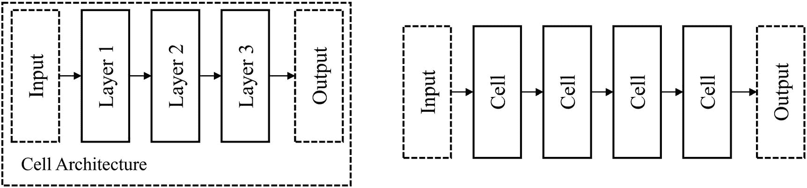
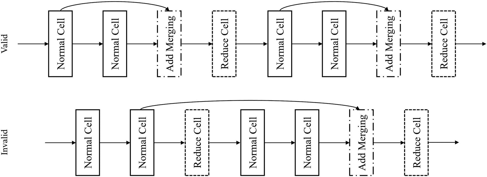

# 6.成功的神经网络架构设计

> 设计不仅是解决问题，也是发现问题。
> 
> —布莱恩·劳森，作家兼建筑师

上一章，关于元优化，讨论了神经网络设计的自动化，包括神经网络体系结构的自动化设计。在这样一个关于神经网络架构自动化的章节之后跟随一个关于成功的(隐含的、手动的)神经网络架构设计的章节可能看起来很奇怪，但事实是，深度学习不会很快(或根本不会)达到这样一个点，即设计状态可能会消除对神经网络架构设计中关键原则和概念的理解的需要。首先，你已经看到，神经架构搜索——尽管取得了快速进展——仍然在许多方面受到计算可及性和问题领域范围的限制。此外，神经架构搜索算法本身需要做出隐式的架构设计决策，以使搜索空间更易于搜索，这是人类 NAS 设计人员需要理解和编码的。架构的设计不能完全自动化。

迁移学习的成功更早、更强有力地证明了一个命题，即神经网络架构的设计是一项不需要由一般深度学习工程师研究的研究。毕竟，如果 TensorFlow 和 PyTorch 中内置的预训练模型库不能满足您的问题的需要，TensorFlow model zoo、GitHub 和 pypi 等平台可以托管大量易于访问的模型，这些模型可以进行传输，只需对架构进行最小的修改，就可以适应您的问题的数据形状和目标，并根据您的特定数据集进行微调。

这是部分正确的——开放共享的模型架构和权重的可用性已经降低了从头设计大型架构的需求。然而，在实践中，您选择的模型架构很可能并不完全符合您的问题环境。除非一个架构是专门为你的问题领域而设计的(即使它是)，通常需要更大的架构修改(图 [6-1](#Fig1) )。


图 6-1

架构通常仍然需要重大的修改来适应您的特定问题领域

进行这些更重要的修改以使架构在你的问题领域中走向成功的过程是一个持续的过程；设计网络时，您应该反复试验体系结构，并根据之前试验的反馈信号和出现的问题对体系结构进行调整。

无论是构建成功的修改，还是成功地将它们集成到通用模型架构中，都需要了解成功的架构构建模式和技术。本章将讨论神经网络体系结构构建中的三个关键概念——非线性和并行表示、基于单元的设计和网络缩放。有了这些概念的知识，您不仅能够成功地修改一般的体系结构，而且能够分析性地解构和理解体系结构，并从头开始构建成功的模型体系结构—这种工具的价值不仅延伸到网络体系结构的构建，还延伸到 NAS 等前沿领域。

为了实现这些目标，我们需要以更复杂的方式使用 Keras。随着我们试图实现的神经网络架构变得越来越复杂，实现的模糊性也越来越大——也就是说，有许多“正确答案”。为了更有效地解决这种实施的模糊性，我们将开始*划分*、*自动化*、*参数化*网络架构的定义:

*   *划分*:这个概念是在关于自编码器的第 [3](3.html) 章中介绍的，其中大模型被定义为一组链接的子模型。虽然我们不会为每个组件定义模型，但我们需要定义能为我们自动创建网络新组件的功能。

*   *自动化*:我们将定义构建神经网络的方法，这些方法可以构建比我们在代码中明确定义的更多的架构部分，允许我们更容易地扩展网络，并开发复杂的拓扑模式。

*   *参数化*:明确定义宽度和深度等关键架构参数的网络既不健壮也不可扩展。为了划分和自动化神经网络设计，我们需要定义相对于其他参数的参数，而不是绝对的静态值。

你会发现这一章讨论的内容可能比前几章更抽象。这是开发更复杂的架构和对神经网络动态的更深入感受的过程的一部分:不要将架构仅仅视为以某种格式排列的层的集合，这些层多少有些随意和神奇地形成成功的预测功能，您开始识别和使用主题、残差、并行分支、基数、单元、缩放因子和其他架构模式和工具。这种设计眼光在更专业、更成功、更通用的网络架构设计的开发中将是无价的。

## 非线性和并行表示

认识到纯线性神经网络架构拓扑表现良好，但还不够好，这或多或少地推动了每个成功的现代神经网络设计的拓扑中的非线性。当我们想要缩放神经网络以获得更大的建模能力时，神经网络拓扑中的线性成为负担。

理解非线性架构拓扑设计的成功和原则的一个很好的概念模型是，将每一层想象成参与更大对话的自己的“思考者”——一个大型连接网络的一部分。将一个输入传递到网络中就像给这群思考者提出一个没有答案的问题来考虑。每一个思考者都对输入的信息进行了独特的阐释，并对其进行了某种形式的转化——重新构思问题或在回答问题时增加一些进展——然后将他们的思考成果传递给下一个思考者。你要设计一个这些思考者的安排——也就是某些思考者获取和传递信息的地方——这样对话的输出(你输入问题的答案)就能尽可能地利用这些思考者的观点。

让我们考虑一个假设的安排好的思想家网络将如何处理这个古老的问题，“生命的意义是什么？”(图 [6-2](#Fig2) )。第一位思想家将意义问题重新定义为一个价值问题，并关注那些拥有生命的人——生物——作为问题的主体，反过来问:“生物在他们的生活中最重视什么？”下一位思想家从人类中心主义的角度解释了这个问题，认为它关系到*人类*如何珍视生命。最后一个思考者回答人类最看重快乐，这个网络的输出就是“快乐”这个共同的答案。


图 6-2

一系列线性排列的思想家的假设对话——回答一个古老的问题“生命的意义是什么？”

由于这种思考者排列的线性拓扑，每个思考者只能通过前一个思考者给他们的信息进行思考。第一个思考者之后的所有思考者都不能直接访问原始输入问题；例如，第三个思考者被迫回答第二个思考者对第一个思考者对原问题的解释。虽然增加网络的深度可能非常强大，但它也可能导致我们面前的这个问题，即后来的“思考者”或层逐渐脱离输入的原始上下文。

通过将非线性添加到我们的思考者安排中，网络能够通过更直接地将“思考者”与对话“链”上不同位置的多个思考者的发展联系起来，产生更复杂的表示(图 [6-3](#Fig3) )。在这个思考者的非线性排列的例子中，我们添加了一个从第一思考者到第三思考者的附加连接，使得第三思考者接受第一和第二思考者的想法。它不仅仅是对第二位思想家的解释做出回应，而是能够考虑多位思想家的发展和思想。


图 6-3

在思想者的安排中加入一个非线性因素会显著改变对话的输出

在这个例子中，第三个思考者概括了第一个和第二个思考者的发展——“生命中最有价值的是什么？”以及“人类一生中最看重的是什么？”–在关于生命价值的纯生物学视角和更深层次的人文视角之间。第三位思想家回答道:“繁殖的形式——新的生命和思想，”他指的是繁殖在生物进化和人类文明的个人、世代和社会的思想繁殖中的作用。总结一下第三位思想家的观点，网络的输出就是“生殖”

随着从第一个思想者到第三个思想者的一个连接的增加，网络的输出已经从“幸福”——一个更简单、更本能的答案——变成了“生育”的概念，一个更深刻、更深刻的反应。这里的关键区别是在考虑中融合不同的观点和想法。

大多数人都会同意，更多而不是更少的对话有利于伟大思想和见解的产生。类似地，将每个连接视为“单向对话”当我们在思考者之间增加更多的联系时，我们在思考者的网络中增加了更多的对话。有了足够多的非线性连接，我们的网络将爆发出一连串的活动、话语和对话，比线性排列的网络表现得更好。

### 剩余连接

残余连接是走向非线性的第一步——它们是放置在不相邻层之间的简单连接。它们通常表现为“跳过”一层或多层，这就是为什么它们也经常被称为“跳过连接”(图 [6-4](#Fig4) )。


图 6-4

剩余连接

请注意，因为 Keras Functional API 不能将多个层定义为另一个层的输入，所以在实现中，首先通过添加或连接等方法合并连接。合并后的组件被传递到下一层(图 [6-5](#Fig5) )。这是所有剩余连接图的隐含假设。


图 6-5

技术上正确的剩余连接与合并层

尽管剩余连接是非常通用的工具，但是通常有两种使用剩余连接的方法，基于 ResNet 和 DenseNet 架构，这两种架构开创了各自使用剩余连接的方法。“ResNet 式”剩余连接采用一系列短剩余连接，这些连接在整个网络中定期重复(图 [6-6](#Fig6) )。


图 6-6

ResNet 风格的剩余连接用法

另一方面，“DenseNet-style”剩余连接将剩余连接放置在有效层之间(即，被指定为允许附加剩余连接的层，也称为“锚点”或“锚层”)(图 [6-7](#Fig7) )。因为——可以想象——这种剩余连接的使用会导致大量的剩余连接，DenseNet 风格的架构很少将所有层都视为剩余连接。在这种风格中，长的和短的剩余连接都被用来提供跨体系结构各部分的信息路径。因为每个锚点都连接到它之前的每个锚点，所以它由网络处理和特征提取的各个阶段提供信息。


图 6-7

剩余连接的 DenseNet 式用法

这种剩余连接的表示法(图 [6-4](#Fig4) )可能是对剩余连接的最方便的解释。它将剩余连接可视化为添加在层的“主序列”上的非线性——添加剩余连接的线性“主干”。在 Keras Functional API 中，最容易将剩余连接理解为“跳过”层的“主序列”。一般来说，实现非线性的最好方法是记住线性主干的概念，因为代码是以线性格式编写的，很难将非线性转换成线性格式。

然而，对于什么是剩余连接，有其他的体系结构解释，这些解释在概念上可能与神经网络体系结构中的非线性的一般类别更一致。您可以将剩余连接解释为将之前的层分成两个分支，每个分支以自己独特的方式处理前一层，而不是依赖于线性主干。一个分支(图 [6-8](#Fig8) 中的第 1 层到第 2 层到第 3 层)用专门的函数处理前一层的输出，而另一个分支(第 1 层到第 3 层的标识)用标识函数处理前一层的输出——也就是说，它只允许前一层的输出通过，这是“最简单”的处理形式(图 [6-8](#Fig8) )。


图 6-8

剩余连接作为分支操作的另一种解释

这种从概念上理解剩余连接的方法更容易让您将它们归类为一般非线性架构的子类，可以理解为一系列分支结构(图 [6-9](#Fig9) )。我们将在后面的并行分支和基数的探索中看到这种解释是如何帮助我们的。


图 6-9

广义非线性形式

剩余连接通常被作为消失梯度问题的技术理由提出(图 [6-10](#Fig10) )，该问题与之前讨论的线性排列的思考者问题有许多共同的特征:为了访问某一层，我们需要先穿过其他几层，稀释信息信号。在消失梯度问题中，用于更新权重的非常深的神经网络内的反向传播信号逐渐变弱，使得前层几乎完全不被利用。


图 6-10

消失梯度问题

然而，对于剩余连接，反向传播信号通过更少的平均层来到达某个特定层的权重以进行更新。这使得更强的反向传播信号能够更好地利用整个模型架构。

剩余连接还有其他的解释。就像随机森林算法是由许多在数据集的一部分上训练的更小的决策树模型构成的一样，具有足够数量的剩余连接的神经网络可以被认为是由更少数量的层构建的更小的顺序模型的“集合”(图 [6-11](#Fig11) )。


图 6-11

将 DenseNet 式网络解构为一系列线性拓扑

剩余连接也可以被认为是低性能层的“故障保险”。如果我们添加从层 A 到层 C 的剩余连接(假设层 A 连接到层 B，层 B 连接到层 C)，网络可以通过学习从 A 到 B 和从 B 到 C 的连接的接近零的权重来“选择”忽略层 B，同时信息通过剩余连接直接从层 A 引导到层 C。然而，在实践中，剩余连接更多地作为考虑的数据的附加表示，而不是故障保护机制。

根据我们对函数式 API 的了解，实现单个剩余连接非常简单。我们将使用剩余连接架构的第一种解释，其中剩余连接充当线性架构主干中不相邻层之间的“跳跃机制”。为了简单起见，让我们将这个线性架构主干定义为一系列密集层(列表 [6-1](#PC1) ，图 [6-12](#Fig12) )。


图 6-12

示例线性主干模型的架构

```py
inp = L.Input((128,))
layer1 = L.Dense(64, activation='relu')(inp)
layer2 = L.Dense(64, activation='relu')(layer1)
layer3 = L.Dense(64, activation='relu')(layer2)
output = L.Dense(1, activation='sigmoid')(layer3)
model = keras.models.Model(inputs=inp, outputs=output)

Listing 6-1Creating a linear architecture using the Functional API to serve as the linear backbone for residual connections

```

假设我们要添加一个从`layer1`到`layer3`的剩余连接。为了做到这一点，我们需要将`layer1`与当前图层合并，作为`layer3`的输入(这是`layer2`)。合并的结果然后作为输入传递给`layer3`(列表 [6-2](#PC2) ，图 [6-13](#Fig13) )。


图 6-13

具有跳过处理层的剩余连接的线性骨干网的架构，`dense_1`

```py
inp = L.Input((128,))
layer1 = L.Dense(64, activation='relu')(inp)
layer2 = L.Dense(64, activation='relu')(layer1)
concat = L.Concatenate()([layer1, layer2])
layer3 = L.Dense(64, activation='relu')(concat)
output = L.Dense(1, activation='sigmoid')(layer3)
model = keras.models.Model(inputs=inp, outputs=output)

Listing 6-2Building a residual connection by adding a merging layer

```

然而，这种通过显式定义合并和输入流来手动创建剩余连接的方法效率低下且不可伸缩(即，如果您想要定义几十个或几百个剩余连接，它会变得非常混乱和困难)。让我们创建一个函数，`make_rc()`(清单 [6-3](#PC3) )，它接受一个连接分裂层(这是“分裂”的层——从中产生两个连接)和一个连接结合头(这是剩余连接和“线性主序列”结合在一起的层之前的层)，并输出这两个层的合并版本，该版本可用作下一层的输入(图 [6-14](#Fig14) )。当我们试图构造更精细的 ResNet 和 DensNet 风格的剩余连接时，我们将很快看到剩余连接的自动创建是多么的有帮助。


图 6-14

建筑残余连接自动化中某些层相互关系的术语

我们还可以添加另一个参数`merge_method`，该参数允许功能用户指定使用哪种方法来合并连接拆分层和连接接合头。该参数接受一个字符串，该字符串通过字典映射到相应的合并层。

```py
def make_rc(split_layer, joining_head,
            merge_method='concat'):
    method_dic = {'concat':L.Concatenate(),
                  'add':L.Add(),
                  'avg':L.Average(),
                  'max':L.Maximum()}
    merge = method_dic[merge_method]
    conn_output = merge([split_layer, joining_head])
    return conn_output

Listing 6-3Automating the creation of a residual connection by defining a function to create a residual connection

```

因此，我们可以非常容易地建立一个剩余连接，只需将带有适当参数的函数`make_rc`作为输入传递给我们想要接收合并结果的层(清单 [6-4](#PC4) )。

```py
inp = L.Input((128,))
layer1 = L.Dense(64)(inp)
layer2 = L.Dense(64)(layer1)
layer3 = L.Dense(64)(make_rc(layer1, layer2))
output = L.Dense(1)(layer3)
model = keras.models.Model(inputs=inp, outputs=output)

Listing 6-4Using the residual-connection-making function in a model architecture. (Activation functions may not be present in many listings due to space.)

```

我们可以自动使用该函数来创建一个 ResNet 风格的架构，其中具有短剩余连接的层块被重复几次(图 [6-15](#Fig15) )。为了自动化架构的构建，我们将使用占位符变量`x`、`x1`和`x2`。我们将按顺序从`x`构建`x1`，从`x1`构建`x2`，并将`x`与`x2`合并构建剩余连接(清单 [6-5](#PC5) )。


图 6-15

通过在整个构建迭代/块中构建来自动化剩余连接的构建

Tip

从概念上来说，自动构建这些非线性拓扑可能很困难。画一个图，并标注哪些模板变量，可以让你更容易地实现复杂的剩余连接模式。

```py
# number of residual connections
num_rcs = 3

# define input + first dense layer
inp = L.Input((128,))
x = L.Dense(64)(inp)

# create residual connections
for i in range(num_rcs):

    # build two layers to skip over
    x1 = L.Dense(64)(x)
    x2 = L.Dense(64)(x1)

    # define x as merging of x and x2
    x = L.Dense(64)(make_rc(x,x2))

Listing 6-5Building ResNet-style

residual connections

```

由于在构建迭代的末尾`x`是最后连接的层，我们将`x`连接到输出层，并将架构聚合到一个模型中(列表 [6-6](#PC6) ，图 [6-16](#Fig16) )。


图 6-16

剩余连接的自动化 ResNet 式使用

```py
# build output
output = L.Dense(1, activation='sigmoid')(x)

# aggregate into model
model = keras.models.Model(inputs=inp, outputs=output)

Listing 6-6Building output and aggregating ResNet-style architecture into a model

```

DenseNet 剩余连接模式(图 [6-17](#Fig17) )需要更多的规划，其中每个“锚点”都与其他“锚点”相连。(注意，为了方便起见，我们将在每个密集层之间建立剩余连接，而不是建立额外的非连接层。我们将在下一节讨论基于单元的架构的剩余连接。)我们将保留一个先前层的列表`x`。每一个构建步骤，我们添加一个新的层`x[i]`,它连接到每一个先前层的合并。注意，`x[i-1]`层是直接连接，`x[i-2]`，`x[i-3]`，…和`x[i]`之间的连接是残留连接。


图 6-17

剩余连接的 DenseNet 式使用的自动化构造概念图

第一步是调整`make_rc`函数来获取要加入的层的*列表*，而不是仅仅两层。这是因为 DenseNet 架构的构建使得许多剩余连接连接到同一层。除了获取层的列表，我们还将指定如果要加入的层的数量是 1(即，将`x[0]`连接到`x[1]`而没有剩余连接)，我们只需返回`join_layers`列表中的一个元素——也就是说，如果层列表中只有一个要合并的项目，我们将该层与一个“空”层“合并”(清单 [6-7](#PC7) )。

```py
def make_rc(join_layers=[],
            merge_method='concat'):
    if len(join_layers) == 1:
        return join_layers[0]

    method_dic = {'concat':L.Concatenate(),
                  'add':L.Add(),
                  'avg':L.Average(),
                  'max':L.Maximum()}
    merge = method_dic[merge_method]
    conn_output = merge(join_layers)
    return conn_output

Listing 6-7Adjusting the residual-connection-making function for DenseNet-style residual connections

```

我们可以从定义一个初始层`x`和一个创建层列表`layers`开始。创建初始层后，我们通过将模板变量`x`重新定义为密集层来循环添加剩余的层，该密集层接受所有其他当前创建的层的合并版本(列表 [6-8](#PC8) ，图 [6-18](#Fig18) )。之后，我们将`x`添加到`layers`中，这样下一个创建的层将包含这个刚刚创建的层。


图 6-18

DenseNet 式剩余连接的 Keras 可视化

```py
# define number of Dense layers
num_layers = 5

# create input layer
inp = L.Input((128,))
x = L.Dense(64, activation='relu')(inp)

# set layers list
layers = [x]

# loop through remaining layers
for i in range(num_layers-1):

    # define new layer
    x = L.Dense(64)(make_rc(layers))

    # add layer to list of layers
    layers.append(x)

# add output
output = L.Dense(1, activation='sigmoid')(x)

# build model
model = keras.models.Model(inputs=inp, outputs=output)

Listing 6-8Using the augmented residual-connection-making function to create DenseNet-style residual connections

```

这是一个很好的例子，说明了如何将预定义的功能、存储和内置的可伸缩性相互结合使用，从而快速高效地构建复杂的拓扑。

如您所见，当我们开始构建更复杂的网络设计时，Keras plotting 实用程序开始努力生成与我们对拓扑的概念性理解在视觉上一致的架构可视化。无论如何，可视化仍然可以作为一个健全的检查工具，来确保复杂的剩余连接关系的自动化能够正常工作。

### 分支和基数

基数的概念是非线性的核心框架，是剩余联系的一种推广。而一个网络段的*宽度*是指相应层中神经元的数量，网络架构的基数是指神经网络架构中某个位置的非线性空间中“分支”(也称为并行塔)的数量。

基数在*并行分支*中最为明显——这是一种架构设计，其中一层被“分割”成多个层，每个层被线性处理并最终合并在一起。采用平行分支的网络的一个段的基数就是分支的数量(图 [6-19](#Fig19) )。


图 6-19

基数为 2 的神经网络体系结构的示例组件。层的编号是任意的

正如前面在剩余连接一节中提到的，我们可以将剩余连接概括为基数为 2 的简单分支机制，其中一个分支是剩余连接“跳过”的一系列层，另一个分支是同一性函数。

请注意，根据具体的拓扑结构，网络中某个部分的基数或多或少是不明确的。例如，一些拓扑可能在子分支中构建分支，并以复杂的方式将某些子分支连接在一起(例如，图 [6-20](#Fig20) )。在这里，网络的具体基数是不相关的；*与*相关的是，信息正在以一种非线性的方式被建模，这种方式鼓励了表示的多样性(基数的一般概念)，从而增加了复杂性和建模能力。


图 6-20

神经网络的一个体系结构组件，表现出更极端的非线性(即分支和合并)

不过，应该注意的是，非线性不应任意构建。为了非线性而构建复杂的非线性拓扑可能很容易，但是您应该对拓扑的用途有所了解。同样，网络设计的一个关键组成部分不仅仅是各层所在的架构，还包括选择哪些层和参数来适应非线性架构。例如，您可以分配不同的分支来使用不同的内核大小，或者执行不同的操作来鼓励表示的多样性。请参见下一节“基于单元的设计”中的案例研究，了解更复杂非线性的良好设计示例，即初始单元。

架构设计中的分支表示和基数的逻辑非常类似于剩余连接的逻辑。这种表示是自然的体系结构发展，是剩余连接的概括——不是通过身份功能传递流经剩余连接的信息(即“跳过”)，而是可以与网络的其他组件分开处理。

在我们将一个网络比喻为参与对话的一组链接的思考者，其净输出取决于他们的安排，分支表示不仅允许思考者考虑多种观点，而且允许整个“思想流派”在彼此的对话中出现(图 [6-21](#Fig21) )。分支分别(即并行)处理信息，允许不同模式的特征提取在与其他分支合并考虑之前变得“成熟”(完全由几层处理形成)。


图 6-21

平行分支在概念上将“思想家”组织成“思想流派”

让我们从显式/手动创建一个多分支非线性拓扑开始(清单 [6-9](#PC9) )。我们将从一个层创建两个分支；每个分支都有一个特定的数据表示，它们被独立处理并在以后合并(图 [6-22](#Fig22) )。


图 6-22

构建并行分支的体系结构

```py
inp = L.Input((128,))
layer1 = L.Dense(64)(inp)
layer2 = L.Dense(64)(layer1)

branch1a = L.Dense(64)(layer2)
branch1b = L.Dense(64)(branch1a)
branch1c = L.Dense(64)(branch1b)

branch2a = L.Dense(64)(layer2)
branch2b = L.Dense(64)(branch2a)
branch2c = L.Dense(64)(branch2b)

concat = L.Concatenate()([branch1c, branch2c])
layer3 = L.Dense(64, activation='relu')(concat)
output = L.Dense(1, activation='sigmoid')(layer3)

model = keras.models.Model(inputs=inp, outputs=output)

Listing 6-9Creating parallel branches manually

```

为了自动化多个分支的构建，我们考虑两个维度:每个分支中的层数和并行分支的数量(清单 [6-10](#PC10) )。我们可以用两个函数以一种有组织的方式来完成这个任务——`build_branch()`,它接受一个输入层来开始一个分支，并输出该分支中的最后一个层，以及`build_branches()`,它接受一个层来分成几个分支(使用`build_branch()`函数)。我们可以简单地将分支的构建定义为一系列线性连接的密集层，尽管分支也可以构建为非线性拓扑。

```py
def build_branch(inp_layer, num_layers=5):
    x = L.Dense(64)(inp_layer)
    for i in range(num_layers-1):
        x = L.Dense(64)(x)
    return x

Listing 6-10Automating the building of an individual branch

```

为了将一个层分割成一系列并行的分支，我们使用起始层的`build_branch`一定次数(这个数是基数，作为参数传递给`build_branches`函数)。`build_branch`函数输出分支的最后一层，我们将它添加到分支最后一层的列表中，`outputs`。在所有的分支都构建好之后，我们通过加法将输出合并在一起(而不是在这种情况下连接，这会产生一个非常大的连接向量)并返回合并的输出(清单 [6-11](#PC11) )。

```py
def build_branches(splitting_head, cardinality=4):

    outputs = []

    for i in range(cardinality):
        branch_output = build_branch(splitting_head)
        outputs.append(branch_output)

    merge = L.Add()(outputs)
    return merge

Listing 6-11Automating the building of a series of parallel branches

```

在一个神经网络架构内构建一系列并行分支现在变得非常简单(列表 [6-12](#PC12) ，图 [6-23](#Fig23) )。


图 6-23

自动构建任意大小的并行分支

```py
inp = L.Input((128,))
layer1 = L.Dense(64)(inp)
layer2 = L.Dense(64)(layer1)
layer3 = L.Dense(64)(build_branches(layer2))
output = L.Dense(1)(layer3)
model = keras.models.Model(inputs=inp, outputs=output)

Listing 6-12Building parallel branches into a complete model architecture

```

ResNeXt 体系结构使用这种方法，它使用并行分支作为一般化和剩余连接的“下一步”。

### 案例研究:U-Net

*语义* *分割*的目标是将图像内的各种项目分割或分离成各种类别。语义分割可用于识别图片中的项目，如城市图片中的汽车、人和建筑物。语义分割和像图像识别这样的任务之间的区别在于，语义分割是一个*图像到图像*任务，而图像识别是一个*图像到矢量*任务。图像识别告诉你一个物体是否出现在图像中；语义分割通过将每个像素标记为相应类的一部分或不作为相应类的一部分来告诉你对象在图像中的位置。语义分割的输出称为*分割图*。

语义分割在生物学中有很多应用，可以用来自动识别细胞、器官、神经元链接和其他生物实体(图 [6-24](#Fig24) )。因此，对语义分段架构的许多研究都是在考虑这些生物学应用的情况下开发的。


图 6-24

左:输入图像到分割模型。右图:图像中细胞的分割示例。摘自 Ronneberger 等人的 U-Net 论文。

Olaf Ronneberger，Philipp Fischer，Thomas Brox 在 2015 年提出了 *U-Net* *架构*，<sup>T5】1</sup>，从此成为语义分割发展的一个支柱(图 [6-25](#Fig25) )。U-Net 架构的线性主干组件就像一个自编码器——它连续降低图像的维度，直到达到某个最小表示大小，然后图像的维度通过上采样和上卷积连续增加。U-Net 架构采用非常大的剩余连接，将网络的大部分连接在一起，将层的第一块连接到最后一块，将第二块连接到倒数第二块，等等。当剩余连接在架构图中彼此平行排列时，线性主干被迫形成“U”形，因此得名。


图 6-25

U-Net 架构。摘自 Ronneberger 等人的 U-Net 论文。

架构的左侧被称为*收缩路径*；它逐渐形成更小的数据表示。另一方面，右侧被称为*扩展路径*，它连续增加数据的表示。剩余连接允许网络将先前处理的表示合并到表示大小的扩展中。这种架构既允许*本地化*(关注数据输入的局部区域)又允许使用更广泛的*上下文*(来自更远的非局部图像区域的信息，仍然提供有用的数据)。

由此产生的 U-Net 架构在各种生物分割挑战方面的表现明显优于当时的其他架构(表 [6-1](#Tab1) )。

表 6-1

在 2015 年 ISBI 细胞追踪挑战赛的两个关键数据集上，U-Net 相对于当时其他分割模型的性能。结果以 IOU(交集/并集)来度量，IOU 是一种分割度量，用于度量预测的和真实的分割区域有多少重叠。借据越高越好。U-Net 在 IOU 上大幅度击败了当时的其他方法

<colgroup><col class="tcol1 align-left"> <col class="tcol2 align-left"> <col class="tcol3 align-left"></colgroup> 
| 

模型

 | 

PhC-U373 数据集

 | 

DIC-HeLa 数据集

 |
| --- | --- | --- |
| IMCB-SG (2014 年) | 0.2669 | 0.2935 |
| KTH-SE (2014 年) | 0.7953 | 0.4607 |
| 美国住房公司(2014 年) | 0.5323 | – |
| 第二好(2015 年) | Zero point eight three | Zero point four six |
| 优信网(2015 年) | 0.9203 | 0.7756 |

虽然 U-Net 架构在技术上适用于所有图像大小，因为它仅使用不需要固定输入的卷积型层来构建，但 Ronneberger 等人的原始实现需要对信息通过网络时的形状进行大量规划。因为所提出的 U-Net 架构不使用填充，所以空间分辨率被分别地(通过最大池)和相加地(通过卷积)连续地降低和增加。这意味着剩余连接必须包含裁剪功能，以便将较早的制图表达与较晚的具有较小空间大小的制图表达正确合并。而且输入形状必须经过精心规划，要有一定的输入大小，不会和输出相匹配。

因此，在我们的 U-Net 架构的实现中，我们将稍微修改卷积层以使用填充，这样合并和跟踪数据形状就更简单了。虽然实现 U-Net 相对简单，但跟踪变量很重要。我们将用适当的变量名命名我们的层，这样它们可以在前面讨论的`make_rc()`函数中作为剩余连接的一部分使用。

构建收缩路径(清单 [6-13](#PC13) )非常简单；在这种情况下，我们在每次池化减少之前实现一个卷积，尽管您可以添加更多卷积。我们使用三种池化缩减；conv4 是自编码器的“瓶颈”,承载最小空间表示大小的数据。请注意，我们增加了每个卷积层中的滤波器数量，以适应分辨率的降低，从而避免实际构建一个典型的瓶颈，这将与该模型的目标背道而驰。

```py
inp = L.Input((256,256,3))

# contracting path
conv1 = L.Conv2D(16, (3,3), padding='same')(inp)
pool1 = L.MaxPooling2D((2,2))(conv1)

conv2 = L.Conv2D(32, (3,3), padding='same')(pool1)
pool2 = L.MaxPooling2D((2,2))(conv2)

conv3 = L.Conv2D(64, (3,3), padding='same')(pool2)
pool3 = L.MaxPooling2D((2,2))(conv3)

conv4 = L.Conv2D(128, (3,3), padding='same')(pool3)

Listing 6-13Building the contracting path of the U-Net architecture

```

构建扩展路径(列表 [6-14](#PC14) )需要更多的谨慎。我们首先对最后一层`conv4`进行上采样，使其与`conv3`层具有相同的空间维度。我们在上采样后应用另一个卷积来处理结果，并确保`upsamp4`与`upsamp3`具有相同的深度(即通道数)。然后可以通过添加将它们合并在一起以保持深度。

```py
# expanding path
upsamp4 = L.UpSampling2D((2,2))(conv4)
upsamp4 = L.Conv2D(64, (3,3), padding='same')(upsamp4)
merge3 = make_rc([conv3, upsamp4], merge_method='add')

Listing 6-14Building one component of the expanding path in the U-Net architecture

```

我们同样可以构建扩展路径的剩余部分(清单 [6-15](#PC15) )。

```py
upsamp3 = L.UpSampling2D((2,2))(merge3)
upsamp3 = L.Conv2D(32, (3,3), padding='same')(upsamp3)
merge2 = make_rc([conv2, upsamp3])

upsamp2 = L.UpSampling2D((2,2))(merge2)
upsamp2 = L.Conv2D(16, (3,3), padding='same')(upsamp2)
merge1 = make_rc([conv1, upsamp2])

Listing 6-15Building the remaining components of the expanding path in the U-Net architecture

```

为了确保 U-Net 架构的输入数据和输出具有相同数量的通道，我们添加了一个(1，1)卷积层，该卷积层不会改变空间维度，但会将通道数量压缩为几乎所有图像数据中使用的标准三个通道(列表 [6-16](#PC16) )。

```py
out = L.Conv2D(3, (1,1))(merge1)
model = keras.models.Model(inputs=inp, outputs=out)

Listing 6-16Adding an output layer to collapse channels and aggregating layers into a model

```

如前所述，只要输入的空间维度能被 2 整除，您就可以更改输入形状，代码将产生有效的结果。您可以使用 plot_model 绘制模型，以揭示模型的建筑名称(图 [6-26](#Fig26) )。


图 6-26

Keras 中 U-Net 风格架构的实现。你能看到“U”吗？

## 块/单元设计

回想一下用来引入非线性概念的思想家网络。随着非线性的加入，思考者能够从发展和加工的多个阶段考虑观点，因此扩展他们的世界观以产生更有洞察力的输出。

通过*多个思考者*之间的对话，而不是一个个人思考者的处理能力，可以最好地完成深刻的智力工作(图 [6-27](#Fig27) )。因此，将思维的关键智力单元视为一个由思想家组成的*结构*是有意义的，而不仅仅是一个独立的思想家。这些“细胞”是新的单位对象，可以像“超级层”一样堆叠在一起，就像我们之前堆叠单个思考者一样——我们可以线性堆叠这些思考者的细胞，分支，添加剩余连接等。通过用更强大的单元替换信息处理的基本单元，我们系统地增加了整个系统的建模能力。


图 6-27

将思考者排列成单元

同样，通过将神经网络层排列成细胞，我们形成了一个新的单元，我们可以用它在架构上进行操作——细胞，它比单层包含更多的处理能力。一个小区可以被认为是一个“微型网络”

在基于块/单元的设计中，神经网络由几个重复的“单元”组成，每个单元包含一个预设的层排列(图 [6-28](#Fig28) )。细胞已被证明是增加网络深度的简单而有效的方法。这些细胞形成“图案”，即在某些层的排列中反复出现的主题或图案。像深度学习中的许多观察到的现象一样，基于细胞的设计在神经科学中也有相似之处——神经回路被观察到组装成重复的基序模式。基于单元的设计允许建立和标准化的特征提取；最高性能的神经网络架构包括大量设计良好的基于细胞的神经网络架构。



图 6-28

使用基于单元的设计

从设计的角度来看，细胞减少了神经网络设计者面临的搜索空间。(您可能还记得，这就是在第 [5](5.html) 章中讨论的 NASNet 风格的单元架构搜索空间的理由。)设计者能够对重复堆叠的单元的架构进行微调控制，因此放大了架构改变的效果。与此形成对比的是，在非蜂窝网络中对一个层进行改变——进行一次改变不太可能产生有意义的不同结果(假设存在其他类似层)。

基于单元的设计需要考虑两个关键因素:单元本身的架构和堆叠方法。本节将讨论跨顺序和非线性单元设计的堆叠方法。

### 顺序单元设计

顾名思义，顺序单元设计是指遵循顺序或线性拓扑的单元架构。虽然顺序单元设计的性能通常不如非线性单元设计，但它们可以作为一个起点来说明将在非线性单元设计中使用的关键概念。

我们将从构建一个*静态密集单元*开始——这个单元的主要处理层是完全连接的层，并且不会改变其层来适应输入形状(列表 [6-17](#PC17) )。使用与前面建立的相同的逻辑，定义一个函数来接收一个输入层，单元将在该输入层上构建。然后，返回单元的最后一层，作为下一个单元的输入(或输出层)。

```py
def build_static_dense_cell(inp_layer):
    dense_1 = L.Dense(64)(inp_layer)
    dense_2 = L.Dense(64)(dense_1)
    batchnorm = L.BatchNormalization()(dense_2)
    dropout = L.Dropout(0.1)(batchnorm)
    return dropout

Listing 6-17Building a static dense cell

```

然后，通过迭代地将先前构建的单元的输出作为输入传递给下一个单元，可以重复堆叠这些单元(清单 [6-18](#PC18) )。这种单元设计和堆叠的结合——以线性方式堆叠的线性单元设计——可能是最简单的基于单元的架构设计(图 [6-29](#Fig29) )。


图 6-30

堆叠卷积和密集单元的架构的可视化


图 6-29

基于单元的设计架构的可视化

```py
num_cells = 3

inp = L.Input((128,))
x = build_static_dense_cell(inp)
for i in range(num_cells-1):
    x = build_static_dense_cell(x)
output = L.Dense(1, activation='sigmoid')(x)

model = keras.models.Model(inputs=inp, outputs=output)

Listing 6-18Stacking static dense cells together

```

注意，当我们构建基于单元的架构时，我们没有使用*划分的设计*(在第 [3 章](3.html)中介绍了自编码器)。也就是说，虽然在概念上我们理解模型是根据重复的块段构建的，但是我们并没有通过将每个单元定义为单独的模型来将其构建到模型的实际实现中。在这种情况下，不需要划分设计，因为我们不需要访问任何一个特定单元的输出。此外，定义构建器函数应该作为如何构建网络的足够的代码级概念组织。使用基于单元的结构的划分设计的主要负担是需要以自动方式跟踪前一个单元的输出的输入形状，这在定义单独的模型时是必需的。然而，通过可视化细胞而不是整个层序列，实现分隔化设计将使 Keras 的架构可视化与我们对基于细胞的模型的概念理解更加一致。

我们可以通过使用一系列卷积层后跟一个池层的标准序列来类似地创建一个静态卷积单元，为了更好地测量，可以批量归一化和丢弃(清单 [6-19](#PC19) )。

```py
def build_static_conv_cell(inp_layer):
    conv_1 = L.Conv2D(64,(3,3))(inp_layer)
    conv_2 = L.Conv2D(64,(3,3))(conv_1)
    pool = L.MaxPooling2D((2,2))(conv_2)
    batchnorm = L.BatchNormalization()(pool)
    dropout = L.Dropout(0.1)(batchnorm)
    return dropout

Listing 6-19Building a static convolutional cell

```

我们可以将卷积和密集单元结合在一起(列表 [6-20](#PC20) ，图 [6-30](#Fig30) )。卷积组件完成后，我们使用全局平均池 2D(扁平化层也可以工作)将基于图像的信息流折叠成一个类似矢量的形状，可由完全连接的组件处理。

```py
num_conv_cells = 3
num_dense_cells = 2

inp = L.Input((256,256,3))
conv_cell = build_static_conv_cell(inp)
for i in range(num_conv_cells-1):
    conv_cell = build_static_conv_cell(conv_cell)
collapse = L.GlobalAveragePooling2D()(conv_cell)
dense_cell = build_static_dense_cell(collapse)
for i in range(num_dense_cells-1):
    dense_cell = build_static_dense_cell(dense_cell)
output = L.Dense(1, activation='sigmoid')(dense_cell)

model = keras.models.Model(inputs=inp, outputs=output)

Listing 6-20Stacking convolutional and dense cells together in a linear fashion

```

请注意，静态密集和静态卷积单元对应用它们的数据输入形状有不同的影响。静态密集像元始终输出相同的数据输出形状，因为在 Keras 中定义密集图层时，用户会指定输入将投影到的结点数。另一方面，静态卷积单元输出不同的数据输出形状，这取决于它们接收的数据输入形状。(这将在关于迁移学习的第 [2](2.html) 章中详细讨论。)因为单元设计中不同的主要层类型会对数据形状产生不同的影响，所以通常不构建静态单元。

相反，单元通常是通过它们对输出形状的影响来构建的，因此它们可以更容易地堆叠在一起。这在非线性堆叠模式中尤其有用，在这种模式中，像元输出必须匹配才能以有效的方式合并。通常，细胞可分为还原细胞或正常细胞。正常单元格保持输出形状与输入形状相同，而缩减单元格从输入形状中缩减输出形状。许多现代架构对整个模型中重复堆叠的正常和还原单元采用多种设计。

为了构建这些基于形状的单元格(清单 [6-21](#PC21) ，我们需要一个额外的参数来跟踪输入形状。对于处理表格数据的网络，我们只关心输入层的宽度。在正常的单元格中，输出与输入的宽度相同；我们定义了一个缩减单元来将输入的大小减少一半，尽管您可以根据您的问题类型采用不同的设计。除了输出图层的宽度之外，每个像元构建函数还会返回像元的输出图层。该信息将用于构建下一个小区。

```py
def build_normal_cell(inp_layer, width):
    dense_1 = L.Dense(width)(inp_layer)
    dense_2 = L.Dense(width)(dense_1)
    return dense_2, width

def build_reduce_cell(inp_layer, width):
    new_width = round(width/2)
    dense_1 = L.Dense(new_width)(inp_layer)
    dense_2 = L.Dense(new_width)(dense_1)
    return dense_2, new_width

Listing 6-21Building normal and reduction cells

```

我们可以简单地将这两个单元格以交替的方式依次堆叠在一起(列表 [6-22](#PC22) ，图 [6-31](#Fig31) )。我们使用保持器变量`cell_out`和`w`来跟踪一个单元的输出和相应的宽度。每个细胞构建函数要么保持形状`w`不变，要么修改它以反映细胞输出层形状的变化。如前所述，这些信息被传递到下面的细胞构建功能中。


图 6-31

交替电池堆的结构

```py
num_repeats = 2

w = 128
inp = L.Input((w,))
cell_out, w = build_normal_cell(inp, w)
for repeat in range(num_repeats):
    cell_out, w = build_reduce_cell(cell_out, w)
    cell_out, w = build_normal_cell(cell_out, w)
output = L.Dense(1, activation='sigmoid')(cell_out)

model = keras.models.Model(inputs=inp, outputs=output)

Listing 6-22Stacking reduction and normal cells linearly

```

构建卷积正常单元格和缩减单元格是相似的，但是我们需要跟踪三个形状元素，而不是一个。就像在自编码器和其他形状敏感的上下文中一样，最好使用`padding='same'`来保持输入和输出形状相同。

普通信元使用两个带`'same'`填充的卷积信元(列表 [6-23](#PC23) )。如果您想在普通单元格中使用池，也可以使用带有`padding='same'`的池层。请注意，输入的深度作为卷积层中的滤波器数量传递，以保持输入形状。

```py
def build_normal_cell(inp_layer, shape):

    h,w,d = shape

    conv_1 = L.Conv2D(d,(3,3),padding='same')(inp_layer)
    conv_2 = L.Conv2D(d,(3,3),padding='same')(conv_1)

    return conv_2, shape

Listing 6-23Building a convolutional normal cell

```

reduction cell(列表 [6-24](#PC24) )也使用了两个带`'same'`填充的卷积单元格，但是增加了一个池层，将高度和宽度减少了一半。我们返回新的形状，它的高度和宽度减半。在输入形状高度或宽度是奇数并且除法结果不是整数的情况下，对结果执行上限运算。如果对最大池使用不同的填充模式，则需要相应地调整新形状的计算方式。

```py
def build_reduce_cell(inp_layer, shape):

    h,w,d = shape

    conv_1 = L.Conv2D(d,(3,3),padding='same')(inp_layer)
    conv_2 = L.Conv2D(d,(3,3),padding='same')(conv_1)
    pool = L.MaxPooling2D((2,2))(conv_2)

    new_shape = (np.ceil(h/2),np.ceil(w/2),d)
    return pool, new_shape

Listing 6-24Building a convolutional reduction cell

```

如前所述，这两个电池可以线性排列堆叠。或者，这些电池可以以非线性形式堆叠。为此，我们将使用从非线性和并行表示部分发展而来的方法和思想。

要将两个单元的输出合并在一起，它们需要具有相同的形状。由于基于形状的设计，我们可以相应地排列正常和缩减单元，以形成有效的合并操作。例如，我们可以从一个正常单元格“覆盖”另一个正常单元格绘制一个剩余连接，合并两个连接，并将合并后的结果传递给一个归约单元格，如图 [6-32](#Fig32) 所示。


图 6-32

细胞的非线性堆积

但是，归约单元会形成连接无法跨越的“边界”(除非您使用整形机制)，因为归约单元两侧的输入形状不匹配(图 [6-33](#Fig33) )。



图 6-33

跨单元的剩余连接使用的演示

我们可以用非常类似的方式构建非线性单元堆叠架构，就像我们在网络架构的各层之间构建非线性和并行表示一样。我们将使用上一节定义的`make_rc`函数来合并`norm_1`和`norm_2`的输出，并将合并后的结果作为归约单元的输入进行传递(列表 [6-25](#PC25) ，图 [6-34](#Fig34) )。该形状在输入后定义为深度 64，这样卷积层用 64 个滤波器(而不是 3 个)处理数据。如果需要，您可以操作缩小单元格来更改图像深度。请注意，我们在这种情况下使用的合并操作是添加而不是连接。加法的输出形状与任何一个输入的输入形状相同，而深度连接会改变形状。这是可以接受的，但是需要确保形状相应地更新。


图 6-34

正常细胞间的残留连接

```py
inp = L.Input((128,128,3))
shape = (128,128,64)
norm_1, shape = build_normal_cell(inp, shape)
norm_2, shape = build_normal_cell(norm_1, shape)
merged = make_rc([norm_1,norm_2],'add')
reduce, shape = build_reduce_cell(merged, shape)

Listing 6-25Stacking convolutional normal and reduction cells together in nonlinear fashion with residual connections

```

单元可以类似地以 DenseNet 样式堆叠，并且具有平行分支以用于更复杂的表示。如果使用线性单元设计，建议使用非线性堆叠方法将非线性添加到一般网络拓扑中。

### 非线性单元设计

非线性单元设计只有一个输入和输出，但使用非线性拓扑来开发多个并行表示和处理机制，它们被组合成一个输出。非线性电池设计通常更成功(因此更受欢迎)，因为它们允许构建更强大的电池。

利用非线性表示和顺序单元设计的知识，构建非线性单元设计相对简单。非线性单元的设计严格遵循前面关于非线性和并行表示的讨论。非线性细胞形成有组织的、高效的特征提取模块，这些模块可以链接在一起，以强大的、易于扩展的方式连续处理信息。

基于分支的设计在非线性单元结构的设计中特别有效。它能够在一个紧凑、可堆叠的单元中有效地提取和合并不同的并行数据表示。

让我们为图像数据构建一个普通的单元格，它保持数据的空间维度和深度不变(列表 [6-26](#PC26) ，图 [6-35](#Fig35) )。像以前的设计一样，它将接受附加单元格的输入层以及数据的形状。图像的深度将从形状中提取，并用作整个单元格的深度。通过使用适当的填充，数据的空间维度也保持不变。三个分支分别以不同的过滤器尺寸并行提取和处理特征；这些表示然后通过连接合并(深度方向，意味着它们“堆叠在一起”)。这种合并产生形状数据( *h* ， *w* ， *d* 3)，因为我们将三个分支的输出堆叠在一起；为了确保输出形状与输入形状相同，我们添加了另一个具有滤波器`(1, 1)`的卷积层，以将通道数量从 *d* 3 压缩到 *d* 。


图 6-35

非线性正常细胞的假想结构

```py
def build_normal_cell(inp_layer, shape):

    h,w,d = shape

    branch1a = L.Conv2D(d,(5,5),padding='same')(inp_layer)
    branch1b = L.Conv2D(d,(3,3),padding='same')(branch1a)
    branch1c = L.Conv2D(d,(1,1))(branch1b)

    branch2a = L.Conv2D(d,(3,3),padding='same')(inp_layer)
    branch2b = L.Conv2D(d,(3,3),padding='same')(branch2a)

    branch3a = L.Conv2D(d,(3,3),padding='same')(inp_layer)
    branch3b = L.Conv2D(d,(1,1))(branch3a)

    merge = L.Concatenate()([branch1c, branch2b, branch3b])
    out = L.Conv2D(d, (1,1))(merge)

    return out, shape

Listing 6-26Build a convolutional nonlinear normal cell

```

我们同样可以通过构建多个分支来构建一个归约单元，从而减少输入的空间维度(清单 [6-27](#PC27) ，图 [6-36](#Fig36) )。在这种情况下，一个分支执行步长为`(2, 2)`的卷积，将空间维度减半。另一个使用标准的最大统筹减少。两者之后都是带有滤波器`(1,1)`的卷积层，它们在通过深度连接合并在一起之前分别处理输出。当两者连接在一起时，深度加倍。在这种情况下这没问题；由于我们希望通过相应增加滤波器的数量来补偿分辨率的降低，因此不需要像在普通单元的设计中那样在级联之后减少滤波器的数量。相应地，我们放置一个带有滤波器`(1,1)`的卷积层来进一步处理连接的结果，并使用该层作为输出。相应地计算数据的新形状，并作为第二输出传递给单元构建函数。


图 6-36

非线性还原单元的假想结构

```py
def build_reduction_cell(inp_layer, shape):

    h,w,d = shape

    branch1a = L.Conv2D(d,(3,3), strides=(2,2), padding=’same’)(inp_layer)
    branch1b = L.Conv2D(d,(1,1))(branch1a)

    branch2a = L.MaxPooling2D((2,2),padding='same')(inp_layer)
    branch2b = L.Conv2D(d,(1,1))(branch2a)

    merge = L.Concatenate()([branch1b, branch2b])
    out = L.Conv2D(d*2, (1,1))(merge)

    new_shape = (np.ceil(h/2), np.ceil(w/2), d*2)
    return out, new_shape

Listing 6-27Building a convolutional nonlinear reduction cell

```

这两个电池(以及正常电池或还原电池的任何其他附加设计)可以线性堆叠。因为非线性设计的单元包含足够的非线性，所以在非线性堆叠中不需要太积极。顺序堆叠非线性细胞是一个屡试不爽的公式。如果您将如此多的单元堆叠在一起，以至于网络深度对跨网络信息流造成问题，那么线性堆叠可能会引起一个问题。跨单元使用剩余连接有助于解决这个问题。在本节的案例研究中，在著名的 InceptionV3 模型上，我们将探索一个成功的基于非线性单元的建筑设计的具体例子。

### 案例研究:InceptionV3

著名的 InceptionV3 架构是已成为图像识别支柱的 Inception 模型家族的一部分，由克里斯蒂安·塞格迪、文森特·范霍克、谢尔盖·约夫、黄邦贤·施伦斯和兹比格涅夫·沃伊纳在 2015 年的论文“重新思考计算机视觉的 Inception 架构”中提出<sup>[2](#Fn2)</sup>InceptionV3 架构在许多方面奠定了未来几年卷积神经网络设计的关键原则。与这种情况最相关的方面是其基于单元的设计。

InceptionV3 模型试图在先前的 InceptionV2 和最初的 Inception 模型的基础上进行改进。最初的初始模型由一系列重复的单元(在本文中称为“模块”)组成，遵循多分支非线性架构(图 [6-37](#Fig37) )。四个分支源自模块的输入；两个分支由一个 1x1 卷积和一个更大的卷积组成，一个分支被定义为一个汇集操作和一个 1x1 卷积，另一个分支只是一个 1x1 卷积。在这些模块中的所有操作上提供填充，使得过滤器的大小保持相同，使得并行分支表示的结果可以在深度方向上连接在一起。


图 6-37

左图:最初的初始单元。右图:InceptionV3 单元架构之一

InceptionV3 模块设计中的一个关键架构变化是将 5×5 等大过滤器尺寸的*因子分解*为较小过滤器尺寸的组合。例如，一个 5x5 滤波器的效果可以被“分解”成一系列两个 3x3 滤波器；在特征图上应用 5x5 过滤器(没有填充)产生与两个 3x3 过滤器相同的输出形状:`(w-4, h-4, d)`。类似地，一个 7x7 过滤器可以“分解”成三个 3x3 过滤器。Szegedy 等人注意到，这种因式分解在促进更快学习的同时并没有降低代表能力。该模块将被称为*对称因式分解模块*，尽管在 InceptionV3 架构的环境中，它被称为*模块 A* 。

事实上，即使是 3×3 和 2×2 滤波器也可以分解成具有更小滤波器尺寸的卷积序列。一个 *n* 乘 *n* 卷积可以被表示为一个 1 乘 *n* 卷积后跟一个 *n* 乘 1 卷积(反之亦然)。内核高度和宽度不同的卷积被称为*非对称卷积*，是非常有用的细粒度特征检测器(图 [6-38](#Fig38) )。在 InceptionV3 模块架构中， *n* 被选为 7。该模块将被称为*非对称因子分解模块*(也称为*模块 B* )。Szegedy 等人发现，该模块在早期图层上表现不佳，但在中等大小的要素地图上表现良好；它被相应地放置在 InceptionV3 单元堆栈中的对称因式分解模块之后。


图 6-38

将 n 乘 n 滤波器因式分解为较小滤波器的运算

对于极度*粗*(即小尺寸)输入，使用具有*扩展滤波器组输出*的不同模块。这种模型架构通过使用树状拓扑来鼓励高维表示的开发——对称因式分解模块中的两个左侧分支被进一步“拆分”成“子节点”，这些子节点与过滤器末端的其他分支的输出连接在一起(图 [6-39](#Fig39) )。这种类型的模块位于 InceptionV3 架构的末端，用于在要素地图在空间上变小时处理它们。该模块将被称为*扩展滤波器组模块*(或*模块 C* )。


图 6-39

扩展的滤波器组单元–单元内的块通过分支到其他滤波器大小而进一步扩展

另一个缩减式初始模块被设计成有效地缩减过滤器的尺寸(图 [6-40](#Fig40) )。简化型模块使用三个并行分支；两个使用步长为 2 的卷积，另一个使用池操作。这三个分支产生相同的输出形状，可以在深度方向上连接。注意，初始模块被设计成使得尺寸的减小相应地被过滤器数量的增加所抵消。


图 6-40

一种电解槽的设计

InceptionV3 架构是通过以线性方式堆叠这些模块类型而形成的，这些模块按顺序排列，使得每个模块都被放置在一个位置，在该位置，每个模块都将接收到其成功处理的要素地图输入形状。使用以下模块序列:

1.  一系列卷积层和池层，用于执行初始特征提取(这些不是任何模块的一部分)。

2.  对称卷积模块/模块 a 的三次重复。

3.  还原模块。

4.  不对称卷积模块/模块 b 的四次重复。

5.  还原模块。

6.  扩展滤波器组模块/模块 c 的两次重复。

7.  池化、密集层和 softmax 输出。

Inception 系列架构的另一个经常被忽视但很重要的特性是 1x1 卷积，它存在于每个 Inception 单元设计中，通常是架构中出现频率最高的元素。如前几章所述，当需要压缩通道数量时，使用内核大小为(1，1)的卷积可以方便地构建自编码器等架构。不过，就模型性能而言，1x1 卷积在 Inception 体系结构中有一个关键用途:在将昂贵、较大的内核应用于特征映射表示之前，计算廉价的过滤器缩减。例如，假设在架构中的某个位置，256 个过滤器被传递到 1×1 卷积层；通过从所有 256 个滤波器中学习每个像素的值的可选组合，1×1 卷积层可以将滤波器的数量减少到 64 个甚至 16 个。因为 1x1 内核不包含任何空间信息(即，它不考虑相邻的像素)，所以计算起来很便宜。此外，它隔离了最重要的特征，以便进行后续的合并空间信息的更大(因此更昂贵)的卷积运算。

通过精心设计的模块架构和有目的规划的模块排列，InceptionV3 架构在当年的 ILSVRC (ImageNet 竞赛)中表现非常出色，并已成为图像识别架构中的一个主要部分(表 [6-2](#Tab2) 和 [6-3](#Tab3) )。

表 6-3

与其他体系结构模型相比，InceptionV3 体系结构整体的性能

<colgroup><col class="tcol1 align-left"> <col class="tcol2 align-left"> <col class="tcol3 align-left"> <col class="tcol4 align-left"></colgroup> 
| 

体系结构

 | 

型号数量

 | 

前 5 大错误

 | 

前 1 名错误

 |
| --- | --- | --- | --- |
| VGGNet(虚拟网路) | Two | 23.7% | 6.8% |
| Google net(Google net) | seven | – | 6.67% |
| 普雷卢 | – | – | 4.94% |
| 开始 | six | 20.1% | 4.9% |
| 不规则 3 | four | 17.2% | 3.58% |

表 6-2

ImageNet 中 InceptionV3 架构相对于其他模型的性能

<colgroup><col class="tcol1 align-left"> <col class="tcol2 align-left"> <col class="tcol3 align-left"></colgroup> 
| 

体系结构

 | 

前 5 大错误

 | 

前 1 名错误

 |
| --- | --- | --- |
| Google net(Google net) | – | 9.15% |
| 利用光彩造型修护发膏 | – | 7.89% |
| 开始 | 22% | 5.82% |
| 普雷卢 | 24.27% | 7.38% |
| 不规则 3 | 18.77% | 4.2% |

完整的 InceptionV3 架构在`keras.applications.InceptionV3`可用，具有用于迁移学习的可用 ImageNet 权重，或者仅作为用于图像识别和建模的强大架构(与随机权重初始化一起使用)。

构建 InceptionV3 模块本身非常简单，因为每个单元的设计相对较小，所以不需要自动构建。我们可以构建四个相互平行的分支，它们被连接在一起。注意，除了在 max pooling 层中指定`padding='same'`之外，我们还指定了`strides=(1,1)`，以保持输入和输出层相同。如果我们只指定后者，则 strides 参数被设置为输入的池大小。然后，这些单元可以按照顺序格式与其他单元堆叠在一起，形成一个 InceptionV3 风格的架构(列表 [6-28](#PC28) ，图 [6-41](#Fig41) )。


图 6-41

Keras InceptionV3 单元格的可视化

```py
def build_iv3_module_a(inp, shape):

    w, h, d = shape

    branch1a = L.Conv2D(d, (1,1))(inp)
    branch1b = L.Conv2D(d, (3,3), padding='same')(branch1a)
    branch1c = L.Conv2D(d, (3,3), padding='same')(branch1b)

    branch2a = L.Conv2D(d, (1,1))(inp)
    branch2b = L.Conv2D(d, (3,3), padding='same')(branch2a)

    branch3a = L.MaxPooling2D((2,2), strides=(1, 1),
                              padding='same')(inp)
    branch3b = L.Conv2D(d, (1,1), padding='same')(branch3a)

    branch4a = L.Conv2D(d, (1,1))(inp)

    concat = L.Concatenate()([branch1c, branch2b,
                              branch3b, branch4a])
    return concat, shape

Listing 6-28Building a simple InceptionV3 Module A architecture

```

除了直接使用大型神经网络架构之外，从头开始实现这类架构的另一个好处是可定制性。您可以插入自己的单元设计，添加跨单元的非线性(默认情况下，InceptionV3 不实现)，或者增加或减少堆叠的单元数量来调整网络深度。此外，基于细胞的结构非常简单，实现起来也很快，所以成本很低。

## 神经网络缩放

成功的神经网络体系结构通常不会被构建成在大小上是静态的。通过某种机制，这些网络架构可以针对不同的问题进行扩展。例如，在前一章中，我们探讨了 NASNet 风格的神经架构搜索设计如何允许开发成功的细胞架构，这些细胞架构可以通过堆叠不同长度和组合的已发现细胞来扩展。事实上，基于单元的设计的一大优势是固有的可扩展性。在本节中，我们将讨论适用于各种架构的扩展原则，包括基于单元的架构和非基于单元的架构。

缩放的基本思想是，当网络的实际规模变小或变大时，可以保留网络的“特征”(图 [6-42](#Fig42) )。想想 RV 模型飞机——任何维度都只有几英尺大的可飞行飞机。它们通过保留飞机的设计和一般功能，抓住了飞机的精髓，但通过减小每个部件的尺寸，使用了更少的资源。当然，因为它们使用更少的资源，它们在某些情况下装备更差，而真正的飞机可以承受这些情况，比如强风，但这是为了缩放而做出的必要牺牲。


图 6-42

将模型缩放至不同的尺寸

通常有两个维度可以缩放-宽度(即节点、过滤器等的数量。每层中)和网络中的长度(即层数)。这两个维度在线性拓扑结构中很容易定义，但在非线性拓扑结构中则更加模糊。为了简化缩放，通常有两种途径来处理非线性。如果非线性足够简单，以至于存在容易识别的线性主干(例如，基于剩余连接的架构或简单分支架构)，则线性主干本身被缩放。如果非线性太复杂，可以将它排列成单元，这些单元可以线性堆叠在一起，并按深度缩放。我们将更详细地讨论这些想法。

比方说，你手上有一个神经网络架构——也许你已经从一个模型库中获得了它，或者自己设计了一个。让我们考虑三种扩展有所帮助的一般情况:

*   您发现它在您的数据集上产生的性能不够高，即使训练到开花结果也是如此。您怀疑模型的最大预测能力不足以对数据集建模。

*   您发现该模型的性能很好，但是您希望减小它的大小，以便以一种系统化的方式使它更易于移植，同时又不破坏影响模型性能的关键属性。

*   您发现该模型表现良好，但是您希望开源该模型以供社区使用，或者希望在其他一些环境中使用它，在这些环境中，它将被应用于各种各样的问题领域。

神经网络缩放的原则提供了以系统和结构化的方式增加或减少神经网络大小的关键概念。在您构建了一个候选模型架构之后，将可伸缩性结合到它的设计中会使它更容易解决各种问题。

### 输入形状适应性设计

一种缩放方法是使神经网络适应输入的形状大小。这是一种根据数据集的复杂程度来缩放架构的直接方法，其中输入形状的相对分辨率用于近似预测能力的水平，需要分配该预测能力来充分处理它。当然，输入形状的大小并不总是表示数据集建模的复杂性。输入形状自适应设计的主要思想是，较大的输入形状表示更复杂，因此相对于较小的输入，需要更大的预测能力*(相反的关系也成立)。因此，成功的输入形状适应性设计能够根据输入形状中的机会来修改网络。*

考虑到输入形状是使用和转移模型架构的一个关键的重要组成部分(也就是说，如果没有正确设置，代码将不会运行)，这种缩放是一种实用的方法。它允许您直接构建响应不同分辨率、大小、词汇长度等的模型架构。相应地具有或多或少的预测性资源分配。

对输入形状最简单的适应是根本不修改架构，而是通过调整大小层来修改输入的形状(清单 [6-29](#PC29) )。在 Keras 语法中，输入形状参数维度中的`None`表示网络接受该维度的任意值。

```py
inp = L.Input((None,None,3))
resize = L.experimental.preprocessing.Resizing(
    height=128, width=128
)(inp)
dense1 = L.Dense(64)(resize)
...

Listing 6-29Adding a resizing layer with an adaptable input layer

```

这种调整大小的设计在部署中有可移植性的好处；通过将任何大小的图像(或经过适当代码修改的其他数据形式)传递到网络中，无需任何预处理，就可以很容易地做出有效的预测。然而，这并不完全算作*缩放*，因为计算资源没有被分配来适应输入形状。如果我们将一张分辨率非常高的图像(例如 1024，1024，3)传入网络，它将会因为天真地调整到某个高度或宽度而丢失大量信息。

让我们考虑一个全连接网络的简单例子，其深度是固定的，但其宽度是可以调整的。假设它包含将输入宽度从 32 到 21 到 14 到 10 到 10 到 5 到 1(输出)的五层。我们需要确定一个可扩展的模式——一个可以通用化的*架构策略*。在这种情况下，每个宽度大约是前一个宽度的三分之二。我们可以通过基于这个一般化的策略定义五个层宽度并将其存储在层宽度列表中来实现这个递归架构策略(列表 [6-30](#PC30) )。

```py
inp_width = 64
num_layers = 5

widths = [inp_width]
next_width = lambda w:round(w*2/3)
for i in range(num_layers):
    widths.append(next_width(widths[-1]))

Listing 6-30Creating a list of widths via a recursive architectural policy

```

我们可以将此应用于我们简单神经网络的构建(清单 [6-31](#PC31) )。

```py
model = keras.models.Sequential()
model.add(L.Input((inp_width,)))
for i in range(num_layers):
    model.add(L.Dense(widths[i+1]))
model.add(L.Dense(1, activation='sigmoid'))

Listing 6-31Building a model with the scalable architectural policy to determine network widths. We begin reading from the i+1th index because the first index contains the input width

```

这个模型虽然简单，但现在能够转移到不同输入大小的数据集。

我们同样可以将这些想法应用于卷积神经网络。请注意，卷积层可以接受任意大小的输入，但我们仍然可以通过在要调整的现有架构中找到并应用通用规则来改变每层中使用的滤波器数量。在卷积神经网络中，我们希望增加滤波器的数量来补偿图像分辨率的降低。因此，相对于原始输入形状，滤波器的数量应该随着时间而增加，以适当地执行这种资源补偿。

我们可以根据输入波形的分辨率来定义第一个卷积层和最后一个卷积层的滤波器数量(清单 [6-32](#PC32) )。在这种情况下，我们将其定义为过滤器的数量为，其中 *w* 是原始宽度(该表达式特意以未简化的形式保留)。因此，128x128 的图像将从 8 个滤镜开始，而 256x256 的图像将从 16 个滤镜开始。网络拥有的过滤器数量相对于输入图像的大小而放大或缩小。我们简单地将最后一个卷积层的滤波器数量定义为 2 <sup> 3 </sup> =原始滤波器数量的 8 倍。

```py
inp_shape = (128,128,3)
num_layers = 10

w, h, d = inp_shape
start_num_filters = 2**(round(np.log2(w))-4)
end_num_filters = 8*start_num_filters

Listing 6-32Setting important parameters for convolutional scalable models

```

我们的目标是在我们定义的网络深度的十层中，从过滤器的起始数量发展到过滤器的结束数量。为了做到这一点，我们将层数分为四段。为了从一个片段进入下一个片段，我们将滤波器的数量乘以 2。我们通过测量已经被考虑的层的比例来确定何时移动到下一个片段(列表 [6-33](#PC33) )。

```py
filters = []
for i in range(num_layers):
    progress = i/num_layers
    if progress < 1/4:
        f = start_num_filters
    elif progress < 2/4:
        f = start_num_filters*2
    elif progress < 3/4:
        f = start_num_filters*4
    else:
        f = start_num_filters*8
    filters.append(f)

Listing 6-33Architectural policy to determine the number of filters at each convolutional layer

```

根据该方法，用于(128，128，3)图像的滤波器序列是[8，8，8，16，16，32，32，32，64，64]。(256，256，3)图像的滤波器序列是[16，16，16，32，32，64，64，64，128，128]。注意，在这种情况下，我们没有递归地定义架构策略。

通过测量*进度*而不是确定性层(即，如果当前层超过第 3 层)来确定进入哪个段，该脚本也可跨*深度*扩展。通过调整`num_layers`参数，您可以“收缩”或“拉伸”该序列的任意深度。因为更高的分辨率通常保证更长的深度，你也可以将`num_layers`参数推广为输入分辨率的函数，像`num_layers = round(np.log2(128)*3)`。请注意，在这种情况下，我们使用对数来防止缩放算法在响应高分辨率输入时构建深度过高的网络。然后，过滤器的列表和长度可用于根据图像自动构建适当缩放的神经网络架构。

注意，这些操作应该在之后*进行，首先你已经获得了一个按比例缩放的模型。我们可以将这一扩展过程概括为三个步骤:*

1.  确定可概括用于扩展的架构模式，如网络的深度或层的宽度如何在网络长度上变化。

2.  将架构模式归纳为一个*架构策略*，该策略可以跨扩展维度进行扩展。

3.  使用架构策略生成网络架构的具体元素，以响应输入形状(或其他缩放决定因素)。

对输入形状的适应与自编码器等架构最相关，其中输入形状是整个架构的关键影响因素。我们将结合第 [3](3.html) 章中讨论的基于单元的设计和自编码器的知识，创建一个*可扩展的*自编码器，其长度和过滤器大小可以自动缩放到它所应用的任何输入大小。

为了使构建过程更容易，让我们定义一个“编码器单元”和一个“解码器单元”(清单 [6-34](#PC34) )。这些不是编码器和解码器*子模型*或组件，而是代表可以堆叠在一起形成编码器和解码器的单元。编码器单元将两个卷积层和一个 max pooling 层附加到传递到单元构建函数中的任何层，而解码器单元则附加“逆层”，即一个上采样层，后跟两个转置卷积层。两者都返回单元的输出/最后一层，该层可用作下一个单元的输入。请注意，这两个单元分别将图像输入的分辨率减半和加倍。

```py
def encoder_cell(inp_layer, filters):
    x = L.Conv2D(filters, (3,3), padding='same')(inp_layer)
    x = L.Conv2D(filters, (3,3), padding='same')(x)
    x = L.MaxPooling2D((2,2))(x)
    return x

def decoder_cell(inp_layer, filters):
    x = L.UpSampling2D((2,2))(inp_layer)
    x = L.Conv2DTranspose(filters, (3,3), padding='same')(x)
    x = L.Conv2DTranspose(filters, (3,3), padding='same')(x)
    return x

Listing 6-34Encoder and decoder cells, for example, autoencoder-like structure

```

我们将从三个关键变量开始:`i`将表示 2 的乘方，以确定第一个和最后一个卷积层应该具有多少个滤波器(`i=4`表示将使用 2 <sup>4</sup> = 16 个滤波器)；`w`、`h`和`d`将用于保存输入形状的宽度、高度和深度；并且`curr_shape`将用于跟踪数据通过网络时的形状(列表 [6-35](#PC35) )。

```py
i = 4
w, h, d = (256,256,3)
curr_shape = np.array([w, h])

Listing 6-35Defining key factors in building the scalable autoencoder-like architecture

```

我们必须考虑尺度的两个关键维度:宽度和深度。

一个块中的滤镜数量，分辨率减半就加倍，分辨率加倍就减半。这种关系确保了整个网络中近似的*表示平衡*——我们不会创建太严重的表示瓶颈，这是 Szegedy 等人在 Inception architecture 中概述的网络设计原则(参见基于单元的设计部分的案例研究)。假设这个网络用于像预训练或去噪这样的目的，其中瓶颈可以在大小上不太自由地建立(在其他情况下，我们会*希望*建立更严重的表示瓶颈)。我们可以通过在连接编码器单元后将`i`增加 1 并在连接解码器单元后将其减少 1 来跟踪这种关系。

在这个例子中，我们将构建我们的神经网络，不是用某个预先指定的深度，而是用获得某个瓶颈大小所必需的任何深度。也就是说，我们将继续堆叠编码器块，直到数据形状等于(或低于)某个期望的瓶颈大小。此时，我们将堆叠*解码器*块，以逐渐增加数据的大小，直到它达到其原始大小。

我们可以构建输入层和第一个编码器单元(清单 [6-36](#PC36) )。我们通过在添加编码器单元后减半来适当地更新数据的当前形状。此外，我们增加了`i`,使得下面的编码器单元使用两倍的滤波器。无限循环继续堆叠编码器单元，直到单元的输出形状(即，潜在的瓶颈)等于或小于 16 个神经元(期望的单元)。

```py
inp = L.Input((w,h,d))

x = encoder_cell(inp, 2**i)
curr_shape = curr_shape/2
i += 1

# build encoder
while True:
    x = encoder_cell(x, 2**i)
    curr_shape = curr_shape/2
    if curr_shape[0] <= 16: break
    i += 1

Listing 6-36Building the encoder component of the scalable autoencoder-like architecture

```

在编码器建立之后，我们可以相应地建立解码器，它重复堆叠解码器单元并减少`i`，以使下一个单元使用一半数量的滤波器(清单 [6-37](#PC37) )。虽然您可以继续跟踪形状，并在当前形状等于原始形状时中断，但另一种使用较少代码的方法是利用我们对`i`的使用，并将`i=4`视为我们已经到达初始状态的指示。

```py
# build decoder
while True:
    x = decoder_cell(x, 2**i)
    if i == 4: break
    i -= 1

Listing 6-37Building the decoder component of the scalable autoencoder-like architecture

```

完整的模型可以聚合为`ae = keras.models.Model(inputs=inp, outputs=x)`。这种简单的自编码器设计——使用两个卷积，然后进行池化操作——已经被扩展到能够模拟任何输入大小分辨率(只要它是 2 的幂，因为如果边长不能被池化因子整除，池化会产生无法在上采样中捕获的近似值——更多信息请参见第 [3 章](3.html))。正如我们所看到的，扩展模型以适应不同的输入大小可能需要更多的工作，但它使您的模型在实验和部署中更容易访问和灵活。

### 网络尺寸的参数化

在前面的小节中，我们关注于面向必要性级别参数的缩放:模型的输入形状。在本节中，我们将讨论网络尺寸的广义参数化。使网络体系结构适应输入形状需要我们概括模型体系结构，从而制定可能成功也可能不成功的隐式和显式体系结构策略。这里的目标是*参数化*网络的维度，目的是适应不同的问题，也是为了*实验*。

正如本章介绍中所讨论的，很少有一轮模型构建就能满足部署的需求。通过对网络架构的维度进行参数化，我们能够更轻松、更快速地试验不同的规模和大小，以使网络最适合数据集。

为了实验和内在可扩展性而对模型进行参数化与为了适应输入形状而对模型进行参数化之间的关键区别在于，确定参数化的因素是用户指定的，而不依赖于输入形状。我们使用*乘以系数*，而不是编程架构策略(例如，网络宽度从输入形状扩展的模式)。这些是用户指定的参数，乘以网络的当前尺寸。小于 1 的乘法系数将缩小该维度，而大于 1 的乘法系数将扩大该维度。

考虑这个简单的顺序模型架构，它通过四个完全连接的层和一个输出来处理 64 维输入(清单 [6-38](#PC38) )。

```py
model = keras.models.Sequential()
model.add(L.Input(64,))
model.add(L.Dense(32, activation='relu'))
model.add(L.Dense(32, activation='relu'))
model.add(L.BatchNormalization())
model.add(L.Dense(16, activation='relu'))
model.add(L.Dense(16, activation='relu'))
model.add(L.Dense(1, activation='sigmoid'))

Listing 6-38Building a simple sequential model to be parametrized

```

让我们通过将每层中的节点数乘以某个宽度系数来参数化宽度(清单 [6-39](#PC39) )。因为结果可能是分数，所以我们对缩放的结果进行四舍五入。

```py
width_coef = 1.0
w = lambda width: round(width*width_coef)

model = keras.models.Sequential()
model.add(L.Input(64,))
model.add(L.Dense(w(32), activation='relu'))
model.add(L.Dense(w(32), activation='relu'))
model.add(L.BatchNormalization())
model.add(L.Dense(w(16), activation='relu'))
model.add(L.Dense(w(16), activation='relu'))
model.add(L.Dense(1, activation='sigmoid'))

Listing 6-39Parametrizing

the width of a network

```

参数化深度有点复杂，因为我们需要操作实际的层对象，而不是一组固定层中的参数。一个成功的系统方法是确定由多个相似层组成的架构的关键块，这些层可以通过深度系数拉伸或收缩(清单 [6-40](#PC40) )。在我们的简单模型中，有两个容易识别的块:一个块紧接在输入之后和批量标准化之前，由具有 32 个节点的两个层组成，另一个块在批量标准化层之后，由具有 16 个节点的另外两个层组成。默认情况下，这两个块由一种类型的层组成，默认数量为 2。因此，我们可以通过将这个量乘以深度系数来确定网络的参数。像宽度一样，我们在非整数结果的情况下执行舍入。

```py
depth_coef = 1.0
d = lambda depth: round(depth*depth_coef)

model = keras.models.Sequential()
model.add(L.Input(64,))
for i in range(d(2)):
    model.add(L.Dense(w(32), activation='relu'))
model.add(L.BatchNormalization())
for i in range(d(2)):
    model.add(L.Dense(w(16), activation='relu'))
model.add(L.Dense(1, activation='sigmoid'))

Listing 6-40Parametrizing

the depth of a network

```

在这种情况下，我们将`2`传递给`d()`，因为 2 是我们的模型架构中的默认层数。另外请注意，我们没有扩展*网络的整个*深度；例如，不管深度系数如何，我们都不考虑像批量标准化这样的层。深度方向的缩放应适当地应用于处理图层，而不是像批处理规范化或丢弃那样仅移动或规范数据流的图层。

用户现在可以调整`width_coef`和`depth_coef`进行快速实验和携带。你*优化*网络尺寸参数化的方法由你决定。一种可能成功的方法是通过 Hyperopt 或 Hyperas 使用贝叶斯优化来调整宽度和深度比例因子`width_coef`和`depth_coef`。或者，人们可以看看最近围绕扩展的一般最佳实践的越来越多的研究，如在成功的 EfficientNet 架构模型中引入的*复合扩展方法*。我们将在本节的案例研究中探索这种方法。

这个逻辑适用于具有非线性的架构，只要清晰的主干是可识别的(列表 [6-41](#PC41) )。例如，考虑用于构建 DenseNet 风格的剩余连接的代码(清单 [6-8](#PC8) )。例如，我们可以使用我们的`d`和`w`函数，从原始的“默认”尺寸值缩放网络深度和宽度。

```py
num_layers = d(5)

inp = L.Input((128,))
x = L.Dense(64, activation='relu')(inp)
layers = [x]
for i in range(num_layers-1):
    x = L.Dense(w(64))(make_rc(layers))
    layers.append(x)
output = L.Dense(1, activation='sigmoid')(x)

Listing 6-41Parametrizing

nonlinear architectures (in this case, DenseNet-style model) by relying upon a linear backbone. Complete code is not shown. Please refer to relevant DenseNet-style residual connection listing for full context

```

类似地，你可以参数化非线性架构的维度，而不需要简单的非线性主干，就像平行分支一样。如果架构过于非线性，无法使用前面介绍的基于块的方法来扩展深度维度，另一种方法是将这些高度非线性的拓扑分组为块，这些块可以通过堆叠不同数量的块来扩展。

通过对网络维度进行参数化，您可以让自己和他人更快、更容易地试验和调整网络架构，从而提高解决问题的性能。

### 案例研究:效率网

卷积神经网络在历史上一直是相对任意的，沿着之前讨论的两个维度——高度和宽度——以及(最近的)分辨率。“任意”缩放需要调整网络的这些维度，而没有多少关于如何执行调整的理由；尺寸缩放到多大并不明确。在卷积神经网络设计的早期发展中占据主导地位的“越大越好”范式，相对于更注重开发高效机制和设计的其他方法，其竞争力正达到极限。因此，需要一种*系统化的方法，在几个维度*上扩展神经网络架构，以获得最高的预期成功(图 [6-43](#Fig43) )。


图 6-43

与复合缩放方法相比，可以缩放的神经网络的维度

陈明兴和郭维乐在他们的论文《效率网络:卷积神经网络模型缩放的再思考》中提出了复合缩放方法。 <sup>[3](#Fn3)</sup> 复合缩放法是一种简单但成功的缩放方法，其中每个维度都以一个恒定的比例进行缩放。

一组固定的缩放常数用于统一缩放神经网络架构所使用的宽度、深度和分辨率。这些常数——*α*、 *β* 、*γ*——用一个复合系数 *ϕ* 进行缩放，这样深度为*d*=*α*<sup>*ϕ*</sup>，宽度为*w*=*β*<sup>*ϕ*</sup>，分辨率为 **ϕ* 由用户定义，取决于他们愿意为特定问题分配多少计算资源/预测能力。*

常量的值可以通过小网格搜索找到，其中 *ϕ* 设置为 1，并选择产生最佳精度的参数组。给定小的搜索空间，这既可行又成功。对常数施加了两个约束:

*   *α* ≥ 1， *β* ≥ 1， *γ* ≥ 1:这确保了当它们被提升到复合系数 *ϕ* 的幂时，常数的值不会减小，从而更大的复合系数值产生更大的深度、宽度和分辨率大小。

*   *α**β*<sup>2</sup>*γ*<sup>2</sup>≈2:一系列卷积运算的 FLOPS(每秒浮点运算次数)与深度、宽度的平方、分辨率的平方成正比。这是因为深度通过堆叠更多层来线性操作，而宽度和分辨率作用于二维过滤器表示。为了确保计算的可解释性，该约束确保 *ϕ* 的任何值都将使 FLOPS 的总数增加大约(*α*t14】βt16】2t18】γ<sup>2</sup>)<sup>*ϕ*</sup>= 2<sup>*ϕ*</sup>)。

在以前成功的架构如 MobileNet 和 ResNet 中，使用这种扩展方法非常成功(表 [6-4](#Tab4) )。通过复合缩放方法，我们能够以结构化且非任意的方式扩展网络的规模和计算能力，从而优化缩放模型的最终性能。

表 6-4

MobileNetV1、MobileNetV2 和 ResNet50 架构上复合缩放方法的性能

<colgroup><col class="tcol1 align-left"> <col class="tcol2 align-left"> <col class="tcol3 align-left"></colgroup> 
| 

模型

 | 

每秒浮点计算(loating point operations per second)

 | 

排名第一。

 |
| --- | --- | --- |
| 基线 MobileNetV1 | 0.6 亿美元 | 70.6% |
| 按宽度缩放 mobilenetv 1(*w*= 2) | 2.2 B | 74.2% |
| 按分辨率缩放 mobilenetv 1(*r*= 2) | 2.2 B | 74.2% |
| **通过复合缩放缩放 MobileNetV1** | **2.3 B** | **75.6%** |
| 基线 MobileNetV2 | 0.3 亿美元 | 72.0% |
| 按深度缩放 MobileNetV2(*d*= 4) | 1.2 B | 76.8% |
| 按宽度缩放 MobileNetV2(*w*= 2) | 1.1 B | 76.4% |
| 按分辨率缩放 MobileNetV2(*r*= 2) | 1.2 B | 74.8% |
| **通过复合缩放缩放 MobileNetV2** | **1.3 B** | **77.4%** |
| 基线结果 50 | 4.1 B | 76.0% |
| 按深度缩放 resnet 50(*d*= 4) | 16.2 B | 76.0% |
| 按宽度缩放 resnet 50(*w*= 2) | 14.7 B | 77.7% |
| 按分辨率缩放 resnet 50(*r*= 2) | 16.4 B | 77.5% |
| **通过复合缩放缩放 resnet 50** | **16.7 B** | **78.8%** |

Tan 和 Le 对复合缩放的成功提出了解释，这与我们之前在根据输入大小调整神经网络的架构时所产生的直觉相似。凭直觉，当输入图像变大时，所有维度——不仅仅是一个维度——都需要相应增加，以适应信息的增加。需要更大的深度来处理增加的复杂层次，并且需要更大的宽度来捕捉更大量的信息。谭和乐的工作在定量地表达网络维度之间的关系方面是新颖的。

Tan 和 Le 的论文提出了 *EfficientNet* 模型族，这是一个由复合比例方法构建的不同大小的模型族。EfficientNet 系列有八种型号——efficient net B0、EfficientNetB1、……到 EfficientNetB7，按从小到大的顺序排列。EfficientNetB0 架构是通过神经架构搜索发现的。为了确保衍生模型优化性能和 FLOPS，搜索的目标不仅仅是最大化精度，而是最大化性能和 FLOPS 的组合。然后，使用不同的 *ϕ* 值对最终架构进行缩放，以形成其他七个高效网络模型。

Note

实际的开源 EfficientNet 模型是从它们的纯缩放版本略微改编而来的。正如您可能想象的那样，复合扩展是一种成功但仍是近似的方法，正如大多数扩展技术所预期的那样——这些是对各种架构规模的概括。为了真正最大化性能，之后仍然需要对架构进行一些微调。EfficientNet 模型系列的公开版本在通过复合扩展进行扩展以进一步提高性能后，包含了一些额外的体系结构更改。

EfficientNet 系列模型在基准数据集(如 ImageNet、CIFAR-100、Flowers 等)上获得了比类似规模的模型更高的性能，无论是手动设计的还是 NAS 发现的架构(图 [6-44](#Fig44) )。虽然核心 EfficientNetB0 模型是作为神经架构搜索的产品创建的，但 EfficientNet 家族的其余成员是通过缩放构建的。


图 6-44

各种 EfficientNet 模型与其他重要模型体系结构在参数数量和 ImageNet top 1 准确性方面的对比图

Keras 应用中的 EfficientNet 型号系列位于`keras.applications.EfficientNetBx`(用`x`代替 0 到 7 之间的任何数字)。Keras 应用中的 EfficientNet 实现的大小从 29 MB (B0)到 256 MB (B7)不等，从 5，330，571 个参数(B0)到 66，658，687 个参数(B7)不等。请注意，EfficientNet 系列的不同成员的输入形状是不同的。EfficientNetB0 期望空间维度的图像(224，224)；B4 预计(380，380)；B7 期望(600，600)。您可以在 Keras/TensorFlow 应用文档中列出的预期输入形状中找到此信息。

查看 Keras 中的 EfficientNet 源代码是了解如何在专业水平上实现伸缩的一种有价值的方式。在 [`https://github.com/keras-team/keras-applications/blob/master/keras_applications/efficientnet.py`](https://github.com/keras-team/keras-applications/blob/master/keras_applications/efficientnet.py) 有售。因为这种实现是为最广泛使用的深度学习库之一编写的，所以许多相关代码用于概括/参数化模型，以实现跨各种平台和目的的可访问性。然而，它的一般组织结构可以为你的深度学习目的和设计进行模拟。

Keras 中的 EfficientNet 实施包括三种关键类型的功能:

*   `block()`，它构建了一个标准的 EfficientNet 样式的块，给出了一长串参数，包括掉线率、输入过滤器的数量、输出过滤器的数量等。`expand_ratio`和`se_ratio`参数是指*膨胀阶段*和*挤压和激发阶段*的“严重性”或“强度”，(粗略地说)增加和减少数据的表示大小。

*   `EfficientNet()`，它在给定两个关键参数——`width_coefficient`和`depth_coefficient`的情况下构建了一个有效网络模型。其他参数包括辍学率和深度除数(用于网络宽度的单位)。

*   `EfficientNetBx()`，它简单地调用`EfficientNet()`架构构造函数，并带有适合于被调用的 EfficientNet 结构的某些参数。例如，`EfficientNetB4()`函数返回宽度系数为 1.4、深度系数为 1.8 的`EfficientNet()`函数。“未缩放”的 EfficientNetB0 模型使用宽度系数和深度系数 1。

关键的`EfficientNet()`函数在自身内部定义了两个函数，`round_filters`和`round_repeats`，它们接受“默认”数量的过滤器和重复数量，并根据提供的宽度系数和深度系数适当地缩放它们。

`round_filters`函数(列表 [6-42](#PC42) )接受默认数量的过滤器，并在缩放后返回新的过滤器数量。新的滤波器数量 *f* <sub>*n*</sub> 的等式大致由给出，其中 *d* 是深度除数， *w* 是宽度缩放系数， *f* <sub>* o *</sub> 是滤波器的原始数量。由于 *max* (…)机制，新滤波器的数量永远不会缩减到低于除数的值。右边的表达式简单地将原始的过滤器数量乘以宽度缩放系数，然后对其应用*深度除数*。深度除数可以被认为是第 5 章中量化的面元大小；这是缩放参数的基本单位。EfficientNet 的默认除数是 8，这意味着宽度是 8 的倍数。这种“量化”可以通过轻松完成(整数除法由`a//d`在 Python 中执行)。这种实现在“量化”/“舍入”之前添加了来“平衡”滤波器的缩放数量

```py
def round_filters(filters, divisor=depth_divisor):
    filters *= width_coefficient
    new_filters = max(divisor, int(filters + divisor / 2) // divisor * divisor)
    if new_filters < 0.9 * filters:
        new_filters += divisor
    return int(new_filters)

Listing 6-42Keras EfficientNet implementation of the function used to return the scaled width of a layer

```

深度缩放方法更简单；默认的块重复数乘以深度系数，使用上限函数得到非整数比例的深度(列表 [6-43](#PC43) )。

```py
def round_repeats(repeats):
    return int(math.ceil(depth_coefficient * repeats))

Listing 6-43Keras EfficientNet implementation of the function used to return the scaled depth of the network

```

这些函数用于构建参数化的 EfficientNet 基本模型，便于缩放。

## 要点

在本章中，我们讨论了成功的神经网络架构设计中的三个关键主题:非线性和并行表示、基于单元的设计和架构缩放:

*   在复杂架构的高效和高级实现中有三个关键概念——划分、自动化和参数化。

*   非线性和并行表示允许各层跨体系结构的各种组件传递信息信号，而不受必须通过许多其他组件的限制。这允许网络以考虑更多观点和表示的方式处理信息。
    *   剩余连接是“跳过”或“跳过”其他层的连接。ResNet 风格的剩余连接被重复使用来跳过小的层堆栈。另一方面，DenseNet 风格的剩余连接在每对锚点之间放置剩余连接，允许信息在网络中传输更长或更短的距离。剩余连接是解决消失梯度问题的一种方法。通过将剩余连接的“根”与剩余连接的“端”的输入合并，可以非常简单地通过功能 API 实现这些。

    *   分支结构和基数是剩余连接到更广泛的非线性的概括。宽度衡量一个层有多宽(例如，节点或过滤器的数量)，而*基数*衡量有多少层宽——因此有多少并行表示存在和正在处理——网络在某一点上。

*   块/单元设计包括将层排列成封装的拓扑结构，这些拓扑结构起到单元的作用，可以相互堆叠以形成基于单元的架构。通过将层排列成单元并操纵单元而不是层，我们用一个更强大的由层聚集而成的单元取代了建筑结构的基本单元——层。细胞可以被认为是“微型网络”，可以采取各种内部拓扑结构，线性或非线性。在实现中，块/单元设计可以通过构造函数来实现，该函数接收层以在其上构建单元，并输出单元的最后一层(在该层上可以堆叠另一个单元或其他处理层)。

*   神经网络缩放允许网络架构针对不同的数据集、问题和实验进行缩放。通过识别神经网络架构中的模式并归纳为*架构策略*，您可以使用缩放来使架构宽度和维度适应输入形状。您还可以通过参数化宽度和深度来扩展架构；这些可以通过贝叶斯优化等方法进行优化，或者通过复合缩放等手动缩放策略进行优化。

在下一章中，我们将使用我们在这多个章节中构建的工具来讨论深度学习解决问题的方法。

<aside aria-label="Footnotes" class="FootnoteSection" epub:type="footnotes">Footnotes [1](#Fn1_source)

Olaf Ronneberger、Philipp Fischer 和 Thomas Brox，“生物医学图像分割的卷积网络”，2015 年。论文链接:[T0](https://arxiv.org/pdf/1505.04597.pdf)。

  [2](#Fn2_source)

克里斯蒂安·塞格迪、文森特·万霍克、谢尔盖·约菲、黄邦贤·施伦斯和兹比格涅夫·沃伊纳，“重新思考计算机视觉的盗梦空间架构”，2015 年。论文链接:[T0](https://arxiv.org/pdf/1512.00567.pdf)。

  [3](#Fn3_source)

谭明兴和郭维乐，“卷积神经网络模型缩放的再思考”，2019 年。论文链接:[T0](https://arxiv.org/pdf/1905.11946.pdf)。

 </aside>