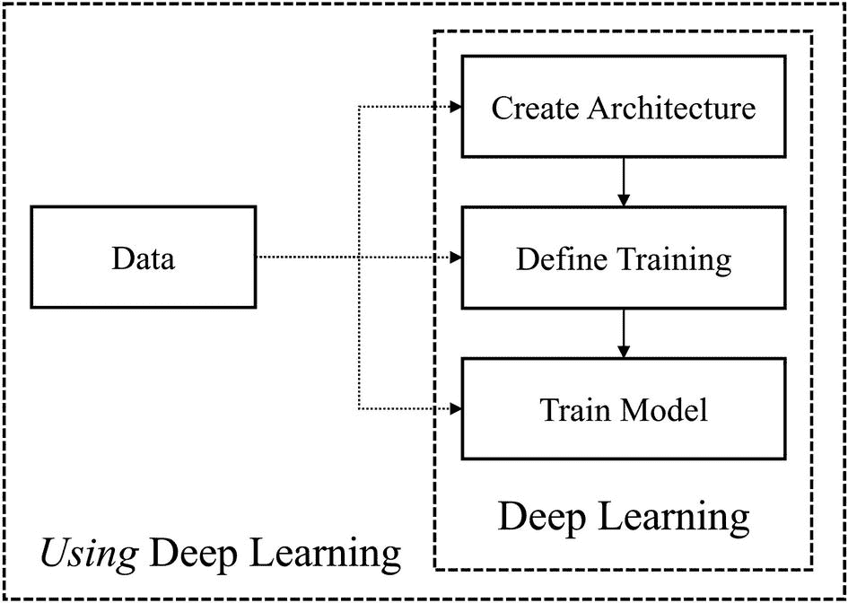
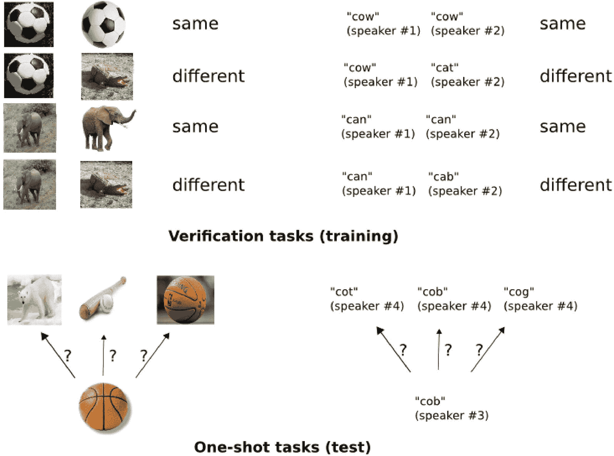

# 7.重构困难的深度学习问题

> 成功的转变重新定义了问题，使解决方案成为可能。他们抹去现有的界限，从头开始。
> 
> —马尔科姆·格拉德威尔，记者兼作家

非常粗略地说，深度学习过程可以用三个中心顺序连接的组件来表示:架构的创建、训练过程和方法的定义以及模型本身的训练。这是一般的深度学习建模工作流程。到目前为止，本书涵盖的每一章都可以大致归类到这些类别中的至少一个。关于迁移学习和预训练的第 [2](2.html) 章讨论了训练模型的方法，以从原始数据集以外的来源转移和发展知识。第 [3](3.html) 章，关于自编码器，讨论了通用自编码器概念和架构的各种用法。第 [4](4.html) 章，关于模型压缩，讨论了对神经网络架构的各种修改，以及训练程序的变更。关于元优化的第 [5](5.html) 章讨论了神经网络架构和训练程序中参数的自动化。第 [6](6.html) 章，关于成功的神经网络设计，讨论了神经网络架构和模型实现中的成功设计模式和技术。

在这最后一章——第 [7](7.html) 章——中，我们将后退一步，从严格意义上的构建成功而高效的神经网络系统的研究，转向更广阔的视角来看待*使用*，而不仅仅是*做*，在现实世界的问题中进行深度学习。为了做到这一点，我们将需要适应*重构*困难的现实世界问题，这些问题通常不会以一种便于成功应用深度学习的格式出现。尽管深度学习是一种非常强大和通用的工具，但它通常需要人类在面对困难任务时解决问题的技巧。

我们将在本章探讨的关键主题是*数据*的主题。数据是深度学习问题的基础，也是告知人们如何接近深度学习关键组件的关键因素(图 [7-1](#Fig1) )。



图 7-1

深度学习与深度学习:数据在影响深度学习的每个组成部分中扮演的角色

我们已经到了一个很难将“重构问题”的概念抽象成一个一般化的理论或一组简单的要点的地步。本章将介绍三个案例研究，作为成功重构困难的深度学习问题的例子，与数据有关:数据表示的实验，损坏的数据和有限的数据。虽然这些案例研究并不能完全代表你将面临的问题，也不能代表你需要重新思考的问题，但它们证明了创新伴随着推动和打破界限。这样做，希望它们能给你创造性的火花，让你自己开始解决新的和看不见的问题。

## 数据表示:DeepInsight

数据是一种有价值的商品，其纯度在深度学习的发展过程中变得越来越重要。传统的机器学习方法通常严重依赖于人的特征清理、工程和改变，而现代深度学习则通过自动化数据准备(最常见的是通过智能神经网络架构设计)来不断减少对人类执行数据预处理的依赖。

深度学习正在自动化数据表单的越界；不同的数据表示方法正以自动化的方式连接在一起。然而，数据中仍然存在分歧，深度学习仍然需要人类的指导来导航——数据的*上下文维度*。这里，我们不仅指数据的维度(即形状)或它所代表的编码知识，还指从数据来源开始沿着不同维度的上下文组织数据，如图像中宽度、高度和通道的空间维度，音频输入中的时间维度，以及文本输入中的序列维度。数据的上下文维度最好地描述了我们所理解的深度学习上下文中有意义的不同“类型”或“形式”的数据。

所谓的“专门”数据形式，如图像，通常被简化为深度学习的基本组件，即向量，在此基础上，它们可以作为标准层和操作中的主要元素进行处理。这是深度学习发展过程中的一般惯例:特征提取的概念意味着复杂数据趋向简单；提取复杂数据的重要元素，并从这些元素中提取更重要的元素，等等。因此，复杂的数据形式被简化为向量的处理单元。

这是深度学习发展中一个相当不明确的假设或传统，由此重新构建设计范式和超越边界可能会产生新的创新和有效的方法。我们可以将传统的图像数据流重构为矢量形式，即矢量数据流入*图像*形式。卷积运算提供了一种局部的特征提取方法——也就是说，复杂的数据排列通过局部过滤器逐渐变得平滑，这样信息就逐渐*一般化了—*—而完全连接的层不能同时查看和处理所有信息。凭直觉，我们可以假设，局部提取的特征可能证明是有价值的领域，而不仅仅是图像。

Alok Sharma，Edwin Vans，Daichi Shigemizu，Keith A. Boroevich 和 Tatsuhiko Tsunoda 在其 2019 年的论文“DeepInsight:一种将非图像数据转换为卷积神经网络架构图像的方法”中重新构建了这一传统设计范式。<sup>[1](#Fn1)</sup>deep insight 方法是一种将结构化/表格数据(这并不禁止顺序或基于文本的数据，只要它是以结构化数据格式构造的)转换为基于图像的数据的管道，这些数据随后用于标准卷积神经网络中的训练。

DeepInsight 的第一步是获取一个特征矩阵，该矩阵用于将结构化数据中的各个特征映射到相应图像中的空间坐标。这个特征密度矩阵被用作“模板”来为每个单独的矢量生成单独的图像。每个特征与“模板”矩阵中的一个像素相关联。这种关联是通过一个巧妙的技巧实现的，其中数据被*转置*，并通过核 PCA 或 t-随机邻居嵌入等方法用于降维。传统上，在具有 *n* 个样本和 *d* 个特征的数据集中，降维到两个空间维度会产生一个具有 *n* 个样本和两个特征的数据集。然而，如果我们对这样一个数据集的*转置*应用降维，我们将每个 *d* 特征作为一个样本，每个 *n* 样本作为一个特征，产生一个包含 *d* 样本和两个特征的降维数据集。因此，每个 *d* 特征已被映射到“模板”矩阵中的一个二维点。

使用核主成分分析和 t-SNE 等保持局部关系的变换方法，我们可以将行为相似的特征映射到特征矩阵中物理位置更近的位置(图 [7-2](#Fig2) )。这允许通过卷积更有效地处理生成的图像中的相似特征。


图 7-2

将特征映射到模板矩阵中的位置 *m* 。*g*<sub>T5】I</sub>用来表示某个特定的特征。→ <sup>*T*</sup> 表示转换程序

一旦建立了“模板”特征矩阵，我们就可以通过在图像中建立一个点来创建一个输入向量的图像，该点对应于为该特定特征分配的位置(图 [7-3](#Fig3) )。(由此可以观察到，DeepInsight 是设计在高维数据上的；因为图像中的每个点都是一个特征，所以需要大量的特征来填充图像。)为了防止图像表示中的冗余，使用凸包算法来选择由所有数据组成的最小矩形，裁剪掉不必要的空白边。数据被相应地旋转，空间被映射成像素的、基于图像的格式，然后可以通过标准的卷积神经网络。


图 7-3

DeepInsight 管道:将向量映射到像素坐标

Sharma 等人使用一个模型来处理这种结构化的图像数据，该模型结合了本书前面讨论的许多内容。用于处理图像的架构(如图 [7-4](#Fig4) 所示)使用基数为 2 的并行表示，其中每个分支都是线性单元的简单线性堆栈，遵循标准卷积池动态(具有额外的批量标准化和 ReLU 层)。这两个分支被合并并被处理用于分类输出。两个分支的区别在于图像操作的滤波器大小；通过使用明确捕获图像中不同大小的模式的架构，该模型能够更有效地同时寻找更广泛的模式和更小的细微差别，并将这两个视角的发现结合起来，以形成更准确的判断。使用贝叶斯优化来调整单元重复的数量、过滤器大小、学习速率和其他超参数。


图 7-4

用于 DeepInsight 管道的架构

由此产生的 DeepInsight 管道在遗传数据(该模型最初是为其设计的)和其他高维数据上下文上表现非常好。Sharma 等人在五个基准数据集上评估了该方法:RNA-seq，来自 NIH TCGA 数据集的生物 RNA 序列数据集；来自 TIMIT 语料库的子集，语音数据集；来自新闻文档的相关数据集；Madelon 数据集，这是一个综合构建的二元分类问题；以及另一个综合构造的二进制分类问题 ringnorm DELVE。这五个数据集代表了广泛的问题背景和数据空间；DeepInsight 方法在结构化/表格化数据集建模方面比其他已经成为成功的主要方法的算法表现得好得多(表 [7-1](#Tab1) )。有关 DeepInsight 如何跨这些数据集生成有意义的可视化表示，请参见图 [7-5](#Fig5) 。


图 7-5

由 DeepInsight 映射的图像模式的可视化。来自癌症、文本和元音数据集的样本的差异显示为中间列中的小块。这些差异由卷积滤波器提取，以执行比另一种方法更有效的分类

表 7-1

DeepInsight 针对不同数据集的结构化数据的其他常用方法的性能

<colgroup><col class="tcol1 align-left"> <col class="tcol2 align-left"> <col class="tcol3 align-left"> <col class="tcol4 align-left"> <col class="tcol5 align-left"></colgroup> 
| 

资料组

 | 

决策图表

 | 

adaboost 算法

 | 

随机森林

 | 

深度洞察

 |
| --- | --- | --- | --- | --- |
| RNA 序列 | 85% | 84% | 96% | 99% |
| 元音 | 75% | 45% | 90% | 97% |
| 文本 | 87% | 85% | 90% | 92% |
| 玛代隆 | 65% | 60% | 62% | 88% |
| 环虫 delve | 90% | 93% | 94% | 98% |

我们可以思考 DeepInsight 的主要优势及其在处理结构化数据方面对传统图像到矢量管道的颠覆:

*   CNN 不需要任何额外的特征提取技术，这些技术通常用于结构化数据。它们从原始输入数据中自动获得高级的、信息丰富的特征，而不需要通过一系列卷积和池化进行预处理。用于处理图像的模型的非线性结构有助于开发高级的、丰富的表示。

*   卷积在受限的子区域中局部处理图像数据。这允许用相对少量的参数实现更大的网络深度，从而促进健康的网络理解和泛化。如果使用完全连接的网络，这种性能将更加困难，在完全连接的网络中，构建更多深度以增加建模能力会导致参数更快地增加，从而有过拟合的风险，这是基于结构化数据训练的神经网络特别容易出现的问题。

*   鉴于最近的硬件进步，如 GPU 利用率，CNN 的独特结构使其能够非常高效地运行。

*   总的来说，CNN 和 DeepInsight pipeline 比传统的基于树的方法等标准算法更具可定制性/可优化性，这些算法在结构化数据建模方面取得了成功。除了调整超参数，如模型结构、向量到模板矩阵映射、学习速率等等，人们还可以容易地使用图像增强方法来生成“新的”图像数据。这种数据扩充难以用表格数据来完成，因为结构化格式由于其表示空间相对于图像的低维度而不包含固有的鲁棒性；也就是说，虽然旋转图像不会影响它所代表的现象，但改变结构化数据可能会影响。

在实践中，DeepInsight 应该是其他决策模型集合中的一员。将 DeepInsight 的特定于位置的特性与其他建模方法的更全面的方法相结合，可能会产生更明智的预测。

为了实现 DeepInsight，我们将使用 Sharma 等人创建的代码，这些代码可以从 GitHub 存储库中安装(清单 [7-1](#PC1) )。

```py
!pip install git+git://github.com/alok-ai-lab/DeepInsight.git#egg=DeepInsight

Listing 7-1Installing code provided by Alok et al. for DeepInsight

```

我们将使用的数据集是来自臭名昭著的加州大学欧文分校机器学习知识库的小鼠蛋白质表达数据集，这是一个具有 1080 个实例和 80 个特征的分类数据集，模拟了暴露于情境恐惧条件反射的小鼠大脑皮层中 77 种蛋白质的表达。这本书的源代码中提供了数据集的一个干净版本，可以下载。

假设数据已经作为 pandas DataFrame 加载到变量`data`中，第一步是分成训练和测试数据集，这是机器学习中的标准程序(清单 [7-2](#PC2) )。我们还需要将标签转换成 one-hot 格式，这种格式在原始组织中是对应于一个类的整数。这可以使用`keras.util`的`to_categorical`功能轻松完成。

```py
import pandas as pd
# download csv from online source files
data = pd.read_csv('mouse-protein-expression.csv')
from sklearn.model_selection import train_test_split
X_train, X_test, y_train, y_test = train_test_split(data.drop('class',axis=1),
                 data['class'], train_size=0.8)
y_train = keras.utils.to_categorical(y_train)
y_test = keras.utils.to_categorical(y_test)

Listing 7-2Selecting a subset of data and converting to one-hot form as necessary

```

我们将需要使用 DeepInsight 库中的`LogScaler`对象，使用 L2 范数在 0 和 1 之间缩放数据(清单 [7-3](#PC3) )。我们转换训练数据集和测试数据集，仅在训练数据集上拟合缩放器。DeepInsight 模型用于预测的所有新数据都应首先通过此缩放器。

```py
from pyDeepInsight import LogScaler
ln = LogScaler()
X_train_norm = ln.fit_transform(X_train)
X_test_norm = ln.transform(X_test)

Listing 7-3Scaling data

```

`ImageTransformer`对象首先通过传入`feature_extractor`的降维方法生成“模板”矩阵来执行图像转换，T1 接受`'tsne'`、`'pca'`或`'kpca'`。该方法用于确定输入向量中的特征到`pixels`维图像的映射。我们可以用内核 PCA 降维方法实例化一个 ImageTransformer，生成 32x32 的图像(`feature_extractor='kpca', pixels=32`)(清单 [7-4](#PC4) )。

```py
from pyDeepInsight import ImageTransformer
it = ImageTransformer(feature_extractor='kpca', pixels=32)
tf_train_x = it.fit_transform(X_train_norm)
tf_test_x = it.transform(X_test_norm)

Listing 7-4Training and transforming with the ImageTransformer

```

使用核 PCA 而不是 t-SNE，因为数据的维数和数量相对较低。没有采用 PCA，因为它的线性限制了它捕捉的细微差别。选择 32 像素的图像长度作为使生成的图像太稀疏(图像长度太高)和太小(图像长度太小)之间的平衡，以有意义地和准确地表示特征之间的空间关系。随着图像尺寸的减小，DeepInsight 管道中的距离概念——即，根据像素的相似性，将像素彼此放置得更远或更近——变得更接近于任意点。

我们可以使用`matplotlib.pyplot.imshow()`轻松地将 ImageTransformer 生成的图像可视化，以感受降维方法和图像大小如何影响特征的排列和成功的可能性(图 [7-6](#Fig6) )。图像之间的差异是微妙的，但通过一系列卷积运算，识别并放大了区别因素。注意，32×32 像素空间允许相似特征的聚集，并且允许在角落中距离较远的不太相关的特征。


图 7-6

使用 DeepInsight 方法从结构化数据生成的四个示例图像

我们将构建一个与 DeepInsight 论文中使用的双分支单元设计风格类似的架构，并进行三项关键调整:滤波器的 InceptionV3 风格因子分解/扩展、单元中的丢弃以及更长的全连接组件(清单 [7-5](#PC5) )。这有助于开发面积更小的更具体的过滤器，以更好地解析密集打包的要素，通过防止过度拟合进一步帮助概化，以及更好地处理派生的要素。一个分支使用大小为(2，2)的核来处理图像，另一个分支使用大小为(5，5)的核(使用额外的因子分解，例如 5×1 和 1×5)。

```py
# input
inp = L.Input((32,32,3))

# branch 1
x = inp
for i in range(3):
    x = L.Conv2D(2**(i+3), (2,1), padding='same')(x)
    x = L.Conv2D(2**(i+3), (1,2), padding='same')(x)
    x = L.Conv2D(2**(i+3), (2,2), padding='same')(x)
    x = L.BatchNormalization()(x)
    x = L.Activation('relu')(x)
    x = L.MaxPooling2D((2,2))(x)
    x = L.Dropout(0.3)(x)
x = L.Conv2D(64, (2,2), padding='same')(x)
x = L.BatchNormalization()(x)
branch_1 = L.Activation('relu')(x)

# branch 2
x = inp
for i in range(3):
    x = L.Conv2D(2**(i+3), (5,1), padding='same')(x)
    x = L.Conv2D(2**(i+3), (1,5), padding='same')(x)
    x = L.Conv2D(2**(i+3), (5,5), padding='same')(x)
    x = L.BatchNormalization()(x)
    x = L.Activation('relu')(x)
    x = L.MaxPooling2D((2,2))(x)
    x = L.Dropout(0.3)(x)
x = L.Conv2D(64, (5,5), padding='same')(x)
x = L.BatchNormalization()(x)
branch_2 = L.Activation('relu')(x)

# concatenate + output
concat = L.Concatenate()([branch_1, branch_2])
global_pool = L.GlobalAveragePooling2D()(concat)
fc1 = L.Dense(32, activation='relu')(global_pool)
fc2 = L.Dense(32, activation='relu')(fc1)
fc3 = L.Dense(32, activation='relu')(fc2)
out = L.Dense(9, activation='softmax')(fc3)

# aggregate into model
model = keras.models.Model(inputs=inp, outputs=out)

Listing 7-5Sample implemented architecture in Keras. You can, of course, optimize the architecture using the meta-optimization methods discussed in Chapter 5

```

当对几十个时期的数据进行编译和训练时，该模型产生了几乎完美的训练和准确度*和*测试准确度(列出了 [7-6](#PC6) )。

```py
model.compile(optimizer='adam', loss='categorical_crossentropy',
              metrics=['accuracy'])
model.fit(tf_train_x, y_train, epochs=100, validation_data=(tf_test_x,y_test))

Listing 7-6Compiling and fitting the model

```

通过将卷积和其他基于图像的图像可以达到的数据类型扩展到结构化数据，DeepInsight 桥接了深度学习的整个区域，在这种情况下，产生了一个令人难以置信的成功模型。

## 损坏的数据:带有嘈杂标签的负面学习

不正确标记的数据比我们想象的更普遍，特别是在带注释的数据集的环境中，样本是由人类注释者手动标记的，注释者通常动作很快，可能会出错。或者，敌对攻击可以在数据集上进行，这些数据集切换某些训练项目的标签，以最大程度地破坏神经网络性能。由于没有忠实地对其所表示的现象建模的数据产生了没有正确地对其被训练的现象建模的模型，经常过度拟合和开发“混乱的”表示(即，GIGO(垃圾输入，垃圾输出))，因此需要开发处理具有损坏标签的数据的方法，该方法不需要手动搜索整个数据集来纠正它们。

金永东、严俊浩、朱胜云和莫峻金提出了一个新颖、简单但成功的学习管道来处理腐败标签。 <sup>[2](#Fn2)</sup> 他们的方法重构了多类图像分类任务的传统方法，*积极学习*，其中神经网络被“教会”将图像与标签相关联——也就是说，这个图像*是* a【标签】。*消极学习*则是当神经网络被“教导”为*而不是*将一个图像与一个标签关联起来——也就是说，这个图像是*而不是*一个【标签】(图 [7-7](#Fig7) )。


图 7-7

积极学习和消极学习的视觉差异

在多班级环境中，消极学习是一种间接的学习方法。几个消极的学习联想必须学习到相当于一个积极的学习联想。例如，如果我们正在训练一个模型来对 MNIST 式的数字 0 到 9 进行分类，以表示某个图像代表数字“3”的知识，我们将需要九个负面学习联想:那个图像是*而不是*数字“0”，那个图像是*而不是*数字“1，……，那个图像是*而不是*数字“9”然而，在这种情况下，消极学习的意义并不等同于积极学习，因为我们知道许多积极学习的联想已经被破坏了。

假设我们正在用 *k* 个类训练一个多类问题的模型。我们不是通过将一些训练输入 *x* 与我们知道可能被破坏的正标签 *y* <sub>*p*</sub> 相关联来使用正学习，而是随机选择*k*1 其他类中的一个作为负标签 *y* <sub>*n*</sub> 。如果原来的阳性标签*被*破坏(即 *y* <sub>*p*</sub> 与 *x* 不匹配)，那么随机选择的阴性标签有的概率为真——当应用于 *x* 时，其他*k*1 阴性标签中只有一个为假，因为它是阳性标签。随着 *k* 的增加，随机选择的负标签为真的概率变得更接近 1。对于现代数据集，在 *k* = 100 甚至 *k* = 1000 的情况下，一个负标签不正确的概率可以忽略不计。另一方面，如果原始正标签是*而不是*损坏的(即，它是正确的)，则随机选择的替代负标签有 100%的机会是真的。

在负标签上训练模型需要不同的损失函数。假设五类分类问题的真实一热向量是[1，0，0，0，0](即负标签是 0 代表的类索引)，预测是[0.3，0.4，0.2，0.0，0.1]。我们的损失函数不需要考虑除了负标签之外的类别的预测。我们所关心的是模型对索引为 0 的类的预测(0.3 的预测)向零递减，因为我们希望模型对该类的置信度尽可能低。不是增加正确类别的概率，而是训练模型来最小化随机选择的不正确类别(即，对应于否定标签)的置信度。

除了确保增加标签的真实性之外，这种负向学习的方法通过经由间接关联引入关联，阻止了对噪声数据的过度拟合。在一个足够大的数据集中，这些通过消极学习获得的间接联系结合在一起，形成与积极学习相当的知识(如果标签没有被破坏)。通过比较经过积极学习和消极学习训练的模型的置信度的概率分布，证明了缺乏过度拟合的证据——经过消极学习训练的模型置信度较低，但能更准确地识别损坏的示例(图 [7-8](#Fig8) )。


图 7-8

左图:表示数据集中模型置信度的两个概率分布(左图，橙色:损坏的数据；右图，蓝色:未损坏的数据)和积极的学习。右:只有负面学习

为了改善收敛性，作者引入了*选择性负面学习* (SelNL)，其中卷积神经网络仅在模型预测置信度大于(大于概率)的标签的数据上进一步训练。这意味着可能不正确的负标签与其他正确负标签的学习知识相矛盾，因此可以从训练数据集中过滤掉。SelNL 有助于模型变得更加自信，并更准确地区分损坏和未损坏数据的概率分布(图 [7-9](#Fig9) )。


图 7-9

两个概率分布代表数据集中的模型置信度(左，橙色:损坏的数据；右，蓝色:未损坏的数据)与 *NL* → *SelNL*

Kim 等人介绍了另一种训练范式，*选择性积极学习* (SelPL)，其基础是在给定正确标签的情况下，积极学习比消极学习更快、更准确。现在，负面学习和选择性负面学习范式已经允许或多或少准确地分离损坏和未损坏的数据，我们可以过滤掉模型预测置信度小于 *γ* 的数据。通过该阈值要求的数据被认为是干净的，干净数据的*正标签*用于网络上的进一步训练。

在这条管道的末端—*NL*→*SelNL*→*SelPL*，称为 SelNLPL 管道——该模型能够清楚地分离损坏的和未损坏的数据，将低概率赋予前者，将高概率赋予后者(图 [7-10](#Fig10) )。


图 7-10

两个概率分布代表数据集中的模型置信度(左，橙色:损坏的数据；右，蓝色:未损坏的数据)与*NL*→*SelNL*→*SelPL*

请注意，在 *SelNL* → *SelPL* 阶段，网络从消极学习到积极学习的转变可能看起来不和谐，但根据经验观察是平稳的。网络只需要重新安排和重新格式化它已经获得的知识来适应积极的学习方式。这可以通过模型的训练曲线来证明，因为它是在不同阶段训练的:负面学习、选择性负面学习和选择性正面学习(图 [7-11](#Fig11) )。


图 7-11

横跨*NL*→*SelNL*→*SelPL*管道的性能

该模型的过滤功能不仅可用于识别损坏的数据，还可用于纠正数据。新的分类网络在干净的数据集(由先前的模型识别为未被破坏的数据集)上被训练。然后，它预测损坏数据的标签以更新它们的标签。整个数据集——原始未损坏的和更新的数据——用于训练最终的分类网络。最终的分类网络可以访问经过校正的、几乎完全真实的数据集(图 [7-12](#Fig12) )。因此，它可以更忠实地模拟数据所代表的现象。


图 7-12

完整的 NLNL 管道–SelNLPL 管道，用于分离噪声数据和干净数据，以更新标签并最终进行模型分类

该管道在解决数据损坏领域实现了最先进的性能，在各种模型和数据集上的表现优于其他数据损坏方法(表 [7-2](#Tab2) )。

表 7-2

NLNL 管道相对于其他方法的性能

<colgroup><col class="tcol1 align-left"> <col class="tcol2 align-left"> <col class="tcol3 align-left"> <col class="tcol4 align-left"> <col class="tcol5 align-left"> <col class="tcol6 align-left"></colgroup> 
| 

资料组

 | 

模型

 | 

方法

 | 

噪声水平性能

 |
| --- | --- | --- | --- |
|   |   | 

20%

 | 

40%

 | 

60%

 |
| --- | --- | --- | --- | --- |
| 时尚人士 | 网易 18 | 这一个平均绝对误差被截断的*L*<sub>T3】qT5】</sub>承台 | Ninety-three point two fourEighty point three nineNinety-three point two one**94.82** | Ninety-two point zero nineSeventy-nine point threeNinety-two point six**94.16** | Ninety point two nineEighty-two point four oneNinety-one point five six**92.78** |
| CIFAR-10 战斗机 | ResNet14 | 这一个自举–软自举–硬承台 | Eighty-three point sevenEighty-four point threeEighty-three point six**89.85** | –––– | –––– |
| ResNet34 | 这一个平均绝对误差被截断的*L*<sub>T3】qT5】</sub>承台 | Eighty-six point nine eightEighty-three point seven twoEighty-nine point seven94.23 | Eighty-one point eight eightSixty-sevenEighty-seven point six two**92.43** | Seventy-four point one fourSixty-four point two oneEighty-two point seven**88.32** |
| CIFAR-100 战斗机 | ResNet34 | 这一个平均绝对误差被截断的*L*<sub>T3】qT5】</sub>承台 | Fifty-eight point seven twoFifteen point eightSixty-seven point six one**71.52** | Forty-eight point twoNine point zero threeSixty-two point six four**66.39** | Thirty-seven point four oneSeven point seven fourFifty-four point zero four**56.51** |
| 梦妮丝 | 蓝尼 | 这一个开机-硬软靴D2L承台 | Eighty-eight point zero twoEighty-seven point six nineEighty-eight point fiveNinety-eight point eight four**99.35** | Sixty-eight point four sixSixty-nine point four nineSeventy point one nineNinety-eight point four nine**99.27** | Forty-five point five oneFifty point four fiveForty-six point zero fourNinety-four point seven three**98.91** |

通过将传统的积极学习范式重新构建为消极学习，然后使用它来建立一个完整的学习和过滤管道，针对噪声标签的消极学习方法巧妙地解决了受损标签的难题。

我们将实现 Kim 等人提出的 NLNL 管道的稍微修改/简化版本。我们将使用 CIFAR-10 数据集，该数据集包含来自十个不同动物和运输类别的数千幅 32x32 像素图像。这个数据集可以直接从 Keras 数据集加载(清单 [7-7](#PC7) )。

```py
(x_train, y_train), (x_test, y_test) = keras.datasets.cifar10.load_data()

Listing 7-7Load CIFAR-10 dataset

```

首先，我们需要将噪声注入数据集(清单 [7-8](#PC8) )。我们只需将某个标签子集随机切换到另一个不同的标签即可。索引的子集最初是通过 numpy 的随机选择功能随机选择的，并将用于确定哪些数据实例将被损坏。

```py
perc = 0.2
from np.random import choice
selected_indices = choice(np.arange(len(x_train)),
                          int(round(perc*len(x_train))), replace=False))

Listing 7-8Selecting random indices for corruption. We specify replace=False in the np.random.choice function to indicate that we are drawing from the list of indices, created by np.arange(len(x_train)), without replacement. This avoids random selection of duplicate indices

```

为了执行破坏(列表 [7-9](#PC9) )，我们可以遍历每个随机选择的索引。对于每一个，我们生成一个可能的索引列表(除真实类之外的所有类)，并从这组可能性中随机选择。这些改变是对`cy_train`进行的，它被指定为存储用于训练的损坏的 *y* 标签。这应该是用`cy_train = np.copy(y_train)`而不是`cy_train = y_train`创建的。在后一种方法中，两个变量仍然纠缠在一起，cy_train 的任何变化都会出现在`y_train`中。通过显式复制变量，我们将两者“分开”。

```py
new_values = []
for ind in selected_indices:
    true_label = y_train[ind][0]
    possibilities = [i for i in range(10) if i!=true_label])
    corrupted = np.random.choice(possibilities)
    new_values.append(corrupted)
new_values = np.array(new_values).reshape((len(new_values),1))
cy_train[selected_indices] = new_values

Listing 7-9Corrupting labels

```

在此配置中，20%的标签已经损坏。为整个数据集生成负标签(清单 [7-10](#PC10) )相对来说类似于破坏数据。我们选择一个标签，而不是当前与每个训练项目关联的标签，并将其用作该项目随机选择的*负面标签*。负标签存储在`ny_train`变量中。

```py
ny_train = np.copy(cy_train)
for ind in tqdm(range(len(ny_train))):
    listed_label = cy_train[ind][0]
    possibilities = ([i for i in range(10) if i!=listed_label]
    negative_label = choice(possibilities)
    ny_train[ind] = negative_label

Listing 7-10Generating negative labels

```

NLNL 流水线的第一阶段是执行负面学习。为了简单起见，我们将使用没有架构修改的标准 EfficientNetB3 模型(清单 [7-11](#PC11) )。

```py
from keras.applications.efficientnet import EfficientNetB3
inp = L.Input((32,32,3))
base_model = EfficientNetB3(
    include_top=True, weights=None,
    input_tensor=inp, classes=10
)
nl_model = keras.models.Model(inputs=inp, outputs=base_model.output)

Listing 7-11Train model on initial negative learning stage. We cannot use ImageNet weights because we’re not building a custom top

```

回想一下，我们需要一个专门的损失函数来训练负面学习。我们希望降低模型的置信度，即训练项目属于与负标签相对应的类别。相反，如果我们采用另一种方法，最大化模型对训练项目与对应于否定标签的类相关联的置信度，然后执行后处理否定(例如，具有最低置信度的类是真实类)，这在表面上看起来是相同的，我们会遇到迫使模型学习基本随机现象的问题——哪个否定标签是随机选择的，从而鼓励过度拟合和较差的性能。

一般的交叉熵损失方程以简单的形式是，*l*(*y*<sub>*t*</sub>，*y*<sub>*p*</sub>)=*y*<sub>*t*</sub>*log*(*y*<sub>p</sub>)(对所有 其中 *y* <sub>*t*</sub> 是真实标签 *y* <sub>*p*</sub> 是一组概率预测。 该损失函数寻求最大化真实类的模型置信度。这相应地降低了相同训练项目的其他类的置信度，因为 softmax 输出确保所有概率总和为 1。

在这种情况下，因为我们希望*最小化*模型在负标签类中的置信度，我们改为使用(*y*<sub>T5】t</sub>，*y*<sub>*p*</sub>)=-*y*<sub>*t*</sub>*log*(1-*y*<sub>*p*唯一的区别是预测 *y* <sub>*p*</sub> 被替换为 1-*y*<sub>*p*</sub>使得负面标签的较高置信度被惩罚。**</sub>

在 Keras 中实现这样的定制损失函数很简单；我们定义了一个函数，它接受`y_true`和`y_pred`，并使用 Keras/TensorFlow 后端样式的函数返回跨项目的平均损失(清单 [7-12](#PC12) )。因为当输入为 0 时，对数返回 NaN，所以我们确保使用 TensorFlow 的`tf.clip_by_value`来确保输入最小为`1e-5`(或者其他任意的ε值)。`tf.reduce_mean`平均所有项目的交叉熵损失；通过`axis=-1`保证了这一点。我们还确保将`y_true`和`y_pred`转换为 float 32，以防止将来出现类型问题。

```py
import keras.backend as K
def special_loss(y_true, y_pred):
    y_true, y_pred = tf.cast(y_true, tf.float32),
                     tf.cast(y_pred, tf.float32)
    log_inp = tf.clip_by_value(1-y_pred, 1e-5, 1.-1e-5)
    return tf.reduce_mean(-y_true * K.log(log_inp), axis=-1)

Listing 7-12Building a specialized loss function for negative learning

```

然后可以用我们的特殊损耗编译模型，并贴上负面标签(列表 [7-13](#PC13) )。注意，当前形式的标签不是一次性编码的；我们利用这一点，使添加噪声和生成负标签时的标签处理更加方便。通常，我们可以为多类问题传递整数样式的标签，并使用“`sparse_categorical_crossentropy`”损失，它会在执行分类交叉熵之前自动将标签转换为独热表示。因为我们的定制损失函数不是用这个功能构建的，为了与损失函数兼容，标签被手动转换成带有`keras.utils.to_categorical`的一键表单。

```py
import keras.backend as K
from keras.optimizers import SGD
sgd = SGD(learning_rate=0.025, momentum=0.1, nesterov=True)
nl_model.compile(optimizer=sgd loss=special_loss),
nl_model.fit(x_train, keras.utils.to_categorical(ny_train), epochs=100)

Listing 7-13Compiling and fitting model for negative learning. We also use a different optimizer – SGD rather than Adam and with particular parameters. This is simply because it seems to perform better. This is a good place to use hyper-optimization. For optimal success, use callbacks and other deep learning good practices

```

请注意，在每个模型版本的每个阶段都需要大量的培训，以开发足够的知识表示；一个阶段训练不足会阻碍后面阶段的发展。在所有非端到端的多级管道设计中，这是需要注意的。

流水线的第二阶段是执行*选择性负面学习*——进一步的负面学习来过滤掉最初有问题的输入(列表 [7-14](#PC14) )。虽然有许多可能的过滤器来确定哪些数据是有问题的，但为了简单起见，我们将选择与阳性标签相关联的置信度大于的训练项目。这种方法开始过滤掉损坏的数据，这很可能产生低于机会的概率。我们可以通过创建一个布尔掩码并将其应用到`x_train`和`ny_train`来创建`selnl_x_train`和`selnl_y_train`来选择这个数据子集。

```py
predictions = nl_model.predict(x_train)
mask = [True if predictions[ind][cy_train[ind][0]] > 0.1 else False for ind in range(len(x_train))]
selnl_x_train = x_train[mask]
selnl_y_train = ny_train[mask]

Listing 7-14Filter out problematic data. For optimal success, use callbacks and other deep learning good practices

```

我们可以继续在更新的数据上训练模型(清单 [7-15](#PC15) )。

```py
nl_model.fit(selnl_x_train, selnl_y_train,
epochs=100)

Listing 7-15Continue to fit data in the selective negative learning phase. For optimal success, use callbacks and other deep learning good practices

```

管道的第三阶段是向*选择性积极学习*(列表 [7-16](#PC16) )的过渡。选择用于选择性正学习的数据类似于选择用于选择性负学习的数据，但是我们希望在这里使用更严格的标准来确保模型在未损坏的标签上进行训练。我们将只包括模型为阳性标签类分配至少 40%置信度的数据点。注意标签(`selpl_y_train`)取自`cy_train`——被破坏的积极学习标签，而不是消极学习标签。

```py
predictions = nl_model.predict(x_train)
mask = [True if predictions[ind][ny_train[ind][0]] > 0.4 else False for ind in tqdm(range(len(x_train)))]
selpl_x_train = x_train[mask]
selpl_y_train = cy_train[mask]

Listing 7-16Filter out data for selective positive learning

```

因为我们正在从消极学习范式转换到积极学习范式，所以我们需要改变损失函数，使得标签中指示的类别的较高置信度被奖励而不是被惩罚。这可以通过重新编译模型来实现，模型仍然保持其权重(清单 [7-17](#PC17) )。

```py
nl_model.compile(optimizer='adam', loss=’sparse_categorical_crossentropy’)
nl_model.fit(selpl_x_train, selpl_y_train, epochs=100)

Listing 7-17Train for the selective positive learning

stage. For optimal success, use callbacks and other deep learning good practices

```

SelNLPL 管道完成后，该模型可用于将数据集分为损坏的和未损坏的数据集(清单 [7-18](#PC18) )。损坏的数据更有可能对分配的正标签具有低置信度，而未损坏的数据更有可能具有高置信度。我们可以将此阈值设为 50%，以区分损坏的数据和未损坏的数据。

```py
predictions = nl_model.predict(x_train)

mask = [True if predictions[ind][cy_train[ind][0]] > 0.5 else False for ind in range(len(x_train))]

clean_x_train = x_train[mask]
clean_y_train = cy_train[mask]
unclean_x_train = x_train[[not boolean for boolean in mask]]

Listing 7-18Separating corrupted and uncorrupted datasets

```

既然已经识别了干净的数据集，就在干净的标签上训练新的模型(清单 [7-19](#PC19) )。在这种情况下，它与前面的 SelNLPL 管道中使用的模型相同，但并不一定如此。

```py
inp = L.Input((32,32,3))
base_model = EfficientNetB3(
    include_top=True, weights=None, input_tensor=inp, classes=10
)
model = keras.models.Model(inputs=inp, outputs=base_model.output)
model.compile(optimizer=’adam’, loss='sparse_categorical_crossentropy',
              metrics=['accuracy'])
model.fit(clean_x_train, clean_y_train, epochs=100)

Listing 7-19Training a model on the clean data to label the unclean data

```

该模型的预测用于校正标签(列表 [7-20](#PC20) )。我们可以通过用`np.where()`标识每个预测中最大概率的索引，从模型的概率预测中提取整数标签。最初不干净、现在干净的数据集被放入一个 numpy 数组中，并被重新整形为所需的形状。

```py
pred_labels = model.predict(unclean_x_train)
unclean_y_train = []
for ind in range(len(unclean_x_train)):
    label = np.where(pred_labels[ind] == np.max(pred_labels[ind]))
    unclean_y_train.append(label)
unclean_y_train = np.array(unclean_y_train)
desired_shape = (len(unclean_y_train),1))
unclean_y_train = unclean_y_train.reshape(desired_shape)

Listing 7-20Cleaning the unclean data

```

这两个数据集现在可以连接在一起成为最终的干净数据集，该数据集可以用于训练最终的模型(清单 [7-21](#PC21) )。

```py
final_clean_x_train = np.concatenate([clean_x_train,unclean_x_train])
final_clean_y_train = np.concatenate([clean_y_train, unclean_y_train])

Listing 7-21Concatenating data to form the final cleaned dataset

```

在整个流程中跟踪数据和模型可能很困难，但是组织对于防止错误是很重要的。输入错误的变量名可能会导致模型在不正确的数据集上进行训练，这将导致令人迷惑的惊人结果或令人沮丧的糟糕结果。

NLNL 管道展示了如何将最初的重构发展成一个完整的管道来解决一个难题。

## 有限的数据:暹罗网络

深度学习应用是出了名的数据饥渴。现代神经网络通常需要消耗和处理每个类的数千个数据实例，以获得与该类相关联的主要特征和属性的强表示和理解。在本书中，我们探索了各种方法来减少成功训练神经网络所需的新数据的原始量。图像增强可以提供“新数据”,这些数据是模型以前没有见过的精确形式。迁移学习允许将特征提取技能从一个通用数据集迁移到更具体的数据集，其中可以使用更小的数据集来针对具体的上下文微调/调整技能。自我监督学习使模型在暴露给标签之前就习惯了数据集的基本关系和特征。如果您愿意，您甚至可以训练一个可变的自编码器来生成新数据，以增加数据集的大小。虽然这些方法在处理*小数据集*时很有效，但它们在处理非常小的数据集时也有问题。

*少量学习*是机器学习和深度学习的一个领域，最近随着具有大量类但每个类中很少训练样本的应用变得更加重要，其重要性也在上升。例如，想象一下基于面部的手机登录等应用中内置的面部识别模型——该模型必须能够验证你的面部属于你，但识别出你的面部不属于存在的许多其他可能的人之一。它必须以非常高的性能做到这一点——在登录应用中使用 95%准确率的模型是不够安全的——并且只有很少的训练样本——如果用户需要生成数百个训练样本，这不是一个好的用户体验！

少量学习中一个更极端的研究是*一次性学习*。一次性学习是指在每个类只有一个实例的情况下，对输入进行分类。例如，如果我们正在训练一个模型来在一次拍摄的情况下识别动物，数据集将由来自每个类别(狗、猫、马、鸡等)的一个图像组成。)并且该模型将被期望从表示提供给它的类的一个图像中概括该类的所有实例。这当然是一项非常艰巨的任务。然而，一次性学习和少量学习的进步通常有可能缩小深度学习和人类思维之间的差距，人类思维显然能够从更小的实例集中概括概念和想法。

李菲菲等人在 21 世纪初对一次性学习的早期工作使用了一个变分贝叶斯框架，该框架依赖于这样一个原则，即以前学习过的类可以用来预测未来的类，只需给定类中的几个例子。Lake 等人在 2013 年的后期工作提出了*分层贝叶斯程序学习*方法，它可以通过系统地解构图像并对观察到的像素提出结构性解释来学习绘制的图形(即直线、曲线和点的集合)。即使通过增加卷积神经网络的使用，一次性学习的最有前景的方法也没有使用传统的卷积神经网络体系结构，而是依赖于某种程度的领域知识来填充由于缺乏训练数据而留下的知识空白。例如，如果一个模型被训练来分类 MNIST 风格的数字(10 类，从 0 到 9)，我们就可以建立数据结构的知识——线条构成、区别特征等。–融入到系统的设计中，就像 HBPL 一样。

因此，在一次性图像识别的基础上，更进一步的挑战是向*通用一次性学习*迈进，其中系统可以从各种问题领域的一次性数据集自动开发知识表示(即，不需要将领域知识隐式编码在系统的设计中)。

Gregory Koch、Richard Zemel 和 Ruslan Salakhutdinov 在他们 2015 年的论文“用于一次性图像识别的暹罗神经网络”中，通过将一次性图像*分类*的问题重新定义为*相似性*的问题，致力于解决这一具有挑战性的问题 <sup>[3](#Fn3)</sup> 我们不是试图用每个类自身的特征来表示它们——漂浮在稀疏知识空间中的抽象特征——而是迫使模型学习类之间的关系，这样一个类的知识就基于其他类的知识。这种方法允许更稳定、可靠和丰富的理解结构。

假设你第一次收到一个苹果、一个橘子和一颗葡萄。您被告知必须开发这三个实体的知识表示，并在呈现给新对象时应用它们(例如，识别新对象是苹果、桔子还是葡萄)。你可以列出一长串每个物体的特征:苹果是圆形的——几乎是球形，但略呈长方形——红色，顶部有茎，外部相对较硬。橙子是圆形的——几乎是球形，但略呈长方形——橙色，顶部有一个树桩，外表柔软但结实。这种葡萄又圆又小——几乎呈球形，但略呈长方形——紫色，顶部有一小茎，外部薄如纸。

这种知识表示有两个关键问题:首先，我们的特征中有明显的冗余，这些冗余与类别之间的区分无关。所有的物体都是圆形的——几乎是球形的，但略呈长方形，因此这个特征可以被丢弃，因为它没有提供用于分类的信息。第二，它依赖于自身很难获得的属性的构造。例如，“软”的东西只有在“硬”的物体存在时才有意义。同样，颜色只有在与其他颜色对比时才有意义。因此，用每类如此少的项目来表示知识，作为每类独立的各种质量的标识，是不切实际的。

相反，我们设计我们的知识表示方法来捕捉每一个项目之间的相似性和差异——我们正在使先前知识表示形式中隐含和隐藏在地毯下的东西变得显而易见。橘子和苹果大小相似，而葡萄则不同。橘子、苹果和葡萄的颜色和质地都不同。苹果和葡萄在有茎的性质上是相似的，而桔子有一个小的短茎。这些品质有更多的意义，因为我们明确地将它们表示为体现这些品质的对象之间的相似性或差异性。因此，我们能够开发这种知识的更稳定的表示；它植根于人际关系。当我们看到一个新的对象时，我们将它与之前看到的每一个项目进行比较，并为该对象分配它认为最相似的任何项目的类别。

另一个可能更熟悉的例子:如果你曾经困惑于何时使用“who”和“who ”,并在网上查找，你可能会找到两个答案。人们通常会说“谁指的是句子的主语；who 指动词或介词的宾语另一种是“可以用‘他’或‘她’代替的时候用‘谁’；如果能用“他”或“她”代替，就用“谁”。“第一种方法试图用明确的、非关系的语法术语来定义这个新概念的用法——谁对谁，使用语言的客观支柱来支持新的语法理解。另一个是关系型的，利用上下文空间中的其他想法来建立对这个新想法的理解。虽然前者可能更学术和正式，后者通常更有效。

在 Koch 等人提出的暹罗网络系统中，训练一个网络对两个输入是否相同进行分类(图 [7-13](#Fig13) )。由于这在技术上是一个二元分类问题，网络输出两个输入属于同一类的概率。



图 7-13

将分类问题范式重构为一次性学习的相似性范式。在这种情况下，向网络显示来自同一类别的多个图像；也就是少射学习。单次学习通常通过图像增强来执行

该模型在这些*验证任务*上被训练。请注意，由于验证任务是根据成对数据构建的，我们还可以扩展数据集的大小，因为用于训练暹罗网络的一个数据实例是根据每对数据实例构建的。训练后，该模型预测测试输入和每个训练实例之间的相似性。具有与测试输入属于同一类的最高概率的训练实例的类被认为是测试输入的类。请注意，这种范式既适用于一次性分类，也适用于少量分类。

为了实现这个概念，使用了*连体网络*架构(图 [7-14](#Fig14) )。像连体双胞胎一样，网络有两个头来接受两个输入。这两个输入分别并行处理，以提取比较所需的关键特征。这两个并行分支通过*权重共享*纠缠在一起，其中(回忆第 [5](5.html) 章，高效神经架构搜索案例研究)网络不同部分的权重是相同的，并且相同地更新。这种权重共享确保了输入的顺序无关紧要，并且两个输入都以相同的方式处理。在输入被并行处理之后，它们的编码特征通过距离层进行比较，该距离层计算编码表示之间的距离。然后，通过输出层进一步处理该距离，以产生最终的概率/相似性。


图 7-14

简化的暹罗网络架构

Koch 等人使用的暹罗网络设计使用交替卷积和汇集操作的标准序列(图 [7-15](#Fig15) )。


图 7-15

Koch 等人在原始论文中使用的暹罗网络的卷积分支。

暹罗网络系统在多种环境中表现良好。例如，考虑 Omniglot 数据集(图 [7-16](#Fig16) )，它包含各种字母表中的字符图像，这些字母表包括希腊语、希伯来语、韩语、拉丁语、马来语等。在 Omniglot 数据集(表 [7-3](#Tab3) )上的一次性学习中，卷积暹罗网络的表现优于几乎所有其他算法和模型。

表 7-3

连体网络法与其他一次性学习方法的比较

<colgroup><col class="tcol1 align-left"> <col class="tcol2 align-left"></colgroup> 
| 

方法

 | 

一次性测试 Acc。

 |
| --- | --- |
| 人类 | 95.5% |
| 分层贝叶斯程序学习 | 95.2% |
| 仿射模型 | 81.8% |
| 分层深度 | 65.2% |
| 深层玻尔兹曼机 | 62.0% |
| 简单笔画 | 35.2% |
| 1-最近邻 | 21.7% |
| 暹罗网络 | 92.0% |


图 7-16

Omniglot 数据集的 20 个类的示例

如前所述，暹罗网络的性能略差于分层贝叶斯程序学习，但其优点是适用于所有其他种类的数据集和上下文。

让我们首先从 MNIST 数据集(列表 [7-22](#PC22) )为暹罗网络构建一个数据集。我们将从每个类中抽取少量的项目开始——在本例中，每个十位数的类有十个训练实例。我们首先选择所有具有与数字标签匹配的 *y* 值的索引，然后使用`np.random.choice`从索引列表中随机选择一定数量的索引。

```py
# configurations
class_size = 10

# load MNIST data
(X_train, y_train), (X_test, y_test) = keras.datasets.mnist.load_data()

# select x instances from each class
samp_x_train, samp_y_train = [], []
for digit in range(10):
    indices = (y_train == digit).nonzero()[0]
    selected = np.random.choice(indices, size=class_size)
    samp_x_train.append(X_train[selected])
    samp_y_train.append(y_train[selected])

Listing 7-22Loading and sampling MNIST data

```

我们需要对数据集进行一些修改。首先，我们将两个数据列表转换成 numpy 数组，并将数据从 0 到 255 之间扩展到 0 到 1 之间。之后，我们将数据重新整形为适当的形式，这样就有了*个数字类* × *个类大小*个数据实例，并且图像有一个通道(清单 7-23)。

```py
samp_x_train = np.array(samp_x_train)/255
samp_x_train = samp_x_train.reshape((10*class_size, 28, 28, 1))
samp_y_train = np.array(samp_y_train)/255
samp_y_train = samp_y_train.reshape((10*class_size, 1))

Listing 7-23Scaling and reshaping data

```

我们遍历所有唯一的索引组合到其他索引(列表[7-24](#PC24))；第二个索引是从在第一个采样索引之后存在*的所有索引中选择的，以防止重复组合两次。如果两个索引数据点的标签相等，我们使用标签 1 来指示这两个图像属于同一类。否则，标签为 0。*

```py
# generate pairs
fs_x_train_1, fs_x_train_2, fs_y_train = [], [], []
indices = list(range(10*class_size))
for ind_1 in indices:
    label1 = samp_y_train[ind_1]
    for ind_2 in indices[ind_1:]:
        label2 = samp_y_train[ind_2]

        # append x
        fs_x_train_1.append(samp_x_train[ind_1])
        fs_x_train_2.append(samp_x_train[ind_2])

        # append similarity label
        if label1 == label2:
            fs_y_train.append(1)
        else:
            fs_y_train.append(0)

Listing 7-24Generating Siamese network-style pairs

```

我们可以将这三组数据转换成 numpy 数组，以便在 Siamese 网络中使用(清单 [7-25](#PC25) )。

```py
fs_x_train_1 = np.array(fs_x_train_1)
fs_x_train_2 = np.array(fs_x_train_2)
fs_y_train = np.array(fs_y_train)

Listing 7-25Converting to numpy arrays

```

我们将使用分区设计来构建暹罗网络(列表 [7-26](#PC26) )。这两个平行的分支将作为单独的子模型构建，这些子模型将一起排列成一个更大的连体网络。这样做的目的是实现重量共享，我们将在后面讨论。每个并行分支将是卷积层和池层之间的标准交替。卷积处理后，数据被展平并映射到 16 维编码表示。该分支被安排到模型中，该模型接收输入图像并将其映射到矢量编码表示，该矢量编码表示随后可以与另一矢量编码表示一起用于计算编码表示之间的距离。

```py
def parallel_branch():
    inp_layer = L.Input((28,28,1))
    x = L.BatchNormalization()(inp_layer)
    x = L.Conv2D(32, (3,3), activation='relu')(x)
    x = L.Conv2D(32, (3,3), activation='relu')(x)
    x = L.MaxPooling2D((2,2))(x)
    x = L.Conv2D(64, (3,3), activation='relu')(x)
    x = L.Conv2D(64, (3,3), activation='relu')(x)
    x = L.MaxPooling2D((2,2))(x)
    x = L.Flatten()(x)
    x = L.Dense(16, activation='relu')(x)
    branch = keras.models.Model(inputs=inp_layer, outputs=x)
    return branch

Listing 7-26Function to create a parallel branch model

```

接下来，我们将实现距离层(列表 [7-27](#PC27) )，这在 Keras/TensorFlow 中还不存在。幸运的是，我们可以利用`keras.layers.Lambda`函数，它允许我们使用后端函数作为层来定义函数。距离函数接受两个编码的矢量表示，并使用 Keras 后端函数返回两者之间的 L2 欧几里德距离，定义为两个编码表示*e*T7】1 和*e*T11】2 的。由于计算在 *x* = 0 处的梯度比较复杂(即当两幅图像相同且*e*<sub>1</sub>=*e*<sub>2</sub>时)，我们在平方根之前设置*x*=*max*(*s*， *ϵ* )，其中*s*如果我们不采取这种措施，当两个输入相同并且因此编码表示相同时，损失将成为第一个计算梯度的实例`NaN`。

```py
import keras.backend as K
def distance(representations):
    reps1, reps2 = representations
    squared = K.sum(K.square(reps1-reps2), axis=1, keepdims=True)
    return K.sqrt(K.maximum(squared,K.epsilon()))

Listing 7-27Function to calculate distance between representations

```

我们可以使用这些区间和函数相对简单地构建暹罗网络(清单 [7-28](#PC28) )。为了构建多输入模型，我们构建两个输入层，并在将层聚合到模型中时将输入列在一个列表中。为了建立权重共享，我们首先实例化一个模型，用于处理每个输入。我们使用相同的实例化模型来处理两个输入，从而实现了权重共享。产生的表示被传递到距离函数中，距离函数的输出被进一步处理成输出。

```py
inp1 = L.Input((28,28,1), name='inp1')
inp2 = L.Input((28,28,1), name='inp2')
branch = parallel_branch()
reps1 = branch(inp1)
reps2 = branch(inp2)
dist = L.Lambda(distance)([reps1, reps2])
out = L.Dense(1, activation='sigmoid')(dist)
model = keras.models.Model(inputs=[inp1, inp2], outputs=out)

Listing 7-28Creating Siamese network with weight sharing

```

绘制暹罗网络架构可直观显示 Keras 如何解释我们的重量共享实施(图 [7-17](#Fig17) )。


图 7-17

暹罗网络架构的 Keras 图

为了训练模型，我们编译并拟合模型(清单 [7-29](#PC29) )。为了指示哪个数据对应于哪个输入分支，我们传入一个字典，其中键是输入层的名称，值是对应的数组。

```py
model.compile(optimizer='adam', loss=’binary_crossentropy’,
              metrics=['accuracy'])
model.fit({'inp1':fs_x_train_1, 'inp2':fs_x_train_2}, fs_y_train, epochs=100)

Listing 7-29Compiling and fitting the Siamese network

```

几十个时期的训练产生了一个近乎完美的连体网络，该网络可用于在少量和一次性学习环境中执行分类任务。暹罗网络在相似性问题上也有应用，如文本或图像匹配。

暹罗网络的设计展示了如何通过相对简单的调整来优雅地重构问题，以适应现有方法的缺点。此外，它再次强调了实验和知识的自由，人们必须用这种自由来处理困难的问题，以成功地重新构想它们。

## 要点和结语

在这一章中，我们通过三个例子来重新构建问题，从而深入到用深度学习来创造性地解决问题:DeepInsight，它重新构建了传统结构化数据如何被表示为图像；噪声标签的负面学习(nlnlnl)管道，它将正面学习范式重新定义为负面学习；以及暹罗网络，它将分类重新定义为一个相似性问题。本章的主要目标是强调数据在实际应用中使用深度学习的*中发挥的关键作用。一般来说，是数据决定了深度学习系统如何开发，而不是相反——但我们可以使用解决问题的技能和深度学习方法中嵌入的多功能性来重新构建当前的方法，以适应数据的环境。*

本章涵盖的成功案例研究的核心主题是*重构*的精神。重构的第一步是识别一个作为障碍存在但没有被挑战的未言明的边界，要么是因为没有人尝试过，要么是因为乍一看它似乎不能或不应该被挑战。在这里，当你阅读这些文字时，你被鼓励认真思考庞大、不断扩展的深度学习领域中未言明的、隐含的边界——不要过多考虑实现，因为那是以后的任务——重构的想法将会开花结果。

这一章，连同这本书，在最后几页结束。在整本书中，我们已经涵盖了目前处于深度学习工作前沿的大量方法和技术。最终，这些想法和工具不仅可供你使用，还可供你组合、打破、拼凑、实验和创新。如果你在一个隐含的边界上做了足够的努力，你很可能会在重新定义它的过程中发现一些有意义的东西。深度学习仍在迅速崛起，推动它的将不是那些现有发现的唯一用户，而是那些在先前进步的基础上开拓新思想的人。

<aside aria-label="Footnotes" class="FootnoteSection" epub:type="footnotes">Footnotes [1](#Fn1_source)

Alok Sharma，Edwin Vans，Daichi Shigemizu，Keith A. Boroevich 和 Tatsuhiko Tsunoda，“DeepInsight:一种将非图像数据转换为卷积神经架构图像的方法”，2019 年。论文链接:[T0](http://www.nature.com/articles/s41598-019-47765-6.pdf)。

  [2](#Fn2_source)

金永东、严俊浩、朱胜云和莫峻·金，“嘈杂标签的负面学习”，2019 年。论文链接:[T0](https://arxiv.org/pdf/1908.07387.pdf)。

  [3](#Fn3_source)

Gregory Koch、Richard Zemel 和 Ruslan Salakhutdinov，“用于一次性图像识别的暹罗神经网络”，2015 年。论文链接:[T0](http://www.cs.cmu.edu/%257Ersalakhu/papers/oneshot1.pdf)。

 </aside>