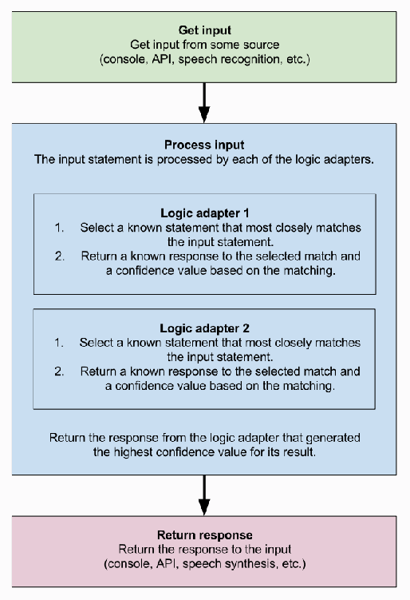

# 十五、情感分析和聊天机器人

到目前为止，我们已经具备了开始文本分析项目以及尝试更复杂、更具体的项目所需的技能。两个常见的文本分析项目是情感分析和聊天机器人，它们概括了我们在整本书中探讨的许多概念。事实上，我们已经触及了这些项目将使用的所有方法，这一章将作为一个指南，告诉你如何自己构建这样一个应用。

在这一章中，我们不会提供如何从第一步到最后一步构建聊天机器人或情感分析管道的代码，而是向读者介绍在建立这样一个项目时会有帮助的各种技术。以下是我们将在本章中涉及的主题:

*   情感分析
*   挖掘数据
*   聊天机器人


# 情感分析

情感分析仅仅是文本分类或文档分类的另一个术语——其中分类的*特征*恰好是文本的情感。我们可以把情绪理解为对某事的感觉或看法——如果我们说*这部电影棒极了！*，这意味着它表达了一种积极的情绪或感觉，如果我们说*这部电影很糟糕！*，表示消极的情绪或感觉。在这里，情绪通常指积极或消极的情绪，但这当然可以扩展到包括多种*情绪*，例如愤怒、悲伤、快乐，如果我们愿意，甚至可能是一种*深思熟虑的*情绪。换句话说，情感分析任务是简单的分类任务，其中每一类都是我们希望分析的一种情感。

事实上，我们在上一章已经看到了一个情感分析的例子，当时我们一起使用 Keras 和 spaCy 来构建深度学习管道。通过分配正面和负面情绪的概率分布来执行情绪分析。事实上，即使是只使用 Keras 的例子也是基于情感进行分类的，但是我们把这个问题当作一个简单的分类任务，而不是情感分析任务。spaCy 的例子更加明确，我们给每个文档分配了情感分数，然后进行分类。

基于我们打算对情感信息做什么，我们可以以不同的方式处理我们的问题——尽管我们只是使用文档属于哪个类别的概率的核心思想仍然是相同的。强烈建议任何情感分析任务最终根据其领域来训练你的数据——用根据电影评论训练的算法识别推文中的情感不会像根据自己的领域训练的算法那样有效。

有时候原型化你的文本分析管道或者快速演示你的想法是很有帮助的。在这种情况下，在与 Keras 或 spaCy 合作之前，在实际安装重型机器之前快速了解一下情绪可能是有用的。在这种情况下，设置一个快速朴素贝叶斯分类器会很方便。我们在对文本文档进行聚类和分类的章节中已经遇到过这个分类器([第 10 章](e803ff9f-004a-40ac-a6c7-0cb3dffd74fe.xhtml)，*对文本进行聚类和分类*)，所以我们知道如何设置我们的代码来做到这一点。请注意，下面的代码是一个模板——我们没有定义`X`或`labels`。

```py
from sklearn.naive_bayes import GaussianNB 
gnb = GaussianNB() 
gnb.fit(X, labels)
```

然后我们可以使用我们的朴素贝叶斯机器来预测一个类。在这里，类将是积极或消极的情绪。Python 包`TextBlob` [ [1](http://textblob.readthedocs.io/en/dev/) 在对情感进行分类或赋值时，工作原理是一样的。它还使用了朴素贝叶斯分类器。同样，在这里,`text`变量是一个占位符变量，如果您希望看到示例的结果，您需要自己定义文本。

```py
from textblob import TextBlob
analysis = TextBlob(text)
Pos_or_neg = analysis.sentiment.polarity
```

`Pos_or_neg`变量现在包含文本的正面或负面情绪，是一个浮点型变量。这种 API 允许我们非常容易地处理情感信息，不像 Keras 或 sci kit——了解我们必须预测文档的类别，然后将其分配给文档。我们可能也注意到了 spaCy 中相同的 API 思想——通过管道运行我们的文档后，它用不同的属性标记文档。在前一章([第 14 章](b0592d4e-1124-4bd1-a4a4-0be4f0a40cab.xhtml)、 *Keras 和 spaCy for Deep Learning* )中，我们看到了将该属性添加到管道中的特定示例。请注意，在这个示例中，`nlp`是我们在*深度学习和空间*部分看到的训练模型，我们必须运行完那个代码示例才能看到它工作。

```py
doc = nlp(text)
sentiment_value = doc.sentiment
```

我们可以看到，从 API 的角度来看，TextBlob 和 spaCy 处理情感分析的方式几乎相同。虽然我们可以使用 TextBlob 构建原型，但不建议在任何生产代码中使用它，甚至不建议在任何严肃的文本分析项目中使用它——朴素贝叶斯算法是在电影评论上训练的，并且这种上下文可能不总是产生最佳值。当我们使用 spaCy 来分配情感分数时，我们自己正在训练我们的模型，并且在数据上，我们想要训练。我们实际上可以自己建立神经网络，这给了我们机会以更好的方式为上下文微调我们的模型。

在谷歌上快速搜索`sentiment analysis python`会给我们带来大量的结果，其中大部分都涉及到对推文的情感分析，并且倾向于使用 NLTK 的内置情感分析器来进行分析。我们将避免使用 NLTK 的分类器，因为它也使用朴素贝叶斯分类器来执行分类，并且与 TextBlob 不同，它不提供给文档属性的 API 像 Keras 或 scikit-learn，它接受一个向量作为输入并基于此赋值。

话虽如此，熟悉 NLTK 提供的 **S** **事件分析** API [ [2](http://www.nltk.org/howto/sentiment.html) ]也无妨，即使只是为了更好地学习这方面的在线教程。如果有的话，他们的`SentimentAnalyzer` [ [3](http://www.nltk.org/_modules/nltk/sentiment/sentiment_analyzer.html) ]类提供了一些用途，即使只是作为我们在构建自己的情感分析器之后设计我们的分析的一种方式。

NLTK 提供的一个有用的方法是`show_most_informative_features()`方法，它向我们展示了哪些特性是有用的(在这种情况下，特性是单词)。例如，如果我们对垃圾邮件进行分类，像`winner`或`casino`这样的词将是非常有说服力的特征。我们在最右栏看到的比率是 it 的比率`ok : spam`。

```py
winner = None ok : spam = 4.5 : 1.0
hello = True ok : spam = 4.5 : 1.0 hello = None spam : ok = 3.3 : 1.0 winner = True spam : ok = 3.3 : 1.0 casino = True spam : ok = 2.0 : 1.0 casino = None ok : spam = 1.5 : 1.0
```

单词、`winner`和`casino`的出现增加了邮件被标记为垃圾邮件的几率。但是，例如，可以从 scikit-learn 模型中提取相同的信息。让我们编写一个小方法来做这件事并检查它:

```py
def print_top10(vectorizer, clf, class_labels): 
    """Prints features with the highest coefficient values, per class""" 
# get feature names returns the features used in the classifier, 
# and here the words in the vocabulary are the features 
    feature_names = vectorizer.get_feature_names() 
# We now loop over every class label 
    for i, class_label in enumerate(class_labels): 
# clf.coef_ contains the coefficients of each class; we extract the 
# 10 highest coefficient values, which are a way to measure which 
# features (words) are most influencing the probability of a document 
# belonging to that class 
        top10 = np.argsort(clf.coef_[i])[-10:] 
# we finally print the particular class and the top 10 features (words) 
# of that class 
        print("%s: %s" % (class_label, 
              " ".join(feature_names[j] for j in top10)))
```

在这里，只需提取每个特征的系数值，并在打印之前进行排序。这个特定的例子用于多类分类器；如果我们使用二进制分类器，那么`clf.coef_[0]`也可以做到。用 spaCy、scikit-learn 和 Gensim 复制所有的 NLTK 函数只需要一点点努力。至于哪种机器学习技术最适合情感分析，目前最先进的仍然是深度学习技术——特别是，双向 LSTM 特别擅长理解文本中的情感。在前面的章节中，我们已经看到了如何构建这种神经网络的例子。至于为什么这些效果最好，是因为这是一种循环神经网络的形式——这意味着上下文在网络的更深层次或节点中进行。LSTM 代表**长期短期记忆**——这正是被浓缩的思想，记忆在理解上下文中是必不可少的。双向意味着我们在任一方向上都有上下文。当然，随着深度学习这样一个领域的快速发展，一种新的架构可能很快就会超越 LSTMs。

向您的神经网络添加更多信息或深度(例如使用词嵌入或堆叠更多层)可能会进一步提高我们的性能，因此可以增加训练时期的数量。当然，就像我们打算使用深度学习解决的任何其他问题一样，为了实现高精度，需要进行大量的微调。关于为什么 LSTMs 对情感分析如此有效的更多信息，下面的帖子可能是有用的:

1.  用于情感分析的 lstm[[4](http://deeplearning.net/tutorial/lstm.html)
2.  了解 lstm[[5](http://colah.github.io/posts/2015-08-Understanding-LSTMs/)

有了更先进的工具，我们可以跳过使用 NLTK 来分析情感。能够从互联网中挖掘有用的文本数据来分析情绪仍然很重要——我们将讨论两个这样的来源，特别是 Reddit 和 Twitter。


# 挖掘数据的 Reddit

在第一章中，我们谈到了从互联网中挖掘数据源——现在，我们将实际探索如何做到这一点。我们之前提到过 Reddit [ [6](https://www.reddit.com/) ]是如何成为一个有趣的数据源，因为它包含了*真实的*对话，其中大部分是语法正确的句子——它还有子编辑区，我们可以在那里关注兴趣小组。Reddit 碰巧也有一个组织良好的 API，我们可以用它来挖掘数据，这意味着节省了大量的清理工作！

为了能够毫无问题地收集数据，你必须首先在 Reddit 上注册一个账户。这个链接，[https://www.reddit.com/](https://www.reddit.com/)将帮助你注册，你自己浏览一下网站将有助于为我们的实验建立背景。

在熟悉了网站的性质和我们将要收集的数据之后，我们应该看看 API 规则，这些规则可以在维基上找到——[https://github.com/reddit-archive/reddit/wiki/API](https://github.com/reddit-archive/reddit/wiki/API)。这里特别突出的两条规则是，我们每分钟只能发送 60 个请求，并且我们不能在用户代理上撒谎。用户代理是代表用户的软件，在访问互联网的情况下，它是关于哪个浏览器或应用正在访问互联网的信息。这些并不太难坚持，如果前面的链接都已经读完，我们可以开始看一些代码。

```py
import requests
import json 
```

```py
# Add your username below
hdr = {'User-Agent': ':r/news.single.result:v1.0' + 
       '(by /u/username)'} 
url = 'https://www.reddit.com/r/news/.json' 
req = requests.get(url, headers=hdr) 
data = json.loads(req.text)
```

在前面的代码行中，我们从 subreddit `r/news` [ [7](https://www.reddit.com/r/news/) ]中挖掘结果，subreddit 主要讨论美国和国际新闻和政治。我们可以从我们认为合适的任何子编辑中挖掘内容或材料。在代码中我们应该小心的一些事情是用户代理和我们用来创建帐户的 Reddit 用户名。

Reddit 数据最好的部分是我们接收数据的格式——JSON！在 Python 中加载 JSON 有很多标准的方法，JSON 编码器和解码器[ [8](https://docs.python.org/3.6/library/json.html) ]帮助我们很容易地做到这一点。

存储在 JSON 中的文本数据可以进行主题建模，用于为特定的上下文训练 Word2Vec，或者像我们已经讨论过的那样——为情感分类。`r/news`和`r/politics`子街道是尝试这一点的特别有趣的地方，因为它们往往会收到最两极分化的帖子。我个人建议你看看下面的子主题:

1.  `r/news`
2.  `r/politics`
3.  `r/The_Donald`
4.  `r/AskReddit`
5.  `r/todayilearned`
6.  `r/worldnews`
7.  `r/explainlikeimfive`
8.  `r/StarWars`
9.  `r/books`

如果你对更折中的材料或者网络迷因感兴趣，你可以看看这些:

1.  `r/prequelmemes`
2.  `r/dankmemes`
3.  `r/memeeconomy`

需要注意的几件事是确保每分钟发出超过 60 个请求不会激怒 API 这意味着使用`time` [ [9](https://docs.python.org/3.6/library/time.html) 库来组织我们的请求。事实上，Reddit 已经根据兴趣小组、爱好或主题组织成许多子编辑，这意味着它是一个丰富的文本信息来源*，有*适当的上下文，我们可以调整，这是我们无法用其他在线数据源轻松做到的。

有了所有这些限制，我们可能会试图下载历史数据——在这种情况下，这个 Reddit [线程](https://www.reddit.com/r/datasets/comments/3bxlg7/i_have_every_publicly_available_reddit_comment/?st=j9udbxta&sh=69e4fee7) (meta！)在压缩后，以大约 250 GB 的容量链接到大约 17 亿条评论。

一个用 Python 编写的使用 Reddit 获得一些有趣结果的相关项目是 sense2vec [ [10](https://explosion.ai/demos/sense2vec?word=natural%2520language%2520processing&sense=auto) ]，其中 spaCy 的创建者使用 Reddit 数据尝试对 Reddit 进行语义分析。最棒的是，我们可以在 Reddit 上找到该项目的完整代码库:【https://github.com/explosion/sense2vec[，这意味着我们可以随意摆弄它。这意味着我们可以在其他数据源上使用 sense2vec，甚至修改被认为是*的语义*。因为它是一个 web 应用，所以这是一个在线展示结果的好方法。](https://github.com/explosion/sense2vec)


# 挖掘数据的 Twitter

虽然 Reddit 是分析更结构化形式的数据的好方法，但我们经常转向社交媒体来分析文本——似乎有更多的*现实世界*含义，对于社会科学家来说，它可以作为文本数据的宝库。事实上，对推文的情感分析是一个非常受初露头角的数据科学家欢迎的项目，因为它允许人们尝试数据收集和数据分析。

在整本书的所有示例中，我们处理了通常从我们使用的包中加载的数据集，例如 20 新闻组数据集(来自 scikit-learn)、Lee news 语料库(来自 Gensim)或 IMDB 数据集(Keras)。虽然知道如何使用记录良好的数据集很重要，但在现实世界中工作时，这些数据集也用作研究中的基准，事情就不那么容易了，必须收集数据。我们已经讨论了彻底清理文本数据的重要性，对于 Twitter，我们需要加倍小心。我们现在突然看到了表情符号、表情符号、标签、缩写、俚语等等。处理这种情况意味着我们必须确定我们希望执行哪种分析——在某些情况下，我们可能希望使用 hashtags 中的信息，而在某些情况下，我们可能不希望这样。笑脸也是如此，例如，将它们作为一个单词可能会严重影响我们的情绪分析分类器的结果——一个“:-)”可能与积极情绪高度相关，一个“:-(”可能与消极情绪高度相关。

如果我们只想对推文进行分类，带表情符号的模型会更有效——但如果我们还想了解推文中可能存在什么样的语义信息，删除任何不是单词的内容可能会更谨慎。最后，我们希望如何清理和处理我们的推文取决于我们的用例。

也就是说，已经有数据集允许我们利用 Twitter 数据进行情感分析。这个[链接](http://thinknook.com/twitter-sentiment-analysis-training-corpus-dataset-2012-09-22/) [11]让我们可以访问一个数据集，这个数据集已经标记了用于情感分析的数据，正如我们所猜测的，这在我们训练数据时非常重要。这些数据的大部分来自密执安大学卡格尔挑战赛，我们可以在这里读到-【https://www.kaggle.com/c/si650winter11。而另一个受欢迎的 Twitter 数据集是 Sentiment140 数据集，可以在这里找到——http://help.sentiment140.com/for-students/。

我们可以使用这些数据集来训练我们的分类器，因为它们已经被标记。至于使用这个分类器来主动标记新的推文，我们需要使用 Twitter API 来获取数据。Python 的官方 twitter API 是 **tweepy** [ [12](http://www.tweepy.org/) ]，运行良好。就像 Reddit 一样，我们需要先创建一个帐户，然后才能使用它。可以在这里做一个交代:【https://apps.twitter.com/】T4。

一旦我们创建了此帐户，我们就会收到有关消费令牌和访问令牌的信息。tweepy 文档网站上的认证教程[ [13](http://tweepy.readthedocs.io/en/v3.5.0/auth_tutorial.html#auth-tutorial) ]提供了关于如何处理这个问题的更多信息。

我们设置 API 的前几行代码如下:

```py
import tweepy 

# Authentication and access using keys: 
auth = tweepy.OAuthHandler(CONSUMER_KEY, CONSUMER_SECRET) 
auth.set_access_token(ACCESS_TOKEN, ACCESS_SECRET) 

# Return API with authentication: 
api = tweepy.API(auth) 
```

然后，我们使用 API 对象来完成所有的提取。考虑到当前的政治气候，一个合适的 twitter 查询是唐纳德·特朗普，一个受欢迎的用户是`@realDonaldTrump`。

```py
tweets = api.user_timeline(screen_name="realDonaldTrump", count=20) 
For tweet in tweets: 
   print(tweet.text) 
```

只需 7 行代码，我们就可以访问唐纳德·特朗普最近的 200 条推文。当然，这只是原始文本，所以我们仍然需要清理文本，更重要的是，将它存储在更适合文本分析的备用数据结构中。

例如，如果我们希望在 Twitter 上搜索唐纳德·特朗普，而不是查看他的个人账号，我们需要运行以下代码:

```py
tweets = api.get_tweets(query = 'Donald Trump', count = 200) 
```

值得看一看 tweepy 的文档[[14](http://tweepy.readthedocs.io/en/v3.6.0/getting_started.html)，看看它还能做些什么，尤其是如果我们打算广泛使用它的话。

我们已经看到了已经清理和/或标记的 Twitter 数据集的可用性，以及如何从互联网上挖掘实时 Twitter 数据。Reddit 也是挖掘数据的另一个重要来源，随着社会科学家越来越多地关注互联网以更好地理解社会行为，他们也必须知道如何互动和挖掘这些数据。我们刚刚看到了做到这一点是多么容易！


# 聊天机器人

让机器学会像人一样说话一直是计算机科学家和语言学家的圣杯——在机器可以模仿人类行为的所有事情中，进行对话是一项具有挑战性的考验。制造这样一台可以和我们人类聊天的机器(或者聊天机器人，如果你愿意的话)的探索已经有了许多不同的方法，虽然没有一种方法是完美的，但是了解它们是很重要的——并且挑选哪一种最适合我们的目的！

至于为什么*我们*想要建立聊天机器人——聊天机器人越来越多地被企业使用；既可以帮助客户回答基本问题，也可以构建更复杂的个人助理。构建这样的聊天机器人和使用开源工具也变得越来越容易。

从研究角度和更实用的方法来看，研究机器对话艺术有很多动机。一个理想的人工智能机器人应该能够记住对话早期的上下文，在做出回应时基于这些信息，并可能拥有自己的个性。当然，很难恰当地衡量对话进行得有多好，或者机器人有多少个性。我们可以衡量的是一个人对一个问题或查询的回答有多好，这提供了一种判断机器人表现如何的方法。

著名的**图灵测试** [ [15](https://en.wikipedia.org/wiki/Turing_test) ]认为，如果我们不能区分聊天机器人和人类，它就是一个真正智能的机器人。然而，我们的目的是不要愚弄人类(或者争论这是否真的是一种智力的衡量标准！)，而是建造一个能够以某种程度的*智能*回答人类问题的机器人。

我们将讨论实现这一点的可能方法，并提供文档、阅读材料和代码片段。没有一个完美的聊天机器人，因为这是一个仍在缓慢发展的领域，其技术水平需要相当长的时间才能实现。我们自己很有可能与这种聊天机器人进行过互动——Siri[[16](https://en.wikipedia.org/wiki/Siri)可以说是最受欢迎的例子，亚马逊的 Alexa [ [17](https://en.wikipedia.org/wiki/Amazon_Alexa) 也是一个众所周知的个人数字助理。尽管在这些应用上投入了大量资金，但它们仍然有许多缺陷，客户抱怨 Siri 对一些英语口音的理解能力很差，以及在做出回应方面缺乏灵活性。

这篇文章比较了主要的私人助理，并根据各种标准对他们进行了排名——从最聪明到最有趣。现在也可以使用 Facebook Messenger，通过他们的聊天机器人 API [ [19](https://messenger.fb.com/) ]来发展业务。正如我们之前提到的，构建聊天机器人变得越来越容易。

传统的聊天机器人主要使用逻辑结构来帮助创建响应，其中程序会尝试将用户输入分成不同的部分，并在选择适当的输出时将其与可能的输入进行匹配。第一个这样的构造是 **AIML** ( **人工智能标记语言** ) [ [20](https://en.wikipedia.org/wiki/AIML) 。它充当了创建自然语言代理的 XML 方言。基于某些*模板*，它将有助于选择对查询的适当响应。有人可能会说，这不是真正的智慧，因为我们直接受到我们所拥有的例子数量的限制，我们不会自然地产生语言，而只是选择最接近问题的答案。然而，在很长一段时间里，这是构造聊天机器人的唯一方法——虽然它得到了自然语言处理领域的进步的帮助，例如在词性识别或 NER 标记方面的更高精度，但它在很大程度上仍然只是选择最佳选项。

事实上，在 2010 年，如果有人要使用 Python 来构建聊天机器人，我们不会使用机器学习技术，而是仅仅使用一个基于规则的系统，并进行一点点微调。第一个聊天机器人，伊莱扎，建于 1966 年。虽然对于一个*可信的*系统，我们可能仍然会使用它，但深度学习的最新进展已经让我们更加接近复制对话。

我们已经讨论了实现这一点的确切技术——使用深度学习的文本生成。事实上，这是我们第一次接触文本深度学习！序列对序列建模让我们的聊天机器人变得更聪明，它们不能更好地理解上下文，也不能简单地选择最合适的反应。

谷歌的 Oriol Vinyals 和 Quoc V. Lee 的里程碑式论文首次真正体验到了这一点，这是一个神经对话模型。在论文中，他们描述了一个序列对序列模型，其中它将预测下一句话，给定前一句话。在 IT 服务台数据集上训练过，这个机器人提供了非常非常*人类*的反应；可以说，它们并不总是有意义的，但肯定仍然令人印象深刻。以下是研究论文的摘录，其中机器和人类讨论 VPN 连接问题。

对话 1: VPN 问题:

**描述您的问题** : *我* *在访问 VPN*
时遇到问题

**机器** : *嗨*

**人类** : *你好*

**机器** : *请问你用的是什么操作系统* *？*

**人类** : *I* *am 使用* *L* *inux*

**机器** : *好的是在* *SSL* *VPN 上你说它坏了*

**机器** : *请检查您是否登录到公司网络*

**机器** : *你运行* *，* *有什么错误请*

**人类** : *我* *看到一个与 VPN* 相关的错误

**机器:** *你* *使用网络连接* *连接 VPN 时得到的错误信息是什么？*

**人类** : *连接被拒绝之类的*

**机** : *梅* *我* *知道网络连接你连接的版本* *？*

**人类** : *我* *不确定* *我* *知道*

**机器** : *网络连接是否提示任何用户证书*

**机器**:T2？

**人类** : *是的*

**机器** : *此刻你在家还是在工作* *？*

**机** : *府* *？*

**人类** **:** *我* *上午在家*

**机** : *试试这个*

**机器** : *转到<网址>页面，输入你的名字和密码*

**人间** : *搞定*

**机器** : *尝试用<名称>登录，检查现在是否正常*

**人类** : *是的* *，现在起作用了* *！*

**机器** : *伟大*

**机** : *还有什么需要我***帮忙的** 

 ***人类** : *没有* *，那是非常有用的*

**机器** : *你是除<之外的名字> : )*

**机器** : *晚安*

看到两个人之间看起来似乎很有道理的对话，这确实是非常了不起的！这里特别令人印象深刻的是，所问的问题不必在训练数据集中出现过，这里的上下文是在训练过程中学习到的。前面的例子中没有提供任何规则，所有的响应都是通过数据学习的。探索论文中列出的所有对话确实值得一试。我们将再次从研究论文中提供一个例子来说明生成模型的威力:

对话 4:哲学问答:

**人类:** *生命的目的是什么？*

**机器:** *为更大的利益服务。*

**人类:** *活着的目的是什么？*

**机器:** *万岁。*

**人类:** *存在的目的是什么？*

**机器:** *为了弄清楚当我们到达地球时会发生什么。*

**人类:** *你现在在哪里？*

**机器:** *我在一个不知名的地方。*

**人类:** *死亡的目的是什么？*

**机器:** *拥有生命。*

**人类:** *有智慧的目的是什么？*

**机器:** *找出它是什么。*

**人类:** *情感的目的是什么？*

**机器:** *不知道。*

在这里，我们可以真正看到我们的生成模型的力量，在这里，它讨论了生命的意义，以及其他事情。然而，这也有一些缺点——很难训练这样的神经网络既有个性又有帮助，例如，这意味着很难通过图灵测试。由于它是一个生成模型，这也意味着它可能不会每次都给出一个连贯或相关的解决方案，而只是给出可能是最佳的响应。这些神经网络通过问答对进行训练，以理解*响应*应该是什么样子。

我们想再次指出，当我们训练一个文本生成神经网络时，我们已经看到了这一点——唯一的区别是我们生成的文本类型。如果我们在 J.K .罗琳的所有作品上训练我们的神经网络，我们可能会有一个文本生成器，它会用魔法故事来取悦我们，或者至少尝试这样做。也有试图编写代码的神经网络，所以想象一个经过对话训练的神经网络会像聊天机器人一样表现良好也就不足为奇了。

当然，尽管这看起来很有希望，但它也不是没有缺点——这样的一代模型本身可能不会成为一个工作的聊天机器人，仍然需要大量的监督。我们也受限于我们的数据；如果我们建造这个聊天机器人的目的是为了精确地执行任务，这可能不是最好的主意。在这种情况下，选择模板可能是我们最好的选择！

也可以将这些生成模型与基于逻辑的系统结合使用。如果我们想漫无目的地与机器人聊天，而没有特定的任务要执行，或者在机器人中塑造朋友的个性，会怎么样？在这种情况下，几乎没有比训练有素的 RNN 更好的选择了。一个供用户试用的项目示例:可以将 WhatsApp 的对话日志发送给自己。我们可以很容易地提取自己的文本或朋友的文本，并根据这些数据训练 RNN。想象一下，构建一个基于规则的机器人来模仿一个人的打字风格——这并不是一件容易的事情！

我们已经看到，创建聊天机器人有两种可能的方法——要么有一个信息检索系统，我们根据一组规则选择最合适的响应，要么创建一个模型，根据响应生成文本。这两种模式各有利弊，我们之前已经讨论过了。

如果我们打算在生产中使用我们的聊天机器人，使用基于信息检索的系统或者使用标准的聊天机器人 API 可能更实际。这种框架的两个例子是**拉莎-NLU** [ [23](https://nlu.rasa.com/) 和**聊天机器人** [ [24](https://chatterbot.readthedocs.io/en/stable/) 。

当使用这样的框架时，我们并没有真正自己构建一个智能系统，而是使用一个由我们选择的 API 构建的系统。这不一定是件坏事，尤其是如果它能完成任务的话。例如，RASA-NLU 公司使用 JSON 文件来训练其模型。你可以在这里【25】看一下样本数据[。](https://github.com/RASAHQ/rasa_nlu/blob/master/data/examples/rasa/demo-rasa.json)

通过添加更多的实体和意图，模型学习更多的上下文，并可以更好地理解我们向机器人提出的问题。有趣的是，为机器人提供动力的后端选项之一是 spaCy 和 scikit-learn，这两个库我们现在应该可以轻松地用于文本了！

在幕后，他们使用 Word2Vec 来更好地理解意图，使用 spaCy 来清理文本，使用 scikit-learn 来构建模型。关于 RASA 如何运作的内部工作的更多细节，他们在 Medium 上的博客文章[ [26](https://medium.com/rasa-blog/do-it-yourself-nlp-for-bot-developers-2e2da2817f3d) ]向我们介绍了一些使用的概念，其中大部分我们在这一点上看起来会很舒服。RASA 的想法之一是能够编写自己的机器人部分，而不是像传统的第三方机器人 API 那样。代码都是用 Python 写的，所以我们真的可以用它来玩一玩。如果我们想更有野心一点的话，它也给了我们关于如何建造我们自己的智能机器人的想法！

```py
{
    "text": "show me a mexican place in the centre",
    "intent": "restaurant_search",
    "entities": [
       {
          "start": 31,
          "end": 37,
          "value": "centre",
          "entity": "location"
       },
       {
          "start": 10,
          "end": 17,
          "value": "mexican",
          "entity": "cuisine"
       }
    ]
}

```

这是一个 JSON 条目训练 RASA 模型的例子。这里，我们给出了示例文本，即我们试图了解的意图，实体字段描述了实体的确切性质。

当然，构建聊天机器人不仅仅需要我们理解自然语言是如何工作的——我们还应该能够构建一个可以与用户对话的功能前端。这意味着了解我们如何将信息传递给在线应用，以及如何建立管道。这超出了本书的范围，但幸运的是，使用 RASA Core 来做这件事非常简单，他们的文档[ [27](https://core.rasa.com/) ]在如何建立对话模型方面做得很好。我们必须同时了解拉沙 NLU 和拉沙核心，才能最大限度地利用资源。有了 RASA Core，我们能够建立我们的领域和故事，我们使用 RASA NLU 作为我们的*头脑*，这是提取实体。故事是我们期望我们的机器人与用户交流的方式，我们必须像在我们的领域中训练机器人一样训练我们的机器人。教程[ [28](https://core.rasa.com/tutorial_basics.html) ]向我们展示了如何使用 RASA 核心构建一个基本的机器人。

另一个有助于构建我们的机器人的可能的基于 Python 的选项是 ChatterBot [ [29](https://chatterbot.readthedocs.io/en/stable/) 。ChatterBot 背后的逻辑与大多数基于信息检索的聊天机器人的工作方式非常相似——基于用户输入的句子；它选择一个与输入语句相似的已知语句。有多种可能的响应可供选择，我们称每一种产生响应的机器为**逻辑适配器**。一旦我们有了逻辑适配器的集合，我们就可以返回这个问题最可能的答案。我们可以创建和训练我们自己的适配器，既考虑到期望什么样的信息(输入)，也考虑到应该创建什么样的响应。

对于快速测试来说，训练这样的机器人也非常简单:

```py
from chatterbot import ChatBot 
bot = ChatBot('Stephen') 
bot.train([ 
    'How are you?', 
    'I am good.', 
    'That is good to hear.', 
    'Thank you', 
    'You are welcome.', 
]) 
```

现在，这显然不会成为一个非常成熟或强大的机器人，而是一个用这样的 API 训练聊天机器人有多容易的例子。

我们已经看到了如何使用特定的库来构建聊天机器人的例子——但是我们如何开始构建我们自己的，至少是功能很少的聊天机器人呢？

我们已经讨论了这样做的两种不同的哲学，一种是简单地生成文本，另一种是更加流水线化的方法。

流水线方法将从解析和清理用户输入开始，首先识别用户输入的句子的*种类*。它是一个问题，还是一个陈述？它与机器人*域*有关吗，如果有关，又是怎样的呢？尝试找到这一点的一种方法是构建一个分类器。我们非常清楚如何构建分类器，以及神经网络在不同类别的文档之间进行选择的能力。



图 15.1 chatter bot 文档网站上描述的工艺流程图

现在我们有了用户输入的*类型*，让我们进一步分析句子；把它分成不同的词类，识别命名的实体，并适当地构建一个句子作为回应。在 RASA 的例子中，我们看到了如何添加关于墨西哥菜的信息。使用 Word2Vec，我们可以汇集一系列不同的烹饪选择，如果附近没有墨西哥食物，我们还可以向用户推荐其他选择。

现在，我们如何在给用户的最佳回答中进行选择呢？同样，神经网络在这里可以派上用场，我们可以尝试根据输入预测特定反应的可能性，并选择最合适的反应。当然，这意味着我们仍然必须构建适当的**问题-响应**对。一旦我们选择了一个相似的问题(例如，*找一个地方吃午饭*，和*找一个地方吃晚饭*将是相似的问题)，我们可以用问题中的实体改变响应中适当的专有名词，并建议它作为一个可能的输出。

如果这种聊天机器人不是为了在某个领域执行目标任务而构建的，而只是为了尝试对话，我们可以*生成*响应。这意味着我们不再对分析用户输入句子的词性或实体感兴趣，并且我们没有必要在样本响应之间进行选择——我们希望有机地生成对问题的唯一(或大部分唯一)响应。在这种情况下，我们将只插入一个 RNN，让它发挥它的魔力。然后，我们简单地把这个反馈给用户，继续对话，希望它是有趣的。在讨论谷歌的**神经对话模型**时，我们已经看到了多个这样的例子。

这个 GitHub 知识库[ [30](https://github.com/lizadaly/brobot/) ]和博客文章[ [31](https://apps.worldwritable.com/tutorials/chatbot/) ]讨论了一种不使用任何机器学习的方法，而只是对句子进行基本分析，并用只能访问一组基本响应的机器人进行回复。这种构建聊天机器人的方式可能不那么强大，但习惯于响应背后的思想是重要的，如果我们希望在没有外部框架或 API 的帮助下构建一个聊天机器人，这可以帮助我们设计自己的构建聊天机器人的管道。

当然，这不是一个零和游戏，我们必须在选择适当的响应或生成文本之间做出选择。考虑以下管道:

1.  接受用户输入
2.  将输入分类为陈述、问题或问候——基本上，识别意图
3.  如果是问候，以同样的方式回应——你好！
4.  如果它是一个问题，在我们的数据集中查找类似的问题，进行基本的句子分析，并选择一个适当的回答，替换名词或形容词

5.  如果这是一个陈述或对话的尝试，让我们的生成模型与用户对话——至少直到用户有一个问题
6.  如果用户说再见，礼貌地向他们道别

这是一个粗略的方法——我们还没有提到我们将如何准确地找到一个相似的文档(尽管通过[第 11 章](662c9eee-0fac-47b4-a912-782a0e8b3b23.xhtml)、*相似性查询和总结*是一个好的开始！)，或者我们要怎么做我们的多类分类。基于上下文，我们会想插入并相应地播放。在这一点上，我们已经有了所有需要的工具来为我们的聊天机器人跟踪这条管道！

这采用了生成文本和信息检索的思想。在这种模型中可以采用多种机器学习模型——决定输入类型的分类器，用于查找相似文档的主题模型，用于识别意图或某些实体的 Word2Vec，以及用于生成文本的神经网络。所有这些模型都需要针对它们预期执行的任务类型进行适当的训练，训练数据可能非常不同。例如，如果我们正在创建一个聊天机器人，目的是帮助用户找到理想的餐馆，我们将训练最终输出为餐馆建议，并用来自`Reddit/r/food` [ [32](https://www.reddit.com/r/food/) 的数据训练对话机器人！我们还可以为机器人添加一些推文，试图以最好的方式复制正常的与食物相关的对话。

当然，构建一个完整的聊天机器人，既能提供有趣的对话，又能帮助找到最近的墨西哥餐馆，这不是一项简单的任务——这就是为什么我们在谷歌或苹果有整个团队在从事这项工作。但是在试图建造这样一台机器的过程中，我们可以学到很多关于我们可以用文本做的事情。没有一个最好的方法来建造这样一个机器人，它高度依赖于我们试图解决的环境和问题。

聊天机器人在决定我们的管道时采用了一些最先进的文本分析技术——机器学习、计算语言学，以及基本的软件工程意识，并作为一种锻炼本书所学技能的极好方式。因为没有最好的聊天机器人创建方法，所以我们在本章中讨论了 Python 自然语言处理世界中目前可用的流行方法，并将它们展示在读者面前——现在就看你如何拿起工具开始构建了！* *

# 摘要

在本章中，我们讨论了两个重要的文本分析问题——情感分析和构建聊天机器人。情感分析是指理解文本中情感的任务，我们已经看到了各种库、算法和方法来执行这项任务。执行此类任务的一个关键部分是收集数据——然后我们看到了如何从 Twitter 或 Reddit 等互联网资源下载数据。本章的最后一节集中在如何构建聊天机器人。我们从历史和理论的角度探索了它，并探索了帮助我们轻松构建聊天机器人的 Python 库。这就把我们带到了本书的结尾——你现在可以自信地用你认为合适的方式，用各种技术、方法和设置来分析文本。我们关注于使用最有效的 Python 开源库，整本书都关注 Gensim、spaCy、Keras 和 scikit-learn，同时还讨论了其他可用的 Python 文本分析库。重要的是要知道哪种工具在哪种环境下工作得最好，以及我们应该探索哪种管道和架构来解决问题。如果你已经仔细阅读了这本书，包括代码示例、Jupyter 笔记本和外部链接，你现在应该能够自信地分析你的文本了。


# 参考

[1]text blob:
[http://textblob.readthedocs.io/en/dev/](http://textblob.readthedocs.io/en/dev/)

[2] NLTK 情感分析:
[http://www.nltk.org/howto/sentiment.html](http://www.nltk.org/howto/sentiment.html)

[3] NLTK 情绪分析器类:
[http://www . NLTK . org/_ modules/NLTK/perspective/perspective _ analyzer . html](http://www.nltk.org/_modules/nltk/sentiment/sentiment_analyzer.html)

[4]用于情感分析的 lstm:
[http://deeplearning.net/tutorial/lstm.html](http://deeplearning.net/tutorial/lstm.html)

[5]认识 http://colah.github.io/posts/2015-08-Understanding-LSTMs/

[6]Reddit:
[https://www.reddit.com/](https://www.reddit.com/)

[7]新闻子编辑:
[https://www.reddit.com/r/news/](https://www.reddit.com/r/news/)

[8]JSON:
[https://docs.python.org/3.6/library/json.html](https://docs.python.org/3.6/library/json.html)

[9]时间库:
[https://docs.python.org/3.6/library/time.html](https://docs.python.org/3.6/library/time.html)

[10]sense 2 vec:
[https://explosion.ai/demos/sense2vec](https://explosion.ai/demos/sense2vec)

[11]推特数据集:
[http://thinknook . com/Twitter-情操-分析-训练-语料库-数据集-2012-09-22/](http://thinknook.com/twitter-sentiment-analysis-training-corpus-dataset-2012-09-22/)

[12]Tweepy:
[http://www.tweepy.org/](http://www.tweepy.org/)

[13] Tweepy 认证教程:
[http://Tweepy . readthedocs . io/en/v 3 . 5 . 0/auth _ tutorial . html # auth-tutorial](http://tweepy.readthedocs.io/en/v3.5.0/auth_tutorial.html#auth-tutorial)

[14]十二页文献:
[http://tweepy.readthedocs.io/en/v3.6.0/getting_started.html](http://tweepy.readthedocs.io/en/v3.6.0/getting_started.html)

[15]图灵测试:
[https://en.wikipedia.org/wiki/Turing_test](https://en.wikipedia.org/wiki/Turing_test)

[16]Siri:
[https://en.wikipedia.org/wiki/Siri](https://en.wikipedia.org/wiki/Siri)

[17]亚历山大:
[https://en.wikipedia.org/wiki/Amazon_Alexa](https://en.wikipedia.org/wiki/Amazon_Alexa)

[18]数字助理排名:
[https://www . stone temple . com/rating-the-smarts-of-the-Digital-personal-Assistants/](https://www.stonetemple.com/rating-the-smarts-of-the-digital-personal-assistants/)

[19] FB 信使机器人:
[https://messenger.fb.com/](https://messenger.fb.com/)

[20]艾米尔:
[https://en.wikipedia.org/wiki/AIML](https://en.wikipedia.org/wiki/AIML)

[21]伊莱扎:
[https://en.wikipedia.org/wiki/ELIZA](https://en.wikipedia.org/wiki/ELIZA)

[22]一个神经对话模型:
[https://arxiv.org/pdf/1506.05869v1.pdf](https://arxiv.org/pdf/1506.05869v1.pdf)

[23]拉莎-NLU:
[https://nlu.rasa.com/](https://nlu.rasa.com/)

[24]聊天机器人:
[https://chatterbot.readthedocs.io/en/stable/](https://chatterbot.readthedocs.io/en/stable/)

[25] RASA 样本数据:
[https://github . com/RASAHQ/RASA _ nlu/blob/master/data/examples/RASA/demo-RASA . JSON](https://github.com/RASAHQ/rasa_nlu/blob/master/data/examples/rasa/demo-rasa.json)

[26]自己动手 NLP:
[https://medium . com/rasa-blog/Do-it-yourself-NLP-for-bot-developers-2e2da 2817 f3d](https://medium.com/rasa-blog/do-it-yourself-nlp-for-bot-developers-2e2da2817f3d)

[27]拉撒芯:
[https://core.rasa.com/](https://core.rasa.com/)

[28]基础 bot 建筑:
[https://core.rasa.com/tutorial_basics.html](https://core.rasa.com/tutorial_basics.html)

[29]聊天机器人:
[https://chatterbot.readthedocs.io/en/stable/](https://chatterbot.readthedocs.io/en/stable/)

[30]布罗博特:
[https://github.com/lizadaly/brobot/](https://github.com/lizadaly/brobot/)

[31]聊天机器人基础:
[https://apps.worldwritable.com/tutorials/chatbot/](https://apps.worldwritable.com/tutorials/chatbot/)

[32] reddit 美食:
[https://www.reddit.com/r/food/](https://www.reddit.com/r/food/)*