        

# 一、构建前馈神经网络

在本章中，我们将介绍以下配方:

*   Python 中从头开始的前馈传播
*   用 Python 从头开始构建反向传播
*   在 Keras 中构建神经网络

        

# 介绍

神经网络是一种受监督的学习算法，它大致受大脑功能的启发。类似于神经元在大脑中相互连接的方式，神经网络接受输入，通过一个函数传递它，某些后续神经元兴奋，从而产生输出。

在本章中，您将学习以下内容:

*   神经网络的体系结构
*   神经网络的应用
*   建立前馈神经网络
*   向前传播的工作原理
*   计算损失值
*   梯度下降在反向传播中的工作原理
*   时代和批量的概念
*   各种损失函数
*   各种激活功能
*   从头开始构建神经网络
*   在 Keras 中构建神经网络

        

# 一个简单神经网络的结构

人工神经网络大致上是受人类大脑运作方式的启发。从技术上讲，这是对线性和逻辑回归的改进，因为神经网络在估计输出时引入了多个非线性度量。此外，神经网络在修改网络架构以利用结构化和非结构化数据解决跨多个领域的问题方面提供了很大的灵活性。

函数越复杂，网络调整到输入数据的机会就越大，因此预测的准确性就越高。

前馈神经网络的典型结构如下:

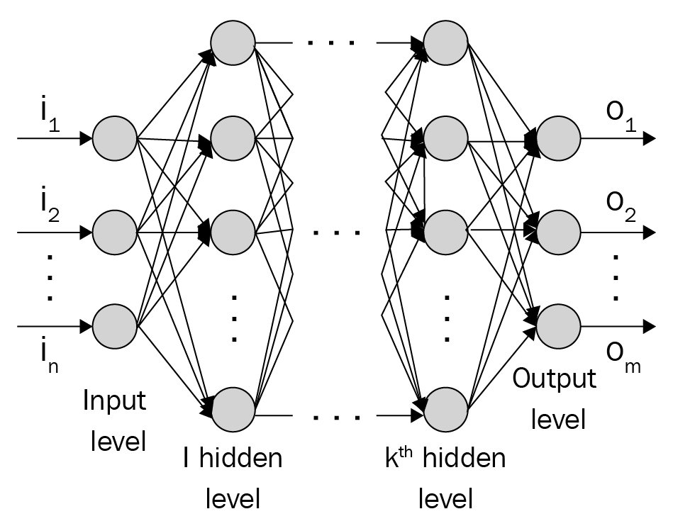

层是一个或多个节点(计算单元)的集合，其中层中的每个节点都连接到下一个直接层中的所有其他节点。输入级别/层由预测输出值所需的输入变量组成。

输出层中的节点数量取决于我们试图预测的是连续变量还是分类变量。如果输出是连续变量，则输出有一个单位。

如果输出是具有 *n* 个可能类别的分类，则输出层中将有 *n* 个节点。隐藏级别/层用于将输入层值转换为更高维空间中的值，以便我们可以从输入中了解更多特征。隐藏层将输出转换如下:

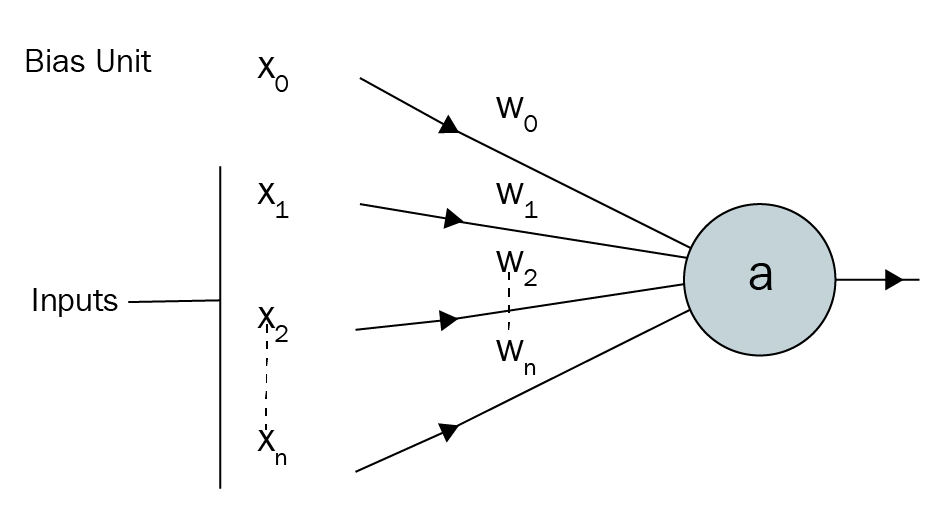

在上图中， *x [1]* ， *x* [*2* ，]...、 *x [n]* 为自变量， *x [0]* 为偏差项(类似于线性/逻辑回归中我们有偏差的方式)。

注意*w[1]T3、*w[2]T7、...， *w [n]* 是赋予每个输入变量的权重。如果 *a* 是隐藏层中的一个单元，则等于:**


*f* 函数是激活函数，用于在输入及其相应权重值的和积之上应用非线性。此外，通过具有一个以上的隐藏层，可以实现更高的非线性。

总之，神经网络是分配给节点的权重的集合，节点之间有层连接。该集合分为三个主要部分:输入层、隐藏层和输出层。请注意，您可以有 *n* 个隐藏层，术语深度学习意味着多个隐藏层。当神经网络必须理解非常复杂、有上下文关系或不明显的事情(如图像识别)时，隐藏层是必要的。中间层(不是输入或输出的层)被称为隐藏层，因为它们实际上是不可见的(在[第 4 章](750fdf81-d758-47c9-a3b3-7cae6aae1576.xhtml)、*构建深度卷积神经网络*中有更多关于如何可视化中间层的内容)。

        

# 训练神经网络

训练神经网络基本上意味着通过重复两个关键步骤来校准神经网络中的所有权重:前向传播和反向传播。

在前向传播中，我们将一组权重应用于输入数据，使其通过隐藏层，对隐藏层输出执行非线性激活，然后通过将隐藏层节点值乘以另一组权重将隐藏层连接到输出层。对于第一次前向传播，权重值被随机初始化。

在反向传播中，我们试图通过测量输出的误差幅度来减少误差，然后相应地调整权重。神经网络重复前向和反向传播来预测输出，直到权重被校准。

        

# 神经网络的应用

最近，我们看到了神经网络在各种应用中的大量采用。在这一部分，让我们试着去理解为什么采用率会大幅上升。神经网络可以以多种方式构建。以下是一些可能的方法:

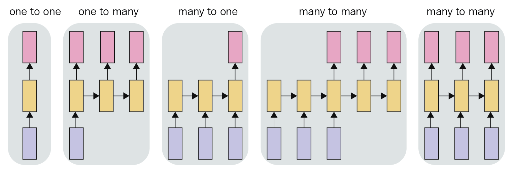

底部的方框是输入层，后面是隐藏层(中间的方框)，顶部的方框是输出层。一对一架构是典型的神经网络，在输入和输出层之间有一个隐藏层。不同架构的示例如下:

| **架构** | **例子** |
| 一对多 | 输入是图像，输出是图像的标题 |
| 多对一 | 输入是电影评论(多个单词),输出是与该评论相关联的情感 |
| 多对多 | 把一种语言的句子翻译成另一种语言的句子 |

除了上述几点之外，神经网络还能够理解图像中的内容，并使用名为**卷积神经网络** ( **CNN** )的架构来检测内容所在的位置，该架构如下所示:

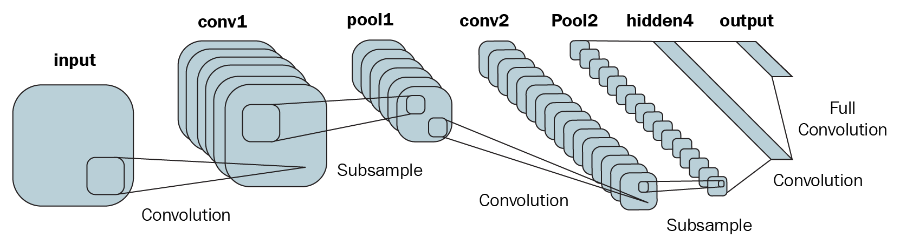

在这里，我们看到了推荐系统、图像分析、文本分析和音频分析的示例，我们可以看到，神经网络为我们提供了使用多种架构解决问题的灵活性，从而随着应用数量的增加而提高了采用率。

        

# Python 中从头开始的前馈传播

为了建立前馈传播如何工作的坚实基础，我们将通过一个训练神经网络的玩具示例，其中神经网络的输入为(1，1)，对应的输出为 0。

        

# 做好准备

我们将采用的策略如下:我们的神经网络将有一个隐藏层(带有神经元)连接输入层和输出层。请注意，隐藏层中的神经元比输入层中的多，因为我们希望输入层能够以更多的维度来表示:

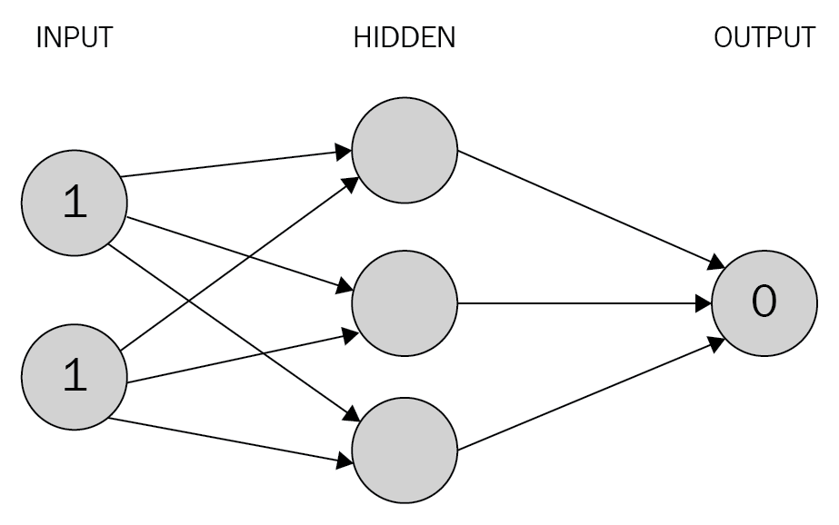

**计算隐藏层单元值**

我们现在给所有的连接分配权重。请注意，这些权重是随机选择的(基于高斯分布)，因为这是我们第一次正向传播。在这种特定情况下，让我们从 0 到 1 之间的初始权重开始，但请注意，神经网络训练过程之后的最终权重不需要在一组特定值之间:


在下一步中，我们将输入与权重相乘，以计算隐藏层中隐藏单元的值。

隐藏层的单位值如下获得:

**


隐藏层的单位值也显示在下图中:

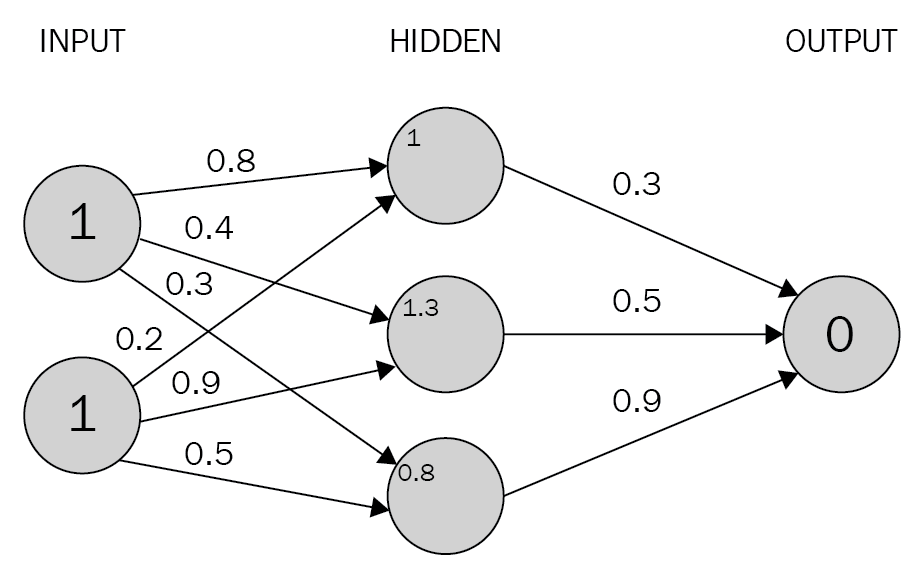

注意，在前面的输出中，我们计算了隐藏值。为简单起见，我们排除了需要在隐藏层的每个单元添加的偏差项。

现在，我们将通过一个激活函数来传递隐藏层的值，以便在输出中实现非线性。

如果我们不在隐含层应用激活函数，神经网络就变成了一个从输入到输出的巨型线性连接。

**应用激活功能**

激活功能应用于网络的多个层。它们用于实现输入的高度非线性，这在模拟输入和输出之间的复杂关系时非常有用。

不同的激活功能如下:

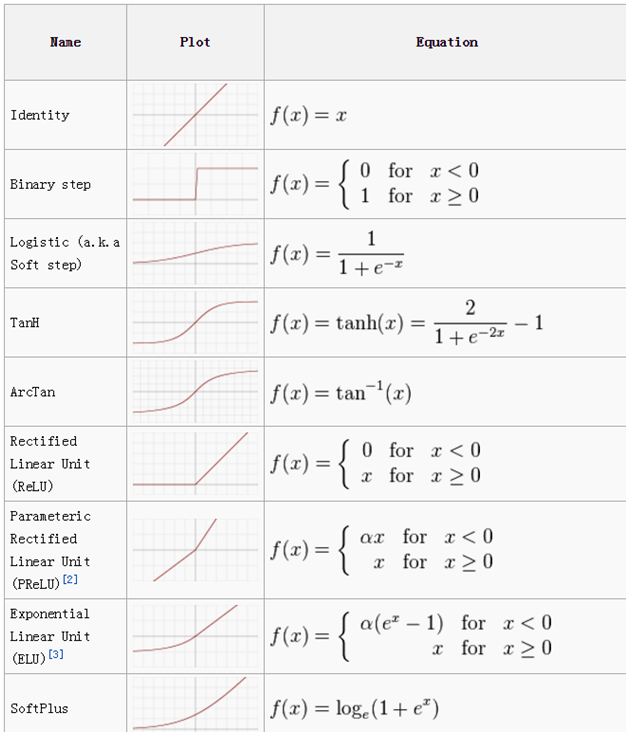

对于我们的例子，让我们使用 sigmoid 函数来激活。sigmoid 函数如下图所示:

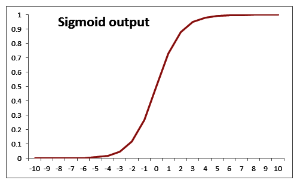

通过将 sigmoid 激活 *S(x)* 应用于三个隐藏层*总和*，我们得到如下:

*final _ h[1]= S(1.0)= 0.73*

*final _ h[2]= S(1.3)= 0.78*

*final _ h[3]= S(0.8)= 0.69*

**计算输出分层值**

现在我们已经计算了隐藏层的值，我们将计算输出层的值。在下图中，我们通过随机初始化的权重值将隐藏图层值连接到输出。使用隐藏层值和权重值，我们将计算以下网络的输出值:


我们执行隐藏层值和权重值的和积来计算输出值。为简单起见，我们排除了需要在隐藏层的每个单元添加的偏差项:

*0.73 * 0.3+0.79 * 0.5+0.69 * 0.9 = 1.235*

这些值如下图所示:

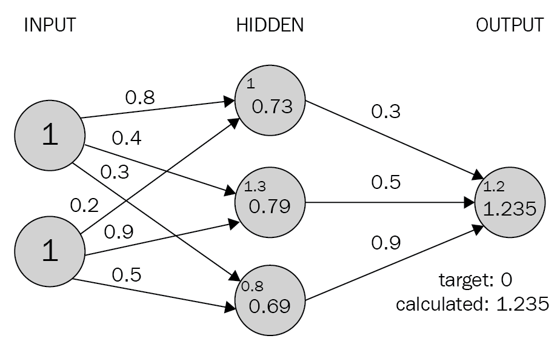

因为我们从一组随机的权重开始，所以输出神经元的值与目标值相差很大，在本例中相差+1.235(因为目标值为 0)。

**计算损失值**

损失值(也称为成本函数)是我们在神经网络中优化的值。为了理解损失值是如何计算的，我们来看两种情况:

*   连续变量预测
*   分类变量预测

**连续变量预测时计算损失**

通常，当变量是连续变量时，损失值计算为平方误差，也就是说，我们试图通过改变与神经网络相关的权重值来最小化均方误差:


在前面的等式中， *y(i)* 是输出的实际值， *h(x)* 是我们对输入( *x* )应用的变换，以获得 *y、*的预测值， *m* 是数据集中的行数。

**在分类变量预测期间计算损失**

当要预测的变量是离散变量时(即变量中只有几个类别)，我们通常使用分类交叉熵损失函数。当要预测的变量中有两个不同的值时，损失函数是二元交叉熵，当要预测的变量中有多个不同的值时，损失函数是分类交叉熵。

这是二元交叉熵:

*(ylog(p)+(1y)log(1p))*

这是分类交叉熵:


*y* 是输出的实际值 *p，*是输出的预测值，n 是数据点的总数。现在，让我们假设我们在玩具例子中预测的结果是连续的。在这种情况下，损失函数值是均方误差，计算方法如下:

*误差= 1.235 ² = 1.52*

在下一步中，我们将尝试使用反向传播来最小化损失函数值(我们将在下一节中了解)，其中我们更新权重值(之前随机初始化)来最小化损失(误差)。

        

# 怎么做...

在上一节中，我们学习了如何对输入数据执行以下步骤，以得出正向传播中的错误值(代码文件在 GitHub 中以`Neural_network_working_details.ipynb`的形式提供):

1.  随机初始化权重
2.  通过将输入值乘以权重来计算隐藏层单位值
3.  对隐藏层值执行激活
4.  将隐藏层值连接到输出层
5.  计算平方误差损失

计算所有数据点的平方误差损失值的函数如下:

```py
import numpy as np
def feed_forward(inputs, outputs, weights):
     pre_hidden = np.dot(inputs,weights[0])+ weights[1]
     hidden = 1/(1+np.exp(-pre_hidden))
     out = np.dot(hidden, weights[2]) + weights[3]
     squared_error = (np.square(pred_out - outputs))
     return squared_error
```

在前面的函数中，我们将输入变量值、权重(如果这是第一次迭代，则随机初始化)和所提供的数据集中的实际输出作为前馈函数的输入。

我们通过执行输入和权重的矩阵乘法(点积)来计算隐藏层值。此外，我们在隐藏层中添加偏移值，如下所示:

```py
pre_hidden = np.dot(inputs,weights[0])+ weights[1]
```

当`weights[0]`是权重值而`weights[1]`是偏移值时，前面的场景是有效的，其中权重和偏移将输入层连接到隐藏层。

一旦我们计算了隐藏层值，我们就在隐藏层值的顶部执行激活，如下所示:

```py
hidden = 1/(1+np.exp(-pre_hidden))
```

我们现在计算隐藏层的输出，方法是将隐藏层的输出乘以将隐藏层连接到输出的权重，然后在输出处添加偏置项，如下所示:

```py
pred_out = np.dot(hidden, weights[2]) + weights[3]
```

计算输出后，我们计算每行的平方误差损失，如下所示:

```py
squared_error = (np.square(pred_out - outputs))
```

在前面的代码中，`pred_out`是预测输出，`outputs`是实际输出。

这样，当我们正向通过网络时，就可以获得损耗值。

虽然我们在前面的代码中考虑了隐藏层值之上的 sigmoid 激活，但是让我们检查一下其他常用的激活函数。

**Tanh**

双曲正切激活值(隐藏层单位值)的计算如下:

```py
def tanh(x):
    return (exp(x)-exp(-x))/(exp(x)+exp(-x))
```

继电器

一个值(隐含层单位值)的**整流线性单位** ( **ReLU** )计算如下:

```py
def relu(x):
    return np.where(x>0,x,0)
```

**线性**

价值的线性激活就是价值本身。

**Softmax**

通常，softmax 是在值向量的顶部执行的。这通常是为了确定某个输入属于给定场景中的 *n* 个可能输出类别之一的概率。假设我们试图将一个数字的图像分为 10 类(数字从 0 到 9)。在这种情况下，有 10 个输出值，其中每个输出值应该表示输入图像属于 10 个类别之一的概率。

softmax 激活用于为输出中的每个类提供一个概率值，其计算方法将在以下章节中解释:

```py
def softmax(x):
    return np.exp(x)/np.sum(np.exp(x))
```

除了前面的激活函数之外，在建立神经网络时通常使用的损失函数如下。

**均方误差**

误差是输出的实际值和预测值之间的差异。我们取误差的平方，因为误差可以是正的或负的(当预测值大于实际值时，反之亦然)。平方确保正负误差不会相互抵消。我们计算均方误差，以便当数据集不是相同大小时，两个不同数据集的误差是可比较的。

预测值(`p`)和实际值(`y`)之间的均方误差计算如下:

```py
def mse(p, y):
    return np.mean(np.square(p - y))
```

当试图预测本质上连续的值时，通常使用均方误差。

**平均绝对误差**

平均绝对误差的工作方式与均方误差非常相似。平均绝对误差通过对所有数据点的实际值和预测值之间的绝对差取平均值，确保正负误差不会相互抵消。

预测值(`p`)与实际值(`y`)的平均绝对误差计算如下:

```py
def mae(p, y):
    return np.mean(np.abs(p-y))
```

与均方误差类似，平均绝对误差通常用于连续变量。

**分类交叉熵**

交叉熵是两种不同分布之间差异的度量:实际分布和预测分布。与我们讨论的前两个损失函数不同，它适用于分类输出数据。

两个分布之间的交叉熵计算如下:


*y* 是事件的实际结果， *p* 是事件的预测结果。

预测值(`p`)和实际值(`y`)之间的分类交叉熵实现如下:

```py
def cat_cross_entropy(p, y):
     return -np.sum((y*np.log2(p)+(1-y)*np.log2(1-p)))
```

请注意，当预测值远离实际值时，分类交叉熵损失具有高值，当预测值接近实际值时，分类交叉熵损失具有低值。

        

# 用 Python 从头开始构建反向传播

在前向传播中，我们将输入层连接到隐藏层，再连接到输出层。在反向传播中，我们采用相反的方法。

        

# 做好准备

我们少量改变神经网络中的每个权重——一次一个。重量值的变化将对最终损失值产生影响(增加或减少损失)。我们将朝着减少损失的方向更新权重。

此外，在某些情况下，对于重量的微小变化，误差会显著增加/减少，而在某些情况下，误差会少量减少。

通过少量更新权重并测量权重更新导致的误差变化，我们能够做到以下几点:

*   确定权重更新的方向
*   确定权重更新的幅度

在实现反向传播之前，让我们了解神经网络的另一个细节:学习速率。

直观上，学习率有助于我们建立对算法的信任。例如，当决定权重更新的幅度时，我们可能不会一次改变很大的量，而是采取更谨慎的方法来更慢地更新权重。

这导致在我们的模型中获得稳定性；我们将在下一章看到学习率如何帮助稳定性。

我们更新权重以减少误差的整个过程被称为梯度下降技术。

**随机梯度下降**是在前一种情况下将误差最小化的方法。更直观地说，**梯度**代表差异(实际与预测的差异)**下降**表示减少。**random**代表选择随机样本的数量，基于该数量做出决策。

除了随机梯度下降，还有许多其他优化技术有助于优化损失值；不同的优化技术将在下一章讨论。

反向传播的工作原理如下:

*   根据前馈过程计算总成本函数。
*   少量改变所有权重(一次一个)。
*   计算权重变化对成本函数的影响。
*   根据更改是增加还是减少了成本(损失)值，它会在损失减少的方向上更新权重值。然后在所有的重量上重复这一步。

如果前面的步骤被执行 *n* 次，它基本上导致*n*个时期。

为了进一步巩固我们对神经网络中反向传播的理解，让我们从一个已知的函数开始，看看权重是如何得到的:

现在，我们将使用已知的函数 *y = 2x* ，其中我们尝试得出权重值和偏差值，在此特定情况下为 2 和 0:

| **x** | **y** |
| one | Two |
| Two | four |
| three | six |
| four | eight |

如果我们将前面的数据集公式化为线性回归， *(y = a*x+b)* ，其中我们试图计算 *a* 和 *b* 的值(我们已经知道它们是 2 和 0，但是正在检查这些值是如何使用梯度下降获得的)，让我们将 *a* 和 *b* 参数随机初始化为 1.477 和 0 的值(它们的理想值是 2 和 0)。

        

# 怎么做...

在本节中，我们将手动构建反向传播算法，以便我们清楚地了解如何在神经网络中计算权重。在这种特定情况下，我们将构建一个简单的神经网络，其中没有隐藏层(因此我们正在求解一个回归方程)。该代码文件在 GitHub 中以`Neural_network_working_details.ipynb`的名称提供。

1.  按如下方式初始化数据集:

```py
x = [[1],[2],[3],[4]]
y = [[2],[4],[6],[8]]
```

2.  随机初始化权重和偏差值(我们只有一个权重和一个偏差值，因为我们试图确定 *y = a*x + b* 等式中 *a* 和 *b* 的最佳值):

```py
w = [[[1.477867]], [0.]]
```

3.  定义前馈网络并计算平方误差损失值:

```py
import numpy as np
def feed_forward(inputs, outputs, weights):
     out = np.dot(inputs,weights[0]) + weights[1]
     squared_error = (np.square(out - outputs))
     return squared_error
```

在前面的代码中，我们执行了输入与随机初始化的权重值的矩阵乘法，并将其与随机初始化的偏差值相加。

一旦计算出该值，我们就可以计算实际值和预测值之差的平方误差值。

4.  以非常小的量(0.0001)增加每个权重和偏移值，并为每个权重和偏移更新一次计算一个平方误差损失值。

如果平方误差损失值随着权重的增加而减小，则权重值应该增加。权重值应该增加的幅度与权重变化减少的损失值的量成比例。

此外，确保您增加的权重值不要与由权重变化引起的损失减少量一样多，而是用一个称为学习率的因子来降低权重值。这确保了损失更平稳地减少(在下一章中有更多关于学习率如何影响模型准确性的内容)。

在下面的代码中，我们创建了一个名为`update_weights`的函数，它执行反向传播过程来更新在*步骤 3* 中获得的权重。我们还提到该函数需要运行`epochs`次(其中`epochs`是我们传递给`update_weights`函数的参数):

```py
def update_weights(inputs, outputs, weights, epochs): 
     for epoch in range(epochs):
```

5.  通过前馈网络传递输入，使用初始权重集计算损耗:

```py
        org_loss = feed_forward(inputs, outputs, weights)
```

6.  确保您`deepcopy`了权重列表，因为权重将在后续步骤中被操作，因此`deepcopy`会处理因子变量变化影响其所指向的父变量而导致的任何问题:

```py
        wts_tmp = deepcopy(weights)
        wts_tmp2 = deepcopy(weights)
```

7.  遍历所有权重值，一次一个，并将其更改一个小值(0.0001):

```py
        for i in range(len(weights)):
             wts_tmp[-(i+1)] += 0.0001
```

8.  当权重少量更新时，计算更新的前馈损失。计算由于输入的微小变化而引起的损耗变化。将损耗变化除以输入数量，因为我们要计算所有输入样本的均方误差:

```py
            loss = feed_forward(inputs, outputs, wts_tmp)
            delta_loss = np.sum(org_loss - loss)/(0.0001*len(inputs))
```

用一个小值更新权重，然后计算其对损失值的影响，这相当于对权重的变化进行求导。

9.  根据权重引起的损失变化来更新权重。通过将损失的变化乘以一个非常小的数(0.01)来缓慢更新权重，该数是学习率参数(下一章将详细介绍学习率参数):

```py
            wts_tmp2[-(i+1)] += delta_loss*0.01 
            wts_tmp = deepcopy(weights)
```

10.  返回更新的权重和偏差值:

```py
    weights = deepcopy(wts_tmp2)
 return wts_tmp2
```

神经网络中的另一个参数是计算损失值时考虑的批量大小。

在前面的场景中，我们考虑了所有的数据点来计算损失值。然而，在实践中，当我们有数千(或在某些情况下，数百万)个数据点时，在计算损失值时，更多个数据点的增量贡献将遵循收益递减规律，因此我们将使用与我们拥有的数据点总数相比小得多的批量。

构建模型时考虑的典型批量大小在 32 到 1，024 之间。

        

# 还有更多...

在上一节中，我们构建了一个回归公式 *(Y = a*x + b)* ，其中我们编写了一个函数来确定 *a* 和 *b* 的最佳值。在本节中，我们将构建一个简单的神经网络，该网络具有一个隐藏层，它将我们在上一节中处理的相同玩具数据集的输入与输出连接起来。

我们将模型定义如下(代码文件在 GitHub 中以`Neural_networks_multiple_layers.ipynb`的形式提供):

*   输入连接到具有三个单元的隐藏层
*   隐藏层连接到输出，输出层中有一个单元

让我们继续编写上面讨论的策略，如下所示:

1.  定义数据集并导入相关包:

```py
from copy import deepcopy
import numpy as np

x = [[1],[2],[3],[4]]
y = [[2],[4],[6],[8]]
```

我们使用`deepcopy`,这样当原始变量的值被复制到的变量的值改变时，原始变量的值不会改变。

2.  随机初始化权重和偏差值。隐藏层有三个单元。因此，总共有三个权重值和三个偏差值——一个对应于一个隐藏单元。

此外，最后一层有一个单元连接到隐藏层的三个单元。因此，总共三个权重和一个偏差决定了输出层的值。

随机初始化的权重如下:

```py
w = [[[-0.82203424, -0.9185806 , 0.03494298]], [0., 0., 0.], [[ 1.0692896 ],[ 0.62761235],[-0.5426246 ]], [0]]
```

3.  实现前馈网络，其中隐藏层具有一个 ReLU 激活:

```py
def feed_forward(inputs, outputs, weights):
     pre_hidden = np.dot(inputs,weights[0])+ weights[1]
     hidden = np.where(pre_hidden<0, 0, pre_hidden) 
     out = np.dot(hidden, weights[2]) + weights[3]
     squared_error = (np.square(out - outputs))
     return squared_error
```

4.  类似于我们在上一节中所做的那样定义反向传播函数。唯一的区别是，我们现在必须更新更多层的权重。

在下面的代码中，我们计算一个时段开始时的原始损耗:

```py
def update_weights(inputs, outputs, weights, epochs): 
     for epoch in range(epochs):
         org_loss = feed_forward(inputs, outputs, weights)
```

在下面的代码中，我们将权重复制到两组权重变量中，以便它们可以在后面的代码中重用:

```py
        wts_new = deepcopy(weights)
        wts_new2 = deepcopy(weights)
```

在下面的代码中，我们对每个权重值进行少量更新，然后计算与更新后的权重值相对应的损失值(而其他权重保持不变)。此外，我们确保权重更新发生在网络中的所有权重和所有层上。

平方损失(`del_loss`)的变化归因于重量值的变化。我们对网络中存在的所有权重重复上述步骤:

```py
         for i, layer in enumerate(reversed(weights)):
            for index, weight in np.ndenumerate(layer):
                wts_tmp[-(i+1)][index] += 0.0001
                loss = feed_forward(inputs, outputs, wts_tmp)
                del_loss = np.sum(org_loss - loss)/(0.0001*len(inputs))
```

重量值通过按学习率参数降低重量来更新——损失减少越多，重量更新越多，而损失减少越少，重量更新越少:

```py
               wts_tmp2[-(i+1)][index] += del_loss*0.01
               wts_tmp = deepcopy(weights)
```

假设权重值一次更新一个，以估计它们对损失值的影响，则有可能并行化权重更新过程。因此，GPU 在这种情况下很方便，因为它们比 CPU 拥有更多的核心，因此与 CPU 相比，在给定的时间内，使用 GPU 可以更新更多的权重。

最后，我们返回更新后的权重:

```py

          weights = deepcopy(wts_tmp2)
 return wts_tmp2
```

5.  运行函数一个历元的次数，以更新权重一个历元的次数:

```py
update_weights(x,y,w,1)
```

前面代码的输出(更新的权重)如下:

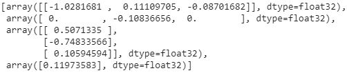

在前面的步骤中，我们学习了如何用 Python 从头开始构建神经网络。在下一节中，我们将学习在 Keras 中构建神经网络。

        

# 在 Keras 中构建神经网络

在上一节中，我们从头构建了一个神经网络，也就是说，我们编写了执行前向传播和反向传播的函数。

        

# 怎么做...

我们将使用 Keras 库构建一个神经网络，该库提供了一些实用程序，使构建复杂的神经网络的过程变得更加容易。

        

# 安装 Keras

Tensorflow 和 Keras 在 Ubuntu 中使用以下命令实现:

```py
$pip install --no-cache-dir tensorflow-gpu==1.7
```

请注意，最好安装一个与 GPU 兼容的版本，因为当神经网络在 GPU 上运行时，其工作速度要快得多。Keras 是一个高级神经网络 API，用 Python 编写，能够在 TensorFlow、CNTK 或 antano 之上运行。

它的开发重点是支持快速实验，可以按如下方式安装:

```py
$pip install keras
```

        

# 在喀拉斯建造我们的第一个模型

在这一节中，让我们通过使用我们在前面几节中处理过的相同玩具数据集来理解在 Keras 中构建模型的过程(代码文件在 GitHub 中以`Neural_networks_multiple_layers.ipynb`的形式提供):

1.  实例化一个模型，可以顺序调用该模型以在其上添加更多的层。`Sequential`方法使我们能够执行模型初始化练习:

```py
from keras.models import Sequential
model = Sequential()
```

2.  向模型添加密集层。密集层确保模型中各层之间的连接。在下面的代码中，我们将输入层连接到隐藏层:

```py
model.add(Dense(3, activation='relu', input_shape=(1,)))
```

在使用前面的代码初始化的密集层中，我们确保为模型提供了输入形状(我们需要指定模型预期的数据形状，因为这是第一个密集层)。

此外，我们提到每个输入将有三个连接(隐藏层中的三个单元)，并且需要在隐藏层中执行的激活是 ReLu 激活。

3.  将隐藏层连接到输出层:

```py
model.add(Dense(1, activation='linear'))
```

请注意，在这个密集层中，我们不需要指定输入形状，因为模型已经从上一层推断出输入形状。

此外，假设每个输出是一维的，我们的输出层有一个单元，我们正在执行的激活是线性激活。

模型摘要现在可以可视化如下:

```py
model.summary()
```

模型总结如下:

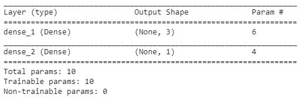

前面的输出证实了我们在上一节中的讨论:在从输入层到隐藏层的连接中总共有六个参数——三个权重和三个偏置项——我们总共有六个参数对应于三个隐藏单元。此外，三个权重和一个偏置项将隐藏层连接到输出层。

4.  编译模型。这确保了我们定义损失函数和优化器，以减少损失函数和对应于优化器的学习率(我们将在下一章中查看不同的优化器和损失函数):

```py
from keras.optimizers import sgd
sgd = sgd(lr = 0.01)
```

在上一步中，我们指定优化器是我们在上一节中了解的随机梯度下降，学习率是 0.01。将预定义的优化器及其相应的学习率作为参数传递，并减少均方误差值:

```py
model.compile(optimizer=sgd,loss='mean_squared_error')
```

5.  符合模型。更新权重，使模型更适合:

```py
model.fit(np.array(x), np.array(y), epochs=1, batch_size = 4, verbose=1)
```

`fit`方法期望它接收两个 NumPy 数组:一个输入数组和相应的输出数组。注意，`epochs`表示遍历整个数据集的次数，`batch_size`表示在更新权重的迭代中需要考虑的数据点的数量。此外，`verbose`指定输出更详细，具有关于训练和测试数据集中的损失以及模型训练过程的进度的信息。

6.  提取重量值。权重值的显示顺序是通过调用模型顶部的 weights 方法获得的，如下所示:

```py
model.weights
```

获得权重的顺序如下:

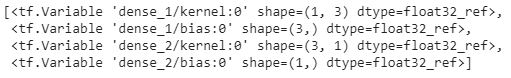

从前面的输出中，我们看到权重的顺序是三个权重(`kernel`)和三个偏置项在`dense_1`层(它是输入到隐藏层之间的连接)和三个权重(`kernel`)和一个偏置项将隐藏层连接到`dense_2`层(输出层)。

现在我们已经了解了权重值的显示顺序，让我们提取这些权重的值:

```py
model.get_weights()
```

注意，权重以数组列表的形式呈现，其中每个数组对应于在`model.weights`输出中指定的值。

上面几行代码的输出如下:


您应该注意到，我们在这里观察的输出与我们手工构建神经网络时获得的输出相匹配

7.  使用`predict`方法预测一组新输入的输出:

```py
x1 = [[5],[6]]
model.predict(np.array(x1))
```

请注意，`x1`是保存新示例集值的变量，我们需要为这些新示例集预测输出值。类似于`fit`方法，`predict`方法也期望一个数组作为它的输入。

前面代码的输出如下:

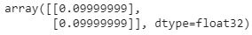

请注意，虽然前面的输出不正确，但我们运行 100 个时期时的输出如下:

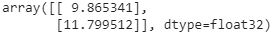

前面的输出将与预期的输出(10，12)相匹配，因为我们运行了更多的时期。