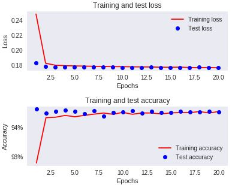
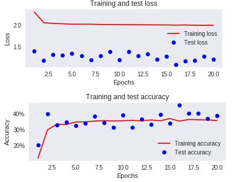
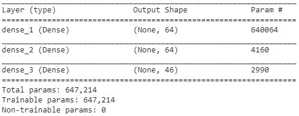
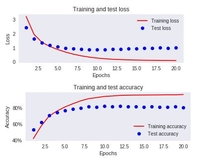
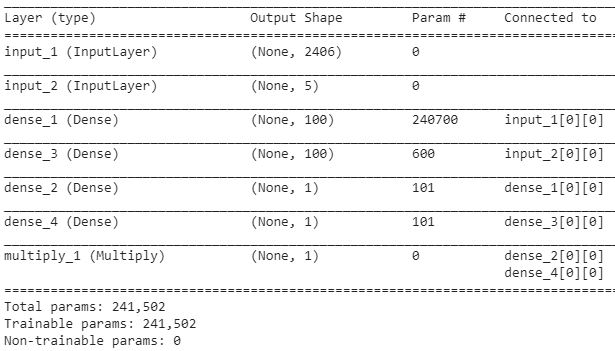

        

# 三、深度前馈神经网络的应用

在本章中，我们将介绍以下食谱:

*   预测信用违约
*   预测房价
*   将新闻文章按主题分类
*   分类普通音频
*   预测股票价格

        

# 介绍

在前几章中，我们学习了构建神经网络以及需要调整的各种参数，以确保构建的模型具有良好的通用性。此外，我们还了解了如何利用神经网络利用 MNIST 数据进行图像分析。

在这一章中，我们将了解神经网络如何用于预测以下内容:

*   结构化数据集
    *   分类输出预测
    *   连续产量预测

*   文本分析
*   音频分析

此外，我们还将了解以下内容:

*   实现自定义损失函数
*   对某些类别的产出赋予比其他类别更高的权重
*   为数据集的某些行分配比其他行更高的权重
*   利用功能性 API 集成多个数据源

我们将通过以下食谱来了解上述所有内容:

*   预测信用违约
*   预测房价
*   给新闻文章分类
*   预测股票价格
*   分类普通音频

但是，您应该注意，提供这些应用只是为了让您了解如何利用神经网络来分析各种输入数据。分析文本、音频和时序数据的高级方法将在后面关于卷积神经网络和循环神经网络的章节中提供。

        

# 预测信用违约

在金融服务行业，收入损失的主要来源之一是某些客户的违约。然而，总客户中只有很小一部分会违约。因此，这成为一个分类问题，更重要的是，识别罕见事件。

在本案例研究中，我们将分析一个数据集，该数据集在给定时间点跟踪客户的某些关键属性，并尝试预测客户是否可能违约。

让我们考虑一下，你可以用什么方式来操作我们建立的模型中的预测。企业可能希望特别关注那些更有可能违约的客户——可能会给他们提供替代的付款方式或降低信用额度的方法，等等。

        

# 做好准备

我们将采用的预测客户违约的策略如下:

*   **目标**:给更有可能违约的客户分配一个高概率。
*   **Mea****surement****criterion**:当我们只考虑前 10%的会员时，通过降低违约概率，使实际违约的客户数量最大化。

我们将采用的为每个成员分配违约概率的策略如下:

*   考虑所有成员的历史数据。
*   了解有助于我们识别可能违约的客户的变量:
    *   收入债务比是一个非常好的指标，可以用来衡量一个成员国是否有可能违约。
    *   我们将提取一些类似的变量。
*   在上一步中，我们创建了输入变量；现在，让我们继续创建因变量:
    *   我们将提取在接下来的 2 年中实际违约的成员，方法是首先回顾历史，然后查看成员在接下来的 2 年中是否违约
    *   有一个时滞是很重要的，因为如果我们没有一个成员可能违约的时间和预测日期之间的时间差，它可能不会给我们任何改变结果的杠杆。
*   假设结果是二进制的，我们将最小化二进制交叉熵损失。
*   该模型应有一个连接输入层和输出层的隐藏层。
*   我们将计算测试数据集中实际违约的前 10%概率成员的数量。

请注意，我们假设测试数据在这里是有代表性的，因为在没有生产模型的情况下，我们无法在看不见的数据集上评估模型的性能。我们将假设模型在未知数据集上的表现是模型在未来数据上表现如何的良好指标。

        

# 怎么做...

我们将策略编码如下(实现代码时请参考 GitHub 中的`Credit default prediction.ipynb`文件):

1.  导入相关包和数据集:

```py
import pandas as pd
data = pd.read_csv('...') # Please add path to the file you downloaded
```

我们下载的数据集的前三行如下:


前面的屏幕截图是原始数据集中变量的子集。名为`Defaultin2yrs`的变量是我们需要预测的输出变量，基于数据集中存在的其余变量。

2.  总结数据集以更好地理解变量:

```py
data.describe()
```

查看输出后，您会注意到以下内容:

*   某些变量的范围很小(`age`)，而其他变量的范围则大得多(`Income`)。
*   某些变量有缺失值(`Income`)。
*   某些变量有异常值(`Debt_income_ratio`)。在接下来的步骤中，我们将继续纠正之前标记的所有问题。
*   用变量的中值估算变量中的缺失值:

```py
vars = data.columns[1:]
import numpy as np
for var in vars:
     data[var]= np.where(data[var].isnull(),data[var].median(),data[var])
```

在前面的代码中，我们排除了第一个变量，因为它是我们试图预测的变量，然后我们估算其余变量中的缺失值(假设该变量确实有缺失值)。

3.  将每个变量限制在相应的第 95 个百分位数，这样我们的输入变量中就不会有异常值:

```py
for var in vars:
     x=data[var].quantile(0.95)
     data[var+"outlier_flag"]=np.where(data[var]>x,1,0)
     data[var]=np.where(data[var]>x,x,data[var])
```

在前面的代码中，我们已经确定了每个变量的第 95 个^(百分点值，创建了一个新变量，如果该行包含给定变量中的异常值，则该变量的值为 1，否则为 0。此外，我们将变量值限制在原始值的第 95 个^(百分点值。))

4.  一旦我们总结了修改后的数据，我们注意到除了`Debt_income_ratio`变量之外，其他变量似乎不再有异常值。因此，让我们进一步限制`Debt_income_ratio`的输出范围，将其限制在第 80 个^(百分点值:)

```py
data['Debt_income_ratio_outlier']=np.where(data['Debt_incomeratio']>1,1,0)
data['Debt_income_ratio']=np.where(data['Debt_income_ratio']>1,1,data['Debt_income_ratio'])
```

5.  对于 0 到 1 之间的值，将所有变量归一化到相同的标度:

```py
for var in vars:
     data[var]= data[var]/data[var].max()
```

在前面的代码中，我们通过将每个输入变量值除以输入变量列的最大值，将所有变量限制在一个相似的输出范围内，即介于 0 和 1 之间。

6.  创建输入和输出数据集:

```py
X = data.iloc[:,1:]
Y = data['Defaultin2yrs']
```

7.  将数据集分为训练数据集和测试数据集:

```py
from sklearn.model_selection import train_test_split
X_train, X_test, y_train, y_test = train_test_split(X, Y, test_size = 0.3, random_state= 42)
```

在前面的步骤中，我们使用`train_test_split`方法将输入和输出数组分成训练和测试数据集，其中测试数据集占输入和相应输出数组中数据点总数的 30%。

8.  现在数据集已经创建，让我们定义神经网络模型，如下所示:

```py
from keras.models import Sequential
from keras.layers import Dense
from keras.layers import Dropout
from keras.utils import np_utils
model = Sequential()
model.add(Dense(1000, input_dim=X_train.shape[1], activation='relu'))
model.add(Dense(1, activation='sigmoid'))
model.summary()
```

该模型的摘要如下:


在之前的架构中，我们将输入变量连接到一个具有 1000 个隐藏单元的隐藏层。

9.  编译模型。我们将使用二元交叉熵，因为输出变量只有两类。此外，我们将指定`optimizer`是一个`adam`优化:

```py
model.compile(loss='binary_crossentropy', optimizer='adam', metrics=['accuracy'])
```

10.  符合模型:

```py
history = model.fit(X_train, y_train, validation_data=(X_test, y_test), epochs=20, batch_size=1024, verbose=1)
```

训练和测试损失、准确度在增加的时期内的变化如下:



11.  对测试数据集进行预测:

```py
pred = model.predict(X_test)
```

12.  检查在测试数据集的前 10%中捕获的实际违约者的数量，按概率降序排列:

```py
test_data = pd.DataFrame([y_test]).T
test_data['pred']=pred
test_data = test_data.reset_index(drop='index')
test_data = test_data.sort_values(by='pred',ascending=False)
print(test_data[:4500]['Defaultin2yrs'].sum())
```

在前面的代码中，我们将预测值与实际值连接起来，然后按概率对数据集进行排序。我们检查了在测试数据集的前 10%(即前 4，500 行)中捕获的违约者的实际数量。

我们应该注意到，通过对 4，500 名高概率客户的调查，我们发现了 1，580 名实际违约者。这是一个很好的预测，因为平均只有 6%的客户违约。因此，在这种情况下，大约 35%违约概率高的客户实际上违约了。

        

# 它是如何工作的...

在这个食谱中，我们学习了以下概念:

*   **Imputin****g****m****missing****values**:我们已经了解到估算一个变量缺失值的方法之一是用相应变量的中值替换缺失值。处理缺失值的其他方法是用平均值替换它们，以及用与包含缺失值的行最相似的行中的变量值的平均值替换缺失值(这种技术称为 i **识别 K-最近邻居**)。
*   **限制异常值**:我们还了解到限制异常值的一种方法是用第 95 个^(百分点值替换第 95 个^(百分点值以上的值。我们执行此练习的原因是为了确保输入变量没有将所有值聚集在一个小值周围(当变量按最大值缩放时，这是一个异常值)。))
*   **缩放数据集**:最后，我们缩放数据集，以便它可以被传递到神经网络。

        

# 为类分配权重

当我们给属于违约者的行和属于非违约者的行分配相等的权重时，潜在地，该模型可以针对非违约者进行微调。在本节中，我们将研究分配更高权重的方法，以便我们的模型更好地对违约者进行分类。

        

# 做好准备

在上一节中，我们为每个类分配了相同的权重；也就是说，如果实际值和预测值之间的差值大小相同，则分类交叉熵损失是相同的，而不管它是针对违约预测还是非违约预测。

为了进一步理解这个场景，让我们考虑下面的例子:

| **场景** | **违约概率** | **实际默认值** | **交叉熵损失** |
| one | *0.2* | *1* | *1*log(0.2)* |
| Two | *0.8* | *0* | *(1-0)*log(1-0.8)* |

在前面的场景中，交叉熵损失值是一样的，与实际的 default 值无关。

但是，我们知道我们的目标是在按概率排序时，在预测的前 10%中捕获尽可能多的实际违约者。

因此，当实际默认值为 *1* 时，我们继续分配较高的损失权重(权重为 *100* ),当实际默认值为 *0* 时，分配较低的权重( *1* 的权重)。

前面的场景现在更改如下:

| **场景** | **违约概率** | **实际默认值** | **交叉熵损失** |
| one | *0.2* | *1* | *100*1*log(0.2)* |
| Two | *0.8* | *0* | *1*(1-0)*log(1-0.8)* |

现在，如果我们注意到交叉熵损失，当实际违约值为 *1* 时的预测是错误的，与实际违约值为 *0* 时的预测相比，它要高得多。

现在，我们已经理解了为类分配权重的直觉，让我们继续为信用默认数据集中的输出类分配权重。

除了模型拟合过程之外，为构建数据集和模型而执行的所有步骤与上一节中的步骤相同。

        

# 怎么做...

模型拟合过程按照以下步骤完成(实现代码时请参考 GitHub 中的`Credit default prediction.ipynb`文件):

```py
history = model.fit(X_train, y_train, validation_data=(X_test, y_test), epochs=10, batch_size=1024, verbose=1,class_weight = {0:1,1:100})
```

注意，在前面的代码片段中，我们创建了一个字典，其权重对应于输出中的不同类，然后作为输入传递给`class_weight`参数。

前面的步骤确保我们在实际结果为`1`时分配权重`100`来计算损失值，在实际结果为`0`时分配权重`1`。

准确度和损失值在增加的时期内的变化如下:



请注意，在此迭代中，精度值要低得多，因为与两个类的权重相等的情况相比，我们预测有更多数量的数据点具有值 1。

模型拟合后，我们继续检查预测中前 10%的实际违约者数量，如下所示:

```py
pred = model.predict(X_test)
test_data = pd.DataFrame([y_test[:,1]]).T
test_data['pred']=pred[:,1]
test_data = test_data.reset_index(drop='index')
test_data = test_data.sort_values(by='pred',ascending=False)
test_data.columns = ['Defaultin2yrs','pred']
print(test_data[:4500]['Defaultin2yrs'].sum())
```

您会注意到，与前 10%的 1，580 名客户相比，我们在这种情况下有 1，640 名前 10%的客户，因此我们设定的目标取得了更好的结果，在这种情况下，我们在高可能性客户的前 10%中捕获了 36%的所有违约者，而前一种情况下为 35%。

当我们增加类别权重时，并不总是需要提高精确度。分配类权重是一种给我们的兴趣预测更高权重的机制。

        

# 预测房价

在之前的案例研究中，我们有一个明确的输出。在本案例研究中，我们将通过尝试预测一所房子的价格来研究一个本质上连续的输出，其中有 13 个可能影响房价的变量作为输入。

目标是最小化我们预测房价的误差。

        

# 做好准备

假设目标是最小化误差，让我们定义我们应该最小化的误差——我们应该确保正误差和负误差不会相互抵消。因此，我们将使绝对误差最小化。另一种方法是最小化平方误差。

既然我们已经微调了我们的目标，让我们来定义解决这个问题的策略:

*   归一化输入数据集，使所有变量的范围在 0 到 1 之间。
*   将给定数据拆分为训练和测试数据集。
*   初始化将 13 个变量的输入连接到一个变量的输出的隐藏层。
*   使用 Adam 优化器编译模型，并将损失函数定义为最小化平均绝对误差值。
*   符合模型。
*   对测试数据集进行预测。
*   计算测试数据集的预测误差。

现在我们已经定义了我们的方法，让我们在下一节中继续用代码执行它。

        

# 怎么做...

1.  导入相关的数据集(实现代码时请参考 GitHub 中的`Predicting house price.ipynb`文件，以获得推荐的数据集):

```py
from keras.datasets import boston_housing
(train_data, train_targets), (test_data, test_targets) = boston_housing.load_data()
```

2.  归一化输入和输出数据集，使所有变量的范围从 0 到 1:

```py
import numpy as np
train_data2 = train_data/np.max(train_data,axis=0)
test_data2 = test_data/np.max(train_data,axis=0)
train_targets = train_targets/np.max(train_targets)
test_targets = test_targets/np.max(train_targets)
```

请注意，我们已经使用训练数据集本身的最大值对测试数据集进行了规范化，因为我们不应该在建模过程中使用测试数据集的任何值。此外，请注意，我们已经对输入和输出值进行了规范化。

3.  既然输入和输出数据集已经准备好，让我们继续定义模型:

```py
from keras.models import Sequential
from keras.layers import Dense, Dropout
from keras.utils import np_utils
from keras.regularizers import l1
model = Sequential()
model.add(Dense(64, input_dim=13, activation='relu', kernel_regularizer = l1(0.1)))
model.add(Dense(1, activation='relu', kernel_regularizer = l1(0.1)))
model.summary()
```

该模型的摘要如下:


请注意，我们在建模过程中执行了`L1`正则化，以便模型不会过度拟合训练数据(因为训练数据中的数据点数量很少)。

4.  编译模型以最小化平均绝对误差值:

```py
model.compile(loss='mean_absolute_error', optimizer='adam')
```

5.  符合模型:

```py
history = model.fit(train_data2, train_targets, validation_data=(test_data2, test_targets), epochs=100, batch_size=32, verbose=1)
```

6.  计算测试数据集的平均绝对误差:

```py
np.mean(np.abs(model.predict(test_data2) - test_targets))*50
```

我们应该注意到平均绝对误差是 *~6.7* 个单位。

在下一节中，我们将改变损失函数并添加自定义权重，看看我们是否可以提高平均绝对误差值。

        

# 定义自定义损失函数

在上一节中，我们使用预定义的平均绝对误差`loss`函数来执行优化。在本节中，我们将了解如何定义自定义损失函数来执行优化。

我们将构建的自定义损失函数是修正的均方误差值，其中误差是实际值的平方根和预测值的平方根之间的差。

自定义损失函数定义如下:

```py
import keras.backend as K
def loss_function(y_true, y_pred):
    return K.square(K.sqrt(y_pred)-K.sqrt(y_true))
```

既然我们已经定义了`loss`函数，我们将重用我们在上一节中准备的相同的输入和输出数据集，并且我们还将使用我们先前定义的相同模型。

现在，让我们编译这个模型:

```py
model.compile(loss=loss_function, optimizer='adam')
```

在前面的代码中，注意我们将`loss`值定义为我们之前定义的自定义损失函数— `loss_function`。

```py
history = model.fit(train_data2, train_targets, validation_data=(test_data2, test_targets), epochs=100, batch_size=32, verbose=1)
```

一旦我们拟合了模型，我们将注意到平均绝对误差是 *~6.5* 单位，这比我们使用`mean_absolute_error`损失函数的上一次迭代略小。

        

# 将新闻文章按主题分类

在前面的案例研究中，我们分析了结构化的数据集，即包含变量及其相应值的数据集。在本案例研究中，我们将处理一个以文本为输入的数据集，预期输出是与文本相关的 46 个可能主题之一。

        

# 做好准备

为了理解执行文本分析的直觉，让我们考虑 Reuters 数据集，其中每篇新闻文章被分类到 46 个可能的主题中的一个。

我们将采用以下策略进行分析:

*   鉴于一个数据集可能包含数千个独特的词，我们将列出我们应该考虑的词。
*   在这个具体的练习中，我们将考虑前 10，000 个最常用的单词。
*   另一种方法是考虑累积构成数据集中所有单词的 80%的单词。这样可以确保排除所有的生僻字。
*   一旦单词被列入候选名单，我们将根据组成的常用单词对文章进行一次性编码。
*   类似地，我们将对输出标签进行一次热编码。
*   现在每个输入是一个 10，000 维的向量，输出是一个 46 维的向量:
*   我们将数据集分为训练数据集和测试数据集。然而，在代码中，您会注意到我们将使用 Keras 中的内置数据集`reuters`，它具有内置函数来识别最常用的`n`单词，并将数据集分为训练和测试数据集。
*   在输入和输出之间映射一个隐藏层。
*   我们将在输出层执行 softmax，以获得输入属于 46 个类别之一的概率。
*   假设我们有多种可能的输出，我们将使用分类交叉熵损失函数。
*   我们将编译并拟合该模型，以在测试数据集上测量其准确性。

        

# 怎么做...

我们将把之前定义的策略编码如下(实现代码时请参考 GitHub 中的`Categorizing news articles into topics.ipynb`文件):

1.  导入数据集:

```py
from keras.datasets import reuters
(train_data, train_labels), (test_data, test_labels) = reuters.load_data(num_words=10000)
```

在前面的代码片段中，我们从 Keras 中可用的`reuters`数据集加载数据。此外，我们只考虑数据集中出现频率最高的`10000`个单词。

2.  检查数据集:

```py
train_data[0]
```

加载的训练数据集的示例如下:


请注意，前面输出中的数字表示输出中出现的单词的索引。

3.  我们可以如下提取值的索引:

```py
word_index = reuters.get_word_index()
```

4.  对输入进行矢量化。我们将通过以下方式将文本转换为矢量:
    *   对输入单词进行一次热编码—在输入数据集中产生总共`10000`列。
    *   如果一个单词出现在给定文本中，则对应于单词索引的列的值应为 1，而每隔一列的值应为 0。
    *   对文本中所有独特的单词重复上述步骤。如果一个文本有两个唯一的单词，则总共有两列的值为 1，而每隔一列的值为零:

```py
import numpy as np
def vectorize_sequences(sequences, dimension=10000):
     results = np.zeros((len(sequences), dimension))
     for i, sequence in enumerate(sequences):
         results[i, sequence] = 1.
     return results
```

在前面的函数中，我们初始化了一个零矩阵变量，并根据输入序列中的索引值为其赋值 1。

在下面的代码中，我们将单词转换成 id。

```py
x_train = vectorize_sequences(train_data)
x_test = vectorize_sequences(test_data)
```

5.  对输出进行一次热编码:

```py
from keras.utils.np_utils import to_categorical
one_hot_train_labels = to_categorical(train_labels)
one_hot_test_labels = to_categorical(test_labels)
```

前面的代码将每个输出标签转换为一个长度为`46`的向量，其中一个`46`值为 1，其余的为 0，这取决于标签的索引值。

6.  定义模型并编译它:

```py
from keras.models import Sequential
from keras.layers import Dense
model = Sequential()
model.add(Dense(64, activation='relu', input_shape=(10000,)))
model.add(Dense(64, activation='relu'))
model.add(Dense(46, activation='softmax'))
model.summary()
model.compile(optimizer='adam',loss='categorical_crossentropy',metrics=['accuracy'])
```



注意，在编译时，我们将`loss`定义为`categorical_crossentropy`,因为这种情况下的输出是分类的(输出中有多个类)。

7.  符合模型:

```py
history = model.fit(X_train, y_train,epochs=20,batch_size=512,validation_data=(X_test, y_test))
```

上述代码生成的模型在将输入文本分类到正确的主题方面有 80%的准确率，如下所示:



        

# 分类普通音频

在前面的章节中，我们已经了解了在结构化数据集和非结构化文本数据上执行建模的策略。

在本节中，我们将学习如何执行输入为原始音频的分类练习。

我们将采用的策略是，我们将从输入音频中提取特征，其中每个音频信号都表示为固定数量特征的向量。

从音频中提取特征有多种方式——然而，对于这个练习，我们将提取对应于音频文件的**梅尔频率倒谱系数** ( **MFCC** )。

提取要素后，我们将以与构建 MNIST 数据集分类模型非常相似的方式执行分类练习，在该模型中，我们使用隐藏层连接输入层和输出层。

在下一节中，我们将在音频数据集上执行分类，其中有十个可能的输出类别。

        

# 怎么做...

我们之前定义的策略编码如下(实现代码时请参考 GitHub 中的`Audio classification.ipynb`文件):

1.  导入数据集:

```py
import pandas as pd
data = pd.read_csv('/content/train.csv')
```

2.  提取每个音频输入的特征:

```py
ids = data['ID'].values
def extract_feature(file_name):
    X, sample_rate = librosa.load(file_name)
    stft = np.abs(librosa.stft(X))
    mfccs = np.mean(librosa.feature.mfcc(y=X,sr=sample_rate, n_mfcc=40).T,axis=0)
    return mfccs
```

在前面的代码中，我们定义了一个函数，该函数将`file_name`作为输入，提取对应于音频文件的`40` MFCC，并返回相同的值。

3.  创建输入和输出数据集:

```py
x = []
y = []
for i in range(len(ids)):     
     try:
         filename = '/content/Train/'+str(ids[i])+'.wav'
         y.append(data[data['ID']==ids[i]]['Class'].values)
         x.append(extract_feature(filename))
     except:
         continue
x = np.array(x)
```

在前面的代码中，我们一次遍历一个音频文件，提取其特征并将其存储在输入列表中。类似地，我们将把输出类存储在输出列表中。此外，我们将把输出列表转换成一个热编码的分类值:

```py
y2 = []
for i in range(len(y)):
     y2.append(y[i][0])
y3 = np.array(pd.get_dummies(y2))
```

`pd.get_dummies`方法与我们之前使用的`to_categorical`方法非常相似；然而，`to_categorical`并不对文本类起作用(它只对数值起作用，数值被转换成一个热编码值)。

4.  构建模型并编译它:

```py
model = Sequential()
model.add(Dense(1000, input_shape = (40,), activation = 'relu'))
model.add(Dense(10,activation='sigmoid'))
from keras.optimizers import Adam
adam = Adam(lr=0.0001)
model.compile(optimizer=adam, loss='categorical_crossentropy', metrics=['acc'])
```

前面模型的摘要如下:


5.  创建训练和测试数据集，然后拟合模型:

```py
from sklearn.model_selection import train_test_split
X_train, X_test, y_train, y_test = train_test_split(x, y3, test_size=0.30,random_state=10)
model.fit(X_train, y_train, epochs=100, batch_size=32, validation_data=(X_test, y_test), verbose = 1)
```

一旦模型被拟合，你会注意到该模型在正确的类别中对音频进行分类的准确率为 91%。

        

# 股票价格预测

在前面的章节中，我们学习了使用神经网络执行音频、文本和结构化数据分析。在本节中，我们将通过一个预测股票价格的案例研究来学习如何进行时间序列分析。

        

# 做好准备

为了预测股票价格，我们将执行以下步骤:

1.  从最早的日期到最新的日期对数据集进行排序。
2.  把前五个股价作为输入，第六个股价作为输出。
3.  滑动它，以便在下一个数据点中，第二到第六个数据点是输入，第七个数据点是输出，依此类推，直到我们到达最后一个数据点。
4.  假设我们预测的是一个连续的数，这次的`loss`函数应该是均方误差值。

此外，我们还将尝试将文本数据集成到历史数字数据中来预测第二天的股票价格。

        

# 怎么做...

上述策略编码如下(实现代码时请参考 GitHub 中的`Chapter 3  - stock price prediction.ipynb`文件，以及推荐的数据集):

1.  导入相关包和数据集:

```py
import pandas as pd
data2 = pd.read_csv('/content/stock_data.csv')
```

2.  准备数据集，其中输入是前五天的股票价格值，输出是第六天的股票价格值:

```py
x= []
y = []
for i in range(data2.shape[0]-5):
 x.append(data2.loc[i:(i+4)]['Close'].values)
 y.append(data2.loc[i+5]['Close'])
import numpy as np
x = np.array(x)
y = np.array(y)
```

3.  准备训练和测试数据集、构建模型、编译模型并拟合模型:

```py
from sklearn.model_selection import train_test_split
X_train, X_test, y_train, y_test = train_test_split(x, y, test_size=0.30,random_state=10)
```

构建模型并编译它:

```py

from keras.layers import Dense
from keras.models import Sequential, Model
model = Sequential()
model.add(Dense(100, input_dim = 5, activation = 'relu'))
model.add(Dense(1,activation='linear'))
model.compile(optimizer='adam', loss='mean_squared_error')
```

前面的代码生成了如下的模型摘要:


```py
model.fit(X_train, y_train, epochs=100, batch_size=64, validation_data=(X_test, y_test), verbose = 1)
```

一旦我们拟合了模型，就要注意预测股价的均方差值*~ 360 美元*或者预测股价的~ 18 美元。

请注意，以这种方式预测股价有一个陷阱。然而，这将在关于 RNN 应用的一章中讨论。

现在，我们将重点学习神经网络如何在各种不同的场景中发挥作用。

在下一节中，我们将了解如何在一个模型中集成数字数据和新闻标题的文本数据。

        

# 利用功能 API

在本节中，我们将继续通过将历史价格点数据与我们预测股价的公司的最新头条新闻相结合来提高股价预测的准确性。

我们将采用以下策略来整合来自多个来源的数据——结构化(历史价格)数据和非结构化(标题)数据:

*   我们将把非结构化文本转换成结构化格式，其方式类似于我们将新闻文章分类成主题的方式。
*   我们将通过神经网络传递文本的结构化格式，并提取隐藏层输出。
*   最后，我们将隐藏层输出传递给输出层，其中输出层有一个节点。
*   以类似的方式，我们通过神经网络传递输入的历史价格数据，以提取隐藏层值，然后将隐藏层值传递到输出层，该输出层在输出中有一个单位。
*   我们将每个独立神经网络操作的输出相乘，以提取最终输出。
*   现在，最终输出的平方误差值应最小化。

        

# 怎么做...

前面的策略编码如下:

1.  让我们从《卫报》提供的 API 中获取标题数据，如下所示:

```py
from bs4 import BeautifulSoup
import urllib, json

dates = []
titles = []
for i in range(100):
     try:
         url = 'https://content.guardianapis.com/search?from-date=2010-01-01&section=business&page-size=200&order-by=newest&page='+str(i+1)+'&q=amazon&api-key=207b6047-a2a6-4dd2-813b-5cd006b780d7'
         response = urllib.request.urlopen(url)
         encoding = response.info().get_content_charset('utf8')
         data = json.loads(response.read().decode(encoding))
     for j in range(len(data['response']['results'])):
         dates.append(data['response']['results'][j]['webPublicationDate'])
         titles.append(data['response']['results'][j]['webTitle']) 
     except:
         break
```

2.  一旦`titles`和`dates`被提取，我们将预处理数据以将`date`值转换为`date`格式，如下所示:

```py
import pandas as pd
data = pd.DataFrame(dates, titles)
data['date']=data['date'].str[:10]
data['date']=pd.to_datetime(data['date'], format = '%Y-%m-%d')
data = data.sort_values(by='date')
data_final = data.groupby('date').first().reset_index()
```

3.  现在，我们已经有了试图预测股票价格的每个日期的最新标题，我们将集成两个数据源，如下所示:

```py
data2['Date'] = pd.to_datetime(data2['Date'],format='%Y-%m-%d')
data3 = pd.merge(data2,data_final, left_on = 'Date', right_on = 'date', how='left')
```

4.  合并数据集后，我们将继续归一化文本数据，以便删除以下内容:
    *   将文本中的所有单词都转换成小写，以便像`Text`和`text`这样的单词被同等对待。
    *   删除标点符号，以便像`text.`和`text`这样的单词被同等对待。
    *   删除`a`、`and`、`the`等不会给文本增加太多上下文的停用词:

```py
import nltk
import re
nltk.download('stopwords')
stop = nltk.corpus.stopwords.words('english')
def preprocess(text):
     text = str(text)
     text=text.lower()
     text=re.sub('[^0-9a-zA-Z]+',' ',text)
     words = text.split()
     words2=[w for w in words if (w not in stop)]
     words4=' '.join(words2)
     return(words4)
data3['title'] = data3['title'].apply(preprocess)
```

5.  用连字符`-`替换`title`列中的所有空值:

```py
data3['title']=np.where(data3['title'].isnull(),'-','-'+data3['title'])
```

既然我们已经预处理了文本数据，让我们为每个单词分配一个 ID。一旦我们完成了这项任务，我们就可以执行文本分析，其方式与我们在*将新闻文章分类到主题*部分中所做的非常相似，如下所示:

```py
docs = data3['title'].values

from collections import Counter
counts = Counter()
for i,review in enumerate(docs):
     counts.update(review.split())
words = sorted(counts, key=counts.get, reverse=True)
vocab_size=len(words)
word_to_int = {word: i for i, word in enumerate(words, 1)}
```

6.  假设我们已经对所有单词进行了编码，让我们用它们在原文中对应的文本来替换它们:

```py
encoded_docs = []
for doc in docs:
     encoded_docs.append([word_to_int[word] for word in doc.split()])

def vectorize_sequences(sequences, dimension=vocab_size):
     results = np.zeros((len(sequences), dimension+1))
     for i, sequence in enumerate(sequences):
         results[i, sequence] = 1.
     return results
vectorized_docs = vectorize_sequences(encoded_docs)
```

现在我们已经对文本进行了编码，我们理解了集成两个数据源的方式。

7.  首先，我们将准备训练和测试数据集，如下所示:

```py
x1 = np.array(x)
x2 = np.array(vectorized_docs[5:])
y = np.array(y)

X1_train = x1[:2100,:]
X2_train = x2[:2100, :]
y_train = y[:2100]
X1_test = x1[2100:,:]
X2_test = x2[2100:,:]
y_test = y[2100:]
```

通常，当期望有多个输入或多个输出时，我们会使用函数式 API。在这种情况下，假设有多个输入，我们将利用一个功能 API。

8.  从本质上讲，一个功能性的 API 取消了构建模型的顺序过程，其执行过程如下。获取矢量化文档的输入，并从中提取输出:

```py
input1 = Input(shape=(2406,))
input1_hidden = (Dense(100, activation='relu'))(input1)
input1_output = (Dense(1, activation='tanh'))(input1_hidden)
```

在前面的代码中，注意我们没有使用顺序建模过程，而是使用`Dense`层定义了各种连接。

请注意，输入的形状为`2406`，因为在过滤过程之后还有`2406`个唯一的单词。

9.  获取之前`5`股票价格的输入并建立模型:

```py
input2 = Input(shape=(5,))
input2_hidden = (Dense(100, activation='relu'))(input2)
input2_output = (Dense(1, activation='linear'))(input2_hidden)
```

10.  我们将两个输入的输出相乘:

```py
from keras.layers import multiply
out = multiply([model, model2])
```

11.  现在我们已经定义了输出，我们将按如下方式构建模型:

```py
model = Model([input1, input2], out)
model.summary()
```

注意，在前面的步骤中，我们使用了`Model`层来定义输入(作为列表传递)和输出:



上述输出的可视化如下所示:


12.  编译并拟合模型:

```py
model.compile(optimizer='adam', loss='mean_squared_error')
model.fit(x=[X2_train, X1_train], y=y_train, epochs=100,batch_size = 32, validation_data = ([X2_test, X1_test], y_test))
```

前面的代码产生的均方误差为 *~5000* ，并清楚地显示出模型过度拟合，因为训练数据集的损失远低于测试数据集的损失。

潜在地，过度拟合是矢量化文本数据中非常高的维数的结果。我们将在第 11 章、*构建一个循环神经网络*中研究如何改进这一点。

        

# 定义行的权重

在*预测房价*的菜谱中，我们学习了如何定义一个自定义损失函数。但是，我们还不能给某些行分配比其他行更高的权重。(我们为一个信用违约预测案例研究做了一个类似的练习，我们给一个类分配了比另一个类更高的权重；然而，那是一个分类问题，而我们正在解决的当前问题是一个连续变量预测问题。)

在本节中，我们将为每一行定义权重，然后将它们传递给我们将要定义的`custom_loss`函数。

我们将继续处理我们在*股票价格预测*方法中分析的相同数据集。

        

# 怎么做...

1.  为了在行级别指定权重，我们将修改我们的训练和测试数据集，使数据集排序后的第一个`2100`数据点在训练数据集中，其余的在测试数据集中:

```py
X_train = x[:2100,:,:]
y_train = y[:2100]
X_test = x[2100:,:,:]
y_test = y[2100:]
```

2.  如果输入中的一行最近出现，则该行应具有较高的权重，否则具有较低的权重:

```py
weights = np.arange(X_train.shape[0]).reshape((X_train.shape[0]),1)/2100
```

前面的代码块为初始数据点分配较低的权重，为最近出现的数据点分配较高的权重。

现在我们已经为每一行定义了权重，我们将把它们包含在自定义损失函数中。请注意，在这种情况下，我们的自定义损失函数将包括输出的预测值和实际值，以及需要分配给每行的权重。

3.  分部方法使我们能够向自定义损失函数传递更多的变量，而不仅仅是实际值和预测值:

```py
import keras.backend as K
from functools import partial
```

4.  为了将`weights`传递给`custom_loss`函数，我们将在步骤 7 中使用分部函数来传递`custom_loss`和`weights`作为参数。在下面的代码中，我们定义了`custom_loss`函数:

```py
def custom_loss_4(y_true, y_pred, weights):
     return K.square(K.abs(y_true - y_pred) * weights)
```

5.  假设我们正在构建的模型有两个输入，输入变量和权重对应于每一行，我们将首先定义两者的`shape`输入如下:

```py
input_layer = Input(shape=(5,1))
weights_tensor = Input(shape=(1,))
```

6.  现在我们已经定义了输入，让我们初始化接受两个输入的`model`,如下所示:

```py
inp1 = Dense(1000, activation='relu')(input_layer)
out = Dense(1, activation='linear')(i3)
model = Model([input_layer, weights_tensor], out)
```

7.  既然我们已经初始化了`model`，我们将如下定义优化函数:

```py
cl4 = partial(custom_loss_4, weights=weights_tensor)
```

在前面的场景中，我们指定需要最小化`custom_loss_4`函数，并且我们还为自定义损失函数提供了一个额外的变量(`weights_tensor`)。

8.  最后，在拟合模型之前，我们还将为测试数据集对应的每一行提供`weights`。假设我们预测这些值，为某些行提供比其他行低的权重是没有用的，因为测试数据集不是为模型提供的。但是，我们将仅指定它来使用我们定义的模型(接受两个输入)进行预测:

```py
test_weights = np.ones((156,1))
```

9.  一旦我们指定了测试数据的`weights`,我们将继续拟合模型，如下所示:

```py
model = Model([input_layer, weights_tensor], out)
model.compile(adam, cl4)
model.fit(x=[X_train, weights], y=y_train, epochs=300,batch_size = 32, validation_data = ([X_test, test_weights], y_test))
```

前面的操作会导致测试数据集丢失，这与我们在上一节中看到的非常不同。我们将在[第 11 章](7a47ef1f-4c64-4f36-8672-6e589e513b16.xhtml)、*构建一个循环神经网络*一章中更详细地研究其原因。

在实现前面的模型时，您需要非常小心，因为它有一些陷阱。但是，一般来说，建议仅在充分的尽职调查后才实施模型来预测股价变动。