        

# 九、编码输入

在本章中，我们将介绍以下食谱:

*   需要编码
*   编码图像
*   推荐系统的编码

        

# 介绍

典型的图像由数千个像素组成；文本也由数千个独特的单词组成，一家公司的独特客户数量可能有数百万。考虑到这一点，用户、文本和图像这三者都必须用数千维平面中的向量来表示。在如此高维的空间中表示向量的缺点是，我们将不能有效地计算向量的相似性。

在较低的维度中表示图像、文本或用户有助于我们对非常相似的实体进行分组。编码是一种执行无监督学习的方法，用于以最低的信息损失在较低的维度中表示输入，同时保留关于相似图像的信息。

在本章中，我们将学习以下内容:

*   将图像编码到更低的维度
    *   标准自编码器
    *   多层自编码器
    *   卷积自编码器
*   可视化编码
*   推荐系统中的用户和项目编码
*   计算编码实体之间的相似性

        

# 需要编码

编码通常用于向量的维数很大的情况。编码有助于将一个大向量转换成一个维数少得多的向量，而不会丢失原始向量的太多信息。在接下来的章节中，让我们探索编码图像、文本和推荐系统的必要性。

        

# 文本分析中编码的需要

为了理解文本分析中编码的需要，让我们考虑下面的场景。我们来看下面两句话:

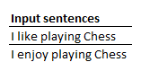

在传统的文本分析中，前面两个句子是一次性编码的，如下所示:

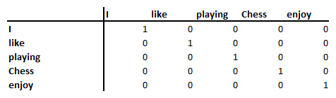

注意，两个句子中有五个独特的词。

单词的前述独热编码版本产生如下句子的编码版本:

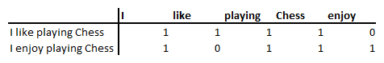

在前面的场景中，我们可以看到两个句子之间的欧几里德距离大于零，因为**像**和**享受**的编码是不同的。但是，凭直觉，我们知道享受和喜欢这两个词是非常相似的。进一步说，(**我**，**棋**)之间的距离与(**喜欢**，**享受**)相同。

请注意，假设两个句子中有五个独特的单词，我们在五维空间中表示每个单词。在一个编码版本中，我们以这样一种方式在一个较低的维度(比如说，三维)中表示一个单词，当与不相似的单词相比时，相似的单词之间的距离较小。

        

# 图像分析中编码的需求

为了理解图像分析中对编码的需求，让我们考虑对图像进行分组的场景；但是，图像的标签不存在。为了进一步说明，让我们考虑 MNIST 数据集中相同标注的以下影像:

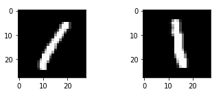

直观上，我们知道前面的两个图像对应于同一个标签。然而，当我们取前面两幅图像之间的欧几里德距离时，该距离大于零，因为不同的像素在前面两幅图像中被突出显示。

在存储图像信息时，您应该注意以下问题:

虽然图像总共包括 28×28 = 784 个像素，但是大多数列是黑色的，因此没有信息在其中组成，导致它们在存储信息时占据比所需更多的空间。

使用自编码器，我们以这样的方式在较低的维度中表示前面的两个图像，使得两个编码版本之间的距离现在小得多，同时确保编码版本不会丢失原始图像的太多信息。

        

# 推荐系统中对编码的需求

为了理解推荐系统中编码的需求，让我们考虑一下为客户推荐电影的场景。类似于文本分析，如果我们对每部电影/客户进行一次性编码，我们最终会得到每部电影的多个千维向量(因为有成千上万部电影)。根据客户的观看习惯在低得多的维度上对用户进行编码，这导致根据电影的相似性对电影进行分组，这可以帮助我们绘制用户更有可能观看的电影。

类似的概念也可以应用于电子商务推荐引擎，以及在超市向顾客推荐产品。

        

# 编码图像

图像编码可以多种方式执行。在下面的章节中，我们将对比普通自编码器、多层自编码器和卷积自编码器的性能。术语“自编码”是指以这样一种方式进行编码，即在图像中用更少的维数重新创建原始输入。

自编码器将图像作为输入，并将输入图像编码到一个较低的维度，这样我们就可以只使用输入图像的编码版本来重建原始图像。本质上，您可以认为相似图像的编码版本具有相似的编码值。

        

# 做好准备

在我们定义我们的策略之前，让我们先了解一下自编码器是如何工作的:

1.  我们将定义一个玩具数据集，它有一个包含 11 个值的向量
2.  我们将在一个较低的维度(二维)中表示这 11 个值:
    *   在降低维度的同时，尽可能多地保留输入数据中的信息
    *   低维空间中的矢量称为**嵌入** / **编码** **矢量**、**瓶颈** **特征** / **矢量**，或**压缩表示**
    *   通过对输入值执行矩阵乘法，将 11 个值转换为两个值，其中矩阵乘法的维数为 11 x 2 的随机权重矩阵
    *   较低维度的向量表示瓶颈特征。瓶颈特征是重建原始图像所需的特征
3.  我们将重构低维瓶颈特征向量以获得输出向量:
    *   二维特征向量乘以形状为 2×11 的矩阵，以获得形状为 1×11 的输出。1×2 与 2×11 向量的矩阵乘法给出了形状为 1×11 的输出。
4.  我们将计算输入向量和输出向量的平方差之和
5.  我们改变随机初始化的权重向量，以最小化输入和输出向量之间的平方差之和
6.  得到的编码矢量将是表示二维空间中的 11 维矢量的低维矢量

在利用神经网络时，您可以将编码向量视为连接输入和输出层的隐藏层。

此外，对于神经网络，输入层和输出层的值完全相同，隐藏层的维数低于输入层。

在本食谱中，我们将了解多个自编码器:

*   标准自编码器
*   多层自编码器
*   卷积自编码器

        

# 怎么做...

在接下来的章节中，我们将在 Python 中实现自编码器的多种变体(代码文件在 GitHub 中以`Auto_encoder.ipynb`的形式提供)。

        

# 标准自编码器

标准自编码器如下所示:

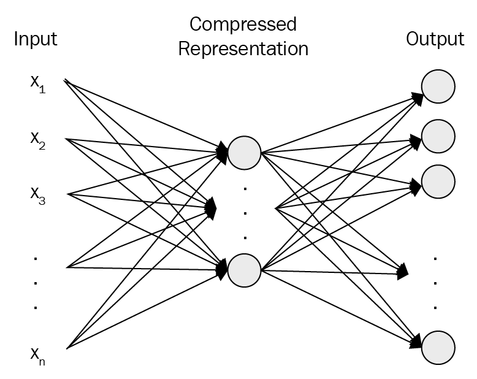

如上图所示，标准自编码器使用其网络中最少数量的隐藏层和隐藏单元来重构输入。

为了理解一个普通的自编码器是如何工作的，让我们来看看下面的方法，我们使用原始图像的低维编码版本来重建 MNIST 图像(代码文件在 GitHub 中以`Auto_encoder.ipynb`的形式提供):

1.  导入相关包:

```py
import tensorflow as tf
import keras
import numpy as np
from keras.datasets import mnist
from keras.models import Sequential
from keras.layers import Dense
from keras.layers import Dropout
from keras.layers import Flatten
from keras.layers.convolutional import Conv2D
from keras.layers.convolutional import MaxPooling2D
from keras.utils import np_utils
```

2.  导入数据集:

```py
(X_train, y_train), (X_test, y_test) = keras.datasets.mnist.load_data()
```

3.  重塑和缩放数据集:

```py
X_train = X_train.reshape(X_train.shape[0],X_train.shape[1]*X_train.shape[2])
X_test = X_test.reshape(X_test.shape[0],X_test.shape[1]*X_test.shape[2])
X_train = X_train/255
X_test = X_test/255
```

4.  构建网络架构:

```py
model = Sequential()
model.add(Dense(32, input_dim=784, activation='relu'))
model.add(Dense(784, activation='relu'))
model.summary()
```

模型总结如下:

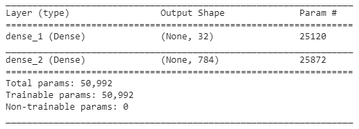

在前面的代码中，我们用 32 维编码版本表示 784 维输入。

5.  编译并拟合模型:

```py
model.compile(loss='mean_squared_error', optimizer='adam',metrics=['accuracy'])
model.fit(X_train, X_train, validation_data=(X_test, X_test),epochs=10, batch_size=1024, verbose=1)
```

注意，我们使用的是均方误差损失函数，因为像素值是连续的。此外，输入和输出数组完全相同— `X_train`。

6.  打印前四幅输入图像的重建图像:

```py
import matplotlib.pyplot as plt
%matplotlib inline
plt.subplot(221)
plt.imshow(model.predict(X_test[0,:].reshape(1,784)).reshape(28,28), cmap=plt.get_cmap('gray'))
plt.axis('off')
plt.subplot(222)
plt.imshow(model.predict(X_test[1,:].reshape(1,784)).reshape(28,28), cmap=plt.get_cmap('gray'))
plt.axis('off')
plt.subplot(223)
plt.imshow(model.predict(X_test[2,:].reshape(1,784)).reshape(28,28), cmap=plt.get_cmap('gray'))
plt.axis('off')
plt.subplot(224)
plt.imshow(model.predict(X_test[3,:].reshape(1,784)).reshape(28,28), cmap=plt.get_cmap('gray'))
plt.axis('off')
plt.show()
```

重构的 MNIST 数字如下:

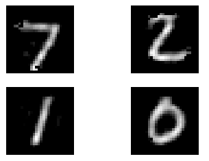

为了了解自编码器的工作情况，让我们将之前的预测与原始输入图像进行比较:

MNIST 的原始数字如下:

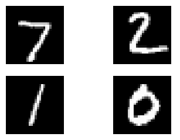

从前面的图像中，我们可以看到，与原始输入图像相比，重建图像是模糊的。

为了解决模糊的问题，让我们构建更深的多层自编码器(从而产生更多的参数)，从而更好地表现原始图像。

        

# 多层自编码器

多层自编码器如下所示，其中有更多的隐藏层将输入层连接到输出层:

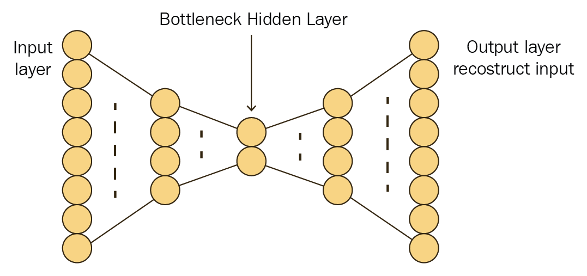

从本质上讲，多层自编码器通过网络中更多的隐藏层来重建输入。

为了构建多层自编码器，我们将重复上一节中的相同步骤，直到*步骤 3* 。然而，定义网络架构的*步骤 4* 将被修改为包括多层，如下所示:

```py
model = Sequential()
model.add(Dense(100, input_dim=784, activation='relu'))
model.add(Dense(32,activation='relu'))
model.add(Dense(100,activation='relu'))
model.add(Dense(784, activation='relu'))
model.summary()
```

模型总结如下:

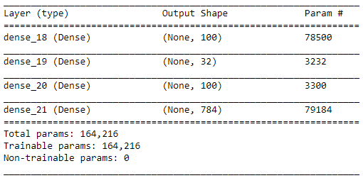

在前面的网络中，我们的第一个隐藏层有 100 个单元，第二个隐藏层(它是图像的嵌入版本)是 32 维的，第三个隐藏层的形状是 100 维的。

一旦定义了网络架构，我们就编译并运行它，如下所示:

```py
model.compile(loss='mean_squared_error', optimizer='adam')
model.fit(X_train, X_train, validation_data=(X_test, X_test),epochs=25, batch_size=1024, verbose=1)
```

上述模型的预测如下:

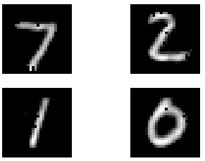

请注意，与原始图像相比，前面的预测仍然有点模糊。

        

# 卷积自编码器

到目前为止，我们已经探索了普通和多层自编码器。在本节中，我们将了解卷积自编码器如何从低维向量中重建原始图像。

卷积自编码器如下所示:

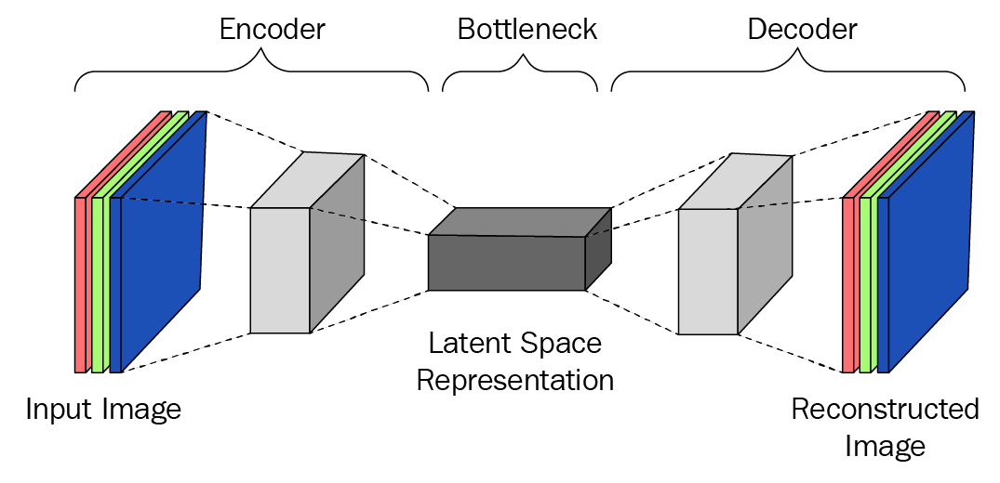

实际上，卷积自编码器通过其网络中的更多隐藏层来重建输入，其中隐藏层由卷积、汇集和上采样下采样图像组成。

与多层自编码器类似，卷积自编码器的模型架构不同于其他类型的自编码器。在下面的代码中，我们将定义卷积自编码器的模型架构，而在*步骤 3* 之前，每隔一步都与普通自编码器相似。

`X_train`和`X_test`形状的唯一区别如下:

```py
(X_train, y_train), (X_test, y_test) = keras.datasets.mnist.load_data()

X_train = X_train.reshape(X_train.shape[0],X_train.shape[1],X_train.shape[2],1)
X_test = X_test.reshape(X_test.shape[0],X_test.shape[1],X_test.shape[2],1)
X_train = X_train/255
X_test = X_test/255
```

注意，在前面的步骤中，我们对图像进行了整形，以便它可以被传递给一个`conv2D`方法:

1.  定义模型架构:

```py
model = Sequential()
model.add(Conv2D(32, (3,3), input_shape=(28, 28,1), activation='relu',padding='same',name='conv1'))
model.add(MaxPooling2D(pool_size=(2, 2),name='pool1'))
model.add(Conv2D(16, (3,3), activation='relu',padding='same',name='conv2'))
model.add(MaxPooling2D(pool_size=(2, 2),name='pool2'))
model.add(Conv2D(8, (3,3), activation='relu',padding='same',name='conv3'))
model.add(MaxPooling2D(pool_size=(2, 2),name='pool3'))
model.add(Conv2D(32, (3,3), activation='relu',padding='same',name='conv4'))
model.add(MaxPooling2D(pool_size=(2, 2),name='pool4'))
model.add(Flatten(name='flatten'))
model.add(Reshape((1,1,32)))
model.add(Conv2DTranspose(8, kernel_size = (3,3), activation='relu'))
model.add(Conv2DTranspose(16, kernel_size = (5,5), activation='relu'))
model.add(Conv2DTranspose(32, kernel_size = (8,8), activation='relu'))
model.add(Conv2DTranspose(32, kernel_size = (15,15), activation='relu'))
model.add(Conv2D(1, (3, 3), activation='relu',padding='same'))
model.summary()
```

在前面的代码中，我们定义了一个卷积架构，在该架构中，我们对输入图像进行了整形，使其在架构中间有一个 32 维嵌入式版本，最后对其进行上采样，以便我们能够对其进行重建。

该模型的摘要如下:

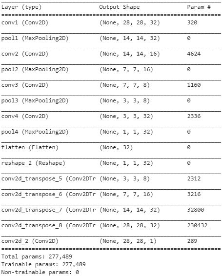

2.  编译并拟合模型

```py
from keras.optimizers import Adam
adam = Adam(lr=0.001)
model.compile(loss='mean_squared_error', optimizer='adam')
model.fit(X_train, X_train, validation_data=(X_test, X_test),epochs=10, batch_size=1024, verbose=1)
```

一旦我们对前四个测试数据点进行预测，重建的图像看起来如下:

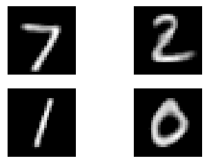

注意，现在重建比测试图像的前两次重建(使用普通和多层自编码器)稍好。

        

# 相似图像分组

在前面的部分中，我们在一个低得多的维度中表示每个图像，直觉地认为相似的图像将具有相似的嵌入，而不相似的图像将具有不同的嵌入。然而，我们还没有查看相似性度量或者详细检查嵌入。

在这一节中，我们将尝试在 2D 空间中绘制嵌入图。我们可以通过使用一种叫做 **t-SNE** 的技术将 32 维向量简化为二维空间。(更多关于 SNE 霸王龙的信息可以在这里找到:【http://www.jmlr.org/papers/v9/vandermaaten08a.html】T2。)

这样，可以证明我们的感觉，即相似的图像将具有相似的嵌入，因为相似的图像应该在二维平面中聚集在一起。

在下面的代码中，我们将表示二维平面中所有测试图像的嵌入:

1.  提取测试中 10，000 幅图像的 32 维向量:

```py
from keras.models import Model
layer_name = 'flatten'
intermediate_layer_model = Model(inputs=model.input,outputs=model.get_layer(layer_name).output)
intermediate_output = intermediate_layer_model.predict(X_test)
```

2.  执行 t-SNE 以生成二维向量:

```py
from sklearn.manifold import TSNE
tsne_model = TSNE(n_components=2, verbose=1, random_state=0)
tsne_img_label = tsne_model.fit_transform(intermediate_output)
tsne_df = pd.DataFrame(tsne_img_label, columns=['x', 'y'])
tsne_df['image_label'] = y_test
```

3.  为测试图像嵌入绘制 t-SNE 维度的可视化:

```py
from ggplot import *
chart = ggplot(tsne_df, aes(x='x', y='y', color='factor(image_label)'))+ geom_point(size=70,alpha=0.5)
chart
```

二维空间中嵌入的可视化如下:

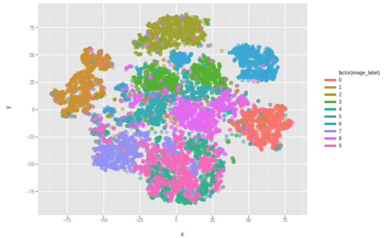

请注意，在前面的图表中，我们看到，通常情况下，对应于相同标签的图像之间会形成聚类。

        

# 推荐系统的编码

到目前为止，在前面的部分中，我们已经编码了一个图像。在这一节中，我们将对电影相关数据集中的用户和电影进行编码。这样做的原因是，在一个目录中可能有数百万用户和数千部电影。因此，我们不能马上对这些数据进行一次性编码。在这种情况下，编码很方便。推荐系统编码中最常用的技术之一是矩阵分解。在下一节中，我们将了解它是如何工作的，并为用户和电影生成嵌入。

        

# 做好准备

对用户和电影进行编码的思路如下:

如果两个用户在喜欢某些电影方面相似，则代表这两个用户的向量应该相似。以同样的方式，如果两部电影相似(潜在地，它们属于相同的类型或者具有相同的演员阵容)，它们应该具有相似的向量。

我们将采用编码电影的策略，以便根据用户观看电影的历史记录推荐一组新电影，如下所示:

1.  导入数据集，该数据集包含用户信息以及他们对所观看的不同电影的评价
2.  为用户和电影分配 id
3.  将用户和电影转换成 32 维向量
4.  使用 Keras 中的函数式 API 来执行电影和用户的 32 维向量的点积:
    *   如果有 100，000 个用户和 1，000 部电影，电影矩阵将是 1，000×32 维，用户矩阵将是 100，000×32 维
    *   两者的点积将是 100，000 x 1，000 的维数
5.  在连接到输出图层之前，展平输出并使其通过密集图层，该图层具有线性激活，输出值范围为 1 到 5
6.  符合模型
7.  提取电影的嵌入权重
8.  提取用户的嵌入权重
9.  与感兴趣的给定电影相似的电影可以通过计算感兴趣的电影与数据集中每个其他电影的成对相似性来找到

        

# 怎么做...

在下面的代码中，我们将为一个典型的推荐系统中的一个用户和一部电影提供一个向量(代码文件在 GitHub 中以`Recommender_systems.ipynb`的形式提供):

1.  导入数据集。GitHub 中的代码提供了推荐的数据集。

```py
import numpy as np
import pandas as pd
from keras.layers import Input, Embedding, Dense, Dropout, merge, Flatten, dot
from keras.models import Model
from keras.optimizers import Adam
ratings = pd.read_csv('...') # Path to the user-movie-ratings file
```

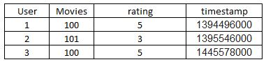

2.  将用户和电影转换成分类变量。在下面的代码中，我们创建了两个新变量——`User2`和`Movies2`——它们是分类变量:

```py
ratings['User2']=ratings['User'].astype('category')
ratings['Movies2']=ratings['Movies'].astype('category')
```

3.  为每个用户和电影分配一个唯一的 ID:

```py
users = ratings.User.unique()
movies = ratings.Movies.unique()
userid2idx = {o:i for i,o in enumerate(users)}
moviesid2idx = {o:i for i,o in enumerate(movies)}
idx2userid = {i:o for i,o in enumerate(users)}
idx2moviesid = {i:o for i,o in enumerate(movies)}
```

4.  将唯一 id 作为新列添加到我们的原始表中:

```py
ratings['Movies2'] = ratings.Movies.apply(lambda x: moviesid2idx[x])
ratings['User2'] = ratings.User.apply(lambda x: userid2idx[x])
```

5.  为每个用户 ID 和唯一 ID 定义嵌入:

```py
n_users = ratings.User.nunique()
n_movies = ratings.Movies.nunique()
```

在前面的代码中，我们提取了数据集中唯一用户和唯一电影的总数:

```py
def embedding_input(name,n_in,n_out):
  inp = Input(shape=(1,),dtype='int64',name=name)
  return inp, Embedding(n_in,n_out,input_length=1)(inp)
```

在前面的代码中，我们定义了一个函数，该函数将一个 ID 作为输入，并将其转换为一个嵌入向量，该向量的维数为`n_out`，总共有`n_in`个值:

```py
n_factors = 100
user_in, u = embedding_input('user_in', n_users, n_factors)
article_in, a = embedding_input('article_in', n_movies, n_factors)
```

在前面的代码中，我们为每个唯一的用户以及每个唯一的电影提取了 100 个维度。

6.  定义模型:

```py
x = dot([u,a], axes=1)
x=Flatten()(x)
x = Dense(500, activation='relu')(x)
x = Dense(1)(x)
model = Model([user_in,article_in],x)
adam = Adam(lr=0.01)
model.compile(adam,loss='mse')
model.summary()
```

模型总结如下:

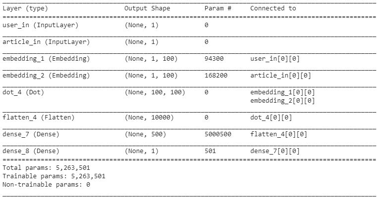

7.  符合模型:

```py
model.fit([ratings.User2,ratings.Movies2], ratings.rating, epochs=50,batch_size=128)
```

8.  提取每个用户或电影的向量:

```py
# Extracting user vectors
model.get_weights()[0]

# Extracting movie vectors
model.get_weights()[1]
```

正如我们之前认为的，相似的电影应该有相似的向量。

通常，在识别嵌入之间的相似性时，我们使用一个称为余弦相似性的度量(在下一章中有更多关于如何计算余弦相似性的信息)。

对于位于第 574 ^个位置的随机选择的电影，余弦相似度计算如下:

```py
from sklearn.metrics.pairwise import cosine_similarity
np.argmax(cosine_similarity(model.get_weights()[1][574].reshape(1,-1),model.get_weights()[1][:574].reshape(574,100)))
```

从前面的代码中，我们可以计算出与位于分类电影列的第 574 ^个位置的电影最相似的 ID。

一旦我们查看电影 ID 列表，我们应该看到与给定电影最相似的电影，确实碰巧是相似的，直观上。