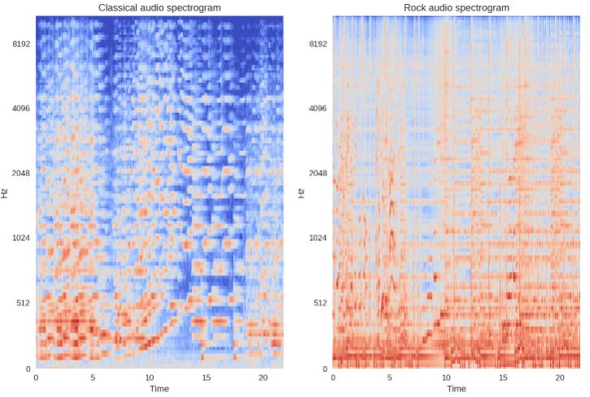
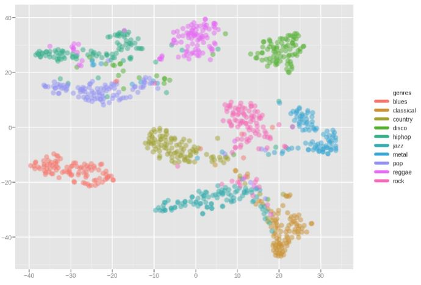
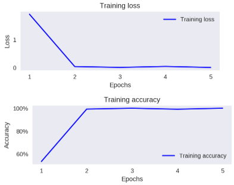
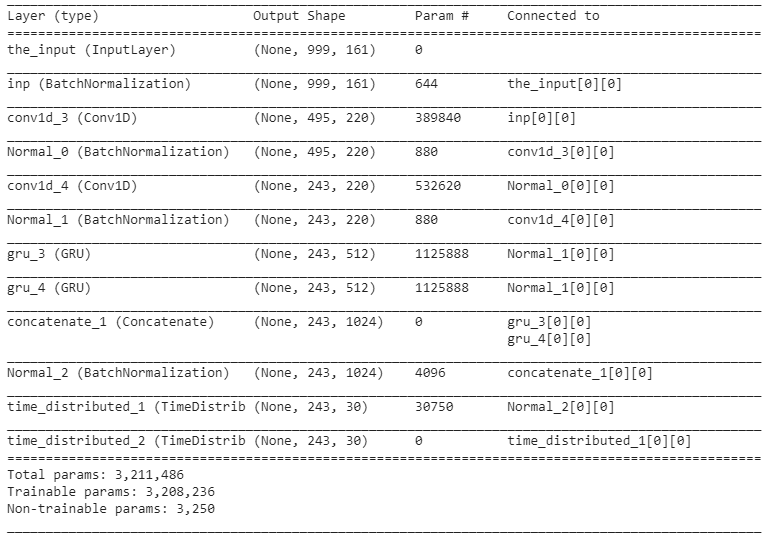

        

# 十五、音频分析

在前面的章节中，我们学习了如何处理连续的文本数据。音频也可以被认为是序列数据，其振幅随时间变化。在本章中，我们将学习以下内容:

*   按流派对歌曲进行分类
*   使用深度学习的音乐生成
*   将音频转录成文本

        

# 按流派对歌曲进行分类

在本案例研究中，我们将把一首歌曲分为 10 种可能的类型。想象一个场景，我们的任务是自动分类一首歌曲的流派，而不需要手动收听。通过这种方式，我们可以尽可能减少操作过载。

        

# 做好准备

我们将采取的策略如下:

1.  下载各种录音和它们所属的流派的数据集。
2.  可视化和对比各种类型的音频信号的频谱图。
3.  在谱图顶部执行 CNN 操作:
    *   请注意，我们将对声谱图执行 CNN 1D 操作，因为翻译的概念不适用于录音

4.  在多次卷积和汇集操作之后，从 CNN 中提取特征。
5.  展平输出并将其传递到一个密集图层，该图层在一个输出图层中有 10 个可能的类。
6.  最小化分类交叉熵以将音频记录分类到 10 个可能的类别中的一个。

一旦我们对音频进行分类，我们将绘制每个音频输入的嵌入，以便将相似的音频记录分组在一起。这样，我们将能够在不听新歌的情况下识别新歌的风格，从而自动将音频输入分类到风格中。

        

# 怎么做...

上面讨论的策略编码如下(代码文件在 GitHub 中以`Genre_classification.ipynb`的形式提供):

1.  下载数据集并导入相关包:

```py
import sys, re, numpy as np, pandas as pd, music21, IPython, pickle, librosa, librosa.dsiplay, os
from glob import glob
from tqdm import tqdm
from keras.utils import np_utils
```

2.  遍历音频文件以提取输入音频的`mel spectrogram`输入特征，并存储音频输入的输出类型:

```py
song_specs=[]
genres = []
for genre in os.listdir('...'): # Path to genres folder
  song_folder = '...' # Path to songs folder
  for song in os.listdir(song_folder):
    if song.endswith('.au'):
      signal, sr = librosa.load(os.path.join(song_folder, song), sr=16000)
      melspec = librosa.feature.melspectrogram(signal, sr=sr).T[:1280,]
      song_specs.append(melspec)
      genres.append(genre)
      print(song)
  print('Done with:', genre)
```

在前面的代码中，我们加载音频文件并提取其特征。此外，我们正在提取信号的`melspectrogram`特征。最后，我们将`mel`特性存储为输入数组，将流派存储为输出数组。

3.  可视化频谱图:

```py
plt.subplot(121)
librosa.display.specshow(librosa.power_to_db(song_specs[302].T),
 y_axis='mel',
 x_axis='time',)
plt.title('Classical audio spectrogram')
plt.subplot(122)
librosa.display.specshow(librosa.power_to_db(song_specs[402].T),
 y_axis='mel',
 x_axis='time',)
plt.title('Rock audio spectrogram')
```

以下是上述代码的输出:



你可以看到古典音频声谱图和摇滚音频声谱图之间有明显的区别。

4.  定义输入和输出数组:

```py
song_specs = np.array(song_specs)

song_specs2 = []
for i in range(len(song_specs)):
     tmp = song_specs[i]
     song_specs2.append(tmp[:900][:])
song_specs2 = np.array(song_specs2)
```

将输出类转换为独热编码版本:

```py
genre_one_hot = pd.get_dummies(genres)
```

5.  创建训练和测试数据集:

```py
x_train, x_test, y_train, y_test = train_test_split(song_specs2, np.array(genre_one_hot),test_size=0.1,random_state = 42)
```

6.  构建并编译该方法:

```py
input_shape = (1280, 128)
inputs = Input(input_shape)
x = inputs
levels = 64
for level in range(7):
     x = Conv1D(levels, 3, activation='relu')(x)
     x = BatchNormalization()(x)
     x = MaxPooling1D(pool_size=2, strides=2)(x)
     levels *= 2
     x = GlobalMaxPooling1D()(x)
for fc in range(2):
     x = Dense(256, activation='relu')(x)
     x = Dropout(0.5)(x)
labels = Dense(10, activation='softmax')(x)
```

注意，前面代码中的`Conv1D`方法的工作方式与`Conv2D`非常相似；然而在`Conv1D`里是一维滤镜，在`Conv2D`里是二维滤镜:

```py
model = Model(inputs=[inputs], outputs=[labels])
adam = keras.optimizers.Adam(lr=0.0001)
model.compile(loss='categorical_crossentropy',optimizer=adam,metrics=['accuracy'])
```

7.  符合模型:

```py
history = model.fit(x_train, y_train,batch_size=128,epochs=100,verbose=1,validation_data=(x_test, y_test))
```

从前面的代码中，我们可以看到该模型在测试数据集上的分类准确率约为 60%。

8.  从模型的预最终层提取输出:

```py
from keras.models import Model
layer_name = 'dense_14'
intermediate_layer_model = Model(inputs=model.input,outputs=model.get_layer(layer_name).output)
intermediate_output = intermediate_layer_model.predict(song_specs2)
```

前面的代码在预最终层产生输出。

9.  使用`t-SNE`将嵌入的维度减少到 2，这样我们现在可以在图表上绘制我们的工作:

```py
from sklearn.manifold import TSNE
tsne_model = TSNE(n_components=2, verbose=1, random_state=0)
tsne_img_label = tsne_model.fit_transform(intermediate_output)
tsne_df = pd.DataFrame(tsne_img_label, columns=['x', 'y'])
tsne_df['image_label'] = genres
```

10.  绘制`t-SNE`输出:

```py
from ggplot import *
chart = ggplot(tsne_df, aes(x='x', y='y', color='genres'))+ geom_point(size=70,alpha=0.5)
chart
```

以下是上述代码的图表:



从上图中，我们可以看到相似风格的录音放在一起。这样，我们现在可以自动地将一首新歌分类到一个可能的流派中，而不需要人工检查。然而，如果一个音频属于某个类型的概率不是很高，它将潜在地进行人工审查，因此错误分类是不常见的。

        

# 使用深度学习生成音乐

在上一章中，我们学习了如何通过阅读小说来生成文本。在本节中，我们将学习如何从一系列音频音符中生成音频。

        

# 做好准备

MIDI 文件通常包含有关音频文件的音符和和弦的信息，而音符对象包含有关音符的音高、八度音程和偏移的信息。和弦对象包含一组同时播放的音符。

我们将采用以下策略来构建音乐生成器:

*   提取音频文件中的笔记
*   为每个便笺分配一个唯一的 ID。
*   取 100 个历史音符的序列，第 101 个^个音符为输出。
*   符合 LSTM 模型。

        

# 怎么做...

上面讨论的策略编码如下(代码文件在 GitHub 中作为`Music_generation.ipynb`提供)以及推荐的音频文件:

1.  导入相关的包和数据集:

```py
!pip install mido music21
import mido, glob, os
from mido import MidiFile, MidiTrack, Message
import numpy as np
from music21 import converter, instrument, note, chord
from keras.utils import np_utils
from keras.layers import Input, LSTM, Dropout, Dense, Activation
from keras.models import Model

fname = '/content/nintendo.mid'
```

2.  读取文件的内容:

```py
midi = converter.parse(fname)
```

前面的代码读取一串分数。

3.  定义一个函数来读取乐谱流并从中提取音符(如果音频文件中有静音，还会有静音):

```py
def parse_with_silence(midi=midi):
     notes = []
     notes_to_parse = None
     parts = instrument.partitionByInstrument(midi)
     if parts: # file has instrument parts
         notes_to_parse = parts.parts[0].recurse()
     else: # file has notes in a flat structure
         notes_to_parse = midi.flat.notes
     for ix, element in enumerate(notes_to_parse):
         if isinstance(element, note.Note):
             _note = str(element.pitch)
             notes.append(_note)
         elif isinstance(element, chord.Chord):
             _note = '.'.join(str(n) for n in element.normalOrder)
             notes.append(_note)
         elif isinstance(element, note.Rest):
             _note = '#'+str(element.seconds)
             notes.append(_note)
     return notes
```

在前面的代码中，我们通过遍历元素来获取音符，根据元素是音符、和弦还是休止符(表示无声)，我们提取相应的音符，附加它们，并返回附加列表。

4.  从输入音频文件的流中提取音符:

```py
notes = parse_with_silence()
```

示例注释输出如下:


请注意，以`#`开头的值表示静音(持续时间与`#`旁边的数字相同)。

5.  通过创建注释 ID 及其相应名称的字典来创建输入和输出数据集:

```py
# get all unique values in notes
pitchnames = sorted(set(item for item in notes))
# create a dictionary to map pitches to integers
note_to_int = dict((note, number) for number, note in enumerate(pitchnames))
network_input = []
network_output = []
```

```py
sequence_length = 100
for i in range(0, len(notes) - sequence_length, 1):
     sequence_in = notes[i:i + sequence_length]
     sequence_out = notes[i + sequence_length]
     network_input.append([note_to_int[char] for char in sequence_in])
     network_output.append(note_to_int[sequence_out])
```

在前面的步骤中，我们将一系列 100 个音符作为输入，并在第 101 个时间步提取输出。

此外，我们还将注释转换为其相应的 ID:

```py
n_patterns = len(network_input)
# reshape the input into a format compatible with LSTM layers
network_input = np.reshape(network_input, (n_patterns, sequence_length, 1))
# normalize input
network_input = network_input / np.max(network_input)
network_output = np_utils.to_categorical(network_output)

N = 9 * len(network_input)//10
print(network_input.shape, network_output.shape)
# (36501, 100, 1) (36501, 50)
```

在前面的代码中，我们正在对输入数据进行整形，以便将其输入到 LSTM 图层中(这需要`batch_size`形状、时间步长和每个时间步长的要素数量)。

此外，我们正在对输入进行规范化，并且我们还将输出转换为一组一次性编码的向量。

6.  符合模型:

```py
model.fit(network_input, network_output, epochs=100, batch_size=32, verbose = 1)
```

以下是上述代码的输出:



7.  生成预测:

```py
from tqdm import trange
print('generating prediction stream...')
start = np.random.randint(0, len(network_input)-1)
int_to_note = dict((number, note) for number, note in enumerate(pitchnames))
pattern = network_input[start].tolist()
prediction_output = []
```

请注意，在前面的代码中，我们选择了一个随机的音频位置，从这里我们将对一个序列进行采样，该序列将用作未来时间步长中预测的种子。

8.  通过每次获取 100 个音符的序列来生成预测，生成下一个预测，将其附加到输入序列，然后生成下一个预测(通过获取最后 100 个音符的最新序列):

```py
for note_index in trange(500):
     prediction_input = np.reshape(pattern, (1, len(pattern), 1))
     prediction = model.predict(prediction_input, verbose=0)
     index = np.argmax(prediction)
     result = int_to_note[index]
     prediction_output.append(result)
     pattern.append([index/49])
     pattern = pattern[1:len(pattern)]
```

请注意，我们将指数(模型的预测输出)除以 49，就像我们在构建模型时在同一练习中所做的那样(除以`np.max(network_input)`)。

前面的练习与文本生成练习略有不同，在文本生成练习中，我们在输入单词 id 的顶部执行嵌入，因为在这个场景中我们不执行嵌入。该模型在没有嵌入的情况下仍然可以工作，这可能是因为输入中的唯一值较少。

9.  基于模型生成的值创建注释值:

```py
offset = 0
output_notes = []

# create note and chord objects based on the values generated by the model
print('creating notes and chords')
for pattern in prediction_output:

    # pattern is a chord
    if (('.' in pattern) or pattern.isdigit()) and pattern[0]!='#':
        notes_in_chord = pattern.split('.')
        notes = []
        for current_note in notes_in_chord:
            new_note = note.Note(int(current_note))
            new_note.storedInstrument = instrument.Piano()
            notes.append(new_note)
        new_chord = chord.Chord(notes)
        new_chord.offset = offset
        output_notes.append(new_chord)

    # pattern is a note
    elif pattern[0]!='#':
        new_note = note.Note(pattern)
        new_note.offset = offset
        new_note.storedInstrument = instrument.Piano()
        output_notes.append(new_note)

    # pattern is silence
    else:
        new_note = note.Rest()
        new_note.offset = offset
        new_note.storedInstrument = instrument.Piano()
        new_note.quarterLength = float(pattern[1:])
        output_notes.append(new_note)
    # increase offset each iteration so that notes do not stack
    offset += 0.5
```

请注意，在前面的代码中，我们将每个音符偏移 0.5 秒，以便在产生输出时音符不会堆叠在一起。

10.  将生成的预测写入音乐流:

```py
from music21 import stream
midi_stream = stream.Stream(output_notes)
midi_stream.write('midi', fp='OP.mid')
```

现在，你应该能够听到由你的模型产生的音乐。

        

# 将音频转录成文本

在[第 14 章](1f989cf7-40b3-4ecd-9457-0dd648746922.xhtml)、*端到端学习*中，我们学习了如何将手写文本图像转录成文本。在本节中，我们将利用类似的端到端模型将语音转录成文本。

        

# 做好准备

我们将采用的转录声音的策略如下:

*   下载一个数据集，其中包含音频文件及其相应的转录(*地面真相*)
*   读取音频文件时指定采样率:
    *   如果采样率为 16，000，我们将每秒提取 16，000 个数据点的音频。

*   提取音频阵列的快速傅立叶变换:
    *   FFT 确保我们只拥有信号中最重要的特征。
    *   默认情况下，FFT 为我们提供了 *n/2* 个数据点，其中 *n* 是整个录音中的数据点数。
*   采样音频的 FFT 特征，我们一次提取 320 个数据点；也就是说，我们一次提取 20 毫秒(320/16000 = 1/50 秒)的音频数据
*   此外，我们将以 10 毫秒的间隔对 20 毫秒的数据进行采样。
*   在这个练习中，我们将学习一段录音，这段录音的时长最多为 10 秒钟
*   我们将把 20 毫秒的音频数据存储到一个数组中:
    *   我们已经看到，每 10 毫秒采样 20 毫秒的数据。
    *   因此，对于一个一秒钟的音频剪辑，我们将有 100 x 320 个数据点，而对于一个 10 秒钟的音频剪辑，我们将有 1，000 x 320 = 320，000 个数据点。
*   我们将初始化一个包含 160，000 个数据点的空数组，并用 FFT 值覆盖这些值，因为我们已经知道 FFT 值是原始数据点数的一半
*   对于 1，000 x 320 个数据点的每个数组，我们将存储相应的转录
*   我们将为每个字符分配一个索引，然后将输出转换成一个索引列表
*   此外，我们还将存储输入长度(这是预定义的时间步长数)和标签长度(这是输出中出现的实际字符数)
*   此外，我们将定义基于实际输出、预测输出、时间步长数(输入长度)和标签长度(输出中的字符数)的 CTC 损失函数
*   我们将定义一个结合了`conv1D`(因为这是音频数据)和 GRU 的模型
*   此外，我们将确保使用批量标准化来标准化数据，以便梯度不会消失
*   我们将对成批数据运行模型，我们随机抽样成批数据，并将它们提供给试图最小化 CTC 损失的模型
*   最后，我们将使用`ctc_decode`方法对新数据点的模型预测进行解码

        

# 怎么做...

上面讨论的策略编码如下(代码文件在 GitHub 中以`Voice transcription.ipynb`的形式提供):

1.  下载数据集并导入相关包:

```py
$wget http://www.openslr.org/resources/12/train-clean-100.tar.gz
$tar xzvf train-clean-100.tar.gz

import librosa
import numpy as np
import pandas as pd
```

2.  读取所有文件名及其相应的转写，并将它们放入单独的列表中:

```py
import os, numpy as np
org_path = '/content/LibriSpeech/train-clean-100/'
count = 0
inp = []
k=0
audio_name = []
audio_trans = []
for dir1 in os.listdir(org_path):
     dir2_path = org_path+dir1+'/'
     for dir2 in os.listdir(dir2_path):
     dir3_path = dir2_path+dir2+'/'

     for audio in os.listdir(dir3_path):
         if audio.endswith('.txt'):
             k+=1
             file_path = dir3_path + audio
             with open(file_path) as f:
                 line = f.readlines()
                 for lines in line:
                     audio_name.append(dir3_path+lines.split()[0]+'.flac')
                     words2 = lines.split()[1:]
                     words4=' '.join(words2)
                     audio_trans.append(words4)
```

3.  将转录的长度存储到一个列表中，以便我们可以了解最大转录长度:

```py
import re
len_audio_name=[]
for i in range(len(audio_name)):
     tmp = audio_trans[i]
     len_audio_name.append(len(tmp))
```

4.  在本练习中，为了能够在单个 GPU 上训练模型，我们将对转录长度少于 100 个字符的前 2，000 个音频文件执行本练习:

```py
final_audio_name = []
final_audio_trans = []
for i in range(len(audio_name)):
     if(len_audio_name[i]<100):
         final_audio_name.append(audio_name[i])
         final_audio_trans.append(audio_trans[i])
```

在前面的代码中，我们只为那些转录长度少于 100 个字符的录音存储音频名称和相应的音频转录。

5.  将输入存储为 2D 数组，仅存储持续时间少于 10 秒的音频文件的相应输出:

```py
inp = []
inp2 = []
op = []
op2 = []
for j in range(len(final_audio_name)):
     t = librosa.core.load(final_audio_name[j],sr=16000, mono= True) 
     if(t[0].shape[0]<160000):
         t = np.fft.rfft(t[0])
         t2 = np.zeros(160000)
         t2[:len(t)] = t
         inp = []
         for i in range(t2.shape[0]//160):
             inp.append(t2[(i*160):((i*160)+320)])
             inp2.append(inp)
             op2.append(final_audio_trans[j])
```

6.  为数据中的每个唯一字符创建索引:

```py
import itertools
list2d = op2
charList = list(set(list(itertools.chain(*list2d))))
```

7.  创建输入和标签长度:

```py
num_audio = len(op2)
y2 = []
input_lengths = np.ones((num_audio,1))*243
label_lengths = np.zeros((num_audio,1))
for i in range(num_audio):
     val = list(map(lambda x: charList.index(x), op2[i]))
     while len(val)<243:
         val.append(29)
     y2.append(val)
     label_lengths[i] = len(op2[i])
     input_lengths[i] = 243
```

请注意，我们创建的输入长度是 243，因为模型的输出(我们将在后面的步骤中构建)有 243 个时间步长。

8.  定义 CTC 损失函数:

```py
import keras.backend as K
def ctc_loss(args):
    y_pred, labels, input_length, label_length = args
    return K.ctc_batch_cost(labels, y_pred, input_length, label_length
```

9.  定义模型:

```py
input_data = Input(name='the_input', shape = (999,161), dtype='float32')
inp = BatchNormalization(name="inp")(input_data)
conv= Conv1D(filters=220, kernel_size = 11,strides = 2, padding='valid',activation='relu')(inp)
conv = BatchNormalization(name="Normal0")(conv)
conv1= Conv1D(filters=220, kernel_size = 11,strides = 2, padding='valid',activation='relu')(conv)
conv1 = BatchNormalization(name="Normal1")(conv1)
gru_3 = GRU(512, return_sequences = True, name = 'gru_3')(conv1)
gru_4 = GRU(512, return_sequences = True, go_backwards = True, name = 'gru_4')(conv1)
merged = concatenate([gru_3, gru_4])
normalized = BatchNormalization(name="Normal")(merged)
dense = TimeDistributed(Dense(30))(normalized)
y_pred = TimeDistributed(Activation('softmax', name='softmax'))(dense)
Model(inputs = input_data, outputs = y_pred).summary()
```

10.  定义 CTC 损失函数的输入和输出参数:

```py
from keras.optimizers import Adam
Optimizer = Adam(lr = 0.001)
labels = Input(name = 'the_labels', shape=[243], dtype='float32')
input_length = Input(name='input_length', shape=[1],dtype='int64')
label_length = Input(name='label_length',shape=[1],dtype='int64')
output = Lambda(ctc_loss, output_shape=(1,),name='ctc')([y_pred, labels, input_length, label_length])
```

11.  构建和编译模型:

```py
model = Model(inputs = [input_data, labels, input_length, label_length], outputs= output)
model.compile(loss={'ctc': lambda y_true, y_pred: y_pred}, optimizer = Optimizer, metrics = ['accuracy'])
```

该模型的摘要如下:



12.  根据从输入中采样的批量数据拟合模型:

```py
for i in range(2500):
     samp=random.sample(range(x2.shape[0]-25),32)
     batch_input=[inp2[i] for i in samp]
     batch_input = np.array(batch_input)
     batch_input = batch_input/np.max(batch_input)
     batch_output = [y2[i] for i in samp]
     batch_output = np.array(batch_output)
     input_lengths2 = [input_lengths[i] for i in samp]
     label_lengths2 = [label_lengths[i] for i in samp]
     input_lengths2 = np.array(input_lengths2)
     label_lengths2 = np.array(label_lengths2)
     inputs = {'the_input': batch_input,
             'the_labels': batch_output,
             'input_length': input_lengths2,
             'label_length': label_lengths2}
     outputs = {'ctc': np.zeros([32])} 
     model.fit(inputs, outputs,batch_size = 32, epochs=1, verbose =1)
```

在前面的代码中，我们遍历并提取了 2500 次批量数据，对输入数据进行了规范化，并拟合了模型。

此外，我们正在执行大量的历元，因为对于这个特定的数据集和模型组合，CTC 损失缓慢减少。

13.  预测测试音频:

```py
model2 = Model(inputs = input_data, outputs = y_pred)

k=-12
pred= model2.predict(np.array(inp2[k]).reshape(1,999,161)/100)
```

在前面的代码中，我们指定了一个模型(`model2`)，它接受输入测试数组，并在 243 个时间步长的每一个中提取模型预测。

此外，我们从最后一个输入数组中提取第 12 个^(元素的预测(注意，我们在训练模型时已经排除了最后 25 个输入数据点)。此外，我们还以与之前相同的方式对其进行了预处理，即将输入数据传递给模型训练流程。)

14.  对新数据点的预测进行解码:

```py
def decoder(pred):
     pred_ints = (K.eval(K.ctc_decode(pred,[243])[0][0])).flatten().tolist()
     out = ""
     for i in range(len(pred_ints)):
         if pred_ints[i]<28:
         out = out+charList[pred_ints[i]]
     print(out)
```

在前面的代码中，我们使用`ctc_decode`方法解码预测。或者，我们可以用与我们在手写图像转录中提取预测相同的方式解码预测。最后，我们打印出预测。

我们将能够通过调用之前定义的函数来解码预测:

```py
decoder(pred)
```

其中一个预测的输出如下:


虽然前面的输出看起来像是胡言乱语，但听起来在语音上与实际的音频相似，如下所示:


        

# 还有更多...

我们可以进一步提高转录准确性的一些方法如下:

*   在更多数据点上训练
*   合并语言模型以对输出执行模糊匹配，以便我们校正预测的输出