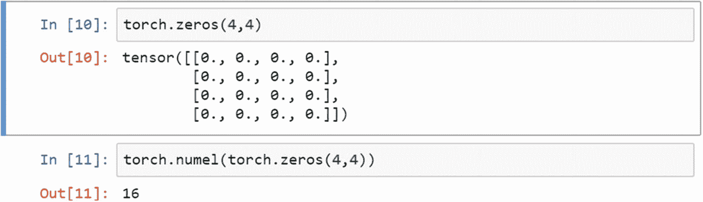
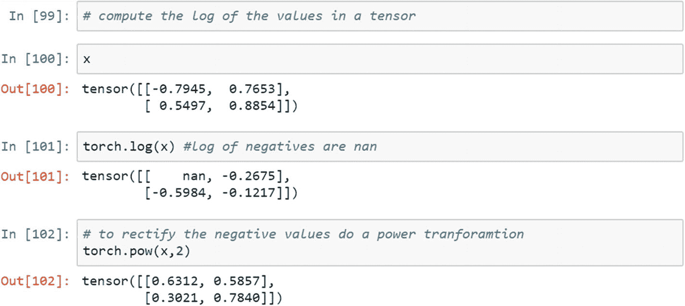

# 1.PyTorch、张量和张量运算简介

PyTorch 已经发展成为编写动态模型的更大的框架。正因为如此，它在部署大规模深度学习框架的数据科学家和数据工程师中非常受欢迎。这本书为专家在处理实际数据科学问题时的活动提供了一个结构。从我们日常生活中使用的应用程序中可以明显看出，产品功能中嵌入了多层智能。这些特征能够为用户提供更好的体验和更好的服务。

世界正在走向人工智能。它主要有两个组成部分:深度学习和机器学习。没有深度学习和机器学习，就无法实现人工智能的可视化。

PyTorch 是最优化的高性能张量库，用于在 GPU(图形处理单元)和 CPU(中央处理单元)上计算深度学习任务。PyTorch 的主要目的是增强大规模计算环境中算法的性能。PyTorch 是一个基于 Python 和 Torch 工具的库，由脸书的人工智能研究小组提供，它执行科学计算。

GPU 上基于 NumPy 的操作不足以高效处理繁重的计算。静态深度学习库是为计算和速度带来灵活性的瓶颈。从从业者的角度来看，PyTorch 张量非常类似于基于 Python 的 NumPy 库的 N 维数组。PyTorch 库提供了桥接选项，用于将 NumPy 数组移动到张量数组，反之亦然，以便使库能够灵活地跨不同的计算环境。

它最常用的用例包括自然语言处理、图像处理、计算机视觉、社交媒体数据分析和传感器数据处理。尽管 PyTorch 提供了大量用于计算的库和模块，但有三个模块非常突出。

*   *亲笔签名*。该模块提供张量自动微分的功能。程序中的记录器类会记住这些操作，并使用一个名为*向后*的触发器来检索这些操作，以计算梯度。这对神经网络模型的实现非常有帮助。

*   *Optim* 。该模块提供优化技术，可用于最小化特定模型的误差函数。目前，PyTorch 支持各种高级优化方法，包括 Adam、随机梯度下降(SGD)等。

*   *NN* 。NN 代表*神经网络*模型。使用完整的张量运算手动定义函数、层和进一步的计算非常难以记忆和执行。我们需要自动化层、激活函数、损失函数和优化函数的函数，并提供由用户定义的层，以便可以减少手动干预。NN 模块有一组内置函数，可以自动执行张量运算的手动过程。

人工智能应用的行业包括银行、金融服务、保险、医疗保健、制造、零售、临床试验和药物测试。人工智能包括对对象进行分类，识别对象以检测欺诈，等等。每个学习系统都需要三样东西:输入数据、处理和输出层。图 [1-1](#Fig1) 说明了这三个题目之间的关系。如果任何学习系统的性能随着时间的推移通过学习新的例子或数据而提高，它就被称为*机器学习系统*。当一个机器学习系统变得太难反映现实时，它需要一个深度学习系统。

在深度学习系统中，部署了不止一层的学习算法。在机器学习中，我们会想到监督、非监督、半监督和强化学习系统。有监督的机器学习算法是一种用类别或结果标记数据的算法。我们向机器显示带有相应标记或标签的输入数据。机器识别与函数的关系。请注意，该函数将输入连接到标签或标记。

在无监督学习中，我们只向机器显示输入数据，并要求机器根据关联、相似性或不相似性等对输入进行分组。

在半监督学习中，我们显示机器输入特征和标记的数据或标签；然而，我们要求机器预测未标记的结果或标签。

在强化学习中，我们引入了奖惩机制，每一个正确的行为都会得到奖励，每一个错误的行为都会受到惩罚。

在所有这些机器学习算法的例子中，我们假设数据集很小，因为获得大量标记数据是一个挑战，机器学习算法需要花费大量时间来处理大规模矩阵计算。由于机器学习算法对于海量数据集是不可扩展的，所以我们需要深度学习算法。

图 [1-1](#Fig1) 显示了人工智能、机器学习和深度学习之间的关系。自然语言是人工智能的重要组成部分。我们需要开发能够理解自然语言并向智能体提供响应的系统。我们举个机器翻译的例子，语言 1(法语)的一句话可以转换成语言 2(英语)，反之亦然。为了开发这样一个系统，我们需要收集大量的英法双语句子。语料库的需求非常大，因为模型需要涵盖所有语言的细微差别。


图 1-1

ML、DL 和 AI 之间的关系

在预处理和要素创建之后，您可以观察到成千上万个需要计算以生成输出的要素。如果我们训练一个机器学习监督模型，需要几个月的时间来运行和产生输出。为了在这项任务中实现可扩展性，我们需要深度学习算法，如递归神经网络。这就是人工智能如何连接到深度学习和机器学习。

部署深度学习模型存在各种挑战，需要大量的标记数据、更快的计算机器和智能算法。任何深度学习系统的成功都需要良好的标记数据和更好的计算机器，因为智能算法已经可用。

以下是需要深度学习实现的各种用例:

*   语音识别

*   视频分析

*   视频异常检测

*   自然语言处理

*   机器翻译

*   语音到文本转换

用于处理大规模数据的 NVIDIA GPU 计算的开发是另一项突破性的创新。需要在 GPU 环境中运行的编程语言需要不同的编程框架。实现图形计算的两个主要框架非常流行:TensorFlow 和 PyTorch。在本书中，我们将 PyTorch 作为实现数据科学算法和进行推理的框架进行讨论。

图形计算的主要框架包括 PyTorch、TensorFlow 和 MXNet。PyTorch 和 TensorFlow 在神经计算方面相互竞争。TensorFlow 和 PyTorch 在性能上同样出色；然而，真正的差异只有在我们对特定任务进行基准测试时才知道。从概念上来说有一些不同。

*   在 TensorFlow 中，我们必须定义张量，初始化会话，并为张量对象保留占位符；然而，我们不必在 PyTorch 中执行这些操作。

*   在 TensorFlow 中，我们以情感分析为例。输入的句子被加上肯定或否定的标签。如果输入句子的长度不相等，那么我们设置最大句子长度并加零，使其他句子的长度相等，这样递归神经网络才能发挥作用；然而，这是 PyTorch 的内置功能，因此我们不必定义句子的长度。

*   在 PyTorch 中，调试要容易和简单得多，但在 TensorFlow 中却是一项艰巨的任务。

*   在数据可视化方面，TensorFlow 中的模型部署肯定更好；然而，PyTorch 正在不断发展，我们期望在未来最终看到相同的功能。

TensorFlow 肯定是经历了很多变化才达到稳定状态的。PyTorch 刚刚进入游戏，所以要实现这个工具的全部潜力还需要一段时间。

## PyTorch 是什么？

PyTorch 是脸书人工智能部门开发的机器学习和深度学习工具，用于处理大规模图像分析，包括对象检测、分割和分类。然而，它不限于这些任务。它可以与其他框架一起使用来实现复杂的算法。它是用 Python 和 C++语言编写的。为了在 GPU 环境中处理大规模计算，编程语言应该相应地修改。PyTorch 提供了一个很好的框架来编写在 GPU 环境中自动运行的函数。

## PyTorch 安装

安装 PyTorch 非常简单。在 Windows、Linux 或 macOS 中，如果您熟悉用于管理包的 Anaconda 和 conda 环境，安装起来会非常简单。以下步骤描述了如何在 Windows/macOS/Linux 环境中安装 PyTorch。

1.  Open the Anaconda navigator and go to the environment page, as displayed in the screenshot shown in Figure [1-2](#Fig2).

    

    图 1-2

    ML、DL 和 AI 之间的关系

2.  打开终端和终端，并键入以下内容:

    ```py
    conda install -c peterjc123 pytorch

    ```

3.  启动 Jupyter，打开 IPython 笔记本。

4.  键入以下命令检查 PyTorch 是否已安装。

1.  检查 PyTorch 的版本。

```py
from __future__ import print_function
import torch

```


此安装过程是使用 Microsoft Windows 机器完成的。该过程可能因操作系统而异，因此请使用以下 URL 来解决有关安装和错误的任何问题。

有两种安装方法:Conda (Anaconda)库管理或 Pip3 包管理框架。此外，本地系统(如 macOS、Windows 或 Linux)和云机器(如微软 Azure、AWS 和 GCP)的安装是不同的。要根据您的平台进行设置，请遵循位于 [`https://PyTorch.org/get-started/cloud-partners/`](https://pytorch.org/get-started/cloud-partners/) 的 PyTorch 官方安装文档。

PyTorch 有各种组件。

*   Torch 具有类似于 NumPy 的功能，并有 GPU 支持。

*   Autograd 提供了实现任意标量值函数的自动微分的类、方法和函数。它只需要对现有代码进行最小的更改。你只需要声明`class:'Tensor's`，用`requires_grad=True`关键字计算渐变。

*   NN 是 PyTorch 中的神经网络库。

*   Optim 提供了用于函数最小化和最大化的优化算法。

*   多重处理对于多个张量之间的内存共享是一个有用的库。

*   Utils 有加载数据的实用函数；它还有其他功能。

现在我们准备继续这一章。

## 配方 1-1。使用张量

### 问题

PyTorch 中使用的数据结构是基于图形和张量的，因此，理解基本操作和定义张量是很重要的。

### 解决办法

这个问题的解决方法是练习张量及其运算，其中包括许多使用各种运算的例子。尽管假设用户熟悉 PyTorch 和 Python 基础，但重温 PyTorch 对于激发新用户的兴趣是必不可少的。

### 它是如何工作的

下面我们来看看张量和张量运算基础的例子，包括数学运算。

`x`对象是一个列表。我们可以使用下面的语法来检查 Python 中的对象是否是张量对象。通常，`is_tensor`函数检查对象是否被存储为张量对象，而`is_storage`函数检查对象是否被存储为张量对象。


现在，让我们创建一个包含来自 Torch 的随机数的对象，类似于 NumPy 库。我们可以检查张量和存储类型。


`y`对象是张量；但是，它不会被存储。要检查输入张量对象中的元素总数，可以使用数值元素函数。以下脚本是在 2D 张量中创建零值并对其中的数字元素进行计数的另一个示例。



像 NumPy 操作一样，eye 函数创建一个对角矩阵，其中对角元素为 1，非对角元素为 0。可以通过提供形状选项来操纵眼睛功能。下面的示例显示了如何提供 shape 参数。


线性空间和线性空间之间的点可以使用张量运算来创建。让我们用一个例子，在一个线性空间中创建 25 个点，从值 2 开始，以 10 结束。Torch 可以从 NumPy 数组格式中读取。


像线性间距一样，可以创建对数间距。


随机数生成是数据科学中的一个常见过程，用于生成或收集空间中的样本数据点，以模拟数据中的结构。随机数可以从统计分布、任意两个值或预定义的分布中生成。像 NumPy 函数一样，可以使用下面的示例生成随机数。均匀分布被定义为每个结果发生的概率相等的分布；因此，事件概率是常数。


以下脚本显示了如何从两个值 0 和 1 中选择随机数。结果张量可以被整形以创建(4，5)矩阵。算术平均值为 0、标准差为 1 的正态分布随机数也可以创建，如下所示。


要使用随机排列从一系列值中选择随机值，需要首先定义范围。这个范围可以通过使用排列功能来创建。使用排列函数时，必须定义步长，将所有值放在一个相等的距离空间中。默认情况下，步长为 1。


要找到 1D 张量的最小值和最大值，可以使用 argmin 和 argmax。如果输入是一个矩阵，则需要提到维度，以便沿着行或列搜索最小值。


如果它是一行或一列，它就是一个一维，被称为 *1D 张量*。如果输入是一个矩阵，其中存在行和列，它被称为 *2D 张量*。如果它是二维以上的，它被称为一个*多维张量*。


现在，让我们创建一个样本 2D 张量，并通过对张量使用 concat 操作来执行索引和连接。


样本`x`张量也可以在 3D 中使用。同样，创建三维张量有两种不同的选择；第三维可以扩展到行或列。


一个张量可以被分割成多个块。这些小块可以沿着 dim 行和 dim 列创建。以下示例显示了大小为(4，4)的样本张量。使用函数中的第三个参数(0 或 1)创建块。


gather 函数从一个张量中收集元素，并使用索引参数将其放入另一个张量中。索引位置由 PyTorch 中的 LongTensor 函数决定。


LongTensor 函数或索引选择函数可用于从张量中获取相关值。以下示例代码显示了两个选项:沿行选择和沿列选择。如果第二个参数为 0，则用于行。如果它是 1，那么它沿着列。


检查张量中的非零值是一种常见的做法，目的是识别大张量中的非零元素。


将输入张量重构为更小的张量不仅加快了计算过程，而且有助于分布式计算。split 函数将一个长张量拆分成更小的张量。


现在，让我们看看在给定计算难度的情况下如何调整输入张量大小的示例。转置函数主要用于改变张量的形状。转置函数有两种写法:`.t`和`.transpose`。


unbind 函数从张量中删除一个维度。若要移除维度行，需要传递 0 值。若要移除列，需要传递 1 值。


数学函数是 PyTorch 中实现任何算法的支柱；因此，需要通过函数来帮助执行基于算术的运算。标量是单个值，张量 1D 是一行，就像 NumPy 一样。1D 张量的标量乘法和加法是使用 add 和 mul 函数完成的。


以下脚本显示了标量与张量的加法和乘法。


使用下面的示例脚本可以完成组合数学运算，例如将线性方程表示为张量运算。这里，我们将结果`y`对象表示为 beta 值乘以独立`x`对象，再加上常数项的线性组合。


输出=常数+(β*独立)


像 NumPy 运算一样，张量值必须通过使用 ceiling 或 flooring 函数来取整，这是使用以下语法完成的。


使用最小和最大自变量以及箝位函数，可以将任何张量的值限制在某个范围内。同一个函数可以将最小值和最大值并行应用于任何张量，无论是 1D 还是 2D；1D 是更简单的版本。以下示例显示了 2D 场景中的实现。


我们如何得到张量的指数？如果张量有小数位，并且定义为浮点数据类型，我们如何得到它的小数部分？


以下语法解释了张量中的对数值。带有负号的值被转换为 nan。幂函数计算张量中任何值的指数。



要计算变换函数(即 sigmoid、双曲正切、径向基函数等，它们是深度学习中最常用的传递函数)，必须构建张量。以下示例脚本显示了如何创建 sigmoid 函数并将其应用于张量。


## 结论

本章是对之前有 PyTorch 和 Python 经验的人的复习。对于不熟悉 PyTorch 框架的人来说，这是一个基本的构建块。在开始高级主题之前，熟悉术语和基本语法很重要。下一章是关于使用 PyTorch 实现概率模型，包括随机变量的创建，统计分布的应用，以及进行统计推断。