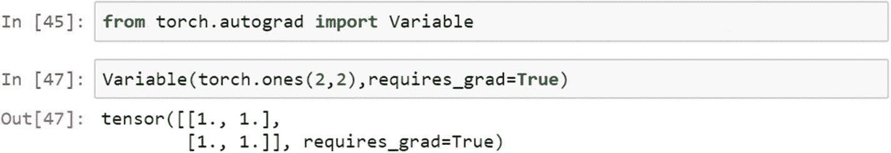
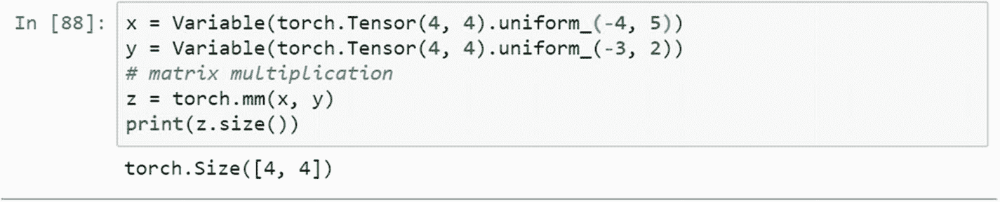
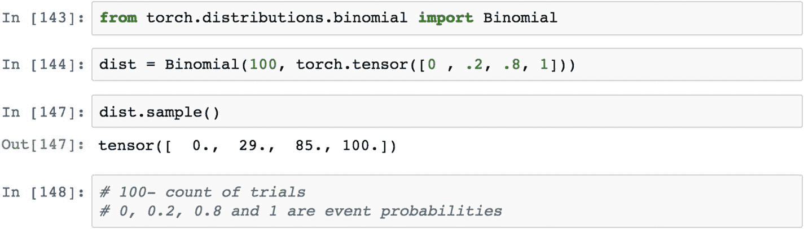

# 2.使用 PyTorch 的概率分布

在 PyTorch 这样的图形计算平台中，概率和随机变量是计算不可或缺的一部分。理解概率和相关概念是必不可少的。本章包括概率分布和使用 PyTorch 的实现，以及解释测试结果。

在概率统计中，随机变量也被称为*随机变量*，其结果取决于纯粹的随机现象，或随机现象。有不同类型的概率分布，包括正态分布、二项式分布、多项式分布和伯努利分布。每个统计分布都有自己的特性。

torch.distributions 模块包含概率分布和采样函数。在计算图中，每种分布类型都有自己的重要性。分布模块包含二项式、伯努利、贝塔、分类、指数、正态和泊松分布。

## 食谱 2-1。采样张量

### 问题

权重初始化是训练神经网络和任何种类的深度学习模型的重要任务，例如卷积神经网络(CNN)、深度神经网络(DNN)和循环神经网络(RNN)。问题总是在于如何初始化权重。

### 解决办法

权重初始化可以通过使用各种方法来完成，包括随机权重初始化。基于分布的权重初始化使用均匀分布、伯努利分布、多项式分布和正态分布来完成。接下来解释如何使用 PyTorch。

### 它是如何工作的

为了执行神经网络，需要将一组初始权重传递给反向传播层来计算损失函数(因此，可以计算精度)。方法的选择取决于数据类型、任务和模型所需的优化。在这里，我们将研究所有类型的初始化权重的方法。

如果用例需要复制相同的结果集来保持一致性，那么就需要设置一个手动种子。

种子值可以自定义。随机数完全是随机产生的。随机数也可以从统计分布中产生。*连续均匀分布*的概率密度函数由下式定义。

*x* 的作用有两点， *a* 和 *b* ，其中 *a* 为起点， *b* 为终点。在连续均匀分布中，每个数字都有均等的机会被选中。在下面的例子中，开始是 0，结束是 1；在这两个数字之间，随机选择所有 16 个元素。

在统计学中，*伯努利分布*被认为是离散的概率分布，有两种可能的结果。如果事件发生，则值为 1，如果事件没有发生，则值为 0。

对于*离散概率分布*，我们计算概率质量函数，而不是概率密度函数。概率质量函数看起来像下面的公式。

根据伯努利分布，我们通过考虑矩阵格式中大小为 4 和 4 的均匀分布来创建样本张量，如下所示。

从*多项式分布*生成样本随机值由以下脚本定义。在多项式分布中，我们可以选择有替代或没有替代。默认情况下，多项式函数不进行替换，并将结果作为张量的索引位置返回。如果我们需要用替换来运行它，那么我们需要在采样时指定它。

替换多项式分布的采样返回张量的索引值。

来自正态分布的权重初始化是用于拟合神经网络、拟合深度神经网络以及 CNN 和 RNN 的方法。让我们来看看从正态分布生成一组随机权重的过程。

## 食谱 2-2。可变张量

### 问题

PyTorch 中的变量是什么，是如何定义的？PyTorch 中的随机变量是什么？

### 解决办法

在 PyTorch 中，算法被表示为计算图。变量被认为是张量对象周围的表示、相应的梯度以及对创建它的函数的引用。为简单起见，梯度被认为是函数的斜率。函数的斜率可以通过函数相对于函数中存在的参数的导数来计算。例如，在线性回归(Y = W*X + alpha)中，变量的表示将如图 [2-2](#Fig2) 所示。

基本上，PyTorch 变量是计算图形中的一个节点，它存储数据和梯度。当训练神经网络模型时，在每次迭代之后，我们需要计算损失函数相对于模型参数(例如权重和偏差)的梯度。之后，我们通常使用梯度下降算法来更新权重。图 [2-1](#Fig1) 解释了如何在 PyTorch 框架中使用神经网络模型部署线性回归方程。

在计算图形结构中，任务的排序和次序非常重要。一维张量是图 [2-2](#Fig2) 中的 X，Y，W，alpha。当我们实现反向传播来更新权重以与 Y 匹配时，箭头的方向改变，从而可以最小化 Y 和预测的 Y 之间的误差或损失函数。

图 2-1

PyTorch 实现的示例计算图

### 它是如何工作的

以下脚本显示了如何使用变量创建计算图形的示例。张量周围有三个可变对象——x1、x2 和 x3——随机点从 *a* = 12 和 *b* = 23 生成。图形计算只涉及乘法和加法，并显示带有梯度的最终结果。

使用自动签名模块在 PyTorch 中获得损失函数相对于神经网络模型中的权重和偏差的偏导数。变量是专门设计的，当神经网络模型的参数发生变化时，在神经网络模型中运行反向传播时保存变化的值。变量类型只是张量的包装。它有三个属性:数据、等级和函数。

## 食谱 2-3。基本统计

### 问题

我们如何从 Torch 张量中计算出基本的统计数据，如均值、中值、众数等等？

### 解决办法

使用 PyTorch 计算基本统计数据使用户能够应用概率分布和统计测试从数据中进行推断。虽然 Torch 的功能类似于 Numpy，但 Torch 函数具有 GPU 加速功能。让我们来看看创建基本统计数据的函数。

### 它是如何工作的

对 1D 张量来说，平均计算写起来很简单；然而，对于 2D 张量，需要传递一个额外的参数作为均值、中值或众数计算，需要指定维度。

中值、众数和标准差计算可以用同样的方式编写。

标准差表示与集中趋势测量值的偏差，表明数据/变量的一致性。说明数据是否有足够的波动。

## 食谱 2-4。梯度计算

### 问题

我们如何使用 PyTorch 从样本张量计算基本梯度？

### 解决办法

我们将考虑一个样本数据 0074，其中有两个变量(x 和 y)。有了给定的初始权重，我们可以通过计算得到每次迭代后的梯度吗？让我们看看这个例子。

### 它是如何工作的

`x_data`和`y_data`都是列表。要计算两个数据列表的梯度，需要计算一个损失函数，向前传递，并在一个循环中运行这些东西。

正向函数计算权重张量与输入张量的矩阵乘积。

以下程序显示了如何使用张量上的变量方法从损失函数计算梯度。

## 食谱 2-5。张量运算

### 问题

我们如何计算或执行基于变量的运算，比如矩阵乘法？

### 解决办法

张量包含在变量中，变量有三个属性:grad、volatile 和 gradient。

### 它是如何工作的

让我们创建一个变量并提取变量的属性。这就要求权重更新过程需要梯度计算。通过使用 mm 模块，我们可以执行矩阵乘法。

下面的程序显示了变量的属性，它是张量的包装。

## 配方 2-6。张量运算

### 问题

我们如何计算或执行基于变量的操作，如矩阵-向量计算、矩阵-矩阵和向量-向量计算？

### 解决办法

基于矩阵的运算成功的必要条件之一是张量的长度需要匹配或兼容代数表达式的执行。

### 它是如何工作的

标量的张量定义只是一个数字。1D 张量是矢量，2D 张量是矩阵。当它延伸到一个 *n* 维的层面时，可以推广到只有张量。在 PyTorch 中执行代数计算时，矩阵和向量或标量的维数应该兼容。

由于 mat1 和 mat2 的维数不同，它们对于矩阵加法或乘法不兼容。如果维数不变，我们可以把它们相乘。在下面的脚本中，当我们将相似的维度(mat1 和 mat1)相乘时，矩阵加法会引发错误。我们得到相关的结果。

## 食谱 2-7。分布

### 问题

统计分布知识对于使用 PyTorch 进行基于神经网络的操作中的权重归一化、权重初始化和梯度计算至关重要。我们如何知道使用哪些发行版以及何时使用它们？

### 解决办法

每个统计分布都遵循一个预先建立的数学公式。我们将使用最常用的统计分布，它们在问题场景中的论点。

### 它是如何工作的

伯努利分布是*二项分布*的特例，其中试验次数可以多于一次；但是在伯努利分布中，实验或试验的次数仍然是 1。它是一个随机变量的离散概率分布，当存在事件成功的概率时取值 1，当存在事件失败的概率时取值 0。一个很好的例子就是扔硬币，1 是正面，0 是反面。我们来看看节目。

*贝塔分布*是定义在 0 到 1 范围内的一族连续随机变量。这种分布通常用于贝叶斯推理分析。

当结果是双重的并且实验是重复的时，二项分布是适用的。属于离散概率分布家族，其中成功概率定义为 1，失败概率为 0。二项式分布用于模拟多次试验中成功事件的数量。

在概率和统计中，分类分布可以定义为广义的伯努利分布，它是一种离散的概率分布，解释了任何随机变量可能出现的一种可能类别的可能结果，每个类别的概率都在张量中专门指定。

*拉普拉斯分布*是一个连续的概率分布函数，也称为*双指数分布*。在语音识别系统中使用拉普拉斯分布来理解先验概率。它在贝叶斯回归中对于决定先验概率也是有用的。

一个*正态分布*因为中心极限定理的性质，非常有用。它由均值和标准差定义。如果我们知道分布的均值和标准差，我们就可以估计事件的概率。

图 2-2

正态概率分布

## 结论

本章讨论了抽样分布和从分布中生成随机数。神经网络是基于张量运算的主要焦点。任何种类的机器学习或深度学习模型实现都需要梯度计算、更新权重、计算偏差以及持续更新偏差。

本章还讨论了 PyTorch 支持的统计分布以及每种分布可以应用的情况。

下一章详细讨论深度学习模型。这些深度学习模型包括卷积神经网络、循环神经网络、深度神经网络和自编码器模型。