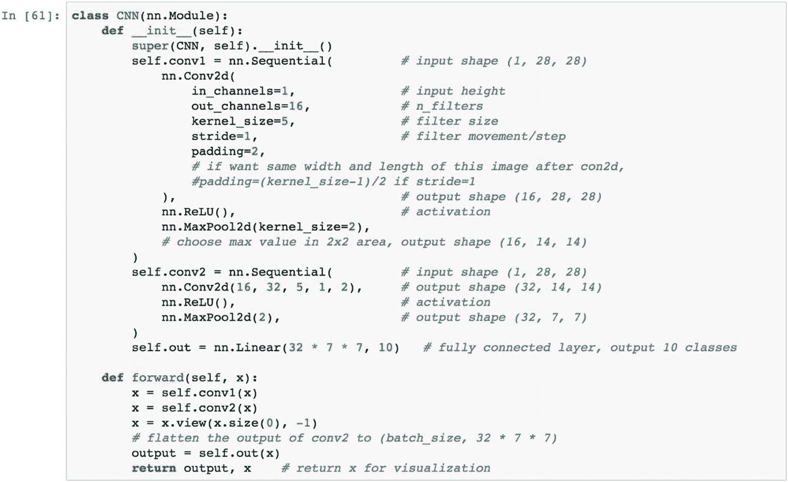
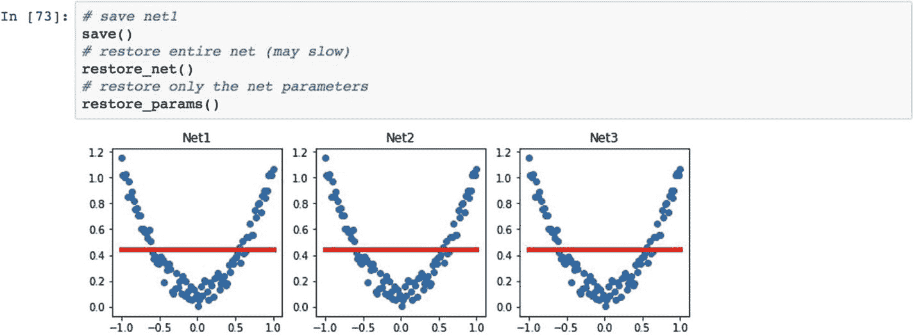
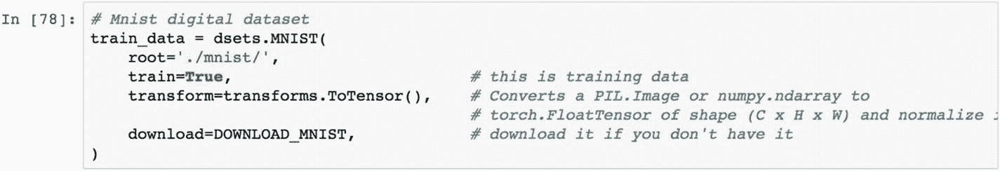
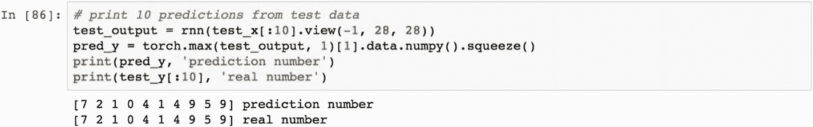
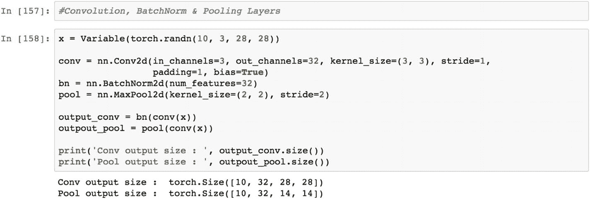

# 3.CNN 和 RNN 使用 PyTorch

在 PyTorch 这样的图形计算平台中，概率和随机变量是计算不可或缺的一部分。理解概率和相关概念是必不可少的。本章包括概率分布和 PyTorch 的实现，以及如何解释测试结果。在概率统计中，随机变量也被称为*随机变量*，其结果取决于纯粹的随机现象，或随机现象。有不同类型的概率分布，包括正态分布、二项式分布、多项式分布和伯努利分布。每个统计分布都有自己的特性。

## 配方 3-1。建立损失函数

### 问题

我们如何建立一个损失函数并优化它？选择正确的损失函数增加了模型收敛的机会。

### 解决办法

在这个方法中，我们使用另一个张量作为更新变量，并将张量引入样本模型并计算误差或损失。然后我们计算损失函数的变化率来衡量模型收敛中损失函数的选择。

### 它是如何工作的

在下面的例子中，t_c 和 t_u 是两个张量。这可以从任何 NumPy 数组中构造。

样本模型只是一个线性方程，用于进行计算，损失函数定义如下所示的均方误差(MSE)。在本章中，我们将增加模型的复杂性。目前，这只是一个简单的线性方程计算。

现在让我们来定义这个模型。w 参数是权重张量，与 t_u 张量相乘。结果加上一个常数张量 b，选择的损失函数是定制的；它也有 PyTorch 版本。在下面的例子中，t_u 是使用的张量，t_p 是预测的张量，t_c 是预先计算的张量，预测的张量需要与它进行比较来计算损失函数。

公式 w * t_u + b 是基于张量计算的线性方程表示。

最初的损失值是 1763.88，由于最初选择的权重，这个值太高了。第一轮迭代中的误差被反向传播以减少第二轮中的误差，为此需要更新初始权重集。因此，损失函数的变化率对于在估计过程中更新权重是至关重要的。

更新损失率函数有两个参数:当前迭代的学习率和前一次迭代的学习率。如果两次迭代之间的增量超过某个阈值，则需要更新权重张量，否则可能发生模型收敛。前面的脚本显示了增量和学习率值。目前，这些是用户可以选择更改的静态值。

这就是简单的均方损失函数在张量大小为 10，5 的二维张量示例中的工作方式。

让我们看看下面的例子。MSELoss 函数在 PyTorch 的神经网络模块中。

当我们查看用于反向传播的梯度计算时，它显示为 MSELoss。

## 食谱 3-2。估计损失函数的导数

### 问题

我们如何估计损失函数的导数？

### 解决办法

使用下面的例子，我们将损失函数改为输入和输出张量之差的两倍，而不是 MSELoss 函数。下面的 grad_fn 被定义为自定义函数，它向用户展示了最终输出如何检索损失函数的导数。

### 它是如何工作的

让我们看看下面的例子。在前面的方法中，脚本的最后一行将 grad_fn 显示为嵌入在输出对象张量中的对象。在这份食谱中，我们解释这是如何计算的。grad_fn 是损失函数相对于模型参数的导数。这正是我们在下面的 grad_fn 中所做的。

这些参数是输入、偏置设置、学习率以及模型训练的时期数。这些参数的估计为该方程提供了值。

这是最初的结果。历元是根据先前定义的损失函数产生损失值的迭代。params 向量是关于需要改变以最小化损失函数的系数和常数。grad 函数计算下一个时期的反馈值。这只是一个例子。根据输入数据、输出数据以及损失和优化函数的选择，选择的历元数是一项迭代任务。

如果我们降低学习率，我们能够将相关值传递给梯度，参数以更好的方式更新，模型收敛变得更快。

最初的结果如下所示。结果在时段 5，损失值是 29.35，远低于时段 0 的 1763.88，并且对应于该时段，估计的参数在时段 100 是 0.24 和–. 01。这些参数值是最佳的。

如果我们降低一点学习速率，那么权值更新的过程会慢一点，这意味着需要增加历元数，以便为模型找到稳定状态。

以下是我们观察到的结果。

如果我们增加历元的数量，那么损失函数和参数张量会发生什么可以在下面的脚本中查看，其中我们打印损失值以找到对应于历元的最小损失。然后我们可以从模型中提取最佳参数。

以下是结果。

以下是最终历元级别的最终损失值。

在 epoch 5000 时，损失值为 2.92，不在进一步下跌；因此，在此迭代级别，张量输出显示 5.36 作为最终权重，而–17.30 作为最终偏差。这些是模型的最终参数。

为了在估计参数时微调该模型，我们可以重新定义该模型和损失函数，并将其应用于相同的示例。

设置参数。完成训练过程后，我们应该将 grad 函数重置为 None。

## 食谱 3-3。微调模型

### 问题

我们如何通过应用优化函数来优化损失函数，从而找到损失函数的梯度？

### 解决办法

我们将使用 backward()函数。

### 它是如何工作的

让我们看看下面的例子。backward()函数计算函数相对于其参数的梯度。在本节中，我们用一组新的超参数重新训练模型。

重置参数网格。如果我们不重置现有会话中的参数，则来自任何其他会话的累积误差值会变得混杂，因此重置参数网格非常重要。

在重新定义了模型和损失函数之后，让我们重新训练模型。

我们已经经历了 5000 个纪元。我们用反向传播方法训练参数，得到以下结果。在时期 0，损失值是 80.36。当我们通过调整学习率进行下一次迭代时，我们试图最小化损失值。在最后一个时期，我们观察到损失值为 2.92，这与之前的结果相同，但是具有不同的损失函数并使用反向传播。

最终模型参数为 5.3671，偏差为–17.3012。

## 配方 3-4。选择优化函数

### 问题

我们如何用配方 3-3 中的函数优化梯度？

### 解决办法

PyTorch 中嵌入了某些功能，并且用户必须创建某些优化功能。

### 它是如何工作的

让我们看看下面的例子。

每种优化方法在解决问题时都是独特的。我们将在后面描述它。

Adam 优化器是随机目标函数的一阶、基于梯度的优化。它基于低阶矩的自适应估计。这对于在大型数据集上部署来说，计算效率足够高。要使用 torch.optim，我们必须在代码中构造一个优化器对象，它将保存参数的当前状态，并根据计算出的梯度、矩和学习率更新参数。要构建一个优化器，我们必须给它一个包含参数的 iterable，并确保所有参数都是要优化的变量。然后，我们可以指定特定于优化器的选项，比如学习率、权重衰减、矩等等。

Adadelta 是另一个速度足够快的优化器，可以处理大型数据集。这种方法不需要手动微调学习速率；算法会在内部处理它。

现在让我们再次调用模型和损失函数，并将它们与优化函数一起应用。

让我们看看损失函数中的梯度。使用优化库，我们可以尝试找到损失函数的最佳值。

该示例有两个自定义函数和一个损失函数。我们取了两个小的张量值。新的事情是，我们已经采取了优化器来寻找最小值。

在下面的例子中，我们选择了 Adam 作为优化器。

在前面的代码中，我们计算了优化的参数，并使用实际张量和预测张量计算了预测张量。我们可以显示一个图形，它有一条显示为回归线的线。

让我们使用实际的和预测的张量以图形的形式可视化样本数据。

## 配方 3-5。进一步优化功能

### 问题

我们如何优化训练集并使用随机样本用验证集测试它？

### 解决办法

我们将经历进一步优化的过程。

### 它是如何工作的

让我们看看下面的例子。这里我们设置样本的数量，然后我们使用 shuffled _ indices 取 20%的数据作为验证样本。我们随机抽取了所有记录的样本。训练和验证集的目标是在训练集中建立模型，对验证集进行预测，并检查模型的准确性。

现在让我们运行训练和验证过程。我们首先获取训练输入数据，并将其乘以参数的下一行。我们进行预测并计算损失函数。使用第三行中的相同模型，我们进行预测，然后评估验证数据集的损失函数。在反向传播过程中，我们计算训练集的损失函数的梯度，并使用优化器更新参数。

以下是最近 10 个纪元及其结果。

在前面的步骤中，渐变被设置为 true。在下面的集合中，我们使用 torch.no_grad()函数禁用梯度计算。其余的语法保持不变。当我们确定不会调用`Tensor.backward()`时，禁用梯度计算对于推断很有用。这减少了计算的内存消耗，否则将是`requires_grad=True`。

最后几轮纪元显示在其他代码行中，如下所示。

最终参数为 5.44 和–18.012。

## 配方 3-6。实现卷积神经网络(CNN)

### 问题

我们如何使用 PyTorch 实现卷积神经网络？

### 解决办法

torchvision 上有各种内置数据集。我们正在考虑 MNIST 数据集，并试图建立一个 CNN 模型。

### 它是如何工作的

让我们看看下面的例子。作为第一步，我们设置超参数。第二步是建立架构。最后一步是训练模型，进行预测。

在前面的代码中，我们使用 digits 数据集导入了部署卷积神经网络模型所需的库。MNIST 数字数据集是计算机视觉和图像处理深度学习中最受欢迎的数据集。

让我们使用加载器功能来加载数据集。

在卷积神经网络架构中，输入图像被转换成由图像的颜色乘以高度和宽度设置的特征集。由于数据集的维度，我们无法对其建模来预测输出。上图中的输出图层包含汽车、卡车、货车和自行车等类。输入自行车图像具有 CNN 模型应该利用并正确预测它的特征。卷积层总是伴随着合用层，可以是最大合用，也可以是平均合用。不同层的汇集和卷积继续进行，直到维度降低到我们可以使用完全连接的简单神经网络来预测正确类别的水平。

在上图中，如果我们看一下数字 4，它分散在整个图中。理想情况下，所有的 4 都是相互靠近的。这是因为测试精度非常低。

在此迭代中，训练损失从 0.4369 减少到 0.1482，测试精度从 16%提高到 94%。具有相同颜色的数字被紧密地放置在图表上。

在接下来的时间里，在 MNIST 数字数据集上的测试准确率提高到 95%。

在最后的步骤/时期中，具有相似数字的数字被放在一起。成功训练模型后，下一步是利用模型进行预测。以下代码解释了预测过程。输出对象编号为 0、1、2 等等。下面显示了实际和预测的数字。

## 食谱 3-7。重新加载模型

### 问题

我们如何存储和重新上传一个已经训练好的模型？鉴于深度学习模型的性质，通常需要更长的训练时间，计算过程给公司带来了巨大的成本。我们可以用新的输入重新训练模型并存储模型吗？

### 解决办法

在生产环境中，我们通常不能同时训练和预测，因为训练过程需要很长时间。在使用历元的训练过程完成之前，不能应用预测服务，不能应用预测服务。需要将训练过程与预测过程分离；因此，我们需要存储应用程序的训练模型，并持续到下一阶段的训练完成。

### 它是如何工作的

让我们看下面的例子，我们在这里创建 save 函数，它使用 Torch 神经网络模块来创建模型，使用 restore_net()函数来取回之前训练的神经网络模型。

前面的脚本包含一个相关 Y 变量和一个独立 X 变量作为示例数据点来创建神经网络模型。下面的`save`函数存储模型。`net1`对象是经过训练的神经网络模型，可以使用两种不同的协议进行存储:(1)保存带有所有权重和偏差的整个神经网络模型，以及(2)仅使用权重保存模型。如果被训练的模型对象在尺寸上很重，我们应该只保存作为权重的参数；如果训练对象的大小较低，则可以存储整个模型。

通过使用`load`函数，可以将预构建的神经网络模型重新加载到现有的 PyTorch 会话中。为了测试`net1`对象并进行预测，我们加载了`net1`对象并将模型存储为`net2`。通过使用`net2`对象，我们可以预测结果变量。以下脚本将图形生成为因变量和自变量。`prediction.data.numpy()`在代码的最后一行显示预测结果。

加载整个神经网络的 pickle 文件格式比较慢；然而，如果我们只对新数据集进行预测，我们只能以 pickle 格式加载模型的参数，而不是整个网络。

重用模型。`restore`功能确保模型可以重复使用经过训练的参数。为了恢复模型，我们可以使用 load_state_dict()函数来加载模型的参数。如果我们在图中看到以下三个模型，它们是相同的，因为 net2 和 net3 是 net1 的副本。

## 食谱 3-8。实现递归神经网络(RNN)

### 问题

我们如何使用 MNIST 数据集建立一个递归神经网络？

### 解决办法

递归神经网络被认为是一个记忆网络。我们将使用 epoch 作为 1，一次 64 个样本的批量大小来建立输入和输出之间的连接。使用 RNN 模型，我们可以预测图像中出现的数字。

### 它是如何工作的

让我们看看下面的例子。递归神经网络在输入层获取一系列矢量，并在输出层产生一系列矢量。信息序列通过递归层的内部状态转移进行处理。有时，输出值长期依赖于过去的历史值。这是 RNN 模型的另一种变体:长期短期记忆(LSTM)模型。这适用于以顺序方式消费信息的任何类型的域；例如，在当前股票价格由历史股票价格决定的时间序列中，相关性可以是短期的，也可以是长期的。类似地，使用长范围和短范围文本输入向量的上下文预测。还有其他行业用例，如噪声分类，其中噪声也是一系列信息。

下面这段代码解释了使用 PyTorch 模块执行 RNN 模型。

有三组权重:U、V 和 W。由 W 表示的这组权重向量用于在网络中显示隐藏状态之间的通信的存储单元之间传递信息。RNN 使用了一个使用 Word2vec 表示的嵌入层。嵌入矩阵的大小是单词的数量乘以隐藏层中神经元的数量。例如，如果您有 20，000 个单词和 1000 个隐藏单元，则矩阵的嵌入层大小为 20，000×1000。新的表示被传递到 LSTM 像元，这些像元进入 sigmoid 输出层。

RNN 模型有超参数，比如迭代次数(`EPOCH`)；批量大小取决于单台机器中可用的内存；记忆信息序列的时间步长；输入大小，显示矢量大小；和学习率。这些值的选择是指示性的；我们不能在其他用例中依赖它们。超参数调谐的值选择是一个迭代过程；您可以选择多个参数并决定哪一个有效，或者对模型进行并行训练并决定哪一个有效。

使用数据集。MINIST()函数，我们可以将数据集加载到当前会话中。如果您需要存储数据集，那么在本地下载它。

前面的脚本显示了样本影像数据集的外观。为了训练深度学习模型，我们需要将整个训练数据集转换为小批量，这有助于我们平均模型的最终精度。通过使用数据加载器功能，我们可以加载训练数据并准备小批量。小批量随机选择的目的是确保模型捕获实际数据集中的所有变化。

前面的脚本准备了训练数据集。用标志`train=False`捕获测试数据。使用测试数据将其转换为张量。每次随机抽取 2000 个样本来测试模型。测试特征集被转换成可变格式，并且测试标签向量以 NumPy 数组格式表示。

在前面的 RNN 课上，我们正在训练一个 LSTM 网络，它被证明可以有效地长时间保持记忆，从而有助于学习。如果我们使用神经网络。RNN()模型，它几乎不学习参数，因为 RNN 的香草实现不能持有或记住长时间的信息。在 LSTM 网络中，图像宽度被认为是输入尺寸，隐藏尺寸被决定为隐藏层中神经元的数量，`num_layers`表示网络中 RNN 层的数量。

LSTM 模块中的 RNN 模块生成 64×10 的矢量大小的输出，因为输出图层包含要分类为 0 到 9 的数字。最后一个前向函数显示了如何在 RNN 网络中进行前向传播。

以下脚本显示了如何在 RNN 类下处理 LSTM 模型。在 LSTM 函数中，我们将输入长度作为 28，将隐藏层中的神经元数量作为 64，从隐藏的 64 个神经元到输出的 10 个神经元。

为了优化所有 RNN 参数，我们使用 Adam 优化器。在函数内部，我们也使用学习率。本例中使用的损失函数是交叉熵损失函数。我们需要提供多个时期来获得最佳参数。

在下面的脚本中，我们将打印训练损失和测试准确性。一个历元后，测试精度提高到 95%，训练损失降低到 0.24。

一旦模型训练完毕，下一步就是使用 RNN 模型进行预测。然后，我们比较实际输出和真实输出，以评估模型的表现。

## 食谱 3-9。为回归问题实现 RNN

### 问题

我们如何为基于回归的问题建立递归神经网络？

### 解决办法

回归模型需要一个目标函数和一个特征集，然后需要一个函数来建立输入和输出之间的关系。在这个例子中，我们将使用递归神经网络(RNN)进行回归任务。回归问题看起来很简单；它们确实工作得最好，但仅限于显示清晰线性关系的数据。当预测输入和输出之间的非线性关系时，它们相当复杂。

### 它是如何工作的

让我们看看下面的例子，它显示了输入和输出数据之间的非线性循环模式。在上一个菜谱中，我们看了一个与分类相关问题的 RNN 示例，其中预测了输入图像的类别。然而，在回归分析中，RNN 的体系结构会发生变化，因为目标是预测实际价值产出。输出层在回归相关问题中有一个神经元。

RNN 时间步长意味着最后 10 个值预测当前值，滚动发生在那之后。

以下脚本显示了一些样本序列，其中目标 cos 函数由 s in 函数逼近。

## 食谱 3-10。使用 PyTorch 内置函数

### 问题

我们如何建立一个 RNN 模块并使用 PyTorch 调用 RNN 函数？

### 解决办法

通过使用神经网络模块中的内置函数，我们可以实现一个 RNN 模型。

### 它是如何工作的

让我们看看下面的例子。PyTorch 库中的神经网络模块包含 RNN 函数。在下面的脚本中，我们使用输入矩阵大小、隐藏层中神经元的数量以及网络中隐藏层的数量。

在创建了 RNN 类函数之后，我们需要提供优化函数，也就是 Adam，而这一次，损失函数是均方损失函数。由于目标是预测连续变量，我们在优化层使用 MSELoss 函数。

现在，我们迭代 60 步来预测从样本空间生成的 cos 函数，并通过 sin 函数来预测它。迭代采用之前定义的学习率，并反向传播误差以降低 MSE 并改善预测。

## 食谱 3-11。使用自动编码器

### 问题

我们如何使用自动编码器功能执行聚类？

### 解决办法

无监督学习是机器学习的一个分支，它没有目标列或输出没有定义。我们只需要理解数据中存在的独特模式。让我们看看图 [3-1](#Fig1) 中的自动编码器架构。使用隐藏层将输入特征空间转换成低维张量表示，并映射回相同的输入空间。正好在中间的层保存自动编码器的值。

图 3-1

自解压体系结构

### 它是如何工作的

让我们看看下面的例子。torchvision 库包含流行的数据集、模型架构和框架。自动编码器是从数据集中识别潜在特征的过程；它用于分类、预测和聚类。如果我们将输入数据放在输入层，将相同的数据集放在输出层，那么我们添加多层具有许多神经元的隐藏层，然后我们经过一系列的纪元。我们在最里面的隐藏层中得到一组潜在的特征。中央隐藏层中的权重或参数被称为*自动编码器*T2 层。

我们再次使用 MNIST 数据集来试验自动编码器功能。这次我们取 10 个纪元，一批 64 个要传递到网络，学习率 0.005，和 5 个图像用于测试。

下图显示了从 torchvision 库上传并显示为图像的数据集。

让我们讨论一下自动编码器的架构。输入有 784 个要素。它的高度为 28，宽度为 28。我们将 784 个神经元从输入层传递到第一个隐藏层，其中有 128 个神经元。然后我们应用双曲正切函数将信息传递给下一个隐藏层。第二个隐藏层包含 128 个输入神经元，并将其转换为 64 个神经元。在第三个隐藏层中，我们应用双曲正切函数将信息传递给下一个隐藏层。最内层包含三个神经元，被认为是三个特征，是编码器层的终点。然后，解码器功能将图层扩展回输出图层中的 784 个要素。

一旦我们设置了体系结构，那么使损失函数最小化的正常过程对应于学习率和优化函数而发生。为了达到目标输出，整个架构经历了一系列的时期。

## 食谱 3-12。使用自动编码器微调结果

### 问题

我们如何设置迭代来微调结果？

### 解决办法

从概念上讲，自动编码器的工作方式与聚类分析模型相同。在无监督学习中，机器从数据中学习模式，并将其推广到新的数据集。学习是通过获取一组输入特征来进行的。自动编码器功能也用于特征工程。

### 它是如何工作的

让我们看看下面的例子。使用相同的 MNIST 数据集作为示例，目的是理解历元在实现更好的自动编码器层中的作用。我们增加历元大小以将误差减少到最小；然而，在实践中，增加历元具有许多挑战，包括存储器限制。

通过使用编码器函数，我们可以将输入特征表示成一组潜在特征。然而，通过使用解码器功能，我们可以重建图像。然后，我们可以通过使用自动编码器功能来匹配如何完成图像重建。从前面的一组图表中可以清楚地看出，随着时间的增加，图像识别变得透明。

## 食谱 3-13。在 3D 绘图中可视化编码数据

### 问题

我们如何在 3D 绘图中可视化 MNIST 数据？

### 解决办法

我们使用 autoencoder 函数来获得编码的特征，然后使用数据集在 3D 平面中表示它。

### 它是如何工作的

让我们看看下面的例子。这个配方是关于如何在三维空间中表示从前面的配方中导出的 autoencoder 函数，因为我们在最里面的隐藏层中有三个神经元。下图显示了一个三维神经元。

## 食谱 3-14。限制模型过度拟合

### 问题

当我们拟合许多神经元和层来预测目标类或输出变量时，该函数通常会过度拟合训练数据集。由于模型过度拟合，我们无法对测试集做出良好的预测。测试准确度与训练准确度不同。训练和测试精度会有偏差。

### 解决办法

为了限制模型过拟合，我们有意识地引入了辍学率，即随机删除(比方说)网络中 10%或 20%的权重，同时检查模型精度。如果我们能够在删除 10%或 20%的权重后匹配相同的模型精度，那么我们的模型是好的。

### 它是如何工作的

让我们看看下面的例子。当经过训练的模型不能推广到其他测试用例场景时，就会发生模型过度拟合。当训练精度变得明显不同于测试精度时，它被识别。为了避免模型过度拟合，我们可以在模型中引入辍学率。

对隐藏层引入的丢失率确保了小于所定义的阈值的权重被从架构中移除。一个应用程序的退出率的典型阈值是 20%到 50%。20%的辍学率意味着惩罚程度较轻；然而，50%的阈值意味着对模型权重的严厉惩罚。

在下面的脚本中，我们应用 50%的丢弃率来从模型中丢弃权重。我们应用了两次辍学率。

选择合适的辍学率需要对业务和领域有一个公平的认识。

## 食谱 3-15。可视化模型过度拟合

### 问题

评估模型过度拟合。

### 解决办法

我们改变模型超参数，反复查看模型是否过度拟合数据。

### 它是如何工作的

让我们看看下面的例子。前面的方法涵盖了两种类型的神经网络:过度拟合和辍学率。当从数据中估计的模型参数更接近实际数据时，对于训练数据集而言，相同的模型与测试集不同，这是模型过拟合的明显标志。为了限制模型过度拟合，我们可以引入丢弃率，即删除一定百分比的连接(如来自网络的权重),以允许经过训练的模型接近真实数据。

在下面的脚本中，迭代进行了 500 次。预测值是从基本模型(显示过度拟合)和漏失模型(显示删除了一些权重)生成的。以同样的方式，我们创建了两个损失函数，反向传播和优化器的实现。

第一轮绘图包括过拟合损耗和漏失损耗，以及它与上图中实际训练和测试数据点的不同之处。

经过多次迭代后，通过使用实际模型和辍学率这两个函数，生成了前面的图。从该图中可以看出，实际训练数据可能更接近过度拟合模型；然而，辍学模型非常符合数据。

## 食谱 3-16。初始化辍学率的权重

### 问题

我们如何删除网络中的权重？我们应该随机删除还是使用任意分布删除？

### 解决办法

我们应该基于概率分布而不是随机地删除掉层中的权重。

### 它是如何工作的

让我们看看下面的例子。在前面的配方中，引入了三层辍学率:第一个隐藏层后有一层，第二个隐藏层后有两层。概率百分比是 0.50，这意味着随机删除 50%的权重。有时，从网络中随机选择权重会删除相关权重，因此另一种思路是删除网络中由统计分布生成的权重。

以下脚本显示了如何根据均匀分布生成权重，然后我们可以在网络架构中使用权重集。

## 食谱 3-17。添加数学运算

### 问题

我们如何设置广播函数，优化卷积函数？

### 解决办法

该脚本片段显示了如何在设置卷积神经网络模型时引入批处理规范化，然后进一步设置池层。

### 它是如何工作的

让我们看看下面的例子。为了在神经网络模型的卷积层中引入批量标准化，我们需要执行基于张量的数学运算，这些运算在功能上不同于其他计算方法。

以下脚本显示了在进入 2D 最大池图层之前，如何使用 2D 图层解决批量归一化问题。

## 食谱 3-18。在 RNN 嵌入图层

### 问题

递归神经网络主要用于文本处理。嵌入特征在标准 RNN 模型上比原始特征提供更高的精度。我们如何在 RNN 中创建嵌入式功能？

### 解决办法

第一步是创建一个嵌入层，它是一个固定的字典和固定大小的查找表，然后在创建门控递归单元后引入辍学率。

### 它是如何工作的

让我们看看下面的例子。当文本数据以序列的形式出现时，信息以连续的方式被处理；例如，当我们描述某样东西时，我们会按顺序使用一组单词来传达意思。如果我们使用单个单词作为向量来表示数据，得到的数据集将非常稀疏。但是如果我们使用基于短语的方法或单词的组合来表示特征向量，那么向量就变成了密集层。密集矢量层被称为*单词嵌入*，因为嵌入层传达了上下文或含义作为结果。它肯定比单词袋方法要好。

## 结论

本章介绍了如何使用 PyTorch API，创建一个简单的神经网络模式，以及如何通过更改超参数(即学习率、时期、梯度下降)来优化参数。我们查看了如何创建卷积神经网络和递归神经网络的方法，并在这些网络中引入了辍学率以控制模型过拟合。

我们用小张量来跟踪计算等幕后到底发生了什么。我们只需要定义问题陈述，创建特性，并应用方法来获得结果。在下一章，我们用 PyTorch 实现了更多的例子。