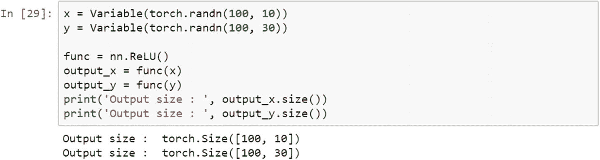

# 4.使用 PyTorch 介绍神经网络

基于深度神经网络的模型正逐渐成为人工智能和机器学习实现的支柱。基于人工神经网络的高级建模技术的使用将决定数据挖掘的未来。一个显而易见的问题是，为什么神经网络直到现在才变得如此重要，因为它是在 20 世纪 50 年代发明的。

从计算机科学领域借用，神经网络可以被定义为一个并行信息处理系统，其中所有的输入都相互关联，就像人脑中的神经元一样，以传输信息，从而可以执行像面部识别、图像识别等活动。在本章中，您将了解基于神经网络的方法在各种数据挖掘任务中的应用，如分类、回归、预测和特征约简。一个*人工神经网络* (ANN)的工作方式类似于人脑的工作方式，其中数十亿个神经元相互链接，进行信息处理和洞察力生成。

## 配方 4-1。使用激活功能

### 问题

什么是激活功能，它们在实际项目中是如何工作的？如何使用 PyTorch 实现激活功能？

### 解决办法

激活函数是一个数学公式，它根据数学转换函数的类型，将二进制、浮点或整数格式的矢量转换为另一种格式。神经元存在于不同的层中——输入层、隐藏层和输出层，它们通过一个叫做*激活函数*的数学函数相互连接。激活函数有不同的变体，下面将对此进行解释。理解激活函数有助于准确实现神经网络模型。

### 它是如何工作的

作为神经网络模型的一部分的所有激活函数可以被宽泛地分类为线性函数和非线性函数。torch.nn 模块创建任何类型的神经网络模型。让我们看一些使用 PyTorch 和 torch.nn 模块部署激活函数的例子。

PyTorch 和 TensorFlow 之间的核心区别是计算图的定义方式，两个框架执行计算的方式，以及我们在更改脚本和引入其他基于 Python 的库时的灵活性。在 TensorFlow 中，我们需要在初始化模型之前定义变量和占位符。我们还需要跟踪稍后需要的对象，为此我们需要一个占位符。在 TensorFlow 中，我们需要先定义模型，然后编译运行；然而，在 PyTorch 中，我们可以随时定义模型——我们不必在代码中保留占位符。这就是 PyTorch 框架是动态的原因。

#### 线性函数

线性函数是一种简单的函数，通常用于将信息从解映射层传输到输出层。我们在数据变化较小的地方使用线性函数。在深度学习模型中，实践者通常在输出层的最后一个隐藏层中使用线性函数。在线性函数中，输出总是被限制在一个特定的范围内；因此，它用于深度学习模型的最后一个隐藏层，或者用于基于线性回归的任务，或者用于任务是从输入数据集预测结果的深度学习模型。下面是公式。

#### 双线性函数

双线性函数是一种简单的函数，通常用于传递信息。它对输入数据应用双线性变换。

#### Sigmoid 函数

sigmoid 函数经常被数据挖掘和分析领域的专业人员使用，因为它更容易解释和实现。这是一个非线性函数。当我们将神经网络中的权重从输入层传递到隐藏层时，我们希望我们的模型能够捕捉数据中存在的各种非线性；因此，建议在神经网络的隐藏层中使用 sigmoid 函数。非线性函数有助于概化数据集。使用非线性函数计算函数的梯度更容易。

sigmoid 函数是一种特殊的非线性激活函数。sigmoid 函数输出总是被限制在 0 和 1 之间；因此，它主要用于执行基于分类的任务。sigmoid 函数的局限性之一是它可能陷入局部最小值。一个优点是它提供了属于该类的概率。下面是它的方程式。

#### 双曲正切函数

双曲正切函数是变换函数的另一种变体。它用于将信息从映射层转换到隐藏层。它通常用于神经网络模型的隐藏层之间。双曲正切函数的范围在–1 到+1 之间。

#### 对数 Sigmoid 传递函数

以下公式解释了 log sigmoid 传递函数，该函数用于将输入层映射到隐藏层。如果数据不是二进制的，并且是含有大量异常值的浮点型(如输入要素中出现的大数值)，那么我们应该使用 log sigmoid 传递函数。

#### ReLU 函数

整流线性单元(ReLu)是另一个激活功能。它用于将信息从输入层传输到输出层。ReLu 主要用于卷积神经网络模型。该激活函数的工作范围是从 0 到无穷大。它主要用于神经网络模型的不同隐藏层之间。

在神经网络结构中，不同类型的传递函数是可以互换的。它们可用于不同的阶段，如输入到隐藏层、隐藏层到输出层等，以提高模型的准确性。

#### 李奇注意到了

在标准的神经网络模型中，渐变问题是常见的。为了避免这个问题，应用了泄漏 ReLU。当装置不工作时，泄漏 ReLU 允许一个小的非零梯度。

## 食谱 4-2。可视化激活函数的形状

### 问题

我们如何可视化激活功能？激活函数的可视化在正确建立神经网络模型中是重要的。

### 解决办法

激活功能将数据从一层转换到另一层。转换后的数据可以相对于实际的张量作图，以使函数可视化。我们取了一个样本张量，将其转换为 PyTorch 变量，应用该函数，并将其存储为另一个张量。使用 matplotlib 表示实际张量和转换后的张量。

### 它是如何工作的

激活函数的正确选择不仅会提供更好的准确性，而且有助于提取有意义的信息。

在这个脚本中，我们在–10 和+10 之间的线性空间中有一个数组，我们有 1500 个样本点。我们将向量转换为 Torch 变量，然后复制一个 NumPy 变量用于绘制图形。然后，我们计算了激活函数。下图显示了激活功能。

## 食谱 4-3。基本神经网络模型

### 问题

我们如何使用 PyTorch 建立一个基本的神经网络模型？

### 解决办法

PyTorch 中的基本神经网络模型需要六个步骤:准备训练数据、初始化权重、创建基本网络模型、计算损失函数、选择学习速率以及相对于模型参数优化损失函数。

### 它是如何工作的

让我们按照一步一步的方法来创建一个基本的神经网络模型。

为了显示一个示例神经网络模型，我们准备了数据集并将数据类型更改为浮点张量。当我们在一个项目中工作时，为构建它的数据准备是一个单独的活动。数据准备应以适当的方式进行。在前面的步骤中，训练 x 和训练 y 是两个 NumPy 向量。接下来，我们将数据类型更改为浮点张量，因为这是矩阵乘法所必需的。下一步是将其转换为变量，因为变量有三个属性，可以帮助我们微调对象。在数据集中，我们在一个维度上有 17 个数据点。

set_weight()函数初始化神经网络模型将在前向传播中使用的随机权重。我们需要两个张量权重和偏差。build_network()函数只是将权重与输入相乘，加上偏差，然后生成预测值。这是我们构建的自定义函数。如果我们需要用 PyTorch 实现同样的东西，那么用 nn 就简单多了。Linear()当我们需要用它进行线性回归的时候。

一旦我们定义了网络结构，我们就需要将结果与输出进行比较，以评估预测步骤。跟踪系统精度的指标是损失函数，我们希望它最小。损失函数可以具有不同的形状。我们如何确切地知道哪里的损失最小，哪一个迭代提供了最好的结果？要了解这一点，我们需要对损失函数应用优化函数；它会找到最小损失值。然后我们可以提取对应于该迭代的参数。

中位数、众数和标准差计算可以写入 sa 中

标准差表示与集中趋势测量值的偏差，表明数据/变量的一致性。说明数据是否有足够的波动。

## 食谱 4-4。张量微分

### 问题

什么是张量微分，它如何与使用 PyTorch 框架的计算图形执行相关？

### 解决办法

计算图网络由节点表示，并通过函数连接。有两种不同的节点:从属节点和独立节点。*依赖节点*正在等待来自其他节点的结果以处理输入。*独立节点*相连，要么是常数，要么是结果。张量微分是在计算图形环境中执行计算的有效方法。

### 它是如何工作的

在计算图形中，张量微分非常有效，因为张量可以作为并行节点、多进程节点或多线程节点来计算。主要的深度学习和神经计算框架包括这种张量微分。

Autograd 是帮助执行张量微分的函数，这意味着计算误差函数的梯度或斜率，并通过神经网络反向传播误差，以微调权重和偏差。通过学习率和迭代，它试图减少误差值或损失函数。

要应用张量微分，需要应用 nn.backward()方法。让我们举个例子，看看误差梯度是如何反向传播的。为了更新损失函数的曲线，或者为了找到损失函数的形状在哪里最小以及它在哪个方向移动，需要导数计算。张量微分是一种在计算图形中计算函数斜率的方法。

在这个脚本中，x 是一个样本张量，需要对其进行自动梯度计算。fn 是使用 x 变量创建的线性函数。使用反向函数，我们可以执行反向传播计算。的。grad()函数保存张量微分的最终输出。

## 结论

本章讨论了各种激活功能以及在各种情况下激活功能的使用。选择最佳激活函数的方法或系统是精度驱动的；给出最佳结果的激活函数应该总是在模型中动态使用。我们还使用小样本张量创建了一个基本的神经网络模型，使用优化更新了权重，并生成了预测。在下一章，我们会看到更多的例子。