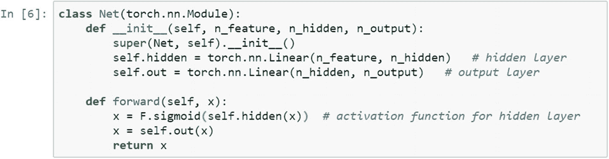

# 5.使用 PyTorch 的监督学习

监督机器学习是机器学习中最复杂的分支。它在几乎所有领域都有应用，包括人工智能、认知计算和语言处理。机器学习文献广泛讨论了三种类型的学习:监督学习、非监督学习和强化学习。在监督学习中，机器学习识别输出；因此，它是任务驱动的，任务可以是分类或回归。

在无监督学习中，机器从数据中学习模式；因此，它会对新数据集进行概化，并通过获取一组输入要素进行学习。在强化学习中，学习是在对系统的反应中发生的，系统对环境做出反应。

本章用机器学习方法详细介绍了回归技术，并在业务场景的上下文中解释了回归方法的输出。算法分类如图 [5-1](#Fig1) 所示。

图 5-1

算法分类

每个对象或行代表一个事件，并且每个事件被分类成组。识别记录属于哪个级别组被称为*分类*，其中目标变量有特定的标签或标记附加到事件上。例如，在银行数据库中，每个客户都被标记为忠诚客户或不忠诚客户。在医疗记录数据库中，每个病人的疾病都有标记。在电信行业，每个用户都被标记为流失客户或非流失客户。这些是监督算法执行分类的例子。单词*分类*来自目标列中可用的类。

在*回归学习*中，目标是预测连续变量的值；例如，给定房产的特征，如卧室数量、平方英尺、附近区域、城镇等等，就可以确定房子的要价。在这种情况下，可以使用回归模型。类似的例子包括预测股票价格或企业的销售、收入和利润。

在无监督学习算法中，我们没有结果变量，标记或标注不可用。我们感兴趣的是了解数据集中观察值、记录或行的自然分组。这种自然分组应该是这样的:在组内，相似性应该是最大的，而在组之间，相似性应该是最小的。

在现实世界的场景中，存在回归无助于预测目标变量的情况。在监督回归技术中，输入数据也被称为*训练数据*。对于每条记录，都有一个具有连续数值的标签。该模型是通过预测正确输出的训练过程来准备的，并且该过程一直持续到达到期望的精度水平。我们可能需要高级回归方法来理解数据集中存在的模式。

## 线性回归简介

在所有的统计技术中，线性回归分析被认为是最可靠、最容易应用和最广泛使用的。这假设了因变量和自变量之间的线性、加法关系。线性回归的目的是通过自变量预测因变量或目标变量。线性回归模型的说明如下。

Y = α + βX

该公式具有一个特性，其中 Y 的预测是每个 X 变量的直线函数，保持所有其他变量不变，并且不同 X 变量对预测的贡献是相加的。它们各自与 Y 的直线关系的斜率就是变量的系数。通过最小二乘法估计系数和截距(即，将它们设置为使模型拟合的数据样本内的误差平方和最小化的唯一值)。

该模型的预测误差通常被假设为独立且相同的正态分布。当β系数变为零时，输入变量 X 对因变量没有影响。OLS 方法试图最小化残差平方和。残差定义为回归线上的点与散点图中实际数据点之间的差异。这一过程旨在估计多元线性回归模型中的β系数。

让我们以一个 15 人的样本数据集为例。我们捕捉他们每个人的身高和体重。仅通过身高，我们能使用线性回归技术预测一个人的体重吗？答案是肯定的。

<colgroup><col class="tcol1 align-left"> <col class="tcol2 align-left"> <col class="tcol3 align-left"> <col class="tcol4 align-left"> <col class="tcol5 align-left"> <col class="tcol6 align-left"> <col class="tcol7 align-left"> <col class="tcol8 align-left"> <col class="tcol9 align-left"> <col class="tcol10 align-left"> <col class="tcol11 align-left"> <col class="tcol12 align-left"> <col class="tcol13 align-left"> <col class="tcol14 align-left"> <col class="tcol15 align-left"> <col class="tcol16 align-left"></colgroup> 
| 

**人**

 | 

one

 | 

Two

 | 

three

 | 

four

 | 

five

 | 

six

 | 

seven

 | 

eight

 | 

nine

 | 

Ten

 | 

Eleven

 | 

Twelve

 | 

Thirteen

 | 

Fourteen

 | 

Fifteen

 |
| --- | --- | --- | --- | --- | --- | --- | --- | --- | --- | --- | --- | --- | --- | --- | --- |
| **高度** | Fifty-eight | Fifty-nine | Sixty | Sixty-one | Sixty-two | Sixty-three | Sixty-four | Sixty-five | Sixty-six | Sixty-seven | sixty-eight | sixty-nine | Seventy | Seventy-one | seventy-two |
| **重量** | One hundred and fifteen | One hundred and seventeen | One hundred and twenty | One hundred and twenty-three | One hundred and twenty-six | One hundred and twenty-nine | One hundred and thirty-two | One hundred and thirty-five | One hundred and thirty-nine | One hundred and forty-two | One hundred and forty-six | One hundred and fifty | One hundred and fifty-four | One hundred and fifty-nine | One hundred and sixty-four |

为了用图形表示，我们在 x 轴上测量身高，在 y 轴上测量体重。线性回归方程在图上，截距是 87.517，系数是 3.45。数据点用点表示，连线呈线性关系(见图 [5-2](#Fig2) )。

图 5-2

身高和体重的关系

为什么我们假设因变量和一组自变量之间存在线性关系，而现实生活中的大多数场景反映的是除线性关系之外的任何其他类型的关系？我们坚持线性关系的原因如下所述。

这很容易理解和解释。有多种方法可以将现有的线性偏差转化为线性偏差。生成预测很简单。

预测建模领域主要关注最小化预测模型中的误差，或者尽可能做出最准确的预测。线性回归是在统计学领域发展起来的。它是作为理解数值变量的输入和输出之间的关系的模型来研究的，但它被机器学习借用了。它既是一种统计算法，也是一种机器学习算法。线性回归模型依赖于以下一组假设。

*   因变量和自变量之间的线性关系。

*   预测值之间不应有任何多重共线性。如果我们在输入特征空间中有两个以上的预测值，则输入特征不应相关。

*   不应该有任何自相关。

*   不应该有任何异方差。误差项的方差应该是常数，沿着另一个轴上的预测值，这意味着误差方差应该是常数。

*   误差项应该是正态分布的。误差项基本上被定义为实际变量和预测变量之间的差异。

在线性回归中，有不同的变量，但在机器学习中，我们将它们视为一种方法。例如，如果我们使用一个解释变量来预测因变量，它被称为一个简单线性回归模型。如果我们使用一个以上的解释变量，那么这个模型叫做*多元线性回归模型*。普通最小二乘法是一种预测线性回归模型的统计技术；因此，有时线性回归模型也被称为*普通最小二乘模型*。

线性回归对缺失值和异常值非常敏感，因为计算线性回归的统计方法取决于变量之间的平均值、标准差和协方差。均值对异常值敏感；因此，在形成线性回归模型之前，我们需要清除异常值。

在机器学习文献中，获得使回归模型中的误差最小化的最佳β系数的方法是通过一种称为*梯度下降算法*的方法实现的。梯度下降算法是如何工作的？它从初始值开始，优选地从零开始，并且通过学习速率定期迭代地更新比例因子，以最小化误差项。

理解基于机器学习方法的线性回归需要特殊的数据准备，通过保持原始数据完整来避免假设。需要数据转换来使您的模型更加健壮。

## 配方 5-1。监督模型的数据准备

### 问题

我们如何使用 PyTorch 为创建监督学习模型进行数据准备？

### 解决办法

我们采用开源数据集 mtcars.csv，这是一个回归数据集，来测试如何创建输入和输出张量。

### 它是如何工作的

首先，需要导入必要的库。

监督算法的预测器是 qsec，用于预测汽车提供的每加仑里程。这里重要的是数据类型。首先，我们将 NumPy 格式的数据导入 PyTorch 张量格式。默认的张量格式是浮点型。使用张量浮点格式会在执行优化函数时导致错误，因此更改张量数据类型非常重要。我们可以通过使用 unsqueeze 函数并指定维数等于 1 来重新格式化张量类型。

为了再现相同的结果，需要设置手动种子；所以用了 torch.manual_seed(1234)。虽然我们看到数据类型是张量，但是如果我们检查类型函数，它将显示为 double，因为优化函数需要一个张量类型 double。

## 食谱 5-2。向前和向后传播

### 问题

我们如何构建一个神经网络 torch 类函数，这样我们就可以构建一个正向传播的方法？

### 解决办法

设计神经网络的类函数，包括从输入层到隐层，从隐层到输出层。在神经网络架构中，还需要指定隐藏层中神经元的数量。

### 它是如何工作的

在 Net()函数类中，我们首先初始化特征层、隐藏层和输出层。然后我们引入反向传播函数，使用校正的线性单元作为隐含层的激活函数。

下图显示了 ReLU 激活功能。它在不同的神经网络模型中广泛使用；然而，激活函数的选择应该基于精度。如果我们在 sigmoid 函数中得到更高的精度，我们应该考虑这一点。

现在监督学习模型中提到了网络架构。n_feature 显示了输入层中神经元的数量。因为我们有一个输入变量 qsec，我们将使用 1。隐藏层中神经元的数量可以基于输入和学习模型中所需的精确度来决定。我们用 n_hidden 等于 20，表示隐藏层 1 有 20 个神经元，输出神经元为 1。

优化函数的作用是最小化关于参数和学习率定义的损失函数。这里选择的学习率是 0.2。我们还将神经网络参数传递给优化器。有各种优化功能。

*   *新币*。实施随机梯度下降(可选择动量下降)。这些参数可以是动量、学习率和重量衰减。

*   *阿达德尔塔*。适应性学习率。具有五个不同的自变量、网络参数、用于计算平方梯度的移动平均值的系数、用于实现模型的数值稳定性的附加项、学习速率以及应用正则化的权重衰减参数。

*   阿达格拉德。在线学习和随机优化的自适应次梯度方法。具有诸如用于优化学习速率的参数的 iterable 和学习速率随权重衰减而衰减。

*   *亚当*。随机优化的一种方法。这个函数有六个不同的自变量，一个要优化的可迭代参数、学习速率、β(已知为用于计算梯度及其平方的移动平均值的系数)、一个用于提高数值稳定性的参数，等等。

*   *ASGD* 。通过平均加速随机逼近。它有五个不同的参数，可迭代的优化参数，学习率，衰减项，权重衰减，等等。

*   *RMSprop 算法*。使用计算出的梯度大小来标准化梯度。

*   *SparseAdam* 。实现适合稀疏张量的 Adam 算法的惰性版本。在这个变体中，只有出现在梯度中的矩被更新，并且只有梯度的那些部分被应用于参数。

除了优化函数之外，在运行监督学习模型之前，需要选择损失函数。再次，有各种损失函数；让我们看看误差函数。

*   *毫秒损耗*。创建一个标准，用于测量输入变量和目标变量中元素之间的均方误差。对于回归相关的问题，这是最好的损失函数。

在运行监督学习模型(这是一个回归模型)之后，我们需要打印实际值与预测值，并以图形格式表示它们；因此，我们需要打开模型的交互功能。

## 食谱 5-3。优化和梯度计算

### 问题

我们如何用 PyTorch 建立一个基本的有监督的神经网络训练模型，不同的迭代？

### 解决办法

PyTorch 中的基本神经网络模型需要六个不同的步骤:准备训练数据、初始化权重、创建基本网络模型、计算损失函数、选择学习速率以及相对于模型参数优化损失函数。

### 它是如何工作的

让我们按照一步一步的方法来创建一个基本的神经网络模型。

下图显示了经过第一次迭代和最后一次迭代的模型的最终预测结果。

在初始步骤中，损失函数为 276.91。优化后，损失函数变为 35.1890。显示了拟合的回归线及其拟合数据集的方式。

## 食谱 5-4。查看预测

### 问题

我们如何从基于 PyTorch 的监督学习模型中提取最佳结果？

### 解决办法

计算图网络由节点表示，并通过函数连接。可以应用各种技术来最小化误差函数并获得最佳预测模型。我们可以增加迭代次数，估计损失函数，优化函数，打印实际值和预测值，并在图表中显示出来。

### 它是如何工作的

要应用张量微分，需要应用 nn.backward()方法。让我们举个例子来看看误差梯度是如何反向传播的。grad()函数保存张量微分的最终输出。

可以提高监督学习模型(回归用例)的准确性的调整参数可以通过以下方法实现。

*   迭代次数

*   损失函数的类型

*   优化方法的选择

*   损失函数的选择

*   学习率

*   学习速度的下降

*   优化所需动量

真实的数据集如下所示。

以下脚本解释了如何从 mtcars.csv 数据集中读取 mpg 和 qsec 列。它使用 unsqueeze 函数将这两个变量转换为张量，然后在神经网络模型中用于预测。

经过 1000 次迭代后，模型收敛。

torch 库中的神经网络通常与 nn 模块一起使用。让我们看看那个。

可以使用 torch.nn 包构建神经网络，该包提供了几乎所有与神经网络相关的功能，包括以下内容。

*   *线性层* : nn。线性，nn。双线性的

*   卷积层 : nn。Conv1d，nn。二维 Conv，nn。三维 Conv，nn。2d 转换

*   *非线性度* : nn。新泽西州西格蒙德。新罕布什尔州塔恩。新罕布什尔州雷卢。LeakyReLU

*   *汇集层* : nn。最大池 1d，nn。平均池 2d

*   *循环网络* : nn。新泽西州 LSTM。苏军总参谋部情报总局

*   *归一化* : nn。BatchNorm2d

*   *辍学* : nn。辍学，nn。Dropout2d

*   *嵌入* : nn。把...嵌入

*   *损失函数* : nn。新罕布什尔州 MSELoss。新罕布什尔州 CrossEntropyLoss。NLLLoss

标准分类算法是监督学习算法的另一个版本，其中目标列是一个类变量，特征可以是数字和分类。

## 食谱 5-5。监督模型逻辑回归

### 问题

我们如何使用 PyTorch 部署逻辑回归模型？

### 解决办法

计算图网络由节点表示，并通过函数连接。可以应用各种技术来最小化误差函数并获得最佳预测模型。我们可以增加迭代次数，估计损失函数，优化函数，打印实际值和预测值，并在图表中显示出来。

### 它是如何工作的

要应用张量微分，需要应用 nn.backward()方法。让我们看一个例子。

下面显示了逻辑回归模型的数据准备。

让我们看看分类的样本数据集。

建立逻辑回归模型的神经网络模型。

检查神经网络配置。

运行迭代，找到样本图的最佳解决方案。

第一次迭代提供了几乎 99%的准确性，随后，该模型在训练数据上提供了 100%的准确性(见图 [5-3](#Fig3) 和 [5-4](#Fig4) )。

图 5-4

最终精度

图 5-3

初始精度

最终精度显示为 100，这是一个明显的过拟合情况，但我们可以通过引入辍学率来控制这一点，这将在下一章中讨论。

## 结论

本章讨论了两种主要的监督学习算法——线性回归和逻辑回归——以及它们使用样本数据集和 PyTorch 程序的实现。这两个算法都是线性模型，一个用于预测实值输出，另一个用于将一个类与另一个类分开。尽管我们在逻辑回归示例中考虑了两类分类，但它可以扩展到多类分类模型。