# 6.使用 PyTorch 微调深度学习模型

深度学习模型变得非常受欢迎。它们深深植根于生物神经元的连接方式，以及它们在网络模型中从一个节点向另一个节点传输信息的方式。

深度学习有非常具体的用途，特别是当基于单一功能的机器学习技术无法逼近现实生活中的挑战时。例如，当数据维度非常大(数千)时，标准的机器学习算法无法预测或分类结果变量。这在计算上也不是很有效。它消耗大量的资源，并且模型收敛永远不会发生。最突出的例子是对象检测、图像分类和图像分割。

最常用的深度学习算法可以分为三组。

*   *卷积神经网络*。最适用于高度稀疏的数据集、图像分类、图像识别、对象检测等。

*   *循环神经网络*。适用于处理顺序信息，前提是数据生成方式中存在任何内部顺序结构。这包括音乐、自然语言、音频和视频，这些信息是按顺序消费的。

*   *深度神经网络*。通常适用于机器学习算法的单个层无法正确分类或预测的情况。有三种变体。
    *   *深层网络*，其中每个隐藏层中存在的神经元数量通常比前一层多

    *   *广网络*，其中隐含层的数量比通常的神经网络模型多

    *   *深度和广度网络*，其中网络中的神经元数量和层数非常多

本章讨论如何使用超参数微调深度学习模型。参数和超参数之间存在差异。通常在深度学习模型中，我们对估计参数不感兴趣，因为它们是权重，并且基于初始值、学习速率和迭代次数不断变化。正如第 [3](3.html) 章所讨论的，重要的是决定超参数以微调模型，从而得出最佳结果。

## 食谱 6-1。构建序列神经网络

### 问题

有什么方法可以像我们在 PyTorch 的 Keras 中所做的那样，建立顺序神经网络模型，而不是声明神经网络模型？

### 解决办法

如果我们逐行声明整个神经网络模型，包括神经元的数量、隐藏层和迭代的数量、损失函数的选择、优化函数的选择以及权重分布的选择等等，那么缩放模型将是极其麻烦的。而且，这也不是万无一失的——模型中可能会出现错误。为了避免逐行声明整个模型的问题，我们可以使用一个高级函数，该函数在后端假设某些默认参数，并使用最少的超参数将结果返回给用户。是的，有可能不必声明神经网络模型。

### 它是如何工作的

让我们看看如何创建这样的模型。在 Torch 库中，神经网络模块包含一个功能 API(应用编程接口),其中包含各种激活函数，如前面章节所述。

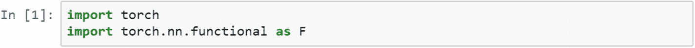

在以下几行脚本中，我们创建了一个简单的神经网络模型，将线性函数作为输入到隐藏层的激活函数，将隐藏层作为输出层。

下面的函数需要声明`class Net`，声明特性，隐藏神经元，激活函数，这些都可以很容易的被顺序模块代替。

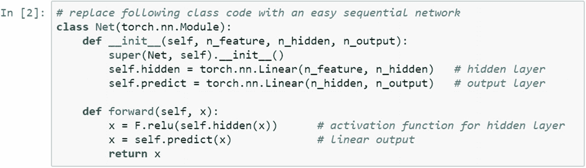

不使用这个脚本，我们可以改变类函数，用顺序函数代替它。Keras 函数取代了 TensorFlow 函数，这意味着许多行 TensorFlow 代码可以被几行 Keras 脚本取代。同样的事情在 PyTorch 中也是可能的，不需要任何外部模块。例如，在下文中，net2 解释顺序模型，net1 解释前面的脚本。从可读性的角度来看，net2 比 net1 好得多。

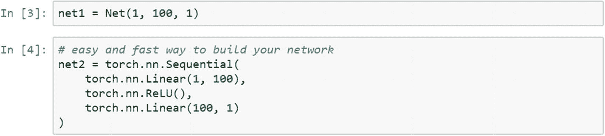

如果我们简单地打印 net1 和 net2 模型架构，它会做同样的事情。

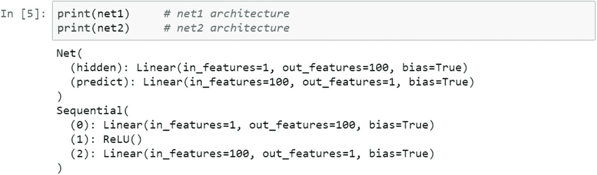

## 食谱 6-2。决定批量大小

### 问题

我们如何使用 PyTorch 对一个深度学习模型进行批量数据训练？

### 解决办法

训练一个深度学习模型需要大量的标注数据。典型地，它是找到一组权重和偏差的过程，使得损失函数相对于匹配目标标签变得最小。如果训练过程很好地逼近函数，则预测或分类变得稳健。

### 它是如何工作的

深度学习网络的训练有两种方法:批量训练和在线训练。训练算法的选择决定了学习的方法。如果算法是反向传播，那么在线学习更好。对于具有各种层的反向传播和正向传播的深度和广度的网络模型，那么批量训练更好。

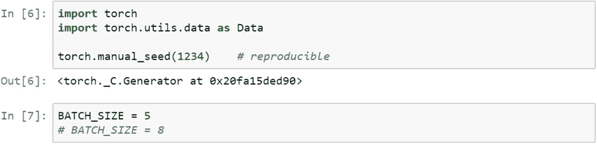

在训练过程中，批量为 5；我们可以将批量大小更改为 8，并查看结果。在在线训练过程中，根据预测结果和实际结果之间的差异来更新每个训练样本的权重和偏差。但是，在批量训练过程中，实际值和预测值之间的差异(即误差)会累积并计算为批量大小的单个数字，并在最终层报告。

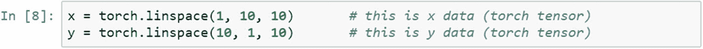

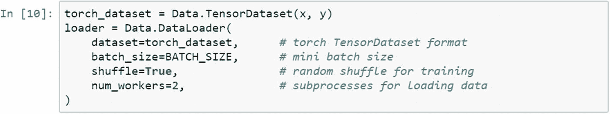

在对数据集进行五次迭代训练后，我们可以打印批处理和步骤。如果我们比较在线培训和批量培训，批量培训比在线培训有更多的优势。当需要训练一个巨大的数据集时，会有内存限制。当我们无法在 CPU 环境中处理一个巨大的数据集时，批量训练就来了。在 CPU 环境中，我们可以用较小的批量处理大量数据。

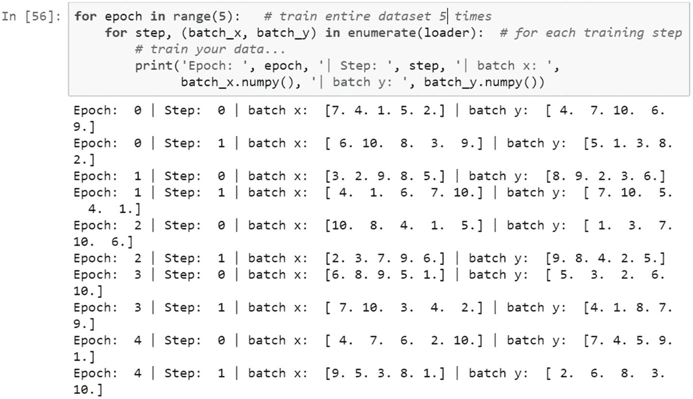

我们取批量为 8，重新训练模型。

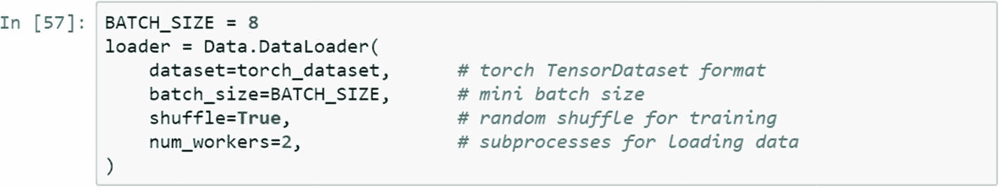

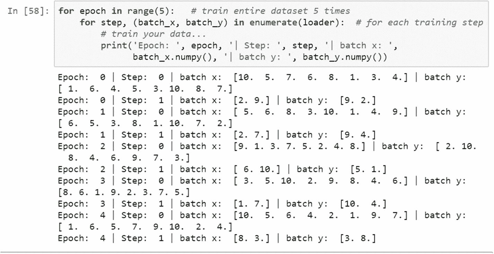

## 食谱 6-3。决定学习速度

### 问题

我们如何根据学习率和时代数确定最佳解决方案？

### 解决办法

我们采用一个样本张量，并应用各种替代模型和打印模型参数。学习率和历元数与模型精度相关联。为了达到损失函数的全局最小状态，重要的是将学习速率保持为最小，将历元数保持为最大，以便迭代可以将损失函数带到最小状态。

### 它是如何工作的

首先，需要导入必要的库。为了找到最小损失函数，梯度下降通常被用作优化算法，这是一个迭代过程。目标是找到损失函数相对于可训练参数的下降率。

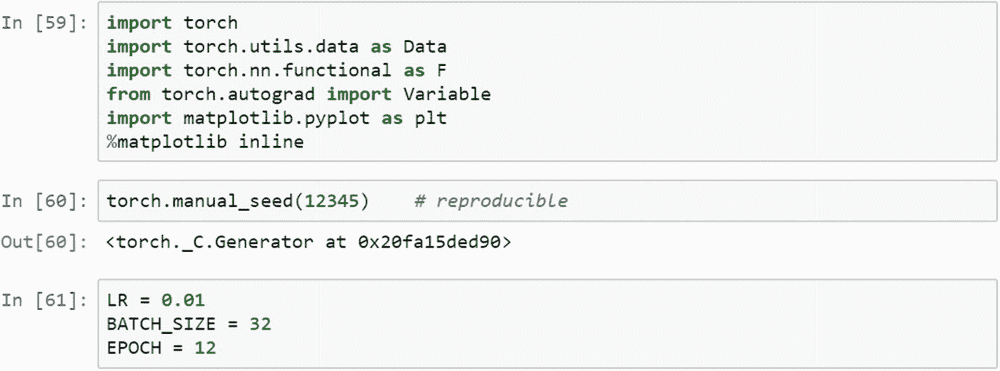

用于实验的样本数据集包括以下内容。

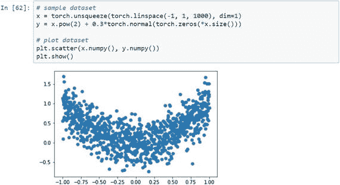

样本数据集和前五条记录如下所示。

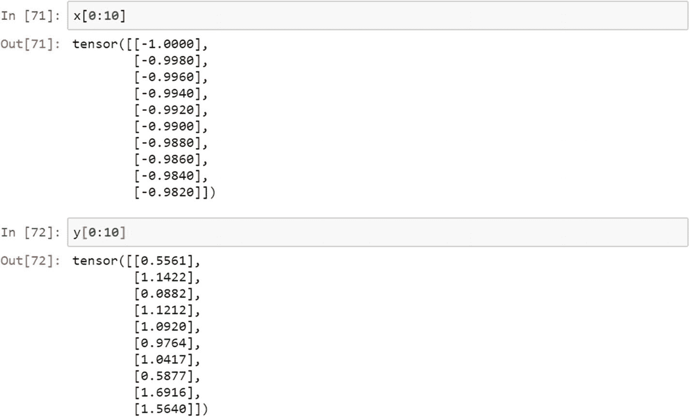

使用 PyTorch 实用函数，让我们加载张量数据集，引入批量大小，并进行测试。

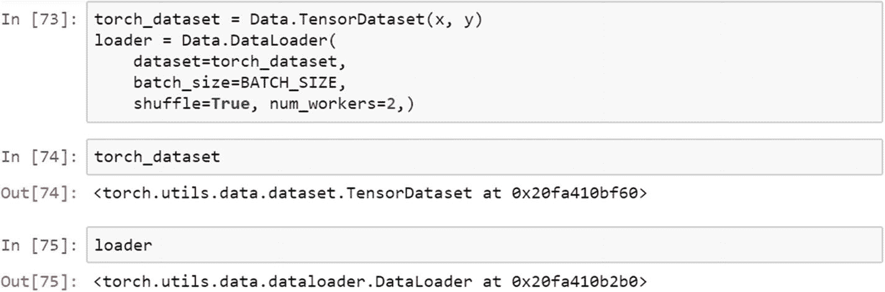

声明神经网络模块。

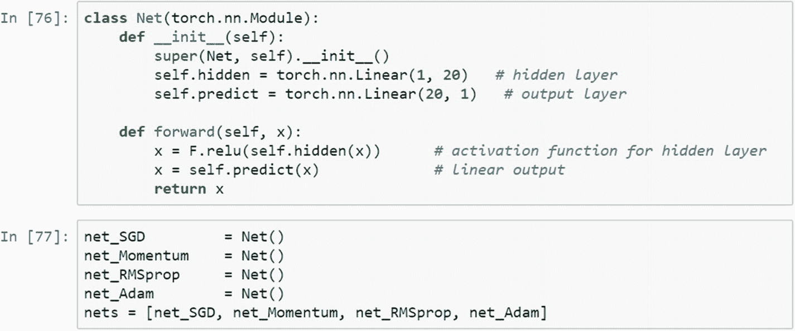

现在，我们来看看网络架构。

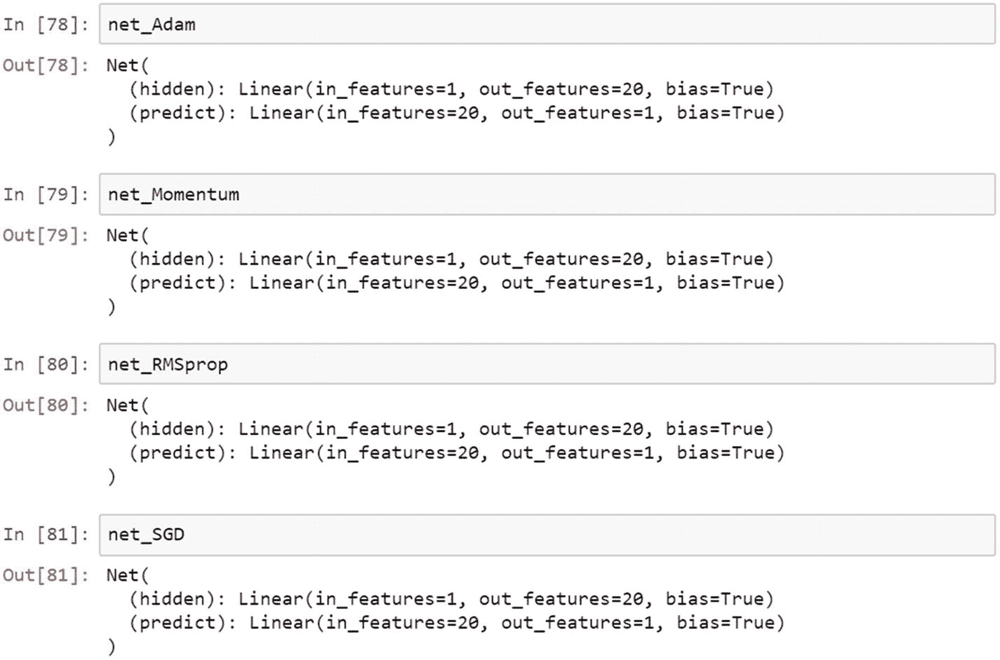

在执行优化时，我们可以包括许多选项；优中选优。

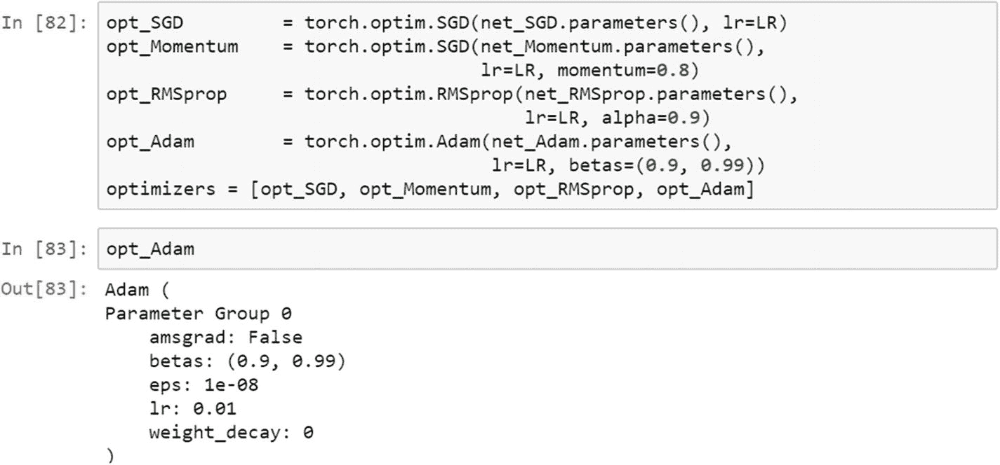

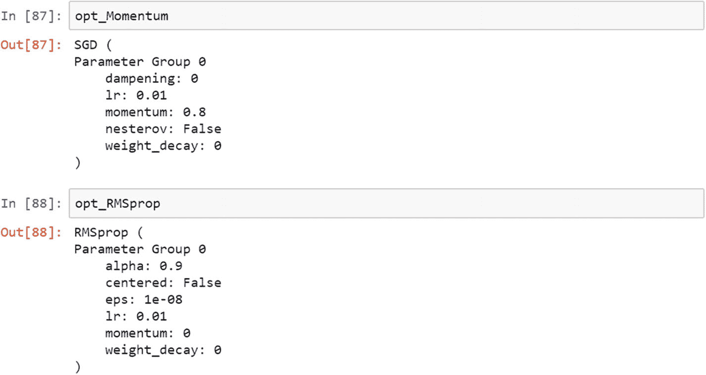

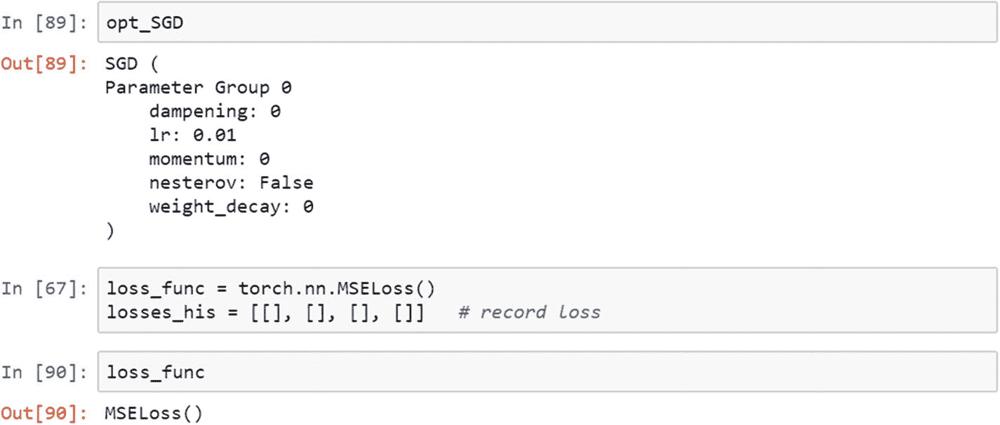

## 食谱 6-4。执行平行训练

### 问题

我们如何使用 PyTorch 执行包含大量模型的并行数据训练？

### 解决办法

优化器实际上是增加张量的函数。寻找最佳模型的过程需要并行训练许多模型。学习率、批量大小和优化算法的选择使模型与众不同，不同于其他模型。选择最佳模型的过程需要超参数优化。

### 它是如何工作的

首先，需要导入正确的库。三个超参数(学习速率、批量大小和优化算法)使得并行训练多个模型成为可能，并且最佳模型由测试数据集的准确性决定。以下脚本使用随机梯度下降算法、momentum、RMS prop 和 Adam 作为优化方法。

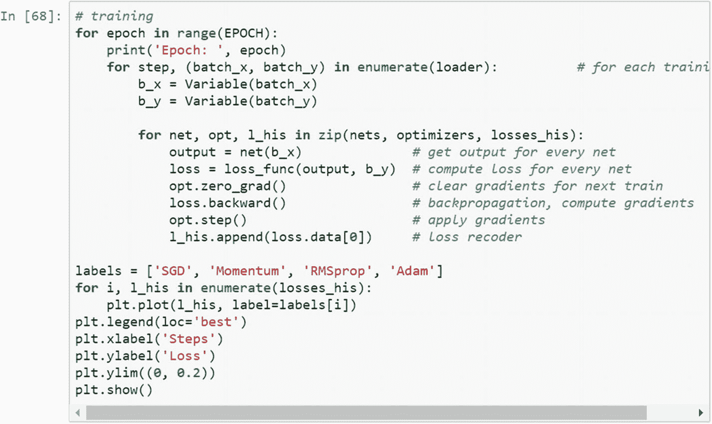

让我们看看图表和纪元。

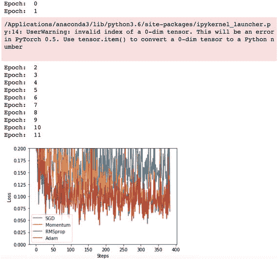

## 结论

在这一章中，我们看了使深度学习模型从训练数据集学习的各种方法。通过使用超参数可以使训练过程有效。选择正确的超参数是关键。深度学习模型(卷积神经网络、循环神经网络和深度神经网络)在架构方面不同，但训练过程和超参数保持相同。PyTorch 中超参数的选择和选择过程比其他任何框架都要容易得多。