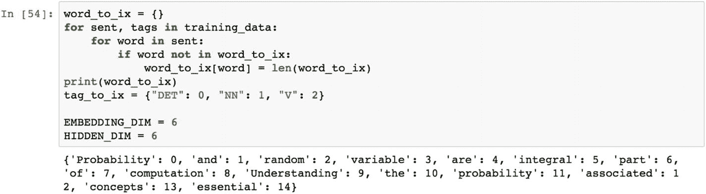

# 7.使用 PyTorch 的自然语言处理

自然语言处理是计算机科学的一个重要分支。它是通过执行各种任务的计算机对人类语言的研究。自然语言研究也被称为*计算语言学*。自然语言处理有两个不同的组成部分:自然语言理解和自然语言生成。*自然语言理解*涉及对输入语言的分析和知识，并对其做出反应。*自然语言生成*是从输入文本中创造语言的过程。语言可以有多种用途。一个词可能有不同的意思，因此消除歧义是自然语言理解的重要组成部分。

模糊度可以有三种类型。

*   *词汇歧义*基于词性；决定一个单词是名词、动词、副词等等。

*   *句法歧义*是一句话可以有多种解释；主语和谓语是中性的。

*   *指称歧义*与用文字表达的事件或场景有关。

文本分析是自然语言处理和理解的先导。文本分析意味着语料库创建创建一组收集的文档，然后删除空格、标点符号、停用词、符号、表情符号等没有文本意义的垃圾值。在清理之后，网络任务是以向量形式表示文本。这可以使用标准的 Word2vec 模型来完成，也可以用词频和逆文档频率格式(tf-idf)来表示。在当今世界，我们看到很多应用程序使用自然语言处理；以下是一些例子。

*   在线和智能手机上的拼写检查应用程序。用户键入一个特定的单词，系统检查该单词的意思，并建议是否需要纠正拼写。

*   在过去的十年里，关键词搜索已经成为我们生活中不可或缺的一部分。每当我们去餐馆、买东西或参观某个地方时，我们都会进行网上搜索。如果键入的关键字错误，则检索不到匹配项；然而，搜索引擎系统是如此的智能，它们预测用户的意图，并建议用户真正想要搜索的页面。

*   预想输入法用于各种聊天应用程序。用户键入一个单词，然后根据用户的书写模式，出现下一个单词的选项。用户被提示从列表中选择任何单词来构建他的句子。

*   像 Google Home、Amazon Alexa 等问答系统允许用户用自然语言与系统互动。系统处理这些信息，进行智能搜索，并为用户检索最佳结果。

*   替代数据提取是指用户无法获得实际数据，但用户可以使用互联网获取公开可用的数据，并搜索相关信息。例如，如果我想买一台笔记本电脑，我想在各种在线门户网站上比较该笔记本电脑的价格。我有一个系统从各种网站收集价格信息，并向我提供价格汇总。这个过程被称为*交替数据收集*使用网页抓取、文本处理和自然语言处理。

*   情感分析是从客户、用户或代理表达的文本中分析他们的情绪的过程。顾客评论、电影评论等等。需要对呈现的文本进行分析，并标记为积极情绪或消极情绪。使用情感分析可以构建类似的应用程序。

*   主题建模是在语料库中寻找不同主题的过程。例如，如果我们从科学、数学、英语和生物中提取文本，并将所有文本混在一起，然后让机器对文本进行分类，并告诉我们语料库中存在多少主题，机器会正确地将英语中的单词与生物、生物与科学等区分开来。这就叫完美的话题建模系统。

*   文本摘要是以较短的格式从语料库中总结文本的过程。如果我们有一个 1000 字的两页文档，我们需要用一个 200 字的段落来总结它，那么我们可以通过使用文本摘要算法来实现。

*   语言翻译是将一种语言翻译成另一种语言，例如英语翻译成法语，法语翻译成德语，等等。语言翻译帮助用户理解另一种语言，并使交流过程有效。

对人类语言的研究是不连续的，而且非常复杂。同一个句子可能有许多意思，但它是专门为特定的受众而构建的。要理解自然语言的复杂性，我们不仅需要工具和程序，还需要系统和方法。在自然语言处理中遵循以下五个步骤来理解来自用户的文本。

*   词法分析识别单词的结构。

*   句法分析是对英语语法和句法的研究。

*   语义分析是单词在上下文中的意思。

*   PoS(销售点)分析是对词类的理解和解析。

*   语用分析是在语境中理解一个词的真正含义。

在本章中，我们使用 PyTorch 来实现自然语言处理任务中最常用的步骤。

## 配方 7-1。单词嵌入

### 问题

我们如何使用 PyTorch 创建一个单词嵌入模型？

### 解决办法

单词嵌入是在向量结构中以有意义的方式表示单词、短语和记号的过程。输入文本被映射到实数向量；因此，特征向量可以用于机器学习或深度学习模型的进一步计算。

### 它是如何工作的

单词和短语以实向量格式表示。段落或文档中具有相似含义的单词或短语具有相似的向量表示。这使得计算过程可以有效地找到相似的单词。从文本创建嵌入向量有多种算法。Word2vec 和 GloVe 是执行单词嵌入的已知框架。让我们看看下面的例子。

下面设置一个嵌入层。

让我们看看示例文本。下面的文字有两段，每段有几个句子。如果我们对这两个段落应用单词嵌入，那么我们将从文本中获得实向量作为特征。这些特征可用于进一步的计算。

标记化是将句子分割成小块标记的过程，称为 *n-grams* 。如果是一个单词，这被称为*单字母词*，如果是两个单词，则称为*双字母词*，如果是三个单词，则称为*三字母词*，以此类推。

PyTorch n-gram 语言建模器可以提取相关的关键字。

n-gram 提取器有三个参数:要提取的词汇的长度、嵌入向量的维度和上下文大小。让我们看看损失函数和模型规格。

应用 Adam 优化器。

从句子中提取上下文也很重要。我们来看下面这个函数。

## 配方 7-2。PyTorch 中的 CBOW 模型

### 问题

我们如何使用 PyTorch 创建 CBOW 模型？

### 解决办法

向量中的单词和短语有两种不同的表示方法:*连续包词* (CBOW)和*跳克*。单词袋方法通过预测上下文中的单词或短语来学习嵌入向量。上下文是指当前单词前后的单词。如果我们取大小为 4 的上下文，这意味着当前单词左边的四个单词和它右边的四个单词被考虑用于上下文。该模型试图在另一个句子中找到这八个单词来预测当前单词。

### 它是如何工作的

让我们看看下面的例子。

从图形上看，单词袋模型如图 [7-1](#Fig1) 所示。它有三层:输入，是考虑单词和短语的嵌入向量；输出向量，它是由模型预测的相关单词；和投影层，投影层是由神经网络模型提供的计算层。

图 7-1

CBOW 模型表示

## 配方 7-3。LSTM 模型

### 问题

我们如何使用 PyTorch 创建一个 LSTM 模型？

### 解决办法

*长短期记忆* (LSTM)模型，又称*特定形式的递归神经网络*模型，常用于自然语言处理领域。文本和句子按顺序出现，组成一个有意义的句子，因此我们需要一个模型来记忆文本的长序列和短序列，以预测一个单词或文本。

### 它是如何工作的

让我们看看下面的例子。

准备一个单词序列作为训练数据，组成 LSTM 网络。

