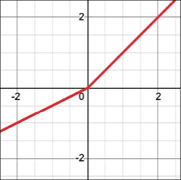
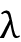

# 一、TF 和神经网络基础

在这一章中，我们学习 TensorFlow 的基础知识，tensor flow 是 Google 为机器学习和深度学习开发的开源库。此外，我们介绍了神经网络和深度学习的基础知识，这是机器学习的两个领域，在过去几年中有了令人难以置信的增长。本章背后的想法是提供进行基本但完全动手的深度学习所需的所有工具。

我们将学习:

*   TensorFlow和 Keras 是什么
*   神经网络导论
*   什么是感知器和多层感知器
*   一个真实的例子:识别手写数字

本章的所有代码文件都可以在 https://packt.link/dltfchp1 找到。

我们开始吧！

# What is TensorFlow (TF)?

TensorFlow 是一个强大的开源软件库，由 Google Brain 团队为深度神经网络开发，这是本书涵盖的主题。它于 2015 年 11 月在 Apache 2.0 许可下首次推出，此后发展迅速；截至 2022 年 5 月，其 GitHub 知识库([https://github.com/tensorflow/tensorflow](https://github.com/tensorflow/tensorflow))有超过 129，000 个提交，大约有 3，100 个贡献者。这本身就提供了 TensorFlow 受欢迎程度的衡量标准。

让我们先了解一下 TensorFlow 到底是什么，为什么它在深度神经网络研究人员和工程师中如此受欢迎。谷歌称其为“机器智能的开源软件库”，但既然有如此多的其他深度学习库，如 py torch(【https://pytorch.org/】)、Caffe(【https://caffe.berkeleyvision.org/】)和 MXNet([【https://mxnet.apache.org/】](https://mxnet.apache.org/))等，TensorFlow 有何特别之处？大多数其他深度学习库，如 TensorFlow，都有自动微分(一种用于优化的有用的数学工具)，许多都是开源平台。它们中的大多数都支持 CPU/GPU 选项，具有预训练的模型，并支持常用的 NN 架构，如循环神经网络、卷积神经网络和深度信念网络。那么，TensorFlow 还有什么呢？让我列出主要特性:

*   它适用于所有流行的语言，如 Python、C++、Java、R 和 Go。TensorFlow 为其他语言提供了稳定的 Python 和 c++ API，以及不保证向后兼容的 API。
*   Keras——已经与 TensorFlow 集成的高级神经网络 API(在 2.0 中，Keras 成为与 TensorFlow 交互的标准 API)。这个 API 规定了软件组件应该如何交互。
*   TensorFlow 允许模型部署并在生产中易于使用。
*   最重要的是，TensorFlow 有非常好的社区支持。

GitHub 上的明星数量(见*图 1.1* )是衡量所有开源项目受欢迎程度的指标。截至 2022 年 5 月，TensorFlow、Keras 和 PyTorch 分别拥有 165K、55K 和 56K 颗恒星，这使得 TensorFlow 成为最受欢迎的机器学习框架:


图 1.1:GitHub 上各种深度学习项目的星级数

# Keras 是什么？

Keras 是一个漂亮的 API，用于组成构建块来创建和训练深度学习模型。Keras 可以与多个深度学习引擎集成，包括 Google TensorFlow、微软 CNTK、亚马逊 MXNet 和 Theano。从 TensorFlow 2.0 开始，由 Franç ois Chollet 开发的 API Keras 被采用为标准的高级 API，大大简化了编码，使编程更加直观。

# 神经网络导论

人工神经网络(简称“网”或 ann)代表了一类机器学习模型，其灵感大致来自对哺乳动物中枢神经系统的研究。每一个人工神经网络都是由几个互连的“神经元”组成，这些神经元被组织成“层”一层中的神经元将消息传递给下一层中的神经元(用行话来说，它们“发射”)，这就是网络计算事物的方式。最初的研究开始于 20 世纪 50 年代早期，引入了“感知器”[1]，一种用于简单操作的双层网络，并在 20 世纪 60 年代后期进一步扩展，引入了用于高效多层网络训练的“反向传播”算法(根据[2]和[3])。一些研究认为，这些技术的根源要比通常引用的更早[4]。

直到 20 世纪 80 年代，神经网络一直是密集学术研究的主题，从那时起，其他更简单的方法变得更加相关。然而，自 2000 年代中期以来，人们的兴趣有所复苏，这主要归功于三个因素:G. Hinton 提出的突破性快速学习算法[3]、[5]和[6]；2011 年左右推出用于大规模数值计算的 GPUs 以及用于训练的大数据集合的可用性。

这些改进为现代“深度学习”开辟了道路，这是一类神经网络，其特征是大量的神经元层，能够基于渐进的抽象水平学习相当复杂的模型。几年前，当它开始使用 3-5 层时，人们开始称它为“深层”。现在 200 层以上的网络都是家常便饭！

这种通过渐进抽象的学习类似于在人脑中进化了数百万年的视觉模型。事实上，人类视觉系统分为不同的层次。首先，我们的眼睛与大脑中名为视觉皮层(V1)的区域相连，该区域位于我们大脑的后下部。这个区域是许多哺乳动物共有的，具有辨别基本属性的作用，如视觉方向、空间频率和颜色的微小变化。

据估计，V1 由大约 1.4 亿个神经元组成，神经元之间有数百亿个连接。V1 然后连接到其他领域，V2，V3，V4，V5 和 V6 进行越来越复杂的图像处理和识别更复杂的概念，如形状，面孔，动物，等等。据估计，大约有 160 亿个人类皮层神经元，大约 10-25%的人类皮层用于视觉[7]。深度学习从人类视觉系统的这种基于层的组织中获得了一些灵感:早期的人工神经元层学习图像的基本属性，而更深的层学习更复杂的概念。

这本书通过在 TensorFlow 中提供工作网络，涵盖了神经网络的几个主要方面。所以，我们开始吧！

# 感知器

“感知器”是一个简单的算法，给定输入向量 *x* 的 *m* 值(*x*1，*x*2，...，以及 *x* [m] )，通常称为输入特征或简称为特征，输出一个 *1* (“是”)或一个 *0* (“否”)。数学上，我们定义一个函数:


其中 *w* 是权重向量，是点积，而 *b* 是偏差。如果你还记得初等几何， *wx* + *b* 定义了一个边界超平面，它根据分配给 *w* 和 *b* 的值改变位置。注意，超平面是一个子空间，它的维数比其周围空间的维数小一。参见(*图 1.2* )中的示例:


图 1.2:一个超平面的例子

换句话说，这是一个非常简单却有效的算法！例如，给定三个输入特征，即一种颜色中红色、绿色和蓝色的数量，感知器可以尝试判断该颜色是否为“白色”。

注意，感知器不能表达一个“*也许*的答案。如果我们明白如何定义 *w* 和 *b* ，它可以回答“是”(1)或“否”(0)。这是“培训”过程，将在下面的章节中讨论。

## 我们第一个TensorFlow代码的例子

在`tf.keras`中创建 a 模型有三种方式:顺序 API、函数 API 和模型子类化。本章我们就用最简单的一个，`Sequential()`，另外两个在*第二章*、*回归和分类*中讨论。一个`Sequential()`模型是一个神经网络层的线性管道(堆栈)。这段代码片段定义了一个具有 10 个人工神经元的单一层，这些人工神经元需要 784 个输入变量(也称为特性)。请注意，该网络是“密集的”，这意味着一层中的每个神经元都连接到位于前一层中的所有神经元，以及下一层中的所有神经元:

```py
import tensorflow as tf

from tensorflow import keras

NB_CLASSES = 10

RESHAPED = 784

model = tf.keras.models.Sequential()

model.add(keras.layers.Dense(NB_CLASSES,

            input_shape=(RESHAPED,), kernel_initializer='zeros',

            name='dense_layer', activation='softmax')) 
```

每个神经元可以通过`'kernel_initializer'`参数用特定的权重初始化。有几种选择，下面列出了最常见的几种:

*   `random_uniform`:权重初始化为范围(-0.05，0.05)内的均匀随机小值。
*   `random_normal`:权重按照高斯分布初始化，均值为零，小标准差为 0.05。对于那些不熟悉高斯分布的人，考虑一下对称的“钟形曲线”形状。
*   `zero`:所有权重初始化为零。

完整的清单可在网上获得([https://www . tensor flow . org/API _ docs/python/TF/keras/initializer](https://www.tensorflow.org/api_docs/python/tf/keras/initializers))。

# 多层感知器:网络的第一个例子

在这一章中，我们给出了第一个有多个密集层的网络的例子。历史上，“感知器”是一个只有一个线性层的模型的名字，因此，如果它有多个层，我们称之为**多层感知器** ( **MLP** )。请注意，输入和输出层从外面是可见的，而中间的所有其他层都是隐藏的——因此得名*隐藏层*。在这种情况下，单层是简单的线性函数，因此 MLP 是通过一个接一个地堆叠多个单层而获得的:


图 1.3:多层感知器的例子

在*图 1.3* 中，第一个隐藏层中的每个节点接收一个输入，并根据相关线性函数值“触发”(0，1)。然后，第一隐藏层的输出被传递到第二层，在第二层应用另一个线性函数，其结果被传递到由一个单个神经元组成的最终输出层。有趣的是，正如我们前面讨论的那样，这种分层结构与人类视觉系统的结构有些相似。

## 感知器训练中的问题及解决方法

让我们考虑单个神经元。重量 *w* 和偏差 *b* 的最佳选择有哪些？理想情况下，我们希望提供一组训练示例，并让计算机调整权重和偏差，以使输出中产生的误差最小化。

为了更具体一点，让我们假设我们有一组猫的图片和另一组不包含猫的图片。假设每个神经元从图像中单个像素的值接收输入。当计算机处理这些图像时，我们希望我们的神经元调整它的权重和偏差，这样我们错误识别的图像就越来越少。

这种方法看起来非常直观，但它要求权重(或偏差)的微小变化只会导致输出的微小变化。想想看:如果我们有一个大的输出跳跃，我们就不能渐进地学习*。毕竟，孩子是一点一点学的。不幸的是，感知器不会显示这种“一点一点”的行为。感知器不是 0 就是 1，这是一个巨大的跳跃，对学习没有帮助(见*图 1.4* ):*

*

图 1.4:感知器的例子——0 或 1

我们需要不同的东西，更流畅的东西。我们需要一个从 0 到 1 连续变化的函数。从数学上来说，这意味着我们需要一个连续的函数来计算导数。你可能还记得，在数学中，导数是函数在给定点变化的量。对于输入由实数给出的函数，导数是图上一点切线的斜率。在这一章的后面，我们会看到为什么导数对学习很重要，当我们谈到梯度下降的时候。

## 激活功能:乙状结肠

当输入在范围内变化时，定义为并在下图中表示为的 sigmoid 函数在范围(0，1)内具有小的输出变化。数学上，函数是连续的。典型的 sigmoid 函数如图*图 1.5* 所示:


图 1.5:输出范围为(0，1)的 sigmoid 函数

神经元可以使用 sigmoid 来计算非线性函数。注意，如果 *z* = * wx * + *b* 非常大且为正，那么 so ，而如果*z*=*wx*+*b*非常大且为负，那么 so 。换句话说，具有 sigmoid 激活的神经元具有类似于感知器的行为，但是变化是渐进的，并且输出值如 0.5539 或 0.123191 是完全合法的。在这个意义上，一个乙状结肠神经元可以回答“也许”。

## 激活功能:tanh

另一个有用的激活功能是 tanh。定义为，其形状如图*图 1.6* 所示。其输出范围从-1 到 1:


图 1.6: Tanh 激活函数

## 激活功能:ReLU

“sigmoid”并不是用于神经网络的平滑激活函数的唯一类型。最近，一个名为 **ReLU** ( **整流线性单元**)的非常简单的函数变得非常流行，因为它有助于解决 sigmoids 观察到的一些优化问题。我们将在第五章、*循环神经网络*中讨论消失梯度时更详细地讨论这些问题。

一个 ReLU 简单定义为*f*(*x*)=*max*(0， *x* )，非线性函数如图*图 1.7* 所示。正如我们所见，对于负值，函数为零，对于正值，函数线性增长。ReLU 实现起来也非常简单(通常三条指令就足够了)，而 sigmoid 要高几个数量级。这有助于将神经网络挤压到早期的 GPU 上:


图 1.7:一个 ReLU 函数

## 两个额外的激活功能:ELU 和漏 ReLU

Sigmoid 和 ReLU 不是唯一用于学习的激活函数。

**指数线性单位** ( **ELU** )定义为和的，其图见*图 1.8* :


图 1.8:一个 ELU 函数

LeakyReLU 为定义为的，其图见*图 1.9* :



图 1.9:一个 LeakyReLU 函数

如果 *x* 为负，这两个函数都允许小的更新，这在某些情况下可能是有用的。

## 激活功能

Sigmoid、Tanh、ELU、Leaky ReLU 和 ReLU 在神经网络行话中一般称为*激活函数*。在梯度下降部分，我们将看到 sigmoid 和 ReLU 函数的典型渐变是开发一种学习算法的基本构件，该算法通过逐步减少我们的网络所犯的错误来逐渐适应。使用激活功能和(*x*1，*x*2 的示例，...、 *x* [m] )输入向量， *w* [1] 、 *w* [2] 、...、 *w* [m] )权重向量、 *b* 偏差、求和在*图 1.10* 中给出(注意 TensorFlow 支持许多激活函数，完整列表可在线获得):


图 1.10:线性函数后应用的激活函数示例

## 简而言之:神经网络到底是什么？

一句话，机器学习模型是一种计算函数的方法，该函数将一些输入映射到它们相应的输出。函数只不过是一些加法和乘法运算。然而，当与非线性激活结合并堆叠在多个层中时，这些功能可以学习几乎任何东西[8]。我们还需要一个有意义的指标来捕捉我们想要优化的内容(这就是所谓的损失函数，我们将在本书的后面介绍)，足够的数据来学习，以及足够的计算能力。

现在，停下来问我们自己“学习”到底是什么可能是有益的？嗯，我们可以说，就我们的目的而言，学习本质上是一个旨在概括已有的观察结果[9]以预测未来结果的过程。所以，简而言之，这正是我们想要用神经网络实现的目标。

# 一个真实的例子:识别手写数字

在这一部分，我们将构建一个能够识别手写数字的网络。为了实现这个目标，我们使用 MNIST([http://yann.lecun.com/exdb/mnist/](http://yann.lecun.com/exdb/mnist/))，一个由 60，000 个样本的训练集和 10，000 个样本的测试集组成的手写数字数据库。训练示例由人类用正确的答案进行注释。例如，如果手写数字是数字“3”，那么 3 只是与该示例相关联的标签。

在机器学习中，当具有正确答案的数据集可用时，我们说我们可以执行一种形式的*监督学习*。在这种情况下，我们可以使用训练示例来改进我们的网络。测试示例也有与每个数字相关的正确答案。然而，在这种情况下，想法是假装标签是未知的，让网络进行预测，然后稍后重新考虑标签，以评估我们的神经网络已经学会如何识别数字。不出所料，测试示例只是用来测试我们网络的性能。

每个 MNIST 图像都是灰度图像，由 28 x 28 像素组成。这些数字图像的子集如*图 1.11* 所示:


图 1.11:MNIST 图片集

## 一个热编码(OHE)

我们将使用 OHE 作为一个简单的工具来编码在神经网络内部使用的信息。在许多应用中，将分类(非数字)特征转换成数字变量是很方便的。例如，在[0–9]中具有值 *d* 的分类特征*数字*可以被编码成具有 10 个位置的二进制向量，除了第*d*个位置存在 1 之外，该向量总是具有 0 值。例如，数字 3 可以编码为[0，0，0，1，0，0，0，0，0，0，0，0]。

这种类型的表示被称为**单热点编码** ( **OHE** )或者有时简称为单热点，当学习算法专门处理数值函数时，这种表示在数据挖掘中非常常见。

## 在 TensorFlow 中定义简单的神经网络

在本节中，我们使用 TensorFlow 来定义一个识别 MNIST 手写数字的网络。我们从一个非常简单的神经网络开始，然后逐步改进它。

按照 Keras 的风格，TensorFlow 提供了合适的库([https://www . tensor flow . org/API _ docs/python/TF/Keras/datasets](https://www.tensorflow.org/api_docs/python/tf/keras/datasets))用于加载数据集，并将其分成训练集、`X_train` *、*用于微调我们的网络，以及测试集、`X_test` *、*用于评估性能。在本章的后面，我们将正式定义什么是训练集、验证集和测试集。现在，我们只需要知道训练集是用来让我们的神经网络从数据示例中学习的数据集。在训练神经网络时，数据被转换为`float32`以使用 32 位精度，并被规范化为范围【0，1】。此外，我们将真实标签分别加载到`Y_train`和`Y_test`中，并对其进行一键编码。让我们看看代码。

现在，不要太专注于理解为什么某些参数有特定的赋值，因为这些选择将在本书的其余部分讨论。直观地说，一个历元定义了训练应该持续多长时间，`BATCH_SIZE`是你一次在网络中输入的样本数量，而验证样本是为检查或证明训练过程的有效性而保留的数据量。我们选择`EPOCHS = 200`、`BATCH_SIZE = 128`、`VALIDATION_SPLIT=0.2`和`N_HIDDEN = 128`的原因将在本章后面更清楚，届时我们将探索不同的值并讨论超参数优化。让我们在 TensorFlow 中看看我们的第一个神经网络的代码片段。阅读很直观,但你会在接下来的页面中找到详细的解释:

```py
import tensorflow as tf

import numpy as np

from tensorflow import keras

# Network and training parameters.

EPOCHS = 200

BATCH_SIZE = 128

VERBOSE = 1

NB_CLASSES = 10   # number of outputs = number of digits

N_HIDDEN = 128

VALIDATION_SPLIT = 0.2 # how much TRAIN is reserved for VALIDATION

# Loading MNIST dataset.

# verify

# You can verify that the split between train and test is 60,000, and 10,000 respectively. 

# Labels have one-hot representation.is automatically applied

mnist = keras.datasets.mnist

(X_train, Y_train), (X_test, Y_test) = mnist.load_data()

# X_train is 60000 rows of 28x28 values; we  --> reshape it to 60000 x 784.

RESHAPED = 784

#

X_train = X_train.reshape(60000, RESHAPED)

X_test = X_test.reshape(10000, RESHAPED)

X_train = X_train.astype('float32')

X_test = X_test.astype('float32')

# Normalize inputs to be within in [0, 1].

X_train /= 255

X_test /= 255

print(X_train.shape[0], 'train samples')

print(X_test.shape[0], 'test samples')

# One-hot representation of the labels.

Y_train = tf.keras.utils.to_categorical(Y_train, NB_CLASSES)

Y_test = tf.keras.utils.to_categorical(Y_test, NB_CLASSES) 
```

从上面的代码中可以看到，输入层有一个神经元与图像中的每个像素相关联，总共有 28 x 28=784 个神经元，MNIST 图像中的每个像素对应一个神经元。

通常，与每个像素相关联的值在范围[0，1]内被归一化(这意味着每个像素的强度被最大强度值 255 除)。输出可以是十类中的一类，每一类对应一位数字。

最后一层是单个神经元，激活函数`'` `softmax'`，是 sigmoid 函数的推广。如前所述，当输入在范围内变化时，sigmoid 函数输出在范围(0，1)内。类似地，softmax 将任意实值的 K 维向量“挤压”成(0，1)范围内的 K 维实值向量，这样它们加起来都是 1。在我们的例子中，它用十个神经元聚合了前一层提供的十个答案。我们刚刚描述的是用下面的代码实现的:

```py
# Build the model.

model = tf.keras.models.Sequential()

model.add(keras.layers.Dense(NB_CLASSES,

            input_shape=(RESHAPED,),

            name='dense_layer', 

            activation='softmax')) 
```

一旦我们定义了模型，我们必须编译它，以便它可以由 TensorFlow 执行。在编译过程中有几个选择。首先，我们需要选择一个*优化器*，这是一个特定的算法，用于在我们训练模型时更新权重。

完整的优化器列表在[https://www . tensor flow . org/API _ docs/python/TF/keras/optimizer](https://www.tensorflow.org/api_docs/python/tf/keras/optimizers)。其次，我们需要选择一个*目标函数*、*、*，优化器使用该目标函数来导航权重空间(通常目标函数被称为*损失函数*或*成本函数*，优化的过程被定义为损失最小化*的过程*)。第三，我们需要评估训练好的模型。

目标函数的一些常见选择(损失函数的完整列表位于[https://www.tensorflow.org/api_docs/python/tf/keras/losses](https://www.tensorflow.org/api_docs/python/tf/keras/losses))如下:

*   `mse`，定义预测值和真实值之间的均方误差。数学上如果 *d* 是预测的向量而 *y* 是 *n* 观测值的向量，那么。注意，这个目标函数是每次预测中所有错误的平均值。如果预测值与真实值相差很远，那么平方运算会使这个距离变得更加明显。此外，无论给定值是正还是负，平方都可以累加误差。
*   `binary_crossentropy`，定义了二进制对数损失。假设我们的模型预测了 *p* 而目标是 *c* ，那么二元交叉熵定义为。注意，该目标函数适用于二进制标签预测。
*   `categorical_crossentropy`, which defines the multiclass logarithmic loss. Categorical cross-entropy compares the distribution of the predictions with the true distribution, with the probability of the true class set to 1 and 0 for the other classes. If the true class is *c* and the prediction is *y*, then the categorical cross-entropy is defined as:

    

    考虑多类对数损失的一种方法是将真正的类表示为一个热码编码向量，模型的输出越接近该向量，损失就越低。注意，该目标函数适用于多类标签预测。这也是 softmax 激活的默认选择。损失函数的完整列表在 https://www.tensorflow.org/api_docs/python/tf/keras/losses T2 的 T1 处。

一些常见的指标选择(指标的完整列表在 https://www.tensorflow.org/api_docs/python/tf/keras/metrics 的[有):](https://www.tensorflow.org/api_docs/python/tf/keras/metrics)

*   准确度，定义为正确预测占预测总数的比例。
*   精确度，定义为正确的肯定预测相对于正确和不正确的肯定预测的比例。
*   召回，定义为正确的正面预测相对于正面预测的实际数量的比例。

完整的指标列表位于[https://www.tensorflow.org/api_docs/python/tf/keras/metrics](https://www.tensorflow.org/api_docs/python/tf/keras/metrics)。度量类似于目标函数，唯一的区别是它们不用于训练模型，仅用于评估模型。然而，理解度量和目标函数之间的区别是很重要的。如前所述，损失函数用于优化您的网络。这是由选定的优化程序最小化的函数。相反，度量用于判断您的网络性能。这只是让你运行一个评估，它应该与优化过程分开。在某些情况下，直接针对特定指标进行优化是理想的。然而，一些度量对于它们的输入是不可微的，这使得它们不能被直接使用。

在 TensorFlow 中编译模型时，可以选择与给定模型一起使用的优化器、损失函数和指标:

```py
# Compiling the model.

model.compile(optimizer='SGD', 

              loss='categorical_crossentropy',

              metrics=['accuracy']) 
```

**随机梯度下降** ( **SGD** )是一种特殊的优化算法，用于减少神经网络在每个训练期后犯的错误。我们将在下一章回顾 SGD 和其他优化算法。一旦模型被编译，就可以用`fit()`方法对其进行训练，该方法指定了几个参数:

*   `epochs`是模型暴露于训练集的次数。在每次迭代中，优化器都试图调整权重，以使目标函数最小化。
*   `batch_size`是在优化器执行权重更新之前观察到的训练实例的数量；每个时期通常有许多批。

在 TensorFlow 中训练模型非常简单:

```py
# Training the model.

model.fit(X_train, Y_train,

          batch_size=BATCH_SIZE, epochs=EPOCHS,

          verbose=VERBOSE, validation_split=VALIDATION_SPLIT) 
```

请注意，我们已经为验证保留了部分训练集。关键思想是，我们保留一部分训练数据，用于在训练时测量验证的性能。对于任何机器学习任务来说，这都是一个很好的实践，也是我们将在所有例子中采用的一个。请注意，我们将在本章稍后讨论过拟合时回到验证。

一旦模型被训练，我们就可以在包含模型在训练阶段从未见过的新例子的测试集上评估它。

注意，当然训练集和测试集是严格分开的。在一个已经用于训练的例子上评估一个模型是没有意义的。在 TF 中，我们可以使用方法`evaluate(X_test, Y_test)`来计算`test_loss`和`test_acc`:

```py
#evaluate the model

test_loss, test_acc = model.evaluate(X_test, Y_test)

print('Test accuracy:', test_acc) 
```

恭喜你！您刚刚在 TensorFlow 中定义了您的第一个神经网络。几行代码，你的电脑应该可以识别手写数字。让我们运行代码，看看性能如何。

## 运行简单的TensorFlow网络并建立基线

所以，让我们看看运行代码时会发生什么:

```py
Model: "sequential"

_________________________________________________________________

Layer (type)                Output Shape              Param #    

=================================================================

dense_layer (Dense)         (None, 10)                7850       

=================================================================

Total params: 7,850

Trainable params: 7,850

Non-trainable params: 0

_________________________________________________________________

Train on 48000 samples, validate on 12000 samples

Epoch 1/200

48000/48000 [==============================] - 1s 31us/sample - loss: 2.1276 - accuracy: 0.2322 - val_loss: 1.9508 - val_accuracy: 0.3908

Epoch 2/200

48000/48000 [==============================] - 1s 23us/sample - loss: 1.8251 - accuracy: 0.5141 - val_loss: 1.6848 - val_accuracy: 0.6277

Epoch 3/200

48000/48000 [==============================] - 1s 25us/sample - loss: 1.5992 - accuracy: 0.6531 - val_loss: 1.4838 - val_accuracy: 0.7150

Epoch 4/200

48000/48000 [==============================] - 1s 27us/sample - loss: 1.4281 - accuracy: 0.7115 - val_loss: 1.3304 - val_accuracy: 0.7551

Epoch 5/200 
```

首先，网络架构被转储，我们可以看到所使用的不同类型的层，它们的输出形状，它们需要优化多少参数(即多少权重)，以及它们是如何连接的。然后在 48K 样本上训练网络，12K 留作验证。一旦神经模型建立起来，它就会在 10K 样本上进行测试。现在我们不会深入训练是如何发生的，但是我们可以看到程序运行了 200 次迭代，每次精度都有所提高。当训练结束时，我们在测试集上测试我们的模型，我们在训练数据集上实现了大约 89.96%的准确性，在验证上实现了 90.70%，在测试上实现了 90.71%。

```py
Epoch 199/200

48000/48000 [==============================] - 1s 22us/sample - loss: 0.3684 - accuracy: 0.8995 - val_loss: 0.3464 - val_accuracy: 0.9071

Epoch 200/200

48000/48000 [==============================] - 1s 23us/sample - loss: 0.3680 - accuracy: 0.8996 - val_loss: 0.3461 - val_accuracy: 0.9070

10000/10000 [==============================] - 1s 54us/sample - loss: 0.3465 - accuracy: 0.9071

Test accuracy: 0.9071 
```

这意味着近十分之一的图像被错误分类。我们当然可以做得更好。

## 带隐层TensorFlow中简单网络的改进

好的，我们在训练数据集上有 89.96%的准确性基线，在验证上有 90.70%，在测试上有 90.71%。这是一个好的起点，但我们可以改进它。让我们看看怎么做。

最初的改进是向我们的网络添加额外的层，因为这些额外的神经元可能会直观地帮助学习训练数据中更复杂的模式。换句话说，附加层增加了更多的参数，潜在地允许模型记忆更复杂的模式。因此，在输入层之后，我们有了第一个密集层，它有`N_HIDDEN`个神经元和一个激活函数`'relu'`。这个附加层被认为是*隐藏的*，因为它既不与输入也不与输出直接连接。在第一个隐藏层之后，我们有第二个隐藏层，也是有`N_HIDDEN`神经元，接着是一个有十个神经元的输出层，当相对数字被识别时，每个神经元都会触发。以下代码定义了这个新网络:

```py
import tensorflow as tf

from tensorflow import keras

# Network and training.

EPOCHS = 50

BATCH_SIZE = 128

VERBOSE = 1

NB_CLASSES = 10   # number of outputs = number of digits

N_HIDDEN = 128

VALIDATION_SPLIT = 0.2 # how much TRAIN is reserved for VALIDATION

# Loading MNIST dataset.

# Labels have one-hot representation.

mnist = keras.datasets.mnist

(X_train, Y_train), (X_test, Y_test) = mnist.load_data()

# X_train is 60000 rows of 28x28 values; we reshape it to 60000 x 784.

RESHAPED = 784

#

X_train = X_train.reshape(60000, RESHAPED)

X_test = X_test.reshape(10000, RESHAPED)

X_train = X_train.astype('float32')

X_test = X_test.astype('float32')

# Normalize inputs to be within in [0, 1].

X_train, X_test = X_train / 255.0, X_test / 255.0

print(X_train.shape[0], 'train samples')

print(X_test.shape[0], 'test samples')

# Labels have one-hot representation.

Y_train = tf.keras.utils.to_categorical(Y_train, NB_CLASSES)

Y_test = tf.keras.utils.to_categorical(Y_test, NB_CLASSES)

# Build the model.

model = tf.keras.models.Sequential()

model.add(keras.layers.Dense(N_HIDDEN,

             input_shape=(RESHAPED,),

             name='dense_layer', activation='relu'))

model.add(keras.layers.Dense(N_HIDDEN,

             name='dense_layer_2', activation='relu'))

model.add(keras.layers.Dense(NB_CLASSES,

             name='dense_layer_3', activation='softmax'))

# Summary of the model.

model.summary()

# Compiling the model.

model.compile(optimizer='SGD', 

              loss='categorical_crossentropy',

              metrics=['accuracy'])

# Training the model.

model.fit(X_train, Y_train,

          batch_size=BATCH_SIZE, epochs=EPOCHS,

          verbose=VERBOSE, validation_split=VALIDATION_SPLIT)

# Evaluating the model.

test_loss, test_acc = model.evaluate(X_test, Y_test)

print('Test accuracy:', test_acc) 
```

注意，`to_categorical(Y_train, NB_CLASSES)`将数组`Y_train`转换成一个矩阵，矩阵中的列与类的数量一样多。行数保持不变。例如，如果我们有:

```py
> labels

array([0, 2, 1, 2, 0]) 
```

然后:

```py
to_categorical(labels)

array([[ 1.,  0.,  0.],

       [ 0.,  0.,  1.],

       [ 0.,  1.,  0.],

       [ 0.,  0.,  1.],

       [ 1.,  0.,  0.]], dtype=float32) 
```

让我们运行代码，看看这个多层网络会产生什么结果:

```py
_________________________________________________________________

Layer (type)                Output Shape              Param #    

=================================================================

dense_layer (Dense)         (None, 128)               100480     

dense_layer_2 (Dense)       (None, 128)               16512      

dense_layer_3 (Dense)       (None, 10)                1290       

=================================================================

Total params: 118,282

Trainable params: 118,282

Non-trainable params: 0

_________________________________________________________________

Train on 48000 samples, validate on 12000 samples

Epoch 1/50

48000/48000 [==============================] - 3s 63us/sample - loss: 2.2507 - accuracy: 0.2086 - val_loss: 2.1592 - val_accuracy: 0.3266 
```

前面的输出显示了运行的初始步骤，而下面的输出显示了结论。还不错。如以下输出所示，通过添加两个隐藏层，我们在训练数据集上达到了 90.81%，在验证上达到了 91.40%，在测试上达到了 91.18%。这意味着，相对于之前的网络，我们提高了测试数据集的准确性，并将迭代次数从 200 次减少到 50 次。那很好，但是我们想要更多。

如果你愿意，你可以自己玩，看看如果你只添加一个隐藏层而不是两个，或者如果你添加两个以上的层，会发生什么。我把这个实验作为一个练习:

```py
Epoch 49/50

48000/48000 [==============================] - 1s 30us/sample - loss: 0.3347 - accuracy: 0.9075 - val_loss: 0.3126 - val_accuracy: 0.9136

Epoch 50/50

48000/48000 [==============================] - 1s 28us/sample - loss: 0.3326 - accuracy: 0.9081 - val_loss: 0.3107 - val_accuracy: 0.9140

10000/10000 [==============================] - 0s 40us/sample - loss: 0.3164 - accuracy: 0.9118

Test accuracy: 0.9118 
```

注意，在一定数量的纪元后，改进停止(或者变得几乎察觉不到)。在机器学习中，这是一种叫做*收敛*的现象。

## 对TensorFlow中简单网络的进一步改进

现在我们的基线是训练集的 90.81%，验证集的 91.40%，测试集的 91.18%。第二个改进非常简单。我们决定以`DROPOUT`的概率随机丢弃一些在我们内部密集的隐藏层网络中传播的值。在机器学习中，这是一种众所周知的正则化形式。令人惊讶的是，这种随机丢弃一些值的想法可以提高我们的性能。这种改进背后的想法是，随机退出*迫使*网络学习对更好的泛化有用的冗余模式:

```py
import tensorflow as tf

import numpy as np

from tensorflow import keras

# Network and training.

EPOCHS = 200

BATCH_SIZE = 128

VERBOSE = 1

NB_CLASSES = 10   # number of outputs = number of digits

N_HIDDEN = 128

VALIDATION_SPLIT = 0.2 # how much TRAIN is reserved for VALIDATION

DROPOUT = 0.3

# Loading MNIST dataset.

# Labels have one-hot representation.

mnist = keras.datasets.mnist

(X_train, Y_train), (X_test, Y_test) = mnist.load_data()

# X_train is 60000 rows of 28x28 values; we reshape it to 60000 x 784.

RESHAPED = 784

#

X_train = X_train.reshape(60000, RESHAPED)

X_test = X_test.reshape(10000, RESHAPED)

X_train = X_train.astype('float32')

X_test = X_test.astype('float32')

# Normalize inputs within [0, 1].

X_train, X_test = X_train / 255.0, X_test / 255.0

print(X_train.shape[0], 'train samples')

print(X_test.shape[0], 'test samples')

# One-hot representations for labels.

Y_train = tf.keras.utils.to_categorical(Y_train, NB_CLASSES)

Y_test = tf.keras.utils.to_categorical(Y_test, NB_CLASSES)

# Building the model.

model = tf.keras.models.Sequential()

model.add(keras.layers.Dense(N_HIDDEN,

              input_shape=(RESHAPED,),

              name='dense_layer', activation='relu'))

model.add(keras.layers.Dropout(DROPOUT))

model.add(keras.layers.Dense(N_HIDDEN,

              name='dense_layer_2', activation='relu'))

model.add(keras.layers.Dropout(DROPOUT))

model.add(keras.layers.Dense(NB_CLASSES,

              name='dense_layer_3', activation='softmax'))

# Summary of the model.

model.summary()

# Compiling the model.

model.compile(optimizer='SGD', 

              loss='categorical_crossentropy',

              metrics=['accuracy'])

# Training the model.

model.fit(X_train, Y_train,

          batch_size=BATCH_SIZE, epochs=EPOCHS,

          verbose=VERBOSE, validation_split=VALIDATION_SPLIT)

# Evaluating the model.

test_loss, test_acc = model.evaluate(X_test, Y_test)

print('Test accuracy:', test_acc) 
```

让我们像以前一样运行代码 200 次迭代，我们看到这个网络在训练上达到 91.70%的准确率，在验证上达到 94.42%的准确率，在测试上达到 94.15%的准确率:

```py
Epoch 199/200

48000/48000 [==============================] - 2s 45us/sample - loss: 0.2850 - accuracy: 0.9177 - val_loss: 0.1922 - val_accuracy: 0.9442

Epoch 200/200

48000/48000 [==============================] - 2s 42us/sample - loss: 0.2845 - accuracy: 0.9170 - val_loss: 0.1917 - val_accuracy: 0.9442

10000/10000 [==============================] - 1s 61us/sample - loss: 0.1927 - accuracy: 0.9415

Test accuracy: 0.9415 
```

请注意，人们经常观察到，在内部隐藏层中具有随机漏失的网络可以更好地“概括”测试集中包含的看不见的例子。直觉上，我们可以认为这种现象是每个神经元变得更有能力，因为它知道它不能依赖于它的邻居。此外，它还迫使信息以冗余的方式存储。在测试过程中没有信号丢失，所以我们现在正在使用我们所有高度调谐的神经元。简而言之，这通常是一个很好的方法来测试一个网络在采用某些下降函数时的表现。

除此之外，注意训练精度应该还是在测试精度之上；否则，我们可能训练的时间不够长。在我们的例子中就是这种情况，因此我们应该增加历元的数量。然而，在进行这种尝试之前，我们需要引入一些其他概念，以使训练更快地收敛。再来说说优化师。

## 在 TensorFlow 中测试不同的优化器

既然我们已经定义了并使用了一个网络，那么使用一个类比开始发展一些关于网络如何被训练的直觉是有用的。让我们把的重点放在一种流行的训练技巧上，叫做**梯度下降** ( **GD** )。想象一个单一变量 *w* 中的一般成本函数 *C* ( *w* )，如图 1.12 所示:


图 1.12:GD 优化的一个例子

GD 可以被看作是一个徒步旅行者，他需要沿着一个陡坡向下航行，目的是进入一个沟渠。斜率代表函数 *C* ，而沟代表最小值*C*min。徒步者有一个起点*w*0。徒步旅行者一点一点地移动；想象一下，能见度几乎为零，所以徒步旅行者看不到自动前进的方向，他们以之字形前进。在每一步 *r* ，梯度是最大增加的方向。

数学上，该方向是在点*w*r 处评估的偏导数的值，在步骤 *r* 处到达。因此，通过选择相反的方向，徒步旅行者可以向沟渠移动。

在每一步，徒步旅行者可以决定在下一站之前要走多远。这就是 GD 行话中所谓的“学习率”。请注意，如果太小，那么徒步旅行者将移动缓慢。然而，如果太高，那么徒步旅行者可能会因为跨过它而错过沟渠。

现在你应该记住，sigmoid 是一个连续函数，它是可以计算导数的。可以证明 sigmoid 有导数。

ReLU 在 0 处不可微。然而，我们可以通过将 0 处的一阶导数定义为 0 或 1，将其扩展到整个区域上的函数。

ReLU 的分段导数为。

一旦我们有了导数，就有可能用 GD 技术优化网络。TensorFlow 代表我们计算导数，因此我们不需要担心实现或计算它。

神经网络本质上是具有数千甚至数百万个参数的多个可导函数的组合。每个网络层计算一个函数，该函数的误差应该最小化，以便提高在学习阶段观察到的精度。当我们讨论反向传播时，我们会发现最小化游戏比我们的玩具例子要复杂一些。然而，它仍然是基于同样的直觉，即沿着一个斜坡向下到达一个沟渠。

TensorFlow 实现了一种称为**随机梯度下降** ( **SGD** )的 GD 快速变体，以及许多更高级的优化技术，如 RMSProp 和 Adam。RMSProp 和 Adam 除了 SGD 的加速度分量之外，还包括动量(一个速度分量)的概念。这以更多的计算为代价实现了更快的收敛。想想一个徒步旅行者，他开始向一个方向移动，然后决定改变方向，但记得以前的选择。可以证明，动量有助于在相关方向上加速 SGD，并抑制振荡[10]。

到目前为止，SGD 是我们默认的选择。所以现在让我们试试另外两个。这很简单；我们只需要修改几行:

```py
# Compiling the model.

model.compile(optimizer='RMSProp', 

              loss='categorical_crossentropy', metrics=['accuracy']) 
```

就是这样。我们来测试一下。

```py
_________________________________________________________________

Layer (type)                Output Shape              Param #    

=================================================================

dense_layer (Dense)         (None, 128)               100480     

dropout_2 (Dropout)         (None, 128)               0          

dense_layer_2 (Dense)       (None, 128)               16512      

dropout_3 (Dropout)         (None, 128)               0          

dense_layer_3 (Dense)       (None, 10)                1290       

=================================================================

Total params: 118,282

Trainable params: 118,282

Non-trainable params: 0

_________________________________________________________________

Train on 48000 samples, validate on 12000 samples

Epoch 1/10

48000/48000 [==============================] - 2s 48us/sample - loss: 0.4715 - accuracy: 0.8575 - val_loss: 0.1820 - val_accuracy: 0.9471

Epoch 2/10

48000/48000 [==============================] - 2s 36us/sample - loss: 0.2215 - accuracy: 0.9341 - val_loss: 0.1268 - val_accuracy: 0.9361

Epoch 3/10

48000/48000 [==============================] - 2s 39us/sample - loss: 0.1684 - accuracy: 0.9497 - val_loss: 0.1198 - val_accuracy: 0.9651

Epoch 4/10

48000/48000 [==============================] - 2s 43us/sample - loss: 0.1459 - accuracy: 0.9569 - val_loss: 0.1059 - val_accuracy: 0.9710

Epoch 5/10

48000/48000 [==============================] - 2s 39us/sample - loss: 0.1273 - accuracy: 0.9623 - val_loss: 0.1059 - val_accuracy: 0.9696

Epoch 6/10

48000/48000 [==============================] - 2s 36us/sample - loss: 0.1177 - accuracy: 0.9659 - val_loss: 0.0941 - val_accuracy: 0.9731

Epoch 7/10

48000/48000 [==============================] - 2s 35us/sample - loss: 0.1083 - accuracy: 0.9671 - val_loss: 0.1009 - val_accuracy: 0.9715

Epoch 8/10

48000/48000 [==============================] - 2s 35us/sample - loss: 0.0971 - accuracy: 0.9706 - val_loss: 0.0950 - val_accuracy: 0.9758

Epoch 9/10

48000/48000 [==============================] - 2s 35us/sample - loss: 0.0969 - accuracy: 0.9718 - val_loss: 0.0985 - val_accuracy: 0.9745

Epoch 10/10

48000/48000 [==============================] - 2s 35us/sample - loss: 0.0873 - accuracy: 0.9743 - val_loss: 0.0966 - val_accuracy: 0.9762

10000/10000 [==============================] - 1s 2ms/sample - loss: 0.0922 - accuracy: 0.9764

Test accuracy: 0.9764 
```

如您所见，RMSProp 比 SDG 更快,因为我们能够在仅仅 10 个时期内实现训练数据集上 97.43%的准确率、验证上 97.62%的准确率和测试上 97.64%的准确率。这是对 SDG 的重大改进。现在我们有了一个非常快速的优化器，让我们尝试将历元的数量显著增加到 250，我们在训练数据集上获得了 98.99%的准确性，在验证上获得了 97.66%，在测试上获得了 97.77%。

```py
Epoch 248/250

48000/48000 [==============================] - 2s 40us/sample - loss: 0.0506 - accuracy: 0.9904 - val_loss: 0.3465 - val_accuracy: 0.9762

Epoch 249/250

48000/48000 [==============================] - 2s 40us/sample - loss: 0.0490 - accuracy: 0.9905 - val_loss: 0.3645 - val_accuracy: 0.9765

Epoch 250/250

48000/48000 [==============================] - 2s 39us/sample - loss: 0.0547 - accuracy: 0.9899 - val_loss: 0.3353 - val_accuracy: 0.9766

10000/10000 [==============================] - 1s 58us/sample - loss: 0.3184 - accuracy: 0.9779

Test accuracy: 0.9779 
```

当历元数增加时，观察在训练和测试集上的准确度如何增加是有用的(参见*图 1.13* )。如您所见，这两条曲线在大约 15 个时期相交，因此在该点之后无需进一步训练:


图 1.13:rms prop 的准确性和损失示例

好的，让我们试试另一个优化器`Adam()`。实现起来很简单:

```py
# Compiling the model.

model.compile(optimizer='Adam', 

              loss='categorical_crossentropy',

              metrics=['accuracy']) 
```

如我们所见，`Adam()`略胜一筹。使用 Adam，我们在训练数据集上实现了 98.94%的准确性，在验证上实现了 97.89%，在 50 次迭代的测试上实现了 97.82%。

```py
Epoch 49/50

48000/48000 [==============================] - 3s 55us/sample - loss: 0.0313 - accuracy: 0.9894 - val_loss: 0.0868 - val_accuracy: 0.9808

Epoch 50/50

48000/48000 [==============================] - 2s 51s/sample - loss: 0.0321 - accuracy: 0.9894 - val_loss: 0.0983 - val_accuracy: 0.9789

10000/10000 [==============================] - 1s 66us/step - loss: 0.0964 - accuracy: 0.9782

Test accuracy: 0.9782 
```

再一次，让我们绘制当历元数量增加时，训练集和测试集的准确度如何增加(见*图 1.14* )。您会注意到，通过选择 Adam 作为优化器，我们能够在大约 12 个时期或步骤后停止:


图 1.14:Adam 的准确性和损失的例子

注意，这是我们的第五个变体，记住我们的初始基线在测试数据集上是 90.71%。到目前为止，我们已经取得了进步。然而，现在收获越来越难获得。请注意，我们正在优化 30%的辍学率。为了完整起见，报告不同漏失值的测试数据集的准确性可能是有用的(见*图 1.15* )。在这个例子中，我们选择 Adam 作为优化器。请注意，优化器的选择不是凭经验，我们可以根据问题-优化器的组合获得不同的性能:


图 1.15:不同压差值的精度变化示例

## 增加纪元的数量

让我们再做一次尝试，将用于训练的历元数从 20 增加到 200。不幸的是，这种选择增加了我们十倍的计算时间，却没有给我们带来任何好处。实验不成功，但是我们已经知道，如果我们花更多的时间学习，我们不一定会提高结果。学习更多的是采用聪明的技术，而不一定是花费在计算上的时间。让我们在下图中跟踪我们的五个变量:


图 1.16:不同模型和优化器的精确度

## 控制优化器学习率

我们可以采用另一种方法,这涉及到改变我们的优化器的学习参数。正如你在*图 1.17* 中看到的，我们的三个实验[lr=0.1，lr=0.01，lr=0.001]达到的最佳值是 0.1，这是优化器的默认学习率。很好！亚当开箱即用:


图 1.17:不同学习率的准确度

## 增加内部隐藏神经元的数量

还有一种方法是改变内部隐藏神经元的数量。我们报告了越来越多的隐藏神经元的实验结果。我们看到，通过增加模型的复杂性，运行时间显著增加，因为有越来越多的参数需要优化。然而，随着网络的增长，我们通过增加网络规模获得的收益越来越少(参见*图 1.18* 、*图 1.19* 和*图 1.20* ):


图 1.18:内部隐藏神经元递增值的参数数量

另一方面，所需时间随着内部网络规模的增加而增加(见*图 1.19* ):


图 1.19:增加内部隐藏神经元值的计算时间秒

请注意，在某个值之后增加隐藏神经元的数量会降低准确性，因为网络可能无法很好地进行概括(如图*图 1.20* 所示):


图 1.20:内部隐藏神经元增加值的测试精度

## 增加批量计算的规模

GD 试图最小化训练集中提供的所有示例的成本函数，同时，最小化作为输入提供的所有特征的成本函数【】。SGD 是一个便宜得多的变体，它只考虑`BATCH_SIZE`个例子。那么，让我们看看当我们改变这个参数时，它是如何表现的。如您所见，在我们的四次实验中，a `BATCH_SIZE=64`达到了最佳精度值(参见*图 1.21* ):


图 1.21:不同批次值的测试准确度

## 总结实验运行到识别手写数字

所以，让我们总结一下:通过五种不同的变体，我们能够将我们的性能从 90.71%提高到 97.82%。首先，我们在 TensorFlow 中定义了一个简单的层网络。然后，我们通过添加一些隐藏层来提高性能。之后，我们通过在我们的网络中添加一些随机退出点，然后通过试验不同类型的优化器来提高测试集的性能:

|  | **精度** |
| **型号** | **训练** | **验证** | **测试** |
| **简单** | 89.96% | 90.70% | 90.71% |
| **两个隐藏层(128)** | 90.81% | 91.40% | 91.18% |
| **辍学(30%)** | 91.70% | 94.42% | 94.15% (200 个时代) |
| **RMSProp** | 97.43% | 97.62% | 97.64% (10 个时期) |
| **亚当** | 98.94% | 97.89% | 97.82% (10 个时期) |

表 1.1:不同准确度水平的实验总结

然而，接下来的两个实验(未在*表 1.1* 中显示)并没有提供显著的改进。增加内部神经元的数量会产生更复杂的模型，需要更昂贵的计算，但它只能提供边际收益。如果我们增加训练时期的数量，我们有相同的经验。最后一个实验包括为我们的优化器更改`BATCH_SIZE`。这也提供了边际结果。

# 正规化

在本节中，我们将回顾一些改进培训阶段的最佳实践。特别地，将讨论正则化和批量规范化。

## 采用正则化避免过拟合

直觉上，一个好的机器学习模型应该在训练数据上实现低误差。在数学上，这相当于在给定模型的情况下最小化训练数据的损失函数:


然而，这可能还不够。为了捕捉由训练数据固有表达的所有关系，模型可能变得过于复杂。这种复杂性的增加可能会带来两个负面后果。首先，一个复杂的模型可能需要大量的时间来执行。第二，一个复杂的模型可能在训练数据上取得很好的性能，但在验证数据上表现很差。这是因为该模型能够在特定的训练环境中设计许多参数之间的关系，但是这些关系实际上在更一般化的环境中并不存在。导致一个模型失去以这种方式概括的能力被称为“过度拟合”再说一遍，学习更多的是概括而不是记忆。另一个需要考虑的现象是“欠拟合”

当数据模型无法准确捕捉输入和输出变量之间的关系时，就会出现这种情况,训练集和新的看不见的数据的错误率都很高:


图 1.22:损失函数和过拟合

根据经验，如果在训练过程中，我们看到在验证时损失在最初减少后增加，那么我们就有一个模型复杂性的问题，它过度拟合了训练数据。

为了解决过拟合问题，我们需要一种方法来捕捉模型的复杂性，即模型可以有多复杂。解决办法可能是什么？模型只不过是一个权重向量。每个权重都会影响输出，除了那些为零或非常接近的权重。因此，模型的复杂性可以方便地表示为非零权重的数量。换句话说，如果我们有两个模型 M1 和 M2 在损失函数方面达到几乎相同的性能，那么我们应该选择最简单的模型，具有最少非零权重的模型。我们可以使用超参数来控制简单模型的重要性，如以下公式所示:


机器学习中使用三种不同类型的正则化:

*   L1 正则化(也称为套索)。模型的复杂度被表示为权重绝对值的和。
*   L2 正则化(也称为岭)。模型的复杂度表示为权重的平方和。
*   弹性网正则化。通过结合上述两种技术，可以捕捉到模型的复杂性。

请注意，使用正则化是提高网络泛化性能的一种好方法，尤其是在明显过度拟合的情况下。这组实验留给有兴趣的读者作为练习。

另请注意，TensorFlow 支持 L1、L2 和弹性网正则化。正则化子的完整列表在[https://www . tensor flow . org/API _ docs/python/TF/keras/regulators](https://www.tensorflow.org/api_docs/python/tf/keras/regularizers)。添加正则化很容易:

```py
from tf.keras.regularizers import l2, activity_l2

model.add(Dense(64, input_dim=64, W_regularizer=l2(0.01),

    activity_regularizer=activity_l2(0.01))) 
```

## 了解批处理规范化

批量规范化是另一种形式的规范化，也是最近几年提出的最有效的改进之一。批量规范化使我们能够加速训练，在某些情况下通过将训练时期减半，并且它提供了一些规范化。在训练期间，早期层中的权重自然地改变，因此后面层的输入可以显著地改变。换句话说，每一层必须不断地重新调整其权重，以适应每一批的不同分布。这可能会大大减慢模型的训练。关键思想是使层输入在分布上更相似，一批接一批，一个又一个时期。

另一个问题是，sigmoid 激活函数在接近 0 时工作得很好，但当值离 0 足够远时，往往会“卡住”。如果偶尔神经元输出波动远离 sigmoid 零点，则所述神经元变得不能更新其自身的权重。

因此，另一个关键思想是将层输出转换成接近零的高斯分布单位。这样，各层批次之间的差异将显著减少。数学上，公式很简单。通过从中减去批次平均值，激活输入 x 以零为中心。然后将结果除以、批方差之和和一个防止被零除的小数字。然后，我们使用一个线性变换来确保在训练中应用规范化效果。

这样，和是在训练阶段以类似于任何其他层的方式得到优化的参数。批量标准化已被证明是提高训练速度和准确性的非常有效的方法，因为它有助于防止激活变得太小和消失或者太大和爆炸。

# 使用 Google Colab:CPU、GPU 和 TPU

谷歌提供了一个真正直观的工具，用于训练神经网络和免费使用 TensorFlow 。你可以在 https://colab.research.google.com/的找到一个真正的 Colab，可以免费访问，如果你熟悉 Jupyter 笔记本，你会在这里找到一个非常熟悉的基于网络的环境。 **Colab** 代表 **Colaboratory** ，是谷歌的一个研究项目，旨在帮助传播机器学习教育和研究。我们将在第 15 章、*张量处理单元*中看到 CPU、GPU 和 TPU 之间的区别。

目前，重要的是要知道 CPU 是通用的处理单元，而 GPU 和 TPU 是加速器，是适合深度学习的特定处理单元。让我们看看它是如何工作的，从*图 1.23* 所示的截图开始:


图 1.23:Colab 中的笔记本示例

通过访问 Colab，我们可以查看过去生成的笔记本列表，或者创建一个新的笔记本。支持不同版本的 Python。

当我们创建一个新笔记本时，我们还可以选择是在 CPU、GPU 上运行，还是在 Google 的 TPU 上运行，如图*图 1.24* 所示:


图 1.24:选择所需的硬件加速器(无、GPU 或 TPUs)——第一步

通过访问**编辑**菜单中的**笔记本设置**选项(参见*图 1.24* 和*图 1.25* ，我们可以选择所需的硬件加速器(**无**、**GPU**或**TPU**)。谷歌将免费分配这些资源，尽管它们可以在任何时候撤回，例如在负载特别重的时候。根据我的经验，这是一个非常罕见的事件，你几乎可以在任何时候访问 Colab。然而，要有礼貌，不要做一些像免费开始挖掘比特币的事情——你几乎肯定会被驱逐！


图 1.25:选择所需的硬件加速器(无、GPU 或 TPUs)——第二步

下一步是将您的代码(参见*图 1.26* )插入到适当的 Colab 笔记本单元格中，然后*瞧！*你可以走了。执行代码和快乐的深度学习，而没有购买非常昂贵的硬件来开始实验的麻烦！*图 1.26* 包含了一个谷歌笔记本中的代码示例:


图 1.26:笔记本中的代码示例

# 情感分析

我们用来测试 Colab 的代码是什么？这是基于 IMDB 数据集开发的情感分析的一个例子。IMDB 数据集包含来自互联网电影数据库的 50，000 条电影评论的文本。每个评论要么是正面的，要么是负面的(例如，赞成或反对)。该数据集分为 25，000 条用于训练的评论和 25，000 条用于测试的评论。我们的目标是建立一个分类器，可以预测给定文本的二元判断。我们可以通过`tf.keras`轻松地加载 IMDB，评论中的单词序列已经被转换为整数序列，其中每个整数代表字典中的一个特定单词。我们也有一种方便的方法将句子填充到`max_len`中，这样我们就可以使用所有的句子，不管是短的还是长的，作为神经网络的输入，输入向量的大小是固定的:

```py
import tensorflow as tf

from tensorflow.keras import datasets, layers, models, preprocessing

import tensorflow_datasets as tfds

max_len = 200

n_words = 10000

dim_embedding = 256

EPOCHS = 20

BATCH_SIZE = 500

def load_data():

    # Load data.

    (X_train, y_train), (X_test, y_test) = datasets.imdb.load_data(num_words=n_words)

    # Pad sequences with max_len.

    X_train = preprocessing.sequence.pad_sequences(X_train, maxlen=max_len)

    X_test = preprocessing.sequence.pad_sequences(X_test, maxlen=max_len)

    return (X_train, y_train), (X_test, y_test) 
```

现在让我们建立一个模型。我们将使用几个层，这将在*第 4 章*、*词嵌入*中详细解释。现在，让我们假设`embedding()`层将把评论中包含的单词的稀疏空间映射到更密集的空间。这将使计算更容易。此外，我们将使用一个`GlobalMaxPooling1D()`层，它从每个`n_words`特征中获取任一特征向量的最大值。另外，我们还有两个`Dense()`层。最后一个由单个神经元组成，具有用于进行最终二进制估计的 sigmoid 激活函数:

```py
def build_model():

    model = models.Sequential()

    # Input: - eEmbedding Layer.

    # The model will take as input an integer matrix of size (batch, input_length).

    # The model will output dimension (input_length, dim_embedding).

    # The largest integer in the input should be no larger

    # than n_words (vocabulary size).

    model.add(layers.Embedding(n_words, 

        dim_embedding, input_length=max_len))

    model.add(layers.Dropout(0.3))

    # Takes the maximum value of either feature vector from each of the n_words features.

    model.add(layers.GlobalMaxPooling1D())

    model.add(layers.Dense(128, activation='relu'))

    model.add(layers.Dropout(0.5))

    model.add(layers.Dense(1, activation='sigmoid'))

    return model 
```

现在我们需要训练我们的模型，这段代码与我们对 MNIST 所做的非常相似。让我们看看:

```py
(X_train, y_train), (X_test, y_test) = load_data()

model = build_model()

model.summary()

model.compile(optimizer = "adam", loss = "binary_crossentropy",

 metrics = ["accuracy"]

)

score = model.fit(X_train, y_train,

 epochs = EPOCHS,

 batch_size = BATCH_SIZE,

 validation_data = (X_test, y_test)

)

score = model.evaluate(X_test, y_test, batch_size=BATCH_SIZE)

print("\nTest score:", score[0])

print('Test accuracy:', score[1]) 
```

让我们看看网络，然后运行几次迭代:

```py
___________________________________________________________________

Layer (type)                  Output Shape              Param #    

===================================================================

embedding (Embedding)         (None, 200, 256)          2560000    

dropout (Dropout)             (None, 200, 256)          0          

global_max_pooling1d (Global  (None, 256)               0          

dense (Dense)                 (None, 128)               32896      

dropout_1 (Dropout)           (None, 128)               0          

dense_1 (Dense)               (None, 1)                 129        

===================================================================

Total params: 2,593,025

Trainable params: 2,593,025

Non-trainable params: 0 
```

如下面的输出所示，我们达到了 85%的准确率，这对于一个简单的网络来说一点也不差:

```py
Epoch 20/20

25000/25000 [==============================] - 23s 925ms/sample - loss: 0.0053 - accuracy: 0.9991 - val_loss: 0.4993 - val_accuracy: 0.8503

25000/25000 [==============================] - 2s 74us/sample - loss: 0.4993 - accuracy: 0.88503

Test score: 0.4992710727453232

Test accuracy: 0.85028 
```

下一节将专门讨论优化超参数和 AutoML。

## 超参数调谐和自动

上面定义的实验提供了一些微调网络的机会。然而，对这个例子有效的不一定对其他例子有效。对于给定的神经网络，确实有多个参数可以优化(例如隐藏神经元的数量、批量大小、历元数量，以及根据网络本身的复杂程度而定的许多其他参数)。这些参数被称为“超参数”，以区别于网络本身的参数，即权重和偏差的值。

超参数调整是寻找最小化成本函数的那些超参数的最优组合的过程。关键思想是，如果我们有 *n* 个超参数，那么我们可以想象它们定义了一个具有 *n* 维的空间，目标是找到这个空间中对应于成本函数的最优值的点。实现该目标的一种方法是在该空间中创建网格，并系统地检查每个网格顶点的成本函数所假定的值。换句话说，超参数被分成桶，并且通过强力方法检查不同的值组合。

如果你认为这个微调超参数的过程是手动的并且昂贵，那么你绝对是对的！然而，在过去几年中，我们已经看到了 AutoML 的重大成果，AutoML 是一套旨在自动调整超参数和自动搜索最佳网络架构的研究技术。我们将在*第 13 章*、*AutoML*介绍中对此进行更多讨论。

# 预测产量

一旦一个网络被训练，它当然可以被用来做预测。在 TensorFlow 中，这很简单。我们可以用这个方法:

```py
# Making predictions.

predictions = model.predict(X) 
```

对于给定的输入，可以计算几种类型的输出，包括用于计算损失值的方法`model.evaluate()`，用于计算类别输出的方法`model.predict_classes()`，以及用于计算类别概率的方法`model.predict_proba()`。

# 反向传播的实用概述

多层感知器通过称为反向传播的过程从训练数据中学习。在这一段我们将给出一个直觉，而更多细节在*第 14 章*、*深度学习背后的数学*。这个过程可以被描述为一种一旦发现错误就逐步纠正错误的方法。让我们看看这是如何工作的。

请记住，每个神经网络层都有一组关联的权重，用于确定一组给定输入的输出值。此外，请记住，神经网络可以有多个隐藏层。

开始时，所有的权重都是随机分配的。然后，为训练集中的每个输入激活神经网络:值从输入级通过隐藏级向前传播*到输出级，在输出级进行预测。*

请注意，我们保持图 1.27 简单，仅用绿色虚线表示几个值，但实际上，所有值都通过网络向前传播:


图 1.27:反向传播中的前进步骤

因为我们知道训练集中的真实观察值，所以可以计算预测中的误差。回溯的关键直觉是将误差传播回来(见*图 1.28* )，使用适当的优化算法，如 GD，调整神经网络的权重，以减少误差(同样为了简单起见，这里只表示几个误差值):


图 1.28:反向传播中的后退步骤

从输入到输出的正向传播和误差的反向传播过程重复几次，直到误差低于预定阈值。整个过程如图 1.29 所示:


图 1.29:向前传播和向后传播

特征代表输入，标签在这里用于驱动学习过程。该模型以这样的方式更新，即损失函数逐渐最小化。在神经网络中，真正重要的不是单个神经元的输出，而是每一层中调整的集体权重。因此，网络逐步调整其内部权重，使预测增加正确预测的标签数量。当然，使用正确的特征集和有质量标记的数据是在学习过程中最小化偏差的基础。

# 到目前为止我们学到了什么？

在本章中，我们已经学习了神经网络的基础知识。更具体地说，我们已经了解了什么是感知器，什么是多层感知器，如何在 TensorFlow 中定义神经网络，如何在建立好的基线后逐步改进指标，以及如何微调超参数空间。除此之外，我们还知道可用的激活函数(sigmoid 和 ReLU ),以及如何使用基于 GD、SGD 或更复杂方法(如 Adam 和 RMSProp)的反向传播算法来训练网络。

# 走向深度学习的方法

在玩手写数字识别时，我们得出的结论是，我们越接近 99%的准确率，就越难提高。如果我们想要更多的改进，我们肯定需要一个新的想法。我们遗漏了什么？想想吧。

基本的直觉是，在我们到目前为止的例子中，我们没有利用图像的局部空间结构，这意味着我们将利用图像可以被描述为具有数据局部性的矩阵的事实。具体来说，这段代码将表示每个书写数字的位图转换为平面向量，其中局部空间结构(一些像素彼此更接近的事实)消失了:

```py
# X_train is 60000 rows of 28x28 values; we  --> reshape it as in 60000 x 784.

X_train = X_train.reshape(60000, 784)

X_test = X_test.reshape(10000, 784) 
```

然而，这并不是我们大脑的工作方式。请记住，我们的视觉是基于多个皮层级别的，每一个级别都识别越来越多的结构化信息，同时仍然保持局部性。首先，我们看到单个像素，然后从中我们识别简单的几何形状，然后是越来越复杂的元素，如物体、人脸、人体、动物等等。

在*第 3 章*中，我们将看到一种被称为**卷积神经网络** ( **CNN** )的特定类型的深度学习网络已经被开发出来，它同时考虑了保留图像中的局部空间结构的想法(更一般地，在任何具有空间结构的信息类型中)和通过渐进抽象级别进行学习的想法:一层只能学习简单的模式；通过不止一层，你可以学习多种模式。在讨论 CNN 之前，我们需要讨论 TensorFlow 架构的一些方面，并对一些额外的机器学习概念进行实际介绍。

# 摘要

在本章中，我们学习了什么是TensorFlow和 Keras，并介绍了带有感知器和多层感知器的神经网络。然后，我们看到了一个经过多次优化的识别手写数字的真实例子。

下一章专门讨论回归和分类。

# 参考

1.  罗森布拉特，F. (1958)。感知机:大脑中信息存储和组织的概率模型。*T3【心理】。Rev，第 65 卷，第 386-408 页。*
2.  沃博斯，P. J. (1990 年)。穿越时间的反向传播:它做什么以及如何做。继续。IEEE，第 78 卷，第 1550-1560 页。
3.  Hinton，G. E .，Osindero，s .和 Teh，Y. W. (2006 年)。*深度信念网的快速学习算法*。神经计算，第 18 卷，第 1527-1554 页。
4.  Schmidhuber，J. (2015 年)。*神经网络中的深度学习:概述*。神经网络:关闭。J. Int。神经网络。社会主义者，第 61 卷，第 85-117 页。
5.  利文(1996 年)。反向传播的根源:从有序衍生到神经网络和政治预测。神经网络，第 9 卷。
6.  鲁梅尔哈特、辛顿和威廉姆斯(1986)。*通过反向传播误差学习表征*。《自然》，第 323 卷。
7.  赫库兰诺-胡泽尔(2009 年)。数字中的人类大脑:线性放大的灵长类大脑。前面。哼。神经科学。，第三卷。
8.  Hornick，m . Stinchcombe 和 h . White(1989 年)。*多层前馈网络是通用逼近器*。神经网络第 2 卷，第 5 期。第 359-366 页。
9.  v . n . VAP Nik(2013 年)。*统计学习理论的本质*。
10.  Sutskever，I .，Martens，j .，Dahl，g .，Hinton，g .(2013 年)。*论初始化和动量在深度学习中的重要性*。第 30 届机器学习国际会议，ICML。

# 加入我们书的不和谐空间

加入我们的 Discord 社区，结识志同道合的朋友，与 2000 多名会员一起学习:[https://packt.link/keras](https://packt.link/keras)

*