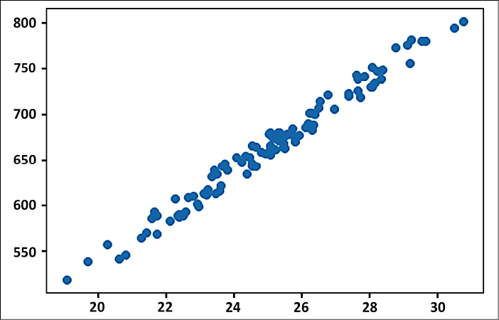
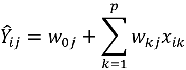

# 二、回归和分类

回归和分类是几乎所有机器学习应用中普遍存在的两个基本任务。它们在从工程、物理科学、生物学、金融市场到社会科学的各个领域都有应用。它们是统计学家和数据科学家手中的基本工具。在本章中，我们将讨论以下主题:

*   回归
*   分类
*   分类和回归的区别
*   线性回归
*   不同类型的线性回归
*   使用 TensorFlow Keras API 进行分类
*   应用线性回归估计房价
*   应用逻辑回归识别手写数字

本章的所有代码文件都可以在[https://packt.link/dltfchp2](https://packt.link/dltfchp2)找到

让我们首先从理解回归到底是什么开始。

# 什么是回归？

回归通常是人们在机器学习中使用的第一个算法。它允许我们通过了解一组给定的因变量和自变量之间的关系，从数据中做出预测。它几乎在每个领域都有用途；任何对绘制两个或更多事物之间的关系感兴趣的地方都会发现回归的用途。

考虑房价估算的情况。有许多因素会对房价产生影响:房间数量、建筑面积、位置、便利设施的可用性、停车位等等。回归分析可以帮助我们找到这些因素与房价之间的数学关系。

让我们想象一个更简单的世界，只有房子的面积决定它的价格。利用回归，我们可以确定房屋面积(**自变量**:这些变量不依赖任何其他变量)和价格(**因变量**:这些变量依赖一个或多个自变量)之间的关系。后来，我们可以利用这种关系来预测任何给定面积的房子的价格。想了解更多关于因变量和自变量以及如何识别它们，可以参考本帖:[https://medium . com/deep learning-concepts-and-implementation/independent-and-dependent-variables-in-machine-learning-210 b 82 f 891 db](https://medium.com/deeplearning-concepts-and-implementation/independent-and-dependent-variables-in-machine-learning-210b82f891db)。在机器学习中，自变量通常输入到模型中，因变量从我们的模型中输出。

根据自变量的数量、因变量的数量和关系类型，我们有许多不同类型的回归。回归有两个重要组成部分:自变量和因变量之间的*关系*，以及不同自变量对因变量的*影响强度*。在下一节中，我们将详细了解广泛使用的线性回归技术。

# 使用线性回归进行预测

**线性回归**是最广为人知的建模技术之一。它已经存在了 200 多年，人们已经从几乎所有可能的角度对它进行了探索。线性回归假设输入变量( *X* )和输出变量( *Y* )之间存在线性关系。线性回归的基本思想是建立一个模型，使用训练数据预测给定输入的输出，从而预测输出与输入 *X* 的观察训练输出 *Y* 一样接近。它包括找到预测值的线性方程，其形式为:


其中为 *n* 输入变量，为线性系数， *b* 为偏置项。我们还可以将前面的等式扩展为:


偏差项允许我们的回归模型在没有任何输入的情况下提供一个输出；它为我们提供了一个选项来转换我们的数据以获得更好的拟合。输入样本 *i* 的观测值( *Y* )和预测值()之间的误差为:


目标是找到系数 *W* 和偏差 *b* 的最佳估计值，使得观察值 *Y* 和预测值之间的误差最小。让我们通过一些例子来更好地理解这一点。

## 简单线性回归

如果我们只考虑一个自变量和一个因变量，我们得到的就是一个简单的线性回归。考虑前面部分定义的房价预测的情况；房屋面积( *A* )为自变量，房屋价格( *Y* )为因变量。我们希望找到预测价格和 *A* 之间的线性关系，形式如下:


其中 *b* 是偏置项。因此，我们需要确定 *W* 和 *b* ，使得价格 *Y* 和预测价格之间的误差最小。用来估计 *W* 和 *b* 的标准方法叫做最小二乘法，也就是我们尽量使误差的平方和( *S* )最小。对于前一种情况，表达式变为:


我们要估计回归系数、 *W* 和 *b* ，使得 *S* 最小化。我们使用函数的导数在其最小值处为 0 的事实来得到这两个方程:


这两个方程可以解出两个未知数。为此，我们首先展开第二个等式中的求和:


看一看左手边的最后一项；它只是总结了一个常数 *N* 时间。因此，我们可以将其改写为:


重新排序这些术语，我们得到:


右边的两个术语可以分别用平均价格(产出)的和平均面积(投入)的来代替，因此我们得到:


以类似的方式，我们展开关于重量 *W* 的 *S* 的偏微分方程:


用表达式代替偏差项 *b* :


重新排列等式:


玩转均值定义，我们可以由此得出重量值 *W* 为:


其中和分别是均价和面积。让我们在一些简单的样本数据上尝试一下:

1.  我们导入必要的模块。这是一个简单的例子，所以我们将只使用 NumPy、pandas 和 Matplotlib:

    ```
    import tensorflow as tf

    import numpy as np

    import matplotlib.pyplot as plt

    import pandas as pd 
    ```

2.  接下来，我们生成具有线性关系的随机数据。为了使它更真实，我们还添加了随机噪声元素。你可以看到两个变量(原因，`area`和结果，`price`)遵循一个正的线性关系:

    ```
    #Generate a random data

    np.random.seed(0)

    area = 2.5 * np.random.randn(100) + 25

    price = 25 * area + 5 + np.random.randint(20,50, size = len(area))

    data = np.array([area, price])

    data = pd.DataFrame(data = data.T, columns=['area','price'])

    plt.scatter(data['area'], data['price'])

    plt.show() 
    ```



图 2.1:房屋面积和价格之间的散点图

1.  现在，我们使用我们定义的方程计算两个回归系数。你可以看到结果非常接近我们模拟的线性关系:

    ```
    W = sum(price*(area-np.mean(area))) / sum((area-np.mean(area))**2)

    b = np.mean(price) - W*np.mean(area)

    print("The regression coefficients are", W,b) 
    ```

    ```
    -----------------------------------------------

    The regression coefficients are 24.815544052284988 43.4989785533412 
    ```

2.  现在让我们尝试使用获得的权重和偏差值来预测新的价格:

    ```
    y_pred = W * area + b 
    ```

3.  Next, we plot the predicted prices along with the actual price. You can see that predicted prices follow a linear relationship with the area:

    ```
    plt.plot(area, y_pred, color='red',label="Predicted Price")

    plt.scatter(data['area'], data['price'], label="Training Data")

    plt.xlabel("Area")

    plt.ylabel("Price")

    plt.legend() 
    ```

    

    图 2.2:预测值与实际价格

从*图 2.2* 可以看出，预测值与实际房价遵循相同的趋势。

## 多元线性回归

前面的例子很简单，但事实很少如此。在大多数问题中，因变量依赖于多个自变量。多元线性回归在多个独立输入变量( *X* 和因变量( *Y* )之间找到一个线性关系，这样它们就满足了预测的 *Y* 值的形式:


其中为 *n 个*独立输入变量，为线性系数， *b* 为偏差项。

和前面一样，线性系数 *W* [s] 是用最小二乘法来估计的，即最小化预测值(和观测值( *Y* )的平方差之和。因此，我们试图最小化损失函数(也称为平方误差，如果我们除以 n，就是均方差):


其中所有训练样本的总和。

你可能已经猜到了，现在，我们将有 *n+1* 个方程，而不是两个，我们将需要同时求解这些方程。更简单的替代方法是使用 TensorFlow Keras API。我们将很快了解如何使用 TensorFlow Keras API 来执行回归任务。

## 多元线性回归

可能存在独立变量影响一个以上从属变量的情况。例如，考虑我们想要预测火箭速度和二氧化碳排放量的情况——这两个现在将是我们的因变量，并且两者都将受到读取燃料量、发动机类型、火箭主体等的传感器的影响。这是多元线性回归的一个例子。数学上，多元回归模型可以表示为:



其中和。术语代表第*I*第个输入样本对应的第*j*T5 个预测输出值， *w* 代表回归系数，*x*ik 是第*I*第个输入样本的*k*第个特征。在这种情况下，求解所需的方程的数量现在将是*n×m*。虽然我们可以使用矩阵来求解这些方程，但这一过程的计算量很大，因为它涉及到计算逆矩阵和行列式。一种更简单的方法是使用梯度下降和最小二乘误差作为损失函数，并使用 TensorFlow API 包含的许多优化器之一。

在下一节中，我们将更深入地研究 TensorFlow Keras API，这是一个通用的高级 API，可以轻松地开发您的模型。

# 线性回归的神经网络

在前面的章节中，我们使用数学表达式来计算线性回归方程的系数。在本节中，我们将了解如何使用神经网络执行回归任务，并使用 TensorFlow Keras API 构建神经网络模型。

在使用神经网络执行回归之前，让我们先回顾一下什么是神经网络。简单来说，神经网络是由许多人工神经元组成的网络。从*第 1 章*、*带 TF 的神经网络基础*中，我们知道最简单的神经网络，即(简单的)感知器，在数学上可以表示为:


其中 *f* 是激活函数。考虑一下，如果我们有 *f* 作为线性函数，那么上面的表达式类似于我们在上一节中学到的线性回归的表达式。换句话说，我们可以说神经网络，也称为函数逼近器，是广义的回归器。接下来，让我们尝试使用 TensorFlow Keras API 构建一个神经网络简单回归器。

## 使用TensorFlow角的简单线性回归

在第一章中，我们学习了如何在 TensorFlow Keras 中建立一个模型。这里，我们将使用相同的`Sequential` API，使用`Dense`类构建一个单层感知器(全连接神经网络)。我们将继续讨论同一个问题，即在给定房子面积的情况下预测房子的价格:

1.  我们从导入我们需要的包开始。注意在导入包

    ```
    import tensorflow as tf

    import numpy as np

    import matplotlib.pyplot as plt

    import pandas as pd

    import tensorflow.keras as K

    from tensorflow.keras.layers import Dense 
    ```

    中添加了`Keras`模块和`Dense`层
2.  接下来，我们生成数据，就像前面的例子一样:

    ```
    #Generate a random data

    np.random.seed(0)

    area = 2.5 * np.random.randn(100) + 25

    price = 25 * area + 5 + np.random.randint(20,50, size = len(area))

    data = np.array([area, price])

    data = pd.DataFrame(data = data.T, columns=['area','price'])

    plt.scatter(data['area'], data['price'])

    plt.show() 
    ```

3.  神经网络的输入应该标准化；这是因为输入与权重相乘，如果我们有非常大的数字，相乘的结果将会很大，很快我们的度量可能会跨越无穷大(您的计算机可以处理的最大数字):

    ```
    data = (data - data.min()) / (data.max() - data.min())  #Normalize 
    ```

4.  让我们现在建立模型；由于它是一个简单的线性回归器，我们使用一个只有一个单元的`Dense`层:

    ```
    model = K.Sequential([

                          Dense(1, input_shape = [1,], activation=None)

    ])

    model.summary() 
    ```

    ```
    Model: "sequential"

    ____________________________________________________________

     Layer (type)           Output Shape              Param #   

    ============================================================

     dense (Dense)          (None, 1)                 2         

    ============================================================

    Total params: 2

    Trainable params: 2

    Non-trainable params: 0

    ____________________________________________________________ 
    ```

5.  为了训练一个模型，我们需要来定义损失函数和优化器。损失函数定义了我们的模型试图最小化的数量，优化器决定了我们使用的最小化算法。此外，我们还可以定义指标，即我们希望在模型被训练时记录的数量。我们定义损失函数、`optimizer`(参见*第一章*、*带有 TF* 的神经网络基础)，并使用`compile`函数:

    ```
    model.compile(loss='mean_squared_error', optimizer='sgd') 
    ```

    度量
6.  既然已经定义了模型，我们只需要使用`fit`函数来训练它。注意，我们使用 32 的`batch_size`，并使用`fit`函数的`validation_spilt`参数:

    ```
    model.fit(x=data['area'],y=data['price'], epochs=100, batch_size=32, verbose=1, validation_split=0.2) 
    ```

    ```
    model.fit(x=data['area'],y=data['price'], epochs=100, batch_size=32, verbose=1, validation_split=0.2)

    Epoch 1/100

    3/3 [==============================] - 0s 78ms/step - loss: 1.2643 - val_loss: 1.4828

    Epoch 2/100

    3/3 [==============================] - 0s 13ms/step - loss: 1.0987 - val_loss: 1.3029

    Epoch 3/100

    3/3 [==============================] - 0s 13ms/step - loss: 0.9576 - val_loss: 1.1494

    Epoch 4/100

    3/3 [==============================] - 0s 16ms/step - loss: 0.8376 - val_loss: 1.0156

    Epoch 5/100

    3/3 [==============================] - 0s 15ms/step - loss: 0.7339 - val_loss: 0.8971

    Epoch 6/100

    3/3 [==============================] - 0s 16ms/step - loss: 0.6444 - val_loss: 0.7989

    Epoch 7/100

    3/3 [==============================] - 0s 14ms/step - loss: 0.5689 - val_loss: 0.7082

    .

    .

    .

    Epoch 96/100

    3/3 [==============================] - 0s 22ms/step - loss: 0.0827 - val_loss: 0.0755

    Epoch 97/100

    3/3 [==============================] - 0s 17ms/step - loss: 0.0824 - val_loss: 0.0750

    Epoch 98/100

    3/3 [==============================] - 0s 14ms/step - loss: 0.0821 - val_loss: 0.0747

    Epoch 99/100

    3/3 [==============================] - 0s 21ms/step - loss: 0.0818 - val_loss: 0.0740

    Epoch 100/100

    3/3 [==============================] - 0s 15ms/step - loss: 0.0815 - val_loss: 0.0740

    <keras.callbacks.History at 0x7f7228d6a790> 
    ```

    将数据分割成训练和验证数据集
7.  好了，你已经成功地训练了一个神经网络来执行线性回归的任务。训练 100 个时期后，训练数据的均方误差为 0.0815，验证数据的均方误差为 0.074。我们可以使用`predict`函数:

    ```
    y_pred = model.predict(data['area']) 
    ```

    获得给定输入的预测值
8.  接下来，我们绘制预测数据和实际数据的图表:

    ```
    plt.plot(data['area'], y_pred, color='red',label="Predicted Price")

    plt.scatter(data['area'], data['price'], label="Training Data")

    plt.xlabel("Area")

    plt.ylabel("Price")

    plt.legend() 
    ```

9.  *图 2.3* 显示了预测的数据和实际的数据之间的关系。你可以看到，就像线性回归一样，我们得到了一个很好的线性拟合:


图 2.3:预测价格与实际价格

1.  如果你有兴趣知道系数`W`和`b`，我们可以使用`model.weights` :

    ```
    [<tf.Variable 'dense/kernel:0' shape=(1, 1) dtype=float32, numpy=array([[-0.33806288]], dtype=float32)>,

    <tf.Variable 'dense/bias:0' shape=(1,) dtype=float32, numpy=array([0.68142694], dtype=float32)>] 
    ```

    打印模型的权重

从上面的结果可以看出，我们的系数是`W= 0.69`，偏差是`b= 0.127`。因此，利用线性回归，我们可以找到房价和面积之间的线性关系。在下一节中，我们将使用 TensorFlow Keras API 探索多元线性回归。

## 使用 TensorFlow Keras API 进行多重和多元线性回归

上一节中的示例只有一个自变量，即房屋的*面积*，还有一个因变量，即房屋的*价格*。然而，现实生活中的问题并没有那么简单；我们可能有不止一个自变量，我们可能需要预测不止一个因变量。正如您从对多元和多变量回归的讨论中所认识到的，它们涉及到求解多个方程。我们可以通过对这两个任务使用 Keras API 来简化我们的任务。

另外，我们可以有不止一个神经网络层的，也就是说，我们可以构建一个**深度神经网络**。深度神经网络类似于应用多函数逼近器:


其中是在层 *L* 的函数。从上面的表达式，我们可以看到，如果 *f* 是一个线性函数，增加多层神经网络是没有用的；然而，使用非线性激活函数(详见*第 1 章*、*带 TF* 的神经网络基础)允许我们将神经网络应用于因变量和自变量以某种非线性方式相关的回归问题。在本节中，我们将使用 TensorFlow Keras 构建的深度神经网络来预测汽车的燃油效率，给定其气缸数、排量、加速度等。我们使用的数据来自 UCI ML 知识库(布雷克，c .，&默茨，C. (1998)，机器学习数据库的 UCI 知识库([http://www.ics.uci.edu/~mlearn/MLRepository.xhtml](http://www.ics.uci.edu/~mlearn/MLRepository.xhtml)):

1.  我们从导入我们需要的模块开始。在前面的示例中，我们使用 DataFrame 操作对数据进行了规范化。在本例中，我们将使用 Keras `Normalization`层。`Normalization`层将数据转换为零均值和一个标准差。此外，由于我们有不止一个独立变量，我们将使用 Seaborn 来可视化不同变量之间的关系:

    ```
    import tensorflow as tf

    import numpy as np

    import matplotlib.pyplot as plt

    import pandas as pd

    import tensorflow.keras as K

    from tensorflow.keras.layers import Dense, Normalization

    import seaborn as sns 
    ```

2.  让我们首先下载 UCI ML 回购的数据。

    ```
    url = 'https://archive.ics.uci.edu/ml/machine-learning-databases/auto-mpg/auto-mpg.data'

    column_names = ['mpg', 'cylinders', 'displacement', 'horsepower', 'weight', 'acceleration', 'model_year', 'origin']

    data = pd.read_csv(url, names=column_names, na_values='?', comment='\t', sep=' ', skipinitialspace=True) 
    ```

3.  数据由八个特征组成:mpg、气缸、排量、马力、重量、加速度、车型年和产地。虽然车辆的来源也会影响燃料效率“mpg”(*每加仑英里数*)，但我们仅使用七个特征来预测 mpg 值。此外，我们删除任何具有 NaN 值的行:

    ```
    data = data.drop('origin', 1)

    print(data.isna().sum())

    data = data.dropna() 
    ```

4.  我们将数据集分为训练数据集和测试数据集。这里，我们将 392 个数据点中的 80%作为训练数据，20%作为测试数据集:

    ```
    train_dataset = data.sample(frac=0.8, random_state=0)

    test_dataset = data.drop(train_dataset.index) 
    ```

5.  接下来，我们使用 Seaborn 的`pairplot`来可视化不同变量之间的关系:

    ```
    sns.pairplot(train_dataset[['mpg', 'cylinders', 'displacement','horsepower', 'weight', 'acceleration', 'model_year']], diag_kind='kde') 
    ```

6.  我们可以看到mpg(燃料效率)依赖于所有其他变量，并且依赖关系是非线性的，因为没有一条曲线是线性的:


图 2.4:自动 mpg 数据的不同变量之间的关系

1.  为了的方便，我们也将变量分成输入变量和我们想要预测的标签:

    ```
    train_features = train_dataset.copy()

    test_features = test_dataset.copy() 

    train_labels = train_features.pop('mpg')

    test_labels = test_features.pop('mpg') 
    ```

2.  现在，我们使用 Keras 的规范化层来规范化我们的数据。注意，虽然我们将输入归一化为一个值，其中均值为 0，标准差为 1，但输出预测`'mpg'`保持原样:

    ```
    #Normalize

    data_normalizer = Normalization(axis=1)

    data_normalizer.adapt(np.array(train_features)) 
    ```

3.  我们建立我们的模型。该模型有两个隐藏层，分别有 64 和 32 个神经元。对于隐含层，我们使用了**整流线性单元** ( **ReLU** )作为我们的激活函数；这将有助于近似燃料效率和其余变量之间的非线性关系:

    ```
    model = K.Sequential([

        data_normalizer,

        Dense(64, activation='relu'),

        Dense(32, activation='relu'),

        Dense(1, activation=None)

    ])

    model.summary() 
    ```

4.  早先，我们使用随机梯度作为优化器；这一次，我们尝试 Adam 优化器(参见*第 1 章*、*带 TF 的神经网络基础*，了解更多细节)。我们选择的回归损失函数也是均方误差:

    ```
    model.compile(optimizer='adam', loss='mean_squared_error') 
    ```

5.  接下来，我们对模型进行 100 个时期的训练:

    ```
    history = model.fit(x=train_features,y=train_labels, epochs=100, verbose=1, validation_split=0.2) 
    ```

6.  酷，现在模型已经训练好了，我们可以通过绘制损失曲线来检查我们的模型是过度拟合、欠拟合还是适当拟合。随着训练次数的增加，验证损失和训练损失彼此接近；这表明我们的模型得到了适当的训练:

    ```
    plt.plot(history.history['loss'], label='loss')

    plt.plot(history.history['val_loss'], label='val_loss')

    plt.xlabel('Epoch')

    plt.ylabel('Error [MPG]')

    plt.legend()

    plt.grid(True) 
    ```


图 2.5:模型误差

1.  让我们最后在测试数据集上比较预测的燃料效率和真实的燃料效率。请记住模型从未见过测试数据集，因此这一预测来自模型概括输入和燃油效率之间关系的能力。如果模型已经很好的学习了关系，两者应该形成线性关系:

    ```
    y_pred = model.predict(test_features).flatten()

    a = plt.axes(aspect='equal')

    plt.scatter(test_labels, y_pred)

    plt.xlabel('True Values [MPG]')

    plt.ylabel('Predictions [MPG]')

    lims = [0, 50]

    plt.xlim(lims)

    plt.ylim(lims)

    plt.plot(lims, lims) 
    ```


图 2.6:预测燃油效率和实际值之间的图表

1.  此外，我们还可以绘制预测和真实燃料效率

    ```
    error = y_pred - test_labels

    plt.hist(error, bins=30)

    plt.xlabel('Prediction Error [MPG]')

    plt.ylabel('Count') 
    ```

    之间的误差


图 2.7:预测误差

如果我们想要对进行一个以上的预测，也就是说，用一个多元回归问题来处理，唯一的变化将是不是最后一个密集层中的一个单元，而是我们将拥有与要预测的变量数量一样多的单元。例如，我们想建立一个模型，考虑学生的 SAT 分数、出勤率和一些家庭参数，并想预测所有四年大学本科的 GPA 分数；然后，我们将有四个单位的输出层。现在您已经熟悉了回归，让我们开始分类任务。

# 分类任务和决策界限

到目前为止，这一章的重点是回归。在本节中，我们将讨论另一项重要任务:分类任务。让我们先了解一下回归(有时也称为预测)和分类的区别:

*   在分类中，数据被分组到类/类别中，而在回归中，目标是获得给定数据的连续数值。例如，识别手写数字的个数是一项分类任务；所有手写数字都属于 0-9 之间的十个数字之一。根据不同的输入变量预测房价的任务是一项回归任务。
*   在分类任务中，模型会找到将一个类与另一个类分开的决策边界。在回归任务中，模型近似于符合输入-输出关系的函数。
*   分类是回归的子集；在这里，我们预测类。回归要普遍得多。

*图 2.8* 显示了分类和回归任务的不同之处。在分类中，我们需要找到一条线(或多维空间中的一个平面或超平面)来分隔类别。在回归中，目标是找到适合给定输入点的直线(或平面或超平面):


图 2.8:分类与回归

在下一节中，我们将解释逻辑回归，这是一种非常常见和有用的分类技术。

## 逻辑回归

逻辑回归用于确定事件的概率。通常，事件被表示为分类因变量。事件的概率用 sigmoid(或“logit”)函数表示:


现在的目标是估计权重和偏差项 *b* 。在逻辑回归中，使用最大似然估计或随机梯度下降来估计系数。如果 *p* 是输入数据点的总数，损失通常被定义为交叉熵项，由下式给出:


逻辑回归用于分类问题。比如看医疗数据的时候，我们可以用逻辑回归来分类一个人有没有癌症。如果输出分类变量有两个或更多的水平，我们可以使用多项式逻辑回归。另一种用于两个或更多输出变量的常用技术是一对全部。

对于多类逻辑回归，交叉熵损失函数修改为:


其中 *K* 是类的总数。你可以在 https://en.wikipedia.org/wiki/Logistic_regression 的[了解更多关于逻辑回归的信息](https://en.wikipedia.org/wiki/Logistic_regression)。

现在您对逻辑回归有了一些了解，让我们看看如何将它应用于任何数据集。

## MNIST 数据集上的逻辑回归

接下来，我们将使用 TensorFlow Keras 使用 logistic 回归对手写的数字进行分类。我们将使用 **MNIST** ( **修改后的国家标准与技术研究院**)数据集。对于那些在深度学习领域工作的人来说，MNIST 并不陌生，它就像是机器学习的 ABC。它包含手写数字的图像和每个图像的标签，表明它是哪个数字。根据手写数字，标签包含一个介于 0-9 之间的值。因此，这是一个多类分类。

为了实现逻辑回归，我们将制作一个只有一个密集层的模型。每个类将由输出中的一个单元表示，所以因为我们有 10 个类，所以输出中的单元数将是 10。逻辑回归中使用的概率函数类似于 sigmoid 激活函数；因此，我们使用乙状结肠激活。

让我们建立我们的模型:

1.  一如既往，第一步是导入所需的模块。注意，这里我们使用了 Keras API 的另一个有用的层，即`Flatten`层。`Flatten`层帮助我们将 MNIST 数据集的 28 x 28 二维输入图像调整为 784 扁平数组:

    ```
    import tensorflow as tf

    import numpy as np

    import matplotlib.pyplot as plt

    import pandas as pd

    import tensorflow.keras as K

    from tensorflow.keras.layers import Dense, Flatten 
    ```

2.  我们从`tensorflow.keras`数据集:

    ```
    ((train_data, train_labels),(test_data, test_labels)) = tf.keras.datasets.mnist.load_data() 
    ```

    中获取 MNIST 的输入数据
3.  接下来，我们对数据进行预处理。我们将图像标准化；MNIST 数据集图像是黑白图像，每个像素的亮度值介于 0-255 之间。我们将它除以 255，因此现在值在 0-1 之间:

    ```
    train_data = train_data/np.float32(255)

    train_labels = train_labels.astype(np.int32)  

    test_data = test_data/np.float32(255)

    test_labels = test_labels.astype(np.int32) 
    ```

4.  现在，我们定义一个非常简单的模型；它只有一个带有`10`单元的`Dense`层，并且它接受大小为 784 的输入。从模型摘要的输出可以看到，只有`Dense`层有可训练的参数:

    ```
    model = K.Sequential([

        Flatten(input_shape=(28, 28)),

        Dense(10, activation='sigmoid')

    ])

    model.summary() 
    ```

    ```
    Model: "sequential"

    ____________________________________________________________

     Layer (type)           Output Shape              Param #   

    ============================================================

     flatten (Flatten)      (None, 784)               0         

     dense (Dense)          (None, 10)                7850      

    ============================================================

    Total params: 7,850

    Trainable params: 7,850

    Non-trainable params: 0

    ____________________________________________________________ 
    ```

5.  由于测试标签是整数值，我们将使用`logits`设置为`True`的`SparseCategoricalCrossentropy`损失。选择的优化器是 Adam。此外，我们还将准确性定义为模型训练时记录的指标。我们用 80:20 的训练验证分割对我们的模型进行 50 个时期的训练:

    ```
    model.compile(optimizer='adam', loss=tf.keras.losses.SparseCategoricalCrossentropy(from_logits=True), metrics=['accuracy'])

    history = model.fit(x=train_data,y=train_labels, epochs=50, verbose=1, validation_split=0.2) 
    ```

6.  让我们通过绘制损失图来看看我们的简单模型表现如何。您可以看到，由于验证损失和训练损失是不同的，随着训练损失的减少，验证损失增加，因此模型过度拟合。您可以通过添加隐藏层来提高模型性能:

    ```
    plt.plot(history.history['loss'], label='loss')

    plt.plot(history.history['val_loss'], label='val_loss')

    plt.xlabel('Epoch')

    plt.ylabel('Loss')

    plt.legend()

    plt.grid(True) 
    ```


图 2.9:损失图

1.  为了更好地理解结果，我们构建两个效用函数；这些函数帮助我们可视化手写数字和输出中 10 个单位的概率:

    ```
    def plot_image(i, predictions_array, true_label, img):

        true_label, img = true_label[i], img[i]

        plt.grid(False)

        plt.xticks([])

        plt.yticks([])

        plt.imshow(img, cmap=plt.cm.binary)

        predicted_label = np.argmax(predictions_array)

        if predicted_label == true_label:

          color ='blue'

        else:

          color ='red'

        plt.xlabel("Pred {} Conf: {:2.0f}% True ({})".format(predicted_label,

                                      100*np.max(predictions_array),

                                      true_label),

                                      color=color)

    def plot_value_array(i, predictions_array, true_label):

        true_label = true_label[i]

        plt.grid(False)

        plt.xticks(range(10))

        plt.yticks([])

        thisplot = plt.bar(range(10), predictions_array,

        color"#777777")

        plt.ylim([0, 1])

        predicted_label = np.argmax(predictions_array)

        thisplot[predicted_label].set_color('red')

        thisplot[true_label].set_color('blue') 
    ```

2.  使用这些效用函数，我们绘制预测:

    ```
    predictions = model.predict(test_data)

    i = 56

    plt.figure(figsize=(10,5))

    plt.subplot(1,2,1)

    plot_image(i, predictions[i], test_labels, test_data)

    plt.subplot(1,2,2)

    plot_value_array(i, predictions[i],  test_labels)

    plt.show() 
    ```

3.  左边的图是手写的数字的图像，带有预测的标签、预测的置信度和真实标签。右图显示了 10 个单位的概率(逻辑)输出；我们可以看到，代表数字 4 的单位具有最高的概率:


图 2.10:预测的预测数字和置信值

1.  在这段代码中，为了保持逻辑回归的真实性，我们使用了一个 sigmoid 激活函数和一个`Dense`层。为了获得更好的性能，添加密集层并使用 softmax 作为最终激活函数将会有所帮助。例如，以下模型在验证数据集上给出了 97%的准确率:

    ```
    better_model = K.Sequential([

        Flatten(input_shape=(28, 28)),

        Dense(128,  activation='relu'),

        Dense(10, activation='softmax')

    ])

    better_model.summary() 
    ```

您可以通过添加更多层，或者改变每层中的神经元数量，甚至改变优化器来进行实验。这将使您更好地理解这些参数如何影响模型性能。

# 摘要

本章讨论了不同类型的回归算法。我们从线性回归开始，用它来预测简单的单输入变量情况下的房价。我们使用 TensorFlow Keras API 构建了简单的多元线性回归模型。本章然后转向逻辑回归，这是一个非常重要和有用的分类任务的技术。本章解释了 TensorFlow Keras API，并使用它实现了一些经典数据集的线性和逻辑回归。下一章将向你介绍卷积神经网络，这是商业上最成功的图像数据神经网络模型。

# 参考

如果您有兴趣了解更多我们在本章中介绍的概念，这里有一些不错的资源:

1.  TensorFlow website: [https://www.tensorflow.org/](https://www.tensorflow.org/)
2.  *探索二元数值数据*:[https://www . khanacademy . org/math/statistics-probability/descripting-relationships-quantitative-data](https://www.khanacademy.org/math/statistics-probability/describing-relationships-quantitative-data)
3.  墨菲，K. P. (2022 年)。概率机器学习:导论，麻省理工学院出版社。
4.  布莱克和默茨(1998 年)。http://www.ics.uci.edu/~mlearn/MLRepository.xhtml UCI 机器学习资料库:

# 加入我们书的不和谐空间

加入我们的 Discord 社区，结识志同道合的朋友，与 2000 多名会员一起学习:[https://packt.link/keras](https://packt.link/keras)

