<title>Convolutional Neural Networks</title> <link href="../Styles/epub.css" rel="stylesheet" type="text/css"> <link href="../Styles/syntax-highlighting.css" rel="stylesheet" type="text/css">

# three

# 卷积神经网络

在*第 1 章*、*带 TF 的神经网络基础*中，我们讨论了密集网络，其中每一层都与相邻层完全连接。我们研究了这些密集网络在分类 MNIST 手写字符数据集方面的一个应用。在这种情况下，输入图像中的每个像素被分配给总共 784(28×28 像素)个输入神经元中的一个神经元。然而，这种策略没有利用每个图像之间的空间结构和关系。特别是，这段代码是一个密集的网络，它将表示每个书写数字的位图转换为一个平面向量，其中局部空间结构被删除。移除空间结构是一个问题，因为重要信息丢失了:

```
#X_train is 60000 rows of 28x28 values --> reshaped in 60000 x 784

X_train = X_train.reshape(60000, 784)

X_test = X_test.reshape(10000, 784) 
```

卷积神经网络利用空间信息，因此非常适合对图像进行分类。这些网络使用了一种特殊的架构，其灵感来自于在视觉皮层上进行的生理实验的生物数据。生物学研究表明，我们的视觉基于多个皮层水平，每个皮层水平都识别越来越多的结构化信息。首先，我们看到单个像素，然后从中我们识别简单的几何形状，然后是越来越复杂的元素，如物体、人脸、人体、动物等等。

卷积神经网络是一个迷人的主题。在很短的时间内，他们已经证明自己是一项颠覆性的技术，打破了从文本到视频到语音的多个领域的性能记录，远远超出了他们最初构想的最初图像处理领域。在本章中，我们将介绍卷积神经网络(也称为 CNN、DCNNs 和 ConvNets)的概念，这是一种对深度学习非常重要的特殊类型的神经网络。

本章涵盖以下主题:

*   深度卷积神经网络
*   深度卷积神经网络的一个例子
*   利用深度学习识别 CIFAR-10 图像
*   用于大规模图像识别的非常深的卷积网络
*   用于迁移学习的深度启动 V3 网络
*   其他 CNN 架构
*   风格转移

本章的所有代码文件都可以在 https://packt.link/dltfchp3 找到。

让我们从深度卷积神经网络开始。

# 深度卷积神经网络

一个**深度卷积神经网络** ( **DCNN** )由许多神经网络层组成。两种不同类型的层，卷积和池化(即子采样)，通常是交替的。在网络中，每个过滤器的深度从左到右增加。最后一级通常由一个或多个完全连接的层组成。

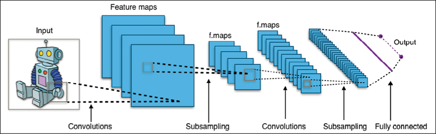

图 3.1:一个 DCNN 的例子

ConvNets 有三个关键的基本概念:局部感受野、共享权重和池化。让我们一起来复习一下。

## 局部感受野

如果我们想要保存图像的空间信息或其他形式的数据，那么用像素矩阵来表示每个图像是很方便的。鉴于此，编码局部结构的简单方法是将相邻输入神经元的子矩阵连接成属于下一层的单个隐藏神经元。这个隐藏的神经元代表一个局部感受域。注意，这个操作被命名为卷积，这就是这种类型的网络的名称的由来。你可以把卷积看作是一个矩阵对另一个矩阵的处理，称为核。

当然，我们可以通过重叠子矩阵来编码更多的信息。例如，让我们假设每个子矩阵的大小是 5×5，并且这些子矩阵用于 28×28 像素的 MNIST 图像。然后我们将能够在隐藏层中生成 24×24 个局部感受野神经元。事实上，在接触图像的边界之前，子矩阵仅滑动 23 个位置是可能的。在 TensorFlow 中，沿着内核或子矩阵的一边的像素数量是内核大小，而步长是内核在卷积中的每一步移动的像素数量。

让我们定义从一个图层到另一个图层的特征映射。当然，我们可以有多个从每个隐藏层独立学习的特征地图。例如，我们可以从处理 MNIST 图像的 28×28 个输入神经元开始，然后在下一个隐藏层中定义每个 24×24 个神经元大小的 *k* 特征图(同样具有 5×5 的形状)。

## 共享权重和偏见

让我们假设我们想要通过获得独立于输入图像中的位置来检测相同特征的能力，从而脱离原始图像中的像素表示。一个简单的方法是对隐藏层中的所有神经元使用相同的权重和偏差集。这样，每一层将学习一组从图像中导出的位置无关的潜在特征，记住一层由一组并行的核组成，每个核只学习一个特征。

## 一个数学例子

理解卷积的一个简单方法是考虑一个应用于矩阵的滑动窗口函数。在下面的例子中，给定输入矩阵 **I** 和内核 **K** ，我们得到卷积后的输出。3 x 3 内核 **K** (有时称为过滤器或特征检测器)与输入矩阵逐元素相乘，以获得输出矩阵中的一个单元。所有其他单元格都是通过在 **I** 上滑动窗口获得的:

| J

&#124; one &#124; one &#124; one &#124; Zero &#124; Zero &#124;
&#124; Zero &#124; one &#124; one &#124; one &#124; Zero &#124;
&#124; Zero &#124; Zero &#124; one &#124; one &#124; one &#124;
&#124; Zero &#124; Zero &#124; one &#124; one &#124; Zero &#124;
&#124; Zero &#124; one &#124; one &#124; Zero &#124; Zero &#124;

 | K

&#124; one &#124; Zero &#124; one &#124;
&#124; Zero &#124; one &#124; Zero &#124;
&#124; one &#124; Zero &#124; one &#124;

 | 卷

&#124; four &#124; three &#124; four &#124;
&#124; Two &#124; four &#124; three &#124;
&#124; Two &#124; three &#124; four &#124;

 |

在这个例子中，我们决定一接触到 **I** 的边界就停止滑动窗口(所以输出是 3 x 3)。或者，我们可以选择用零填充输入(这样输出就是 5×5)。这个决定与所采用的填充选择有关。请注意，内核深度等于输入深度(通道)。

另一个选择是关于我们每一步滑动滑动窗口的距离。这称为步幅，可以是一步或多步。较大的步幅生成较少的内核应用程序和较小的输出大小，而较小的步幅生成更多的输出并保留更多的信息。

滤波器的大小、步幅和填充类型是超参数，可以在网络训练期间进行微调。

## ConvNets in TensorFlow

在 TensorFlow 中，如果我们想要添加一个具有 32 个并行特征和 3x3 滤波器大小的卷积层，我们写:

```
import tensorflow as tf

from tensorflow.keras import datasets, layers, models

model = models.Sequential()

model.add(layers.Conv2D(32, (3, 3), activation='relu', input_shape=(28, 28, 1))) 
```

这意味着我们正在用 1 个输入通道(或输入滤波器)对 28x28 图像应用 3×3 卷积，从而产生 32 个输出通道(或输出滤波器)。

*图 3.2* 中提供了卷积的示例:

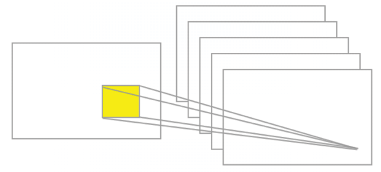

图 3.2:卷积的一个例子

## 池层

让我们假设我们想要总结一个特征图的输出。同样，我们可以使用从单个特征地图产生的输出的空间连续性，并将子矩阵的值聚合成一个单个输出值，综合描述与该物理区域相关的“意义”。

### 最大池化

一个简单且常见的选择是所谓的 max pooling 操作符，它简单地输出该区域中观察到的最大激活。在 Keras 中，如果我们想定义一个大小为 2 x 2 的最大池层，我们编写:

```
model.add(layers.MaxPooling2D((2, 2))) 
```

图 3.3 中的*给出了最大池操作的示例:*

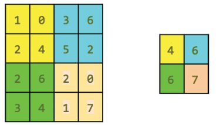

图 3.3:最大池的一个例子

### 平均池

另一种选择是平均池，它简单地将一个区域聚合成该区域中观察到的激活的平均值。

请注意，Keras 实现了大量的池层，完整的列表可在线获得(参见[https://keras.io/layers/pooling/](https://keras.io/layers/pooling/))。简而言之，所有的汇集操作只不过是对给定区域的汇总操作。

## 内容摘要

到目前为止，我们已经描述了 ConvNets 的基本概念。CNN 在沿时间维度对音频和文本数据应用一维卷积和池化操作，沿(高 x 宽)维度对图像应用二维卷积和池化操作，沿(高 x 宽 x 时间)维度对视频应用三维卷积和池化操作。对于图像，在输入体积上滑动滤光器产生一个图，该图提供了滤光器对于每个空间位置的响应。

换句话说，ConvNet 具有多个堆叠在一起的滤镜，这些滤镜能够独立于图像本身的位置来识别特定的视觉特征。这些视觉特征在网络的初始层是简单的，在网络的更深处变得越来越复杂。CNN 的训练需要识别每个滤波器的正确值，以便当输入通过多层时，激活最后一层的某些神经元，从而它将预测正确的值。

# DCNN 的一个例子:LeNet

获得图灵奖的 Yann LeCun 提出了[1]一个名为 LeNet 的 ConvNets 家族，该家族被训练用于识别 MNIST 手写字符，对简单的几何变换和扭曲具有鲁棒性。LeNet 的核心思想是让较低层交替卷积运算和最大池运算。卷积运算基于精心选择的局部感受野，具有多个特征图的共享权重。然后，基于具有隐藏层的传统 MLP 和作为输出层的 softmax，更高的级别被完全连接。

## TF 中的 LeNet 代码

为了在代码中定义 LeNet，我们使用卷积 2D 模块(注意`tf.keras.layers.Conv2D`是`tf.keras.layers.Convolution2D`的别名，因此两者可以互换使用——参见[https://www . tensor flow . org/API _ docs/python/TF/keras/layers/Conv2D](https://www.tensorflow.org/api_docs/python/tf/keras/layers/Conv2D)):

```
layers.Convolution2D(20, (5, 5), activation='relu', input_shape=input_shape) 
```

其中第一个参数是卷积中输出滤波器的数量，下一个元组是每个滤波器的扩展。一个有趣的可选参数是填充。有两个选项:`padding='valid'`表示仅在输入和滤波器完全重叠的地方计算卷积，因此输出小于输入，而`padding='same'`表示我们有一个大小为`same`的输出作为输入，输入周围的区域用零填充。

此外，我们使用一个`MaxPooling2D`模块:

```
layers.MaxPooling2D(pool_size=(2, 2), strides=(2, 2)) 
```

其中`pool_size=(2, 2)`是 2 个整数的元组，表示图像垂直和水平缩小的因子。所以(2，2)会在每个维度上对图像进行二等分，`strides=(2, 2)`是用于处理的步幅。

现在，让我们回顾一下代码。首先，我们导入一些模块:

```
import tensorflow as tf

from tensorflow.keras import datasets, layers, models, optimizers

# network and training

EPOCHS = 5

BATCH_SIZE = 128

VERBOSE = 1

OPTIMIZER = tf.keras.optimizers.Adam()

VALIDATION_SPLIT=0.90

IMG_ROWS, IMG_COLS = 28, 28 # input image dimensions

INPUT_SHAPE = (IMG_ROWS, IMG_COLS, 1)

NB_CLASSES = 10  # number of outputs = number of digits 
```

然后我们定义 LeNet 网络:

```
#define the convnet 

def build(input_shape, classes):

    model = models.Sequential() 
```

我们有一个 ReLU 激活的第一卷积阶段，随后是最大池。我们的网络将学习 20 个卷积滤波器，每个滤波器的大小为 5x5。输出尺寸与输入形状相同，因此将为 28 x 28。注意，由于`Convolutional2D`是我们管道的第一阶段，我们还需要定义它的`input_shape`。

最大池操作实现了一个滑动窗口，该窗口在层上滑动，并以垂直和水平两个像素的步长取每个区域的最大值:

```
# CONV => RELU => POOL

model.add(layers.Convolution2D(20, (5, 5), activation='relu',

            input_shape=input_shape))

model.add(layers.MaxPooling2D(pool_size=(2, 2), strides=(2, 2))) 
```

然后是 ReLU 激活的第二个卷积阶段，接着是最大池层。在这种情况下，我们将学习的卷积滤波器数量从之前的 20 个增加到 50 个。在更深的层中增加过滤器的数量是深度学习中的一种常用技术:

```
# CONV => RELU => POOL

model.add(layers.Convolution2D(50, (5, 5), activation='relu'))

model.add(layers.MaxPooling2D(pool_size=(2, 2), strides=(2, 2))) 
```

然后，我们有一个非常标准的扁平化和一个 500 个神经元的密集网络，后面是一个 softmax 分类器，有 10 个类别:

```
# Flatten => RELU layers

model.add(layers.Flatten())

model.add(layers.Dense(500, activation='relu'))

# a softmax classifier

model.add(layers.Dense(classes, activation="softmax"))

return model 
```

恭喜你，你刚刚定义了你的第一个深度卷积学习网络！让我们看看它的视觉效果:

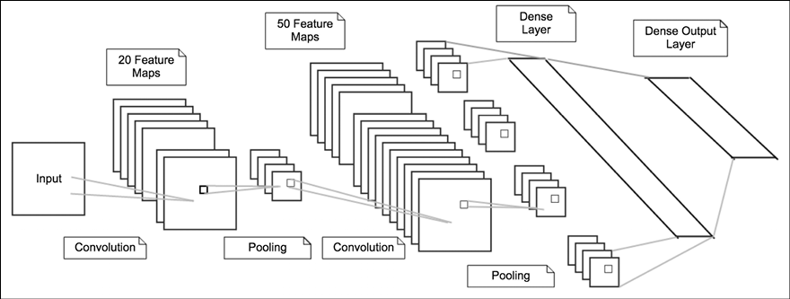

图 3.4:LeNet 的可视化

现在我们需要一些额外的代码来训练网络，但这非常类似于我们在第一章*，**中描述的神经网络基础。这一次我们还展示了打印损失的代码:*

```
# data: shuffled and split between train and test sets

(X_train, y_train), (X_test, y_test) = datasets.mnist.load_data()

# reshape

X_train = X_train.reshape((60000, 28, 28, 1))

X_test = X_test.reshape((10000, 28, 28, 1))

# normalize

X_train, X_test = X_train / 255.0, X_test / 255.0

# cast

X_train = X_train.astype('float32')

X_test = X_test.astype('float32')

# convert class vectors to binary class matrices

y_train = tf.keras.utils.to_categorical(y_train, NB_CLASSES)

y_test = tf.keras.utils.to_categorical(y_test, NB_CLASSES)

# initialize the optimizer and model

model = LeNet.build(input_shape=INPUT_SHAPE, classes=NB_CLASSES)

model.compile(loss="categorical_crossentropy", optimizer=OPTIMIZER,

    metrics=["accuracy"])

model.summary()

# use TensorBoard, princess Aurora!

callbacks = [

  # Write TensorBoard logs to './logs' directory

  tf.keras.callbacks.TensorBoard(log_dir='./logs')

]

# fit 

history = model.fit(X_train, y_train, 

        batch_size=BATCH_SIZE, epochs=EPOCHS, 

        verbose=VERBOSE, validation_split=VALIDATION_SPLIT,

        callbacks=callbacks)

score = model.evaluate(X_test, y_test, verbose=VERBOSE)

print("\nTest score:", score[0])

print('Test accuracy:', score[1]) 
```

现在让我们运行代码。正如在*图 3.5* 中可以看到的，时间有了显著的增加，我们的 deep net 中的每次迭代现在需要大约 28 秒，而在*第 1 章*、*带 TF 的神经网络基础*中定义的网络需要大约 1-2 秒。然而，准确率在训练时达到了 99.991%，在验证时达到了 99.91%，在测试时达到了 99.15%。

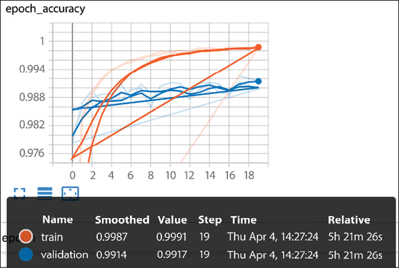

图 3.5: LeNet 精度

让我们看看 20 个时期的完整运行的执行情况:

```
Model: "sequential_1"

_____________________________________________________________________

Layer (type)                    Output Shape              Param #    

=====================================================================

conv2d_2 (Conv2D)               (None, 24, 24, 20)        520        

max_pooling2d_2 (MaxPooling  2D) (None, 12, 12, 20)       0          

conv2d_3 (Conv2D)               (None, 8, 8, 50)          25050      

max_pooling2d_3 (MaxPooling  2D) (None, 4, 4, 50)         0          

flatten   (Flatten)             (None, 800)               0          

dense   (Dense)                 (None, 500)               400500     

dense_1 (Dense)                 (None, 10)                5010    

=====================================================================

Total params: 431,080

Trainable params: 431,080

Non-trainable params: 0

_________________________________________________________________

Train on 48000 samples, validate on 12000 samples

Epoch 1/20

[2019-04-04 14:18:28.546158: I tensorflow/core/profiler/lib/profiler_session.cc:164] Profile Session started.

48000/48000 [==============================] - 28s 594us/sample - loss: 0.2035 - accuracy: 0.9398 - val_loss: 0.0739 - val_accuracy: 0.9783

Epoch 2/20

48000/48000 [==============================] - 26s 534us/sample - loss: 0.0520 - accuracy: 0.9839 - val_loss: 0.0435 - val_accuracy: 0.9868

Epoch 3/20

48000/48000 [==============================] - 27s 564us/sample - loss: 0.0343 - accuracy: 0.9893 - val_loss: 0.0365 - val_accuracy: 0.9895

Epoch 4/20

48000/48000 [==============================] - 27s 562us/sample - loss: 0.0248 - accuracy: 0.9921 - val_loss: 0.0452 - val_accuracy: 0.9868

Epoch 5/20

48000/48000 [==============================] - 27s 562us/sample - loss: 0.0195 - accuracy: 0.9939 - val_loss: 0.0428 - val_accuracy: 0.9873

Epoch 6/20

48000/48000 [==============================] - 28s 548us/sample - loss: 0.0585 - accuracy: 0.9820 - val_loss: 0.1038 - val_accuracy: 0.9685

Epoch 7/20

48000/48000 [==============================] - 26s 537us/sample - loss: 0.0134 - accuracy: 0.9955 - val_loss: 0.0388 - val_accuracy: 0.9896

Epoch 8/20

48000/48000 [==============================] - 29s 589us/sample - loss: 0.0097 - accuracy: 0.9966 - val_loss: 0.0347 - val_accuracy: 0.9899

Epoch 9/20

48000/48000 [==============================] - 29s 607us/sample - loss: 0.0091 - accuracy: 0.9971 - val_loss: 0.0515 - val_accuracy: 0.9859

Epoch 10/20

48000/48000 [==============================] - 27s 565us/sample - loss: 0.0062 - accuracy: 0.9980 - val_loss: 0.0376 - val_accuracy: 0.9904

Epoch 11/20

48000/48000 [==============================] - 30s 627us/sample - loss: 0.0068 - accuracy: 0.9976 - val_loss: 0.0366 - val_accuracy: 0.9911

Epoch 12/20

48000/48000 [==============================] - 24s 505us/sample - loss: 0.0079 - accuracy: 0.9975 - val_loss: 0.0389 - val_accuracy: 0.9910

Epoch 13/20

48000/48000 [==============================] - 28s 584us/sample - loss: 0.0057 - accuracy: 0.9978 - val_loss: 0.0531 - val_accuracy: 0.9890

Epoch 14/20

48000/48000 [==============================] - 28s 580us/sample - loss: 0.0045 - accuracy: 0.9984 - val_loss: 0.0409 - val_accuracy: 0.9911

Epoch 15/20

48000/48000 [==============================] - 26s 537us/sample - loss: 0.0039 - accuracy: 0.9986 - val_loss: 0.0436 - val_accuracy: 0.9911

Epoch 16/20

48000/48000 [==============================] - 25s 513us/sample - loss: 0.0059 - accuracy: 0.9983 - val_loss: 0.0480 - val_accuracy: 0.9890

Epoch 17/20

48000/48000 [==============================] - 24s 499us/sample - loss: 0.0042 - accuracy: 0.9988 - val_loss: 0.0535 - val_accuracy: 0.9888

Epoch 18/20

48000/48000 [==============================] - 24s 505us/sample - loss: 0.0042 - accuracy: 0.9986 - val_loss: 0.0349 - val_accuracy: 0.9926

Epoch 19/20

48000/48000 [==============================] - 29s 599us/sample - loss: 0.0052 - accuracy: 0.9984 - val_loss: 0.0377 - val_accuracy: 0.9920

Epoch 20/20

48000/48000 [==============================] - 25s 524us/sample - loss: 0.0028 - accuracy: 0.9991 - val_loss: 0.0477 - val_accuracy: 0.9917

10000/10000 [==============================] - 2s 248us/sample - loss: 0.0383 - accuracy: 0.9915

Test score: 0.03832608199457617

Test accuracy: 0.9915 
```

让我们画出模型的精确度和模型损失，我们知道我们只需要 10 次迭代就可以达到 99.1%的类似精确度:

```
Train on 48000 samples, validate on 12000 samples

Epoch 1/10

[2019-04-04 15:57:17.848186: I tensorflow/core/profiler/lib/profiler_session.cc:164] Profile Session started.

48000/48000 [==============================] - 26s 544us/sample - loss: 0.2134 - accuracy: 0.9361 - val_loss: 0.0688 - val_accuracy: 0.9783

Epoch 2/10

48000/48000 [==============================] - 30s 631us/sample - loss: 0.0550 - accuracy: 0.9831 - val_loss: 0.0533 - val_accuracy: 0.9843

Epoch 3/10

48000/48000 [==============================] - 30s 621us/sample - loss: 0.0353 - accuracy: 0.9884 - val_loss: 0.0410 - val_accuracy: 0.9874

Epoch 4/10

48000/48000 [==============================] - 37s 767us/sample - loss: 0.0276 - accuracy: 0.9910 - val_loss: 0.0381 - val_accuracy: 0.9887

Epoch 5/10

48000/48000 [==============================] - 24s 509us/sample - loss: 0.0200 - accuracy: 0.9932 - val_loss: 0.0406 - val_accuracy: 0.9881

Epoch 6/10

48000/48000 [==============================] - 31s 641us/sample - loss: 0.0161 - accuracy: 0.9950 - val_loss: 0.0423 - val_accuracy: 0.9881

Epoch 7/10

48000/48000 [==============================] - 29s 613us/sample - loss: 0.0129 - accuracy: 0.9955 - val_loss: 0.0396 - val_accuracy: 0.9894

Epoch 8/10

48000/48000 [==============================] - 27s 554us/sample - loss: 0.0107 - accuracy: 0.9965 - val_loss: 0.0454 - val_accuracy: 0.9871

Epoch 9/10

48000/48000 [==============================] - 24s 510us/sample - loss: 0.0082 - accuracy: 0.9973 - val_loss: 0.0388 - val_accuracy: 0.9902

Epoch 10/10

48000/48000 [==============================] - 26s 542us/sample - loss: 0.0083 - accuracy: 0.9970 - val_loss: 0.0440 - val_accuracy: 0.99892

10000/10000 [==============================] - 2s 196us/sample - loss: 0.0327 - accuracy: 0.9910

Test score: 0.03265062951518773

Test accuracy: 0.991 
```

让我们看一些 MNIST 的图片，来理解 99.1%这个数字有多好！例如，人类写 9 有很多种方式，其中一种是在*图 3.6* 中。3、7、4 和 5 也是如此，这个数字中的数字 1 很难识别，甚至连人类都可能有困难:

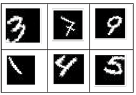

图 3.6:MNIST 手写字符的一个例子

我们可以在下面的图表中总结我们不同的模型到目前为止所取得的进展。我们的简单网络开始时的准确率为 90.71%，这意味着 100 个手写字符中大约有 9 个没有被正确识别。然后，我们用深度学习架构获得了 8%，达到了 99.2%的准确率，这意味着一百个手写字符中不到一个被错误识别，如图*图 3.7* :

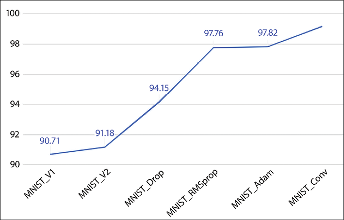

图 3.7:不同模型和优化器的精确度

## 理解深度学习的力量

为了更好地理解深度学习和 ConvNets 的力量，我们可以进行的另一项测试是减少训练集的大小，并观察由此产生的性能衰减。一种方法是将 50，000 个示例的训练集分成两个不同的集合:

*   用于训练我们的模型的适当训练集的大小将逐渐减少:5，900、3，000、1，800、600 和 300 个示例。
*   用于评估我们的模型训练情况的验证集将由剩余的示例组成。我们的测试集总是固定的，它由 10，000 个例子组成。

通过这种设置，我们将之前定义的深度学习 ConvNet 与第一个示例神经网络进行比较，该示例神经网络在*第一章*、*具有 TF* 的神经网络基础中定义。正如我们在下图中看到的，当有更多数据可用时，我们的深度网络总是优于简单网络。通过 5900 个训练样本，深度学习网络的准确率为 97.23%，而简单网络的准确率为 94%。

一般来说，深度网络需要更多可用的训练数据来充分发挥其威力，如图*图 3.8* 所示:

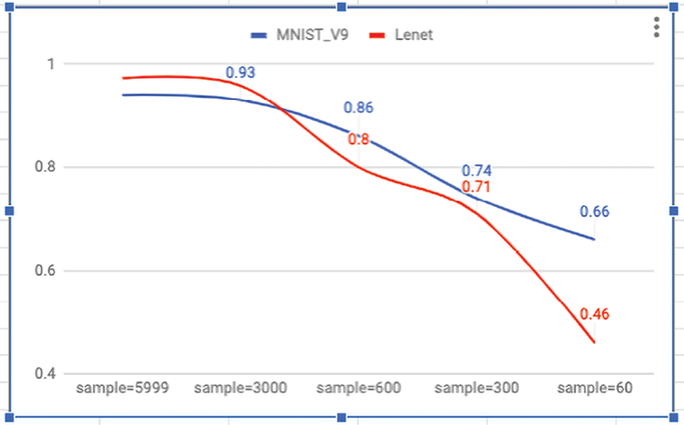

图 3.8:不同数据量的准确性

MNIST 的最新结果列表(例如，可用的最高性能)可在线获得(见[http://rodrigob . github . io/are _ we _ there _ yet/build/classification _ datasets _ results . XHTML](http://rodrigob.github.io/are_we_there_yet/build/classification_datasets_results.xhtml))。截至 2019 年 3 月，最好的结果误差率为 0.21% [2]。

# 利用深度学习识别 CIFAR-10 图像

CIFAR-10 数据集包含三个通道中 32 x 32 像素的 60，000 幅彩色图像，分为 10 类。每个类包含 6000 幅图像。训练集包含 50，000 幅图像，而测试集提供 10，000 幅图像。这张取自 CIFAR 资料库的图片(见 https://www.cs.toronto.edu/~kriz/cifar.xhtml[)展示了 10 个类别中的几个随机例子:](https://www.cs.toronto.edu/~kriz/cifar.xhtml)

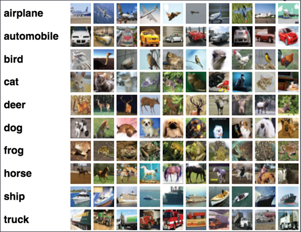

图 3.9:CIFAR-10 图像示例

本节图片来自*从微小图像中学习多层特征*，Alex Krizhevsky，2009:[https://www . cs . Toronto . edu/~ kriz/Learning-Features-2009-tr . pdf](https://www.cs.toronto.edu/~kriz/learning-features-2009-TR.pdf)。它们是 CIFAR-10 数据集(toronto.edu)的一部分:【https://www.cs.toronto.edu/~kriz/cifar.xhtml】T4。

目标是识别以前未见过的图像，并将它们分配到十个类别中的一个。让我们定义一个合适的深网。

首先，我们导入一些有用的模块，定义一些常量并加载数据集(包括加载操作的完整代码可以在线获得):

```
import tensorflow as tf

from tensorflow.keras import datasets, layers, models, optimizers

# CIFAR_10 is a set of 60K images 32x32 pixels on 3 channels

IMG_CHANNELS = 3

IMG_ROWS = 32

IMG_COLS = 32

#constant

BATCH_SIZE = 128

EPOCHS = 20

CLASSES = 10

VERBOSE = 1

VALIDATION_SPLIT = 0.2

OPTIM = tf.keras.optimizers.RMSprop() 
```

我们的网络将学习 32 个卷积滤波器，每个滤波器的大小为 3×3。输出维度与输入形状的相同，因此它将是 32×32，并且所使用的激活函数是 ReLU 函数，这是引入非线性的简单方式。之后，我们有一个`MaxPooling`操作，池大小为 2 x 2，丢弃率为 25%:

```
#define the convnet 

def build(input_shape, classes):

    model = models.Sequential() 

    model.add(layers.Convolution2D(32, (3, 3), activation='relu',

                        input_shape=input_shape))

    model.add(layers.MaxPooling2D(pool_size=(2, 2)))

    model.add(layers.Dropout(0.25)) 
```

深层管道中的下一阶段是具有 512 个单元和 ReLU 激活的密集网络，随后是 50%的丢弃，以及具有 10 个输出类别的 softmax 层，每个类别一个:

```
 model.add(layers.Flatten())

    model.add(layers.Dense(512, activation='relu'))

    model.add(layers.Dropout(0.5))

    model.add(layers.Dense(classes, activation='softmax'))

    return model 
```

定义了网络之后，我们就可以训练模型了。在这种情况下，除了训练集和测试集之外，我们还拆分数据并计算验证集。训练用于构建我们的模型，验证用于选择性能最佳的方法，而测试集用于检查我们的最佳模型在新的未知数据上的性能:

```
# use TensorBoard, princess Aurora!

callbacks = [

  # Write TensorBoard logs to './logs' directory

  tf.keras.callbacks.TensorBoard(log_dir='./logs')

]

# train

model.compile(loss='categorical_crossentropy', optimizer=OPTIM,

    metrics=['accuracy'])

model.fit(X_train, y_train, batch_size=BATCH_SIZE,

    epochs=EPOCHS, validation_split=VALIDATION_SPLIT, 

    verbose=VERBOSE, callbacks=callbacks) 

score = model.evaluate(X_test, y_test,

                     batch_size=BATCH_SIZE, verbose=VERBOSE)

print("\nTest score:", score[0])

print('Test accuracy:', score[1]) 
```

让我们运行代码。我们的网络通过 20 次迭代达到了 66.8%的测试精度。我们还打印精度和损耗图，并使用`model.summary()`转储网络:

```
Epoch 17/20

40000/40000 [==============================] - 112s 3ms/sample - loss: 0.6282 - accuracy: 0.7841 - val_loss: 1.0296 - val_accuracy: 0.6734

Epoch 18/20

40000/40000 [==============================] - 76s 2ms/sample - loss: 0.6140 - accuracy: 0.7879 - val_loss: 1.0789 - val_accuracy: 0.6489

Epoch 19/20

40000/40000 [==============================] - 74s 2ms/sample - loss: 0.5931 - accuracy: 0.7958 - val_loss: 1.0461 - val_accuracy: 0.6811

Epoch 20/20

40000/40000 [==============================] - 71s 2ms/sample - loss: 0.5724 - accuracy: 0.8042 - val_loss: 0.1.0527 - val_accuracy: 0.6773

10000/10000 [==============================] - 5s 472us/sample - loss: 1.0423 - accuracy: 0.6686

Test score: 1.0423416819572449

Test accuracy: 0.6686 
```

*图 3.10* 显示了精度和损耗图:

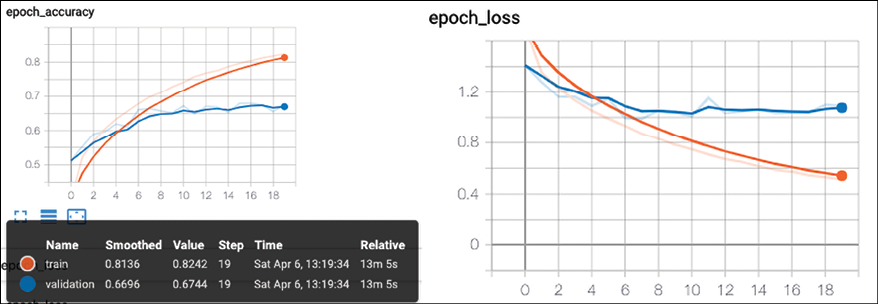

图 3.10:已定义网络的精确度和损耗

我们已经看到了如何提高精确度，以及 CIFAR-10 数据集的损失如何变化。下一节是关于改进当前的结果。

## 借助更深的网络提高 CIFAR-10 的性能

提高性能的一种方法是用多个卷积运算定义一个更深的网络。在以下示例中，我们有一系列模块:

第一模块:(conv+conv+最大池+辍学)

第二模块:(conv+conv+最大池+辍学)

第三模块:(conv+conv+最大池+辍学)

接下来是标准的密集输出层。使用的所有激活函数都是 ReLU 函数。有一个新层，我们也在*第 1 章*、*带 TF 的神经网络基础*、`BatchNormalization()`中讨论过，用于在模块之间引入一种正则化形式:

```
def build_model(): 

    model = models.Sequential()

    #1st block

    model.add(layers.Conv2D(32, (3,3), padding='same', 

        input_shape=x_train.shape[1:], activation='relu'))

    model.add(layers.BatchNormalization())

    model.add(layers.Conv2D(32, (3,3), padding='same', activation='relu'))

    model.add(layers.BatchNormalization())

    model.add(layers.MaxPooling2D(pool_size=(2,2)))

    model.add(layers.Dropout(0.2))

    #2nd block

    model.add(layers.Conv2D(64, (3,3), padding='same', activation='relu'))

    model.add(layers.BatchNormalization())

    model.add(layers.Conv2D(64, (3,3), padding='same', activation='relu'))

    model.add(layers.BatchNormalization())

    model.add(layers.MaxPooling2D(pool_size=(2,2)))

    model.add(layers.Dropout(0.3))

    #3d block 

    model.add(layers.Conv2D(128, (3,3), padding='same', activation='relu'))

    model.add(layers.BatchNormalization())

    model.add(layers.Conv2D(128, (3,3), padding='same', activation='relu'))

    model.add(layers.BatchNormalization())

    model.add(layers.MaxPooling2D(pool_size=(2,2)))

    model.add(layers.Dropout(0.4))

    #dense  

    model.add(layers.Flatten())

    model.add(layers.Dense(NUM_CLASSES, activation='softmax'))

    return model

    model.summary() 
```

恭喜你！你已经定义了一个更深的网络。让我们运行代码 40 次迭代，达到 82%的准确率！为了完整起见，让我们添加代码的剩余部分。第一部分是加载和规范化数据:

```
import tensorflow as tf

from tensorflow.keras import datasets, layers, models, regularizers, optimizers

from tensorflow.keras.preprocessing.image import ImageDataGenerator

import numpy as np

EPOCHS=50

NUM_CLASSES = 10

def load_data():

    (x_train, y_train), (x_test, y_test) = datasets.cifar10.load_data()

    x_train = x_train.astype('float32')

    x_test = x_test.astype('float32')

    #normalize 

    mean = np.mean(x_train,axis=(0,1,2,3))

    std = np.std(x_train,axis=(0,1,2,3))

    x_train = (x_train-mean)/(std+1e-7)

    x_test = (x_test-mean)/(std+1e-7)

    y_train =  tf.keras.utils.to_categorical(y_train,NUM_CLASSES)

    y_test =  tf.keras.utils.to_categorical(y_test,NUM_CLASSES)

    return x_train, y_train, x_test, y_test 
```

然后我们需要有一部分来训练网络:

```
(x_train, y_train, x_test, y_test) = load_data()

model = build_model()

model.compile(loss='categorical_crossentropy', 

            optimizer='RMSprop', 

            metrics=['accuracy'])

#train

batch_size = 64

model.fit(x_train, y_train, batch_size=batch_size,

    epochs=EPOCHS, validation_data=(x_test,y_test)) 

score = model.evaluate(x_test, y_test,

                     batch_size=batch_size)

print("\nTest score:", score[0])

print('Test accuracy:', score[1]) 
```

因此，相对于之前更简单更深入的网络，我们有 15.14%的改进。

## 通过数据扩充提高 CIFAR-10 的性能

另一种提高性能的方法是为我们的训练生成更多的图像。这里的想法是，我们可以采用标准的 CIFAR 训练集，并用多种类型的变换来扩充这个集，包括旋转、重新缩放、水平或垂直翻转、缩放、频道转换等等。让我们看看应用于上一节中定义的同一网络的代码:

```
from tensorflow.keras.preprocessing.image import ImageDataGenerator

#image augmentation

datagen = ImageDataGenerator(

    rotation_range=30,

    width_shift_range=0.2,

    height_shift_range=0.2,

    horizontal_flip=True,

    )

datagen.fit(x_train) 
```

`rotation_range`是随机旋转图片的度数(0-180)；`width_shift`和`height_shift`是随机垂直或水平平移图片的范围；`zoom_range`用于随机缩放图片；`horizontal_flip`是随机水平翻转一半图像；`fill_mode`是用于填充旋转或移位后可能出现的新像素的策略。

增强后，我们从标准 CIFAR-10 集开始生成了更多的训练图像，如*图 3.11* 所示:

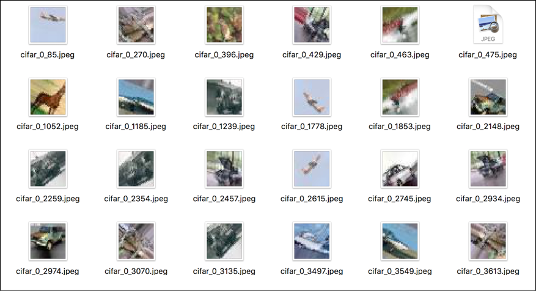

图 3.11:图像增强的一个例子

现在我们可以将这种直觉直接用于训练。使用之前定义的相同的 ConvNet，我们简单地生成更多的增强图像，然后我们进行训练。为了提高效率，生成器与模型并行运行。这允许在 CPU 上进行图像增强，同时在 GPU 上进行并行训练。代码如下:

```
#train

batch_size = 64

model.fit_generator(datagen.flow(x_train, y_train, batch_size=batch_size),

                    epochs=EPOCHS,

                    verbose=1,validation_data=(x_test,y_test))

#save to disk

model_json = model.to_json()

with open('model.json', 'w') as json_file:

    json_file.write(model_json)

model.save_weights('model.h5') 

#test

scores = model.evaluate(x_test, y_test, batch_size=128, verbose=1)

print('\nTest result: %.3f loss: %.3f' % (scores[1]*100,scores[0])) 
```

每次迭代现在都更加昂贵，因为我们有更多的训练数据。因此，让我们只运行 50 次迭代。我们看到，通过这样做，我们达到了 85.91%的准确率:

```
Epoch 46/50

50000/50000 [==============================] - 36s 722us/sample - loss: 0.2440 - accuracy: 0.9183 - val_loss: 0.4918 - val_accuracy: 0.8546

Epoch 47/50

50000/50000 [==============================] - 34s 685us/sample - loss: 0.2338 - accuracy: 0.9208 - val_loss: 0.4884 - val_accuracy: 0.8574

Epoch 48/50

50000/50000 [==============================] - 32s 643us/sample - loss: 0.2383 - accuracy: 0.9189 - val_loss: 0.5106 - val_accuracy: 0.8556

Epoch 49/50

50000/50000 [==============================] - 37s 734us/sample - loss: 0.2285 - accuracy: 0.9212 - val_loss: 0.5017 - val_accuracy: 0.8581

Epoch 49/50

50000/50000 [==============================] - 36s 712us/sample - loss: 0.2263 - accuracy: 0.9228 - val_loss: 0.4911 - val_accuracy: 0.8591

10000/10000 [==============================] - 2s 160us/sample - loss: 0.4911 - accuracy: 0.8591

Test score: 0.4911323667049408

Test accuracy: 0.8591 
```

下图总结了我们在实验中获得的结果:

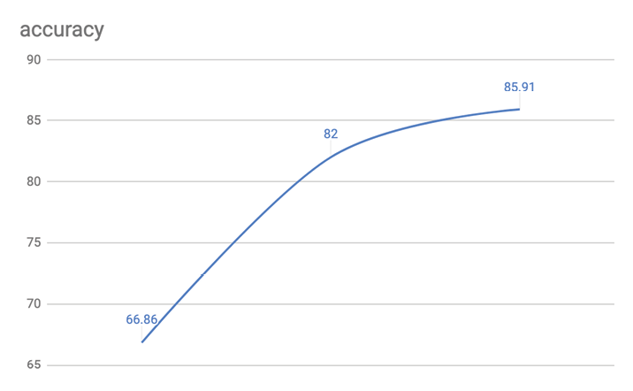

图 3.12:不同网络下 CIFAR-10 的精度。在 x 轴上，我们有不断增加的迭代次数

CIFAR-10 的最新结果列表可在网上获得(见[http://rodrigob . github . io/are _ we _ there _ yet/build/classification _ datasets _ results . XHTML](http://rodrigob.github.io/are_we_there_yet/build/classification_datasets_results.xhtml))。截至 2019 年 4 月，最好的结果准确率为 96.53% [3]。

## 使用 CIFAR-10 进行预测

让我们假设我们想要使用我们刚刚为 CIFAR-10 训练的深度学习模型进行图像的批量评估。因为我们保存了模型和权重，所以不需要每次都进行训练:

```
import numpy as np

import scipy.misc

from tensorflow.keras.models import model_from_json

from tensorflow.keras.optimizers import SGD

#load model

model_architecture = 'cifar10_architecture.json'

model_weights = 'cifar10_weights.h5'

model = model_from_json(open(model_architecture).read())

model.load_weights(model_weights)

#load images

img_names = ['cat-standing.jpg', 'dog.jpg']

imgs = [np.transpose(scipy.misc.imresize(scipy.misc.imread(img_name), (32, 32)),

                     (2, 0, 1)).astype('float32')

           for img_name in img_names]

imgs = np.array(imgs) / 255

# train

optim = SGD()

model.compile(loss='categorical_crossentropy', optimizer=optim,

    metrics=['accuracy'])

# predict 

predictions = model.predict_classes(imgs)

print(predictions) 
```

注意，我们使用 SciPy 的`imread`来加载图像，然后将它们的大小调整为 32 × 32 像素。得到的图像张量的维数为(32，32，3)。然而，我们希望颜色维度是第一个而不是最后一个，所以我们采用转置。之后，图像张量列表被组合成单个张量，并被归一化到 0 和 1.0 之间。

现在让我们得到对一个和一个的预测。我们得到类别 3(猫)和类别 5(狗)作为预期的输出。我们成功地创建了一个 ConvNet 来分类 CIFAR-10 图像。接下来我们来看 VGG16:深度学习的突破。

# 用于大规模图像识别的非常深的卷积网络

2014 年，K. Simonyan 和 A. Zisserman 在论文*中提出了对图像识别的一个有趣贡献【用于大规模图像识别的超深度卷积网络*。该论文表明，通过将深度推至 16-19 个重量层，可以实现对现有技术配置的*显著改进。在论文中被表示为 D 或 VGG16 的一个模型具有 16 个深层。Java Caffe 中的一个实现(参见[http://caffe.berkeleyvision.org/](http://caffe.berkeleyvision.org/))被用于在 ImageNet ILSVRC-2012(参见[http://image-net.org/challenges/LSVRC/2012/](http://image-net.org/challenges/LSVRC/2012/))数据集上训练模型，该数据集包括 1000 个类的图像，并被分成三组:训练(1.3M 图像)、验证(50K 图像)和测试(100K 图像)。每个图像在 3 个通道上为(224 x 224)。模型在 ILSVRC-2012-val 上实现了 7.5%的前 5 名误差(前 5 名结果的误差)，在 ILSVRC-2012-test 上实现了 7.4%的前 5 名误差。*

根据 ImageNet 网站:

> 本次竞赛的目标是使用大型手写标记 ImageNet 数据集(10，000，000 个标记图像，描述了 10，000+个对象类别)的子集作为训练，估计照片的内容，以便进行检索和自动注释。测试图像将没有初始注释-没有分割或标签-并且算法将必须产生指定图像中存在什么对象的标签。

在 Caffe 中实现的模型所学习的权重已经在`tf.Keras`中被直接转换(【https://gist.github.com/baraldilorenzo/07d7802847aaad0a35d3】)并且可以通过将它们预加载到`tf.Keras`模型中来使用，该模型实现如下，如本文所述:

```
import tensorflow as tf

from tensorflow.keras import layers, models

# define a VGG16 network

def VGG_16(weights_path=None):

    model = models.Sequential()

    model.add(layers.ZeroPadding2D((1,1),input_shape=(224,224, 3)))

    model.add(layers.Convolution2D(64, (3, 3), activation='relu'))

    model.add(layers.ZeroPadding2D((1,1)))

    model.add(layers.Convolution2D(64, (3, 3), activation='relu'))

    model.add(layers.MaxPooling2D((2,2), strides=(2,2)))

    model.add(layers.ZeroPadding2D((1,1)))

    model.add(layers.Convolution2D(128, (3, 3), activation='relu'))

    model.add(layers.ZeroPadding2D((1,1)))

    model.add(layers.Convolution2D(128, (3, 3), activation='relu'))

    model.add(layers.MaxPooling2D((2,2), strides=(2,2)))

    model.add(layers.ZeroPadding2D((1,1)))

    model.add(layers.Convolution2D(256, (3, 3), activation='relu'))

    model.add(layers.ZeroPadding2D((1,1)))

    model.add(layers.Convolution2D(256, (3, 3), activation='relu'))

    model.add(layers.ZeroPadding2D((1,1)))

    model.add(layers.Convolution2D(256, (3, 3), activation='relu'))

    model.add(layers.MaxPooling2D((2,2), strides=(2,2)))

    model.add(layers.ZeroPadding2D((1,1)))

    model.add(layers.Convolution2D(512, (3, 3), activation='relu'))

    model.add(layers.ZeroPadding2D((1,1)))

    model.add(layers.Convolution2D(512, (3, 3), activation='relu'))

    model.add(layers.ZeroPadding2D((1,1)))

    model.add(layers.Convolution2D(512, (3, 3), activation='relu'))

    model.add(layers.MaxPooling2D((2,2), strides=(2,2)))

    model.add(layers.ZeroPadding2D((1,1)))

    model.add(layers.Convolution2D(512, (3, 3), activation='relu'))

    model.add(layers.ZeroPadding2D((1,1)))

    model.add(layers.Convolution2D(512, (3, 3), activation='relu'))

    model.add(layers.ZeroPadding2D((1,1)))

    model.add(layers.Convolution2D(512, (3, 3), activation='relu'))

    model.add(layers.MaxPooling2D((2,2), strides=(2,2)))

    model.add(layers.Flatten())

    #top layer of the VGG net

    model.add(layers.Dense(4096, activation='relu'))

    model.add(layers.Dropout(0.5))

    model.add(layers.Dense(4096, activation='relu'))

    model.add(layers.Dropout(0.5))

    model.add(layers.Dense(1000, activation='softmax'))

    if weights_path:

        model.load_weights(weights_path)

    return model 
```

我们已经实现了一个 VGG16 网络。注意，我们也可以使用`tf.keras.applications.vgg16`。直接得到模型及其权重。在这里，我想展示 VGG16 如何在内部工作。接下来，我们将利用它。

## 用 VGG16 网络识别猫

现在让我们测试一下的图像。

请注意，我们将使用预定义的权重:

```
import cv2

im = cv2.resize(cv2.imread('cat.jpg'), (224, 224)).astype(np.float32)

#im = im.transpose((2,0,1))

im = np.expand_dims(im, axis=0)

# Test pretrained model

model = VGG_16('/Users/antonio/.keras/models/vgg16_weights_tf_dim_ordering_tf_kernels.h5')

model.summary()

model.compile(optimizer='sgd', loss='categorical_crossentropy')

out = model.predict(im)

print(np.argmax(out)) 
```

当代码被执行时，类`285`被返回，它对应(见[https://gist.github.com/yrevar/942d3a0ac09ec9e5eb3a](https://gist.github.com/yrevar/942d3a0ac09ec9e5eb3a))到“埃及猫”:

```
Total params: 138,357,544

Trainable params: 138,357,544

Non-trainable params: 0

---------------------------------------------------------------

285 
```

令人印象深刻，不是吗？我们的 VGG16 网络可以成功识别猫的图像！深度学习的重要一步。距离论文发表只有 7 年时间，但那是一个改变游戏规则的时刻。

## 利用 tf。Keras 内置 VGG16 网络模块

`tf.Keras`应用是预先构建和预训练的深度学习模型。当实例化一个模型时，权重被自动下载并存储在`~/.keras/models/`。使用内置代码非常简单:

```
import tensorflow as tf

from tensorflow.keras.applications.vgg16 import VGG16

import matplotlib.pyplot as plt

import numpy as np

import cv2

# pre built model with pre-trained weights on imagenet

model = VGG16(weights='imagenet', include_top=True)

model.compile(optimizer='sgd', loss='categorical_crossentropy')

# resize into VGG16 trained images' format

im = cv2.resize(cv2.imread('steam-locomotive.jpg'), (224, 224))

im = np.expand_dims(im, axis=0)

# predict

out = model.predict(im)

index = np.argmax(out)

print(index)

plt.plot(out.ravel())

plt.show()

#this should print 820 for steaming train 
```

现在，让我们考虑一列火车，。如果我们运行代码，我们得到的结果是`820`，这是“蒸汽机车”的 ImageNet 代码同样重要的是，所有其他类别的支持都很弱，如图*图 3.13* 所示:

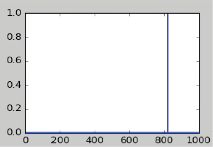

图 3.13:蒸汽火车是最有可能的结果

最后，请注意【VGG16 只是`tf.Keras`中预先构建的模块之一。预训练模型的完整列表可在网上获得(见[https://www . tensor flow . org/API _ docs/python/TF/keras/applications](https://www.tensorflow.org/api_docs/python/tf/keras/applications))。

## 循环利用预先构建的深度学习模型来提取特征

一个非常简单的想法是使用 VGG16，更普遍的是 DCNN，进行特征提取。该代码通过从特定图层提取要素来实现这一思想。

请注意，我们需要切换到函数式 API，因为顺序模型只接受层:

```
import tensorflow as tf

from tensorflow.keras.applications.vgg16 import VGG16 

from tensorflow.keras import models

from tensorflow.keras.preprocessing import image

from tensorflow.keras.applications.vgg16 import preprocess_input

import numpy as np

import cv2

# prebuild model with pre-trained weights on imagenet

base_model = VGG16(weights='imagenet', include_top=True)

print (base_model)

for i, layer in enumerate(base_model.layers):

    print (i, layer.name, layer.output_shape)

# extract features from block4_pool block

model = models.Model(inputs=base_model.input, 

    outputs=base_model.get_layer('block4_pool').output)

img_path = 'cat.jpg'

img = image.load_img(img_path, target_size=(224, 224))

x = image.img_to_array(img)

x = np.expand_dims(x, axis=0)

x = preprocess_input(x)

# get the features from this block

features = model.predict(x)

print(features) 
```

您可能想知道为什么我们要从 DCNN 的中间层提取特征。原因是，随着网络学习将图像分类，每一层都学习识别执行最终分类所必需的特征。较低层识别较低阶的特征，例如颜色和边缘，而较高层将这些较低阶的特征组合成较高阶的特征，例如形状或对象。因此，中间层具有从图像中提取重要特征的能力，并且这些特征更可能有助于不同种类的分类。

这有多重优势。首先，我们可以依靠公开的大规模培训，并将这种学习转移到新的领域。其次，我们可以节省昂贵的培训时间。第三，即使我们的领域没有大量的训练样本，我们也能提供合理的解决方案。我们也能为手头的任务得到一个好的开始网络形状，而不是猜测它。

到此，我们将结束本章定义的最后一个深度学习模型 VGG16 CNNs 的概述。

# 用于迁移学习的 Deep Inception V3

迁移学习是一种非常强大的深度学习技术，在许多不同的领域都有应用。迁移学习背后的想法非常简单，可以用一个类比来解释。假设你想学一门新语言，比如说西班牙语。然后从你已经知道的不同语言开始，比如英语，会很有用。

按照这种思路，计算机视觉研究人员现在通常使用预训练的 CNN 来生成新任务的表示[1]，其中数据集可能不够大，不足以从头训练整个 CNN。另一种常见的策略是采用预先训练的 ImageNet 网络，然后针对新任务对整个网络进行微调。例如，我们可以用一个训练过的网络来识别 10 类音乐，并对其进行微调，以识别 20 类电影。

Inception V3 是 Google [2]开发的非常深度的 ConvNet。`tf.Keras`实现全网，如图*图 3.14* 所示，在 ImageNet 上进行预训练。此型号的默认输入大小为三个通道上的 299x299:

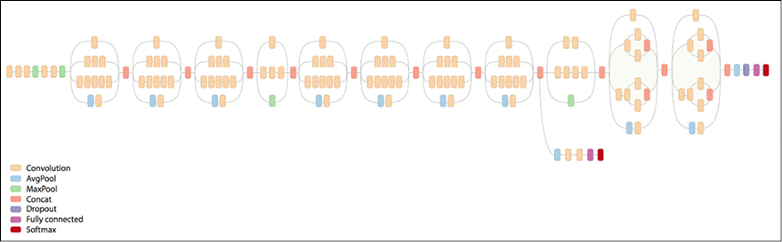

图 3.14:Inception V3 深度学习模型

这个框架例子的灵感来自网上的一个方案(见[https://keras.io/applications/](https://keras.io/applications/))。假设我们有一个来自 ImageNet 的不同域的训练数据集 *D* 。 *D* 输入 1024 个特征，输出 200 个类别。让我们来看一段代码:

```
import tensorflow as tf

from tensorflow.keras.applications.inception_v3 import InceptionV3

from tensorflow.keras.preprocessing import image

from tensorflow.keras import layers, models

# create the base pre-trained model

base_model = InceptionV3(weights='imagenet', include_top=False) 
```

我们使用一个经过训练的 Inception V3 模型:我们不包括全连接层——具有 1024 个输入的密集层——因为我们想要在 *D* 上进行微调。前面的代码片段将代表我们下载预训练的权重:

```
Downloading data from https://github.com/fchollet/deep-learning-models/releases/download/v0.5/inception_v3_weights_tf_dim_ordering_tf_kernels_notop.h5

87916544/87910968 [===========================] – 26s 0us/step 
```

所以，如果你看最后四层(其中`include_top=True`)，你会看到这些形状:

```
# layer.name, layer.input_shape, layer.output_shape

('mixed10', [(None, 8, 8, 320), (None, 8, 8, 768), (None, 8, 8, 768), (None, 8, 8, 192)], (None, 8, 8, 2048))

('avg_pool', (None, 8, 8, 2048), (None, 1, 1, 2048))

('flatten', (None, 1, 1, 2048), (None, 2048))

('predictions', (None, 2048), (None, 1000)) 
```

当`include_top=False`时，你正在移除最后三层，并暴露出`mixed_10`层。`GlobalAveragePooling2D`层将`(None, 8, 8, 2048)`转换为`(None, 2048)`，其中`(None, 2048)`张量中的每个元素是`(None, 8, 8, 2048)`张量中每个对应的`(8,8)`子张量的平均值。`None`表示未指定的尺寸，在定义占位符时很有用:

```
x = base_model.output

# let's add a fully-connected layer as first layer

x = layers.Dense(1024, activation='relu')(x)

# and a logistic layer with 200 classes as last layer

predictions = layers.Dense(200, activation='softmax')(x)

# model to train

model = models.Model(inputs=base_model.input, outputs=predictions) 
```

所有卷积级别都是预训练的，因此我们在整个模型的训练过程中冻结它们:

```
# i.e. freeze all convolutional InceptionV3 layers

for layer in base_model.layers:

    layer.trainable = False 
```

然后，该模型被编译和训练几个时期，以便训练顶层。为了简单起见，这里我们省略了训练代码本身:

```
# compile the model (should be done *after* setting layers to non-trainable)

model.compile(optimizer='rmsprop', loss='categorical_crossentropy')

# train the model on the new data for a few epochs

model.fit_generator(...) 
```

然后，我们冻结顶部的初始层，并微调其他的初始层。在本例中，我们决定冻结前 172 层(这是一个可调超参数):

```
# we chose to train the top 2 inception blocks, i.e. we will freeze

# the first 172 layers and unfreeze the rest:

for layer in model.layers[:172]:

   layer.trainable = False

for layer in model.layers[172:]:

   layer.trainable = True 
```

然后重新编译该模型以进行微调优化:

```
# we need to recompile the model for these modifications to take effect

# we use SGD with a low learning rate

from tensorflow.keras.optimizers import SGD

model.compile(optimizer=SGD(lr=0.0001, momentum=0.9), loss='categorical_crossentropy')

# we train our model again (this time fine-tuning the top 2 inception blocks

# alongside the top Dense layers

model.fit_generator(...) 
```

现在，我们有了一个新的深度网络，它重用了标准的 Inception V3 网络，但它是通过迁移学习在新的域 *D* 上训练的。当然，为了达到良好的精度，还有许多微调参数。然而，我们现在通过迁移学习重新使用一个非常大的预训练网络作为起点。这样做，我们可以通过重用`tf.Keras`中已经可用的内容来节省对我们机器的培训需求。

# 其他 CNN 架构

在本节中，我们将讨论许多其他不同的 CNN 架构，包括 AlexNet、residual networks、highwayNets、DenseNets 和 Xception。

## AlexNet

最早的卷积网络之一是 Alex net【4】，它由仅八层组成；前五个是具有最大池层的卷积，后三个是全连接的。AlexNet [4]是一篇被引用超过 35000 次的文章，开启了深度学习革命(针对计算机视觉)。然后，网络开始变得越来越深。最近有人提出了一个新想法。

## 剩余网络

剩余网络是基于一个有趣的想法，即允许早期层直接进入更深的层。这些就是所谓的跳过连接(或快进连接)。关键的想法是最小化深度网络的消失或爆炸梯度的风险(见*第八章*、*自动编码器*)。

ResNet 的构造块被称为“剩余块”或“身份块”，其中包括转发和快进连接。在本例中(*图 3.15* )，在发送到 ReLU 激活函数之前，前一层的输出与后一层的输出相加:

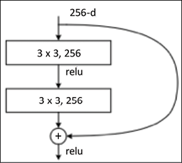

图 3.15:图像分割的一个例子

## 高速公路网和高速公路网

额外的权重矩阵可用于学习跳跃权重，这些模型通常被称为高速公路网。相反，具有几个平行跳跃的模型被称为 DenseNets [5]。人们已经注意到，人类大脑可能具有类似于残余网络的模式，因为皮层第六层神经元从第一层获得输入，跳过中间层。此外，残差网络可以比传统 CNN 更快地训练，因为在每个迭代期间传播通过的层更少(由于跳过连接，更深的层更快地获得输入)。图 3.16 显示了一个 DenseNet 的例子(基于[http://arxiv.org/abs/1608.06993](http://arxiv.org/abs/1608.06993)):

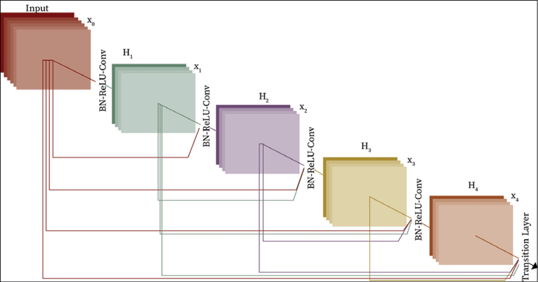

图 3.16:一个 DenseNet 的例子

## Xception

例外网络使用两个基本块:深度卷积和点卷积。深度方向的卷积是通道方向的 n×n 空间方向的卷积。假设一个图像有三个通道，那么我们有三个 n×n 的卷积。逐点卷积是 1×1 卷积。在“极限”版本的初始模块 Xception 中，我们首先使用 1 x 1 卷积来映射跨通道相关性，然后分别映射每个输出通道的空间相关性，如图*图 3.17* (来自【https://arxiv.org/pdf/1610.02357.pdf】T4)所示:

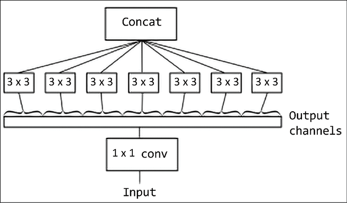

图 3.17:一个初始模块的极端形式的例子

**例外** ( **极限盗梦**)是一种受盗梦启发的深度卷积神经网络架构，其中盗梦模块已经被深度方向可分离卷积所取代。Xception 以类似于 ResNet 的方式使用多个跳过连接。最终的架构相当复杂，如图*图 3.18* 所示(来自[https://arxiv.org/pdf/1610.02357.pdf](https://arxiv.org/pdf/1610.02357.pdf))。数据首先通过入口流，然后通过中间流，中间流重复八次，最后通过出口流:

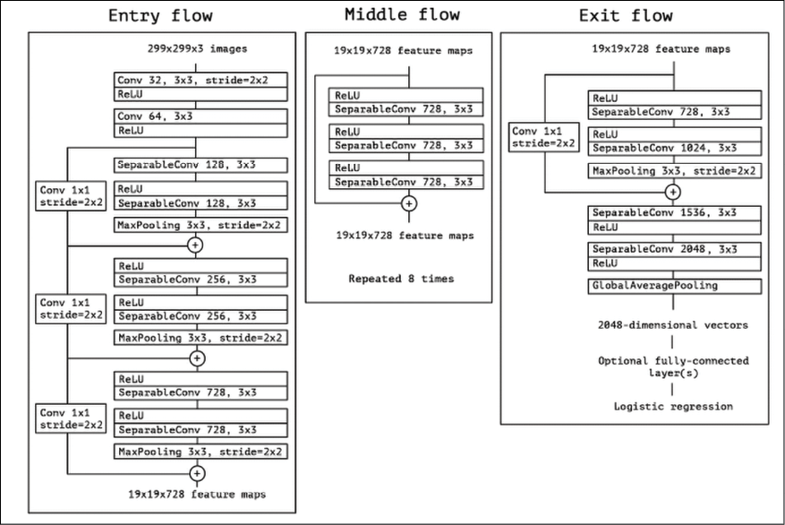

图 3.18:完整的异常架构

剩余网络、超网络、DenseNets、Inception 和 Xceptions 都可以作为预训练网络在`tf.Keras.application`和`tf.Hub`中使用。Keras 网站对 ImageNet 数据集上实现的性能和每个网络的深度有一个很好的总结。总结可在[https://keras.io/applications/](https://keras.io/applications/)获得:

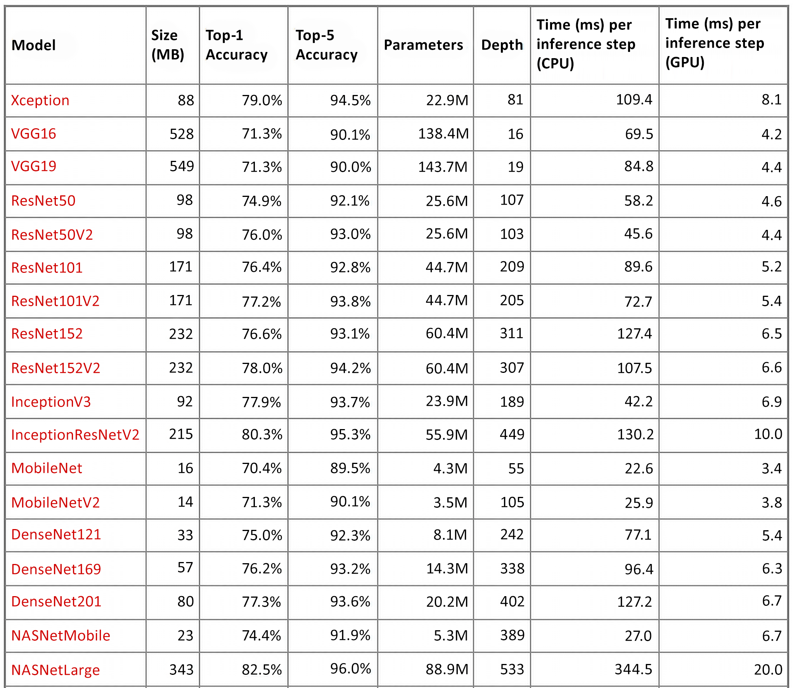

图 3.19:前 1 名和前 5 名结果的不同 CNN 和准确度

前 1 名和前 5 名准确度指的是模型在 ImageNet 验证数据集上的性能。

在本节中，我们已经讨论了许多 CNN 架构。下一部分是关于风格转移，这是一种深度学习技术，用于训练神经网络来创作艺术。

# 风格转移

风格转移是一个有趣的神经网络应用程序，它提供了许多关于神经网络能力的见解。那么到底是什么呢？想象你观察一幅著名艺术家的画。原则上，你在观察两个元素:画本身(比如一个女人的脸，或者一幅风景)和一些更内在的东西，艺术家的“风格”。风格是什么？那就更难定义了，但是人类知道毕加索有他自己的风格，马蒂斯有他自己的风格，每个艺术家都有他/她自己的风格。现在，想象一下，拿一幅马蒂斯的名画，给一个神经网络，让神经网络按照毕加索的风格重新绘制。或者，想象你自己拍一张照片，把它交给神经网络，然后把你的照片画成马蒂斯或毕加索的风格，或者你喜欢的任何其他艺术家的风格。这就是风格转移的作用。

例如，去[https://deepart.io/](https://deepart.io/)看一个很酷的演示，如下图所示，deepart 已经被应用，采用了向日葵绘画中观察到的“梵高”风格(这是一个公共领域的图像:“Sonnenblumen。阿尔勒，1888 年 l auf Leinwand，92.5 x 73cm 文森特·梵高"[https://commons . wikimedia . org/wiki/Vincent _ Van _ Gogh #/media/File:Vincent _ Van _ Gogh _ 0010 . jpg](https://commons.wikimedia.org/wiki/Vincent_van_Gogh#/media/File:Vincent_Van_Gogh_0010.jpg)并将其应用于我女儿 Aurora 的一张照片:


图 3.20:deepart 的一个例子

现在，我们如何更正式地定义风格转换的过程？嗯，风格转换是产生人工图像 *x* 的任务，该人工图像共享源内容图像 *p* 的内容和源风格图像 *a* 的风格。所以，直观上我们需要两个距离函数:一个距离函数度量两幅图像的内容有多大差异，*L*内容，另一个距离函数度量两幅图像的风格有多大差异，*L*风格。然后，转移方式可以被视为一个优化问题，我们试图将这两个指标最小化。就像莱昂·A·加蒂丝、亚历山大·s·埃克和马蒂亚斯·贝奇([https://arxiv.org/abs/1508.06576](https://arxiv.org/abs/1508.06576))提出的*艺术风格的神经算法*一样，我们使用一个经过预训练的网络来实现风格转换。特别是，我们可以馈送 VGG19(或任何合适的预训练网络)来以有效的方式提取代表图像的特征。现在我们将定义两个用于训练网络的函数:内容距离和风格距离。

## 内容距离

给定两个图像， *p* 内容图像和 *x* 输入图像，对于接收这两个图像作为输入的 VGG19 网络，我们将内容距离定义为由层 *l* 定义的特征空间中的距离。换句话说，这两个图像由预训练的 VGG19 提取的特征来表示。这些特征将图像投影到特征“内容”空间，其中“内容”距离可以方便地计算如下:

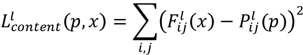

为了生成漂亮的图像，我们需要确保生成的图像的内容与输入图像的内容相似(即距离很小)。因此，利用标准反向传播，该距离被最小化。代码很简单:

```
#

#content distance

#

def get_content_loss(base_content, target):

  return tf.reduce_mean(tf.square(base_content - target)) 
```

## 样式距离

如上所述，VGG19 的较高层中的特征被用作内容表示。你可以把这些特性想象成滤波器响应。为了表示我们在 gram 矩阵 *G* (定义为向量 *v* 的矩阵*v*TT*v*)中使用的样式，我们将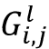视为 VGG19 的层 *l* 的 map *i* 和 map *j* 的内部矩阵。可以看出，格拉姆矩阵表示不同滤波器响应之间的相关矩阵。

每层对总风格损失的贡献定义为:

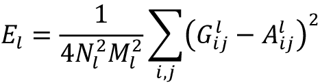

其中是输入图像 *x* 的 gram 矩阵，而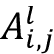是风格图像 a 的 Gram 矩阵，并且*N*l 是特征图的数量，每个特征图的大小为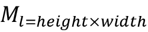。Gram 矩阵可以将图像投影到考虑了风格的空间中。此外，使用了来自多个 VGG19 层的特征相关性，因为我们想要考虑多尺度信息和更健壮的样式表示。不同级别的总风格损失是加权和:

| 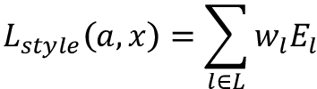 | 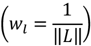 |

因此，关键思想是对内容图像执行梯度下降，以使其风格类似于风格图像。代码很简单:

```
#style distance

#

def gram_matrix(input_tensor):

  # image channels first 

  channels = int(input_tensor.shape[-1])

  a = tf.reshape(input_tensor, [-1, channels])

  n = tf.shape(a)[0]

  gram = tf.matmul(a, a, transpose_a=True)

  return gram / tf.cast(n, tf.float32)

def get_style_loss(base_style, gram_target):

  # height, width, num filters of each layer

  height, width, channels = base_style.get_shape().as_list()

  gram_style = gram_matrix(base_style)

  return tf.reduce_mean(tf.square(gram_style - gram_target)) 
```

简而言之，风格转移背后的概念很简单:首先，我们使用 VGG19 作为特征提取器，然后我们定义两个合适的函数距离，一个用于风格，另一个用于内容，它们被适当地最小化。如果你想亲自尝试一下，那么 TensorFlow 教程可以在网上找到。教程可在[https://colab . research . Google . com/github/tensor flow/models/blob/master/research/NST _ blogpost/4 _ Neural _ Style _ Transfer _ with _ Eager _ execution . ipynb](https://colab.research.google.com/github/tensorflow/models/blob/master/research/nst_blogpost/4_Neural_Style_Transfer_with_Eager_Execution.ipynb)获得。如果你对这个技术的演示感兴趣，你可以去 deepart.io 免费网站，他们在那里做风格转移。

# 摘要

在这一章中，我们已经学习了如何使用深度学习神经网络来高精度地识别 MNIST 手写字符。我们使用 CIFAR-10 数据集构建了一个具有 10 个类别的深度学习分类器，使用 ImageNet 数据集构建了一个具有 1000 个类别的精确分类器。此外，我们研究了如何使用大型深度学习网络，如 VGG16 和非常深度的网络，如 Inception V3。我们最后讨论了迁移学习。

在下一章，我们将看到如何使用单词嵌入，以及为什么这些技术对深度学习很重要。

# 参考

1.  勒昆和本吉奥(1995 年)。*图像、语音和时间序列的卷积网络*。大脑理论神经网络手册，第 3361 卷。
2.  万。l，m，张 s，存，Y. L，和 Fergus R. (2014 年)。*使用 dropconnect* 调整神经网络。 *Proc。第 30 个整数。糖膏剂马赫。学习*。，第 1058–1066 页。
3.  格雷厄姆 B. (2014)。*部分最大池*。arXiv 预印本。arXiv: 1412.6071。
4.  Simonyan K .和 zisser man a .(2014 年 9 月)。*用于大规模图像识别的极深度卷积网络*。arXiv ePrints。

# 加入我们书的不和谐空间

加入我们的 Discord 社区，结识志同道合的朋友，与 2000 多名会员一起学习:[https://packt.link/keras](https://packt.link/keras)

