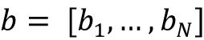

# 四、词嵌入

在前一章中，我们谈到了卷积网络，它在对抗图像数据方面非常成功。在接下来的几章中，我们将转换话题，关注处理文本数据的策略和网络。

在这一章中，我们将首先看看词嵌入背后的思想，然后讨论两个最早的实现——word 2 vec 和 GloVe。我们将学习如何在我们自己的语料库上使用流行的库 Gensim 从头构建词嵌入，并导航我们创建的嵌入空间。

我们还将学习如何使用预训练的第三方嵌入作为我们自己的 NLP 任务的起点，例如垃圾邮件检测，即学习自动检测未经请求和不想要的电子邮件。然后，我们将学习各种方法来利用词嵌入的概念来完成不相关的任务，例如构建一个嵌入空间来进行商品推荐。

然后，我们将看看自 Word2Vec 以来的过去十年中对这些基本词嵌入技术的扩展——添加与 fastText 的语法相似性，使用 ELMo 和 Google Universal Sentence Encoder 等神经网络添加上下文的影响，InferSent 和 skip-thoughts 等句子编码，以及 ULMFiT 和 BERT 等语言模型的引入。

在本章中，我们将了解以下内容:

*   词嵌入——起源和基础
*   分布式表示
*   静态嵌入
*   使用 Gensim 创建您自己的嵌入
*   用 Gensim 探索嵌入空间
*   使用词嵌入进行垃圾邮件检测
*   神经嵌入——不仅仅是单词
*   字符和子词嵌入
*   动态嵌入
*   句子和段落嵌入
*   基于语言的模型嵌入

本章的所有代码文件都可以在 https://packt.link/dltfchp4 找到。

我们开始吧！

# 词嵌入的起源和基础

维基百科将词嵌入定义为**自然语言处理** ( **NLP** )中一组语言建模和特征学习技术的统称，其中词汇中的单词或短语被映射到实数向量。

深度学习模型和其他机器学习模型一样，通常不直接处理文本；文本需要转换成数字。将文本转换为数字的过程称为矢量化。一种早期的单词向量化技术是一键编码，你可以在第一章、的*神经网络基础中了解到。正如您所记得的，one-hot 编码的一个主要问题是，它将每个单词视为完全独立于所有其他单词，因为任何两个单词之间的相似性(通过两个单词向量的点积来测量)总是为零。*

点积是一种代数运算，对两个长度相等的向量和进行运算，并返回一个数字。它也被称为内积或标量积:


为什么两个词的一热向量的点积总是 0？考虑两个词 *w* [i] 和*w*j。假设词汇大小为 *V* ，它们对应的独热向量是秩为 *V* 的零向量，其中位置 *i* 和 *j* 设置为 1。使用点积运算组合时，a[i]中的 1 乘以 b[i]中的 0，b[j]中的 1 乘以 a[j]中的 0，两个向量中的所有其他元素都是 0，因此得到的点积也是 0。

为了克服一次性编码的局限性，NLP 社区借用了来自**信息检索** ( **IR** )的技术，使用文档作为上下文来矢量化文本。值得注意的技术有**词频-逆文档频**(**TF-IDF**)【35】，**潜在语义分析**(**LSA**)【36】，主题建模【37】。这些表示试图捕捉单词之间语义相似性的以文档为中心的思想。其中，one-hot 和 TF-IDF 是相对稀疏的嵌入，因为词汇表通常很大，并且一个单词不太可能出现在语料库中的多个文档中。

词嵌入技术的发展始于 2000 年左右。这些技术不同于以前的基于信息检索的技术，因为它们使用相邻的词作为它们的上下文，从人类理解的角度来看，导致更自然的语义相似性。今天，词嵌入是各种 NLP 任务的基础技术，例如文本分类、文档聚类、词性标注、命名实体识别、情感分析等等。词嵌入导致密集、低维的向量，并且与 LSA 和主题模型一起可以被认为是单词的潜在特征的向量。

词嵌入基于分布假设，该假设认为出现在相似上下文中的单词往往具有相似的含义。因此，基于词嵌入的编码也称为分布式表示，我们将在下面讨论。

# 分布式表示

分布式表示试图通过考虑单词与上下文中其他单词的关系来捕捉单词的含义。语言学家 J. R. Firth 首先提出了分布式假设，他的这句话表达了分布式假设背后的思想:

> 从一个字所交的朋友，你就可以知道这个字。

这是如何工作的？举例来说，考虑下面的一对句子:

巴黎是法国的首都。

柏林是德国的首都。

即使假设没有世界地理知识，句子对也暗示了实体巴黎、法国、柏林和德国之间的某种关系，可以表示为:

`"Paris" is to "France" as "Berlin" is to "Germany."`

分布式表示基于存在某种转换的想法，如下所示:

`Paris : France :: Berlin : Germany`

换句话说，分布式嵌入空间是一个在相似上下文中使用的单词彼此接近的空间。因此，这个空间中单词向量之间的相似性将大致对应于单词之间的语义相似性。

*图 4.1* 显示了单词“important”周围的单词在嵌入空间中的词嵌入的张量板可视化。正如你所看到的，这个词的相邻词往往关系密切，或者可以与原词互换。

例如，“至关重要”实际上是一个同义词，很容易看出在某些情况下“历史的”或“有价值的”这两个词是如何替换的:


图 4.1:词嵌入数据集中单词“important”最近邻的可视化，来自 TensorFlow 嵌入指南(https://www.tensorflow.org/guide/embedding)

在下一节中，我们将看看各种类型的分布式表示(或词嵌入)。

# 静态嵌入

静态嵌入是最古老的词嵌入类型。嵌入是针对大型语料库生成的，但是单词的数量尽管很大，却是有限的。可以把静态嵌入想象成一个字典，单词作为键，它们对应的向量作为值。如果您有一个需要查找其嵌入的单词，而该单词不在原始语料库中，那么您就不走运了。此外，无论如何使用，一个单词都有相同的嵌入，因此静态嵌入无法解决一词多义的问题，即单词有多个含义。当我们在本章后面讨论非静态嵌入时，我们将进一步探讨这个问题。

## Word2Vec

被称为 Word2Vec 的模型最初是由谷歌的一个研究团队在 2013 年创建的，该团队由 Tomas Mikolov 领导。模型是自监督的，也就是说，它们是依赖于自然语言的结构来提供标记训练数据的监督模型。

Word2Vec 的两种架构如下:

*   **连续包话** ( **CBOW** )
*   Skip-gram


图 4.2:CBOW 和 Skip-gram Word2Vec 模型的架构

在 CBOW 架构中，给定一个周围单词的窗口，模型预测当前单词。上下文单词的顺序不影响预测(即单词袋假设，因此得名)。在 skip-gram 架构中，模型预测给定上下文单词的周围单词。根据 Word2Vec 网站，CBOW 更快，但 skip-gram 在预测不常用词方面做得更好。

*图 4.2* 总结了 CBOW 和 skip-gram 架构。为了理解输入和输出，考虑下面的例句:

地球每年绕太阳运行一周。

假设窗口大小为 5，即两个上下文单词位于内容单词的左侧和右侧，则得到的上下文窗口如下所示。粗体字是考虑中的单词，其他单词是窗口中的上下文单词:

[_，_，**，地球，旅行]**

 **[_，The，**地球**，旅行，四处]

[地球，旅行，环绕]

【地球，旅行，**围绕**，太阳】

【传、绕、**、孙、曾】**

 **【绕，**、孙**、曾、每】

[年，月，日，**一次**

[孙，**一次**，每，年，_]

[ **一次**，每，年，_，_]

对于 CBOW 模型，前三个上下文窗口的输入和标签元组如下。在第一个例子的中，CBOW 模型将学习预测单词“the”，给出一组单词(“地球”、“旅行”)，等等。更准确地说，输入单词“地球”和“旅行”的稀疏向量该模型将学习预测其最高值或概率对应于单词“The”的密集向量:

(【地球游记】，**)**

 **(【世，传，绕】，**地**)

(【the，Earth，around，The】， **travels**

对于 skip-gram 模型，前三个上下文窗口对应于以下输入和标签元组。我们可以将给定目标单词预测上下文单词的 skip-gram 模型目标简化为基本上预测一对单词是否上下文相关。上下文相关意味着上下文窗口中的一对单词以某种方式相关。也就是说，以下第一个示例的跳格模型的输入将是上下文单词“the”和“Earth”的稀疏向量，输出将是值 1:

([**，地球]，1)**

 **([**、游记]，1)**

 **([ **地球**，1)

([ **地球**，游记]，1)

([ **地**，左右]，1)

([ **游记**，第 1 期)

([ **游记**，地球]，1)

([ **游记**，转转】，1)

([ **游记**，第 1 期)

我们还需要负样本来适当地训练模型，因此我们通过将每个输入单词与词汇表中的某个随机单词进行配对来生成额外的负样本。这个过程被称为负采样，可能会导致以下附加输入:

([ **地球**，土豚)，0)

([ **地球**，斑马]，0)

用所有这些输入训练的模型被称为具有负采样的**跳格图** ( **SGNS** )模型。

重要的是要明白，我们对这些模型的分类能力不感兴趣；相反，我们感兴趣的是训练的副作用——习得的体重。这些学习到的权重就是我们所说的嵌入。

虽然这可能对自己实现模型作为学术练习有所启发，但在这一点上，Word2Vec 是如此商品化，你不太可能需要这样做。出于好奇，您可以在本章附带的源代码的文件`tf2_cbow_model.py`和`tf2_cbow_skipgram.py`中找到实现 CBOW 和 skip-gram 模型的代码。

Word2Vec 模型由谷歌以自监督的方式对来自谷歌新闻数据集的大约 1000 亿个单词进行训练，包含 300 万个单词的词汇量。谷歌随后发布了预训练模型，供任何人下载和使用。这里有预训练的 Word2Vec 模型([https://drive . Google . com/file/d/0 b 7 xkcwpi 5 kdynlnuttlss 21 pqmm/edit](https://drive.google.com/file/d/0B7XkCwpI5KDYNlNUTTlSS21pQmM/edit))。输出向量维数是 300。它是一个 BIN 文件，可以通过使用`gensim.models.Word2Vec.load_word2vec_format()`或`gensim()`数据下载器使用 Gensim 打开。

词嵌入的另一个早期实现是 GloVe，我们接下来会讲到。

## 手套

单词表示的**全局向量** ( **手套**)嵌入是由*杰弗里·潘宁顿*、*理查德·索彻*和*克里斯托弗·曼宁*【4】创建的。作者将 GloVe 描述为一种无监督学习算法，用于获取单词的矢量表示。在来自语料库的聚集的全局单词-单词共现统计上执行训练，并且得到的表示显示了在 Word2Vec 中看到的相似单词之间的相似聚类行为。

GloVe 与 Word2Vec 的不同之处在于，Word2Vec 是一个预测模型，而 GloVe 是一个基于计数的模型。第一步是构建在训练语料库中同时出现的(单词，上下文)对的大矩阵。行对应于单词，列对应于上下文，通常是一个或多个单词的序列。矩阵中的每个元素代表该单词在上下文中出现的频率。

GloVe 过程将这个共现矩阵分解成一对(单词、特征)和(特征、上下文)矩阵。过程被称为矩阵分解，使用**随机梯度下降** ( **SGD** )，一种迭代数值方法来完成。例如，假设我们想将一个矩阵 *R* 分解成它的因子 *P* 和 *Q* :


SGD 过程将从由随机值组成的 *P* 和 *Q* 开始，并试图通过将它们相乘来重构矩阵*R’*。矩阵 *R* 和*R’*之间的差代表损耗，通常计算为两个矩阵之间的均方误差。损耗决定了为了使重建损耗最小化，为了使*R’*更接近于 *R* ，需要改变 *P* 和 *Q* 的值。这个过程重复多次，直到损耗在某个可接受的阈值内。此时,(单词，特征)矩阵 *P* 就是手套嵌入。

GloVe 进程比 Word2Vec 消耗的资源多得多。这是因为 Word2Vec 通过对一批单词向量进行训练来学习嵌入，而 GloVe 在一个镜头中分解整个共生矩阵。为了使流程具有可伸缩性，SGD 通常以并行模式使用，如 HOGWILD！论文[5]。

Levy 和 Goldberg 还在他们的论文[6]中指出了 Word2Vec 和 GloVe 方法之间的等价性，表明 Word2Vec SGNS 模型隐式分解了单词上下文矩阵。

与 Word2Vec 一样，您不太可能需要生成自己的手套嵌入，而更有可能使用针对大型语料库预先生成并可供下载的嵌入。如果你很好奇，你可以在本章的源代码下载中找到实现矩阵分解的代码。

在各种大型语料库(令牌数量从 60 亿到 8400 亿，词汇量从 40 万到 220 万)和各种维度(50，100，200，300)上训练的手套向量可从手套项目下载页面(【https://nlp.stanford.edu/projects/glove/】T2)获得。它可以直接从网站下载，或使用 Gensim 或 spaCy 数据下载。

# 使用 Gensim 创建您自己的嵌入

我们将使用 Gensim 和一个名为 text8 的小型文本语料库创建一个嵌入。

Gensim 是一个开源的 Python 库，旨在从文本文档中提取语义。它的一个特性是 Word2Vec 算法的出色实现，具有易于使用的 API，允许您训练和查询自己的 Word2Vec 模型。要了解更多关于 Gensim 的信息，请参见[https://radimrehurek.com/gensim/index.xhtml](https://radimrehurek.com/gensim/index.xhtml)。要安装 Gensim，请按照 https://radimrehurek.com/gensim/install.xhtml 的[的说明进行操作。](https://radimrehurek.com/gensim/install.xhtml)

text8 数据集是大型文本压缩基准的前 10 个 ⁸ 字节，由英文维基百科的前 10 个 ⁹ 字节组成[7]。text8 数据集可以从 Gensim API 中作为一个可迭代的标记进行访问，本质上是一个标记化句子的列表。要下载 text8 语料库，从它创建一个 Word2Vec 模型，并保存它以备后用，运行下面几行代码(在本章的源代码中的`create_embedding_with_text8.py`中可以找到):

```
import gensim.downloader as api

from gensim.models import Word2Vec

dataset = api.load("text8")

model = Word2Vec(dataset)

model.save("data/text8-word2vec.bin") 
```

这将在 text8 数据集上训练一个 Word2Vec 模型，并将其保存为二进制文件。Word2Vec 模型有许多参数，但我们将只使用默认值。在这种情况下，它用窗口大小 5 ( `window=5`)训练 CBOW 模型(`sg=0`)，并将产生 100 维嵌入(`size=100`)。Word2Vec 文档第[8]页描述了完整的参数集。要运行此代码，请在命令行执行以下命令:

```
$ mkdir data

$ python create_embedding_with_text8.py 
```

代码应该运行 5-10 分钟，之后它会将一个训练好的模型写到`data`文件夹中。我们将在下一个部分检查这个训练过的模型。

词嵌入是文本处理的核心；然而，在撰写本书时，TensorFlow 中还没有类似的 API 允许您在相同的抽象级别上处理嵌入。为此，我们在本章中使用了 Gensim 来处理 Word2Vec 模型。在线 Tensorflow 教程包含一个如何从头开始训练 Word2Vec 模型的例子([https://www.tensorflow.org/tutorials/text/word2vec](https://www.tensorflow.org/tutorials/text/word2vec))，但这不是我们这里的重点。

# 用 Gensim 探索嵌入空间

让我们重新加载我们刚刚构建的 Word2Vec 模型，并使用Gensim API 来探索它。可以从模型的`wv`属性中访问作为自定义 Gensim 类的实际单词向量:

```
from gensim.models import KeyedVectors

model = KeyedVectors.load("data/text8-word2vec.bin")

word_vectors = model.wv 
```

我们可以看看词汇表中的前几个单词，看看是否有特定的单词可用:

```
words = word_vectors.vocab.keys()

print([x for i, x in enumerate(words) if i < 10])

assert("king" in words) 
```

前面的代码片段产生以下输出:

```
['anarchism', 'originated', 'as', 'a', 'term', 'of', 'abuse', 'first', 'used', 'against'] 
```

我们可以查找与给定单词(“king”)相似的单词，如下所示:

```
def print_most_similar(word_conf_pairs, k):

   for i, (word, conf) in enumerate(word_conf_pairs):

       print("{:.3f} {:s}".format(conf, word))

       if i >= k-1:

           break

   if k < len(word_conf_pairs):

       print("...")

print_most_similar(word_vectors.most_similar("king"), 5) 
```

带有单个参数的`most_similar()`方法产生下面的输出。这里，浮点分数是相似性的度量，较高的值比较低的值好。正如你所看到的，相似的词似乎是最准确的:

```
0.760 prince

0.701 queen

0.700 kings

0.698 emperor

0.688 throne

... 
```

您还可以进行类似于我们之前描述的国家首都示例的矢量运算。我们的目标是看看巴黎:法国::柏林:德国的关系是否成立。这就相当于说巴黎和法国在嵌入空间上的距离应该和柏林和德国一样。换句话说，法国-巴黎+柏林应该给我们德国。在代码中，这将转化为:

```
print_most_similar(word_vectors.most_similar(

   positive=["france", "berlin"], negative=["paris"]), 1

) 
```

如预期的那样，这将返回以下结果:

```
0.803 germany 
```

前面报告的相似性值是余弦相似性，但是更好的相似性度量是由 *Levy* 和*Goldberg*【9】提出的，也在 Gensim API 中实现。这种方法本质上是在对数尺度上计算距离，从而放大较短距离之间的差异，并减小较长距离之间的差异。

```
print_most_similar(word_vectors.most_similar_cosmul(

   positive=["france", "berlin"], negative=["paris"]), 1

) 
```

这也产生了预期的结果，但是具有更高的相似性:

```
0.984 germany 
```

Gensim 还提供了一个`doesnt_match()`函数，可用于检测单词列表中的奇数:

```
print(word_vectors.doesnt_match(["hindus", "parsis", "singapore", "christians"])) 
```

正如我们所料，这给了我们`singapore`,因为它是一组标识宗教的单词中唯一的国家。

我们还可以计算两个单词之间的相似度。这里我们证明了相关单词之间的距离小于不相关单词之间的距离:

```
for word in ["woman", "dog", "whale", "tree"]:

   print("similarity({:s}, {:s}) = {:.3f}".format(

       "man", word,

       word_vectors.similarity("man", word)

   )) 
```

这给出了以下有趣的结果:

```
similarity(man, woman) = 0.759

similarity(man, dog) = 0.474

similarity(man, whale) = 0.290

similarity(man, tree) = 0.260 
```

`similar_by_word()`函数在功能上等同于`similar()`,除了后者默认在比较之前对向量进行归一化。还有一个相关的`similar_by_vector()`函数，这个函数允许你通过指定一个向量作为输入来找到相似的单词。在这里，我们试图找到与“新加坡”相似的单词:

```
print(print_most_similar(

   word_vectors.similar_by_word("singapore"), 5)

) 
```

我们得到以下输出，至少从地理角度来看，这似乎是最正确的:

```
0.882 malaysia

0.837 indonesia

0.826 philippines

0.825 uganda

0.822 thailand

... 
```

我们还可以使用`distance()`函数计算嵌入空间中两个单词之间的距离。这真的只是`1 - similarity()`:

```
print("distance(singapore, malaysia) = {:.3f}".format(

   word_vectors.distance("singapore", "malaysia")

)) 
```

我们也可以直接从`word_vectors`对象或者通过使用`word_vec()`包装器来查找词汇的向量，如下所示:

```
vec_song = word_vectors["song"]

vec_song_2 = word_vectors.word_vec("song", use_norm=True) 
```

根据您的使用情况，您可能会发现其他一些有用的函数。KeyedVectors 的文档页面包含所有可用函数的列表[10]。

这里显示的代码可以在本书附带的代码中的`explore_text8_embedding.py`文件中找到。

# 使用词嵌入进行垃圾邮件检测

由于从大型语料库中生成的各种健壮嵌入的广泛可用性，使用这些嵌入之一来转换文本输入以供机器学习模型使用已经变得非常普遍。文本被视为一系列标记。嵌入为每个记号提供了密集的固定维度向量。每个标记都被它的向量所代替，这将文本序列转换成一个示例矩阵，每个示例都有固定数量的与嵌入维度相对应的特征。

这个例子矩阵可以直接用作标准(非基于神经网络的)机器学习程序的输入，但由于这本书是关于深度学习和 TensorFlow 的，我们将通过一维版本的**卷积神经网络** ( **CNN** )来演示它的用法，您在*第 3 章*、*卷积神经网络*中已经了解过。我们的示例是一个垃圾邮件检测器，它会将**短消息服务** ( **SMS** )或文本消息分类为“垃圾邮件”或“垃圾邮件”这个例子与我们将在*第 20 章*、*高级卷积神经网络*中讨论的情感分析例子非常相似，它使用一维 CNN，但我们在这里的重点是嵌入层。

具体来说，我们将看到程序如何从零开始学习一个为垃圾邮件检测任务定制的嵌入。接下来，我们将看到如何使用外部第三方嵌入，就像我们在本章中了解到的那样，这是一个类似于计算机视觉中的迁移学习的过程。最后，我们将学习如何结合这两种方法，从第三方嵌入开始，并让网络使用它作为自定义嵌入的起点，这一过程类似于计算机视觉中的微调。

像往常一样，我们将从进口开始:

```
import argparse

import gensim.downloader as api

import numpy as np

import os

import shutil

import tensorflow as tf

from sklearn.metrics import accuracy_score, confusion_matrix 
```

Scikit-learn 是一个开源的 Python 机器学习工具包，包含许多高效易用的工具，用于数据挖掘和数据分析。在这一章中，我们使用了它的两个预定义的指标，`accuracy_score`和`confusion_matrix`，在我们的模型被训练之后对其进行评估。

你可以在[https://scikit-learn.org/stable/](https://scikit-learn.org/stable/)了解更多关于 scikit 的信息。

## 获取数据

我们模型的数据是公开的，来自 UCI 机器学习库的垃圾短信收集数据集。以下代码将下载该文件并对其进行解析，以生成 SMS 消息及其相应标签的列表:

```
def download_and_read(url):

   local_file = url.split('/')[-1]

   p = tf.keras.utils.get_file(local_file, url,

       extract=True, cache_dir=".")

   labels, texts = [], []

   local_file = os.path.join("datasets", "SMSSpamCollection")

   with open(local_file, "r") as fin:

       for line in fin:

           label, text = line.strip().split('\t')

           labels.append(1 if label == "spam" else 0)

           texts.append(text)

   return texts, labels

DATASET_URL = "https://archive.ics.uci.edu/ml/machine-learning-databases/00228/smsspamcollection.zip"

texts, labels = download_and_read(DATASET_URL) 
```

该数据集包含 5，574 条短信记录，其中 747 条被标记为“垃圾邮件”，另外 4，827 条被标记为“ham”(非垃圾邮件)。SMS 记录的文本包含在变量`texts`中，相应的数字标签(0 = ham，1 = spam)包含在变量标签中。

## 准备好数据以供使用

下一步是处理数据，这样它就可以被网络使用。SMS 文本需要作为一个整数序列输入网络，其中每个单词都由词汇表中相应的 ID 表示。我们将使用 Keras tokenizer 将每个 SMS 文本转换成单词序列，然后使用 tokenizer 上的`fit_on_texts()`方法创建词汇表。

然后，我们使用`texts_to_sequences()`将 SMS 消息转换成整数序列。最后，由于网络只能处理固定长度的整数序列，我们调用`pad_sequences()`函数来用零填充较短的 SMS 消息。

我们数据集中最长的 SMS 消息有 189 个令牌(单词)。在许多应用中，可能有一些非常长的离群序列，我们可以通过设置`maxlen`标志将长度限制为一个较小的数字。在这种情况下，长于`maxlen`记号的句子将被截断，短于`maxlen`记号的句子将被填充:

```
# tokenize and pad text

tokenizer = tf.keras.preprocessing.text.Tokenizer()

tokenizer.fit_on_texts(texts)

text_sequences = tokenizer.texts_to_sequences(texts)

text_sequences = tf.keras.preprocessing.sequence.pad_sequences(

    text_sequences)

num_records = len(text_sequences)

max_seqlen = len(text_sequences[0])

print("{:d} sentences, max length: {:d}".format(

    num_records, max_seqlen)) 
```

我们还将把我们的标签转换成分类或一键编码格式，因为我们想要选择的损失函数(分类交叉熵)期望看到这种格式的标签:

```
# labels

NUM_CLASSES = 2

cat_labels = tf.keras.utils.to_categorical(

    labels, num_classes=NUM_CLASSES) 
```

记号赋予器允许访问通过`word_index`属性创建的词汇表，这个词汇表基本上是一个词汇表单词在词汇表中的索引位置的字典。我们还建立了反向索引，使我们能够从索引位置到单词本身。此外，我们为角色`PAD`创建条目:

```
# vocabulary

word2idx = tokenizer.word_index

idx2word = {v:k for k, v in word2idx.items()}

word2idx["PAD"] = 0

idx2word[0] = "PAD"

vocab_size = len(word2idx)

print("vocab size: {:d}".format(vocab_size)) 
```

最后，我们创建我们的网络将使用的`dataset`对象。`dataset`对象允许我们以声明的方式设置一些属性，比如批量大小。在这里，我们从我们的填充的整数和分类标签序列中建立一个数据集，混洗数据，并将其分成训练集、验证集和测试集。最后，我们为三个数据集的每一个设置批量大小:

```
# dataset

dataset = tf.data.Dataset.from_tensor_slices(

    (text_sequences, cat_labels))

dataset = dataset.shuffle(10000)

test_size = num_records // 4

val_size = (num_records - test_size) // 10

test_dataset = dataset.take(test_size)

val_dataset = dataset.skip(test_size).take(val_size)

train_dataset = dataset.skip(test_size + val_size)

BATCH_SIZE = 128

test_dataset = test_dataset.batch(BATCH_SIZE, drop_remainder=True)

val_dataset = val_dataset.batch(BATCH_SIZE, drop_remainder=True)

train_dataset = train_dataset.batch(BATCH_SIZE, drop_remainder=True) 
```

## 构建嵌入矩阵

Gensim 工具包提供了对各种经过训练的嵌入模型的访问，您可以在 Python 提示符下运行以下命令:

```
>>> import gensim.downloader as api

>>> api.info("models").keys() 
```

这将返回(在撰写本书时)以下经过训练的词嵌入:

*   **Word2Vec** :两种口味，一种在 Google news 上训练(基于 30 亿个代币的 300 万个词向量)，一种在俄语语料库上训练(word2vec-ruscorpora-300，word2vec-google-news-300)。
*   **GloVe** :两种风格，一种是在 Gigawords 语料库上训练的(基于 60 亿个标记的 400，000 个单词向量)，可作为 50d、100d、200d 和 300d 向量使用，一种是在 Twitter 上训练的(基于 270 亿个标记的 120 万个单词向量)，可作为 25d、50d、100d 和 200d 向量使用(glove-wiki-gigaword-50、glove-wiki-gigaword-100、glove-wiki-gigaword-200、GloVe 较小的嵌入大小将导致输入的更大压缩，从而导致更大程度的近似。
*   **fastText** :用维基百科 2017、UMBC 网络语料库、statmt.org 新闻数据集(16B 令牌)上的子词信息训练的一百万词向量(fast text-wiki-news-subwords-300)。
*   **ConceptNet Numberbatch** :使用 ConceptNet 语义网络、**释义数据库** ( **PPDB** )、Word2Vec 和 GloVe 作为输入的系综嵌入。产生 600 个向量[12，13]。

对于我们的例子，我们选择了在 Gigaword 语料库上训练的 300d 手套嵌入。

为了保持我们的模型规模较小，我们只想考虑存在于我们的词汇表中的单词的嵌入。这是使用下面的代码完成的，它为词汇表中的每个单词创建了一个更小的嵌入矩阵。矩阵中的每一行对应于一个单词，并且行本身是与单词的嵌入相对应的向量:

```
def build_embedding_matrix(sequences, word2idx, embedding_dim,

       embedding_file):

   if os.path.exists(embedding_file):

       E = np.load(embedding_file)

   else:

       vocab_size = len(word2idx)

       E = np.zeros((vocab_size, embedding_dim))

       word_vectors = api.load(EMBEDDING_MODEL)

       for word, idx in word2idx.items():

           try:

               E[idx] = word_vectors.word_vec(word)

           except KeyError:   # word not in embedding

               pass

       np.save(embedding_file, E)

   return E

EMBEDDING_DIM = 300

DATA_DIR = "data"

EMBEDDING_NUMPY_FILE = os.path.join(DATA_DIR, "E.npy")

EMBEDDING_MODEL = "glove-wiki-gigaword-300"

E = build_embedding_matrix(text_sequences, word2idx, 

   EMBEDDING_DIM,

   EMBEDDING_NUMPY_FILE)

print("Embedding matrix:", E.shape) 
```

嵌入矩阵的输出形状是(9010，300)，对应于词汇表中的 9010 个标记和第三方手套嵌入中的 300 个特征。

## 定义垃圾邮件分类器

我们现在准备定义我们的分类器。我们将使用一个**一维卷积神经网络或 ConvNet** ( **1D CNN** )，类似于你已经在*第三章*、*卷积神经网络*中看到的网络。

输入是一个整数序列。第一层是嵌入层，将每个输入的整数转换成大小的向量(`embedding_dim`)。根据运行模式，即我们是从头开始学习嵌入、进行迁移学习还是进行微调，网络中的嵌入层会略有不同。当网络以随机初始化的嵌入权重(`run_mode == "scratch"`)开始并在训练期间学习权重时，我们将`trainable`参数设置为`True`。在迁移学习案例(`run_mode == "vectorizer"`)中，我们从嵌入矩阵`E`中设置权重，但是将`trainable`参数设置为`False`，所以它不训练。在微调的情况下(`run_mode == "finetuning"`)，我们从外部矩阵`E`中设置嵌入权重，并将层设置为可训练的。

嵌入的输出被馈送到卷积层。这里，固定大小的 3 个令牌宽的 1D 窗(`kernel_size=3`)，也称为时间步长，相对于 256 个随机滤波器(`num_filters=256`)进行卷积，以产生每个时间步长的大小为 256 的向量。这样，输出的矢量形状就是(`batch_size`、`time_steps`、`num_filters`)。

卷积层的输出被发送到 1D 空间丢弃层。空间丢弃将随机丢弃从卷积图层输出的整个要素地图。这是一种防止过度拟合的正则化技术。然后通过全局最大池层发送，该层从每个过滤器的每个时间步长中获取最大值，从而产生形状向量(`batch_size`、`num_filters`)。

dropout 层的输出馈入 pooling 层使其变平，然后进入 dense 层，将形状的矢量(`batch_size`、`num_filters`)转换为(`batch_size`、`num_classes`)。softmax 激活会将每个(垃圾邮件、垃圾邮件)的分数转换为概率分布，分别指示输入的 SMS 是垃圾邮件或垃圾邮件的概率:

```
class SpamClassifierModel(tf.keras.Model):

   def __init__(self, vocab_sz, embed_sz, input_length,

           num_filters, kernel_sz, output_sz,

           run_mode, embedding_weights,

           **kwargs):

       super(SpamClassifierModel, self).__init__(**kwargs)

       if run_mode == "scratch":

           self.embedding = tf.keras.layers.Embedding(vocab_sz,

               embed_sz,

               input_length=input_length,

               trainable=True)

       elif run_mode == "vectorizer":

           self.embedding = tf.keras.layers.Embedding(vocab_sz,

               embed_sz,

               input_length=input_length,

               weights=[embedding_weights],

               trainable=False)

       else:

           self.embedding = tf.keras.layers.Embedding(vocab_sz,

               embed_sz,

               input_length=input_length,

               weights=[embedding_weights],

               trainable=True)

       self.conv = tf.keras.layers.Conv1D(filters=num_filters,

           kernel_size=kernel_sz,

           activation="relu")

       self.dropout = tf.keras.layers.SpatialDropout1D(0.2)

       self.pool = tf.keras.layers.GlobalMaxPooling1D()

       self.dense = tf.keras.layers.Dense(output_sz,

           activation="softmax")

   def call(self, x):

       x = self.embedding(x)

       x = self.conv(x)

       x = self.dropout(x)

       x = self.pool(x)

       x = self.dense(x)

       return x

# model definition

conv_num_filters = 256

conv_kernel_size = 3

model = SpamClassifierModel(

   vocab_size, EMBEDDING_DIM, max_seqlen,

   conv_num_filters, conv_kernel_size, NUM_CLASSES,

   run_mode, E)

model.build(input_shape=(None, max_seqlen)) 
```

最后，我们使用分类交叉熵损失函数和 Adam 优化器来编译模型:

```
# compile

model.compile(optimizer="adam", loss="categorical_crossentropy", metrics=["accuracy"]) 
```

## 训练和评估模型

需要注意的一点是数据集有些不平衡；只有 747 个垃圾邮件实例，而有 4，827 个 ham 实例。简单地通过总是预测多数类，网络可以达到接近 87%的准确度。为了缓解这个问题，我们设置了类权重，以表明垃圾短信上的一个错误的代价是垃圾短信上的一个错误的八倍。这由`CLASS_WEIGHTS`变量指示，该变量作为附加参数传递给`model.fit()`调用。

经过 3 个时期的训练后，我们针对测试集评估模型，并报告模型针对测试集的准确度和混淆矩阵。然而，对于不平衡数据，即使使用类权重，模型也可能最终学习总是预测多数类。因此，通常建议在每个类的基础上报告准确性，以确保模型学会有效区分每个类。使用混淆矩阵可以很容易地做到这一点，方法是将每一行的对角线元素除以该行的元素之和，其中每一行对应于一个标记的类别:

```
NUM_EPOCHS = 3

# data distribution is 4827 ham and 747 spam (total 5574), which

# works out to approx 87% ham and 13% spam, so we take reciprocals

# and this works out to being each spam (1) item as being 

# approximately 8 times as important as each ham (0) message.

CLASS_WEIGHTS = { 0: 1, 1: 8 }

# train model

model.fit(train_dataset, epochs=NUM_EPOCHS,

   validation_data=val_dataset,

   class_weight=CLASS_WEIGHTS)

# evaluate against test set

labels, predictions = [], []

for Xtest, Ytest in test_dataset:

   Ytest_ = model.predict_on_batch(Xtest)

   ytest = np.argmax(Ytest, axis=1)

   ytest_ = np.argmax(Ytest_, axis=1)

   labels.extend(ytest.tolist())

   predictions.extend(ytest.tolist())

print("test accuracy: {:.3f}".format(accuracy_score(labels, predictions)))

print("confusion matrix")

print(confusion_matrix(labels, predictions)) 
```

## 运行垃圾邮件检测器

我们想看的三个场景是:

*   让网络学习任务的嵌入。
*   从固定的外部第三方嵌入开始，其中嵌入矩阵被视为矢量器，将整数序列转换为矢量序列。
*   从外部第三方嵌入开始，在训练期间进一步针对任务进行微调。

可以通过设置参数`mode`的值来评估每个场景，如以下命令所示:

```
$ python spam_classifier --mode [scratch|vectorizer|finetune] 
```

数据集很小，模型也相当简单。我们只需要很少的训练(3 个时期)就可以获得非常好的结果(验证集的准确度在 90%以上，测试集的准确度非常好)。在这三种情况下，网络都取得了完美的成绩，准确预测了 1，111 封垃圾邮件和 169 封垃圾邮件。

验证准确度的变化如图 4.3 所示，说明了三种方法之间的差异:


图 4.3:不同嵌入技术的训练时期验证准确性的比较

在从零开始学习的情况下，在第一个时期结束时，验证精度是 0.93，但是在接下来的两个时期中，它上升到 0.98。在矢量器的情况下，网络从第三方嵌入中领先一些，并在第一个时期结束时以几乎 0.95 的验证精度结束。然而，因为嵌入权重不允许改变，所以它不能针对垃圾邮件检测任务定制嵌入，并且在第三个时期结束时的验证准确度是三者中最低的。与矢量器一样，微调的情况也有优势，但是也可以定制任务的嵌入，因此能够在三种情况中以最快的速度学习。微调情况在第一时段结束时具有最高的验证精度，并且在第二时段结束时达到与刮擦情况在第三时段结束时达到的验证精度相同的验证精度。

在下一节中，我们将看到分布相似性并不局限于词嵌入；它也适用于其他场景。

# 神经嵌入——不仅仅是单词

自 Word2Vec 和 GloVe 以来，词嵌入技术以各种方式发展。一个这样的方向是将词嵌入应用于非单词设置，也称为神经嵌入。正如您所记得的，词嵌入利用了分布假设，即出现在相似上下文中的单词往往具有相似的含义，其中上下文通常是围绕目标单词的固定大小(单词数)的窗口。

神经嵌入的想法非常相似；也就是说，出现在相似上下文中的实体往往彼此紧密相关。这些语境的构建方式通常取决于具体情况。我们将在这里描述两种技术，这两种技术非常基础和通用，可以很容易地应用于各种用例。

## Item2Vec

Item2Vec 嵌入模型最初是 Barkan 和 Koenigstein [14]针对协同过滤用例提出的，即基于与该用户有相似购买历史的其他用户的购买行为向用户推荐物品。它使用网上商店中的项目作为“单词”,使用项目集(用户在一段时间内购买的项目序列)作为“句子”,从中导出“单词上下文”。

例如，考虑向超市中的购物者推荐商品的问题。假设我们的超市销售 5000 件商品，那么每件商品都可以表示为一个大小为 5000 的稀疏的一键编码向量。每个用户由他们的购物车代表，购物车是这样的向量序列。应用一个类似于我们在 Word2Vec 部分看到的上下文窗口，我们可以训练一个 skip-gram 模型来预测可能的项目对。所学习的嵌入模型将项目映射到密集的低维空间，在该空间中相似的项目靠得很近，这可用于做出相似的项目推荐。

## node2vec

Grover 和 Leskovec [15]提出了 node2vec 嵌入模型，作为一种可扩展的方式来学习图中节点的特征。它通过在图上执行大量固定长度的随机行走来学习图结构的嵌入。节点是“单词”,随机游走是“句子”, node2vec 中的“单词上下文”就是从这些句子中导出的。

**something 2 vec**page[40]提供了一个全面的列表，其中研究人员试图将分布假设应用于单词以外的实体。希望这个列表能激发你对自己的“某物 2Vec”的想法。

为了说明创建自己的神经嵌入有多容易，我们将生成一个类似 node2vec 的模型，或者更准确地说，是一个名为 DeepWalk 的前身基于图的嵌入，由 Perozzi 等人[42]为 1987-2015 年 NeurIPS 会议上提交的论文提出，利用它们之间的词共现关系。

数据集是一个字数为 11463×5812 的矩阵，其中行代表单词，列代表会议论文。我们将用它来构建一个论文图，其中两篇论文之间的一条边代表一个同时出现在两篇论文中的单词。node2vec 和 DeepWalk 都假设图是无向和无权重的。我们的图是无向的，因为一对论文之间的关系是双向的。然而，我们的边可以具有基于两个文档之间单词共现的数量的权重。对于我们的例子，我们将把大于 0 的任何数量的同现视为有效的未加权边。

像往常一样，我们将从申报进口开始:

```
import gensim

import logging

import numpy as np

import os

import shutil

import tensorflow as tf

from scipy.sparse import csr_matrix

from sklearn.metrics.pairwise import cosine_similarity

logging.basicConfig(format='%(asctime)s : %(levelname)s : %(message)s', level=logging.INFO) 
```

下一步是从 UCI 库中下载数据，并将其转换为稀疏的术语-文档矩阵 TD，然后通过将术语-文档矩阵的转置与其自身相乘来构建文档-文档矩阵 E。我们的图由文档-文档矩阵表示为邻接矩阵或边矩阵。由于每个元素代表两个文档之间的相似性，我们将通过将任何非零元素设置为 1:

```
DATA_DIR = "./data"

UCI_DATA_URL = "https://archive.ics.uci.edu/ml/machine-learning-databases/00371/NIPS_1987-2015.csv"

def download_and_read(url):

   local_file = url.split('/')[-1]

   p = tf.keras.utils.get_file(local_file, url, cache_dir=".")

   row_ids, col_ids, data = [], [], []

   rid = 0

   f = open(p, "r")

   for line in f:

       line = line.strip()

       if line.startswith("\"\","):

           # header

           continue

       # compute non-zero elements for current row

       counts = np.array([int(x) for x in line.split(',')[1:]])

       nz_col_ids = np.nonzero(counts)[0]

       nz_data = counts[nz_col_ids]

       nz_row_ids = np.repeat(rid, len(nz_col_ids))

       rid += 1

       # add data to big lists

       row_ids.extend(nz_row_ids.tolist())

       col_ids.extend(nz_col_ids.tolist())

       data.extend(nz_data.tolist())

   f.close()

   TD = csr_matrix((

       np.array(data), (

           np.array(row_ids), np.array(col_ids)

           )

       ),

       shape=(rid, counts.shape[0]))

   return TD

# read data and convert to Term-Document matrix

TD = download_and_read(UCI_DATA_URL)

# compute undirected, unweighted edge matrix

E = TD.T * TD

# binarize

E[E > 0] = 1 
```

一旦我们有了稀疏二值化邻接矩阵`E`，我们就可以从每个顶点生成随机游走。从每个节点，我们构建 32 个最大长度为 40 个节点的随机漫步。这些遍历的随机重新开始概率为 0.15，这意味着对于任何节点，特定的随机遍历可能以 15%的概率结束。下面的代码将构建随机行走，并将它们写到由`RANDOM_WALKS_FILE`给出的文件中。为了给出输入的概念，我们提供了该文件前 10 行的快照，显示了从节点 0 开始的随机遍历:

```
0 1405 4845 754 4391 3524 4282 2357 3922 1667

0 1341 456 495 1647 4200 5379 473 2311

0 3422 3455 118 4527 2304 772 3659 2852 4515 5135 3439 1273

0 906 3498 2286 4755 2567 2632

0 5769 638 3574 79 2825 3532 2363 360 1443 4789 229 4515 3014 3683 2967 5206 2288 1615 1166

0 2469 1353 5596 2207 4065 3100

0 2236 1464 1596 2554 4021

0 4688 864 3684 4542 3647 2859

0 4884 4590 5386 621 4947 2784 1309 4958 3314

0 5546 200 3964 1817 845 
```

注意，这是一个非常缓慢的过程。如果您想跳过随机漫步生成过程，本章提供了输出副本和源代码:

```
NUM_WALKS_PER_VERTEX = 32

MAX_PATH_LENGTH = 40

RESTART_PROB = 0.15

RANDOM_WALKS_FILE = os.path.join(DATA_DIR, "random-walks.txt")

def construct_random_walks(E, n, alpha, l, ofile):

   if os.path.exists(ofile):

       print("random walks generated already, skipping")

       return

   f = open(ofile, "w")

   for i in range(E.shape[0]):  # for each vertex

       if i % 100 == 0:

           print("{:d} random walks generated from {:d} vertices"

               .format(n * i, i))

       for j in range(n):       # construct n random walks

           curr = i

           walk = [curr]

           target_nodes = np.nonzero(E[curr])[1]

           for k in range(l):   # each of max length l

               # should we restart?

               if np.random.random() < alpha and len(walk) > 5:

                   break

               # choose one outgoing edge and append to walk

               try:

                   curr = np.random.choice(target_nodes)

                   walk.append(curr)

                   target_nodes = np.nonzero(E[curr])[1]

               except ValueError:

                   continue

           f.write("{:s}\n".format(" ".join([str(x) for x in walk])))

   print("{:d} random walks generated from {:d} vertices, COMPLETE"

       .format(n * i, i))

   f.close()

# construct random walks (caution: very long process!)

construct_random_walks(E, NUM_WALKS_PER_VERTEX, RESTART_PROB, MAX_PATH_LENGTH, RANDOM_WALKS_FILE) 
```

来自`RANDOM_WALKS_FILE`的几行如下所示。你可以想象这些看起来像一种语言中的句子，在这种语言中，单词的词汇表就是我们图中的所有节点 id。我们已经了解到，词嵌入利用语言的结构来生成单词的分布式表示。像 DeepWalk 和 node2vec 这样的图嵌入方案对这些从随机行走中创建的“句子”做了完全相同的事情。这种嵌入可以捕捉图中节点之间的相似性，这种相似性超越了直接邻居，正如我们将看到的:

```
0 1405 4845 754 4391 3524 4282 2357 3922 1667

0 1341 456 495 1647 4200 5379 473 2311

0 3422 3455 118 4527 2304 772 3659 2852 4515 5135 3439 1273

0 906 3498 2286 4755 2567 2632

0 5769 638 3574 79 2825 3532 2363 360 1443 4789 229 4515 3014 3683 2967 5206 2288 1615 1166

0 2469 1353 5596 2207 4065 3100

0 2236 1464 1596 2554 4021

0 4688 864 3684 4542 3647 2859

0 4884 4590 5386 621 4947 2784 1309 4958 3314

0 5546 200 3964 1817 845 
```

我们现在准备创建我们的词嵌入模型。Gensim 包提供了一个简单的 API，允许我们使用下面的代码声明性地创建和训练 Word2Vec 模型。训练好的模型将被序列化到`W2V_MODEL_FILE`给出的文件中。`Documents`类允许我们流式传输大型输入文件来训练 Word2Vec 模型，而不会遇到内存问题。我们将以跳格模式训练 Word2Vec 模型，窗口大小为 10，这意味着我们训练它预测给定一个中心顶点的多达五个相邻顶点。每个顶点的最终嵌入是大小为 128 的密集向量:

```
W2V_MODEL_FILE = os.path.join(DATA_DIR, "w2v-neurips-papers.model")

class Documents(object):

   def __init__(self, input_file):

       self.input_file = input_file

   def __iter__(self):

       with open(self.input_file, "r") as f:

           for i, line in enumerate(f):

               if i % 1000 == 0:

                   logging.info("{:d} random walks extracted".format(i))

               yield line.strip().split()

def train_word2vec_model(random_walks_file, model_file):

   if os.path.exists(model_file):

       print("Model file {:s} already present, skipping training"

           .format(model_file))

       return

   docs = Documents(random_walks_file)

   model = gensim.models.Word2Vec(

       docs,

       size=128,    # size of embedding vector

       window=10,   # window size

       sg=1,        # skip-gram model

       min_count=2,

       workers=4

   )

   model.train(

       docs,

       total_examples=model.corpus_count,

       epochs=50)

   model.save(model_file)

# train model

train_word2vec_model(RANDOM_WALKS_FILE, W2V_MODEL_FILE) 
```

我们得到的 DeepWalk 模型只是一个 Word2Vec 模型，所以你可以在单词的上下文中使用 Word2Vec 做任何事情，你也可以在顶点的上下文中使用这个模型。让我们使用该模型来发现文档之间的相似之处:

```
def evaluate_model(td_matrix, model_file, source_id):

   model = gensim.models.Word2Vec.load(model_file).wv

   most_similar = model.most_similar(str(source_id))

   scores = [x[1] for x in most_similar]

   target_ids = [x[0] for x in most_similar]

   # compare top 10 scores with cosine similarity 

   # between source and each target

   X = np.repeat(td_matrix[source_id].todense(), 10, axis=0)

   Y = td_matrix[target_ids].todense()

   cosims = [cosine_similarity(X[i], Y[i])[0, 0] for i in range(10)]

   for i in range(10):

       print("{:d} {:s} {:.3f} {:.3f}".format(

           source_id, target_ids[i], cosims[i], scores[i]))

source_id = np.random.choice(E.shape[0])

evaluate_model(TD, W2V_MODEL_FILE, source_id) 
```

显示了以下输出。第一和第二列是源和目标顶点 id。第三列是对应于源和目标文档的术语向量之间的余弦相似度，第四列是由 Word2Vec 模型报告的相似度得分。如您所见，余弦相似性仅报告 10 个文档对中的 2 个之间的相似性，但是 Word2Vec 模型能够检测嵌入空间中的潜在相似性。这类似于我们已经注意到的一次性编码和密集嵌入之间的行为:

```
src_id dst_id cosine_sim w2v_score

1971   5443        0.000     0.348

1971   1377        0.000     0.348

1971   3682        0.017     0.328

1971   51          0.022     0.322

1971   857         0.000     0.318

1971   1161        0.000     0.313

1971   4971        0.000     0.313

1971   5168        0.000     0.312

1971   3099        0.000     0.311

1971   462         0.000     0.310 
```

这种嵌入策略的代码可以在本章附带的源代码文件夹中的`neurips_papers_node2vec.py`中找到。接下来，我们将继续关注字符和子词的嵌入。

# 字符和子词嵌入

基本词嵌入策略的另一个发展是着眼于字符和子词嵌入，而不是词嵌入的。字符级嵌入最早是由向、和乐存提出的，它比单词级嵌入有一些重要的优势。

首先，一个字符词汇表是有限且小的——例如，一个英语词汇表将包含大约 70 个字符(26 个字符、10 个数字和其余的特殊字符),导致字符模型也是小而紧凑的。第二，与为大量但有限的单词集提供向量的词嵌入不同，字符嵌入没有词汇外的概念，因为任何单词都可以由词汇表示。第三，字符嵌入往往对罕见的和拼写错误的单词更好，因为字符输入的不平衡比单词输入小得多。

字符嵌入更适合于需要语法相似性而不是语义相似性的应用程序。然而，与词嵌入不同，字符嵌入往往是特定于任务的，并且通常在网络内内联生成以支持任务。因此，第三方字符嵌入通常不可用。

子词嵌入结合了字符和词嵌入的思想，将一个词视为一包字符 n 元语法，即由 *n* 个连续词组成的序列。它们最初是由 Bojanowski 等人[18]基于来自**脸书人工智能研究** ( **FAIR** )的研究提出的，他们后来将其作为 fastText 嵌入发布。快速文本嵌入可用于 157 种语言，包括英语。该论文报道了在许多 NLP 任务上的最新表现，特别是对于具有丰富形态的语言的单词类比和语言任务。

fastText 计算字符 n 元语法的嵌入，其中 n 在 3 到 6 个字符之间(默认设置可以更改)，以及单词本身。例如，单词“green”的 n=3 的字符 n-grams 将是“<gr and="">”。单词的开头和结尾分别标有“”字符，以区分短单词和其 n 字母组合，如“<cat>”和“猫”。</cat></gr>

在查找过程中，如果单词存在于嵌入中，可以使用单词作为关键字从 fastText 嵌入中查找向量。然而，与传统的词嵌入不同，您仍然可以为不存在于嵌入中的单词构建一个 fastText 向量。这是通过将单词分解成它的组成三元组子单词来完成的，如前面的例子所示，查找子单词的向量，然后取这些子单词向量的平均值。fastText Python API [19]会自动完成这项工作，但是如果您使用其他 API 来访问 fastText 词嵌入，如 Gensim 或 NumPy，则需要手动完成这项工作。

接下来，我们将看看动态嵌入。

# 动态嵌入

到目前为止，我们考虑的所有嵌入都是静态的；也就是说，它们被部署为映射到固定维度向量的单词(和子单词)字典。与这些嵌入中的单词相对应的向量将是相同的，而不管它在句子中是用作名词还是动词，例如，单词“确保”(用作名词时是健康补充剂的名称，用作动词时是使确定)。它还为多义词或具有多种含义的词提供了相同的向量，如“bank”(根据它是与“money”还是“river”共现，它可以表示不同的意思)。在这两种情况下，单词的意思会根据其上下文，即句子中的线索而变化。动态嵌入试图使用这些信号，根据上下文为单词提供不同的向量。

动态嵌入被部署为经过训练的网络，该网络通过查看整个序列(而不仅仅是单个单词)将您的输入(通常是一个热点向量序列)转换为低维的密集固定大小嵌入。您可以对这种密集嵌入的输入进行预处理，然后将其用作特定于任务的网络的输入，或者将网络包装起来，并将其视为类似于静态嵌入的`tf.keras.layers.Embedding`层。与提前生成(第一种选择)或使用传统嵌入相比，以这种方式使用动态嵌入网络通常要昂贵得多。

最早的动态嵌入是由 McCann 等人[20]提出的，被称为**语境化向量** ( **CoVe** )。这涉及到从机器翻译网络的编码器-解码器对中获取编码器的输出，并将其与同一个单词的单词向量连接起来。

在下一章你将会学到更多关于 seq2seq 网络的知识。研究人员发现，这种策略提高了各种 NLP 任务的表现。

Peters 等人[21]提出的另一个动态嵌入是来自语言模型的**嵌入** ( **ELMo** )。ELMo 使用基于字符的单词表示和双向**长短期记忆** ( **LSTM** )来计算上下文化的单词表示。你将在下一章学到更多关于 LSTMs 的知识。与此同时，经过训练的 ELMo 网络可从 TensorFlow 的模型库 TensorFlow Hub 获得。您可以访问它并使用它来生成 ELMo 嵌入，如下所示。

TensorFlow Hub 上与 TensorFlow 2.0 兼容的全套模型可在 TensorFlow 2.0 的 TensorFlow Hub 网站上找到[16]。在这里，我使用了一组句子，其中模型将使用其默认的空白标记化策略来计算标记:

```
import tensorflow as tf

import tensorflow_hub as hub

elmo = hub.load("https://tfhub.dev/google/elmo/3")

embeddings = elmo.signatures["default"](

    tf.constant([

      "i like green eggs and ham",

      "would you eat them in a box"

    ]))["elmo"]

print(embeddings.shape) 
```

输出为(`2, 7, 1024`)。第一个索引告诉我们，我们的输入包含两个句子。第二个索引指的是所有句子的最大字数，在本例中是 7。该模型自动将输出填充到最长的句子。第三个索引给出了 ELMo 创建的上下文词嵌入的大小；每个单词被转换成一个大小的向量(1024)。

您还可以通过将 ELMo 嵌入层包装在一个`tf.keras.KerasLayer`适配器中，将它集成到您的 TF2 模型中。在这个简单的模型中，模型将返回整个字符串的嵌入:

```
embed = hub.KerasLayer("https://tfhub.dev/google/elmo/3",input_shape=[], dtype=tf.string)

model = tf.keras.Sequential([embed])

embeddings = model.predict([

    "i i like green eggs and ham",

    "would you eat them in a box"

])

print(embeddings.shape) 
```

ELMo 等动态嵌入能够在不同的上下文中为同一个单词提供不同的嵌入，代表了对静态嵌入的改进，如 Word2Vec 或 GloVe。合乎逻辑的下一步是表示更大文本单元的嵌入，比如句子和段落。这是我们将在下一节中看到的。

# 句子和段落嵌入

生成有用的句子和段落嵌入的一个简单而又惊人有效的解决方案是平均它们的组成单词的单词向量。尽管我们将在本节中描述一些流行的句子和段落嵌入，但通常建议尝试将单词向量平均作为基线。

句子(和段落)嵌入也可以以任务优化的方式创建，将它们视为单词序列，并使用一些标准的单词向量来表示每个单词。单词向量的序列被用作输入来训练网络以完成某些特定的任务。就在分类层之前从网络的一个较后的层中提取的向量通常倾向于为序列产生非常好的向量表示。然而，它们往往是非常具体的任务，作为一个通用的矢量表示，用途有限。

Kiros 等人[22]提出了一个想法，即生成可跨任务使用的句子的一般矢量表示。他们建议利用书籍中文本的连续性来构建一个编码器-解码器模型，该模型经过训练可以预测给定句子的周围句子。由编码器-解码器网络构建的单词序列的向量表示通常被称为“思维向量”此外，所提出的模型在非常类似于 skip-gram 的基础上工作，在 skip-gram 中，我们试图预测给定单词的周围单词。出于这些原因，这些句子向量被称为跳过思维向量。该项目发布了一个基于 ano 的模型，可以用来从句子中生成嵌入。后来，Google 研究团队用 TensorFlow 重新实现了该模型[23]。跳过思想模型为每个句子发出大小为(2048)的向量。使用这个模型不是很简单，但是如果你想使用它，存储库[23]上的`README.md`文件提供了说明。

一个更方便的句子嵌入来源是 Google 通用句子编码器，可以在 TensorFlow Hub 上找到。就实现而言，编码器有两种风格。第一种风格速度快，但不太准确，它基于 Iyer 等人【24】提出的**深度平均网络** ( **丹**)，该网络结合了单词和二元模型的嵌入，并通过全连接网络发送。第二种风格更加精确，但速度较慢，基于 Vaswani 等人提出的变压器网络编码器组件【25】。我们将在第 6 章、*变压器*中更详细地介绍变压器网络。

与 ELMo 一样，Google 通用句子编码器也可以从 TensorFlow Hub 加载到您的 TF2 代码中。下面是用我们的两个例句调用它的一些代码:

```
embed = hub.load("https://tfhub.dev/google/universal-sentence-encoder-large/4")

embeddings = embed([

"i like green eggs and ham",

"would you eat them in a box"

])["outputs"]

print(embeddings.shape) 
```

输出为(`2`，`512`)；也就是说，每个句子由一个大小向量(512)表示。值得注意的是，Google Universal Sentence Encoder 可以处理任何长度的单词序列——所以您可以合法地使用它在一端获得词嵌入，在另一端获得段落嵌入。然而，随着序列长度变长，嵌入的质量趋向于被“稀释”

在 Word2Vec 提出后不久，Le 和 Mikolov [26]提出了一个更早的相关工作路线，即生成用于长序列(如段落和文档)的嵌入。它现在可互换地称为 Doc2Vec 或 Paragraph2Vec。Doc2Vec 算法是 Word2Vec 的扩展，它使用周围的单词来预测一个单词。在 Doc2Vec 的情况下，在训练期间提供了一个附加参数，即段落 ID。在训练结束时，Doc2Vec 网络学习每个单词的嵌入和每个段落的嵌入。在推理过程中，给网络一个缺词的段落。该网络使用段落的已知部分来产生段落嵌入，然后使用该段落嵌入和词嵌入来推断段落中缺少的单词。Doc2Vec 算法有两种风格——段落向量——分布式内存 ( **PV-DM** )和**段落向量——分布式单词包** ( **PV-DBOW** )，大致类似于 Word2Vec 中的 CBOW 和 skip-gram。我们不会在本书中进一步研究 Doc2Vec，除非注意 Gensim 工具包提供了预构建的实现，您可以使用自己的语料库进行训练。

看了不同形式的静态和动态嵌入之后，我们现在稍微转换一下话题，看看基于语言模型的嵌入。

# 基于语言模型的嵌入

基于语言模型的嵌入代表了词嵌入发展的下一步。语言模型是单词序列的概率分布。一旦我们有了一个模型，我们就可以让它预测给定特定单词序列的最有可能的下一个单词。类似于传统的静态和动态词嵌入，它们被训练来预测来自语料库的给定部分句子的下一个单词(或者前一个单词，如果语言模型是双向的)。训练不涉及主动标注，因为它利用了大量文本的自然语法结构，所以在某种意义上，这是一个自监督的学习过程。

作为词嵌入的语言模型与更传统的嵌入之间的主要区别在于，传统的嵌入是作为对数据的单个初始转换来应用的，然后针对特定的任务进行微调。相比之下，语言模型是在大型外部语料库上训练的，并且代表特定语言的模型，比如英语。这一步称为预训练。预先训练这些语言模型的计算成本通常相当高；然而，预训练这些模型的人通常会让其他人使用它们，所以我们通常不需要担心这一步。下一步是为您的特定应用领域微调这些通用语言模型。例如，如果您在旅游或医疗保健行业工作，您可以使用您自己领域的文本来微调语言模型。微调包括用你自己的文本重新训练最后几层。一旦进行了微调，您就可以在您的领域内为多个任务重用这个模型。与预训练步骤相比，微调步骤通常要便宜得多。

一旦您有了微调的语言模型，您就可以删除语言模型的最后一层，并用一个一到两层的完全连接的网络来替换,该网络将嵌入您的输入的语言模型转换为您的任务需要的最终分类或回归输出。这个想法和迁移学习是一样的，你在第三章、*卷积神经网络*中学到了，唯一的区别是你在文本上而不是图像上进行迁移学习。与使用图像的迁移学习一样，这些基于语言模型的嵌入允许我们使用非常少的标记数据获得令人惊讶的好结果。毫不奇怪，语言模型嵌入被称为自然语言处理的“图像网时刻”。

基于语言模型的嵌入思想源于 ELMo [21]网络，你在本章已经看到了。ELMo 通过在大型文本语料库上接受训练来学习语言，以学习预测给定单词序列的下一个和上一个单词。ELMo 基于双向 LSTM，你将在第 8 章、*自编码器*中了解更多。

第一个可行的语言模型嵌入是由 Howard 和 Ruder [27]通过他们的**通用语言模型微调** ( **ULMFiT** )模型提出的，该模型在由 28，595 篇维基百科文章和 1.03 亿个单词组成的 wikitext-103 数据集上进行训练。ULMFiT 提供了迁移学习为图像任务提供的相同优势-使用相对较少的标记数据从监督学习任务中获得更好的结果。

与此同时，transformer 架构已成为机器翻译任务的首选网络，取代了 LSTM 网络，因为它允许并行操作，并能更好地处理长期依赖关系。我们将在第 6 章、*转换器*中了解更多关于转换器架构的知识。拉德福德等人[29]的 OpenAI 团队建议使用标准变压器网络的解码器堆栈，而不是 ULMFiT 中使用的 LSTM 网络。利用这一点，他们建立了一个名为**的生成式预训练** ( **GPT** )的语言模型嵌入，这为许多语言处理任务实现了最先进的结果。本文提出了几种涉及单句和多句任务的监督任务配置，如分类、蕴涵、相似性和多项选择问题回答。

OpenAI 团队后来通过建立更大的语言模型，分别称为 GPT-2 和 GPT-3，对此进行了跟进。GPT-2 最初没有发布，因为担心恶意运营商滥用该技术[30]。

OpenAI transformer 架构的一个问题是它是单向的，而它的前身 ELMo 和 ULMFiT 是双向的。**谷歌人工智能团队提出的变压器双向编码器表示** ( **伯特**)使用变压器架构的编码器堆栈，并通过屏蔽高达 15%的输入安全地实现双向，它要求模型预测。

与 OpenAI 论文一样，BERT 提出了将其用于几个监督学习任务的配置，如单句和多句分类、问题回答和标记。

伯特模型有两种主要风格——基于伯特的和基于伯特的。BERT-base 有 12 个编码器层，768 个隐藏单元和 12 个注意头，总共有 1.1 亿个参数。BERT-large 有 24 个编码器层，1024 个隐藏单元，16 个注意头，3.4 亿个参数。更多细节可以在 BERT GitHub 知识库[33]中找到。

BERT 预训练是一个昂贵的过程，目前只能使用**张量处理单元** ( **TPUs** )或大型分布式**图形处理单元**(**GPU**)集群来实现。TPU只能通过谷歌的 Colab 网络【31】或谷歌云平台【32】获得。然而，在 GPU 实例上，用自定义数据集微调 BERT-base 通常是可以实现的。

一旦针对您的领域对 BERT 模型进行了微调，来自最后四个隐藏层的嵌入通常会为下游任务产生良好的结果。使用哪种嵌入或嵌入组合(通过求和、平均、最大池或连接)通常取决于任务的类型。

在下一节中，我们将看看如何从 BERT 语言模型中提取嵌入。

## 使用 BERT 作为特征提取器

BERT 项目[33]提供了一组可以从命令行运行的 Python 脚本来微调 BERT:

```
$ git clone https://github.com/google-research/bert.git

$ cd bert 
```

然后，我们下载我们想要微调的合适的 BERT 模型。如前所述，BERT 有两种尺寸——BERT-base 和 BERT-large。此外，每个型号都有带壳和不带壳的版本。有大小写的版本区分大写和小写单词，而无大小写的版本不区分。对于我们的例子，我们将使用 BERT-base-uncased 预训练模型。您可以在`README.md`页面下方找到该型号和其他型号的下载 URL:

```
$ mkdir data

$ cd data

$ wget \ 

https://storage.googleapis.com/bert_models/2018_10_18/uncased_L-12_H-768_A-12.zip

$ unzip -a uncased_L-12_H-768_A-12.zip 
```

这将在本地 BERT 项目的`data`目录下创建以下文件夹。`bert_config.json`文件是用于创建原始预训练模型的配置文件，`vocab.txt`是用于模型的词汇，由 30522 个单词和单词片段组成:

```
uncased_L-12_H-768_A-12/

 ├── bert_config.json

 ├── bert_model.ckpt.data-00000-of-00001

 ├── bert_model.ckpt.index

 ├── bert_model.ckpt.meta

 └── vocab.txt 
```

预训练的语言模型可以直接用作简单机器学习流水线的文本特征提取器。这对于您只想对您的文本输入进行矢量化，利用嵌入的分布属性来获得比一键编码更密集、更丰富的表示的情况非常有用。

这种情况下的输入只是一个每行一句话的文件。让我们称它为`sentences.txt`，并把它放入我们的`${CLASSIFIER_DATA}`文件夹中。您可以通过将最后一个隐藏层标识为-1(最后一个隐藏层)、-2(在此之前的隐藏层)等来从最后一个隐藏层生成嵌入。为输入句子提取 BERT 嵌入的命令如下:

```
$ export BERT_BASE_DIR=./data/uncased_L-12_H-768_A-12

$ export CLASSIFIER_DATA=./data/my_data

$ export TRAINED_CLASSIFIER=./data/my_classifier

$ python extract_features.py \

    --input_file=${CLASSIFIER_DATA}/sentences.txt \

    --output_file=${CLASSIFIER_DATA}/embeddings.jsonl \

    --vocab_file=${BERT_BASE_DIR}/vocab.txt \

    --bert_config_file=${BERT_BASE_DIR}/bert_config.json \

    --init_checkpoint=${BERT_BASE_DIR}/bert_model.ckpt \

    --layers=-1,-2,-3,-4 \

    --max_seq_length=128 \

    --batch_size=8 
```

该命令将从模型的最后四个隐藏层中提取 BERT 嵌入，并将它们写出到一个名为`embeddings.jsonl`的面向行的 JSON 文件中，该文件与输入文件位于同一目录下。然后，这些嵌入可以用作下游模型的输入，这些模型专门从事一些特定的任务，比如情感分析。因为 BERT 接受了大量英语文本的预训练，它学习了很多关于语言的细微差别，这对这些下游任务很有用。下游模型不一定是神经网络，也可以是非神经模型，如 SVM 或 XGBoost。

你可以对伯特做更多的事情。前面的用例对应于计算机视觉中的迁移学习。正如在计算机视觉中一样，也可以针对特定任务对 BERT(和其他 transformer 模型)进行微调，其中将适当的“头部”网络连接到 BERT，并针对特定任务对组合网络进行微调。你将在第六章、*转换器*中了解更多关于这些技术的内容。

# 摘要

在这一章中，我们已经学习了单词的分布式表示及其各种实现背后的概念，从静态词嵌入开始，如 Word2Vec 和 GloVe。

然后，我们研究了对基本思想的改进，比如子词嵌入、捕捉句子中单词上下文的句子嵌入，以及使用完整的语言模型来生成嵌入。虽然基于语言模型的嵌入目前正在取得最先进的成果，但仍有大量的应用程序使用传统方法可以获得非常好的结果，因此了解所有这些方法并理解其利弊是非常重要的。

我们还简要地研究了词嵌入在自然语言领域之外的其他有趣用途，在这些领域中，其他种类序列的分布特性被用来在诸如信息检索和推荐系统等领域中进行预测。

现在，您已经准备好使用嵌入了，不仅用于基于文本的神经网络(我们将在下一章更深入地讨论)，还用于机器学习的其他领域。

# 参考

1.  Mikolov，t .等人(2013 年 9 月 7 日)*向量空间中单词表示的有效估计*。arXiv:1301.3781v3 [cs。CL】。
2.  Mikolov 等人(2013 年 9 月 17 日)。利用语言间的相似性进行机器翻译。arXiv:1309.4168v1 [cs。CL】。
3.  Mikolov，t .等人(2013 年)。*单词和短语的分布式表示及其组合性*。神经信息处理系统进展 26 (NIPS 2013)。
4.  Pennington，r . Socher，Manning，C. (2014 年)。*手套:单词表示的全局向量*。D14-1162，2014 年自然语言处理*经验方法会议论文集* ( *EMNLP* )。
5.  牛等(2011 年 11 月 11 日)。*猪猡！并行化随机梯度下降的无锁方法*。arXiv:1106.5730 v2[数学。OC】。
6.  纽约州戈德堡市利维(2014 年)。*神经字嵌入为隐式矩阵分解*。神经信息处理系统进展 27 (NIPS 2014)。
7.  马奥尼，M. (2011 年 9 月 1 日)。文本 8 数据集:[http://mattmahoney.net/dc/textdata.xhtml](http://mattmahoney.net/dc/textdata.xhtml)
8.  雷胡雷克河(2019 年 4 月 10 日)。Word2Vec 车型的 gensim 文档:[https://radimrehurek.com/gensim/models/word2vec.xhtml](https://radimrehurek.com/gensim/models/word2vec.xhtml)
9.  纽约州戈德堡市列维市(2014 年 6 月 26 日至 27 日)。*稀疏和显式单词表示中的语言规则*。第十八届计算语言学习会议论文集，第 171-180 页(ACL 2014)。
10.  雷胡雷克河(2019 年 4 月 10 日)。KeyedVectors 的 gensim 文档:[https://radimrehurek.com/gensim/models/keyedvectors.xhtml](https://radimrehurek.com/gensim/models/keyedvectors.xhtml)
11.  阿尔梅达，T. A .，加梅兹·伊达尔戈，J. M .和山上，A. (2011)。垃圾短信过滤研究的贡献:新的收集和结果。2011 年 ACM 文档工程研讨会(DOCENG)会议录:[https://www . dt . fee . unicamp . br/~ tiago/smsspamcollection/doc eng 11 . pdf？ref=https://githubhelp.com](https://www.dt.fee.unicamp.br/~tiago/smsspamcollection/doceng11.pdf?ref=https://githubhelp.com)
12.  Speer，r .，Chin，J. (2016 年 4 月 6 日)。产生高质量词嵌入的集成方法。arXiv:1604.01692v1 [cs。CL】。
13.  斯佩尔河(2016 年 5 月 25 日)。 *ConceptNet Numberbatch:你可以下载的最佳词嵌入的新名称*:[http://blog . concept net . io/posts/2016/concept net-number batch-a-new-name-for-the-best-Word-embedding-you-can-download/](http://blog.conceptnet.io/posts/2016/conceptnet-numberbatch-a-new-name-for-the-best-word-embeddings-you-can-download/)
14.  新墨西哥州科尼斯坦市巴尔坎(2016 年 9 月 13 日至 16 日)。 *Item2Vec:用于协同过滤的神经项目嵌入*。IEEE 第 26 届信号处理机器学习国际研讨会(MLSP 2016)。
15.  格罗弗，a .，莱斯科维奇，J. (2016 年 8 月 13 日至 17 日)。 *node2vec:网络的可扩展特征学习*。第 22 届 ACM SIGKDD 知识发现和数据挖掘国际会议论文集。(KDD 2016)。
16.  TensorFlow Hub 上的 TensorFlow 2.0 模型:[https://tfhub.dev/s?q=tf2-preview](https://tfhub.dev/s?q=tf2-preview)
17.  张，x，乐村，y(2016 年 4 月 4 日)。*文字理解从零开始*。arXiv 1502.01710v5 [cs。LG】。
18.  Bojanowski，p .等人(2017 年 6 月 19 日)。*用子词信息丰富词向量*。arXiv: 1607.04606v2 [cs。CL】。
19.  脸书人工智能研究，fastText (2017)。GitHub 库:[https://github.com/facebookresearch/fastText](https://github.com/facebookresearch/fastText)
20.  McCann，j . Bradbury，c . Xiong，r . Socher(2017 年)。*在翻译中学会:语境化的词向量*。神经信息处理系统，2017。
21.  Peters，m .等人(2018 年 3 月 22 日)。*深度语境化的词语表征*。arXiv: 1802.05365v2 [cs。CL】。
22.  Kiros，r .等人(2015 年 6 月 22 日)。*跳过思维向量*。arXiv: 1506.06727v1 [cs。CL】。
23.  Kiros，R .等人(2017 年)。GitHub 库:[https://github.com/ryankiros/skip-thoughts](https://github.com/ryankiros/skip-thoughts)
24.  Iyer，m .，Manjunatha，v .，Boyd-Graber，j .，Daume，H. (2015 年 7 月 26 日至 31 日)。*深度无序组合与文本分类的句法方法相匹敌*。计算语言学协会第 53 届年会暨第 7 届国际自然语言处理联合会议(ACL 2015)论文集。
25.  Vaswani，a .等人(2017 年 12 月 6 日)。你所需要的只是注意力。arXiv: 1706.03762v5 [cs。CL】。
26.  Le，q .，Mikolov，T. (2014) *句子和文档的分布式表示*。arXiv: 1405.4053v2 [cs。CL】。
27.  霍华德，j .，鲁德，S. (2018 年 5 月 23 日)。用于文本分类的通用语言模型微调。arXiv: 1801.06146v5 [cs。CL】。
28.  Devlin，j .，Chang，m .，Lee，k .，Toutanova，K. (2018 年 10 月 11 日)。 *BERT:用于语言理解的深度双向转换器的预训练*。arXiv: 1810.04805v1 [cs。CL]:【https://arxiv.org/pdf/1810.04805.pdf T2
29.  a .拉德福德、k .纳拉辛汉、t .萨利曼斯、苏茨基弗(2018 年)。*用无监督学习提高语言理解*:【https://openai.com/blog/language-unsupervised/】T2
30.  拉德福德等人(2019 年)。*语言模型是无人监督的多任务学习者*。OpenAI 博客 2019:【http://www.persagen.com/files/misc/radford2019language.pdf 
31.  谷歌合作实验室:[https://colab.research.google.com](https://colab.research.google.com/)
32.  谷歌云平台。[https://cloud.google.com/](https://cloud.google.com/)
33.  谷歌研究，伯特(2019)。GitHub 库:[https://github.com/google-research/bert](https://github.com/google-research/bert)
34.  内梅特(2019)。使用 Tensorflow 2.0 的简单 BERT。*走向数据科学博客*:[https://Towards Data Science . com/simple-Bert-using-tensor flow-2-0-132 CB 19 e 9 b 22](https://towardsdatascience.com/simple-bert-using-tensorflow-2-0-132cb19e9b22)
35.  TF-IDF。维基百科。检索 2019 年 5 月:[https://en.wikipedia.org/wiki/Tf%E2%80%93idf](https://en.wikipedia.org/wiki/Tf%E2%80%93idf)
36.  潜在语义分析。维基百科。检索 2019 年 5 月:[https://en.wikipedia.org/wiki/Latent_semantic_analysis](https://en.wikipedia.org/wiki/Latent_semantic_analysis)
37.  话题模型。维基百科。检索 2019 年 5 月:[https://en.wikipedia.org/wiki/Topic_model](https://en.wikipedia.org/wiki/Topic_model)
38.  Warstadt，a .，Singh，a .，和 Bowman，S. (2018 年)。*神经网络可接受性判断*。arXiv 1805:12471 [csCL]:【https://nyu-mll.github.io/CoLA/ T2
39.  微软研究院释义语料库。(2018):[https://www.microsoft.com/en-us/download/details.aspx?id=52398](https://www.microsoft.com/en-us/download/details.aspx?id=52398)
40.  野泽，K. (2019)。Something2Vec 论文:[https://gist . github . com/nzw 0301/333 AFC 00 BD 508501268 fa 7 BF 40 cafe 4 e](https://gist.github.com/nzw0301/333afc00bd508501268fa7bf40cafe4e)
41.  Perrone，v .等人(2016 年)。*动态特征模型的泊松随机场*:[https://archive . ics . UCI . edu/ml/datasets/NIPS+Conference+Papers+1987-2015](https://archive.ics.uci.edu/ml/datasets/NIPS+Conference+Papers+1987-2015)
42.  Perozzi、r . Al-Rfou 和 s . skie na(2014 年)。DeepWalk:在线学习社交表征。arXiv 1403.6652v2 [cs。SI】。

# 加入我们书的不和谐空间

加入我们的 Discord 社区，结识志同道合的朋友，与 2000 多名会员一起学习:[https://packt.link/keras](https://packt.link/keras)

**********