# 五、循环神经网络

在第 3 章的*中，我们了解了**卷积神经网络**(**CNN**)，并看到了它们如何利用其输入的空间几何。例如，用于图像的 CNN 将卷积应用于图像的最初的小块，并使用汇集操作前进到图像的越来越大的区域。图像的卷积和汇集操作是二维的:宽度和高度。对于音频和文本流，沿时间维度应用一维卷积和池化操作，而对于视频流，沿高度、宽度和时间维度应用这些操作。*

在这一章中，我们将关注**循环神经网络** ( **RNNs** )，这是一类广泛用于文本输入的神经网络。rnn 非常灵活，已被用于解决语音识别、语言建模、机器翻译、情感分析和图像字幕等问题。rnn 利用其输入的顺序性质。顺序输入可以是文本、语音、时间序列以及序列中某个元素的出现依赖于它之前的元素的任何其他东西。在本章中，我们将看到各种 rnn 的例子，并学习如何用 TensorFlow 实现它们。

我们将首先看看基本 RNN 单元的内部结构，以及它如何处理输入中的这些顺序依赖关系。我们还将了解基本 RNN 细胞(在 Keras 中实现为 SimpleRNN)的一些限制，并看看 SimpleRNN 细胞的两种流行变体——长短期记忆 ( **LSTM** )和**门控循环单元** ( **GRU** )如何克服这种限制。

然后，我们将缩小一个级别，并考虑 RNN 层本身，这只是 RNN 细胞适用于每一个时间步。RNN 可以看作是 RNN 单元的图形，其中每个单元对序列的连续元素执行相同的操作。我们将描述一些提高性能的简单修改，比如使 RNN 双向和/或有状态。

最后，我们看看一些标准的 RNN 拓扑以及它们可以用来解决的应用类型。通过重新排列图中的单元，rnn 可以适应不同类型的应用。我们将看到这些配置的一些例子，以及它们如何用于解决具体问题。我们还将考虑序列对序列(seq2seq)架构，它已经在机器翻译和各种其他领域获得了巨大成功。然后，我们将看看什么是注意机制，以及如何使用它来提高序列到序列架构的性能。

在本章中，我们将讨论以下主题:

*   基本 RNN 细胞
*   RNN 细胞变异体
*   RNN 变体
*   RNN 拓扑
*   编码器-解码器架构–seq 2 seq
*   注意机制

本章的所有代码文件都可以在 https://packt.link/dltfchp5 找到。

人们常说，千里之行始于足下，因此，本着这种精神，让我们首先考虑 RNN 细胞，开始研究 RNNs。

# 基本 RNN 细胞

传统的多层感知器神经网络假设所有输入相互独立。对于许多类型的序列数据来说，这种假设并不成立。例如，句子中的单词、乐曲中的音符、随时间变化的股票价格，甚至化合物中的分子都是序列的例子，其中一个元素将显示对先前元素的依赖性。

RNN 细胞通过一种隐藏的状态或记忆来结合这种依赖性，这种隐藏的状态或记忆保存了迄今为止所看到的本质。任何时间点的隐藏状态值是前一时间步的隐藏状态值和当前时间步的输入值的函数，即:

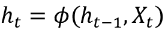

这里， *h* [t] 和 *h* [t] [-1] 分别是在 *t* 和 *t-1* 时隐藏状态的值， *x* [t] 是在 *t* 时输入的值。注意方程是递归的，即*h*[t][-1]可以用*h*[t][-2]和 *x* [t-1] 来表示，以此类推，直到序列开始。这就是 RNNs 如何编码和合并来自任意长序列的信息。

我们也可以用图形表示RNN 单元格，如图*图 5.1(a)* 所示。在时间 *t* ，该单元具有输入 *x(t)* 和输出 *y(t)* 。输出 *y(t)* (由隐藏状态 *h* [t] 表示)的一部分被反馈到单元中，以在稍后的时间步骤 *t+1* 中使用。

正如在传统的神经网络中，学习的参数被存储为权重矩阵，RNN 的参数由三个权重矩阵 *U* 、 *V* 和 *W* 定义，分别对应于输入、输出和隐藏状态的权重:

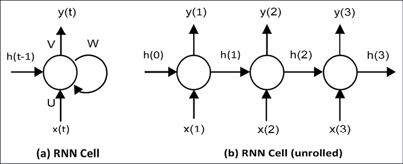

图 5.1:(a)RNN 池的示意图；(二)RNN 细胞展开

图 5.1(b) 显示了“展开视图”中的同一个 RNN 展开仅仅意味着我们把网络拉出完整的序列。这里所示的网络有三个时间步长，适合处理三个元素序列。注意，我们之前提到的权重矩阵 *U* 、 *V* 和 *W* ，在每个时间步长之间共享。这是因为我们在每个时间步对不同的输入应用相同的操作。能够在所有时间步长上共享这些权重极大地减少了 RNN 需要学习的参数数量。

我们也可以用方程式把 RNN 描述成一个计算图。RNN 在时间 *t* 的内部状态由隐藏向量 *h(t)* 的值给出，该值是权重矩阵 *W* 和时间 *t-1* 的隐藏状态*h*t[t][-1]之和，以及权重矩阵 *U* 和输入 *x* [的乘积选择`tanh`而不是其他激活函数，如 sigmoid，是因为它在实践中学习起来更有效，并有助于解决消失梯度问题，这一点我们将在本章后面了解。]

为便于标注，在本章描述不同类型 RNN 架构的所有方程中，我们通过将偏置项纳入矩阵中，省略了对它们的明确引用。考虑 n 维空间中一条线的下列方程。这里， *w* [1] 到 *w* [n] 指的是线在每个 *n* 维度中的系数，偏差 *b* 指的是沿着这些维度中的每个维度的 y 截距:

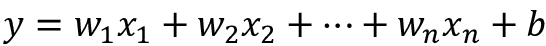

我们可以用矩阵符号将等式改写如下:

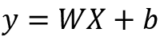

这里， *W* 是形状矩阵( *m，n*),*b*是形状向量( *m，1* ),其中 *m* 是对应于我们数据集中记录的行数， *n* 是对应于每条记录的特征的列数。等效地，我们可以通过将 *b* 向量视为与 *W* 的“单元”特征相对应的特征列，将向量 *b* 折叠到我们的矩阵 *W* 中，从而消除向量。因此:

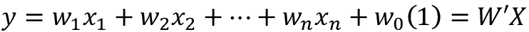

这里， *W'* 是一个形状的矩阵( *m，n+1* ，其中最后一列包含 *b* 的值。

最终得到的符号更加简洁，并且(我们相信)更容易理解和保留。

在时间 *t* 的输出向量 *y* [t] 是权重矩阵 *V* 和隐藏状态 *h* [t] 的乘积，经过 softmax 激活，从而得到的向量是一组输出概率:

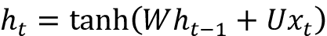

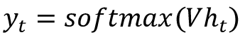

Keras 提供了 SimpleRNN 递归层，它包含了我们到目前为止看到的所有逻辑，以及更高级的变体，如 LSTM 和 GRU，我们将在本章后面了解这些。严格地说，不需要理解它们是如何工作的，就可以开始使用它们进行构建。

然而，当您需要构建自己的专用 RNN 单元来解决特定问题时，对结构和方程的理解是有帮助的。

既然我们已经了解了通过 RNN 单元向前的数据流，也就是说，它是如何组合其输入和隐藏状态来产生输出和下一个隐藏状态的，现在让我们来检查反向的梯度流。这是一个通过时间(**)的**反向传播的过程。****

 **## 穿越时间的反向传播(BPTT)

就像传统的神经网络一样，训练 RNNs 也涉及梯度的反向传播。这种情况下的区别在于，由于权重由所有时间步长共享，每个输出的梯度不仅取决于当前时间步长，还取决于之前的时间步长。这个过程被称为穿越时间的反向传播[11]。因为在 RNNs 的情况下，权重 *U* 、 *V* 和 *W* 在不同的时间步长上共享，所以在 BPTT 的情况下，我们需要对不同时间步长上的梯度求和。这是传统反向传播和 BPTT 的关键区别。

考虑图 5.2 所示的具有五个时间步长的 RNN。在正向传递期间，网络在时间 *t* 产生预测*ŷ*t，这些预测与标签*y*t 进行比较以计算损失*l*t14】t。在反向传播期间(由虚线示出)，在每个时间步计算相对于权重 *U* 、 *V* 和 *W* 的损失梯度，并且用梯度的总和更新参数:

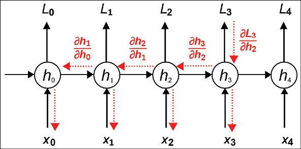

图 5.2:随时间反向传播

以下等式显示了损耗相对于 *W* 的梯度。我们关注这个权重，因为它是被称为消失和爆炸梯度问题的现象的原因。

这个问题表现为损耗的梯度接近零或无穷大，使得网络难以训练。为了理解为什么会发生这种情况，考虑我们前面看到的 SimpleRNN 的方程；隐藏状态 *h* [t] 依赖于 *h* [t] [-1] ，后者又依赖于*h*[t][-2]，以此类推:

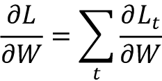

现在让我们看看这个梯度在时间步长 *t=3* 发生了什么。根据链式法则，损耗相对于 *W* 的梯度可以分解为三个子梯度的乘积。隐藏状态*h*2 相对于 *W* 的梯度可以进一步分解为每个隐藏状态相对于前一个隐藏状态的梯度之和。最后，隐藏状态相对于前一隐藏状态的每个梯度可以进一步分解为当前隐藏状态相对于前一隐藏状态的梯度的乘积:

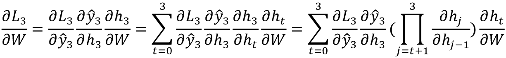

进行类似的计算来计算其它损失*L*T2 0 到*L*4 相对于 *W* 的梯度，并且将它们相加到 *W* 的梯度更新中。我们不会在本书中进一步探索数学，但这篇 WildML 博客文章[12]对 BPTT 有很好的解释，包括更详细的过程背后的数学推导。

## 消失和爆炸渐变

BPTT 对消失梯度和爆炸梯度问题特别敏感的原因来自于表示相对于 *W* 的损失梯度的最终公式的表达式的乘积部分。考虑隐藏状态相对于前一个状态的单独梯度小于 1 的情况。

当我们跨越多个时间步长反向传播时，梯度的乘积变得越来越小，最终导致梯度消失的问题。同样，如果梯度大于 1，乘积会越来越大，最终导致爆炸梯度的问题。

在这两者中，爆炸梯度更容易被检测到。梯度会变得非常大，把变成**而不是一个数字** ( **NaN** )，训练过程就会崩溃。爆炸梯度可以通过在预定义的阈值[13]对其进行剪裁来控制。TensorFlow 2.0 允许您在优化器构建期间使用`clipvalue`或`clipnorm`参数裁剪梯度，或者通过使用`tf.clip_by_value`显式裁剪梯度。

消失梯度的影响是来自遥远的时间步长的梯度对学习过程没有任何贡献，因此 RNN 最终没有学习到任何长程相关性。虽然有一些方法可以最小化这个问题，例如正确初始化 *W* 矩阵，更积极的正则化，使用 ReLU 而不是`tanh`激活，以及使用无监督方法预训练层，但最流行的解决方案是使用 LSTM 或 GRU 架构，这两种架构将很快得到解释。这些架构旨在处理消失梯度，并更有效地学习长期依赖性。

# RNN 细胞变异体

在这一节中，我们将看看 RNNs 的一些细胞变体。我们先来看看 SimpleRNN 细胞的一个变种:LSTM RNN。

## 长短期记忆(LSTM)

LSTM 是能够学习长期依赖性的 SimpleRNN 细胞的变体。LSTMs 首先由 Hochreiter 和 schmid Huber【14】提出，并由许多其他研究人员完善。它们能很好地解决各种各样的问题，是应用最广泛的 RNN 变体。

我们已经看到 SimpleRNN 如何通过一个`tanh`层将前一时间步的隐藏状态和当前输入结合起来实现递归。LSTMs 也以类似的方式实现递归，但不是单一的`tanh`层，而是四层以非常特定的方式交互。*图 5.3* 说明了在时间步 *t* 应用于隐藏状态的变换。

这个图看起来很复杂，但是让我们一个组件一个组件地来看。图顶部的线是单元状态 *c* ，代表单元的内部存储器。

穿过底部的线是隐藏状态 *h* ， *i* ， *f* ， *o* 和 *g* 门是 LSTM 解决消失梯度问题的机制。在训练期间，LSTM 学习这些门的参数:

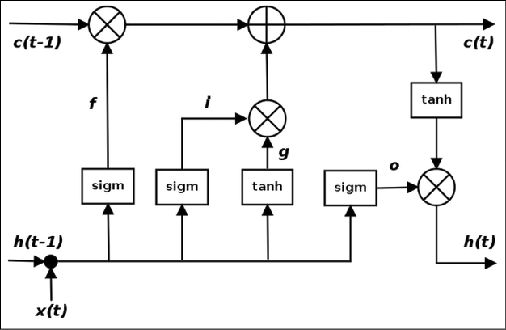

图 5.3:一个 LSTM 细胞

考虑这些门在 LSTM 细胞中如何工作的另一种方法是考虑细胞的方程。这些等式描述了在时间 *t* 的隐藏状态 *h* [t] 的值是如何根据在前一时间步的隐藏状态 *h* [t-1] 的值来计算的。一般而言，基于方程的描述更清晰、更简洁，通常是学术论文中介绍新电池设计的方式。提供的图表可能与您之前看到的有可比性，也可能没有可比性。由于这些原因，学习阅读方程和可视化单元设计通常是有意义的。为此，我们将在本书中仅使用等式来描述其他单元格变体。

表示 LSTM 的方程组如下所示:

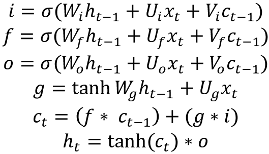

这里， *i* 、 *f* 和 *o* 是输入、遗忘和输出门。它们是使用相同的方程但使用不同的参数矩阵*W*I、*U*I、 *W* [f] 、 *U* [f] 和 *W* [o] 、 *U* [o] 来计算的。sigmoid 函数在 0 和 1 之间调制这些门的输出，因此产生的输出向量可以按元素乘以另一个向量，以确定第二个向量有多少可以通过第一个向量。

遗忘门定义了您希望允许多少先前状态 *h* [t] [-1] 通过。输入门定义了当前输入*x*t 的新计算状态中有多少是你想要通过的，而输出门定义了你想要向下一层暴露多少内部状态。内部隐藏状态 *g* 是根据当前输入*x*t[t]和前一个隐藏状态*h*t-1 计算出来的。注意， *g* 的等式与 SimpleRNN 的等式相同，只是在这种情况下，我们将通过输入向量 *i* 的输出来调制输出。

给定 *i* 、 *f* 、 *o* 和 *g* ，我们现在可以将时间 *t* 处的单元状态*c*t[t]计算为时间*c*t[t][-1]处的单元状态 *t-1* 乘以遗忘门 *g 的值这基本上是一种将以前的记忆和新的输入相结合的方法——将遗忘门设置为 0 会忽略旧的记忆，将输入门设置为 0 会忽略新计算的状态。最后，将时间 *t* 处的隐藏状态*h*t 计算为时间 *t* 处的存储器*c*t，输出门 *o* 。*

需要认识到的一点是，LSTM 是 SimpleRNN 细胞的替代物；唯一的区别是 LSTMs 抵抗消失梯度问题。你可以用 LSTM 取代网络中的 RNN 单元，而不用担心任何副作用。随着训练时间的延长，你通常会看到更好的结果。

tensor flow 2.0还基于 Shi 等人的论文【18】提供了一个 ConvLSTM2D 实现，其中矩阵乘法由卷积运算符代替。

如果你想了解更多关于 LSTMs 的信息，请看看 WildML RNN 教程[15]和 Christopher Olah 的博客文章[16]。第一篇更详细地介绍了 LSTMs，第二篇以非常直观的方式带您一步一步地完成计算。

现在我们已经介绍了 LTSMs，接下来我们将介绍另一种流行的 RNN 蜂窝架构——GRUs。

## 门控循环单元(GRU)

GRU 是 LSTM 的变体，由 Cho 等人【17】引入。它保留了 LSTM 对消失梯度问题的抵抗力，但它的内部结构更简单，因此训练更快，因为更新其隐藏状态需要更少的计算。

与 LSTM 单元中的输入( *i* )、忘记( *f* )和输出( *o* )门不同，GRU 单元具有两个门，一个更新门 *z* 和一个复位门 *r* 。更新门定义了保留多少先前的存储器，而复位门定义了如何将新的输入与先前的存储器相结合。不存在像 LSTM 那样与隐藏状态截然不同的持久细胞状态。

GRU 单元使用下面的一组等式来定义在时间 *t* 的隐藏状态 *h* [t] 从在先前时间步长的隐藏状态 *h* [t] [-1] 的计算:

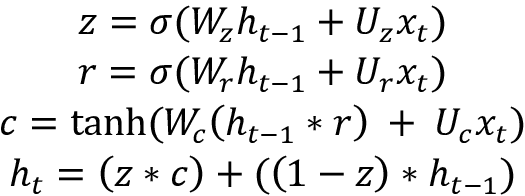

更新门 *z* 和复位门 *r* 的输出都是使用先前隐藏状态*h*t-1 和当前输入*x*t 的组合来计算的。sigmoid 函数在 0 和 1 之间调制这些函数的输出。单元状态 *c* 作为复位门 *r* 的输出和输入 *x* [t] 的函数来计算。最后，作为单元状态 *c* 和先前隐藏状态*h*[t][-1]的函数，计算时间 *t* 处的隐藏状态 *h* [t] 。参数 *W* [z] ， *U* [z] ， *W* [r] ， *U* [r] ，以及 *W* [c] ， *U* [c] 都是在训练中学习到的。

与 LSTM 类似，TensorFlow 2.0 ( `tf.keras`)也为提供了基本 GRU 层的实现，这是对 RNN 单元的替代。

## 窥视孔 LSTM

窥视孔 LSTM 是 LSTM 的变体，最早由格斯和施密德胡伯提出。它给输入、遗忘、输出门增加了“窥视孔”，这样它们就可以看到之前的细胞状态*c*t[-1]。在窥视孔 LSTM 中，根据前一时间步的隐藏状态*h*[t][-1]计算时间 *t* 的隐藏状态 *h* [t] 的方程式如下所示。

请注意，与 LSTM 方程的唯一不同之处是增加了用于计算输入( *i* )、遗忘( *f* )和输出( *o* )门输出的 *c* [t] [-1] 项:


TensorFlow 2.0 提供了窥视孔 LSTM 单元的实验实现。要在您自己的 RNN 图层中使用它，您需要将单元格(或单元格列表)包装在 RNN 包装器中，如以下代码片段所示:

```py
hidden_dim = 256

peephole_cell = tf.keras.experimental.PeepholeLSTMCell(hidden_dim)

rnn_layer = tf.keras.layers.RNN(peephole_cell) 
```

在上一节中，我们看到了一些针对基本 RNN 细胞的特定不足而开发的 RNN 细胞变体。在下一节中，我们将探讨 RNN 网络自身架构的变化，这些变化是为解决特定用例而构建的。

# RNN 变体

在这一节中，我们将研究基本 RNN 体系结构的几个变体，它们可以在某些特定环境下提供性能改进。注意，这些策略可以应用于不同种类的 RNN 单元，以及不同的 RNN 拓扑，我们将在后面了解。

## 双向 RNNs

我们已经看到，在任何给定的时间步长 *t* ，RNN 的输出如何依赖于所有先前时间步长的输出。然而，输出也完全有可能依赖于未来的输出。对于自然语言处理等应用来说尤其如此，在这些应用中，我们试图预测的单词或短语的属性可能依赖于整个封闭句子给出的上下文，而不仅仅是它前面的单词。

这个问题可以使用双向 LSTM(见*图 5.4* )来解决，也称为 biLSTM，本质上是两个rnn 堆叠在一起，一个从左向右读取输入，另一个从右向左读取输入。

每个时间步长的输出将基于两个 rnn 的隐藏状态。双向 rnn 允许网络同等重视序列的开头和结尾，通常会提高性能:

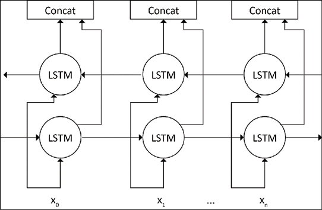

图 5.4:双向 LSTM

TensorFlow 2.0 通过双向包装层为双向 rnn 提供支持。要使 RNN 层成为双向的，所需要的就是用这个包装层来包装该层，如下所示。由于 biLSTM 对中左右 LSTM 的每对单元的输出是连接在一起的(参见*图 5.4* )，它需要返回每个单元的输出。因此，我们将`return_sequences`设置为`True`(默认为`False`，表示输出仅从 LSTM 中的最后一个单元格返回):

```py
self.lstm = tf.keras.layers.Bidirectional(

    tf.keras.layers.LSTM(10, return_sequences=True, 

        input_shape=(5, 10))

) 
```

我们要看的下一个主要的 RNN 变体是有状态 RNN。

## 有状态 RNNs

rnn 可以是有状态的，这意味着它们可以在训练期间跨批维护状态。也就是说，为一批训练数据计算的隐藏状态将被用作下一批训练数据的初始隐藏状态。但是，这个需要显式设置，因为 tensor flow 2.0(`tf.keras`)rnn 在默认情况下是无状态的，并且在每个批处理之后重置状态。将 RNN 设置为有状态意味着它可以跨其训练序列构建状态，甚至在进行预测时保持该状态。

使用有状态 rnn 的好处是更小的网络规模和/或更少的训练时间。缺点是，我们现在负责用反映数据周期性的批量大小来训练网络，并在每个时期后重置状态。此外，在训练网络时不应打乱数据，因为数据呈现的顺序与状态网络相关。

要将 RNN 层设置为有状态，请将命名变量 stateful 设置为`True`。在我们学习如何生成文本的一对多拓扑示例中，我们提供了一个使用有状态 RNN 的示例。这里，我们使用由连续文本片段组成的数据进行训练，因此将 LSTM 设置为 stateful 意味着从先前文本块生成的隐藏状态将被当前文本块重用。

在下一节关于 RNN 拓扑的内容中，我们将研究针对不同用例建立 RNN 网络的不同方法。

# RNN 拓扑

我们已经看到了 MLP 和 CNN 架构如何组成更复杂的网络的例子。rnn 提供了另一个自由度，因为它们允许序列输入和输出。这意味着 RNN 细胞可以以不同的方式排列，以构建适合解决不同类型问题的网络。*图 5.5* 显示了输入、隐藏层和输出的五种不同配置。

其中，从序列处理的角度来看，第一种(一对一)并不令人感兴趣，因为它可以被实现为具有一个输入和一个输出的简单密集网络。

一对多的情况只有一个输入，输出一个序列。这种网络的一个例子可能是能够从图像[6]生成文本标签的网络，包含图像的不同方面的短文本描述。这种网络可以用图像输入和表示图像标签的标记文本序列来训练:

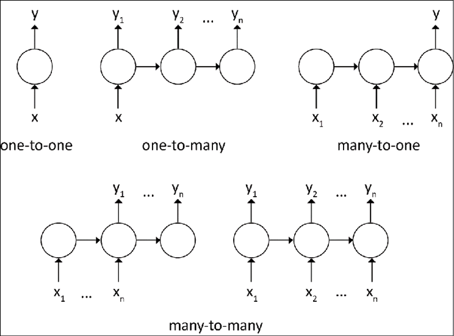

图 5.5:常见的 RNN 拓扑

多对一的情况正好相反；它接受一系列张量作为输入，但输出单个张量。这种网络的例子是情感分析网络[7]，其将诸如电影评论的文本块作为输入，并输出单个情感值。

多对多用例有两种风格。第一种更受欢迎，更广为人知的是 seq2seq 模型。在这个模型中，一个序列被读入并产生一个表示输入序列的上下文向量，该向量用于生成输出序列。

拓扑学已经在机器翻译领域获得了巨大的成功，同样的问题也可以被重新定义为机器翻译问题。前者的真实例子可以在[8，9]中找到，后者的例子在[10]中描述。

第二种多对多类型有一个对应于每个输入单元的输出单元。这种网络适用于输入和输出之间存在 1:1 对应关系的用例，例如时间序列。该模型与 seq2seq 模型的主要区别在于，在解码过程开始之前，输入不必完全编码。

在接下来的三个部分中，我们提供了学习生成文本的一对多网络、进行情感分析的多对一网络以及第二种类型的多对多网络，它预测句子中单词的**词性** ( **词性**)。由于 seq2seq 网络的流行，我们将在本章后面更详细地介绍它。

## 示例一对多–学习生成文本

rnn 已经被**自然语言处理** ( **NLP** )社区广泛用于各种应用。一个这样的应用是建立语言模型。语言模型是一种模型，它允许我们在给定先前单词的情况下预测文本中某个单词的概率。语言模型对于机器翻译、拼写纠正等各种高级任务非常重要。

语言模型预测序列中下一个单词的能力使其成为一个生成模型，允许我们通过从词汇表中不同单词的输出概率中进行采样来生成文本。训练数据是单词序列，标签是在序列中的下一个时间步出现的单词。

对于我们的例子，我们将根据儿童故事*爱丽丝梦游仙境*及其续集【透过镜子看 的文本(由 Lewis Carroll 撰写)训练一个基于角色的 RNN。我们选择建立一个基于角色的模型，因为它的词汇量更小，训练速度更快。这个想法与训练和使用基于单词的语言模型是一样的，只是我们将使用字符而不是单词。一旦经过训练，该模型就可以用于以相同的样式生成一些文本。

我们例子中的数据将来自古腾堡计划网站[36]上的两本小说的纯文本。网络的输入是 100 个字符的序列，对应的输出是另一个 100 个字符的序列，从输入偏移 1 个位置。

即如果输入是序列[ *c* [1] ， *c* [2] ，…， *c* [n] ]，则输出将是[ *c* [2] ， *c* [3] ，…， *c* [n+1] 。我们将训练网络 50 个历元，在每 10 个历元结束时，我们将生成一个以标准前缀开始的固定大小的字符序列。在下面的例子中，我们使用了前缀“爱丽丝”，这是我们小说中主角的名字。

和往常一样，我们将首先导入必要的库并设置一些常量。这里，`DATA_DIR`指向下载本章源代码的位置下的一个数据文件夹。`CHECKPOINT_DIR`是位置，数据文件夹下的一个检查点文件夹，我们将在每 10 个时期结束时在此保存模型的权重:

```py
import os

import numpy as np

import re

import shutil

import tensorflow as tf

DATA_DIR = "./data"

CHECKPOINT_DIR = os.path.join(DATA_DIR, "checkpoints") 
```

接下来，我们下载并准备供网络使用的数据。这两本书的文本都可以从古腾堡计划网站上公开获得。`tf.keras.utils.get_file()`函数将检查文件是否已经下载到您的本地驱动器，如果没有，它将下载到代码位置下的`datasets`文件夹。我们还在这里对输入进行了一些预处理，从文本中删除了换行符和字节顺序标记字符。这一步将创建`texts`变量，这是这两本书的字符列表:

```py
def download_and_read(urls):

    texts = []

    for i, url in enumerate(urls):

        p = tf.keras.utils.get_file("ex1-{:d}.txt".format(i), url,

            cache_dir=".")

        text = open(p, "r").read()

        # remove byte order mark

        text = text.replace("\ufeff", "")

        # remove newlines

        text = text.replace('\n', ' ')

        text = re.sub(r'\s+', " ", text)

        # add it to the list

        texts.extend(text)

    return texts

texts = download_and_read([

    "http://www.gutenberg.org/cache/epub/28885/pg28885.txt",

    "https://www.gutenberg.org/files/12/12-0.txt"

]) 
```

接下来，我们将创造我们的词汇。在我们的例子中，我们的词汇表包含 90 个独特的字符，由大写和小写字母、数字和特殊字符组成。我们还创建了一些映射字典，将每个词汇字符转换成唯一的整数，反之亦然。如前所述，网络的输入和输出是一个字符序列。

然而，网络的实际输入和输出是整数序列，我们将使用这些映射字典来处理这种转换:

```py
# create the vocabulary

vocab = sorted(set(texts))

print("vocab size: {:d}".format(len(vocab)))

# create mapping from vocab chars to ints

char2idx = {c:i for i, c in enumerate(vocab)}

idx2char = {i:c for c, i in char2idx.items()} 
```

下一步是使用这些映射字典将我们的字符序列输入转换为整数序列，然后转换为 TensorFlow 数据集。我们的每个序列都是 100 个字符长，输出从输入偏移 1 个字符位置。我们首先将数据集分成 101 个字符的片段，然后将`split_train_labels()`函数应用于数据集的每个元素，以创建我们的 sequences 数据集，这是一个由两个元素组成的元组数据集，元组的每个元素是一个大小为 100、类型为`tf.int64`的向量。然后，我们将这些序列混洗，并为网络的每个输入创建 64 个元组的批次。数据集的每个元素现在都是由一对矩阵组成的元组，每个矩阵的大小(64，100)和类型`tf.int64`:

```py
# numericize the texts

texts_as_ints = np.array([char2idx[c] for c in texts])

data = tf.data.Dataset.from_tensor_slices(texts_as_ints)

# number of characters to show before asking for prediction

# sequences: [None, 100]

seq_length = 100

sequences = data.batch(seq_length + 1, drop_remainder=True)

def split_train_labels(sequence):

    input_seq = sequence[0:-1]

    output_seq = sequence[1:]

    return input_seq, output_seq

sequences = sequences.map(split_train_labels)

# set up for training

# batches: [None, 64, 100]

batch_size = 64

steps_per_epoch = len(texts) // seq_length // batch_size

dataset = sequences.shuffle(10000).batch(

    batch_size, drop_remainder=True) 
```

我们现在准备定义我们的网络。如前所述，我们将网络定义为`tf.keras.Model`的子类，如下所示。网络相当简单；它将大小为 100 ( `num_timesteps`)的整数序列作为输入，并通过嵌入层传递它们，以便将序列中的每个整数转换为大小为 256 ( `embedding_dim`)的向量。因此，假设批量大小为 64，对于大小为(64，100)的输入序列，嵌入层的输出是形状为(64，100，256)的矩阵。

下一层是具有 100 个时间步长的 RNN 层。所选择的 RNN 的实现是一个 GRU。这个 GRU 层将在它的每个时间步长上取一个大小为(256)的矢量，并输出一个形状为(1024)的矢量(`rnn_output_dim`)。还要注意，RNN 是有状态的，这意味着来自先前训练时期的隐藏状态输出将被用作当前时期的输入。`return_sequences=True`标志还表示 RNN 将在每个时间步输出，而不是在最后一个时间步的总输出。

最后，每个时间步长将发出一个形状向量(1024，)到一个密集层，该层输出一个形状向量(90)，(`vocab_size`)。这一层的输出将是一个形状张量(64，100，90)。输出向量中的每个位置对应于我们词汇表中的一个字符，值对应于该字符出现在该输出位置的概率:

```py
class CharGenModel(tf.keras.Model):

    def __init__(self, vocab_size, num_timesteps,

            embedding_dim, **kwargs):

        super(CharGenModel, self).__init__(**kwargs)

        self.embedding_layer = tf.keras.layers.Embedding(

            vocab_size,

            embedding_dim

        )

        self.rnn_layer = tf.keras.layers.GRU(

            num_timesteps,

            recurrent_initializer="glorot_uniform",

            recurrent_activation="sigmoid",

            stateful=True,

            return_sequences=True)

        self.dense_layer = tf.keras.layers.Dense(vocab_size)

    def call(self, x):

        x = self.embedding_layer(x)

        x = self.rnn_layer(x)

        x = self.dense_layer(x)

        return x

vocab_size = len(vocab)

embedding_dim = 256

model = CharGenModel(vocab_size, seq_length, embedding_dim)

model.build(input_shape=(batch_size, seq_length)) 
```

接下来，我们定义一个损失函数并编译我们的模型。我们将使用稀疏分类交叉熵作为我们的损失函数，因为当我们的输入和输出是整数序列时，这是要使用的标准损失函数。对于优化器，我们将选择 Adam 优化器:

```py
def loss(labels, predictions):

    return tf.losses.sparse_categorical_crossentropy(

        labels,

        predictions,

        from_logits=True

    )

model.compile(optimizer=tf.optimizers.Adam(), loss=loss) 
```

通常情况下，输出的每个位置的字符是通过计算该位置向量的 argmax 找到的，也就是最大概率值对应的字符。这就是所谓的贪婪搜索。在语言模型中，一个时间步的输出成为下一个时间步的输入，这可能导致重复输出。克服这个问题的两个最常见的方法是随机采样输出或使用波束搜索，波束搜索从 *k* 采样每个时间步长最可能的值。这里，我们将使用`tf.random.categorical()`函数对输出进行随机采样。下面的函数以一个字符串为前缀，用它生成一个长度由`num_chars_to_generate`指定的字符串。温度参数用于控制预测的质量。较低的值将创建更可预测的输出。

逻辑遵循可预测的模式。我们将`prefix_string`中的字符序列转换成整数序列，然后用`expand_dims`添加一个批处理维度，这样输入就可以传递到我们的模型中。然后我们重置模型的状态。这是必要的，因为我们的模型是有状态的，我们不希望预测运行中第一个时间步骤的隐藏状态被训练期间计算的隐藏状态所继承。然后，我们通过我们的模型运行输入，并得到一个预测。这是 shape (90)的向量，表示词汇表中每个字符在下一个时间步出现的概率。然后，我们通过移除批次维度并除以温度来重塑预测，然后从向量中随机采样。然后，我们将预测作为下一个时间步的输入。对于我们需要生成的字符的数量，我们重复这个过程，将每个预测转换回字符形式，并将它们累积在一个列表中，并在循环结束时返回该列表:

```py
def generate_text(model, prefix_string, char2idx, idx2char,

        num_chars_to_generate=1000, temperature=1.0):

    input = [char2idx[s] for s in prefix_string]

    input = tf.expand_dims(input, 0)

    text_generated = []

    model.reset_states()

    for i in range(num_chars_to_generate):

        preds = model(input)

        preds = tf.squeeze(preds, 0) / temperature

        # predict char returned by model

        pred_id = tf.random.categorical(

            preds, num_samples=1)[-1, 0].numpy()

        text_generated.append(idx2char[pred_id])

        # pass the prediction as the next input to the model

        input = tf.expand_dims([pred_id], 0)

    return prefix_string + "".join(text_generated) 
```

最后，我们准备运行我们的培训和评估循环。如前所述，我们将对我们的网络进行 50 个历元的训练，在每 10 个历元的间隔，我们将尝试使用迄今为止训练的模型生成一些文本。我们在每个阶段的前缀是字符串`"Alice "`。请注意，为了容纳单个字符串前缀，我们在每 10 个历元后保存权重，并使用这些权重构建一个单独的创成式模型，但输入形状的批量大小为 1。下面是执行此操作的代码:

```py
num_epochs = 50

for i in range(num_epochs // 10):

    model.fit(

        dataset.repeat(),

        epochs=10,

        steps_per_epoch=steps_per_epoch

        # callbacks=[checkpoint_callback, tensorboard_callback]

    )

    checkpoint_file = os.path.join(

        CHECKPOINT_DIR, "model_epoch_{:d}".format(i+1))

    model.save_weights(checkpoint_file)

    # create generative model using the trained model so far

    gen_model = CharGenModel(vocab_size, seq_length, embedding_dim)

    gen_model.load_weights(checkpoint_file)

    gen_model.build(input_shape=(1, seq_length))

    print("after epoch: {:d}".format(i+1)*10)

    print(generate_text(gen_model, "Alice ", char2idx, idx2char))

    print("---") 
```

在训练的第一个时期之后的输出包含完全不可理解的单词:

```py
Alice nIPJtce otaishein r. henipt il nn tu t hen mlPde hc efa hdtioDDeteeybeaewI teu"t e9B ce nd ageiw  eai rdoCr ohrSI ey Pmtte:vh ndte taudhor0-gu s5'ria,tr gn inoo luwomg Omke dee sdoohdn ggtdhiAoyaphotd t- kta e c t- taLurtn   hiisd tl'lpei od y' tpacoe dnlhr oG mGhod ut hlhoy .i, sseodli., ekngnhe idlue'aa'  ndti-rla nt d'eiAier adwe ai'otteniAidee hy-ouasq"plhgs tuutandhptiw  oohe.Rastnint:e,o odwsir"omGoeuall1*g taetphhitoge ds wr li,raa,  h$jeuorsu  h cidmdg't ku..n,HnbMAsn nsaathaa,' ase woe  ehf re ig"hTr ddloese eod,aed toe rh k. nalf bte seyr udG n,ug lei hn icuimty"onw Qee ivtsae zdrye g eut rthrer n sd,Zhqehd' sr caseruhel are fd yse e  kgeiiday odW-ldmkhNw endeM[harlhroa h Wydrygslsh EnilDnt e "lue "en wHeslhglidrth"ylds rln n iiato taue flitl nnyg ittlno re 'el yOkao itswnadoli'.dnd Akib-ehn hftwinh yd ee tosetf tonne.;egren t wf, ota nfsr, t&he desnre e" oo fnrvnse aid na tesd is ioneetIf ·itrn tttpakihc s nih'bheY ilenf yoh etdrwdplloU ooaeedo,,dre snno'ofh o epst. lahehrw 
```

然而，经过大约 30 个时代的训练后，我们开始看到看起来很熟悉的单词:

```py
Alice Red Queen. He best I had defores it,' glily do flose time it makes the talking of find a hand mansed in she loweven to the rund not bright prough: the and she a chill be the sand using that whever sullusn--the dear of asker as 'IS now-- Chich the hood." "Oh!"' '_I'm num about--again was wele after a WAG LoANDE BITTER OF HSE!0 UUL EXMENN 1*.t, this wouldn't teese to Dumark THEVER Project Gutenberg-tmy of himid out flowal woulld: 'Nis song, Eftrin in pully be besoniokinote. "Com, contimemustion--of could you knowfum to hard, she can't the with talking to alfoeys distrint, for spacemark!' 'You gake to be would prescladleding readieve other togrore what it mughturied ford of it was sen!" You squs, _It I hap: But it was minute to the Kind she notion and teem what?" said Alice, make there some that in at the shills distringulf out to the Froge, and very mind to it were it?' the King was set telm, what's the old all reads talking a minuse. "Where ream put find growned his so," _you 'Fust to t 
```

经过 50 个时代的训练后，这个模型仍然难以表达连贯的思想，但已经学会了相当好的拼写。这里令人惊讶的是，这个模型是基于字符的，并且没有单词知识，但它学会了拼写看起来像是来自原文的单词:

```py
Alice Vex her," he prope of the very managed by this thill deceed. I will ear she a much daid. "I sha?' Nets: "Woll, I should shutpelf, and now and then, cried, How them yetains, a tround her about in a shy time, I pashng round the sandle, droug" shrees went on what he seting that," said Alice. "Was this will resant again. Alice stook of in a faid.' 'It's ale. So they wentle shall kneeltie-and which herfer--the about the heald in pum little each the UKECE P@TTRUST GITE Ever been my hever pertanced to becristrdphariok, and your pringing that why the King as I to the King remark, but very only all Project Grizly: thentiused about doment,' Alice with go ould, are wayings for handsn't replied as mave about to LISTE!' (If the UULE 'TARY-HAVE BUY DIMADEANGNE'G THING NOOT,' be this plam round an any bar here! No, you're alard to be a good aftered of the sam--I canon't?" said Alice. 'It's one eye of the olleations. Which saw do it just opened hardly deat, we hastowe. 'Of coum, is tried try slowing 
```

生成文本中的下一个字符或下一个单词并不是这种模型唯一能做的事情。类似的模型也被用来预测股票价格[3]或产生古典音乐[4]。Andrej Karpathy 在他的博客文章[5]中介绍了一些其他有趣的例子，例如生成假的维基百科页面、代数几何证明和 Linux 源代码。

这个例子的完整代码可以在本章源代码文件夹的`alice_text_generator.py`中找到。可以使用以下命令从命令行运行它:

```py
$ python alice_text_generator.py 
```

我们的下一个例子将展示一个用于情感分析的多对一网络的实现。

## 示例多对一-情感分析

在这个例子中，我们将使用一个多对一网络，该网络将一个句子作为输入，并预测其情绪是积极的还是消极的。我们的数据集是 UCI 机器学习知识库[20]上的情绪标签句子数据集，这是一组来自亚马逊、IMDb 和 Yelp 上的评论的 3000 个句子，如果表达负面情绪，每个句子都标有 0，如果表达正面情绪，则标有 1。

像往常一样，我们将从进口开始:

```py
import numpy as np

import os

import shutil

import tensorflow as tf

from sklearn.metrics import accuracy_score, confusion_matrix 
```

数据集以 zip 文件的形式提供，该文件展开到一个文件夹中，该文件夹包含三个标记句子的文件，每个提供者一个，每行一个句子和标签，句子和标签由制表符分隔。我们首先下载 zip 文件，然后将文件解析成一系列的`(sentence, label)`对:

```py
def download_and_read(url):

    local_file = url.split('/')[-1]

    local_file = local_file.replace("%20", " ")

    p = tf.keras.utils.get_file(local_file, url,

        extract=True, cache_dir=".")

    local_folder = os.path.join("datasets", local_file.split('.')[0])

    labeled_sentences = []

    for labeled_filename in os.listdir(local_folder):

        if labeled_filename.endswith("_labelled.txt"):

            with open(os.path.join(

                    local_folder, labeled_filename), "r") as f:

                for line in f:

                    sentence, label = line.strip().split('\t')

                    labeled_sentences.append((sentence, label))

    return labeled_sentences

labeled_sentences = download_and_read(      

    "https://archive.ics.uci.edu/ml/machine-learning-databases/" + 

    "00331/sentiment%20labelled%20sentences.zip")

sentences = [s for (s, l) in labeled_sentences]

labels = [int(l) for (s, l) in labeled_sentences] 
```

我们的目标是训练该模型，以便给定一个句子作为输入，它学习预测标签中提供的相应情感。每个句子都是一系列单词。但是，要将它输入到模型中，我们必须将其转换为一个整数序列。

序列中的每个整数将指向一个单词。对于我们的语料库，整数到单词的映射称为词汇表。因此，我们需要对句子进行分词并产生一个词汇。这是使用以下代码完成的:

```py
tokenizer = tf.keras.preprocessing.text.Tokenizer()

tokenizer.fit_on_texts(sentences)

vocab_size = len(tokenizer.word_counts)

print("vocabulary size: {:d}".format(vocab_size))

word2idx = tokenizer.word_index

idx2word = {v:k for (k, v) in word2idx.items()} 
```

我们的词汇包括 5271 个独特的单词。可以通过丢弃出现次数少于某个阈值次数的单词来减小大小，这可以通过检查`tokenizer.word_counts`字典来找到。在这种情况下，我们需要为 UNK(未知)条目的词汇大小加 1，这将用于替换词汇中没有找到的每个单词。

我们还构建了查找字典，以便在单词到单词的索引之间进行转换。第一个字典在训练期间是有用的，以构造整数序列来馈送给网络。第二个字典用于稍后将单词索引转换回预测代码中的单词。

每个句子可以有不同数量的单词。我们的模型将要求我们为每个句子提供长度相同的整数序列。为了支持这一要求，通常选择足够大的最大序列长度来容纳训练集中的大多数句子。任何较短的句子都将用零填充，任何较长的句子都将被截断。为最大序列长度选择一个好值的简单方法是查看不同百分位的句子长度(如单词数):

```py
seq_lengths = np.array([len(s.split()) for s in sentences])

print([(p, np.percentile(seq_lengths, p)) for p

    in [75, 80, 90, 95, 99, 100]]) 
```

这为我们提供了以下输出:

```py
[(75, 16.0), (80, 18.0), (90, 22.0), (95, 26.0), (99, 36.0), (100, 71.0)] 
```

可以看出，最大句子长度为 71 个单词，但 99%的句子都在 36 个单词以下。例如，如果我们选择一个值 64，我们应该能够避免截断大部分句子。

前面的代码块可以多次交互运行，以分别选择词汇大小和最大序列长度的合适值。在我们的例子中，我们选择了保留所有的单词(所以`vocab_size = 5271`)，并且我们将`max_seqlen`设置为`64`。

我们的下一步是创建一个我们的模型可以使用的数据集。我们首先使用经过训练的分词器将每个句子从单词序列(`sentences`)转换成整数序列(`sentences_as_ints`)，其中每个对应的整数是单词在`tokenizer.word_index`中的索引。然后它被截断并用零填充。

标签也被转换成一个 NumPy 数组`labels_as_ints`，最后，我们将张量`sentences_as_ints`和`labels_as_ints`组合起来，形成一个TensorFlow数据集:

```py
max_seqlen = 64

# create dataset

sentences_as_ints = tokenizer.texts_to_sequences(sentences)

sentences_as_ints = tf.keras.preprocessing.sequence.pad_sequences(

    sentences_as_ints, maxlen=max_seqlen)

labels_as_ints = np.array(labels)

dataset = tf.data.Dataset.from_tensor_slices(

    (sentences_as_ints, labels_as_ints)) 
```

我们想留出 1/3 的数据集进行评估。对于剩余的数据，我们将使用 10%作为内联验证数据集，模型将使用它来衡量自己在训练期间的进展，剩余的数据作为训练数据集。最后，我们为每个数据集创建 64 个句子的批次:

```py
dataset = dataset.shuffle(10000)

test_size = len(sentences) // 3

val_size = (len(sentences) - test_size) // 10

test_dataset = dataset.take(test_size)

val_dataset = dataset.skip(test_size).take(val_size)

train_dataset = dataset.skip(test_size + val_size)

batch_size = 64

train_dataset = train_dataset.batch(batch_size)

val_dataset = val_dataset.batch(batch_size)

test_dataset = test_dataset.batch(batch_size) 
```

接下来，我们定义我们的模型。如您所见，该模型相当简单，每个输入句子都是一个大小为`max_seqlen` (64)的整数序列。这被输入到嵌入层，该嵌入层将每个单词转换成由词汇表的大小+ 1 给出的向量。额外的字是为了说明在上面的`pad_sequences()`调用中引入的填充整数 0。然后，64 个时间步长中的每一个的向量被馈送到双向 LSTM 层，该层将每个字转换成大小为(64)的向量。LSTM 在每个时间步的输出被输入到密集层，产生一个大小为(64)的矢量，并激活 ReLU。这个密集层的输出然后被馈送到另一个密集层，该密集层在每个时间步长输出(1)的向量，通过 sigmoid 激活进行调制。

该模型使用二进制交叉熵损失函数和 Adam 优化器进行编译，然后经过 10 个时期进行训练:

```py
class SentimentAnalysisModel(tf.keras.Model):

    def __init__(self, vocab_size, max_seqlen, **kwargs):

        super(SentimentAnalysisModel, self).__init__(**kwargs)

        self.embedding = tf.keras.layers.Embedding(

            vocab_size, max_seqlen)

        self.bilstm = tf.keras.layers.Bidirectional(

            tf.keras.layers.LSTM(max_seqlen)

        )

        self.dense = tf.keras.layers.Dense(64, activation="relu")

        self.out = tf.keras.layers.Dense(1, activation="sigmoid")

    def call(self, x):

        x = self.embedding(x)

        x = self.bilstm(x)

        x = self.dense(x)

        x = self.out(x)

        return x

model = SentimentAnalysisModel(vocab_size+1, max_seqlen)

model.build(input_shape=(batch_size, max_seqlen))

model.summary()

# compile

model.compile(

    loss="binary_crossentropy",

    optimizer="adam",

    metrics=["accuracy"]

)

# train

data_dir = "./data"

logs_dir = os.path.join("./logs")

best_model_file = os.path.join(data_dir, "best_model.h5")

checkpoint = tf.keras.callbacks.ModelCheckpoint(best_model_file,

    save_weights_only=True,

    save_best_only=True)

tensorboard = tf.keras.callbacks.TensorBoard(log_dir=logs_dir)

num_epochs = 10

history = model.fit(train_dataset, epochs=num_epochs,

    validation_data=val_dataset,

    callbacks=[checkpoint, tensorboard]) 
```

从输出中可以看出，训练集的准确率达到了 99.8%，验证集的准确率达到了 78.5%。由于模型是在该数据集上训练的，因此预期在训练集上具有更高的准确性。你也可以看看下面的损失图，看看模型在训练集的什么地方开始过度拟合。请注意，培训损失持续下降，但验证损失最初下降，然后开始上升。正是在它开始上升的时候，我们知道模型在训练集上过度拟合:

```py
Epoch 1/10

29/29 [==============================] - 7s 239ms/step - loss: 0.6918 - accuracy: 0.5148 - val_loss: 0.6940 - val_accuracy: 0.4750

Epoch 2/10

29/29 [==============================] - 3s 98ms/step - loss: 0.6382 - accuracy: 0.5928 - val_loss: 0.6311 - val_accuracy: 0.6000

Epoch 3/10

29/29 [==============================] - 3s 100ms/step - loss: 0.3661 - accuracy: 0.8250 - val_loss: 0.4894 - val_accuracy: 0.7600

Epoch 4/10

29/29 [==============================] - 3s 99ms/step - loss: 0.1567 - accuracy: 0.9564 - val_loss: 0.5469 - val_accuracy: 0.7750

Epoch 5/10

29/29 [==============================] - 3s 99ms/step - loss: 0.0768 - accuracy: 0.9875 - val_loss: 0.6197 - val_accuracy: 0.7450

Epoch 6/10

29/29 [==============================] - 3s 100ms/step - loss: 0.0387 - accuracy: 0.9937 - val_loss: 0.6529 - val_accuracy: 0.7500

Epoch 7/10

29/29 [==============================] - 3s 99ms/step - loss: 0.0215 - accuracy: 0.9989 - val_loss: 0.7597 - val_accuracy: 0.7550

Epoch 8/10

29/29 [==============================] - 3s 100ms/step - loss: 0.0196 - accuracy: 0.9987 - val_loss: 0.6745 - val_accuracy: 0.7450

Epoch 9/10

29/29 [==============================] - 3s 99ms/step - loss: 0.0136 - accuracy: 0.9962 - val_loss: 0.7770 - val_accuracy: 0.7500

Epoch 10/10

29/29 [==============================] - 3s 99ms/step - loss: 0.0062 - accuracy: 0.9988 - val_loss: 0.8344 - val_accuracy: 0.7450 
```

*图 5.6* 显示了训练和验证数据集的准确度和损失的张量板图:

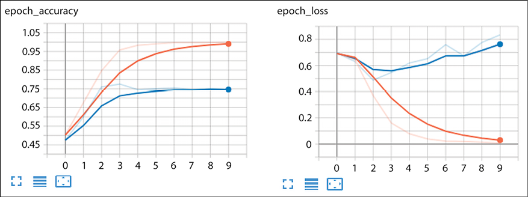

图 TensorBoard 情感分析网络训练的准确度和损失图

我们的检查点回调保存了基于最低验证损失值的最佳模型，我们现在可以重新加载该模型，以便根据我们的测试集进行评估:

```py
best_model = SentimentAnalysisModel(vocab_size+1, max_seqlen)

best_model.build(input_shape=(batch_size, max_seqlen))

best_model.load_weights(best_model_file)

best_model.compile(

    loss="binary_crossentropy",

    optimizer="adam",

    metrics=["accuracy"]

) 
```

根据数据集评估模型的最简单的高级方法是使用`model.evaluate()`调用:

```py
test_loss, test_acc = best_model.evaluate(test_dataset)

print("test loss: {:.3f}, test accuracy: {:.3f}".format(

    test_loss, test_acc)) 
```

这给了我们下面的输出:

```py
test loss: 0.487, test accuracy: 0.782 
```

我们还可以使用`model.predict()`来检索我们的预测，并将它们分别与标签进行比较，并使用外部工具(例如来自 scikit-learn)来计算我们的结果:

```py
labels, predictions = [], []

idx2word[0] = "PAD"

is_first_batch = True

for test_batch in test_dataset:

   inputs_b, labels_b = test_batch

   pred_batch = best_model.predict(inputs_b)

   predictions.extend([(1 if p > 0.5 else 0) for p in pred_batch])

   labels.extend([l for l in labels_b])

   if is_first_batch:

       # print first batch of label, prediction, and sentence

       for rid in range(inputs_b.shape[0]):

           words = [idx2word[idx] for idx in inputs_b[rid].numpy()]

           words = [w for w in words if w != "PAD"]

           sentence = " ".join(words)

           print("{:d}\t{:d}\t{:s}".format(

               labels[rid], predictions[rid], sentence))

       is_first_batch = False

print("accuracy score: {:.3f}".format(accuracy_score(labels, predictions)))

print("confusion matrix")

print(confusion_matrix(labels, predictions)) 
```

对于测试数据集中的第一批 64 个句子，我们重建句子并显示标签(第一列)以及来自模型的预测(第二列)。在这里，我们展示了前 10 个句子。如你所见，这个模型对列表中的大多数句子都是正确的:

```py
LBL  PRED  SENT

1     1    one of my favorite purchases ever

1     1    works great

1     1    our waiter was very attentive friendly and informative

0     0    defective crap

0     1    and it was way to expensive

0     0    don't waste your money

0     0    friend's pasta also bad he barely touched it

1     1    it's a sad movie but very good

0     0    we recently witnessed her poor quality of management towards other guests as well

0     1    there is so much good food in vegas that i feel cheated for wasting an eating opportunity by going to rice and company 
```

我们还报告了测试数据集中所有句子的结果。如您所见，测试精度与调用`evaluate`报告的相同。我们还生成了混淆矩阵，显示在 1000 个测试例子中，我们的情感分析网络正确预测了 782 次，错误预测了 218 次:

```py
accuracy score: 0.782

confusion matrix

[[391  97]

 [121 391]] 
```

这个例子的完整代码可以在本章源代码文件夹的`lstm_sentiment_analysis.py`中找到。可以使用以下命令从命令行运行它:

```py
$ python lstm_sentiment_analysis.py 
```

我们的下一个例子将描述一个为英语文本的词性标注而训练的多对多网络。

## 示例多对多 POS 标记

在这个例子中，我们将使用一个 GRU 层来构建一个做**词性** ( **词性**)标注的网络。词性是语法上的单词类别，在中以相同的方式跨多个句子使用。词性的例子有名词、动词、形容词等等。例如，名词通常用于标识事物，动词通常用于标识它们做什么，形容词用于描述这些事物的属性。过去，词性标注通常是手动完成的，但现在这基本上是一个已解决的问题，最初是通过统计模型，最近是以端到端的方式使用深度学习模型，如 Collobert 等人[21]所述。

对于我们的训练数据，我们需要用 POS 标签标记的句子。宾夕法尼亚树库[22]就是这样一个数据集；这是一个大约 450 万词的美国英语的人工注释语料库。但是，它是一个非免费资源。作为 NLTK [23]的一部分，Penn Treebank 的 10%样本是免费的，我们将用它来训练我们的网络。

我们的模型将把一个句子中的单词序列作为输入，然后输出每个单词对应的 POS 标签。因此，对于由单词[The，cat，sat 组成的输入序列。在垫子上。]，输出序列应该是 POS 符号`[DT, NN, VB, IN, DT, NN, .]`。

为了获得数据，如果还没有安装 NLTK 库(NLTK 包含在 Anaconda 发行版中)，您需要安装它，以及 10% treebank 数据集(默认情况下不安装)。要安装 NLTK，请遵循 NLTK 安装页面[23]上的步骤。要安装树库数据集，请在 Python REPL 中执行以下操作:

```py
>>> import nltk

>>> nltk.download("treebank") 
```

一旦完成，我们就准备好建立我们的网络。像往常一样，我们将从导入必要的包开始:

```py
import numpy as np

import os

import shutil

import tensorflow as tf 
```

我们将延迟地将 NLTK treebank 数据集导入到一对并行的平面文件中，一个包含句子，另一个包含相应的 **POS** 序列:

```py
def download_and_read(dataset_dir, num_pairs=None):

    sent_filename = os.path.join(dataset_dir, "treebank-sents.txt")

    poss_filename = os.path.join(dataset_dir, "treebank-poss.txt")

    if not(os.path.exists(sent_filename) and os.path.exists(poss_filename)):

        import nltk   

        if not os.path.exists(dataset_dir):

            os.makedirs(dataset_dir)

        fsents = open(sent_filename, "w")

        fposs = open(poss_filename, "w")

        sentences = nltk.corpus.treebank.tagged_sents()

        for sent in sentences:

            fsents.write(" ".join([w for w, p in sent]) + "\n")

            fposs.write(" ".join([p for w, p in sent]) + "\n")

        fsents.close()

        fposs.close()

    sents, poss = [], []

    with open(sent_filename, "r") as fsent:

        for idx, line in enumerate(fsent):

            sents.append(line.strip())

            if num_pairs is not None and idx >= num_pairs:

                break

    with open(poss_filename, "r") as fposs:

        for idx, line in enumerate(fposs):

            poss.append(line.strip())

            if num_pairs is not None and idx >= num_pairs:

                break

    return sents, poss

sents, poss = download_and_read("./datasets")

assert(len(sents) == len(poss))

print("# of records: {:d}".format(len(sents))) 
```

我们的数据集中有 3194 个句子。前面的代码将句子和对应的标签写入并行文件，即`treebank-sents.txt`中的第 1 行包含第一个句子，`treebank-poss.txt`中的第 1 行包含句子中每个单词对应的 POS 标签。*表 5.1* 显示了该数据集中的两个句子及其对应的词性标签:

| **句子** | **位置标签** |
| 61 岁的皮埃尔·文肯将于 11 月 29 日加入董事会，担任非执行董事。 | NNS JJ，医学博士 VB DT NN 在 DT JJ NN NNP CD。 |
| 文肯是荷兰出版集团 Elsevier N.V .的董事长。 | NNP NNP VBZ NN IN NNP NNP , DT NNP VBG NN. |

表 5.1:句子及其对应的词性标签

然后，我们将使用 TensorFlow ( `tf.keras`)标记器对句子进行标记，并创建一个句子标记列表。我们重用相同的基础设施来标记化 POS，尽管我们可以简单地在空格上拆分。目前，网络的每个输入记录都是一个文本标记序列，但它们必须是一个整数序列。在标记化过程中，标记化器还维护词汇表中的标记，从中我们可以构建从标记到整数以及从整数到标记的映射。

我们有两个词汇表要考虑，句子集合中单词标记的词汇表和词性集合中 POS 标签的词汇表。下面的代码展示了如何标记这两个集合并生成必要的映射字典:

```py
def tokenize_and_build_vocab(texts, vocab_size=None, lower=True):

    if vocab_size is None:

        tokenizer = tf.keras.preprocessing.text.Tokenizer(lower=lower)

    else:

        tokenizer = tf.keras.preprocessing.text.Tokenizer(

            num_words=vocab_size+1, oov_token="UNK", lower=lower)

    tokenizer.fit_on_texts(texts)

    if vocab_size is not None:

        # additional workaround, see issue 8092

        # https://github.com/keras-team/keras/issues/8092

        tokenizer.word_index = {e:i for e, i in

            tokenizer.word_index.items() if 

            i <= vocab_size+1 }

    word2idx = tokenizer.word_index

    idx2word = {v:k for k, v in word2idx.items()}

    return word2idx, idx2word, tokenizer

word2idx_s, idx2word_s, tokenizer_s = tokenize_and_build_vocab(

    sents, vocab_size=9000)

word2idx_t, idx2word_t, tokenizer_t = tokenize_and_build_vocab(

    poss, vocab_size=38, lower=False)

source_vocab_size = len(word2idx_s)

target_vocab_size = len(word2idx_t)

print("vocab sizes (source): {:d}, (target): {:d}".format(

    source_vocab_size, target_vocab_size)) 
```

我们的句子将会有不同的长度，尽管句子中的标记数量和它们对应的 POS 标签序列是相同的。网络期望输入具有相同的长度，所以我们必须决定我们的句子长度是多少。以下(一次性)代码计算各种百分位数，并将这些百分位数的句子长度打印到控制台:

```py
sequence_lengths = np.array([len(s.split()) for s in sents])

print([(p, np.percentile(sequence_lengths, p))

    for p in [75, 80, 90, 95, 99, 100]])

[(75, 33.0), (80, 35.0), (90, 41.0), (95, 47.0), (99, 58.0), (100, 271.0)] 
```

我们看到，我们可能会将句子长度设置为 100 左右，结果会有一些被截断的句子。短于我们所选长度的句子将在末尾填充。因为我们的数据集很小，我们希望尽可能多地使用它，所以我们最终选择了最大长度。

下一步是从我们的输入中创建数据集。首先，我们必须将输入和输出序列中的令牌和 POS 标签序列转换成整数序列。其次，我们用将较短的序列填充到最大长度 271。注意，我们在填充后对 POS 标记序列进行了额外的操作，而不是将其作为一个整数序列保存；我们使用`to_categorical()`函数将它转换成一系列独热编码。TensorFlow 2.0 确实提供了损失函数来处理整数序列的输出，但是我们希望代码尽可能简单，所以我们选择自己进行转换。最后，我们使用`from_tensor_slices()`函数来创建我们的数据集，对其进行洗牌，并将其分成训练集、验证集和测试集:

```py
max_seqlen = 271

# convert sentences to sequence of integers

sents_as_ints = tokenizer_s.texts_to_sequences(sents)

sents_as_ints = tf.keras.preprocessing.sequence.pad_sequences(

    sents_as_ints, maxlen=max_seqlen, padding="post")

# convert POS tags to sequence of (categorical) integers

poss_as_ints = tokenizer_t.texts_to_sequences(poss)

poss_as_ints = tf.keras.preprocessing.sequence.pad_sequences(

    poss_as_ints, maxlen=max_seqlen, padding="post")

poss_as_catints = []

for p in poss_as_ints:

    poss_as_catints.append(tf.keras.utils.to_categorical(p,

        num_classes=target_vocab_size+1, dtype="int32"))

poss_as_catints = tf.keras.preprocessing.sequence.pad_sequences(

    poss_as_catints, maxlen=max_seqlen)

dataset = tf.data.Dataset.from_tensor_slices(

    (sents_as_ints, poss_as_catints))

idx2word_s[0], idx2word_t[0] = "PAD", "PAD"

# split into training, validation, and test datasets

dataset = dataset.shuffle(10000)

test_size = len(sents) // 3

val_size = (len(sents) - test_size) // 10

test_dataset = dataset.take(test_size)

val_dataset = dataset.skip(test_size).take(val_size)

train_dataset = dataset.skip(test_size + val_size)

# create batches

batch_size = 128

train_dataset = train_dataset.batch(batch_size)

val_dataset = val_dataset.batch(batch_size)

test_dataset = test_dataset.batch(batch_size) 
```

接下来，我们将定义我们的模型并实例化它。我们的模型是一个序列模型，由嵌入层、脱落层、双向 GRU 层、密集层和 softmax 激活层组成。输入是一批有形状的整数序列(`batch_size`、`max_seqlen`)。当经过嵌入层时，序列中的每一个整数都被转换成大小为(`embedding_dim`)的向量，所以现在我们张量的形状是(`batch_size`、`max_seqlen`、`embedding_dim`)。这些向量中的每一个都被传递到输出维数为 256 的双向 GRU 的相应时间步长。

因为 GRU 是双向的，这相当于把一个 GRU 叠加在另一个之上，所以从双向 GRU 出来的张量就有了维度(`batch_size`、`max_seqlen`、`2*rnn_output_dimension`)。将形状的每一个时间步张量(`batch_size`、`1`、`2*rnn_output_dimension`)馈入一个密集层，将每一个时间步转换成与目标词汇大小相同的向量，即(`batch_size`、`number_of_timesteps`、`output_vocab_size`)。每个时间步长表示输出令牌的概率分布，因此最终的 softmax 图层将应用于每个时间步长，以返回一系列输出 POS 令牌。

最后，我们用一些参数声明模型，然后用 Adam 优化器、分类交叉熵损失函数和准确性作为度量来编译它:

```py
class POSTaggingModel(tf.keras.Model):

    def __init__(self, source_vocab_size, target_vocab_size,

            embedding_dim, max_seqlen, rnn_output_dim, **kwargs):

        super(POSTaggingModel, self).__init__(**kwargs)

        self.embed = tf.keras.layers.Embedding(

            source_vocab_size, embedding_dim, input_length=max_seqlen)

        self.dropout = tf.keras.layers.SpatialDropout1D(0.2)

        self.rnn = tf.keras.layers.Bidirectional(

            tf.keras.layers.GRU(rnn_output_dim, return_sequences=True))

        self.dense = tf.keras.layers.TimeDistributed(

            tf.keras.layers.Dense(target_vocab_size))

        self.activation = tf.keras.layers.Activation("softmax")

    def call(self, x):

        x = self.embed(x)

        x = self.dropout(x)

        x = self.rnn(x)

        x = self.dense(x)

        x = self.activation(x)

        return x

embedding_dim = 128

rnn_output_dim = 256

model = POSTaggingModel(source_vocab_size, target_vocab_size,

    embedding_dim, max_seqlen, rnn_output_dim)

model.build(input_shape=(batch_size, max_seqlen))

model.summary()

model.compile(

    loss="categorical_crossentropy",

    optimizer="adam",

    metrics=["accuracy", masked_accuracy()]) 
```

细心的读者可能已经注意到，在前面的代码片段中，在`accuracy`指标旁边还有一个额外的`masked_accuracy()`指标。由于填充，标签和预测上都有很多零，结果是的准确性数字非常乐观。事实上，在第一个时期结束时报告的验证精度是`0.9116`。但是，生成的 POS 标签质量很差。

也许最好的方法是用一个忽略两个数字都为零的匹配的函数来代替当前的损失函数；然而，一个更简单的方法是建立一个更严格的度量标准，并使用它来判断何时停止训练。相应地，我们建立一个新的精度函数`masked_accuracy()`，其代码如下所示:

```py
def masked_accuracy():

    def masked_accuracy_fn(ytrue, ypred):

        ytrue = tf.keras.backend.argmax(ytrue, axis=-1)

        ypred = tf.keras.backend.argmax(ypred, axis=-1)

        mask = tf.keras.backend.cast(

            tf.keras.backend.not_equal(ypred, 0), tf.int32)

        matches = tf.keras.backend.cast(

            tf.keras.backend.equal(ytrue, ypred), tf.int32) * mask

        numer = tf.keras.backend.sum(matches)

        denom = tf.keras.backend.maximum(tf.keras.backend.sum(mask), 1)

        accuracy =  numer / denom

        return accuracy

    return masked_accuracy_fn 
```

我们现在准备好训练我们的模型。像往常一样，我们设置了模型检查点和张量板回调，然后在模型上调用`fit()`便利方法，对批量为 128 的模型进行 50 个历元的训练:

```py
num_epochs = 50

best_model_file = os.path.join(data_dir, "best_model.h5")

checkpoint = tf.keras.callbacks.ModelCheckpoint(

    best_model_file,

    save_weights_only=True,

    save_best_only=True)

tensorboard = tf.keras.callbacks.TensorBoard(log_dir=logs_dir)

history = model.fit(train_dataset,

    epochs=num_epochs,

    validation_data=val_dataset,

    callbacks=[checkpoint, tensorboard]) 
```

训练的截断输出如下所示。如你所见，`masked_accuracy`和`val_masked_accuracy`的数字似乎比`accuracy`和`val_accuracy`的数字更保守。这是因为屏蔽版本不考虑输入为填充字符的序列位置:

```py
Epoch 1/50

19/19 [==============================] - 8s 431ms/step - loss: 1.4363 - accuracy: 0.7511 - masked_accuracy_fn: 0.00

38 - val_loss: 0.3219 - val_accuracy: 0.9116 - val_masked_accuracy_fn: 0.5833

Epoch 2/50

19/19 [==============================] - 6s 291ms/step - loss: 0.3278 - accuracy: 0.9183 - masked_accuracy_fn: 0.17

12 - val_loss: 0.3289 - val_accuracy: 0.9209 - val_masked_accuracy_fn: 0.1357

Epoch 3/50

19/19 [==============================] - 6s 292ms/step - loss: 0.3187 - accuracy: 0.9242 - masked_accuracy_fn: 0.1615 - val_loss: 0.3131 - val_accuracy: 0.9186 - val_masked_accuracy_fn: 0.2236

Epoch 4/50

19/19 [==============================] - 6s 293ms/step - loss: 0.3037 - accuracy: 0.9186 - masked_accuracy_fn: 0.1831 - val_loss: 0.2933 - val_accuracy: 0.9129 - val_masked_accuracy_fn: 0.1062

Epoch 5/50

19/19 [==============================] - 6s 294ms/step - loss: 0.2739 - accuracy: 0.9182 - masked_accuracy_fn: 0.1054 - val_loss: 0.2608 - val_accuracy: 0.9230 - val_masked_accuracy_fn: 0.1407

...

Epoch 45/50

19/19 [==============================] - 6s 292ms/step - loss: 0.0653 - accuracy: 0.9810 - masked_accuracy_fn: 0.7872 - val_loss: 0.1545 - val_accuracy: 0.9611 - val_masked_accuracy_fn: 0.5407

Epoch 46/50

19/19 [==============================] - 6s 291ms/step - loss: 0.0640 - accuracy: 0.9815 - masked_accuracy_fn: 0.7925 - val_loss: 0.1550 - val_accuracy: 0.9616 - val_masked_accuracy_fn: 0.5441

Epoch 47/50

19/19 [==============================] - 6s 291ms/step - loss: 0.0619 - accuracy: 0.9818 - masked_accuracy_fn: 0.7971 - val_loss: 0.1497 - val_accuracy: 0.9614 - val_masked_accuracy_fn: 0.5535

Epoch 48/50

19/19 [==============================] - 6s 292ms/step - loss: 0.0599 - accuracy: 0.9825 - masked_accuracy_fn: 0.8033 - val_loss: 0.1524 - val_accuracy: 0.9616 - val_masked_accuracy_fn: 0.5579

Epoch 49/50

19/19 [==============================] - 6s 293ms/step - loss: 0.0585 - accuracy: 0.9830 - masked_accuracy_fn: 0.8092 - val_loss: 0.1544 - val_accuracy: 0.9617 - val_masked_accuracy_fn: 0.5621

Epoch 50/50

19/19 [==============================] - 6s 291ms/step - loss: 0.0575 - accuracy: 0.9833 - masked_accuracy_fn: 0.8140 - val_loss: 0.1569 - val_accuracy: 0.9615 - val_masked_accuracy_fn: 0.5511

11/11 [==============================] - 2s 170ms/step - loss: 0.1436 - accuracy: 0.9637 - masked_accuracy_fn: 0.5786

test loss: 0.144, test accuracy: 0.963, masked test accuracy: 0.578 
```

这里是为测试集中的一些随机句子生成的一些POS 标签的例子，与一起显示在相应的基本事实句子中。正如您所看到的，虽然度量值并不完美，但它似乎已经学会了很好地进行位置标记:

```py
labeled  : among/IN segments/NNS that/WDT t/NONE 1/VBP continue/NONE 2/TO to/VB operate/RB though/DT the/NN company/POS 's/NN steel/NN division/VBD continued/NONE 3/TO to/VB suffer/IN from/JJ soft/NN demand/IN for/PRP its/JJ tubular/NNS goods/VBG serving/DT the/NN oil/NN industry/CC and/JJ other/NNS

predicted: among/IN segments/NNS that/WDT t/NONE 1/NONE continue/NONE 2/TO to/VB operate/IN though/DT the/NN company/NN 's/NN steel/NN division/NONE continued/NONE 3/TO to/IN suffer/IN from/IN soft/JJ demand/NN for/IN its/JJ tubular/NNS goods/DT serving/DT the/NNP oil/NN industry/CC and/JJ other/NNS

labeled  : as/IN a/DT result/NN ms/NNP ganes/NNP said/VBD 0/NONE t/NONE 2/PRP it/VBZ is/VBN believed/IN that/JJ little/CC or/DT no/NN sugar/IN from/DT the/CD 1989/NN 90/VBZ crop/VBN has/VBN been/NONE shipped/RB 1/RB yet/IN even/DT though/NN the/NN crop/VBZ year/CD is/NNS six/JJ

predicted: as/IN a/DT result/NN ms/IN ganes/NNP said/VBD 0/NONE t/NONE 2/PRP it/VBZ is/VBN believed/NONE that/DT little/NN or/DT no/NN sugar/IN from/DT the/DT 1989/CD 90/NN crop/VBZ has/VBN been/VBN shipped/VBN 1/RB yet/RB even/IN though/DT the/NN crop/NN year/NN is/JJ

labeled  : in/IN the/DT interview/NN at/IN headquarters/NN yesterday/NN afternoon/NN both/DT men/NNS exuded/VBD confidence/NN and/CC seemed/VBD 1/NONE to/TO work/VB well/RB together/RB

predicted: in/IN the/DT interview/NN at/IN headquarters/NN yesterday/NN afternoon/NN both/DT men/NNS exuded/NNP confidence/NN and/CC seemed/VBD 1/NONE to/TO work/VB well/RB together/RB

labeled  : all/DT came/VBD from/IN cray/NNP research/NNP

predicted: all/NNP came/VBD from/IN cray/NNP research/NNP

labeled  : primerica/NNP closed/VBD at/IN 28/CD 25/NONE u/RB down/CD 50/NNS

predicted: primerica/NNP closed/VBD at/CD 28/CD 25/CD u/CD down/CD 
```

如果你想自己运行这个代码，你可以在本章的代码文件夹中找到代码。要从命令行运行它，请输入以下命令。输出被写入控制台:

```py
$ python gru_pos_tagger.py 
```

现在我们已经看到了三种常见 RNN 网络拓扑的一些示例，让我们来探索其中最流行的一种——seq 2 seq 模型，它也被称为递归编码器-解码器架构。

# 编码器-解码器架构–seq 2 seq

我们刚刚看到的多对多网络的例子与多对一网络非常相似。一个重要的区别是，RNN 在每个时间步长返回输出，而不是在最后返回一个组合输出。另一个值得注意的特征是输入时间步长的数量等于输出时间步长的数量。当您了解编码器-解码器架构(多对多网络的“另一种”风格，也可能是更受欢迎的风格)时，您会注意到另一个不同之处——输出与多对多网络中的输入一致，也就是说，网络不必等到所有输入都消耗完之后再生成输出。

编码器-解码器架构也称为 seq2seq 模型。顾名思义，该网络由编码器和解码器部分组成，两者都基于 RNN，能够消耗和返回对应于多个时间步长的输出序列。seq2seq 网络的最大应用是在神经机器翻译中，尽管它同样适用于可以粗略地构造为翻译问题的问题。一些例子是句子解析[10]和图像字幕[24]。seq2seq 模型也被用于时间序列分析[25]和问题回答。

在 seq2seq 模型中，编码器消耗源序列，它是一批整数序列。序列的长度是输入时间步长的数量，对应于最大输入序列长度(根据需要进行填充或截断)。因此，输入张量的维数为(`batch_size`，`number_of_encoder_timesteps`)。这被传递到一个嵌入层，它将把每个时间步的整数转换成一个嵌入向量。嵌入的输出是一个形状张量(`batch_size`、`number_of_encoder_timesteps`、`encoder_embedding_dim`)。

这个张量被输入到 RNN 中，后者将每个时间步的向量转换成与其编码维度相对应的大小。该向量是当前时间步长和所有先前时间步长的组合。通常，编码器将返回最后一个时间步长的输出，代表整个序列的上下文或“思想”向量。这个张量的形状是(`batch_size`，`encoder_rnn_dim`)。

解码器网络的架构与编码器类似，只是在每个时间步长都有一个额外的密集层来转换输出。解码器端的每个时间步长的输入是前一个时间步长的隐藏状态，输入向量是前一个时间步长的解码器预测的令牌。对于第一个时间步骤，隐藏状态是来自编码器的上下文向量，输入向量对应于将在目标端启动序列生成的令牌。对于翻译用例，例如，它是一个**字符串开头** ( **BOS** )伪令牌。隐藏信号的形状为(`batch_size`、`encoder_rnn_dim`)，所有时间步长的输入信号的形状为(`batch_size`、`number_of_decoder_timesteps`)。

一旦通过嵌入层，输出张量形状为(`batch_size`、`number_of_decoder_timesteps`、`decoder_embedding_dim`)。下一步是解码器 RNN 层，其输出是形状张量(`batch_size`、`number_of_decoder_timesteps`、`decoder_rnn_dim`)。然后将每个时间步的输出通过密集层发送，密集层将向量转换为目标词汇的大小，因此密集层的输出为(`batch_size`、`number_of_decoder_timesteps`、`output_vocab_size`)。这基本上是每个时间步长上标记的概率分布，所以如果我们计算最后一个维度上的 argmax，我们可以将其转换回目标语言中标记的预测序列。*图 5.7* 显示了 seq2seq 架构的高级视图:

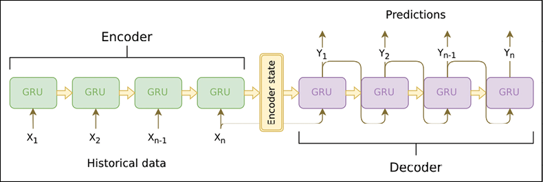

图 5.7: Seq2seq 网络数据流。图片来源:阿图尔·苏林[25]

在下一节中，我们将看一个用于机器翻译的 seq2seq 网络的例子。

## 示例 seq2seq 无需注意机器翻译

为了更详细地理解 seq2seq 模型，我们将查看一个示例，该示例学习如何使用来自 Tatoeba 项目(1997-2019) [26]的法英双语数据集将从英语翻译成法语。该数据集包含大约 167，000 个句子对。为了使我们的训练进行得更快，我们将只考虑前 30，000 个句子对用于我们的训练。

一如既往，我们将从进口开始:

```py
import nltk

import numpy as np

import re

import shutil

import tensorflow as tf

import os

import unicodedata

from nltk.translate.bleu_score import sentence_bleu, SmoothingFunction 
```

数据以远程 zip 文件的形式提供。访问该文件最简单的方法是从 http://www.manythings.org/anki/fra-eng.zip 的[下载并使用 unzip 在本地展开。zip 文件包含一个名为`fra.txt`的制表符分隔文件，法语和英语句子对由制表符分隔，每行一对。代码期望数据集文件夹中的`fra.txt`文件与它自己在同一个目录中。我们想从中提取三个不同的数据集。](http://www.manythings.org/anki/fra-eng.zip)

如果您回忆一下 seq2seq 网络的结构，编码器的输入是一个英语单词序列。在解码器端，输入是一组法语单词，输出是偏移一个时间步长的法语单词序列。下面的函数将下载 zip 文件，展开它，并创建前面描述的数据集。

对输入进行预处理，以对字符进行 asciify 化，从其相邻单词中分离出特定的标点符号，并删除除字母和这些特定标点符号之外的所有字符。最后把句子转换成小写。每个英语句子只是转换成一个单词序列。每个法语句子被转换成两个序列，一个序列前面是 BOS 伪词，另一个序列后面是后面是**句尾** ( **EOS** )伪词。

第一个序列从位置 0 开始，在句子最后一个单词前一个单词处停止，第二个序列从位置 1 开始，一直到句子的结尾:

```py
def preprocess_sentence(sent):

    sent = "".join([c for c in unicodedata.normalize("NFD", sent)

        if unicodedata.category(c) != "Mn"])

    sent = re.sub(r"([!.?])", r" \1", sent)

    sent = re.sub(r"[^a-zA-Z!.?]+", r" ", sent)

    sent = re.sub(r"\s+", " ", sent)

    sent = sent.lower()

    return sent

def download_and_read():

    en_sents, fr_sents_in, fr_sents_out = [], [], []

    local_file = os.path.join("datasets", "fra.txt")

    with open(local_file, "r") as fin:

        for i, line in enumerate(fin):

            en_sent, fr_sent = line.strip().split('\t')

            en_sent = [w for w in preprocess_sentence(en_sent).split()]

            fr_sent = preprocess_sentence(fr_sent)

            fr_sent_in = [w for w in ("BOS " + fr_sent).split()]

            fr_sent_out = [w for w in (fr_sent + " EOS").split()]

            en_sents.append(en_sent)

            fr_sents_in.append(fr_sent_in)

            fr_sents_out.append(fr_sent_out)

            if i >= num_sent_pairs - 1:

                break

    return en_sents, fr_sents_in, fr_sents_out

sents_en, sents_fr_in, sents_fr_out = download_and_read() 
```

我们的下一步是标记我们的输入并创建词汇表。因为我们有两种不同语言的序列，我们将创建两种不同的标记器和词汇表，每种语言一个。

tf.keras 框架提供了一个非常强大和通用的标记化器类——这里，我们将过滤器设置为空字符串，将`lower`设置为`False`,因为我们已经在`preprocess_sentence()`函数中完成了标记化所需的工作。记号赋予器创建了各种数据结构，我们可以根据这些数据结构计算词汇大小和查找表，这些表允许我们从一个词到另一个词的索引，然后返回。

接下来，我们使用`pad_sequences()`函数，通过在末尾填充零来处理不同长度的单词序列。因为我们的字符串相当短，我们不做任何截断；我们只是填充到我们拥有的最大句子长度(英语 8 个单词，法语 16 个单词):

```py
tokenizer_en = tf.keras.preprocessing.text.Tokenizer(

    filters="", lower=False)

tokenizer_en.fit_on_texts(sents_en)

data_en = tokenizer_en.texts_to_sequences(sents_en)

data_en = tf.keras.preprocessing.sequence.pad_sequences(

    data_en, padding="post")

tokenizer_fr = tf.keras.preprocessing.text.Tokenizer(

    filters="", lower=False)

tokenizer_fr.fit_on_texts(sents_fr_in)

tokenizer_fr.fit_on_texts(sents_fr_out)

data_fr_in = tokenizer_fr.texts_to_sequences(sents_fr_in)

data_fr_in = tf.keras.preprocessing.sequence.pad_sequences(

    data_fr_in, padding="post")

data_fr_out = tokenizer_fr.texts_to_sequences(sents_fr_out)

data_fr_out = tf.keras.preprocessing.sequence.pad_sequences(

    data_fr_out, padding="post")

vocab_size_en = len(tokenizer_en.word_index)

vocab_size_fr = len(tokenizer_fr.word_index)

word2idx_en = tokenizer_en.word_index

idx2word_en = {v:k for k, v in word2idx_en.items()}

word2idx_fr = tokenizer_fr.word_index

idx2word_fr = {v:k for k, v in word2idx_fr.items()}

print("vocab size (en): {:d}, vocab size (fr): {:d}".format(

    vocab_size_en, vocab_size_fr))

maxlen_en = data_en.shape[1]

maxlen_fr = data_fr_out.shape[1]

print("seqlen (en): {:d}, (fr): {:d}".format(maxlen_en, maxlen_fr)) 
```

最后，我们将数据转换为 TensorFlow 数据集，然后将其拆分为训练和测试数据集:

```py
batch_size = 64

dataset = tf.data.Dataset.from_tensor_slices(

    (data_en, data_fr_in, data_fr_out))

dataset = dataset.shuffle(10000)

test_size = NUM_SENT_PAIRS // 4

test_dataset = dataset.take(test_size).batch(

    batch_size, drop_remainder=True)

train_dataset = dataset.skip(test_size).batch(

    batch_size, drop_remainder=True) 
```

我们的数据现在可以用于训练 seq2seq 网络，我们接下来将定义该网络。我们的编码器是一个嵌入层，然后是 GRU 层。编码器的输入是一个整数序列，它被转换成一个大小为`embedding_dim`的嵌入向量序列。这个向量序列被发送到一个 RNN，它将每个`num_timesteps`时间步长的输入转换成一个大小为`encoder_dim`的向量。只返回最后一个时间步的输出，如`return_sequences=False`所示。

解码器具有与编码器几乎相同的结构，除了它具有额外的密集层，该密集层将从 RNN 输出的大小为`decoder_dim`的向量转换成表示目标词汇上的概率分布的向量。解码器还返回输出及其所有时间步长。

在我们的示例网络中，我们选择嵌入维数为 128，然后编码器和解码器的 RNN 维数各为 1024。注意，我们必须为英语和法语词汇的词汇大小加 1，以说明在`pad_sequences()`步骤中添加的填充字符:

```py
class Encoder(tf.keras.Model):

    def __init__(self, vocab_size, num_timesteps,

            embedding_dim, encoder_dim, **kwargs):

        super(Encoder, self).__init__(**kwargs)

        self.encoder_dim = encoder_dim

        self.embedding = tf.keras.layers.Embedding(

            vocab_size, embedding_dim, input_length=num_timesteps)

        self.rnn = tf.keras.layers.GRU(

            encoder_dim, return_sequences=False, return_state=True)

    def call(self, x, state):

        x = self.embedding(x)

        x, state = self.rnn(x, initial_state=state)

        return x, state

    def init_state(self, batch_size):

        return tf.zeros((batch_size, self.encoder_dim))

class Decoder(tf.keras.Model):

    def __init__(self, vocab_size, embedding_dim, num_timesteps,

            decoder_dim, **kwargs):

        super(Decoder, self).__init__(**kwargs)

        self.decoder_dim = decoder_dim

        self.embedding = tf.keras.layers.Embedding(

            vocab_size, embedding_dim, input_length=num_timesteps)

        self.rnn = tf.keras.layers.GRU(

            decoder_dim, return_sequences=True, return_state=True)

        self.dense = tf.keras.layers.Dense(vocab_size)

    def call(self, x, state):

        x = self.embedding(x)

        x, state = self.rnn(x, state)

        x = self.dense(x)

        return x, state

embedding_dim = 256

encoder_dim, decoder_dim = 1024, 1024

encoder = Encoder(vocab_size_en+1, 

    embedding_dim, maxlen_en, encoder_dim)

decoder = Decoder(vocab_size_fr+1, 

    embedding_dim, maxlen_fr, decoder_dim) 
```

现在我们已经定义了我们的`Encoder`和`Decoder`类，让我们再来看看它们的输入和输出的维度。下面这段(一次性)代码可用于打印出系统各种输入和输出的尺寸。为了方便起见，在本章提供的代码中，它被保留为注释掉的块:

```py
for encoder_in, decoder_in, decoder_out in train_dataset:

    encoder_state = encoder.init_state(batch_size)

    encoder_out, encoder_state = encoder(encoder_in, encoder_state)

    decoder_state = encoder_state

    decoder_pred, decoder_state = decoder(decoder_in, decoder_state)

    break

print("encoder input          :", encoder_in.shape)

print("encoder output         :", encoder_out.shape, "state:", encoder_state.shape)

print("decoder output (logits):", decoder_pred.shape, "state:", decoder_state.shape)

print("decoder output (labels):", decoder_out.shape) 
```

这会产生以下输出，这符合我们的预期。编码器输入是一批整数序列，每个序列的大小为 8，这是我们英语句子中最大的记号数，所以它的维数是(`batch_size`，`maxlen_en`)。

编码器的输出是形状(`batch_size`、`encoder_dim`)的单个张量(`return_sequences=False`)，并表示一批表示输入句子的上下文向量。编码器状态张量具有相同的维数。解码器输出也是一批整数序列，但一个法语句子的最大长度是 16；因此，维度为(`batch_size`、`maxlen_fr`)。

解码器预测是跨所有时间步长的一批概率分布；因此，维度为(`batch_size`、`maxlen_fr`、`vocab_size_fr+1`)，解码器状态与编码器状态的维度相同(`batch_size`、`decoder_dim`):

```py
encoder input          : (64, 8)

encoder output         : (64, 1024) state: (64, 1024)

decoder output (logits): (64, 16, 7658) state: (64, 1024)

decoder output (labels): (64, 16) 
```

接下来，我们定义损失函数。因为我们填充了我们的句子，我们不想因为考虑标签和预测之间填充词的相等性而使我们的结果有偏差。我们的损失函数用标签屏蔽我们的预测，因此标签上的任何填充位置也被从预测中移除，并且我们仅使用标签和预测上的非零元素来计算我们的损失。这是按如下方式完成的:

```py
def loss_fn(ytrue, ypred):

    scce = tf.keras.losses.SparseCategoricalCrossentropy(

        from_logits=True)

    mask = tf.math.logical_not(tf.math.equal(ytrue, 0))

    mask = tf.cast(mask, dtype=tf.int64)

    loss = scce(ytrue, ypred, sample_weight=mask)

    return loss 
```

因为 seq2seq 模型不容易打包到一个简单的 Keras 模型中，所以我们也必须手动处理训练循环。我们的`train_step()`函数处理数据流并计算每一步的损失，将损失的梯度应用到可训练权重，并返回损失。

请注意，训练代码与我们在前面讨论 seq2seq 模型时描述的代码并不完全相同。这里，整个`decoder_input`似乎一次被送入解码器，以产生一个时间步长的输出偏移，而在讨论中，我们说这是顺序发生的，其中前一个时间步长中生成的令牌被用作下一个时间步长的输入。

这是一种用于训练 seq2seq 网络的常用技术，称为**教师强制**，其中解码器的输入是地面真实输出，而不是来自前一时间步的预测。这是优选的，因为它使训练更快，但也导致预测质量的一些下降。为了弥补这一点，可以使用技术，如**计划采样**，根据某个阈值(这取决于问题，但通常在 0.1 和 0.4 之间变化)，从实际情况或前一时间步的预测中随机采样输入:

```py
@tf.function

def train_step(encoder_in, decoder_in, decoder_out, encoder_state):

    with tf.GradientTape() as tape:

        encoder_out, encoder_state = encoder(encoder_in, encoder_state)

        decoder_state = encoder_state

        decoder_pred, decoder_state = decoder(

            decoder_in, decoder_state)

        loss = loss_fn(decoder_out, decoder_pred)

    variables = (encoder.trainable_variables + 

        decoder.trainable_variables)

    gradients = tape.gradient(loss, variables)

    optimizer.apply_gradients(zip(gradients, variables))

    return loss 
```

`predict()`方法是,用于从数据集中随机抽取一个英语句子，并使用迄今为止训练好的模型来预测法语句子。作为参考，还显示了“法语句子”标签。`evaluate()`方法计算**双语评估替角** ( **BLEU** )分数【35】在测试集中所有记录的标签和预测之间。BLEU 分数通常用于存在多个基本事实标签的情况(我们只有一个)，并且在参考句子和候选句子中比较多达 4 个字母(n 个字母，其中 *n=4* )。在每个时期结束时都调用`predict()`和`evaluate()`方法:

```py
def predict(encoder, decoder, batch_size,

        sents_en, data_en, sents_fr_out,

        word2idx_fr, idx2word_fr):

    random_id = np.random.choice(len(sents_en))

    print("input    : ",  " ".join(sents_en[random_id]))

    print("label    : ", " ".join(sents_fr_out[random_id]))

    encoder_in = tf.expand_dims(data_en[random_id], axis=0)

    decoder_out = tf.expand_dims(sents_fr_out[random_id], axis=0)

    encoder_state = encoder.init_state(1)

    encoder_out, encoder_state = encoder(encoder_in, encoder_state)

    decoder_state = encoder_state

    decoder_in = tf.expand_dims(

        tf.constant([word2idx_fr["BOS"]]), axis=0)

    pred_sent_fr = []

    while True:

        decoder_pred, decoder_state = decoder(

            decoder_in, decoder_state)

        decoder_pred = tf.argmax(decoder_pred, axis=-1)

        pred_word = idx2word_fr[decoder_pred.numpy()[0][0]]

        pred_sent_fr.append(pred_word)

        if pred_word == "EOS":

            break

        decoder_in = decoder_pred

    print("predicted: ", " ".join(pred_sent_fr))

def evaluate_bleu_score(encoder, decoder, test_dataset,

        word2idx_fr, idx2word_fr):

    bleu_scores = []

    smooth_fn = SmoothingFunction()

    for encoder_in, decoder_in, decoder_out in test_dataset:

        encoder_state = encoder.init_state(batch_size)

        encoder_out, encoder_state = encoder(encoder_in, encoder_state)

        decoder_state = encoder_state

        decoder_pred, decoder_state = decoder(

            decoder_in, decoder_state)

        # compute argmax

        decoder_out = decoder_out.numpy()

        decoder_pred = tf.argmax(decoder_pred, axis=-1).numpy()

        for i in range(decoder_out.shape[0]):

            ref_sent = [idx2word_fr[j] for j in 

                decoder_out[i].tolist() if j > 0]

            hyp_sent = [idx2word_fr[j] for j in 

                decoder_pred[i].tolist() if j > 0]

            # remove trailing EOS

            ref_sent = ref_sent[0:-1]

            hyp_sent = hyp_sent[0:-1]

            bleu_score = sentence_bleu([ref_sent], hyp_sent,

                smoothing_function=smooth_fn.method1)

            bleu_scores.append(bleu_score)

    return np.mean(np.array(bleu_scores)) 
```

训练循环如下所示。我们将为我们的模型使用 Adam 优化器。我们还设置了一个检查点，这样我们可以在每 10 个时期后保存我们的模型。然后，我们对模型进行 250 个时期的训练，并打印出损失、例句及其翻译，以及对整个测试集计算的 BLEU 分数:

```py
optimizer = tf.keras.optimizers.Adam()

checkpoint_prefix = os.path.join(checkpoint_dir, "ckpt")

checkpoint = tf.train.Checkpoint(optimizer=optimizer,

                                 encoder=encoder,

                                 decoder=decoder)

num_epochs = 250

eval_scores = []

for e in range(num_epochs):

    encoder_state = encoder.init_state(batch_size)

    for batch, data in enumerate(train_dataset):

        encoder_in, decoder_in, decoder_out = data

        # print(encoder_in.shape, decoder_in.shape, decoder_out.shape)

        loss = train_step(

            encoder_in, decoder_in, decoder_out, encoder_state)

    print("Epoch: {}, Loss: {:.4f}".format(e + 1, loss.numpy()))

    if e % 10 == 0:

        checkpoint.save(file_prefix=checkpoint_prefix)

    predict(encoder, decoder, batch_size, sents_en, data_en,

        sents_fr_out, word2idx_fr, idx2word_fr)

    eval_score = evaluate_bleu_score(encoder, decoder, 

        test_dataset, word2idx_fr, idx2word_fr)

    print("Eval Score (BLEU): {:.3e}".format(eval_score))

    # eval_scores.append(eval_score)

checkpoint.save(file_prefix=checkpoint_prefix) 
```

前 5 个和后 5 个时期的训练结果如下所示。请注意，在纪元 247 中，损失已经从大约 1.5 下降到大约 0.07。BLEU 分数也上升了大约 2.5 倍。然而，最令人印象深刻的是前 5 个时期和后 5 个时期之间的翻译质量差异:

| **纪元-#** | **损失(训练)** | **BLEU 评分(测试)** | **英语** | **法语(真)** | **法语(预测)** |
| one | 1.4119 | 1.957e-02 | 汤姆很特别。 | 汤姆很特别。 | 她很棒。 |
| Two | 1.1067 | 2.244e-02 | 他讨厌购物。 | 他讨厌购物。 | 他很小。 |
| three | 0.9154 | 2.700e-02 | 她说了吗？ | 她说什么？ | 不清楚吗？ |
| four | 0.7817 | 2.803e-02 | 我宁愿走路。 | 我宁愿走路。 | 我都在京都。 |
| five | 0.6632 | 2.943e-02 | 我在车里。 | 我在车里。 | 我还是很担心。 |
| ... |  |  |  |  |  |
| Two hundred and forty-five | 0.0896 | 4.991e-02 | 她起诉了他。 | 她正在起诉他。 | 她起诉了他。 |
| Two hundred and forty-six | 0.0853 | 5.011e-02 | 她不穷。 | 她不穷。 | 她不穷。 |
| Two hundred and forty-seven | 0.0738 | 5.022e-02 | 哪个是我的？ | 哪一个是我的？ | 哪一个是我的？ |
| Two hundred and forty-eight | 0.1208 | 4.931e-02 | 我老了。 | 我老了。 | 我老了。 |
| Two hundred and forty-nine | 0.0837 | 4.856e-02 | 这值得一试。 | 值得一试。 | 值得一试。 |
| Two hundred and fifty | 0.0967 | 4.869e-02 | 不要后退。 | 不要后退！ | 不要后退！ |

表 5.2:按时期分列的培训结果

这个例子的完整代码可以在本章附带的源代码中找到。您将需要一台基于 GPU 的机器来运行它，尽管您可能能够使用较小的网络维度(`embedding_dim`、`encoder_dim`、`decoder_dim`)、较小的超参数(`batch_size`、`num_epochs`)和较少数量的句子对在 CPU 上运行它。若要完整运行代码，请运行以下命令。输出将被写入控制台:

```py
$ python seq2seq_wo_attn.py 
```

在下一节中，我们将研究一种机制来提高 seq2seq 网络的性能，通过允许它以数据驱动的方式更多地关注输入的某些部分。这种机制被称为注意力机制。

# 注意机制

在上一节中，我们看到了编码器最后一个时间步长的上下文或思想向量是如何作为初始隐藏状态输入到解码器中的。随着上下文流过解码器上的时间步长，信号与解码器输出结合，并逐渐变得越来越弱。结果是，上下文对解码器中后面的时间步长没有太大影响。

此外，解码器输出的某些部分可能更依赖于输入的某些部分。例如，考虑一个英-法翻译网络的输入“非常感谢”，以及相应的输出“merci beaucoup”，就像我们在上一节中看到的那样。在这里，英语短语“谢谢”和“非常感谢”分别对应法语短语“merci”和“beaucoup”。该信息也不能通过单个上下文向量充分传达。

注意机制在解码器上的每个时间步提供对所有编码器隐藏状态的访问。解码器了解应该更加关注编码器状态的哪一部分。注意力的使用极大地提高了机器翻译的质量，以及各种标准的自然语言处理任务。

注意力的使用不限于 seq2seq 网络。例如，注意力是为 NLP 创建最先进的深度学习模型的“嵌入、编码、参与、预测”公式中的关键组成部分[34]。这里，当从较大的表示缩减为更紧凑的表示时，例如，当将单词向量序列缩减为单个句子向量时，注意力被用于保存尽可能多的信息。

本质上，注意机制提供了一种针对源中的所有标记对目标中的标记进行评分并相应地修改解码器的输入信号的方式。考虑一种编码器-解码器架构，其中输入和输出时间步长分别由索引 *i* 和 *j* 表示，编码器和解码器在这些相应时间步长的隐藏状态由*h*I 和*s*j 表示。编码器的输入由*x*I 表示，解码器的输出由*y*j 表示。在一个没有注意的编解码网络中，解码器状态 *s* [j] 的值由前一时间步的隐藏状态*s*[j][-1]和输出*y*[j][-1]给出。注意机制添加第三信号*c*j，称为注意上下文。因此，注意，解码器的隐藏状态 *s* [j] 是*y*[j][-1]，*s*[j][-1]， *c* [j] 的函数，如下所示:

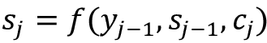

注意力上下文信号*c*T2【j 计算如下。对于每个解码器步骤 *j* ，我们计算解码器状态 *s* [j] [-1] 和每个编码器状态 *h* [i] 之间的对准。这为我们提供了针对每个解码器状态 *j* 的一组 *N* 相似性值*e*T21ij，然后我们通过计算它们对应的 softmax 值*b*ij 将其转换成概率分布。最后，注意力上下文*c*j 被计算为编码器状态*h*I 及其对应的 softmax 权重*b*ij 在所有 *N* 编码器时间步长上的加权和。所示的方程组包含了每个解码器步骤 *j* 的转换:

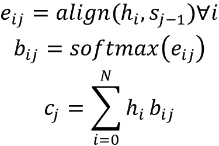

基于对齐是如何完成的，已经提出了多种注意机制。接下来我们将描述几个。为了便于标注，我们将用 *h* 表示编码器侧的状态向量 *h* [i] ，用 *s* 表示解码器侧的状态向量 *s* [j] [-1] 。

对齐的最简单表述是**基于内容的注意力**。它是由 Graves、Wayne 和 Danihelka [27]提出的，只是编码器和解码器状态之间的余弦相似性。使用该公式的前提条件是编码器和解码器上的隐藏状态向量必须具有相同的维数:

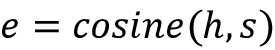

Bahdanau、Cho 和 Bengio 提出了另一种配方，称为**添加剂**或 **Bahdanau 注意**。这包括在一个小的神经网络中使用可学习的权重组合状态向量，由下面的等式给出。这里将 *s* 和 *h* 向量串接并乘以学习到的权重 *W* ，相当于用两个学习到的权重*W*s 和*W*h[乘以 *s* 和 *h* ，并将结果相加:]

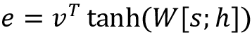

Luong、Pham 和 Manning [29]提出了一套三种注意力公式(dot、general 和 concat)，其中的 general 公式也被称为**乘法**或 **Luong 的注意力**。

`dot`和`concat`注意力公式类似于前面讨论的基于内容和的附加注意力公式。乘法注意力公式由以下等式给出:

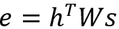

最后，Vaswani 等人[30]提出了一种基于内容的注意力的变体，称为**比例点积注意力**，由给出如下等式。这里， *N* 是编码器隐藏状态 *h* 的尺寸。缩放的点积注意力用于变压器架构，我们将在下一章了解:

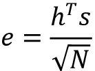

注意力机制也可以根据它们关注的内容来分类。使用这种分类方案，注意机制可以是自我注意、整体或软注意以及局部或硬注意。

自我注意是指跨同一序列的不同部分计算比对，并且已被发现对诸如机器阅读、抽象文本摘要和图像字幕生成等应用有用。

当在整个输入序列上计算比对时，软或全局注意力是，当在序列的一部分上计算比对时，硬或局部注意力是。软注意的优点是可微；但是，它的计算成本很高。相反，硬注意在推理时计算更便宜，但是不可微，并且在训练期间需要更复杂的技术。

在下一节中，我们将看到如何将注意力机制与 seq2seq 网络集成，以及它如何提高性能。

## 示例 seq2seq 注意机器翻译

让我们看看本章前面看到的机器翻译的同一个例子，只是解码器现在将使用 Bahdanau 等人[28]提出的加法注意机制和 Luong 等人[29]提出的乘法注意机制来处理编码器输出。

第一个变化是编码器。它将在每个时间点返回输出，而不是返回单个上下文或思想向量，因为注意力机制需要这些信息。下面是修改后的编码器类，突出显示了更改:

```py
class Encoder(tf.keras.Model):

     def __init__(self, vocab_size, num_timesteps,

           embedding_dim, encoder_dim, **kwargs):

        super(Encoder, self).__init__(**kwargs)

        self.encoder_dim = encoder_dim

        self.embedding = tf.keras.layers.Embedding(

            vocab_size, embedding_dim, input_length=num_timesteps)

        self.rnn = tf.keras.layers.GRU(

            encoder_dim, return_sequences=True, return_state=True)

    def call(self, x, state):

        x = self.embedding(x)

        x, state = self.rnn(x, initial_state=state)

        return x, state

    def init_state(self, batch_size):

        return tf.zeros((batch_size, self.encoder_dim)) 
```

解码器会有更大的变化。最大的是关注层的声明，需要定义，先做那个吧。让我们首先考虑 Bahdanau 提出的附加注意的类定义。回想一下，这将每个时间步长的解码器隐藏状态与所有编码器隐藏状态相结合，以产生下一个时间步长的解码器输入，由下式给出:


*W[s；等式中的[h]*是两个独立线性变换的简写(形式为 *y = Wx + b* )，一个在 *s* 上，另一个在 *h* 上。这两个线性变换被实现为密集层，如下面的实现所示。我们子类化一个`tf.keras`层对象，因为我们的最终目标是在我们的网络中使用它作为一个层，但是子类化一个模型对象也是可以接受的。`call()`方法获取查询(解码器状态)和值(编码器状态)，计算分数，然后将对齐作为相应的 softmax，上下文向量作为等式给出的值，然后返回它们。上下文向量的形状由(`batch_size`、`num_decoder_timesteps`)给出，并且对齐具有形状(`batch_size`、`num_encoder_timesteps`、`1`)。密集层的`W1`、`W2`和`V`张量的权重在训练期间学习:

```py
class BahdanauAttention(tf.keras.layers.Layer):

    def __init__(self, num_units):

        super(BahdanauAttention, self).__init__()

        self.W1 = tf.keras.layers.Dense(num_units)

        self.W2 = tf.keras.layers.Dense(num_units)

        self.V = tf.keras.layers.Dense(1)

    def call(self, query, values):

        # query is the decoder state at time step j

        # query.shape: (batch_size, num_units)

        # values are encoder states at every timestep i

        # values.shape: (batch_size, num_timesteps, num_units)

        # add time axis to query: (batch_size, 1, num_units)

        query_with_time_axis = tf.expand_dims(query, axis=1)

        # compute score:

        score = self.V(tf.keras.activations.tanh(

            self.W1(values) + self.W2(query_with_time_axis)))

        # compute softmax

        alignment = tf.nn.softmax(score, axis=1)

        # compute attended output

        context = tf.reduce_sum(

            tf.linalg.matmul(

                tf.linalg.matrix_transpose(alignment),

                values

            ), axis=1

        )

        context = tf.expand_dims(context, axis=1)

        return context, alignment 
```

Luong 注意是倍增的，但是一般实现是相似的。我们没有声明三个线性变换`W1`、`W2`和`V`，而是只有一个`W`。`call()`方法的步骤遵循相同的一般步骤——首先，我们根据等式为 Luong 的注意力计算分数，如上一节所述。然后，我们将比对计算为分数的相应 softmax 版本，然后将上下文向量计算为比对和值的点积。像 Bahdanau 注意力类中的权重一样，由密集层`W`表示的权重矩阵在训练期间被学习:

```py
class LuongAttention(tf.keras.layers.Layer):

    def __init__(self, num_units):

        super(LuongAttention, self).__init__()

        self.W = tf.keras.layers.Dense(num_units)

    def call(self, query, values):

        # add time axis to query

        query_with_time_axis = tf.expand_dims(query, axis=1)

        # compute score

        score = tf.linalg.matmul(

            query_with_time_axis, self.W(values), transpose_b=True)

        # compute softmax

        alignment = tf.nn.softmax(score, axis=2)

        # compute attended output

        context = tf.matmul(alignment, values)

        return context, alignment 
```

为了验证这两个类是相互替代的，我们运行下面这段一次性的代码(在本例的源代码中被注释掉)。我们只是制造一些随机输入，并把它们发送给两个注意类:

```py
batch_size = 64

num_timesteps = 100

num_units = 1024

query = np.random.random(size=(batch_size, num_units))

values = np.random.random(size=(batch_size, num_timesteps, num_units))

# check out dimensions for Bahdanau attention

b_attn = BahdanauAttention(num_units)

context, alignments = b_attn(query, values)

print("Bahdanau: context.shape:", context.shape, 

    "alignments.shape:", alignments.shape)

# check out dimensions for Luong attention

l_attn = LuongAttention(num_units)

context, alignments = l_attn(query, values)

print("Luong: context.shape:", context.shape, 

    "alignments.shape:", alignments.shape) 
```

前面的代码产生了下面的输出，并且如预期的那样，显示了当给定相同的输入时，两个类产生相同形状的输出。因此，它们是彼此的替代物:

```py
Bahdanau: context.shape: (64, 1024) alignments.shape: (64, 8, 1)

Luong: context.shape: (64, 1024) alignments.shape: (64, 8, 1) 
```

现在我们有了注意力课程，让我们看看解码器。`init()`方法的不同之处在于添加了 attention 类变量，我们已经将其设置为`BahdanauAttention`类。在加法中，我们有两个额外的变换，`Wc`和`Ws`，它们将应用于解码器 RNN 的输出。第一个有一个`tanh`激活来在-1 和+1 之间调制输出，下一个是标准的线性变换。与没有注意解码器组件的 seq2seq 网络相比，该解码器在其`call()`方法中采用附加参数`encoder_output`，并返回附加上下文向量:

```py
class Decoder(tf.keras.Model):

    def __init__(self, vocab_size, embedding_dim, num_timesteps,

            decoder_dim, **kwargs):

        super(Decoder, self).__init__(**kwargs)

        self.decoder_dim = decoder_dim

        self.attention = BahdanauAttention(embedding_dim)

        # self.attention = LuongAttention(embedding_dim)

        self.embedding = tf.keras.layers.Embedding(

            vocab_size, embedding_dim, input_length=num_timesteps)

        self.rnn = tf.keras.layers.GRU(

            decoder_dim, return_sequences=True, return_state=True)

        self.Wc = tf.keras.layers.Dense(decoder_dim, activation="tanh")

        self.Ws = tf.keras.layers.Dense(vocab_size)

    def call(self, x, state, encoder_out):

        x = self.embedding(x)

        context, alignment = self.attention(x, encoder_out)

        x = tf.expand_dims(

                tf.concat([

                    x, tf.squeeze(context, axis=1)

                ], axis=1),

            axis=1)

        x, state = self.rnn(x, state)

        x = self.Wc(x)

        x = self.Ws(x)

        return x, state, alignment 
```

训练循环也有点不同。与 seq2seq 无注意网络不同，在那里我们使用教师强制来加速训练，使用注意意味着我们现在必须逐个消耗解码器输入。这是因为前一步的解码器输出通过注意更强烈地影响当前时间步的输出。我们的新训练循环由下面的`train_step`函数描述，并且明显慢于 seq2seq 网络上没有注意的训练循环。然而，这种训练循环也可以用在前一个网络上，特别是当我们想要实现预定的采样策略时:

```py
@tf.function

def train_step(encoder_in, decoder_in, decoder_out, encoder_state):

    with tf.GradientTape() as tape:

        encoder_out, encoder_state = encoder(encoder_in, encoder_state)

        decoder_state = encoder_state

        loss = 0

        for t in range(decoder_out.shape[1]):

            decoder_in_t = decoder_in[:, t]

            decoder_pred_t, decoder_state, _ = decoder(decoder_in_t,

                decoder_state, encoder_out)

            loss += loss_fn(decoder_out[:, t], decoder_pred_t)

    variables = (encoder.trainable_variables +

        decoder.trainable_variables)

    gradients = tape.gradient(loss, variables)

    optimizer.apply_gradients(zip(gradients, variables))

    return loss / decoder_out.shape[1] 
```

`predict()`和`evaluate()`方法也有类似的变化，因为它们也在解码器端实现了新的数据流，包括一个额外的`encoder_out`参数和一个额外的`context`返回值。

我们用注意力训练了 seq2seq 网络的两个版本，一个用加法(Bahdanau)注意力，一个用乘法(Luong)注意力。两个网络都被训练了 50 个纪元，而不是 250 个。然而，在这两种情况下，翻译产生的质量与从 seq2seq 网络获得的质量相似，而没有经过 250 个时期的注意力训练。与没有注意的 seq2seq 网络相比，具有任一注意机制的 seq2seq 网络在训练结束时的训练损失略低，并且测试集上的 BLEU 分数略高:

| **网络描述** | **期末损失(训练集)** | **期末 BLEU 评分(测试集)** |
| seq2seq 无需关注，训练 250 个纪元 | 0.0967 | 4.869e-02 |
| seq2seq 带附加注意，训练 50 个时代 | 0.0893 | 5.508e-02 |
| seq2seq 具有倍增注意力，训练了 50 个时期 | 0.0706 | 5.563e-02 |

表 5.3:不同方法的 BLEU 分数

以下是两个网络翻译的一些例子。每个例子都提到了纪元编号和使用的注意力类型。请注意，即使译文与标签并非 100%相同，其中许多仍是原文的有效译文:

| **注意力类型** | **纪元-#** | **英语** | **法语(标签)** | **法语(预测)** |
| 巴赫达瑙 | Twenty | 你的猫很胖。 | 你的猫胖了 | 你的猫是苍蝇。 |
| Twenty-five | 我不得不回去。 | 我不得不回去。 | 他要走了。 |
| Thirty | 试着找到它。 | 试着找到他。 | 试着找到他。 |
| 卢昂 | Twenty | 这很奇怪。 | 这很奇怪。 | 这是令人失望的。 |
| Twenty-five | 汤姆是运动员。 | 托马斯是个运动员。 | 汤姆是一名运动员。 |
| Thirty | 这很危险。 | 这很危险。 | 这很危险。 |

表 5.4:英语到法语的翻译示例

这里描述的网络的完整代码在本章代码文件夹的`seq2seq_with_attn.py`文件中。要从命令行运行代码，请使用以下命令。你可以通过在`Decoder`类的`init()`方法中注释掉 Bahdanau(加法)或 Luong(乘法)注意机制中的一个或另一个来切换:

```py
$ python seq2seq_with_attn.py 
```

# 摘要

在本章中，我们学习了 RNNs，这是一类专门用于处理自然语言、时间序列、语音等序列的网络。就像 CNN 利用图像的几何形状一样，rnn 利用其输入的顺序结构。我们学习了基本的 RNN 单元，它如何处理先前时间步骤的状态，以及它如何由于 BPTT 固有的问题而遭受消失和爆炸梯度。我们看到了这些问题如何导致新的 RNN 细胞结构的发展，如 LSTM，GRU 和窥视孔 lstm。我们还了解了一些使 RNN 更有效的简单方法，比如使其双向或有状态。

然后，我们研究了不同的 RNN 拓扑，以及每种拓扑如何适应一组特定的问题。经过大量的理论研究，我们终于看到了其中三种拓扑的例子。然后，我们重点关注其中一种拓扑，称为 seq2seq，它最初在机器翻译社区中流行，但后来被用于用例可以被修改为类似机器翻译问题的情况。

从这里，我们开始关注注意力，它最初是作为一种提高 seq2seq 网络性能的方法，但后来在许多情况下非常有效地使用，我们希望在压缩表示的同时将数据损失保持在最低限度。我们看了不同种类的注意力，以及一个在 seq2seq 网络中使用注意力的例子。

在下一章，你将学习转换器，这是一种最先进的编码器-解码器架构，其中循环层已被注意力层所取代。

# 参考

1.  Jozefowicz，r .、Zaremba，r .和 Sutskever，I. (2015 年)。*循环神经网络架构的经验探索*。机器学习杂志
2.  Greff，k .等人(2016 年 7 月)。 *LSTM:太空探索之旅*。神经网络和学习系统汇刊
3.  Bernal，a .，Fok，s .，和 Pidaparthi，2012 年 12 月)。*用循环神经网络进行金融市场时间序列预测*
4.  Hadjeres、f . Pachet 和 f . Nielsen(2017 年 8 月)。DeepBach:巴赫合唱团生成的可控模型。第 34 届国际机器学习会议录(ICML)
5.  卡帕西(2015)。*循环神经网络的不合理有效性*。网址:【http://karpathy.github.io/2015/05/21/rnn-effectiveness/ 
6.  卡帕西，a .，李，F. (2015)。*用于生成图像描述的深度视觉语义对齐*。模式识别和模式识别会议(CVPR)
7.  Socher 等人(2013 年)。情感树库上情感合成的递归深度模型。2013 年自然语言处理经验方法会议录
8.  Bahdanau、k . Cho 和 y . beng io(2015 年)。*通过联合学习对齐和翻译的神经机器翻译*。arXiv: 1409.0473 [cs。CL]
9.  吴等(2016)。*谷歌的神经机器翻译系统:弥合人类与机器翻译的鸿沟*。arXiv 1609.08144 [csCL]
10.  Vinyals，o .等人(2015 年)。*对外汉语语法*。神经信息处理系统的进展
11.  鲁梅尔哈特、辛顿和威廉姆斯(1985)。*通过误差传播学习内部表征*。并行分布式处理:认知微观结构的探索
12.  布里茨博士(2015 年)。*循环神经网络教程，第 3 部分-通过时间和消失梯度的反向传播*:[http://www . wild ml . com/2015/10/循环神经网络教程-第 3 部分-通过时间和消失梯度的反向传播/](http://www.wildml.com/2015/10/recurrent-neural-networks-tutorial-part-3-backpropagation-through-time-and-vanishing-gradients/)
13.  Pascanu、t . miko lov 和 y . beng io(2013 年)。*关于训练循环神经网络的难度*。第 30 届国际机器学习会议录(ICML)
14.  hoch Reiter s .和 schmid Huber j .(1997 年)。 *LSTM 能解决难以解决的长时滞问题*。神经信息处理系统的进展
15.  布里茨博士(2015 年)。*循环神经网络教程，第 4 部分——用 Python 和 Theano 实现 GRU/LSTM RNN*:[http://www . wild ml . com/2015/10/Recurrent-Neural-Network-Tutorial-Part-4-Implementing-a-grul STM-rnn-with-Python-and-the ano/](http://www.wildml.com/2015/10/recurrent-neural-network-tutorial-part-4-implementing-a-grulstm-rnn-with-python-and-theano/)
16.  奥拉赫，C. (2015)。*了解 LSTM 网络*:【https://colah.github.io/posts/2015-08-Understanding-LSTMs/ 
17.  Cho，k .等人(2014 年)。*使用用于统计机器翻译的 RNN 编码器-解码器学习短语表示*。arXiv: 1406.1078 [cs。CL]
18.  石，x 等(2015)。卷积 LSTM 网络:降水临近预报的机器学习方法。arXiv: 1506.04214 [cs。简历]
19.  Gers，F.A .和 Schmidhuber，J. (2000 年)。*轮回网时间和次数*。IEEE-INNS-ENNS 国际神经网络联合会议录
20.  Kotzias 博士(2015 年)。*情感标签句子数据集*，作为“使用深度特征从群体到个体标签”(KDD 2015)的一部分提供:[https://archive . ics . UCI . edu/ml/datasets/情感+标签+句子](https://archive.ics.uci.edu/ml/datasets/Sentiment+Labelled+Sentences)
21.  Collobert，r .等人(2011 年)。*自然语言处理(几乎)从无到有*。机器学习研究杂志(JMLR)
22.  马库斯，M. P .，圣托里尼，b .和 Marcinkiewicz，M. A. (1993)。建立一个大型带注释的英语语料库:宾夕法尼亚树库。计算语言学杂志
23.  伯德、洛珀和克莱因(2009 年)。*用 Python 进行自然语言处理，奥莱利媒体公司*。安装:【https://www.nltk.org/install.xhtml 
24.  刘等(2017)。MAT:一个用于图像字幕的多模态专注翻译器。arXiv: 1702.05658v3 [cs。简历]
25.  苏林，A. (2017)。 *Kaggle Web 流量时间序列预测*。GitHub 库:【https://github.com/Arturus/kaggle-web-traffic 
26.  Tatoeba 项目。(1997-2019).制表符分隔的双语句子对:[http://tatoeba.org](https://tatoeba.org/en/)和【http://www.manythings.org/anki T3
27.  Graves、g . Wayne 和 I . dani helka(2014 年)。*神经图灵机*。arXiv: 1410.5401v2 [cs。NE]
28.  Bahdanau、k . Cho 和 y . beng io(2015 年)。*通过联合学习对齐和翻译的神经机器翻译*。arXiv: 1409.0473v7 [cs。CL]
29.  Luong，m .，Pham，h .和 Manning，C. (2015 年)。*基于注意力的神经机器翻译的有效方法*。arXiv: 1508.04025v5 [cs。CL]
30.  Vaswani，a .等人(2017 年)。你所需要的只是注意力。第 31 届神经信息处理系统会议
31.  张，李，m .和斯莫拉，A. J. (2019)。*潜入深度学习* : [http://www.d2l.ai](http://www.d2l.ai)
32.  Ba，J. L .，Kiros，J. R .，和 Hinton，G. E. (2016 年)。*图层归一化*。arXiv:1607.06450 v1[统计。ML]
33.  Allamar，J. (2018 年)。*图解变压器*:【http://jalammar.github.io/illustrated-transformer/ 
34.  Honnibal，M. (2016)。*嵌入、编码、出席、预测:最先进的 NLP 模型的新深度学习公式*:【https://explosion.ai/blog/deep-learning-formula-nlp】T2
35.  帕皮尼尼，k .，鲁科斯，s .，沃德，t .，朱，W. (2002)。 *BLEU:机器翻译的自动评测方法*。计算语言学协会第 40 届年会会议录
36.  古腾堡计划(2019 年):[https://www.gutenberg.org/](https://www.gutenberg.org/)

# 加入我们书的不和谐空间

加入我们的 Discord 社区，结识志同道合的朋友，与 2000 多名会员一起学习:[https://packt.link/keras](https://packt.link/keras)

**