# six

# 变形金刚(电影名)

当涉及到解决各种各样的任务时，基于 transformer 的架构在自然语言处理中几乎已经变得普遍，例如:

*   神经机器翻译
*   文本摘要
*   文本生成
*   命名实体识别
*   问题回答
*   文本分类
*   文本相似度
*   攻击性信息/亵渎检测
*   查询理解
*   语言建模
*   下一句预测
*   阅读理解
*   情感分析
*   改写

还有很多。

在不到四年的时间里，当谷歌研究中心在 2017 年发表了*注意力是你所需要的全部*论文时，变形金刚成功地席卷了 NLP 社区，打破了此前三十年取得的任何记录。

基于 Transformer 的模型使用所谓的注意力机制来识别每个输入序列(如一个句子)中单词之间的复杂关系。注意力有助于解决编码“成对相关性”的挑战——这是它的“前辈”，如 LSTM RNNs 甚至 CNN，在对文本等序列数据建模时无法实现的。

模型——如 BERT、T5 和 GPT(本章后面将详细介绍)——现在构成了几乎每个领域新应用的最先进的基本构建模块，从计算机视觉到语音识别、翻译或蛋白质和编码序列。注意力还被应用于游戏的强化学习:在 DeepMind 的 alpha star([https://rdcu.be/bVI7G](https://rdcu.be/bVI7G)和[https://www . deep mind . com/blog/alpha star-grand master-level-in-StarCraft-ii-using-multi-agent-reinforcement-learning](https://www.deepmind.com/blog/alphastar-grandmaster-level-in-starcraft-ii-using-multi-agent-reinforcement-learning))中，对玩家和对手星际争霸游戏单元的观察是用自我注意力进行处理的，例如。为此，斯坦福大学最近引入了术语“基础模型”，以定义一组基于巨型预训练变压器的**大型语言模型** ( **LLMs** )。

这一进步归功于一些简单的想法，我们将在接下来的几节中回顾这些想法。

您将了解到:

*   什么是变形金刚
*   它们是如何随着时间演变的
*   一些优化技术
*   须知
*   未来会是什么样子

让我们开始把注意力转向变形金刚。你会惊讶地发现，注意力确实是你所需要的！

# 体系结构

尽管典型的 transformer 架构通常不同于递归网络的架构，但它基于源自 RNNs 的几个关键理念。在写这本书的时候，transformer 代表了与文本和任何可以表示为序列的数据相关的深度学习架构的下一个进化步骤，因此，它应该是你工具箱中必不可少的一部分。

原始的变换器架构是编码器-解码器架构的变体，其中递归层被(自)关注层取代。这种转换器最初是由谷歌在 Ashish Vaswani、Noam Shazeer、Niki Parmar、Jakob Uszkoreit、Llion Jones、Aidan N. Gomez、Lukasz Kaiser 和 Illia Polosukhin 于 2017 年在 https://arxiv.org/abs/1706.03762 发表的题为 *Attention Is All You Need* 的开创性论文中提出的，该论文提供了一个参考实现，我们将在整个讨论中引用该实现。

该架构是自 2014-2015 年以来一直流行的编码器-解码器模型的一个实例(如苏茨基弗等人(2014 年)的*序列到序列学习神经网络*、https://arxiv.org/abs/1409.3215 的)。在此之前，注意力曾被一起使用过与**长短期记忆** ( **LSTM** )和其他 **RNN** ( **递归神经网络**)模型在前一章中讨论过。注意力是在 2014 年由 Bahdanau 等人、[https://arxiv.org/abs/1409.0473](https://arxiv.org/abs/1409.0473)通过联合学习对齐和翻译在*神经机器翻译中引入的，并且在 2015 年由 Luong 等人、[https://arxiv.org/abs/1508.04025](https://arxiv.org/abs/1508.04025)在*基于注意力的神经机器翻译的有效方法*中应用于神经机器翻译，并且已经存在注意力与其他类型的模型的其他组合。*

2017 年，第一个变形金刚展示了你可以从**神经机器翻译** ( **NMT** )模型中移除 LSTMs，并使用所谓的(自我)注意力块(因此论文标题*注意力就是你所需要的全部*)。

## 关键直觉

让我们从定义一些在本章后面会用到的概念开始。2017 年推出的 transformer 创新基于四个主要理念:

*   位置编码
*   注意力
*   自我关注
*   多头(自我)注意

在接下来的部分中，我们将更详细地讨论它们。

### 位置编码

RNNs 通过顺序处理单词来保持单词顺序。这种方法的优点是简单，但缺点之一是这使得并行化变得困难(在多个硬件加速器上训练)。如果我们想要有效地利用高度并行的架构，比如 GPU 和 TPU，我们需要一种替代的方式来表示排序。

转换器使用一种简单的替代顺序表示，称为位置编码，它将每个单词与一个表示其在文本中位置的数字相关联。例如:

```
[("Transformers", 1), ("took", 2), ("NLP", 3), ("by", 4), ("storm", 5)] 
```

关键的直觉是用一个位置来丰富变形金刚允许模型学习每个记号(文本/句子中的一个单词)的位置的重要性。注意，位置编码在 transformer 之前就存在了(如 RNNs 一章中所讨论的)，但是这种直觉在创建基于 transformer 的模型的上下文中特别重要。在最初的 transformer 论文中引入(绝对)位置编码后，出现了其他变体，如相对位置编码(*自我关注与相对位置表示*Shaw 等人，2018，【https://arxiv.org/abs/1803.02155】，以及旋转位置编码(*r former:增强的 Transformer 与旋转位置嵌入*Su 等人，2021，)。

既然我们已经定义了位置编码，让我们把注意力转向*注意力*机制。

### 注意力

变压器配方的另一个关键因素是注意力。这一机制于 2014 年由 Bahdanou 等人在由 Dzmitry Bahdanau、KyungHyun Cho 和 Yoshua Bengio 编写的*神经机器翻译通过联合学习对齐和翻译*、[https://arxiv.org/pdf/1409.0473.pdf](https://arxiv.org/pdf/1409.0473.pdf)中首次在机器翻译的背景下引入。一些研究论文还将注意力背后的想法归因于亚历克斯·格雷夫斯的*用递归神经网络*生成序列，这可以追溯到 2013 年的[https://arxiv.org/pdf/1308.0850.pdf](https://arxiv.org/pdf/1308.0850.pdf)。

这一要素——这一关键思想——已经成为第一篇变压器论文标题的一部分,*注意力是你所需要的全部*。为了得到一个高层次的概述，让我们考虑这个来自介绍注意力的论文的例子:

欧洲经济区协议于 1992 年 8 月签署。

在法语中，这可以翻译为:

【1992 年 8 月签署了《欧洲经济区协定》。

早在 80 年代早期，执行自动机器翻译的最初尝试是基于每个单词的顺序翻译。这种方法有很大的局限性，因为文本结构可以以多种方式从源语言转换为目标语言。例如，法语翻译中的一些单词可以有不同的顺序:在英语中，形容词通常位于名词之前，如“欧洲经济区”，而在法语中，形容词可以位于名词之后——“欧洲经济区”。此外，与英语不同，法语中有性别词。例如，形容词“économique”和“européenne”必须是阴性形式，因为它们属于阴性名词“la zone”。

注意力方法背后的关键直觉是建立一个文本模型，当将单词翻译成输出语言时，该模型“查看”源句子中的每个单词。在最初的 2017 年 transformer 论文中，作者指出，这样做的成本是二次的，但在更准确的翻译方面取得的收益是相当可观的。最近的工作降低了这种初始二次复杂性，例如来自谷歌、DeepMind、剑桥大学和艾伦图灵研究所的 Choromanski 等人(2020 年)的*反思表演者的注意力*论文中的**通过正正交随机的快速注意力** ( **偏向** +)特征。

让我们回顾一下 Bahdanou 等人(2014)最初的注意力论文中的一个很好的例子:

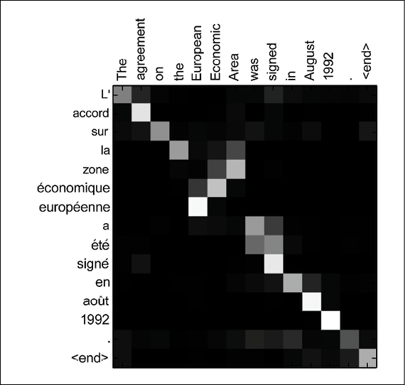

图 6.1:注意英语句子“欧洲经济区协议签署于 1992 年 8 月”的例子该图显示了“注释权重”，即与注释相关的权重。来源:Bahdanau 等人(2014 年)(https://arxiv.org/abs/1409.0473)“通过联合学习对齐和翻译进行神经机器翻译”

使用注意力机制，神经网络可以学习每个源英语单词相对于每个目标法语单词的热图。注意，关系不仅在对角线上，而且可能遍布整个矩阵。例如，当模型输出法语单词“européenne”时，它会非常注意输入单词“European”和“Economic”。(在*图 6.1* 中，这对应于对角线和相邻单元。)Bahdanou 等人在 2014 年发表的注意力论文证明，该模型(使用了注意力 RNN 编码器-解码器框架)可以在没有监督的情况下*学习对齐和注意*输入元素，并且如图*图 6.1* 所示，将输入的英语句子翻译成法语。当然，训练集越大，基于注意力的模型可以学习的相关性数量就越多。

简而言之，注意力机制可以访问所有以前的单词，并根据一个*学习的*相关性度量来加权它们。这样，注意力就可以提供目标句中距离较远的标记的相关信息。

现在，我们可以关注变形金刚的另一个关键因素——“自我关注”

### 自我关注

最初的 transformer 论文推广的第三个关键思想是在源语言的同一个句子内使用注意力——自我注意。通过这种机制，可以训练神经网络在专注于(机器)翻译之前，学习每个输入序列(如句子)中所有单词(或其他元素)之间的关系，而不管它们的位置。自我关注可以归功于 2016 年的一篇论文，题为*程等人的*、[、](https://arxiv.org/pdf/1601.06733.pdf)的《机器阅读的长短期记忆网络》。

让我们用下面两句话来看一个例子:

"服务员，能给我结账吗？"

“看来我刚刚让服务器崩溃了。”

显然，单词“服务器”在两个句子中有非常不同的意思，自我关注可以理解周围单词的上下文。只是重申一下，注意力机制可以访问所有以前的单词，并根据学到的相关性衡量标准对它们进行加权。自我注意提供了源句中距离较远的标记的相关信息。

### 多头(自我)注意

原始变压器多次执行(自我)注意功能。一组所谓的权重矩阵(在*如何计算注意力*部分有详细介绍)被称为注意力头。当你有几组这样的矩阵时，你就有了多个注意力头。多头(自我)关注层通常有几个平行的(自我)关注层。请注意，多个中心词的引入允许我们对哪些词彼此“相关”有多种定义。此外，所有这些相关性定义都可以通过现代硬件加速器并行计算，从而加快计算速度。

现在，我们已经完成了变形金刚关键成分的高级定义，让我们深入研究如何计算注意力机制。

## 如何计算注意力

在最初的转换器中，通过使用所谓的缩放点积单元来计算自关注函数。2017 年论文的作者甚至将他们的注意力方法称为*标度点积注意力*。你可能还记得高中的研究，两个向量之间的点积提供了向量有多“接近”的一个很好的感觉。

传入转换器(编码器和/或解码器)的每个输入令牌序列(例如，一个句子的)嵌入都会产生*注意力权重*(将在下面详细介绍)，这些权重是在每个序列元素(例如一个单词)之间同时计算的。该输出导致为每个标记产生的嵌入，该嵌入包含标记本身以及通过其相对注意力权重加权的每个其他相关标记。

注意力层将输入向量转换为查询、键和值矩阵，然后这些矩阵被分成注意力头(因此称为多头注意力):

*   查询词可以被解释为我们正在为其计算关注度函数的词*。*
*   关键词和值词是我们关注的词*。*

点积(下面将进一步解释)告诉我们单词之间的相似性。如果两个单词的向量更加一致，那么*注意力得分*将会更高。转换器将以这样的方式学习权重，即如果句子中的两个单词彼此相关，则它们的单词向量将被对齐。

每个注意力层学习三个权重矩阵:

*   查询权重 *W* [Q]
*   关键权重 *W* [K]
*   价值权重 *W* [V]

对于每个单词 *i* ，计算嵌入*x*I 的输入单词，产生:

*   一个查询向量*Q*[I]=*x*[I]*W*[Q]
*   a 关键向量*K*[I]=*x*[I]*W*[K]
*   a 值向量*V*[I]=*x*[I]*W*[V]

给定查询和相应的关键向量，下面的点积公式产生原始 transformer 论文中的*注意力权重*:

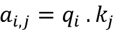

其中:

*   *a* [i，j] 是从单词 *i* 到单词 *j* 的注意力。
*   。是带有键的查询的点积，这将给出向量有多“接近”的感觉。

注意，单词 *i* 的关注度单位是所有单词的值向量的加权和，由单词 *i* 到单词 *j* 的关注度*a*I[j]加权。

现在，为了在训练过程中稳定梯度，注意力权重除以关键向量的维度。

然后，将结果通过 softmax 函数进行传递，以标准化权重。注意，从一个单词 *i* 到一个单词 *j* 的注意力函数和从单词 *j* 到一个单词 *i* 的注意力函数是不一样的。

请注意，由于现代深度学习加速器可以很好地处理矩阵，我们可以使用大矩阵计算所有单词的注意力。

将 *q* [i] 、 *k* [i] 、 *v* [i] (其中 *i* 是第 *i* 行)分别定义为矩阵 *Q* 、 *K* 、 *V* 。然后，我们可以将注意力函数总结为一个注意力矩阵:

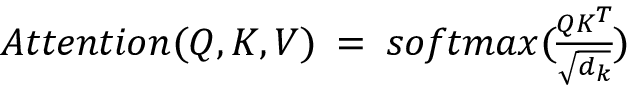

在本节中，我们讨论了如何计算最初 transformer 论文中介绍的关注度函数。接下来，让我们讨论编码器-解码器架构。

## 编码器-解码器架构

类似于在*第 5 章*、*递归神经网络*中描述的 seq2seq 模型(Ilya Sutskever、Oriol Vinyals、Quoc V. Le (2014)的*序列到序列神经网络学习*)，最初的变压器模型也使用编码器-解码器架构:

*   编码器获取嵌入的输入(源)序列，并将其转换为输入嵌入的新的固定长度向量。
*   解码器从编码器获取输出嵌入向量，并将其转换为输出嵌入序列。
*   编码器和解码器都由几个堆叠的层组成。每个编码器和解码器层都使用前面描述的注意机制。

在本节的后面，我们将更详细地了解 transformer 架构。

自从引入变压器架构以来，其他较新的网络仅使用编码器或解码器组件(或两者都使用)，这将在本章的变压器一节的*类别中讨论。*

接下来，让我们简要回顾一下原始转换器的其他组件——残差层和归一化层。

## 残差层和归一化层

通常，基于变压器的网络重用其他现有的最先进的机器学习方法，如注意力机制。因此，如果编码器和解码器层都将神经网络与残差连接(*深度残差学习用于图像识别*由何等人，2016，【https://arxiv.org/abs/1512.03385】)和归一化步骤(*层归一化*由 Ba 等人，2016，[https:/arxiv . org/ABS/1607.06450](https://arxiv.org/abs/1607.06450))相结合，您不会感到惊讶。

好了，我们现在有了深入研究变形金刚的所有关键要素。

## 变压器架构概述

现在，我们已经讨论了最初的变压器背后的一些关键概念，让我们深入研究 2017 年开创性论文中介绍的架构。注意，基于 transformer 的模型通常是通过利用各种注意力机制而不使用 rnn 来构建的。这也是一个事实的结果，即注意力机制本身可以匹配并优于 RNN(编码器-解码器)模型。这就是为什么这篇开创性的论文被命名为*注意力是你所需要的全部*。

*图 6.2* 展示了一个带 RNNs 和 attention 的 seq2seq 网络，并将其与原变压器网络进行比较。

转换器在以下方面类似于 seq2seq 的注意力模型:

*   这两种方法都使用源(输入)和目标(输出)*序列。*
*   如前所述，两者都使用编码器-解码器架构。
*   编码器最后一个模块的输出被用作计算解码器中注意力函数的上下文或思维向量。
*   目标(输出)序列嵌入被馈送到密集(全连接)块中，该块将输出嵌入转换成整数形式的最终序列:

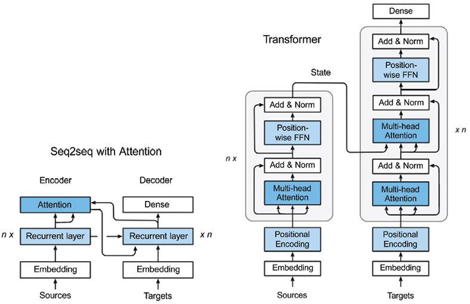

图 6.2 :( a)seq 2 seq+注意，和(b)变压器架构中的数据流。图片来源:张等。

这两种架构在以下方面有所不同:

*   The seq2seq network uses the recurrent and attention layers in the encoder, and the recurrent layer in the decoder.

    变压器将这些层替换为所谓的变压器块(N 个相同层的堆叠)，如图 6.2 所示:

    *   在编码器中，变换器块由一系列子层组成:多头(自)注意层和位置前馈层。这两层中的每一层都有一个残差连接，后面是一个规范化层。
    *   在解码器中，transformer 块包含一个多头(自)注意层的变体，具有*屏蔽—* 屏蔽的多头自注意—和一个类似编码器中的前馈层(具有相同的残差连接和归一化层)。屏蔽有助于防止头寸延期。此外，解码器还包含第二个多头(自)注意力层，用于计算编码器变压器输出的注意力。本节稍后将详细介绍块屏蔽。)

*   In the seq2seq with attention network, the encoder state is passed to the first recurrent time step as with the seq2seq with attention network.

    在转换器中，编码器状态被传递给解码器中的每个转换器模块。这使得变压器网络可以跨时间步长并行工作，因为不再像 seq2seq 网络那样存在时间依赖性。

    最后一个解码器之后是最终的线性变换(密集层),使用 softmax 函数来产生输出(下一个令牌)概率。

*   由于上一点中提到的并行性，添加了一个编码层来提供位置信息，以区分变压器网络序列中每个元素的位置(位置编码层)。这样，第一编码器将输入序列的位置信息和嵌入作为输入，而不仅仅是编码，从而允许考虑位置信息。

让我们看一下数据流经变压器网络的过程。在本章的后面，我们将使用 TensorFlow 和 Keras API 从头开始创建和训练一个转换器模型:

1.  作为数据预处理的一部分，输入和输出被标记化并转换为嵌入。
2.  Next, positional encoding is applied to the input and output embeddings to have information about the relative position of tokens in the sequences. In the encoder section:
    *   根据*图 6.2* ，编码器端包括一个嵌入和一个位置编码层，后面是六个相同的变换器模块(原始变换器中有六个“层”)。正如我们之前了解到的，编码器中的每个变换器模块都由一个多头(自)注意层和一个位置前馈层组成。

    我们已经简要地看到，自我关注是关注同一序列的各个部分的过程。当我们处理一个句子时，我们可能想知道还有哪些单词与当前单词最匹配。

    *   多头注意力层由多个(开创性论文中包含的参考实现中有八个)并行自我注意力层组成。自关注通过从输入嵌入中构造出三个向量 *Q* (查询) *K* (键) *V* (值)来进行。这些向量是通过将输入嵌入乘以三个可训练权重矩阵*W*Q、*W*K 和*W*V 来创建的。输出向量 *Z* 是通过使用以下公式在每个自我关注层组合 *K* 、 *Q* 和 *V* 而创建的。这里， *d* [K] 是指 *K* 、 *Q* 、 *V* 向量(种子论文中包含的参考实现中的 64)的维数:

    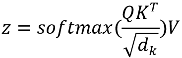

    *   多头关注层将为 *Z* 创建多个值(基于每个自关注层的多个可训练权重矩阵*W*Q、*W*K 和*W*V)，然后将它们连接起来作为位置前馈层的输入。
    *   位置前馈层的输入包括序列中不同元素(或句子中的单词)的嵌入，通过多头注意层中的自我注意来参与。每个令牌在内部由一个固定长度的嵌入向量表示(在开创性论文中介绍的参考实现中为 512)。每个向量并行通过前馈层。FFN 的输出是下一个变换器块中多头关注层的输入(或馈入)。在编码器的最后一个变换器模块中，输出是传递给解码器的上下文向量。
    *   多头注意力和位置式 FFN 层不仅发送来自前一层的信号，还从它们的输入向它们的输出发送残余信号。输出和剩余输入通过层标准化步骤，这在图 6.2 的*中显示为“添加&范数”层。*
    *   因为整个序列是在编码器上并行消耗的，所以关于各个元素位置的信息会丢失。为了对此进行补偿，输入嵌入通过位置嵌入来增强，该位置嵌入被实现为没有学习参数的正弦函数。位置嵌入被添加到输入嵌入中。

1.  接下来，我们来看一下数据是如何流经解码器的:
    *   编码器的输出产生一对注意向量 *K* 和 *V* ，它们被并行发送到解码器中的所有变换器块。解码器中的 transformer 模块类似于编码器中的 transformer 模块，只是它有一个额外的多头注意力层来处理来自编码器的注意力向量。这个额外的多头注意力层的工作方式类似于编码器中的层及其下一层，除了它组合了来自其下一层的 *Q* 向量和来自编码器状态的 *K* 和 *Q* 向量。
    *   与 seq2seq 网络类似，输出序列使用前一个时间步长的输入，一次生成一个令牌。至于编码器的输入，解码器的输入也用位置嵌入来增加。与编码器不同，解码器中的自我关注过程只允许关注先前时间点的令牌。这是通过屏蔽未来时间点的令牌来实现的。
    *   解码器中最后一个变换器模块的输出是一系列低维嵌入(如前所述，512 用于开创性论文中的参考实现)。这被传递到密集层，该层将它转换成跨目标词汇表的概率分布序列，从中我们或者贪婪地或者通过诸如波束搜索之类的更复杂的技术生成最可能的单词。

*图 6.3* 显示了变压器架构，涵盖了刚刚描述的所有内容:

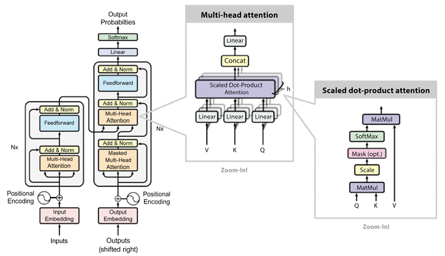

图 6.3:基于瓦斯瓦尼等人(2017)的“你所需要的只是关注”的原始图片的变压器架构

## 培养

变压器通常分两步通过半监督学习进行训练:

1.  首先，无监督的预训练，通常在非常大的语料库上进行。
2.  然后，在一个较小的标注数据集上进行监督微调。

预训练和微调都可能需要大量的 GPU/TPU、内存和时间资源。考虑到大型语言模型(简而言之，LLM)有越来越多的参数，这一点尤其正确，我们将在下一节中看到。

有时，第二阶段的标记数据非常有限。这就是所谓的少射学习，它考虑基于有限数量的样本进行预测。

# 变压器架构

在本节中，我们已经提供了变形金刚使用的最重要架构和计算注意力的不同方法的高级概述。

## 变压器的类别

在这一节，我们将把变压器分成不同的类别。下一段将介绍最常见的变压器。

### 解码器或自回归

一个典型的例子是**https://openai.com/blog/language-unsupervised**(**创成式预训练**)模型，你可以在本章后面的 GPT-2 和 GPT-3 部分了解更多，或者参考。自回归模型仅使用原始 transformer 模型的解码器，注意头只能看到文本中之前的内容，而不能看到完整句子之后的内容。自回归模型使用预训练，在观察所有之前的令牌后猜测下一个令牌。通常，自回归模型用于**自然语言生成** ( **NLG** )文本生成任务。其他自回归模型的例子包括原始的 GPT 模型、GPT-2 模型、Transformer-XL 模型、Reformer 模型和 XLNet 模型，这些将在本章后面介绍。

### 编码器或自动编码

一个典型的例子是**伯特** ( **来自变压器**的双向编码器表示)，这将在本章后面的中介绍。自动编码器对应于原始 transformer 模型中的编码器，可以访问没有掩码的完整输入令牌。自动编码模型通过屏蔽/改变输入标记来使用预训练，然后尝试重建原始句子。通常，模型会建立完整句子的双向表示。请注意，自动编码器和自回归之间的唯一区别是预训练阶段，因此两种方式都可以使用相同的架构。自动编码器可用于 NLG，以及分类和许多其他 NLP 任务。除了 BERT 之外，其他自动编码模型的例子还包括 ALBERT、RoBERTa 和 ELECTRA，您可以在本章的后面了解到这些。

### Seq2seq

典型的例子是 **T5** ( **文本到文本转换变压器**)和原始变压器。序列到序列模型使用原始变压器架构的编码器和解码器。Seq2seq 可以针对翻译、摘要、排名和问题回答等许多任务进行微调。seq2seq 型号的另一个例子，除了原变压器和 T5，就是**多任务统一型号** ( **MUM** )。

### 多模式的

典型的例子是 MUM。多模态模型将文本输入与其他类型的内容(例如，图像、视频和音频)混合在一起。

### 检索

典型的例子就是复古。一些模型在(预)训练和推理期间使用文档检索。这通常是减小模型尺寸和快速访问存储信息的好策略，节省了所用参数的数量。

## 注意力

既然我们已经了解了如何对变形金刚进行分类，那我们就来集中注意力吧！

存在各种各样的注意机制，例如自我注意、局部/硬注意和整体/软注意等等。下面，我们将重点介绍一些例子。

### 完整与稀疏

正如所讨论的，来自原始 2017 transformer 论文的(缩放的)点积注意力通常是在全方阵*O*(*L*2 上计算的，其中 *L* 是最大考虑序列的长度(在一些配置中 *L* = 512)。谷歌研究院在 2020 年提出的大鸟型变压器(BigBird type of transformer)引入了通过利用稀疏矩阵来使用稀疏注意力的思想(基于 2019 年 OpenAI 的*用稀疏变压器生成长序列*Child 等人的[https://arxiv.org/abs/1904.10509](https://arxiv.org/abs/1904.10509))。

### LSH 注意了

改革者引入了用散列法降低注意力机制复杂性的想法——该模型的作者称之为局部敏感散列注意力。该方法基于在计算*soft max*(*QK*^T)时仅使用最大元素的概念。换句话说，对于每个查询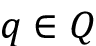，只计算接近 *q* 的键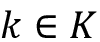。为了计算接近度，根据本地敏感散列技术来计算几个散列函数。

### 当地的关注

一些变形金刚采用了只有一个本地上下文窗口的想法(例如，几个标记在右边，几个标记在左边)。这个想法是，使用更少的参数允许我们考虑更长的序列，但关注程度有限。正因如此，本地关注就不那么受欢迎了。

# 预训练

正如您之前了解到的，最初的转换器有一个编码器-解码器架构。然而，研究机构了解到，在某些情况下，只有编码器、解码器或两者都有好处。

## 编码器预训练

如前所述，这些模型也被称为自动编码，它们在预训练期间仅使用编码器。预训练是通过屏蔽输入序列中的单词并训练模型以重构序列来进行的。通常，编码器可以访问所有的输入字。仅编码器模型通常用于分类。

## 解码器预训练

解码器模型被称为自回归。在预训练期间，解码器被优化以预测下一个字。特别地，解码器只能访问序列中位于给定字之前的所有字。纯解码器模型通常用于文本生成。

## 编码器-解码器预训练

在这种情况下，模型可以同时使用编码器和解码器。注意在编码器中可以使用序列中的所有字，而注意在中解码器只能使用序列中给定字之前的字。编码器-解码器具有广泛的应用，包括文本生成、翻译、摘要和生成性问题回答。

## 预训练任务的分类

这对于将预训练组织成由*自然语言处理预训练模型建议的分类是有用的:调查*，邱希鹏，2020，:

*   **语言建模** ( **LM** ):对于单向 LM，任务是预测下一个令牌。对于双向 LM，任务是预测前一个和下一个令牌。
*   **掩蔽语言建模** ( **MLM** ):其核心思想是从输入的句子中掩蔽出一些标记。然后，在给定非屏蔽令牌的情况下，训练该模型来预测屏蔽令牌。
*   **置换语言建模** ( **PLM** ):这类似于 LM，但是执行输入序列的随机置换。然后，选择标记的子集作为目标，并训练模型来预测这些目标。
*   **去噪自动编码器** ( **DAE** ):故意提供部分损坏的输入。例如，随机抽取输入标记，并用特殊的【掩码】元素替换它们。或者，随机删除输入令牌。或者，随机排列句子。任务是恢复原始的未失真输入。
*   **对比学习** ( **CTL** ):任务是通过假设一些观察到的文本对比随机抽样的文本在语义上更相似，来学习文本对的得分函数。这类技术包括许多特定的技术，例如:
    *   **Deep InfoMax** ( **DIM** ):最大化一个输入图像表示和同一图像的各个局部区域之间的互信息。
    *   **替换令牌检测** ( **RTD** ):根据周围环境预测输入令牌是否被替换。
    *   **下一句预测**(**NSP**)模型被训练来区分两个输入句子在训练语料库中是否是连续的。
    *   **句序预测** ( **SOP** ):与 NSP 思路相同，外加一些信号:两个连续的段为正例，两个对调的段为反例。

在这一部分，我们简要回顾了不同的预处理技术。下一节将介绍一些最常用的变压器。

# 流行和知名车型概述

继开创性的论文*关注是你所需要的全部*之后，大量基于变压器的替代模型被提出。让我们来回顾一些最受欢迎和众所周知的。

## 伯特

BERT，或来自变形金刚的双向编码器表示，是谷歌 AI 研究团队在 2018 年开发的语言表示模型。让我们回顾一下该模型背后的主要直觉:

1.  伯特使用所谓的“双向自我注意”从左右两边考虑每个单词的上下文
2.  训练是通过随机屏蔽输入单词标记来进行的，并且避免循环，使得单词不能间接地看到它们自己。在 NLP 行话中，这被称为“填空”换句话说，预训练任务包括屏蔽未标记输入的一个小子集，然后训练网络来恢复这些原始输入。(这是 MLM 的一个例子。)
3.  该模型使用分类进行预训练，以预测句子序列 S 是否在句子 T 之前。这样，BERT 可以理解句子之间的关系(“下一句预测”)，例如“句子 T 是否在句子 S 之后？”预训练的思想成为了 LLM 的新标准。
4.  BERT——即 BERT Large——成为首批大型语言模型之一，拥有 24 个变压器块、1024 个隐藏层、16 个自我关注头和 340M 参数。该模型在一个 33 亿词的大型语料库上进行训练。

BERT 为 11 个 NLP 任务产生了最先进的结果，包括:

*   胶水得分为 80.4%，比之前的最好成绩提高了 7.6%。
*   在 SQuAD 1.1 上的准确率为 93.2%，比人类表现高出 2%。

我们将在这一章的后面看到胶水和队伍指标。如果你想了解更多，你可以浏览以下材料:

*   原研究论文: *BERT:用于语言理解的深度双向变压器的预训练*Jacob Devlin，张明蔚，Kenton Lee，Kristina Toutanova，2018，[https://arxiv.org/abs/1810.04805](https://arxiv.org/abs/1810.04805)。
*   谷歌人工智能博文:*开源 BERT:自然语言处理最先进的预训练*，2018，其中讨论了 11 个 NLP 任务的(当时)最先进模型的进步([https://AI . Google blog . com/2018/11/Open-Sourcing-BERT-State-Art-Pre . XHTML](https://ai.googleblog.com/2018/11/open-sourcing-bert-state-of-art-pre.xhtml))。)
*   开源 TensorFlow 实现和预训练的 BERT 模型可在 http://goo.gl/language/bert[和 T2【https://github . com/TensorFlow/models/tree/master/official/NLP/modeling/models](http://goo.gl/language/bert)的 tensor flow 模型花园获得。
*   伯特的 Colab 笔记本在这里有:[https://Colab . research . Google . com/github/tensor flow/TPU/blob/master/tools/Colab/BERT _ fine tuning _ with _ cloud _ tpus . ipynb](https://colab.research.google.com/github/tensorflow/tpu/blob/master/tools/colab/bert_finetuning_with_cloud_tpus.ipynb)。
*   BERT FineTuning with Cloud TPU:这是一个教程，展示了如何在云 TPU 上训练 BERT 模型，用于句子和句子对分类任务:[https://cloud.google.com/tpu/docs/tutorials/bert](https://cloud.google.com/tpu/docs/tutorials/bert)。
*   一篇关于将 BERT 应用于谷歌搜索以提高语言理解的谷歌博客文章。据谷歌称，BERT " *将帮助搜索引擎更好地理解美国十分之一的英文搜索。*”此外，帖子提到“*这些系统的一个强大特点是，它们可以从一种语言中学习，并将其应用于其他语言。因此，我们可以采用从英语(一种绝大多数网络内容都存在的语言)的改进中学习的模型，并将它们应用于其他语言。*(来自*比以往任何时候都更了解搜索*):[https://blog . Google/products/search/search-language-Understanding-Bert/](https://blog.google/products/search/search-language-understanding-bert/)。

## GPT-2

OpenAI 在*中推出的模型是 GPT-2，语言模型是无监督多任务学习器*由亚历克·拉德福德、杰弗里·吴、雷文蔡尔德、大卫·栾、达里奥·阿莫代伊、伊利亚·苏茨基弗、[https://openai.com/blog/better-language-models/](https://openai.com/blog/better-language-models/)、[https://openai.com/blog/gpt-2-6-month-follow-up/](https://openai.com/blog/gpt-2-6-month-follow-up/)、[https://www.openai.com/blog/gpt-2-1-5b-release/](https://www.openai.com/blog/gpt-2-1-5b-release/)、[https://github.com/openai/gpt-2](https://github.com/openai/gpt-2)。)

让我们回顾一下关键的直觉:

*   四个模型中最大的是一个 15 亿参数的转换器，它有 48 层，在一个名为 Webtext 的新数据集上进行训练，该数据集包含来自 4500 万个网页的文本。
*   2018 年，*通过生成式预训练提高语言理解*，[https://openai.com/blog/language-unsupervised/](https://openai.com/blog/language-unsupervised/)，[https://cdn . OpenAI . com/research-covers/Language-unsupervised/Language _ Understanding _ paper . pdf](https://cdn.openai.com/research-covers/language-unsupervised/language_understanding_paper.pdf)，【GPT-2】使用了最初的 2017 基于 transformer 的架构和最初的 GPT 模型(也是 open ai 开发的)的修改版本。
*   研究表明，在大型和多样化的数据集上训练的 LLM 可以在各种各样的 NLP 任务上表现良好，如问题回答、机器翻译、阅读理解和摘要。以前，这些任务通常是通过在特定任务数据集上进行监督学习来完成的。GPT-2 以无人监督的方式进行训练，在零射击任务转移中表现良好。
*   最初，OpenAI 只发布了一个具有 1.17 亿参数的 GPT-2 的较小版本，“由于担心大型语言模型被用于大规模生成欺骗性、偏见或辱骂性的语言。”然后，车型发布:[https://openai.com/blog/gpt-2-1-5b-release/](https://openai.com/blog/gpt-2-1-5b-release/)。
*   有趣的是，OpenAI 开发了一种基于 ML 的检测方法，来测试一个演员是否在为宣传而生成合成文本。对于检测 1.5B GPT-2 生成的文本:[https://github.com/openai/gpt-2-output-dataset](https://github.com/openai/gpt-2-output-dataset)，检测率约为 95%。

与 2018 年的原始 GPT 类似，GPT-2 不需要原始变压器模型的编码器部分-它使用多层解码器进行语言建模。解码器只能从句子中先前的单词中获得信息。它将单词向量作为输入，并产生对下一个单词概率的估计作为输出，但它是*自回归*，这意味着句子中的每个标记都依赖于前面单词的上下文。另一方面，BERT 不是自回归的，因为它一次使用整个周围环境。

GPT-2 是第一个展示常识推理的 LLM，能够执行许多 NLP 任务，包括翻译、回答问题和阅读理解。该模型在 8 个测试语言建模数据集的 7 个数据集上取得了最先进的结果。

## GPT-3

GPT-3 是由 OpenAI 开发的自回归语言模型，并于 2019 年由汤姆·布朗(Tom B. Brown)等人在*语言模型是少量学习者*、[https://arxiv.org/abs/2005.14165](https://arxiv.org/abs/2005.14165)中介绍。让我们看看关键的直觉:

*   GPT-3 使用类似于 GPT-2 的架构和模型，主要区别在于采用了稀疏注意力机制。
*   对于每项任务，模型评估有三种不同的方法:
    *   **少量学习**:模型在推理时接收任务的一些演示(通常少于 100 个)。但是，不允许更新重量。
    *   一次性学习(One-shot learning):模型只接受一次演示和任务的自然语言描述。
    *   **零射击学习**:模型不接受演示，但它只能访问任务的自然语言描述。
*   对于所有的任务，GPT-3 是适用于没有任何梯度更新，完成任务和少数镜头演示指定纯粹通过文本与模型的互动。

研究人员训练 GPT-3 的参数数量从 1.25 亿(GPT-3 小)到 1750 亿(GPT-3 175B)不等。在没有微调的情况下，该模型在包括翻译和问答在内的许多 NLP 任务上取得了显著的结果，有时甚至超过了最先进的模型。特别是，GPT-3 在 NLG 展示了令人印象深刻的成果，创造了难以与真实文章区分的新闻文章。该模型表明，它能够解决需要即时推理或领域适应的任务，如解读单词，在句子中使用新单词，或执行 3 位数算术。

GPT-3 的底层模型没有公开，我们不能预训练该模型，但一些数据集统计数据可在 https://github.com/openai/gpt-3 获得，我们可以在 GPT-3 引擎上运行数据并进行微调。

## 改革家

加州大学伯克利分校和谷歌人工智能研究人员 Nikita Kitaev，ukasz Kaiser 和 Anselm Levskaya，在 2020 年的论文*Reformer:The Efficient Transformer*中介绍了改革者模型。

让我们看看关键的直觉:

*   作者展示了你可以训练 Reformer 模型，它在长序列上以一种更高效、更快的方式与 transformer 模型表现相当。
*   transformers 的一个限制是处理长序列的能力，因为计算注意力需要二次时间。
*   Reformer 通过使用三种技术解决了训练变形金刚过程中的计算和内存挑战。
*   首先，Reformer 用一种近似的使用局部敏感散列注意力的方法代替了(按比例调整的)点积注意力(在本章前面有简要描述)。本文作者将前者的 *O* ( *L* ² )因子改为 *O* ( *LlogL* )，其中 *L* 为序列的长度(见*图 6.4*LSH 依次应用于组块)。参考计算机科学中介绍的本地敏感哈希法了解更多:[https://en.wikipedia.org/wiki/Locality-sensitive_hashing](https://en.wikipedia.org/wiki/Locality-sensitive_hashing)。
*   第二，该模型将注意力和前馈层与可逆残差层相结合，而不是正常残差层(基于 Gomez 等人 2017 年[的*可逆残差网络:不存储激活的反向传播*的思想 https://proceedings . neur IPS . cc/paper/2017/hash/f9be 311 e 65d 81 a9 ad 8150 a 60844 bb 94 c-abstract . XHTML](https://proceedings.neurips.cc/paper/2017/hash/f9be311e65d81a9ad8150a60844bb94c-Abstract.xhtml))。可逆剩余层允许存储激活一次，而不是 *N* 次，从而降低了存储器和时间复杂度方面的成本。
*   第三，Reformer 对某些计算使用了分块技术，包括前馈层和反向传递。
*   你可以在[https://AI . Google blog . com/2020/01/Reformer-efficient-transformer . XHTML](https://ai.googleblog.com/2020/01/reformer-efficient-transformer.xhtml)阅读谷歌人工智能博客帖子，了解更多关于重整器如何达到效率的信息:

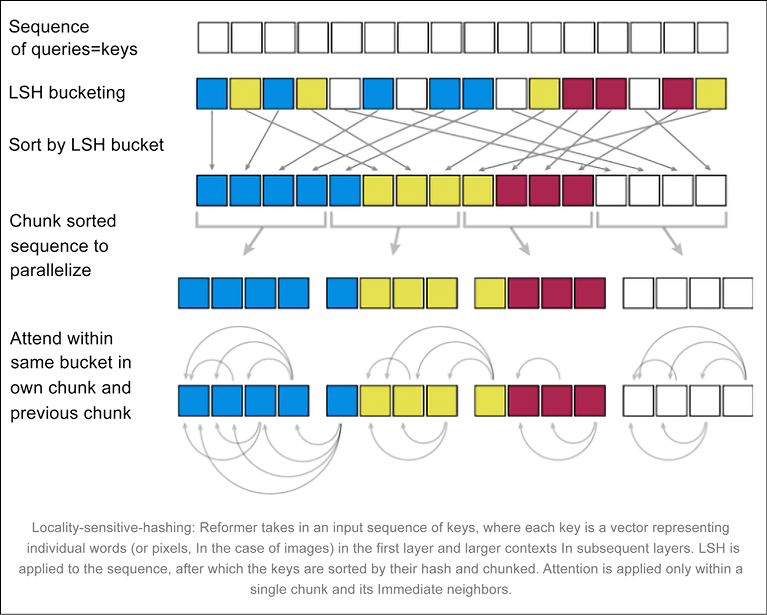

图 6.4:提高变压器效率的本地敏感散列法–来源:https://ai . Google blog . com/2020/01/reformer-efficient-transformer . XHTML

## 大鸟

BigBird 是谷歌研究院在 2020 年推出的另一种类型的转换器，它使用稀疏注意力机制来处理计算长序列的完全注意力所需的二次复杂度。如需更深入的概述，请参见曼齐尔·扎希尔、古鲁加内什、阿维纳瓦·杜贝、约书亚·安斯利、克里斯·阿尔贝提、圣地亚哥·翁塔农、菲利普·法姆、阿尼鲁德·拉乌拉、王启帆、李阳和阿姆鲁·阿默德撰写的论文*。*

让我们来看看关键直觉:

*   作者证明了 BigBird 能够处理更长的上下文——更长的序列，在类似的硬件上高达 8 倍。在某些自然语言处理任务上，比如问答和文档摘要，它的表现“显著”更好。
*   BigBird 运行在稀疏注意力机制上，以克服 BERT 的二次依赖性。研究人员证明复杂度从 *O* ( *L* ² )降低到 *O* ( *L* )。
*   通过这种方式，BigBird 可以处理比 BERT 多 8 倍的序列。换句话说，BERT 的限制是 512 个令牌，BigBird 增加到 4096 个令牌。

## 变压器-XL

Transformer-XL 是一种基于自我注意力的模型，由卡耐基梅隆大学和谷歌大脑研究人员于 2019 年在戴子航、、、、Jaime Carbonell、Quoc V. Le 和 Ruslan Salakhutdinov、[https://aclanthology.org/P19-1285.pdf](https://aclanthology.org/P19-1285.pdf)的论文 *Transformer-XL:超越固定长度上下文的专注语言模型*中推出。

让我们看看关键的直觉:

*   与最初的 transformer 和 RNNs 不同，Transformer-XL 证明了它可以在生成相对连贯的文本的同时，对固定长度上下文之外的长期依赖性进行建模。
*   Transformer-XL 引入了一种新的段级递归机制和一种新的相对位置编码(相对于绝对编码)，允许模型学习比 RNNs 长 80%和比普通 Transformer 长 450%的依赖性。传统上，由于计算限制，变压器将整个语料库分成更短的片段，并且仅在每个片段内训练模型。
*   在训练期间，为前一段计算的隐藏状态序列被固定并缓存，以便在模型处理下一个新段时作为扩展上下文重用，如图*图 6.5* 所示。尽管梯度仍然保持在一个段内，但是这种额外的输入允许网络利用历史中的信息，从而产生对长期依赖性建模和避免上下文碎片的能力。
*   在评估过程中，可以重用来自先前段的表示，而不是像在普通模型情况下那样从头开始计算。通过这种方式，Transformer-XL 在评估过程中被证明比普通型号快 1800 多倍:

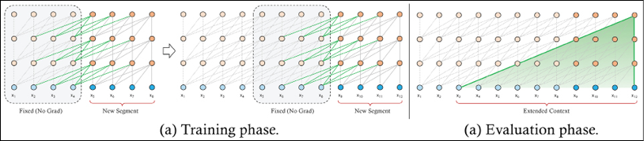

图 6.5: Transformer-XL 和带有先前片段的循环缓存的输入

## XLNet

XLNet 是卡内基梅隆大学和谷歌大脑研究人员在 2019 年开发的一种无监督语言表示学习方法。它基于广义置换语言建模目标。XLNet 采用 Transformer-XL 作为主干模型。这里的参考文献是*XLNet:[杨、](https://arxiv.org/abs/1906.08237)戴子航、Jaime Carbonell、Ruslan Salakhutdinov、Quoc V. Le 著的《语言理解的广义自回归预训练》*。

让我们看看关键的直觉:

*   和 BERT 一样，XLNet 使用双向上下文，查看给定标记前后的单词来预测它应该是什么。
*   XLNet 最大化了一个序列相对于因式分解顺序的所有可能排列的期望对数似然。由于置换运算，每个位置的上下文可以由来自左侧和右侧的标记组成。换句话说，XLNet 捕获双向上下文。
*   XLNet 在 20 个任务上优于 BERT，在 18 个任务上取得了最先进的结果。
*   代码和预训练模型可在这里:[https://github.com/zihangdai/xlnet](https://github.com/zihangdai/xlnet)。

在几乎所有的 NLP 任务中，XLNet 被认为比 BERT 更好，在 20 个任务中超过 BERT，通常是大幅度超过。当它被引入时，该模型在 18 个 NLP 任务上实现了最先进的性能，包括情感分析、自然语言推理、问题回答和文档排序。

## 罗伯塔

RoBERTa(一种稳健优化的 BERT)是 2019 年由华盛顿大学和脸书 AI (Meta)的研究人员在 *RoBERTa:一种稳健优化的 BERT 预训练方法*中推出的一种模型，作者是刘、Myle Ott、Naman Goyal、杜、Mandar Joshi、陈、Omer Levy、Luke Zettlemoyer 和 Veselin Stoyanov，。

让我们看看关键的直觉:

*   当复制 BERT 时，研究人员发现 BERT“训练严重不足”。
*   RoBERTa 的作者提出了一种 BERT 变体，它修改了关键的超参数(更长的训练，更大的批量，更多的数据)，删除了下一句话的预训练目标，并在更长的序列上进行训练。作者还提出动态改变应用于训练数据的掩蔽模式。
*   研究人员收集了一个名为 CC-News 的新数据集，其大小与其他私人使用的数据集相似。
*   这里有代码:[https://github.com/pytorch/fairseq](https://github.com/pytorch/fairseq)。

罗伯塔在胶水和小队任务上表现优于伯特，在一些任务上与 XLNet 不相上下。

## 艾伯特

**ALBERT** ( **A Lite BERT** )是 2019 年由谷歌研究院和丰田技术研究所的研究人员在题为*ALBERT:A Lite BERT for Self-supervised Learning of Language presentations*的论文中介绍的一种模型，作者是 Lan、陈明达、塞巴斯蒂安·古德曼、凯文·金佩尔、皮尤什·夏尔马和拉杜·索里库特。

让我们看看关键的直觉:

*   大型模型通常旨在在预训练自然语言表示时增加模型大小，以获得改进的性能。然而，由于 GPU/TPU 内存限制、较长的训练时间和意外的模型降级，增加模型大小可能会变得困难。
*   ALBERT 试图通过一种架构来解决内存限制、通信开销和模型退化问题，该架构结合了两种参数缩减技术:因式分解嵌入参数化和跨层参数共享。利用分解的嵌入参数化，通过将大的词汇嵌入矩阵分解成两个小矩阵，隐藏层的大小与词汇嵌入的大小分离。通过跨层参数共享，该模型防止了参数的数量随着网络深度而增长。这两种技术都提高了参数效率，而没有“严重”影响性能。
*   与最初的 BERT-Large 模型相比，ALBERT 的参数减少了 18 倍，训练速度提高了 1.7 倍，而性能仅略有下降。
*   这里有代码:[https://github.com/brightmart/albert_zh](https://github.com/brightmart/albert_zh)。

ALBERT 声称，它在所有当前最先进的语言基准(如 GLUE、SQuAD 和 RACE)上建立了新的最先进的结果。

## 结构伯特

StructBERT 是在 2019 年的论文中介绍的一个模型，名为*《struct Bert:将语言结构融入深度语言理解的预训练*，作者为、毕斌、、陈武、祖义宝、江南夏、李伟鹏、罗斯、。

让我们看看关键的直觉:

*   阿里巴巴团队建议在预训练过程中通过利用单词级和句子级排序来扩展 BERT。预训练期间的 BERT 掩蔽通过混合多个记号来扩展，然后模型必须预测正确的顺序。
*   此外，该模型随机打乱句子顺序，并使用特定的预测任务预测下一句和上一句。
*   这种额外的措辞和句子重排以及预测原始顺序的任务允许 StructBERT 在预训练过程中学习语言结构。

阿里巴巴的 StructBERT 声称在不同的 NLP 任务上取得了最先进的结果，如情感分类、自然语言推理、语义文本相似性和问题回答，超过了 BERT。

## T5 和μm

2019 年，谷歌研究人员在由科林·拉弗尔、诺姆·沙泽尔、、凯瑟琳·李、·纳朗、迈克尔·马泰纳、周燕琪、和彼得·j·刘、等人撰写的*中推出了一个名为文本到文本迁移转换器(简称 T5)的框架，探索了使用统一的文本到文本转换器进行迁移学习的限制。本文是变压器的基础论文。*

以下是一些关键的想法:

*   T5 将许多自然语言处理任务视为“文本到文本”的问题。T5 是一个单一的模型(具有不同数量的参数),可以针对多种任务进行训练。该框架非常强大，可以应用于摘要、情感分析、问题回答和机器翻译。
*   迁移学习，其中模型首先在数据丰富的任务上进行预训练，然后在下游任务上进行微调，通过在几十个语言理解任务上比较预训练目标、架构、未标记数据集、迁移方法和其他因素进行广泛分析。
*   类似于最初的变压器，T5: 1)使用一个编码器-解码器结构；2)将输入序列映射到学习嵌入和位置嵌入，并传递给编码器；3)在编码器和解码器中使用具有自关注和前馈层(每个都具有归一化和跳跃连接)的自关注块。
*   训练在“巨大的干净爬行语料库”(C4)数据集上进行，每个 T5 模型的参数数量从 6000 万(T5 小)到 110 亿不等。
*   计算成本与 BERT 相似，但参数数量是它的两倍。
*   代码在这里:[https://github . com/Google-research/text-to-text-transfer-transformer](https://github.com/google-research/text-to-text-transfer-transformer)。
*   谷歌还在位于[https://Colab . research . Google . com/github/Google-research/text-to-text-transfer-transformer/blob/main/notebooks/T5-trivia . ipynb](https://colab.research.google.com/github/google-research/text-to-text-transfer-transformer/blob/main/notebooks/t5-trivia.ipynb)的 Colab 教程中提供了 T5 的免费 TPU。我们将在本章后面的中更详细地讨论这一点。

提交时，具有 110 亿个参数的 T5 模型在考虑的 24 个任务中的 17 个任务上实现了最先进的性能，成为事实上最好的 LMs 之一:

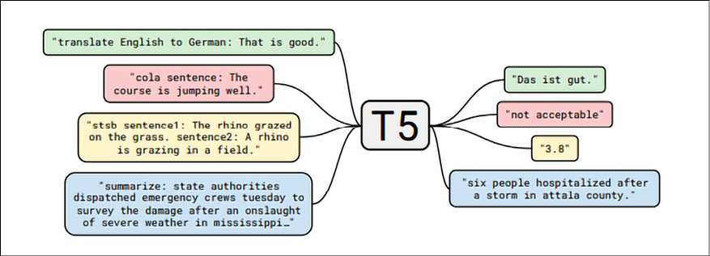

图 6.6: T5 使用相同的模型、损失函数、超参数等。涵盖我们的各种任务，包括翻译、问答和分类

mT5 是由薛等人在 2020 年在谷歌研究中心开发的，它通过使用单个转换器来模拟多种语言，从而扩展了 T5。它在一个覆盖 101 种语言的基于爬行的公共数据集上进行了预训练。你可以在 *mT5:一个大规模多语言预训练文本到文本转换器*，【https://arxiv.org/pdf/2010.11934.pdf】T2 中了解更多信息。

MUM(**多任务统一模型**的简称)是一种使用 T5 文本到文本框架的模型，根据谷歌的说法，它比 BERT 强大 1000 倍。妈妈不仅能理解语言，还能创造语言。它也是多模态的，包括文本和图像(将来会扩展到更多的模态)。该模型同时接受了 75 种不同语言和许多不同任务的训练。MUM 是目前用来支持谷歌搜索排名的:[https://blog.google/products/search/introducing-mum/](https://blog.google/products/search/introducing-mum/)。

## 伊利克特拉

ELECTRA 是 2020 年由斯坦福大学和谷歌大脑研究人员在 *ELECTRA 中介绍的一种模型:预先训练文本编码器作为鉴别器而不是生成器*由凯文·克拉克、Minh-Thang Luong、Quoc V. Le 和克里斯托弗·d·曼宁、[https://arxiv.org/abs/2003.10555](https://arxiv.org/abs/2003.10555)提出。

让我们看看关键的直觉:

*   BERT 预训练包括屏蔽一小部分未标记的输入，然后训练网络恢复它们。通常只使用一小部分单词(约 15%)。
*   ELECTRA 作者提出了一个新的预训练任务，名为“替换令牌检测”这个想法是用一个小型语言模型生成的替代物替换一些标记。然后，使用预训练的鉴别器来预测每个令牌是原始令牌还是替换令牌。这样，模型可以从所有记号而不是子集中学习:

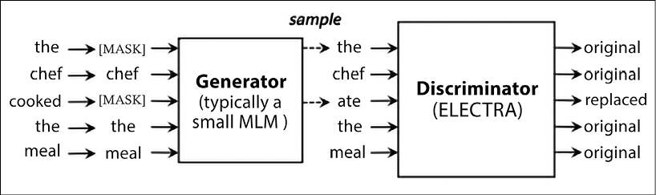

图 6.7: ELECTRA 替换策略。鉴别者的任务是检测这个单词是原词还是替换词——来源:https://arxiv.org/pdf/2003.10555.pdf

ELECTRA 优于以前的最先进的模型，同时需要更少的预处理工作。该代码可在[https://github.com/google-research/electra](https://github.com/google-research/electra)获得。

## 德伯塔

DeBERTa 是微软的研究人员于 2020 年在 *DeBERTa:解码增强的 BERT 与解开的注意力*中推出的模型，作者是何鹏程、、高剑锋、、。

让我们来看看最重要的想法:

*   伯特的自我关注侧重于内容对内容和内容对位置，其中内容和位置嵌入是在自我关注之前添加的。DeBERTa 保留了两个分别代表内容和位置的向量，以便在内容对内容、内容对位置、位置对内容和位置对位置之间计算自我注意力。
*   DeBERTa 保存绝对位置信息以及相关位置信息。

由于该模型使用了额外的结构信息，与 RoBERTa 等其他模型相比，DeBERTa 声称已经用一半的训练数据实现了最先进的结果。该代码可在[https://github.com/microsoft/DeBERTa](https://github.com/microsoft/DeBERTa)获得。

## 进化的变形金刚和米娜

谷歌大脑研究人员于 2019 年在大卫·r·索、陈亮和阔克·v·勒、[https://arxiv.org/abs/1901.11117](https://arxiv.org/abs/1901.11117)的论文*中介绍了进化变压器。*

让我们回顾一下主要观点:

*   变压器是一类手动绘制的架构。进化变形金刚的研究人员应用了**神经架构搜索** ( **NAS** )，这是一套自动优化技术，学习如何组合基本的建筑积木，以找到比人类手动设计的模型更好的模型。
*   NAS 应用于变压器编码器和解码器模块，形成了如图*图 6.8* 和*图 6.9* 所示的新架构。

与最初的变压器架构相比，改进后的变压器表现出持续的改进。该模型是 MEENA 的核心，MEENA 是一个多回合开放域聊天机器人，对从公共领域的社交媒体对话中挖掘和过滤的数据进行端到端训练。MEENA 使用具有 26 亿个参数的进化变压器，具有单个进化变压器编码器模块和 13 个进化变压器解码器模块。用于训练的目标函数集中于最小化困惑，即预测下一个记号的不确定性。米娜可以进行比现有最先进的聊天机器人更敏感、更具体的对话。参考谷歌博文*关于一个可以聊……任何事情的对话代理*，[https://ai . Google blog . com/2020/01/forward-conversatile-Agent-than-Can . XHTML](https://ai.googleblog.com/2020/01/towards-conversational-agent-that-can.xhtml):

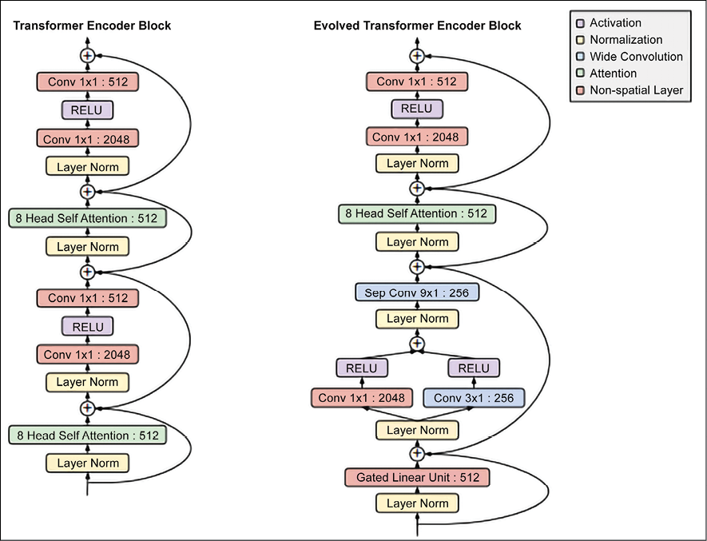

图 6.8:进化的变压器编码器模块，来源:https://arxiv.org/pdf/1901.11117.pdf

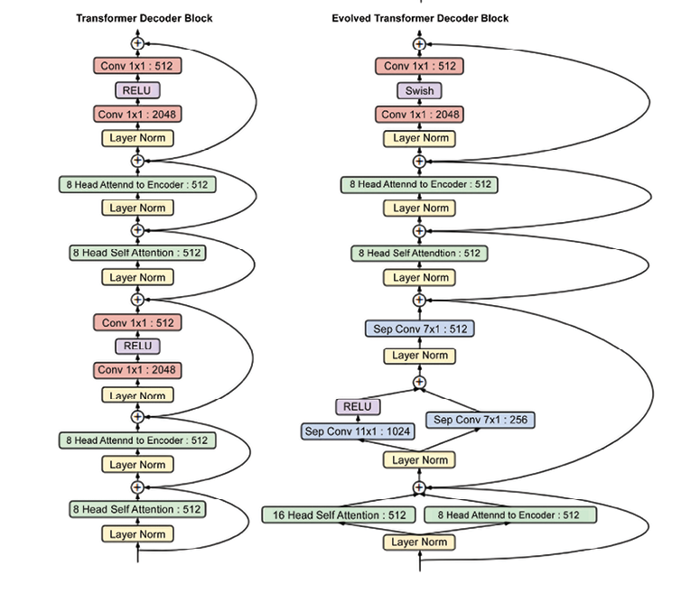

图 6.9:进化的变压器解码器模块，来源:https://arxiv.org/pdf/1901.11117.pdf

## london academy of music and dramatic art 伦敦音乐戏剧艺术学院

LaMDA 是 2022 年由谷歌的研究人员在 *LaMDA:对话应用的语言模型*由 Romal Thoppilan 等人、[https://arxiv.org/abs/2201.08239](https://arxiv.org/abs/2201.08239)推出的模型。它是一系列基于转换器的神经语言模型，专门用于对话。让我们看看关键的直觉:

*   在预训练阶段，LaMDA 使用了来自公共对话数据和其他公共网络文档的 1.56 万亿单词的数据集，比之前用于 LLM 的数据集多了近 40 倍。在将数据集标记为 2.81 万亿个句子片段标记后，预训练预测句子中的每一个下一个标记，给定之前的标记。
*   在微调阶段，LaMDA 执行一系列生成任务，以生成对给定上下文的自然语言响应，以及关于响应是否安全和高质量的分类任务。生成和分类相结合提供了最终答案(见*图 6.10* )。
*   LaMDA defines a robust set of metrics for quality, safety, and groundedness:
    *   质量:这个指标被分解为三个维度，**敏感性、特异性、趣味性** ( **SSI** )。敏感性考虑的是模型是否产生在对话环境中有意义的响应。特异性判断响应是否特定于前面的对话上下文，而不是适用于大多数上下文的通用响应。趣味性衡量的是模型产生的反应是否也是有见地的、出乎意料的或机智的。
    *   安全:考虑如何避免任何对用户造成伤害风险的意外结果，并避免强化不公平的偏见。
    *   背景性:考虑可信的信息，但是，与权威外部来源支持的信息相矛盾。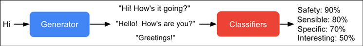

    图 6.10: LaMDA 生成一个响应候选项，然后对其进行评分。来源:https://ai . Google blog . com/2022/01/lamda-toward-safe-ground-and-high . XHTML

LaMDA 展示的结果非常接近人类大脑的结果。根据谷歌([https://ai . Google blog . com/2022/01/lamda-forward-safe-ground-and-high . XHTML](https://ai.googleblog.com/2022/01/lamda-towards-safe-grounded-and-high.xhtml))的数据，LaMDA 在每个维度和所有模型尺寸上都明显优于训练前的模型。质量度量(敏感性、特异性和趣味性)通常随着模型参数的数量而提高，有或没有微调。安全性似乎并不仅仅从模型缩放中受益，但通过微调确实有所改善。随着模型规模的增加，根植性得到改善，这可能是因为更大的模型有更大的能力来记忆不常见的知识，但是微调允许模型访问外部知识源，并有效地将记忆知识的一些负载转移到外部知识源。通过微调，可以缩小与人类水平的质量差距，尽管模型性能在安全性和实用性方面仍低于人类水平:

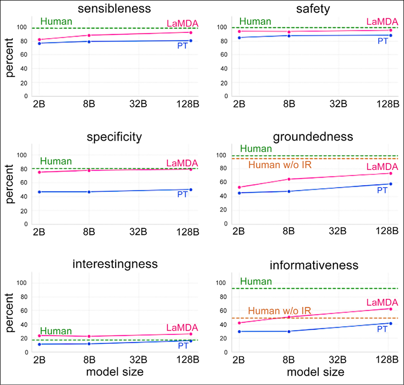

图 6.11: LaMDA 性能——来源:https://ai . Google blog . com/2022/01/LaMDA-forward-safe-ground-and-high . XHTML

## 开关变压器

开关变压器是 2021 年由谷歌的研究人员在威廉·费杜斯、巴雷特·佐夫和诺姆·沙泽尔的《开关变压器:用简单有效的稀疏性扩展到万亿参数模型》中介绍的模型，在[https://arxiv.org/abs/2101.03961](https://arxiv.org/abs/2101.03961)中介绍。

让我们看看关键的直觉:

*   The Switch Transformer was trained from 7 billion to 1.6 trillion parameters. As discussed, a typical transformer is a deep stack of multi-headed self-attention layers, and at the end of each layer, there’s an FFN aggregating the outputs coming from its multiple heads. The Switch Transformer replaces this single FFN with multiple FFNs and calls them “experts.” On each forward pass, at each layer, for each token at the input, the model activates exactly one expert: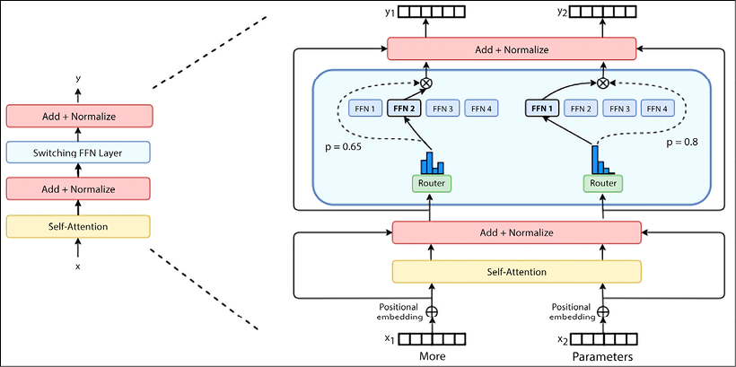

    图 6.12:具有多路由 FFN 的开关变压器–变压器中的密集 FFN 层被稀疏的开关 FFN 层(浅蓝色)取代。资料来源:https://arxiv.org/pdf/2101.03961.pdf

*   Switch-Base(70 亿个参数)和 Switch-Large(260 亿个参数)在语言建模、分类、共指消解、问题回答和摘要等任务上优于 T5-Base(2 亿个参数)和 T5-Large(7 亿个参数)。

在[https://keras . io/examples/NLP/text _ class ification _ with _ Switch _ Transformer/](https://keras.io/examples/nlp/text_classification_with_switch_transformer/)上可以找到开关变压器的示例实现。

## 重新流行

**RETRO**(**Retrieval-Enhanced Transformer**)是 DeepMind 于 2022 年推出的 retrieval-enhanced 自回归语言模型*通过从 Sebastian Borgeaud 等人的*万亿令牌中检索来改进语言模型[https://arxiv.org/pdf/2112.04426/](https://arxiv.org/pdf/2112.04426/)。让我们看看关键的直觉:

*   事实证明，缩放 LLM 中的参数数量是提高结果质量的一种方式。然而，这种方法是不可持续的，因为它在计算上是昂贵的。
*   RETRO 将一个检索数据库**与一个混合架构中的转换器** ( **数据库**)耦合在一起。其思想是首先用最近邻算法搜索存储在检索数据库中的预先计算的 BERT 嵌入。然后，这些嵌入被用作转换器编码器的输入。
*   检索和转换器的结合允许 RETRO(从 1 . 5 亿到 70 亿个非嵌入参数)节省 LLM 使用的参数数量。

例如，考虑样本查询“赢得了 2021 年女子美国公开赛”和*图 6.13* ，其中缓存的 BERT 嵌入被传递到 transformer 编码器以获得最终结果:

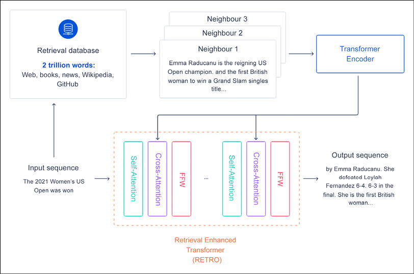

图 6.13:检索增强型变压器(复古)的高级概述。来源:https://deep mind . com/research/publications/2021/通过从数万亿令牌中检索来改进语言模型

## 路径和棕榈

Google Research 宣布了 Pathways([https://blog . Google/technology/ai/introducing-Pathways-next-generation-ai-architecture/](https://blog.google/technology/ai/introducing-pathways-next-generation-ai-architecture/))，这是一个可以跨领域和任务通用化同时又非常高效的单一模型。然后，谷歌推出了 **Pathways 语言模型** ( **PaLM** )，这是一个 5400 亿参数的密集解码器专用变压器模型，使我们能够跨多个 TPU v4 pod 高效地训练单个模型。谷歌在数百项语言理解和生成任务上评估了 PaLM，发现它在大多数任务上实现了最先进的性能，在许多情况下大幅领先(见[https://ai . Google blog . com/2022/04/pathways-language-model-PaLM-scaling-to . XHTML？m=1](https://ai.googleblog.com/2022/04/pathways-language-model-palm-scaling-to.xhtml?m=1) )。

# 履行

在这一部分，我们将使用变形金刚完成几个任务。

## 转换器引用实现:翻译的一个例子

在这一节中，我们将简要回顾在[https://www.tensorflow.org/text/tutorials/transformer](https://www.tensorflow.org/text/tutorials/transformer)提供的 transformer 参考实现，具体来说，我们将利用这个机会在 Google Colab 中运行代码。

不是每个人都知道训练一个变形金刚需要多少个 GPU。幸运的是，您可以在[https://colab . research . Google . com/github/tensor flow/text/blob/master/docs/tutorials/transformer . ipynb](https://colab.research.google.com/github/tensorflow/text/blob/master/docs/tutorials/transformer.ipynb)免费使用可用的资源。

请注意，除非您需要实现一些非常具体的定制，或者您对核心研究感兴趣，否则从头实现 transformers 可能不是最佳选择。如果您对学习内部知识不感兴趣，那么您可以跳到下一节。我们的教程是在 Creative Commons Attribution 4.0 许可下授权的，代码示例是在 Apache 2.0 许可下授权的。我们要执行的具体任务是将葡萄牙语翻译成英语。让我们一步一步地看看代码:

1.  首先，让我们安装数据集并导入正确的库。请注意，在线提供的 Colab 显然缺少了行`import tensorflow_text`，但是在这里添加了:

    ```
    !pip install tensorflow_datasets

    !pip install -U 'tensorflow-text==2.8.*'

    import logging

    import time

    import numpy as np

    import matplotlib.pyplot as plt

    import tensorflow_text

    import tensorflow_datasets as tfds

    import tensorflow as tf

    logging.getLogger('tensorflow').setLevel(logging.ERROR)  # suppress warnings 
    ```

2.  然后，加载葡萄牙语到英语的数据集:

    ```
    examples, metadata = tfds.load('ted_hrlr_translate/pt_to_en', with_info=True,

                                   as_supervised=True)

    train_examples, val_examples = examples['train'], examples['validation'] 
    ```

3.  现在，让我们将文本转换成令牌 id 序列，它们被用作嵌入的索引:

    ```
    model_name = 'ted_hrlr_translate_pt_en_converter'

    tf.keras.utils.get_file(

        f'{model_name}.zip',

        f'https://storage.googleapis.com/download.tensorflow.org/models/{model_name}.zip',

        cache_dir='.', cache_subdir='', extract=True

    )

    tokenizers = tf.saved_model.load(model_name) 
    ```

4.  我们来看看标记化 id 和标记化单词:

    ```
    for pt_examples, en_examples in train_examples.batch(3).take(1):

      print('> Examples in Portuguese:')

    for en in en_examples.numpy():

      print(en.decode('utf-8')) 
    ```

    ```
    and when you improve searchability , you actually take away the one advantage of print , which is serendipity .

    but what if it were active ?

    but they did n't test for curiosity . 
    ```

    ```
    encoded = tokenizers.en.tokenize(en_examples)

    for row in encoded.to_list():

      print(row) 
    ```

    ```
    [2, 72, 117, 79, 1259, 1491, 2362, 13, 79, 150, 184, 311, 71, 103, 2308, 74, 2679, 13, 148, 80, 55, 4840, 1434, 2423, 540, 15, 3]

    [2, 87, 90, 107, 76, 129, 1852, 30, 3]

    [2, 87, 83, 149, 50, 9, 56, 664, 85, 2512, 15, 3] 
    ```

    ```
    round_trip = tokenizers.en.detokenize(encoded)

    for line in round_trip.numpy():

      print(line.decode('utf-8')) 
    ```

    ```
    and when you improve searchability , you actually take away the one advantage of print , which is serendipity .

    but what if it were active ?

    but they did n ' t test for curiosity . 
    ```

1.  现在让我们创建一个输入管道。首先，我们定义一个函数来丢弃比`MAX_TOKENS`长的例子。其次，我们定义了一个函数来标记原始文本的批次。第三，我们创建批次:

    ```
    MAX_TOKENS=128

    def filter_max_tokens(pt, en):

      num_tokens = tf.maximum(tf.shape(pt)[1],tf.shape(en)[1])

      return num_tokens < MAX_TOKENS

    def tokenize_pairs(pt, en):

        pt = tokenizers.pt.tokenize(pt)

        # Convert from ragged to dense, padding with zeros.

        pt = pt.to_tensor()

        en = tokenizers.en.tokenize(en)

        # Convert from ragged to dense, padding with zeros.

        en = en.to_tensor()

        return pt, en

    BUFFER_SIZE = 20000

    BATCH_SIZE = 64

    def make_batches(ds):

      return (

          ds

          .cache()

          .shuffle(BUFFER_SIZE)

          .batch(BATCH_SIZE)

          .map(tokenize_pairs, num_parallel_calls=tf.data.AUTOTUNE)

          .filter(filter_max_tokens)

          .prefetch(tf.data.AUTOTUNE))

    train_batches = make_batches(train_examples)

    val_batches = make_batches(val_examples) 
    ```

2.  现在我们添加位置编码，强制记号基于它们在句子中的意义和位置的相似性彼此更接近，在 d 维嵌入空间:

    ```
    def get_angles(pos, i, d_model):

      angle_rates = 1 / np.power(10000, (2 * (i//2)) / np.float32(d_model))

      return pos * angle_rates

    def positional_encoding(position, d_model):

      angle_rads = get_angles(np.arange(position)[:, np.newaxis],

                              np.arange(d_model)[np.newaxis, :],

                              d_model)

      # apply sin to even indices in the array; 2i

      angle_rads[:, 0::2] = np.sin(angle_rads[:, 0::2])

      # apply cos to odd indices in the array; 2i+1

      angle_rads[:, 1::2] = np.cos(angle_rads[:, 1::2])

      pos_encoding = angle_rads[np.newaxis, ...]

      return tf.cast(pos_encoding, dtype=tf.float32) 
    ```

3.  现在让我们来关注一下屏蔽过程。前瞻掩码用于屏蔽序列中的未来标记，该掩码指示哪些条目不应被使用。例如，为了预测第三个令牌，将只使用第一和第二个令牌，而为了预测第四个令牌，将只使用第一、第二和第三个令牌，依此类推:

    ```
    def create_padding_mask(seq):

      seq = tf.cast(tf.math.equal(seq, 0), tf.float32)

      # add extra dimensions to add the padding

      # to the attention logits.

      return seq[:, tf.newaxis, tf.newaxis, :]  # (batch_size, 1, 1, seq_len)

    def create_look_ahead_mask(size):

      mask = 1 - tf.linalg.band_part(tf.ones((size, size)), -1, 0)

      return mask  # (seq_len, seq_len) 
    ```

4.  我们越来越接近，越来越接近变形金刚的本质。让我们将注意力函数定义为缩放的点积:

    ```
    def scaled_dot_product_attention(q, k, v, mask):

      """Calculate the attention weights.

      q, k, v must have matching leading dimensions.

      k, v must have matching penultimate dimension, i.e.: seq_len_k = seq_len_v.

      The mask has different shapes depending on its type(padding or look ahead)

      but it must be broadcastable for addition.

      Args:

        q: query shape == (..., seq_len_q, depth)

        k: key shape == (..., seq_len_k, depth)

        v: value shape == (..., seq_len_v, depth_v)

        mask: Float tensor with shape broadcastable

              to (..., seq_len_q, seq_len_k). Defaults to None.

      Returns:

        output, attention_weights

      """

      matmul_qk = tf.matmul(q, k, transpose_b=True)  # (..., seq_len_q, seq_len_k)

      # scale matmul_qk

      dk = tf.cast(tf.shape(k)[-1], tf.float32)

      scaled_attention_logits = matmul_qk / tf.math.sqrt(dk)

      # add the mask to the scaled tensor.

      if mask is not None:

        scaled_attention_logits += (mask * -1e9)

      # softmax is normalized on the last axis (seq_len_k) so that the scores

      # add up to 1.

      attention_weights = tf.nn.softmax(scaled_attention_logits, axis=-1)  # (..., seq_len_q, seq_len_k)

      output = tf.matmul(attention_weights, v)  # (..., seq_len_q, depth_v)

      return output, attention_weights 
    ```

5.  Now that the attention is defined, we need to implement the multi-head mechanism. There are three parts: linear layers, scaled dot-product attention, and the final linear layer (see *Figure 6.14*):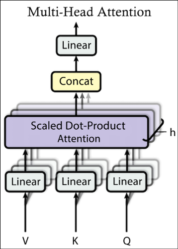

    图 6.14:多头关注

    ```
    class MultiHeadAttention(tf.keras.layers.Layer):

      def __init__(self,*, d_model, num_heads):

        super(MultiHeadAttention, self).__init__()

        self.num_heads = num_heads

        self.d_model = d_model

        assert d_model % self.num_heads == 0

        self.depth = d_model // self.num_heads

        self.wq = tf.keras.layers.Dense(d_model)

        self.wk = tf.keras.layers.Dense(d_model)

        self.wv = tf.keras.layers.Dense(d_model)

        self.dense = tf.keras.layers.Dense(d_model)

      def split_heads(self, x, batch_size):

        """Split the last dimension into (num_heads, depth).

        Transpose the result such that the shape is (batch_size, num_heads, seq_len, depth)

        """

        x = tf.reshape(x, (batch_size, -1, self.num_heads, self.depth))

        return tf.transpose(x, perm=[0, 2, 1, 3])

      def call(self, v, k, q, mask):

        batch_size = tf.shape(q)[0]

        q = self.wq(q)  # (batch_size, seq_len, d_model)

        k = self.wk(k)  # (batch_size, seq_len, d_model)

        v = self.wv(v)  # (batch_size, seq_len, d_model)

        q = self.split_heads(q, batch_size)  # (batch_size, num_heads, seq_len_q, depth)

        k = self.split_heads(k, batch_size)  # (batch_size, num_heads, seq_len_k, depth)

        v = self.split_heads(v, batch_size)  # (batch_size, num_heads, seq_len_v, depth)

        # scaled_attention.shape == (batch_size, num_heads, seq_len_q, depth)

        # attention_weights.shape == (batch_size, num_heads, seq_len_q, seq_len_k)

        scaled_attention, attention_weights = scaled_dot_product_attention(

            q, k, v, mask)

        scaled_attention = tf.transpose(scaled_attention, perm=[0, 2, 1, 3])  # (batch_size, seq_len_q, num_heads, depth)

        concat_attention = tf.reshape(scaled_attention,

                                      (batch_size, -1, self.d_model))  # (batch_size, seq_len_q, d_model)

        output = self.dense(concat_attention)  # (batch_size, seq_len_q, d_model)

        return output, attention_weights 
    ```

1.  现在，我们可以定义一个点式前馈网络，它由两个完全连接的层组成，中间有一个 ReLU 激活:

    ```
    def point_wise_feed_forward_network(d_model, dff):

     return tf.keras.Sequential([

         tf.keras.layers.Dense(dff, activation='relu'),  # (batch_size, seq_len, dff)

         tf.keras.layers.Dense(d_model)  # (batch_size, seq_len, d_model)

     ]) 
    ```

2.  我们现在可以专注于定义编码器和解码器部分，如图 6.15 中的*所示。请记住，传统的变压器通过 *N* 个编码器层获取输入句子，而解码器使用编码器输出和自己的输入(自我注意)来预测下一个单词。每个编码器层具有由多头注意力(具有填充掩模)构成的子层，然后是逐点前馈网络。每个子层使用一个残差连接来解决渐变消失的问题，并使用一个归一化层:

    ```
    class EncoderLayer(tf.keras.layers.Layer):

      def __init__(self,*, d_model, num_heads, dff, rate=0.1):

        super(EncoderLayer, self).__init__()

        self.mha = MultiHeadAttention(d_model=d_model, num_heads=num_heads)

        self.ffn = point_wise_feed_forward_network(d_model, dff)

        self.layernorm1 = tf.keras.layers.LayerNormalization(epsilon=1e-6)

        self.layernorm2 = tf.keras.layers.LayerNormalization(epsilon=1e-6)

        self.dropout1 = tf.keras.layers.Dropout(rate)

        self.dropout2 = tf.keras.layers.Dropout(rate)

      def call(self, x, training, mask):

        attn_output, _ = self.mha(x, x, x, mask)  # (batch_size, input_seq_len, d_model)

        attn_output = self.dropout1(attn_output, training=training)

        out1 = self.layernorm1(x + attn_output)  # (batch_size, input_seq_len, d_model)

        ffn_output = self.ffn(out1)  # (batch_size, input_seq_len, d_model)

        ffn_output = self.dropout2(ffn_output, training=training)

        out2 = self.layernorm2(out1 + ffn_output)  # (batch_size, input_seq_len, d_model)

        return out2 
    ```* 
3.  每个解码器层由子层组成。首先，一个掩蔽的多头注意力(用一个前瞻掩模和填充掩模)。然后，多头注意力(带有填充遮罩)、V(值)和 K(关键点)接收编码器输出作为输入。Q (query)接收来自掩蔽多头注意子层的输出，最后是逐点前馈网络:

    ```
    class DecoderLayer(tf.keras.layers.Layer):

      def __init__(self,*, d_model, num_heads, dff, rate=0.1):

        super(DecoderLayer, self).__init__()

        self.mha1 = MultiHeadAttention(d_model=d_model, num_heads=num_heads)

        self.mha2 = MultiHeadAttention(d_model=d_model, num_heads=num_heads)

        self.ffn = point_wise_feed_forward_network(d_model, dff)

        self.layernorm1 = tf.keras.layers.LayerNormalization(epsilon=1e-6)

        self.layernorm2 = tf.keras.layers.LayerNormalization(epsilon=1e-6)

        self.layernorm3 = tf.keras.layers.LayerNormalization(epsilon=1e-6)

        self.dropout1 = tf.keras.layers.Dropout(rate)

        self.dropout2 = tf.keras.layers.Dropout(rate)

        self.dropout3 = tf.keras.layers.Dropout(rate)

      def call(self, x, enc_output, training,

               look_ahead_mask, padding_mask):

        # enc_output.shape == (batch_size, input_seq_len, d_model)

        attn1, attn_weights_block1 = self.mha1(x, x, x, look_ahead_mask)  # (batch_size, target_seq_len, d_model)

        attn1 = self.dropout1(attn1, training=training)

        out1 = self.layernorm1(attn1 + x)

        attn2, attn_weights_block2 = self.mha2(

            enc_output, enc_output, out1, padding_mask)  # (batch_size, target_seq_len, d_model)

        attn2 = self.dropout2(attn2, training=training)

        out2 = self.layernorm2(attn2 + out1)  # (batch_size, target_seq_len, d_model)

        ffn_output = self.ffn(out2)  # (batch_size, target_seq_len, d_model)

        ffn_output = self.dropout3(ffn_output, training=training)

        out3 = self.layernorm3(ffn_output + out2)  # (batch_size, target_seq_len, d_model)

        return out3, attn_weights_block1, attn_weights_block2 
    ```

4.  现在我们已经定义了编码器层，我们可以使用它来定义适当的编码器。这个由三个阶段组成:输入嵌入、位置编码和 *N* 编码层:

    ```
    class Encoder(tf.keras.layers.Layer):

      def __init__(self,*, num_layers, d_model, num_heads, dff, input_vocab_size,

                   rate=0.1):

        super(Encoder, self).__init__()

        self.d_model = d_model

        self.num_layers = num_layers

        self.embedding = tf.keras.layers.Embedding(input_vocab_size, d_model)

        self.pos_encoding = positional_encoding(MAX_TOKENS, self.d_model)

        self.enc_layers = [

            EncoderLayer(d_model=d_model, num_heads=num_heads, dff=dff, rate=rate)

            for _ in range(num_layers)]

        self.dropout = tf.keras.layers.Dropout(rate)

      def call(self, x, training, mask):

        seq_len = tf.shape(x)[1]

        # adding embedding and position encoding.

        x = self.embedding(x)  # (batch_size, input_seq_len, d_model)

        x *= tf.math.sqrt(tf.cast(self.d_model, tf.float32))

        x += self.pos_encoding[:, :seq_len, :]

        x = self.dropout(x, training=training)

        for i in range(self.num_layers):

          x = self.enc_layers[i](x, training, mask)

        return x  # (batch_size, input_seq_len, d_model) 
    ```

5.  我们现在可以把注意力集中在解码器本身。它由输出嵌入、位置编码和 *N* 解码层:

    ```
    class Decoder(tf.keras.layers.Layer):

      def __init__(self,*, num_layers, d_model, num_heads, dff, target_vocab_size,

                   rate=0.1):

        super(Decoder, self).__init__()

        self.d_model = d_model

        self.num_layers = num_layers

        self.embedding = tf.keras.layers.Embedding(target_vocab_size, d_model)

        self.pos_encoding = positional_encoding(MAX_TOKENS, d_model)

        self.dec_layers = [

            DecoderLayer(d_model=d_model, num_heads=num_heads, dff=dff, rate=rate)

            for _ in range(num_layers)]

        self.dropout = tf.keras.layers.Dropout(rate)

      def call(self, x, enc_output, training,

               look_ahead_mask, padding_mask):

        seq_len = tf.shape(x)[1]

        attention_weights = {}

        x = self.embedding(x)  # (batch_size, target_seq_len, d_model)

        x *= tf.math.sqrt(tf.cast(self.d_model, tf.float32))

        x += self.pos_encoding[:, :seq_len, :]

        x = self.dropout(x, training=training)

        for i in range(self.num_layers):

          x, block1, block2 = self.dec_layers[i](x, enc_output, training,

                                                 look_ahead_mask, padding_mask)

          attention_weights[f'decoder_layer{i+1}_block1'] = block1

          attention_weights[f'decoder_layer{i+1}_block2'] = block2

        # x.shape == (batch_size, target_seq_len, d_model)

        return x, attention_weights 
    ```

6.  现在我们已经定义了编码器和解码器，我们现在可以把注意力转向变压器本身，它由编码器、解码器和最终的线性层组成(见*图 6.15* ):

    ```
    class Transformer(tf.keras.Model):

      def __init__(self,*, num_layers, d_model, num_heads, dff, input_vocab_size,

                   target_vocab_size, rate=0.1):

        super().__init__()

        self.encoder = Encoder(num_layers=num_layers, d_model=d_model,

                               num_heads=num_heads, dff=dff,

                               input_vocab_size=input_vocab_size, rate=rate)

        self.decoder = Decoder(num_layers=num_layers, d_model=d_model,

                               num_heads=num_heads, dff=dff,

                               target_vocab_size=target_vocab_size, rate=rate)

        self.final_layer = tf.keras.layers.Dense(target_vocab_size)

      def call(self, inputs, training):

        # Keras models prefer if you pass all your inputs in the first argument

        inp, tar = inputs

        enc_padding_mask, look_ahead_mask, dec_padding_mask = self.create_masks(inp, tar)

        enc_output = self.encoder(inp, training, enc_padding_mask)  # (batch_size, inp_seq_len, d_model)

        # dec_output.shape == (batch_size, tar_seq_len, d_model)

        dec_output, attention_weights = self.decoder(

            tar, enc_output, training, look_ahead_mask, dec_padding_mask)

        final_output = self.final_layer(dec_output)  # (batch_size, tar_seq_len, target_vocab_size)

        return final_output, attention_weights

      def create_masks(self, inp, tar):

        # Encoder padding mask

        enc_padding_mask = create_padding_mask(inp)

        # Used in the 2nd attention block in the decoder.

        # This padding mask is used to mask the encoder outputs.

        dec_padding_mask = create_padding_mask(inp)

        # Used in the 1st attention block in the decoder.

        # It is used to pad and mask future tokens in the input received by

        # the decoder.

        look_ahead_mask = create_look_ahead_mask(tf.shape(tar)[1])

        dec_target_padding_mask = create_padding_mask(tar)

        look_ahead_mask = tf.maximum(dec_target_padding_mask, look_ahead_mask)

        return enc_padding_mask, look_ahead_mask, dec_padding_mask 
    ```

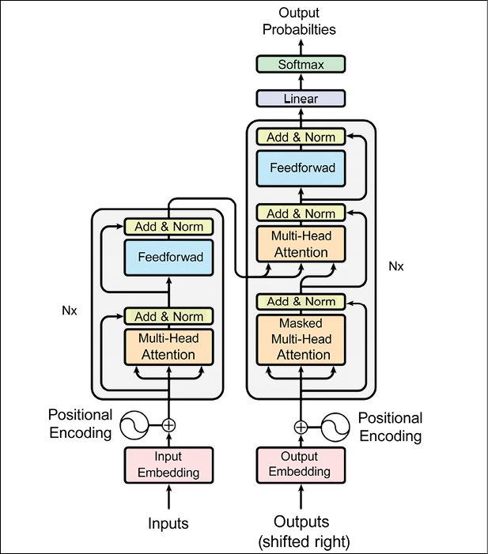

图 6.15:传统变压器

1.  我们差不多完成了。我们只需要定义超参数和优化器，使用与原始论文完全相同的设置，以及损失函数:

    ```
    num_layers = 4

    d_model = 128

    dff = 512

    num_heads = 8

    dropout_rate = 0.1

    class CustomSchedule(tf.keras.optimizers.schedules.LearningRateSchedule):

      def __init__(self, d_model, warmup_steps=4000):

        super(CustomSchedule, self).__init__()

        self.d_model = d_model

        self.d_model = tf.cast(self.d_model, tf.float32)

        self.warmup_steps = warmup_steps

      def __call__(self, step):

        arg1 = tf.math.rsqrt(step)

        arg2 = step * (self.warmup_steps ** -1.5)

        return tf.math.rsqrt(self.d_model) * tf.math.minimum(arg1, arg2)

    learning_rate = CustomSchedule(d_model)

    optimizer = tf.keras.optimizers.Adam(learning_rate, beta_1=0.9, beta_2=0.98,

                                         epsilon=1e-9)

    def loss_function(real, pred):

      mask = tf.math.logical_not(tf.math.equal(real, 0))

      loss_ = loss_object(real, pred)

      mask = tf.cast(mask, dtype=loss_.dtype)

      loss_ *= mask

      return tf.reduce_sum(loss_)/tf.reduce_sum(mask)

    def accuracy_function(real, pred):

      accuracies = tf.equal(real, tf.argmax(pred, axis=2))

      mask = tf.math.logical_not(tf.math.equal(real, 0))

      accuracies = tf.math.logical_and(mask, accuracies)

      accuracies = tf.cast(accuracies, dtype=tf.float32)

      mask = tf.cast(mask, dtype=tf.float32)

      return tf.reduce_sum(accuracies)/tf.reduce_sum(mask)

    train_loss = tf.keras.metrics.Mean(name='train_loss')

    train_accuracy = tf.keras.metrics.Mean(name='train_accuracy') 
    ```

2.  是时候定义变压器了。我们来看看代码:

    ```
    transformer = Transformer(

        num_layers=num_layers,

        d_model=d_model,

        num_heads=num_heads,

        dff=dff,

        input_vocab_size=tokenizers.pt.get_vocab_size().numpy(),

        target_vocab_size=tokenizers.en.get_vocab_size().numpy(),

        rate=dropout_rate) 
    ```

3.  让我们用下面的代码定义检查点:

    ```
    checkpoint_path = './checkpoints/train'

    ckpt = tf.train.Checkpoint(transformer=transformer,

                               optimizer=optimizer)

    ckpt_manager = tf.train.CheckpointManager(ckpt, checkpoint_path, max_to_keep=5)

    # if a checkpoint exists, restore the latest checkpoint.

    if ckpt_manager.latest_checkpoint:

      ckpt.restore(ckpt_manager.latest_checkpoint)

      print('Latest checkpoint restored!!') 
    ```

4.  Remember that the transformer is autoregressive. The current output is used to predict what will happen next. We use a look-ahead mask, to prevent the model from peeking at the expected output. We are now ready to define `train_step`:

    ```
    train_step_signature = [

        tf.TensorSpec(shape=(None, None), dtype=tf.int64),

        tf.TensorSpec(shape=(None, None), dtype=tf.int64),

    ]

    @tf.function(input_signature=train_step_signature)

    def train_step(inp, tar):

      tar_inp = tar[:, :-1]

      tar_real = tar[:, 1:]

      with tf.GradientTape() as tape:

        predictions, _ = transformer([inp, tar_inp],

                                     training = True)

        loss = loss_function(tar_real, predictions)

      gradients = tape.gradient(loss, transformer.trainable_variables)

      optimizer.apply_gradients(zip(gradients, transformer.trainable_variables))

      train_loss(loss)

      train_accuracy(accuracy_function(tar_real, predictions))

    EPOCHS = 20

    for epoch in range(EPOCHS):

      start = time.time()

      train_loss.reset_states()

      train_accuracy.reset_states()

      # inp -> portuguese, tar -> english

      for (batch, (inp, tar)) in enumerate(train_batches):

        train_step(inp, tar)

        if batch % 50 == 0:

          print(f'Epoch {epoch + 1} Batch {batch} Loss {train_loss.result():.4f} Accuracy {train_accuracy.result():.4f}')

      if (epoch + 1) % 5 == 0:

        ckpt_save_path = ckpt_manager.save()

        print(f'Saving checkpoint for epoch {epoch+1} at {ckpt_save_path}')

      print(f'Epoch {epoch + 1} Loss {train_loss.result():.4f} Accuracy {train_accuracy.result():.4f}')

      print(f'Time taken for 1 epoch: {time.time() - start:.2f} secs\n') 
    ```

    在 Colab 中运行训练步骤后，我们得到以下情况:

    ```
    Epoch 20 Loss 1.5030 Accuracy 0.6720

    Time taken for 1 epoch: 169.01 secs 
    ```

1.  我们现在准备好进行翻译。以下步骤用于翻译:

    ```
    class Translator(tf.Module):

      def __init__(self, tokenizers, transformer):

        self.tokenizers = tokenizers

        self.transformer = transformer

      def __call__(self, sentence, max_length=MAX_TOKENS):

        # input sentence is portuguese, hence adding the start and end token

        assert isinstance(sentence, tf.Tensor)

        if len(sentence.shape) == 0:

          sentence = sentence[tf.newaxis]

        sentence = self.tokenizers.pt.tokenize(sentence).to_tensor()

        encoder_input = sentence

        # As the output language is english, initialize the output with the

        # english start token.

        start_end = self.tokenizers.en.tokenize([''])[0]

        start = start_end[0][tf.newaxis]

        end = start_end[1][tf.newaxis]

        # 'tf.TensorArray' is required here (instead of a python list) so that the

        # dynamic-loop can be traced by 'tf.function'.

        output_array = tf.TensorArray(dtype=tf.int64, size=0, dynamic_size=True)

        output_array = output_array.write(0, start)

        for i in tf.range(max_length):

          output = tf.transpose(output_array.stack())

          predictions, _ = self.transformer([encoder_input, output], training=False)

          # select the last token from the seq_len dimension

          predictions = predictions[:, -1:, :]  # (batch_size, 1, vocab_size)

          predicted_id = tf.argmax(predictions, axis=-1)

          # concatentate the predicted_id to the output which is given to the decoder

          # as its input.

          output_array = output_array.write(i+1, predicted_id[0])

          if predicted_id == end:

            break

        output = tf.transpose(output_array.stack())

        # output.shape (1, tokens)

        text = tokenizers.en.detokenize(output)[0]  # shape: ()

        tokens = tokenizers.en.lookup(output)[0]

        # 'tf.function' prevents us from using the attention_weights that were

        # calculated on the last iteration of the loop. So recalculate them outside

        # the loop.

        _, attention_weights = self.transformer([encoder_input, output[:,:-1]], training=False)

        return text, tokens, attention_weights 
    ```

    1.  使用葡萄牙语标记器(`tokenizers.pt`)对输入句子进行编码。
    2.  解码器输入被初始化为[START]标记。
    3.  计算填充掩码和前瞻掩码。
    4.  然后，解码器通过查看编码器输出和自己的输出(自我关注)来输出预测。
    5.  将预测的令牌连接到解码器输入，并将其传递给解码器:
2.  Let’s call the translator on a sample sentence with this code snippet:

    ```
    translator = Translator(tokenizers, transformer)

    def print_translation(sentence, tokens, ground_truth):

      print(f'{"Input:":15s}: {sentence}')

      print(f'{"Prediction":15s}: {tokens.numpy().decode("utf-8")}')

      print(f'{"Ground truth":15s}: {ground_truth}')

    sentence = 'os meus vizinhos ouviram sobre esta ideia.'

    ground_truth = 'and my neighboring homes heard about this idea .'

    translated_text, translated_tokens, attention_weights = translator(

        tf.constant(sentence))

    print_translation(sentence, translated_text, ground_truth) 
    ```

    得到的结果是:

    ```
    Input:         : os meus vizinhos ouviram sobre esta ideia.

    Prediction     : my neighbors have heard about this idea .

    Ground truth   : and my neighboring homes heard about this idea . 
    ```

在这个详细的分析中，我们讨论了如何在考虑位置编码、多头注意力和掩蔽的情况下实现传统的转换器。被分析的代码位于[https://www.tensorflow.org/text/tutorials/transformer](https://www.tensorflow.org/text/tutorials/transformer)。

接下来，我们将讨论如何利用高级库来使用转换器。

## 拥抱脸

如前所述，从头实现 transformers 可能不是最佳选择，除非您需要实现一些非常具体的定制，或者您对核心研究感兴趣。如果您想要理解一个 transformer 架构的内部细节，或者修改 transformer 架构以产生一个新的变体，这是非常有用的。现在有非常好的库提供高质量的解决方案。其中之一是拥抱脸，它提供了一些有效的工具。拥抱脸是围绕其开源变形金刚库商业化的想法建立的。让我们看看为什么图书馆变得如此受欢迎:

*   拥抱脸提供了一个通用的 API 来处理许多变压器架构。
*   它不仅提供了基础模型，还提供了具有不同类型“头部”的模型来处理特定任务(例如，对于 BERT 架构，它提供了`TFBertModel`，对于情感分析之类的任务提供了`TFBertForSequenceClassification`，对于命名实体识别之类的任务提供了`TFBertForTokenClassification`，对于 Q 和 A 提供了`TFBertForQuestionAnswering`，等等)。
*   通过使用这里提供的预训练权重，例如使用`TFBertForPreTraining`，您还可以非常容易地为特定任务创建自己的网络。
*   除了下一小节中的`pipeline()`方法，我们还可以以常规方式定义一个模型，并使用`fit()`对其进行训练，使用`predict()`对其进行推论，就像普通的 TF 模型一样(PyTorch 也有训练器接口)。我们将在本章后面看到一个例子。

现在，让我们来看一些如何使用拥抱脸的例子。

### 生成文本

在本节中，我们将使用 GPT-2 进行自然语言生成，这是一个产生自然语言输出的软件过程。让我们从安装拥抱人脸库开始:

1.  第一步是创建一个专用的虚拟环境，我们可以在其中安装 transformer 库。在我的例子中，我使用 TensorFlow 2.0 的库:

    ```
    python -m venv .env

    source .env/bin/activate

    pip install transformers[tf-cpu] 
    ```

2.  Then let’s verify that everything is working correctly by downloading a pretrained model used for sentiment analysis:

    ```
    python -c "from transformers import pipeline; print(pipeline('sentiment-analysis')('we love you'))" 
    ```

    由于预期的情绪应该是非常积极的，我们将看到如下内容:

    ```
    [{'label': 'POSITIVE', 'score': 0.9998704791069031}] 
    ```

1.  Now let’s focus on generating text with GPT-2:

    ```
    from transformers import pipeline

    generator = pipeline(task="text-generation") 
    ```

    您应该会看到如下所示的内容:

    ```
    No model was supplied, defaulted to gpt2 (https://huggingface.co/gpt2)

    Downloading: 100%|██████████████████████████████| 665/665 [00:00<00:00, 167kB/s]

    Downloading: 100%|███████████████████████████| 475M/475M [03:24<00:00, 2.44MB/s 
    ```

1.  让我们将一些文本传递给生成器，看看结果是什么。第一句摘自托尔金的著作，第二句摘自爱因斯坦的理论，第三句出自《哈利波特》:

    ```
    generator("Three Rings for the Elven-kings under the sky, Seven for the Dwarf-lords in their halls of stone") 
    ```

    ```
    Setting 'pad_token_id' to 50256 (first 'eos_token_id') to generate sequence

    [{'generated_text': 'Three Rings for the Elven-kings under the sky, Seven for the Dwarf-lords in their halls of stone and Eight for the Dwarves in their halls of rock! Three new Rings of the Elven-kings under the sky, Seven for'}] 
    ```

    ```
    generator ("The original theory of relativity is based upon the premise that all coordinate systems in relative uniform translatory motion to each other are equally valid and equivalent ") 
    ```

    ```
    Setting 'pad_token_id' to 50256 (first 'eos_token_id') to generate sequence

    [{'generated_text': 'The original theory of relativity is based upon the premise that all coordinate systems in relative uniform translatory motion to each other are equally valid and equivalent \xa0to one another. In other words, they can all converge, and therefore all the laws are valid'}] 
    ```

    ```
    generator ("It takes a great deal of bravery to stand up to our enemies") 
    ```

    ```
    Setting 'pad_token_id' to 50256 (first 'eos_token_id') to generate sequence

    [{'generated_text': 'It takes a great deal of bravery to stand up to our enemies that day. She still has a lot to learn from it, or it could take decades to do.\n\nWhile some braver men struggle, many are not as lucky'}] 
    ```

很容易，不是吗？

### 自动选择模型和自动模板化

拥抱脸在帮助开发者尽可能多地自动化步骤方面做得很好。让我们看一些例子:

1.  You can easily import a pretrained model among the several dozen available. A complete list of available models is here: [https://huggingface.co/docs/transformers/model_doc/auto](https://huggingface.co/docs/transformers/model_doc/auto):

    ```
    from transformers import TFAutoModelForSequenceClassification

    model = TFAutoModelForSequenceClassification.from_pretrained("distilbert-base-uncased") 
    ```

    ```
    Downloading: 100%|█████████████████████████████| 483/483 [00:00<00:00, 68.9kB/s]

    Downloading: 100%|███████████████████████████| 347M/347M [01:05<00:00, 5.59MB/s]

    … 
    ```

    您可能应该在下游任务中训练该模型，以使用它进行预测和推断。

1.  您可以使用`AutoTokenizer`将单词转换成模型使用的令牌:

    ```
    from transformers import AutoTokenizer

    tokenizer = AutoTokenizer.from_pretrained("bert-base-uncased")

    sequence = "The original theory of relativity is based upon the premise that all coordinate systems"

    print(tokenizer(sequence)) 
    ```

    ```
    {'input_ids': [101, 1996, 2434, 3399, 1997, 20805, 2003, 2241, 2588, 1996, 18458, 2008, 2035, 13530, 3001, 102], 'token_type_ids': [0, 0, 0, 0, 0, 0, 0, 0, 0, 0, 0, 0, 0, 0, 0, 0], 'attention_mask': [1, 1, 1, 1, 1, 1, 1, 1, 1, 1, 1, 1, 1, 1, 1, 1]} 
    ```

### 命名实体识别

命名实体识别 ( **NER** )是一个经典的自然语言处理任务。根据维基百科，命名实体识别(也称为(命名)实体识别、实体分块和实体提取)是信息提取的子任务，旨在定位非结构化文本中提到的命名实体并将其分类到预定义的类别中，如人名、组织、位置、医疗代码、时间表达式、数量、货币值和百分比等。

让我们看看抱抱脸有多容易完成这项任务:

1.  首先，让我们创建一个 NER 管道:

    ```
    from transformers import pipeline

    ner_pipe = pipeline("ner")

    sequence = """Mr. and Mrs. Dursley, of number four, Privet Drive, were proud to say that they were perfectly normal, thank you very much."""

    for entity in ner_pipe(sequence):

        print(entity) 
    ```

2.  您将能够看到如下内容，其中实体被识别:

    ```
    {'entity': 'I-PER', 'score': 0.99908304, 'index': 6, 'word': 'Du', 'start': 13, 'end': 15}

    {'entity': 'I-PER', 'score': 0.9869529, 'index': 7, 'word': '##rs', 'start': 15, 'end': 17}

    {'entity': 'I-PER', 'score': 0.9784202, 'index': 8, 'word': '##ley', 'start': 17, 'end': 20}

    {'entity': 'I-ORG', 'score': 0.6860208, 'index': 14, 'word': 'P', 'start': 38, 'end': 39}

    {'entity': 'I-ORG', 'score': 0.7713562, 'index': 15, 'word': '##rive', 'start': 39, 'end': 43}

    {'entity': 'I-ORG', 'score': 0.76567733, 'index': 16, 'word': '##t', 'start': 43, 'end': 44}

    {'entity': 'I-ORG', 'score': 0.8087192, 'index': 17, 'word': 'Drive', 'start': 45, 'end': 50} 
    ```

命名实体识别可以理解九个不同的类:

*   `O`:在命名实体之外。
*   `B-MIS`:一个杂项实体的开头紧接在另一个杂项实体之后。
*   `I-MIS`:杂项实体。
*   一个人的名字紧接在另一个人的名字之后。
*   `I-PER`:一个人的名字。
*   `B-ORG`:一个组织紧接在另一个组织之后开始。
*   `I-ORG`:组织。
*   `B-LOC`:一个位置紧接着另一个位置的开始。
*   `I-LOC`:地点。

这些实体在通常用于该任务的 CoNLL-2003 数据集中定义，并由拥抱脸自动选择。

### 摘要

现在让我们把注意力转向总结，意思是用简短清晰的形式表达关于某事或某人的最重要的事实或想法。拥抱脸使得使用 T5 模型作为这个任务的默认模型变得非常容易。让我们看看代码:

1.  首先，我们用默认的 T5 小模型:

    ```
    from transformers import pipeline

    summarizer = pipeline("summarization")

    ARTICLE = """

     Mr.

     and Mrs.

     Dursley, of number four, Privet Drive, were proud to say

     that they were perfectly normal, thank you very much.

     They were the last

     people you'd expect to be involved in anything strange or mysterious,

    because they just didn't hold with such nonsense.

     Mr.

     Dursley was the director of a firm called Grunnings, which made

     drills.

     He was a big, beefy man with hardly any neck, although he did

     have a very large mustache.

     Mrs.

     Dursley was thin and blonde and had

     nearly twice the usual amount of neck, which came in very useful as she

     spent so much of her time craning over garden fences, spying on the

     neighbors.

     The Dursleys had a small son called Dudley and in their

     opinion there was no finer boy anywhere"""

    print(summarizer(ARTICLE, max_length=130, min_length=30, do_sample=False)) 
    ```

    创建一个总结管道
2.  因此，我们会看到类似下面的内容:

    ```
    No model was supplied, defaulted to t5-small (https://huggingface.co/t5-small)

    Downloading: 100%|██████████████████████████| 1.17k/1.17k [00:00<00:00, 300kB/s]

    Downloading: 100%|███████████████████████████| 231M/231M [01:29<00:00, 2.71MB/s]

    [{'summary_text': "Mr. and Mrs. Dursley, of number four, were the last people you'd expect to be involved in anything strange or mysterious . the Dursleys had a small son called Dudley and in their opinion there was no finer boy anywhere ."}] 
    ```

3.  假设你想换一个不同的型号。这非常简单，因为你只需要改变一个参数:

    ```
    summarizer = pipeline("summarization", model='t5-base') 
    ```

4.  因此，我们可以看到类似下面的内容:

    ```
    Downloading: 100%|████████████████████████████████████████████████████████████| 773k/773k [00:00<00:00, 1.28MB/s]

    Downloading: 100%|██████████████████████████████████████████████████████████| 1.32M/1.32M [00:00<00:00, 1.93MB/s]

    [{'summary_text': "bob greene says he and his wife were perfectly normal . he says they were the last people you'd expect to be involved in anything strange or mysterious . greene: they were a big, beefy man with hardly any neck, but had a very large mustache ."}] 
    ```

### 微调

变压器的一种常见使用模式是使用预训练的 LLM，然后针对特定的下游任务对模型进行微调。当然，微调步骤将在您自己的数据集上进行，而预训练是在非常大的数据集上进行的。这种两步策略的优势在于节省计算成本和减少碳足迹。此外，微调允许您使用最先进的模型，而不必从头开始训练。我们来看看如何用 TF 微调一个模型。这个例子在 https://huggingface.co/docs/transformers/training 的[可用，这里使用的预训练模型是`bert-base-cased`，在“Yelp Reviews”数据集上进行微调(在 https://huggingface.co/datasets/yelp_review_full](https://huggingface.co/docs/transformers/training)的[可用)。让我们看看来自](https://huggingface.co/datasets/yelp_review_full)[https://huggingface.co/docs/transformers/training](https://huggingface.co/docs/transformers/training)的代码

1.  首先，让我们加载并标记 Yelp 数据集:

    ```
    from datasets import load_dataset

    dataset = load_dataset("yelp_review_full")

    from transformers import AutoTokenizer

    tokenizer = AutoTokenizer.from_pretrained("bert-base-cased")

    def tokenize_function(examples):

        return tokenizer(examples["text"], padding="max_length", truncation=True)

    tokenized_datasets = dataset.map(tokenize_function, batched=True)

    small_train_dataset = tokenized_datasets["train"].shuffle(seed=42).select(range(1000))

    small_eval_dataset = tokenized_datasets["test"].shuffle(seed=42).select(range(1000)) 
    ```

2.  然后我们把它们转换成 TF 格式的数据集:

    ```
    from transformers import DefaultDataCollator

    data_collator = DefaultDataCollator(return_tensors="tf")

    # convert the tokenized datasets to TensorFlow datasets

    tf_train_dataset = small_train_dataset.to_tf_dataset(

        columns=["attention_mask", "input_ids", "token_type_ids"],

        label_cols=["labels"],

        shuffle=True,

        collate_fn=data_collator,

        batch_size=8,

    )

    tf_validation_dataset = small_eval_dataset.to_tf_dataset(

        columns=["attention_mask", "input_ids", "token_type_ids"],

        label_cols=["labels"],

        shuffle=False,

        collate_fn=data_collator,

        batch_size=8,

    ) 
    ```

3.  现在，我们可以使用`TFAutoModelForSequenceClassification`，具体选择`bert-base-cased` :

    ```
    import tensorflow as tf

    from transformers import TFAutoModelForSequenceClassification

    model = TFAutoModelForSequenceClassification.from_pretrained("bert-base-cased", num_labels=5) 
    ```

4.  最后，微调是简单地使用标准的方法来训练一个在 Keras/TF 2.0 中使用的模型，方法是编译这个模型，然后在它上面使用`fit`:

    ```
    model.compile(

        optimizer=tf.keras.optimizers.Adam(learning_rate=5e-5),

        loss=tf.keras.losses.SparseCategoricalCrossentropy(from_logits=True),

        metrics=tf.metrics.SparseCategoricalAccuracy(),

    )

    model.fit(tf_train_dataset, validation_data=tf_validation_dataset, epochs=3) 
    ```

如果你愿意，你可以在公共的 Colab 笔记本上测试代码(在[https://huggingface.co/docs/transformers/training](https://huggingface.co/docs/transformers/training)有售)。如果您自己运行代码，您应该能够看到类似于*图 6.16* 的内容:

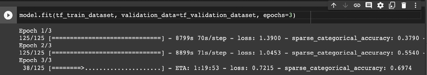

图 6.16:在 Colab 笔记本上微调 BERT

接下来我们要介绍 TFHub。

## TFHub

在上一节中，我们讨论了如何使用拥抱脸变形库。现在，我们将看一看位于 https://tfhub.dev/ T2 的另一个名为 TFHub 的库。TensorFlow Hub 是一个经过训练的机器学习模型库，可随时进行微调，并可部署在任何地方。关键思想是重用经过训练的模型，如 BERT 和更快的 R-CNN，只需几行代码。

使用 TFHub 就像写几行代码一样简单。让我们看一个简单的例子，我们加载一个预训练的模型来计算嵌入。在这种情况下，我们使用`nnlm-en-dim128`，这是一个在英文 Google News 200B 语料库上训练的基于标记的文本嵌入:

```
!pip install --upgrade tensorflow_hub

import tensorflow_hub as hub

model = hub.KerasLayer("https://tfhub.dev/google/nnlm-en-dim128/2")

embeddings = model(["The rain in Spain.", "falls",

                    "mainly", "In the plain!"])

print(embeddings.shape)  #(4,128) 
```

现在让我们看看如何使用 BERT。这段代码改编自[https://www.tensorflow.org/hub/tutorials/bert_experts](https://www.tensorflow.org/hub/tutorials/bert_experts)，在抱脸([https://huggingface.co/docs/transformers/training](https://huggingface.co/docs/transformers/training))上也有:

1.  让我们设置环境并导入有用的模块:

    ```
    !pip install seaborn

    !pip install sklearn

    !pip install tensorflow_hub

    !pip install tensorflow_text

    import seaborn as sns

    from sklearn.metrics import pairwise

    import tensorflow as tf

    import tensorflow_hub as hub

    import tensorflow_text as text  # Imports TF ops for preprocessing. 
    ```

2.  让我们定义一下几个用来比较它们相似性的句子:

    ```
    sentences = [

        "Do not pity the dead, Harry. Pity the living, and, above all those who live without love.",

        "It is impossible to manufacture or imitate love",

        "Differences of habit and language are nothing at all if our aims are identical and our hearts are open.",

        "What do I care how he looks? I am good-looking enough for both of us, I theenk! All these scars show is zat my husband is brave!",

        "Love as powerful as your mother's for you leaves it's own mark. To have been loved so deeply, even though the person who loved us is gone, will give us some protection forever.",

        "Family…Whatever yeh say, blood's important. . . .",

        "I cared more for your happiness than your knowing the truth, more for your peace of mind than my plan, more for your life than the lives that might be lost if the plan failed."

    ] 
    ```

3.  然后，让我们使用 TFHub 上可用的预训练 BERT 模型来计算刚刚定义的输入句子的嵌入。BERT 的输出是嵌入本身的集合:

    ```
    #@title Configure the model { run: "auto" }

    BERT_MODEL = "https://tfhub.dev/google/experts/bert/wiki_books/2" # @param {type: "string"} ["https://tfhub.dev/google/experts/bert/wiki_books/2", "https://tfhub.dev/google/experts/bert/wiki_books/mnli/2", "https://tfhub.dev/google/experts/bert/wiki_books/qnli/2", "https://tfhub.dev/google/experts/bert/wiki_books/qqp/2", "https://tfhub.dev/google/experts/bert/wiki_books/squad2/2", "https://tfhub.dev/google/experts/bert/wiki_books/sst2/2",  "https://tfhub.dev/google/experts/bert/pubmed/2", "https://tfhub.dev/google/experts/bert/pubmed/squad2/2"]

    # Preprocessing must match the model, but all the above use the same.

    PREPROCESS_MODEL = "https://tfhub.dev/tensorflow/bert_en_uncased_preprocess/3"

    preprocess = hub.load(PREPROCESS_MODEL)

    bert = hub.load(BERT_MODEL)

    inputs = preprocess(sentences)

    outputs = bert(inputs) 
    ```

4.  现在让我们基于`pairwise.cosine_similarity` :

    ```
    def plot_similarity(features, labels):

      """Plot a similarity matrix of the embeddings."""

      cos_sim = pairwise.cosine_similarity(features)

      sns.set(font_scale=1.2)

      cbar_kws=dict(use_gridspec=False, location="left")

      g = sns.heatmap(

          cos_sim, xticklabels=labels, yticklabels=labels,

          vmin=0, vmax=1, cmap="Blues", cbar_kws=cbar_kws)

      g.tick_params(labelright=True, labelleft=False)

      g.set_yticklabels(labels, rotation=0)

      g.set_title("Semantic Textual Similarity")

    plot_similarity(outputs["pooled_output"], sentences) 
    ```

    定义一些辅助函数来显示嵌入之间的相似性

感兴趣的读者可以在拥抱脸网站(可在[https://huggingface.co/docs/transformers/training](https://huggingface.co/docs/transformers/training)获得)上在线访问 Colab 笔记本，并可视化显示句子相似性的热图。总的来说，将 LLMs 与 TFHub 结合使用非常容易，不是吗？

# 估价

评估变压器涉及考虑多类指标并理解这些类别之间的成本权衡。来看看主要的。

## 质量

变压器的质量可以通过一些普遍可用的数据集来衡量。我们来看看最常用的。

### 胶

**通用语言理解评估** ( **胶水**)基准是用于训练、评估和分析自然语言理解系统的资源集合。胶水在[https://gluebenchmark.com/](https://gluebenchmark.com/)有售。

胶水包括:

*   九个句子或句子对语言理解任务的基准建立在已建立的现有数据集上，并被选择以覆盖不同范围的数据集大小、文本类型和难度
*   一种诊断数据集，旨在针对自然语言中的各种语言现象评估和分析模型性能
*   用于跟踪基准上的性能的公共排行榜和用于可视化诊断集上的模型的性能的仪表板

*图 6.17* 显示了 2022 年 3 月的胶水仪表板:

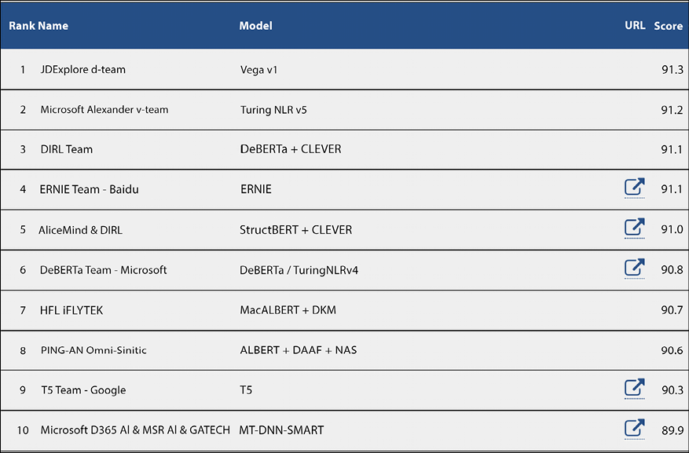

图 6.17:粘附仪表板

### 强力胶

近年来，预训练和迁移学习的新模式和方法已经推动了一系列语言理解任务的显著绩效提高。GLUE 基准测试提供了一个单一的数字指标，总结了一系列不同任务的进展，但基准测试的性能最近已经接近非专业人员的水平，这表明进一步研究的空间有限。

SuperGLUE 是 GLUE 之后的一个新的基准，它有一套新的更难的语言理解任务、改进的资源和新的公共排行榜。*图 6.18* 是 2022 年 3 月的强力胶排行榜:

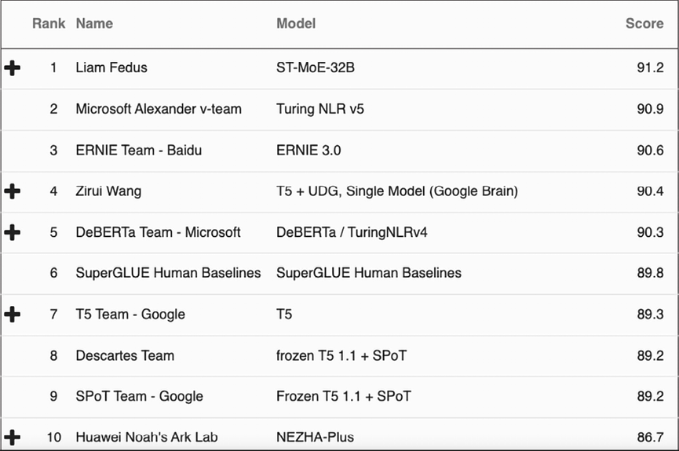

图 6.18:强力胶排行榜

### 班

SQuAD 是一个数据集，用于评估问题和答案，[https://rajpurkar.github.io/SQuAD-explorer/](https://rajpurkar.github.io/SQuAD-explorer/)。具体来说，**斯坦福问答数据集** ( **SQuAD** )是一个阅读理解数据集，由一组维基百科文章上的众包工作者提出的问题组成，其中每个问题的答案都是相应阅读文章中的一段文字或跨度，否则问题可能无法回答。

SQuAD2.0 将 SQuAD1.1 中的 100，000 个问题与超过 50，000 个无法回答的问题相结合，这些问题由众包工作人员以敌对的方式编写，看起来与可回答的问题相似。为了在 SQuAD2.0 上做得好，系统不仅必须尽可能地回答问题，还必须确定什么时候没有答案得到段落的支持并放弃回答。

### 人种

来自考试 ( **种族**)的**阅读理解数据集是一个机器阅读理解数据集，由英语考试的 27933 篇文章和 97867 个问题组成，针对 12-18 岁的中国学生。RACE 由两个子集组成，RACE-M 和 RACE-H，分别来自初中和高中考试。M 族有 28，293 个问题，H 族有 69，574 个问题。每个问题都与四个候选答案相关联，其中一个是正确的。RACE 的数据生成过程不同于大多数机器阅读理解数据集。RACE 中的问题不是通过启发式或众包产生问题和答案，而是专门为测试人类阅读技能而设计的，由领域专家创建。比赛在[https://www.cs.cmu.edu/~glai1/data/race/](https://www.cs.cmu.edu/~glai1/data/race/)举行。*图 6.19* 显示了比赛排行榜:**

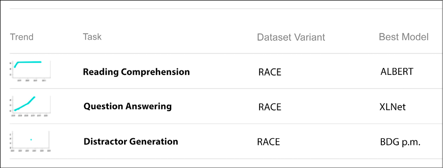

图 6.19:比赛排行榜

### NLP-进展

NLP-progress 是一个存储库，用于跟踪 NLP 的进展，包括数据集和最常见的 NLP 任务的当前最先进的模型。该网站旨在跟踪自然语言处理的进展，并概述了最常见的自然语言处理任务的最新模型及其相应的数据集。NLP-progress 旨在涵盖传统和核心的 NLP 任务，如依存分析和词性标注，以及最近的任务，如阅读理解和自然语言推理。如果你需要一个好的起点来为你的任务寻找质量标准，那么 http://nlpprogress.com/的[就是开始的地方。](http://nlpprogress.com/)

## 大小

前面的部分提供了质量指标的概述。本节重点讨论各种变压器架构中使用的参数数量。如图*图 6.20* 所示，在过去几年中，一直在竞相增加变压器的尺寸。回到 2018 年，BERT 的规模大概是 3.4 亿参数，然后 2021 年 T5 达到 110 亿，威震天过 5000 亿。最近的开关变压器拥有超过 1 万亿个参数，预计很快我们将看到第一个拥有 100 万亿个参数的模型。的确，有证据表明，模型越大越好，它可以记忆信息并进行归纳。然而，训练如此大的模型需要大量的计算资源:

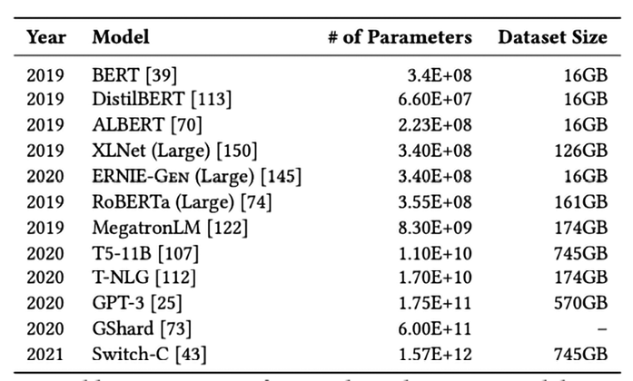

图 6.20:以十亿参数表示的变压器尺寸

万亿参数变压器正在路上！

事实上，论文[https://arxiv.org/pdf/1906.02243.pdf](https://arxiv.org/pdf/1906.02243.pdf)就云计算成本和 CO2 排放两方面警告了培训大型模型的可持续性影响(见*图 6.21* :

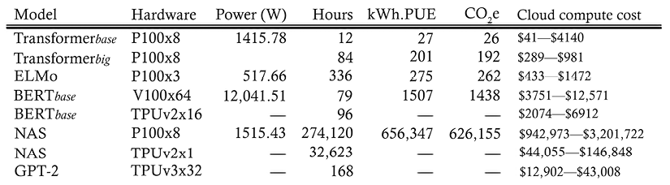

图 6.21:根据二氧化碳排放量(磅)和云计算成本(美元)训练一个模型的估计成本——来源:https://arxiv.org/pdf/1906.02243.pdf

因此，尺寸并不是使变压器质量提高的唯一因素，因为更大的尺寸实际上只能带来边际收益，并且需要大量的计算资源进行训练。

### 更大并不总是意味着更好

在 2022 年初，一种新的趋势正在出现，它包括一种混合方法，其中大型模型与更传统的检索机制一起使用。我们在本章前面讨论追溯时讨论了这种方法。复古语言模型实现了一个基于使用外部存储器的学习方案。DeepMind 声称，RETRO(或“检索增强变压器”)的表现就像是其规模 25 倍的神经网络。GPT-3 有 1750 亿个参数，而 RETRO 只使用了其中的 70 亿个。当然，这需要更少的时间、精力和计算能力来训练。

## 服务成本

为一个模型服务的成本取决于许多因素，如果不做出合理的假设，很难对其进行估算。当然，服务是模型中参数数量的函数。此外，提交给模型进行推理的查询数量是另一个因素。然后，重要的是要考虑云提供商是管理模型还是在您的本地基础设施中提供服务。在这个上下文中，记住 MLOps(参见【https://en.wikipedia.org/wiki/MLOps】T2)是开发一个机器学习模型并将其部署为生产系统的过程可能是有用的。当然，可以采用 MLOps 的最佳实践来优化服务成本。

在本节中，我们已经看到了一些用于评估变压器的关键因素，即质量、尺寸和服务成本。该列表显然不全面，正确的评估将考虑这些因素之间的最佳权衡。在下一节中，我们将讨论优化。

# 最佳化

优化一个变压器包括建立轻量级、响应性和节能模型。让我们看看优化一个模型最常用的方法。

## 量化

量化背后的关键思想是以较小的精度来近似网络的权重。这个想法很简单，但在实践中效果很好。如果你有兴趣了解更多，我们推荐阿米尔·戈拉米等人的论文*高效神经网络推理的量化方法综述*，[https://arxiv.org/pdf/2103.13630.pdf](https://arxiv.org/pdf/2103.13630.pdf)。

## 权重修剪

权重修剪背后的关键思想是去除网络中的一些连接。基于幅度的权重修剪倾向于在训练期间将模型权重清零，以增加模型稀疏性。这种简单的技术在模型大小和服务成本方面都有好处，因为基于幅度的权重修剪在训练过程中逐渐将模型权重清零，以实现模型稀疏性。稀疏模型更容易压缩，我们可以在推断过程中跳过零以改善延迟。

再说一次，权重修剪是关于权衡的，因为它可能会产生一些质量损失，尽管通常情况下，它们是相当小的。如果你有兴趣了解更多，请看一下 TensorFlow 关于剪枝的指南:[https://www . tensor flow . org/model _ optimization/guide/pruning/comprehensive _ guide](https://www.tensorflow.org/model_optimization/guide/pruning/comprehensive_guide)。

## 蒸馏

知识提炼背后的关键思想是训练一个小模型来重现一个大模型的行为。这种压缩技术有时被称为师生学习。你应该查阅的开创性论文是杰弗里·辛顿、奥里奥尔·维尼亚尔斯和杰夫·迪恩写的《从神经网络中提取知识》，https://arxiv.org/abs/1503.02531 和 T4 写的《从神经网络中提取知识》。

在过去的几年里，我们已经看到了一些蒸馏变压器。例如，DistilBERT 是一种基于 BERT 架构的小型、快速、廉价、轻便的变压器模型。在预训练阶段执行知识提炼，以将 BERT 模型的大小减少 40%。Hugging Face 有一些现成的用于提取 seq2seq T5 模型的 Python 脚本，可在网上获得，网址为[https://github . com/hugging Face/transformers/tree/master/examples/research _ projects/seq 2 seq-distillation](https://github.com/huggingface/transformers/tree/master/examples/research_projects/seq2seq-distillation)。使用该脚本非常直观:

```
python distillation.py --teacher t5-small --data_dir cnn_dm \

--student_decoder_layers 3 --student_encoder_layers 6 --tokenizer_name t5-small \

--learning_rate=3e-4 --freeze_encoder --no_teacher --freeze_embeds \

--do_train --train_batch_size 32 \

--do_predict \

--model_name_or_path t5-small --eval_beams 2 --eval_max_gen_length 142 \

--val_check_interval 0.25 --n_val 1000 \

--output_dir distilt5 --gpus 1 --logger_name wandb 
```

在本节中，我们讨论了一些用于优化转换器的技术，即量化、权重修剪和提取。在下一节中，我们将讨论变压器的常见陷阱。

# 常见陷阱:该做的和不该做的

在本节中，我们将给出处理变压器时通常推荐的五个注意事项和几个禁忌。

## 两个

让我们从推荐的最佳实践开始:

*   务必使用经过预训练的大型模型。如今，从 T5 等已有的预训练模型开始几乎总是很方便，而不是从头开始训练您的变压器。如果你使用预训练模型，你肯定站在巨人的肩膀上；想想吧！
*   从少量的学习开始。当你开始使用变形金刚时，从一个预训练的模型开始，然后执行一个轻量级的少量学习步骤总是一个好主意。一般来说，这将提高结果的质量，而不需要很高的计算成本。
*   务必对您的领域数据和客户数据进行微调。在尝试过预训练模型和少量学习之后，您可能会考虑对您感兴趣领域的专有数据或公开数据进行适当的微调
*   熟悉变形金刚的图书馆。拥抱脸或 TFHub 已经提供了几乎所有已知变压器的可用的最先进的实现。从那里开始可能是有用的，除非你有一些非常特殊的需求或者正在做一些创新的研究工作。
*   **熟悉最常用的评估指标。**使用变压器时，最好考虑质量、尺寸、服务成本和许多其他因素。

## 不要

现在让我们来看看一些你应该避免的陷阱！

*   **不要使用非常大的模型作为起点。**大型模特在培训和服务方面是有成本的。您将需要大量的资源来进行微调，并且您可能要为每个查询付出高昂的代价。最好从较小的型号开始，并了解它们对您的质量需求是否有用。
*   **不要使用未优化的模型。**如今，量化、修剪和提取是任何投入生产的变压器系统都需要使用的标准技术。

在本节中，我们已经看到了一些变压器的最佳实践。在下一节中，我们将讨论这些架构的未来解决方案。

# 变形金刚的未来

变形金刚最初应用于 NLP 任务，而 CNN 通常用于图像处理系统。最近，变压器已经开始成功地用于视觉处理任务。视觉转换器计算图像的各个小部分中像素之间的关系(例如，16 x 16 像素)。这种方法已经在阿列克谢·多索维茨基等人的研讨会论文*一幅图像值 16×16 个字:大规模图像识别的变形金刚*、[https://arxiv.org/abs/2010.11929](https://arxiv.org/abs/2010.11929)中提出，以使注意力计算可行。

**视觉变形金刚** ( **ViTs** )如今被用于自动驾驶等复杂应用。特斯拉的工程师展示了他们的特斯拉 Autopilot 在汽车的多摄像头系统上使用了变压器。当然，vit 也用于更传统的计算机视觉任务，包括但不限于图像分类、对象检测、视频深度伪造检测、图像分割、异常检测、图像合成和聚类分析。结果往往比 CNN 更好。

另一个可以考虑的方向是少投学习。少量学习指的是向机器学习模型提供非常少量的训练数据来指导其预测的实践，如推理时的几个例子，这与标准微调技术相反，标准微调技术需要相对大量的训练数据来使预训练的模型准确地适应期望的任务。

因此，为特定任务训练的模型可以以非常低的成本重新用于全新的任务。例如，假设我们训练一个文本模型来生成文本。然后，我们希望执行新的任务，如翻译或摘要。我们所做的是给出几个翻译的例子(比如手动翻译成对的文本)，或者几个总结的例子(也是几对)。就是这样，不需要再培训，也不需要微调训练。

既然 FSL 已经被证明在越来越多的领域工作得很好，不要惊讶训练阶段对未来的人工智能越来越不相关。更多信息请见本文，*代码生成工具(几乎)免费？Patrick Bareiß、Beatriz Souza、Marcelo d'Amorim 和 Michael Pradel 对代码*的少量预训练语言模型的研究。作者提议用 CodeGen 使用 FSL 生成编程代码，CodeGen 是一种用于程序合成的开源模式(参见 https://github.com/salesforce/CodeGen)。

# 摘要

在本章中，我们讨论了 transformers，这是一种深度学习架构，它彻底改变了传统的自然语言处理领域。我们开始回顾架构背后的关键直觉，以及各种类别的变形金刚，并深入研究最流行的模型。然后，我们将重点放在基于 vanilla 架构和流行库(如 Hugging Face 和 TFHub)的实现上。之后，我们简要讨论了评估、优化，以及使用变压器时通常采用的一些最佳实践。最后一节专门讨论如何使用变形金刚来执行计算机视觉任务，这是一个与 NLP 完全不同的领域。这需要仔细定义注意机制。最终，你需要的只是关注！而注意力的核心无非就是向量之间的余弦相似度。

下一章专门讨论无监督学习。

# 加入我们书的不和谐空间

加入我们的 Discord 社区，结识志同道合的朋友，与 2000 多名会员一起学习:[https://packt.link/keras](https://packt.link/keras)

