# 七、无监督学习

这本书到目前为止一直关注监督学习和通过监督学习学习的模型。从这一章开始，我们将探索一个探索较少但更具挑战性的领域，即无监督学习、自监督学习和对比学习。在这一章中，我们将深入研究一些流行和有用的无监督学习模型。与训练数据集由输入和所需标签组成的监督学习相比，无监督学习处理仅向模型提供输入的情况。该模型自己学习固有的输入分布，而没有任何期望的标签来指导它。聚类和降维是两种最常用的无监督学习技术。在这一章中，我们将学习不同的机器学习和神经网络技术。我们将介绍聚类和降维所需的技术，并详细介绍波尔兹曼机器，最后，介绍使用 TensorFlow 实现上述技术。涵盖的概念将扩展到构建**受限玻尔兹曼机器** ( **RBMs** )。本章将包括:

*   主成分分析
*   k 均值聚类
*   自组织地图
*   玻尔兹曼机器
*   RBMs

本章的所有代码文件都可以在 https://packt.link/dltfchp7 找到。

让我们从最常见、最常用的降维技术——主成分分析法开始。

# 主成分分析

**主成分分析** ( **PCA** )是最流行的多元统计降维技术。它分析由几个通常相互关联的因变量组成的训练数据，并从训练数据中以一组称为主成分的新正交变量的形式提取重要信息。

我们可以使用两种方法来执行 PCA，或者是**特征分解**或者是**奇异值分解** ( **SVD** )。

PCA 将 *n* 维输入数据还原为 *r* 维输入数据，其中 *r < n* 。简而言之，PCA 包括平移原点和执行轴的旋转，使得其中一个轴(主轴)具有与数据点最大的方差。通过执行该变换，然后丢弃(移除)具有低方差的正交轴，从原始数据集获得降维数据集。这里，我们采用奇异值分解方法进行 PCA 降维。考虑 *X* ，用 *p* 点的 *n* 维数据，即 *X* 是一个大小为 *p × n* 的矩阵。从线性代数中我们知道，任何实矩阵都可以用奇异值分解来分解:

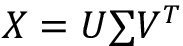

其中 *U* 和 *V* 分别是大小为 *p × p* 和 *n × n* 的正交矩阵(即*U . U*^T*= V . V*^T*= 1*)。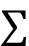是大小为 *p × n* 的对角矩阵。 *U* 矩阵为称为**左奇异矩阵**，而 *V* 为**右奇异矩阵**，而为对角矩阵，包含 *X* 的奇异值作为其对角元素。这里我们假设 *X* 矩阵居中。 *V* 矩阵的列是主成分，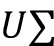的列是主成分变换后的数据。

现在为了将数据的维度从 *n* 降低到 *k* (其中 *k < n* )，我们将选择 *U* 的第 *k* 列和的左上 *k × k* 部分。两者的乘积给出了我们的降维矩阵:

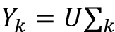

所获得的数据 *Y* 将是降维的。接下来，我们在 TensorFlow 2.0 中实现 PCA。

## MNIST 数据集上的主成分分析

现在让我们在 TensorFlow 2.0 中实现 PCA。我们肯定会使用TensorFlow；我们还需要 NumPy 进行一些初等矩阵计算，以及 Matplotlib、Matplotlib 工具包和 Seaborn 进行绘图:

```
import tensorflow as tf

import numpy as np

import matplotlib.pyplot as plt

from mpl_toolkits.mplot3d import Axes3D

import seaborn as sns 
```

接下来，我们加载 MNIST 数据集。因为我们使用 PCA 进行降维，所以我们不需要测试数据集甚至标签；但是，我们正在加载标签，以便在减少后我们可以验证 PCA 的性能。PCA 应该将相似的数据点聚集在一个群中；因此，如果我们看到使用 PCA 形成的聚类与我们的标签相似，这将表明我们的 PCA 起作用:

```
((x_train, y_train), (_, _)) = tf.keras.datasets.mnist.load_data() 
```

在进行主成分分析之前，我们应该对数据进行预处理。我们首先对其进行归一化处理，使所有数据的值都在 0 和 1 之间，然后将图像从 28 × 28 矩阵整形为 784 维向量，最后，通过减去平均值使其居中:

```
x_train = x_train / 255.

x_train = x_train.astype(np.float32)

x_train = np.reshape(x_train, (x_train.shape[0], 784))

mean = x_train.mean(axis = 1)

x_train = x_train - mean[:,None] 
```

既然我们的数据格式正确，我们就利用 TensorFlow 强大的线性代数(`linalg`)模块来计算我们的训练数据集的 SVD。TensorFlow 提供了在`tf.linalg`中定义的函数`svd()`来执行这个任务。然后使用`diag`函数将 sigma 数组(`s`，奇异值列表)转换为对角矩阵:

```
s, u, v = tf.linalg.svd(x_train)

s = tf.linalg.diag(s) 
```

这为我们提供了一个大小为 784 × 784 的对角矩阵*s*；一个 60000×784 大小的左奇异矩阵*u*；以及一个大小为 784 × 784 的右奇异矩阵 *v* 。这是因为函数`svd()`的参数`full_matrices`默认设置为`False`。因此，它不会生成完整的 *U* 矩阵(在这种情况下，大小为 60，000 × 60，000)；相反，如果输入 *X* 的大小为 *m × n* ，则生成大小为 *p = min(m，n)* 的 *U* 。

现在可以通过将 *u* 和 *s* 的各自切片相乘来生成降维数据。我们将数据从 784 维减少到 3 维；我们可以选择减少到小于 784 的任何维度，但我们在这里选择了 3，以便我们稍后更容易可视化。我们利用`tf.Tensor.getitem`以 Pythonic 方式分割矩阵:

```
k = 3

pca = tf.matmul(u[:,0:k], s[0:k,0:k]) 
```

在下面的代码中比较了原始和简化的数据形状:

```
print('original data shape',x_train.shape)

print('reduced data shape', pca.shape) 
```

```
original data shape (60000, 784)

reduced data shape (60000, 3) 
```

最后，让我们在三维空间中绘制数据点:

```
Set = sns.color_palette("Set2", 10)

color_mapping = {key:value for (key,value) in enumerate(Set)}

colors = list(map(lambda x: color_mapping[x], y_train))

fig = plt.figure()

ax = Axes3D(fig)

ax.scatter(pca[:, 0], pca[:, 1],pca[:, 2], c=colors) 
```

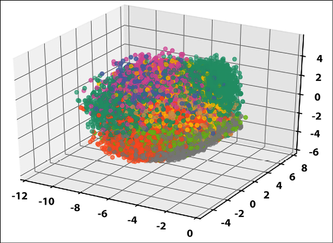Figure 7.1: Scatter plot of MNIST dataset after dimensionality reduction using PCA

您可以看到对应于相同颜色的点聚集在一起，因此具有相同的标签。因此，我们成功地使用主成分分析来降低 MNIST 图像的维度。每张原始图像的尺寸为 28 × 28。使用主成分分析方法，我们可以将其缩小到更小的尺寸。通常对于图像数据，降维是必要的。这是因为图像尺寸很大，并且包含大量冗余数据。

## TensorFlow 嵌入 API

TensorFlow 还提供了一个嵌入 API，用户可以使用 TensorBoard 找到并可视化 PCA 和 tSNE [1]集群。你可以在这里看到 MNIST 图片上的现场 PCA:[http://projector.tensorflow.org](http://projector.tensorflow.org)。以下图片转载以供参考:

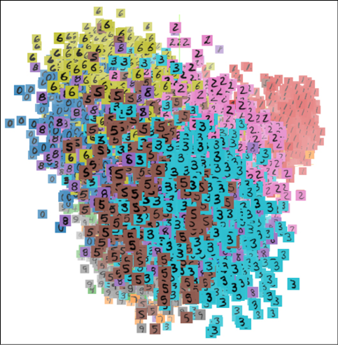Figure 7.2: A visualization of a principal component analysis, applied to the MNIST dataset

您可以使用 TensorBoard 处理您的数据。它包含一个名为**嵌入投影仪**的工具，可以让人们交互式地可视化嵌入。嵌入投影仪工具有三个面板:

*   **数据面板**:位于左上方的，可以在此面板中选择数据、标签等。
*   **投影面板**:左下角有，您可以在这里选择您想要的投影类型。它提供了三种选择:PCA、t-SNE 和自定义。
*   **检查面板**:在的右手边，你可以搜索特定的点，并查看最近邻居的列表。

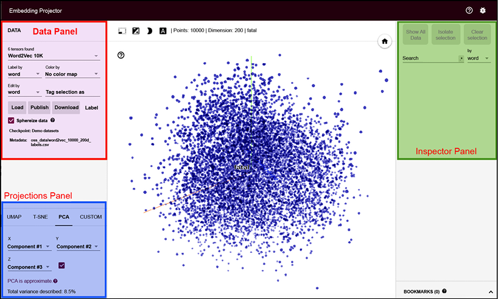

图 7.3:嵌入投影仪工具的屏幕截图

PCA 是一个有用的工具，用于可视化数据集和寻找变量之间的线性关系。它还可以用于聚类、离群点检测和特征选择。接下来，我们将学习 k-means 算法，这是一种对数据进行聚类的方法。

# k 均值聚类

K-means 聚类，顾名思义，是一种对数据进行聚类的技术，即将数据划分为指定数量的数据点。这是一种无监督的学习技术。它通过识别给定数据中的模式来工作。还记得《哈利·波特》成名的分院帽吗？它在书中所做的是聚类——将新学生(未标记)分成四个不同的聚类:格兰芬多、拉文克劳、赫奇帕奇和斯莱特林。

人类非常擅长将物体分组在一起；聚类算法试图给计算机提供类似的能力。有许多可用的聚类技术，如分层、贝叶斯或分区。K-means 聚类属于划分聚类；它将数据划分为 *k* 个簇。每个集群都有一个中心，称为质心。簇的数量 *k* 必须由用户指定。

k 均值算法以如下方式工作:

1.  随机选择 *k* 个数据点作为初始质心(聚类中心)。
2.  将每个数据点分配到最近的质心；可以有不同的方法来寻找接近度，最常用的是欧几里德距离。
3.  使用当前聚类成员资格重新计算质心，以使距离平方和减小。
4.  重复最后两步，直到达到收敛。

在之前的 TensorFlow 版本中，`KMeans`类是在`Contrib`模块中实现的；但是，该类在 TensorFlow 2.0 中不再可用。这里我们将使用 TensorFlow 2.0 中提供的高级数学函数来实现 k-means 聚类。

## TensorFlow中的 k-均值

为了在 TensorFlow 中演示 k-means，我们将在下面的代码中使用随机生成的数据。我们随机生成的数据将包含 200 个样本，我们将把它们分成三组。我们首先导入所有需要的模块，定义变量，并确定样本点的数量(`points_n`)，要形成的聚类的数量(`clusters_n`)，以及我们将要进行的迭代的数量(`iteration_n`)。我们还为一个随机数设置了种子，以确保我们的工作是可重复的:

```
import matplotlib.pyplot as plt

import numpy as np

import tensorflow as tf

points_n = 200

clusters_n = 3

iteration_n = 100

seed = 123

np.random.seed(seed)

tf.random.set_seed(seed) 
```

现在，我们随机生成数据，并从数据中随机选择三个质心:

```
points = np.random.uniform(0, 10, (points_n, 2))

centroids = tf.slice(tf.random.shuffle(points), [0, 0], [clusters_n, -1]) 
```

现在让我们画出要点:

```
plt.scatter(points[:, 0], points[:, 1], s=50, alpha=0.5)

plt.plot(centroids[:, 0], centroids[:, 1], 'kx', markersize=15)

plt.show() 
```

您可以在下图中看到所有点和随机选择的三个质心的散点图:

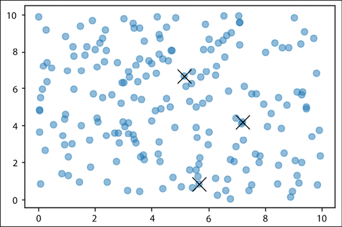

图 7.4:从三个随机选择的质心随机生成的数据，绘制

我们定义函数`closest_centroids()`将每个点分配给它最接近的质心:

```
def closest_centroids(points, centroids):

    distances = tf.reduce_sum(tf.square(tf.subtract(points, centroids[:,None])), 2)

    assignments = tf.argmin(distances, 0)

    return assignments 
```

我们创建另一个函数`move_centroids()`。它重新计算质心，使距离的平方和减小:

```
def move_centroids(points, closest, centroids):

    return np.array([points[closest==k].mean(axis=0) for k in range(centroids.shape[0])]) 
```

现在我们迭代调用这两个函数 100 次。我们任意选择了迭代次数；您可以增加或减少它来查看效果:

```
for step in range(iteration_n):

    closest = closest_centroids(points, centroids)

    centroids = move_centroids(points, closest, centroids) 
```

现在让我们想象一下 100 次迭代后质心是如何变化的:

```
plt.scatter(points[:, 0], points[:, 1], c=closest, s=50, alpha=0.5)

plt.plot(centroids[:, 0], centroids[:, 1], 'kx', markersize=15)

plt.show() 
```

在*图 7.5* 中，可以看到 100 次迭代后的最终质心。我们还根据这些点最接近哪个质心来给它们着色。黄色点对应于一个聚类(最靠近其中心的十字)，紫色和绿色聚类点也是如此:

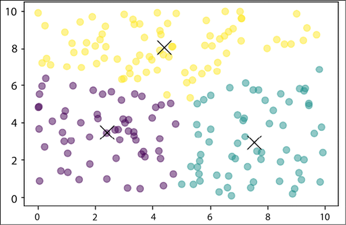

图 7.5:100 次迭代后的最终质心图

请注意，`plot`命令适用于`Matplotlib 3.1.1`或更高版本。

在前面的代码中，我们决定将分类的数量限制为三个，但是在大多数情况下，对于未标记的数据，我们永远无法确定存在多少个分类。人们可以使用肘方法来确定最佳聚类数。该方法基于这样的原则，即我们应该选择减少了**误差平方和** ( **SSE** )距离的聚类数。如果 *k* 是聚类数，那么随着 *k* 增加，SSE 减少，SSE = 0；当 *k* 等于数据点个数时，每个点就是自己的聚类。很明显，我们不希望这成为我们的聚类数，所以当我们绘制 SSE 和聚类数之间的图表时，我们应该会在图表中看到一个扭结，就像手的肘部，这就是该方法的名称——肘部方法。以下代码计算我们的数据的误差平方和:

```
def sse(points, centroids):

    sse1 = tf.reduce_sum(tf.square(tf.subtract(points, centroids[:,None])), 2).numpy()

    s = np.argmin(sse1, 0)

    distance = 0

    for i in range(len(points)):

      distance += sse1[s[i], i]

    return distance/len(points) 
```

现在让我们使用肘方法来为我们的数据集寻找最佳的聚类数。为此，我们将从一个聚类开始，即所有的点都属于一个聚类，然后依次增加聚类的数量。在代码中，我们将分类数增加 1，11 是分类数的最大值。对于每个集群编号值，我们使用上面的代码来查找质心(以及集群)并找到 SSE:

```
w_sse = []

for n in range(1, 11):

  centroids = tf.slice(tf.random.shuffle(points), [0, 0], [n, -1])

  for step in range(iteration_n):

    closest = closest_centroids(points, centroids)

    centroids = move_centroids(points, closest, centroids)

  #print(sse(points, centroids))

  w_sse.append(sse(points, centroids))

plt.plot(range(1, 11),w_sse) 

plt.xlabel('Number of clusters') 
```

*图 7.6* 显示了数据集的不同聚类值。当簇的数量为四个时，扭结清晰可见:

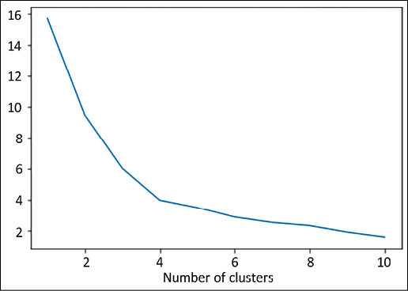

图 7.6:绘制 SSE 与集群数量的关系图

K-means 聚类非常流行，因为它快速、简单且健壮。它也有一些缺点，最大的缺点是用户必须指定簇的数量。第二，算法不能保证全局最优；如果初始随机选择的质心改变，结果也会改变。第三，对离群值非常敏感。

## k 均值的变化

在最初的 k-means 算法中，每个点属于一个特定的聚类(质心)；这就是所谓的**硬聚类**。然而，我们可以让一个点属于所有的聚类，用一个隶属函数来定义它有多少属于一个特定的聚类(质心)。这就是所谓的*模糊聚类*或*软聚类*。

这种变化是由 J. C. Dunn 在 1973 年提出的，后来由 J. C. Bezdek 在 1981 年加以改进。虽然软聚类需要更长的时间来收敛，但当一个点在多个类中时，或者当我们想知道给定点与不同聚类的相似程度时，它会很有用。

加速 k-means 算法是由 Charles Elkan 在 2003 年创建的。他利用了三角形不等式关系(即直线是两点间最短的距离)。他不仅在每次迭代中计算所有的距离，还跟踪点和质心之间距离的下限和上限。

2006 年，David Arthur 和 Sergei Vassilvitskii 提出了 k-means++算法。他们提出的主要改变是质心的初始化。他们表明，如果我们选择彼此远离的质心，那么 k-means 算法不太可能收敛到次优解。

另一种选择是，在每次迭代中，我们不使用整个数据集，而是使用小批量。这个修改是大卫·斯库利在 2010 年提出的。现在，我们已经介绍了 PCA 和 k-means，我们将转向一个有趣的网络，称为自组织网络或赢家通吃单元。

# 自组织地图

k-means 和 PCA 都可以对输入数据进行聚类；然而，它们并不保持拓扑关系。在本节中，我们将考虑**自组织映射** ( **SOMs** )，有时也称为 **Kohonen 网络**或**赢家通吃单元** ( **WTUs** )。它们维护拓扑关系。SOMs 是一种非常特殊的神经网络，其灵感来自人脑的一个独特特征。在我们的大脑中，不同的感觉输入以拓扑有序的方式呈现。与其他神经网络不同，神经元并不都通过权重相互连接；反而影响彼此的学习。SOM 最重要的方面是神经元以拓扑方式表示学习到的输入。它们是由 Teuvo Kohonen [7]在 1982 年提出的。

在 SOMs 中，神经元通常被放置在(1D 或 2D)格子的节点上。更高的维度也是可能的，但是在实践中很少使用。网格中的每个神经元通过一个权重矩阵连接到所有的输入单元。*图 7.7* 显示了一个具有 6 × 8 (48 个神经元)和 5 个输入的 SOM。为了清楚起见，仅示出了将所有输入连接到一个神经元的权重向量。在这种情况下，每个神经元将有七个元素，从而产生大小为 40 × 5 的组合权重矩阵:

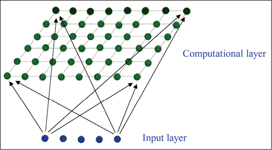

图 7.7:有 5 个输入和 48 个神经元的自组织图

SOM 通过竞争学习来学习。它可以被认为是主成分分析的非线性推广，因此，像主成分分析一样，可以用于降维。

为了实现 SOM，我们先来了解一下它的工作原理。第一步，将网络的权重初始化为某个随机值，或者从输入中随机抽取样本。每个占据格子空间的神经元将被分配特定的位置。现在，当输入被呈现时，与输入距离最小的神经元被宣布为获胜者(WTU)。这是通过测量所有神经元的权重向量( *W* )和输入向量( *X* )之间的距离来实现的:

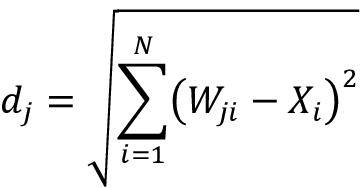

这里， *d* [j] 是神经元 *j* 距离输入 *X* 的距离。具有最低 *d* 值的神经元是获胜者。

接下来，调整获胜神经元及其相邻神经元的权重，以确保如果下次呈现相同的输入，则相同的神经元是获胜者。

为了决定哪些邻近的神经元需要修改，网络使用一个邻域函数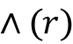；通常选择高斯墨西哥帽函数作为邻域函数。邻域函数在数学上表示如下:

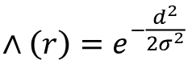

这里，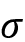是神经元影响的时间相关半径，而 *d* 是其与获胜神经元的距离。从图形上看，该函数看起来像一顶帽子(因此得名)，如您在*图 7.8* 中所见:

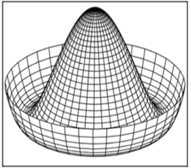

图 7.8:以图形形式可视化的“高斯墨西哥帽”函数

邻域函数的另一个重要性质是它的半径随时间而减小。因此，在开始时，许多相邻神经元的权重被修改，但是随着网络的学习，最终在学习过程中少数神经元的权重(有时只有一个或没有)被修改。

重量变化由以下等式给出:

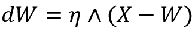

对于给定次数的迭代，对所有输入重复该过程。随着迭代的进行，我们通过依赖于迭代次数的因子来降低学习速率和半径。

som 在计算上非常昂贵，因此对于非常大的数据集来说并不真正有用。尽管如此，它们还是很容易理解，并且可以很好地找到输入数据之间的相似性。因此，它们已被用于图像分割和确定自然语言处理中的单词相似度图。

## 使用 SOM 的颜色映射

SOM 生成的输入空间的特征映射的一些有趣的属性是:

*   特征图提供了输入空间的良好表示。这个特性可以用来执行矢量量化，这样我们可以有一个连续的输入空间，使用 SOM 我们可以在一个离散的输出空间中表示它。
*   特征图是拓扑有序的，也就是说，输出网格中神经元的空间位置对应于输入的特定特征。
*   特征图也反映了输入空间的统计分布；具有最大数量输入样本的属性域在特征地图中获得更大的区域。

SOM 的这些特性使它们成为许多有趣应用的自然选择。这里，我们使用 SOM 将一系列给定的 R、G 和 B 像素值聚类到相应的颜色图中。我们从导入模块开始:

```
import tensorflow as tf

import numpy as np

import matplotlib.pyplot as plt 
```

代码的主要组成部分是我们的类`WTU`。类`__init__`函数初始化我们的 SOM 的各种超参数、我们的 2D 晶格的维度(`m, n`)、输入中的特征数量(`dim`)、邻域半径(`sigma`)、初始权重和地形信息:

```
# Define the Winner Take All units

class WTU(object):

  #_learned = False

  def __init__(self, m, n, dim, num_iterations, eta = 0.5, sigma = None):

    """

    m x n : The dimension of 2D lattice in which neurons are arranged

    dim : Dimension of input training data

    num_iterations: Total number of training iterations

    eta : Learning rate

    sigma: The radius of neighbourhood function.

    """

    self._m = m

    self._n = n

    self._neighbourhood = []

    self._topography = []

    self._num_iterations = int(num_iterations)

    self._learned = False

    self.dim = dim

    self.eta = float(eta)

    if sigma is None:

      sigma = max(m,n)/2.0 # Constant radius

    else:

      sigma = float(sigma)

    self.sigma = sigma

    print('Network created with dimensions',m,n)

    # Weight Matrix and the topography of neurons

    self._W = tf.random.normal([m*n, dim], seed = 0)

    self._topography = np.array(list(self._neuron_location(m, n))) 
```

该类中最重要的函数是`training()`函数，在这里我们使用前面讨论过的 Kohonen 算法来查找胜出的单元，然后根据邻域函数更新权重:

```
def training(self,x, i):

    m = self._m

    n= self._n

    # Finding the Winner and its location

    d = tf.sqrt(tf.reduce_sum(tf.pow(self._W - tf.stack([x for i in range(m*n)]),2),1))

    self.WTU_idx = tf.argmin(d,0)

    slice_start = tf.pad(tf.reshape(self.WTU_idx, [1]),np.array([[0,1]]))

    self.WTU_loc = tf.reshape(tf.slice(self._topography, slice_start,[1,2]), [2])

    # Change learning rate and radius as a function of iterations

    learning_rate = 1 - i/self._num_iterations

    _eta_new = self.eta * learning_rate

    _sigma_new = self.sigma * learning_rate

    # Calculating Neighbourhood function

    distance_square = tf.reduce_sum(tf.pow(tf.subtract(

        self._topography, tf.stack([self.WTU_loc for i in range(m * n)])), 2), 1)

    neighbourhood_func = tf.exp(tf.negative(tf.math.divide(tf.cast(

distance_square, "float32"), tf.pow(_sigma_new, 2))))

    # multiply learning rate with neighbourhood func

    eta_into_Gamma = tf.multiply(_eta_new, neighbourhood_func)

    # Shape it so that it can be multiplied to calculate dW

    weight_multiplier = tf.stack([tf.tile(tf.slice(

        eta_into_Gamma, np.array([i]), np.array([1])), [self.dim])

        for i in range(m * n)])

    delta_W = tf.multiply(weight_multiplier,

        tf.subtract(tf.stack([x for i in range(m * n)]),self._W))

    new_W = self._W + delta_W

    self._W = new_W 
```

`fit()`函数是一个帮助函数，它调用`training()`函数并存储质心网格以便于检索:

```
def fit(self, X):

    """

    Function to carry out training

    """

    for i in range(self._num_iterations):

        for x in X:

            self.training(x,i)

    # Store a centroid grid for easy retrieval

    centroid_grid = [[] for i in range(self._m)]

    self._Wts = list(self._W)

    self._locations = list(self._topography)

    for i, loc in enumerate(self._locations):

        centroid_grid[loc[0]].append(self._Wts[i])

    self._centroid_grid = centroid_grid

    self._learned = True 
```

然后还有一些辅助函数来寻找获胜者并生成神经元的 2D 点阵，还有一个函数将输入向量映射到 2D 点阵中的相应神经元:

```
def winner(self, x):

    idx = self.WTU_idx,self.WTU_loc

    return idx

def _neuron_location(self,m,n):

    """

    Function to generate the 2D lattice of neurons

    """

    for i in range(m):

       for j in range(n):

          yield np.array([i,j])

def get_centroids(self):

    """

    Function to return a list of 'm' lists, with each inner list containing the 'n' corresponding centroid locations as 1-D NumPy arrays.

    """

    if not self._learned:

       raise ValueError("SOM not trained yet")

    return self._centroid_grid

def map_vects(self, X):

    """

    Function to map each input vector to the relevant neuron in the lattice

    """

    if not self._learned:

       raise ValueError("SOM not trained yet")

       to_return = []

       for vect in X:

          min_index = min([i for i in range(len(self._Wts))],

                           key=lambda x: np.linalg.norm(vect -

                           self._Wts[x]))

          to_return.append(self._locations[min_index])

       return to_return 
```

我们将也需要标准化输入数据，所以我们创建一个函数来完成这项工作:

```
def normalize(df):

    result = df.copy()

    for feature_name in df.columns:

        max_value = df[feature_name].max()

        min_value = df[feature_name].min()

        result[feature_name] = (df[feature_name] - min_value) / (max_value - min_value)

    return result.astype(np.float32) 
```

让我们来读数据。该数据包含不同颜色的红色、绿色和蓝色通道值。让我们将它们正常化:

```
## Reading input data from file

import pandas as pd

df = pd.read_csv('colors.csv')  # The last column of data file is a label

data = normalize(df[['R', 'G', 'B']]).values

name = df['Color-Name'].values

n_dim = len(df.columns) - 1

# Data for Training

colors = data

color_names = name 
```

让我们创建我们的 SOM 并使之适合:

```
som = WTU(30, 30, n_dim, 400, sigma=10.0)

som.fit(colors) 
```

fit 函数的运行时间稍长，因为我们的代码不是为了性能优化，而是为了解释概念。现在，让我们看看训练模型的结果。让我们运行下面的代码:

```
# Get output grid

image_grid = som.get_centroids()

# Map colours to their closest neurons

mapped = som.map_vects(colors)

# Plot

plt.imshow(image_grid)

plt.title('Color Grid SOM')

for i, m in enumerate(mapped):

    plt.text(m[1], m[0], color_names[i], ha='center', va='center',

             bbox=dict(facecolor='white', alpha=0.5, lw=0)) 
```

你可以在 2D 神经元格子中看到彩色地图:

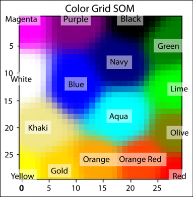

图 7.9:2D 神经元格子的彩色地图

你可以看到赢得相似颜色的神经元位置很近。接下来，我们转向一个有趣的架构，受限玻尔兹曼机器。

# 受限玻尔兹曼机器

RBM 是一个两层的神经网络——第一层叫做**可见层**，第二层叫做**隐藏层**。它们被称为**浅层神经网络**，因为它们只有两层深度。它们最初是由 Paul Smolensky 在 1986 年提出的(他称之为和谐网络[1])，后来由 Geoffrey Hinton 在 2006 年提出用对比差异作为训练它们的方法。可见层中的所有神经元都与隐藏层中的所有神经元相连，但有一个**限制**—同一层中的任何神经元都不能相连。RBM 中的所有神经元本质上都是二元的；他们要么开火，要么不开火。

RBM 可用于降维、特征提取和协同过滤。RBMs 的训练可以分为三个部分:向前传球，向后传球，然后是比较。

让我们更深入地研究数学。我们可以将 RBMs 的操作分为两个阶段:

**正向传递**:可见单元( *V* )的信息通过权重( *W* )和偏差( *c* )传递给隐藏单元( *h* [0] )。隐藏单元可能开火或不开火取决于随机概率(是随机概率)，基本上是 sigmoid 函数:

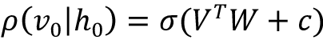

**向后传递**:隐藏单元表示( *h* [0] )然后通过相同的权重 *W* ，但是不同的偏置 *c* 传递回可见单元，其中模型重构输入。再次对输入进行采样:

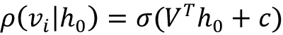

这两个过程重复进行 *k* 步，或者直到达到收敛[4]。根据研究人员的说法， *k=1* 给出了很好的结果，所以我们将保留 *k = 1* 。

可见向量 *V* 和隐藏向量 *h* 的联合配置具有如下给出的能量:

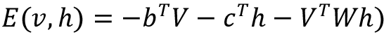

与每个可见向量 *V* 相关联的还有自由能，这是一个单一构型需要具有的能量，以便与包含 *V* 的所有构型具有相同的概率:

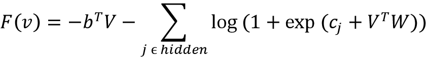

使用对比散度目标函数，即*均值(F(V* [原]*)-均值(F(V* [重构]*)*，权重的变化由下式给出:

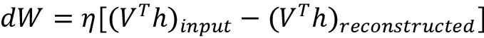

这里，是学习率。类似的表达式也适用于偏差 *b* 和 *c* 。

## 使用 RBM 重建图像

让我们在TensorFlow中建立一个 RBM。RBM 将被设计用来重建手写数字。这是你正在学习的第一个生成模式；在接下来的章节中，我们将学习更多。我们导入了 TensorFlow、NumPy 和 Matplotlib 库:

```
import tensorflow as tf

import numpy as np

import matplotlib.pyplot as plt 
```

我们定义一个类`RBM`。类`__init_()`函数初始化可见层的神经元数量(`input_size`)和隐藏层的神经元数量(`output_size`)。该函数初始化隐藏层和可见层的权重和偏差。在下面的代码中，我们将它们初始化为零。您也可以尝试随机初始化:

```
#Class that defines the behavior of the RBM

class RBM(object):

    def __init__(self, input_size, output_size, lr=1.0, batchsize=100):

        """

        m: Number of neurons in visible layer

        n: number of neurons in hidden layer

        """

        # Defining the hyperparameters

        self._input_size = input_size # Size of Visible

        self._output_size = output_size # Size of outp

        self.learning_rate = lr # The step used in gradient descent

        self.batchsize = batchsize         # The size of how much data will be used for training per sub iteration

        # Initializing weights and biases as matrices full of zeroes

        self.w = tf.zeros([input_size, output_size], np.float32) # Creates and initializes the weights with 0

        self.hb = tf.zeros([output_size], np.float32) # Creates and initializes the hidden biases with 0

        self.vb = tf.zeros([input_size], np.float32) # Creates and initializes the visible biases with 0 
```

我们定义了提供向前和向后传递的方法:

```
 # Forward Pass

    def prob_h_given_v(self, visible, w, hb):

        # Sigmoid 

        return tf.nn.sigmoid(tf.matmul(visible, w) + hb)

    # Backward Pass

    def prob_v_given_h(self, hidden, w, vb):

        return tf.nn.sigmoid(tf.matmul(hidden, tf.transpose(w)) + vb) 
```

我们创建一个函数来生成随机的二进制值。这是因为隐藏和可见单元都使用随机概率更新，在隐藏层的情况下取决于每个单元的输入(以及可见层的自上而下输入):

```
 # Generate the sample probability

    def sample_prob(self, probs):

        return tf.nn.relu(tf.sign(probs - tf.random.uniform(tf.shape(probs)))) 
```

我们将需要函数来重建输入:

```
def rbm_reconstruct(self,X):

    h = tf.nn.sigmoid(tf.matmul(X, self.w) + self.hb)

    reconstruct = tf.nn.sigmoid(tf.matmul(h, tf.transpose(self.w)) + self.vb)

    return reconstruct 
```

为了训练创建的 RBM，我们定义了`train()`函数。该函数计算对比散度的正梯度项和负梯度项，并使用权重更新方程来更新权重和偏差:

```
# Training method for the model

def train(self, X, epochs=10):

    loss = []

    for epoch in range(epochs):

        #For each step/batch

        for start, end in zip(range(0, len(X), self.batchsize),range(self.batchsize,len(X), self.batchsize)):

            batch = X[start:end]

            #Initialize with sample probabilities

            h0 = self.sample_prob(self.prob_h_given_v(batch, self.w, self.hb))

            v1 = self.sample_prob(self.prob_v_given_h(h0, self.w, self.vb))

            h1 = self.prob_h_given_v(v1, self.w, self.hb)

            #Create the Gradients

            positive_grad = tf.matmul(tf.transpose(batch), h0)

            negative_grad = tf.matmul(tf.transpose(v1), h1)

            #Update learning rates 

            self.w = self.w + self.learning_rate *(positive_grad - negative_grad) / tf.dtypes.cast(tf.shape(batch)[0],tf.float32)

            self.vb = self.vb +  self.learning_rate * tf.reduce_mean(batch - v1, 0)

            self.hb = self.hb +  self.learning_rate * tf.reduce_mean(h0 - h1, 0)

        #Find the error rate

        err = tf.reduce_mean(tf.square(batch - v1))

        print ('Epoch: %d' % epoch,'reconstruction error: %f' % err)

        loss.append(err)

    return loss 
```

既然我们的类已经准备好了，我们实例化一个对象`RBM`，并在 MNIST 数据集上训练它:

```
(train_data, _), (test_data, _) =  tf.keras.datasets.mnist.load_data()

train_data = train_data/np.float32(255)

train_data = np.reshape(train_data, (train_data.shape[0], 784))

test_data = test_data/np.float32(255)

test_data = np.reshape(test_data, (test_data.shape[0], 784))

#Size of inputs is the number of inputs in the training set

input_size = train_data.shape[1]

rbm = RBM(input_size, 200)

err = rbm.train(train_data,50) 
```

让我们绘制学习曲线:

```
plt.plot(err)

plt.xlabel('epochs')

plt.ylabel('cost') 
```

在下图中，你可以看到我们的 RBM 的学习曲线:

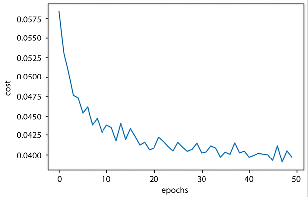

图 7.10:RBM 模型的学习曲线

现在，我们展示代码来可视化重建的图像:

```
out = rbm.rbm_reconstruct(test_data)

# Plotting original and reconstructed images

row, col = 2, 8

idx = np.random.randint(0, 100, row * col // 2)

f, axarr = plt.subplots(row, col, sharex=True, sharey=True, figsize=(20,4))

for fig, row in zip([test_data,out], axarr):

    for i,ax in zip(idx,row):

        ax.imshow(tf.reshape(fig[i],[28, 28]), cmap='Greys_r')

        ax.get_xaxis().set_visible(False)

        ax.get_yaxis().set_visible(False) 
```

重建的图像:

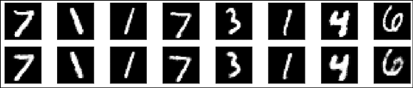

图 7.11:使用 RBM 进行图像重建

顶行是输入的手写图像，底行是重构图像。你可以看到这些图像看起来和人类手写的数字非常相似。在接下来的章节中，你将了解到可以生成更复杂图像的模型，比如人造人脸。

## 深度信念网络

既然我们对 RBM 有了很好的理解，并且知道如何使用对比发散来训练它们，我们就可以走向第一个成功的深度神经网络架构，即**深度信念网络** ( **DBNs** )，这是辛顿和他的团队在 2006 年的论文*中提出的一种深度信念网络的快速学习算法*。在此模型之前，训练深度架构非常困难，不仅仅是因为有限的计算资源，还因为消失梯度问题，这将在*第 8 章*、*自编码器*中讨论。在 DBNs 中，首次展示了如何通过贪婪的逐层训练来训练深度架构。

最简单地说，dbn 就是堆叠的 RBM。每个 RBM 都是使用对比散度单独训练的。我们从第一层 RBM 的训练开始。一旦它被训练，我们训练第二 RBM 层。第二 RBM 的可见单元现在被馈送第一 RBM 的隐藏单元的输出，当它被馈送输入数据时。每次添加 RBM 层时，重复该过程。

让我们尝试堆叠我们的`RBM`类。为了制作 DBN，我们需要在`RBM`类中再定义一个函数；一个 RBM 的隐藏单元的输出需要输入到下一个 RBM:

```
 #Create expected output for our DBN

    def rbm_output(self, X):

        out = tf.nn.sigmoid(tf.matmul(X, self.w) + self.hb)

        return out 
```

现在我们可以使用`RBM`类来创建一个堆叠的 RBM 结构。在下面的代码中，我们创建了一个 RBM 堆栈:第一个 RBM 有 500 个隐藏单元，第二个有 200 个隐藏单元，第三个有 50 个隐藏单元:

```
RBM_hidden_sizes = [500, 200 , 50 ] #create 2 layers of RBM with size 400 and 100

#Since we are training, set input as training data

inpX = train_data

#Create list to hold our RBMs

rbm_list = []

#Size of inputs is the number of inputs in the training set

input_size = train_data.shape[1]

#For each RBM we want to generate

for i, size in enumerate(RBM_hidden_sizes):

    print ('RBM: ',i,' ',input_size,'->', size)

    rbm_list.append(RBM(input_size, size))

    input_size = size 
```

```
---------------------------------------------------------------------

RBM:  0   784 -> 500

RBM:  1   500 -> 200

RBM:  2   200 -> 50 
```

对于第一个 RBM，MNIST 数据是输入。第一 RBM 的输出然后作为输入被馈送到第二 RBM，依此类推通过连续的 RBM 层:

```
#For each RBM in our list

for rbm in rbm_list:

    print ('Next RBM:')

    #Train a new one

    rbm.train(tf.cast(inpX,tf.float32))

    #Return the output layer

    inpX = rbm.rbm_output(inpX) 
```

我们的 DBN 准备好了。现在使用无监督学习来训练三个堆叠的 RBM。DBNs 也可以使用监督训练来训练。为此，我们需要微调已训练的 RBM 的权重，并在末尾添加一个完全连接的层。在他们的出版物*深度信念网络分类*中，Hebbo 和 Kim 展示了他们如何使用 DBN 进行 MNIST 分类；这是对这个主题的一个很好的介绍。

# 摘要

在这一章中，我们讨论了主要的无监督学习算法。我们研究了最适合降维、聚类和图像重建的算法。我们从降维算法 PCA 开始，然后使用 k-means 和自组织映射进行聚类。在此之后，我们研究了受限玻尔兹曼机，并看到了我们如何使用它来降低维数和重建图像。接下来，我们深入研究了堆叠的 RBM，即深度信念网络，我们在 MNIST 数据集上训练了一个由三个 RBM 层组成的 DBN。

在下一章中，我们将探索另一个使用无监督学习范例的模型——自编码器。

# 参考

1.  史密斯，林赛。(2006).*主成分分析教程*:[http://www . cs . otago . AC . NZ/cosc 453/student _ tutorials/Principal _ components . pdf](http://www.cs.otago.ac.nz/cosc453/student_tutorials/principal_components.pdf)
2.  主成分分析教程:【http://mplab.ucsd.edu/tutorials/pca.pdf 
3.  TensorFlow投影仪:[http://projector.tensorflow.org/](http://projector.tensorflow.org/)
4.  **奇异值分解** ( **SVD** )教程。麻省理工:[https://web . MIT . edu/be . 400/www/SVD/Singular _ Value _ decomposition . htm](https://web.mit.edu/be.400/www/SVD/Singular_Value_Decomposition.htm)
5.  黄邦贤史伦斯。(2014).*主成分分析教程*。arXiv 预印本 arXiv:1404.1100:【https://arxiv.org/abs/1404.1100 
6.  I .古德费勒、y .本吉奥和 a .库维尔(2016 年)。*深度学习*。麻省理工学院出版社:【https://www.deeplearningbook.org 
7.  t .科霍宁(1982 年)。*拓扑正确的特征地图的自组织形成*。生物控制论 43，第 1 期:59-69。
8.  卡农戈、塔帕斯等人(2002 年)。一种高效的 k-Means 聚类算法:分析与实现。IEEE 模式分析和机器智能汇刊 24.7: 881-892。
9.  Ortega，Joaquí n Pé rez，et al .*K-means 算法的研究问题:使用 Matlab 的实验性试验*。CEUR 研讨会论文集:语义网和新技术。
10.  陈，K. (2009)。度量和欧氏空间中 k-中值和 k-均值聚类的核集及其应用。SIAM 计算杂志 39.3: 923-947。
11.  *确定数据集中的聚类数*:[https://en . Wikipedia . org/wiki/Determining _ the _ number _ of _ clusters _ in _ a _ data _ set](https://en.wikipedia.org/wiki/Determining_the_number_of_clusters_in_a_data_set)
12.  劳埃德公司(1982 年)。PCM 中的最小二乘量化:【http://mlsp.cs.cmu.edu/courses/fall2010/class14/lloyd.pdf 
13.  邓恩，J. C. (1973 年 1 月 1 日)。*iso data 过程的模糊相关及其在检测紧密且分离良好的聚类中的用途*。控制论杂志。3(3): 32–57.
14.  詹姆斯·贝兹德克(1981 年)。*用模糊目标函数算法进行模式识别*。
15.  彼得斯、克雷斯波、林格拉斯和韦伯(2013 年)。*软聚类——模糊和粗糙方法及其扩展和衍生物*。国际近似推理杂志 54，第 2 期:307-322。
16.  斯卡利博士(2010 年)。 *Web 级 k-means 聚类*。《第 19 届万维网国际会议论文集》，第 1177-1178 页。ACM。
17.  斯摩棱斯基，P. (1986)。动力系统中的信息处理:和谐理论的基础。编号 CU-CS-321-86。博尔德计算机科学系的科罗拉多 UNIV。
18.  Salakhutdinov，r .，Mnih，a .，和 Hinton，G. (2007 年)。*用于协同过滤的受限玻尔兹曼机器*。第 24 届机器学习国际会议论文集。ACM。
19.  辛顿，G. (2010 年)。训练受限玻尔兹曼机器的实用指南。动量 9.1: 926。

# 加入我们书的不和谐空间

加入我们的 Discord 社区，结识志同道合的朋友，与 2000 多名会员一起学习:[https://packt.link/keras](https://packt.link/keras)

