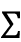

# eight

# 自动编码器

自动编码器是通过无监督学习进行学习的神经网络，有时也被称为半监督学习，因为输入也被视为目标。在这一章中，你将学习和实现自动编码器的不同变体，并最终学习如何堆叠自动编码器。我们还将看到如何使用自动编码器来创建 MNIST 数字，最后，还包括建立一个长短期记忆自动编码器来生成句子向量的步骤。本章包括以下主题:

*   普通自动编码器
*   稀疏自动编码器
*   降噪自动编码器
*   卷积自动编码器
*   堆叠自动编码器
*   使用 LSTM 自动编码器生成句子
*   用于生成图像的变分自动编码器

本章的所有代码文件都可以在[https://packt.link/dltfchp8](https://packt.link/dltfchp8)找到

我们开始吧！

# 自动编码器简介

自动编码器是一类神经网络，试图使用反向传播来重建输入作为目标。自动编码器由两部分组成:编码器和解码器。编码器将读取输入并将其压缩为紧凑的表示形式，解码器将读取该紧凑的表示形式并从中重新创建输入。换句话说，自动编码器试图通过最小化重构误差来学习恒等函数。

他们具有学习数据的紧凑表示的固有能力。它们处于深度信念网络的中心，并在图像重建、聚类、机器翻译等领域得到应用。

你可能认为使用深度神经网络实现身份函数很无聊；然而，这样做的方式使它变得有趣。自动编码器中隐藏单元的数量通常少于输入(和输出)单元的数量。这迫使编码器学习解码器重建的输入的压缩表示。如果输入数据中存在输入特征之间相关性形式的结构，那么自动编码器将发现其中一些相关性，并最终学习数据的低维表示，类似于使用**主成分分析** ( **PCA** )学习的。

PCA 使用线性变换，而自动编码器则使用非线性变换。

一旦训练了自动编码器，我们通常会丢弃解码器组件，而使用编码器组件来生成输入的紧凑表示。或者，我们可以使用编码器作为特征检测器，生成输入的紧凑、语义丰富的表示，并通过将 softmax 分类器附加到隐藏层来构建分类器。

自动编码器的编码器和解码器组件可以使用密集网络、卷积网络或递归网络来实现，具体取决于所建模的数据类型。例如，对于用来构建**协同过滤** ( **CF** )模型的自动编码器来说，密集网络可能是一个很好的选择，在这里，我们可以根据实际的稀疏用户评级来学习用户偏好的压缩模型。类似地，卷积神经网络可能适用于 M. Runfeldt 的文章 *iSee:使用深度学习从面部移除眼镜*中描述的用例。另一方面，递归网络对于处理序列或文本数据的自动编码器来说是一个很好的选择，例如深度患者(*深度患者:一种无监督的表示，用于根据电子健康记录*，Miotto 等人)和 skip-thought vectors 来预测患者的未来。

我们可以认为自动编码器由两个级联的网络组成。第一网络是编码器；它获取输入 *x* ，并使用变换 *h* 将其编码为编码信号 *y* ，即:

*y= h* ( *x*

第二网络使用编码信号 *y* 作为其输入，并执行另一变换 *f* 以获得重构信号 *r* ，即:

*r = f*(*y*)*= f*(*h*(*x*))

我们将误差 *e* 定义为原始输入 *x* 与重构信号 *r 之差，e= x- r* 。然后，网络通过减少损失函数(例如，**均方误差** ( **MSE** ))来学习，并且在**多层感知器** ( **MLPs** )的情况下，误差被反向传播到隐藏层作为。

根据编码层相对于输入、损失函数和约束的实际尺寸，有各种类型的自动编码器:变分自动编码器、稀疏自动编码器、去噪自动编码器和卷积自动编码器。

也可以通过连续堆叠编码器来堆叠自动编码器，编码器将其输入压缩为越来越小的表示，然后以相反的顺序堆叠解码器。堆叠自动编码器具有更强的表达能力，并且连续的表示层捕获输入的分层分组，类似于卷积神经网络中的卷积和汇集操作。

堆叠式自动编码器过去是一层一层地训练的。例如，在*图 8.1* 中的网络中，我们将首先训练层 **X** 以使用隐藏层 **H1** 重建层**X’**(忽略 **H2** )。然后我们将训练层 **H1** 使用隐藏层 **H2** 重建层**H1**。最后，我们将所有的层按照所示的配置堆叠在一起，并对其进行微调，以从 **X** 重建**X’**。然而，如今有了更好的激活和正则化函数，完全训练这些网络是很常见的:


图 8.1:堆叠自动编码器的可视化

在这一章中，我们将学习自动编码器中的这些变化，并使用 TensorFlow 实现它们。

# 普通自动编码器

辛顿在他 2006 年的论文*中提出的香草自动编码器使用神经网络*减少数据的维度，只包含一个隐藏层。隐藏层中的神经元数量少于输入(或输出)层中的神经元数量。

这导致在网络信息流中产生瓶颈效应。编码器输入和解码器输出之间的隐藏层( *y* )也被称为“瓶颈层”自动编码器中的学习包括在隐藏层开发输入信号的紧凑表示，以便输出层可以忠实地再现原始输入。

在*图 8.2* 中，您可以看到普通自动编码器的架构:


图 8.2:普通自动编码器的架构

让我们尝试构建一个普通的自动编码器。虽然在论文中 Hinton 使用它来降低维数，但在接下来的代码中，我们将使用自动编码器来进行图像重建。我们将在 MNIST 数据库上训练自动编码器，并用它来重建测试图像。在代码中，我们将使用 TensorFlow Keras `Layers`类来构建我们自己的编码器和解码器层，所以首先让我们了解一下`Layers`类。

## TensorFlow Keras 层定义自定义层

TensorFlow 提供了一种简单的方法来定义您自己的自定义层，无论是从头开始还是作为现有层的组合。TensorFlow Keras `layers`包定义了一个`Layers`对象。我们可以通过简单地使它成为`Layers`类的子类来创建我们自己的层。在定义图层时，有必要定义输出的尺寸。虽然输入尺寸是可选的，但是如果您不定义它们，它将从数据中自动推断它们。为了构建我们自己的层，我们需要实现三个方法:

*   这里，你定义了所有独立于输入的初始化。
*   `build()`:在这里，我们定义输入张量的形状，如果需要，可以执行 rest 初始化。在我们的例子中，因为我们没有明确定义输入形状，所以我们不需要定义`build()`方法。
*   `call()`:这是执行正向计算的地方。

使用`tensorflow.keras.layers.Layer`类，我们现在定义编码器和解码器层。首先让我们从编码器层开始。我们将`tensorflow.keras`作为`K`导入，并创建一个`Encoder`类。`Encoder`接受输入并生成隐藏或瓶颈层作为输出:

```
class Encoder(K.layers.Layer):

    def __init__(self, hidden_dim):

        super(Encoder, self).__init__()

        self.hidden_layer = K.layers.Dense(units=hidden_dim, activation=tf.nn.relu)

    def call(self, input_features):

        activation = self.hidden_layer(input_features)

        return activation 
```

接下来，我们定义`Decoder`类；这个类接收来自`Encoder`的输出，然后通过一个完全连接的神经网络传递它。目的是能够重建`Encoder`的输入:

```
class Decoder(K.layers.Layer):

    def __init__(self, hidden_dim, original_dim):

        super(Decoder, self).__init__()

        self.output_layer = K.layers.Dense(units=original_dim, activation=tf.nn.relu)

    def call(self, encoded):

        activation = self.output_layer(encoded)

        return activation 
```

现在我们已经定义了编码器和解码器，我们使用`tensorflow.keras.Model`对象来构建自动编码器模型。你可以在下面的代码中看到，在`__init__()`函数中我们实例化了编码器和解码器对象，在`call()`方法中我们定义了信号流。还要注意在`_init__()`中初始化的成员列表`self.loss`:

```
class Autoencoder(K.Model):

    def __init__(self, hidden_dim, original_dim):

        super(Autoencoder, self).__init__()

        self.loss = []

        self.encoder = Encoder(hidden_dim=hidden_dim)

        self.decoder = Decoder(hidden_dim=hidden_dim, original_dim=original_dim)

    def call(self, input_features):

        encoded = self.encoder(input_features)

        reconstructed = self.decoder(encoded)

        return reconstructed 
```

在下一节中，我们将使用我们在这里定义的自动编码器来重建手写数字。

## 使用自动编码器重建手写数字

既然我们已经准备好了带有层编码器和解码器的 autoencoder 模型，让我们尝试重建手写数字。完整的代码可以在笔记本`VanillaAutoencoder.ipynb`章节的 GitHub repo 中找到。代码将需要 NumPy、TensorFlow 和 Matplotlib 模块:

```
import numpy as np

import tensorflow as tf

import tensorflow.keras as K

import matplotlib.pyplot as plt 
```

在开始实际实现之前，让我们也定义一些超参数。如果您使用它们，您将会注意到，即使您的模型的架构保持不变，但是模型性能有了显著的变化。超参数整定(详见*第一章*、*带 TF 的神经网络基础*)是深度学习的重要步骤之一。为了再现性，我们为随机计算设置了种子:

```
np.random.seed(11)

tf.random.set_seed(11)

batch_size = 256

max_epochs = 50

learning_rate = 1e-3

momentum = 8e-1

hidden_dim = 128

original_dim = 784 
```

对于训练数据，我们使用 TensorFlow 数据集中可用的 MNIST 数据集。我们对数据进行归一化，使像素值位于[0，1]之间；这通过简单地将每个像素单元除以 255 来实现。

我们重塑了从 2D 到 1D 的张量。我们使用`from_tensor_slices`函数来生成一个批量数据集，其中训练数据集沿其第一维进行切片(张量切片)。还要注意，我们没有使用一次性编码标签；这是因为我们不使用标签来训练网络，因为自动编码器通过无监督学习来学习:

```
(x_train, _), (x_test, _) = K.datasets.mnist.load_data()

x_train = x_train / 255.

x_test = x_test / 255.

x_train = x_train.astype(np.float32)

x_test = x_test.astype(np.float32)

x_train = np.reshape(x_train, (x_train.shape[0], 784))

x_test = np.reshape(x_test, (x_test.shape[0], 784))

training_dataset = tf.data.Dataset.from_tensor_slices(x_train).batch(batch_size) 
```

现在我们实例化我们的 autoencoder 模型对象，并定义用于训练的损失和优化器。仔细观察损失函数的公式；它只是原始图像和重建图像之间的差异。你可能会发现*重建损失*一词在许多书籍和论文中也被用来描述它:

```
autoencoder = Autoencoder(hidden_dim=hidden_dim, original_dim=original_dim)

opt = tf.keras.optimizers.Adam(learning_rate=1e-2)

def loss(preds, real):

    return tf.reduce_mean(tf.square(tf.subtract(preds, real))) 
```

对于我们的自定义自动编码器模型，我们将定义一个自定义训练，而不是使用自动训练循环。我们使用`tf.GradientTape`记录计算的梯度，并将梯度隐式应用于我们模型的所有可训练变量:

```
def train(loss, model, opt, original):

    with tf.GradientTape() as tape:

        preds = model(original)

        reconstruction_error = loss(preds, original)

        gradients = tape.gradient(reconstruction_error, model.trainable_variables)

        gradient_variables = zip(gradients, model.trainable_variables)

    opt.apply_gradients(gradient_variables)

    return reconstruction_error 
```

前面的`train()`函数将在一个训练循环中被调用，数据集被成批地提供给模型:

```
def train_loop(model, opt, loss, dataset, epochs=20):

    for epoch in range(epochs):

        epoch_loss = 0

        for step, batch_features in enumerate(dataset):

            loss_values = train(loss, model, opt, batch_features)

            epoch_loss += loss_values

        model.loss.append(epoch_loss)

        print('Epoch {}/{}. Loss: {}'.format(epoch + 1, epochs, epoch_loss.numpy())) 
```

现在让我们来训练我们的自动编码器:

```
train_loop(autoencoder, opt, loss, training_dataset, epochs=max_epochs) 
```

绘制我们的训练图:

```
plt.plot(range(max_epochs), autoencoder.loss)

plt.xlabel('Epochs')

plt.ylabel('Loss')

plt.show() 
```

训练图如下所示。我们可以看到，损失/成本随着网络的学习而降低，在 50 个时期后，它几乎保持在一条线上。这意味着进一步增加历元的数量是没有用的。如果我们想进一步改善我们的训练，我们应该改变学习率和`batch_size`等超参数:


图 8.3:普通自动编码器的损耗图

在*图 8.4* 中，可以看到的原始(上)和重建(下)图像；它们有点模糊，但很准确:

```
number = 10  # how many digits we will display

plt.figure(figsize=(20, 4))

for index in range(number):

    # display original

    ax = plt.subplot(2, number, index + 1)

    plt.imshow(x_test[index].reshape(28, 28), cmap='gray')

    ax.get_xaxis().set_visible(False)

    ax.get_yaxis().set_visible(False)

    # display reconstruction

    ax = plt.subplot(2, number, index + 1 + number)

    plt.imshow(autoencoder(x_test)[index].numpy().reshape(28, 28), cmap='gray')

    ax.get_xaxis().set_visible(False)

    ax.get_yaxis().set_visible(False)

plt.show() 
```


图 8.4:使用普通自动编码器的原始和重建图像

有趣的是，在前面的代码中，我们将输入的维数从 784 减少到 128，而我们的网络仍然可以重建原始图像。这应该会让您对自动编码器在维度缩减方面的能力有所了解。自动编码器优于 PCA 的一个优势是，虽然 PCA 只能表示线性变换，但我们可以在自动编码器中使用非线性激活函数，从而在编码中引入非线性:


图 8.5: LHS 图像:取所有 60000 个训练样本的前两个主成分产生的每类 500 位的二维码。RHS 图像:由 784-500-2 自动编码器找到的二维码

*图 8.5* 比较了 PCA 的结果和具有由 784-500-2 组成的架构的堆叠自动编码器的结果(这里的数字代表每个自动编码器中编码器层的大小；自动编码器具有对称解码器)。

你可以看到右边的彩色点被很好地分开，因此堆叠的自动编码器比 PCA 给出了更好的结果。现在您已经熟悉了普通的自动编码器，让我们来看看自动编码器的不同变体及其实现细节。

# 稀疏自动编码器

我们在上一节中介绍的 autoencoder 更像是一个身份网络；它只是重建输入。重点是在像素级别重建图像，唯一的限制是瓶颈层的单元数量。虽然这很有趣，但像素级重建主要是一种压缩机制，并不一定能确保网络从数据集中学习抽象特征。我们可以通过添加进一步的约束来确保网络从数据集中学习抽象特征。

在稀疏自动编码器中，稀疏惩罚项被添加到重构误差中。这试图确保在任何给定的时间，瓶颈层中的更少的单元将被触发。我们可以在编码器层本身中包括稀疏惩罚。

在下面的代码中，您可以看到`Encoder`的密集层现在有了一个额外的参数`activity_regularizer`:

```
class SparseEncoder(K.layers.Layer):

    def __init__(self, hidden_dim):

        # encoder initializer

        super(SparseEncoder, self).__init__()

        self.hidden_layer = K.layers.Dense(units=hidden_dim, activation=tf.nn.relu, activity_regularizer=regularizers.l1(10e-5))

    def call(self, input_features):

        # forward function

        activation = self.hidden_layer(input_features)

        return activation 
```

活动正则化器试图减少层输出(参见*第一章*，*带 TF 的神经网络基础*)。它将减少全连接层的重量和偏差，以确保输出尽可能小。TensorFlow 支持三种类型的`activity_regularizer`:

*   `l1`:此处活动计算为绝对值的总和
*   `l2`:此处的活动计算为平方值的总和
*   这包括 L1 条款和 L2 条款

保持其余代码不变，只需更改编码器，就可以从普通自动编码器获得稀疏自动编码器。稀疏自动编码器的完整代码在 Jupyter 笔记本`SparseAutoencoder.ipynb`中。

或者，您可以在损失函数中为稀疏性显式添加一个正则化项。为此，您需要将稀疏项的正则化实现为一个函数。如果 *m* 是输入模式的总数，那么我们可以定义一个量(你可以在这里查看吴恩达讲座中的数学细节:[https://web . Stanford . edu/class/cs 294 a/sparseautoencer _ 2011 new . pdf](https://web.stanford.edu/class/cs294a/sparseAutoencoder_2011new.pdf)，它衡量每个隐藏层单元的净活动量(平均触发多少次)。基本思想是设置一个约束，使其等于稀疏度参数。这导致在损失函数中添加用于稀疏性的正则化项，使得现在损失函数变成:

*损失=均方误差+稀疏度参数的正则化*

如果偏离，这个正则项将惩罚网络。一个标准的做法是在和之间使用**kull back-Leiber**(**KL**)散度(你可以从这个有趣的讲座中了解更多关于 KL 散度的知识:[https://www . stat . CMU . edu/~ cshalizi/754/2006/notes/lecture-28 . pdf](https://www.stat.cmu.edu/~cshalizi/754/2006/notes/lecture-28.pdf))。

再来探讨一下 KL 散度， *D* [KL] ，多一点。它是两个分布之间的差异的非对称度量，在我们的例子中，和。当和相等时，差值为零；否则，它随着从偏离而单调增加。数学上，它表示为:


我们将此添加到损失中，以隐式包含稀疏项。我们将需要为稀疏项固定一个常量值，并使用编码器输出来计算。

输入的紧凑表示存储在权重中。让我们把网络学习到的权重形象化。以下分别是标准和稀疏自动编码器的编码器层的权重。

我们可以看到，在标准的自动编码器(a)中，许多隐藏单元具有非常大的权重(更亮)，这表明它们工作过度，而稀疏自动编码器(b)的所有隐藏单元几乎相等地学习输入表示，并且我们看到更均匀的颜色分布:


图 8.6 :( a)标准自动编码器和(b)稀疏自动编码器的编码器权重矩阵

既然我们已经了解了稀疏自动编码器，我们接下来将讨论自动编码器可以学习从图像中去除噪声的情况。

# 降噪自动编码器

我们在前面章节中介绍的两个自动编码器是欠完整自动编码器的例子，因为它们中的隐藏层与输入(输出)层相比具有更低的维度。去噪自动编码器属于过完备自动编码器，因为当隐藏层的维数大于输入层的维数时，它们工作得更好。

去噪自动编码器从被破坏的(有噪声的)输入中学习；它向其编码器网络提供噪声输入，然后将来自解码器的重建图像与原始输入进行比较。这个想法是，这将有助于网络学习如何去噪输入。它将不再只是进行逐像素的比较，而是为了去噪，它还将学习相邻像素的信息。

去噪自动编码器与其他自动编码器主要有两个区别:第一，`n_hidden`，瓶颈层的隐藏单元数大于输入层的单元数，`m`，即`n_hidden` > `m`。第二，编码器的输入是被破坏的输入。

为此，我们在测试和训练图像中都添加了噪声项:

```
noise = np.random.normal(loc=0.5, scale=0.5, size=x_train.shape)

x_train_noisy = x_train + noise

noise = np.random.normal(loc=0.5, scale=0.5, size=x_test.shape)

x_test_noisy = x_test + noise

x_train_noisy = np.clip(x_train_noisy, 0., 1.)

x_test_noisy = np.clip(x_test_noisy, 0., 1.) 
```

接下来让我们看看去噪自动编码器的作用。

## 使用去噪自动编码器清除图像

让我们使用去噪自动编码器来清除手写的 MNIST 数字:

1.  我们从导入所需的模块开始:

    ```
    import numpy as np

    import tensorflow as tf

    import tensorflow.keras as K

    import matplotlib.pyplot as plt 
    ```

2.  接下来，我们为我们的模型定义超参数:

    ```
    np.random.seed(11)

    tf.random.set_seed(11)

    batch_size = 256

    max_epochs = 50

    learning_rate = 1e-3

    momentum = 8e-1

    hidden_dim = 128

    original_dim = 784 
    ```

3.  我们读入 MNIST 数据集，对其进行归一化，并引入噪声:

    ```
    (x_train, _), (x_test, _) = K.datasets.mnist.load_data()

    x_train = x_train / 255.

    x_test = x_test / 255.

    x_train = x_train.astype(np.float32)

    x_test = x_test.astype(np.float32)

    x_train = np.reshape(x_train, (x_train.shape[0], 784))

    x_test = np.reshape(x_test, (x_test.shape[0], 784))

    # Generate corrupted MNIST images by adding noise with normal dist

    # centered at 0.5 and std=0.5

    noise = np.random.normal(loc=0.5, scale=0.5, size=x_train.shape)

    x_train_noisy = x_train + noise

    noise = np.random.normal(loc=0.5, scale=0.5, size=x_test.shape)

    x_test_noisy = x_test + noise 
    ```

4.  我们使用与*普通自动编码器*部分:

    ```
    # Encoder

    class Encoder(K.layers.Layer):

        def __init__(self, hidden_dim):

            super(Encoder, self).__init__()

            self.hidden_layer = K.layers.Dense(units=hidden_dim, activation=tf.nn.relu)

        def call(self, input_features):

            activation = self.hidden_layer(input_features)

            return activation

    # Decoder

    class Decoder(K.layers.Layer):

        def __init__(self, hidden_dim, original_dim):

            super(Decoder, self).__init__()

            self.output_layer = K.layers.Dense(units=original_dim, activation=tf.nn.relu)

        def call(self, encoded):

            activation = self.output_layer(encoded)

            return activation

    class Autoencoder(K.Model):

        def __init__(self, hidden_dim, original_dim):

            super(Autoencoder, self).__init__()

            self.loss = []

            self.encoder = Encoder(hidden_dim=hidden_dim)

            self.decoder = Decoder(hidden_dim=hidden_dim, original_dim=original_dim)

        def call(self, input_features):

            encoded = self.encoder(input_features)

            reconstructed = self.decoder(encoded)

            return reconstructed 
    ```

    中定义的相同的编码器、解码器和自动编码器类
5.  接下来，我们创建模型并定义要使用的损失和优化器。注意，这一次，我们没有编写定制的训练循环，而是使用了更简单的 Keras 内置的`compile()`和`fit()`方法:

    ```
    model = Autoencoder(hidden_dim=hidden_dim, original_dim=original_dim)

    model.compile(loss='mse', optimizer='adam')

    loss = model.fit(x_train_noisy,

                x_train,

                validation_data=(x_test_noisy, x_test),

                epochs=max_epochs,

                batch_size=batch_size) 
    ```

6.  现在我们来绘制训练损失:

    ```
    plt.plot(range(max_epochs), loss.history['loss'])

    plt.xlabel('Epochs')

    plt.ylabel('Loss')

    plt.show() 
    ```

*图 8.7* 显示了各时期的损失:


图 8.7:去噪自动编码器的损耗图

最后，让我们看看我们的模型的运行情况:

```
number = 10  # how many digits we will display

plt.figure(figsize=(20, 4))

for index in range(number):

    # display original

    ax = plt.subplot(2, number, index + 1)

    plt.imshow(x_test_noisy[index].reshape(28, 28), cmap='gray')

    ax.get_xaxis().set_visible(False)

    ax.get_yaxis().set_visible(False)

    # display reconstruction

    ax = plt.subplot(2, number, index + 1 + number)

    plt.imshow(model(x_test_noisy)[index].numpy().reshape(28, 28), cmap='gray')

    ax.get_xaxis().set_visible(False)

    ax.get_yaxis().set_visible(False)

plt.show() 
```

顶行显示输入噪声图像，底行显示由我们训练的去噪自动编码器产生的干净图像:


图 8.8:噪声输入图像和相应的去噪重建图像

令人印象深刻的图像重建从嘈杂的图像，我相信你会同意。如果你想玩的话，你可以访问笔记本`DenoisingAutoencoder.ipynb`中的代码。

# 堆叠自动编码器

到目前为止，我们仅限于使用只有一个隐藏层的自动编码器。我们可以通过堆叠多层编码器和解码器来构建深度自动编码器；这种自动编码器被称为堆叠式自动编码器。一个编码器提取的特征作为输入传递给下一个编码器。堆叠式自动编码器可以作为整个网络来训练，目的是最小化重构误差。或者，每个编码器/解码器网络可以首先使用您之前学习的无监督方法进行预训练，然后可以对整个网络进行微调。当深度自动编码器网络是卷积网络时，我们称之为**卷积自动编码器**。接下来让我们在 TensorFlow 中实现一个卷积自动编码器。

## 去除图像噪声的卷积自动编码器

在前一节中，我们从有噪声的输入图像中重建了手写数字。我们使用完全连接的网络作为这项工作的编码器和解码器。然而，我们知道对于图像，卷积网络可以提供更好的结果，因此在本节中，我们将对编码器和解码器都使用卷积网络。为了获得更好的结果，我们将在编码器和解码器网络中使用多个卷积层；也就是说，我们将制作卷积层的堆栈(以及最大池或上采样层)。我们还将把整个 autoencoder 作为一个整体进行培训:

1.  我们从`tensorflow.keras.layers` :

    ```
    import numpy as np

    import tensorflow as tf

    import tensorflow.keras as K

    import matplotlib.pyplot as plt

    from tensorflow.keras.layers import Dense, Conv2D, MaxPooling2D, UpSampling2D 
    ```

    导入所有需要的模块和特定的层
2.  我们指定我们的超参数。如果你仔细观察，这个列表与早期的 autoencoder 实现略有不同；代替学习速率和动量，这次我们关注卷积层的滤波器:

    ```
    np.random.seed(11)

    tf.random.set_seed(11)

    batch_size = 128

    max_epochs = 50

    filters = [32,32,16] 
    ```

3.  下一步，我们读入数据并对其进行预处理。同样，您可能会观察到与前面的代码略有不同，特别是我们添加噪声的方式，然后将范围限制在[0-1]之间。我们这样做是因为在这种情况下，我们将使用二进制交叉熵损失，而不是均方误差损失，解码器的最终输出将通过 sigmoid 激活，将其限制在[0-1]:

    ```
    (x_train, _), (x_test, _) = K.datasets.mnist.load_data()

    x_train = x_train / 255.

    x_test = x_test / 255.

    x_train = np.reshape(x_train, (len(x_train),28, 28, 1))

    x_test = np.reshape(x_test, (len(x_test), 28, 28, 1))

    noise = 0.5

    x_train_noisy = x_train + noise * np.random.normal(loc=0.0, scale=1.0, size=x_train.shape)

    x_test_noisy = x_test + noise * np.random.normal(loc=0.0, scale=1.0, size=x_test.shape)

    x_train_noisy = np.clip(x_train_noisy, 0, 1)

    x_test_noisy = np.clip(x_test_noisy, 0, 1)

    x_train_noisy = x_train_noisy.astype('float32')

    x_test_noisy = x_test_noisy.astype('float32')

    #print(x_test_noisy[1].dtype) 
    ```

    之间
4.  现在让我们定义我们的编码器。编码器由三个卷积层组成，每个卷积层后面都有一个最大池层。由于我们使用的是 MNIST 数据集，输入图像的形状为 28 × 28(单通道)，输出图像的大小为 4 × 4(由于最后一个卷积层有 16 个滤波器，因此图像有 16 个通道):

    ```
    class Encoder(K.layers.Layer):

        def __init__(self, filters):

            super(Encoder, self).__init__()

            self.conv1 = Conv2D(filters=filters[0], kernel_size=3, strides=1, activation='relu', padding='same')

            self.conv2 = Conv2D(filters=filters[1], kernel_size=3, strides=1, activation='relu', padding='same')

            self.conv3 = Conv2D(filters=filters[2], kernel_size=3, strides=1, activation='relu', padding='same')

            self.pool = MaxPooling2D((2, 2), padding='same')

        def call(self, input_features):

            x = self.conv1(input_features)

            x = self.pool(x)

            x = self.conv2(x)

            x = self.pool(x)

            x = self.conv3(x)

            x = self.pool(x)

            return x 
    ```

5.  接下来是解码器。它在设计上与编码器完全相反，我们使用上采样来增加大小，而不是最大池。注意注释过的`print`语句；您可以使用它们来了解形状在每一步之后是如何被修改的。(或者，您也可以使用`model.summary`函数来获取完整的模型摘要。)还要注意，编码器和解码器仍然是基于 TensorFlow Keras `Layers`类的类，但是现在它们内部有多个层。现在你知道如何构建一个复杂的定制层了:

    ```
    class Decoder(K.layers.Layer):

        def __init__(self, filters):

            super(Decoder, self).__init__()

            self.conv1 = Conv2D(filters=filters[2], kernel_size=3, strides=1, activation='relu', padding='same')

            self.conv2 = Conv2D(filters=filters[1], kernel_size=3, strides=1, activation='relu', padding='same')

            self.conv3 = Conv2D(filters=filters[0], kernel_size=3, strides=1, activation='relu', padding='valid')

            self.conv4 = Conv2D(1, 3, 1, activation='sigmoid', padding='same')

            self.upsample = UpSampling2D((2, 2))

        def call(self, encoded):

            x = self.conv1(encoded)

            #print("dx1", x.shape)

            x = self.upsample(x)

            #print("dx2", x.shape)

            x = self.conv2(x)

            x = self.upsample(x)

            x = self.conv3(x)

            x = self.upsample(x)

            return self.conv4(x) 
    ```

6.  我们将编码器和解码器结合起来，建立了一个自动编码器模型。这与之前的完全相同:

    ```
    class Autoencoder(K.Model):

        def __init__(self, filters):

            super(Autoencoder, self).__init__()

            self.encoder = Encoder(filters)

            self.decoder = Decoder(filters)

        def call(self, input_features):

            #print(input_features.shape)

            encoded = self.encoder(input_features)

            #print(encoded.shape)

            reconstructed = self.decoder(encoded)

            #print(reconstructed.shape)

            return reconstructed 
    ```

7.  现在我们实例化我们的模型，然后在`compile()`方法中指定二进制交叉熵作为损失函数，Adam 作为优化器。然后，将模型拟合到训练数据集:

    ```
    model = Autoencoder(filters)

    model.compile(loss='binary_crossentropy', optimizer='adam')

    loss = model.fit(x_train_noisy,

                x_train,

                validation_data=(x_test_noisy, x_test),

                epochs=max_epochs,

                batch_size=batch_size) 
    ```

8.  Plot the loss curve:

    ```
    plt.plot(range(max_epochs), loss.history['loss'])

    plt.xlabel('Epochs')

    plt.ylabel('Loss')

    plt.show() 
    ```

    你可以看到模型训练时的损耗曲线；在 50 个时期内，损失减少到 0.0988:

    

    图 8.9:卷积自动编码器的损耗图

1.  最后，你可以从嘈杂的输入图像中看到精彩的重建图像:

    ```
    number = 10  # how many digits we will display

    plt.figure(figsize=(20, 4))

    for index in range(number):

        # display original

        ax = plt.subplot(2, number, index + 1)

        plt.imshow(x_test_noisy[index].reshape(28, 28), cmap='gray')

        ax.get_xaxis().set_visible(False)

        ax.get_yaxis().set_visible(False)

        # display reconstruction

        ax = plt.subplot(2, number, index + 1 + number)

        plt.imshow(tf.reshape(model(x_test_noisy)[index], (28, 28)), cmap='gray')

        ax.get_xaxis().set_visible(False)

        ax.get_yaxis().set_visible(False)

    plt.show() 
    ```


图 8.10:输入的噪声图像和重建的去噪图像

你可以看到，相对于我们在本章中提到的之前的自动编码器，这些图像更加清晰。神奇之处在于卷积层的堆叠。这部分的代码可以在 Jupyter 笔记本`ConvolutionAutoencoder.ipynb`中找到。

## TensorFlow Keras 自动编码器示例句子向量

在本例中，我们将构建并训练一个基于 LSTM 的自动编码器，为 Reuters-21578 语料库中的文档生成句子向量([https://archive . ics . UCI . edu/ml/datasets/Reuters-21578+text+categorization+collection](https://archive.ics.uci.edu/ml/datasets/reuters-21578+text+categorization+collection))。我们已经在*第 4 章*、*单词嵌入*中看到，如何使用单词嵌入创建向量来表示单词在其他单词出现的上下文中的含义。在这里，我们将看到如何为句子建立相似的向量。句子是单词的序列，所以句子向量代表句子的意思。

构建句子向量最简单的方法是将单词向量相加，然后除以单词数。然而，这将句子视为一个单词包，并且没有考虑单词的顺序。因此，在这种情况下，句子*狗咬了人*和*人咬了狗*将被视为相同。LSTMs 设计用于处理序列输入，并考虑单词的顺序，从而为提供更好、更自然的句子表示。

首先，我们导入必要的库:

```
from sklearn.model_selection import train_test_split

from tensorflow.keras.callbacks import ModelCheckpoint

from tensorflow.keras.layers import Input

from tensorflow.keras.layers import RepeatVector

from tensorflow.keras.layers import LSTM

from tensorflow.keras.layers import Bidirectional

from tensorflow.keras.models import Model

from tensorflow.keras.preprocessing import sequence

from scipy.stats import describe

import collections

import matplotlib.pyplot as plt

import nltk

import numpy as np

import os

from time import gmtime, strftime

from tensorflow.keras.callbacks import TensorBoard

import re

# Needed to run only once

nltk.download('punkt')

nltk.download('reuters')

from nltk.corpus import reuters 
```

如果您使用 Google 的 Colab 来运行代码，您还需要通过在代码中添加以下内容来解压缩 Reuters corpus:

```
%%capture

!unzip /root/nltk_data/corpora/reuters.zip -d /root/nltk_data/corpora 
```

接下来，我们将使用手套嵌入，所以让我们也下载它们:

```
!wget http://nlp.stanford.edu/data/glove.6B.zip

!unzip glove*.zip 
```

现在我们所有的工具都在我们的工作区中，我们将首先把每个文本块(文档)转换成一个句子列表，每行一个句子。此外，句子中的每个单词在添加时都会被规范化。规范化包括删除所有数字并用数字`9`替换它们，然后将单词转换成小写。同时我们也计算了同一代码中的词频。结果就是词频表，`word_freqs`:

```
def is_number(n):

    temp = re.sub("[.,-/]", "",n)

    return temp.isdigit()

# parsing sentences and building vocabulary

word_freqs = collections.Counter()

documents = reuters.fileids()

#ftext = open("text.tsv", "r")

sents = []

sent_lens = []

num_read = 0

for i in range(len(documents)):

    # periodic heartbeat report

    if num_read % 100 == 0:

        print("building features from {:d} docs".format(num_read))

    # skip docs without specified topic

    title_body = reuters.raw(documents[i]).lower()

    if len(title_body) == 0:

        continue

    num_read += 1

    # convert to list of word indexes

    title_body = re.sub("\n", "", title_body)

    for sent in nltk.sent_tokenize(title_body):

        for word in nltk.word_tokenize(sent):

            if is_number(word):

                word = "9"

            word = word.lower()

            word_freqs[word] += 1

        sents.append(sent)

        sent_lens.append(len(sent)) 
```

让我们使用前面生成的数组来获得一些关于语料库的信息，这些信息将帮助我们为我们的 LSTM 网络计算出好的常量值:

```
print("Total number of sentences are: {:d} ".format(len(sents)))

print ("Sentence distribution min {:d}, max {:d} , mean {:3f}, median {:3f}".format(np.min(sent_lens), np.max(sent_lens), np.mean(sent_lens), np.median(sent_lens)))

print("Vocab size (full) {:d}".format(len(word_freqs))) 
```

这给了我们以下关于语料库的信息:

```
Total number of sentences are: 50470 

Sentence distribution min 1, max 3688 , mean 167.072657, median 155.000000

Vocab size (full) 33748 
```

基于这些信息，我们为我们的 LSTM 模型设置以下常数。我们选择我们的`VOCAB_SIZE`作为`5000`；也就是说，我们的词汇涵盖了最常见的 5000 个单词，这涵盖了语料库中使用的 93%以上的单词。剩下的单词被视为词汇 ( **OOV** )之外的**，用令牌`UNK`替换。在预测时，任何模型没有见过的单词也将被赋予标记`UNK`。`SEQUENCE_LEN`被设置为训练集中句子长度中值的大约一半。短于`SEQUENCE_LEN`的句子将被一个特殊的`PAD`字符填充，而长的句子将被截断以符合限制:**

```
VOCAB_SIZE = 5000

SEQUENCE_LEN = 50 
```

由于我们的 LSTM 的输入将是数字，我们需要构建在单词和单词 id 之间来回转换的查找表。由于我们将词汇量限制为 5000，并且我们必须添加两个伪单词`PAD`和`UNK`，我们的查找表包含最频繁出现的 4998 个单词的条目，外加`PAD`和`UNK`:

```
word2id = {}

word2id["PAD"] = 0

word2id["UNK"] = 1

for v, (k, _) in enumerate(word_freqs.most_common(VOCAB_SIZE - 2)):

    word2id[k] = v + 2

id2word = {v:k for k, v in word2id.items()} 
```

我们网络的输入是一个单词序列，每个单词用一个向量表示。简单地说，我们可以对每个单词使用一键编码，但是这使得输入数据非常大。所以，我们用 50 维手套嵌入来编码每个单词。

嵌入被生成到一个形状矩阵(`VOCAB_SIZE`和`EMBED_SIZE`)中，其中每一行代表我们词汇表中一个单词的手套嵌入。`PAD`和`UNK`行(分别为`0`和`1`)分别填充有零和随机统一值:

```
EMBED_SIZE = 50

def lookup_word2id(word):

    try:

        return word2id[word]

    except KeyError:

        return word2id["UNK"]

def load_glove_vectors(glove_file, word2id, embed_size):

    embedding = np.zeros((len(word2id), embed_size))

    fglove = open(glove_file, "rb")

    for line in fglove:

        cols = line.strip().split()

        word = cols[0].decode('utf-8')

        if embed_size == 0:

            embed_size = len(cols) - 1

        if word in word2id:

            vec = np.array([float(v) for v in cols[1:]])

        embedding[lookup_word2id(word)] = vec

    embedding[word2id["PAD"]] = np.zeros((embed_size))

    embedding[word2id["UNK"]] = np.random.uniform(-1, 1, embed_size)

    return embedding 
```

接下来，我们使用这些函数来生成嵌入:

```
sent_wids = [[lookup_word2id(w) for w in s.split()] for s in sents]

sent_wids = sequence.pad_sequences(sent_wids, SEQUENCE_LEN)

# load glove vectors into weight matrix

embeddings = load_glove_vectors("glove.6B.{:d}d.txt".format(EMBED_SIZE), word2id, EMBED_SIZE) 
```

我们的自动编码器模型采用一个手套字向量序列，并学习产生另一个与输入序列相似的序列。编码器 LSTM 将序列压缩成固定大小的上下文向量，解码器 LSTM 使用该向量来重建原始序列。

此处显示了网络示意图:


图 8.11:LSTM 网络的可视化

因为输入相当大，所以我们将使用一个生成器来产生每一批输入。我们的生成器生成批量的形状张量(`BATCH_SIZE`、`SEQUENCE_LEN`、`EMBED_SIZE`)。这里的`BATCH_SIZE`是`64`，由于我们使用的是 50 维手套向量，`EMBED_SIZE`就是`50`。我们在每个时期的开始重排句子，并返回 64 个句子的批次。每个句子被表示为手套单词向量的向量。如果词汇表中的单词没有相应的手套嵌入，则用零向量表示。我们构建了生成器的两个实例，一个用于训练数据，一个用于测试数据，分别由原始数据集的 70%和 30%组成:

```
BATCH_SIZE = 64

def sentence_generator(X, embeddings, batch_size):

    while True:

        # loop once per epoch

        num_recs = X.shape[0]

        indices = np.random.permutation(np.arange(num_recs))

        num_batches = num_recs // batch_size

        for bid in range(num_batches):

            sids = indices[bid * batch_size : (bid + 1) * batch_size]

            Xbatch = embeddings[X[sids, :]]

            yield Xbatch, Xbatch

train_size = 0.7

Xtrain, Xtest = train_test_split(sent_wids, train_size=train_size)

train_gen = sentence_generator(Xtrain, embeddings, BATCH_SIZE)

test_gen = sentence_generator(Xtest, embeddings, BATCH_SIZE) 
```

现在我们准备定义自动编码器。如图所示，它由一个编码器 LSTM 和一个解码器 LSTM 组成。编码器 LSTM 读取代表一批句子的形状张量(`BATCH_SIZE`、`SEQUENCE_LEN`、`EMBED_SIZE`)。每个句子被表示为一个填充的固定长度的单词序列，大小为`SEQUENCE_LEN`。每个单词被表示为一个 300 维的手套向量。编码器 LSTM 的输出维数是一个超参数，`LATENT_SIZE`，它是稍后将来自训练好的自动编码器的编码器部分的句子向量的大小。维度向量空间`LATENT_SIZE`代表编码句子含义的潜在空间。对于每个句子，LSTM 的输出是一个大小为(`LATENT_SIZE`)的向量，因此对于批处理，输出张量的形状是(`BATCH_SIZE`，`LATENT_SIZE`)。这现在被馈送到一个`RepeatVector`层，该层在整个序列中复制这一点；即，来自该层的输出张量具有形状(`BATCH_SIZE`、`SEQUENCE_LEN`、`LATENT_SIZE`)。这个张量现在被馈入解码器 LSTM，其输出维数是`EMBED_SIZE`，因此输出张量具有形状(`BATCH_SIZE`、`SEQUENCE_LEN`、`EMBED_SIZE`)，即与输入张量形状相同。

我们用 Adam 优化器和 MSE 损失函数编译这个模型。我们之所以用 MSE，是想在维度`LATENT_SIZE`的嵌入空间里重构一个意思相近的句子，也就是和原句接近的东西:

```
LATENT_SIZE = 512

EMBED_SIZE = 50

BATCH_SIZE = 64

NUM_EPOCHS = 20

inputs = Input(shape=(SEQUENCE_LEN, EMBED_SIZE), name="input")

encoded = Bidirectional(LSTM(LATENT_SIZE), merge_mode="sum", name="encoder_lstm")(inputs)

decoded = RepeatVector(SEQUENCE_LEN, name="repeater")(encoded)

decoded = Bidirectional(LSTM(EMBED_SIZE, return_sequences=True), merge_mode="sum", name="decoder_lstm")(decoded)

autoencoder = Model(inputs, decoded) 
```

我们将损失函数定义为均方误差，并选择 Adam 优化器:

```
autoencoder.compile(optimizer="adam", loss="mse") 
```

我们使用以下代码训练自动编码器 20 个时期。选择 20 个时期是因为 MSE 损失在此时间内收敛:

```
num_train_steps = len(Xtrain) // BATCH_SIZE

num_test_steps = len(Xtest) // BATCH_SIZE

steps_per_epoch=num_train_steps,

epochs=NUM_EPOCHS,

validation_data=test_gen,

validation_steps=num_test_steps,

history = autoencoder.fit_generator(train_gen,

                                steps_per_epoch=num_train_steps,

                                epochs=NUM_EPOCHS,

                                validation_data=test_gen,

                                validation_steps=num_test_steps) 
```

培训结果如下所示。下图显示了训练和验证数据的损失图；我们可以看到，随着模型的学习，损失如预期的那样减少:


图 8.12:LSTM 自动编码器的损耗图

因为我们输入的是嵌入矩阵，所以输出也是单词嵌入矩阵。由于嵌入空间是连续的，而我们的词汇是离散的，所以不是每个输出嵌入都会对应一个单词。我们能做的最好的事情是找到一个最接近输出嵌入的单词，以便重构原始文本。这有点麻烦，所以我们将以不同的方式评估我们的 autoencoder。

由于自动编码器的目标是产生一个良好的潜在表示，我们将使用原始输入的编码器产生的潜在向量与自动编码器的输出进行比较。

首先，我们将编码器组件提取到它自己的网络中:

```
encoder = Model(autoencoder.input, autoencoder.get_layer("encoder_lstm").output) 
```

然后，我们在测试集上运行自动编码器，以返回预测的嵌入。然后，我们通过编码器发送输入嵌入和预测嵌入，以从每个生成句子向量，并使用*余弦*相似性来比较这两个向量。接近“1”的余弦相似度表示高相似度，接近“0”的余弦相似度表示低相似度。

以下代码针对 500 个测试句子的随机子集运行，并在从源嵌入生成的句子向量和由自动编码器生成的相应目标嵌入之间产生余弦相似性的一些样本值:

```
def compute_cosine_similarity(x, y):

    return np.dot(x, y) / (np.linalg.norm(x, 2) * np.linalg.norm(y, 2))

k = 500

cosims = np.zeros((k))

i= 0

for bid in range(num_test_steps):

    xtest, ytest = next(test_gen)

    ytest_ = autoencoder.predict(xtest)

    Xvec = encoder.predict(xtest)

    Yvec = encoder.predict(ytest_)

    for rid in range(Xvec.shape[0]):

        if i >= k:

            break

        cosims[i] = compute_cosine_similarity(Xvec[rid], Yvec[rid])

        if i <= 10:

            print(cosims[i])

        i += 1

    if i >= k:

        break 
```

余弦相似度的前 10 个值如下所示。正如我们所见，这些向量似乎非常相似:

```
0.9765363335609436

0.9862152338027954

0.9831727743148804

0.977733314037323

0.9851642847061157

0.9849132895469666

0.9831638932228088

0.9843543767929077

0.9825796484947205

0.9877195954322815

0.9820773601531982 
```

*图 8.13* 显示了前 500 个句子的句子向量的余弦相似度值的分布直方图。

如前所述，它证实了从自动编码器的输入和输出生成的句子向量非常相似，表明得到的句子向量是句子的良好表示:


图 8.13:余弦相似性分布

到目前为止，我们一直专注于可以重建数据的自动编码器；在下一节中，我们将介绍自动编码器的一个略有不同的变体——变分自动编码器，它用于生成数据。

# 可变自动编码器

像 DBNs ( *第七章*、*无监督学习*和 GANs(详见*第九章*、*生成模型*，变分自动编码器也是生成模型。**变分自动编码器** ( **VAEs** )是最好的神经网络和贝叶斯推理的混合。它们是最有趣的神经网络之一，并且已经成为最流行的无监督学习方法之一。它们是带扭曲的自动编码器。除了自动编码器的传统编码器和解码器网络，它们还有额外的随机层。编码器网络之后的随机层使用高斯分布对数据进行采样，解码器网络之后的随机层使用伯努利分布对数据进行采样。像 GANs 一样，VAEs 可以用来基于它们被训练过的分布生成图像和图形。

VAEs 允许一个人在潜在空间中设置复杂的先验，从而学习强大的潜在表征。*图 8.14* 描述了一个 VAE:


图 8.14:可变自动编码器的架构

编码器网络近似于真实但难以处理的后验分布，其中 *x* 是 VAE 的输入， *z* 是潜在表示。解码器网络将 *d* 维潜变量(也称为潜在空间)作为其输入，并按照与 *P* ( *x* )相同的分布生成新图像。从上图可以看出，潜在表示 *z* 从采样，解码器网络的输出从采样。这里的 *N* 表示具有均值和方差的正态分布。

既然我们已经有了 VAEs 的基本架构，那么问题就来了，如何训练它们，因为训练数据的最大似然性和后验密度是难以处理的。通过最大化日志数据似然性的下限来训练网络。因此，损耗项由两部分组成:通过采样从解码器网络获得的发电损耗，以及 kull back-lei bler 散度项，也称为潜在损耗。

生成损失保证解码器生成的图像和用于训练网络的图像相似，潜在损失保证后验分布接近先验。由于编码器使用高斯分布进行采样，潜在损失衡量潜在变量与该分布的匹配程度。

一旦 VAE 被训练，我们可以只使用解码器网络来生成新的图像。让我们试着编码一个 VAE。这一次我们使用的是时尚-MNIST 数据集；数据集包含扎兰多([https://github.com/zalandoresearch/fashion-mnist](https://github.com/zalandoresearch/fashion-mnist))的文章图片。测试训练分割与 MNIST 完全相同，即 60，000 个训练图像和 10，000 个测试图像。每个图像的大小也是 28 × 28，所以我们可以很容易地用时尚-MNIST 数据集替换 MNIST 数据集上运行的代码。

本节代码改编自[https://github.com/dragen1860/TensorFlow-2.x-Tutorials](https://github.com/dragen1860/TensorFlow-2.x-Tutorials)。像往常一样，第一步我们导入所有必需的库:

```
import tensorflow as tf

import numpy as np

from matplotlib import pyplot as plt 
```

让我们为一个随机数确定种子，这样结果是可重复的。我们还可以添加一个`assert`语句来确保我们的代码运行在 TensorFlow 2.0 或更高版本上:

```
np.random.seed(333)

tf.random.set_seed(333)

assert tf.__version__.startswith('2.'), "TensorFlow Version Below 2.0" 
```

在继续制作 VAE 之前，让我们也稍微探索一下时尚 MNIST 数据集。数据集在 TensorFlow Keras API 中提供:

```
(x_train, y_train), (x_test, y_test) = tf.keras.datasets.fashion_mnist.load_data()

x_train, x_test = x_train.astype(np.float32)/255., x_test.astype(np.float32)/255.

print(x_train.shape, y_train.shape)

print(x_test.shape, y_test.shape) 
```

```
--------------------------------------------------

(60000, 28, 28) (60000,)

(10000, 28, 28) (10000,) 
```

我们看到一些样本图像:

```
number = 10  # how many digits we will display

plt.figure(figsize=(20, 4))

for index in range(number):

    # display original

    ax = plt.subplot(2, number, index + 1)

    plt.imshow(x_train[index], cmap='gray')

    ax.get_xaxis().set_visible(False)

    ax.get_yaxis().set_visible(False)

plt.show() 
```


图 8.15:来自时尚 MNIST 数据集的样本图像

在我们开始之前，让我们声明一些超参数，如学习率、隐藏层和潜在空间的维度、批量大小、时期等等:

```
image_size = x_train.shape[1]*x_train.shape[2]

hidden_dim = 512

latent_dim = 10

num_epochs = 80

batch_size = 100

learning_rate = 0.001 
```

我们使用 TensorFlow Keras 模型 API 来构建 VAE 模型。`__init__()`函数定义了我们将要使用的所有层:

```
class VAE(tf.keras.Model):

    def __init__(self,dim,**kwargs):

        h_dim = dim[0]

        z_dim = dim[1]

        super(VAE, self).__init__(**kwargs)

        self.fc1 = tf.keras.layers.Dense(h_dim)

        self.fc2 = tf.keras.layers.Dense(z_dim)

        self.fc3 = tf.keras.layers.Dense(z_dim)

        self.fc4 = tf.keras.layers.Dense(h_dim)

        self.fc5 = tf.keras.layers.Dense(image_size) 
```

我们定义函数给我们编码器输出和解码器输出，并重新参数化。编码器和解码器功能的实现很简单；然而，我们需要更深入地研究一下`reparametrize`函数。如你所知，VAEs 样本来自一个随机节点 *z* ，它由真实后验概率的来近似。现在，为了得到参数，我们需要使用反向传播。但是，反向传播不能在随机节点上工作。使用重新参数化，我们可以使用新的参数`eps`，这允许我们以允许通过确定性随机节点([https://arxiv.org/pdf/1312.6114v10.pdf](https://arxiv.org/pdf/1312.6114v10.pdf))反向传播的方式重新参数化`z`:

```
def encode(self, x):

    h = tf.nn.relu(self.fc1(x))

    return self.fc2(h), self.fc3(h)

def reparameterize(self, mu, log_var):

    std = tf.exp(log_var * 0.5)

    eps = tf.random.normal(std.shape)

    return mu + eps * std

def decode_logits(self, z):

    h = tf.nn.relu(self.fc4(z))

    return self.fc5(h)

def decode(self, z):

    return tf.nn.sigmoid(self.decode_logits(z)) 
```

最后，我们定义了`call()`函数，它将控制信号如何通过 VAE 的不同层:

```
def call(self, inputs, training=None, mask=None):

    mu, log_var = self.encode(inputs)

    z = self.reparameterize(mu, log_var)

    x_reconstructed_logits = self.decode_logits(z)

    return x_reconstructed_logits, mu, log_var 
```

现在，我们创建 VAE 模型，并为它声明优化器。您可以看到模型的摘要:

```
model = VAE([hidden_dim, latent_dim])

model.build(input_shape=(4, image_size))

model.summary()

optimizer = tf.keras.optimizers.Adam(learning_rate) 
```

```
Model: "vae"

_________________________________________________________________

 Layer (type)                Output Shape              Param #   

=================================================================

 dense (Dense)               multiple                  401920    

 dense_1 (Dense)             multiple                  5130      

 dense_2 (Dense)             multiple                  5130      

 dense_3 (Dense)             multiple                  5632      

 dense_4 (Dense)             multiple                  402192    

=================================================================

Total params: 820,004

Trainable params: 820,004

Non-trainable params: 0

_________________________________________________________________ 
```

现在，我们训练模型。我们定义我们的损失函数，它是重建损失和 KL 发散损失之和:

```
dataset = tf.data.Dataset.from_tensor_slices(x_train)

dataset = dataset.shuffle(batch_size * 5).batch(batch_size)

num_batches = x_train.shape[0] // batch_size

for epoch in range(num_epochs):

    for step, x in enumerate(dataset):

        x = tf.reshape(x, [-1, image_size])

        with tf.GradientTape() as tape:

            # Forward pass

            x_reconstruction_logits, mu, log_var = model(x)

            # Compute reconstruction loss and kl divergence

            # Scaled by 'image_size' for each individual pixel.

            reconstruction_loss = tf.nn.sigmoid_cross_entropy_with_logits(labels=x, logits=x_reconstruction_logits)

            reconstruction_loss = tf.reduce_sum(reconstruction_loss) / batch_size

            kl_div = - 0.5 * tf.reduce_sum(1\. + log_var - tf.square(mu) - tf.exp(log_var), axis=-1)

            kl_div = tf.reduce_mean(kl_div)

            # Backprop and optimize

            loss = tf.reduce_mean(reconstruction_loss) + kl_div

        gradients = tape.gradient(loss, model.trainable_variables)

        for g in gradients:

            tf.clip_by_norm(g, 15)

        optimizer.apply_gradients(zip(gradients, model.trainable_variables))

        if (step + 1) % 50 == 0:

            print("Epoch[{}/{}], Step [{}/{}], Reconst Loss: {:.4f}, KL Div: {:.4f}"

            .format(epoch + 1, num_epochs, step + 1, num_batches, float(reconstruction_loss), float(kl_div))) 
```

一旦模型被训练，它应该能够生成图像类似于原来的时装 MNIST 图像。为了做到这一点，我们只需要使用解码器网络，我们将传递给它一个随机生成的 *z* 输入:

```
z = tf.random.normal((batch_size, latent_dim))

out = model.decode(z)  # decode with sigmoid

out = tf.reshape(out, [-1, 28, 28]).numpy() * 255

out = out.astype(np.uint8) 
```

*图 8.16* 显示了 80 个时期后的结果:


图 8.16:80 个时期后的结果

生成的图像类似于输入空间。所生成的图像与所期望的原始时尚 MNIST 图像相似。

# 摘要

在这一章中，我们已经广泛了解了新一代深度学习模型:自动编码器。我们从普通的自动编码器开始，然后转向它的变体:稀疏自动编码器、去噪自动编码器、堆叠自动编码器和卷积自动编码器。我们使用自动编码器来重建图像，我们还演示了如何使用它们来清除图像中的噪声。最后，本章演示了如何使用自动编码器来生成句子向量和图像。自动编码器通过无监督学习来学习。

在下一章中，我们将更深入地研究生成对抗网络，这是另一种有趣的深度学习模型，通过无监督的学习范式进行学习。

# 参考

1.  鲁梅尔哈特、辛顿和威廉姆斯(1985)。*通过误差传播学习内部表征*。不 ICS-8506。加州大学圣地亚哥分校。拉荷亚认知科学研究所:【http://www.cs.toronto.edu/~fritz/absps/pdp8.pdf 
2.  Hinton，G. E .和 Salakhutdinov，R. R. (2016 年)。*用神经网络降低数据的维数*。科学 313.5786:504–507:【https://www.cs.toronto.edu/~hinton/science.pdf 
3.  Masci，j .等人(2011 年)。*用于分层特征提取的堆叠卷积自动编码器*。人工神经网络和机器学习–ICANN 2011:52–59:[https://www . semantic scholar . org/paper/Reducing-the-dimensionality-of-data-with-Neural-hint-Salakhutdinov/46 EB 79 e 5 EEC 8 a 4 e 2 b 2 f 5652 b 66441 e 8 a4 c 921 c 3 e](https://www.semanticscholar.org/paper/Reducing-the-dimensionality-of-data-with-neural-Hinton-Salakhutdinov/46eb79e5eec8a4e2b2f5652b66441e8a4c921c3e)
4.  Japkowicz，c . Myers 和 m . Gluck(1995 年)。*一种新颖的分类检测方法*。IJCAI。第二卷:【https://www.ijcai.org/Proceedings/95-1/Papers/068.pdf 
5.  Sedhain，S. (2015 年)。 *AutoRec:自动编码器满足协同过滤*。第 24 届国际万维网会议录。
6.  程，H. (2016)。*宽&深度学习推荐系统*。ACM 第一届推荐系统深度学习研讨会论文集。
7.  Runfeldt，M. *利用深度学习从人脸上取下眼镜*。
8.  米奥托河(2016 年)。*深度患者:从电子健康记录中预测患者未来的无监督表示*。科学报告。
9.  基罗斯河(2015 年)。*Skip-think Vectors*，神经信息处理系统进展。
10.  库尔贝克-莱布勒散度:[http://hanj.cs.illinois.edu/cs412/bk3/KL-divergence.pdf](http://hanj.cs.illinois.edu/cs412/bk3/KL-divergence.pdf)
11.  去噪自动编码器:[https://cs . Stanford . edu/people/karpathy/convnetjs/demo/auto encoder . XHTML](https://cs.stanford.edu/people/karpathy/convnetjs/demo/autoencoder.xhtml)

# 加入我们书的不和谐空间

加入我们的 Discord 社区，结识志同道合的朋友，与 2000 多名会员一起学习:[https://packt.link/keras](https://packt.link/keras)

