# 九、生成模型

生成模型是一种用于创建数据的机器学习算法。它们用于生成与用于训练模型的数据相似的新数据。它们可用于创建新的测试数据或填充缺失的数据。生成模型在许多应用中使用，例如密度估计、图像合成和自然语言处理。第八章、*、*中讨论的 VAE 是一种生成模型；在本章中，我们将讨论广泛的生成模型、**生成对抗网络** ( **GANs** )及其变体、基于流的模型和扩散模型。

深度学习之父 Yann LeCun 在 ML([https://www . quora . com/What-s-some-recent-and-potential-upcome-breakthroughs-in-deep-learning](https://www.quora.com/What-are-some-recent-and-potentially-upcoming-breakthroughs-in-deep-learning))中将 GANs 定义为过去 10 年中最有趣的想法。甘人能够学习如何复制看起来真实的合成数据。例如，计算机可以学习如何绘画和创建逼真的图像。这个想法最初是由伊恩·古德费勒(I. Goodfellow，2016)提出的(更多信息请参考 *NIPS 2016 教程:生成性对抗性网络*)；他曾与蒙特利尔大学、谷歌大脑和 OpenAI 合作，目前在苹果公司担任机器学习总监。

在本章中，我们将介绍不同类型的 GANs 本章将向您介绍基于流的模型和扩散模型，此外，您将看到它们在 TensorFlow 中的一些实现。大体上，我们将涵盖以下主题:

*   什么是甘？
*   深度卷积 GANs
*   InfoGAN
*   斯尔甘
*   CycleGAN
*   氮化镓的应用
*   基于流程的生成模型
*   数据生成的扩散模型

本章的所有代码文件都可以在[https://packt.link/dltfchp9](https://packt.link/dltfchp9)找到

我们开始吧！

# 什么是甘？

近年来，GANs 学习高维复杂数据分布的能力使其非常受研究人员的欢迎。从 Ian Goodfellow 首次提出 GANs 的 2016 年到 2022 年 3 月，仅在 6 年的时间里，我们就有超过 100，000 篇与 GANs 相关的研究论文！

GANs 的应用包括创建图像、视频、音乐，甚至自然语言。它们已被用于图像到图像的翻译、图像超分辨率、药物发现，甚至视频中的下一帧预测等任务。他们在合成数据生成的任务上尤其成功——无论是训练深度学习模型还是评估敌对攻击。

甘的核心思想很容易理解，只要把它与“艺术伪造”相提并论就可以了。艺术伪造是指把艺术作品伪造成其他更著名艺术家的作品。GANs 同时训练两个神经网络。生成器 *G(Z)* 是制造赝品的人，鉴别器 *D(Y)* 是根据对真品和复制品的观察判断复制品有多逼真的人。 *D(Y)* 接受一个输入 *Y* (例如，一个图像)，并表示投票来判断输入的真实程度。通常，接近 1 的值表示“真实”，而接近 0 的值表示“伪造” *G(Z)* 从随机噪声 *Z* 中获取输入，并训练自己欺骗 *D* 认为 *G(Z)* 产生的任何东西都是真实的。

训练鉴别器 *D(Y)* 的目标是使来自真实数据分布的每个图像的 *D(Y)* 最大化，并使来自非真实数据分布的每个图像的 *D(Y)* 最小化。于是， *G* 和 *D* 进行对局，因此得名**对抗性训练**。注意，我们以交替的方式训练 *G* 和 *D* ，其中它们的每一个目标都表示为通过梯度下降优化的损失函数。生成模型继续改进其伪造能力，而鉴别模型继续改进其伪造识别能力。鉴别器网络(通常是标准的卷积神经网络)试图对输入图像是真实的还是生成的进行分类。重要的新想法是通过鉴别器和发生器反向传播，以调整发生器的参数，使发生器能够学习如何更频繁地欺骗鉴别器。最终，生成器将学会如何生成与真实图像无法区分的图像:

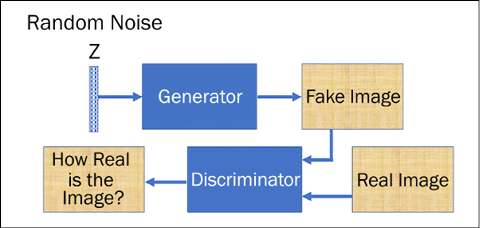

图 9.1:GAN 的基本架构

当然，GANs 包括在两个玩家参与的游戏中努力达到均衡。让我们首先理解这里的平衡是什么意思。当我们开始时，两个球员中的一个有希望比另一个更好。这推动了另一方的改进，这样，生成器和鉴别器都推动了对方的改进。

最终，我们达到了一种状态，在这种状态下，任何一个球员的进步都不显著。我们通过绘制损耗函数来检查这一点，以查看两种损耗(梯度损耗和鉴别器损耗)何时达到平稳状态。我们不希望游戏过于偏向一个方向；如果伪造者立即学会如何在每一个场合愚弄法官，那么伪造者就没有什么可学的了。实际上训练 GAN 是非常困难的，在分析 GAN 收敛方面做了大量的研究；查看本网站:[https://avg . is . tuebingen . mpg . de/projects/convergence-and-stability-of-gan-training](https://avg.is.tuebingen.mpg.de/projects/convergence-and-stability-of-gan-training)了解不同类型 gan 的收敛性和稳定性详情。在 GAN 的生成应用中，我们希望生成器比鉴别器学习得好一点。

现在让我们深入研究甘人是如何学习的。鉴别器和生成器轮流学习。学习可以分为两个步骤:

1.  在这里，鉴别器 *D(x)* 学习。生成器 *G(z)* 用于从随机噪声 *z* (遵循某种先验分布 *P(z)* )中生成伪图像。来自生成器的假图像和来自训练数据集的真实图像都被馈送到鉴别器，并且它执行监督学习，试图将假图像与真实图像分开。如果 *P* [数据] ( *x* )是训练数据集分布，那么鉴别器网络试图最大化其目标，使得当输入数据为真时 *D(x)* 接近 1，当输入数据为假时接近 0。
2.  下一步，生成器网络学习。它的目标是欺骗鉴别器网络，使其认为生成的 *G(z)* 是真实的，即迫使 *D(G(z))* 接近 1。

这两个步骤依次重复。一旦训练结束，鉴别器就不再能够区分真实数据和虚假数据，而生成器成为创建与训练数据非常相似的数据的专家。鉴别器和发生器之间的稳定性是一个正在积极研究的问题。

现在您已经对 GAN 有了一个概念，让我们来看看 GAN 的一个实际应用，其中生成“手写”数字。

## 在TensorFlow中使用 GAN 的 MNIST

让我们构建一个能够生成手写数字的简单 GAN 。我们将使用 MNIST 手写数字来训练网络。我们需要导入 TensorFlow 模块；为了保持代码的整洁，我们从 TensorFlow 框架中导出了所有需要的类:

```py
from tensorflow.keras.datasets import mnist

from tensorflow.keras.layers import Input, Dense, Reshape, Flatten, Dropout

from tensorflow.keras.layers import BatchNormalization, Activation, ZeroPadding2D

from tensorflow.keras.layers import LeakyReLU

from tensorflow.keras.layers import UpSampling2D, Conv2D

from tensorflow.keras.models import Sequential, Model

from tensorflow.keras.optimizers import Adam

from tensorflow.keras import initializers

import matplotlib.pyplot as plt

import numpy as np 
```

我们使用 TensorFlow Keras 数据集来访问 MNIST 数据。该数据包含 60，000 张大小为 28 × 28 的手写数字的训练图像。数字的像素值介于 0-255 之间；我们对输入值进行归一化，使得每个像素的值在[-1，1]范围内:

```py
randomDim = 10

(X_train, _), (_,  _) = mnist.load_data()

X_train = (X_train.astype(np.float32) - 127.5)/127.5 
```

我们将使用一个简单的**多层感知器** ( **MLP** )并且我们将把一个图像作为大小为 784 的平面向量馈送给它，因此我们重塑训练数据:

```py
X_train = X_train.reshape(60000, 784) 
```

现在我们需要构建一个生成器和鉴别器。生成器的目的是接收噪声输入，并生成类似于训练数据集的图像。噪声输入的大小由变量`randomDim`决定；可以将其初始化为任意整数值。习惯上，人们将其设置为 100。对于我们的实现，我们尝试使用值 10。该输入被馈送到具有 LeakyReLU 激活的`256`神经元的密集层。我们接下来添加另一个带有`512`隐藏神经元的密集层，接着是带有`1024`神经元的第三个隐藏层，最后是带有`784`神经元的输出层。你可以改变隐藏层的神经元数量，看看性能如何变化；然而，输出单元中神经元的数量必须与训练图像中的像素数量相匹配。相应的生成器是:

```py
generator = Sequential()

generator.add(Dense(256, input_dim=randomDim))

generator.add(LeakyReLU(0.2))

generator.add(Dense(512))

generator.add(LeakyReLU(0.2))

generator.add(Dense(1024))

generator.add(LeakyReLU(0.2))

generator.add(Dense(784, activation='tanh')) 
```

类似地，我们建立一个鉴别器。现在注意(*图 9.1* )鉴别器从训练集或生成器生成的图像中获取图像，因此其输入大小为`784`。此外，这里我们使用TensorFlow初始化器来初始化密集层的权重，我们使用标准偏差为 0.02 且平均值为 0 的正态分布。在*第一章*、*带 TF 的神经网络基础*中提到，TensorFlow 框架中有很多可用的初始化器。鉴别器的输出是单个比特，其中`0`表示伪图像(由生成器生成),`1`表示图像来自训练数据集:

```py
discriminator = Sequential()

discriminator.add(Dense(1024, input_dim=784, kernel_initializer=initializers.RandomNormal(stddev=0.02))

)

discriminator.add(LeakyReLU(0.2))

discriminator.add(Dropout(0.3))

discriminator.add(Dense(512))

discriminator.add(LeakyReLU(0.2))

discriminator.add(Dropout(0.3))

discriminator.add(Dense(256))

discriminator.add(LeakyReLU(0.2))

discriminator.add(Dropout(0.3))

discriminator.add(Dense(1, activation='sigmoid')) 
```

接下来，我们将发生器和鉴别器结合在一起，形成一个 GAN。在 GAN 中，我们通过将`trainable`参数设置为`False`来确保鉴别器权重是固定的:

```py
discriminator.trainable = False

ganInput = Input(shape=(randomDim,))

x = generator(ganInput)

ganOutput = discriminator(x)

gan = Model(inputs=ganInput, outputs=ganOutput) 
```

训练这两者的诀窍是，我们首先分别训练鉴别器；我们使用二进制交叉熵损失作为鉴别器。随后，我们冻结鉴别器的权重，并训练组合 GAN 这导致发电机的训练。这次的损失也是二元交叉熵:

```py
discriminator.compile(loss='binary_crossentropy', optimizer='adam')

gan.compile(loss='binary_crossentropy', optimizer='adam') 
```

让我们现在进行训练。对于每一个时期，我们首先取一个随机噪声样本，将其馈送给生成器，生成器生成一个假图像。我们将生成的假图像和实际训练图像与它们的特定标签组合在一起，并使用它们首先在给定的批次上训练鉴别器:

```py
def train(epochs=1, batchSize=128):

    batchCount = int(X_train.shape[0] / batchSize)

    print ('Epochs:', epochs)

    print ('Batch size:', batchSize)

    print ('Batches per epoch:', batchCount)

    for e in range(1, epochs+1):

        print ('-'*15, 'Epoch %d' % e, '-'*15)

        for _ in range(batchCount):

            # Get a random set of input noise and images

            noise = np.random.normal(0, 1, size=[batchSize,

            randomDim])

            imageBatch = X_train[np.random.randint(0,

            X_train.shape[0], size=batchSize)]

            # Generate fake MNIST images

            generatedImages = generator.predict(noise)

            # print np.shape(imageBatch), np.shape(generatedImages)

            X = np.concatenate([imageBatch, generatedImages])

            # Labels for generated and real data

            yDis = np.zeros(2*batchSize)

            # One-sided label smoothing

            yDis[:batchSize] = 0.9

            # Train discriminator

            discriminator.trainable = True

            dloss = discriminator.train_on_batch(X, yDis) 
```

如果你注意到，当分配标签时，我们使用了`0` / `0.9`而不是`0`/`1`——这个被称为标签平滑。已经发现保持软目标提高了泛化和学习速度(*标签平滑什么时候有帮助？*，穆勒等著 NeurIPS 2019)。

现在，在同一个`for`循环中，我们将训练发电机。我们希望生成器生成的图像被鉴别器检测为真实的，所以我们使用一个随机向量(噪声)作为生成器的输入；这会生成一个假图像，然后训练 GAN，使鉴频器将图像视为真实图像(输出为`1`):

```py
 # Train generator

            noise = np.random.normal(0, 1, size=[batchSize,

            randomDim])

            yGen = np.ones(batchSize)

            discriminator.trainable = False

            gloss = gan.train_on_batch(noise, yGen) 
```

很酷的把戏，对吧？如果您愿意，您可以保存发生器和鉴别器损耗以及生成的图像。接下来，我们保存每个时期的损失，并在每 20 个时期后生成图像:

```py
 # Store loss of most recent batch from this epoch

        dLosses.append(dloss)

        gLosses.append(gloss)

        if e == 1 or e % 20 == 0:

               saveGeneratedImages(e) 
```

我们现在可以通过调用`train`函数来训练 GAN。在下图中，您可以看到 GAN 学习过程中生成性和歧视性损失的曲线图:

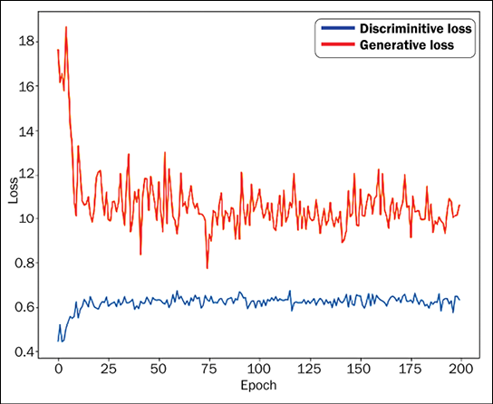

图 9.2:鉴频器和发电机损耗图

以及我们的 GAN 生成的手写数字:

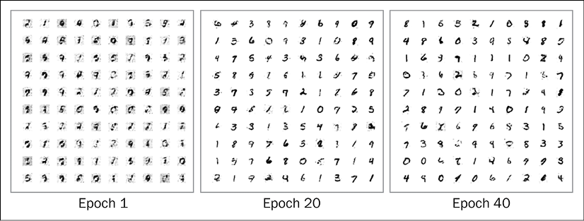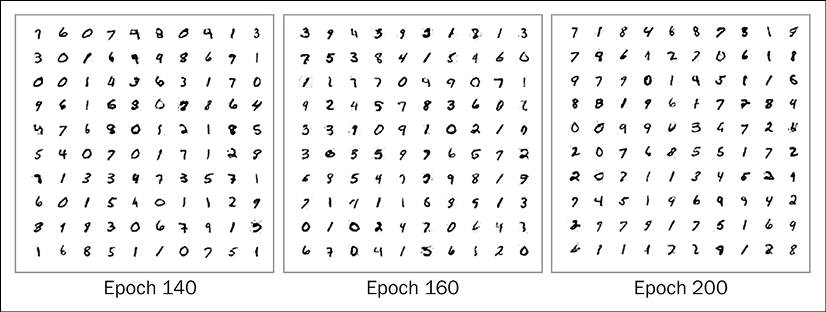

图 9.3:生成的手写数字

从前面的图可以看出，随着纪元的增加，干生成的手写数字越来越逼真。

为了绘制手写数字的丢失和生成的图像，我们定义了两个辅助函数 `plotLoss()`和`saveGeneratedImages()`。它们的代码如下所示:

```py
# Plot the loss from each batch

def plotLoss(epoch):

    plt.figure(figsize=(10, 8))

    plt.plot(dLosses, label='Discriminitive loss')

    plt.plot(gLosses, label='Generative loss')

    plt.xlabel('Epoch')

    plt.ylabel('Loss')

    plt.legend()

    plt.savefig('images/gan_loss_epoch_%d.png' % epoch)

# Create a wall of generated MNIST images

def saveGeneratedImages(epoch, examples=100, dim=(10, 10), figsize=(10, 10)):

    noise = np.random.normal(0, 1, size=[examples, randomDim])

    generatedImages = generator.predict(noise)

    generatedImages = generatedImages.reshape(examples, 28, 28)

    plt.figure(figsize=figsize)

    for i in range(generatedImages.shape[0]):

        plt.subplot(dim[0], dim[1], i+1)

        plt.imshow(generatedImages[i], interpolation='nearest',

        cmap='gray_r')

        plt.axis('off')

    plt.tight_layout()

    plt.savefig('images/gan_generated_image_epoch_%d.png' % epoch) 
```

`saveGeneratedImages`功能将图像保存在`images`文件夹中，因此请确保您已经在当前的工作目录中创建了文件夹。完整的代码可以在 GitHub repo 的笔记本`VanillaGAN.ipynb`中找到。在接下来的章节中，我们将介绍一些最新的 GAN 架构，并在 TensorFlow 中实现它们。

# 深度卷积 GAN (DCGAN)

自 2016 年提出以来，DCGANs 已经成为最受欢迎和最成功的 GAN 架构之一。设计的主要思想是使用卷积层，而不使用池层或终端分类器层。卷积步长和转置卷积被用于下采样(维数减少)和上采样(维数增加)。在 GANs 中，我们借助转置卷积层来实现这一点。要了解关于转置卷积层的更多信息，请参考论文*深度学习卷积算法指南*杜默林和维辛(Visin)的图像。

在详细介绍 DCGAN 架构及其功能之前，让我们先指出本文中介绍的主要变化:

*   网络由所有卷积层组成。在鉴别器中，池层被步进卷积(即，在使用卷积层时，不是一个单独的步幅，而是将步幅数增加到两个)代替，在生成器中被转置卷积代替。
*   去除卷积后的全连接分类层。
*   为了有助于梯度流，在每个卷积层之后进行批量归一化。

DCGANs 的基本思想与普通 GAN 相同:我们有一个可以接收 100 维噪音的发生器；噪声经过投影和整形，然后通过卷积层。*图 9.4* 显示了发电机架构:

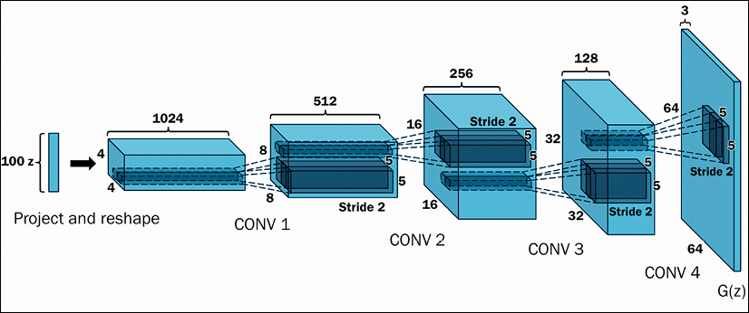

图 9.4:可视化生成器的架构

鉴别器网络接收图像(由生成器生成或来自真实数据集)，图像进行卷积，然后进行批量归一化。在每个卷积步骤中，使用步长对图像进行缩减采样。卷积层的最终输出被平坦化，并馈入单神经元分类器层。

在*图 9.5* 中，可以看到鉴别器:

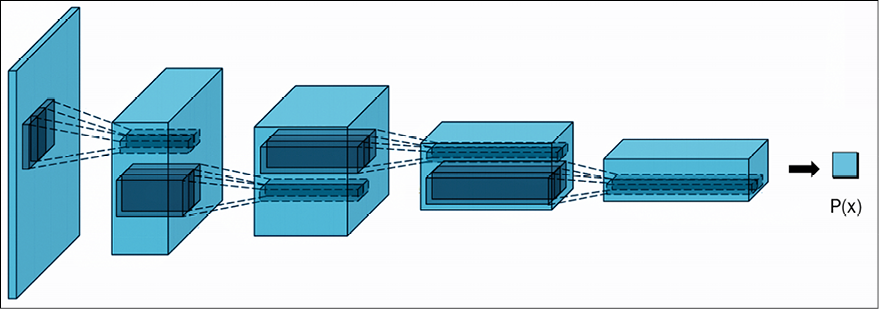

图 9.5:可视化鉴别器的架构

发生器和鉴频器组合在一起形成 DCGAN。培训以与之前相同的方式进行；也就是说，我们首先在小批量上训练鉴别器，然后冻结鉴别器并训练生成器。这个过程反复重复几千个时期。作者发现，使用 Adam 优化器和 0.002 的学习率，我们可以获得更稳定的结果。

接下来，我们将实现一个用于生成手写数字的 DCGAN。

## MNIST 数字的 DCGAN

现在让我们构建一个用于生成手写数字的 DCGAN。我们首先看到发电机的代码。通过顺序添加层来构建发生器。第一层是密集层，以 100 维的噪声作为输入。100 维输入被扩展为大小为 128 × 7 × 7 的平面向量。这样做是为了最终得到大小为 28 × 28 的输出，这是 MNIST 手写数字的标准大小。向量被整形为大小为 7 × 7 × 128 的张量。然后使用 TensorFlow Keras `UpSampling2D`层对该矢量进行上采样。请注意，这一层只是通过加倍行和列来放大图像。该层没有权重，因此计算量很小。

Upsampling2D 层现在将使 7 × 7 × 128(行×列×通道)图像的行和列加倍，产生大小为 14 × 14 × 128 的输出。向上采样的图像被传递到卷积层。该卷积层学习填充上采样图像中的细节。卷积的输出被传递到批量归一化，以获得更好的梯度流量。然后，批量标准化输出在所有中间层中经历 ReLU 激活。我们重复结构，就是上采样|卷积|批量归一化| ReLU。在下面的生成器中，我们有两个这样的结构，第一个有 128 个滤波器，第二个在卷积运算中有 64 个滤波器。最终输出从具有 3 个滤波器和 tan 双曲线激活的纯卷积层获得，产生大小为 28 × 28 × 1 的图像:

```py
def build_generator(self):

    model = Sequential()

    model.add(Dense(128 * 7 * 7, activation="relu",

    input_dim=self.latent_dim))

    model.add(Reshape((7, 7, 128)))

    model.add(UpSampling2D())

    model.add(Conv2D(128, kernel_size=3, padding="same"))

    model.add(BatchNormalization(momentum=0.8))

    model.add(Activation("relu"))

    model.add(UpSampling2D())

    model.add(Conv2D(64, kernel_size=3, padding="same"))

    model.add(BatchNormalization(momentum=0.8))

    model.add(Activation("relu"))

    model.add(Conv2D(self.channels, kernel_size=3, padding="same"))

    model.add(Activation("tanh"))

    model.summary()

    noise = Input(shape=(self.latent_dim,))

    img = model(noise)

    return Model(noise, img) 
```

生成的生成器模型如下:

```py
Model: "sequential_1"

_________________________________________________________________

 Layer (type)                Output Shape              Param #   

=================================================================

 conv2d_3 (Conv2D)           (None, 14, 14, 32)        320       

 leaky_re_lu (LeakyReLU)     (None, 14, 14, 32)        0         

 dropout (Dropout)           (None, 14, 14, 32)        0         

 conv2d_4 (Conv2D)           (None, 7, 7, 64)          18496     

 zero_padding2d (ZeroPadding  (None, 8, 8, 64)         0         

 2D)                                                             

 batch_normalization_2 (Batc  (None, 8, 8, 64)         256       

 hNormalization)                                                 

 leaky_re_lu_1 (LeakyReLU)   (None, 8, 8, 64)          0         

 dropout_1 (Dropout)         (None, 8, 8, 64)          0         

 conv2d_5 (Conv2D)           (None, 4, 4, 128)         73856     

 batch_normalization_3 (Batc  (None, 4, 4, 128)        512       

 hNormalization)                                                 

 leaky_re_lu_2 (LeakyReLU)   (None, 4, 4, 128)         0         

 dropout_2 (Dropout)         (None, 4, 4, 128)         0         

 conv2d_6 (Conv2D)           (None, 4, 4, 256)         295168    

 batch_normalization_4 (Batc  (None, 4, 4, 256)        1024      

 hNormalization)                                                 

 leaky_re_lu_3 (LeakyReLU)   (None, 4, 4, 256)         0         

 dropout_3 (Dropout)         (None, 4, 4, 256)         0         

 flatten (Flatten)           (None, 4096)              0         

 dense_1 (Dense)             (None, 1)                 4097      

=================================================================

Total params: 393,729

Trainable params: 392,833

Non-trainable params: 896 
```

您也可以尝试转置卷积层。这一层不仅对输入图像进行上采样，还学习如何在训练期间填充细节。因此，您可以用单个转置卷积层替换上采样和卷积层。转置卷积层执行逆卷积操作。你可以在论文中读到更详细的内容:*深度学习卷积算法指南*([https://arxiv.org/abs/1603.07285](https://arxiv.org/abs/1603.07285))。

现在我们有了一个生成器，让我们看看构建鉴别器的代码。鉴别器类似于标准的卷积神经网络，但有一个主要变化:我们使用步长为 2 的卷积层，而不是最大池。我们还添加了漏失层以避免过度拟合，以及批量归一化以获得更好的精度和更快的收敛。激活层是漏 ReLU。在下面的网络中，我们使用三个这样的卷积层，滤波器分别为 32、64 和 128。第三卷积层的输出被平坦化并被馈送到具有单个单元的密集层。

该单元的输出将图像分类为假的或真实的:

```py
def build_discriminator(self):

    model = Sequential()

    model.add(Conv2D(32, kernel_size=3, strides=2,

    input_shape=self.img_shape, padding="same"))

    model.add(LeakyReLU(alpha=0.2))

    model.add(Dropout(0.25))

    model.add(Conv2D(64, kernel_size=3, strides=2, padding="same"))

    model.add(ZeroPadding2D(padding=((0,1),(0,1))))

    model.add(BatchNormalization(momentum=0.8))

    model.add(LeakyReLU(alpha=0.2))

    model.add(Dropout(0.25))

    model.add(Conv2D(128, kernel_size=3, strides=2, padding="same"))

    model.add(BatchNormalization(momentum=0.8))

    model.add(LeakyReLU(alpha=0.2))

    model.add(Dropout(0.25))

    model.add(Conv2D(256, kernel_size=3, strides=1, padding="same"))

    model.add(BatchNormalization(momentum=0.8))

    model.add(LeakyReLU(alpha=0.2))

    model.add(Dropout(0.25))

    model.add(Flatten())

    model.add(Dense(1, activation='sigmoid'))

    model.summary()

    img = Input(shape=self.img_shape)

    validity = model(img)

    return Model(img, validity) 
```

最终的鉴频器网络为:

```py
Model: "sequential"

_________________________________________________________________

 Layer (type)                Output Shape              Param #   

=================================================================

 dense (Dense)               (None, 6272)              633472    

 reshape (Reshape)           (None, 7, 7, 128)         0         

 up_sampling2d (UpSampling2D  (None, 14, 14, 128)      0         

 )                                                               

 conv2d (Conv2D)             (None, 14, 14, 128)       147584    

 batch_normalization (BatchN  (None, 14, 14, 128)      512       

 ormalization)                                                   

 activation (Activation)     (None, 14, 14, 128)       0         

 up_sampling2d_1 (UpSampling  (None, 28, 28, 128)      0         

 2D)                                                             

 conv2d_1 (Conv2D)           (None, 28, 28, 64)        73792     

 batch_normalization_1 (Batc  (None, 28, 28, 64)       256       

 hNormalization)                                                 

 activation_1 (Activation)   (None, 28, 28, 64)        0         

 conv2d_2 (Conv2D)           (None, 28, 28, 1)         577       

 activation_2 (Activation)   (None, 28, 28, 1)         0         

=================================================================

Total params: 856,193

Trainable params: 855,809

Non-trainable params: 384

_________________________________________________________________ 
```

完整的氮化镓是由两者结合而成的:

```py
class DCGAN():

    def __init__(self, rows, cols, channels, z = 10):

        # Input shape

        self.img_rows = rows

        self.img_cols = cols

        self.channels = channels

        self.img_shape = (self.img_rows, self.img_cols, self.channels)

        self.latent_dim = z

        optimizer = Adam(0.0002, 0.5)

        # Build and compile the discriminator

        self.discriminator = self.build_discriminator()

        self.discriminator.compile(loss=’binary_crossentropy’,

            optimizer=optimizer,

            metrics=[‘accuracy’])

        # Build the generator

        self.generator = self.build_generator()

        # The generator takes noise as input and generates imgs

        z = Input(shape=(self.latent_dim,))

        img = self.generator(z)

        # For the combined model we will only train the generator

        self.discriminator.trainable = False

        # The discriminator takes generated images as input and determines validity

        valid = self.discriminator(img)

        # The combined model  (stacked generator and discriminator)

        # Trains the generator to fool the discriminator

        self.combined = Model(z, valid)

        self.combined.compile(loss=’binary_crossentropy’, optimizer=optimizer) 
```

您可能已经注意到，我们在这里定义了`binary_crossentropy` loss 对象，稍后我们将使用它来定义发生器和鉴频器损耗。生成器和鉴别器的优化器在这个`init`方法中定义。最后，我们定义一个 TensorFlow 检查点，用于将两个模型(生成器和鉴别器)保存为模型训练。

GAN 以与之前相同的方式被训练；在每一步，首先，随机噪声被馈送到发生器。将生成器的输出与真实图像相加，以初步训练鉴别器，然后训练生成器给出可以欺骗鉴别器的图像。

对下一批图像重复该过程。GAN 需要几百到几千个历元来训练:

```py
 def train(self, epochs, batch_size=256, save_interval=50):

        # Load the dataset

        (X_train, _), (_, _) = mnist.load_data()

        # Rescale -1 to 1

        X_train = X_train / 127.5 - 1.

        X_train = np.expand_dims(X_train, axis=3)

        # Adversarial ground truths

        valid = np.ones((batch_size, 1))

        fake = np.zeros((batch_size, 1))

        for epoch in range(epochs):

            # ---------------------

            #  Train Discriminator

            # ---------------------

            # Select a random half of images

            idx = np.random.randint(0, X_train.shape[0], batch_size)

            imgs = X_train[idx]

            # Sample noise and generate a batch of new images

            noise = np.random.normal(0, 1, (batch_size, self.latent_dim))

            gen_imgs = self.generator.predict(noise)

            # Train the discriminator (real classified as ones and generated as zeros)

            d_loss_real = self.discriminator.train_on_batch(imgs, valid)

            d_loss_fake = self.discriminator.train_on_batch(gen_imgs, fake)

            d_loss = 0.5 * np.add(d_loss_real, d_loss_fake)

            # ---------------------

            #  Train Generator

            # ---------------------

            # Train the generator (wants discriminator to mistake images as real)

            g_loss = self.combined.train_on_batch(noise, valid)

            # Plot the progress

            print ("%d [D loss: %f, acc.: %.2f%%] [G loss: %f]" % (epoch, d_loss[0], 100*d_loss[1], g_loss))

            # If at save interval => save generated image samples

            if epoch % save_interval == 0:

                self.save_imgs(epoch) 
```

最后，我们需要一个助手函数来保存图像:

```py
 def save_imgs(self, epoch):

        r, c = 5, 5

        noise = np.random.normal(0, 1, (r * c, self.latent_dim))

        gen_imgs = self.generator.predict(noise)

        # Rescale images 0 - 1

        gen_imgs = 0.5 * gen_imgs + 0.5

        fig, axs = plt.subplots(r, c)

        cnt = 0

        for i in range(r):

            for j in range(c):

                axs[i,j].imshow(gen_imgs[cnt, :,:,0], cmap='gray')

                axs[i,j].axis('off')

                cnt += 1

        fig.savefig("images/dcgan_mnist_%d.png" % epoch)

        plt.close() 
```

现在让我们训练我们的 GAN:

```py
dcgan = DCGAN(28,28,1)

dcgan.train(epochs=5000, batch_size=256, save_interval=50) 
```

我们的 GAN 在学习伪造手写数字时生成的图像是:

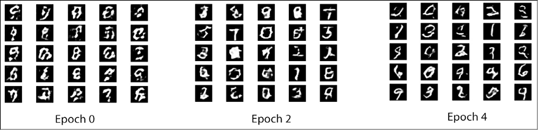

图 9.6:GAN 生成的图像–初始尝试

前面的图像是 GAN 最初的尝试。它通过以下 10 个时期了解到，生成的数字质量提高了许多倍:

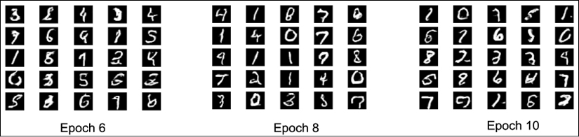

图 9.7:GAN 在 6、8 和 10 个时期后生成的图像

完整的代码可以在 GitHub repo 的`DCGAN.ipynb`中找到。我们可以将这里讨论的概念应用到其他领域的图像中。论文中报道了一个关于图像的有趣工作，*深度卷积生成对抗网络的无监督表示学习*，亚历克·拉德福德，卢克·梅茨，苏史密斯·钦塔拉，2015。引用摘要:

> 近年来，卷积网络(CNN)的监督学习在计算机视觉应用中得到了广泛采用。相比之下，基于细胞神经网络的无监督学习受到的关注较少。在这项工作中，我们希望帮助弥补有监督学习和无监督学习的 CNN 之间的差距。我们介绍了一类称为深度卷积生成对抗网络(DCGANs)的细胞神经网络，它们具有一定的架构约束，并证明它们是无监督学习的强有力候选。在各种图像数据集上的训练，我们展示了令人信服的证据，表明我们的深度卷积敌对对在生成器和鉴别器中学习了从对象部分到场景的表示层次。此外，我们将学到的特征用于新的任务——证明它们作为一般图像表征的适用性。
> 
> Radford 等人，2015 年

以下是将 DCGANs 应用于名人图像数据集的一些有趣结果:

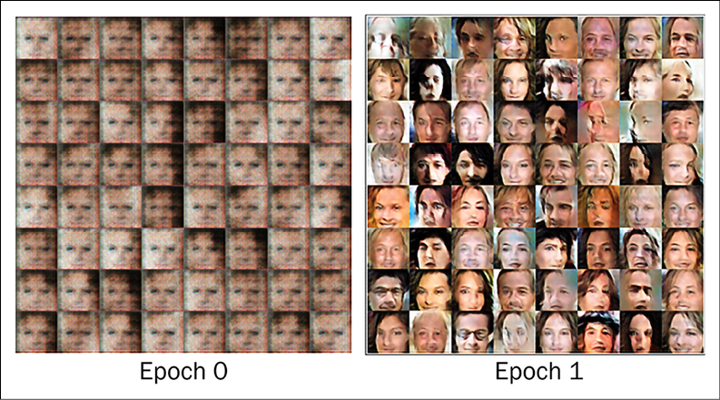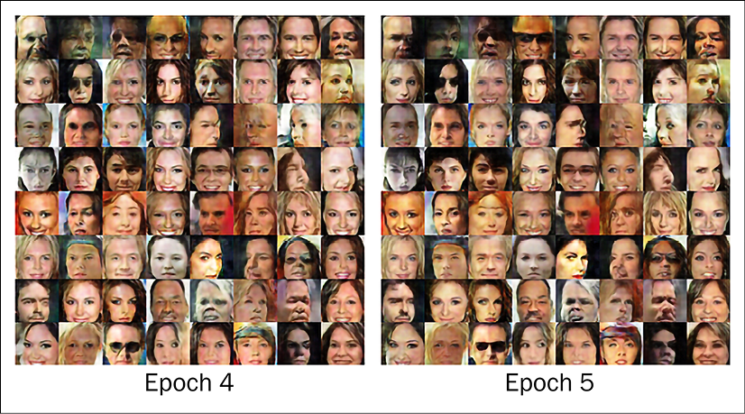

图 9.8:使用 DCGAN 生成的名人图像

另一篇有趣的论文是 Raymond A. Yeh 等人在 2016 年发表的*带感知和上下文损失的语义图像修复*。正如内容感知填充是摄影师用来填充不想要的或图像缺失部分的工具一样，在本文中，他们使用了 DCGAN 来完成图像。

如前所述，围绕 GANs 正在进行大量的研究。在下一节中，我们将探讨近年来提出的一些有趣的 GAN 架构。

# 一些有趣的 GAN 架构

自从它们出现以来，在 GAN 中产生了很多兴趣，因此，我们看到了许多关于 GAN 培训、架构和应用的修改和实验。在本节中，我们将探讨近年来提出的一些有趣的 gan。

## 斯尔甘

还记得看过一部犯罪惊悚片吗，我们的主人公让电脑专家放大犯罪现场褪色的图像？使用变焦镜头，我们可以看到罪犯的面部细节，包括使用的武器和刻在上面的任何东西！嗯，**超分辨率甘斯** ( **斯尔甘斯**)可以表演类似的魔法。神奇之处在于，因为 GANs 表明获得高分辨率图像是可能的，所以最终结果取决于所使用的相机分辨率。这里，GAN 以这样的方式被训练，即当给定低分辨率图像时，它可以生成照片般逼真的高分辨率图像。SRGAN 架构由三个神经网络组成:非常深的生成器网络(使用剩余模块；参见*第 20 章*、*高级卷积神经网络*、鉴别器网络和预训练 VGG-16 网络中的 ResNets。

SRGANs 使用感知损失函数(由 Johnson 等人开发；你可以在*参考文献*部分找到这篇论文的链接。在 SRGAN 中，作者首先对高分辨率图像进行降采样，并使用生成器获得其“高分辨率”版本。该鉴别器被训练来区分真实的高分辨率图像和生成的高分辨率图像。网络输出和高分辨率部分之间的 VGG 网络的高层中的特征映射激活的差异包括感知损失函数。除了感知损失，作者还增加了内容损失和对抗性损失，使生成的图像看起来更自然，更精细的细节更具艺术性。感知损失被定义为内容损失和敌对损失的加权和:

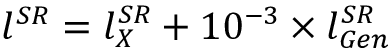

右侧的第一项是内容损失，使用预训练 VGG 19 生成的特征图获得。在数学上，它是重建图像(即生成器生成的图像)的特征图与原始高分辨率参考图像之间的欧氏距离。RHS 的第二个术语是对抗性损失。这是标准的生成损失术语，旨在确保生成器生成的图像可以欺骗鉴别器。您可以在下图中看到，SRGAN 生成的图像更接近原始的高分辨率图像，PSNR 值为 37.61:

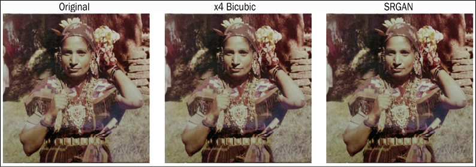

图 9.9:Ledig 等人的论文《使用生成式对抗网络的照片级单幅图像超分辨率》的示例。

另一个值得注意的架构是 CycleGAN2017 年提出，可以执行图像翻译的任务。一旦经过训练，你就可以将一幅图像从一个领域翻译到另一个领域。例如，当在马和斑马数据集上训练时，如果你给它一幅前景中有马的图像，CycleGAN 可以将马转换为具有相同背景的斑马。我们接下来会探讨它。

## CycleGAN

你有没有想象过如果梵高或马奈画了某些风景会是什么样子？我们有许多梵高/马奈画的场景和风景，但是我们没有任何输入输出对的集合。CycleGAN 执行图像转换，即在没有训练样本的情况下，将一个域(例如，风景)中给定的图像转移到另一个域(例如，同一场景的梵高画作)。CycleGAN 在没有训练对的情况下执行图像翻译的能力是它的独特之处。

为了实现图像翻译，作者使用了一个非常简单而有效的程序。他们使用了两个 GAN，每个 GAN 的生成器执行从一个域到另一个域的图像转换。

具体来说，假设输入是 *X* ，那么第一个 GAN 的生成器执行一个映射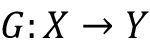；因此，它的输出将是 *Y = G(X)* 。第二个 GAN 的生成器执行逆映射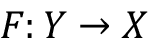，导致 *X = F(Y)* 。每个鉴别器被训练来区分真实图像和合成图像。这个想法如下所示:

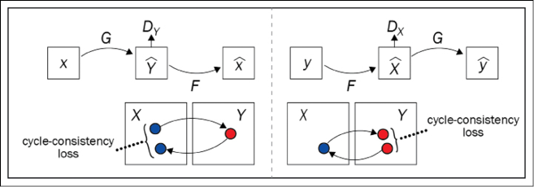

图 9.10:周期一致性损失

为了训练组合 GAN，作者除了传统 GAN 对抗损失外，还增加了前向周期一致性损失(左图)和后向周期一致性损失(右图)。这确保了如果给定图像 *X* 作为输入，那么在两次平移 *F(G(X)) ~ X* 之后，获得的图像是相同的， *X* (类似地，反向循环一致性损失确保了 *G(F(Y)) ~ Y* )。

以下是 CycleGANs 的一些成功的图像翻译[7]:

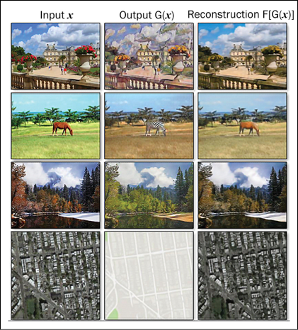

图 9.11:一些成功的 CycleGAN 图像翻译示例

以下是更多的例子；你可以看到季节的翻译(夏天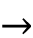冬天)，照片绘画反之亦然，马匹斑马反之亦然[7]:

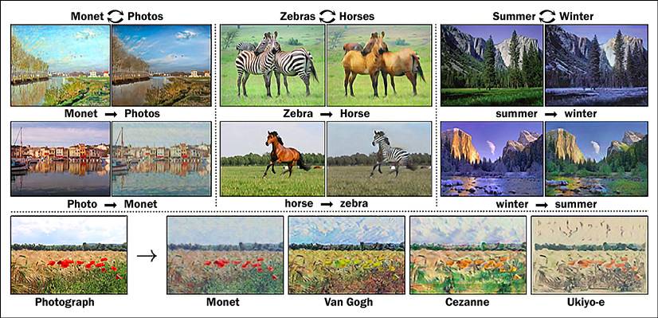

图 9.12:cycle gan 翻译的更多示例

在本章的后面，我们还将探索 CycleGANs 的 TensorFlow 实现。接下来，我们讨论 InfoGAN，这是一个条件 GAN，其中 GAN 不仅生成图像，而且还有一个控制变量来控制生成的图像。

## InfoGAN

到目前为止，我们所考虑的 GAN 架构很少或根本无法控制生成的图像。InfoGAN 改变了这一点；它控制生成的图像的各种属性。InfoGAN 使用信息论中的概念，将噪声项转换为潜在代码，对输出进行可预测的系统控制。

InfoGAN 中的生成器有两个输入:潜在空间 *Z* 和潜在代码 *c* ，因此生成器的输出是 *G(Z，c)* 。训练 GAN，使得它最大化潜在代码 *c* 和生成图像 *G(Z，c)* 之间的互信息。下图显示了 InfoGAN 的架构:

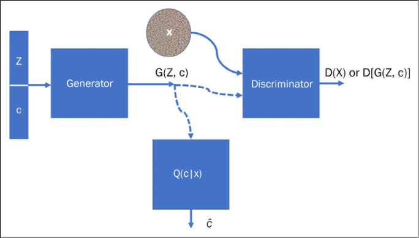

图 9.13:可视化的 InfoGAN 架构

级联的向量 *(Z，c)* 被馈送给生成器。 *Q(c|X)* 也是一个神经网络。与发生器结合，它的作用是在随机噪声 *Z* 和它的潜在代码 *c_hat* 之间形成映射。它旨在估计 *c* 给定 *X* 。这是通过向传统 GAN 的目标函数添加正则化项来实现的:

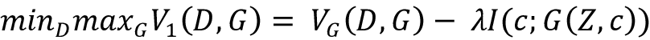

第*项 V* [G] *(D，G)* 为常规 GAN 的损失函数，第二项为正则化项，其中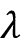为常数。它的值在文中被设置为 1，而*I(c；G(Z，c))* 是潜在代码 *c* 和生成器生成的图像 *G(Z，c)* 之间的互信息。

以下是 InfoGAN 在 MNIST 数据集上的令人兴奋的结果:

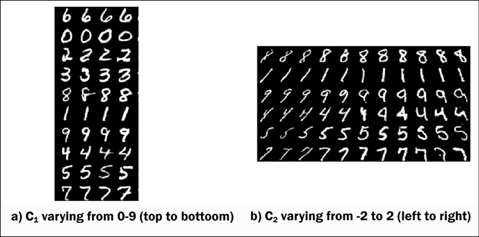

图 9.14:在 MNIST 数据集上使用 InfoGAN 的结果。这里，不同的行对应于固定潜在代码和噪声的不同随机样本

现在，我们已经看到了一些令人兴奋的 GAN 架构，让我们探索一些 GAN 的酷应用。

# GANs 的酷应用

我们已经看到生成器可以学习如何伪造数据。这意味着它学习如何创建新的合成数据，这些数据是由网络创建的，看起来是真实的和人为的。在进入一些 GAN 代码的细节之前，我们想分享论文[6]的结果(代码可在[https://github.com/hanzhanggit/StackGAN](https://github.com/hanzhanggit/StackGAN)在线获得)，其中 GAN 已经被用于从文本描述开始合成伪造的图像。结果令人印象深刻:第一列是测试集中的真实图像，所有其余的列是 StackGAN 的第一阶段和第二阶段从相同的文本描述中生成的图像。更多例子可以在 YouTube 上找到([https://www.youtube.com/watch?v=SuRyL5vhCIM&feature = youtu . be](https://www.youtube.com/watch?v=SuRyL5vhCIM&feature=youtu.be)):

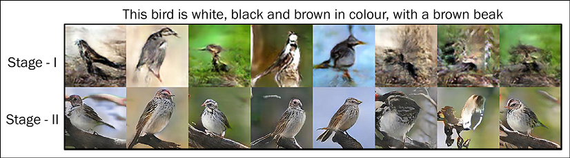

图 9.15:使用 GANs 生成鸟类图像

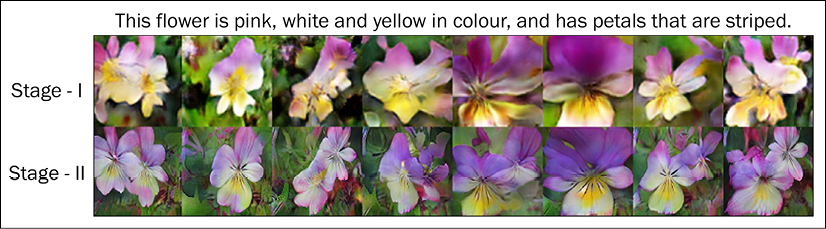

图 9.16:使用 GANs 生成花的图像

现在让我们看看 GAN 如何学习“伪造”MNIST 数据集。在这种情况下，发生器和鉴频器网络使用 GAN 和 CNN 的组合。一开始，生成器没有创造出任何可以理解的东西，但是经过几次迭代，合成的伪造数字越来越清晰。在此图中，面板按增加的训练时段排序，您可以看到面板的质量有所提高:

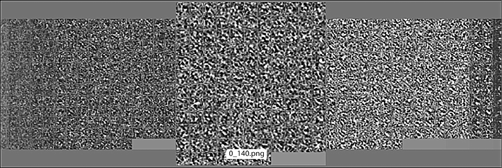

图 9.17:GAN 难以辨认的初始输出

随着训练的进行，你可以在*图 9.17* 中看到，数字开始采用更易识别的形式:

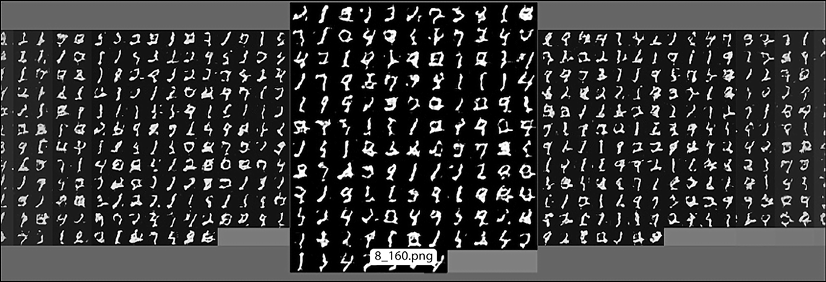

图 9.18:进一步迭代后，GAN 的输出得到改善

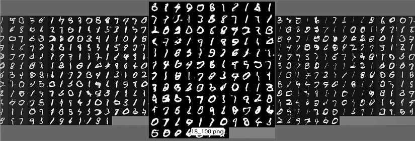

图 9.19:GAN 的最终输出，显示了与之前迭代相比的显著改进

经过一万个纪元，可以看到手写的数字更加逼真。

GANs 最酷的用途之一是在生成器的矢量 *Z* 中对人脸进行运算。换句话说，如果我们停留在合成伪造影像的空间，有可能看到这样的东西:*【微笑的女人】-【中性的女人】+【中性的男人】=【微笑的男人】*，或者这样:*【戴眼镜的男人】-【不戴眼镜的男人】+【不戴眼镜的女人】=【戴眼镜的女人】*。亚历克·拉德福德和他的同事在 2015 年发表的论文*中展示了这一点。本作品中的所有图像均由 GAN 版本生成。它们不是真实的。全文如下:[http://arxiv.org/abs/1511.06434](http://arxiv.org/abs/1511.06434)。以下是论文中的一些例子。作者还在 GitHub repo 中分享了他们的代码:[https://github.com/Newmu/dcgan_code](https://github.com/Newmu/dcgan_code):*

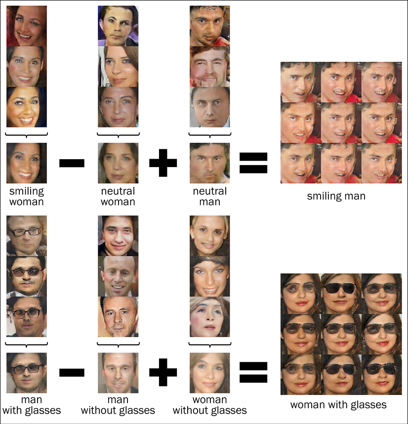

图 9.20:使用 GANs 的图像算法

**卧室**:经过五个时代的训练后生成的卧室；

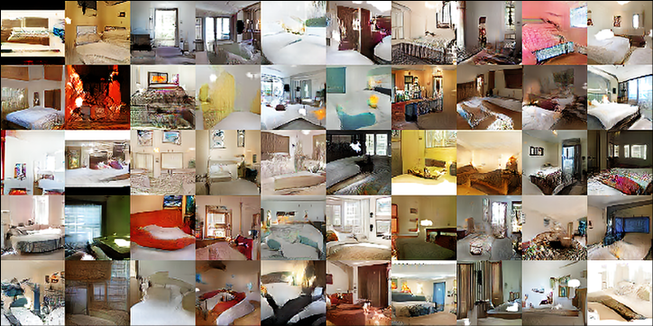

图 9.21:经过 5 个时期的训练后，使用 GAN 生成的卧室

**专辑封面**:这些图像是由甘生成的，但看起来像真的专辑封面；

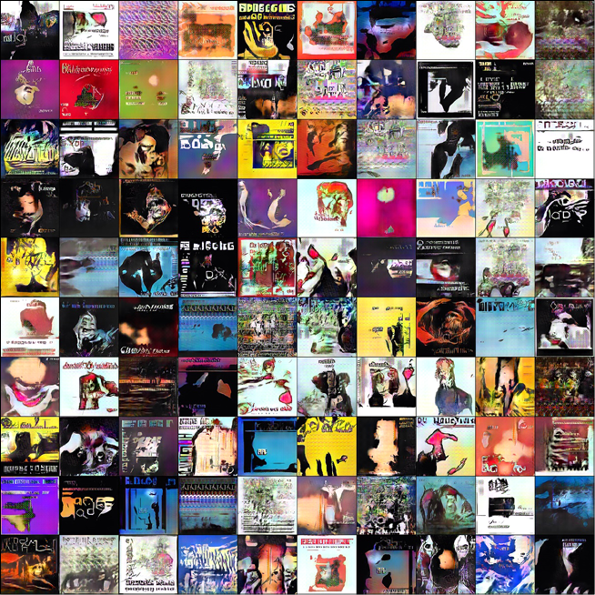

图 9.22:使用 DCGAN 生成的专辑封面

GANs 另一个很酷的应用是人工脸的生成。NVIDIA 在 2018 年推出了一个模型，它命名为 StyleGAN(第二个版本 StyleGAN2 于 2020 年 2 月发布，第三个版本于 2021 年发布)，它显示可以用来生成逼真的人物图像。下面你可以看到 StyleGAN 经过 1000 个纪元的训练后生成的一些看起来很逼真的假人脸；为了取得更好的效果，你需要进行更多的训练:

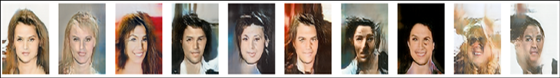

图 9.23:StyleGAN 生成的假脸

它不仅会生成假图像，而且像 InfoGAN 一样，您可以控制从粗糙到粗糙的特征。这是 NVIDIA 发布的官方视频，展示了功能如何影响结果:[https://www.youtube.com/watch?v=kSLJriaOumA](https://www.youtube.com/watch?v=kSLJriaOumA)。他们能够通过在潜在变量 *Z* 后添加一个非线性映射网络来做到这一点。映射网络将潜在变量转换成相同大小的映射；映射向量的输出被馈送到生成器网络的不同层，这允许 StyleGAN 控制不同的视觉特征。要了解更多关于 StyleGAN 的信息，你应该阅读 NVIDIA 实验室的论文*一种基于风格的生成式对抗网络生成器架构*。

# TensorFlow中的循环根

在本节中，我们将在 TensorFlow 中实现一个 CycleGAN。CycleGAN 需要一个特殊的数据集，一个成对的数据集，从一个图像域到另一个域。因此，除了必要的模块，我们也将使用`tensorflow_datasets`。同样，我们将利用库`tensorflow_examples`，我们将直接使用`tensorflow_examples`中定义的`pix2pix`模型中的生成器和鉴别器。这里的代码改编自这里的代码[https://github . com/tensor flow/docs/blob/master/site/en/tutorials/generative/cycle gan . ipynb](https://github.com/tensorflow/docs/blob/master/site/en/tutorials/generative/cyclegan.ipynb):

```py
import tensorflow_datasets as tfds

from tensorflow_examples.models.pix2pix import pix2pix

import os

import time

import matplotlib.pyplot as plt

from IPython.display import clear_output

import tensorflow as tf 
```

TensorFlow 的`Dataset` API 包含一个数据集列表。它有许多成对的 CycleGANs 数据集，例如马对斑马、苹果对橙子等等。你可以在这里查看完整的名单:【https://www.tensorflow.org/datasets/catalog/cycle_gan】T2。对于我们的代码，我们将使用`summer2winter_yosemite`，它包含夏天的约塞米蒂(美国)的图像(数据集 A)和冬天的的图像(数据集 B)。我们将训练 CycleGAN 将输入的夏季图像转换为冬季图像，反之亦然。

让我们加载数据并获取训练和测试图像:

```py
dataset, metadata = tfds.load('cycle_gan/summer2winter_yosemite',

                              with_info=True, as_supervised=True)

train_summer, train_winter = dataset['trainA'], dataset['trainB']

test_summer, test_winter = dataset['testA'], dataset['testB'] 
```

我们需要设置一些超参数:

```py
BUFFER_SIZE = 1000

BATCH_SIZE = 1

IMG_WIDTH = 256

IMG_HEIGHT = 256

EPOCHS = 100

LAMBDA = 10

AUTOTUNE = tf.data.AUTOTUNE 
```

在我们训练网络之前，需要对图像进行归一化。为了更好的性能，我们还增加了随机抖动的火车图像；首先将图像的大小调整为 286x286，然后我们将它们随机裁剪回 256x256，最后应用随机抖动:

```py
def normalize(input_image, label):

    input_image = tf.cast(input_image, tf.float32)

    input_image = (input_image / 127.5) - 1

    return input_image

def random_crop(image):

    cropped_image = tf.image.random_crop(image, size=[IMG_HEIGHT,

    IMG_WIDTH, 3])

    return cropped_image

def random_jitter(image):

    # resizing to 286 x 286 x 3

    image = tf.image.resize(image, [286, 286],

    method=tf.image.ResizeMethod.NEAREST_NEIGHBOR)

    # randomly cropping to 256 x 256 x 3

    image = random_crop(image)

    # random mirroring

    image = tf.image.random_flip_left_right(image)

    return image 
```

只对训练图像进行增强(随机裁剪和抖动);因此，我们需要分离预处理图像的功能，一个用于训练数据，另一个用于测试数据:

```py
def preprocess_image_train(image, label):

    image = random_jitter(image)

    image = normalize(image)

    return image

def preprocess_image_test(image, label):

    image = normalize(image)

    return image 
```

前述函数在应用于图像时，将在范围[-1，1]内对其进行归一化，并将增强应用于训练图像。让我们将此应用于我们的训练和测试数据集，并创建一个数据生成器，它将批量提供用于训练的图像:

```py
train_summer = train_summer.cache().map(

    preprocess_image_train, num_parallel_calls=AUTOTUNE).shuffle(

    BUFFER_SIZE).batch(BATCH_SIZE)

train_winter = train_winter.cache().map(

    preprocess_image_train, num_parallel_calls=AUTOTUNE).shuffle(

    BUFFER_SIZE).batch(BATCH_SIZE)

test_summer = test_summer.map(

    preprocess_image_test,

    num_parallel_calls=AUTOTUNE).cache().shuffle(

    BUFFER_SIZE).batch(BATCH_SIZE)

test_winter = test_winter.map(

    preprocess_image_test,

    num_parallel_calls=AUTOTUNE).cache().shuffle(

    BUFFER_SIZE).batch(BATCH_SIZE) 
```

在前面的代码中，参数`num_parallel_calls`允许用户从系统中的多个 CPU 内核中获益；应该将其值设置为系统中 CPU 内核的数量。如果您不确定，使用`AUTOTUNE = tf.data.AUTOTUNE`值，以便 TensorFlow 为您动态确定正确的数字。

正如在开头提到的，我们使用在`tensorflow_examples`模块中定义的`pix2pix`模型的生成器和鉴别器。我们将有两个生成器和两个鉴别器:

```py
OUTPUT_CHANNELS = 3

generator_g = pix2pix.unet_generator(OUTPUT_CHANNELS, norm_type='instancenorm')

generator_f = pix2pix.unet_generator(OUTPUT_CHANNELS, norm_type='instancenorm')

discriminator_x = pix2pix.discriminator(norm_type='instancenorm', target=False)

discriminator_y = pix2pix.discriminator(norm_type='instancenorm', target=False) 
```

在继续模型定义之前，让我们看看图片。每幅图像在绘制前都经过处理，使其亮度正常:

```py
to_winter = generator_g(sample_summer)

to_summer = generator_f(sample_winter)

plt.figure(figsize=(8, 8))

contrast = 8

imgs = [sample_summer, to_winter, sample_winter, to_summer]

title = ['Summer', 'To Winter', 'Winter', 'To Summer']

for i in range(len(imgs)):

  plt.subplot(2, 2, i+1)

  plt.title(title[i])

  if i % 2 == 0:

    plt.imshow(imgs[i][0] * 0.5 + 0.5)

  else:

    plt.imshow(imgs[i][0] * 0.5 * contrast + 0.5)

plt.show() 
```

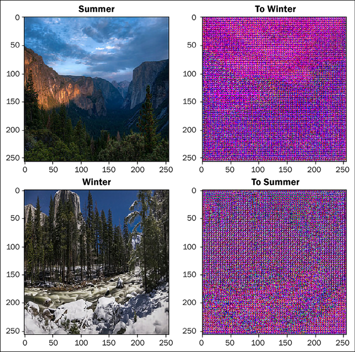

图 9.24:训练前 CycleGAN 架构中 GAN 1 的输入和 GAN 2 的输出

我们接下来定义损失和优化器。我们为发生器和鉴别器保留了与 DCGAN 中相同的损失函数:

```py
loss_obj = tf.keras.losses.BinaryCrossentropy(from_logits=True)

def discriminator_loss(real, generated):

    real_loss = loss_obj(tf.ones_like(real), real)

    generated_loss = loss_obj(tf.zeros_like(generated), generated)

    total_disc_loss = real_loss + generated_loss

    return total_disc_loss * 0.5

def generator_loss(generated):

    return loss_obj(tf.ones_like(generated), generated) 
```

由于现在有四个模型、两个生成器和两个鉴别器，我们需要定义四个优化器:

```py
generator_g_optimizer = tf.keras.optimizers.Adam(2e-4, beta_1=0.5)

generator_f_optimizer = tf.keras.optimizers.Adam(2e-4, beta_1=0.5)

discriminator_x_optimizer = tf.keras.optimizers.Adam(2e-4, beta_1=0.5)

discriminator_y_optimizer = tf.keras.optimizers.Adam(2e-4, beta_1=0.5) 
```

另外，在 CycleGAN 中，我们还需要定义两个损失函数，首先是循环一致性损失；我们可以对前向和后向循环一致性损失计算使用相同的函数。循环一致性损失确保结果接近原始输入:

```py
def calc_cycle_loss(real_image, cycled_image):

    loss1 = tf.reduce_mean(tf.abs(real_image - cycled_image))

    return LAMBDA * loss1 
```

我们还需要定义一个身份损失，它确保如果一个图像 *Y* 被提供给生成器，它将产生真实的图像 *Y* 或者类似于 *Y* 的图像。因此，如果我们给我们的夏季图像生成器一个夏季图像作为输入，它应该不会改变太多:

```py
def identity_loss(real_image, same_image):

    loss = tf.reduce_mean(tf.abs(real_image - same_image))

    return LAMBDA * 0.5 * loss 
```

现在我们定义函数，它批量训练生成器和鉴别器，一次一对图像。两个鉴别器和两个发生器通过该功能在磁带梯度的帮助下被训练。训练步骤可分为四个部分:

1.  从两个发生器获得输出图像。
2.  计算损失。
3.  计算梯度。
4.  最后，应用渐变:

    ```py
    @tf.function

    def train_step(real_x, real_y):

        # persistent is set to True because the tape is used

        # more than once to calculate the gradients.

      with tf.GradientTape(persistent=True) as tape:

        # Generator G translates X -> Y

        # Generator F translates Y -> X.

        fake_y = generator_g(real_x, training=True)

        cycled_x = generator_f(fake_y, training=True)

        fake_x = generator_f(real_y, training=True)

        cycled_y = generator_g(fake_x, training=True)

        # same_x and same_y are used for identity loss.

        same_x = generator_f(real_x, training=True)

        same_y = generator_g(real_y, training=True)

        disc_real_x = discriminator_x(real_x, training=True)

        disc_real_y = discriminator_y(real_y, training=True)

        disc_fake_x = discriminator_x(fake_x, training=True)

        disc_fake_y = discriminator_y(fake_y, training=True)

        # calculate the loss

        gen_g_loss = generator_loss(disc_fake_y)

        gen_f_loss = generator_loss(disc_fake_x)

        total_cycle_loss = calc_cycle_loss(real_x, cycled_x) + \

        calc_cycle_loss(real_y, cycled_y)

        # Total generator loss = adversarial loss + cycle loss

        total_gen_g_loss = gen_g_loss + total_cycle_loss + \

        identity_loss(real_y, same_y)

        total_gen_f_loss = gen_f_loss + total_cycle_loss + \

        identity_loss(real_x, same_x)

        disc_x_loss = discriminator_loss(disc_real_x,

        disc_fake_x)

        disc_y_loss = discriminator_loss(disc_real_y,

        disc_fake_y)

        # Calculate the gradients for generator and discriminator

        generator_g_gradients = tape.gradient(total_gen_g_loss,

        generator_g.trainable_variables)

        generator_f_gradients = tape.gradient(total_gen_f_loss,

        generator_f.trainable_variables)

        discriminator_x_gradients = tape.gradient(disc_x_loss,

        discriminator_x.trainable_variables)

        discriminator_y_gradients = tape.gradient(disc_y_loss,

        discriminator_y.trainable_variables)

        # Apply the gradients to the optimizer

        generator_g_optimizer.apply_gradients(zip(generator_g_gradients, generator_g.trainable_variables))

        generator_f_optimizer.apply_gradients(zip(generator_f_gradients, generator_f.trainable_variables))

        discriminator_x_optimizer.apply_gradients(zip(discriminator_x_gradients, discriminator_x.trainable_variables))

        discriminator_y_optimizer.apply_gradients(zip(discriminator_y_gradients, discriminator_y.trainable_variables)) 
    ```

我们定义检查点来保存模型权重。由于可能需要一段时间来训练一个足够好的 CycleGAN，我们保存检查点，如果我们开始下一步，我们可以从加载现有的检查点开始-这将确保模型从它离开的地方开始学习:

```py
checkpoint_path = "./checkpoints/train"

ckpt = tf.train.Checkpoint(generator_g=generator_g,

                           generator_f=generator_f,

                           discriminator_x=discriminator_x,

                           discriminator_y=discriminator_y,

                           generator_g_optimizer=generator_g_optimizer,

generator_f_optimizer=generator_f_optimizer,

discriminator_x_optimizer=discriminator_x_optimizer,

discriminator_y_optimizer=discriminator_y_optimizer)

ckpt_manager = tf.train.CheckpointManager(ckpt, checkpoint_path, max_to_keep=5)

# if a checkpoint exists, restore the latest checkpoint.

if ckpt_manager.latest_checkpoint:

    ckpt.restore(ckpt_manager.latest_checkpoint)

    print ('Latest checkpoint restored!!') 
```

现在让我们把它全部结合起来，训练网络 100 个时期。请记住，在论文中，测试网络被训练了 200 个纪元，所以我们的结果不会那么好:

```py
for epoch in range(EPOCHS):

    start = time.time()

    n = 0

    for image_x, image_y in tf.data.Dataset.zip((train_summer, train_winter)):

        train_step(image_x, image_y)

        if n % 10 == 0:

            print ('.', end='')

        n += 1

    clear_output(wait=True)

    # Using a consistent image (sample_summer) so that the progress of

    # the model is clearly visible.

    generate_images(generator_g, sample_summer)

    if (epoch + 1) % 5 == 0:

        ckpt_save_path = ckpt_manager.save()

        print ('Saving checkpoint for epoch {} at {}'.format(epoch+1,

                                                             ckpt_save_path))

    print ('Time taken for epoch {} is {} sec\n'.format(epoch + 1,

                                                        time.time()-start)) 
```

你可以看到一些由我们的 CycleGAN 生成的图像。生成器 *A* 接收夏季照片并将其转换为冬季照片，而生成器 *B* 接收冬季照片并将其转换为夏季照片:

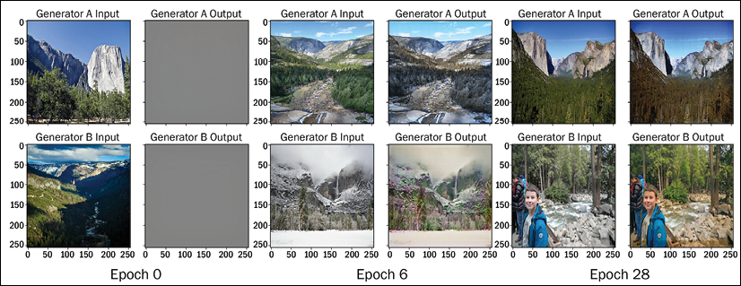

图 9.25:训练后使用 CycleGAN 的图像

我们建议您在 TensorFlow CycleGAN 数据集中试验其他数据集。有些很容易，但有些需要更多的训练。作者还维护了一个 GitHub 知识库，他们在这里分享了自己在 PyTorch 中的实现，以及到其他框架中实现的链接，包括 tensor flow:【https://github.com/junyanz/CycleGAN】T2。

# 基于流程的数据生成模型

虽然 VAEs ( *第 8 章*、*自编码器*)和 GANs 在数据生成方面做得很好，但是它们没有明确地学习输入数据的概率密度函数。GANs 通过将无监督的问题转化为监督学习问题来学习。

VAEs 试图通过最大化**证据下限** ( **ELBO** )来优化数据的最大对数似然来学习。基于流的模型不同于这两种模型，因为它们明确地学习数据分布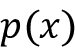。与 VAEs 和 GANs 相比，这提供了一个优势，因为这使得使用基于流的模型完成诸如填充不完整数据、采样数据甚至识别数据分布中的偏差等任务成为可能。基于流量的模型通过最大化对数似然估计来实现这一点。为了理解是如何做到的，让我们稍微研究一下它的数学。

设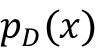为数据 *D* 的概率密度，设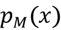为我们的模型 *M* 近似的概率密度。基于流的模型的目标是找到模型参数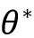，使得和之间的距离最小，即:

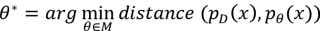

如果我们使用 KL 散度作为我们的距离度量，上面的表达式简化为:

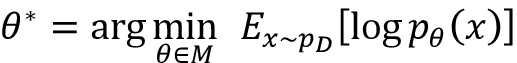

这个等式代表最小化负对数似然 ( **NLL** )(相当于最大化对数似然估计。)

基于流程的模型的基本架构由一系列可逆函数组成，如下图所示。挑战在于找到函数 *f(x)* ，使得它的逆函数 *f* ^(-1) *(x)* 生成 *x* '，即输入 *x* 的重构版本:

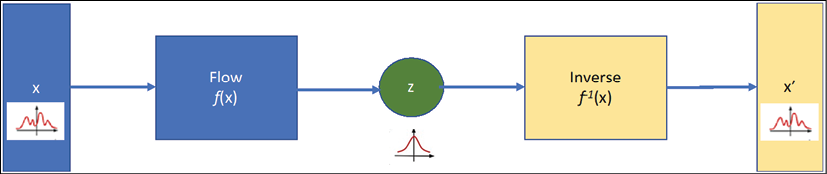

图 9.26:基于流程的模型架构

基于流的模型主要有两种实现方式:

*   Normalized Flow: Here, the basic idea is to use a series of simple invertible functions to transform the complex input. As we flow through the sequence of transformations, we repeatedly substitute the variable with a new one, as per the change of variables theorem ([https://archive.lib.msu.edu/crcmath/math/math/c/c210.htm](https://archive.lib.msu.edu/crcmath/math/math/c/c210.htm)), and finally, we obtain a probability distribution of the target variable. The path that the variables z[i] traverse is the flow and the complete chain formed by the successive distributions is called the normalizing flow.

    Dinh 等人 2017 年提出的 **RealNVP** ( **实值非保体**)模型、Dinh 等人 2015 年提出的 **NICE** ( **非线性独立分量估计**)以及 Knigma 和 Dhariwal 2018 年提出的 Glow 使用了归一化流技巧:

    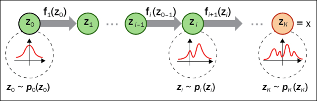

    图 9.27:标准化流程模型:https://lilianweng.github.io/posts/2018-10-13-flow-models/

*   自回归流:像**制作的** ( **用于分布估计的掩码自编码器**)、PixelRNN、wavenet 等模型都是基于自回归模型的。这里，向量变量中的每个维度都依赖于前面的维度。因此，观察到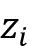的概率只取决于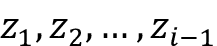，因此，这些条件概率的乘积给了我们整个序列的概率。

Lilian Weng 的博客([https://lilianweng.github.io/posts/2018-10-13-flow-models/](https://lilianweng.github.io/posts/2018-10-13-flow-models/))提供了一个非常好的基于流量模型的描述。

# 数据生成的扩散模型

两位 OpenAI 研究科学家 Prafulla Dhariwal 和 Alex Nichol 的 2021 论文*扩散模型在图像合成*上击败了 GANs，引起了人们对数据生成扩散模型的极大兴趣。

使用**Frechet 初始距离** ( **FID** )作为评估生成图像的指标，他们能够在 ImageNet 数据上训练的扩散模型上获得 3.85 的 FID 分数:

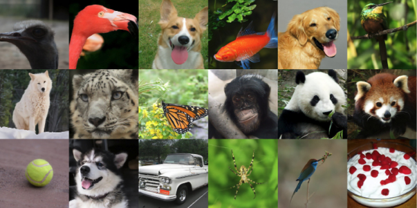

图 9.28:从 ImageNet (FID 3.85)生成的图像的选定样本。图片来源:Dhariwal，Prafulla 和 Alexander Nichol。"扩散模型在图像合成上击败了甘斯."*神经信息处理系统的进展* 34 (2021)

扩散模型背后的想法非常简单。我们取我们的输入图像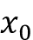和，在每个时间步(向前一步)，我们添加一个高斯噪声给它(噪声的扩散)，这样在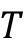时间步之后，原始图像不再是可辨认的。然后找到一个模型，它可以从有噪声的输入开始，执行反向扩散并生成清晰的图像:

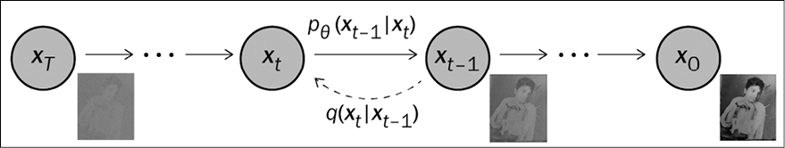

图 9.29:正向和反向扩散过程的马尔可夫链图形模型

唯一的问题是，虽然条件概率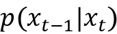可以使用重新参数化技巧获得，但是反向条件概率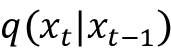是未知的。我们训练一个神经网络模型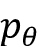来逼近这些条件概率。以下是 Ho 等人 2020 年在他们的*去噪扩散概率模型*论文中使用的训练和采样算法:

| **算法 1 训练** | **算法 2 采样** |
| 1.**重复**2.3.4.5.在上采取梯度下降步骤6.**直到**收敛 | 1.2.**为** *t* = *T* ，...，1 **做**3.4.5.**结束于**6.**返回 x** [0] |

表 9.1:Ho 等人使用的训练和采样步骤，2020 年

扩散模型提供了易处理性和灵活性——这是生成模型中两个相互冲突的目标。然而，它们依赖于扩散步骤的长马尔可夫链，因此计算量很大。扩散模型有很大的吸引力，我们希望在不久的将来会有像 GANs 一样快速采样的算法。

# 摘要

本章探索了我们这个时代最令人兴奋的深度神经网络之一:GANs。与判别网络不同，gan 具有基于输入空间的概率分布生成图像的能力。我们从 Ian Goodfellow 提出的第一个 GAN 模型开始，并使用它来生成手写数字。接下来我们去了 DCGANs，在那里卷积神经网络被用来生成图像，我们看到了由 DCGANs 生成的名人、卧室甚至专辑插图的非凡照片。最后，本章深入探讨了一些令人惊叹的 GAN 架构:SRGAN、CycleGAN、InfoGAN 和 StyleGAN。本章还包括在 TensorFlow 2.0 中实现 CycleGAN。

在这一章和之前的章节中，我们继续讨论不同的无监督学习模型，包括自编码器和 GANs 的自监督学习的例子；下一章将进一步详述自监督学习、联合学习和对比学习之间的区别。

# 参考

1.  伊恩·古德费勒(2014 年)。*关于评估生成模型的可分辨性标准*。arXiv 预印本 arXiv:1412.6515:【https://arxiv.org/pdf/1412.6515.pdf 
2.  文森特·杜穆林和弗朗切斯科·维辛。(2016).*深度学习卷积算法指南*。arXiv 预印本 arXiv:1603.07285:【https://arxiv.org/abs/1603.07285 
3.  萨利曼斯、蒂姆等人(2016 年)。*训练 GANs 的改良技术*。神经信息处理系统进展:[http://papers . nips . cc/paper/6125-improved-techniques-for-training-gans . pdf](http://papers.nips.cc/paper/6125-improved-techniques-for-training-gans.pdf%20)
4.  约翰逊，贾斯汀，阿拉希，亚历山大和，李。(2016).*实时风格转换和超分辨率的感知损失*。欧洲计算机视觉会议。施普林格，查姆:【https://arxiv.org/abs/1603.08155 
5.  拉德福德，亚历克，梅斯，卢克。、钦塔拉、苏密特。(2015).*深度卷积生成对抗网络的无监督表示学习*。arXiv 预印本 arXiv:1511.06434:【https://arxiv.org/abs/1511.06434 
6.  莱迪格、克里斯蒂安等人(2017 年)。*使用生成对抗网络的照片级单幅图像超分辨率*。IEEE 计算机视觉与模式识别会议论文集:[http://open access . the CVF . com/content _ cvpr _ 2017/papers/Ledig _ Photo-Realistic _ Single _ Image _ CVPR _ 2017 _ paper . pdf](http://openaccess.thecvf.com/content_cvpr_2017/papers/Ledig_Photo-Realistic_Single_Image_CVPR_2017_paper.pdf)
7.  朱，严军等(2017)。使用循环一致对抗网络的不成对图像到图像翻译。IEEE 计算机视觉国际会议论文集:[http://open access . the CVF . com/content _ ICCV _ 2017/papers/朱 _ Unpaired _ Image-To-Image _ Translation _ ICCV _ 2017 _ paper . pdf](http://openaccess.thecvf.com/content_ICCV_2017/papers/Zhu_Unpaired_Image-To-Image_Translation_ICCV_2017_paper.pdf)
8.  卡拉斯，泰罗，莱恩，萨穆利，还有艾拉，提莫。(2019).*一种基于风格的生成式对抗网络生成器架构*。IEEE/CVF 计算机视觉和模式识别会议论文集，第 4401-4410 页。
9.  陈，，等(2016)。 *InfoGAN:通过信息最大化生成对抗网络的可解释表示学习*。神经信息处理系统进展:【https://arxiv.org/abs/1606.03657 
10.  StyleGAN 的 TensorFlow 实现:[https://github.com/NVlabs/stylegan](https://github.com/NVlabs/stylegan)

# 加入我们书的不和谐空间

加入我们的 Discord 社区，结识志同道合的朋友，与 2000 多名会员一起学习:[https://packt.link/keras](https://packt.link/keras)

