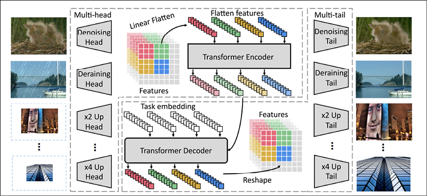
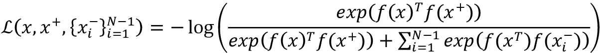

# Ten

# 自我监督学习

想象你在海洋的中央，你很渴。你周围都是水，但是你一点也不能喝。但是，如果你有办法把水中的盐煮出来，从而使水可以饮用，那会怎么样呢？当然，与此过程相关的能源成本可能相当高，因此您可能会适度使用此过程。然而，如果你的能源成本实际上变得免费，例如，如果你正在利用太阳能，这个过程对你来说可能更有吸引力。

在我们上面描述的有些简单的情况下，第一个场景大致类似于监督学习，第二个场景类似于我们将在本章讨论的非监督/半监督学习技术。监督学习技术的最大问题是与收集标记的训练数据相关联的时间和费用。因此，带标签的数据集通常相对较小。

深度学习在计算和手动特征工程之间进行权衡，尽管这可能非常有效，但深度学习模型通常比传统(非深度学习)模型需要更多的数据来训练。深度学习模型往往更复杂，有更多可学习的参数，这导致它们在各种任务中表现更好。然而，更复杂的模型也需要更多的数据来训练。因为训练数据的创建非常昂贵，这有效地限制了我们使用监督学习来扩展深度学习模型。

不幸的是，不需要标记数据的完全无监督学习技术迄今为止取得的成功有限。自我监督技术利用野外的数据结构来创建标记数据，以提供监督学习模型，这种技术提供了一个中间地带。在这一章中，我们将学习各种自我监督技术以及它们在自然语言处理、计算机视觉和音频信号处理领域的一些应用。

本章涵盖以下主题:

*   以前的工作
*   自我监督学习
*   自我预测
*   对比学习
*   借口任务

本章的所有代码文件都可以在 https://packt.link/dltfchp10 找到

自我监督学习是一个创造性地重复使用已经隐含在你的数据中的标签的过程。在这一章中，我们将学习一些自我监督学习的常用策略，以及用它们来解决现实生活中的问题的例子。我们开始吧。

# 以前的工作

自我监督学习并不是一个新概念。然而，随着基于变压器的模型(如 BERT 和 GPT-2)的出现，该术语变得流行起来，这些模型以半监督的方式在大量未标记的文本上进行训练。在过去，自我监督学习常常被贴上无监督学习的标签。然而，有许多早期的模型试图利用输入数据中的规律性来产生与使用监督学习相当的结果。您已经在前面的章节中遇到了其中的一些，但是我们将在本节中再次简要介绍它们。

**受限玻尔兹曼机器** ( **RBM** )是一个生成神经模型，可以学习其输入的概率分布。它发明于 1986 年，随后在 2000 年代中期得到改进。它可以在有监督或无监督的模式下进行训练，并可应用于许多下游任务，如降维、分类等。

**自动编码器** ( **AEs** )是无监督的学习模型，试图通过学习重构输入来学习输入数据的高效潜在表示。潜在表示可用于对下游任务的输入进行编码。这个模型有几种变体。稀疏、去噪和对比 AEs 在下游分类任务的学习表示中是有效的，而变化 AEs 作为生成模型更有用。

Word2Vec 模型是我们现在称之为自我监督学习的另一个很好的例子。CBOW 和 skip-gram 模型用于在语料库中建立单词的潜在表示，试图分别学习邻居到单词和单词到邻居的映射。然而，潜在表征现在可以用作各种下游任务的词嵌入。类似地，GloVe 模型也是一个自我监督的模型，它使用单词共现和矩阵分解来生成对下游任务有用的词嵌入。

**自回归** ( **AR** )模型根据过去的行为预测未来的行为。我们将在本章的*自我预测*一节中介绍它们。然而，AR 模型的根源在于统计学中的时间序列分析，前神经自然语言处理中的隐马尔可夫模型**，神经(但前变换器)NLP 中的循环神经网络** ( **RNNs** )。

对比学习 ( **CL** )模型试图学习表征，即相似的物品对聚集在一起，不相似的物品对被推开。

合作学习模式也在本章的*对比学习*部分涉及。然而，**自组织地图** ( **SOMs** )和暹罗网络使用非常相似的想法，可能是当前 CL 模型的前身。

# 自我监督学习

在自我监督学习中，使用监督学习来训练网络，但是标签是通过利用数据的一些属性以自动方式获得的，而不需要人工标记。通常，这种自动化是通过利用数据样本的各个部分如何相互作用并学习预测来实现的。换句话说，数据本身为学习过程提供了监督。

一类技术涉及利用同一数据样本的部分内的同现或同一数据样本在不同时间点的同现。这些技术将在*自我预测*部分详细讨论。

另一类技术涉及利用给定数据样本的共现模态，例如，在一段文本和其相关联的音频流之间，或者图像和其标题之间。这种技术的例子将在联合学习的章节中讨论。

另一类自我监督学习技术包括利用数据样本对之间的关系。这些对是基于某个领域级别的启发从数据集中选择的。这些技巧的例子在*对比学习*部分有所介绍。

这些技术可以用来训练一个模型去学习解决一个商业任务(比如情感分析，分类等等)。)或者学习数据的潜在(嵌入)表示，该数据的潜在(嵌入)表示随后可用于生成学习解决下游业务任务的特征。后一类用于间接学习数据潜在表征的任务被称为借口任务。*托词任务*部分将通过例子更详细地介绍这个主题。

自我监督学习的优势是双重的。首先，如前所述，监督学习涉及数据的手动标注，这是非常昂贵的，因此很难获得高质量的标注数据。第二，自我监督的任务可能不会直接处理业务任务，但可以用来学习数据的良好表示，然后可以应用于将该信息传输到下游的实际业务任务。

# 自我预测

自我预测背后的想法是在给定数据样本的一部分的情况下预测另一部分。为了预测的目的，我们假装要预测的部分被隐藏或缺失，并学习预测。很明显，两部分都是已知的，要预测的部分作为数据标签。该模型以监督方式训练，使用非隐藏部分作为输入，隐藏部分作为标签，学习准确预测隐藏部分。本质上，它是假装有一部分输入你不知道，并预测。

该思想还可以扩展到反转管道，例如，故意将噪声添加到图像中，并将原始图像用作标签，将损坏的图像用作输入。

## 自回归世代

**自回归** ( **AR** )模型试图根据过去的事件、行为或性质来预测未来的事件、行为或性质。任何带有某种内在顺序的数据都可以使用 AR 生成进行建模。与 VAEs 或 GANs 等潜在变量模型不同，AR 模型没有独立性假设。

### 像素网络

PixelRNN [1] AR 模型使用二维**循环神经网络** ( **RNNs** )对图像进行大规模建模。想法是通过调节左边和上面的所有像素来学习生成像素。卷积运算用于同时计算每个维度上的所有状态。PixelRNN 中使用的 LSTM 层有两种类型——行 LSTM 和对角线 BiLSTM。在行 LSTM 中，沿着每一行应用卷积，而在对角线图像中，沿着图像的对角线应用卷积:

|  |  |

图 10.1: PixelRNN 试图通过调节像素左侧和上方的所有像素来预测像素。从论文像素循环神经网络[1]

### 图像 GPT (IPT)

图像 GPT (IPT) [14]类似于 PixelRNN，除了它对补丁起作用，并且每个补丁被视为一个单词。图像 GPT 基于转换器模型，并在来自 ImageNet 数据集的图像上进行训练。图像以多种不同的方式(超分辨率、双三次插值、添加噪声等)被破坏。)并进行预处理以预测原始图像。IPT 模型的核心由一个变换器编码器解码器对组成，但有多个头和尾分别从被破坏的输入图像中提取特征，并将解码器输出格式化为输出图像。多个头部和尾部专门用于 IPT 接受训练的不同任务(去噪、去训练、x2 和 x4 超分辨率等)。):



图 10.2:影像 GPT (IPT) AR 模型的架构。从纸张预训练图像处理变压器[14]

### GPT-3

OpenAI 的 GPT-3 或生成式预训练转换器[9]模型是一种 AR 语言模型，可以生成类似人类的文本。它从人类提供的提示开始，生成单词、代码和其他数据的序列。第一版 GPT 使用了 1.1 亿个学习参数，GPT-2 使用了 15 亿个，GPT-3 使用了 1750 亿个参数。该模型在未标记的文本上进行训练，例如在互联网上容易获得的维基百科，最初是英语，后来也有其他语言。GPT-3 模型有各种各样的用例，包括总结、翻译、语法纠正、问题回答、聊天机器人和电子邮件撰写。

GPT-3 的流行使上升到一个新的职业，叫做提示工程【39】，基本上是创造最有效的提示来启动 GPT-3 执行各种任务。关于 GPT 3 号可能应用的部分列表可以在开放的 GPT 3 号示例页面上找到(【https://beta.openai.com/examples/】T4)。

### XLNet

XLNet [38]与 GPT-3 的相似之处在于它是一个广义的 AR 模型。然而，它利用了 AR 语言建模和 T2 自动编码，同时避免了它们的局限性。不是仅使用来自左或右上下文的记号来预测下一个记号，而是使用来自左和右上下文的记号的所有可能排列，因此使用来自左和右上下文的记号来预测。第二，与 BERT 等 AE 方法不同，它不依赖于输入损坏(如在掩蔽语言建模中)，因为它是一种通用的 AR 语言模型。从经验上来说，在可比的实验设置下，XLNet 在许多任务上始终优于 BERT。

### 小浪

WaveNet [3]是一个基于 PixelCNN 架构的 AR 生成模型，但对原始音频波形进行操作。与 PixelCNN 一样，特定时间点的音频样本取决于所有先前时间步长的样本。条件概率分布被建模为一堆卷积层。波网的主要成分是因果卷积。模型在某个时间步长发出的预测不能依赖于任何未来的时间步长。当应用于文本到语音转换时，WaveNet 产生了最先进的性能，人类听众认为它在英语和普通话方面比可比的文本到语音转换模型更自然。

### 韦韦因

WaveRNN [28]是一个 AR 生成模型，它通过将分布分解为每个样本的条件概率的乘积来学习数据的联合概率。WaveNet 架构的卷积层被单层 RNN 取代。它还使用了更高效的采样技术，总体上减少了要执行的操作数量，并使 WaveNet 的速度提高了大约 4 倍。

## 蒙面一代

屏蔽生成模型屏蔽了它们自身的某个随机部分，并假装丢失了，模型学习使用它们可用的未屏蔽信息来预测屏蔽信息。与自回归模型不同，在屏蔽生成模型的情况下，不需要将屏蔽信息置于未屏蔽信息之前或之后；它可以在输入中的任何地方。

### 伯特

**BERT**【16】，或者来自变形金刚的**双向编码器表示，是一个基于变形金刚的语言模型，由谷歌的一个团队使用来自互联网的文本进行训练。它在预训练阶段使用两个目标——**屏蔽语言建模** ( **MLM** )和**下一句预测** ( **NSP** )。在训练期间，15%的输入标记被屏蔽，并且模型学习预测被屏蔽的标记。由于该模型是基于 transformer 的，它可以使用句子中任何地方的上下文来帮助预测屏蔽的标记。BERT 模型经过预训练后，可以使用较小的监督数据集进行微调，以完成各种下游任务，如分类、情感分析、文本蕴涵等。伯特在第六章、*变形金刚*中有更深入的介绍。**

您可以使用来自拥抱脸变形金刚库的预训练 BERT 模型和下面显示的代码片段来查看 BERT 的蒙面一代。这里，我们要求一个预训练的 BERT 变换器模型来预测句子`"The capital of France is [MASK]."`中的屏蔽标记`[MASK]`:

```
from transformers import BertTokenizer, TFBertForMaskedLM

import tensorflow as tf

tokenizer = BertTokenizer.from_pretrained("bert-base-cased")

model = TFBertForMaskedLM.from_pretrained("bert-base-cased")

inputs = tokenizer("The capital of France is [MASK].", return_tensors="tf")

logits = model(**inputs).logits

mask_token_index = tf.where(inputs.input_ids == tokenizer.mask_token_id)[0][1]

predicted_token_id = tf.math.argmax(logits[:, mask_token_index], axis=-1)

print(tokenizer.convert_ids_to_tokens(predicted_token_id)[0]) 
```

有点可以预见，这个代码块的输出是`"Paris"`。

### 堆叠去噪自动编码器

堆叠去噪自动编码器(AE) [29]将随机噪声添加到图像，并使用它们作为去噪 AE 的输入，以预测原始图像。多层去噪 AEs 各自被单独训练和堆叠。这导致几个非线性水平的合成，并且是在困难的图像识别任务上实现更好的概括性能的关键。以这种完全无监督的方式学习的更高级表示可以用作图像特征，以提高下游基于 SVM 的图像分类器的性能。每一层的功能都像一个常规的 AE，即它将图像作为输入，并在通过“瓶颈”层后尝试重建它。瓶颈层学习输入图像的紧凑特征表示。不幸的是，AEs 通常最终只学习如何压缩图像，而没有学习语义上有意义的表示。去噪 AEs 通过破坏输入并要求网络撤销破坏从而学习输入图像的更好的语义表示来解决这个问题。

### Context autoencoder

上下文自动编码器[12]屏蔽掉图像的区域,并使用它来训练卷积神经网络(上下文 AE ),以回归丢失的像素值来预测原始图像。上下文 AE 的任务甚至比去噪 AE 的任务更难，因为它必须填充更大的缺失区域，并且不能使用来自紧邻像素的信息。这需要对图像有更深层次的语义理解，以及在大空间区域生成高级特征的能力。在某种意义上，语境 AE 是一个更强大的生成模型，因为它需要填充缺失的区域，同时保持与所提供的语境的一致性。

为此，上下文 AE 被训练来重建重建损失和对抗损失的组合。这导致比单独的重建(L2)损失训练更精确的预测:


图 10.3:上下文编码器任务的定性说明(来自上下文编码器:通过修补进行特征学习[10])

上下文不一定是图像的特征，也可以是颜色，我们将在下一节看到。

### 着彩色

论文*彩色化作为视觉理解的代理任务*【12】使用彩色化作为学习图像表示的一种方式。彩色图像被转换成它们的灰度等效值，然后用作预测原始彩色图像的输入。该模型可用于自动给灰度图像着色，以及学习可帮助下游任务(如图像分类和分割)的表示。在功能方面，该模型预测了给定其 *L* (灰度)通道的 *Lab* 编码中的 *a* 和 *b* (颜色信息)通道。本文作者在 ImageNet 数据集上进行的实验产生了一些模型，这些模型针对数据集产生了最先进的结果，用于不使用 ImageNet 标签的模型的语义分割和图像分类，甚至超过了一些使用监督学习在 ImageNet 上训练的早期模型。

## 先天关系预测

使用这种技术的模型试图通过利用输入图像各部分之间的内在关系来学习视觉常识任务。来自这些学习模型的权重可以用于为其他下游任务生成图像的语义表示。

### 相对位置

论文*通过上下文预测的无监督视觉表示学习*【8】预测图像中一个小块相对于另一个小块的相对位置。实际上，这种方法使用空间环境作为训练视觉表征的自我监督来源。给定一个大的未标记图像集合，从每个图像中提取随机的补丁对，如图*图 10.4* 所示。根据第二个补片相对于中心补片的方向来标记每一对。训练卷积网络来预测第二个碎片相对于第一个碎片的位置。发现所学习的特征表示捕捉了跨图像的视觉相似性的概念。使用这种表示，它已被证明有助于可视化数据挖掘，即，相对于 Pascal VOC 2007 数据集，发现描绘相同语义对象的图像片段:


图 10.4:相对位置预测示意图。该模型必须预测第二补片相对于(中心)第一补片的构型。通过上下文预测的无监督视觉表示学习[8]

### 解决拼图游戏

论文*通过解决拼图游戏*【26】描述了一种有点类似于之前预测相对位置的方法的方法。这种方法试图通过解决自然图像的拼图来学习图像的视觉表示。从输入图像中提取小块并混洗以形成拼图。网络从拼图游戏中学习重建原始图像，即解决拼图游戏。使用的网络是一个**上下文无关网络** ( **CFN** )，一个 n 路连体网络。每个面片对应于 n 向 CFN 中的一列。每一列中的共享层的实现与 AlexNet 中的完全一样。分类头预测补丁的原始索引(洗牌前)。在 Pascal VOC 数据集上，它在图像分类和对象检测任务方面优于所有以前的自监督模型:


图 10.5:图像被分割成小块并被混洗，模型学习将混洗的小块按正确的顺序放回原处。来自论文视觉表征的无监督学习[26]

### 旋转

RotNet 模型[34]通过使用旋转作为自监督信号来学习图像表示。输入图像旋转 0、90、180、270 度，训练一个卷积网络(RotNet)学习预测旋转角度作为 4 个目标类之一。事实证明，这个看似简单的任务为语义特征学习提供了一个非常强大的监督信号。RotNet 特征被用作针对 CIFAR-10 数据集的图像分类的输入，导致分类精度仅比使用监督学习获得的最先进结果低 1.6%。它还获得了当时针对 ImageNet 的一些分类任务和针对 Pascal VOC 的一些分类和对象检测任务的最新结果。

## 混合自预测

利用混合自预测模型，自预测使用不是一个而是多个自预测策略来实现。例如，我们的前两个例子，Jukebox 和 DALL-E，通过首先使用一种自监督技术(VQ-VAE 或矢量量化变分自动编码器[35])将输入数据减少到更易于管理的格式，然后在减少的图像上使用另一种(AR)来产生最终预测，从而实现自预测。在我们的第三个例子中，来自 VQ-VAE 组件的预测使用以对抗方式训练的鉴别器被进一步改进。

### VQ-VAE

由于 VQ-VAE 模型对于我们所有的混合自我预测模型来说都是通用的，所以让我们试着从高层次上理解它的作用。你已经在*第 8 章*、*自动编码器*中读到过自动编码器和变型自动编码器。自动编码器试图学习通过首先将输入编码到较小的维度上，然后解码较小维度的输出来重构它们的输入。然而，自动编码器通常只是以压缩输入结束，而没有学习到好的语义表示。

**变分自动编码器** ( **VAEs** )可以在这方面做得更好，通过实施概率先验，通常以标准高斯分布的形式，并且通过不仅最小化重建损失，而且最小化先验分布和后验分布(潜在空间中的实际分布)之间的 KL 散度。

VAE 学习连续的潜在分布，而 VQ-VAE 学习离散的潜在分布。这很有用，因为转换器被设计为将离散数据作为输入。VQ-VAE 通过向网络添加离散码本组件来扩展 VAE，该离散码本组件用于通过选择码本中通过欧几里德距离最接近每个潜在向量的向量来量化编码器输出的潜在向量。然后，VQ-VAE 解码器的任务是从离散化的潜在向量中重建输入。

### 投币式自动点唱机

我们的第一个例子是点唱机论文【32】，它是音乐的生成模型，类似于 GPT-3 是文本和图像的生成模型——GPT 是图像的生成模型。也就是说，给定一个音乐(语音和音乐)提示，Jukebox 可以根据该提示创建音乐。对音频生成模型的早期尝试尝试以钢琴卷首的形式进行符号音乐生成，因为直接生成原始音频的问题是它包含非常大量的信息，因此需要对极长范围的依赖性进行建模。VQ-VAE 通过学习音频的低维编码来解决这个问题，目的是丢失最不重要的信息，但保留大部分有用的信息。

Jukebox 使用分级 VQ-VAEs 将输入信号离散化为不同的时间分辨率，然后在每个分辨率下生成新的序列，最后将每个级别上生成的序列合并到最终预测中。

### 达尔-埃

我们混合预测模型的第二个例子是 OpenAI 的 DALL-E 模型【5】。DALL-E 也可以归类为联合学习(多模态)模型，因为它试图使用成对的文本和图像作为训练输入，学习从文本标题创建图像。然而，我们在这里将其归类为混合预测模型，因为像 Jukebox 一样，它试图使用 VQ-VAE 来解决图像信息的高维度(与相关文本的维度相比)。

DALL-E 将文本和图像作为单一数据流接收。DALL-E 采用两阶段训练制度。在第一阶段，VQ-VAE 被训练来将大小为(256，256，3)的每个输入 RGB 图像压缩成大小为(32，32)的图像表征的网格，其每个元素可以假定 8，192 个可能的离散值中的一个。这将图像输入的大小减少了 192 倍，而图像质量没有相应的损失。

在第二阶段，文本被 BPE 编码并被截断成 256 个记号。**字节对编码** ( **BPE** )是一种混合的字符/单词编码，通过对常见的字节对进行编码，可以用相对较小的词汇量表示较大的语料库。然后，此编码与 1，024 (32 x 32)个图像标记的展平序列连接在一起。该组合序列用于训练自回归变换器，以对文本和图像标记上的联合分布进行建模。第一阶段学习 VQ-VAE 中的视觉码本，第二阶段学习文本和图像标记上的离散潜在分布的先验。经过训练的 DALL-E 模型随后可用于生成给定文本提示的图像。

文本到图像的生成越来越流行。OpenAI 最近发布了一个更新版本的 DALL-E，名为 DALL-E 2。与 DALL-E 的 120 亿个参数相比，它有 350 亿个参数。尽管它们的名字相似，但 DALL-E 是 GPT-3 的一个版本，经过训练可以从文本描述中生成图像，DALL-E 2 是一个编码器-解码器管道，它使用 CLIP 将文本描述编码成剪辑嵌入，然后使用扩散模型将嵌入解码回图像，您在第九章、*生成模型*中了解到了该模型。正如预期的那样，DALL-E 2 生成的图像比 DALL-E 更真实、更准确。

最近，Google Research 发布了 Imagen，这是该领域的另一款机型，与 DALL-E 2 竞争。像 DALL-E 2 一样，Imagen 使用 T5-XXL 编码器将输入文本映射到嵌入内容中，并使用扩散模型将嵌入内容解码到图像中。

### VQ-GAN

VQ-甘[30]使用编码器-解码器框架，其中编码器使用 VQ-VAE 风格的编码器，该编码器学习离散的潜在表示，但是解码器是**生成对抗网络** ( **甘**)的鉴别器组件。与 VQ-VAE 中使用的 L2 损失不同，VQ-GAN 使用感知损失和鉴别器损失的组合，这有助于在提高压缩率的情况下保持良好的感知质量。使用 GAN 架构而不是传统的 VAE 解码器有助于提高训练效率。

像 VQ-VAE 一样，VQ-甘学习上下文丰富的视觉组件的码本，用于组成序列来训练自回归组件。使用**弗雷歇初始距离** ( **FID** )度量，在来自 ImageNet 的图像上，发现 VQ-GAN 的性能优于 VQ-VAE-2 模型，尽管它使用的参数少了大约 10 倍:


图 10.6:VQ-甘的架构。摘自论文:驯服高分辨率图像合成的变压器[30]

接下来，我们将看看另一种流行的自我监督技术，叫做对比学习。

# 对比学习

**对比学习** ( **CL** )试图预测一对输入样本之间的关系。CL 的目标是学习一个嵌入空间，其中成对的相似样本被拉得很近，而不相似的样本被推得很远。训练 CL 模型的输入是以*对数据点*的形式。CL 可用于监督和非监督设置。

当在无人监督的环境中使用时，它可以是一种非常强大的自我监督学习方法。以自我监督的方式从现有数据中找到相似的对，并且从相似的数据对中找到不相似的对。该模型学习预测一对数据点是相似还是不同。

通过考虑用于产生对比范例的技术，可以得出合作学习的分类。在此之前，我们将简短地探讨一下 CL 中流行的各种培训目标。

## 训练目的

早期的 CL 模型使用由单个正面和单个反面例子组成的数据点进行学习。然而，最近的 CL 模型的趋势是在单个批次中从多个阳性和阴性样本中学习。在本节中，我们将介绍一些常用于训练 CL 模型的训练目标(也称为损失函数)。

### 对比损失

对比损失[35]是使用化学发光技术学习的最早的训练目标之一。它试图将数据编码到嵌入空间中，使得来自相同类的示例具有相似的嵌入，而来自不同类的示例具有不同的嵌入。因此，给定两个数据对，( *x* [i] *，y* [i] )和( *x* [j] *，y* [j] )，使用以下公式描述对比损失目标:


当对 *i* 和 *j* 相似时激活第一项，当对不相似时激活第二项。目标被设计为最大化第一项中的差的平方，最小化第二项中的差的平方(因此在不同对的情况下最大化第二项)。是一个超参数，代表不同类别样本之间的最小容许距离。

### 三重损失

三重损失[11]是对比损失的增强，因为它使用三个数据点而不是两个数据点——锚点、正点和负点。因此，给定一个锚点 *x* ，我们选择一个正样本和一个负样本，其中 *x* 和属于同一类， *x* 和属于不同类。三重损失学习最小化锚 *x* 和正样本之间的距离，最大化 *x* 和负样本之间的距离。这在*图 10.7* 中有所说明:


图 10.7:三重态损失示意图。基于论文:FaceNet:人脸识别和聚类的统一嵌入[11]

三重态损耗的公式如下所示。与对比损失一样，是一个超参数，代表相似和不相似对之间距离的最小允许差异。基于三重损失的模型通常需要挑战性的值，即所谓的硬负值，以提供良好的表示:


### n 对损耗

n 对损失[21]概括了三重损失，将比较与多个负样本结合起来，而不是只有一个负样本。这样，给定一个 *(N+1)* 元组的训练样本，{ *x* ，*x*+，*x*[1]^-，*x*[2]^-，…，*x*[N+1]^-}。



### 提升的结构损失

提升的结构损失[15]是三重损失的另一种推广,其中它使用训练批次中的所有成对边缘。这导致更好的训练表现。*图 10.8* 展示了提升结构损失背后的思想，以及它是如何从对比损失和三重损失演变而来的。红边连接相似线对，蓝边连接不同线对:


图 10.8:提升的结构性损失的概念说明。基于论文:通过提升的结构化特征嵌入的深度度量学习[15]

### NCE 损失

**噪声对比估计** ( **NCE** )损失【27】利用逻辑回归区分正负(噪声)实例。NCE 损失试图最大化正例 *x* 的对数概率(logits)并最小化负例的对数概率。NCE 损耗的公式如下所示:


### infonet 损失

InfoNCE loss [2]受 NCE 损失(在上一节中描述)的启发，使用分类交叉熵损失从一组不相关的噪声样本中识别正样本。给定某个上下文向量 *c* ，正例样本应该从条件概率分布 *p(x|c)* 中抽取，而 *N-1* 个负例可以从与上下文 *c* 无关的分布 *p(x)* 中抽取。信息损失优化了正确分类正样本的负对数概率。

信息损失由以下等式给出，其中 *f(x，c)* 估计密度比 *p(x|c) / p(x)* :


### 软最近邻损失

软最近邻损失[33]进一步扩展了对比损失的概念,以包括给定已知标签的多个阳性样本。给定一批样本，其中*y*I 是*x*I 的类别标签，并且相似性函数 *f* 测量两个输入之间的相似性，软最近邻损失由以下等式给出:


温度是一个超参数，用于调整特征在表示空间中的集中程度。因此，在低温下，表示空间中的远点对软最近邻损失的贡献也很低。

## 实例转换

使用实例转换的 CL 模型通常依靠数据扩充技术来生成正对，并通过负挖掘从正对中生成负对。许多这样的模型依赖于生成批量负片和挖掘硬负片的创新技术。

数据扩充技术用于创建原始数据点及其噪声版本对。这在不修改语义含义的情况下将非必要的变化引入到示例中，然后模型在训练期间学习语义含义。

批内阴性取样是一种通过组合单个批次中样本的信息来产生阴性样本的技术。对于批量中的每一个正对( *x* [i] *，y* [i] )，所有的所有对( *x* [ i ] *，y * [j] )和( *x* [ j ] *，y * [i] )都可以认为是负对。实际上，负对是通过组合来自同一批中两个随机正对的元素来创建的。这种技术很实用，可以在 GPU 上高效实现，因此被广泛使用。

一些模型需要硬负样本来学习如何很好地执行它们的任务。硬否定是具有不同标签的对，但是它们的嵌入特征彼此非常接近。您可以将它们想象为嵌入空间中彼此非常接近但位于决策边界相对两侧的点。对于监督学习来说，识别给定任务的硬否定相对容易。对于无监督学习，一种方法是增加批量大小，这将引入更多的硬负样本。另一种技术[19]是通过候选负样本与锚样本的相似性来增加其采样概率。

### 简单的

SimCLR 模型[36]为视觉表征的对比学习提供了一个简单的框架。每个输入图像( *x* )以两种不同的方式(*x*I 和*x*j)使用相同系列的图像增强策略进行增强，从而产生 *2N* 个正样本。

采用的是批内负样本，所以对于每个正样本，我们都有 *(2N-1)* 个负样本。在每个示例中，基础编码器( *f* )被应用于数据点对，投影头( *g* )试图最大化正对的一致性，并最小化负对的一致性。为了获得良好的性能，SimCLR 需要使用较大的批量，以便在训练机制中包含足够多的反面例子。SimCLR 在 ImageNet 上实现了自监督和半监督模型的最先进结果，并与监督 ResNet-50 的性能相匹配。*图 10.9* 显示了 SimCLR 模型的架构:


图 10.9:sim clr 模型的架构。摘自论文:视觉表征对比学习的简单框架[36]

### 巴洛双胞胎

巴洛双胞胎[20]模型背后的想法源于神经科学，即感觉处理的目标是将高度冗余的感觉输入重新编码成阶乘代码，或具有统计独立成分的代码。在这个模型中，一个图像被扭曲成它自己的两个版本。失真版本被馈送到相同的网络中，以提取特征并学习使这两个特征之间的互相关矩阵尽可能接近单位矩阵。与神经科学的想法一致，该模型的目标是通过减少这些向量之间的冗余来减少样本的两个失真版本之间的冗余。这反映在其有些独特的损失函数中——在第一个方程中，第一项代表单位矩阵和互相关矩阵之差，第二项代表冗余减少项。第二个等式定义了互相关矩阵 *C* 的每个元素:


Barlow Twins 模型与这一类型中的其他模型之间的一些显著差异是，Barlow Twins 模型不需要大量的阴性样本，因此可以对较小的批次进行操作，并且它受益于高维嵌入。巴洛双胞胎模型优于之前在 ImageNet 上训练的一些半监督模型，并且与一些监督 ImageNet 模型不相上下。

### BYOL

**引导你自己潜在的** ( **BYOL** )模型【17】是独一无二的，因为根本不使用负样本。它依赖于两个神经网络，在线和目标网络，它们相互作用并相互学习。BYOL 的目标是学习一种可用于下游任务的表示法。在线网络由一组权重参数化，包括三个阶段——编码器、投影仪和预测器目标网络与在线网络具有相同的架构，但使用不同的一组权重。目标网络提供回归目标来训练在线网络，其参数是在线参数的指数移动平均值，每训练一步后，进行如下更新:


BYOL 为每幅图像生成两个增强视图。从第一增强视图，在线网络输出表示和投影。类似地，目标网络输出表示和投影，BYOL 试图最小化 L2 归一化在线和目标投影和之间的误差。在培训结束时，我们只保留在线网络(编码器)。

BYOL 在 ImageNet 上取得了与半监督或转移学习模型的项竞争结果。与这一类型的其他模型相比，它对批量大小和所用图像放大类型的变化也不太敏感。然而，后来的工作[4]表明，BYOL 中的批量标准化组件可能通过隐式地创建负样本来隐式地导致一种形式的对比学习，这是它导致的数据重新分布的结果。

### 特征聚类

特征聚类包括通过对相似数据样本进行聚类来找到相似数据样本。当数据扩充技术不可行时，这可能是有用的。这里的想法是使用聚类算法将伪标签分配给样本，以便我们可以运行样本内 CL。虽然相似，但特征聚类与 CL 的不同之处在于它缓解了实例区分问题——特征聚类不是学习区分单个输入图像上的一对变换，而是学习区分具有相似特征的图像组。

### 深层集群

DeepCluster [24]的论文是基于这样一个事实，即 ImageNet 等监督学习的数据集“太小”，无法解释超出图像分类的通用特征。对于学习通用特征，有必要在互联网规模的数十亿幅图像上进行训练。然而，标记这样的大型数据集是不可行的，因此 DeepCluster 提出了一种聚类方法，该方法联合学习神经网络的参数和结果特征的聚类分配。DeepCluster 使用 K-Means 聚类算法对这些特征进行迭代分组，并使用聚类分配作为伪标签来学习 ConvNet 的参数。训练的最终产品是 ConvNet 的重量。这些权重已被证明是有用的通用视觉特征，并且在许多下游任务中超过了最佳公布的数字，而不管数据集如何。

### SwAV

在 **SwAV** ( **在多个视图之间交换分配**)【25】模型中，通过从另一个视图的表示中预测视图的集群分配(伪标签)来学习特征。SwAV 使用 CL 模型中使用的架构的变体。图像*x*1 和*x*2 是同一个输入图像 *x* 的变换，通过编码器发送，产生一个表示*z*1 和*z*2。在 SwAV 的情况下， *z* [1] 和 *z* [2] 用于计算 *q* [1] 和 *q* [2] ，方法是将它们的特征与一组 *K* 原型向量 *{c* [ 1 ] *，…，c*匹配**

与 DeepCluster 不同，SwAV 进行在线聚类(以流方式连续到达的数据的聚类，并且在聚类过程开始之前是未知的)，因此可以扩展到潜在的无限数据量。SwAV 也适用于大批量和小批量。SwAV 论文还提出了一种新的多裁剪策略，在不增加计算或存储开销的情况下增加图像的视图数量。它使用 ResNet50(监督学习方法)在 ImageNet 上实现了 75%的 top-1 准确率，并且在所有考虑的转移任务中超过了监督预训练的结果。

### 车厢间

InterCLR [18]是一种混合模型，它通过利用图像内以及图像间的不变性来联合学习视觉表示。其流水线中有两个不变性学习分支，一个用于图像内，另一个用于图像间。图像内分支通过标准 CL 方法构建对比对，例如从输入图像生成一对变换。图像间分支使用从聚类中获得的伪标签来构建对比对——同一聚类内的两个项目构成正对，来自不同聚类的两个项目构成负对。

使用信息损失函数的变体来计算对比损失，并且通过反向传播来训练网络:


图 10.10:inter clr 模型的架构。来自论文:深入研究无监督视觉表示的图像间不变性[18]

InterCLR 论文还解决了围绕伪标签维护、采样策略和图像间分支的决策边界设计的一些特殊考虑，出于篇幅原因，我们将在此跳过。InterCLR 模型在多个标准基准上显示了对最先进的图像内不变性学习方法的许多改进。

## 多视图编码

多视图编码近年来已经成为一种主流的 CL 方法，涉及使用同一物体的两个或多个视图构建正面对比实例。目标是对于正面例子，最大化数据的多个视图的表示之间的互信息，而对于负面例子，最小化互信息。这要求模型学习其影响跨越多个视图的更高级特征。

### 阿姆迪姆

**增强多尺度深度信息最大值**(**AMDIM**)【31】是一种基于早期局部深度信息最大值方法的自监督表示学习模型，该方法试图最大化依赖于整个输入的全局概要特征和从编码器中间层提取的局部特征集合之间的互信息。AMDIM 通过跨每个输入的独立增强特征和同时跨多个尺度预测特征，以及使用更强大的编码器来扩展 DIM。

本文还考虑了生成对比对的其他方法，如实例转换和多模态(在下一节中讨论)，但在这里进行描述是因为它还考虑了使用多视图编码来构造对比对。该模型击败了自我监督学习目标的几个基准。

### 计算机媒介交流

**对比多视图编码**(**CMC**)【37】模型基于的想法，即当一个对象由多个视图表示时，这些视图中的每一个都是嘈杂和不完整的，但重要的因素，如对象的物理、几何和语义，通常在所有视图中共享。CMC 的目标是学习捕捉这些重要因素的对象的紧凑表示。CMC 通过使用 CL 学习表示来实现这一点，使得相同场景的视图映射到附近的点，而不同场景的视图映射到远处的点。

## 多模态模型

本节涵盖的模型类别包括使用来自相同数据的两个或多个模态的成对输入的模型。这种模型的输入可以是图像和标题、视频和文本、音频剪辑及其抄本等。这些模型学习跨多个模态的联合嵌入。在这类模型中，我们将以 CLIP [6]和 CodeSearchNet [13]模型为例。

另一类多模态模型是可用于跨多模态进行自我监督学习的框架。Data2Vec [7]模型就是这种模型的一个例子。

### 夹子

剪辑模型[6]通过学习预测哪个图像配哪个字幕来学习图像表示。它用来自互联网的 4 亿个图文对进行了预处理。经过预训练后，模型可以使用自然语言查询来引用学习到的视觉概念。CLIP 可以在零拍摄模式下用于下游任务，如图像分类、文本到图像和图像到图像图像搜索。该模型对于具有完全监督基线的自然图像是有竞争力的，而不需要任何额外的微调。例如，CLIP 可以在零拍摄模式下匹配 ImageNet 上原始 ResNet50 的精度，即无需额外的微调。CLIP 还可以针对特定的下游任务使用专门的图像数据集进行微调，例如学习卫星图像或肿瘤检测的视觉表示。

*图 10.11* 显示了用于训练和推理的 CLIP 模型的架构。图像和文本编码器都是基于转换器的编码器。预训练的目标是解决预测哪个文本作为一个整体与哪个图像配对的任务。因此，给定一批 *N* 个图像-文本对，CLIP 学习预测该批中的 *N* x *N* 个可能的图像-文本对中的哪一个实际出现。CLIP 通过最大化批中 N 个真实对的图像和文本嵌入的余弦相似性，同时最小化剩余的 *N* ² *- N* 个不正确对的余弦相似性，来学习多模态联合嵌入空间。

在推理过程中，一个模态的输入可以用来预测另一个模态的输出，即，给定一个图像，它可以将图像类别预测为文本:


图 10.11:剪辑模型的架构。摘自论文:从自然语言监督中学习可转移的视觉模型[34x]

下面的代码片段演示了剪辑模型比较图像和文本的能力。在这里，我们将两只猫并排的图像比作两个文本字符串:`"` `a photo of a cat"`和`"a photo of a dog"`。CLIP 可以将图像与两个文本字符串进行比较，并正确地确定图像与字符串`"a photo of a cat"`相似的概率是 0.995，而图像与字符串`"a photo of a dog"`相似的概率是 0.005:

```
import tensorflow as tf

from PIL import Image

import requests

from transformers import CLIPProcessor, TFCLIPModel

model = TFCLIPModel.from_pretrained("openai/clip-vit-base-patch32")

processor = CLIPProcessor.from_pretrained("openai/clip-vit-base-patch32")

url = "http://images.cocodataset.org/val2017/000000039769.jpg"

image = Image.open(requests.get(url, stream=True).raw)

texts = ["a photo of a cat", "a photo of a dog"]

inputs = processor(text=texts, images=image, return_tensors="tf", padding=True)

outputs = model(**inputs)

logits_per_image = outputs.logits_per_image

probs = tf.nn.softmax(logits_per_image, axis=1)

print(probs.numpy()) 
```

剪辑模型通过将文本和图像投影到单个嵌入空间来实现这一点。使用这种常见的嵌入方法，CLIP 还能够计算两个图像和一个文本之间的相似性。它还提供了提取文本和图像编码的能力。

### 代码搜索网

CodeSearchNet 模型[13]使用代表多种编程语言(Go、Java、JavaScript、Python、PHP 和 Ruby)中的函数或方法的代码片段，并将它们与描述代码的(手动增强的)自然语言注释配对，以创建正面的示例。该语料库包含大约 200 万对不同语言的代码文档。与 CLIP 一样，CodeSearchNet 模型的目标是学习代码和文档的联合嵌入空间，然后可以查询该空间以返回满足某些自然语言查询的适当代码片段(函数或方法)。代码和自然语言查询使用两个独立的编码器进行编码，模型试图学习一种联合嵌入，这种嵌入对于正对来说最大化代码和查询编码的内积，对于负对来说最小化内积。

### Data2Vec

Data2Vec [7]有一点不同，它提出了一个通用的框架来跨多种形式进行自我监督学习。它使用掩蔽预测对语音、语言或计算机视觉应用相同的学习方法。核心思想是基于输入的屏蔽视图来预测完整输入的潜在表示。而不是预测诸如单词、视觉标记等特定于形态的目标。，它预测包含整个输入信息的上下文化潜在表示。它采用师生架构——首先，构建完整输入数据的表示，作为学习任务的目标(教师模式)。然后对输入样本的屏蔽版本进行编码，用它来预测完整的数据表示(学生模式)。使用学生的指数衰减平均权重来更新教师的参数。在训练结束时，老师的权重被用作学习的嵌入。

使用该框架对语音识别、图像分类和自然语言理解中的主要基准进行的实验显示了最先进的性能或与流行方法竞争的性能:


图 10.12:data 2 vec 模型的架构。摘自论文:data2vec:语音、视觉和语言自我监督学习的一般框架[7]

# 借口任务

借口任务是自我监督学习模型试图通过利用它们训练的未标记数据中固有的某种模式来解决的任务。这些任务本身并不一定有用，但它们帮助系统学习有用的潜在表示或嵌入，然后可以按原样或在微调后用于其他一些下游任务。解决借口任务的训练通常是建立实际模型的前奏，因此也称为预训练。

我们在本章中讨论的几乎所有技术都是借口任务。虽然一些任务最终可能是有用的，例如彩色化或超分辨率，但它们也会导致嵌入，最终以学习到的权重的形式学习未标记数据的数据分布的语义。然后，这些权重可以应用于下游任务。

这并不是一个新概念——例如，广泛用于查找“同义词”的 Word2Vec 算法基于一个嵌入空间，在该空间中，相似上下文中使用的单词聚集在一起。它使用 skip-gram 或 CBOW 算法进行训练，这两种算法试图预测给定单词的上下文单词，反之亦然。这两个目标本身都没有用，但是在这个过程中，网络最终学习了输入数据中单词的一个很好的潜在表示。然后，这种表示可以直接用于查找单词的“同义词”或进行单词类比，以及用于为下游任务(如文本分类或情感分析)产生单词和单词序列(如句子和文档)的有用矢量表示。

托词任务的最大优势在于，下游任务的模型训练可以用相对较少的标记数据来完成。该模型基于使用大量容易获得的未标记数据解决托词任务来学习关于该领域的大量信息(宽泛的笔划)。它需要相对较少的标记数据来学习解决更具体的下游任务，这些任务是基于它对领域的已知信息。因为标记的数据很难获得，并且创建起来很昂贵，所以这种两步走的方法通常可以使一些机器学习模型成为可能，如果不是更实用的话。

# 摘要

在这一章中，我们看到了各种利用数据的自我监督策略，以专门的嵌入空间的形式学习数据分布，这反过来可用于解决下游任务。我们已经把自我预测、对比学习和托词任务作为自我监督的具体方法。

在下一章中，我们将研究强化学习，这是一种使用奖励作为反馈机制来训练特定任务模型的方法。

# 参考

1.  Aaron van den Oord、Nal Kalchbrenner 和 Koray Kavucuoglu (2016 年)。像素循环神经网络会议录
2.  Aaron van den Oord，Yazhe Li 和 Oriol Vinyals。*对比预测编码的表征学习*。Arxiv 预印本，arXiv 1807.03748 [cs。LG]:【https://arxiv.org/pdf/1807.03748.pdf T2
3.  Aaron van den Oord 等人(2016 年)。 *WaveNet:原始音频的生成模型*。Arxiv 预印本，arXiv:1609.03499v2 [cs。SD]:【https://arxiv.org/pdf/1609.03499.pdf T2
4.  亚伯·费特曼和乔希·阿尔布雷特。(2020).*理解自我监督和对比学习*“引导你自己的潜能”(BYOL)。博文:[https://generallyintelligent . ai/blog/2020-08-24-理解-自我监督-对比-学习/](https://generallyintelligent.ai/blog/2020-08-24-understanding-self-supervised-contrastive-learning/)
5.  Aditya Ramesh 等人*零拍摄文本到图像生成*。Arxiv 预印本，arXiv 2102.12092v2 [cs。简历]:【https://arxiv.org/pdf/2102.12092.pdf T2
6.  亚历克·拉德福德等人(2021)。*从自然语言监督中学习可转移的视觉模型*。机器学习研究会议录(PMLR):【http://proceedings.mlr.press/v139/radford21a/radford21a.pdf 
7.  阿列克谢·巴耶夫斯基等人(2022 年)。 *data2vec:语音、视觉和语言自我监督学习的通用框架*。Arxiv 预印本，arXiv 2202.03555v1 [cs。LG]:【https://arxiv.org/pdf/2202.03555.pdf T2
8.  卡尔·多施、阿比纳夫·古普塔和阿列克谢·埃夫罗斯。(2015).*通过上下文预测的无监督视觉表示*。计算机视觉国际会议(ICCV):[https://www . cv-foundation . org/open access/content _ iccv _ 2015/papers/Doersch _ Unsupervised _ Visual _ re presentation _ ICCV _ 2015 _ paper . pdf](https://www.cv-foundation.org/openaccess/content_iccv_2015/papers/Doersch_Unsupervised_Visual_Representation_ICCV_2015_paper.pdf)
9.  李川。(2020). *OpenAI 的 GPT-3 语言模型——技术概述*。LambdaLabs 博客文章:【https://lambdalabs.com/blog/demystifying-gpt-3/ T2
10.  Deepak Pathak 等人(2016 年)。*上下文编码器:通过修复进行特征学习*:[https://open access . the CVF . com/content _ cvpr _ 2016/papers/Pathak _ Context _ Encoders _ Feature _ CVPR _ 2016 _ paper . pdf](https://openaccess.thecvf.com/content_cvpr_2016/papers/Pathak_Context_Encoders_Feature_CVPR_2016_paper.pdf)
11.  弗洛里安·施罗夫，德米特里·卡列尼琴科和詹姆斯·菲尔宾。(2025). *FaceNet:人脸识别和聚类的统一嵌入*。ArXiv 预印本，arXiv 1503.03832 [cs。简历]:【https://arxiv.org/pdf/1503.03832.pdf T2
12.  古斯塔夫·拉尔森、迈克尔·梅尔和格雷戈里·沙赫纳罗维奇。(2017).*着色作为视觉理解的代理任务*:[https://open access . the CVF . com/content _ cvpr _ 2017/papers/Larsson _ Colorization _ as _ a _ CVPR _ 2017 _ paper . pdf](https://openaccess.thecvf.com/content_cvpr_2017/papers/Larsson_Colorization_as_a_CVPR_2017_paper.pdf)
13.  Hamel Husain 等人(2020 年)。 *CodeSearchNet 挑战:评估语义代码搜索的状态*。Arxiv 预印本，arXiv: 1909.09436 [cs。LG]:【https://arxiv.org/pdf/1909.09436.pdf T2
14.  陈汉庭等(2021)。*预训练图像处理转换器*。计算机视觉与模式识别大会():【https://open access . the CVF . com/content/cvpr 2021/papers/Chen _ Pre-Trained _ Image _ Processing _ Transformer _ CVPR _ 2021 _ paper . pdf
15.  玄武铉、翔宇、斯蒂芬妮·杰格尔卡和西尔维奥·萨瓦雷塞。(2015).*通过提升的结构化特征嵌入进行深度度量学习*。Arxiv 预印本，arXiv 1511.06452 [cs。简历]:【https://arxiv.org/pdf/1511.06452.pdf T2
16.  雅各布·德夫林等人(2019 年)。 *BERT:用于语言理解的深度双向转换器的预训练*。Arxiv 预印本，arXiv: 1810.04805v2 [cs。https://arxiv.org/pdf/1810.04805.pdf[:](https://arxiv.org/pdf/1810.04805.pdf)
17.  Jean-Bastien Grill 等人(2020 年)。引导你自己的潜能:一种自我监督学习的新方法。Arxiv 预印本，arXiv 2006.07733 [cs。LG]:【https://arxiv.org/pdf/2006.07733.pdf T2
18.  谢家豪等(2021)。*钻研无监督视觉表示的图像间不变性*。Arxiv 预印本，arXiv: 2008.11702 简历]:【https://arxiv.org/pdf/2008.11702.pdf T2
19.  乔舒亚·罗宾逊、庄静瑶、苏夫丽·斯拉和斯蒂芬妮·杰格尔卡。(2021).*硬负样本对比学习*。Arxiv 预印本，arXiv 2010.04592 [cs。LG]:【https://arxiv.org/pdf/2010.04592.pdf T2
20.  Jure Zobontar 等人(2021 年)。巴洛双胞胎:通过冗余减少的自我监督学习。Arxiv 预印本，arXiv 2103.03230 [cs。简历]:[https://arxiv.org/pdf/2103.03230.pdf](https://arxiv.org/pdf/2103.03230.pdf)
21.  Kihyuk Sohn。(2016).*具有多类 N 对损失目标的改进深度度量学习*。神经信息处理系统进展:[https://proceedings . neur IPS . cc/paper/2016/file/6b 180037 abbe bea 991 D8 b 1232 F8 A8 ca 9-paper . pdf](https://proceedings.neurips.cc/paper/2016/file/6b180037abbebea991d8b1232f8a8ca9-Paper.pdf)
22.  莉莲·翁和钟·金旭。(2021).*自我监督学习:自我预测和对比学习*。NeurIPS 教程:【https://neurips.cc/media/neurips-2021/Slides/21895.pdf 
23.  莉莲翁。(博文 2021)。对比表征学习:[https://lilianweng.github.io/posts/2021-05-31-contrastive/](https://lilianweng.github.io/posts/2021-05-31-contrastive/)
24.  玛蒂尔德·卡隆、彼得·博亚诺斯基、阿曼德·茹林和马蒂亚斯·杜泽。(2019).*视觉特征无监督学习的深度聚类*。Arxiv 预印本，arXiv: 1807.05520 [cs。简历]:【https://arxiv.org/pdf/1807.05520.pdf T2
25.  玛蒂尔德·卡隆等人(2020 年)。*通过对比聚类分配对视觉特征进行无监督学习*。Arxiv 预印本，arXiv: 2006.099882 [cs。简历]:【https://arxiv.org/pdf/2006.09882.pdf T2
26.  迈赫迪·诺鲁齐和保罗·法瓦罗。(2016).*通过解决拼图游戏对视觉表征进行无监督学习*。欧洲计算机视觉会议:[https://link . springer . com/chapter/10.1007/978-3-319-46466-4 _ 5](https://link.springer.com/chapter/10.1007/978-3-319-46466-4_5)
27.  迈克尔·古特曼，Aapo Hyvarinen。(2010).*噪声对比估计:一种新的非标准化统计模型估计原理*。机器学习研究会议录(PMLR):【http://proceedings.mlr.press/v9/gutmann10a/gutmann10a.pdf 
28.  Nal Kalchbrenner 等人(2018 年)。*高效的神经音频合成*。proceedings MLR Press:[http://proceedings . MLR . Press/v 80/kalchbrenner 18 a/kalchbrenner 18 a . pdf](http://proceedings.mlr.press/v80/kalchbrenner18a/kalchbrenner18a.pdf)
29.  帕斯卡尔·文森特等人(2010 年)。*堆叠去噪自动编码器:利用局部去噪标准学习深度网络中的有用表示*。《机器学习研究杂志》(JMLR):[https://www . jmlr . org/papers/volume 11/Vincent 10a/Vincent 10a . pdf？ref=https://githubhelp.com](https://www.jmlr.org/papers/volume11/vincent10a/vincent10a.pdf?ref=https://githubhelp.com)
30.  帕特里克·埃塞、罗宾·龙巴赫和比约恩·奥默。(2021).驯服变压器的高分辨率图像合成。计算机视觉与模式识别(CVPR):[https://open access . the CVF . com/content/cvpr 2021/papers/Esser _ Taming _ Transformers _ for _ High-Resolution _ Image _ Synthesis _ CVPR _ 2021 _ paper . pdf](https://openaccess.thecvf.com/content/CVPR2021/papers/Esser_Taming_Transformers_for_High-Resolution_Image_Synthesis_CVPR_2021_paper.pdf)
31.  菲利普·巴克曼，R·德文·赫杰姆和威廉·布克沃尔特。(2019).通过最大化视图间的互信息来学习表示。神经信息处理系统进展(neur IPS):[https://proceedings . neur IPS . cc/paper/2019/file/ddf 354219 AAC 374 f1 d 40 b 7 e 760 ee 5b 7-paper . pdf](https://proceedings.neurips.cc/paper/2019/file/ddf354219aac374f1d40b7e760ee5bb7-Paper.pdf)
32.  Prafulla Dhariwal 等人(2020 年)。点唱机:*音乐的生成模型*。Arxiv 预印本，arXiv 2005.00341v1 [eess。随着]:【https://arxiv.org/pdf/2005.00341.pdf 
33.  Ruslan Salakhutdinov 和 Geoff Hinton。(2007).*通过保持类邻域结构学习非线性嵌入。*《机器学习研究论文集》(PMLR):[http://Proceedings . MLR . press/v2/salakhutdinov 07 a/salakhutdinov 07 a . pdf](http://proceedings.mlr.press/v2/salakhutdinov07a/salakhutdinov07a.pdf)
34.  Spyros Gidaris、Praveer Singh 和 Nicos Komodakis。(2018).*通过预测图像旋转的无监督表示学习*。Arxiv 预印本，arXiv 1803.07728v1 [cs。简历]:【https://arxiv.org/pdf/1803.07728.pdf T2
35.  Sumit Chopra 等人(2005 年)。*有区别地学习相似性度量，应用于人脸验证*。IEEE 计算机学会:[http://www . cs . utoronto . ca/~ hint on/CSC 2535 _ 06/readings/Chopra-05 . pdf](http://www.cs.utoronto.ca/~hinton/csc2535_06/readings/chopra-05.pdf)
36.  陈婷，西蒙·科恩布鲁斯，默罕默德·诺鲁齐和杰弗里·辛顿。(2020).对比学习的简单框架。Arxiv 预印本，arXiv 2002.05709 [cs。LG]:【https://arxiv.org/pdf/2002.05709.pdf T2
37.  田永龙，克里希南和菲利普伊索拉。(2020).*对比多视图编码*。Arxiv 预印本，arXiv: 1906.05849 [cs。简历]:【https://arxiv.org/pdf/1906.05849.pdf? ref=https://githubhelp.com
38.  杨等(2019)。 *XLNet:用于语言理解的广义自回归预训练*:[https://proceedings . neur IPS . cc/paper/2019/file/DC 6a 7 e 655d 7 e 5840 e 66733 e 9 ee 67 cc 69-paper . pdf](https://proceedings.neurips.cc/paper/2019/file/dc6a7e655d7e5840e66733e9ee67cc69-Paper.pdf)
39.  *提示工程*。(2022 年 7 月 7 日)。维基百科，维基媒体基金会:【https://en.wikipedia.org/wiki/Prompt_engineering 

# 加入我们书的不和谐空间

加入我们的 Discord 社区，结识志同道合的朋友，与 2000 多名会员一起学习:[https://packt.link/keras](https://packt.link/keras)

