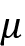

# 十二、TensorFlowProbability

不确定性是生活的现实；无论您是在执行分类任务还是回归任务，了解您的模型在预测中的可信度都是非常重要的。到目前为止，我们已经介绍了传统的深度学习模型，尽管它们在许多任务上都很棒，但它们无法处理不确定性。相反，它们在本质上是决定性的。在本章中，您将学习如何利用 TensorFlowProbability来构建可以处理不确定性的模型，特别是概率深度学习模型和贝叶斯网络。本章将包括:

*   TensorFlowProbability
*   TensorFlowProbability中的分布、事件和形状
*   使用TensorFlowProbability的贝叶斯网络
*   理解机器学习模型中的不确定性
*   用TensorFlowProbability模拟随机和认知的不确定性

本章的所有代码文件都可以在[https://packt.link/dltfchp12](https://packt.link/dltfchp12)找到

我们先从理解TensorFlowProbability开始。

# TensorFlowProbability

**TensorFlow Probability**(**TFP**)，tensor flow 生态系统的一部分，是一个提供开发概率模型工具的库。它可以用来进行概率推理和统计分析。它基于 TensorFlow 构建，并提供相同的计算优势。

*图 12.1* 显示了构成TensorFlowProbability的主要成分:


图 12.1:TensorFlowProbability的不同组成部分

在根上，我们有 TensorFlow 支持的所有数值运算，特别是`LinearOperator`类(是`tf.linalg`的一部分)——它包含了可以在矩阵上执行的所有方法，不需要实际物化矩阵。这提供了计算高效的无矩阵计算。TFP 包括大量的概率分布及其相关的统计计算。它还有`tfp.bijectors`，提供广泛的转换发行版。

双投影器封装了概率密度变量的变化。也就是说，当一个变量从空间 A 转换到空间 B 时，我们也需要一种方法来映射变量的概率分布。Bijectors 为我们提供了这样做所需的所有工具。

TensorFlow Probability 还提供了`JointDistribution`，允许用户绘制节理样本并计算节理对数密度(对数概率密度函数)。标准的 TFP 分布作用于张量，但是`JointDistribution`作用于张量的结构。`tfp.layers`提供神经网络层，可用于扩展标准 TensorFlow 层并增加不确定性。最后，它为概率推理提供了广泛的工具。在这一章中，我们将讨论这些函数和类；让我们首先从安装开始。要在您的工作环境中安装 TFP，只需运行:

```
pip install tensorflow-probability 
```

让我们来玩玩 TFP 吧。要使用 TFP，我们需要导入它。此外，我们将做一些情节。因此，我们导入了一些额外的模块:

```
import matplotlib.pyplot as plt

import tensorflow_probability as tfp

import functools, inspect, sys 
```

接下来，我们探索`tfp.distributions`中可用的不同类别的发行版:

```
tfd = tfp.distributions

distribution_class =  tfp.distributions.Distribution

distributions = [name for name, obj in inspect.getmembers(tfd)

                if inspect.isclass(obj) and issubclass(obj, distribution_class)]

print(distributions) 
```

以下是输出:

```
['Autoregressive', 'BatchBroadcast', 'BatchConcat', 'BatchReshape', 'Bates', 'Bernoulli', 'Beta', 'BetaBinomial', 'BetaQuotient', 'Binomial', 'Blockwise', 'Categorical', 'Cauchy', 'Chi', 'Chi2', 'CholeskyLKJ', 'ContinuousBernoulli', 'DeterminantalPointProcess', 'Deterministic', 'Dirichlet', 'DirichletMultinomial', 'Distribution', 'DoublesidedMaxwell', 'Empirical', 'ExpGamma', 'ExpInverseGamma', 'ExpRelaxedOneHotCategorical', 'Exponential', 'ExponentiallyModifiedGaussian', 'FiniteDiscrete', 'Gamma', 'GammaGamma', 'GaussianProcess', 'GaussianProcessRegressionModel', 'GeneralizedExtremeValue', 'GeneralizedNormal', 'GeneralizedPareto', 'Geometric', 'Gumbel', 'HalfCauchy', 'HalfNormal', 'HalfStudentT', 'HiddenMarkovModel', 'Horseshoe', 'Independent', 'InverseGamma', 'InverseGaussian', 'JohnsonSU', 'JointDistribution', 'JointDistributionCoroutine', 'JointDistributionCoroutineAutoBatched', 'JointDistributionNamed', 'JointDistributionNamedAutoBatched', 'JointDistributionSequential', 'JointDistributionSequentialAutoBatched', 'Kumaraswamy', 'LKJ', 'LambertWDistribution', 'LambertWNormal', 'Laplace', 'LinearGaussianStateSpaceModel', 'LogLogistic', 'LogNormal', 'Logistic', 'LogitNormal', 'MarkovChain', 'Masked', 'MatrixNormalLinearOperator', 'MatrixTLinearOperator', 'Mixture', 'MixtureSameFamily', 'Moyal', 'Multinomial', 'MultivariateNormalDiag', 'MultivariateNormalDiagPlusLowRank', 'MultivariateNormalDiagPlusLowRankCovariance', 'MultivariateNormalFullCovariance', 'MultivariateNormalLinearOperator', 'MultivariateNormalTriL', 'MultivariateStudentTLinearOperator', 'NegativeBinomial', 'Normal', 'NormalInverseGaussian', 'OneHotCategorical', 'OrderedLogistic', 'PERT', 'Pareto', 'PixelCNN', 'PlackettLuce', 'Poisson', 'PoissonLogNormalQuadratureCompound', 'PowerSpherical', 'ProbitBernoulli', 'QuantizedDistribution', 'RelaxedBernoulli', 'RelaxedOneHotCategorical', 'Sample', 'SigmoidBeta', 'SinhArcsinh', 'Skellam', 'SphericalUniform', 'StoppingRatioLogistic', 'StudentT', 'StudentTProcess', 'StudentTProcessRegressionModel', 'TransformedDistribution', 'Triangular', 'TruncatedCauchy', 'TruncatedNormal', 'Uniform', 'VariationalGaussianProcess', 'VectorDeterministic', 'VonMises', 'VonMisesFisher', 'Weibull', 'WishartLinearOperator', 'WishartTriL', 'Zipf'] 
```

你可以看到 TFP 中有丰富的发行版。现在让我们尝试一个发行版:

```
normal = tfd.Normal(loc=0., scale=1.) 
```

这个语句声明我们想要一个正态分布，其中**均值** ( `loc`)为 0，**标准差** ( `scale`)为 1。我们可以使用 sample 方法按照这个分布生成随机样本。下面的代码片段生成这样的`N`样本并绘制它们:

```
def plot_normal(N):

  samples = normal.sample(N)

  sns.distplot(samples)

  plt.title(f"Normal Distribution with zero mean, and 1 std. dev {N} samples")

  plt.show() 
```

你可以看到，随着 T0 的增加，曲线遵循一个很好的正态分布:

| **N=100** |  |
| **N=1000** |  |
| **N=10000** |  |

图 12.2:从 100、1，000 和 10，000 大小的随机样本中得到的正态分布。该分布的平均值为零，标准偏差为一

现在让我们探索 TFP 可用的不同发行版。

# TensorFlowProbability分布

TFP 中的每个分布都有一个与之相关的形状、批次和事件大小。形状是样本大小；它代表独立且相同分布的绘图或观察。考虑我们在上一节中定义的正态分布:

```
normal = tfd.Normal(loc=0., scale=1.) 
```

这定义了一个正态分布，平均值为 0，标准差为 1。当我们使用`sample`函数时，我们从这个分布中随机抽取。

如果打印对象`normal`，请注意关于`batch_shape`和`event_shape`的细节:

```
print(normal) 
```

```
>>> tfp.distributions.Normal("Normal", batch_shape=[], event_shape=[], dtype=float32) 
```

让我们尝试定义第二个`normal`对象，但是这次，`loc`和`scale`是列表:

```
normal_2 = tfd.Normal(loc=[0., 0.], scale=[1., 3.])

print(normal_2) 
```

```
>>> tfp.distributions.Normal("Normal", batch_shape=[2], event_shape=[], dtype=float32) 
```

你注意到`batch_shape`的变化了吗？现在，如果我们从中抽取一个样本，我们将从两个正态分布中抽取，一个均值为零，标准差为 1，另一个均值为零，标准差为 3。因此，批次形状决定了来自同一分布族的观察值数量。两个正态分布是独立的；因此，它是同一个家族的一批分配。

您可以拥有同一类型分布族的批，就像前面有两个正态分布的示例一样。比如说，你不能创建一批正态分布和高斯分布。

如果我们需要一个依赖于两个变量的正态分布，每个变量都有不同的均值，那该怎么办？使用`MultivariateNormalDiag`可以做到这一点，这影响了事件的形状——它是来自该分布的单个绘制或观察的原子形状:

```
normal_3 = tfd.MultivariateNormalDiag(loc = [[1.0, 0.3]])

print(normal_3) 
```

```
>>> tfp.distributions.MultivariateNormalDiag("MultivariateNormalDiag", batch_shape=[1], event_shape=[2], dtype=float32) 
```

我们可以看到，在上面的输出中,`event_shape`已经改变。

## 使用 TFP 分布

一旦你定义了一个发行版，你可以做更多的事情。TFP 提供了一系列功能来执行各种操作。我们已经使用了`Normal`分布和`sample`方法。上一节还展示了我们如何使用 TFP 来创建单变量、多变量或独立分布。TFP 提供了许多重要的方法来与创建的分布进行交互。其中一些重要的包括:

*   `sample(n)`:从分布中抽取`n`个观察值。
*   `prob(value)`:提供值的概率(离散)或概率密度(连续)。
*   `log_prob(values)`:提供数值的对数概率或对数似然。
*   它给出了分布的平均值。
*   `stddev()`:提供分布的标准差。

### 抛硬币示例

现在让我们通过一个例子来使用 TFP 的一些特性来描述数据:我们在学生时代就熟悉的标准的抛硬币例子。我们知道，如果我们抛硬币，只有两种可能——要么是正面，要么是反面。这样的分布，其中我们只有两个离散值，被称为**伯努利**分布。因此，让我们考虑不同的场景:

#### 场景 1

一枚公平的硬币，正面概率为`0.5`，反面概率为`0.5`。

让我们创建分布:

```
coin_flip = tfd.Bernoulli(probs=0.5, dtype=tf.int32) 
```

现在获取一些样本:

```
coin_flip_data = coin_flip.sample(2000) 
```

让我们来看看样品:

```
plt.hist(coin_flip_data) 
```


图 12.3:2000 次观察的头部和尾部分布

你可以看到我们头和尾的数量相等；毕竟，这是一枚公平的硬币。正面和反面的概率为`0.5`:

```
coin_flip.prob(0) ## Probability of tail 
```

```
>>> <tf.Tensor: shape=(), dtype=float32, numpy=0.5> 
```

#### 场景 2

正面概率为 0.8，反面概率为 0.2 的有偏硬币。

现在，由于硬币是有偏向的，正面的概率为`0.8`，因此分配将使用以下公式创建:

```
bias_coin_flip = tfd.Bernoulli(probs=0.8, dtype=tf.int32) 
```

现在获取一些样本:

```
bias_coin_flip_data = bias_coin_flip.sample(2000) 
```

让我们来看看样品:

```
plt.hist(bias_coin_flip_data) 
```


图 12.4:2000 次有偏向硬币的正面和反面的分布

我们可以看到，现在头的数量比尾多得多。因此，尾部的概率不再是`0.5`:

```
bias_coin_flip.prob(0) ## Probability of tail 
```

```
>>> <tf.Tensor: shape=(), dtype=float32, numpy=0.19999999> 
```

你很可能会得到一个接近`0.2`的数字。

#### 场景 3

两枚硬币，一枚偏向正面，概率为`0.8`，另一枚偏向正面，概率为`0.6`。

现在，我们有两个独立的硬币。由于硬币是有偏差的，正面的概率分别为`0.8`和`0.6`，我们使用以下公式创建一个分布:

```
two_bias_coins_flip = tfd.Bernoulli(probs=[0.8, 0.6], dtype=tf.int32) 
```

现在获取一些样本:

```
two_bias_coins_flip_data = two_bias_coins_flip.sample(2000) 
```

让我们想象一下样品:

```
plt.hist(two_bias_coins_flip_data[:,0], alpha=0.8, label='Coin 1')

plt.hist(two_bias_coins_flip_data[:,1], alpha=0.5, label='Coin 2')

plt.legend(loc='center') 
```


图 12.5:两枚独立硬币 2000 次翻转的正面和反面分布

蓝色条对应硬币 1，橙色条对应硬币 2。图中棕色部分是两个硬币结果重叠的区域。正如所料，您可以看到硬币 1 的头像数量比硬币 2 多得多。

### 正态分布

我们可以使用伯努利分布，其中数据只能有两个可能的离散值:正面和反面，好的和坏的，垃圾邮件和火腿，等等。然而，我们日常生活中的大量数据在范围上是连续的，正态分布非常常见。因此，让我们也探索不同的正态分布。

数学上，正态分布的概率密度函数可以表示为:


其中是分布的均值，是标准差。

在 TFP 中，参数`loc`代表平均值，参数`scale`代表标准差。现在，为了说明如何使用 distribution，让我们考虑一下，我们想要表示某个位置在某个特定季节的天气数据，比如印度德里的夏天。

#### 单变量常态

我们可以认为天气只取决于温度。因此，通过多年来夏季月份的温度样本，我们可以获得数据的良好表示。也就是说，我们可以有一个单变量正态分布。

现在，根据天气数据，德里 6 月份的平均高温为 35 摄氏度，标准差为 4 摄氏度。因此，我们可以使用以下公式创建正态分布:

```
temperature = tfd.Normal(loc=35, scale = 4) 
```

从中获取一些观察样本:

```
temperature_data = temperature.sample(1000) 
```

现在让我们想象一下:

```
sns.displot(temperature_data, kde= True) 
```


图 12.6:德里六月温度的概率密度函数

最好验证样本数据的平均值和标准偏差是否接近我们描述的值。

使用分布，我们可以使用以下公式找到平均值和标准偏差:

```
temperature.mean() 
```

```
# output

>>> <tf.Tensor: shape=(), dtype=float32, numpy=35.0> 
```

```
temperature.stddev() 
```

```
# output

>>> <tf.Tensor: shape=(), dtype=float32, numpy=4.0> 
```

根据采样数据，我们可以使用以下公式进行验证:

```
tf.math.reduce_mean(temperature_data) 
```

```
# output

>>> <tf.Tensor: shape=(), dtype=float32, numpy=35.00873> 
```

```
tf.math.reduce_std(temperature_data) 
```

```
# output

>>> <tf.Tensor: shape=(), dtype=float32, numpy=3.9290223> 
```

因此，采样数据遵循相同的均值和标准差。

#### 多元分布

到目前为止一切都很好。我向一位从事气象工作的朋友展示了我的分布，他说仅仅使用温度的是不够的；湿度也很重要。所以现在，每个天气点取决于两个参数——当天的温度和当天的湿度。这种类型的数据分布可以使用`MultivariateNormalDiag`分布类来获得，如 TFP:

```
weather = tfd.MultivariateNormalDiag(loc = [35, 56], scale_diag=[4, 15])

weather_data = weather.sample(1000)

plt.scatter(weather_data[:, 0], weather_data[:, 1], color='blue', alpha=0.4)

plt.xlabel("Temperature Degree Celsius")

plt.ylabel("Humidity %") 
```

*图 12.7* 显示了使用 TFP 生成的温度和湿度两个变量的多元正态分布:


图 12.7:多元正态分布，x 轴代表温度，y 轴代表湿度

使用 TFP 中可用的不同分布和双投影器，我们可以生成与真实数据遵循相同联合分布的合成数据来训练模型。

## 贝叶斯网络

**贝叶斯网络** ( **BNs** )利用来自图论、概率和统计的概念来封装复杂的因果关系。在这里，我们构建一个**有向无环图** ( **DAG** )，其中的节点称为因子(随机变量)，由代表因果关系的箭头连接。每个节点代表一个具有关联概率的变量(也称为**条件概率表** ( **CPT** ))。这些链接告诉我们一个节点对另一个节点的依赖性。虽然它们最初是由珀尔在 1988 年提出的，但近年来它们又重新引起了人们的注意。对 BNs 的这种著名兴趣的主要原因是标准的深度学习模型无法表示因果关系。

它们的优势在于，它们可以用于结合专家知识和数据对不确定性进行建模。它们因其进行概率和因果推理的能力而被应用于不同的领域。贝叶斯网络的核心是贝叶斯法则:


贝叶斯规则用于确定给定特定条件下事件的联合概率。理解 BN 最简单的方法是 BN 可以确定假设和证据之间的因果关系。有一些未知的假设 H，我们想要评估它的不确定性并做出一些决定。我们从关于假设 H 的一些先验信念开始，然后基于证据 E，我们更新关于 H 的信念。

让我们试着通过例子来理解它。我们考虑一个非常标准的例子:一个有草和洒水器的花园。现在，用常识，我们知道如果洒水器开着，草是湿的。现在让我们颠倒一下逻辑:如果你回到家发现草地是湿的，洒水器开着的概率是多少，实际上下雨的概率是多少？很有趣，对吧？让我们补充进一步的证据——你发现天空是多云的。现在，你认为草是湿的原因是什么？

这种基于证据的推理以 DAGs 的形式包含在 BNs 中，也称为因果图，因为它们提供了对因果关系的洞察。

为了对问题建模，我们使用了`JointDistributionCoroutine`分布类。这种分布允许从单个模型规格中进行数据采样和联合概率计算。让我们做一些假设来构建模型:

*   多云的概率是`0.2`
*   多云下雨的概率是`0.8`，不多云但下雨的概率是`0.1`
*   多云且喷头开启的概率为`0.1`，非多云且喷头开启的概率为`0.5`
*   现在，对于草，我们有四种可能性:

| **洒水器** | **下雨** | **草湿了** |
| F | F | Zero |
| F | T | Zero point eight |
| T | F | Zero point nine |
| T | T | Zero point nine nine |

表 12.1:洒水喷头-雨-草场景的条件概率表

*图 12.8* 显示了对应的 BN DAG:


图 12.8:玩具问题的贝叶斯网络

这些信息可以用以下模型来表示:

```
Root = tfd.JointDistributionCoroutine.Root

def model():

  # generate the distribution for cloudy weather

  cloudy = yield Root(tfd.Bernoulli(probs=0.2, dtype=tf.int32))

  # define sprinkler probability table

  sprinkler_prob = [0.5, 0.1]

  sprinkler_prob = tf.gather(sprinkler_prob, cloudy)

  sprinkler = yield tfd.Bernoulli(probs=sprinkler_prob, dtype=tf.int32)

  # define rain probability table

  raining_prob = [0.1, 0.8]

  raining_prob = tf.gather(raining_prob, cloudy)

  raining = yield tfd.Bernoulli(probs=raining_prob, dtype=tf.int32)

  #Conditional Probability table for wet grass

  grass_wet_prob = [[0.0, 0.8],

                    [0.9, 0.99]]

  grass_wet_prob = tf.gather_nd(grass_wet_prob, _stack(sprinkler, raining))

  grass_wet = yield tfd.Bernoulli(probs=grass_wet_prob, dtype=tf.int32) 
```

上面的模型将像数据生成器一样工作。`Root`函数用来告诉图中没有任何父节点的节点。我们定义了几个效用函数，`broadcast`和`stack`:

```
def _conform(ts):

  """Broadcast all arguments to a common shape."""

  shape = functools.reduce(

      tf.broadcast_static_shape, [a.shape for a in ts])

  return [tf.broadcast_to(a, shape) for a in ts]

def _stack(*ts):

  return tf.stack(_conform(ts), axis=-1) 
```

为了进行推论，我们使用了`MarginalizableJointDistributionCoroutine`类，因为这允许我们计算边缘化的概率:

```
d = marginalize.MarginalizableJointDistributionCoroutine(model) 
```

现在，根据我们的观察，我们可以获得其他因素的概率。

#### 案例 1:

我们观察到草是湿的(对应于此的观察值是 1——如果草是干的，我们会将其设置为 0)，我们对云的状态或洒水器的状态没有任何概念(对应于未知状态的观察值被设置为“边缘化”)，我们想要知道下雨的概率(对应于我们想要找到的概率的观察值被设置为“制表”)。将其转化为观察值:

```
observations = ['marginalize', # We don't know the cloudy state

                'tabulate', # We want to know the probability of rain

                'marginalize', # We don't know the sprinkler state.

                1]             # We observed a wet lawn. 
```

现在我们用以下公式得到下雨的概率:

```
p = tf.exp(d.marginalized_log_prob(observations))

p = p / tf.reduce_sum(p) 
```

结果是`array([0.27761015, 0.72238994], dtype=float32)`，即有 0.722 的概率下雨了。

#### 案例二:

我们观察到草地是湿的，我们不知道云或雨的状态，我们想知道洒水器是否打开的概率。将其转化为观察值:

```
observations = ['marginalize',  

                'marginalize', 

                'tabulate',  

                1] 
```

这导致了概率`array([0.61783344, 0.38216656], dtype=float32)`，也就是说，有一个`0.382`的概率，喷头是开着的。

#### 案例三:

如果我们观察到没有下雨，并且洒水器关闭了，会怎么样？你觉得草是什么状态？逻辑上讲，草不应该是湿的。让我们通过向模型发送观察结果来确认这一点:

```
observations = ['marginalize',  

                 0,

                 0, 

                'tabulate'] 
```

这导致了概率`array([1., 0], dtype=float32)`，也就是说，有 100%的概率草是干的，就像我们预期的那样。

如你所见，一旦我们知道了父节点的状态，我们就不需要知道父节点的父节点的状态，也就是说，BN 遵循局部马尔可夫性质。在我们在这里讨论的例子中，我们从结构开始，我们有可用的条件概率。我们展示了我们如何基于模型进行推断，以及尽管模型和 CPD 相同，证据如何改变**后验概率**。

在贝叶斯网络中，结构(节点和它们如何互连)和参数(每个节点的条件概率)是从数据中学习的。它们分别被称为结构化学习和参数学习。涵盖结构化学习和参数学习的算法超出了本章的范围。

## 用TensorFlowProbability处理预测中的不确定性

在本章的开头我们谈到了深度学习模型预测的不确定性，以及现有的深度学习架构如何无法解决这些不确定性。在这一章中，我们将使用 TFP 提供的层来模拟不确定性。

在添加 TFP 层之前，让我们先了解一下不确定性。有两类不确定性。

### 偶然不确定性

这是因为自然过程的随机性而存在的。它是固有的不确定性，由于概率可变性而存在。例如，在掷硬币时，预测下一次掷硬币是正面还是反面总会有一定程度的不确定性。没有办法消除这种不确定性。本质上，每次重复实验，结果都会有一定的变异。

### 认知不确定性

这种不确定性来自于知识的缺乏。这种知识的缺乏可能有各种原因，例如，对潜在过程的理解不足，对现象的知识不完整，等等。这种类型的不确定性可以通过理解原因来减少，例如，为了获得更多的数据，我们进行更多的实验。

这些不确定性的存在增加了风险。我们需要一种方法来量化这些不确定性，从而量化风险。

### 创建合成数据集

在本部分，我们将学习如何修改标准深度神经网络来量化不确定性。让我们从创建一个合成数据集开始。为了创建数据集，我们认为输出预测 y 线性依赖于输入 x，如下式所示:


这里，遵循正态分布，平均值为零，标准差为 1，围绕 x。下面的函数将为我们生成此合成数据。请注意，为了生成这些数据，我们使用了作为 TFP 分布一部分的`Uniform`分布和`Normal`分布:

```
def create_dataset(n, x_range):

    x_uniform_dist = tfd.Uniform(low=x_range[0], high=x_range[1])

    x = x_uniform_dist.sample(n).numpy() [:, np.newaxis] 

    y_true = 2.7*x+3

    eps_uniform_dist = tfd.Normal(loc=0, scale=1)

    eps = eps_uniform_dist.sample(n).numpy() [:, np.newaxis] *0.74*x

    y = y_true + eps

    return x, y, y_true 
```

`y_true`是不包括正态分布噪声的值。

现在，我们使用它来创建训练数据集和验证数据集:

```
x_train, y_train, y_true = create_dataset(2000, [-10, 10])

x_val, y_val, _ = create_dataset(500, [-10, 10]) 
```

这将给我们 2000 个数据点用于训练，500 个数据点用于验证。*图 12.9* 显示了两个数据集的图，背景中有地面实况(没有任何噪声时 *y* 的值):


图 12.9:合成数据集的绘图

### 使用 TensorFlow 构建回归模型

我们可以构建一个简单的 Keras 模型来执行在前面部分创建的合成数据集上的回归任务:

```
# Model Architecture

model = Sequential([Dense(1, input_shape=(1,))])

# Compile 

model.compile(loss='mse', optimizer='adam')

# Fit

model.fit(x_train, y_train, epochs=100, verbose=1) 
```

让我们看看拟合模型在测试数据集上的表现如何:


图 12.10:基本事实和拟合回归线

这是一个简单的问题，我们可以看到拟合的回归线几乎与实际情况重叠。但是，没有办法说出预测的不确定性。

### 随机不确定性的概率神经网络

如果我们不采用线性回归，而是建立一个可以拟合分布的模型，会怎么样？在我们的合成数据集中，随机不确定性的来源是噪音，我们知道我们的噪音遵循正态分布，其特征在于两个参数:平均值和标准差。因此，我们可以修改我们的模型来预测均值和标准差分布，而不是实际的 *y* 值。我们可以使用`IndependentNormal` TFP 层或`DistributionLambda` TFP 层来实现这一点。以下代码定义了修改后的模型架构:

```
model = Sequential([Dense(2, input_shape = (1,)),

    tfp.layers.DistributionLambda(lambda t: tfd.Normal(loc=t[..., :1], scale=0.3+tf.math.abs(t[...,1:])))

]) 
```

我们将需要再做一个改变。前面我们预测了 *y* 值；因此，均方误差损失是一个很好的选择。现在，我们预测分布；因此，更好的选择是负对数似然作为损失函数:

```
# Define negative loglikelihood loss function

def neg_loglik(y_true, y_pred):

    return -y_pred.log_prob(y_true) 
```

现在让我们来训练这个新模型:

```
model.compile(loss=neg_loglik, optimizer='adam')

# Fit

model.fit(x_train, y_train, epochs=500, verbose=1) 
```

由于现在我们的模型返回一个分布，我们需要测试数据集的统计平均值和标准偏差:

```
# Summary Statistics

y_mean = model(x_test).mean()

y_std = model(x_test).stddev() 
```

注意，预测的平均值现在对应于第一种情况下的拟合线。现在让我们来看看情节:

```
fig = plt.figure(figsize = (20, 10))

plt.scatter(x_train, y_train, marker='+', label='Training Data', alpha=0.5)

plt.plot(x_train, y_true, color='k', label='Ground Truth')

plt.plot(x_test, y_mean, color='r', label='Predicted Mean')

plt.fill_between(np.squeeze(x_test), np.squeeze(y_mean+1*y_std), np.squeeze(y_mean-1*y_std),  alpha=0.6, label='Aleatory Uncertainty (1SD)')

plt.fill_between(np.squeeze(x_test), np.squeeze(y_mean+2*y_std), np.squeeze(y_mean-2*y_std),  alpha=0.4, label='Aleatory Uncertainty (2SD)')

plt.title('Aleatory Uncertainty')

plt.xlabel('$x$')

plt.ylabel('$y$')

plt.legend()

plt.show() 
```

下面的曲线显示了拟合线，以及随机不确定性:


图 12.11:使用 TFP 层模拟随机不确定性

你可以看到我们的模型在原点附近显示出较少的不确定性，但是随着我们远离，不确定性增加。

### 认知不确定性的解释

在传统的神经网络中，每个权重由单个数字表示，并且更新,使得模型相对于其权重的损失最小化。我们假设如此学习的权重是最佳权重。但是他们是吗？为了回答这个问题，我们将每个权重替换为一个分布，而不是学习单个值，我们现在将使我们的模型学习每个权重分布的一组参数。这是通过用`DenseVariational`层替换 Keras `Dense`层来实现的。`DenseVariational`层使用权重的变分后验概率来表示其值的不确定性。它试图调整后验概率以接近先验分布。因此，为了使用`DenseVariational`层，我们需要定义两个函数，一个先验生成函数和另一个后验生成函数。我们使用在[https://www . tensor flow . org/probability/examples/probability _ Layers _ Regression](https://www.tensorflow.org/probability/examples/Probabilistic_Layers_Regression)中定义的后验和先验函数。

我们的模型现在有两层，一个`DenseVariational`层后面跟着一个`DistributionLambda`层:

```
model = Sequential([

  tfp.layers.DenseVariational(1, posterior_mean_field, prior_trainable, kl_weight=1/x_train.shape[0]),

  tfp.layers.DistributionLambda(lambda t: tfd.Normal(loc=t, scale=1)),

]) 
```

同样，当我们寻找分布时，我们使用的损失函数是负对数似然函数:

```
model.compile(optimizer=tf.optimizers.Adam(learning_rate=0.01), loss=negloglik) 
```

我们继续使用之前创建的相同合成数据来训练模型:

```
model.fit(x_train, y_train, epochs=100, verbose=1) 
```

现在模型已经定型，我们进行预测，为了理解不确定性的概念，我们对相同的输入范围进行多次预测。我们可以在下图中看到结果的方差差异:

|  |  |

图 12.12:认知的不确定性

*图 12.12* 显示了两个图表，一个是仅使用 200 个数据点建立模型时的图表，另一个是使用 2000 个数据点训练模型时的图表。我们可以看到,当有更多的数据，方差，因此，认知的不确定性减少。这里，*总体平均值*是指所有预测的平均值(100 个)，在*集合平均值*的情况下，我们只考虑了前 15 个预测。所有机器学习模型在预测结果时都存在一定程度的不确定性。获得预测中不确定性的估计或可量化范围将有助于人工智能用户在他们的人工智能预测中建立更多信心，并将推动整体人工智能的采用。

# 摘要

本章介绍了 TensorFlow Probability，这是一个基于 TensorFlow 构建的库，用于执行概率推理和统计分析。这一章从概率推理的需要开始——由于数据的固有性质和知识的缺乏而产生的不确定性。我们演示了如何使用TensorFlowProbability分布来生成不同的数据分布。我们学习了如何建立贝叶斯网络和进行推理。然后，我们建立贝叶斯神经网络使用 TFP 层来考虑偶然的不确定性。最后，我们学习了如何在`DenseVariational` TFP 层的帮助下解释认知的不确定性。

在下一章，我们将学习 TensorFlow AutoML 框架。

# 参考

1.  Dillon，J. V .，Langmore，I .，Tran，d .，Brevdo，e .，Vasudevan，s .，Moore，d .，Patton，b .，Alemi，a .，Hoffman，m .，Saurous，R. A. (2017)。*TensorFlow分布*。arXiv 预印本 arXiv:1711.10604。
2.  皮波尼博士、摩尔博士和 J. V .狄龙(2020)。TensorFlowProbability的联合分布。预印本 arXiv:2001.11819。
3.  福克斯和乌尔库门(2011 年)。*区分不确定性的两个维度*，载于 Brun，w .，kirkeben，g .和 Montgomery，h .编辑的《判断和决策论文集》。奥斯陆大学。
4.  Hüllermeier，e .和 Waegeman，W. (2021)。机器学习中的任意和认知不确定性:概念和方法介绍。机器学习 110，第 3 期:457–506。

# 加入我们书的不和谐空间

加入我们的 Discord 社区，结识志同道合的朋友，与 2000 多名会员一起学习:[https://packt.link/keras](https://packt.link/keras)

