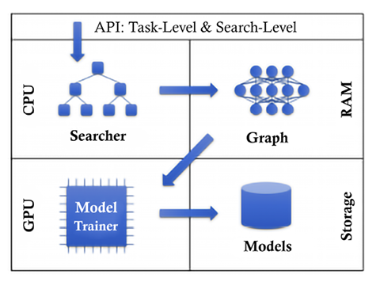
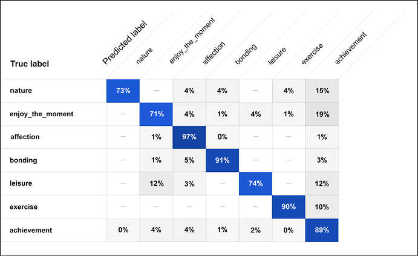

# 十三、AutoML 简介

AutoML 的目标是使不熟悉机器学习技术的领域专家能够容易地使用 ML 技术。

在本章中，我们将使用谷歌云平台进行一次实践练习，并在简要讨论基础知识后做一些实际操作。

我们将涵盖:

*   自动数据准备
*   自动特征工程
*   自动模型生成
*   汽车经销商
*   Google Cloud AutoML 及其针对表格、视觉、文本、翻译和视频处理的多种解决方案

让我们从介绍 AutoML 开始。

# 什么是 AutoML？

在前几章中，我们介绍了现代机器学习和深度学习中使用的几种模型。例如，我们已经看到了密集网络、CNN、rnn、自编码器和 GANs 等架构。

有两点值得注意。首先，这些架构是由深度学习专家手工设计的，不一定容易向非专家解释。第二，这些架构的组合本身是一个手工过程，涉及到大量的人类直觉和反复试验。

今天，人工智能研究的一个主要目标是实现**人工通用智能**(**AGI**)—机器的智能，它可以理解并自动学习人类可以做的任何类型的工作或活动。应该指出的是，许多研究人员并不认为 AGI 是可以实现的，因为智力不仅只有一种形式，而是有多种形式。

我个人倾向于同意这个观点。Yann LeCun 在这个问题上的立场见[https://twitter.com/ylecun/status/1526672565233758213](https://twitter.com/ylecun/status/1526672565233758213)。然而，在 AutoML 研究和工业应用开始之前，现实是非常不同的。事实上，在 AutoML 之前，设计深度学习架构非常类似于手工制作——手工制作装饰性物品的活动或爱好。

举个例子，从 x 光片中识别乳腺癌的任务。在阅读了前面的章节后，你可能会认为通过组合几个 CNN 创建的深度学习管道可能是实现这一目的的合适工具。这可能是一个很好的直觉。问题是，向你的模型的用户解释为什么 CNN 的一个特定的组成在乳腺癌检测领域工作良好并不容易。理想情况下，您希望向领域专家(在这种情况下，医疗专业人员)提供易于访问的深度学习工具，而不需要这样的工具需要强大的机器学习背景。

另一个问题是，不容易理解原始手工制作的模型是否存在可以实现更好结果的变体(例如，不同的组成)。理想情况下，你希望提供深度学习工具，以更有原则和自动化的方式探索变体的空间(例如，不同的构成)。

因此，AutoML 的中心思想是通过使整个端到端的机器学习管道更加自动化，来减少陡峭的学习曲线和手工制作机器学习解决方案的巨大成本。为此，我们假设 AutoML 管道由三个宏步骤组成:数据准备、特征工程和自动模型生成，如图*图 13.1* 所示:


图 13.1:AutoML 管道的三个步骤

在本章的开始部分，我们将详细讨论这三个步骤。然后，我们将重点讨论 Google Cloud AutoML。

# 实现自动化

AutoML 如何实现端到端自动化的目标？嗯，你可能已经猜到一个自然的选择是使用机器学习——这非常酷。AutoML 使用 ML 来自动化 ML 管道。

有什么好处？端到端地自动创建和调整机器学习提供了更简单的解决方案，减少了生产它们的时间，并最终可能产生可能优于手工制作的模型的架构。

这是一个封闭的研究区域吗？恰恰相反。2022 年初，AutoML 是一个非常开放的研究领域，这并不奇怪，因为最初吸引人们关注 AutoML 的论文是在 2016 年底发表的。

# 自动数据准备

典型机器学习流水线的第一阶段处理数据准备(回想一下*图 13.1* 中的流水线)。应该考虑两个主要方面:数据清理和数据合成:

**数据清理**是通过检查错误的数据类型、缺失值和错误，以及应用数据标准化、分桶、缩放和编码来提高数据的质量。一个健壮的 AutoML 管道应该尽可能自动化所有这些平凡但极其重要的步骤。

**数据合成**是通过增强生成合成数据，用于训练、评估和验证。通常，这一步是特定于领域的。例如，我们已经看到了如何通过使用裁剪、旋转、调整大小和翻转操作来生成合成的类似 CIFAR10 的图像(*第 4 章*)。人们还可以考虑通过 GANs 生成额外的图像或视频(参见*第 9 章*)并使用增强的合成数据集进行训练。对于文本应该采取不同的方法，可以训练 rnn(*第 5 章*)来生成合成文本，或者采用更多的 NLP 技术，如 BERT、Seq2Seq 或 Transformers(参见*第 6 章*)来跨语言注释或翻译文本，然后将其翻译回原始文本，这是另一种特定领域的增强形式。

一种不同的方法是生成机器学习可以发生的合成环境。这在强化学习和游戏中变得非常流行，特别是像 OpenAI Gym 这样的工具包，它旨在提供一个易于设置的模拟环境，具有各种不同的(游戏)场景。

简而言之，我们可以说合成数据生成是 AutoML 引擎应该提供的另一个选项。通常，所使用的工具是非常特定于领域的，适用于图像或视频的工具不一定适用于文本等其他领域。因此，我们需要一个(相当)大的工具集来执行跨领域的合成数据生成。

# 自动特征工程

特征工程是典型机器学习流水线的第步(见*图 13.1* )。它包括三个主要步骤:特征选择、特征构建和特征映射。让我们依次来看看它们:

**特征选择**旨在通过丢弃那些对学习任务贡献不大的特征来选择*有意义的*特征的子集。在这种情况下，“有意义”实际上取决于具体问题的应用和领域。

**特性构建**的目标是从基本特性开始构建新的衍生特性。通常，这种技术被用于更好的概括和更丰富的数据表示。

**特征映射**旨在通过映射函数改变原始特征空间。这可以通过多种方式实现；例如，它可以使用自编码器(见*第 8 章*)、PCA(见*第 7 章*)或集群(见*第 7 章*)。

简而言之，特性工程是一门基于直觉、反复试验和大量人类经验的艺术。现代汽车引擎旨在使整个过程更加自动化，需要更少的人工干预。

# 自动模型生成

模型生成和超参数调整是机器学习流水线中典型的第三个宏步骤(见*图 13.1* )。

**模型生成**包括创建一个适合解决特定任务的模型。例如，您可能会使用 CNN 进行视觉识别，而您将使用 RNNs 进行时间序列分析或序列分析。当然，许多变体都是可能的，每一种都是通过反复试验的过程手工制作的，适用于非常特定的领域。

**超参数调整**发生在模型被手工制作之后。该过程通常计算量非常大，并且可以以积极的方式显著改变结果的质量。这是因为调整超参数有助于进一步优化我们的模型。

自动模型生成是任何 AutoML 流水线的最终目标。如何实现这一点？一种方法是通过组合一组原始操作来生成模型，这些操作包括卷积、池化、串联、跳过连接、循环神经网络、自编码器以及我们在本书中遇到的几乎所有深度学习模型。这些操作构成了要探索的(通常非常大的)搜索空间，目标是尽可能高效地进行这种探索。在 AutoML 行话中，这种探索被称为 **NAS** ，或**神经架构搜索**。关于 AutoML 的开创性论文[1]产生于 2016 年 11 月。关键思想(见*图 13.2* )是使用强化学习(RL，见*第 11 章*)。RNN 充当控制器，它生成候选神经网络的模型描述。RL 用于最大化验证集上生成的架构的预期准确性。

在 CIFAR-10 数据集上，这种方法从零开始，设计了一种新的网络架构，在测试集准确性方面可以与人类发明的最佳架构相媲美。CIFAR-10 模型的测试错误率为 3.65，比之前使用类似架构方案的最先进模型高 0.09%，速度快 1.05 倍。在 Penn Treebank 数据集上，该模型可以组成一个新的递归细胞，其性能优于广泛使用的 LSTM 细胞(见*第 9 章*)和其他最先进的基线。该单元在 Penn Treebank 上实现了 62.4 的测试集复杂度，比之前的最先进模型好 3.6。

论文的关键成果如图*图 13.2* 所示。基于 RNNs 的控制器网络产生概率为 p 的样本架构 A。该候选架构 A 由子网络训练，以获得候选精度 R。然后，计算 p 的梯度，并通过 R 进行缩放，以更新控制器。这种强化学习操作在一个循环中被计算多次。如果层数超过某个值，则生成架构的过程会停止。

控制器 RNN 如何使用基于 RL 的策略梯度方法来生成更好的架构的细节在[1]中。在此，我们强调 NAS 使用基于 Q-learning 的元建模算法，采用ϵ-greedy 探索策略和经验回放(参见*第 11 章*)来探索模型搜索空间:


图 13.2:带有循环神经网络的 NAS

自 2016 年末的原始论文以来，已经观察到模型生成技术的寒武纪大爆发。最初，目标是一步生成整个模型。后来，提出了一种基于*单元的*方法，其中生成分为两个宏步骤:首先，自动构建单元结构，然后将预定义数量的发现单元堆叠在一起，以生成完整的端到端架构[2]。这种**高效的神经架构搜索** ( **ENAS** )与所有现有的自动模型设计方法相比，使用明显更少的 GPU 小时提供了强大的经验性能，值得注意的是，计算成本比标准神经架构搜索(2018 年)低 1000 倍。这里，ENAS 的主要目标是通过层次结构减少搜索空间。已经提出了基于单元的方法的变体，包括纯分层方法，其中通过迭代地合并较低级别的单元来生成较高级别的单元。

NAS 的一个完全不同的方法是使用转移学习(见*第 5 章*)将现有神经网络的学习转移到一个新的神经网络中，以便加速设计【3】。换句话说，我们想在 AutoML 中使用迁移学习。

另一种方法是基于**遗传编程** ( **GP** )和**进化算法** ( **EAs** )的，其中构成模型搜索空间的基本操作被编码成合适的表示，然后这种编码以类似于生物遗传进化的方式逐渐变异成逐渐更好的模型【4】。

**超参数调整**包括寻找与学习优化(批量大小、学习速率等)和特定模型(内核大小；CNN 的特征图数量等；或密集或自编码器网络的神经元数量等)。同样，搜索空间可能非常大。通常使用三种方法:贝叶斯优化、网格搜索和随机搜索。

**贝叶斯优化**建立目标函数的概率模型，并使用它来选择最有希望的超参数，以在真实目标函数中进行评估。

**网格搜索**将搜索空间划分为一个数值离散网格，并测试网格中所有可能的组合。例如，如果有三个超参数，并且每个超参数只有两个候选值，则必须检查总共 2×3 = 6 个组合。网格搜索也有层次化的变体，它为搜索空间的区域逐步细化网格，并提供更好的结果。关键思想是首先使用粗网格，在找到更好的网格区域后，在该区域上实现更细的网格搜索。

**随机搜索**对参数搜索空间进行随机采样，这种简单的方法已经被证明在许多情况下非常有效【5】。

既然我们已经简要讨论了基础知识，我们将在 Google Cloud 上做一些实践工作。我们开始吧。

# 汽车经销商

AutoKeras [6]提供函数给自动搜索深度学习模型的架构和超参数。该框架使用贝叶斯优化进行有效的神经架构搜索。您可以使用`pip`安装 alpha 版本:

```py
pip3 install autokeras # for 1.19 version 
```

该架构在*图 13.3* [6]中进行了说明:



图 13.3: AutoKeras 系统概述

该架构遵循以下步骤:

1.  用户调用 API。
2.  搜索器在 CPU 上生成神经架构。
3.  具有参数的真实神经网络建立在来自神经架构的 RAM 上。
4.  神经网络复制到 GPU 进行训练。
5.  训练好的神经网络保存在存储设备上。
6.  基于训练结果更新搜索器。

重复步骤 2 到 6，直到达到时间限制。

# Google Cloud AutoML 和 Vertex AI

Google Cloud AutoML([https://cloud.google.com/automl/](https://cloud.google.com/automl/))是一整套用于图像、视频和文本处理的产品。AutoML 可以用来训练高质量的定制机器学习模型，只需最少的努力和机器学习专业知识。

Vertex AI 将用于构建 ML 的谷歌云服务汇集在一个统一的 UI 和 API 下。在 Vertex AI 中，您现在可以轻松地训练、比较、测试和部署模型。然后你可以用复杂的方法来服务一个模型来监控和运行实验(见[https://cloud.google.com/vertex-ai](https://cloud.google.com/vertex-ai))。

截至 2022 年，该套件由以下组件组成，这些组件不需要您知道深度学习网络是如何在内部形成的:

**顶点 AI**

*   统一的平台，帮助您构建、部署和扩展更多人工智能模型

**结构化数据**

*   AutoML 表:在结构化数据上自动构建和部署最先进的机器学习模型

**视线**

*   AutoML Image:从云中或边缘的对象检测和图像分类中获得洞察力
*   AutoML 视频:实现强大的内容发现和引人入胜的视频体验

**语言**

*   自动文本:通过机器学习揭示文本的结构和意义
*   自动翻译:动态检测和翻译不同的语言

在本章的剩余部分，我们将回顾三个 AutoML 解决方案:AutoML 表格、AutoML 文本和 AutoML 视频。

## 使用 Google Cloud AutoML 表格解决方案

让我们看一个使用 Google Cloud AutoML 表的例子。我们的目标是导入一些表格数据，并根据这些数据训练一个分类器；我们将使用来自银行的一些营销数据。请注意，谷歌可能会根据不同的使用标准对本示例和以下示例进行收费(请在线查看最新的成本估算-参见[https://cloud.google.com/products/calculator/](https://cloud.google.com/products/calculator/))。

所需的第一步是启用 Vertex AI API:


图 13.4:启用顶点 AI API

然后我们可以从控制台选择**表格**数据集(参见*图 13.5* )。数据集的名称是`bank-marketing.csv`:


图 13.5:选择表格数据集

在下一个屏幕上，我们指示我们要从 CSV 加载数据:


图 13.6: AutoML 表格–从 CSV 文件加载数据

接下来，我们可以训练一个新的模型，如图*图 13.7* :


图 13.7:训练一个新模型

为**分类**和**回归**提供了几种训练选项:


图 13.8:为分类和回归提供的选项

让我们选择目标作为**存款**列。数据集在 https://archive.ics.uci.edu/ml/datasets/bank+marketing 的[进行描述。该数据与一家葡萄牙银行机构的直接营销活动(电话)相关。分类的目标是](https://archive.ics.uci.edu/ml/datasets/bank+marketing)预测客户是否会订阅定期存款。

由于所选列是分类数据，AutoML 表将构建一个分类模型。这将从所选列中的类预测目标。分类是二进制的: *1* 表示负结果，意味着没有在银行存款； *2* 代表一个积极的结果，意味着在银行存款，如图*图 13.9* 所示:


图 13.9:训练一个目标列设置为存款的新模型

然后我们可以检查数据集(参见*图 13.10* ，这使我们有机会检查具有几个特征的数据集，例如*名称*、*类型*、*缺失值*、*相异值*、*无效值、与目标值的相关性*、*均值*和*标准差*:


图 13.10: AutoML 表格——检查数据集

现在是使用**训练**选项卡训练模型的时候了。首先我们来给培训做个预算，如图*图 13.11* 所示:


图 13.11:设置培训预算

在本例中，我们接受 **3** 小时作为培训预算。在此期间，你可以去喝咖啡，而 AutoML 代表你工作(见*图 13.12* )。训练预算是一个介于 1 和 72 之间的数字，表示用于训练模型的最大节点小时数。如果您的模型在此之前停止改进，AutoML 表将停止训练，您只需支付与实际使用的节点预算相对应的费用:


图 13.12: AutoML 表格训练过程

训练时，我们可以检查进度，如图*图 13.13* 所示:


图 13.13:检查培训进度

不到一个小时后，Google AutoML 应该会向我们的收件箱发送一封电子邮件:


图 13.14: AutoML 表格:培训结束，一封电子邮件发送到我的帐户

点击建议的网址，有可能看到我们的培训结果。AutoML 生成的模型达到了 94%的准确率(参见*图 13.15* )。请记住，准确性是由模型产生的分类预测在测试中是正确的部分，它是自动保持的。还提供了对数损失(例如，模型预测和标签值之间的交叉熵)。在对数损失的情况下，较低的值表示模型质量较高:


图 13.15: AutoML 表格——分析我们的培训结果

此外，还显示了受试者工作特性曲线 ( **AUC ROC** )下的**区域。范围从 0 到 1，并且更高的值表示更高质量的模型。该统计总结了 AUC ROC 曲线，该曲线是显示分类模型在所有分类阈值下的性能的图表。**真阳性率** ( **TPR** )(也称“召回”)为:**


其中 *TP* 是真阳性的数量，而 *FN* 是假阴性的数量。**假阳性率** ( **FPR** )为:


其中 *FP* 是假阳性的数量，而 *TN* 是真阴性的数量。

ROC 曲线描绘了不同分类阈值下 TPR 与 FPR 的关系。在*图 13.16* 中，您将看到 ROC 曲线一个阈值的 ( **AUC** )曲线下的**区域:**


图 13.16: AutoML 表格——对我们培训结果的深入分析

可以深入评估并访问混淆矩阵(见*图 13.17* ):


图 13.17: AutoML 表格——对我们培训结果的进一步深入分析

请注意，在[https://www.kaggle.com/uciml/adult-census-income/kernels](https://www.kaggle.com/uciml/adult-census-income/kernels)可用的手工制作的模型达到了 86-90%的精确度。因此，我们用 AutoML 生成的模型肯定是一个非常好的结果！

我们也可以单独看一下每个特性的重要性，如图*图 13.18* 所示:


图 13.18:孤立考虑的每个特征的特定重要性

如果我们对结果满意，我们可以通过**部署&测试**在生产中部署模型(参见*图 13.19* )。我们可以决定创建一个可部署在边缘的 Docker 容器，或者我们可以简单地使用一个端点。让我们选择这个选项，并对每个可用选项使用默认设置:


图 13.19: AutoML 表格——在生产中部署

然后可以通过使用 REST API(参见[https://en . Wikipedia . org/wiki/representative _ state _ transfer](https://en.wikipedia.org/wiki/Representational_state_transfer))对收入进行在线预测，对于我们在本章中查看的示例，使用此命令，如图*图 13.20* 所示:


图 13.20: AutoML 表格——在生产中查询已部署的模型

简而言之，我们可以说Google Cloud ML 非常注重 AutoML 的易用性和效率。让我们总结一下所需的主要步骤(参见*图 13.21* ):

1.  数据集被导入。
2.  您的数据集架构和标签已定义。
3.  输入特征被自动识别。
4.  AutoML 通过自动进行特征工程、创建模型和调整超参数来施展魔法。
5.  然后可以评估自动构建的模型。
6.  然后将模型部署到生产中。

当然，可以通过改变模式和标签的定义来重复步骤 2-6。


图 13.21: AutoML 表格——所需的主要步骤

在本节中，我们已经看到了一个关注易用性和效率的 AutoML 示例。Faes 等人[7]引用了该论文，说明了所取得的进展:

> “据我们所知，我们首次展示了由非人工智能专家(即医生)为医疗保健应用自动设计和实现深度学习模型。虽然在二元和多元分类任务的内部验证中获得了与专家调整的医学图像分类算法相当的性能，但更复杂的挑战，如多标记分类，以及这些模型的外部验证是不够的。我们相信，人工智能可能会通过提高分诊效率来促进医疗保健，并通过量身定制的预测模型来实现医疗个性化。预测模型设计的自动化方法改善了这项技术的使用，从而促进了医疗界的参与，并提供了一种媒介，临床医生可以通过这种媒介增强对人工智能集成的优势和潜在缺陷的理解。”

在这种情况下，使用了云 AutoML 表。让我们看另一个例子。

## 使用谷歌云 AutoML 文本解决方案

在本节中，我们将使用 AutoML 构建一个分类器。让我们从 Vertex AI 控制台创建一个文本数据集。我们希望专注于单标签分类的任务:


图 13.22:自动文本分类——创建数据集

我们将使用网上已经有的数据集(幸福时刻数据集存储在`cloud-ml-data/NL-classification/happiness.csv`中)，将其加载到名为**幸福**的数据集中，进行单标签分类(如图*图 13.23* )。这可能需要几分钟或更长时间。

处理完成后，我们将收到电子邮件:


图 13.23:自动文本分类——创建数据集

一旦数据集被加载，你应该能够看到每个文本片段都被标注了七个类别中的一个，如图*图 13.24* 所示:


图 13.24: AutoML 文本分类–类别示例

现在是开始训练模型的时候了:


图 13.25:自动文本分类-开始训练

最后，建立了模型，取得了 90.2%的准确率和 86.7%的召回率；


图 13.26: AutoML 文本分类-精确度和召回率

我们也可以看看精确召回曲线和精确召回阈值(见*图 13.27* )。这些曲线可用于校准分类器，在阈值上校准(基于大于阈值的预测概率):


图 13.27:精确召回和阈值精确召回

混淆矩阵如图*图 13.28* 所示:



图 13.28:文本分类问题的混淆矩阵

## 使用谷歌云 AutoML 视频解决方案

在这个解决方案中，我们将自动建立一个新的视频分类模型。目的是能够根据内容将不同的视频片段分成不同的类别。第一步是创建数据集，如图*图 13.29* 所示:


图 13.29: AutoML 视频智能——一个分类问题

我们将使用大约 5000 个视频的集合，这些视频已经存储在`automl-video-demo-data/hmdb_split1_5classes_all.csv`的 GCP 存储桶中，如图*图 13.30* 所示:


图 13.30。导入演示数据集

像往常一样，导入需要一段时间，完成后我们会收到电子邮件通知。视频导入后，我们可以使用相关类别预览它们:


图 13.31: AutoML 视频智能-导入的视频预览

我们现在可以开始构建一个模型。有许多选项，包括使用 AutoML 进行训练、在边缘使用 AutoML 导出边缘的模型，以及基于 TensorFlow 构建的自定义模型。让我们使用默认的，如图*图 13.32* 所示:


图 13.32: AutoML 视频智能-获取更多视频的警告

在这种情况下，我们决定使用几个标签运行实验训练，并将数据集分为 20%训练和 80%测试:


图 13.33:测试和训练数据集分割

一旦模型被训练，你可以从控制台访问结果(*图 13.34* )。在这种情况下，我们实现了 99.5%的准确率和 99.5%的召回率，尽管我们在实验中只使用了 20%的标签进行训练。我们希望训练时间短，但仍能取得令人敬畏的结果。例如，您可以使用该模型，增加可用的带标签视频的数量，以查看性能将如何变化:


图 13.34: AutoML 视频智能-评估结果

让我们详细看看结果。例如，我们可以分析不同阈值水平的精度/召回图:


图 13.35: AutoML 视频智能—精确度和召回率

混淆矩阵显示了错误的镜头分类示例:


图 13.36: AutoML 视频智能-混淆矩阵

## 费用

根据所采用的汽车类型，GCP 的培训费用不同；例如，在 2022 年，培训本章介绍的所有解决方案并为测试模型提供服务的成本不到 10 美元。然而，这还不包括该帐户最初六个小时的免费折扣(在撰写本文时大约有 150 美元)。根据您的组织需求，这可能会大大低于购买昂贵的内部硬件的成本。

# 摘要

AutoML 的目标是使不熟悉机器学习技术的领域专家能够容易地使用 ML 技术。主要目标是通过使整个端到端机器学习管道(数据准备、特征工程和自动模型生成)更加自动化，来减少陡峭的学习曲线和手工制作机器学习解决方案的巨大成本。

在审查了 2022 年底可用的最先进的解决方案后，我们讨论了如何将 Google Cloud AutoML 用于文本、视频和图像，实现与手工模型相当的结果。AutoML 可能是发展最快的研究主题，感兴趣的读者可以在 https://www.automl.org/找到最新的结果。

下一章讨论深度学习背后的数学，这是一个相当高级的主题，如果你有兴趣了解当你玩神经网络时“在引擎盖下”发生了什么，建议你这样做。

# 参考

1.  Zoph，b .，Le，Q. V. (2016)。*具有强化学习的神经架构搜索。http://arxiv.org/abs/1611.01578*T2
2.  Pham，h，Guan，M. Y，Zoph，b .，Le，Q. V .，Dean，J. (2018)。*通过参数共享进行有效的神经架构搜索*。https://arxiv.org/abs/1802.03268
3.  Borsos，z .，Khorlin，a .，Gesmundo，A. (2019)。*转移 NAS:使用 Transformer 代理在搜索空间之间转移知识*。https://arxiv.org/abs/1906.08102
4.  Lu，z .，Whalen，I .，Boddeti V .，Dhebar，y .，Deb，k .，Goodman，e .，Banzhaf，W. (2018)。 *NSGA 网:使用多目标遗传算法的神经结构搜索*。https://arxiv.org/abs/1810.03522
5.  伯格斯特拉，j .，本吉奥，Y. (2012 年)。*随机搜索超参数优化*。http://www.jmlr.org/papers/v13/bergstra12a.xhtml
6.  金，h，宋，q，胡，x(2019)。 *Auto-Keras:高效的神经架构搜索系统*。https://arxiv.org/abs/1806.10282
7.  费斯等人(2019 年)。*由没有编码经验的医疗保健专业人员进行医学图像分类的自动化深度学习设计:一项可行性研究*。《柳叶刀数字健康》第 1 卷第 5 期，2019 年 9 月。第 e232-e242 页。[https://www . science direct . com/science/article/pii/s 2589750019301086](https://www.sciencedirect.com/science/article/pii/S2589750019301086%20)

# 加入我们书的不和谐空间

加入我们的 Discord 社区，结识志同道合的朋友，与 2000 多名会员一起学习:[https://packt.link/keras](https://packt.link/keras)

