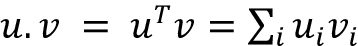
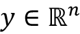
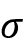
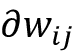
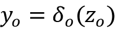
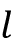
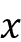
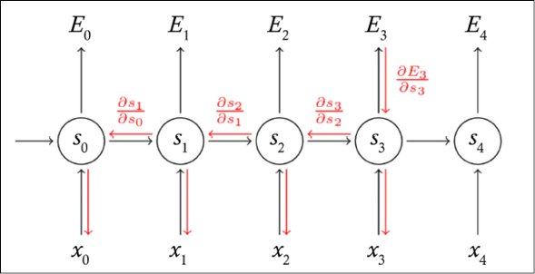

# Fourteen

# 深度学习背后的数学

在这一章中，我们讨论深度学习背后的数学。这个题目挺高级的，对从业者不一定有要求。然而，如果你有兴趣了解当你玩神经网络时在引擎盖下发生的事情，推荐阅读。

以下是您将学到的内容:

*   历史简介
*   导数和梯度的概念
*   通常用于优化深度学习网络的梯度下降和反向传播算法

我们开始吧！

# 历史

连续反向传播的基础是由 Henry J. Kelley [1]在 1960 年使用动态规划提出的。Stuart Dreyfus 在 1962 年提出使用链式法则[2]。Paul Werbos 在他 1974 年的博士论文中首次将反向传播(简称 backprop)用于神经网络[3]。然而，直到 1986 年，随着大卫·e·鲁梅尔哈特、杰弗里·e·辛顿和罗纳德·j·威廉姆斯的工作发表在《自然》杂志上，反向传播才获得成功[4]。1987 年，Yann LeCun 描述了目前用于训练神经网络的 backprop 的现代版本[5]。

**随机梯度下降** ( **SGD** )的基本直觉是 Robbins 和 Monro 于 1951 年在不同于神经网络的上下文中提出的[6]。在 2012 年，也就是 backprop 首次推出 52 年后，AlexNet [7]在 ImageNet 2012 挑战赛中使用 GPU 取得了 15.3%的前五名误差。根据《经济学人》[8]，*的说法，人们突然开始关注，不仅仅是在人工智能社区，而是在整个技术行业。这个领域的创新不是一夜之间发生的。相反，这是一次长达 50 多年的长途跋涉！*

# 一些数学工具

在介绍反向传播之前，我们需要回顾一下微积分中的一些数学工具。不用太担心；我们将简要回顾几个领域，所有这些都是高中水平数学中常见的内容。

## 向量

我们将回顾对机器学习非常有用的两个基本的几何和代数概念:向量和角度余弦。我们从解释矢量开始。从根本上说，向量是一系列数字。给定一个矢量，我们可以把它解释为空间中的一个方向。数学家通常将向量写成列向量 *x* 或行向量*x*T。给定两个列向量 *u* 和 *v* ，我们可以通过计算来形成它们的点积。很容易证明，其中是两个向量之间的角度。

这里有两个简单的问题。当两个向量非常接近时，结果是什么？当两个向量相同时，结果是什么？

## 到处都是导数和梯度

导数是一个强大的数学工具。我们将使用导数和梯度来优化我们的网络。让我们来看看的定义。变量 *x* 的函数 *y* = *f* ( *x* )的导数是函数值 *y* 相对于变量 *x* 变化的变化率的度量。

如果 *x* 和 *y* 是实数，并且如果 *f* 的图形是相对于 *x* 绘制的，则导数是该图形在每个点上的“斜率”。

如果函数是线性的，斜率就是。这是微积分的一个简单结果，可以通过考虑以下因素得出:

在*图 14.1* 中，我们展示了、的几何意义，以及线性函数与*x*-笛卡尔轴之间的角度:

图 14.1:线性函数和变化率的示例

如果函数不是线性的，那么计算变化率作为差值的比率的数学极限值随着变得无限小。几何上，这是处的切线，如图*图 14.2* 所示:

图 14.2:的变化率，切线为

对于实例，考虑和在给定点的导数，比如说 *x* = 2，我们可以看到导数为正，如图*图 14.3* 所示:

图 14.3: 和

梯度是对多个变量的导数的概括。注意，单变量函数的导数是标量值函数，而多变量函数的梯度是向量值函数。梯度用一个倒置的δ来表示，从希腊字母表中被称为“del”或 *nabla* 。这是有意义的，因为 delta 表示一个变量的变化，而 gradient 表示所有变量的变化。假设(例如维度为 *m* 的实数空间) *f* 从映射到；梯度定义如下:

在数学中，一个多变量函数的偏导数是它对其中一个变量的导数，其他变量保持不变。

请注意，可以显示梯度是一个向量(移动的方向),它:

*   指向函数最大增长的方向。
*   在局部最大值或局部最小值处为 0。这是因为如果它是 0，它就不能进一步增加或减少。

这个证明留给有兴趣的读者作为练习。(提示:考虑*图 14.2* 和*图 14.3* 。)

## 梯度下降

如果梯度指向函数最大增长的方向，那么有可能通过简单地向梯度的相反方向移动而向函数的局部最小值移动。这是用于梯度下降算法的关键观察值，我们很快就会用到。

图 14.4 中提供了一个示例:

图 14.4:一个三变量函数的梯度下降

## 链式法则

链式法则说如果我们有一个函数 *y* = *g* ( *x* )和，那么导数定义如下:

这种链接可以推广到标量情况之外。假设和带 *g* ，从映射到，以及 *f* ，从映射到。用*y*=*g*(*x*)和*z*=*f*(*y*，我们可以推导出:

当处理多变量函数时，使用偏导数的广义链规则将被用作反向传播算法的基本工具。停下来一秒钟，确保你完全理解它。

## 一些区分规则

提醒我们自己一些稍后会用到的额外的差异化规则可能是有用的:

*   常数微分: *c' = 0* ，其中 *c* 为常数。
*   变量微分:，导出一个变量的微分时。
*   线性微分:
*   倒数微分:
*   指数微分:

## 矩阵运算

关于矩阵微积分的书很多。这里我们只关注用于神经网络的几个基本操作。回想一下，矩阵可以用来表示权重*w*ij，其中、与两个相邻层之间的弧相关联。请注意，通过调整权重，我们可以控制网络的“行为”，特定 *w* [ij] 中的微小变化将沿着网络的拓扑结构传播(参见*图 14.5* ，其中粗体边是受特定 *w* [ij] 中微小变化影响的边):

图 14.5:粗体显示通过网络通过边缘传播 *w* [ij] 变化

现在我们已经复习了微积分的一些基本概念，我们开始把它们应用到深度学习中。第一个问题是如何优化激活函数。嗯，我很确定你正在考虑计算导数，所以让我们开始吧！

# 激活功能

在*第 1 章*、*带 TF 的神经网络基础*中，我们看到了一些激活函数，包括 sigmoid、tanh 和 ReLU。在下面的部分，我们计算这些激活函数的导数。

## 乙状结肠的导数

记住乙状结肠的定义为(参见*图 14.6* ):

图 14.6:乙状结肠激活功能

导数可以如下计算:

因此，的导数可以用一种非常简单的形式来计算:。

## tanh 的衍生物

记住arctan函数被定义为，如图*图 14.7* 所示:

图 14.7: Tanh 激活功能

如果你记得和，那么导数计算如下:

因此，的导数可以用一种非常简单的形式来计算:。

## ReLU 的导数

ReLU 函数是定义为的(参见*图 14.8* )。ReLU 的导数是:

注意，ReLU 在零处是不可微的。然而，它在任何地方都是可微的，并且导数在零处的值可以任意选择为 0 或 1，如图*图 14.8* 所示:

图 14.8: ReLU 激活功能

# 反向传播

现在我们已经计算了激活函数的导数，我们可以描述反向传播算法——深度学习的数学核心。有时，反向传播简称为*反向传播*。

请记住，神经网络可以有多个隐藏层，以及一个输入层和一个输出层。

除此之外，回想一下*第 1 章*、*和 TF* 的神经网络基础，反向传播可以被描述为一种一旦检测到错误就逐步纠正错误的方法。为了减少神经网络产生的误差，我们必须训练网络。训练需要包括输入值和相应的真实输出值的数据集。我们希望使用网络来预测尽可能接近真实输出值的输出。反向传播算法的关键直觉是基于在输出神经元处测量的误差来更新连接的权重。在本节的剩余部分，我们将解释如何形式化这种直觉。

当反向传播开始时，所有的权重有一些随机分配。然后为训练集中的每个输入激活网络；值从输入级通过隐藏级向前传播到输出级，在输出级进行预测(注意，为了使下图简单，我们仅用绿色虚线表示几个值，但实际上，所有值都通过网络向前传播):

图 14.9:反向传播中的前进步骤

因为我们知道训练集中的真实观察值，所以可以计算预测中的误差。考虑回溯的最简单方法是将误差传播回去(见*图 14.10* )，使用适当的优化算法，如梯度下降法来调整神经网络的权重，目的是减少误差(同样，为了简单起见，这里只表示几个误差值):

图 14.10:反向传播中的后退步骤

从输入到输出的正向传播和误差的反向传播过程重复几次，直到误差低于预定阈值。整个过程如图 14.11 中的*所示。选择一组特征作为产生预测的机器学习模型的输入。*

将预测与(真实)标签进行比较，并且优化器将结果损失函数最小化，优化器更新模型的权重:

图 14.11:向前传播和向后传播

我们来详细看看前进和后退的步骤是如何实现的。回头看一下*图 14.5* 可能是有用的，并回忆起特定*w*ij 的微小变化将沿着其拓扑通过网络传播(见*图 14.5* ，其中粗体的边是受特定权重微小变化影响的边)。

## 向前走

在前进步骤中，输入与权重相乘，然后全部加在一起。然后应用激活功能(参见*图 14.12* )。对每一层一个接一个地重复这个步骤。第一层将输入要素作为输入，并生成其输出。然后，每个后续层将前一层的输出作为输入:

图 14.12:向前传播

如果我们看一个单层，数学上我们有两个等式:

*   传递方程，其中*x*I 为输入值，*w*I 为权重， *b* 为偏差。在矢量符号中。注意通过设置和可以将 *b* 的*吸收到*的求和器中。
*   激活功能:，其中为选择的激活功能。

人工神经网络由一个输入层 *I* ，一个输出层 *O* ，以及位于输入层和输出层之间的任意数量的隐藏层*H*I 组成。为了简单起见，让我们假设只有一个隐藏层，因为结果很容易推广。

如图*图 14.12* 所示，来自输入层的特征 *x* [i] 乘以一组连接输入层和隐藏层的全连通权重 *w* [ij] (见*图 14.12* 左侧)。加权后的信号相加，并与偏差一起计算结果(见*图 14.12* 的中心)。结果通过激活函数传递，将隐藏层留给输出层(见*图 14.12* 右侧)。

总之，在前进步骤中，我们需要运行以下操作:

1.  对于层中的每个神经元，将每个输入乘以其对应的权重。
2.  然后，对于该层中的每个神经元，将所有输入权重相加。
3.  最后，对于每个神经元，对结果应用激活函数来计算新的输出。

在前进步骤的最后，给定输入层呈现的输入向量 *x* ，我们从输出层 *o* 获得预测向量。现在的问题是:预测向量与真实值向量 *t* 有多接近？

这就是后一步的由来。

## 后退

为了理解预测向量如何接近真实值向量 *t* ，我们需要一个函数来测量输出层 *o* 的误差。那就是本书前面定义的*损失函数*。损失函数有多种选择。例如，我们可以将均方误差定义如下:

请注意， *E* 是二次函数，因此，当 *t* 远离时，差值的平方更大，符号并不重要。注意，这个二次误差(损失)函数不是我们可以使用的唯一函数。在本章的后面，我们将看到如何处理交叉熵。

现在，记住关键点是，在训练过程中，我们要调整网络的权重，使最终误差最小。如前所述，我们可以通过向梯度的相反方向移动来向局部最小值移动。向与梯度相反的方向移动是这个算法被称为*梯度下降*的原因。因此，将用于更新权重*w*ij 的等式定义如下是合理的:

对于多变量函数，使用偏导数计算梯度。我们引入超参数——或者用 ML 行话来说，学习速率——来说明在与梯度相反的方向上应该有多大的步长。

考虑到误差， *E* ，我们有公式:

前面的等式只是捕捉到一个微小的变化会影响最终误差的事实，如图*图 14.13* 所示:

图 14.13:w[ij]的微小变化会影响最终误差 *E*

让我们在剩下的部分中定义我们的方程中使用的符号:

*   是层 *l* 的节点 *j* 的输入。
*   是 *l* 层节点 *j* 的激活函数(适用于)。
*   是层 *l* 中节点 *j* 激活的输出。
*   是将层中的神经元 *i* 连接到层 *l* 中的神经元 *j* 的权重矩阵。
*   是层 *l* 中单元 *j* 的偏差。
*   是输出层中节点 *o* 的目标值。

现在，当权重改变时，我们需要计算输出层的误差的偏导数。有两种不同的情况:

*   **情况 1:** 一个神经元从隐(或输入)层到输出层的权重更新方程。
*   **情况 2:** 一个神经元从隐(或输入)层到隐层的权重更新方程。

我们从案例 1 开始。

### 案例 1:从隐藏层到输出层

在这种情况下，我们需要考虑一个神经元从隐含层 *j* 到输出层 *o* 的方程。应用 *E* 的定义并进行微分，我们得到:

这里求和消失了，因为当我们对第 *j* 维求偏导数时，误差中唯一不为零的项是第 *j* 维。考虑到微分是线性运算，并且-因为真实的值不取决于-我们有:

再次应用链式法则，记住，我们有:

记住，我们又有了，因为当我们用对第 *j* 维求偏导数时，误差中唯一不为零的项是第 *j* 维。根据定义，所以把所有东西放在一起，我们有:

误差 *E* 相对于从隐藏层 *j* 到输出层 *o* 的权重 *w* [j] 的梯度因此简单地是三项的乘积:预测值和真实值之间的差、输出层激活函数的导数以及隐藏层中节点 *j* 的激活输出。为简单起见，我们也可以定义并得到:

简而言之，对于情况 1，每个隐藏输出连接的权重更新公式为:

注意:如果我们想要明确地计算相对于输出层偏差的梯度，要遵循的步骤与上面的步骤相似，只有一个区别:

所以在这种情况下。

接下来，我们来看看案例 2。

### 案例 2:从隐藏层到隐藏层

在这种情况下，我们需要考虑一个神经元从一个隐藏层(或输入层)到一个隐藏层的方程。*图 14.13* 显示隐含层权重变化与输出误差之间存在间接关系。这使得梯度的计算更具挑战性。在这种情况下，我们需要考虑一个神经元从隐含层 *i* 到隐含层 *j* 的方程。

应用 *E* 的定义并进行微分，我们得到:

在这种情况下，和不会消失，因为隐藏层中权重的变化直接影响输出。代入并应用我们得到的链式法则:

与内部权重*w*ij(*图 14.13* )之间的间接关系在数学上用展开式表示:

从开始。

这表明再次应用链式法则:

应用链式法则:

替换:

派生:

替换:

应用链式法则:

替换:

派生:

现在我们可以将上述两个结果结合起来:

并获得:

记住定义:，我们得到:

用进行的最后一次替换特别有趣，因为它反向传播了在后续层中计算的信号。因此，相对于权重 *w* [ij] 的变化率是三个因子的乘积:来自下层的输出激活 *y* [i] ，隐藏层激活函数的导数，以及先前在由加权的后续层中计算的反向传播信号的和。我们可以通过定义并因此定义来使用反向传播误差信号的想法。这表明，为了计算深度神经网络中任何层的梯度，我们可以简单地将反向传播的误差信号乘以前馈信号，得到层 *l* 。请注意，数学有点复杂，但结果确实非常非常简单！直觉在图 14.14 中给出。给定一个函数，用输入和对神经元进行本地计算，梯度被反向传播。然后，它们通过链式法则与局部梯度和相结合，用于进一步的反向传播。

这里， *L* 表示来自通用前一层的误差:

图 14.14:反向传播背后的数学示例

注意:如果我们想要明确地计算相对于输出层偏差的梯度，可以证明。我们把这个留给你做练习。

简而言之，对于情况 2(隐藏到隐藏连接),权重增量为,每个隐藏-隐藏连接的权重更新等式简单地为:

我们已经到了这一节的末尾，所有的数学工具都被定义来做我们的最后陈述。反推的本质无非是一层一层地应用权重更新规则，从最后一个输出层开始，向第一个输入层返回。当然，很难推导，但是一旦定义好就非常容易应用。深度学习核心的整个向前向后算法如下:

1.  计算从输入到输出的前馈信号。
2.  基于预测值和真实值计算输出误差 *E* 。
3.  反向传播误差信号；将它们与先前层中的权重以及相关激活函数的梯度相乘。
4.  基于反向传播的误差信号和来自输入的前馈信号，计算所有参数的梯度。
5.  使用计算的梯度更新参数。

注意，上述算法将对任何选择的可微分误差函数 *E* 和任何选择的可微分激活函数起作用。唯一的要求是两者必须是可微的。

使用反向传播的梯度下降不能保证找到损失函数的全局最小值，而只能找到局部最小值。然而，这不一定是在实际应用中观察到的问题。

## 交叉熵及其导数

当采用交叉熵作为损失函数时，可以使用梯度下降。如在第一章、*的*中讨论的，带有 TF* 的神经网络基础，逻辑损失函数被定义为:*

其中 *c* 指的是一个热编码类(或标签),而 *p* 指的是 softmax 应用的概率。由于交叉熵应用于 softmax 应用的概率和 one-hot-encoded 类，我们需要考虑链规则来计算关于最终权重*分数* [i] 的梯度。数学上，我们有:

分别计算各部分，让我们从开始:

(注意，对于一个固定的,除了选择的项之外，总和中的所有项都是常数)。

因此，我们有:

(对总和应用偏导数并考虑

因此，我们有:

现在让我们计算另一部分其中*p*I 是 softmax 函数，定义为:

导数是:

和

使用克罗内克德尔塔,我们得到:

因此，考虑到我们正在计算偏导数，除了一个部分之外，所有部分都归零，我们得到:

综合结果，我们得到:

其中 *c* [i] 表示一个热编码的类，而 *p* [i] 表示 softmax 概率。简而言之，导数既优雅又易于计算:

## 批量梯度下降、随机梯度下降和小批量

如果我们概括前面的讨论，那么我们可以说优化神经网络的问题包括以最小化损失函数的方式调整网络的权重 *w* 。方便的是，我们可以考虑总和形式的损失函数，因为在这种形式下，它确实代表了所有常用的损失函数:

在这种情况下，我们可以按照更新规则，使用与之前讨论的步骤非常相似的步骤进行推导，其中是学习率，是梯度:

在许多情况下，评估上述梯度可能需要对所有被加数函数的梯度进行昂贵的评估。当训练集非常大时，这可能会非常昂贵。如果我们有三百万个样本，我们必须循环三百万次或者使用点积。太多了！我们该如何简化这一点？梯度下降有三种类型，每种类型处理训练数据集的方式都不同。

### 批量梯度下降

**批量梯度下降** ( **BGD** )计算误差的变化，但是只有在整个数据集已经被评估后才更新整个模型。从计算上来说，这是非常有效的，但它需要将整个数据集的结果保存在内存中。

### 随机梯度下降

一旦数据集被评估，**随机梯度下降** ( **SGD** )就在每一个训练样本之后更新模型。关键思想非常简单:SGD 在每一步都采样被加数函数的子集。

### 小批量梯度下降

**小批量梯度下降** ( **MBGD** )在深度学习中使用非常频繁。MBGD(或小批量)在一个启发式算法中结合了 BGD 和 SGD。数据集被分成大约大小 *bs* 的小批量，一般是 64 到 256。然后对每一批进行单独评估。

注意 *bs* 是另一个在训练中需要微调的超参数。MBGD 位于 BGD 和 SGD 的两个极端之间——通过调整批量大小和学习率参数，我们有时会找到一个比两个极端都更接近全局最小值的解决方案。

与成本函数更平滑地最小化的梯度下降相比，小批量梯度具有更多的噪音和颠簸下降，但是成本函数仍然呈下降趋势。噪声的原因是小批量是所有示例的样本，这种采样会导致损失函数振荡。

## 关于反向传播和内容的思考

在这一节中，我们将研究 backprop 和 ConvNets。为了简单起见，我们将集中讨论一个卷积的例子，其中输入 *X* 的大小为 3×3，一个单个滤波器 *W* 的大小为 2×2，没有填充，步长为 1，没有膨胀(参见*第 3 章*，*卷积神经网络*)。这种概括只是一种练习。

标准卷积运算如图 14.15 所示。简单地说，卷积运算就是向前传递:

| **输入****X11****X12****X13****X21****X22****X23****X31****X32****X33** | **重量****W11****W12****W21****W22** | **卷积****w11x 11+w12x 12+w21x 21+w22x 22****w11x 12+w12x 13+w21x 21+w22x 23****w11x 21+w12x 22+w21x 31+w22x 32****w11x 22+w12x 23+w21x 32+w22x 33** |

图 14.15:我们的 ConvNet 玩具示例的向前传球

在检查了图 14.15 之后，我们现在可以将注意力集中在当前层的反向通道上。关键的假设是，我们接收到一个反向传播的信号作为输入，我们需要计算和。此计算作为练习留下，但请注意，过滤器中的每个权重都会影响输出贴图中的每个像素，换句话说，过滤器权重的任何变化都会影响所有输出像素。

## 关于反向传播和 RNNs 的思考

记得从*第五章*、*递归神经网络*开始，一个 RNN 的基本方程是，最终预测是在步骤 *t* ，正确值是*y*t[t]，误差 *E* 是交叉熵。这里 *U* 、 *V* 和 *W* 是用于 RNN 方程的学习参数。这些方程可以形象化，如图*图 14.16* 所示，其中我们展开了递归。核心思想是总误差就是每个时间步的误差之和。

如果我们使用 SGD，我们需要对一个给定训练示例的每个时间步的误差和梯度求和:

图 14.16: RNN 展开方程

我们不打算写所有梯度背后的所有繁琐的数学，而是只关注一些特殊的情况。例如，通过类似于前面章节中所做的数学计算，可以通过使用链式法则证明 *V* 的梯度仅取决于当前时间步长 *s* [3] 、 *y* [3] 和的值:

但是，具有跨时间步长的依赖性，因为，例如，依赖于 *s* [2] ，后者依赖于 *W* [2] 和 *s* [1] 。因此，梯度有点复杂，因为我们需要合计每个时间步长的贡献:

为了理解前面的等式，假设我们正在使用用于传统前馈神经网络但用于 RNNs 的标准反向传播算法。我们需要额外添加跨越时间步长的梯度 *W* 。这是因为我们可以通过展开 RNN 来有效地明确时间相关性。这就是为什么 RNNs 的反向传播经常被称为**穿越时间的反向传播** ( **BPTT** )。

直觉显示在*图 14.17* 中，其中反向传播信号表示为:

图 14.17: RNN 方程和反向传播信号

我希望你一直关注这一点，因为现在讨论会稍微困难一些。如果我们考虑:

然后我们注意到应该再次用链式法则计算，产生许多乘法。在这种情况下，我们对向量函数求关于向量的导数，因此我们需要一个矩阵，它的元素都是逐点导数(在数学中，这个矩阵称为雅可比矩阵)。数学上，可以证明:

因此，我们有:

上述等式中的乘法特别成问题，因为 sigmoid 和 tanh 在两端都达到饱和，并且它们的导数变为 0。当这种情况发生时，它们会将先前图层中的其他渐变驱动至 0。这使得梯度在几个时间步骤后完全消失，网络停止从“远处”学习

*第五章*、*递归神经网络*，讨论了如何利用**长时短时记忆** ( **LSTM** )和**门控递归单元** ( **GRUs** )来处理消失梯度的问题，高效地学习长程相关性。类似地，当雅可比矩阵乘法中的一项变大时，梯度会爆炸。*第 5 章*讨论了如何使用渐变裁剪来处理这个问题。

我们现在已经结束了这个旅程，您现在应该理解反向传播是如何工作的，以及它如何应用于密集网络、CNN 和 RNNs 的神经网络中。在下一节中，我们将讨论 TensorFlow 如何计算梯度，以及为什么这对反向传播有用。

# 关于张量流和自动微分的一个注记

TensorFlow 可以自动计算导数，这个特性叫做自动微分。这是通过使用链式法则实现的。计算图中的每个节点都有一个附加的梯度运算，用于计算输入相对于输出的导数。此后，在反向传播期间自动计算关于参数的梯度。

自动微分是一个非常重要的特性，因为您不需要为神经网络的每个新模型手工编码反向传播的新变化。这允许快速迭代和更快地运行许多实验。

# 摘要

在这一章中，我们讨论了深度学习背后的数学。简而言之，深度学习模型在给定输入向量的情况下计算函数，以产生输出。有趣的是，它实际上可以有数十亿个参数(权重)需要调整。反向传播是深度学习用于有效训练人工神经网络的核心数学算法，遵循利用链规则的梯度下降方法。该算法基于交替重复的两个步骤:前进步骤和后退步骤。

在正向步骤中，输入通过网络传播以预测输出。这些预测可能与用于评估网络质量的真实值不同。换句话说，有一个错误，我们的目标是尽量减少它。这就是反步法发挥作用的地方，它通过调整网络的权重来最小化误差。通过损失函数来计算误差，例如**均方误差** ( **MSE** )，或者非连续值的交叉熵，例如布尔型(*第 1 章*，*基于 TF 的神经网络*)。梯度下降优化算法通过计算损失函数的梯度来调整神经元的权重。反向传播计算梯度，梯度下降使用梯度来训练模型。预测错误率的降低增加了准确性，允许机器学习模型改进。SGD 是你能做的最简单的事情，在梯度方向上迈出一步。本章不包括其他优化器背后的数学原理，比如 Adam 和 RMSProp ( *第 1 章*)。然而，它们涉及使用梯度的一阶和二阶矩。第一个矩涉及先前梯度的指数衰减平均值，第二个矩涉及先前平方梯度的指数衰减平均值。

我们数据的三大属性证明了使用深度学习的合理性；否则，我们不妨使用常规的机器学习:

*   非常高维的输入(文本、图像、音频信号、视频和时间序列经常是一个很好的例子)。
*   处理无法用低阶多项式函数近似的复杂决策面。
*   具有大量可用的训练数据。

深度学习模型可以被认为是由几个基本组件堆叠在一起组成的计算图，如密集网络(*第 1 章*)、CNN(*第 3 章*)、嵌入(*第 4 章*)、RNNs ( *第 5 章*)、GANs ( *第 9 章*)、自动编码器(*第 8 章*)，有时还采用快捷连接，如“窥视孔”、“跳过”和“剩余”，因为它们有助于数据流动得更顺畅一些。图中的每个节点以张量作为输入，并产生张量作为输出。如所讨论的，通过用反向投影调整每个节点中的权重来进行训练，其中关键思想是通过梯度下降来减少最终输出节点中的误差。GPU 和 TPU(*第 15 章*)可以显著加速优化过程，因为它本质上是基于(数以亿计的)矩阵计算。

还有一些其他的数学工具可能有助于改善你的学习过程。正则化(L1、L2 和拉索(*第 1 章*))可以通过保持权重归一化来显著提高学习。批量标准化(*第 1 章*)有助于跟踪多个深层数据集的平均值和标准差。关键思想是让数据在流经计算图时类似于正态分布。Dropout(章节 *1* 、 *3* 、 *5* 、 *6* 、 *9* 和 *20* )通过在计算中引入一些冗余元素来提供帮助；这可以防止过度拟合，并允许更好的泛化。

本章介绍了直觉背后的数学基础。如前所述，这个主题相当高级，对从业者来说不一定是必需的。但是，如果您有兴趣了解在使用神经网络时“在引擎盖下”发生了什么，建议您阅读。

下一章将介绍**张量处理单元** ( **TPU** )，这是谷歌开发的一种特殊芯片，用于超快速执行本章描述的许多数学运算。

# 参考

1.  亨利·凯利(1960)。*最佳飞行轨迹的梯度理论*。ARS 期刊。30 (10): 947–954.圣经代码:1960ARSJ...30.1127B. doi:10.2514/8.5282。
2.  史都华，德雷福斯。(1962).*变分问题的数值解*。数学分析与应用杂志。5 (1): 30–45.doi:10.1016/0022-247 x(62)90004-5。
3.  沃博斯，P. (1974 年)。超越回归:行为科学中预测和分析的新工具。哈佛大学博士论文。
4.  戴维·鲁梅尔哈特；杰弗里·辛顿；罗纳德·威廉斯(1986 年 10 月 9 日)。*通过反向传播误差学习表征*。大自然。323 (6088): 533–536.圣经代码:1986Natur.323..533R。doi:10.1038/323533a0。
5.  LeCun，Y. (1987 年)。*学习连接模型(connection ist learning models)*，博士论文，p .大学和 M. Curie。
6.  赫伯特·罗宾斯和萨顿·门罗。(1951).*一种随机近似法。《数理统计年鉴》，第 22 卷，第 3 期*。第 400-407 页。
7.  亚历克斯·克里日夫斯基；苏茨基弗，伊利亚；杰弗里·e·辛顿(2017 年 6 月)。*深度卷积神经网络的 ImageNet 分类* (PDF)。ACM 的通信。60 (6): 84–90.doi:10.1145/3065386。ISSN 0001-0782。
8.  *从不工作到神经联网*。经济学人。(2016 年 6 月 25 日)

# 加入我们书的不和谐空间

加入我们的 Discord 社区，结识志同道合的朋友，与 2000 多名会员一起学习:[https://packt.link/keras](https://packt.link/keras)

