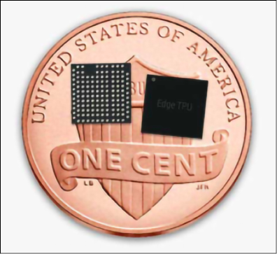
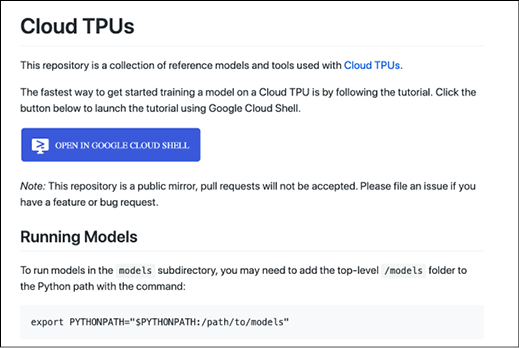
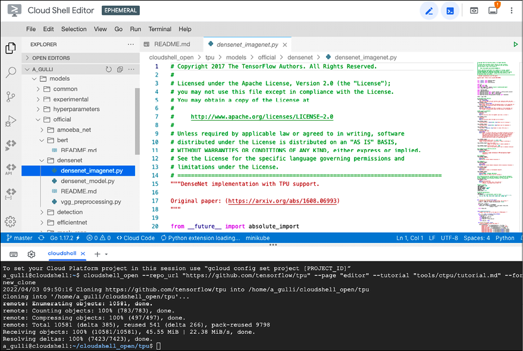

<title>Tensor Processing Unit</title> <link href="../Styles/epub.css" rel="stylesheet" type="text/css"> <link href="../Styles/syntax-highlighting.css" rel="stylesheet" type="text/css">

# Fifteen

# 张量处理单元

本章介绍了**张量处理单元** ( **TPU** )，这是谷歌开发的一种特殊芯片，用于超快速执行神经网络数学运算。与**图形处理单元**(**GPU**)一样，这里的想法是拥有一个专门的处理器，只专注于非常快速的矩阵运算，不支持通常由**中央处理单元**(**CPU**)支持的所有其他运算。然而，TPUs 的额外改进是从芯片中移除了对 GPU 中通常存在的图形操作(光栅化、纹理映射、帧缓冲操作等)的任何硬件支持。可以把 TPU 想象成一个专门用于深度学习的专用协处理器，专注于矩阵或张量运算。在本章中，我们将 CPU 和 GPU 与四代 TPU 以及与 Edge TPUs 进行比较。所有这些加速器都将于 2022 年 4 月上市。本章将包括使用 TPU 的代码示例。

在本章中，您将学习以下内容:

*   C/G/T 处理单元
*   四代 TPU 和 Edge TPUs
*   TPU 表演
*   如何将 TPU 与 Colab 配合使用

就这样，让我们开始吧。

# C/G/T 处理单元

在本节中，我们将讨论 CPU、GPU 和 TPU。在讨论 TPU 之前，我们回顾一下 CPU 和 GPU 会很有用。

## CPU 和 GPU

你可能对 CPU 的概念有些熟悉，CPU 是每台电脑、平板电脑和智能手机中的通用芯片。CPU 负责所有的计算:从逻辑控制，到算术，到寄存器操作，到内存操作，等等。CPU 受制于众所周知的摩尔定律[1]，该定律指出密集集成电路中的晶体管数量大约每两年翻一番。

许多人认为，我们目前所处的时代，这种趋势不会持续太久，事实上，在过去十年中，这种趋势已经有所下降。因此，如果我们想要支持越来越快的计算需求，以处理不断增长的可用数据量，我们需要一些额外的技术。

一项改进来自于 GPU，这是一种专用芯片，非常适合快速图形操作，如矩阵乘法、光栅化、帧缓冲处理、纹理映射等。除了将矩阵乘法应用于图像像素的计算机图形学之外，GPU 也被证明是深度学习的一个很好的匹配。这是一个关于意外收获的有趣故事(意外收获是事件以快乐或有益的方式偶然发生和发展)——这是一个为一个目标而创造的技术的伟大例子，然后在与最初设想完全无关的领域获得了惊人的成功。

## TPUs

在使用 GPU 进行深度学习时遇到的一个问题是，这些芯片是为图形和游戏而制造的，而不仅仅是用于快速矩阵计算的。这当然是事实，因为 GPU 中的 G 代表图形！GPU 在深度学习方面带来了令人难以置信的进步，但在神经网络的张量运算中，芯片的大部分根本没有被使用。对于深度学习，不需要光栅化，不需要帧缓冲区操作，不需要纹理映射。唯一需要的是一种非常有效的方法来计算矩阵和张量运算。GPU 不一定是深度学习的理想解决方案，这应该不足为奇，因为 CPU 和 GPU 是在深度学习成功之前很久设计的。

在进入技术细节之前，让我们首先讨论张量处理单元版本 1，或 TPU v1 的迷人起源。2013 年，谷歌大脑部门主管杰夫·迪恩(Jeff Dean)估计(见*图 15.1* )，如果所有拥有手机的人每天通话时间只增加 3 分钟，那么谷歌将需要两到三倍的服务器来处理这些数据。这将是一个无法承受的成功-灾难的例子，也就是说，巨大的成功导致了无法妥善管理的问题。很明显，CPU 和 GPU 都不是合适的解决方案。因此，谷歌决定，他们需要一种全新的东西——一种可以让性能提高 10 倍，而成本不会大幅增加的东西。TPU v1 就是这样诞生的！令人印象深刻的是，从最初的设计到生产，仅用了 15 个月。你可以在 Jouppi et al .，2014 [3]中找到关于这个故事的更多细节，其中还报告了关于 2013 年在 Google 看到的不同推理工作负载的详细报告:


图 15.1:2013 年谷歌看到的不同推理工作负载(来源[3])

让我们来谈谈技术细节。TPU v1 是一种为超高效张量运算而设计的特殊器件(或称**专用集成电路**，或简称 **ASIC** )。TPU 遵循“少即是多”的理念。这种哲学有一个重要的结果:图形处理器不具备图形处理器所需的所有图形组件。正因为如此，从能耗角度来看，它们都非常高效，而且通常比 GPU 快得多。到目前为止，TPU 已经有四代了。我们来复习一下。

# 四代 TPU，加上 Edge TPU

如前所述，TPU 是专门为矩阵运算优化的专用处理器。现在，你可能还记得矩阵乘法的基本运算是一个矩阵的一行和另一个矩阵的一列之间的点积。例如，给定一个矩阵乘法，计算 *Y* [ * i 【T5，0】为:*


对于大型矩阵，该操作的顺序实现是耗时的。对于 *n* x *n* 矩阵，强力计算的时间复杂度为 *O* ( *n* ³ )，因此对于运行大型计算是不可行的。

## 第一代 TPU

第一代 TPU (TPU v1)于 2016 年 5 月在谷歌 I/O 上公布，TPU v1 [1]支持使用 8 位算术的矩阵乘法。TPU v1 专门用于深度学习推理，但它不适用于训练。对于训练，需要执行浮点运算，如以下段落中所讨论的。

TPU 的一个关键功能是“脉动”矩阵乘法。让我们看看这意味着什么。请记住，深度学习的核心是一个核心产品，例如，计算 *Y* [ * i 【T4，0】的基本操作是:*


“脉动”矩阵乘法允许并行计算多个 *Y* [ *i* ， *j* 值。数据以协调的方式流动，事实上，在医学上,“心脏收缩”一词指的是心脏收缩以及血液在我们静脉中有节奏的流动。这里的脉动指的是在 TPU 内部脉动的数据流。可以证明，脉动乘法算法比蛮力乘法算法便宜[2]。TPU v1 有一个**矩阵乘法单元** ( **MMU** )在 256 x 256 个内核上运行心脏收缩乘法，因此一次可以并行计算 65，536 次乘法。此外，TPU v1 位于机架中，不能直接接触。相反，CPU 充当主机，控制数据传输并向 TPU 发送命令，以执行张量乘法、计算卷积和应用激活函数。CPU  TPU v1 通信通过标准的 PCIe 3.0 总线进行。从这个角度来看，TPU v1 在精神上更接近于**浮点单元** ( **FPU** )协处理器，而不是 GPU。然而，TPU v1 具有运行整个推理模型的能力，以减少对主机 CPU 的依赖。*图 15.2* 表示 TPU v1，如图[3]所示。如图所示，处理单元通过 PCI 端口连接，并通过标准 DDR4 DRAM 芯片获取重量。乘法发生在 MMU 内，具有收缩处理。然后激活函数应用于结果。MMU 和用于激活的统一缓冲器占用了大量空间。有一个计算激活函数的区域。


图 15.2: TPU v1 设计方案(来源[3])

TPU v1 采用 28 纳米工艺节点制造，芯片尺寸≤ 331 mm2，时钟速度为 700 MHz，片内存储器为 28 MiB，32 位累加器为 4 MiB，8 位乘法器为 256 x 256 脉动阵列。为此，我们可以获得 700 MHz*65，536(乘法器) 92 万亿次运算/秒。对于矩阵乘法来说，这是一个惊人的性能；*图 15.3* 显示了由 MMU 执行的脉动矩阵乘法的 TPU 电路板和数据流。此外，TPU v1 有一个 8gb 的双通道 2133 MHz DDR3 SDRAM，提供 34 GB/s 的带宽。外部存储器是标准的，它用于存储和获取推理过程中使用的权重。还要注意，TPU v1 的热设计功耗为 28–40 瓦，与 GPU 和 CPU 相比，这无疑是低功耗。此外，TPU v1 通常安装在用于 SATA 磁盘的 PCI 插槽中，因此不需要对主机服务器进行任何修改[3]。每台服务器上最多可以安装四张卡。*图 15.3* 显示了 TPU v1 卡和心脏收缩计算的过程:


图 15.3:在左边你可以看到一个 TPU v1 板，在右边是一个在心脏收缩计算中如何处理数据的例子

如果你想看一看 TPU 性能与 GPU 和 CPU 的比较，你可以参考[3]并看到(在双对数标度图中)性能比 Tesla K80 GPU 高两个数量级。该图显示了“屋顶”性能，该性能一直增长，直到达到峰值，然后保持不变。

屋顶越高，性能越好:


图 15.4: TPU v1 的峰值性能比特斯拉 K80 高 3 倍

## 第二代 TPU

第二代TPU(TPU2s)于 2017 年公布。在这种情况下，内存带宽增加到 600 GB/s，性能达到 45 TFLOPS。四个 TPU2s 排列在一个具有 180 TFLOPS 性能的模块中。然后，64 个模块被分组到一个具有 11.5 PFLOPS 性能的 pod 中。TPU2s 采用浮点运算，因此它们既适合于训练也适合于推理。

一个 TPU2 有一个用于 128*128 内核矩阵乘法的 MNU 和一个用于所有其他任务如应用激活等的**向量处理单元** ( **VPU** )。VPU 处理 float32 和 int32 计算。另一方面，MXU 以混合精度 16–32 位浮点格式工作。

每个 TPU v2 芯片都有两个内核，每块板上最多可安装四个芯片。在 TPU v2 中，谷歌采用了一种叫做 bfloat16 的新的浮点模型。这个想法是牺牲一些分辨率，但仍然非常适合深度学习。这种分辨率的降低使我们能够提高 TPU2s 的性能，TPU2s 比 v1s 更节能。事实上，可以证明较小的尾数有助于减少物理硅面积和乘法器功率。因此，bfloat16 使用相同的标准 IEEE 754 单精度浮点格式，但它将尾数字段从 23 位截断为 7 位。

保留指数位允许格式保持与 32 位单精度相同的范围。这使得两种数据类型之间的转换相对简单:


图 15.5:云 TPU v2 和云 TPU v3

谷歌通过**谷歌计算引擎** ( **GCE** )和**谷歌 Kubernetes 引擎** ( **GKE** )提供对这些 TPU v2 和 TPU v3 的访问。另外，可以通过 Colab 免费使用它们。

## 第三代 TPU

第三代 TPU(TPU 3)于 2018 年公布【4】。TPU 3 比 TPU2 快 2 倍，它们被分组在 4 倍大的 pod 中。总的来说，性能提高了 8 倍。云 TPU v3 pod 可以提供超过 100 petaflops 的计算能力。另一方面，2018 年在 alpha 发布的云 TPU v2 Pods 可以达到 11.5 petaflops——这是另一个令人印象深刻的改进。截至 2019 年，TPU2 和 TPU3 均以不同价格生产:


图 15.6:谷歌在 2019 年谷歌输入输出大会上宣布了 TPU v2 和 v3 测试版

TPU v3 板有四个 TPU 芯片，八个核心，液体冷却。谷歌采用了源自超级计算机技术的超高速互连硬件，以极低的延迟连接数千个 TPU。

每次在单个 TPU 上更新一个参数时，所有其他的都通过通常用于并行计算的 reduce-all 算法被通知。因此，你可以把 TPU v3 看作是目前最快的用于矩阵和张量运算的超级计算机之一，它内部有数千个 TPU。

## 第四代 TPUs

谷歌第四代 TPU ASIC 的矩阵乘法 TFLOPs 是 TPU v3 的两倍多，内存带宽大幅提升，互连技术也有更多进步。每个 TPU v4 芯片提供的计算能力是 TPU v3 芯片的两倍以上，峰值 TFLOPS 高达 275。每个 TPU v4 Pod 提供 1.1 万亿次/秒的峰值性能。谷歌声称，TPU v4 pod 被广泛用于开发 MUM 和 LaMDA 等研究突破，并改进搜索、助手和翻译等核心产品(见[https://blog . Google/technology/developers/io21-helical-Google/](https://blog.google/technology/developers/io21-helpful-google/))。截至 2022 年 4 月，TPU v4 仅提供预览版(*图 15.7* ):


图 15.7:https://twitter.com/google/status/1394785686683783170 TPU v4 芯片和 TPU v4 吊舱的一部分

在本节中，我们介绍了四代 TPU。在结束之前，我想提一下，通过将可抢占的云 TPU 用于容错的机器学习工作负载，可以节省资金。这些工作负载包括但不限于对大型数据集进行检查点或批量预测的长时间训练运行。

## 边缘 TPU

除了已经讨论过的三代 TPU，2018 年谷歌宣布了在边缘运行的特殊一代 TPU。这个 TPU 特别适合**物联网** ( **物联网**)以及在移动和物联网上支持 TensorFlow Lite 。单个 Edge TPU 每秒可以执行 4 万亿次(定点)运算(最多 4 次)，仅使用 2 瓦的功率。Edge TPU 专为小型低功耗设备而设计，非常适合片上移动通信，速度快且省电。Edge TPUs 支持 TensorFlow Lite 开发框架(参见*图 15.8* )。2019 年底，谷歌宣布了 Pixel 4 智能手机，它包含一个名为 Pixel Neural Core 的边缘 TPU:



图 15.8:一分钱一分货——来源:https://coral.ai/docs/edgetpu/faq/#what-is-the-edge-tpu

至此，我们结束了对 TPU v1、v2、v3、v4 和 Edge TPU 的介绍。在下一节中，我们将简要讨论性能。

# TPU 表演

讨论性能总是很困难，因为首先定义我们要测量的指标以及我们要用作基准的一组工作负载非常重要。例如，谷歌报告了与 ResNet-50 [4]一起使用的 TPU v2 令人印象深刻的线性缩放(参见*图 15.9* 和*图 15.10* ):


图 15.9:当增加图像数量时，TPUs v2 数量的线性可伸缩性

此外，您可以在网上找到 ResNet-50 [4]的对比，其中全云 TPU v2 Pod 比用于 ResNet-50 培训的 V100 NVIDIA Tesla GPU 快 200 倍以上:


图 15.10:对于训练 ResNet-50 模型，全云 TPU v2 Pod 比 V100 NVIDIA Tesla GPU 快 200 倍以上

根据谷歌的数据，与英伟达 A100 GPUs 相比，TPU v4 giv se ml perf 1.0[5]的顶线结果(参见*图 15.11* )。事实上，这些加速器是通过牢记包含数十亿甚至数万亿参数的最新大型模型来设计的(想想 GPT-3、T5 和开关变压器):


图 15.11: MLPerf 1.0 TPU v4 Pod 性能——来源:https://cloud . Google . com/blog/products/ai-machine-learning/Google-wins-ml perf-benchmarks-with-TPU-v4

# 如何将 TPU 与 Colab 配合使用

在本节中，我们将展示如何在 Colab 中使用 TPU。只需将浏览器指向[https://colab.research.google.com/](https://colab.research.google.com/)，将运行时间从更改为**运行时间**菜单，如图*图 15.12* 所示。首先，您需要为笔记本启用 TPUs，然后导航到**编辑** → **笔记本设置**，并从**硬件加速器**下拉框中选择 **TPU** :


图 15.12:将 TPU 设置为硬件加速器

## 检查 TPU 是否可用

首先，让我们通过使用这个返回分配给 TPU 的 IP 地址的简单代码片段来检查是否有可用的 TPU。CPU 和 TPU 之间的通信通过 **gRPC** ( **gRPC 远程过程调用**)进行，这是一个现代、开源、高性能的**远程过程调用** ( **RPC** )框架，可以在任何环境下运行:

```
%tensorflow_version 2.x

import tensorflow as tf

print("Tensorflow version " + tf.__version__)

try:

  tpu = tf.distribute.cluster_resolver.TPUClusterResolver()  # TPU detection

  print('Running on TPU ', tpu.cluster_spec().as_dict()['worker'])

except ValueError:

  raise BaseException('ERROR: Not connected to a TPU runtime; please see the previous cell in this notebook for instructions!')

tf.config.experimental_connect_to_cluster(tpu)

tf.tpu.experimental.initialize_tpu_system(tpu)

tpu_strategy = tf.distribute.experimental.TPUStrategy(tpu) 
```

您应该会看到如下所示的内容:

```
Tensorflow version 2.8.0

Running on TPU  ['10.36.66.50:8470']

INFO:tensorflow:Deallocate tpu buffers before initializing tpu system.

INFO:tensorflow:Deallocate tpu buffers before initializing tpu system.

INFO:tensorflow:Initializing the TPU system: grpc://10.36.66.50:8470

INFO:tensorflow:Initializing the TPU system: grpc://10.36.66.50:8470

INFO:tensorflow:Finished initializing TPU system.

INFO:tensorflow:Finished initializing TPU system.

WARNING:absl:'tf.distribute.experimental.TPUStrategy' is deprecated, please use  the non experimental symbol 'tf.distribute.TPUStrategy' instead.

INFO:tensorflow:Found TPU system:

INFO:tensorflow:Found TPU system:

INFO:tensorflow:*** Num TPU Cores: 8

INFO:tensorflow:*** Num TPU Cores: 8

INFO:tensorflow:*** Num TPU Workers: 1

INFO:tensorflow:*** Num TPU Workers: 1

INFO:tensorflow:*** Num TPU Cores Per Worker: 8

INFO:tensorflow:*** Num TPU Cores Per Worker: 8 
```

我们已经确认有一款 TPU 可供选择！

## 喀拉斯 MNIST TPU 端到端培训

参考 Google Research Colab 上提供的笔记本(参见[https://Colab . Research . Google . com/github/Google cloud platform/training-data-analyst/blob/master/courses/fast-and-lean-data-science/01 _ MNIST _ TPU _ keras . ipynb # scroll to = HD 5 zb1 g 7y 9-7](https://colab.research.google.com/github/GoogleCloudPlatform/training-data-analyst/blob/master/courses/fast-and-lean-data-science/01_MNIST_TPU_Keras.ipynb#scrollTo=Hd5zB1G7Y9-7))，我们可以检查如何使用这段代码片段检测 TPU 或 GPU，该代码片段使用 TPU 或 GPU 作为后备:

```
try: # detect TPUs

    tpu = tf.distribute.cluster_resolver.TPUClusterResolver.connect() # TPU detection

    strategy = tf.distribute.TPUStrategy(tpu)

except ValueError: # detect GPUs

    strategy = tf.distribute.MirroredStrategy() # for GPU or multi-GPU machines

    #strategy = tf.distribute.get_strategy() # default strategy that works on CPU and single GPU

    #strategy = tf.distribute.experimental.MultiWorkerMirroredStrategy() # for clusters of multi-GPU machines

print("Number of accelerators: ", strategy.num_replicas_in_sync) 
```

注意，策略`tf.distribute.TPUStrategy(tpu)`是在 TPUs 和 TPU 吊舱上同步训练的代码中唯一需要的变化。然后，为了在 TPUs 上运行 TF2 程序，你可以在`tf.keras`中使用`.compile`或者`.fit`API 和`TPUStrategy`。

如果你愿意，你可以通过直接调用`strategy.run`来编写你自己定制的训练循环(参见[https://www . tensor flow . org/API _ docs/python/TF/distribute/TPUStrategy](https://www.tensorflow.org/api_docs/python/tf/distribute/TPUStrategy))。

# 使用预训练的 TPU 模型

谷歌在 GitHub `tensorflow/tpu`资源库(【https://github.com/tensorflow/tpu】T2)提供了一系列经过 TPU 预训练的模型。模型包括图像识别、对象检测、低资源模型、机器翻译和语言模型、语音识别和图像生成。只要有可能，我的建议是从一个预训练模型[6]开始，然后对其进行微调或应用某种形式的迁移学习。截至 2022 年 4 月，提供以下型号:

| **图像识别、分割等** | **机器翻译和语言模型** | **语音识别** | **图像生成** |
| **图像识别**阿米巴网-DResNet-50/101/152/2000初始版本 2/3/4**物体检测**RetinaNet屏蔽 R-CNN**图像分割**屏蔽 R-CNNDeepLabRetinaNet**低资源模型**MnasNetMobileNet斯奎泽尼 | **机器翻译**(基于变压器)**情感分析**(基于变压器)**问题回答****伯特** | **ASR****变压器** | **图像转换器****DCGAN****甘** |

表 15.1:GitHub 上可用的经过 TPU 预处理的最新模型集合

玩这个库的最好方式是在谷歌云控制台上克隆它，并使用 https://github.com/tensorflow/tpu/blob/master/README.md T2 的可用环境。您应该能够浏览*图 15.13* 中显示的内容:



图 15.13:云 TPU

如果你点击 GOOGLE 云外壳中的**打开按钮，那么系统会将 Git 库克隆到你的云外壳中，然后打开外壳(参见*图 15.14* ):**



图 15.14:代表您克隆了 TPU Git 存储库的 Google Cloud Shell

从那里，你可以玩一个漂亮的谷歌云 TPU 演示，在 MNIST 与 TPU 羊群一起训练 ResNet-50——一个计算引擎虚拟机和云 TPU 对(见*图 15.15* ):


图 15.15:谷歌云 TPU 演示，在 MNIST 用 TPU 羊群训练一只 ResNet-50

如果你有兴趣看的话，我会把这个培训演示留给你。

# 摘要

TPU 是谷歌开发的非常特殊的 ASIC 芯片，用于以超快的方式执行神经网络数学运算。计算的核心是一个脉动乘法器，它并行计算多个点积(行*列)，从而加速基本深度学习操作的计算。可以把 TPU 想象成深度学习的专用协处理器，专注于矩阵或张量运算。到目前为止，谷歌已经宣布了四代 TPU，外加一个用于物联网的 Edge TPU。云 TPU v1 是一个基于 PCI 的专用协处理器，只有 92 万亿次运算和推理能力。云 TPU v2 实现了 180 万亿次浮点运算，它支持训练和推理。2018 年在 alpha 发布的云 TPU v2 Pods 可以实现 11.5 petaflops。云 TPU v3 通过训练和推理支持实现了 420 万亿次浮点运算。云 TPU v3 pod 可以提供超过 100 petaflops 的计算能力。每个 TPU v4 芯片提供的计算能力是 TPU v3 芯片的两倍以上，峰值 TFLOPS 高达 275。每个 TPU v4 Pod 提供 1.1 万亿次/秒的峰值性能。

那是用于张量运算的世界级超级计算机！

在下一章，我们会看到一些其他有用的深度学习库。

# 参考

1.  摩尔定律:[https://en.wikipedia.org/wiki/Moore%27s_law](https://en.wikipedia.org/wiki/Moore%27s_law)
2.  米洛瓦诺维奇。等人(2010 年 5 月)。*收缩矩阵乘法四十三种方式*。国际计算机数学杂志 87(6):1264–1276 中的文章。
3.  Jouppi，N. P .等人(2014 年 6 月)。*张量处理单元*的数据中心内性能分析。第 44 届计算机体系结构国际研讨会(ISCA)。
4.  谷歌 TPU v2 性能:[https://storage.googleapis.com/nexttpu/index.xhtml](https://storage.googleapis.com/nexttpu/index.xhtml)
5.  MLPerf 站点:[https://mlperf.org/](https://mlperf.org/)
6.  一组经过 TPU 预处理的模型:[https://cloud.google.com/tpu](https://cloud.google.com/tpu)

# 加入我们书的不和谐空间

加入我们的 Discord 社区，结识志同道合的朋友，与 2000 多名会员一起学习:[https://packt.link/keras](https://packt.link/keras)

