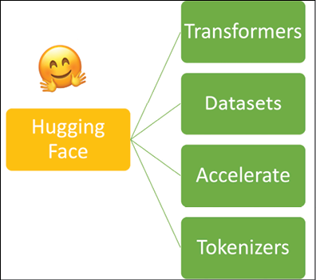
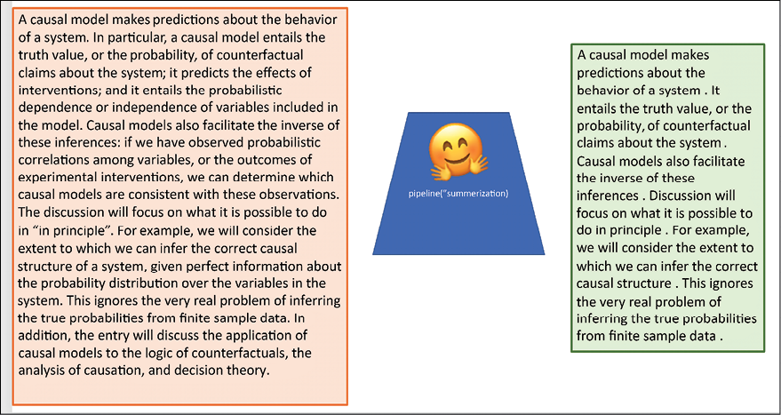
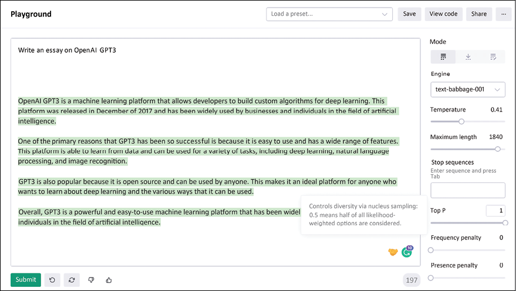
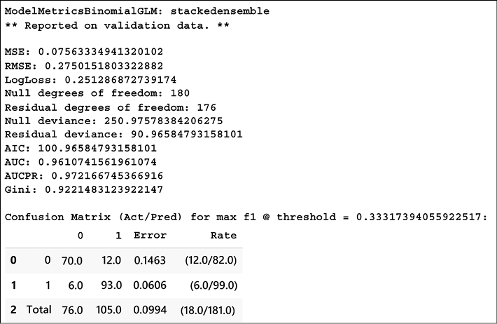
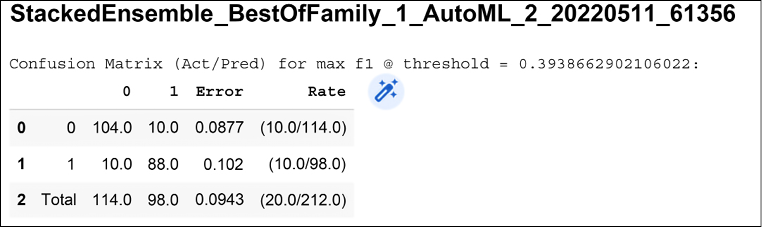
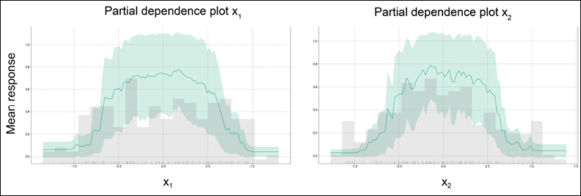
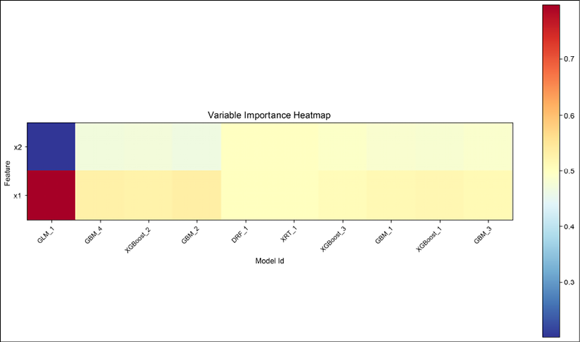
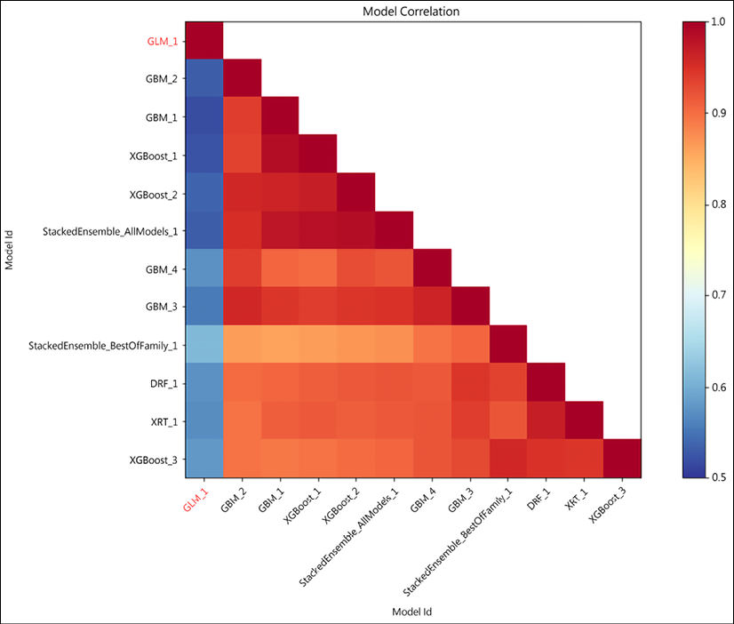

# 十六、其他有用的深度学习库

谷歌的 TensorFlow 并不是深度学习任务的唯一可用框架。有许多可用的库和框架，每一个都有其特殊的特性、功能和用例。在这一章中，我们将探索一些流行的深度学习库，并比较它们的功能。

本章将包括:

*   拥抱脸
*   H2O
*   PyTorch
*   ONNX
*   openal

本章的所有代码文件都可以在 https://packt.link/dltfchp16 找到。

我们开始吧！

# 拥抱脸

拥抱脸对我们来说并不新鲜；*第六章*，*转换器*，介绍我们去图书馆。拥抱脸是一家以 NLP 为中心的创业公司，由 Delangue 和 Chaumond 在 2016 年创立。在很短的时间内，它已经成为所有 NLP 相关任务的最佳工具之一。AutoNLP 和加速推理 API 是有价格的。然而，它的核心 NLP 库数据集、记号化器、Accelerate 和 transformers ( *图 16.1* )是免费的。它建立了一个很酷的社区驱动的开源平台。



图 16.1:拥抱脸的 NLP 库

拥抱脸生态系统的核心是它的转换器库。记号赋予器和数据集库支持转换器库。要使用这些库，我们需要先安装它们。可以使用简单的`pip install`命令安装变压器:

```py
pip install transformers 
```

拥抱脸可用的一些现成模型是文本摘要、问题回答、文本分类、音频分类、自动语音识别、特征提取、图像分类和翻译。在*图 16.2* 中，我们可以看到拥抱脸可用的现成摘要模型的结果。



图 16.2:使用拥抱脸的现成文本摘要

除了这些开箱即用的模型，我们可以使用 Hugging Face Hub 上的大量模型和数据集，并将其与 PyTorch、TensorFlow 和 JAX 结合使用，以构建定制的模型。

# OpenAI

OpenAI 是在强化学习领域工作的人的另一个众所周知的名字。他们的 Gym 模块是全球开发者用来开发和比较强化学习算法的标准工具包。在*第十一章*、*强化学习*中，我们已经详细讲述了健身房模块。在这一章中，我们将探索 OpenAI 的另外两个产品。

## 开放 GPT-3 API

“OpenAI GPT3 是一个机器学习平台，允许开发者为深度学习构建定制算法。该平台于 2017 年 12 月发布，已被人工智能领域的企业和个人广泛使用。GPT3 如此成功的主要原因之一是因为它易于使用并且具有广泛的功能。这个平台能够从数据中学习，可以用于各种任务，包括深度学习、自然语言处理和图像识别。GPT3 也很受欢迎，因为它是开源的，任何人都可以使用。这使得它成为任何想要了解深度学习及其各种使用方式的人的理想平台。总体而言，GPT3 是一个强大且易于使用的机器学习平台，已被企业和个人广泛用于人工智能领域。”

当被要求在 GPT 3 号本身(【https://beta.openai.com/playground】)上写时，这是由 open ai GPT 3 号 API 生成的文本:



图 16.3:使用 OpenAI GPT-3 API 生成文本

OpenAI GPT-3 API 提供了以下任务:

*   **文本完成**:在这里， GPT-3 API 用于生成或操作文本甚至代码。你可以用它来写标语、介绍或文章，或者你可以留下一个写了一半的句子，让它来完成。人们用它来产生故事和广告线索。
*   **语义搜索**:这允许您对一组文档进行语义搜索。例如，您可以使用 API 上传文档；它可以处理多达 200 个文档，其中每个文件的最大大小可以是 150 MB，在任何给定时间，总大小限制为 1 GB。API 将接受您的查询，并根据语义相似性得分(范围通常在 0-300 之间)对文档进行排序。
*   **问答**:此 API 使用上传的文档作为真相来源；API 首先搜索与问题相关的文档。然后根据语义相关性对它们进行排序，最后回答问题。
*   **文本分类**:open ai GPT-3 的文本分类端点将一组带标签的示例作为输入，然后使用其中的标签来标记查询文本。有很多这种特性被用来进行情感分析的例子。

最初，OpenAI GPT-3 只有在申请后才可用，但现在，任何人都可以使用该 API 不再有等候名单。

## 开源软件国际化之简体中文组

OpenAI 的 GPT-3 API 处理所有与 NLP 相关的事情；DALL-E 2 更进一步。DALL-E 最初由 OpenAI 于 2021 年 1 月发布。它声称可以根据提供给模型的文本描述生成照片级的图像。它还可以对现有图像进行逼真的编辑；您可以使用它来添加或删除图像中的对象和元素，当它这样做时，它会考虑对阴影、反射和纹理的影响。图 16.4 展示了 DALL-E 2 的一些非凡壮举。在最上面一行的数字中，我给了 DALL-E 2 一个描述我想要什么的文本:“阿尔伯特·爱因斯坦骑着恐龙飞过亚马逊森林。”它生成了一个卡通般的图像。下面一行中的图像是使用 DALL-E 2 的图像编辑器特性生成的。我添加了左边的图像，它产生了四种变化。如果你忽略这些模糊的面孔，这些变化看起来非常真实:


图 16.4:上面是 DALL-E 2 生成的图像，下面是 DALL-E 2 编辑的图像

在写这本书的时候(2022 年 8 月)，DALL-E 2 还不能公开使用。但是想象一下，一旦这个模型作为一个 API 可用，艺术家和专业人士在创作数字媒体时会有什么样的可能性。

## OpenAI 代码

当一个学生开始他们的第一堂编程课时，作为一名教师，我经常建议他们把一个程序想象成一组指令——唯一需要掌握的重要事情就是用你所知道的任何语言尽可能清晰地写出这些指令。

Codex 让它发生，你只需要给它你想要实现的指令，它就会为你生成相应的代码。

OpenAI 将其作为通用编程模型推出，并在公开可用的 GitHub 代码上对其进行了训练。

以下是由 Codex 生成的任务和相应代码的一些片段:

```py
""" Ask the user for their name and say "Hello" in Python """ 

print("Hello, world!") 

name = input("Please type your name: ") 

print("Hello, " + name + "!")

""" Write a program in Python to find sum of n fibonacci sequences """ 

def Fibonacci(n): 

    if n < 0: 

        print("Incorrect input") 

    elif n == 1: 

       return 0 

    elif n == 2: 

        return 1 

    else: 

        return Fibonacci(n - 1) + Fibonacci(n - 2) 

n = int(input("Enter the number of terms: ")) 

# check if the number of terms is valid 

if n <= 0: 

    print("Please enter a positive integer") 

else: 

    print("Fibonacci sequence: ") 

    for I in range(1, n + 1): 

        print(Fibonacci(n), end=' ') 
```

如你所见，第一项任务完成得天衣无缝。在第二个任务中，我们要求它找出斐波那契数列的和；相反，它产生了斐波那契数列，这是一个更常见的问题。这告诉我们，虽然它很擅长做一般的工作，但对真正的程序员的需求仍然存在。

# PyTorch

像 TensorFlow 一样，PyTorch 是一个成熟的深度学习框架。在基于人工智能的社交团体中，你经常会发现 PyTorch 和 TensorFlow 的铁杆粉丝认为他们的是最好的。PyTorch 由脸书(Meta now)开发，是一个开源的深度学习框架。许多研究人员更喜欢它灵活和模块化的方法。PyTorch 对生产部署也有稳定的支持。和 TF 一样，PyTorch 的核心是它的张量处理库和它的自动微分引擎。在 C++运行时环境中，它利用 TorchScript 在 graph 和 eager 模式之间轻松转换。PyTorch 受欢迎的主要特性是其使用动态计算的能力，即动态构建计算图的能力——这为程序员提供了随时修改和检查计算图的灵活性。

PyTorch 库由许多模块组成，这些模块被用作构建复杂模型的构建块。此外，PyTorch 还提供了在不同设备(即 CPU、GPU 或 TPU)之间传递变量和模型的便捷函数。特别值得一提的是以下三个强大的模块:

*   **NN Module**: This is the base class where all layers and functions to build a deep learning network are. Below, you can see the code snippet where the NN module is used to build a network. The network can then be instantiated using the statement `net = My_Net(1,10,5)`; this creates a network with one input channel, 10 output neurons, and a kernel of size `5x5`:

    ```py
    import torch.nn as nn

    import torch.nn.functional as F

    class My_Net(nn.Module):

        def __init__(self, input_channel, output_neurons, kernel_size):

            super(My_Net, self).__init__()

            self.conv1 = nn.Conv2d(input_channel, 6, kernel_size)

            self.conv2 = nn.Conv2d(6, 16, 5)

            self.fc1 = nn.Linear(16 * 5 * 5, 120)

            self.fc2 = nn.Linear(120, 84)

            self.fc3 = nn.Linear(84,output_neurons)

        def forward(self, x):

            x = F.max_pool2d(F.relu(self.conv1(x)), (2, 2))

            x = F.max_pool2d(F.relu(self.conv2(x)), 2)

            x = x.view(-1, self.num_flat_features(x))

            x = F.relu(self.fc1(x))

            x = F.relu(self.fc2(x))

            x = self.fc3(x)

            return x

        def num_flat_features(self, x):

            size = x.size()[1:]  

            num_features = 1

            for s in size:

                num_features *= s

            return num_features 
    ```

    以下是该网络的总结:

    ```py
    My_Net(

        (conv1): Conv2d(1, 6, kernel_size=(5, 5), stride=(1, 1))

        (conv2): Conv2d(6, 16, kernel_size=(5, 5), stride=(1,

        1))

        (fc1): Linear(in_features=400, out_features=120,

        bias=True)

        (fc2): Linear(in_features=120, out_features=84,

        bias=True)

        (fc3): Linear(in_features=84, out_features=10,

        bias=True)

    ) 
    ```

*   **Autograd Module**: This is the heart of PyTorch. The module provides classes and functions that are used for implementing automatic differentiation. The module creates an acyclic graph called the dynamic computational graph; the leaves of this graph are the input tensors, and the root is the output tensors. It calculates a gradient by tracing the root to the leaf and multiplying every gradient in the path using the chain rule. The following code snippet shows how to use the Autograd module for calculating gradients. The `backward()` function computes the gradient of the loss with respect to all the tensors whose `requires_grad` is set to `True`. So suppose you have a variable `w`, then after the call to `backward(),` the tensor `w.grad` will give us the gradient of the loss with respect to `w`.

    然后，我们可以根据学习规则使用它来更新变量`w`:

    ```py
    loss = (y_true – y_pred).pow(2).sum()

    loss.backward()

    # Here the autograd is used to compute the backward pass. 

    With torch.no_grad():

        W = w – lr_rate * w.grad

        w.grad = None # Manually set to zero after updating 
    ```

*   **Optim 模块**:Optim模块实现各种优化算法。Optim 中可用的一些优化器算法有 SGD、AdaDelta、Adam、SparseAdam、AdaGrad 和 LBFGS。还可以使用 Optim 模块创建复杂的优化器。要使用 Optim 模块，只需要构造一个 optimizer 对象，它将保存当前状态并根据梯度更新参数。

PyTorch 被许多公司用于他们的人工智能解决方案。**特斯拉**使用 PyTorch 进行**自动驾驶**。特斯拉自动驾驶仪使用车辆周围八个摄像头的镜头，将这些镜头通过 48 个神经网络进行物体检测、语义分割和单目深度估计。该系统提供 2 级车辆自动化。他们从所有八个摄像机获取视频，以生成道路布局、任何静态基础设施(例如，建筑物和交通/电线杆)和 3D 对象(路上的其他车辆、人员等)。网络被实时迭代训练。虽然有点技术性，但特斯拉人工智能总监安德烈·卡帕西(Andrej Karpathy)在 2019 年的演讲中，给出了自动驾驶及其功能的鸟瞰图:【https://www.youtube.com/watch?v=oBklltKXtDE】T4&t = 670s。优步的概率深度学习库 Pyro 和 OpenAI 是大型人工智能公司使用 PyTorch 进行研发的其他例子。

# ONNX

**开放神经网络交换** ( **ONNX** )为 AI 模型提供开源格式。它既支持深度学习模型，也支持传统机器学习模型。它是一种设计用来表示任何类型的模型的格式，它通过使用由不同框架创建的计算图的中间表示来实现这一点。它支持 PyTorch、TensorFlow、MATLAB 和许多其他深度学习框架。因此，使用 ONNX，我们可以很容易地将模型从一个框架转换到另一个框架。这有助于缩短从研究到部署的时间。例如，您可以使用 ONNX 将 PyTorch 模型转换为 ONNX.js 表单，然后可以直接部署到 web 上。

# H2O.ai

H2O 是一个快速、可扩展的机器学习和深度学习框架，由 H2O.ai 开发，在开源 Apache 许可下发布。根据该公司网站，截至撰写本书时，超过 20，000 个组织使用 H2O 来满足他们的 ML/深度学习需求。该公司提供许多产品，如 H2O 人工智能云、H2O 无人驾驶人工智能、H2O 波浪和苏打水。在这一部分，我们将探索它的开源产品，H2O。

它可以在 Hadoop、Spark 或 Kubernetes 集群上的大数据基础架构上工作，也可以在独立模式下工作。它利用分布式系统和内存计算，这使它能够处理内存中的大量数据，即使是一个小型的机器集群。它有一个用于 R、Python、Java、Scala 和 JavaScript 的接口，甚至还有一个内置的 web 接口。

H2O 包括大量基于统计的 ML 算法，如广义线性建模、朴素贝叶斯、随机森林、梯度推进和所有主要的深度学习算法。H2O 最好的部分是，你可以建立数以千计的模型，比较结果，甚至只用几行代码就可以进行超参数调整。H2O 也有更好的数据预处理工具。

H2O 需要 Java，因此，请确保您的系统上安装了 Java。您可以使用 PyPi 在 Python 中安装 H2O 来工作，如下面的代码所示:

```py
pip install h2o 
```

## H2O 汽车公司

H2O 最令人兴奋的特色之一是自动大联盟的汽车 T2。这是一个开发用户友好的 ML 界面的尝试，初学者和非专家都可以使用。H2O 汽车公司自动化了大量候选模型的训练和调整过程。其界面的设计使得用户只需指定他们的数据集、输入和输出特征，以及他们想要的对训练的总模型数量的任何约束，或时间约束。剩下的工作由 AutoML 本身在指定的时间限制内完成；它会找出表现最佳的车型，并为提供一个**排行榜**。已经观察到，通常，堆叠集成模型，所有先前训练的模型的集成，占据排行榜的顶部位置。高级用户可以使用大量选项；这些选项及其各种功能的详细信息可在[http://docs.h2o.ai/h2o/latest-stable/h2o-docs/automl.xhtml](http://docs.h2o.ai/h2o/latest-stable/h2o-docs/automl.xhtml)获得。

想了解更多关于 H2O 的信息，请访问他们的网站: [http://h2o.ai](http://h2o.ai) 。

## 使用 H2O 的汽车

让我们在综合创建的数据集上尝试 H2O AutoML。我们使用 scikit-learn `make_circles`方法创建数据并将其保存为 CSV 文件:

```py
from sklearn.datasets import make_circles

import pandas as pd

X, y = make_circles(n_samples=1000, noise=0.2, factor=0.5, random_state=9)

df = pd.DataFrame(X, columns=['x1','x2'])

df['y'] = y

df.head()

df.to_csv('circle.csv', index=False, header=True) 
```

在使用 H2O 之前，我们需要启动它的服务器，这是使用`init()`函数完成的:

```py
import h2o

h2o.init() 
```

下面显示了初始化 H2O 服务器后我们将收到的输出:

```py
Checking whether there is an H2O instance running at http://localhost:54321 ..... not found.

Attempting to start a local H2O server...

  Java Version: openjdk version "11.0.15" 2022-04-19; OpenJDK Runtime Environment (build 11.0.15+10-Ubuntu-0ubuntu0.18.04.1); OpenJDK 64-Bit Server VM (build 11.0.15+10-Ubuntu-0ubuntu0.18.04.1, mixed mode, sharing)

  Starting server from /usr/local/lib/python3.7/dist-packages/h2o/backend/bin/h2o.jar

  Ice root: /tmp/tmpm2fsae68

  JVM stdout: /tmp/tmpm2fsae68/h2o_unknownUser_started_from_python.out

  JVM stderr: /tmp/tmpm2fsae68/h2o_unknownUser_started_from_python.err

  Server is running at http://127.0.0.1:54321

Connecting to H2O server at http://127.0.0.1:54321 ... successful.

H2O_cluster_uptime:    05 secs

H2O_cluster_timezone:    Etc/UTC

H2O_data_parsing_timezone:    UTC

H2O_cluster_version:    3.36.1.1

H2O_cluster_version_age:    27 days 

H2O_cluster_name:    H2O_from_python_unknownUser_45enk6

H2O_cluster_total_nodes:    1

H2O_cluster_free_memory:    3.172 Gb

H2O_cluster_total_cores:    2

H2O_cluster_allowed_cores:    2

H2O_cluster_status:    locked, healthy

H2O_connection_url:    http://127.0.0.1:54321

H2O_connection_proxy:    {"http": null, "https": null}

H2O_internal_security:    False

Python_version:    3.7.13 final 
```

我们读取了包含我们之前创建的合成数据的文件。因为我们想把这个问题当作一个分类问题，不管这些点是否在一个圆里，我们重新定义我们的标签`'y'`为`asfactor()`——这将告诉 H2O AutoML 模块把变量`y`当作分类，从而把这个问题当作分类。数据集按照 60:20:20 的比例分为训练、验证和测试数据集:

```py
class_df = h2o.import_file("circle.csv",\

                           destination_frame="circle_df")

class_df['y'] = class_df['y'].asfactor()

train_df,valid_df,test_df = class_df.split_frame(ratios=[0.6, 0.2],\

                                                 seed=133) 
```

现在，我们从 H2O 调用 AutoML 模块，并在我们的训练数据集上进行训练。AutoML 将最多搜索 10 个模型，但是您可以更改参数`max_models`来增加或减少要测试的模型数量:

```py
from h2o.automl import H2OAutoML as AutoML

aml = AutoML(max_models = 10, max_runtime_secs=100, seed=2)

aml.train(training_frame= train_df, \

          validation_frame=valid_df, \

          y = 'y', x=['x1','x2']) 
```

对于每个模型，它给出了一个性能总结，例如，在*图 16.5* 中，您可以看到二项式 GLM 的评估总结:



图 16.5:H2O 汽车公司一款车型的性能总结

您可以在排行榜上查看 H2O 汽车评估的所有车型的和表现:

```py
lb = aml.leaderboard

lb.head() 
```

以下是排行榜的片段:

```py
model_id     auc    logloss    aucpr    mean_per_class_error    rmse    mse

StackedEnsemble_BestOfFamily_1_AutoML_2_20220511_61356    0.937598    0.315269    0.940757    0.117037    0.309796    0.0959735

StackedEnsemble_AllModels_1_AutoML_2_20220511_61356     0.934905    0.323695    0.932648    0.120348    0.312413    0.0976021

XGBoost_2_AutoML_2_20220511_61356     0.93281     0.322668    0.938299    0.122004    0.313339    0.0981811

XGBoost_3_AutoML_2_20220511_61356     0.932392    0.330866    0.929846    0.130168    0.319367    0.101995 

GBM_2_AutoML_2_20220511_61356     0.926839    0.353181    0.923751    0.141713    0.331589    0.109951 

XRT_1_AutoML_2_20220511_61356     0.925743    0.546718    0.932139    0.154774    0.331096    0.109625 

GBM_3_AutoML_2_20220511_61356     0.923935    0.358691    0.917018    0.143374    0.334959    0.112197 

DRF_1_AutoML_2_20220511_61356     0.922535    0.705418    0.921029    0.146669    0.333494    0.111218 

GBM_4_AutoML_2_20220511_61356     0.921954    0.36403     0.911036    0.151582    0.336908    0.113507 

XGBoost_1_AutoML_2_20220511_61356     0.919142    0.365454    0.928126    0.130227    0.336754    0.113403 
```

## H2O 模型的可解释性

H2O 使用一个带有数据集和模型的函数`explain()`为许多可解释方法及其可视化提供了一个方便的包装器。为了获得 AutoML 测试模型的测试数据的可解释性，我们将使用`aml.explain()`。下面，我们使用`StackedEnsemble_BestOfFamily`模型的`explain`模块——排行榜的最顶端(我们继续使用我们在上一节中创建的相同数据):

```py
exa = aml.leader.explain(test_df) 
```

结果是:



图 16.6:由 H2O 解释模块生成的测试数据集上的混淆矩阵

地面实况以行显示，模型预测以列显示。对于我们的数据，0 被正确预测了 104 次，1 被正确预测了 88 次。

### 部分相关图

**部分相关图** ( **PDP** )为提供了一个变量对模型响应的边际效应的图形描述。它可以告诉我们输出标注和输入要素之间的关系。*图 16.7* 显示了从我们的合成数据集上的 H2O `explain`模块获得的 PDP 图:



图 16.7:输入特性 x [1] 和 x [2] 的 PDP

为了构建每个特性的 PDP 图，H2O 认为其余的特性是不变的。因此，在 x [1] (x [2] )的 PDP 图中，特征 x [2] (x [1] )保持不变，并且测量平均响应，因为 x [1] (x [2] )是变化的。该图显示，这两个特征在确定该点是否为圆时都起着重要作用，尤其是对于位于[-0.5，0.5]之间的值。

### 可变重要性热图

我们还可以检查不同模型中变量的重要性:



图 16.8:输入要素 x [1] 和 x [2] 的可变重要性热图

*图 16.8* 显示了不同算法对两个输入特征的重视程度。我们可以看到，几乎同等重视这两个功能的模型在排行榜上表现良好，而对这两个功能完全不同的 **GLM_1** ，只有大约 41%的准确率。

### 模型相关性

不同模型之间的预测是相关的；我们可以检查这种相关性:



图 16.9:模型关联

*图 16.9* 显示了模型的相关性；它显示了不同模型的测试数据集上的预测之间的相关性。它测量相同预测的频率来计算相关性。同样，我们可以看到，除了 **GLM_1** 之外，其他大多数型号的表现几乎相当，准确率在排行榜上从 84-93%不等。

我们在这里讨论的只是冰山一角；这里列出的每个框架都有关于它们的特性和应用的完整书籍。根据您的用例，您应该选择各自的框架。如果您正在为生产构建模型，TensorFlow 对于基于 web 的应用和边缘应用都是更好的选择。如果您正在构建一个需要更好地控制训练和梯度更新方式的模型，那么 PyTorch 更适合。如果你需要经常跨平台工作，ONNX 会很有用。最后，H2O 和 OpenAI GPT-3 和 DALL-E 2 等平台为人工智能和深度学习领域提供了一个低门槛的入口。

# 摘要

在本章中，我们简要介绍了一些其他流行的深度学习框架、库和平台的特性和功能。我们从拥抱脸开始，这是一个流行的 NLP 框架。然后我们探索了 OpenAI 的 GPT-3 和 DALL-E 2，这两个都是非常强大的框架。GPT-3 API 可用于各种与 NLP 相关的任务，DALL-E 2 使用 GPT-3 从文本描述中生成图像。接下来，我们讨论了 PyTorch 框架。在很多人看来，PyTorch 和 TensorFlow 是不相上下的竞争对手，PyTorch 确实有很多功能可以和 TensorFlow 媲美。在这一章中，我们简要地讨论了 PyTorch 的一些重要特性，如 NN 模块、Optim 模块和自动签名模块。我们还讨论了深度学习模型的开源格式 ONNX，以及我们如何使用它将模型从一个框架转换到另一个框架。最后，本章介绍了 H2O 及其 AutoML 和`explain`模块。

在下一章，我们将学习图神经网络。

# 加入我们书的不和谐空间

加入我们的 Discord 社区，结识志同道合的朋友，与 2000 多名会员一起学习:[https://packt.link/keras](https://packt.link/keras)

