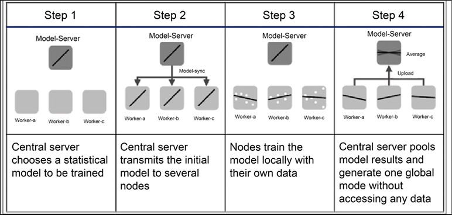

# 十九、TensorFlow2 生态系统

在本章中，我们将了解 TensorFlow 生态系统的不同组成部分。本章将详细阐述 tensor flow Hub——预训练深度学习模型的存储库——和 tensor flow Datasets——ML 任务的即用型数据集集合。将介绍 TensorFlow JS，它是在 web 上训练和部署 ML 模型的解决方案。我们还将了解 TensorFlow Lite，这是一个面向移动和边缘设备的开源深度学习框架。将讨论 Android、iOS 和 Raspberry Pi 应用的一些示例，以及部署预训练模型的示例，如 MobileNet v1、v2、v3(专为移动和嵌入式视觉应用设计的图像分类模型)、PoseNet for pose estimation(一种估计图像或视频中人的姿势的视觉模型)、DeepLab segmentation(一种为输入图像中的每个像素分配语义标签(例如狗、猫和汽车)的图像分割模型)和 MobileNet SSD object detection(一种使用边界框检测多个对象的图像分类模型)。本章将以联邦学习的例子结束，这是一个分散的机器学习框架，被认为是尊重用户隐私的。该章包括:

*   TensorFlow Hub
*   TensorFlow数据集
*   TensorFlow Lite 及其在移动和边缘应用中的应用
*   边缘联合学习
*   TensorFlow JS
*   将 Node.js 用于TensorFlow模型

本章的所有代码文件都可以在[https://packt.link/dltfchp19](https://packt.link/dltfchp19)找到

先说 TensorFlow Hub。

# TensorFlow Hub

即使你有一台功能强大的计算机，训练一个机器学习模型也可能需要几天或几周的时间。一旦你训练好了模型，将它部署到不同的设备上可能会非常困难和耗时。根据您想要部署的平台，您可能需要不同的格式。

您可以将 TensorFlow Hub 视为一个包含许多预训练模型的库。它包含数百个经过训练、随时可以部署的深度学习模型。TensorFlow Hub 为图像分类、图像分割、对象检测、文本嵌入、文本分类、视频分类和生成等提供预训练模型。TF Hub 中的模型有 SavedModel、TFLite 和 TF.js 格式。我们可以直接使用这些预训练的模型进行推理或微调。随着用户和开发人员社区的不断增长，TensorFlow Hub 成为寻找和分享机器学习模型的最佳去处。要使用 TensorFlow Hub，我们首先需要安装它:

```
pip install tensorflow_hub 
```

安装完成后，我们只需使用以下命令即可导入它:

```
import tensorflow_hub as hub 
```

并使用`load`函数加载模型:

```
model = hub.load(handle) 
```

这里的`handle`是一个字符串，包含了我们想要使用的模型的链接。如果我们想将其作为现有模型的一部分，我们可以将其包装为 Keras 层:

```
hub.KerasLayer(

    handle,

    trainable=False,

    arguments=None,

    _sentinel=None,

    tags=None,

    signature=None,

    signature_outputs_as_dict=None,

    output_key=None,

    output_shape=None,

    load_options=None,

    **kwargs

) 
```

通过将参数`trainable`更改为`True`，我们可以针对我们的特定数据对模型进行微调。

*图 19.1* 显示了在`tfhub.dev`站点选择不同型号的易用网络界面。使用过滤器，我们可以很容易地找到一个模型来解决我们的问题。

我们可以选择我们需要的类型和格式，以及谁发布了它！


图 19.1:显示不同过滤器的 tfhub.dev 站点

## 使用预先训练的模型进行推理

让我们看看您如何利用 TensorFlow Hub 的预训练模型。我们将考虑一个图像分类的例子:

1.  让我们导入必要的模块:

    ```
    import tensorflow as tf

    import tensorflow_hub as hub

    import requests

    from PIL import Image

    from io import BytesIO

    import matplotlib.pyplot as plt

    import numpy as np 
    ```

2.  我们定义了一个从 URL 加载图像的函数。这些函数从 web 上获取图像，我们通过添加用于推断的批量索引来重塑它。此外，根据选择的预训练模型对图像进行归一化和调整大小:

    ```
    def load_image_from_url(img_url, image_size):

      """Get the image from url. The image return has shape [1, height, width, num_channels]."""

      response = requests.get(img_url, headers={'User-agent': 'Colab Sample (https://tensorflow.org)'})

      image = Image.open(BytesIO(response.content))

      image = np.array(image)

      # reshape image

      img_reshaped = tf.reshape(image, [1, image.shape[0], image.shape[1], image.shape[2]]) 

      # Normalize by convert to float between [0,1]

      image = tf.image.convert_image_dtype(img_reshaped, tf.float32) 

      image_padded = tf.image.resize_with_pad(image, image_size, image_size)

      return image_padded, image 
    ```

3.  显示图像的另一个辅助函数:

    ```
    def show_image(image, title=''):

      image_size = image.shape[1]

      w = (image_size * 6) // 320

      plt.figure(figsize=(w, w))

      plt.imshow(image[0], aspect='equal')

      plt.axis('off')

      plt.title(title)

      plt.show() 
    ```

4.  我们正在使用的模型是在 ImageNet 数据集上训练的高效网络-B2([https://arxiv.org/abs/1905.11946](https://arxiv.org/abs/1905.11946))。它给出了更好的准确性，更小的尺寸，并给出了更快的推断。为了方便起见，我们选择将图像的大小调整为 330 x 330 像素。我们使用步骤 2 中定义的助手函数从 Wikimedia:

    ```
    image_size = 330

    print(f"Images will be converted to {image_size}x{image_size}")

    img_url =  "https://upload.wikimedia.org/wikipedia/commons/c/c6/Okonjima_Lioness.jpg"

    image, original_image = load_image_from_url(img_url, image_size) 

    show_image(image, 'Scaled image') 
    ```

    下载图像


图 19.2:用于分类的网页图片，尺寸为 330 x 330 像素

1.  为了完整性，我们还获得 ImageNet 数据的所有标签，以便我们可以从模型预测中推断标签；我们从 TensorFlow 的公共存储库中下载:

    ```
    labels_file = "https://storage.googleapis.com/download.tensorflow.org/data/ImageNetLabels.txt"

    #download labels and creates a maps

    downloaded_file = tf.keras.utils.get_file("labels.txt", origin=labels_file)

    classes = []

    with open(downloaded_file) as f:

      labels = f.readlines()

      classes = [l.strip() for l in labels] 
    ```

2.  现在所有的成分都准备好了，我们从`tfhub.dev` :

    ```
    classifier = hub.load("https://tfhub.dev/tensorflow/efficientnet/b2/classification/1") 
    ```

    下载模型
3.  我们得到了在步骤 5 中下载的图像的所有类别的软最大概率:

    ```
    probabilities = tf.nn.softmax(classifier(image)).numpy() 
    ```

4.  让我们看看顶级预测:

    ```
    top_5 = tf.argsort(probabilities, axis=-1, direction="DESCENDING")[0][:5].numpy()

    show_image(image, f'{classes[top_5[0]+1]}: {probabilities[0][top_5][0]:.4f}') 
    ```


图 19.3:带有狮子预测标签的图像

因此，正如我们所看到的，在几行代码中，我们得到了一个完美的推断——图像是一只母狮，而在 ImageNet 数据集中与它最接近的标签是一只狮子，这是模型正确预测的。通过使用 TF Hub 的预训练模型，我们可以专注于我们的产品工作流程，并获得更好的模型和更快的生产。

# TensorFlow数据集

**TensorFlow 数据集** ( **TFDS** )对于任何从事机器学习的人来说都是一个强大的工具。它提供了一个现成的数据集集合，可以很容易地与 TensorFlow 或任何其他 Python ML 框架一起使用。所有数据集都以`tf.data.Datasets`的形式公开，这使得在输入管道中使用它们变得很容易。

有了 TFDS，您可以快速开始您的机器学习项目，并通过不必收集和准备自己的数据来节省时间。该库目前包含各种各样的数据集，包括图像分类、对象检测、文本分类等。此外，该库提供了从头创建新数据集的工具，这对于需要为自己的项目创建自定义数据集的研究人员或开发人员来说非常有用。TFDS 是开源的，在 Apache 2.0 许可下发布。要使用 TFDS，您需要安装它:

```
pip install tensorflow-datasets 
```

安装后，您可以将其导入为:

```
import tensorflow_datasets as tfds 
```

在写这本书的时候，TFDS 包含了 224 个用于各种任务的公共数据集:

```
datasets = tfds.list_builders()

print(f"TFDS contains {len(datasets)} datasets") 
```

```
### Output

TFDS contains 224 datasets 
```

在本节中，我们将向您介绍 TFDS，并展示它如何通过探索其底层结构来简化您的训练过程，以及提供一些将大量数据有效加载到机器学习模型中的最佳实践。

## 加载 TFDS 数据集

TFDS 中的每个数据集由其唯一的名称标识，并且与每个数据集相关联的还有发布者和数据集版本。要获取数据，可以使用 TFDS `load`函数(这是一个功能强大的函数，具有很大的灵活性；您可以在[https://www . tensor flow . org/datasets/API _ docs/python/tfds/load](https://www.tensorflow.org/datasets/api_docs/python/tfds/load)了解有关该函数的更多信息:

```
tfds.load(

    name: str,

    *,

    split: Optional[Tree[splits_lib.SplitArg]] = None,

    data_dir: Optional[str] = None,

    batch_size: tfds.typing.Dim = None,

    shuffle_files: bool = False,

    download: bool = True,

    as_supervised: bool = False,

    decoders: Optional[TreeDict[decode.partial_decode.DecoderArg]] =

None,

    read_config: Optional[tfds.ReadConfig] = None,

    with_info: bool = False,

    builder_kwargs: Optional[Dict[str, Any]] = None,

    download_and_prepare_kwargs: Optional[Dict[str, Any]] = None,

    as_dataset_kwargs: Optional[Dict[str, Any]] = None,

    try_gcs: bool = False

) 
```

您只需要指定数据集名称；其余的参数是可选的。你可以从 TFDS 文档中了解更多关于可选参数的信息。例如，下面，我们正在下载著名的 MNIST 数据集:

```
data, info = tfds.load(name="mnist", as_supervised=True, split=['train', 'test'], with_info=True) 
```

上述语句将 MNIST 的定型数据集和测试数据集下载到变量数据中。由于`as_supervised`标志设置为`True`，标签随数据一起下载，数据集的详细信息在`info`中下载。

让我们首先检查信息:

```
print(info) 
```

```
### output

tfds.core.DatasetInfo(

    name='mnist',

    version=3.0.1,

    description='The MNIST database of handwritten digits.',

    homepage='http://yann.lecun.com/exdb/mnist/',

    features=FeaturesDict({

        'image': Image(shape=(28, 28, 1), dtype=tf.uint8),

        'label': ClassLabel(shape=(), dtype=tf.int64, num_classes=10),

    }),

    total_num_examples=70000,

    splits={

        'test': 10000,

        'train': 60000,

    },

    supervised_keys=('image', 'label'),

    citation="""@article{lecun2010mnist,

      title={MNIST handwritten digit database},

      author={LeCun, Yann and Cortes, Corinna and Burges, CJ},

      journal={ATT Labs [Online]. Available: http://yann.lecun.com/exdb/mnist},

      volume={2},

      year={2010}

    }""",

    redistribution_info=,

) 
```

所以，我们可以看到信息是相当广泛的。它告诉我们关于分裂和每个分裂中样本的总数，如果用于监督学习，可用的关键字，引用细节，等等。这里的变量数据是两个 TFDS 数据集对象的列表，第一个对应于测试数据集，第二个对应于训练数据集。默认情况下，TFDS 数据集对象是`dict`。让我们从训练数据集中选取一个样本，并探索:

```
data_train = data[1].take(1)

for sample, label in data_train:

  print(sample.shape)

  print(label) 
```

```
### output

(28, 28, 1)

tf.Tensor(2, shape=(), dtype=int64) 
```

您可以看到该示例是一个 28 x 28 x 1 形状的手写数字图像，其标签为`2`。对于图像数据，TFDS 也有一个方法`show_examples`，可以用来查看数据集中的样本图像:

```
fig = tfds.show_examples(data[0], info) 
```


图 19.4:来自 MNIST 数据集测试数据集的样本

## 使用 TFDS 构建数据管道

让我们使用 TFDS 数据管道构建一个完整的端到端示例:

1.  和往常一样，我们从导入必要的模块开始。因为我们将使用 TensorFlow 来构建模型，使用 TFDS 来获取数据集，所以我们现在只包括这两个:

    ```
    import tensorflow as tf

    import tensorflow_datasets as tfds 
    ```

2.  使用 Keras Sequential API，我们构建了一个简单的卷积神经网络，具有三个卷积层和两个密集层:

    ```
    model = tf.keras.models.Sequential([ 

      tf.keras.layers.Conv2D(16, (3,3), activation='relu', input_shape=(300, 300, 3)), 

      tf.keras.layers.MaxPooling2D(2, 2),

      tf.keras.layers.Conv2D(32, (3,3), activation='relu'), 

      tf.keras.layers.MaxPooling2D(2,2), 

      tf.keras.layers.Conv2D(64, (3,3), activation='relu'), 

      tf.keras.layers.MaxPooling2D(2,2), 

      tf.keras.layers.Flatten(), 

      tf.keras.layers.Dense(256, activation='relu'), 

      tf.keras.layers.Dense(1, activation='sigmoid')

    ]) 
    ```

3.  我们将构建一个二进制分类器，所以我们选择二进制交叉熵作为损失函数，选择 Adam 作为优化器:

    ```
    model.compile(optimizer='Adam', loss='binary_crossentropy',metrics=['accuracy']) 
    ```

4.  接下来，我们来到数据集。我们使用的是`horses_or_humans`数据集，所以我们使用`tfds.load`函数来获得训练和验证数据:

    ```
    data = tfds.load('horses_or_humans', split='train', as_supervised=True) 

    val_data = tfds.load('horses_or_humans', split='test', as_supervised=True) 
    ```

5.  图像需要被归一化；此外，为了获得更好的性能，我们将在训练时增强图像:

    ```
    def normalize_img(image, label):

      """Normalizes images: 'uint8' -> 'float32'."""

      return tf.cast(image, tf.float32) / 255., label

    def augment_img(image, label):

      image, label = normalize_img(image, label)

      image = tf.image.random_flip_left_right(image)

      return image, label 
    ```

6.  所以现在我们建造管道。为了提高内存效率，我们从`cache`开始，应用预处理步骤(标准化和扩充)，确保数据在训练时被打乱，定义批处理大小，并使用`prefetch`以便在当前批处理被训练时引入下一个批处理。我们对验证数据重复相同的步骤。不同的是，验证数据不需要增加或打乱:

    ```
    data = data.cache()

    data = data.map(augment_img, num_parallel_calls=tf.data.AUTOTUNE)

    train_data = data.shuffle(1024).batch(32)

    train_data = train_data.prefetch(tf.data.AUTOTUNE)

    val_data = val_data.map(normalize_img, num_parallel_calls=tf.data.AUTOTUNE)

    val_data = val_data.batch(32)

    val_data = val_data.cache()

    val_data = val_data.prefetch(tf.data.AUTOTUNE) 
    ```

7.  最后，我们训练模型:

    ```
    %time history = model.fit(train_data, epochs=10, validation_data=val_data, validation_steps=1) 
    ```

试验数据管道的不同参数，看看它如何影响训练时间。例如，尝试删除`prefetch`和`cache`，不指定`num_parallel_calls`。

# TensorFlow Lite

TensorFlow Lite 是 TensorFlow 设计的一个轻量级平台。该平台专注于移动和嵌入式设备，如 Android、iOS 和 Raspberry Pi。主要目标是通过在三个主要特征上投入大量精力来直接在设备上实现机器学习推理:(1)小的二进制和模型大小以节省存储器，(2)低能耗以节省电池，以及(3)低延迟以提高效率。不言而喻，电池和内存是移动和嵌入式设备的两个重要资源。为了实现这些目标，Lite 使用了许多技术，如量化、FlatBuffers、移动解释器和移动转换器，我们将在下面的小节中简要回顾这些技术。

## 量化

量化指的是一组技术，将由连续值(如实数)构成的输入约束为一个离散集合(如整数)。其关键思想是通过用整数代替实数来表示内部权重，来减少**深度学习** ( **DL** )模型的空间占用。当然，这意味着该模型的某些性能的交易空间收益。然而，经验表明，在许多情况下，量化模型的性能不会显著下降。TensorFlow Lite 内部围绕一组支持量化和浮点运算的核心运算符构建。

模型量化是一个应用量化的工具包。该操作应用于权重的表示，并且可选地应用于存储和计算的激活。有两种类型的量化可用:

*   训练后量化量化训练后的权重和激活结果。
*   量化感知训练允许以最小的精度下降对网络进行量化训练(仅适用于特定的 CNN)。由于这是一个相对实验性的技术，我们不打算在本章讨论它，但感兴趣的读者可以在[1]中找到更多信息。

TensorFlow Lite 支持将值的精度从全浮点数降低到半精度浮点数(`float16`)或 8 位整数。TensorFlow 报告了所选 CNN 模型在准确性、延迟和空间方面的多种权衡(见*图 19.5* ，来源:[https://www . tensor flow . org/lite/performance/model _ optimization](https://www.tensorflow.org/lite/performance/model_optimization)):


图 19.5:各种量化 CNN 模型的权衡

## 平板缓冲器

FlatBuffers([https://google.github.io/flatbuffers/](https://google.github.io/flatbuffers/))是一种开源格式，针对移动和嵌入式设备上的数据序列化进行了优化。这种格式最初是谷歌为游戏开发和其他性能关键的应用创建的。FlatBuffers 支持对序列化数据的访问，无需解析/解包，从而实现快速处理。该格式旨在通过避免内存中不必要的多个副本来提高内存效率和速度。FlatBuffers 跨多个平台和语言工作，例如 C++、C#、C、Go、Java、JavaScript、Lobster、Lua、TypeScript、PHP、Python 和 Rust。

## 移动式转换器

使用 TensorFlow 生成的模型需要转换为 TensorFlow Lite 模型。转换器可以引入优化来提高二进制文件的大小和性能。例如，转换器可以修剪掉计算图中与推理不直接相关但却是训练所需的所有节点。

## 移动优化解释器

TensorFlow Lite 运行在一个高度优化的解释器上，该解释器用于优化底层计算图形，这些图形又用于描述机器学习模型。在内部，解释器通过引入静态图形顺序和确保更好的内存分配，使用多种技术来优化计算图形。解释器内核单独占用大约 100 kb，或者所有支持的内核占用大约 300 kb。

计算图是学习算法的图形表示；这里，节点描述要执行的操作，连接节点的边表示数据流。这些图为深度学习框架提供了性能效率，这是我们如果在纯数字中构建神经网络所无法实现的。

## 支持的平台

在 Android 上，TensorFlow Lite 推理可以使用 Java 或 C++来执行。在 iOS 上，TensorFlow Lite 推理可以在 Swift 和 Objective-C 中运行，在 Linux 平台上(比如 Raspberry Pi)，推理运行在 C++和 Python 中。用于微控制器的 TensorFlow Lite 是 TensorFlow Lite 的一个实验端口，旨在基于 Arm Cortex-M(【https://developer.arm.com/ip-products/processors/cortex-m】)和系列处理器，包括 Arduino Nano 33 BLE Sense([【https://store.arduino.cc/nano-33-ble-sense-with-headers】](https://store.arduino.cc/nano-33-ble-sense-with-headers))、spark funEdge([https://www.sparkfun.com/products/15170](https://www.sparkfun.com/products/15170))和 STM32F746 发现套件([https://www . ST . com/en/evaluation-tools/32f 744)的微控制器上运行](https://www.st.com/en/evaluation-tools/32f746gdiscovery.xhtml)机器学习模型这些微控制器经常用于物联网应用。

## 体系结构

TensorFlow Lite 的架构描述在*图 19.6* (来自[https://www.tensorflow.org/lite/convert/index](https://www.tensorflow.org/lite/convert/index))。如你所见， **tf.keras** (例如 TensorFlow 2.x)和**低级 API**都被支持。标准 TensorFlow 2.x 模型可以通过使用 **TFLite 转换器**和进行转换，然后保存为 **TFLite FlatBuffer** 格式(名为`.tflite`),然后由 **TFLite 解释器**在可用设备(GPU 和 CPU)和本机设备 API 上执行。*图 19.6* 中的具体函数定义了一个图，可以转换为 TensorFlow Lite 模型或者导出为 **SavedModel** :


图 19.6: TensorFlow Lite 内部架构

## 使用 TensorFlow Lite

使用 TensorFlow Lite 包括以下步骤:

1.  **模型选择**:选择一个标准的 TensorFlow 2.x 模型，用于解决一个特定的任务。这可以是定制的模型，也可以是预先训练的模型。
2.  **模型转换**:用 TensorFlow Lite 转换器转换选中的模型，一般用几行 Python 代码调用。
3.  **模型部署**:将转换后的模型部署在选择的设备上，可以是手机，也可以是物联网设备，然后使用 TensorFlow Lite 解释器运行。如前所述，API 可用于多种语言。
4.  **模型优化**:可以使用 TensorFlow Lite 优化框架对模型进行可选优化。

## 应用的一般示例

在本节中，我们将了解如何将模型转换为 TensorFlow Lite，然后运行它。请注意，TensorFlow 仍然可以在最适合您需求的环境中进行培训。然而，推理在移动设备上运行。让我们看看如何使用 Python 中的以下代码片段:

```
import tensorflow as tf

converter = tf.lite.TFLiteConverter.from_saved_model(saved_model_dir)

tflite_model = converter.convert()

open("converted_model.tflite", "wb").write(tflite_model) 
```

代码是不言自明的。使用`tf.lite.TFLiteConverter.from_saved_model(saved_model_dir)`打开并转换一个标准 TensorFlow 2.x 模型。相当简单！请注意，不需要特定的安装。我们简单地使用`tf.lite`API(【https://www.tensorflow.org/api_docs/python/tf/lite】T2)。也可以应用一些优化。例如，可以默认应用训练后量化:

```
import tensorflow as tf

converter = tf.lite.TFLiteConverter.from_saved_model(saved_model_dir)

converter.optimizations = [tf.lite.Optimize.DEFAULT]

tflite_quant_model = converter.convert()

open("converted_model.tflite", "wb").write(tflite_quant_model) 
```

一旦模型被转换，它可以被复制到特定的设备上。当然，这个步骤对于每个不同的设备是不同的。然后，模型可以使用您喜欢的语言运行。例如，在 Java 中，调用发生在以下代码片段中:

```
try (Interpreter interpreter = new Interpreter(tensorflow_lite_model_file)) {

  interpreter.run(input, output);

} 
```

同样，非常简单！非常有用的是，对于移动和物联网设备的异构集合，可以遵循相同的步骤。

## 使用 GPU 和加速器

现代手机经常在板上有加速器，允许浮点矩阵运算更快地执行。在这种情况下，解释器可以使用 Delegate 的概念，具体来说就是`GpuDelegate()`，来使用 GPU。让我们看一个 Java 中的例子:

```
GpuDelegate delegate = new GpuDelegate();

Interpreter.Options options = (new Interpreter.Options()).addDelegate(delegate);

Interpreter interpreter = new Interpreter(tensorflow_lite_model_file, options);

try {

  interpreter.run(input, output);

} 
```

同样，代码是自我注释的。一个新的`GpuDelegate()`被创建，然后被解释器用来在 GPU 上运行模型。

## 一个应用的示例

在本节中，我们将使用 TensorFlow Lite 构建一个示例应用，该应用稍后将部署在 Android 上。我们将使用 Android Studio([https://developer.android.com/studio/](https://developer.android.com/studio/))来编译代码。第一步是克隆回购，使用:

```
git clone https://github.com/tensorflow/examples 
```

然后我们用路径`examples/lite/examples/image_classification/android`打开一个现有的项目(见*图 19.7* )。

然后你需要安装来自 https://developer.android.com/studio/install[的](https://developer.android.com/studio/install) Android Studio 和一个合适的 Java 发行版。在我的例子中，我选择了 Android Studio macOS 发行版，并通过下面的命令`brew`安装了 Java:

```
brew tap adoptopenjdk/openjdk

brew cask install  homebrew/cask-versions/adoptopenjdk8 
```

之后，您可以启动`sdkmanager`并安装所需的包。在我的例子中，我决定使用内部模拟器，并将应用部署在模拟 Google Pixel 3 XL 的虚拟设备上。所需的包在*图 19.7* 中报告:


图 19.7:使用 Google Pixel 3 XL 模拟器所需的包

然后启动 Android Studio，选择**打开一个已有的 Android Studio 项目**，如图*图 19.8* 所示:


图 19.8:打开一个新的 Android 项目

打开 **Adv Manager** (在**工具**菜单下)，然后按照说明创建一个虚拟设备，如图*图 19.9* 所示:


图 19.9:创建虚拟设备

现在，您已经准备好了虚拟设备，让我们深入研究 TensorFlow Lite 模型，看看如何使用它们。

# TensorFlow Lite 中的预训练模型

对于许多有趣的用例，可以使用已经适合移动计算的预训练模型。这是一个活跃的研究领域，几乎每个月都会有新的提议出现。TensorFlow Hub 上提供预训练 TensorFlow Lite 模型；这些模型已经可以使用了(【https://www.tensorflow.org/lite/models/】T2)。截至 2022 年 8 月，这些措施包括:

*   **图像分类**:用于识别多类物体，如地点、植物、动物、活动、人物等。
*   **物体检测**:用于检测多个带边框的物体。
*   **音频语音合成**:用于从文本生成语音。
*   **文本嵌入**:用于嵌入文本数据。
*   **分割**:识别物体的形状以及人、地点、动物和许多其他类别的语义标签。
*   **风格转换**:用于将艺术风格应用于任何给定的图像。
*   **文本分类**:用于给文本内容分配不同的类别。
*   **问答**:用于对用户提出的问题进行解答。

在本节中，我们将讨论截至 2022 年 8 月 TensorFlow Lite 中现成可用的一些优化的预训练模型。这些模型可用于大量移动和边缘计算用例。编译示例代码非常简单。

你只需从每个示例目录中导入一个新项目，Android Studio 就会使用 Gradle([https://gradle.org/](https://gradle.org/))将的代码与 repo 中的最新版本同步并进行编译。

如果你编译了所有的例子，你应该能够在模拟器中看到它们(见*图 19.10* )。记得选择**Build**|**Make Project**，Android Studio 会完成剩下的工作:


图 19.10:使用 TensorFlow Lite 示例应用模拟 Google Pixel 3 XL

边缘计算是一种分布式计算模式，将计算和数据带到更靠近需要的位置。

## 图像分类

截至 2022 年 8 月，预训练分类的可用模型列表相当大，它提供了在空间、精度和性能之间进行权衡的机会，如图*图 19.11* (来源:【https://www.tensorflow.org/lite/models/trained】图):


图 19.11:各种移动模型的空间、精度和性能权衡

MobileNet V1 是 Benoit Jacob [2]中描述的量化 CNN 模型。MobileNet V2 是 Google 提出的一个高级模型[3]。在网上，你也可以找到浮点模型，它提供了模型大小和性能之间的最佳平衡。请注意，GPU 加速需要使用浮点模型。请注意，最近，基于自动化的**移动神经架构搜索** ( **MNAS** )方法[4]，已经提出了用于移动的 AutoML 模型，击败了人类手工制作的模型。

我们在*第 13 章*、*对 AutoML 的介绍*中讨论了 AutoML，感兴趣的读者可以参考参考文献[4]中的 MNAS 文档，了解在移动设备上的应用。

## 目标检测

TensorFlow Lite 格式模型包含在 TF Hub 中。有大量的预训练模型可以利用边界框检测图像中的多个对象。八十种不同类别的物体被识别。该网络基于预训练的量化 COCO SSD MobileNet V1 模型。对于每个对象，模型提供了类别、检测的置信度和边界框的顶点([https://tfhub.dev/s?deployment-format=lite&模块类型=图像对象检测](https://tfhub.dev/s?deployment-format=lite&module-type=image-object-detection))。

## 姿态估计

TF Hub 有一个 TensorFlow Lite 格式的预训练模型，用于检测图像或视频中的人体部分。例如，可以检测鼻子、左/右眼、臀部、脚踝和许多其他部位。每个检测都有一个相关的置信度得分([https://tfhub.dev/s?deployment-format=lite&模块类型=图像姿态检测](https://tfhub.dev/s?deployment-format=lite&module-type=image-pose-detection))。

## 智能回复

TF Hub 还有一个 TensorFlow Lite 格式的预训练模型，用于生成聊天消息的回复。这些回复是有上下文背景的，类似于 Gmail 上的回复([https://tfhub . dev/tensor flow/lite-model/smart reply/1/default/1](https://tfhub.dev/tensorflow/lite-model/smartreply/1/default/1))。

## 分割

存在用于图像分割的预训练模型([https://tfhub.dev/s?deployment-format=lite&模块类型=图像分割](https://tfhub.dev/s?deployment-format=lite&module-type=image-segmentation))，其中目标是决定分配给输入图像中每个像素的语义标签(例如，人、狗和猫)是什么。分割基于 DeepLab 算法[5]。

## 风格转移

TensorFlow Lite 还支持艺术风格传输(参见*第 20 章*、*高级卷积神经网络*)，通过基于 MobileNet V2 的神经网络和风格转换模型的组合，前者将输入风格图像减少到 100 维的风格向量，后者将风格向量应用到内容图像以创建风格化图像([https://tfhub.dev/s?deployment-format=lite&module-type = image-style-transfer](https://tfhub.dev/s?deployment-format=lite&module-type=image-style-transfer))。

## 文本分类

有文本分类和情感分析的模型([https://tfhub.dev/s?deployment-format=lite&module-type = text-class ification](https://tfhub.dev/s?deployment-format=lite&module-type=text-classification))在大的电影评论数据集 v 1.0([http://ai.stanford.edu/~amaas/data/sentiment/](http://ai.stanford.edu/~amaas/data/sentiment/))上训练，IMDb 电影评论是正面的或负面的。图 19.12 中给出了一个文本分类的例子:


图 19.12:使用 TensorFlow Lite 在 Android 上进行文本分类的示例

## 大型语言模型

有预先训练好的基于 transformer 架构的大型语言模型([https://tfhub.dev/s?deployment-format=lite&q =伯特](https://tfhub.dev/s?deployment-format=lite&q=bert))。这些模型基于 BERT [6](见第六章、*转换器*)的压缩版本，称为 MobileBERT [7]，运行速度快 4 倍，尺寸小 4 倍。图 19.13 中给出了 Q & A 的示例:


图 19.13:使用 TensorFlow Lite 和 BERT 的 Android 问答示例

## 使用移动 GPU 的注意事项

本节总结了针对移动设备和物联网的预训练模型的概述。注意，现代手机都配备了内置 GPU。例如，在 Pixel 3 上，TensorFlow Lite GPU 推理将许多模型的推理速度比 CPU 快 2-7 倍(参见*图 19.14* ，来源:[https://blog . tensor flow . org/2019/01/tensor flow-Lite-now-faster-with-mobile . XHTML](https://blog.tensorflow.org/2019/01/tensorflow-lite-now-faster-with-mobile.xhtml)):


图 19.14:在各种手机上运行的各种学习模型的 GPU 加速超过 CPU

# 边缘的联邦学习概述

如前所述，边缘计算是一种分布式计算模式，将计算和数据带到更靠近需要的位置。

现在，让我们介绍一下**联邦学习**(**FL**)【8】在边缘，从两个用例开始。

假设您构建了一个在移动设备上播放音乐的应用，然后您想要添加推荐功能，旨在帮助用户发现他们可能喜欢的新歌。有没有一种方法可以构建一个分布式模型，既能利用每个用户的体验，又不会泄露任何私人数据？

假设你是一家汽车制造商，生产数百万辆通过 5G 网络连接的汽车，然后你想建立一个分布式模型来优化每辆汽车的油耗。有没有一种方法可以建立这样一个模型，而不披露每个用户的驾驶行为？

传统的机器学习要求您在桌面、数据中心或云中拥有一个集中的训练数据存储库。联合学习通过在数百万个移动设备之间分配计算，将训练阶段推到了边缘。这些设备是短暂的，因为它们在学习过程中并不总是可用的，它们可以悄无声息地消失(例如，手机可以突然关机)。关键思想是利用每部手机的 CPU 和 GPU 来进行 FL 计算。作为分布式 FL 训练的一部分的每个移动设备从中央服务器下载(预训练的)模型，并且它基于在每个特定移动设备上收集的本地训练数据来执行本地优化。这个过程类似于迁移学习过程(见*第二十章*、*高级卷积神经网络*)，但分布在边缘。然后，每个本地更新的模型被数百万个边缘设备发送回中央服务器，以构建平均共享模型。

当然，还有很多问题需要考虑。让我们回顾一下:

*   **电池使用量**:作为 FL 计算一部分的每个移动设备应尽可能节省本地电池使用量。
*   **加密通信**:属于 FL 计算的每个移动设备必须使用与中央服务器的加密通信来更新本地构建的模型。
*   **高效沟通**:通常情况下，深度学习模型是通过 SGD 等优化算法进行优化的(参见*第一章*、*带 TF 的神经网络基础*，以及*第十四章*、*深度学习背后的数学*)。然而，FL 与数以百万计的设备一起工作，因此强烈需要最小化通信模式。Google 引入了一种联邦平均算法[8]，据报道，与普通的 SGD 相比，它可以减少 10 到 100 倍的通信量。此外，压缩技术[9]通过随机旋转和量化将通信成本降低了 100 倍。
*   **保证用户隐私**:这大概是最重要的一点。在边缘获取的所有本地训练数据必须保持在边缘。这意味着在移动设备上获取的训练数据不能被发送到中央服务器。同样重要的是，在本地训练模型中学习到的任何用户行为都必须匿名，这样就不可能理解特定个人执行的任何特定操作。

*图 19.15* 显示了一个典型的 FL 架构【10】。FL 服务器向数百万台设备发送模型和训练计划。培训计划包括关于预期更新频率的信息和其他元数据。

每个设备运行本地培训，并将模型更新发送回全球服务。请注意，每个设备都有一个 FL 运行时，为一个将数据存储在本地示例存储中的应用进程提供联合学习服务。FL 运行时从示例存储中获取训练示例:


图 19.15:联合学习架构的一个例子

## TensorFlow FL APIs

**tensor flow 联邦** ( **TTF** )平台有两层:

*   **联邦学习** ( **FL** )，正如前面讨论的，是一个高级接口，可以很好地与`tf.keras`和非`tf.keras`模型一起工作。在大多数情况下，我们将使用这个 API 进行分布式培训，这是隐私保护。
*   **联邦核心** ( **FC** )，一个高度可定制的低级接口，允许你与低级通信和联邦算法交互。只有当你打算实现新的复杂的分布式学习算法时，你才需要这个 API。这个话题相当高深，我们不打算在本书中涉及。如果你想了解更多，你可以在网上找到更多信息([https://www.tensorflow.org/federated/federated_core](https://www.tensorflow.org/federated/federated_core))。

FL API 有三个关键部分:

1.  **模型**:用于包装已有的模型，使能联合学习。这可以通过`tff.learning.from_keras_model()`或`tff.learning.Model()`的子类化来实现。例如，您可以有下面的代码片段:

    ```
    keras_model = …

    keras_model.compile(...)

    keras_federated_model = tff.learning.from_compiled_keras_model(keras_model, ..) 
    ```

2.  **构建者**:这是联邦计算发生的层。有两个阶段:编译阶段，学习算法被序列化为计算的抽象表示；执行阶段，所表示的计算被运行。
3.  **数据集**:这是一个大型的数据集合，可用于本地模拟联邦学习——这是初始微调的有用步骤。

我们通过提到你可以在网上找到 API 的详细描述和一些编码例子来结束这个概述([https://www.tensorflow.org/federated/federated_learning](https://www.tensorflow.org/federated/federated_learning))。首先使用谷歌提供的 Colab 笔记本([https://Colab . research . Google . com/github/tensor flow/federated/blob/v 0 . 10 . 1/docs/tutorials/federated _ learning _ for _ image _ class ification . ipynb](https://colab.research.google.com/github/tensorflow/federated/blob/v0.10.1/docs/tutorials/federated_learning_for_image_classification.ipynb))。该框架允许我们在真实环境中运行分布式培训之前对其进行模拟。负责 FL 学习的图书馆是`tensorflow_federated`。*图 19.16* 讨论了多节点联合学习中使用的所有步骤，更好地理解本节讨论的内容可能会有所帮助:



图 19.16:多节点联合学习示例(来源:https://upload . wikimedia . org/Wikipedia/commons/e/E2/Federated _ learning _ process _ central _ case . png)

下一节将介绍 TensorFlow.js，它是 TensorFlow 的一个变体，可以在 JavaScript 中直接使用。

# TensorFlow.js

TensorFlow.js 是一个用于机器学习模型的 JavaScript 库，它既可以在普通模式下工作，也可以通过 Node.js 工作。在这一节中，我们将讨论这两种模式。

## 香草TensorFlow. js

TensorFlow.js 是一个 JavaScript 库，用于在浏览器中训练和使用机器学习模型。它源自 deeplearn.js，这是一个开源的硬件加速库，用于在 JavaScript 中进行深度学习，现在是 TensorFlow 的姊妹库。

TensorFlow.js 最常见的用途是使预训练的 ML/DL 模型在浏览器上可用。在由于网络带宽或安全问题而无法将客户端数据发送回服务器的情况下，这可能会有所帮助。然而，TensorFlow.js 是一个全栈 ML 平台，可以从头开始构建和训练 ML/DL 模型，以及用新的客户端数据微调现有的预训练模型。

TensorFlow.js 应用的一个例子是 tensor flow Projector([https://projector.tensorflow.org](https://projector.tensorflow.org))，它允许客户使用提供的几种降维算法之一在三维空间中可视化他们自己的数据(作为单词向量)。TensorFlow.js 演示页面上还列出了其他几个 TensorFlow.js 应用的例子(【https://www.tensorflow.org/js/demos】T2)。

与 TensorFlow 类似，TensorFlow.js 也提供了两个主要的 API——Ops API，它公开了矩阵乘法等低级张量运算，以及 Layers API，它公开了 Keras 风格的神经网络高级构建块。

在撰写本文时，TensorFlow.js 运行在三个不同的后端上。最快的(也是最复杂的)是 WebGL 后端，它提供对 WebGL 的低级 3D 图形 API 的访问，并可以利用 GPU 硬件加速。另一个流行的后端是 Node.js 后端，它允许在服务器端应用中使用 TensorFlow.js。最后，作为后备，有一个基于 CPU 的普通 JavaScript 实现，可以在任何浏览器中运行。

为了更好地理解如何编写 TensorFlow.js 应用，我们将使用 TensorFlow.js 团队提供的 CNN([https://storage . Google APIs . com/tfjs-examples/mnist/dist/index . XHTML](https://storage.googleapis.com/tfjs-examples/mnist/dist/index.xhtml))浏览一个对 MNIST 数字进行分类的示例。

这里的步骤类似于普通的监督模型开发管道——加载数据、定义、训练和评估模型。

JavaScript 在浏览器环境中的 HTML 页面中工作。下面的 HTML 文件(名为`index.xhtml`)代表了这个 HTML 页面。注意 TensorFlow.js 的两个导入(`tf.min.js`)和 TensorFlow.js 可视化库(`tfjs-vis.umd.min.js`)——它们提供了我们将在应用中使用的库函数。我们的应用的 JavaScript 代码来自于`data.js`和`script.js`文件，它们与我们的`index.xhtml`文件位于同一个目录中:

```
<!DOCTYPE html>

<html>

<head>

  <meta charset="utf-8">

  <meta http-equiv="X-UA-Compatible" content="IE=edge">

  <meta name="viewport" content="width=device-width, initial-scale=1.0">

  <!-- Import TensorFlow.js -->

  <script src="https://cdn.jsdelivr.net/npm/@tensorflow/tfjs@1.0.0/dist/tf.min.js"></script>

  <!-- Import tfjs-vis -->

  <script src="https://cdn.jsdelivr.net/npm/@tensorflow/tfjs-vis@1.0.2/dist/tfjs-vis.umd.min.js"></script>

  <!-- Import the data file -->

  <script src="data.js" type="module"></script>

  <!-- Import the main script file -->

  <script src="script.js" type="module"></script>

</head>

<body>

</body>

</html> 
```

对于部署，我们将在 web 服务器上部署这三个文件(`index.xhtml`、`data.js`和`script.js`)，但是对于开发，我们可以通过调用与 Python 发行版捆绑在一起的简单文件来启动 web 服务器。这将在`localhost`的端口`8000`上启动一个网络服务器，并且`index.xhtml`文件可以在`http://localhost:8000`呈现在浏览器上:

```
python -m http.server 
```

下一步是加载数据。幸运的是，Google 提供了一个 JavaScript 脚本，我们可以直接从我们的`index.xhtml`文件中调用它。它从 GCP 存储器下载图像和标签，并返回经过混洗和标准化的图像和标签对批次，用于训练和测试。我们可以使用以下命令将它下载到与`index.xhtml`文件相同的文件夹中:

```
wget -cO - https://storage.googleapis.com/tfjs-tutorials/mnist_data.js > data.js 
```

对于 Windows 用户，你需要首先下载 Wget:[https://eternallybored.org/misc/wget/](https://eternallybored.org/misc/wget/)

模型定义、训练和评估代码都在`script.js`文件中指定。下面的代码块显示了定义和构建网络的函数。如您所见，这与您使用`tf.keras`构建顺序模型的方式非常相似。唯一的区别是您指定参数的方式，作为名称-值对的字典而不是参数列表。该模型是一个顺序模型，即一系列层。最后，用 Adam 优化器编译模型:

```
function getModel() {

  const IMAGE_WIDTH = 28;

  const IMAGE_HEIGHT = 28;

  const IMAGE_CHANNELS = 1;  

  const NUM_OUTPUT_CLASSES = 10;

  const model = tf.sequential();

  model.add(tf.layers.conv2d({

    inputShape: [IMAGE_WIDTH, IMAGE_HEIGHT, IMAGE_CHANNELS],

    kernelSize: 5,

    filters: 8,

    strides: 1,

    activation: 'relu',

    kernelInitializer: 'varianceScaling'

  }));

  model.add(tf.layers.maxPooling2d({

    poolSize: [2, 2], strides: [2, 2]

  }));

  model.add(tf.layers.conv2d({

    kernelSize: 5,

    filters: 16,

    strides: 1,

    activation: 'relu',

    kernelInitializer: 'varianceScaling'

  }));

  model.add(tf.layers.maxPooling2d({

    poolSize: [2, 2], strides: [2, 2]

  }));

  model.add(tf.layers.flatten());

  model.add(tf.layers.dense({

    units: NUM_OUTPUT_CLASSES,

    kernelInitializer: 'varianceScaling',

    activation: 'softmax'

  }));

  const optimizer = tf.train.adam();

  model.compile({

    optimizer: optimizer,

    loss: 'categoricalCrossentropy',

    metrics: ['accuracy'],

  });

  return model;

} 
```

然后，使用来自训练数据集的批次对模型进行 10 个时期的训练，并使用来自测试数据集的批次进行在线验证。最佳实践是从训练集中创建一个单独的验证数据集。然而，为了将我们的重点放在展示如何使用 TensorFlow.js 来设计端到端 DL 管道这一更重要的方面，我们使用了 Google 提供的外部`data.js`文件，该文件提供了仅返回训练和测试批次的函数。在我们的例子中，我们将使用测试数据集作为进行验证，并在以后进行评估。

这很可能会给我们带来更好的准确性，相比之下，我们会通过一个看不见的(在训练期间)测试集获得更好的准确性，但这对于一个说明性的例子来说并不重要，比如这个例子:

```
async function train(model, data) {

  const metrics = ['loss', 'val_loss', 'acc', 'val_acc'];

  const container = {

    name: 'Model Training', tab: 'Model', styles: { height: '1000px' }

  };

  const fitCallbacks = tfvis.show.fitCallbacks(container, metrics);

  const BATCH_SIZE = 512;

  const TRAIN_DATA_SIZE = 5500;

  const TEST_DATA_SIZE = 1000;

  const [trainXs, trainYs] = tf.tidy(() => {

    const d = data.nextTrainBatch(TRAIN_DATA_SIZE);

    return [

      d.xs.reshape([TRAIN_DATA_SIZE, 28, 28, 1]),

      d.labels

    ];

  });

  const [testXs, testYs] = tf.tidy(() => {

    const d = data.nextTestBatch(TEST_DATA_SIZE);

    return [

      d.xs.reshape([TEST_DATA_SIZE, 28, 28, 1]),

      d.labels

    ];

  });

  return model.fit(trainXs, trainYs, {

    batchSize: BATCH_SIZE,

    validationData: [testXs, testYs],

    epochs: 10,

    shuffle: true,

    callbacks: fitCallbacks

  });

} 
```

模型完成训练后，我们希望进行预测，并根据预测评估模型。以下函数将进行预测，并计算所有测试集示例中每个类的总体准确性，以及产生所有测试集样本的混淆矩阵:

```
const classNames = [

  'Zero', 'One', 'Two', 'Three', 'Four', 

  'Five', 'Six', 'Seven', 'Eight', 'Nine'];

function doPrediction(model, data, testDataSize = 500) {

  const IMAGE_WIDTH = 28;

  const IMAGE_HEIGHT = 28;

  const testData = data.nextTestBatch(testDataSize);

  const testxs = testData.xs.reshape(

    [testDataSize, IMAGE_WIDTH, IMAGE_HEIGHT, 1]);

  const labels = testData.labels.argMax([-1]);

  const preds = model.predict(testxs).argMax([-1]);

  testxs.dispose();

  return [preds, labels];

}

async function showAccuracy(model, data) {

  const [preds, labels] = doPrediction(model, data);

  const classAccuracy = await tfvis.metrics.perClassAccuracy(

    labels, preds);

  const container = {name: 'Accuracy', tab: 'Evaluation'};

  tfvis.show.perClassAccuracy(container, classAccuracy, classNames);

  labels.dispose();

}

async function showConfusion(model, data) {

  const [preds, labels] = doPrediction(model, data);

  const confusionMatrix = await tfvis.metrics.confusionMatrix(

    labels, preds);

  const container = {name: 'Confusion Matrix', tab: 'Evaluation'};

  tfvis.render.confusionMatrix(

      container, {values: confusionMatrix}, classNames);

  labels.dispose();

} 
```

最后，`run()`函数将依次调用所有这些函数来构建一个端到端的 ML 管道:

```
import {MnistData} from './data.js';

async function run() { 

  const data = new MnistData();

  await data.load();

  await showExamples(data);

  const model = getModel();

  tfvis.show.modelSummary({name: 'Model Architecture', tab: 'Model'}, model);

  await train(model, data);

  await showAccuracy(model, data);

  await showConfusion(model, data);

}

document.addEventListener('DOMContentLoaded', run); 
```

刷新浏览器位置`http://localhost:8000/index.xhtml`，将调用上面的`run()`方法。*图 19.17* 显示了模型架构和训练进度的图。

左侧是在每批结束时观察到的验证数据集的损失和精度值，右侧是在每个时期结束时在训练数据集(蓝色)和验证数据集(红色)上观察到的相同损失和精度值:


图 19.17:训练时的模型损失和准确性

此外，下图显示了不同类别对测试数据集上我们的训练模型预测的准确性，以及测试数据集样本的预测类别与实际类别的混淆矩阵:


图 19.18:由训练模型获得的每个类的混淆度量和准确度

读者可能会喜欢看 TensorFlow 团队在 MNIST 数据集上训练 TFJS 模型的这个活生生的例子:[https://storage . Google APIs . com/TFJS-examples/mnist/dist/index . XHTML](https://storage.googleapis.com/tfjs-examples/mnist/dist/index.xhtml)。

我们已经了解了如何在浏览器中使用 TensorFlow.js。下一节将解释如何将模型从 Keras 转换成 TensorFlow.js。

## 转换模型

有时可以方便地转换已经用`tf.keras`创建的模型。这非常简单，可以通过下面的命令离线完成，该命令从`/tmp/model.h5`获取一个 Keras 模型，并将一个 JavaScript 模型输出到`/tmp/tfjs_model`:

```
tensorflowjs_converter --input_format=keras /tmp/model.h5 /tmp/tfjs_model 
```

要使用此命令，您需要一个安装了 TensorFlow JS 的 Python 环境，使用:

```
pip install tensorflowjs 
```

这将安装上述转换器。下一节将解释如何在 TensorFlow.js 中使用预训练模型。

## 预训练模型

TensorFlow.js 附带了大量针对图像、视频和文本深度学习的预训练模型。模型托管在 npm 上，所以如果您熟悉 Node.js 开发，使用它们非常简单。

*表 19.1* 总结了截至 2022 年 8 月可用的部分预训练车型(来源:【https://github.com/tensorflow/tfjs-models):

| **图像** |
| **型号** | **详情** | **安装** |
| MobileNet([https://github . com/tensor flow/tfjs-models/tree/master/MobileNet](https://github.com/tensorflow/tfjs-models/tree/master/mobilenet)) | 使用 ImageNet 数据库中的标签对图像进行分类。 | `npm i @tensorflow-models/mobilenet` |
| pose net([https://github . com/tensor flow/tfjs-models/tree/master/pose net](https://github.com/tensorflow/tfjs-models/tree/master/posenet)) | 允许在浏览器中进行实时人体姿态估计的机器学习模型；详细描述见此:[https://medium . com/tensor flow/real-time-human-pose-estimation-in-the-tensor flow-js-7 DD 0 BC 881 cd5](https://medium.com/tensorflow/real-time-human-pose-estimation-in-the-browser-with-tensorflow-js-7dd0bc881cd5)。 | `npm i @tensorflow-models/posenet` |
| coco SSD([https://github . com/tensor flow/tfjs-models/tree/master/coco-SSD](https://github.com/tensorflow/tfjs-models/tree/master/coco-ssd)) | 目标检测模型，旨在定位和识别单个图像中的多个目标；基于 TensorFlow 对象检测 API([https://github . com/tensor flow/models/blob/master/research/object _ detection/readme . MD](https://github.com/tensorflow/models/blob/master/research/object_detection/README.md))。 | `npm i @tensorflow-models/coco-ssd` |
| body pix([https://github . com/tensor flow/tfjs-models/tree/master/body-pix](https://github.com/tensorflow/tfjs-models/tree/master/body-pix)) | 使用 TensorFlow.js 在浏览器中实时分割人和身体部位。 | `npm i @tensorflow-models/body-pix` |
| deep lab v3([https://github . com/tensor flow/tfjs-models/tree/master/deep lab](https://github.com/tensorflow/tfjs-models/tree/master/deeplab)) | 语义分割。 | `npm i @tensorflow-models/deeplab` |
| **音频** |
| **型号** | **详情** | **安装** |
| 语音命令([https://github . com/tensor flow/tfjs-models/tree/master/speech-Commands](https://github.com/tensorflow/tfjs-models/tree/master/speech-commands)) | 对语音命令数据集中的 1 秒音频片段进行分类([https://github . com/tensor flow/docs/blob/master/site/en/R1/tutorials/sequences/audio _ recognition . MD](https://github.com/tensorflow/docs/blob/master/site/en/r1/tutorials/sequences/audio_recognition.md))。 | `npm i @tensorflow-models/speech-commands` |
| **正文** |
| **型号** | **详情** | **安装** |
| 通用句子编码器([https://github . com/tensor flow/tfjs-models/tree/master/universal-Sentence-Encoder](https://github.com/tensorflow/tfjs-models/tree/master/universal-sentence-encoder)) | 将文本编码到 512 维嵌入中，以用作自然语言处理任务的输入，例如情感分类和文本相似性。 | `npm i @tensorflow-models/universal-sentence-encoder` |
| 文字毒性([https://github . com/tensor flow/tfjs-models/tree/master/toxity](https://github.com/tensorflow/tfjs-models/tree/master/toxicity)) | 从“非常有害”到“非常健康”，对评论可能对谈话产生的影响进行评分。 | `npm i @tensorflow-models/toxicity` |
| **通用工具** |
| **型号** | **详情** | **安装** |
| KNN 分类器([https://github . com/tensor flow/tfjs-models/tree/master/KNN-Classifier](https://github.com/tensorflow/tfjs-models/tree/master/knn-classifier)) | 这个包提供了一个使用 K-最近邻算法创建分类器的实用程序；它可以用于迁移学习。 | `npm i @tensorflow-models/knn-classifier` |

表 19.1:tensor flow . js 上的一些预训练模型列表

每个预训练的模型都可以直接从 HTML 中使用。例如，这是 KNN 分类器的一个例子:

```
<html>

  <head>

    <!-- Load TensorFlow.js -->

    <script src="https://cdn.jsdelivr.net/npm/@tensorflow/tfjs"></script>

    <!-- Load MobileNet -->

    <script src="https://cdn.jsdelivr.net/npm/@tensorflow-models/mobilenet"></script>

    <!-- Load KNN Classifier -->

    <script src="https://cdn.jsdelivr.net/npm/@tensorflow-models/knn-classifier"></script>

  </head> 
```

下一节将解释如何在 Node.js 中使用预训练模型。

## 节点. js

在本节中，我们将概述如何通过 Node.js 使用 TensorFlow。让我们开始吧。

CPU 包是用下面的代码行导入的，这些代码行将适用于所有的 macOS、Linux 和 Windows 平台:

```
import * as tf from '@tensorflow/tfjs-node' 
```

GPU 包使用以下代码行导入(截至 2019 年 11 月，这将仅在 CUDA 环境中的 GPU 上工作):

```
import * as tf from '@tensorflow/tfjs-node-gpu' 
```

下面是一个定义和编译简单密集模型的 Node.js 代码示例。代码是不言自明的:

```
const model = tf.sequential();

model.add(tf.layers.dense({ units: 1, inputShape: [400] }));

model.compile({

  loss: 'meanSquaredError',

  optimizer: 'sgd',

  metrics: ['MAE']

}); 
```

然后，训练可以从典型的 Node.js 异步调用开始:

```
const xs = tf.randomUniform([10000, 400]);

const ys = tf.randomUniform([10000, 1]);

const valXs = tf.randomUniform([1000, 400]);

const valYs = tf.randomUniform([1000, 1]);

async function train() {

  await model.fit(xs, ys, {

    epochs: 100,

    validationData: [valXs, valYs],

  });

}

train(); 
```

在本节中，我们讨论了如何使用 TensorFlow.js 以及普通 JavaScript 和 Node.js，并使用示例应用进行浏览器和后端计算。

# 摘要

在本章中，我们讨论了TensorFlow生态系统的不同组成部分。我们从 TensorFlow Hub 开始，那里有许多预训练的模型可用。接下来，我们讨论了 TensorFlow 数据集，并了解了如何使用 TFDS 构建数据管道。我们学习了如何将 TensorFlow Lite 用于移动设备和物联网，并在 Android 设备上部署了真正的应用。然后，我们还讨论了跨数千(数百万)个移动设备的分布式学习的联合学习，并考虑了隐私问题。本章的最后一节专门介绍了 TensorFlow.js，用于将 TensorFlow 与普通 JavaScript 或 Node.js 一起使用。

下一章是关于高级 CNN 的，在这里你会学到一些高级 CNN 架构及其应用。

# 参考

1.  量化感知训练:[https://github . com/tensor flow/tensor flow/tree/r 1.13/tensor flow/contrib/quantize](https://github.com/tensorflow/tensorflow/tree/r1.13/tensorflow/contrib/quantize)
2.  Jacob，b .，Kligys，s .，Chen，b .，朱，m .，唐，m .，Howard，a .，Adam，h .，和 Kalenichenko，Dec 2017 年 12 月 15 日提交)。*用于高效整数算术推理的神经网络的量化和训练*。https://arxiv.org/abs/1712.05877
3.  Sandler，m .，Howard，a .，Zhmoginov，m .，a .，Chen，L-c .(2018 年 1 月 13 日提交(v1)，2019 年 3 月 21 日最后修订(v4))。 *MobileNetV2:反转残差和线性瓶颈*。【https://arxiv.org/abs/1806.08342 号
4.  Tan，m .、Chen，b .、Pang，r .、Vasudevan，v .、Sandler，m .、Howard，a .、Le，Q. V. *MnasNet:面向移动设备的平台感知神经架构搜索*。https://arxiv.org/abs/1807.11626
5.  Chen，L-C .，Papandreou，g .，Kokkinos，I .，Murphy，k .，Yuille，a . L .(2017 年 5 月)。 *DeepLab:使用深度卷积网、阿特鲁卷积和全连接 CRF 的语义图像分割*。https://arxiv.org/pdf/1606.00915.pdf
6.  Devlin，j .，Chang，M-W .，Lee，k .和 Toutanova，k .(2018 年 10 月 11 日提交(v1)，2019 年 5 月 24 日最后修订 v2)。 *BERT:用于语言理解的深度双向转换器的预训练*。【https://arxiv.org/abs/1810.04805 号
7.  匿名作者，双盲评审中的论文。(修改日期:2019 年 9 月 25 日)。 *MOBILEBERT:通过渐进式知识转移对 BERT 进行与任务无关的压缩*。ICLR 2020 大会盲投稿读者:大家好。https://openreview.net/pdf?id=SJxjVaNKwB
8.  McMahan，H. B .，Moore，e .，Ramage，d .，Hampson，s .，Arcas，b . a . y .(2016 年 2 月 17 日提交(v1)，2017 年 2 月 28 日最后修订(本版本，v3))。*从分散数据进行深度网络的通信高效学习*。https://arxiv.org/abs/1602.05629
9.  kone n，j .，McMahan，H. B .，Yu，F. X .，Richtárik，p .，Suresh，A. T .，和 Bacon，d .(2016 年 10 月 18 日提交(v1)，2017 年 10 月 30 日最后修订(本版，v2))。*联邦学习:提高沟通效率的策略*。https://arxiv.org/abs/1610.05492
10.  Bonawitz，k .等人(2019 年 3 月 22 日)。*走向大规模联合学习:系统设计*。https://arxiv.org/pdf/1902.01046.pdf

# 加入我们书的不和谐空间

加入我们的 Discord 社区，结识志同道合的朋友，与 2000 多名会员一起学习:[https://packt.link/keras](https://packt.link/keras)

