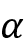

# 二十、高级卷积神经网络

在本章中，我们将看到**卷积神经网络**(**CNN**)的一些更高级的用途。我们将探索:

*   CNN 如何应用于计算机视觉、视频、文本文档、音频和音乐领域
*   如何使用 CNN 进行文本处理
*   什么是胶囊网络
*   计算机视觉

本章的所有代码文件都可以在 https://packt.link/dltfchp20 找到。

让我们从使用 CNN 完成复杂任务开始。

# 为复杂任务构建 CNN

我们已经在*第三章*、*卷积神经网络*中相当广泛地讨论了 CNN，在这一点上，你可能确信 CNN 架构对于图像分类任务的有效性。然而，您可能会发现令人惊讶的是，CNN 的基本架构可以以各种方式组合和扩展，以解决各种更复杂的任务。在本节中，我们将研究图 20.1 中*提到的计算机视觉任务，并展示如何通过将 CNN 转变为更大、更复杂的架构来解决这些任务。*


图 20.1:不同的计算机视觉任务-来源:人工智能和计算机视觉革命简介(https://www . slide share . net/darian _ f/人工智能和计算机视觉革命简介)

## 分类和本地化

在分类和定位任务中，不仅要报告在图像中发现的对象的类别，还要报告对象在图像中出现的边界框的坐标。这种类型的任务假设图像中只有一个对象实例。

这可以通过在典型的分类网络中除了“分类头”之外附加“回归头”来实现。回想一下，在分类网络中，卷积和汇集操作的最终输出(称为特征图)被输入到一个完全连接的网络中，该网络产生一个类别概率向量。这个完全连接的网络被称为分类头，它使用分类损失函数( *L* [c] )如分类交叉熵进行调整。

类似地，回归头是另一个完全连接的网络，它采用特征图并产生一个向量( *x* 、 *y* 、 *w* 、 *h* )，表示左上 *x* 和 *y* 坐标，以及边界框的宽度和高度。使用连续损失函数(*L*R)如均方误差对其进行调谐。使用两个损耗的线性组合来调谐整个网络，即，


这里，是一个超参数，可以取 0 到 1 之间的值。除非该值是由关于该问题的某个领域知识决定的，否则可以将其设置为 0.5。

*图 20.2* 显示了典型的分类和本地化网络架构:


图 20.2:图像分类和定位的网络架构

如你所见，与典型的 CNN 分类网络的唯一区别是在右上角增加了一个回归头。

## 语义分割

另一类基于基本分类思想的问题是“语义分割”这里的目的是将图像上的每一个像素分类为属于一个类。

实现的初始方法可以是为每个像素建立分类器网络，其中输入是每个像素周围的小邻域。在实践中，这种方法的性能不是很好，因此对这种实现的改进可能是通过卷积来运行图像，这将增加特征深度，同时保持图像的宽度和高度不变。然后，每个像素都有一个特征图，可以通过一个完全连接的网络发送，预测像素的类别。然而，在实践中，这也相当昂贵，并且通常不被使用。

第三种方法是使用 CNN 编码器-解码器网络，其中编码器减少图像的宽度和高度，但增加其深度(特征的数量)，而解码器使用转置卷积运算来增加其大小和减少其深度。转置卷积(或上采样)是与普通卷积方向相反的过程。这个网络的输入是图像，输出是分割图。这种编码器-解码器架构的一种流行实现是 U-Net(一种很好的实现可在 https://github.com/jakeret/tf_unet[获得)，最初是为生物医学图像分割开发的，它在编码器和解码器的相应层之间具有额外的跳跃连接。](https://github.com/jakeret/tf_unet)

*图 20.3* 显示了 U-Net 架构:


图 20.3: U-Net 架构

## 目标检测

目标检测任务类似于分类和定位任务。最大的不同是，现在图像中有多个对象，对于其中的每一个，我们需要找到类和边界框坐标。此外，事先既不知道物体的数量也不知道它们的大小。正如你所想象的，这是一个困难的问题，并且已经进行了大量的研究。

解决该问题的第一种方法可能是创建输入图像的许多随机裁剪，并对每个裁剪应用我们前面描述的分类和定位网络。然而，这种方法在计算方面非常浪费，并且不太可能非常成功。

更实际的方法是使用诸如选择性搜索(*Uijlings 等人的用于对象识别的选择性搜索*，[http://www . huppelen . nl/publications/Selective Search draft . pdf](http://www.huppelen.nl/publications/selectiveSearchDraft.pdf))之类的工具，其使用传统的计算机视觉技术来寻找图像中可能包含对象的区域。这些区域被称为“区域提议”，检测它们的网络被称为基于**区域的 CNN** ，或 **R-CNN** 。在原始的 R-CNN 中，区域被调整大小并输入网络以产生图像向量。然后这些向量用基于 SVM 的分类器进行分类(见[https://en.wikipedia.org/wiki/Support-vector_machine](https://en.wikipedia.org/wiki/Support-vector_machine)),外部工具提出的边界框使用图像向量上的线性回归网络进行校正。R-CNN 网络可以在概念上表示为如图*图 20.4* 所示:


图 20.4: R-CNN 网络

R-CNN 网络的下一代被称为快速 R-CNN。快速 R-CNN 仍然从外部工具获取其区域提议，但不是通过 CNN 馈送每个区域提议，而是通过 CNN 馈送整个图像，并将区域提议投影到结果特征地图上。每个感兴趣区域通过**感兴趣区域** ( **ROI** )汇集层被馈送到一个完全连接的网络，该网络为 ROI 产生一个特征向量。

ROI 合并是在使用 CNN 的对象检测任务中广泛使用的操作。ROI pooling 层使用 max pooling 将任何有效感兴趣区域内的要素转换为一个小的要素地图，该地图具有固定的空间范围 *H* x *W* (其中 *H* 和 *W* 是两个超参数)。然后将特征向量送入两个完全连接的网络，一个用于预测 ROI 的类别，另一个用于校正提议的边界框坐标。这在*图 20.5* 中有所说明:


图 20.5:快速 R-CNN 网络架构

快速的 R-CNN 比 R-CNN 快大约 25 倍。下一个改进称为更快的 R-CNN(一个实现在[https://github . com/tensor pack/tensor pack/tree/master/examples/fasterr CNN](https://github.com/tensorpack/tensorpack/tree/master/examples/FasterRCNN))，它移除了外部区域提议机制，并在网络本身内用一个可训练的组件来代替，该组件称为**区域提议网络** ( **RPN** )。这个网络的输出与特征图结合，通过类似的管道传入快速 R-CNN 网络，如图*图 20.6* 所示。

更快的 R-CNN 网络比快速 R-CNN 网络快大约 10 倍，比 R-CNN 网络快大约 250 倍:


图 20.6:更快的 R-CNN 网络架构

另一类稍微不同的对象检测网络是**单次检测器** ( **SSD** )，例如 **YOLO** ( **你只看一次**)。在这些情况下，使用网格将每个图像分割成预定义的个部分。在 YOLO 的情况下，使用 7×7 的网格，产生 49 个子图像。具有不同纵横比的一组预定的裁剪应用于每个子图像。给定 *B* 边界框和 *C* 对象类，每个图像的输出是一个大小为的向量。每个边界框都有一个置信度和坐标( *x* 、 *y* 、 *w* 、 *h* )，每个网格都有在其中检测到的不同对象的预测概率。

YOLO 电视网是 CNN，它完成了这一转变。最终的预测和边界框是通过聚集来自这个向量的发现而找到的。在 YOLO，单个卷积网络预测边界框和相关的类别概率。YOLO 是用于物体检测的更快解决方案。一个实现在[https://www . ka ggle . com/arucho mu/yolo-v3-object-detection-in-tensor flow](https://www.kaggle.com/aruchomu/yolo-v3-object-detection-in-tensorflow)。

## 实例分割

实例分割类似于语义分割——将图像的每个像素与类别标签相关联的过程——有一些重要的区别。首先，它需要区分图像中同一类的不同实例。第二，不需要标记图像中的每个像素。在某些方面，实例分割也类似于对象检测，除了不是边界框，而是我们想要找到覆盖每个对象的二进制掩码。

第二个定义引出了 Mask R-CNN 网络背后的直觉。掩模 R-CNN 是一种更快的 R-CNN，在其回归头之前具有额外的 CNN，其将每个 ROI 报告的边界框坐标作为输入，并将其转换为二进制掩模[11]:


图 20.7:屏蔽 R-CNN 架构

2019 年 4 月，谷歌开源发布了 Mask R-CNN，用 TPUs 进行了预训练。这可从以下网址获得

[https://colab . research . Google . com/github/tensor flow/TPU/blob/master/models/official/mask _ rcnn/mask _ rcnn _ demo . ipynb](https://colab.research.google.com/github/tensorflow/tpu/blob/master/models/official/mask_rcnn/mask_rcnn_demo.ipynb)。

建议玩玩 Colab 笔记本，看看结果如何。在*图 20.8* 中，我们看到一个图像分割的例子:


图 20.8:图像分割的一个例子

谷歌还发布了另一个在 TPUs 上训练的模型，名为 DeepLab，你可以从演示中看到一个图像(*图 20.9* )。这可从以下网址获得

[https://colab . research . Google . com/github/tensor flow/models/blob/master/research/deep lab/deep lab _ demo . ipynb # scroll to = edGukUHXyymr](https://colab.research.google.com/github/tensorflow/models/blob/master/research/deeplab/deeplab_demo.ipynb#scrollTo=edGukUHXyymr):


图 20.9:图像分割的一个例子

在本节中，我们已经在较高的层次上介绍了计算机视觉中流行的各种网络架构。请注意，它们都是由相同的基本 CNN 和全连接架构组成的。这种可组合性是深度学习最强大的特性之一。希望这已经给了你一些可以适应你自己的计算机视觉用例的网络的想法。

# 带有 tf 的应用动物园。Keras 和 TensorFlow 中心

迁移学习的好处之一是可以重用预先训练好的网络来节省时间和资源。有许多现成的网络集合，但下面两个是最常用的。

## Keras 应用

Keras 应用(Keras 应用可从[https://www . tensor flow . org/API _ docs/python/TF/Keras/Applications](https://www.tensorflow.org/api_docs/python/tf/keras/applications)获得)包括用于图像分类的模型，其权重在 ImageNet 上训练(Xception、VGG16、VGG19、ResNet、ResNetV2、ResNeXt、InceptionV3、InceptionResNetV2、MobileNet、MobileNetV2、DenseNet 和 NASNet)。此外，还有一些来自社区的其他参考实现，用于对象检测和分割、序列学习、强化学习(参见*第 11 章*)和 GANs(参见*第 9 章*)。

## TensorFlow Hub

TensorFlow Hub(在[https://www.tensorflow.org/hub](https://www.tensorflow.org/hub)可用)是预训练模型的替代集合。TensorFlow Hub 包括文本分类、句子编码(见*第四章*)、图像分类、特征提取、用 GANs 生成图像、视频分类等模块。目前，谷歌和 DeepMind 都为 TensorFlow Hub 做出了贡献。

我们来看一个使用`TF.Hub`的例子。在这种情况下，我们有一个使用 MobileNetv2 的简单图像分类器:

```py
import matplotlib.pylab as plt

import tensorflow as tf

import tensorflow_hub as hub

import numpy as np

import PIL.Image as Image

classifier_url ="https://tfhub.dev/google/tf2-preview/mobilenet_v2/classification/2" #@param {type:"string"}

IMAGE_SHAPE = (224, 224)

# wrap the hub to work with tf.keras

classifier = tf.keras.Sequential([

    hub.KerasLayer(classifier_url, input_shape=IMAGE_SHAPE+(3,))

])

grace_hopper = tf.keras.utils.get_file('image.jpg','https://storage.googleapis.com/download.tensorflow.org/example_images/grace_hopper.jpg')

grace_hopper = Image.open(grace_hopper).resize(IMAGE_SHAPE)

grace_hopper = np.array(grace_hopper)/255.0

result = classifier.predict(grace_hopper[np.newaxis, ...])

predicted_class = np.argmax(result[0], axis=-1)

print (predicted_class) 
```

非常简单。只要记得使用`hub.KerasLayer()`来包装任何枢纽层。在本节中，我们讨论了如何使用 TensorFlow Hub。

接下来，我们将关注 CNN 的其他架构。

# 回答关于图像的问题(视觉问答)

关于神经网络的一个好处是不同的媒体类型可以组合在一起提供统一的解释。例如，**视觉问答** ( **VQA** )结合了图像识别和文本自然语言处理。训练可以使用 VQA(https://visualqa.org/[有 VQA)，这是一个包含关于图像的开放式问题的数据集。这些问题需要对视觉、语言、常识的理解才能回答。以下图片摘自在](https://visualqa.org/)[https://visualqa.org/](https://visualqa.org/)举行的演示。

请注意图片顶部的问题，以及随后的答案:


图 20.10:视觉问答的例子

如果你想开始和 VQA 玩，第一件事就是获得合适的训练数据集，比如 VQA 数据集、 CLEVR 数据集(在 https://cs.stanford.edu/people/jcjohns/clevr/的[可用)，或者](https://cs.stanford.edu/people/jcjohns/clevr/) FigureQA 数据集(在 https://datasets.maluuba.com/FigureQA[的](https://datasets.maluuba.com/FigureQA)可用)；或者，你可以参加卡格尔 VQA 挑战赛(在[https://www.kaggle.com/c/visual-question-answering](https://www.kaggle.com/c/visual-question-answering)有售)。然后你可以建立一个 CNN 和 RNN 相结合的模型并开始实验。例如，CNN 可以是这样的代码片段，它将一个具有三个通道(224 x 224)的图像作为输入，并为该图像生成一个特征向量:

```py
import tensorflow as tf

from tensorflow.keras import layers, models

# IMAGE

#

# Define CNN for visual processing

cnn_model = models.Sequential()

cnn_model.add(layers.Conv2D(64, (3, 3), activation='relu', padding='same', 

        input_shape=(224, 224, 3)))

cnn_model.add(layers.Conv2D(64, (3, 3), activation='relu'))

cnn_model.add(layers.MaxPooling2D(2, 2))

cnn_model.add(layers.Conv2D(128, (3, 3), activation='relu', padding='same'))

cnn_model.add(layers.Conv2D(128, (3, 3), activation='relu'))

cnn_model.add(layers.MaxPooling2D(2, 2))

cnn_model.add(layers.Conv2D(256, (3, 3), activation='relu', padding='same'))

cnn_model.add(layers.Conv2D(256, (3, 3), activation='relu'))

cnn_model.add(layers.Conv2D(256, (3, 3), activation='relu'))

cnn_model.add(layers.MaxPooling2D(2, 2))

cnn_model.add(layers.Flatten())

cnn_model.summary()

#define the visual_model with proper input

image_input = layers.Input(shape=(224, 224, 3))

visual_model = cnn_model(image_input) 
```

文本可以用 RNN 编码；现在，把它想象成一个黑盒，它接受输入的文本片段(问题)并为文本生成一个特征向量:

```py
# TEXT

#

#define the RNN model for text processing

question_input = layers.Input(shape=(100,), dtype='int32')

emdedding = layers.Embedding(input_dim=10000, output_dim=256, 

    input_length=100)(question_input)

encoded_question = layers.LSTM(256)(emdedding) 
```

然后，两个特征向量(一个用于图像，一个用于文本)被组合成一个联合向量，该联合向量作为输入被提供给密集网络以产生组合网络:

```py
# combine the encoded question and visual model

merged = layers.concatenate([encoded_question, visual_model])

#attach a dense network at the end

output = layers.Dense(1000, activation='softmax')(merged)

#get the combined model

vqa_model = models.Model(inputs=[image_input, question_input], outputs=output)

vqa_model.summary() 
```

例如，如果我们有一组带标签的图像，那么我们可以学习描述图像的最佳问题和答案。选择的数量是巨大的！如果你想了解更多，我建议你调查 Maluuba，一家提供 FigureQA 数据集的初创公司，该数据集在训练集中有 100，000 幅人物图像和 1，327，368 个问答对。Maluuba 最近被微软收购，该实验室由深度学习之父 Yoshua Bengio 担任顾问。

在这一节中，我们讨论了如何实现视觉问答。下一节是关于风格转移，这是一种用于训练神经网络以创建艺术的深度学习技术。

# 创建一个深梦网络

CNN 的另一个有趣的应用是 DeepDream，这是一个由 Google [8]创建的计算机视觉程序，它使用 CNN 来寻找和增强图像中的模式。结果就是一种梦幻般的致幻效果。与前面的例子类似，我们将使用一个预训练的网络来提取特征。然而，在这种情况下，我们希望“增强”图像中的模式，这意味着我们需要最大化一些功能。这告诉我们，我们需要使用梯度上升，而不是下降。首先，我们来看一个来自 Google gallery 的例子(可以在[https://colab . research . Google . com/github/tensor flow/docs/blob/master/site/en/tutorials/generative/deep dream . ipynb](https://colab.research.google.com/github/tensorflow/docs/blob/master/site/en/tutorials/generative/deepdream.ipynb)上找到)，在这个例子中，西雅图的经典景观“融入”了一些令人产生幻觉的梦境，比如鸟、卡片和奇怪的飞行物。

谷歌将 DeepDream 代码作为开源发布(可在[https://github.com/google/deepdream](https://github.com/google/deepdream)获得)，但我们将使用一个由随机森林制作的简化示例(可在[https://www.tensorflow.org/tutorials/generative/deepdream](https://www.tensorflow.org/tutorials/generative/deepdream)获得):


图 20.11:深梦西雅图

让我们从一些图像预处理开始:

```py
# Download an image and read it into a NumPy array, 

def download(url):

  name = url.split("/")[-1]

  image_path = tf.keras.utils.get_file(name, origin=url)

  img = image.load_img(image_path)

  return image.img_to_array(img)

# Scale pixels to between (-1.0 and 1.0)

def preprocess(img):

  return (img / 127.5) - 1

# Undo the preprocessing above

def deprocess(img):

  img = img.copy()

  img /= 2.

  img += 0.5

  img *= 255.

  return np.clip(img, 0, 255).astype('uint8')

# Display an image

def show(img):

  plt.figure(figsize=(12,12))

  plt.grid(False)

  plt.axis('off')

  plt.imshow(img)

# https://commons.wikimedia.org/wiki/File:Flickr_-_Nicholas_T_-_Big_Sky_(1).jpg

url = 'https://upload.wikimedia.org/wikipedia/commons/thumb/d/d0/Flickr_-_Nicholas_T_-_Big_Sky_%281%29.jpg/747px-Flickr_-_Nicholas_T_-_Big_Sky_%281%29.jpg'

img = preprocess(download(url))

show(deprocess(img)) 
```

现在让我们使用 Inception 预训练网络来提取特征。我们使用几层，目标是最大化它们的激活。功能 API 是我们的朋友:

```py
# We'll maximize the activations of these layers

names = ['mixed2', 'mixed3', 'mixed4', 'mixed5']

layers = [inception_v3.get_layer(name).output for name in names]

# Create our feature extraction model

feat_extraction_model = tf.keras.Model(inputs=inception_v3.input, outputs=layers)

def forward(img):

  # Create a batch

  img_batch = tf.expand_dims(img, axis=0)

  # Forward the image through Inception, extract activations

  # for the layers we selected above

  return feat_extraction_model(img_batch) 
```

损失函数是所考虑的所有活化层的平均值，由层本身的单元数归一化:

```py
def calc_loss(layer_activations):

  total_loss = 0

  for act in layer_activations:

    # In gradient ascent, we'll want to maximize this value

    # so our image increasingly "excites" the layer

    loss = tf.math.reduce_mean(act)

    # Normalize by the number of units in the layer

    loss /= np.prod(act.shape)

    total_loss += loss

  return total_loss 
```

现在让我们来跑梯度上升:

```py
img = tf.Variable(img)

steps = 400

for step in range(steps):

  with tf.GradientTape() as tape:

    activations = forward(img)

    loss = calc_loss(activations)

  gradients = tape.gradient(loss, img)

  # Normalize the gradients

  gradients /= gradients.numpy().std() + 1e-8 

  # Update our image by directly adding the gradients

  img.assign_add(gradients)

  if step % 50 == 0:

    clear_output()

    print ("Step %d, loss %f" % (step, loss))

    show(deprocess(img.numpy()))

    plt.show()

# Let's see the result

clear_output()

show(deprocess(img.numpy())) 
```

这将左边的图像转换为右边的迷幻图像:


图 20.12:深深梦见一片有云的绿色田野

# 检查网络了解到了什么

一项特别有趣的研究正在致力于理解神经网络究竟在学习什么，以便能够如此好地识别图像。这被称为神经网络的“可解释性”激活图谱是一种很有前途的新技术，旨在显示平均激活函数的特征可视化。这样，激活地图集产生了一个通过网络之眼看到的全球地图。让我们来看看在 https://distill.pub/2019/activation-atlas/的一个演示:


图 20.13:检查示例

在这幅图像中，用于视觉分类的概念 1 网络揭示了许多完全实现的特征，如电子设备、屏幕、宝丽来相机、建筑物、食物、动物耳朵、植物和水背景。请注意，格网单元标有它们最支持的分类。网格单元的大小也根据内平均的激活数量来确定。这种表示非常强大，因为它允许我们检查网络的不同层，以及激活功能如何响应输入而激活。

在本节中，我们已经看到了许多使用 CNN 处理图像的技术。接下来，我们将继续视频处理。

# 录像

在这一部分，我们将讨论如何在视频中使用 CNN 以及我们可以使用的不同技术。

## 用六种不同的方法对预训练网络的视频进行分类

对视频进行分类是一个活跃的研究领域，因为处理这种类型的媒体需要大量的数据。内存需求经常达到现代 GPU 的极限，可能需要在多台机器上进行分布式训练。研究人员目前正在探索不同的研究方向，从第一种方法到第六种方法的复杂程度越来越高，如下所述。让我们回顾一下:

*   **第一种方法**包括一次对一个视频帧进行分类，将它们中的每一个都视为用 2D CNN 处理的独立图像。这种方法简单地将视频分类问题简化为图像分类问题。每个视频帧“发出”一个分类输出，并且通过考虑每个帧更频繁选择的类别来对视频进行分类。
*   **第二种方法**包括创建一个单一的网络，其中 2D CNN 与 RNN 相结合(见*第 9 章*、*生成模型*)。其想法是 CNN 将考虑图像成分，而 RNN 将考虑每个视频的序列信息。这种类型的网络很难训练，因为需要优化的参数非常多。
*   **第三种方法**是使用 3D ConvNet，其中 3D con vnet 是在 3D 张量(时间、图像宽度和图像高度)上操作的 3D ConvNet 的扩展。这种方法是图像分类的另一种自然延伸。同样，3D 网络很难训练。
*   第四种方法基于一个聪明的想法:不直接使用 CNN 进行分类，它们可以用于存储视频中每一帧的离线特征。这个想法是，通过转移学习，特征提取可以变得非常有效，如前面的食谱所示。提取所有特征后，它们可以作为一组输入传递给 RNN，后者将学习多个帧的序列并发出最终的分类。
*   第五种方法是第四种方法的简单变体，其中最后一层是 MLP 而不是 RNN。在某些情况下，就计算要求而言，这种方法可能更简单且更便宜。
*   **第六种方法**是第四种方法的变体，其中特征提取阶段通过提取空间和视觉特征的 3D CNN 来实现。这些特征然后被传递到 RNN 或 MLP 中。

最佳方法的决定完全取决于您的具体应用，没有确定的答案。前三种方法通常在计算上更昂贵且不太聪明，而后三种方法不太昂贵，并且它们通常实现更好的性能。

到目前为止，我们已经探索了如何将 CNN 用于图像和视频应用。在下一节中，我们将在基于文本的上下文中应用这些思想。

# 文本文档

文字和图像有什么共同点？乍一看，非常少。然而，如果我们将一个句子或一个文档表示为一个矩阵，那么这个矩阵与每个单元都是一个像素的图像矩阵没有太大的不同。那么，下一个问题是，我们如何将一段文本表示为一个矩阵？

很简单:矩阵的每一行都是一个向量，代表文本的基本单位。当然，现在我们需要定义什么是基本单位。一个简单的选择就是说基本单位是一个字符。另一种选择是说一个基本单位是一个词；还有一种选择是将相似的单词聚合在一起，然后用一个代表符号来表示每个聚合(有时称为聚类或嵌入)。

注意，不管我们的基本单元采用什么样的具体选择，我们都需要有一个从基本单元到整数 id 的 1:1 映射，这样文本就可以被看作一个矩阵。例如，如果我们有一个 10 行文本的文档，每一行都是 100 维的嵌入，那么我们将用一个 10×100 的矩阵来表示我们的文本。在这个非常特殊的“图像”中，如果那个句子 *X* 包含嵌入，由位置 *Y* 表示，则“像素”被打开。您可能还会注意到，文本实际上并不是一个矩阵，而是一个向量，因为位于相邻文本行中的两个单词几乎没有共同点。事实上，与图像相比，这是一个主要的区别，在图像中，位于相邻列的两个像素可能具有某种程度的相关性。

现在你可能想知道:*我知道我们将文本表示为一个向量，但是这样做，我们失去了单词的位置。这个职位应该很重要吧？*事实证明，在许多实际应用中，知道一个句子是否包含特定的基本单元(字符、单词或集合)是非常有用的信息，即使我们不知道这个基本单元在句子中的确切位置。

例如，CNN 在**情感分析**方面取得了相当好的结果，我们需要了解一段文字是正面还是负面的情感；对于**垃圾邮件检测**，我们需要了解一段文字是有用信息还是垃圾邮件；和用于**主题分类**，在这里我们需要理解一段文本是关于什么的。然而，CNN 不太适合于**词类** ( **POS** )分析，这种分析的目标是理解每个单词的逻辑角色(例如，动词、副词、主语等等)。CNN 也不太适合**实体提取**，这里我们需要了解相关实体在句子中的位置。

事实上，对于最后两个用例，位置是非常有用的信息。1D 康文网与 2D 康文网非常相似。但是，前者对单个向量进行操作，而后者对矩阵进行操作。

## 使用 CNN 进行情感分析

让我们来看看代码。首先，我们用`tensorflow_datasets`加载数据集。在这种情况下，我们使用 IMDB，一个电影评论的集合:

```py
import tensorflow as tf

from tensorflow.keras import datasets, layers, models, preprocessing

import tensorflow_datasets as tfds

max_len = 200

n_words = 10000

dim_embedding = 256

EPOCHS = 20

BATCH_SIZE =500

def load_data():

    #load data

    (X_train, y_train), (X_test, y_test) = datasets.imdb.load_data(num_words=n_words)

    # Pad sequences with max_len

    X_train = preprocessing.sequence.pad_sequences(X_train, maxlen=max_len)

    X_test = preprocessing.sequence.pad_sequences(X_test, maxlen=max_len)

    return (X_train, y_train), (X_test, y_test) 
```

然后我们建立一个合适的 CNN 模型。我们使用嵌入(参见*第四章*、*词嵌入*)将文档中通常观察到的稀疏词汇映射到维度`dim_embedding`的密集特征空间。然后我们使用`Conv1D`，后面是一个`GlobalMaxPooling1D`用于平均，以及两个`Dense`层——最后一层只有一个神经元触发二元选择(正面或负面评论):

```py
def build_model():

    model = models.Sequential()

    #Input - Embedding Layer

    # the model will take as input an integer matrix of size (batch, input_length)

    # the model will output dimension (input_length, dim_embedding)

    # the largest integer in the input should be no larger

    # than n_words (vocabulary size).

    model.add(layers.Embedding(n_words,

        dim_embedding, input_length=max_len))

    model.add(layers.Dropout(0.3))

    model.add(layers.Conv1D(256, 3, padding='valid', 

        activation='relu'))

    #takes the maximum value of either feature vector from each of the n_words features

    model.add(layers.GlobalMaxPooling1D())

    model.add(layers.Dense(128, activation='relu'))

    model.add(layers.Dropout(0.5))

    model.add(layers.Dense(1, activation='sigmoid'))

    return model

(X_train, y_train), (X_test, y_test) = load_data()

model=build_model()

model.summary() 
```

该模型有超过 270 万个参数，总结如下:

```py
_________________________________________________________________

 Layer (type)                Output Shape              Param #   

=================================================================

 embedding (Embedding)       (None, 200, 256)          2560000   

 dropout (Dropout)           (None, 200, 256)          0         

 conv1d (Conv1D)             (None, 198, 256)          196864    

 global_max_pooling1d (Globa  (None, 256)              0         

 lMaxPooling1D)                                                  

 dense (Dense)               (None, 128)               32896     

 dropout_1 (Dropout)         (None, 128)               0         

 dense_1 (Dense)             (None, 1)                 129       

=================================================================

Total params: 2,789,889

Trainable params: 2,789,889

Non-trainable params: 0 
```

然后，我们用 Adam 优化器和二进制交叉熵损失编译并拟合模型:

```py
model.compile(optimizer = "adam", loss = "binary_crossentropy",

  metrics = ["accuracy"]

)

score = model.fit(X_train, y_train,

  epochs= EPOCHS,

  batch_size = BATCH_SIZE,

  validation_data = (X_test, y_test)

)

score = model.evaluate(X_test, y_test, batch_size=BATCH_SIZE)

print("\nTest score:", score[0])

print('Test accuracy:', score[1]) 
```

最终的准确率为 88.21%，表明成功使用 CNN 进行文本处理是可能的:

```py
Epoch 19/20

25000/25000 [==============================] - 135s 5ms/sample - loss: 7.5276e-04 - accuracy: 1.0000 - val_loss: 0.5753 - val_accuracy: 0.8818

Epoch 20/20

25000/25000 [==============================] - 129s 5ms/sample - loss: 6.7755e-04 - accuracy: 0.9999 - val_loss: 0.5802 - val_accuracy: 0.8821

25000/25000 [==============================] - 23s 916us/sample - loss: 0.5802 - accuracy: 0.8821

Test score: 0.5801781857013703

Test accuracy: 0.88212 
```

请注意，许多其他非图像应用也可以转换为图像并使用 CNN 进行分类(例如，参见[https://becoming human . ai/sound-classification-using-images-68d 4770 df 426](https://becominghuman.ai/sound-classification-using-images-68d4770df426))。

# 音频和音乐

我们使用 CNN 来获取图像、视频和文本。现在让我们来看看 CNN 的变体如何用于音频。

所以，你可能想知道为什么学习合成音频如此困难。嗯，我们听到的每个数字声音都是基于每秒 16，000 个样本(有时是 48K 或更多)，建立一个预测模型，让我们学会根据所有以前的样本来重现一个样本是一个非常困难的挑战。

## 扩张的 ConvNets、WaveNet 和 NSynth

WaveNet 是用于产生原始音频波形的深度生成模型。这项突破性的技术是由谷歌 deepmind 推出的(可在[https://deep mind . com/blog/wave net-a-generative-model-for-raw-audio/](https://deepmind.com/blog/wavenet-a-generative-model-for-raw-audio/)获得)，用于教计算机如何说话。结果确实令人印象深刻，在网上你可以找到合成声音的例子，计算机学习如何与马特·达蒙等名人的声音交谈。有实验表明，WaveNet 改进了当前最先进的**文本到语音** ( **TTS** )系统，将美国英语和中国普通话在人声方面的差异减少了 50%。用于比较的指标称为**平均意见得分** ( **MOS** )，一种主观的配对比较测试。在 MOS 测试中，在听完每个声音刺激后，受试者被要求按照从“差”(1)到“优秀”(5)的五分制对刺激的自然度进行评级。

更酷的是，DeepMind 展示了 WaveNet 也可以用来教计算机如何生成钢琴音乐等乐器的声音。

现在一些定义。TTS 系统通常分为两个不同的类别:串联式和参数式。

拼接 TTS 首先存储单个语音片段，然后在必须再现语音时重新组合。然而，这种方法不可扩展，因为可能仅再现记忆的语音片段，并且不可能再现新的说话者或不同类型的音频而不从头开始记忆片段。

参数化 TTS 是指创建一个模型来存储要合成的音频的所有特征。在 WaveNet 之前，使用参数化 TTS 生成的音频不如拼接 TTS 自然。WaveNet 通过直接模拟音频声音的产生，而不是像过去那样使用中间信号处理算法，实现了显著的改进。

原则上，WaveNet 可以被看作是一个 1D 卷积层的堆栈，步长为 1，没有池层。请注意，输入和输出在结构上具有相同的维度，因此 ConvNets 非常适合对音频声音等顺序数据进行建模。然而，已经表明，为了使输出神经元中的感受野达到大的尺寸，有必要使用大量的大滤波器或者过度增加网络深度。请记住，一个层中的神经元的感受野是前一层的横截面，神经元从该横截面提供输入。由于这个原因，纯 ConvNets 在学习如何合成音频方面并不那么有效。

WaveNet 背后的关键直觉是所谓的**扩张因果卷积**【5】(有时称为 **atrous 卷积**)，这仅仅意味着当应用卷积层的滤波器时，一些输入值被跳过。“阿特鲁”是法语表达“à trous”的“混血儿化”，意思是“有洞”所以一个黑暗的回旋是一个有洞的回旋。例如，在一个维度中，大小为 3、膨胀为 1 的过滤器 *w* 将计算以下总和:*w*【0】*x*【0】+*w*【1】*x*【2】+*w*【3】*x*【4】。

简而言之，在 D-扩张卷积中，通常步幅是 1，但是没有什么可以阻止你使用其他步幅。图 20.14 中的*给出了一个例子，增加的膨胀(孔)尺寸= 0，1，2:*


图 20.14:尺寸增大的扩张

由于这种引入*孔*的简单想法，可以用指数增长的滤波器堆叠多个扩张的卷积层，并在没有过度深的网络的情况下学习长距离输入依赖关系。

因此，WaveNet 是一个 ConvNet ,其中卷积层具有各种扩张因子，允许感受域随深度呈指数增长，因此有效地覆盖了数千个音频时间步长。

当我们训练时，输入是从人类扬声器中录制的声音。波形被量化到固定的整数范围。波网定义了仅访问当前和先前输入的初始卷积层。然后，是一个扩展的 ConvNet 层堆栈，仍然只访问当前和以前的输入。最后，有一系列结合先前结果的密集层，接着是用于分类输出的 softmax 激活函数。

在每一步，从网络预测一个值，并反馈到输入中。同时，计算下一步的新预测。损失函数是当前步骤的输出和下一步骤的输入之间的交叉熵。*图 20.15* 显示了 Aaron van den Oord【9】中介绍的 WaveNet 堆栈及其感受野的可视化。请注意，生成可能会很慢，因为波形必须以顺序方式合成，因为必须首先对*x*t 进行采样，以便获得，其中 *x* 是输入:


图 20.15: WaveNet 内部连接

在并行 WaveNet [10]中提出了一种并行执行采样的方法，它实现了三个数量级的加速。这使用了两个网络，一个是 WaveNet 教师网络，速度较慢，但确保了正确的结果，另一个是 WaveNet 学生网络，试图模仿教师的行为；这可以证明是不太准确，但速度更快。这种方法类似于用于 GANs 的方法(见*第九章*、*生成模型*)，但是学生不会试图愚弄老师，这在 GANs 中是很常见的。事实上，该模型不仅速度更快，而且保真度更高，能够以每秒 24，000 个样本的速度创建波形:


图 20.16:wave net 学生和教师示例

该模型已经在谷歌的生产中部署，目前正被用于向数百万用户实时提供谷歌助手查询。在 2018 年 5 月的年度 I/O 开发者大会上，宣布由于 WaveNet，新的谷歌助手语音可用。

目前有两种用于 TensorFlow 的波网模型实现。一个是 DeepMind 的 WaveNet 的原始实现，另一个叫做 Magenta NSynth。原版 WaveNet 版本在[https://github.com/ibab/tensorflow-wavenet](https://github.com/ibab/tensorflow-wavenet)有售。NSynth 是 Google Brain group 最近发布的 WaveNet 的演变，它不是因果关系，而是旨在查看输入块的整个上下文。洋红色在[https://magenta.tensorflow.org/nsynth](https://magenta.tensorflow.org/nsynth)有售。

神经网络确实很复杂，如下图所示，但出于介绍性讨论的目的，知道网络通过使用基于减少编码/解码阶段误差的方法来学习如何再现其输入就足够了:


图 20.17:洋红色内部架构

如果你有兴趣了解更多，我建议你看看在线的 Colab 笔记本，在那里你可以玩用 NSynth 生成的模型。NSynth Colab 可在[https://Colab . research . Google . com/notebooks/magenta/NSynth/NSynth . ipynb](https://colab.research.google.com/notebooks/magenta/nsynth/nsynth.ipynb)获得。

MuseNet 是 OpenAI 开发的一个非常新的令人印象深刻的酷音频生成工具。MuseNet 使用稀疏变压器来训练具有 24 个注意头的 72 层网络。音乐网在 https://openai.com/blog/musenet/的 T2 有售。在第六章的*中讨论的转换器非常擅长预测序列中的下一步——无论是文本、图像还是声音。*

在变压器中，每个输出元素都连接到每个输入元素，它们之间的权重是根据一个称为注意力的过程动态计算的。MuseNet 可以用 10 种不同的乐器创作长达 4 分钟的音乐作品，并可以结合乡村音乐、莫扎特音乐和披头士音乐的风格。例如，我用钢琴、鼓、吉他和贝斯翻拍了 Lady Gaga 风格的贝多芬的“Für Elise”。你可以点击 **Try MuseNet** 部分提供的链接亲自尝试一下:


图 20.18:使用 MuseNet 的一个例子

# 卷积运算概述

在这一节中，我们将总结不同的卷积运算。一个卷积层有 *I* 个输入信道并产生 *O* 个输出信道。 *I* x *O* x *K* 使用参数，其中 *K* 是内核中值的个数。

## 基本 CNN

让我们简单地提醒自己什么是 CNN。CNN 接收输入图像(二维)、文本(二维)或视频(三维),并对输入应用多个过滤器。每个过滤器就像一个手电筒滑过输入区域，被它照亮的区域被称为感受野。每个过滤器都是输入深度相同的张量(例如，如果图像的深度为 3，则过滤器的深度也必须为 3)。

当滤波器在输入图像周围滑动或卷积时，滤波器中的值会乘以输入值。然后将乘法结果汇总成一个值。对每个位置重复这个过程，产生一个激活图(也称为特征图)。当然，有可能使用多个过滤器，其中每个过滤器将充当特征标识符。例如，对于图像，过滤器可以识别边缘、颜色、线条和曲线。关键的直觉是将滤波器值视为权重，并通过反向传播在训练期间对其进行微调。

可以使用以下配置参数来配置卷积层:

*   **内核大小**:这是卷积的视图的字段。
*   **Stride** :这是我们遍历图像时内核的步长。
*   **填充**:定义如何处理样本的边界。

## 扩张卷积

膨胀卷积(或收缩卷积)引入了另一个配置参数:

*   **膨胀率**:这是内核中值之间的间距。

扩展卷积用于许多场合，包括用 WaveNet 进行音频处理。

## 转置卷积

转置卷积是一种与普通卷积方向相反的变换。例如，这可以用于将特征映射到更高维度的空间，或者用于构建卷积自编码器(参见*第 8 章*、*自编码器*)。考虑转置卷积的一种方法是，首先针对给定的输入形状计算普通 CNN 的输出形状。然后，我们用转置卷积反转输入和输出形状。TensorFlow 2.0 支持带有 conv 2d 转置层的转置卷积，例如，可在 GANs(参见*第 9 章*、*生成模型*)中用于生成图像。

## 可分卷积

可分离卷积旨在分多步分离内核。设卷积为 *y* = *conv* ( *x* ， *k* )其中 *y* 为输出， *x* 为输入， *k* 为内核。假设内核是可分的， *k* = *k* 1。 *k* 2 哪里。是点积——在这种情况下，我们可以通过对 *k* 1 和 *k* 2 进行两次一维卷积，而不是对 *k* 进行二维卷积，从而得到相同的结果。可分卷积经常用于节省计算资源。

## 深度方向卷积

让我们考虑一个有多个通道的图像。在正常的 2D 卷积中，滤波器与输入一样深，它允许我们混合通道以生成输出的每个元素。在深度方向卷积中，每个通道保持分离，滤波器被分成多个通道，每个卷积被单独应用，结果被一起堆叠到一个张量中。

## 深度方向可分卷积

这个卷积不应该与可分离卷积混淆。完成深度方向卷积后，执行一个额外的步骤:跨通道的 1x1 卷积。深度方向可分离的卷积用于 Xception。它们还用于 MobileNet，这是一种特别适用于移动和嵌入式视觉应用的模型，因为它降低了模型的大小和复杂性。

在这一节中，我们已经讨论了卷积的所有主要形式。下一部分将讨论胶囊网络，这是 2017 年推出的一种新的学习形式。

# 胶囊网络

胶囊网络(或 CapsNets)是最近出现的一种创新型深度学习网络。这项技术是在 2017 年 10 月底由萨拉·萨布尔、尼古拉斯·弗罗斯特和杰弗里·辛顿([https://arxiv.org/abs/1710.09829](https://arxiv.org/abs/1710.09829))【14】在一篇题为*胶囊之间的动态路由*的开创性论文中介绍的。Hinton 是深度学习之父，因此，整个深度学习社区都很兴奋地看到胶囊取得的进展。事实上，CapsNets 已经在 MNIST 分类上击败了最好的 CNN...嗯，印象深刻！！

## CNN 有什么问题？

在 CNN 中，每一层都以渐进的粒度级别“理解”一幅图像。正如我们在多个部分中讨论的那样，第一层最有可能识别直线或简单的曲线和边缘，而后续层将开始理解更复杂的形状，如矩形，直至复杂的形状，如人脸。

现在，用于 CNN 的一个关键操作是汇集。池化的目的是创建位置不变性，它在每个 CNN 层之后使用，以使任何问题在计算上都易于处理。然而，池引入了一个严重的问题，因为它迫使我们丢失所有的位置数据。这可不好。想想一张脸:它由两只眼睛、一张嘴和一个鼻子组成，重要的是这些部分之间存在空间关系(例如，嘴在鼻子下面，通常在眼睛下面)。事实上，Hinton 说:*卷积神经网络中使用的池操作是一个大错误，它如此有效的事实是一场灾难*。从技术上讲，我们不需要位置不变性，而是需要等方差。等方差是一个有趣的术语，用于表示我们希望了解图像中的旋转或比例变化，并且我们希望相应地调整网络。这样，图像中不同组件之间的空间定位不会丢失。

## 胶囊网络的新特点是什么？

根据 Hinton 等人的说法，我们的大脑有称为“胶囊”的模块，每个胶囊专门处理特定类型的信息。特别是，有些胶囊可以很好地“理解”位置的概念、大小的概念、方向的概念、变形的概念、纹理等等。除此之外，作者认为我们的大脑有特别有效的机制来动态地将每条信息路由到被认为最适合处理特定类型信息的胶囊。

因此，CNN 和 CapsNet 之间的主要区别是，在 CNN 中，我们不断添加层来创建一个深度网络，而在 caps net 中，我们将一个神经层嵌套在另一个神经层中。胶囊是一组向网络引入更多结构的神经元，它产生一个向量来表示图像中实体的存在。特别地，Hinton 使用活动向量的长度来表示实体存在的概率，并使用其方向来表示实例化参数。当多个预测一致时，更高级别的胶囊变得活跃。对于每个可能的双亲，胶囊产生一个额外的预测向量。

现在第二个创新出现了:我们将使用跨胶囊的动态路由，而不再使用简单的池概念。较低级别的胶囊更喜欢将其输出发送到较高级别的胶囊，对于较高级别的胶囊，活动向量具有大的标量积，预测来自较低级别的胶囊。具有最大标量预测矢量积的亲本增加了胶囊键。其他父母都减少了他们的联系。换句话说，这种想法是，如果一个较高级别的胶囊同意一个较低级别的胶囊，那么它将要求发送更多该类型的信息。如果没有达成一致，它将要求减少发送数量。这种协议方法的动态路由优于当前的机制，如最大池，根据 Hinton 的说法，路由最终是一种解析图像的方法。事实上，最大池忽略了除最大值之外的任何内容，而动态路由根据下层和上层之间的协议选择性地传播信息。

第三个区别是引入了新的非线性激活函数。CapsNet 没有像 CNN 那样为每个图层添加挤压功能，而是为一组嵌套的图层添加挤压功能。非线性激活函数在*等式 1* 中表示，它被称为挤压函数:


其中 v [j] 是胶囊 *j* 的矢量输出，s [j] 是其总输入。

此外，Hinton 和其他人表明，经过区分训练的多层胶囊系统在 MNIST 上实现了最先进的性能，并且在识别高度重叠的数字方面比卷积网络好得多。

基于论文*胶囊之间的动态路由*，一个简单的 CapsNet 架构如下:


图 20.19:CapsNet 示例

该架构是浅层的，只有两个卷积层和一个全连接层。Conv1 有 256 个 9 x 9 卷积内核，步长为 1，ReLU 激活。该层的作用是将像素强度转换为局部特征检测器的活动，然后将其用作 PrimaryCapsules 层的输入。PrimaryCapsules 是一个卷积胶囊层，有 32 个通道；每个主胶囊包含 8 个卷积单元，具有 9×9 的内核和 2 的步距。总的来说，PrimaryCapsules 有[32，6，6]个胶囊输出(每个输出是一个 8D 向量)，并且[6，6]网格中的每个胶囊彼此共享其权重。最后一层(DigitCaps)的每个数字类都有一个 16D 的炭精盒，每个炭精盒都接收来自下一层中所有其他炭精盒的输入。路由仅发生在两个连续的胶囊层之间(例如，PrimaryCapsules 和 DigitCaps)。

# 摘要

在这一章中，我们已经看到了 CNN 在不同领域的许多应用，从传统的图像处理和计算机视觉到足够近的视频处理、不太近的音频处理和文本处理。短短几年，CNN 掀起了机器学习的风暴。

如今，多模态处理并不少见，其中文本、图像、音频和视频被一起考虑以实现更好的性能，通常是通过将 CNN 与一系列其他技术(如 RNNs 和强化学习)结合在一起。当然，还有更多的问题需要考虑，CNN 最近已被应用于许多其他领域，如遗传推断[13]，这些领域至少初看起来与它们最初的设计范围相去甚远。

# 参考

1.  Yosinski，j .和 Clune，Y. B. J. *深度神经网络中的特征如何转移*。神经信息处理系统进展 27，第 3320-3328 页。
2.  Szegedy，c .，Vanhoucke，v .，Ioffe，s .，Shlens，j .，和 Wojna，Z. (2016 年)。*重新思考计算机视觉的初始架构*。2016 年 IEEE 计算机视觉和模式识别大会(CVPR)，第 2818–2826 页。
3.  Sandler，m .、Howard，a .、Zhmonginov，a .和 Chen，L. C. (2019)。 *MobileNetV2:反转残差和线性瓶颈*。谷歌公司。
4.  Krizhevsky，a .，Sutskever，I .，Hinton，g . e .(2012 年)。*深度卷积神经网络的 ImageNet 分类*。
5.  Huang g .，Liu z .，van der Maaten l .和 Weinberger，k . q .(2018 年 1 月 28 日)。*密集连接的卷积网络*。http://arxiv.org/abs/1608.06993
6.  f . chollet(2017)。*例外:深度可分卷积深度学习*。https://arxiv.org/abs/1610.02357
7.  L. A .的 Gatys、A. S .的 Ecker 和 m .的 Beth ge(2016 年)。*一种艺术风格的神经算法*。https://arxiv.org/abs/1508.06576
8.  Mordvintsev、c . Olah 和 m . Tyka(2015 年)。*deep dream——可视化神经网络的代码示例*。谷歌研究。
9.  van den Oord，a .，Dieleman，s .，Zen，h .，Simonyan，k .，Vinyals，o .，Graves，a .，Kalchbrenner，n .，Senior，a .，Kavukcuoglu，K. (2016)。 *WaveNet:原始音频的生成模型*。arXiv 预印本。
10.  van den Oord，a .，Li，y .，Babuschkin，I .，Simonyan，k .，Vinyals，o .，Kavukcuoglu，k .，van den Driessche，g .，Lockhart，e .，Cobo，L. C .，Stimberg，f .，n .，Grewe，d .，Noury，s .，Dieleman，s .，Elsen，e .，Kalchbrenner，n .，Zen，h .，Graves，a .，King，h .，Walters，t .，Belov，d .，和 Hassabis，d .(2000 年)*并行 WaveNet:快速高保真语音合成*。
11.  He，k .，Gkioxari，g .，Dollár，p .，和 Girshick，R. (2018 年)。*屏蔽 R-CNN* 。
12.  Chen，L-C .，Zhu，y .，Papandreou，g .，Schroff，f .，和 Adam，H. (2018 年)。*利用阿特鲁可分离卷积进行语义图像分割的编解码器*。
13.  Flagel、y . brand vain 和 d . r . Schrider(2018 年)。*卷积神经网络在群体遗传推断中的不合理有效性*。
14.  Sabour、n . Frosst 和 g . e . hint on(2017 年)。*轿厢间动态路由*【https://arxiv.org/abs/1710.09829 

# 加入我们书的不和谐空间

加入我们的 Discord 社区，结识志同道合的朋友，与 2000 多名会员一起学习:[https://packt.link/keras](https://packt.link/keras)

