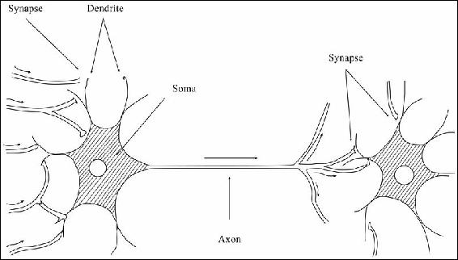
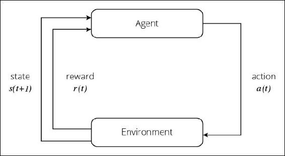
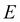
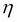
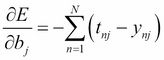

# 二、机器学习算法——为深度学习做准备

在前一章中，你通过回顾人工智能的历史，了解了深度学习是如何发展的。你应该注意到了，机器学习和深度学习是密不可分的。的确，你学到了深度学习是机器学习算法的发达方法。

在本章中，作为很好地理解深度学习的预练习，您将看到机器学习的模式细节，特别是，您将学习机器学习的方法的实际代码，这与深度学习密切相关。

在本章中，我们将讨论以下主题:

*   机器学习的核心概念
*   流行的机器学习算法的概述，尤其侧重于神经网络
*   与深度学习相关的机器学习算法的理论和实现:感知器、逻辑回归和多层感知器


# 开始使用

我们将从本章插入用 Java 实现机器学习和深度学习的源代码。代码中使用的 JDK 版本是 1.8，因此需要高于 8 的 Java 版本。此外，IntelliJ IDEA 14.1 用于 IDE。我们将使用来自[第 5 章](part0032_split_000.html#UGI01-39437f1d2f624cb5b197ebc27900db65 "Chapter 5. Exploring Java Deep Learning Libraries – DL4J, ND4J, and More")、*探索 Java 深度学习库的外部库——DL4J、ND4J 和更多*，所以我们从一个新的 Maven 项目开始。

本书所用代码的根包名为`DLWJ`，是用 Java 编写的*深度学习的首字母*，我们会根据需要在`DLWJ`下添加一个新的包或类。请参考下面的截图，它显示了新项目制作完成后的屏幕:


代码中会有一些不遵循 Java 编码标准的变量和方法的名称。这是为了提高你的理解以及公式中的一些字符，以增加可读性。请事先记住这一点。


# 对机器学习培训的需求

你已经看到机器学习是一种模式识别的方法。机器学习通过从给定的学习数据中识别和整理出模式来得出答案。当你只看句子时，它可能看起来很容易，但事实是，机器学习需要花相当长的时间来整理未知的数据，换句话说，建立适当的模型。这是为什么呢？整理一下就那么难吗？在两者之间有一个“学习”阶段会有什么麻烦吗？

答案当然是肯定的。恰当地整理数据极其困难。问题变得越复杂，就越不可能对数据进行完美分类。这是因为当你简单地说“模式分类器”时，几乎有无限的分类模式让我们看看下图中一个非常简单的例子:


有两种类型的数据，圆形和三角形，以及未知的数据，正方形。你不知道这个正方形在二维坐标空间中属于哪个群，那么任务就是找出这个正方形属于哪个群。

您可能会立即意识到似乎有一条分界线将两种数据类型分开。如果你决定在哪里设置这个边界，看起来你应该能够找出这个正方形属于哪个组。那么，让我们决定边界。然而，在现实中，明确界定这一界限并不那么容易。如果要设置边界，需要考虑各种线，如下图所示:


此外，根据边界的位置，您可以看到正方形可能被分配给不同的组或图案。此外，还可以考虑该边界可能是非线性边界。

在机器学习中，机器在训练中所做的是从这些可能的模式中选择最可能的边界。它会在处理一个又一个海量的训练数据时，自动学习如何整理模式。换句话说，它调整数学模型的参数，并最终决定边界。由机器学习决定的边界被称为**决定边界**，并且不一定是线性或非线性边界。如果决策边界对数据分类最好，那么它也可以是超平面。数据的分布越复杂，决策边界越有可能是非线性边界或超平面。一个典型的案例就是多维分类问题。我们仅仅在这个简单的问题中设定一个边界就已经面临这样的困难，因此不难想象，解决一个更复杂的问题将是非常耗时的。


# 监督和非监督学习

在前面的部分中，我们看到即使对于一个简单的分类问题，也可能有数百万个边界，但是很难说哪一个是最合适的。这是因为，即使我们可以在已知数据中正确地整理出模式，也不意味着未知数据也可以被归类到相同的模式中。但是，您可以增加正确模式分类的百分比。每种机器学习方法都设定了一个标准来执行更好的模式分类器，并决定最可能的边界-决策边界-以增加百分比。当然，这些标准在每种方法中都有很大的不同。在本节中，我们将了解我们可以采用的所有方法。

首先，机器学习可以大致分为**监督学习**和**非监督学习**。这两个类别的区别在于机器学习的数据集是标记数据还是未标记数据。通过监督学习，机器使用标记数据，即输入数据和输出数据的组合，并提到每种类型的数据将被分类为哪种模式。当给定一个机器未知的数据时，它会推导出可以应用什么模式，并根据标记的数据，即过去的正确答案，对数据进行分类。举个例子，在图像识别领域，当你将一些图像输入到机器中，如果你准备并提供一定数量的猫的图像，标记为`cat`，以及相同数量的人的图像，标记为`human`，供机器学习，它可以自行判断一个图像属于猫或人(或者都不属于)中的哪一组。当然，仅仅决定图像是猫还是人并不能真正提供实际用途，但如果你将同样的方法应用于其他领域，你可以创建一个系统，可以自动标记社交媒体上上传的照片中谁是谁。正如你现在看到的，在监督训练中，当机器获得人类预先准备的正确数据时，学习就会进行。

另一方面，通过无监督学习，机器使用未标记的数据。在这种情况下，只给出输入数据。然后，机器学习的是数据集包括和包含的模式和规则。无监督学习的目的是掌握数据的结构。它可以包括称为**聚类**的过程，该过程将具有共同特征的数据星座分类到每个组中，或者包括提取相关规则的过程。例如，假设有关于用户年龄、性别和在线购物网站购买趋势的数据。然后，你可能会发现 20 多岁的男人和 40 多岁的女人的品味很接近，你想利用这种趋势来改善你的产品营销。我们这里有一个著名的故事——从无监督训练中发现，大量的人同时购买啤酒和尿布。

你现在知道有监督的学习和无监督的学习之间有很大的区别，但这还不是全部。每种学习方法也分别有不同的学习方法和算法。下面我们来看一些有代表性的例子。


## 支持向量机(SVM)

你可以说 SVM 是机器学习中最受欢迎的监督训练方法。该方法仍然用于数据挖掘行业的广泛领域。利用 SVM，来自位于最接近其他类别的每个类别的数据被标记为标准，并且使用该标准来确定判定边界，使得来自每个标记的数据和边界的欧几里德距离的总和最大化。这个被标记的数据就是称为**的支持向量**。简而言之，SVM 将决策边界设置在中点，在这个点上与每个模式的距离最大化。因此， SVM 在其算法中所做的被称为**最大化余量**。以下是 SVM 的概念图:


如果你只听到这句话，你可能会想“是吗？”但让 SVM 最有价值的是一种数学技巧:内核技巧，或内核方法。这种技术将看起来不可能在原始维度上进行线性分类的数据，有意地映射到更高维度的空间，以便可以毫无困难地进行线性分类。请看下图，这样你就能理解内核技巧是如何工作的了:


我们有两种类型的数据，用圆形和三角形表示，很明显，在二维空间中不可能线性地分离这两种数据类型。但是，在上图中可以看到，通过对数据(严格来说是训练数据的特征向量)应用核函数，整个数据被转换到一个更高维的空间，也就是一个三维空间，并且可以用一个二维平面将它们分开。

虽然 SVM 既有用又优雅，但它也有一个缺点。由于它将数据映射到一个更高的维度，计算的数量通常会增加，因此随着计算变得更加复杂，它往往会花费更多的时间来处理。


## 隐马尔可夫模型(HMM)

HMM 是一种无监督的训练方法，假设数据遵循马尔可夫过程(T2)。马尔可夫过程是一个随机过程，其中未来条件完全由现值决定，与过去条件无关。当只有一个观察值可见时，HMM 用于预测该观察值来自哪个状态。

光靠前面的解释可能无法帮助你完全理解 HMM 是如何工作的，所以我们来看一个例子。HMM 通常用于分析碱基序列。你可能知道一个碱基序列由四个核苷酸组成，比如 A、T、G、C，序列实际上就是这些核苷酸的一串。仅仅通过字符串查看你不会得到任何东西，但是你必须分析哪个部分与哪个基因相关。假设任意一个碱基序列随机排列，那么当你把这个碱基序列的任意一部分切掉的时候，四个字符的每一个都要输出四分之一。

然而，如果存在某种规律性，例如，C 倾向于紧挨着 G，或者 ATT 的组合频繁出现，那么每个字符被输出的概率会相应地变化。这种规律性就是概率模型，如果被输出的概率只依赖于前一个碱基，你可以使用 HMM 从碱基序列(=观察)中找出遗传信息(=状态)。

除了这些生物信息领域之外的其他，HMM常用于需要时间序列模式的领域，如**自然语言处理** ( **NLP** )或声音信号处理的语法分析。这里不深入探讨 HMM，因为它的算法和深度学习的关联比较少，但是有兴趣可以参考麻省理工出版社的一本非常有名的书*统计自然语言处理基础*。


## 神经网络

神经网络与机器学习算法略有不同。虽然其他机器学习方法采用基于概率或统计的方法，但神经网络是模仿人脑结构的算法。人脑是由神经元网络构成的。请看下图以了解这一点:



一个神经元通过另一个神经元连接到网络，并从突触接受电刺激。当电流超过阈值时，它就会被点燃，并将电刺激传递给与网络相连的下一个神经元。神经网络根据电刺激的传输方式来区分事物。

神经网络最初是一种受监督的学习类型，它用数字来表示这种电刺激。最近，特别是随着深度学习，已经引入了各种类型的神经网络算法，其中一些是无监督学习。该算法通过在学习过程中调整网络的权重来提高预测能力。深度学习是一种基于神经网络的算法。关于神经网络的更多细节将在后面用实现来解释。


## 逻辑回归

Logistic 回归是具有伯努利分布的变量的统计回归模型之一。虽然 SVM 和神经网络是分类模型，逻辑回归是回归模型，但它肯定是监督学习方法之一。虽然逻辑回归有不同的思维基础，但事实上，当你看它的公式时，它可以被认为是神经网络之一。关于逻辑回归的细节也将在后面的实现中解释。

如你所见，每种机器学习方法都有独特的功能。根据您想要了解的内容或您想要使用数据的目的来选择正确的算法非常重要。深度学习也可以这么说。深度学习有不同的方法，所以不仅要考虑其中哪种方法最好，还要考虑有些情况下不应该使用深度学习。为每种情况选择最好的方法是很重要的。


## 强化学习

仅供你参考，还有一种机器学习的方法叫做**强化学习**。虽然有些人将强化学习归类为无监督学习，但其他人宣称，所有三种学习算法，监督学习、无监督学习和强化学习，应该分别划分为不同类型的算法。下图显示了强化学习的基本框架:



代理根据环境的状态采取行动，环境将根据该行动而改变。随着环境的变化，一种带有某种奖励的机制被提供给代理，代理学习更好的行为选择(决策)。


# 机器学习应用流程

我们已经了解了机器学习的方法以及这些方法如何识别模式。在本节中，我们将看到使用机器学习的数据挖掘采用或必须采用哪个流程。在每种机器学习方法中，决策边界是基于模型参数设置的，但我们不能说调整模型参数是我们唯一需要关心的事情。还有一个麻烦的问题，其实也是机器学习最薄弱的一点:特征工程。决定从原始数据(即分析主题)中创建哪些特征是制作适当分类器的必要步骤。这与调整模型参数一样，也需要大量的反复试验。在某些情况下，特征工程比确定参数需要更多的努力。

因此，当我们简单地说“机器学习”时，有一些任务需要提前完成，作为预处理，以建立一个合适的分类器来处理实际问题。一般来说，这些任务可以概括如下:

*   决定哪种机器学习方法适合某个问题
*   决定应该使用什么功能
*   决定哪个设置用于模型参数

只有完成了这些任务，机器学习才变得有应用价值。

那么，如何决定合适的特性和参数呢？如何让机器学习？让我们首先来看看下图，因为它可能更容易让你掌握机器学习的全貌。这是一个学习流程的总结:


从上图中可以看出，机器学习的学习阶段可以大致分为以下两步:

*   培养
*   测试

从字面上看，模型参数在训练阶段更新和调整，机器在测试阶段检查模型的优点。我们毫不怀疑，仅靠一次训练和一组测试，研究或实验很难成功。我们需要重复训练→测试、训练→测试……的过程，直到得到正确的模型。

让我们按顺序考虑前面的流程图。首先，您需要将原始数据分成两部分:一个训练数据集和一个测试数据集。这里需要非常小心的是，训练数据和测试数据是分开的。让我们举一个例子，这样你就可以很容易地想象这意味着什么:你正试图使用机器学习和历史价格数据来预测标准普尔 500 的每日价格。(事实上，使用机器学习预测金融工具的价格是最活跃的研究领域之一。)

假设您有 2001 年到 2015 年的历史股票价格数据作为原始数据，如果您使用 2001 年到 2015 年的所有数据进行训练，并对同一时期进行类似的测试，会发生什么情况？可能出现的情况是，即使你使用简单的机器学习或特征工程，获得正确预测的概率也只有 70%，甚至更高，达到 80%或 90%。然后，你可能会想:*多么伟大的发现！市场其实就是这么简单！现在我可以成为亿万富翁了！*

但这将是短暂的欢欣鼓舞。现实并没有那么好。如果你真的用那个模型开始投资管理，你不会得到你期望的业绩，而且会感到困惑。如果你想一想，稍微注意一下，这是显而易见的。如果定型数据集和测试数据集相同，您可以使用已经知道答案的数据进行测试。因此，获得高精度是一个自然的结果，因为你已经使用正确的答案预测了正确的答案。但是这对于一个测试来说没有任何意义。如果您想要正确评估模型，请确保使用不同时间段的数据，例如，您应该使用 2001 年到 2010 年的数据用于训练数据集，使用 2011 年到 2015 年的数据用于测试。在这种情况下，您使用您不知道答案的数据来执行测试，因此您可以获得适当的预测准确率。现在你可以避免走向破产，相信那些永远不会顺利的投资。

因此，很明显，您应该将训练数据集和测试数据集分开，但您可能不认为这是一个大问题。但是，在数据挖掘的实际场景中，经常会出现我们在没有这种意识的情况下对相同的数据进行实验的情况，所以请格外小心。我们已经在机器学习的情况下讨论过这一点，但它也适用于深度学习。

如果将整个数据集分成两个数据集，第一个使用的数据集是训练数据集。为了获得更高的准确率，我们首先需要考虑在训练数据集中创建要素。这种特征工程部分依赖于人的经验或直觉。在您选择功能以获得最佳结果之前，可能需要花费很长时间和大量精力。此外，每种机器学习方法都有不同类型的要接受的特征数据格式，因为模型和公式的理论对于每种方法都是唯一的。举个例子，我们有一个只能取整数的模型，一个只能取非负数/值的模型，一个只能取从 0 到 1 的实数的模型。让我们回头看看前面的股票价格的例子。由于价格的值在较宽的范围内变化很大，因此可能很难用只能取整数的模型进行预测。

此外，我们必须小心确保数据和模型之间的兼容性。我们没有说我们不能使用一个可以从 0 开始取所有实数的模型，如果你想使用股票价格作为特征。例如，如果您将某个时间段内的所有股票价格数据除以最大值，数据范围可以为 0-1，因此您可以使用只能取 0 到 1 之间的实数的模型。因此，如果稍微改变数据格式，就有可能应用模型。当你考虑特征工程时，你需要记住这一点。一旦你创建了特征并决定应用哪种机器学习方法，那么你只需要检查它。

在机器学习中，当决定模型的精度时，特征当然是重要的变量；然而，模型本身，换句话说，算法中的公式，也有参数。调整学习速度或调整允许的错误数量就是很好的例子。学习速度越快，完成计算所需的时间就越少，因此越快越好。然而，使学习速度更快意味着它只提供简单的解决方案。因此，我们应该小心，不要失去我们预期的精确率。对于数据中混入噪声的情况，调整允许的误差范围是有效的。机器判断“这个数据怪不怪”的标准是由人类决定的。

当然，每种方法都有一套独特的参数。至于神经网络，其中一个参数应该有多少个神经元就是一个很好的例子。还有，当我们想到 SVM 的核技巧时，我们如何设置核函数也是要确定的参数之一。如你所见，机器学习需要定义的参数实在太多了，事先无法找出哪个参数最好。在我们如何预先定义模型参数方面，有一个研究领域是以参数的研究为重点的。

因此，我们需要测试许多参数组合，以检查哪个组合可以返回最佳精度。由于逐个测试每个组合需要花费大量的时间，所以标准的流程是在并发处理中用不同的参数组合测试多个模型，然后进行比较。通常情况下，应该在某种程度上设置的参数范围是确定的，所以并不是说在现实的时间框架内不能解决问题。

当可以获得良好精度的模型在训练数据集中准备好时，接下来是测试步骤。测试的大致流程是将相同的特征工程分别应用于训练数据集和相同的模型参数，然后验证精度。测试中没有特别难的步骤。计算也不花时间。这是因为从数据中寻找模式，换句话说，优化公式中的参数，会产生计算成本。但是，一旦完成了参数调整，就会立即进行计算，因为它只将公式应用于新的数据集。简单地说，执行测试的原因是为了检查模型是否被训练数据集过度优化。这是什么意思？嗯，在机器学习中，有两种模式，训练集很好，但测试集不好。

第一种情况是通过对混合到训练数据集中的噪声数据进行分类的不正确优化。这可能与本章前面提到的允许误差范围的调整有关。世界上的数据通常是不干净的。可以说，几乎没有数据可以恰当地归类为干净的模式。股票价格的预测又是一个很好的例子。股价通常会重复以前股价的温和波动，但有时会突然飙升或大幅下跌。并且，在这种不规则的运动中没有，或者说应该没有规则性。另一种情况是，如果你想预测一个国家的农作物产量；受异常天气影响的年份的数据应该与正常年份的数据有很大不同。这些例子很极端，也很容易理解，但是现实世界中的大多数数据也包含噪声，这使得很难将数据分类成适当的模式。如果你只是做训练而没有调整机器学习的参数，模型会强制它把噪音数据分类成一个模式。在这种情况下，来自训练数据集的数据可能被正确分类，但是由于训练数据集中的噪声数据也被分类，并且噪声不存在于测试数据集中，因此测试中的可预测性应该很低。

第二种情况是通过对仅在训练数据集中具有特征的数据进行分类来进行不正确的优化。比如说，让我们考虑做一个英文语音输入的 app。要构建您的应用程序，您应该准备各种单词的发音数据作为训练数据集。现在，让我们假设您准备了足够的英国英语母语者的语音数据，并且能够创建一个高精度模型，该模型可以正确地对训练数据集中的发音进行分类。下一步是测试。既然是测试，那么对于提供不同数据的手段，就用美国英语母语者的语音数据吧。那么结果会是什么呢？你可能不会得到很好的精确度。此外，如果你尝试用这款应用来识别非英语母语者的发音，准确率会低得多。如你所知，英语在不同的地区有不同的发音。如果不考虑这一点，用英式英语的训练数据集来优化模型，即使你可能在训练集中得到一个好的结果，在测试集中也不会得到一个好的结果，对实际应用没有用处。

这两个问题的发生是因为机器学习模型从一个训练数据集学习，太适合数据集了。这个问题字面上叫做**过拟合问题**，你应该非常小心地避免它。机器学习的难点在于，除了特征工程，你还得思考如何避免这种过拟合问题。过拟合和特征工程这两个问题是部分相关的，因为不良的特征工程会导致过拟合。

为了避免过度拟合的问题，除了增加数据量或测试次数之外，没有什么可做的。一般来说，数据量是有限的，因此经常采用增加测试次数的方法。典型的例子是 **K 倍交叉验证**。在 K-fold 交叉验证中，所有数据在开始时被分成 K 个集合。然后，挑选其中一个数据集作为测试数据集，其余的 K-1 个数据集作为训练数据集。交叉验证对划分为 K 个的每个数据集执行 K 次验证，通过计算这 K 个结果的平均值来测量精度。最令人担心的是，一个训练数据集和一个测试数据集可能碰巧都有很好的精度；然而，这种事故的概率可以在 K 倍交叉验证中降低，因为它执行了几次测试。你永远也不会过分担心过度拟合，所以仔细验证结果是必要的。

现在，您已经通读了培训和测试集的流程，并了解了需要牢记的要点。这两个主要侧重于数据分析。所以，举个例子，如果你的目的是从你所拥有的数据中，把有意义的信息拉出来，好好利用，那么你就可以通过这个流程。另一方面，如果您需要一个能够处理进一步的新模型的应用程序，您需要一个额外的过程来使用在训练和测试集中获得的模型参数进行预测。例如，如果您想从股票价格数据集中找出一些信息，并分析和撰写市场报告，下一步将是执行训练和测试集。或者，如果您希望根据数据预测未来的股票价格，并将其用作投资系统，那么您的目的将是使用在训练和测试集中获得的模型构建一个应用程序，并根据您每天或从您设置的每个时间段重新获得的数据来预测价格。在第二种情况下，如果您想用新添加的数据更新模型，您需要小心地在下一个模型到达时完成模型构建的计算。


# 神经网络的理论和算法

在前面的部分，您看到了我们使用机器学习执行数据分析的一般流程。在本节中，介绍了作为机器学习方法之一的神经网络的理论和算法，作为走向深度学习的准备。

虽然我们简单的说“神经网络”，但是它的历史很长。第一个发表的神经网络算法被称为**感知器**，弗兰克·罗森布拉特(Frank Rosenblatt)在 1957 年发表的论文被命名为*感知器:一个感知和识别自动机(Project Para)* 。从那时起，许多方法被研究，开发和发布，现在神经网络是深度学习的元素之一。尽管我们简单地称之为“神经网络”，但它有各种类型，我们现在将按顺序来看看有代表性的方法。


## 感知器(单层神经网络)

感知器算法是在神经网络算法中具有最简单结构的模型，它可以对两个类别执行线性分类。我们可以说这是神经网络的原型。它是以最简单的方式模拟人类神经元的算法。

下图是通用模型的示意图:


这里，表示输入信号，表示对应于每个输入信号的权重，表示输出信号。是激活功能。字面上显示了计算来自输入的数据总和的含义。请记住预先将应用于特征工程的非线性转换的处理，即是工程化的特征。

然后，感知器的输出可以表示如下:


称为阶跃函数。如等式所示，感知器通过将特征向量的每个因子乘以权重，计算它们的总和，然后用阶跃函数激活总和，来返回输出。输出是感知器估计的结果。在训练过程中，你会将这个结果与正确的数据进行比较，并反馈误差。

设为标注数据的值。那么，该公式可以表示如下:


如果一些标注的数据属于第 1 类，，我们有。如果它属于 2 类，我们就有。此外，如果输入数据分类正确，我们会得到:


因此，将这些等式放在一起，我们得到以下正确分类数据的等式:


因此，您可以通过最小化以下函数来增加感知器的可预测性:


这里，称为误差函数。显示误分类的集合。为了最小化误差函数、梯度下降或最速下降，使用优化算法来使用梯度下降找到函数的局部最小值。该等式可以描述如下:


这里，是学习率，是调整学习速度的优化算法的常用参数，表示算法的步数。一般来说，学习率的值越小，算法越有可能陷入局部最小值，因为模型不能覆盖旧值太多。然而，如果值太大，模型参数不能收敛，因为值波动太大。因此，实际上，学习率在开始时设置得很大，然后随着每次迭代而减小。另一方面，对于感知器，证明了当数据集是线性可分的时，不管学习率的值如何，算法都收敛，因此该值被设置为 1。

现在，让我们看一个实现。包的结构如下:


让看一下`Perceptrons.java`的内容，就像上图中的一样。我们将逐一研究主要的方法。

首先，我们定义学习所需的参数和常数。如前所述，学习率(在代码中定义为`learningRate`)可以是 1:

```
final int train_N = 1000;  // number of training data
final int test_N = 200;   // number of test data
final int nIn = 2;        // dimensions of input data

double[][] train_X = new double[train_N][nIn];  // input data for training
int[] train_T = new int[train_N];               // output data (label) for training

double[][] test_X = new double[test_N][nIn];  // input data for test
int[] test_T = new int[test_N];               // label of inputs
int[] predicted_T = new int[test_N];          // output data predicted by the model

final int epochs = 2000;   // maximum training epochs
final double learningRate = 1.;  // learning rate can be 1 in perceptrons
```

不用说，机器学习和深度学习都需要一个数据集来学习和分类。在这里，由于我们希望将重点放在与感知器理论密切相关的实现上，所以在源代码中生成了一个样本数据集，用于训练和测试集，定义了名为`GaussianDistribution`的类，它返回一个遵循正态分布或高斯分布的值。至于源代码本身，我们这里就不提了，因为你可以在`GaussianDistribution.java`里看到。我们在`nIn = 2`中设置学习数据的维度，定义两种类型的实例如下:

```
GaussianDistribution g1 = new GaussianDistribution(-2.0, 1.0, rng);
GaussianDistribution g2 = new GaussianDistribution(2.0, 1.0, rng);
```

您可以通过`g1.random()`得到平均值为`-2.0`，方差为`1.0`，平均值为`2.0`，方差为`1.0`的正态分布值。

利用这些值，在`[ g1.random(), g2.random() ]`获得的类 1 中生成 500 个数据属性，在`[ g2.random(), g1.random() ]`获得的类 2 中生成另外 500 个数据属性。另外，请记住 1 级标签的每个值是`1`，2 级标签的每个值是`-1`。几乎所有的数据都是等级 1 的`[-2.0, 2.0]`和等级 2 的`[2.0, -2.0]`附近的值；因此，它们可以线性分离，但一些数据可能会作为噪声混合在另一类数据附近。

现在我们已经准备好了数据，我们可以继续构建模型了。输入层中的单元数`nIn`，是这里用来决定模型轮廓的参数:

```
Perceptrons classifier = new Perceptrons(nIn);

```

让我们看看实际的`Perceptrons`构造函数。感知器模型的参数仅仅是网络的权重`w`，非常简单，如下所示:

```
public Perceptrons(int nIn) {

   this.nIn = nIn;
   w = new double[nIn];

}
```

下一步终于是训练了。学习的迭代继续进行，直到它预先达到足够数量的学习集或者正确地分类所有的训练数据:

```
while (true) {
   int classified_ = 0;

   for (int i=0; i < train_N; i++) {
       classified_ += classifier.train(train_X[i], train_T[i], learningRate);
   }

   if (classified_ == train_N) break;  // when all data classified correctly

   epoch++;
   if (epoch > epochs) break;
}
```

在`train`方法中，你可以写下我们刚刚解释的梯度下降算法。这里，网络的`w`参数被更新:

```
public int train(double[] x, int t, double learningRate) {

   int classified = 0;
   double c = 0.;

   // check whether the data is classified correctly
   for (int i = 0; i < nIn; i++) {
       c += w[i] * x[i] * t;
   }

   // apply gradient descent method if the data is wrongly classified
   if (c > 0) {
       classified = 1;
   } else {
       for (int i = 0; i < nIn; i++) {
           w[i] += learningRate * x[i] * t;
       }
   }

   return classified;
}
```

一旦你完成了足够数量的学习，下一步就是进行测试。首先，让我们在训练有素的模型中检查测试数据是按哪个类分类的:

```
for (int i = 0; i < test_N; i++) {
   predicted_T[i] = classifier.predict(test_X[i]);
}
```

在`predict`方法中，只需通过网络激活输入。这里使用的阶跃函数在`ActivationFunction.java`中定义:

```
public int predict (double[] x) {

   double preActivation = 0.;

   for (int i = 0; i < nIn; i++) {
       preActivation += w[i] * x[i];
   }

   return step(preActivation);
}
```

随后，我们使用测试数据评估模型。你可能需要更多的解释来执行这一部分。

通常，机器学习方法的性能由基于混淆矩阵的准确度、精确度和召回率的指标来衡量。混淆矩阵总结了矩阵中预测类和正确类的比较结果，如下表所示:

|   | 

p _ 预测

 | 

n _ 预测

 |
| --- | --- | --- |
| **p_actual** | 真阳性(TP) | 假阴性(FN) |
| **n _ 实际** | 假阳性 | 真阴性(TN) |

三个指标如下所示:


准确性显示所有数据中被正确分类的数据的比例，而精确度显示实际正确数据与预测为阳性的数据的比例，而回忆是预测为阳性的数据与实际阳性数据的比例。下面是这个的代码:

```
int[][] confusionMatrix = new int[2][2];
double accuracy = 0.;
double precision = 0.;
double recall = 0.;

for (int i = 0; i < test_N; i++) {

   if (predicted_T[i] > 0) {
       if (test_T[i] > 0) {
           accuracy += 1;
           precision += 1;
           recall += 1;
           confusionMatrix[0][0] += 1;
       } else {
           confusionMatrix[1][0] += 1;
       }
   } else {
       if (test_T[i] > 0) {
           confusionMatrix[0][1] += 1;
       } else {
           accuracy += 1;
           confusionMatrix[1][1] += 1;
       }
   }

}

accuracy /= test_N;
precision /= confusionMatrix[0][0] + confusionMatrix[1][0];
recall /= confusionMatrix[0][0] + confusionMatrix[0][1];

System.out.println("----------------------------");
System.out.println("Perceptrons model evaluation");
System.out.println("----------------------------");
System.out.printf("Accuracy:  %.1f %%\n", accuracy * 100);
System.out.printf("Precision: %.1f %%\n", precision * 100);
System.out.printf("Recall:    %.1f %%\n", recall * 100);
```

当你编译`Perceptron.java`并运行它，你可以得到 99.0%的准确率，98.0%的精度，100%的召回率。这意味着实际的阳性数据被正确地分类，但是有一些数据被错误地预测为阳性，而实际上却是阴性的。在这个源代码中，由于数据集是用于演示的，所以没有包括 K 重交叉验证。上例中的数据集是以编程方式生成的，几乎没有噪声数据。因此，准确度、精确度和召回率都很高，因为数据可以被很好地分类。然而，如上所述，你必须仔细看结果，尤其是当你有很大的结果时。


## 逻辑回归

逻辑回归是回归模型，正如你可以从的名字中假设的那样。但是当你看公式的时候，你会发现逻辑回归是一个线性分离模型，它概括了感知机。

逻辑回归可以看作是神经网络的一种。对于感知器，阶跃函数用于激活函数，但是在逻辑回归中，使用(逻辑)sigmoid 函数。sigmoid 函数的等式可以表示如下:


该函数的图形可以如下所示:


`sigmoid`函数将一个实数的任何值映射到一个从 0 到 1 的值。因此，逻辑回归的输出可以被视为每个类别的后验概率。这些方程可以用描述如下:


这些等式可以合并为:


这里，是正确的数据。您可能已经注意到，数据的范围不同于感知器的范围。

利用前面的等式，估计模型参数的最大似然的`likelihood`函数可以表示如下:


其中:


如您所见，不仅网络的权重，而且偏差也是需要优化的参数。

我们现在需要做的是最大化似然函数，但是计算起来令人担忧，因为函数有一个数学乘积。为了使计算更容易，我们取似然函数的对数。此外，我们替换符号，将对象转换为最小化负 log `likelihood`函数。因为对数是单调增加的，所以幅度相关性不会改变。该等式可以表示如下:


同时可以看到误差函数。这种类型的函数称为交叉熵误差函数。

类似于感知器，我们可以通过计算模型参数和的梯度来优化模型。梯度可以描述如下:


利用这些方程，我们可以如下更新模型参数:


理论上，我们使用刚刚提到的等式并实现它们没有问题。但是，正如您所看到的，您必须计算所有数据的总和来计算每次迭代的梯度。一旦数据集变大，这将极大地增加计算成本。

因此，通常应用另一种方法，即从数据集中部分拾取一些数据，通过仅计算拾取数据的总和来计算梯度，并更新参数。这个被称为**随机梯度下降** ( **SGD** )，因为它随机选择数据的一个子集。用于一次更新的数据集的这个子集被称为**小批量**。

### Tip

使用小批量的 SGD 有时被称为**小批量随机梯度下降** ( **MSGD** )。学会从数据集中随机选择一个数据的在线训练被称为 SGD，以区分两者。然而，在本书中，MSGD 和 SGD 都被称为 SGD，因为当 mini-batch 的大小为 1 时，两者变得相同。因为通过每个数据学习确实会增加计算成本，所以最好使用小批量。

在逻辑回归的实现方面，由于可以用下一节介绍的多类逻辑回归来涵盖，这里就不写代码了。可以参考本节多类 logistic 回归的代码。


## 多类逻辑回归

Logistic 回归也可以应用于多类分类。在两类分类中，激活函数是 sigmoid 函数，您可以通过评估从 0 到 1 移动的输出值来对数据进行分类。那么，当类别数为 K 时，我们如何对数据进行分类呢？还好，并不难。我们可以通过将输出方程更改为 K 维类成员概率向量来对多类数据进行分类，我们使用`softmax`函数来实现这一点，它是 sigmoid 函数的多元版本。每一类的后验概率可以表示如下:


这样，与两类情况一样，可以得到如下的似然函数和负对数似然函数:


这里，，。另外，是正确数据向量的第 k 个元素，对应于第 *n* *个*训练数据。如果一个输入数据属于类别 *k* ，的值为 1；否则该值为 0。

损失函数相对于模型参数、权重向量和偏差的梯度可以描述如下:



现在让我们浏览一下源代码，以便更好地理解这个理论。除了模型所需的变量之外，您还可以看到一些与小批量相关的变量:

```
int minibatchSize = 50;  //  number of data in each minibatch
int minibatch_N = train_N / minibatchSize; //  number of minibatches

double[][][] train_X_minibatch = new double[minibatch_N][minibatchSize][nIn];  // minibatches of training data
int[][][] train_T_minibatch = new int[minibatch_N][minibatchSize][nOut];       // minibatches of output data for training
```

以下代码是混洗训练数据的过程，因此每个小批量的数据将随机应用于 SGD:

```
List<Integer> minibatchIndex = new ArrayList<>();  // data index for minibatch to apply SGD
for (int i = 0; i < train_N; i++) minibatchIndex.add(i);
Collections.shuffle(minibatchIndex, rng);  // shuffle data index for SGD
```

由于我们可以看到多类分类问题，我们生成一个包含三个类的样本数据集。除了感知器中使用的平均值和方差之外，我们还使用了根据正态分布的数据集，其中训练数据和类别 3 的测试数据的平均值为`0.0`，方差为 1.0。换句话说，每一类的数据都服从正态分布，平均值为`[-2.0, 2.0]`、`[2.0, -1.0]`、`[0.0, 0.0]`，方差为`1.0`。对于标记数据，我们将训练数据定义为`int`类型，将测试数据定义为整数类型。这是为了在评估模型时更容易处理测试数据。此外，每个带标签的数据都被定义为一个数组，因为它遵循多类分类:

```
train_T[i] = new int[]{1, 0, 0};
test_T[i] = new Integer[]{1, 0, 0};
```

然后，我们使用前面定义的`minibatchIndex`将训练数据分类到一个小批量中:

```
for (int i = 0; i < minibatch_N; i++) {
   for (int j = 0; j < minibatchSize; j++) {
       train_X_minibatch[i][j] = train_X[minibatchIndex.get(i * minibatchSize + j)];
       train_T_minibatch[i][j] = train_T[minibatchIndex.get(i * minibatchSize + j)];
   }
}
```

现在我们已经准备好了数据，让我们实际构建一个模型:

```
LogisticRegression classifier = new LogisticRegression(nIn, nOut);
```

逻辑回归的模型参数是`W`、网络的权重和偏差`b`:

```
public LogisticRegression(int nIn, int nOut) {

   this.nIn = nIn;
   this.nOut = nOut;

   W = new double[nOut][nIn];
   b = new double[nOut];

}
```

每个小批量都要进行培训。如果您设置了`minibatchSize = 1`，您可以使培训成为所谓的在线培训:

```
for (int epoch = 0; epoch < epochs; epoch++) {
   for (int batch = 0; batch < minibatch_N; batch++) {
       classifier.train(train_X_minibatch[batch], train_T_minibatch[batch], minibatchSize, learningRate);
   }
   learningRate *= 0.95;
}
```

这里，学习率逐渐降低，以使模型能够收敛。现在对于实战训练`train`方法，可以简单分为两部分，如下:

1.  使用小批量数据计算`W`和`b`的梯度。
2.  用渐变更新`W`和`b`:

    ```
    // 1\. calculate gradient of W, b
    for (int n = 0; n < minibatchSize; n++) {

       double[] predicted_Y_ = output(X[n]);

       for (int j = 0; j < nOut; j++) {
           dY[n][j] = predicted_Y_[j] - T[n][j];

           for (int i = 0; i < nIn; i++) {
               grad_W[j][i] += dY[n][j] * X[n][i];
           }

           grad_b[j] += dY[n][j];
       }
    }

    // 2\. update params
    for (int j = 0; j < nOut; j++) {
       for (int i = 0; i < nIn; i++) {
           W[j][i] -= learningRate * grad_W[j][i] / minibatchSize;
       }
       b[j] -= learningRate * grad_b[j] / minibatchSize;
    }

    return dY;
    ```

在`train`方法的端`return dY`，返回预测数据和正确数据的误差值。这对于逻辑回归本身不是强制性的，但是对于机器学习和后面介绍的深度学习算法是必要的。

接下来的培训是测试。执行测试的过程实际上与感知机的过程没有什么不同。

首先，使用`predict`方法，让我们使用训练好的模型预测输入数据:

```
for (int i = 0; i < test_N; i++) {
   predicted_T[i] = classifier.predict(test_X[i]);
}
```

被调用的 `predict`方法和`output`方法编写如下:

```
public Integer[] predict(double[] x) {

   double[] y = output(x);  // activate input data through learned networks
   Integer[] t = new Integer[nOut]; // output is the probability, so cast it to label

   int argmax = -1;
   double max = 0.;

   for (int i = 0; i < nOut; i++) {
       if (max < y[i]) {
           max = y[i];
           argmax = i;
       }
   }

   for (int i = 0; i < nOut; i++) {
       if (i == argmax) {
           t[i] = 1;
       } else {
           t[i] = 0;
       }
   }

   return t;
}

public double[] output(double[] x) {

   double[] preActivation = new double[nOut];

   for (int j = 0; j < nOut; j++) {

       for (int i = 0; i < nIn; i++) {
           preActivation[j] += W[j][i] * x[i];
       }

       preActivation[j] += b[j];  // linear output
   }

   return softmax(preActivation, nOut);
}
```

首先，用`output`方法激活输入数据。从输出的底部可以看到，激活函数使用了`softmax`函数。`softmax`在`ActivationFunction.java`中定义，通过这个函数返回显示每个类别概率的数组，因此你只需要来获取数组中概率最高的元素的索引。索引代表预测的类别。

最后，我们来评价一下模型。同样，混淆矩阵是为模型评估而引入的，但要小心，因为这次您需要找到每个类的精度或召回率，因为我们这里有多类分类:

```
int[][] confusionMatrix = new int[patterns][patterns];
double accuracy = 0.;
double[] precision = new double[patterns];
double[] recall = new double[patterns];

for (int i = 0; i < test_N; i++) {
   int predicted_ = Arrays.asList(predicted_T[i]).indexOf(1);
   int actual_ = Arrays.asList(test_T[i]).indexOf(1);

   confusionMatrix[actual_][predicted_] += 1;
}

for (int i = 0; i < patterns; i++) {
   double col_ = 0.;
   double row_ = 0.;

   for (int j = 0; j < patterns; j++) {

       if (i == j) {
           accuracy += confusionMatrix[i][j];
           precision[i] += confusionMatrix[j][i];
           recall[i] += confusionMatrix[i][j];
       }

       col_ += confusionMatrix[j][i];
       row_ += confusionMatrix[i][j];
   }
   precision[i] /= col_;
   recall[i] /= row_;
}

accuracy /= test_N;

System.out.println("------------------------------------");
System.out.println("Logistic Regression model evaluation");
System.out.println("------------------------------------");
System.out.printf("Accuracy: %.1f %%\n", accuracy * 100);
System.out.println("Precision:");
for (int i = 0; i < patterns; i++) {
   System.out.printf(" class %d: %.1f %%\n", i+1, precision[i] * 100);
}
System.out.println("Recall:");
for (int i = 0; i < patterns; i++) {
   System.out.printf(" class %d: %.1f %%\n", i+1, recall[i] * 100);
```


## 多层感知器(多层神经网络)

单层神经网络有一个巨大的问题。感知器或逻辑回归对于可以线性分类的问题是有效的，但是它们根本不能解决非线性问题。例如，他们甚至不能解决最简单的异或问题，如图所示:


由于现实世界中的大多数问题都是非线性的，感知器和逻辑回归在实际应用中并不适用。因此，算法被改进以适应非线性问题。这些是多层感知器(或**多层神经网络**、 **MLPs** )。正如你从名字中看到的，通过在输入层和输出层之间增加另一层，称为隐藏的层，网络有能力表达各种模式。这是 MLP 的图形模型:


这里最重要的是不要引入跳层连接。在神经网络中，保持模型具有前馈网络结构对于理论和实现都是更好的。通过坚持这些规则，并通过增加隐藏层的数量，您可以近似任意函数，而不会使模型在数学上过于复杂。

现在，让我们看看如何计算输出。乍一看，它看起来很复杂，但它以相同的方式累积了层和网络的权重或激活方案，因此您只需组合每层的方程。每个输出可以显示如下:


这里，是隐含层的激活函数，是输出层。

如已经介绍的，在多类分类的情况下，可以通过使用`softmax`函数有效地计算输出层的激活函数，并且误差函数给出如下:


对于单层来说，只是在输入层反映这个误差就可以了，但是对于多层来说，除非你在隐层和输入层都反映这个误差，否则神经网络是无法整体学习的。

幸运的是，在前馈网络中，有一种称为`backpropagation`的算法，它使模型能够通过向前和向后跟踪网络来有效地传播这种误差。我们来看看这个算法的机制。为了使等式更具可读性，我们将考虑在线培训中误差函数的赋值，如下所示:


我们现在可以考虑这个的梯度。由于在实际应用的大多数情况下，一个数据集中的所有数据都是独立同分布的，所以按照我们刚才提到的定义它没有问题。

前馈网络中的每个单元被表示为连接到该单元的网络的权重之和，因此广义项可以表示如下:


要小心，因为这里的不仅仅是输入层的值(当然这也可以是输入层的值)。还有，是非线性激活函数。权重的梯度和偏差的梯度可以如下所示:


现在，让我们引入下一个等式中定义的符号:


然后，我们得到:


因此，当我们比较等式时，输出单位可以描述如下:


另外，隐藏层的每个单元是:


因此，引入了**反向传播公式**。因此，delta 被称为**反向传播**误差。通过计算`backpropagated`误差，可以计算权重和偏差。当你查看公式时，可能看起来很难，但它基本上做的是从一个连接的单元接收关于误差的反馈，并更新重量，所以这并不困难。

现在，让我们以一个简单的 XOR 问题为例来看一个实现。当你阅读源代码时，你会有更好的理解。包的结构如下:


算法的基本流程写在`MultiLayerPerceptrons.java`里，但是反向传播的实际部分写在`HiddenLayer.java`里。我们对输出层使用多类逻辑回归。由于`LogisticRegression.java`没有变化，因此本节不显示代码。在`ActivationFunction.java`中，添加了 sigmoid 函数和双曲正切的导数。双曲正切也是激活函数，常用作 sigmoid 的替代函数。另外，在`RandomGenerator.java`中，写了产生均匀分布的随机数的方法。这是随机初始化隐藏层的权重，这是相当重要的一部分，因为模型经常陷入局部最优，并且无法根据这些初始值对数据进行分类。

我们来看看`MultiLayerPerceptrons.java`的内容。在`MultiLayerPereptrons.java`中，为每一层分别定义不同的类:`HiddenLayer`类用于隐藏层，`LogisticRegression`类用于输出层。这些类的实例分别被定义为`hiddenLayer`和`logisticLayer`:

```
public MultiLayerPerceptrons(int nIn, int nHidden, int nOut, Random rng) {

   this.nIn = nIn;
   this.nHidden = nHidden;
   this.nOut = nOut;

   if (rng == null) rng = new Random(1234);
   this.rng = rng;

   // construct hidden layer with tanh as activation function
   hiddenLayer = new HiddenLayer(nIn, nHidden, null, null, rng, "tanh");  // sigmoid or tanh

   // construct output layer i.e. multi-class logistic layer
   logisticLayer = new LogisticRegression(nHidden, nOut);

}
```

MLP 的参数是隐含层`HiddenLayer`和输出层`LogisticRegression`的权重`W`和偏差`b`。由于输出层与前面介绍的相同，所以这里我们不看代码。`HiddenLayer`的建造者如下:

```
public HiddenLayer(int nIn, int nOut, double[][] W, double[] b, Random rng, String activation) {

   if (rng == null) rng = new Random(1234);  // seed random

   if (W == null) {

       W = new double[nOut][nIn];
       double w_ = 1\. / nIn;

       for(int j = 0; j < nOut; j++) {
           for(int i = 0; i < nIn; i++) {
               W[j][i] = uniform(-w_, w_, rng);  // initialize W with uniform distribution
           }
       }

   }

   if (b == null) b = new double[nOut];

   this.nIn = nIn;
   this.nOut = nOut;
   this.W = W;
   this.b = b;
   this.rng = rng;

   if (activation == "sigmoid" || activation == null) {

       this.activation = (double x) -> sigmoid(x);
       this.dactivation = (double x) -> dsigmoid(x);

   } else if (activation == "tanh") {

       this.activation = (double x) -> tanh(x);
       this.dactivation = (double x) -> dtanh(x);

   }  else {
       throw new IllegalArgumentException("activation function not supported");
   }

}
```

`W`被初始化，随机匹配单元的数量。这种初始化实际上很棘手，因为如果初始值分布不均匀，它会使您更经常地面临局部最小值问题。所以在实际场景中，经常会发生用一些随机种子来测试模型的情况。激活函数可应用于 sigmoid 函数或双曲正切函数。

MLP 的训练可以通过神经网络的前向传播和后向传播来给出，以便:

```
public void train(double[][] X, int T[][], int minibatchSize, double learningRate) {

   double[][] Z = new double[minibatchSize][nIn];  // outputs of hidden layer (= inputs of output layer)
   double[][] dY;

   // forward hidden layer
   for (int n = 0; n < minibatchSize; n++) {
       Z[n] = hiddenLayer.forward(X[n]);  // activate input units
   }

   // forward & backward output layer
   dY = logisticLayer.train(Z, T, minibatchSize, learningRate);

   // backward hidden layer (backpropagate)
   hiddenLayer.backward(X, Z, dY, logisticLayer.W, minibatchSize, learningRate);
}
```

`hiddenLayer.backward`的部分给出了来自逻辑回归的预测误差`dY`的隐藏层反向传播。小心，因为逻辑回归的输入数据对于反向传播也是必要的:

```
public double[][] backward(double[][] X, double[][] Z, double[][] dY, double[][] Wprev, int minibatchSize, double learningRate) {

   double[][] dZ = new double[minibatchSize][nOut];  // backpropagation error

   double[][] grad_W = new double[nOut][nIn];
   double[] grad_b = new double[nOut];

   // train with SGD
   // calculate backpropagation error to get gradient of W, b
   for (int n = 0; n < minibatchSize; n++) {

       for (int j = 0; j < nOut; j++) {

           for (int k = 0; k < dY[0].length; k++) {  // k < ( nOut of previous layer )
               dZ[n][j] += Wprev[k][j] * dY[n][k];
           }
           dZ[n][j] *= dactivation.apply(Z[n][j]);

           for (int i = 0; i < nIn; i++) {
               grad_W[j][i] += dZ[n][j] * X[n][i];
           }

           grad_b[j] += dZ[n][j];
       }
   }

   // update params
   for (int j = 0; j < nOut; j++) {
       for(int i = 0; i < nIn; i++) {
           W[j][i] -= learningRate * grad_W[j][i] / minibatchSize;
       }
       b[j] -= learningRate * grad_b[j] / minibatchSize;
   }

   return dZ;
}
```

你可能认为算法复杂且困难，因为论证似乎很复杂，但我们在这里所做的几乎与我们用逻辑回归的`train`方法所做的一样:我们用小批量的单位计算`W`和`b`的梯度，并更新模型参数。就是这样。那么，MLP 人能学会异或问题吗？运行`MultiLayerPerceptrons.java`检查结果。

结果仅输出模型的准确度、精确度和召回率的百分比，但是例如，如果您使用`LogisticRegression`的`predict`方法转储预测数据，您可以看到它实际预测了多少概率，如下所示:

```
double[] y = output(x);  // activate input data through learned networks
Integer[] t = new Integer[nOut]; // output is the probability, so cast it to label

System.out.println(  Arrays.toString(y) );
```

我们刚刚展示了 MLPs 可以近似 XOR 函数。此外，还证明了 MLPs 可以逼近任何函数。我们不遵循这里的数学细节，但你可以很容易地想象，MLP 的单元越多，它们可以表达和近似的函数就越复杂。


# 总结

在这一章中，作为深度学习的准备，我们深入研究了神经网络，这是机器学习的算法之一。您学习了单层神经网络的三种代表性算法:感知器、逻辑回归和多类逻辑回归。我们看到，单层神经网络无法解决非线性问题，但这个问题可以通过多层神经网络来解决，多层神经网络是指在输入层和输出层之间有一个隐藏层的网络。对 MLPs 为什么能解决非线性问题的直观理解是说，网络通过增加层数，增加单元数，可以学习更复杂的逻辑运算，从而具有表达更复杂函数的能力。让模型具备这种能力的关键是反向传播算法。通过将输出的误差反向传播到整个网络，模型被更新和调整以适应每次迭代的训练数据，并最终被优化以逼近数据的函数。

在下一章，你将学习深度学习的概念和算法。既然你现在已经获得了对机器学习算法的基础理解，那么你学习深度学习就没有困难了。