# 三、深度信念网和栈式去噪自编码器

从这一章到下一章，你将学习深度学习的算法。我们将一步一步地遵循基本的数学理论来完全理解每个算法。一旦你获得了深度学习的基本概念和理论，你就可以很容易地将它们应用到实际应用中。

在本章中，您将了解以下主题:

*   深度学习可能成为突破的原因
*   深度学习和过去的机器学习(神经网络)的区别
*   深度学习的典型算法、**深度信念网** ( **DBN** )、**栈式去噪自编码器** ( **SDA** )的理论和实现


# 神经网络沦陷

在上一章中，您学习了神经网络的典型算法，并看到非线性分类问题无法用感知器解决，但可以通过制作多层模型化神经网络来解决。换句话说，非线性问题可以通过在输入和输出层之间插入一个隐藏层来学习和解决。没有别的了；但是通过增加一层中神经元的数量，神经网络可以作为一个整体表达更多的模式。如果我们忽略时间成本或过拟合问题，理论上，神经网络可以逼近任何函数。

那么，我们可以这样想吗？如果我们增加隐藏层的数量——一遍又一遍地积累隐藏层——神经网络能解决任何复杂的问题吗？产生这种想法是很自然的。当然，这个想法已经被研究过了。然而，事实证明，这项试验并不顺利。仅仅积累层并没有使神经网络解决世界问题。相反，在预测时，有些情况比其他层数较少的情况准确性更低。

为什么会发生这些情况？层数多的神经网络有更多的表达并没有错。那么，问题出在哪里呢？嗯，是因为学习算法在前馈网络中具有的特性造成的。正如我们在前一章中看到的，反向传播算法用于通过多层神经网络将学习误差有效地传播到整个网络。在该算法中，误差在神经网络的每一层中被反转，并按顺序被一个接一个地传送到输入层。通过将输出层的误差反向传播到输入层，在每一层按顺序调整网络的权重，并优化网络的整体权重。

这就是问题发生的地方。如果网络的层数很少，从输出层反向传播的误差可能有助于很好地调整每层的权重。但是，一旦层数增加，每次反向传播层时，一个误差逐渐消失，并且不调整网络的权重。在靠近输入层的层上，根本不会反馈误差。

各层之间联系紧密的神经网络无法调整权重。因此，整个网络的权重不能被优化，当然，学习不能顺利进行。这个严重的问题被称为**消失梯度问题**，一直困扰着研究人员，这是神经网络很长一段时间以来一直存在的一个巨大问题，直到深度学习出现。神经网络算法在早期达到了极限。


# 神经网络的复仇

因为的消失梯度问题，神经网络在机器学习领域失去了人气。我们可以说，与逻辑回归和 SVM 等其他典型算法相比，神经网络在现实世界中用于数据挖掘的案例数量非常少。

但是后来深度学习出现了，打破了所有现有的惯例。如你所知，深度学习是神经网络积累层。换句话说，这是深度神经网络，它在某些领域产生惊人的可预测性。现在，谈到人工智能研究，毫不夸张地说，这是对深度神经网络的研究。肯定是神经网络的反击。如果是这样，为什么消失梯度问题在深度学习中并不重要？这和过去的算法有什么区别？

在这一部分，我们将看看为什么深度学习可以产生这样的可预测性及其机制。


## 深度学习的发展——突破是什么？

我们可以说有两个算法触发了深度学习的流行。第一个，在[第一章](part0014_split_000.html#DB7S2-39437f1d2f624cb5b197ebc27900db65 "Chapter 1. Deep Learning Overview")、*深度学习概述*中提到的，是辛顿教授首创的 DBN([https://www.cs.toronto.edu/~hinton/absps/fastnc.pdf](https://www.cs.toronto.edu/~hinton/absps/fastnc.pdf))。第二个是 SDA，由 Vincent 等人提出([http://www . iro . umontreal . ca/~ vincentp/Publications/noiseing _ auto encoders _ tr 1316 . pdf](http://www.iro.umontreal.ca/~vincentp/Publications/denoising_autoencoders_tr1316.pdf))。SDA 是在引入 DBN 之后不久引入的。尽管算法的细节有所不同，但通过采用与 DBN 类似的方法，它甚至在深层也记录了高度的可预测性。

那么，解决渐变消失问题的常用方法是什么呢？也许你正在紧张地准备解决困难的方程，以便理解 DBN 或 SDA，但不要担心。DBN 绝对是一个可以理解的算法。相反，机制本身真的很简单。深度学习是由一个非常简单且优雅的解决方案建立的。解决方案是:**分层训练**。就是这样。如果你看到它，你可能会认为它是显而易见的，但这是使深度学习流行的方法。

如前所述，从理论上讲，如果神经网络有更多的单元或层，它应该有更多的表达式，并增加它能够解决的问题的数量。它不能很好地工作，因为误差不能被正确地反馈到每一层，并且作为整个网络的参数不能被适当地调整。这就是创新被引入到各个层面学习的地方。因为每一层独立地调整网络的权重，所以即使层数堆积，也可以适当地优化整个网络(即模型的参数)。

以前的模型并不顺利，因为它们试图将误差从输出层直接反向传播到输入层，并试图通过调整具有反向传播误差的网络的权重来优化自己。因此，算法转移到分层训练，然后模型优化进展顺利。这就是深度学习的突破。

然而，尽管我们简单地说**分层训练**，我们需要如何实现学习的技术。此外，当然，整个网络的参数调整不能仅通过逐层训练来完成。我们需要最后的调整。这一阶段的分层训练称为**预训练**，最后一个调整阶段称为**微调**。我们可以说，DBN 和 SDA 中引入的更大的功能是预训练，但这两个功能都是深度学习的必要流程的一部分。我们如何进行前期培训？微调可以做些什么？让我们一个一个来看看这些问题。


## 带预训练的深度学习

深度学习更像是积累了隐藏层的神经网络。预培训中的分层培训承担每一层的学习。但是，您可能仍然有以下问题:如果两个层都是隐藏的(也就是说，两个层都不是输入层或输出层)，那么训练是如何完成的？投入和产出可以是什么？

在思考这些问题之前，再次提醒自己以下一点(坚持不懈地重申):深度学习是层层堆积的神经网络。这意味着，模型参数仍然是深度学习中网络(和偏差)的权重。由于这些权重(和偏差)需要在每一层之间进行调整，在标准的三层神经网络(即输入层、隐藏层和输出层)中，我们只需要优化输入层和隐藏层之间以及隐藏层和输出层之间的权重。然而，在深度学习中，两个隐藏层之间的权重也需要调整。

首先，我们来考虑一层的输入。你可以很容易地想象出这一点。从前一层传播的值将原样成为输入。从前一层传播的值正是通过使用网络的权重从前一层向前传播到当前层的值，这与一般的前馈网络相同。它看起来写起来很简单，但是如果你进一步深入并试图理解它的意思，你就会发现它有一个重要的意义。前一图层的值成为输入，这意味着前一图层学习的要素成为当前图层的输入，当前图层从该处重新学习给定数据的要素。换句话说，在深度学习中，特征是分阶段(和半自动)从输入数据中学习的。这意味着一种机制，其中层变得越深，它学习的特征就越高。这是普通多层神经网络无法做到的，也是为什么说“机器可以学习一个概念”的原因

现在，让我们考虑输出。请记住，思考输出意味着思考它是如何学习的。DBN 和 SDA 有完全不同的学习方法，但两者都满足以下条件:为了使输出值和输入值相等而学习。你可能会想“你在说什么？”但这是使深度学习成为可能的技术。

该值通过隐层来来回回地回到输入层，技术是调整网络的权重(即使输出值和输入值相等)来消除当时的误差。图形模型如下所示:

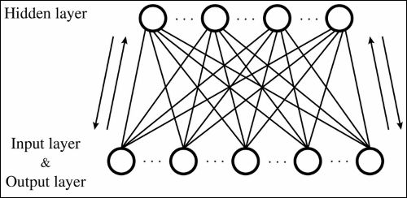

乍一看，它与标准的神经网络不同，但没有什么特别的。如果我们有意分别绘制输入层和输出层的图，该机制与正常神经网络的形状相同:

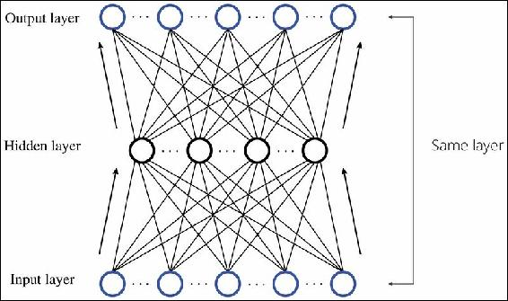

对于一个人来说，这个*匹配输入和输出*的动作并不直观，但是对于一台机器来说，这是一个有效的动作。如果是，它如何通过匹配输出层和输入层从输入数据中学习特征？

需要一点解释吗？让我们这样想:在包括神经网络在内的机器学习的算法中，学习意在最小化模型的预测输出和数据集输出之间的误差。其机制是通过从输入数据中找出一个模式并使具有共同模式的数据具有相同的输出值(例如，0 或 1)来消除错误。如果我们将输出值转化为输入值，会发生什么？

当我们看待应该通过深度学习整体解决的问题时，输入数据从根本上来说是一个可以划分成一些模式的数据集。这意味着输入数据中有一些共同的特征。如果是这样的话，在学习每个输出值成为各自的输入数据的过程中，应该调整网络的权重，以更加集中于反映共同特征的部分。并且，即使在被分类在同一类中的数据中，也应该对学习进行处理以减少非公共特征部分(即，噪声部分)的权重。

现在你应该明白某一层的输入输出是什么，学习进度如何。一旦在某一层完成了预训练，网络就进入下一层的学习。但是，正如您在下图中看到的，请记住，当网络转到下一层学习时，隐藏层将成为输入层:

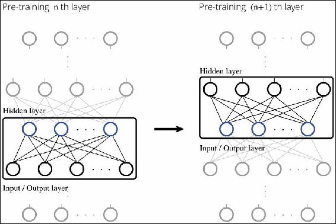

这里的点是预训练后的层可以被视为正常的前馈神经网络，其中网络的权重被调整。因此，如果我们考虑输入值，我们可以简单地计算通过网络从输入层向前传播到当前层的值。

到目前为止，我们已经浏览了预训练(即分层训练)的流程。在深层神经网络的隐藏层中，通过学习输入与输出的匹配，分阶段提取输入数据的特征。现在，你们中的一些人可能想知道:我知道可以通过预训练从输入数据中分阶段学习特征，但仅此并不能解决分类问题。那么，它如何解决分类问题呢？

在预训练期间，没有提供关于哪些数据属于哪个类的信息。这意味着预训练是无监督的训练，它只使用输入数据来分析隐藏模式。如果不能用来解决问题，这是没有意义的，尽管它提取了特征。因此，模型需要再完成一步才能正确地解决分类问题。这是微调。微调的主要作用如下:

1.  向完成预训练的深度神经网络添加输出层，并执行监督训练。
2.  为整个深度神经网络做最后的调整。

这个可以说明如下:

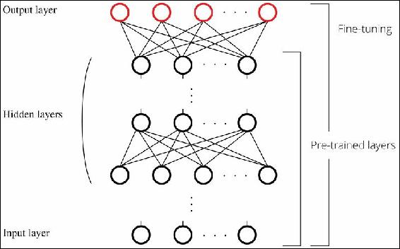

输出层中的监督训练使用机器学习算法，例如逻辑回归或 SVM。通常，考虑到计算量和获得的精度之间的平衡，更经常使用逻辑回归。

在微调中，有时仅调整输出层的权重，但通常整个神经网络的权重，包括在预训练中已经调整了权重的层，也会被调整。这意味着标准学习算法，或者换句话说反向传播算法，被应用于深度神经网络，就像一个多层神经网络一样。这样，解决更复杂分类问题的神经网络模型就完成了。

即便如此，你可能会有以下问题:为什么即使在层堆积的多层神经网络中，学习也能与标准的反向传播算法一起顺利进行？不会出现消失梯度问题吗？这些问题可以通过前期训练来解决。我们来思考以下几点:首先，问题是在没有进行预训练的多层神经网络中，由于反馈误差不当，没有正确调整每个网络的权值；换句话说，消失梯度问题发生的多层神经网络。另一方面，一旦预训练完成，学习就从网络的权重几乎已经调整好的点开始。因此，适当的误差可以传播到接近输入层的层。因此得名微调。因此，通过预训练和微调，最终深度神经网络通过具有深层而成为表达增加的神经网络。

从下一节开始，我们将最终浏览深度学习算法 DBN 和 SDA 的理论和实现。但在此之前，让我们再次回顾一下深度学习的流程。下面是流程的总结图:

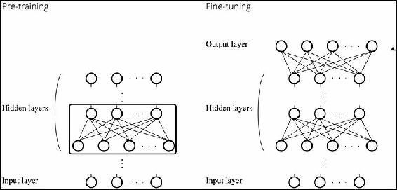

模型的参数在预训练时逐层优化，然后在微调时作为单个深度神经网络进行调整。深度学习，AI 的突破口，是一个非常简单的算法。


# 深度学习算法

现在，我们来看一下深度学习算法的理论和实现。在本章中，我们将看到 DBN 和 SDA(以及相关的方法)。这些算法都得到了爆炸性的研究，主要是在 2012 年至 2013 年之间，当时深度学习开始迅速蔓延，并掀起了深度学习的潮流。即使有两种方法，基本流程是相同的，并且与预训练和微调一致，如前一节所述。这两者的区别在于对它们应用了哪种预训练(即无监督训练)算法。

因此，如果深度学习中有难点的话，应该是无监督训练的理论和方程。然而，你不必害怕。所有的理论和实现都会一一讲解，所以请仔细通读下面的章节。


## 受限玻尔兹曼机器

DBN 分层训练中使用的方法，预训练，称为**限制玻尔兹曼机** ( **RBM** )。首先，让我们看看构成 DBN 基础的 RBM。由于 RBM 代表受限玻尔兹曼机器，当然有一种方法叫做**玻尔兹曼机器** ( **BMs** )。或者说，BMs 是一种更标准的形式，RBM 是其中的特例。两者都是神经网络中的一种，都是由 Hinton 教授提出的。

不理解 BMs 的详细理论也可以实现 RBM 和 DBNs，但是为了理解这些概念，我们将简要地看一下 BMs 所基于的思想。首先，我们来看下图，图中显示了一个 BMs 的图形化模型:

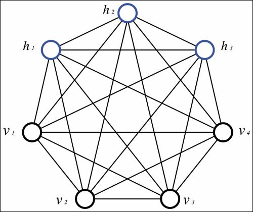

BMs 看起来错综复杂，因为它们是完全连接的，但它们实际上只是简单的两层神经网络。通过重新排列网络中的所有单元以更好地理解，BMs 可以显示如下:

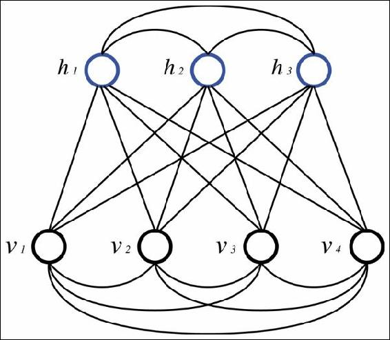

请记住，通常输入/输出层在 BMs 和 RBMs 中被称为**可见层**(通常使用隐藏层),因为是网络从可观察的条件中推测隐藏条件(不可观察的条件)。同样，可见层的神经元被称为**可见单元**，隐藏层的神经元被称为**隐藏单元**。前面图中的符号被描述为与给定名称相匹配。

正如你在图中看到的，BMs 的结构与标准的神经网络没有什么不同。但是，它的思维方式有一个很大的特点。其特点是在神经网络中采用了*能量*的概念。每个单元分别有一个随机状态，整个网络的能量取决于每个单元所处的状态。(第一个在网络中采用能量概念的模型被称为 **Hopfield 网络**，而 BMs 是它的发展版本。由于 Hopfield 网络的细节与深度学习并不完全相关，因此本书中没有对其进行解释。)存储正确数据的条件是网络的稳定状态和这些网络具有的最少能量。另一方面，如果具有噪声的数据被提供给网络，则每个单元具有不同的状态，但不是稳定状态，因此其状态进行转变以稳定整个网络，换句话说，将其转换到稳定状态。

这个意味着模型的权重被调整，并且每个单元的状态被转移以最小化网络具有的能量函数。这些操作可以从输入中整体去除噪声并提取特征。虽然网络的能量听起来很大，但这并不难想象，因为最小化能量函数与最小化误差函数具有相同的效果。

BMs 的概念是美好的，但当 BMs 实际应用于实际问题时，出现了各种问题。最大的问题是 BMs 是完全连接的网络，需要大量的计算时间。因此，RBM 被设计出来。RBM 是一种算法，可以通过限制 BMs 在现实时间框架内解决各种问题。正如在 BM 中一样，RBM 是一个基于网络能量的模型。让我们看看下图中的 RBM:

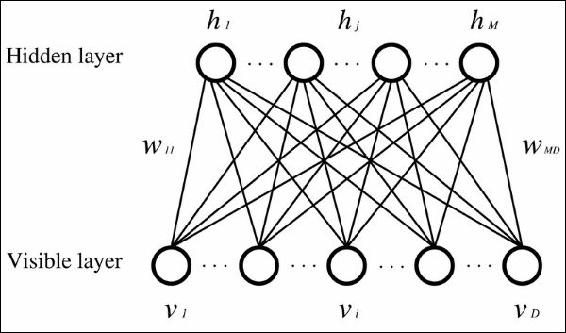

这里，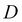是可见层中的单元数量，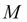是隐藏层中的单元数量。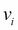表示可见单元的值，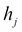表示隐藏单元的值，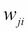表示这两个单元之间的权重。正如你所看到的，BM 和 RBM 的区别在于 RBM 没有相同层之间的连接。由于这种限制，计算量减少，可以应用于现实问题。

现在，让我们看看这个理论。

### Tip

注意，作为前提条件，RBM 每个可见单元和隐藏单元可以取的值一般都是{0，1}，也就是二进制(这个和 BMs 一样)。

如果我们扩展理论，它也可以处理连续值。然而，这可能会使方程变得复杂，因为它不是理论的核心，而且在辛顿教授提出的原始 DBN 中，它是用二进制实现的。因此，我们也将在本书中实现二进制 RBM。具有二进制输入的 RBM 有时被称为 T2，伯努利 RBM 和 T4。

RBM 是基于能量的模型，可见层或隐藏层的状态被视为随机变量。我们将按顺序来看这些方程。首先，每个可见单元通过网络传播到隐藏单元。此时，每个隐藏单元基于根据其传播的输入生成的概率分布采用二进制值:

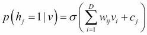

这里，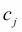是隐藏层中的偏差，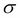表示 sigmoid 函数。

这一次，它通过相同的网络从隐藏层反向传播到可见层。与前面的情况一样，每个可见单元基于根据传播值生成的概率分布采用二进制值。

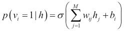

这里，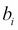是可见层的偏置。可见单位的这个值应该与原始输入值相匹配。这个的意思是如果把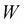、作为模型参数的网络的权重、、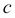、一个可见层和一个隐藏层的偏差表示为一个向量参数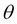，它就向倾斜，以便上面得到的概率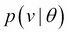接近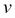的分布。

对于这种学习，需要定义能量函数，即评价函数。能量函数如下所示:

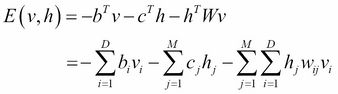

此外，显示网络行为的联合概率密度函数可以如下所示:

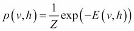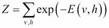

从前面的公式中，将确定用于参数训练的方程。我们可以得到下面的等式:

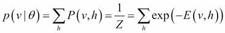

因此，**对数似然**可以表示如下:

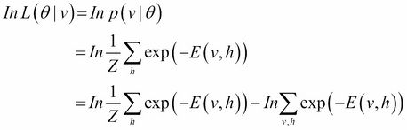

然后，我们将根据模型参数计算每个梯度。导数可以计算如下:

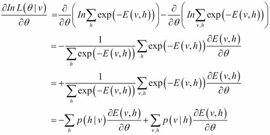

中间有些方程比较复杂，但是用模型的概率分布项和原始数据证明是简单的。

因此，每个参数的梯度如下所示:

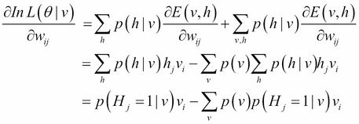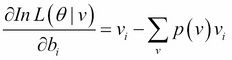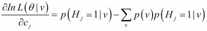

现在然后，我们可以找到梯度的方程，但是当我们试图应用这个方程时，出现了一个问题。想想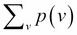这个词。这个术语意味着我们必须计算所有{0，1}模式的概率分布，这些模式可以被假定为输入数据，其中包括实际上不存在于数据中的模式。

我们可以很容易地想象这个术语如何导致组合爆炸，这意味着我们无法在现实的时间框架内解决它。为了解决这个问题，引入了使用 Gibbs 抽样来逼近数据的方法，称为**对比散度** ( **CD** )。现在来看看这个方法。

这里，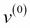是输入向量。另外，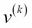是输入(输出)向量，可以通过使用该输入向量进行 k 次采样来获得。

然后，我们得到:

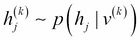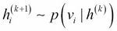

因此，当在重复吉布斯采样之后逼近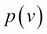时，对数似然函数的导数可以被表示为如下的:

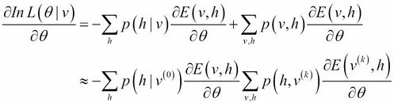

因此，模型参数可以显示如下:

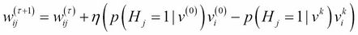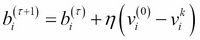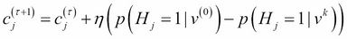

这里，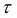是迭代次数，是学习率。如前面的公式所示，通常，执行 k 次采样的 CD 表示为 CD-k。众所周知，在将算法应用于实际问题时，CD-1 就足够了。

现在，让我们来看一下人民币的实施过程。包结构如下图所示:

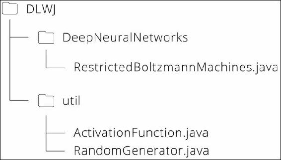

让我们浏览一下`RestrictedBoltzmannMachines.java`文件。因为 main 方法的第一部分只是定义一个模型需要的变量，生成演示数据，所以这里就不看了。

因此，在我们生成模型实例的部分，您可能会注意到参数中有许多`null`值:

```
// construct RBM
RestrictedBoltzmannMachines nn = new RestrictedBoltzmannMachines(nVisible, nHidden, null, null, null, rng);
```

当您查看构造函数时，您可能知道这些`null`值是 RBM 的权重矩阵、隐藏单元的偏差和可见单元的偏差。我们在这里将参数定义为`null`,因为它们用于 DBN 的实现。在构造函数中，这些函数初始化如下:

```
   if (W == null) {

       W = new double[nHidden][nVisible];
       double w_ = 1\. / nVisible;

       for (int j = 0; j < nHidden; j++) {
           for (int i = 0; i < nVisible; i++) {
               W[j][i] = uniform(-w_, w_, rng);
           }
       }
   }

   if (hbias == null) {
       hbias = new double[nHidden];

       for (int j = 0; j < nHidden; j++) {
           hbias[j] = 0.;
       }
   }

   if (vbias == null) {
       vbias = new double[nVisible];

       for (int i = 0; i < nVisible; i++) {
           vbias[i] = 0.;
       }
   }
```

下一步是训练。CD-1 应用于每个小批量的:

```
// train with contrastive divergence
for (int epoch = 0; epoch < epochs; epoch++) {
   for (int batch = 0; batch < minibatch_N; batch++) {
       nn.contrastiveDivergence(train_X_minibatch[batch], minibatchSize, learningRate, 1);
   }
   learningRate *= 0.995;
}
```

现在，让我们来看看 RBM 的要点，即`contrastiveDivergence`方法。当我们实际运行这个程序时，CD-1 可以获得一个充分的解决方案(因此在演示中 k = 1)，但是这个方法也被定义为处理 CD-k:

```
// CD-k : CD-1 is enough for sampling (i.e. k = 1)
sampleHgivenV(X[n], phMean_, phSample_);

for (int step = 0; step < k; step++) {

   // Gibbs sampling
   if (step == 0) {
       gibbsHVH(phSample_, nvMeans_, nvSamples_, nhMeans_, nhSamples_);
   } else {
       gibbsHVH(nhSamples_, nvMeans_, nvSamples_, nhMeans_, nhSamples_);
   }

}
```

看起来在 CD-k 中使用了两种不同的方法，`sampleHgivenV`和`gibbsHVH`，但是当你研究`gibbsHVH`时，你会发现:

```
public void gibbsHVH(int[] h0Sample, double[] nvMeans, int[] nvSamples, double[] nhMeans, int[] nhSamples) {
   sampleVgivenH(h0Sample, nvMeans, nvSamples);
   sampleHgivenV(nvSamples, nhMeans, nhSamples);
}
```

因此，CD-k 只包含两种采样方法，`sampleVgivenH`和`sampleHgivenV`。

顾名思义，`sampleHgivenV`是根据可见单元的给定值来设置在隐藏层中生成的概率分布和采样数据的方法，反之亦然:

```
public void sampleHgivenV(int[] v0Sample, double[] mean, int[] sample) {

   for (int j = 0; j < nHidden; j++) {
       mean[j] = propup(v0Sample, W[j], hbias[j]);
       sample[j] = binomial(1, mean[j], rng);
   }

}

public void sampleVgivenH(int[] h0Sample, double[] mean, int[] sample) {

   for(int i = 0; i < nVisible; i++) {
       mean[i] = propdown(h0Sample, i, vbias[i]);
       sample[i] = binomial(1, mean[i], rng);
   }
}
```

将值设置到各自平均值的`propup`和`propdown`标签是通过`sigmoid`函数激活每个单元的值的方法:

```
public double propup(int[] v, double[] w, double bias) {

   double preActivation = 0.;

   for (int i = 0; i < nVisible; i++) {
       preActivation += w[i] * v[i];
   }
   preActivation += bias;

   return sigmoid(preActivation);
}

public double propdown(int[] h, int i, double bias) {

   double preActivation = 0.;

   for (int j = 0; j < nHidden; j++) {
       preActivation += W[j][i] * h[j];
   }
   preActivation += bias;

   return sigmoid(preActivation);
}
```

在`RandomGenerator.java`中定义了为样本设置值的`binomial`方法。该方法基于二项式分布返回`0`或`1`。使用这种方法，每个单位的值都变成二进制:

```
public static int binomial(int n, double p, Random rng) {
   if(p < 0 || p > 1) return 0;

   int c = 0;
   double r;

   for(int i=0; i<n; i++) {
       r = rng.nextDouble();
       if (r < p) c++;
   }

   return c;
}
```

一旦通过采样获得近似值，我们需要做的只是计算`model`参数的梯度，并使用小批量更新参数。这里没什么特别的:

```
// calculate gradients
for (int j = 0; j < nHidden; j++) {
   for (int i = 0; i < nVisible; i++) {
       grad_W[j][i] += phMean_[j] * X[n][i] - nhMeans_[j] * nvSamples_[i];
   }

   grad_hbias[j] += phMean_[j] - nhMeans_[j];
}

for (int i = 0; i < nVisible; i++) {
   grad_vbias[i] += X[n][i] - nvSamples_[i];
}

// update params
for (int j = 0; j < nHidden; j++) {
   for (int i = 0; i < nVisible; i++) {
       W[j][i] += learningRate * grad_W[j][i] / minibatchSize;
   }

   hbias[j] += learningRate * grad_hbias[j] / minibatchSize;
}

for (int i = 0; i < nVisible; i++) {
   vbias[i] += learningRate * grad_vbias[i] / minibatchSize;
}
```

现在我们完成了`model`的训练。接下来是一般情况下的测试和评估，但是注意模型不能用精度等气压计评估，因为 RBM 是一个生成模型。相反，让我们简单地看看 RBM 是如何改变噪声数据的。由于训练后的 RBM 可以被视为神经网络，其权重被调整，因此该模型可以通过网络简单地传播输入数据(即，噪声数据)来获得重构的数据:

```
public double[] reconstruct(int[] v) {

   double[] x = new double[nVisible];
   double[] h = new double[nHidden];

   for (int j = 0; j < nHidden; j++) {
       h[j] = propup(v, W[j], hbias[j]);
   }

   for (int i = 0; i < nVisible; i++) {
       double preActivation_ = 0.;

       for (int j = 0; j < nHidden; j++) {
           preActivation_ += W[j][i] * h[j];
       }
       preActivation_ += vbias[i];

       x[i] = sigmoid(preActivation_);
   }

   return x;
}
```


## 深度信念网

DBNs 是深度神经网络，其中逻辑回归被添加到 RBMS 作为输出层。既然实现所必需的理论已经解释过了，我们就可以直接进入实现了。包的结构如下:

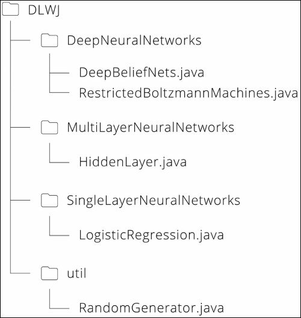

程序的流程非常简单。顺序如下:

1.  为模型设置参数。
2.  建立模型。
3.  预先训练模型。
4.  微调模型。
5.  测试和评估模型。

就像在 RBM 一样，设置main 方法的第一步是声明变量和创建演示数据的代码(这里省略了解释)。

请检查在演示数据中，输入层的单元数是 60，隐藏层有 2 层，它们的组合单元数是 20，输出层的单元数是 3。现在，让我们浏览一下来自*构建模型*部分的代码:

```
// construct DBN
System.out.print("Building the model...");
DeepBeliefNets classifier = new DeepBeliefNets(nIn, hiddenLayerSizes, nOut, rng);
Sy
stem.out.println("done.");
```

`hiddenLayerSizes`的变量是一个数组，它的长度代表深度神经网络中隐藏的层数。深度学习算法需要进行大量的计算，因此程序会给出当前状态的输出，以便我们可以看到哪个进程正在进行。`hiddenLayerSizes`的变量是一个数组，它的长度代表深度神经网络的隐含层数。每一层都是在构造函数中构造的。

### Tip

请记住，`sigmoidLayers`和`rbmLayers`当然是不同的物体，但是它们的重量和偏差是相同的。

这是因为，如理论部分所述，预训练执行逐层训练，而整个模型可被视为一个神经网络:

```
// construct multi-layer
for (int i = 0; i < nLayers; i++) {
   int nIn_;
   if (i == 0) nIn_ = nIn;
   else nIn_ = hiddenLayerSizes[i-1];

   // construct hidden layers with sigmoid function
   //   weight matrices and bias vectors will be shared with RBM layers
   sigmoidLayers[i] = new HiddenLayer(nIn_, hiddenLayerSizes[i], null, null, rng, "sigmoid");

   // construct RBM layers
   rbmLayers[i] = new RestrictedBoltzmannMachines(nIn_, hiddenLayerSizes[i], sigmoidLayers[i].W, sigmoidLayers[i].b, null, rng);
}

// logistic regression layer for output
logisticLayer = new LogisticRegression(hiddenLayerSizes[nLayers-1], nOut);
```

建立模型后要做的第一件事是预训练:

```
// pre-training the model
System.out.print("Pre-training the model...");
classifier.pretrain(train_X_minibatch, minibatchSize, train_minibatch_N, pretrainEpochs, pretrainLearningRate, k);
System.out.println("done.");
```

预训练需要与每个`minibatch`一起处理，但同时，与每个层一起处理。因此，所有的训练数据首先被给予给`pretrain`方法，然后每个小批量的数据在该方法中被处理:

```
public void pretrain(int[][][] X, int minibatchSize, int minibatch_N, int epochs, double learningRate, int k) {

   for (int layer = 0; layer < nLayers; layer++) {  // pre-train layer-wise
       for (int epoch = 0; epoch < epochs; epoch++) {
           for (int batch = 0; batch < minibatch_N; batch++) {

               int[][] X_ = new int[minibatchSize][nIn];
               int[][] prevLayerX_;

               // Set input data for current layer
               if (layer == 0) {
                   X_ = X[batch];
               } else {

                   prevLayerX_ = X_;
                   X_ = new int[minibatchSize][hiddenLayerSizes[layer-1]];

                   for (int i = 0; i < minibatchSize; i++) {
                       X_[i] = sigmoidLayers[layer-1].outputBinomial(prevLayerX_[i], rng);
                   }
               }

               rbmLayers[layer].contrastiveDivergence(X_, minibatchSize, learningRate, k);
           }
       }
   }

}
```

因为实际的学习是通过 RBM 的 CD-1 完成的，所以代码中对 DBN 的描述非常简单。在 DBN (RBM)，每层的单位都有二进制值，所以不能使用`HiddenLayer`的输出方法，因为它返回 double。因此，`outputBinomial`方法被添加到该类中，该类返回`int`类型(这里省略了代码)。一旦预训练完成，下一步就是微调。

### Tip

注意不要使用预培训中使用的培训数据。

如果我们使用整个数据集进行预训练和微调，我们很容易陷入过度拟合。因此，验证数据集是与训练数据集分开准备的，并用于微调:

```
// fine-tuning the model
System.out.print("Fine-tuning the model...");
for (int epoch = 0; epoch < finetuneEpochs; epoch++) {
   for (int batch = 0; batch < validation_minibatch_N; batch++) {
       classifier.finetune(validation_X_minibatch[batch], validation_T_minibatch[batch], minibatchSize, finetuneLearningRate);
   }
   finetuneLearningRate *= 0.98;
}
System.out.println("done.");
```

在`finetune`方法中，多层神经网络中的反向传播算法被应用，其中逻辑回归被用于输出层。为了在多个隐藏层中反向传播单位值，我们定义变量来维护每个层的输入:

```
public void finetune(double[][] X, int[][] T, int minibatchSize, double learningRate) {

   List<double[][]> layerInputs = new ArrayList<>(nLayers + 1);
   layerInputs.add(X);

   double[][] Z = new double[0][0];
   double[][] dY;

   // forward hidden layers
   for (int layer = 0; layer < nLayers; layer++) {

       double[] x_;  // layer input
       double[][] Z_ = new double[minibatchSize][hiddenLayerSizes[layer]];

       for (int n = 0; n < minibatchSize; n++) {

           if (layer == 0) {
               x_ = X[n];
           } else {
               x_ = Z[n];
           }

           Z_[n] = sigmoidLayers[layer].forward(x_);
       }

       Z = Z_.clone();
       layerInputs.add(Z.clone());
   }

   // forward & backward output layer
   dY = logisticLayer.train(Z, T, minibatchSize, learningRate);

   // backward hidden layers
   double[][] Wprev;
   double[][] dZ = new double[0][0];

   for (int layer = nLayers - 1; layer >= 0; layer--) {

       if (layer == nLayers - 1) {
           Wprev = logisticLayer.W;
       } else {
           Wprev = sigmoidLayers[layer+1].W;
           dY = dZ.clone();
       }

       dZ = sigmoidLayers[layer].backward(layerInputs.get(layer), layerInputs.get(layer+1), dY, Wprev, minibatchSize, learningRate);
   }
}
```

DBN 的训练部分就是它在前面代码中的样子。难的部分可能是 RBM 的理论和实现，所以当你只看 DBN 的代码时，你可能会认为这并不太难。

由于训练后的 DBN 可视为一个(深度)神经网络，当你试图预测未知数据属于哪一类时，你只需在每一层中正向传播数据:

```
public Integer[] predict(double[] x) {

   double[] z = new double[0];

   for (int layer = 0; layer < nLayers; layer++) {

       double[] x_;

       if (layer == 0) {
           x_ = x;
       } else {
           x_ = z.clone();
       }

       z = sigmoidLayers[layer].forward(x_);
   }

   return logisticLayer.predict(z);
}
```

至于评估，应该不需要解释，因为它与之前的分类器模型没有太大区别。

恭喜你！你现在已经掌握了一种深度学习算法的知识。你可能会比预期的更容易理解它。但是深度学习的难点其实是参数的设置，比如设置有多少个隐层，每个隐层有多少个单元，学习速率，迭代次数等等。与机器学习方法相比，有更多的参数需要设置。请记住，当你把这一点应用到现实问题中时，你可能会发现这一点很难。


## 去噪自编码器

SDA 预训练使用的方法是称为**去噪自编码器** ( **DA** )。可以说，DA 是强调输入和输出相等的作用的方法。这是什么意思？DA 的处理内容如下:DA 在输入数据中有意加入一些噪声，对数据进行部分损坏，然后 DA 在将损坏的数据恢复为原始输入数据的同时进行学习。如果输入数据值为[0，1]，这种有意噪声很容易被证实；通过强制将相关部分的值变为 0。如果一个数据值超出了这个范围，就可以实现，比如加入高斯噪声，但在本书中，我们会考虑前[0，1]的情况来理解算法的核心部分。

在 DA 中，输入/输出层也称为可见层。大的图形模型可以显示为与相同的形状，但为了更好地理解，让我们按照这个图:

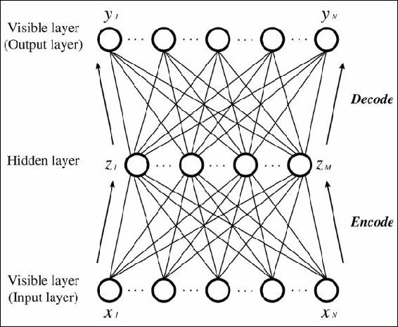

这里，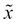是被破坏的数据，带有噪声的输入数据。然后，向隐藏层和输出层的前向传播可以表示如下:

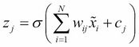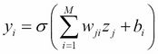

这里，表示隐藏层的偏差，表示可见层的偏差。另外，表示乙状结肠函数。如上图所示，损坏的输入数据和映射到隐藏层的称为**编码**和映射，将编码数据恢复为原始输入数据称为**解码**。然后，DA 的评估函数可以用原始输入数据和解码数据的负对数似然函数来表示:

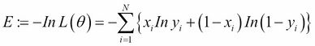

这里，是模型参数，可见层和隐藏层的权重和偏差。我们需要做的只是找到这些参数相对于评估函数的梯度。为了使方程容易变形，我们在这里定义函数:


然后，我们得到:


使用这些函数，参数的每个梯度可以显示如下:


因此，只需要两个术语。让我们逐一推导:


这里，我们利用了 `sigmoid`函数的导数:


此外，我们得到:


因此，可以得到下面的等式:


另一方面，我们还可以得到以下结论:


因此，每个参数的更新方程如下:


这里，是迭代次数，是学习率。虽然 DA 需要一点变形的技巧，但是你可以看到，与 RBM 相比，这个理论本身非常简单。

现在，让我们继续实施。包装结构与 RBM 的相同。


至于模型参数，除了隐藏层中的单元数量之外，添加到输入数据中的噪声量也是 DA 中的参数。这里，损坏级别被设置为`0.3`。通常，该值通常设置在`0.1 ~ 0.3`:

```
double corruptionLevel = 0.3;
```

从建筑模型到训练的流程与 RBM 的流程相同。虽然这种训练方法在 RBM 被称为`contrastiveDivergence`，但在《达:

```
// construct DA
DenoisingAutoencoders nn = new DenoisingAutoencoders(nVisible, nHidden, null, null, null, rng);

// train
for (int epoch = 0; epoch < epochs; epoch++) {
   for (int batch = 0; batch < minibatch_N; batch++) {
       nn.train(train_X_minibatch[batch], minibatchSize, learningRate, corruptionLevel);
   }
}
```

`train`的内容如理论部分所述。首先，在输入数据中添加噪声，然后对其进行编码和解码:

```
// add noise to original inputs
double[] corruptedInput = getCorruptedInput(X[n], corruptionLevel);

// encode
double[] z = getHiddenValues(corruptedInput);

// decode
double[] y = getReconstructedInput(z);
```

如之前所解释的，添加噪声的过程是将数据的相应部分的值强制转换为`0`:

```
public double[] getCorruptedInput(double[] x, double corruptionLevel) {

   double[] corruptedInput = new double[x.length];

   // add masking noise
   for (int i = 0; i < x.length; i++) {
       double rand_ = rng.nextDouble();

       if (rand_ < corruptionLevel) {
           corruptedInput[i] = 0.;
       } else {
           corruptedInput[i] = x[i];
       }
   }

   return corruptedInput;
}
```

其他过程只是简单的激活和传播，这里就不赘述了。梯度的计算遵循数学公式:

```
// calculate gradients

// vbias
double[] v_ = new double[nVisible];

for (int i = 0; i < nVisible; i++) {
   v_[i] = X[n][i] - y[i];
   grad_vbias[i] += v_[i];
}

// hbias
double[] h_ = new double[nHidden];

for (int j = 0; j < nHidden; j++) {

   for (int i = 0; i < nVisible; i++) {
       h_[j] = W[j][i] * (X[n][i] - y[i]);
   }

   h_[j] *= z[j] * (1 - z[j]);
   grad_hbias[j] += h_[j];
}

// W
for (int j = 0; j < nHidden; j++) {
   for (int i = 0; i < nVisible; i++) {
       grad_W[j][i] += h_[j] * corruptedInput[i] + v_[i] * z[j];
   }
}
```

与 RBM 相比，DA 的实现也非常简单。当你测试(`reconstruct`)模型时，你不需要破坏数据。与标准神经网络一样，您只需根据网络的权重向前传播给定的输入:

```
public double[] reconstruct(double[] x) {

   double[] z = getHiddenValues(x);
   double[] y = getReconstructedInput(z);

   return y;
}
```


## 栈式去噪自编码器(SDA)

SDA 是堆积了 DA 层的深度神经网络。正如 DBN 由 RBM 和逻辑回归组成，SDA 由 DAs 和逻辑回归组成:


DBN 和 SDA 的实施流程并没有太大的不同。虽然和大在前期训练上有所不同，但微调的内容是完全一样的。因此，可能不需要太多的解释。

预训练的方法并没有太大的不同，但是请注意，`int`类型用于 DBN 的点被更改为双精度类型，因为 DA 可以处理`[0, 1]`，而不是二进制:

```
public void pretrain(double[][][] X, int minibatchSize, int minibatch_N, int epochs, double learningRate, double corruptionLevel) {

   for (int layer = 0; layer < nLayers; layer++) {
       for (int epoch = 0; epoch < epochs; epoch++) {
           for (int batch = 0; batch < minibatch_N; batch++) {

               double[][] X_ = new double[minibatchSize][nIn];
               double[][] prevLayerX_;

               // Set input data for current layer
               if (layer == 0) {
                   X_ = X[batch];
               } else {

                 prevLayerX_ = X_;
                 X_ = new double[minibatchSize][hiddenLayerSizes[layer-1]];

                   for (int i = 0; i < minibatchSize; i++) {
                       X_[i] = sigmoidLayers[layer-1].output(prevLayerX_[i]);
                   }
               }

               daLayers[layer].train(X_, minibatchSize, learningRate, corruptionLevel);
           }
       }
   }

}
```

学习后的 `predict`方法也和 DBN 一模一样。考虑到 DBN 和 SDA 都可以在学习(即预训练和微调)后被视为一个多层神经网络，自然大部分过程是共同的。

总的来说，SDA 比 DBN 更容易实现，但获得的精度几乎相同。这就是 SDA 的可取之处。


# 总结

在这一章中，我们看了以前的神经网络算法的问题以及深度学习的突破。此外，您还了解了 DBN 和 SDA 的理论和实现，SDA 是推动深度学习蓬勃发展的算法，以及在每种方法中使用的 RBM 和 DA。

在下一章，我们将研究更多的深度学习算法。他们采取不同的方法来获得高精度率，并得到了很好的发展。