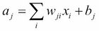

# 四、丢弃和卷积神经网络

在这一章中，我们继续浏览深度学习的算法。DBN 和 SDA 都采用的预训练确实是一种创新方法，但深度学习也有其他创新方法。在这些方法中，我们将详细介绍特别著名的算法，如下所示:

*   丢弃学习算法
*   卷积神经网络

这两种算法都是理解和掌握深度学习所必需的，所以一定要跟上。


# 无需预训练的深度学习算法

在前一章中，您了解到预培训的分层培训是 DBN 和 SDA 的一个突破。这些算法需要预训练的原因是因为出现了一个问题，其中输出误差逐渐消失，并且在具有简单堆积层的神经网络中不能很好地工作(我们称之为消失梯度问题)。深度学习算法需要预先训练，无论你是想改进现有的方法还是重新发明它——你可能会这样想。

然而，实际上，本章中的深度学习算法没有预训练的阶段，尽管在没有预训练的深度学习算法中，我们可以得到更高精度和准确度的结果。为什么这样的事情是可能的？下面是一个简单的原因。我们来思考一下为什么会出现消失梯度问题——还记得反向传播的方程吗？一层中的增量通过字面上向后传播网络而被分配给前一层的所有单元。这意味着在所有单元都紧密相连的网络中，反向传播到每个单元的误差值变小。从反向传播方程中可以看出，权重梯度是通过权重和单元之间的增量相乘获得的。因此，我们拥有的项越多，网络就越密集，下溢的可能性就越大。这导致了渐变消失的问题。

因此，我们可以说，如果前面的问题可以在没有预训练的情况下避免，那么机器就可以利用深度神经网络进行适当的学习。为了实现这一点，我们需要安排如何连接网络。本章中的深度学习算法是一种使用各种方法将这种发明付诸实践的方法。


# 丢弃

如果网络连接紧密有问题，就强制它稀疏。那么消失梯度问题就不会发生，学习就可以正常进行了。基于这样一种思想的算法就是 **dropout** 算法。在*通过防止特征检测器的共同适应来改进神经网络*中介绍了深度神经网络的退出(Hinton 等人。艾尔。2012 年，[http://arxiv.org/pdf/1207.0580.pdf](http://arxiv.org/pdf/1207.0580.pdf))并在*丢弃:防止神经网络过度拟合的简单方法* (Srivastava，et。艾尔。2014，[https://www.cs.toronto.edu/~hinton/absps/JMLRdropout.pdf](https://www.cs.toronto.edu/~hinton/absps/JMLRdropout.pdf)。在丢弃，一些单位，字面上，被迫下降，而训练。这是什么意思？让我们来看看下面的图——首先，神经网络:


这个数字没有什么特别的。它是一个标准的神经网络，有一个输入层、两个隐藏层和一个输出层。第二，通过将 dropout 应用于该网络，图形模型可以表示如下:


脱离网络的单元用十字符号表示。如上图所示，丢弃的单元被解释为网络中不存在。这意味着在应用丢弃学习算法时，我们需要改变原始神经网络的结构。幸运的是，从计算的角度来看，将 dropout 应用于网络并不困难。你可以简单的先建立一个通用的深度神经网络。然后，只需向每层中的所有单元添加一个下降掩码(一个简单的二进制掩码)，就可以应用下降学习算法。二进制掩码中值为 0 的单元是从网络中丢弃的单元。

这可能会让你想起上一章讨论的 DA(或 SDA)，因为 DA 和 dropout 乍一看很相似。在实现时，破坏 DA 中的输入数据还会给数据添加二进制掩码。然而，它们之间有两个显著不同的点。首先，虽然两种方法都有向神经元添加掩码的过程，但 DA 只将掩码应用于输入层的单元，而 dropout 则将其应用于隐藏层的单元。一些 dropout 算法将遮罩应用于输入层和隐藏层，但这仍然不同于 DA。第二，在 DA 中，一旦产生损坏的输入数据，该数据将在整个训练时期中使用，但是在 dropout 中，具有不同掩码的数据将在每个训练时期中使用。这表明不同形状的神经网络在每次迭代中被训练。在每次迭代中，将根据丢失概率在每个图层中生成丢失掩膜。

你可能会有一个问题——即使网络的形状在每一步都不同，我们能否训练模型？答案是肯定的。你可以这样想——网络受过很好的训练，有了 dropout，因为它对现有的神经元赋予了更多的权重，以反映输入数据的特征。然而，dropout 有一个缺点，即它需要比其他算法更多的训练历元来训练和优化模型，这意味着它需要更多的时间直到它被优化。这里介绍了另一种技术来减少这个问题。虽然 dropout 算法本身发明得更早，但深度神经网络仅仅通过使用这种方法还不足以获得泛化能力和高精度率。通过一种使网络更加稀疏的技术，我们实现了深度神经网络以获得更高的精度。这项技术是激活函数的改进，我们可以说这是一个简单而优雅的解决方案。

迄今为止解释的所有神经网络方法都利用 sigmoid 函数或双曲正切作为激活函数。使用这些函数，您可能会获得很好的结果。但是，从它们的形状可以看出，当某一层的输入值或误差值相对较大或较小时，这些曲线会饱和并破坏梯度。

为解决这个问题而引入的激活功能之一是**整流器**。单元应用的整流器称为**整流线性单元** ( **ReLU** )。我们可以把激活函数本身叫做 ReLU。该函数在以下等式中描述:


该函数可由下图表示:


图中的虚线是称为**软加函数**的函数，它的导数是逻辑函数，描述如下:


这只是给你的信息:我们有以下关系，一个平滑的近似整流器。从上图可以看出，由于整流器远比 sigmoid 函数和双曲正切简单，所以你可以很容易地猜到，当它应用于深度学习算法时，时间成本会降低。此外，由于计算反向传播误差时需要的整流器导数也很简单，因此我们还可以缩短时间成本。导数的等式可以表示如下:


由于整流器及其导数都非常稀疏，我们可以很容易地想象神经网络通过训练也将是稀疏的。你可能还注意到，我们不再需要担心梯度饱和度，因为我们不再有 sigmoid 函数和双曲正切函数包含的因果曲线。

通过丢弃和整流器技术，一个简单的深度神经网络可以学习一个问题，而无需预先训练。就用于实现 dropout 算法的方程而言，它们并不困难，因为它们只是将 dropout masks 添加到多层感知器的简单方法。让我们按顺序来看:


这里，表示激活功能，在这种情况下是整流器。你看，前面的等式是针对隐藏层中没有漏失的单元的。丢弃生所做的只是给他们戴上面具。它可以表示如下:


这里，表示退出的概率，一般设置为 0.5。正向激活到此为止。正如你从方程中看到的，二进制掩码项是与一般神经网络唯一的不同。此外，在反向传播过程中，我们还必须向增量添加遮罩。假设我们有以下等式:



据此，我们可以将 delta 定义如下:


这里，表示评价函数(这些方程和我们在[第二章](part0018_split_000.html#H5A41-39437f1d2f624cb5b197ebc27900db65 "Chapter 2. Algorithms for Machine Learning – Preparing for Deep Learning")、*机器学习的算法——为深度学习做准备*中提到的一样)。我们得到下面的等式:


这里，δ可以被如下描述为:


现在我们有了实现所需的所有等式，让我们开始实现吧。包的结构如下:


首先，我们需要拥有的是整流器。像其他激活函数一样，我们在`ActivationFunction.java`中将它实现为`ReLU`:

```java
public static double ReLU(double x) {
   if(x > 0) {
       return x;
   } else {
       return 0.;
   }
}
```

此外，我们将`dReLU`定义为整流器的导数:

```java
public static double dReLU(double y) {
   if(y > 0) {
       return 1.;
   } else {
       return 0.;
   }
}
```

相应地，我们更新了`HiddenLayer.java`的构造函数来支持`ReLU`:

```java
if (activation == "sigmoid" || activation == null) {

   this.activation = (double x) -> sigmoid(x);
   this.dactivation = (double x) -> dsigmoid(x);

} else if (activation == "tanh") {

   this.activation = (double x) -> tanh(x);
   this.dactivation = (double x) -> dtanh(x);

} else if (activation == "ReLU") {

   this.activation = (double x) -> ReLU(x);
   this.dactivation = (double x) -> dReLU(x);

} else {
   throw new IllegalArgumentException("activation function not supported");
}
```

现在我们来看看`Dropout.java`。在源代码中，我们将构建两个隐藏层的神经网络，并且放弃的概率被设置为 0.5:

```java
int[] hiddenLayerSizes = {100, 80};
double pDropout = 0.5;
```

`Dropout.java`的构造函数可以这样写(由于网络只是一个简单的深度神经网络，所以代码也简单):

```java
public Dropout(int nIn, int[] hiddenLayerSizes, int nOut, Random rng, String activation) {

   if (rng == null) rng = new Random(1234);

   if (activation == null) activation = "ReLU";

   this.nIn = nIn;
   this.hiddenLayerSizes = hiddenLayerSizes;
   this.nOut = nOut;
   this.nLayers = hiddenLayerSizes.length;
   this.hiddenLayers = new HiddenLayer[nLayers];
   this.rng = rng;

   // construct multi-layer
   for (int i = 0; i < nLayers; i++) {
       int nIn_;
       if (i == 0) nIn_ = nIn;
       else nIn_ = hiddenLayerSizes[i - 1];

       // construct hidden layer
       hiddenLayers[i] = new HiddenLayer(nIn_, hiddenLayerSizes[i], null, null, rng, activation);
   }

   // construct logistic layer
   logisticLayer = new LogisticRegression(hiddenLayerSizes[nLayers - 1], nOut);
}
```

如前所述，现在我们有了支持`ReLU`的`HiddenLayer`类，我们可以使用`ReLU`作为激活函数。

一旦模型建立起来，我们接下来要做的就是训练丢弃的模型。训练的方法简称为`train`。由于我们在计算反向传播误差时需要一些层输入，我们首先定义名为`layerInputs`的变量来缓存它们各自的输入值:

```java
List<double[][]> layerInputs = new ArrayList<>(nLayers+1);
layerInputs.add(X);
```

这里，`X`是原始训练数据。我们还需要为反向传播缓存每个层的丢弃掩码，所以让我们将其定义为`dropoutMasks`:

```java
List<int[][]> dropoutMasks = new ArrayList<>(nLayers);
```

训练以向前激活的方式开始。看看我们如何将漏失掩码应用于值；我们只是将激活的值和二进制掩码相乘:

```java
// forward hidden layers
for (int layer = 0; layer < nLayers; layer++) {

   double[] x_;  // layer input
   double[][] Z_ = new double[minibatchSize][hiddenLayerSizes[layer]];
   int[][] mask_ = new int[minibatchSize][hiddenLayerSizes[layer]];

   for (int n = 0; n < minibatchSize; n++) {

       if (layer == 0) {
           x_ = X[n];
       } else {
           x_ = Z[n];
       }

       Z_[n] = hiddenLayers[layer].forward(x_);
       mask_[n] = dropout(Z_[n], pDrouput);  // apply dropout mask to units
   }

   Z = Z_;
   layerInputs.add(Z.clone());

   dropoutMasks.add(mask_);
}
```

`Dropout.java`中也定义了退出方法。如等式中所述，此方法返回遵循伯努利分布的值:

```java
public int[] dropout(double[] z, double p) {

   int size = z.length;
   int[] mask = new int[size];

   for (int i = 0; i < size; i++) {
       mask[i] = binomial(1, 1 - p, rng);
       z[i] *= mask[i]; // apply mask
   }

   return mask;
}
```

通过隐藏层向前传播后，训练数据在逻辑回归的输出层中向前传播。然后，以与其他神经网络算法相同的方式，每层的增量通过网络返回。这里，我们将缓存的掩码应用于增量，以便其值在同一网络中反向传播:

```java
// forward & backward output layer
D = logisticLayer.train(Z, T, minibatchSize, learningRate);

// backward hidden layers
for (int layer = nLayers - 1; layer >= 0; layer--) {

   double[][] Wprev_;

   if (layer == nLayers - 1) {
       Wprev_ = logisticLayer.W;
   } else {
       Wprev_ = hiddenLayers[layer+1].W;
   }

   // apply mask to delta as well
   for (int n = 0; n < minibatchSize; n++) {
       int[] mask_ = dropoutMasks.get(layer)[n];

       for (int j = 0; j < D[n].length; j++) {
           D[n][j] *= mask_[j];
       }
   }

   D = hiddenLayers[layer].backward(layerInputs.get(layer), layerInputs.get(layer+1), D, Wprev_, minibatchSize, learningRate);
}
```

培训之后是测试阶段。但是在我们将测试数据应用到优化的模型之前，我们需要配置网络的权重。丢弃掩码不能简单地应用于测试数据，因为当进行掩码时，每个网络的形状会有所不同，这可能会返回不同的结果，因为某个单元可能会对某些特征产生显著影响。相反，我们所做的是平滑网络的权重，这意味着我们模拟整个单元被同等屏蔽的网络。这可以通过以下等式来实现:


从等式中可以看出，所有的权重都乘以了不丢弃的概率。我们将此方法定义为`pretest`:

```java
public void pretest(double pDropout) {

   for (int layer = 0; layer < nLayers; layer++) {

       int nIn_, nOut_;

       if (layer == 0) {
           nIn_ = nIn;
       } else {
           nIn_ = hiddenLayerSizes[layer];
       }

       if (layer == nLayers - 1) {
           nOut_ = nOut;
       } else {
           nOut_ = hiddenLayerSizes[layer+1];
       }

       for (int j = 0; j < nOut_; j++) {
           for (int i = 0; i < nIn_; i++) {
               hiddenLayers[layer].W[j][i] *= 1 - pDropout;
           }
       }
   }
}
```

我们必须在测试之前调用这个方法一次。由于网络是一个通用的多层神经网络，我们需要做的预测只是通过网络执行正向激活:

```java
public Integer[] predict(double[] x) {

   double[] z = new double[0];

   for (int layer = 0; layer < nLayers; layer++) {

       double[] x_;

       if (layer == 0) {
           x_ = x;
       } else {
           x_ = z.clone();
       }

       z = hiddenLayers[layer].forward(x_);
   }

   return logisticLayer.predict(z);
}
```

与 DBN 和 SDA 相比，丢弃 MLP 要简单得多，也更容易实施。这表明，通过两种或两种以上技术的结合，我们可以获得更高的精度。


# 卷积神经网络

你学过的所有机器学习/深度学习算法都暗示着输入数据的类型是一维的。然而，当您查看真实世界的应用程序时，数据不一定是一维的。一个典型的例子是图像。尽管从实现的角度来看，我们仍然可以将二维(或更高维)数据转换成一维数组，但最好是构建一个能够处理二维数据的模型。否则，嵌入在数据中的某些信息(如位置关系)在展平为一维时可能会丢失。

为了解决这个问题，提出了一种叫做**卷积神经网络** ( **CNN** )的算法。在 CNN 中，通过卷积层和池层(这将在后面解释)从二维输入数据中提取特征，然后将这些特征放入通用的多层感知器中。MLP 的预处理受到人类视觉区域的启发，可以描述如下:

*   将输入数据分割成几个域。这个过程相当于人类的感受野。
*   从各个域中提取特征，例如边缘和位置偏差。

借助这些功能，MLP 可以相应地对数据进行分类。

CNN 的图形模型不同于其他神经网络的图形模型。以下是 CNN 的一个简要示例:


仅仅从图中你可能并不能完全理解 CNN 是什么。此外，你可能会觉得 CNN 相对复杂，难以理解。但是你不用担心这个。事实是，CNN 有一个复杂的图形模型，并有一些不熟悉的术语，如卷积和池，这些你在其他深度学习算法中没有听说过。然而，当你一步一步地看这个模型时，没有什么太难理解的。CNN 由几种专门为图像识别而调整的层组成。让我们在下一小节中逐一查看每一层。在上图中，网络中有两个卷积和池(**子采样**)层和完全连接的多层感知器。我们先来看看卷积层做了什么。


## 卷积

卷积层字面上的执行卷积，这意味着对图像应用几个过滤器来提取特征。这些滤波器被称为**内核**，而卷积图像被称为**特征图**。让我们看看下面的图像(分解为颜色值)和内核:


通过这些，卷积的操作如下所示:


内核在图像上滑动,并返回内核中其值的总和作为乘法滤波器。您可能已经注意到，可以通过改变内核值来提取多种特征。假设您的内核具有如下所示的值:


你可以看到左边的内核提取了图像的边缘，因为它强调了颜色的差异，而右边的内核模糊了图像，因为它降低了原始值。CNN 的伟大之处在于，在卷积层中，您不必手动设置这些内核值。一旦初始化，CNN 本身将通过学习算法学习适当的值(这意味着 CNN 中训练的参数是内核的权重)，并最终可以非常精确地对图像进行分类。

现在，我们来思考一下为什么具有卷积层(核)的神经网络能够以更高的准确率预测。这里的关键是**局部感受野**。在除 CNN 之外的神经网络的大多数层中，所有神经元都是完全连接的。这甚至会导致略有不同的数据，例如，一个像素的并行数据在网络中会被视为完全不同的数据，因为这些数据会传播到隐藏层中的不同神经元，而人类很容易理解它们是相同的。有了全连接层，确实神经网络可以识别更复杂的模式，但同时缺乏泛化能力，缺乏灵活性。相比之下，您可以看到卷积层中神经元之间的连接受到其内核大小的限制，这使得该模型对转换后的图像更加鲁棒。因此，当核被优化时，其感受野被局部限制的神经网络能够获得**平移不变性**。

每个内核都有自己的值，并从图像中提取各自的特征。请记住，特征图的数量和核的数量总是相同的，这意味着如果我们有 20 个核，我们也有 20 个特征图，即卷积图像。这可能会令人困惑，所以让我们探索另一个例子。给定一个灰度**图像**和二十个**内核**，有多少个**特征图**？答案是二十。这二十个图像将被传播到下一层。这一点说明如下:


那么，这样如何:假设我们有一个 3 通道的图像(例如，一个 RGB 图像)，核的数量是 20，将有多少个特征图？答案还是 20。但这一次，卷积的过程不同于灰度图像，即单通道图像。当图像有多个通道时，内核将分别适用于每个通道。因此，在这种情况下，我们将首先有总共 60 个卷积图像，由 3 个通道中的每个通道的 20 个映射图像组成。然后，来自同一图像的所有卷积图像将被组合成一个特征图。因此，我们将有二十个特征地图。换句话说，图像被分解成不同的通道数据，应用核，然后再次组合成混合通道图像。从上图中的流程可以很容易地想象，当我们将一个内核应用到一个多通道图像来生成分解图像时，应该应用相同的内核。这种流动可以在下图中看到:


在计算上，核的数量用权重张量的维数来表示。稍后您将看到如何实现这一点。


## 联营

与卷积层相比，池化层的工作非常简单。它们实际上并不自己训练或学习，而只是对从卷积层传播的图像进行下采样。我们为什么要费心去做下采样呢？您可能认为它可能会丢失数据中的一些重要信息。但是在这里，与卷积层一样，这个过程对于使网络保持其平移不变性是必要的。

有几种下采样方法，但其中最著名的是最大池法。它可以表示如下:


在 max-pooling 层中，输入图像被分割成一组不重叠的子数据，并且从每个数据中输出最大值。该过程不仅保持了平移不变性，而且减少了上层的计算量。通过卷积和池化，CNN 可以从输入中获得鲁棒的特征。


## 方程式和实现

现在我们知道了什么是卷积和 max-pooling，让我们用方程来描述整个模型。我们将在等式中使用下面的卷积图:


如图所示，如果我们有一个大小为的图像和大小为的核，卷积可以表示为:


这里，是核的权重，也就是模型参数。请记住，我们描述的每个求和都是从 0 开始的，而不是从 1 开始的，这样你会有更好的理解。然而，当我们考虑多重卷积层时，这个等式是不够的，因为它没有来自信道的信息。幸运的是，这并不困难，因为我们只需向内核添加一个参数就可以实现它。扩展的等式可以表示为:


这里，表示图像的通道。如果的内核数是，通道数是，我们就有。然后，从等式中可以看出，卷积后图像的大小为。

卷积后，所有卷积值将被激活函数激活。我们将使用整流器实现 CNN 目前最流行的函数——但是您也可以使用 sigmoid 函数、双曲正切函数或任何其他可用的激活函数。通过激活，我们可以:


这里，表示偏差，另一个模型参数。你可以看到没有和的下标，也就是我们有，一个一维数组。因此，我们将的值前向传播到卷积层。

接下来是最大池层。传播可以简单地写成如下:


这里，和是池过滤器和的大小。通常情况下，和设置为相同的值 2 ~ 4。

这两层，卷积层和最大池层，倾向于按照这个顺序排列，但你不一定要遵循它。例如，您可以在最大池之前放置两个卷积层。此外，虽然我们将激活放在卷积之后，但有时它是在 max-pooling 之后而不是卷积之后设置的。然而，为了简单起见，我们将按照卷积-激活-最大池的顺序来实现 CNN。

### Tip

这里需要注意的一点是，虽然内核权重将从数据中学习，但架构、内核大小和池大小都是参数。

卷积层和最大池层之后是简单的 MLP 来对数据进行分类。在这里，由于 MLP 只能接受一维数据，我们需要将下采样数据展平作为预处理，以使其适应 MLP 的输入层。特征的提取是在 MLP 之前完成的，所以将数据格式化成一维不是问题。因此，一旦模型被优化，CNN 可以对图像数据进行分类。为此，与其他神经网络一样，将反向传播算法应用于 CNN 来训练模型。这里我们不会提到与 MLP 有关的方程式。

来自 MLP 的输入层的误差被反向传播到最大池层，并且这次它被平滑到二维以适当地适应模型。由于 max-pooling 层没有模型参数，它只是将错误反向传播到前一层。该等式可以描述如下:


这里，表示评估函数。这个误差然后被反向传播到卷积层，利用它我们可以计算权重和偏差的梯度。由于在反向传播时，有偏置的激活先于卷积，所以让我们先看看偏置的梯度，如下所示:


为了继续这个等式，我们定义如下:


我们还定义:


有了这些，我们得到:


我们可以用同样的方法计算权重(内核)的梯度:


因此，我们可以更新模型参数。如果我们只有一个卷积和最大池层，我们需要的就是刚刚给出的的方程。然而，当我们考虑多重卷积层时，我们还需要计算卷积层的误差。这可以表示如下:


在这里，我们得到:


所以，误差可以写成如下:


我们必须小心计算，因为有可能出现或，在特征图之间没有元素。为了解决这个问题，我们需要在它们的左上边缘添加零填充。然后，这个方程只是一个沿两个轴翻转内核的卷积。尽管 CNN 中的方程看起来很复杂，但它们只是每个参数的叠加。

有了前面所有的等式，我们现在可以实现 CNN 了，所以让我们来看看我们是怎么做的。包的结构如下:


`ConvolutionNeuralNetworks.java`用于构建 CNN 的模型轮廓，用于在卷积层和最大池层中训练、前向传播和反向传播的精确的算法写在`ConvolutionPoolingLayer.java`中。在演示中，我们将原始图像尺寸`12`  ` 12`同一个通道:

```java
final int[] imageSize = {12, 12};
final int channel = 1;
```

图像将通过两个`ConvPoolingLayer`(卷积层和最大池层)传播。第一层的内核数量设置为`10`，大小为`3`  ` 3`，第二层的内核数量设置为`20` ，大小为`2 `  ` 2`。池过滤器的大小都设置为`2 `  ` 2`:

```java
int[] nKernels = {10, 20};
int[][] kernelSizes = { {3, 3}, {2, 2} };
int[][] poolSizes = { {2, 2}, {2, 2} };
```

第二个 max-pooling 图层之后是`20`特征图，大小为`2`  ` 2`。这些地图随后被展平为`80`个单元，并将被转发到带有`20`神经元的隐藏层:

```java
int nHidden = 20;
```

然后，我们创建三种模式的简单演示数据，带有一点噪声。我们将在这里省略创建演示数据的代码。如果我们用数据来说明，这里有一个例子:


现在让我们建立模型。构造器类似于其他深度学习模型，相当简单。我们先构造多个 `ConvolutionPoolingLayers`。每层的大小通过以下方法计算:

```java
// construct convolution + pooling layers
for (int i = 0; i < nKernels.length; i++) {
   int[] size_;
   int channel_;

   if (i == 0) {
       size_ = new int[]{imageSize[0], imageSize[1]};
       channel_ = channel;
   } else {
       size_ = new int[]{pooledSizes[i-1][0], pooledSizes[i-1][1]};
       channel_ = nKernels[i-1];
   }

   convolvedSizes[i] = new int[]{size_[0] - kernelSizes[i][0] + 1, size_[1] - kernelSizes[i][1] + 1};
   pooledSizes[i] = new int[]{convolvedSizes[i][0] / poolSizes[i][0], convolvedSizes[i][1] / poolSizes[i][0]};

   convpoolLayers[i] = new ConvolutionPoolingLayer(size_, channel_, nKernels[i], kernelSizes[i], poolSizes[i], convolvedSizes[i], pooledSizes[i], rng, activation);
}
```

当您查看`ConvolutionPoolingLayer`类的构造函数时，您可以看到内核和偏差是如何定义的:

```java
if (W == null) {

   W = new double[nKernel][channel][kernelSize[0]][kernelSize[1]];

   double in_ = channel * kernelSize[0] * kernelSize[1];
   double out_ = nKernel * kernelSize[0] * kernelSize[1] / (poolSize[0] * poolSize[1]);
   double w_ = Math.sqrt(6\. / (in_ + out_));

   for (int k = 0; k < nKernel; k++) {
       for (int c = 0; c < channel; c++) {
           for (int s = 0; s < kernelSize[0]; s++) {
               for (int t = 0; t < kernelSize[1]; t++) {
                   W[k][c][s][t] = uniform(-w_, w_, rng);
               }
           }
       }
   }
}

if (b == null) b = new double[nKernel];
```

接下来是 MLP 的建设。在传递缩减采样数据时，不要忘记展平它们:

```java
// build MLP
flattenedSize = nKernels[nKernels.length-1] * pooledSizes[pooledSizes.length-1][0] * pooledSizes[pooledSizes.length-1][1];

// construct hidden layer
hiddenLayer = new HiddenLayer(flattenedSize, nHidden, null, null, rng, activation);

// construct output layer
logisticLayer = new LogisticRegression(nHidden, nOut);
```

一旦模型建立，我们需要训练它。在`train`方法中，我们缓存所有前向传播的数据，以便我们可以在后向传播时利用它:

```java
// cache pre-activated, activated, and downsampled inputs of each convolution + pooling layer for backpropagation
List<double[][][][]> preActivated_X = new ArrayList<>(nKernels.length);
List<double[][][][]> activated_X = new ArrayList<>(nKernels.length);
List<double[][][][]> downsampled_X = new ArrayList<>(nKernels.length+1);  // +1 for input X
downsampled_X.add(X);

for (int i = 0; i < nKernels.length; i++) {
   preActivated_X.add(new double[minibatchSize][nKernels[i]][convolvedSizes[i][0]][convolvedSizes[i][1]]);
   activated_X.add(new double[minibatchSize][nKernels[i]][convolvedSizes[i][0]][convolvedSizes[i][1]]);
   downsampled_X.add(new double[minibatchSize][nKernels[i]][convolvedSizes[i][0]][convolvedSizes[i][1]]);
}
```

为卷积的特征图定义了`preActivated_X` ，为激活的特征定义了`activated_X`，为下采样的特征定义了`downsampled_X`。我们将原始数据放入并缓存到`downsampled_X`中。实际训练从通过卷积和最大池的正向传播开始:

```java
// forward convolution + pooling layers
double[][][] z_ = X[n].clone();
for (int i = 0; i < nKernels.length; i++) {
   z_ = convpoolLayers[i].forward(z_, preActivated_X.get(i)[n], activated_X.get(i)[n]);
   downsampled_X.get(i+1)[n] = z_.clone();
}
```

`ConvolutionPoolingLayer`的`forward`方法很简单，由`convolve`和`downsample`组成。`convolve`函数执行卷积，`downsample`执行最大池:

```java
public double[][][] forward(double[][][] x, double[][][] preActivated_X, double[][][] activated_X) {

   double[][][] z = this.convolve(x, preActivated_X, activated_X);
   return  this.downsample(z);
```

`preActivated_X`和`activated_X`的值在卷积方法中设置。您可以看到，该方法简单地遵循前面解释的等式:

```java
public double[][][] convolve(double[][][] x, double[][][] preActivated_X, double[][][] activated_X) {

   double[][][] y = new double[nKernel][convolvedSize[0]][convolvedSize[1]];

   for (int k = 0; k < nKernel; k++) {
       for (int i = 0; i < convolvedSize[0]; i++) {
           for(int j = 0; j < convolvedSize[1]; j++) {

               double convolved_ = 0.;

               for (int c = 0; c < channel; c++) {
                   for (int s = 0; s < kernelSize[0]; s++) {
                       for (int t = 0; t < kernelSize[1]; t++) {
                           convolved_ += W[k][c][s][t] * x[c][i+s][j+t];
                       }
                   }
               }

               // cache pre-activated inputs
               preActivated_X[k][i][j] = convolved_ + b[k];
               activated_X[k][i][j] = this.activation.apply(preActivated_X[k][i][j]);
               y[k][i][j] = activated_X[k][i][j];
           }
       }
   }

   return y;
}
```

`downsample` 方法也遵循方程:

```java
public double[][][] downsample(double[][][] x) {

   double[][][] y = new double[nKernel][pooledSize[0]][pooledSize[1]];

   for (int k = 0; k < nKernel; k++) {
       for (int i = 0; i < pooledSize[0]; i++) {
           for (int j = 0; j < pooledSize[1]; j++) {

               double max_ = 0.;

               for (int s = 0; s < poolSize[0]; s++) {
                   for (int t = 0; t < poolSize[1]; t++) {

                       if (s == 0 && t == 0) {
                           max_ = x[k][poolSize[0]*i][poolSize[1]*j];
                           continue;
                       }
                       if (max_ < x[k][poolSize[0]*i+s][poolSize[1]*j+t]) {
                           max_ = x[k][poolSize[0]*i+s][poolSize[1]*j+t];
                       }
                   }
               }

               y[k][i][j] = max_;
           }
       }
   }

   return y;
}
```

你可能认为我们在这里犯了一些错误，因为在这些方法中有太多的`for`循环，但是实际上没有什么错误。从 CNN 的方程可以看出，算法需要很多循环，因为它有很多参数。这里的代码工作得很好，但是实际上，您可以定义并移动最里面的循环到其他方法。在这里，为了更好地理解，我们用许多嵌套循环实现了 CNN，以便我们可以将代码与等式进行比较。你现在可以看到，CNN 需要很多时间才能得到结果。

对数据进行缩减采样后，我们需要将其展平:

```java
// flatten output to make it input for fully connected MLP
double[] x_ = this.flatten(z_);
flattened_X[n] = x_.clone();
```

然后，数据被转发到隐藏层:

```java
// forward hidden layer
Z[n] = hiddenLayer.forward(x_);
```

多类逻辑回归用于输出层，然后增量反向传播到隐藏层:

```java
// forward & backward output layer
dY = logisticLayer.train(Z, T, minibatchSize, learningRate);

// backward hidden layer
dZ = hiddenLayer.backward(flattened_X, Z, dY, logisticLayer.W, minibatchSize, learningRate);

// backpropagate delta to input layer
for (int n = 0; n < minibatchSize; n++) {
   for (int i = 0; i < flattenedSize; i++) {
       for (int j = 0; j < nHidden; j++) {
           dX_flatten[n][i] += hiddenLayer.W[j][i] * dZ[n][j];
       }
   }

   dX[n] = unflatten(dX_flatten[n]);  // unflatten delta
}

// backward convolution + pooling layers
dC = dX.clone();
for (int i = nKernels.length-1; i >= 0; i--) {
   dC = convpoolLayers[i].backward(downsampled_X.get(i), preActivated_X.get(i), activated_X.get(i), downsampled_X.get(i+1), dC, minibatchSize, learningRate);
}
```

`ConvolutionPoolingLayer`的`backward`方法与`forward`相同，同样简单。最大池的反向传播写在`upsample`中，卷积的反向传播写在`deconvolve`中:

```java
public double[][][][] backward(double[][][][] X, double[][][][] preActivated_X, double[][][][] activated_X, double[][][][] downsampled_X, double[][][][] dY, int minibatchSize, double learningRate) {

   double[][][][] dZ = this.upsample(activated_X, downsampled_X, dY, minibatchSize);
   return this.deconvolve(X, preActivated_X, dZ, minibatchSize, learningRate);

}
```

`upsample`所做的只是将增量转移到卷积层:

```java
public double[][][][] upsample(double[][][][] X, double[][][][] Y, double[][][][] dY, int minibatchSize) {

   double[][][][] dX = new double[minibatchSize][nKernel][convolvedSize[0]][convolvedSize[1]];

   for (int n = 0; n < minibatchSize; n++) {

       for (int k = 0; k < nKernel; k++) {
           for (int i = 0; i < pooledSize[0]; i++) {
               for (int j = 0; j < pooledSize[1]; j++) {

                   for (int s = 0; s < poolSize[0]; s++) {
                       for (int t = 0; t < poolSize[1]; t++) {

                           double d_ = 0.;

                           if (Y[n][k][i][j] == X[n][k][poolSize[0]*i+s][poolSize[1]*j+t]) {
                               d_ = dY[n][k][i][j];
                           }

                           dX[n][k][poolSize[0]*i+s][poolSize[1]*j+t] = d_;
                       }
                   }
               }
           }
       }
   }

   return dX;
}
```

在`deconvolve`中，我们需要更新模型参数。因为我们用小批量训练模型，所以我们首先计算梯度的总和:

```java
// calc gradients of W, b
for (int n = 0; n < minibatchSize; n++) {
   for (int k = 0; k < nKernel; k++) {

       for (int i = 0; i < convolvedSize[0]; i++) {
           for (int j = 0; j < convolvedSize[1]; j++) {

               double d_ = dY[n][k][i][j] * this.dactivation.apply(Y[n][k][i][j]);

               grad_b[k] += d_;

               for (int c = 0; c < channel; c++) {
                   for (int s = 0; s < kernelSize[0]; s++) {
                       for (int t = 0; t < kernelSize[1]; t++) {
                           grad_W[k][c][s][t] += d_ * X[n][c][i+s][j+t];
                       }
                   }
               }
           }
       }
   }
}
```

然后，使用这些梯度更新权重和偏差:

```java
// update gradients
for (int k = 0; k < nKernel; k++) {
   b[k] -= learningRate * grad_b[k] / minibatchSize;

   for (int c = 0; c < channel; c++) {
       for (int s = 0; s < kernelSize[0]; s++) {
           for(int t = 0; t < kernelSize[1]; t++) {
               W[k][c][s][t] -= learningRate * grad_W[k][c][s][t] / minibatchSize;
           }
       }
   }
}
```

与其他算法不同，我们必须在 CNN 中离散地计算参数和 delta:

```java
// calc delta
for (int n = 0; n < minibatchSize; n++) {
   for (int c = 0; c < channel; c++) {
       for (int i = 0; i < imageSize[0]; i++) {
           for (int j = 0; j < imageSize[1]; j++) {

               for (int k = 0; k < nKernel; k++) {
                   for (int s = 0; s < kernelSize[0]; s++) {
                       for (int t = 0; t < kernelSize[1]; t++) {

                           double d_ = 0.;

                           if (i - (kernelSize[0] - 1) - s >= 0 && j - (kernelSize[1] - 1) - t >= 0) {
                               d_ = dY[n][k][i-(kernelSize[0]-1)-s][j-(kernelSize[1]-1)-t] * this.dactivation.apply(Y[n][k][i- (kernelSize[0]-1)-s][j-(kernelSize[1]-1)-t]) * W[k][c][s][t];
                           }

                           dX[n][c][i][j] += d_;
                       }
                   }
               }
           }
       }
   }
}
```

现在我们训练模型，所以让我们继续测试部分。测试或预测的方法只是向前传播，就像其他算法一样:

```java
public Integer[] predict(double[][][] x) {

   List<double[][][]> preActivated = new ArrayList<>(nKernels.length);
   List<double[][][]> activated = new ArrayList<>(nKernels.length);

   for (int i = 0; i < nKernels.length; i++) {
       preActivated.add(new double[nKernels[i]][convolvedSizes[i][0]][convolvedSizes[i][1]]);
       activated.add(new double[nKernels[i]][convolvedSizes[i][0]][convolvedSizes[i][1]]);
   }

   // forward convolution + pooling layers
   double[][][] z = x.clone();
   for (int i = 0; i < nKernels.length; i++) {
       z = convpoolLayers[i].forward(z, preActivated.get(i), activated.get(i));
   }

   // forward MLP
   return logisticLayer.predict(hiddenLayer.forward(this.flatten(z)));
}
```

恭喜你！CNN 到此为止。现在您可以运行代码，看看它是如何工作的。这里，我们有以二维数据作为输入的 CNN，但是如果我们扩展模型，CNN 也可以有三维数据。我们可以期待它在医学领域的应用，例如，从人脑的 3D 扫描数据中发现恶性肿瘤。

卷积和汇集的过程最初是由 LeCun 等人在 1998 年([http://yann.lecun.com/exdb/publis/pdf/lecun-98.pdf](http://yann.lecun.com/exdb/publis/pdf/lecun-98.pdf))发明的，但是从代码中可以看出，它需要大量的计算。我们可以假设，这种方法在当时可能还不适合用计算机进行实际应用，更不用说把它做深了。CNN 最近获得更多关注的原因可能是因为计算机的能力和容量有了很大的发展。但是，我们不能否认这个问题。因此，当我们有一定数据量的 CNN 时，使用 GPU 而不是 CPU 似乎是可行的。由于算法优化到 GPU 的实现比较复杂，这里就不写代码了。相反，在[第 5 章](part0032_split_000.html#UGI01-39437f1d2f624cb5b197ebc27900db65 "Chapter 5. Exploring Java Deep Learning Libraries – DL4J, ND4J, and More")、*探索 Java 深度学习库——DL4J、ND4J 和更多*和[第 7 章](part0041_split_000.html#173722-39437f1d2f624cb5b197ebc27900db65 "Chapter 7. Other Important Deep Learning Libraries")、*其他重要的深度学习库*中，你会看到能够利用 GPU 的深度学习库。


# 总结

在这一章中，你学习了两种不需要预训练的深度学习算法:带 dropout 的深度神经网络和 CNN。高精度速率的关键是我们如何使网络稀疏，而丢弃是实现这一点的一种技术。另一种技术是整流器，激活函数可以解决 sigmoid 函数和双曲正切函数中出现的饱和问题。CNN 是最流行的图像识别算法，有两个特点:卷积和最大池。这两者都使模型获得了平移不变性。如果您对下降、整流和其他激活函数如何影响神经网络的性能感兴趣，以下可能是很好的参考:*深度稀疏整流神经网络* (Glorot，et。艾尔。2011，[http://www . jmlr . org/proceedings/papers/v 15/GLO rot 11a/GLO rot 11a . pdf](http://www.jmlr.org/proceedings/papers/v15/glorot11a/glorot11a.pdf)， *ImageNet 用深度卷积神经网络分类*(krijevsky et .艾尔。2012、[https://papers . nips . cc/paper/4824-imagenet-classification-with-deep-convolutionary-neural-Networks . pdf](https://papers.nips.cc/paper/4824-imagenet-classification-with-deep-convolutional-neural-networks.pdf))和*Maxout Networks*(good fellow 等人 2013、[http://arxiv.org/pdf/1302.4389.pdf](http://arxiv.org/pdf/1302.4389.pdf))。

虽然你现在知道了流行且有用的深度学习算法，但仍有许多算法没有在本书中提及。这个研究领域越来越活跃，越来越多的新算法出现。但是不要担心，因为所有的算法都基于同一个根源:神经网络。现在您知道了理解或实现模型所需的思维方式，您可以完全理解您遇到的任何模型。

我们已经从头开始实施深度学习算法，因此您可以完全理解它们。在下一章，你将看到我们如何用深度学习库来实现它们，以促进我们的研究或应用。