# 五、探索 Java 深度学习库——DL4J、ND4J 等等

在前面的章节中，你学习了深度学习算法的核心理论，并从头开始实现它们。虽然我们现在可以说深度学习的实现并不那么困难，但我们不能否认的是，实现模型仍然需要一些时间。为了缓解这种情况，您将在本章中学习如何使用深度学习的 Java 库编写代码，以便我们可以将更多精力放在数据分析的关键部分，而不是琐碎部分。

本章中您将了解的主题有:

*   Java 深度学习库简介
*   示例代码以及如何使用该库编写自己的代码
*   一些额外的方法来优化模型，以获得更高的准确率


# 与库/框架相比，从头开始实施

我们实现了[第二章](part0018_split_000.html#H5A41-39437f1d2f624cb5b197ebc27900db65 "Chapter 2. Algorithms for Machine Learning – Preparing for Deep Learning")中神经网络的机器学习算法、*机器学习算法——为深度学习做准备*，以及[第三章](part0024_split_000.html#MSDG1-39437f1d2f624cb5b197ebc27900db65 "Chapter 3. Deep Belief Nets and Stacked Denoising Autoencoders")、*深度信念网和栈式去噪自编码器*、[第四章](part0028_split_000.html#QMFO1-39437f1d2f624cb5b197ebc27900db65 "Chapter 4. Dropout and Convolutional Neural Networks")、 *Dropout 和卷积神经网络*中的许多从零开始的深度学习算法。当然，我们可以将自己的代码应用到实际的应用程序中，并进行一些定制，但是当我们想要使用它们时，我们必须小心，因为我们不能否认它们可能会在未来引起一些问题。它们会是什么呢？以下是可能的情况:

*   我们编写的代码缺少一些参数来进行更好的优化，因为为了简单起见，我们只实现了算法的本质，所以您可以更好地理解这些概念。虽然您仍然可以使用它们来训练和优化模型，但是您可以通过添加您自己的实现的另一个参数来获得更高的精度。
*   如前一章所述，还有很多有用的深度学习算法没有在本书中解释。虽然您现在已经拥有了深度学习算法的核心组件，但您可能需要实现额外的类或方法，以在您的领域和应用程序中获得所需的结果。
*   假设的时间消耗对应用程序来说非常关键，尤其是当您考虑分析大量数据时。诚然，与 Python 和 R 等其他流行语言相比，Java 在速度方面有更好的表现，但您可能仍然需要考虑时间成本。解决这个问题的一个可行方法是使用 GPU 代替 CPU，但这需要复杂的实现来调整 GPU 计算的代码。

这些是主要的因果问题，您可能还需要考虑到我们在代码中不处理异常。

这并不意味着从头开始实施会有致命的错误。我们编写的代码基本上可以用作某些缩放数据的应用程序；但是，您需要考虑到，如果您使用大规模数据挖掘，通常需要深度学习，您需要对您已经实现的基础部分进行进一步编码。这意味着您需要记住，从头实现具有更大的灵活性，因为如果需要，您可以更改代码，但同时它也有负面影响，因为算法的调整和维护也必须独立完成。

那么，怎样才能解决刚才提到的问题呢？这就是库(或框架)的用武之地。由于全球对深度学习的积极研究，世界各地有许多使用各种编程语言开发和发布的库。当然，每个库都有其各自的特性，但是每个库共有的特性可以总结如下:

*   一个模型的训练只需要定义一个深度学习的层次结构就可以了。您可以专注于参数设置和调整，而不需要考虑算法。
*   大多数库作为开源项目向公众开放，并且每天都在更新。因此，如果有 bug，这些 bug 很有可能会很快被修复(当然，通过自己修复来致力于一个项目应该是受欢迎的)。
*   在 CPU 或 GPU 上运行程序之间切换很容易。作为对 GPU 计算的繁琐编码元素的补充，如果机器支持 GPU，您可以只关注实现而不考虑 CPU 或 GPU。

长话短说，当你从零开始实现一个库的时候，你可以省去所有可能是残酷的部分。由于这一点，您可以在基本的数据挖掘部分花更多的时间，因此如果您想利用实际的应用程序，很有可能您可以使用库更有效地执行数据分析。

然而，过度依赖库并不好。使用库很方便，但另一方面，它也有一些缺点，如下所示:

*   由于你可以很容易地建立各种深度学习模型，所以你可以在没有具体理解模型所支持的理论的情况下实现。如果我们只考虑与特定模型相关的实现，这可能不是问题，但是当您想要组合其他方法或者在应用模型时考虑其他方法时，将会有您无法处理的风险。
*   你不能使用库不支持的算法，因此可能会有你不能选择一个你想要使用的模型的情况。这可以通过版本升级来解决，但另一方面，由于升级导致的规范变化，过去实现的某些部分可能会被弃用。此外，我们不能否认由于许可证的突然改变，一个库的开发突然终止或者使用变成收费的可能性。在这些情况下，您到目前为止开发的代码有无法使用的风险。
*   您可以从实验中获得的精确率取决于库是如何实现的。例如，如果我们在两个不同的库中用相同的神经网络模型进行实验，我们获得的结果可能会有巨大的变化。这是因为神经网络算法包括随机操作，并且机器的计算精度是有限的，也就是说，在该过程中计算的值可能基于实现的方法而有波动。

由于前面的章节，你很好地理解了深度学习算法的基本概念和理论，我们不需要担心第一点。然而，我们需要小心剩下的两点。从下一节开始，使用库的实现将被介绍，我们将更清楚我们刚刚讨论的优点和缺点。


# 【DL4J 和 ND4J 简介

世界各地已经开发了许多深度学习库。2015 年 11 月，由谷歌开发的机器学习/深度学习库**tensor flow**([http://www.tensorflow.org/](http://www.tensorflow.org/))向公众开放，引起了极大的关注。

当我们查看开发库所使用的编程语言时，大多数面向公众开放的库都是由 Python 开发的，或者使用 Python API。TensorFlow 是在后端用 C++开发的，但也可以用 Python 编写代码。本书重点介绍 Java 学习深度学习，因此其他语言开发的库将在[第七章](part0041_split_000.html#173722-39437f1d2f624cb5b197ebc27900db65 "Chapter 7. Other Important Deep Learning Libraries")、*其他重要深度学习库*中简要介绍。

那么，我们有哪些基于 Java 的库呢？实际上，有一些案例正在积极开发中(也许还有一些项目没有向公众开放)。然而，我们实际上只能使用一个库:**deep learning 4j**(**DL4J**)。官方项目页面网址为[http://deeplearning4j.org/](http://deeplearning4j.org/)。这个库也是开源的，源代码都发布在 GitHub 上。网址是[https://github.com/deeplearning4j/deeplearning4j](https://github.com/deeplearning4j/deeplearning4j)。该库由sky mind([http://www.skymind.io/](http://www.skymind.io/))开发。这是什么样的图书馆？如果您查看项目页面，其介绍如下:

> *“deep learning 4j 是第一个为 Java 和 Scala 编写的商业级、开源、分布式深度学习库。DL4J 集成了 Hadoop 和 Spark，旨在用于业务环境，而不是作为研究工具。Skymind 是其商业支持部门。*
> 
> Deeplearning4j 的目标是最先进的即插即用，更多的是约定而不是配置，这允许非研究人员快速原型开发。DL4J 可大规模定制。在 Apache 2.0 许可下发布，DL4J 的所有衍生物都属于它们的作者。"

读到这里，你会发现 DL4J 最大的特点是，它是在与 Hadoop 集成的前提下设计的。这表明 DL4J 适合大规模数据的处理，比其他库更具可扩展性。此外，DL4J 支持 GPU 计算，因此可以更快地处理数据。

另外，DL4J 在内部使用了一个名为 **N 维数组的库，用于 Java** ( **ND4J** )。项目页面为 http://nd4j.org/。与 DL4J 一样，这个库也作为开源项目发布在 GitHub 上:[https://github.com/deeplearning4j/nd4j](https://github.com/deeplearning4j/nd4j)。库的开发者和 DL4J 一样，Skymind。正如你可以从库的名字中看到的，这是一个科学计算库，它使我们能够处理通用的 *n* 维数组对象。如果你是一个 Python 开发者，想象一下 NumPy 可能会更容易理解，因为 ND4J 是受 NumPy 启发的库。ND4J 还支持 GPU 计算，DL4J 之所以能够进行 GPU 集成，是因为它在内部使用了 ND4J。

在 GPU 上与他们合作有什么好处？我们简单看一下这一点。CPU 和 GPU 最大的区别就是核心数量的不同。顾名思义，GPU 是一种图形处理单元，最初是用于图像处理的集成电路。这就是为什么 GPU 被很好地优化来同时处理相同的命令。并行处理是它的强项。另一方面，由于 CPU 需要处理各种命令，这些任务基本上是按顺序处理的。与 CPU 相比，GPU 擅长处理大量简单任务，因此深度学习的训练迭代等计算是其专业领域。

ND4J 和 DL4J 对于深度学习的研究和数据挖掘都非常有用。从下一节开始，我们将在简单的例子中看到这些如何用于深度学习。你可以很容易地理解内容，因为你现在应该已经理解了深度学习的核心理论。希望你能在你的学习或商业领域利用这一点。


# 使用 ND4J 的实施

由于 ND4J 单独使用很方便的情况很多，所以在看 DL4J 的解释之前，先简单掌握一下 ND4J 的使用方法。如果您想单独使用 ND4J，一旦您创建了一个新的 Maven 项目，那么您可以通过向`pom.xml`添加以下代码来使用 ND4J:

```
<properties>
   <nd4j.version>0.4-rc3.6</nd4j.version>
</properties>

<dependencies>
   <dependency>
       <groupId>org.nd4j</groupId>
       <artifactId>nd4j-jblas</artifactId>
       <version>${nd4j.version}</version>
   </dependency>
   <dependency>
       <groupId>org.nd4j</groupId>
       <artifactId>nd4j-perf</artifactId>
       <version>${nd4j.version}</version>
   </dependency>
</dependencies>
```

这里，`<nd4j.version>`描述的是 ND4J 的最新版本，但是请在你实际实现代码的时候检查一下是否更新。此外，在使用 ND4J 时，从 CPU 切换到 GPU 很容易。如果你安装了 7.0 版的 CUDA，那么你只需要如下定义`artifactId`:

```
<dependency>
   <groupId>org.nd4j</groupId>
   <artifactId>nd4j-jcublas-7.0</artifactId>
   <version>${nd4j.version}</version>
</dependency>
```

根据您的配置，您可以更换`<artifactId>`的版本。

让我们看一个简单的例子，用 ND4J 可以进行哪些计算。我们用 ND4J 利用的类型是`INDArray`，也就是`Array`的扩展类型。我们从导入以下依赖项开始:

```
import org.nd4j.linalg.api.ndarray.INDArray;
import org.nd4j.linalg.factory.Nd4j;
```

然后，我们定义`INDArray`如下:

```
INDArray x = Nd4j.create(new double[]{1, 2, 3, 4, 5, 6}, new int[]{3, 2});
System.out.println(x);
```

`Nd4j.create`需要两个参数。前者定义了`INDArray`内的实际值，后者定义了向量(矩阵)的形状。通过运行此代码，您将获得以下结果:

```
[[1.00,2.00]
 [3.00,4.00]
 [5.00,6.00]]
```

由于`INDArray`可以用`System.out.print`输出它的值，所以很容易调试。标量计算也可以很容易地完成。在`x`上加 1，如下图所示:

```
x.add(1);

```

然后，您将获得以下输出:

```
[[2.00,3.00]
 [4.00,5.00]
 [6.00,7.00]]

```

此外， `INDArray`内的计算也很容易完成，如下例所示:

```
INDArray y = Nd4j.create(new double[]{6, 5, 4, 3, 2, 1}, new int[]{3, 2});
```

然后，基本算术运算可以表示如下:

```
x.add(y)
x.sub(y)
x.mul(y)
x.div(y)
```

这些将返回以下结果:

```
[[7.00,7.00]
 [7.00,7.00]
 [7.00,7.00]]
[[-5.00,-3.00]
 [-1.00,1.00]
 [3.00,5.00]]
[[6.00,10.00]
 [12.00,12.00]
 [10.00,6.00]]
[[0.17,0.40]
 [0.75,1.33]
 [2.50,6.00]]

```

还有，ND4J 有破坏性的算术运算符。当您编写`x.addi(y)`命令时，`x`改变它自己的值，因此`System.out.println(x);`将返回以下输出:

```
[[7.00,7.00]
 [7.00,7.00]
 [7.00,7.00]]

```

同样，`subi`、`muli`、`divi`也是破坏性运算符。还有许多其他方法可以方便地执行向量或矩阵之间的计算。更多信息，可以参考[http://nd4j.org/documentation.html](http://nd4j.org/documentation.html)、[http://nd4j.org/doc/](http://nd4j.org/doc/)和`http://nd4j.org/apidocs/`的。

让我们再看一个例子，看看机器学习算法是如何用 ND4J 编写的。我们将实现最简单的例子，感知器，基于在[第二章](part0018_split_000.html#H5A41-39437f1d2f624cb5b197ebc27900db65 "Chapter 2. Algorithms for Machine Learning – Preparing for Deep Learning")、*机器学习算法-为深度学习做准备*中写的源代码。我们设置了包名`DLWJ.examples.ND4J`和文件(类)名`Perceptrons.java`。

首先，让我们添加这两个行来从 ND4J 导入:

```
import org.nd4j.linalg.api.ndarray.INDArray;
import org.nd4j.linalg.factory.Nd4j;
```

该模型有两个参数:输入层的`num`和权重。前者与之前的代码没有什么不同；然而，后者不是`Array`而是`INDArray`:

```
public int nIn;       // dimensions of input data
public INDArray w;
```

从构造函数中可以看出，由于感知器的权重被表示为一个向量，因此行数被设置为输入层中的单元数，列数被设置为 1。这个定义写在这里:

```
public Perceptrons(int nIn) {

   this.nIn = nIn;
   w = Nd4j.create(new double[nIn], new int[]{nIn, 1});

}
```

然后，因为我们将模型参数定义为`INDArray`，所以我们也将演示数据、训练数据和测试数据定义为`INDArray`。您可以在 main 方法的开头看到这些定义:

```
INDArray train_X = Nd4j.create(new double[train_N * nIn], new int[]{train_N, nIn});  // input data for training
INDArray train_T = Nd4j.create(new double[train_N], new int[]{train_N, 1});          // output data (label) for training

INDArray test_X = Nd4j.create(new double[test_N * nIn], new int[]{test_N, nIn});  // input data for test
INDArray test_T = Nd4j.create(new double[test_N], new int[]{test_N, 1});          // label of inputs
INDArray predicted_T = Nd4j.create(new double[test_N], new int[]{test_N, 1});     // output data predicted by the model
```

当我们将一个值代入`INDArray`时，我们使用`put`。请注意，我们可以用`put`设置的任何值都只是`scalar`类型的值:

```
train_X.put(i, 0, Nd4j.scalar(g1.random()));
train_X.put(i, 1, Nd4j.scalar(g2.random()));
train_T.put(i, Nd4j.scalar(1));
```

模型构建和训练的流程与前面的代码相同:

```
// construct perceptrons
Perceptrons classifier = new Perceptrons(nIn);

// train models
while (true) {
   int classified_ = 0;

   for (int i=0; i < train_N; i++) {
       classified_ += classifier.train(train_X.getRow(i), train_T.getRow(i), learningRate);
   }

   if (classified_ == train_N) break;  // when all data classified correctly

   epoch++;
   if (epoch > epochs) break;
}
```

每条训练数据由`getRow()`给予`train`方法。首先，让我们看看`train`方法的全部内容:

```
public int train(INDArray x, INDArray t, double learningRate) {

   int classified = 0;

   // check if the data is classified correctly
   double c = x.mmul(w).getDouble(0) * t.getDouble(0);

   // apply steepest descent method if the data is wrongly classified
   if (c > 0) {
       classified = 1;
   } else {
       w.addi(x.transpose().mul(t).mul(learningRate));
   }

   return classified;
}
```

我们首先关注以下代码:

```
   // check if the data is classified correctly
   double c = x.mmul(w).getDouble(0) * t.getDouble(0);
```

这是检查数据是否被感知正确分类的部分，如下式所示:

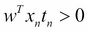

从代码中可以看出`.mmul()`是针对向量或矩阵之间的乘法。我们在[第二章](part0018_split_000.html#H5A41-39437f1d2f624cb5b197ebc27900db65 "Chapter 2. Algorithms for Machine Learning – Preparing for Deep Learning")、*机器学习的算法——为深度学习做准备*中写了这部分计算，如下:

```
   double c = 0.;

   // check if the data is classified correctly
   for (int i = 0; i < nIn; i++) {
       c += w[i] * x[i] * t;
   }
```

通过比较这两个代码，您可以看到向量或矩阵之间的乘法可以很容易地用`INDArray`编写，因此您可以通过遵循等式直观地实现该算法。

更新模型参数的公式如下:

```
       w.addi(x.transpose().mul(t).mul(learningRate));
```

这里，你可以像写数学方程式一样实现代码。该等式表示如下:

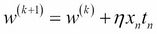

上次我们实现这一部分时，我们用一个`for`循环来编写它:

```
for (int i = 0; i < nIn; i++) {
   w[i] += learningRate * x[i] * t;
}
```

此外，训练后的预测也是标准的正向激活，如下式所示:

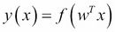

这里:

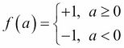

我们可以简单地用一行代码定义`predict`方法，如下所示:

```
public int predict(INDArray x) {

   return step(x.mmul(w).getDouble(0));
}
```

当你运行程序时，你可以看到它的精度和准确性，召回率和我们用之前的代码得到的是一样的。

因此，这将极大地帮助你实现类似于数学方程的算法。我们这里只实现感知器，但请自行尝试其他算法。


# 【DL4J 的实施

ND4J 就是帮你轻松便捷实现深度学习的库。然而，您必须自己实现算法，这与前面章节中的实现没有太大的不同。换句话说，ND4J 只是一个让计算数值更容易的库，而不是一个针对深度学习算法优化的库。一个使深度学习更容易处理的库是 DL4J。幸运的是，对于 DL4J，GitHub(【https://github.com/deeplearning4j/dl4j-0.4-examples】)上公布了一些带有典型方法的示例代码。这些例子的使用前提是你用的是 DL4J 的 0.4-*版。当您实际克隆这个库时，请再次检查最新版本。在这一节中，我们将从这些示例程序中提取出基础部分来看一看。在本节中，我们将引用[https://github.com/yusugomori/dl4j-0.4-examples](https://github.com/yusugomori/dl4j-0.4-examples)上的分叉库作为截图。


## 设置

让我们首先从克隆的存储库中设置环境。如果您正在使用 IntelliJ，您可以从现有的源代码中导入来自**文件** | **新建** | **项目**的项目，并选择存储库的路径。然后，选择**从外部模型**导入项目，并选择 **Maven** ，如下所示:

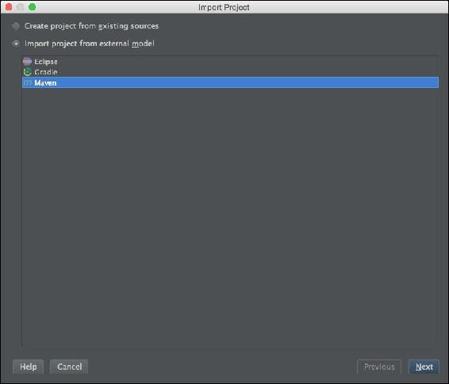

除了点击**下一步**之外，您不必为其他步骤做任何特别的事情。请注意， JDK 支持的版本是 1.7 或以上。这可能不是问题，因为在前面的章节中我们需要 1.8 或更高版本。一旦设置成功，您就可以确认目录的结构，如下所示:

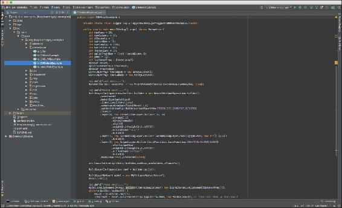

一旦你设置好了项目，我们先来看看`pom.xml`。可以看到 DL4J 相关的包的描述写成了:

```
<dependency>
   <groupId>org.deeplearning4j</groupId>
   <artifactId>deeplearning4j-nlp</artifactId>
   <version>${dl4j.version}</version>
</dependency>

<dependency>
   <groupId>org.deeplearning4j</groupId>
   <artifactId>deeplearning4j-core</artifactId>
   <version>${dl4j.version}</version>
</dependency>
```

另外，从下面几行可以看出，DL4J 依赖于 ND4J:

```
<dependency>
   <groupId>org.nd4j</groupId>
   <artifactId>nd4j-x86</artifactId>
   <version>${nd4j.version}</version>
</dependency>
```

如果你想在 GPU 上运行一个程序，你所要做的只是改变这个书面部分。如前一节所述，如果您安装了 CUDA，可以按如下方式编写:

```
<dependency>
   <groupId>org.nd4j</groupId>
   <artifactId>nd4j-jcublas-XXX</artifactId>
   <version>${nd4j.version}</version>
</dependency>
```

这里，`XXX`是 CUDA 的版本，取决于您机器的偏好。采用 GPU 计算只用这个就很棒了。我们不必做任何特殊的事情，我们可以专注于深度学习的实现。

DL4J 开发和使用的另一个特色库是 **Canova** 。对应于`pom.xml`的部分如下:

```
<dependency>
   <artifactId>canova-nd4j-image</artifactId>
   <groupId>org.nd4j</groupId>
   <version>${canova.version}</version>
</dependency>
<dependency>
   <artifactId>canova-nd4j-codec</artifactId>
   <groupId>org.nd4j</groupId>
   <version>${canova.version}</version>
</dependency>
```

当然，Canova 也是一个开源库，它的源代码可以在 https://github.com/deeplearning4j/Canova 的 GitHub 上看到。正如该页上所解释的，Canova 是用于将原始数据向量化为跨机器学习工具的可用矢量格式的库。这也有助于我们关注数据挖掘中更重要的部分，因为数据格式化在我们进行的任何研究或实验中都是不可或缺的。


## 建造

让我们看看示例中的源代码，看看如何构建深度学习模型。在这个过程中，你还没学过的深度学习的术语也简单讲解了一下。这些示例是用各种模型实现的，如 MLP、DBN 和 CNN，但这里有一个问题。正如您在查看`README.md`时所看到的，有些方法不能产生很好的精度。这是因为，如前一节所述，机器的计算精度是有限的，在此过程中计算值的波动完全取决于实施的差异。因此，实际上，学习不可能做得很好，尽管理论上应该做得很好。例如，你可以通过改变种子值或调整参数来获得更好的结果，但是因为我们想关注如何使用一个库，我们将使用一个获得更高精度的模型作为例子。

### DBNIrisExample.java

我们先来看看`deepbelief`的包装里的 `DBNIrisExample.java`。包含在文件名中的 Iris 是在测量机器学习方法的精确度或准确度时经常使用的基准数据集之一。该数据集包含 3 类中的 150 条数据，每类 50 个实例，每类涉及一种鸢尾植物。输入的数量是 4，因此输出的数量是 3。一类与另外两类是线性可分的；后者彼此不是线性可分的。

实施从设置配置开始。以下是需要设置的变量:

```
final int numRows = 4;
final int numColumns = 1;
int outputNum = 3;
int numSamples = 150;
int batchSize = 150;
int iterations = 5;
int splitTrainNum = (int) (batchSize * .8);
int seed = 123;
int listenerFreq = 1;
```

在 DL4J 中，输入数据最多可以是二维数据，因此您需要指定数据的行数和列数。由于虹膜是一维数据，`numColumns`被设置为`1`。这里的`numSamples`是总数据，`batchSize`是每个小批量的数据量。由于总数据为 150，并且相对较小，`batchSize`被设置为相同的数字。这意味着学习是在不将数据分成小批的情况下完成的。`splitTrainNum`是决定训练数据和测试数据之间分配的变量。这里，所有数据集的 80%是训练数据，20%是测试数据。在上一节中，`listenerFreq`决定了我们在日志记录过程中看到损失函数值的频率。此处该值设置为 1，这意味着在每个时期后记录该值。

随后，我们需要获取数据集。在 DL4J 中，准备了一个类，该类可以容易地获取关于典型数据集(如 Iris、MINST 和 LFW)的数据。因此，如果您想获取 Iris 数据集，只需编写以下行:

```
DataSetIterator iter = new IrisDataSetIterator(batchSize, numSamples);
```

下面两行用于格式化数据:

```
DataSet next = iter.next();
next.normalizeZeroMeanZeroUnitVariance();
```

此代码将数据分为训练数据和测试数据，并分别存储它们:

```
SplitTestAndTrain testAndTrain = next.splitTestAndTrain(splitTrainNum, new Random(seed));
DataSet train = testAndTrain.getTrain();
DataSet test = testAndTrain.getTest();
```

如您所见，它通过用`DataSet`类处理 DL4J 准备的所有数据，使数据处理变得更加容易。

现在，让我们实际建立一个模型。基本结构如下:

```
MultiLayerConfiguration conf = new NeuralNetConfiguration.Builder().layer().layer() … .layer().build();
MultiLayerNetwork model = new MultiLayerNetwork(conf);
model.init();
```

代码从定义模型配置开始，然后用定义构建并初始化实际的模型。我们来看看配置细节。一开始，整个网络是这样建立的:

```
MultiLayerConfiguration conf = new NeuralNetConfiguration.Builder()
   .seed(seed)
   .iterations(iterations)
   .learningRate(1e-6f)
   .optimizationAlgo(OptimizationAlgorithm.CONJUGATE_GRADIENT)
   .l1(1e-1).regularization(true).l2(2e-4)
   .useDropConnect(true)
   .list(2)
```

配置设置是不言自明的。不过，既然你之前没学过正规化，那就简单查一下吧。

正则化防止神经网络模型过拟合，并使模型更通用。为了实现这一点，评估函数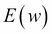用惩罚项重写如下:

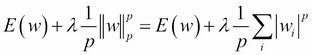

这里，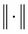表示向量范数。当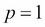时，正则化被称为 L1 正则化，当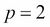时，正则化被称为 L2 正则化。该范数分别称为 L1 范数和 L2 范数。这就是为什么我们在代码中有`.l1()`和`.l2()`的原因。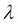是超参数。这些正则化项使模型更加稀疏。L2 正则化也称为权重衰减，用于防止梯度消失问题。

`.useDropConnect()`命令用于启用 dropout，而`.list()`用于定义层数，不包括输入层。

当你建立了一个完整的模型，那么下一步就是配置每一层。在此示例代码中，模型没有定义为深度神经网络。一个单独的 RBM 层被定义为隐藏层:

```
.layer(0, new RBM.Builder(RBM.HiddenUnit.RECTIFIED, RBM.VisibleUnit.GAUSSIAN)
 .nIn(numRows * numColumns)
 .nOut(3)
 .weightInit(WeightInit.XAVIER)
 .k(1)
 .activation("relu")
 .lossFunction(LossFunctions.LossFunction.RMSE_XENT)
 .updater(Updater.ADAGRAD)
 .dropOut(0.5)
 .build()
)
```

这里，第一行中的值`0`是层的索引，而`.k()`用于对比发散。由于 Iris 的数据是浮点值，我们不能使用二进制 RBM。这就是为什么我们在这里有`RBM.VisibleUnit.GAUSSIAN`，使模型能够处理连续值。还有，关于这一层的定义，特别要提到的是`Updater.ADAGRAD`的作用。这用于优化学习速率。现在，我们继续讨论模型结构，关于优化器的详细解释将在本章末尾介绍。

随后的输出层非常简单，不言自明:

```
 .layer(1, new OutputLayer.Builder(LossFunctions.LossFunction.MCXENT)
   .nIn(3)
   .nOut(outputNum)
   .activation("softmax")
   .build()
)
```

因此，神经网络由三层构成:输入层、隐藏层和输出层。该示例的图形模型可以如下所示:

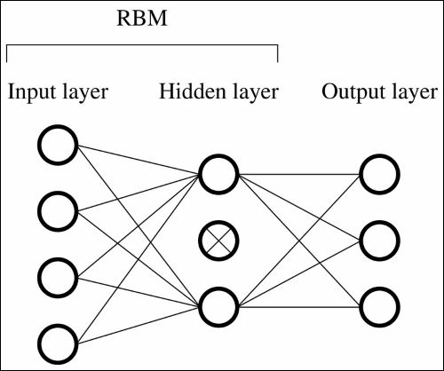

模型建立后，我们需要训练网络。这里，代码也非常简单:

```
model.setListeners(Arrays.asList((IterationListener) new ScoreIterationListener(listenerFreq)));
model.fit(train);
```

因为第一行是记录过程，所以我们训练模型需要做的只是写`model.fit()`。

使用 DL4J 测试或评估模型也很容易。首先，用于评估的变量设置如下:

```
Evaluation eval = new Evaluation(outputNum);
INDArray output = model.output(test.getFeatureMatrix());
```

然后，我们可以使用以下公式获得特征矩阵的值:

```
eval.eval(test.getLabels(), output);
log.info(eval.stats());
```

通过运行代码，我们将得到如下结果:

```
==========================Scores=====================================
 Accuracy:  0.7667
 Precision: 1
 Recall:    0.7667
 F1 Score:  0.8679245283018869
=====================================================================

```

`F1 Score`又称`F-Score`或`F-measure`，是精度和召回的谐音，表示如下:

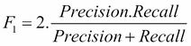

这个值经常被计算来衡量模型的性能。此外，如示例中所述，您可以通过编写以下内容来查看实际值和预测值:

```
for (int i = 0; i < output.rows(); i++) {
   String actual = test.getLabels().getRow(i).toString().trim();
   String predicted = output.getRow(i).toString().trim();
   log.info("actual " + actual + " vs predicted " + predicted);
}
```

整个培训和测试过程就是这样。前面代码中的神经网络并不深入，但是您只需按如下方式更改配置，就可以轻松构建深度神经网络:

```
MultiLayerConfiguration conf = new NeuralNetConfiguration.Builder()
       .seed(seed)
       .iterations(iterations)
       .learningRate(1e-6f)
       .optimizationAlgo(OptimizationAlgorithm.CONJUGATE_GRADIENT)
       .l1(1e-1).regularization(true).l2(2e-4)
       .useDropConnect(true)
       .list(3)
       .layer(0, new RBM.Builder(RBM.HiddenUnit.RECTIFIED, RBM.VisibleUnit.GAUSSIAN)
                       .nIn(numRows * numColumns)
                       .nOut(4)
                       .weightInit(WeightInit.XAVIER)
                       .k(1)
                       .activation("relu")
                       .lossFunction(LossFunctions.LossFunction.RMSE_XENT)
                       .updater(Updater.ADAGRAD)
                       .dropOut(0.5)
                       .build()
       )
       .layer(1, new RBM.Builder(RBM.HiddenUnit.RECTIFIED, RBM.VisibleUnit.GAUSSIAN)
                       .nIn(4)
                       .nOut(3)
                       .weightInit(WeightInit.XAVIER)
                       .k(1)
                       .activation("relu")
                       .lossFunction(LossFunctions.LossFunction.RMSE_XENT)
                       .updater(Updater.ADAGRAD)
                       .dropOut(0.5)
                       .build()
       )
       .layer(2, new OutputLayer.Builder(LossFunctions.LossFunction.MCXENT)
                       .nIn(3)
                       .nOut(outputNum)
                       .activation("softmax")
                       .build()
       )
       .build();
```

如您所见，构建深度神经网络只需要 DL4J 的简单实现。一旦你建立了模型，你需要做的就是调整参数。例如，增加迭代值或改变种子值会返回更好的结果。

### CSVExample.java

在前面的例子中，我们用数据集作为基准指标来训练模型。当您想用自己准备的数据训练和测试模型时，可以很容易地从 CSV 导入它。我们来看看 CSV 包里的`CSVExample.java`。第一步是初始化 CSV 阅读器，如下所示:

```
RecordReader recordReader = new CSVRecordReader(0,",");
```

在 DL4J 中，准备了一个名为`CSVRecordReader`的类，您可以轻松地从 CSV 文件导入数据。`CSVRecordReader`类中第一个参数的值表示文件中应该跳过多少行。当文件包含标题行时，这很方便。第二个参数是分隔符。要实际读取文件并导入数据，代码可以编写如下:

```
recordReader.initialize(new FileSplit(new ClassPathResource("iris.txt").getFile()));
```

有了这段代码，`resources/iris.txt`中的文件将被导入到模型中。此处文件中的值与 Iris 数据集中的值相同。为了将这些初始化的数据用于模型训练，我们将迭代器定义如下:

```
DataSetIterator iterator = new RecordReaderDataSetIterator(recordReader,4,3);
DataSet next = iterator.next();
```

在前面的例子中，我们使用了`IrisDataSetIterator`类，但是这里使用了`RecordReaderDataSetIterator`类，因为我们使用了自己准备好的数据。值`4`和`3`分别是特征和标签的数量。

构建和训练模型的方式几乎与上一个示例中解释的过程相同。在这个例子中，我们用 dropout 和 rectifier 构建两个隐藏层的深度神经网络，即我们有一个输入层-隐藏层-隐藏层-输出层，如下:

```
MultiLayerConfiguration conf = new NeuralNetConfiguration.Builder()
       .seed(seed)
       .iterations(iterations)
       .constrainGradientToUnitNorm(true).useDropConnect(true)
       .learningRate(1e-1)
       .l1(0.3).regularization(true).l2(1e-3)
       .constrainGradientToUnitNorm(true)
       .list(3)
       .layer(0, new DenseLayer.Builder().nIn(numInputs).nOut(3)
               .activation("relu").dropOut(0.5)
               .weightInit(WeightInit.XAVIER)
               .build())
       .layer(1, new DenseLayer.Builder().nIn(3).nOut(2)
               .activation("relu")
               .weightInit(WeightInit.XAVIER)
               .build())
       .layer(2, new OutputLayer.Builder(LossFunctions.LossFunction.NEGATIVELOGLIKELIHOOD)
               .weightInit(WeightInit.XAVIER)
               .activation("softmax")
               .nIn(2).nOut(outputNum).build())
       .backprop(true).pretrain(false)
       .build();
```

我们可以使用以下代码行运行模型:

```
MultiLayerNetwork model = new MultiLayerNetwork(conf);
model.init();
```

图形模型如下所示:

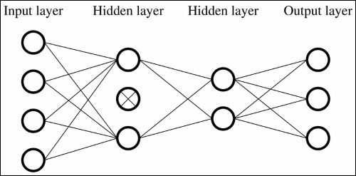

然而，这一次，为训练编码的方式与前面的例子略有不同。之前，我们使用以下方法将数据分为训练数据和测试数据:

```
SplitTestAndTrain testAndTrain = next.splitTestAndTrain(splitTrainNum, new Random(seed));
```

这表明我们在`.splitTestAndTrain()`方法中混洗了数据。在本例中，我们使用以下代码设置培训数据:

```
next.shuffle();
SplitTestAndTrain testAndTrain = next.splitTestAndTrain(0.6);
```

如您所见，这里的数据首先被混洗，然后分成训练数据和测试数据。注意`.splitTestAndTrain()`中的参数类型互不相同。这将是有益的，因为我们不必计算确切的数据量或训练数据。实际培训是通过以下方式完成的:

```
model.fit(testAndTrain.getTrain());
```

评估模型的方法与前面的示例相同:

```
Evaluation eval = new Evaluation(3);
DataSet test = testAndTrain.getTest();
INDArray output = model.output(test.getFeatureMatrix());
eval.eval(test.getLabels(), output);
log.info(eval.stats());
```

使用前面的代码，我们得到以下结果:

```
==========================Scores=====================================
 Accuracy:  1
 Precision: 1
 Recall:    1
 F1 Score:  1.0
=====================================================================

```

除了基准指标的数据集之外，您现在可以分析您拥有的任何数据。

为了使模型更深，你只需要添加另一层如下:

```
MultiLayerConfiguration conf = new NeuralNetConfiguration.Builder()
       .seed(seed)
       .iterations(iterations)
       .constrainGradientToUnitNorm(true).useDropConnect(true)
       .learningRate(0.01)
       .l1(0.0).regularization(true).l2(1e-3)
       .constrainGradientToUnitNorm(true)
       .list(4)
       .layer(0, new DenseLayer.Builder().nIn(numInputs).nOut(4)
               .activation("relu").dropOut(0.5)
               .weightInit(WeightInit.XAVIER)
               .build())
       .layer(1, new DenseLayer.Builder().nIn(4).nOut(4)
               .activation("relu").dropOut(0.5)
               .weightInit(WeightInit.XAVIER)
               .build())
       .layer(2, new DenseLayer.Builder().nIn(4).nOut(4)
               .activation("relu").dropOut(0.5)
               .weightInit(WeightInit.XAVIER)
               .build())
       .layer(3, new OutputLayer.Builder(LossFunctions.LossFunction.NEGATIVELOGLIKELIHOOD)
               .weightInit(WeightInit.XAVIER)
               .activation("softmax")
               .nIn(4).nOut(outputNum).build())
       .backprop(true).pretrain(false)
       .build();
```


## CNNMnistExample.java/LenetMnistExample.java

由于其结构，CNN 相对于其他模型而言相当复杂，但我们不需要担心这些复杂性，因为我们可以轻松地用 DL4J 实现 CNN。我们来看看卷积的包里的`CNNMnistExample.java`。在这个例子中，我们用最著名的基准指标之一的 MNIST 数据集(【http://yann.lecun.com/exdb/mnist/】)来训练模型。正如[第一章](part0014_split_000.html#DB7S2-39437f1d2f624cb5b197ebc27900db65 "Chapter 1. Deep Learning Overview")、*深度学习概述*中提到的，这个数据集包含 7 万个从 0 到 9 的手写数字数据，每个数据的高度和宽度都是 28 个像素。

首先，我们定义模型所需的值:

```
int numRows = 28;
int numColumns = 28;
int nChannels = 1;
int outputNum = 10;
int numSamples = 2000;
int batchSize = 500;
int iterations = 10;
int splitTrainNum = (int) (batchSize*.8);
int seed = 123;
int listenerFreq = iterations/5;
```

由于 MNIST 的图像都是灰度数据，通道数设置为`1`。在这个例子中，我们使用`70,000`的`2,000`数据，并将其分成训练数据和测试数据。这里小批量的大小是`500`，所以训练数据被分成 4 个小批量。此外，每个小批中的数据被分成训练数据和测试数据，每条测试数据都存储在`ArrayList`中:

```
List<INDArray> testInput = new ArrayList<>();
List<INDArray> testLabels = new ArrayList<>();
```

我们不需要在前面的例子中设置`ArrayList`,因为我们只有一个批处理。对于`MnistDataSetIterator`类，我们可以通过使用以下命令来设置 MNIST 数据:

```
DataSetIterator mnistIter = new MnistDataSetIterator(batchSize,numSamples, true);
```

然后，我们建立了一个卷积层和子采样层的模型。这里，我们有一个卷积层和一个最大池层，紧接着是一个输出层。CNN 的配置结构与其他算法略有不同:

```
MultiLayerConfiguration.Builder builder = new NeuralNetConfiguration.Builder().layer().layer(). … .layer()
new ConvolutionLayerSetup(builder,numRows,numColumns,nChannels);
MultiLayerConfiguration conf = builder.build();
MultiLayerNetwork model = new MultiLayerNetwork(conf);
model.init();
```

不同的是，我们不能直接从配置中构建模型，因为我们需要告诉构建器提前使用`ConvolutionLayerSetup()`设置一个卷积层。每个`.layer()`都需要相同的编码方法。卷积层定义为:

```
.layer(0, new ConvolutionLayer.Builder(10, 10)
       .stride(2,2)
       .nIn(nChannels)
       .nOut(6)
       .weightInit(WeightInit.XAVIER)
       .activation("relu")
       .build())
```

这里，`ConvolutionLayer.Builder()`中的`10`的值是内核的大小，`.nOut()`中的`6`的值是内核的个数。另外，`.stride()`定义了内核的步幅大小。我们在[第 4 章](part0028_split_000.html#QMFO1-39437f1d2f624cb5b197ebc27900db65 "Chapter 4. Dropout and Convolutional Neural Networks")、 *Dropout 和卷积神经网络*中从头实现的代码，其功能仅相当于`.stride(1, 1)`。数字越大，花费的时间越少，因为它减少了卷积所需的计算次数，但同时我们必须小心，这也可能降低模型的精度。无论如何，我们现在可以更灵活地实现卷积。

`subsampling`层描述为:

```
.layer(1, new SubsamplingLayer.Builder(SubsamplingLayer.PoolingType.MAX, new int[] {2,2})
       .build())
```

这里，`{2, 2}`是汇集窗口的大小。您可能已经注意到，我们不必为每一层设置输入的大小，包括输出层。一旦建立了模型，这些值就会自动设置。

可以像在其他模型中一样编写输出层:

```
.layer(2, new OutputLayer.Builder(LossFunctions.LossFunction.NEGATIVELOGLIKELIHOOD)
       .nOut(outputNum)
       .weightInit(WeightInit.XAVIER)
       .activation("softmax")
       .build())
```

该示例的图形模型如下:

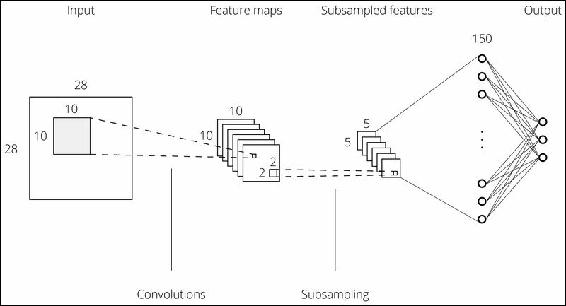

建筑之后是训练。由于我们有多个小批量，我们需要在所有批量中迭代训练。在这种情况下，这可以通过在`DataSetIterator`和`mnistIter`上使用`.hasNext()`轻松实现。整个训练过程可以写成这样:

```
model.setListeners(Arrays.asList((IterationListener) new ScoreIterationListener(listenerFreq)));
while(mnistIter.hasNext()) {
   mnist = mnistIter.next();
   trainTest = mnist.splitTestAndTrain(splitTrainNum, new Random(seed));
   trainInput = trainTest.getTrain();
   testInput.add(trainTest.getTest().getFeatureMatrix());
   testLabels.add(trainTest.getTest().getLabels());
   model.fit(trainInput);
}
```

在这里，测试数据和测试标签被储存以备将来使用。

在测试过程中，我们需要重复测试数据的评估过程，因为我们有不止一个小批量:

```
for(int i = 0; i < testInput.size(); i++) {
   INDArray output = model.output(testInput.get(i));
   eval.eval(testLabels.get(i), output);
}
```

然后，我们使用与其他示例中相同的方法:

```
log.info(eval.stats());
```

这将返回如下的结果:

```
==========================Scores=====================================
 Accuracy:  0.832
 Precision: 0.8783
 Recall:    0.8334
 F1 Score:  0.8552464933704985
=====================================================================

```

刚刚给出的例子是一个卷积层和一个子采样层的模型，但你有带`LenetMnistExample.java`的深度卷积神经网络。在本例中，有两个卷积层和二次采样层，后面是完全连接的多层感知器:

```
MultiLayerConfiguration.Builder builder = new NeuralNetConfiguration.Builder()
       .seed(seed)
       .batchSize(batchSize)
       .iterations(iterations)
       .regularization(true).l2(0.0005)
       .learningRate(0.01)
       .optimizationAlgo(OptimizationAlgorithm.STOCHASTIC_GRADIENT_DESCENT)
       .updater(Updater.NESTEROVS).momentum(0.9)
       .list(6)
       .layer(0, new ConvolutionLayer.Builder(5, 5)
               .nIn(nChannels)
               .stride(1, 1)
               .nOut(20).dropOut(0.5)
               .weightInit(WeightInit.XAVIER)
               .activation("relu")
               .build())
       .layer(1, new SubsamplingLayer.Builder(SubsamplingLayer.PoolingType.MAX, new int[]{2, 2})
               .build())
       .layer(2, new ConvolutionLayer.Builder(5, 5)
               .nIn(20)
               .nOut(50)
               .stride(2,2)
               .weightInit(WeightInit.XAVIER)
               .activation("relu")
               .build())
       .layer(3, new SubsamplingLayer.Builder(SubsamplingLayer.PoolingType.MAX, new int[]{2, 2})
               .build())
       .layer(4, new DenseLayer.Builder().activation("tanh")
               .nOut(500).build())
       .layer(5, new OutputLayer.Builder(LossFunctions.LossFunction.NEGATIVELOGLIKELIHOOD)
               .nOut(outputNum)
               .weightInit(WeightInit.XAVIER)
               .activation("softmax")
               .build())
       .backprop(true).pretrain(false);
new ConvolutionLayerSetup(builder,28,28,1);
```

在第一个卷积层可以看到，dropout 很容易用 DL4J 应用到 CNN。

使用这个模型，我们得到以下结果:

```
==========================Scores=====================================
 Accuracy:  0.8656
 Precision: 0.8827
 Recall:    0.8645
 F1 Score:  0.873490476878917
=====================================================================

```

从 MNIST 数据集页面([http://yann.lecun.com/exdb/mnist/](http://yann.lecun.com/exdb/mnist/))可以看到，最先进的结果要比上图好得多。在这里，你会再次意识到参数、激活函数和优化算法的组合是多么重要。


## 学习率优化

到目前为止我们已经学习了各种深度学习算法；你可能已经注意到它们有一个共同的参数:学习率。在方程中定义学习率以更新模型参数。那么，为什么不想到算法来优化学习率呢？最初，这些方程描述如下:

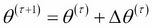

这里:

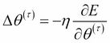

这里，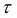是步数，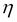是学习率。众所周知，随着每次迭代降低学习率的值会使模型具有更好的精度，但是我们应该仔细确定下降的程度，因为值的突然下降会使模型崩溃。学习率是模型参数之一，为什么不优化呢？要做到这一点，我们需要知道什么是最佳利率。

设定速率的最简单方法是使用动量，表示如下:

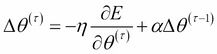

在这里，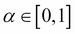，称为 **动量系数**。这个超参数通常先设置为 0.5 或 0.9，然后进行微调。

动力实际上是调整学习速度的一种简单而有效的方法，但是由杜奇等人(【http://www.magicbroom.info/Papers/DuchiHaSi10.pdf】)提出的**阿达格拉德**，被认为是一种更好的方法。该等式描述如下:

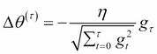

这里:

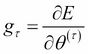

从理论上讲，这很有效，但实际上，我们经常使用以下等式来防止发散:

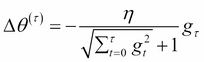

或者我们使用:

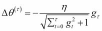

ADAGRAD 比 momentum 更容易使用，因为它的值是自动设置的，我们不需要设置额外的超级参数。

众所周知，由泽勒([http://arxiv.org/pdf/1212.5701.pdf](http://arxiv.org/pdf/1212.5701.pdf))提出的 ADADELTA 是一个更好的优化器。这是一个基于算法的优化器，不能写在一个等式中。以下是对 ADADELTA 的描述:

*   Initialization:

    *   Initialize accumulation variables: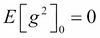

    并且:

    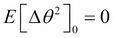
*   迭代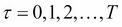 :

    *   计算:
    *   累加渐变: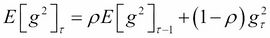
    *   计算更新: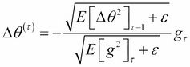
    *   累加更新: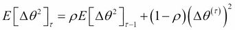
    *   应用更新:

这里，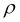和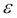是超参数。您可能认为 ADADELTA 相当复杂，但是在用 DL4J 实现时，您不需要担心这种复杂性。

DL4J 支持的还有其他优化器比如 **RMSProp** 、 **RMSProp** + 动量、**内斯特罗夫的加速梯度** **下降**。然而，我们不会深究它们，因为实际上，momentum、ADAGRAD 和 ADADELTA 足以优化学习率。


# 总结

在本章中，您学习了如何使用库 ND4J 和 DL4J 实现深度学习模型。两者都支持 GPU 计算，并且都让我们能够毫无困难地实现它们。ND4J 是一个用于科学计算的库，支持矢量化，这使得在数组之间实现计算变得更加容易，因为我们不需要在数组中编写迭代。由于机器学习和深度学习算法有许多带有向量计算的方程，如内积和元素级乘法，ND4J 也有助于实现它们。

DL4J 是一个用于深度学习的库，通过使用该库的一些示例，您可以看到我们可以轻松地构建、训练和评估各种类型的深度学习模型。此外，在构建模型时，您了解了为什么正则化对于获得更好的结果是必要的。你还应该知道一些优化学习速度的方法:momentum、ADAGRAD 和 ADADELTA。所有这些都可以用 DL4J 轻松实现。

你获得了深度学习算法的核心理论和实现的知识，现在你知道如何毫不费力地实现它们。我们可以说已经完成了这本书的理论部分。因此，在下一章中，我们将首先研究深度学习算法如何适应实际应用，然后研究其他可能的领域和想法来应用这些算法。