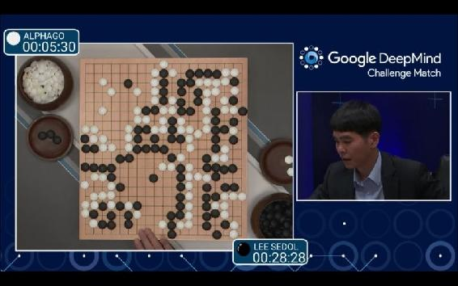
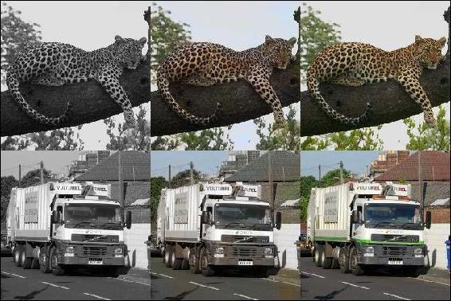
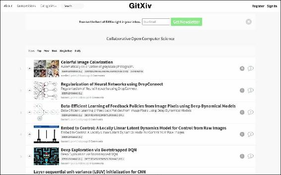
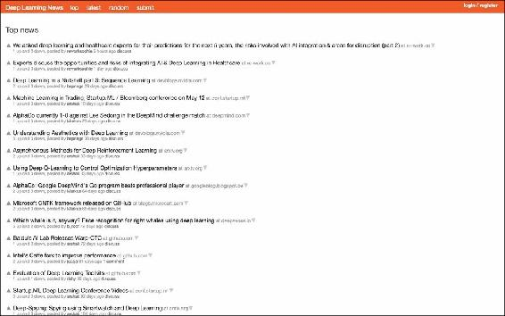

# 八、下一步是什么？

在前面的章节中，我们学习了深度学习的概念、理论、实现以及如何使用库。现在你知道深度学习的基本技术了，不用担心。另一方面，深度学习的发展很快，明天可能会开发出新的模型。关于 AI 或者深度学习的大新闻每天一个接一个的出来。既然你已经掌握了基本的技术，你就可以快速了解即将到来的人工智能和深度学习的新技术。现在，让我们离开技术的细节，想想人工智能领域将会或者应该走什么样的道路。深度学习的前景如何？对于最后一章，让我们考虑一下。我们将在本章中继续讨论以下主题:

*   深度学习行业热点话题
*   如何管理人工智能技术
*   如何进一步进行深度学习的研究

至于最后一个话题，关于深造，我会推荐一个关于深度学习的网站。你可以通过思考接下来可能会出现什么技术，或者利用你学到的技术来创新，而不是随着人工智能的发展而发展，从而保持领先。

# 关于深度学习的突发新闻

深度学习引发了 AI 热潮，也阻挡不了它的势头。每天都有新的结果报道。正如在第 6 章、*的[中提到的，实际应用的方法——循环神经网络和更多](part0037_split_000.html#1394Q2-39437f1d2f624cb5b197ebc27900db65 "Chapter 6. Approaches to Practical Applications – Recurrent Neural Networks and More")*，许多研究人员在图像识别和自然语言处理方面展开竞争。当然，深度学习并不局限于这两个领域，而是适用于很多其他领域。这些应用的结果非常令人兴奋。

在这场 AI 热潮中，2016 年 3 月，围棋界被一个事件撼动。围棋是一种棋盘游戏，两个玩家试图占领比对手更多的地盘。当一台机器，也就是人工智能，在围棋上击败人类时,'人工智能在围棋上击败人类'的消息不仅震惊了围棋选手，也震惊了整个世界。被谷歌收购的 DeepMind([https://deepmind.com/](https://deepmind.com/))一直在开发名为 AlphaGo 的围棋人工智能，AlphaGo 第四次击败世界级选手 Lee Sedol，在谷歌 deep mind 挑战赛的五场系列赛中以四比一获胜。每场比赛都通过 YouTube 在 livestream 上发布，许多人实时观看了比赛。你可以在 YouTube 上观看所有五场比赛，如果你还没有看过的话:

*   **第一场**:【https://www.youtube.com/watch?v=vFr3K2DORc8 
*   **第二场**:【https://www.youtube.com/watch?v=l-GsfyVCBu0 
*   **第三场**:【https://www.youtube.com/watch?v=qUAmTYHEyM8 
*   **第四场**:【https://www.youtube.com/watch?v=yCALyQRN3hw 
*   **第五场**:【https://www.youtube.com/watch?v=mzpW10DPHeQ】T2

在这些比赛中，第一场比赛，第一场比赛，获得了特别多的关注。还有，看浏览量，135 万多，可以看到很多人都看过第四场比赛的视频，那是 AlphaGo 输给李世石的唯一一场比赛。以下是捕捉到第一场比赛的一个场景的图像:

AlphaGo 击败李·塞多([https://www.youtube.com/watch?v=vFr3K2DORc8](https://www.youtube.com/watch?v=vFr3K2DORc8))的那一刻

那是一个时刻，不仅是 AI 的研究人员，而且是世界，都为 AlphaGo 感到兴奋；但是为什么这个新闻得到这么多关注呢？再举一个棋盘游戏的例子，在一场国际象棋比赛中，IBM 开发的深蓝在 1997 年击败了国际象棋世界冠军。当然，这在当时成了大新闻，因为这也是机器打败人类的时刻。那么，当这不是机器第一次击败人类时，为什么 AlphaGo 战胜 Lee SeDol 的消息如此震惊世界？象棋和围棋有什么区别？不同之处在于围棋模式的复杂性。事实上，围棋的策略模式比象棋多得多。在流行的棋盘游戏中，如国际象棋、Shogi 和 Go，决定谁赢谁输的模式数如下:

*   国际象棋:10，120
*   Shogi: 10,220
*   go:10360

即使看看这些数字，你也能看出围棋的策略有多复杂，并且很容易想象一台机器也需要大量的计算。由于这种庞大的模式数量，直到最近，人们还认为 AlphaGo 不可能打败人类，或者 AlphaGo 要打败人类还需要 100 年或 200 年。人们认为机器不可能在现实时间内计算出围棋的模式。但是现在，仅仅几年时间，一台机器就打败了人类。根据谷歌研究博客，在 DeepMind 挑战赛举行的 1.5 个月前，DeepMind 可以预测人类 57%的动作([http://Google research . blogspot . jp/2016/01/alpha go-mastering-ancient-game-of-go . html](http://googleresearch.blogspot.jp/2016/01/alphago-mastering-ancient-game-of-go.html))。机器战胜人类的事实无疑产生了影响，但机器能够在现实时间内学习围棋策略的事实更令人惊讶。DeepMind 将深度神经网络与蒙特卡罗树搜索和强化学习相结合，显示了深度神经网络算法的应用范围之广。

# 预期的下一步行动

自从关于 AlphaGo 的新闻被媒体报道以来，人工智能热潮无疑得到了推动。你可能会注意到，最近你在媒体上更频繁地听到“深度学习”这个词。可以说，世界对 AI 的期望已经提高了那么多。有趣的是，“深度学习”这个术语原本是一个技术术语，现在却在日常新闻中普遍使用。你可以看到术语 **AI** 的形象一直在变化。可能，直到几年前，如果人们听说人工智能，他们中的许多人会想象一个实际的机器人，但现在呢？人工智能这个术语现在经常被使用——不是特别有意识地——关于软件或应用程序，并且被接受为司空见惯。这只是一个迹象，表明世界已经开始正确理解人工智能，这是为了研究而开发的。如果一项技术被带到错误的方向，它就会产生排斥，或者一些人开始错误地开发这项技术；然而，目前看来，人工智能技术的繁荣正朝着好的方向发展。

当我们为人工智能的发展感到兴奋时，一些人理所当然会感到恐惧或焦虑。很容易想象，有些人可能会认为，像科幻电影或小说中那样，机器主宰人类的世界迟早会到来，尤其是在 AlphaGo 在围棋界战胜 Lee SeDol 之后，当时据说机器不可能打败人类；感到焦虑的人数可能会增加。然而，尽管如果你只关注“一台机器赢了”这个事实，那么机器打败人类的消息可能会被视为负面消息，但这绝对不是负面消息。相反，这对人类来说是个好消息。为什么？这里有两个原因。

第一个原因是谷歌 DeepMind 挑战赛是一场人类残疾的比赛。不仅对于围棋，对于纸牌游戏或体育游戏，我们通常会在比赛前研究对手会使用什么战术，通过研究对手的行动模式来建立我们自己的策略。当然，DeepMind 已经研究了职业围棋选手的战术和如何下棋，而人类对机器如何下棋的研究还不够，因为 DeepMind 一直在研究并不断改变其行动模式，直到谷歌 DeepMind 挑战赛开始前的最后几分钟。因此，可以说出现了信息偏差或障碍。这是伟大的，李塞多尔赢得了这些障碍的一场比赛。也预示着 AI 会进一步发展。

另一个原因是，我们发现机器不可能摧毁人类的价值，反而会促进人类的进一步成长。在谷歌 DeepMind 挑战赛中，一台机器使用了一种人类从未使用过的策略。这个事实对我们来说是一个巨大的惊喜，但同时也意味着我们发现了一个人类需要研究的新东西。深度学习显然是一项伟大的技术，但我们不应该忘记神经网络涉及一种模仿人脑结构的算法。换句话说，它的基本原理和人类的思维模式是一样的。机器可以通过增加计算速度来发现人脑无法计算的模式疏漏。AlphaGo 可以使用输入的学习数据与 AlphaGo 进行比赛，并从比赛结果中学习。与人类不同，机器可以进行 24 小时的学习，因此它可以快速获得新的模式。然后，在这个过程中，机器会发现一种全新的模式，这种模式可以用于人类的进一步研究。通过研究一种人类无法发现的新策略，我们的围棋世界将会扩大，我们将会更加享受围棋。不用说，学习的不仅是机器，还有人类。在各个领域，机器会发现人类从未注意到的新事物，每次人类面对新发现时，他们也会前进。

AI 和人类是一种互补关系。重申一下，机器擅长计算大量的模式，并找出一个尚未被发现的模式。这远远超出了人类的能力。另一方面，AI 无法从一个全新的概念创造出一个新的想法，至少目前是这样。相反，这是人类擅长的领域。机器只能在给定的知识范围内判断事物。例如，如果只给 AI 许多种类的狗图像作为输入数据，它可以回答它是哪种狗，但如果它是猫，那么 AI 会利用它对狗的知识，尽力回答狗的种类。

AI 在某种程度上其实是一种无辜的存在，它只是从自己获得的知识中给出了最有可能的答案。思考应该给 AI 什么知识才能进步，这是人类的任务。如果你给出新的知识，人工智能将再次以相当快的速度从给定的知识中计算出最可能的答案。人也有不同的兴趣或知识，取决于他们成长的环境，这对 AI 来说也是一样的。也就是说，人工智能具有什么样的*个性*或者人工智能对人类来说是好是坏取决于人工智能接触的人。人工智能以错误的方式发展的一个典型例子是微软开发的名为 Tay ( `https://www.tay.ai`)的人工智能。2016 年 3 月 23 日，Tay 出现在推特上，有如下推文:*helloooooooo 世界！！！*

Tay 从 Twitter 上用户之间的互动中获得知识，并发布新的推文。这个审判本身就挺有意思的。

然而，就在它向公众开放后，问题就出现了。在 Twitter 上，用户对 Tay 进行了一次恶作剧，将歧视性知识输入其帐户。正因为如此，Tay 开始不断发布包含性别歧视言论的推文。而在 Tay 出现在 Twitter 上仅仅一天之后，Tay 就从 Twitter 上消失了，留下了下面这条推文: *c u 很快人类现在就需要睡眠今天这么多对话 thx* 。

如果你访问泰的推特账户的页面([https://twitter.com/tayandyou](https://twitter.com/tayandyou))，推文会受到保护，你再也看不到它们了:

Tay 的推特账号目前已被关闭

这正是人工智能被人类给予错误训练的结果。在过去的几年中，人工智能技术得到了极大的关注，这可能是进一步加快人工智能技术发展的因素之一。现在，下一步应该采取的行动是思考 AI 和人类如何相互交流。AI 本身只是众多技术中的一种。技术可以变成善或恶，取决于人类如何使用它；因此，我们应该小心如何控制这项技术，否则未来整个人工智能领域可能会萎缩。人工智能在某些狭窄的领域变得特别好，但它远不是压倒性的，也远不是科幻小说目前所设想的。AI 未来如何进化，取决于我们对知识和技术管理的运用。

虽然我们肯定应该关心如何控制技术，但我们不能放慢它的发展速度。考虑到最近机器人的繁荣，正如在脸书将推出机器人商店的故事中所看到的那样([http://TechCrunch . com/2016/03/17/face books-messenger-in-a-Bot-Store/](http://techcrunch.com/2016/03/17/facebooks-messenger-in-a-bot-store/))，我们很容易想象用户和应用程序之间的交互将成为聊天界面的基础，人工智能将与普通用户的日常生活融为一体。为了让更多的人熟悉 AI，我们应该进一步发展 AI 技术，让它更方便人们使用。

深度学习和人工智能得到了更多的关注，这意味着如果你想在这个领域取得杰出的成果，你很可能会发现激烈的竞争。很有可能你想做的实验已经被别人做了。深度学习领域正在成为初创企业这样高度竞争的世界。如果您拥有大量数据，您可能会通过分析这些数据来利用优势，但否则，您需要考虑如何用有限的数据进行实验。尽管如此，如果你想获得出色的表现，你最好记住以下几点:

### Tip

深度学习只能在训练给出的知识范围内判断事物。

基于此，您可以通过以下两种方法获得有趣的结果:

*   使用可以轻松生成用于训练和测试的输入数据和输出数据的数据进行实验
*   在实验中使用完全不同类型的数据，分别用于训练和测试

例如，对于第一种方法，您可以使用 CNN 检查自动着色。在[http://tinyclouds.org/colorize/](http://tinyclouds.org/colorize/)在线公开的项目中或者在[http://arxiv.org/pdf/1603.08511v1.pdf](http://arxiv.org/pdf/1603.08511v1.pdf)的论文中介绍过。这个想法是自动给灰度图像着色。如果你有任何彩色图像——这些应该很容易获得——你可以通过编写快速脚本来生成灰度图像。至此，您已经为训练准备好了输入数据和输出数据。能够准备大量数据意味着您可以更容易地进行测试并更频繁地获得高精度。以下是其中一个测试示例:

两者都引自 http://tinyclouds.org/colorize/的作品

模型的输入是左边的灰度图像，输出是中间的，右边的图像是真彩色图像。

对于第二种方法，使用完全不同类型的数据，分别用于训练和测试，在一个实验中，我们故意提供 AI 不知道的数据，并使随机答案和正确答案之间的差距变得有趣/有趣。例如，在*生成关于图像的故事*([https://medium . com/@ samim/Generating-Stories-about-Images-d 163 ba 41 E4 ed](https://medium.com/@samim/generating-stories-about-images-d163ba41e4ed))中，他们已经向神经网络提供了一个相扑选手的图像，神经网络只研究了其中一个项目，并介绍了以下内容:浪漫小说，然后测试神经网络是怎么想的。结果如下:

引自[https://medium . com/@ samim/generating-stories-about-images-d 163 ba 41 E4 ed](https://medium.com/@samim/generating-stories-about-images-d163ba41e4ed)

这个实验本身是基于叫做`neural-storyteller`(【https://github.com/ryankiros/neural-storyteller】)的方法，但是由于给定的数据有想法，所以得到了有趣的结果。因此，将你的新想法添加到一个已经开发的方法中，这个方法也会得到有趣的结果。

# 深度学习的有用新闻来源

好了，最后，让我们挑选两个网站，它们对观察深度学习的发展和学习越来越多的新知识很有用。对你的学习有帮助。

第一个是**git XIV**([http://gitxiv.com/](http://gitxiv.com/))。首页如下所示:

在 GitXiv 中，有主要是基于论文的文章。但是除了到论文的链接之外，它还设置了到用于测试的代码的链接，因此你可以缩短你的研究时间。当然，它更新了一个又一个新的实验，所以你可以看看什么方法是主要的，或者深度学习现在在哪个领域是热门的。如果您注册了电子邮件地址，它会不断发送最新信息。你应该试试:

第二个是**深度学习新闻**([http://news.startup.ml/](http://news.startup.ml/))。这是深度学习和机器学习相关主题的链接集合。它和**黑客新闻**([https://news.ycombinator.com/](https://news.ycombinator.com/))有着相同的 UI，后者处理的是整个科技行业的新闻，所以如果你了解黑客新闻，你应该熟悉版面:

深度学习新闻上的信息更新不是那么频繁，但它不仅有实现或技术的提示，还有你可以用于深度学习的什么领域的提示，并有深度学习和机器学习相关的事件信息，所以它对构思或灵感很有用。如果你浏览一下首页列表中的 URL，你可能会想到一些好主意。

除了我们在这里挑选的两个，还有更多有用的网站、资料和社区，比如 Google+上的深度学习小组([https://plus.google.com/communities/112866381580457264725](https://plus.google.com/communities/112866381580457264725))，所以你应该看看适合你的媒体。不管怎么说，现在这个行业发展很快，随时关注最新信息肯定是必要的。

# 总结

在这一章中，我们从 AlphaGo 作为突发新闻的例子转向了深度学习将会或应该如何发展的考虑。一台机器在某些领域战胜人类并不值得害怕，但对人类来说也是一个成长的机会。另一方面，如果人工智能技术处理不当，这项伟大的技术很可能会走向错误的方向，就像在 Tay 的例子中看到的那样。因此，我们应该小心不要破坏这项稳步发展的技术。

深度学习领域有潜力通过一个想法极大地改变一个时代。如果你在不久的将来建造 AI，那 AI 可以说是一个没有任何知识的纯粹存在。思考教人工智能什么，如何与它互动，以及如何为人类利用人工智能是人类的工作。你，作为这本书的读者，将把一项新技术引向正确的方向。最后，我希望你能积极投身于人工智能领域的前沿。

# 索引

## A

*   学习率优化
*   阿达格拉德
    *   URL / [学习率优化](part0035_split_000.html#11C3M2-39437f1d2f624cb5b197ebc27900db65 "Learning rate optimization")
*   人工智能
    *   AI 的定义
    *   历史/ [过去的人工智能热潮](part0014_split_000.html#DB7S2-39437f1d2f624cb5b197ebc27900db65 "AI booms in the past")
    *   和深度学习/ [AI 和深度学习](part0016.html#F8902-39437f1d2f624cb5b197ebc27900db65 "AI and deep learning")，[预期的下一步动作](part0046.html#1BRPS2-39437f1d2f624cb5b197ebc27900db65 "Expected next actions")
*   人工智能过渡
    *   定义人工智能的/ [转换](part0014_split_000.html#DB7S2-39437f1d2f624cb5b197ebc27900db65 "Transition of AI")
*   AlphaGo
    *   关于/ [深度学习的突发新闻](part0045_split_000.html#1AT9A1-39437f1d2f624cb5b197ebc27900db65 "Breaking news about deep learning")
*   自动着色
    *   参考链接/ [预期的下一步行动](part0046.html#1BRPS2-39437f1d2f624cb5b197ebc27900db65 "Expected next actions")
*   自动微分/[theno](part0041_split_000.html#173722-39437f1d2f624cb5b197ebc27900db65 "Theano")

## B

*   反向传播误差
    *   关于/ [多层感知器(多层神经网络)](part0022_split_000.html#KVCC2-39437f1d2f624cb5b197ebc27900db65 "Multi-layer perceptrons (multi-layer neural networks)")
*   反向传播公式
    *   关于/ [多层感知器(多层神经网络)](part0022_split_000.html#KVCC2-39437f1d2f624cb5b197ebc27900db65 "Multi-layer perceptrons (multi-layer neural networks)")
*   时间反向传播(BPTT) / [循环神经网络](part0037_split_000.html#1394Q2-39437f1d2f624cb5b197ebc27900db65 "Recurrent neural networks")
*   英国广播公司(British Broadcasting Corporation)
    *   URL / [AI 和深度学习](part0016.html#F8902-39437f1d2f624cb5b197ebc27900db65 "AI and deep learning")
*   基准测试
    *   URL / [摘要](part0044.html#19UOO1-39437f1d2f624cb5b197ebc27900db65 "Summary")
*   伯努利·RBM
    *   关于/ [受限玻尔兹曼机](part0026_split_000.html#OPEK2-39437f1d2f624cb5b197ebc27900db65 "Restricted Boltzmann machines")
*   二元模型
    *   关于/ [用于 NLP 的前馈神经网络](part0037_split_000.html#1394Q2-39437f1d2f624cb5b197ebc27900db65 "Feed-forward neural networks for NLP")
*   玻尔兹曼机器(BMs)
    *   关于/ [受限玻尔兹曼机](part0026_split_000.html#OPEK2-39437f1d2f624cb5b197ebc27900db65 "Restricted Boltzmann machines")
*   Bot Store
    *   URL / [预期的下一步行动](part0046.html#1BRPS2-39437f1d2f624cb5b197ebc27900db65 "Expected next actions")
*   广度优先搜索(BFS)
    *   关于/ [过去的 AI 热潮](part0014_split_000.html#DB7S2-39437f1d2f624cb5b197ebc27900db65 "AI booms in the past")
*   面向分解的方法，深度学习
    *   关于/ [最大化深度学习可能性和能力的方法](part0039_split_000.html#1565U2-39437f1d2f624cb5b197ebc27900db65 "The approaches to maximizing deep learning possibilities and abilities")，[面向分解的方法](part0039_split_000.html#1565U2-39437f1d2f624cb5b197ebc27900db65 "Breakdown-oriented approach")

## C

*   咖啡
    *   关于/ [咖啡馆](part0043.html#190861-39437f1d2f624cb5b197ebc27900db65 "Caffe")
    *   URL / [咖啡馆](part0043.html#190861-39437f1d2f624cb5b197ebc27900db65 "Caffe")
*   链条机
    *   URL / [摘要](part0044.html#19UOO1-39437f1d2f624cb5b197ebc27900db65 "Summary")
*   使聚集
    *   关于/ [监督和非监督学习](part0020_split_000.html#J2B82-39437f1d2f624cb5b197ebc27900db65 "Supervised and unsupervised learning")
*   计算微分/ [Theano](part0041_split_000.html#173722-39437f1d2f624cb5b197ebc27900db65 "Theano")
*   恒定误差转盘(CEC) / [长短期记忆网络](part0037_split_000.html#1394Q2-39437f1d2f624cb5b197ebc27900db65 "Long short term memory networks")
*   对比差异
    *   关于/ [受限玻尔兹曼机](part0026_split_000.html#OPEK2-39437f1d2f624cb5b197ebc27900db65 "Restricted Boltzmann machines")
*   卷积神经网络(CNN)
    *   关于/ [卷积神经网络](part0030_split_000.html#SJGS2-39437f1d2f624cb5b197ebc27900db65 "Convolutional neural networks")
    *   卷积层数/ [卷积](part0030_split_000.html#SJGS2-39437f1d2f624cb5b197ebc27900db65 "Convolution")
    *   内核/ [卷积](part0030_split_000.html#SJGS2-39437f1d2f624cb5b197ebc27900db65 "Convolution")
    *   特征映射/ [卷积](part0030_split_000.html#SJGS2-39437f1d2f624cb5b197ebc27900db65 "Convolution")
    *   局部感受野/ [卷积](part0030_split_000.html#SJGS2-39437f1d2f624cb5b197ebc27900db65 "Convolution")
    *   平移不变性/ [卷积](part0030_split_000.html#SJGS2-39437f1d2f624cb5b197ebc27900db65 "Convolution")
    *   汇集层/ [汇集](part0030_split_000.html#SJGS2-39437f1d2f624cb5b197ebc27900db65 "Pooling")
    *   方程式/ [方程式和实现](part0030_split_000.html#SJGS2-39437f1d2f624cb5b197ebc27900db65 "Equations and implementations")
    *   实现/ [等式和实现](part0030_split_000.html#SJGS2-39437f1d2f624cb5b197ebc27900db65 "Equations and implementations")
*   卷积层数/ [卷积](part0030_split_000.html#SJGS2-39437f1d2f624cb5b197ebc27900db65 "Convolution")
*   Cyc
    *   URL / [AI 热潮过去](part0014_split_000.html#DB7S2-39437f1d2f624cb5b197ebc27900db65 "AI booms in the past")

## D

*   判别边界
    *   关于/ [机器学习的培训需求](part0019.html#I3QM1-39437f1d2f624cb5b197ebc27900db65 "The need for training in machine learning")
*   译
    *   关于/ [去噪自编码器](part0026_split_000.html#OPEK2-39437f1d2f624cb5b197ebc27900db65 "Denoising Autoencoders")
*   深层信仰网(DBN)
    *   关于/ [AI 和深度学习](part0016.html#F8902-39437f1d2f624cb5b197ebc27900db65 "AI and deep learning")
*   深度信念网
    *   定义/ [深度信念网](part0026_split_000.html#OPEK2-39437f1d2f624cb5b197ebc27900db65 "Deep Belief Nets (DBNs)")
*   深沉的梦
    *   URL / [AI 和深度学习](part0016.html#F8902-39437f1d2f624cb5b197ebc27900db65 "AI and deep learning")
*   深度学习
    *   以及 AI / [AI 和深度学习](part0016.html#F8902-39437f1d2f624cb5b197ebc27900db65 "AI and deep learning")，[预期的下一步动作](part0046.html#1BRPS2-39437f1d2f624cb5b197ebc27900db65 "Expected next actions")
    *   定义/ [深度学习的发展——突破是什么？](part0025_split_000.html#NQU22-39437f1d2f624cb5b197ebc27900db65 "Deep learning's evolution – what was the breakthrough?")
    *   深度学习的发展——突破是什么？
    *   带预训练/ [带预训练的深度学习](part0025_split_000.html#NQU22-39437f1d2f624cb5b197ebc27900db65 "Deep learning with pre-training")
    *   算法/ [深度学习算法](part0026_split_000.html#OPEK2-39437f1d2f624cb5b197ebc27900db65 "Deep learning algorithms")
    *   受限玻尔兹曼机器(RBM) / [受限玻尔兹曼机器](part0026_split_000.html#OPEK2-39437f1d2f624cb5b197ebc27900db65 "Restricted Boltzmann machines")
    *   深度信念网(DBNs) / [深度信念网(DBNs)](part0026_split_000.html#OPEK2-39437f1d2f624cb5b197ebc27900db65 "Deep Belief Nets (DBNs)")
    *   去噪自编码器(DA) / [去噪自编码器](part0026_split_000.html#OPEK2-39437f1d2f624cb5b197ebc27900db65 "Denoising Autoencoders")
    *   栈式去噪自编码器(SDA) / [栈式去噪自编码器(SDA)](part0026_split_000.html#OPEK2-39437f1d2f624cb5b197ebc27900db65 "Stacked Denoising Autoencoders (SDA)")
    *   活跃，在深度学习活跃的领域/ [领域](part0037_split_000.html#1394Q2-39437f1d2f624cb5b197ebc27900db65 "Fields where deep learning is active")
    *   图像识别领域/ [图像识别](part0037_split_000.html#1394Q2-39437f1d2f624cb5b197ebc27900db65 "Image recognition")
    *   自然语言处理(NLP) / [自然语言处理](part0037_split_000.html#1394Q2-39437f1d2f624cb5b197ebc27900db65 "Natural language processing")
    *   问题/ [深度学习的难点](part0038.html#147LC1-39437f1d2f624cb5b197ebc27900db65 "The difficulties of deep learning")
    *   可能性，最大化/ [最大化深度学习可能性和能力的方法](part0039_split_000.html#1565U2-39437f1d2f624cb5b197ebc27900db65 "The approaches to maximizing deep learning possibilities and abilities")
    *   能力，最大化/ [最大化深度学习可能性和能力的方法](part0039_split_000.html#1565U2-39437f1d2f624cb5b197ebc27900db65 "The approaches to maximizing deep learning possibilities and abilities")
    *   面向领域的方法/ [面向领域的方法](part0039_split_000.html#1565U2-39437f1d2f624cb5b197ebc27900db65 "Field-oriented approach")
    *   面向分解的方法/ [面向分解的方法](part0039_split_000.html#1565U2-39437f1d2f624cb5b197ebc27900db65 "Breakdown-oriented approach")
    *   面向产出的方法/ [面向产出的方法](part0039_split_000.html#1565U2-39437f1d2f624cb5b197ebc27900db65 "Output-oriented approach")
    *   关于/ [深度学习的突发新闻](part0045_split_000.html#1AT9A1-39437f1d2f624cb5b197ebc27900db65 "Breaking news about deep learning")
    *   新闻来源/ [对深度学习有用的新闻来源](part0047.html#1CQAE1-39437f1d2f624cb5b197ebc27900db65 "Useful news sources for deep learning")
*   深度学习算法
    *   URL / [图像识别](part0037_split_000.html#1394Q2-39437f1d2f624cb5b197ebc27900db65 "Image recognition")
*   深度学习算法
    *   无预训练/ [无预训练的深度学习算法](part0028_split_000.html#QMFO1-39437f1d2f624cb5b197ebc27900db65 "Deep learning algorithms without pre-training")
*   深度学习小组
    *   URL / [深度学习有用的新闻来源](part0047.html#1CQAE1-39437f1d2f624cb5b197ebc27900db65 "Useful news sources for deep learning")
*   深度学习新闻
    *   URL / [深度学习有用的新闻来源](part0047.html#1CQAE1-39437f1d2f624cb5b197ebc27900db65 "Useful news sources for deep learning")
    *   关于/ [深度学习有用的新闻来源](part0047.html#1CQAE1-39437f1d2f624cb5b197ebc27900db65 "Useful news sources for deep learning")
*   迪林杰先生
    *   URL / [关于深度学习的爆料](part0045_split_000.html#1AT9A1-39437f1d2f624cb5b197ebc27900db65 "Breaking news about deep learning")
*   去噪自编码器(DA)
    *   定义/ [去噪自编码器](part0026_split_000.html#OPEK2-39437f1d2f624cb5b197ebc27900db65 "Denoising Autoencoders")
*   深度优先搜索
    *   关于/ [过去的 AI 热潮](part0014_split_000.html#DB7S2-39437f1d2f624cb5b197ebc27900db65 "AI booms in the past")
*   DL4J
    *   实施，ND4J / [引入 DL4J 和 ND4J](part0033.html#VF2I1-39437f1d2f624cb5b197ebc27900db65 "Introducing DL4J and ND4J")
    *   URL / [介绍 DL4J 和 ND4J](part0033.html#VF2I1-39437f1d2f624cb5b197ebc27900db65 "Introducing DL4J and ND4J")
    *   实现/ [用 DL4J 实现](part0035_split_000.html#11C3M2-39437f1d2f624cb5b197ebc27900db65 "Implementations with DL4J")
    *   设置/ [设置](part0035_split_000.html#11C3M2-39437f1d2f624cb5b197ebc27900db65 "Setup")
    *   building / [Build](part0035_split_000.html#11C3M2-39437f1d2f624cb5b197ebc27900db65 "Build")
    *   DBNIrisExample.java/[DBNIrisExample.java](part0035_split_000.html#11C3M2-39437f1d2f624cb5b197ebc27900db65 "DBNIrisExample.java")
    *   CSVExample.java/[CSVExample.java](part0035_split_000.html#11C3M2-39437f1d2f624cb5b197ebc27900db65 "CSVExample.java")
    *   CNNMnistExample.java/LenetMnistExample.java/[CNNMnistExample.java/LenetMnistExample.java](part0035_split_000.html#11C3M2-39437f1d2f624cb5b197ebc27900db65 "CNNMnistExample.java/LenetMnistExample.java")
    *   学习率，优化/ [学习率优化](part0035_split_000.html#11C3M2-39437f1d2f624cb5b197ebc27900db65 "Learning rate optimization")
*   拒绝传统社会的人
    *   关于/ [AI 和深度学习](part0016.html#F8902-39437f1d2f624cb5b197ebc27900db65 "AI and deep learning")
*   丢弃算法
    *   关于/ [退学](part0029.html#RL0A2-39437f1d2f624cb5b197ebc27900db65 "Dropout")
    *   整流器/ [压差](part0029.html#RL0A2-39437f1d2f624cb5b197ebc27900db65 "Dropout")
    *   整流线性单元(ReLU) / [压差](part0029.html#RL0A2-39437f1d2f624cb5b197ebc27900db65 "Dropout")
    *   softplus 功能/ [漏失](part0029.html#RL0A2-39437f1d2f624cb5b197ebc27900db65 "Dropout")

## E

*   编码
    *   关于/ [去噪自编码器](part0026_split_000.html#OPEK2-39437f1d2f624cb5b197ebc27900db65 "Denoising Autoencoders")

## F

*   特征映射/ [卷积](part0030_split_000.html#SJGS2-39437f1d2f624cb5b197ebc27900db65 "Convolution")
*   前馈神经网络/ [用于 NLP 的前馈神经网络](part0037_split_000.html#1394Q2-39437f1d2f624cb5b197ebc27900db65 "Feed-forward neural networks for NLP")
*   面向领域的方法，深度学习
    *   关于/ [最大化深度学习可能性和能力的方法](part0039_split_000.html#1565U2-39437f1d2f624cb5b197ebc27900db65 "The approaches to maximizing deep learning possibilities and abilities")
    *   药/ [药](part0039_split_000.html#1565U2-39437f1d2f624cb5b197ebc27900db65 "Medicine")
    *   汽车/ [汽车](part0039_split_000.html#1565U2-39437f1d2f624cb5b197ebc27900db65 "Automobiles")
    *   广告技术/ [广告技术](part0039_split_000.html#1565U2-39437f1d2f624cb5b197ebc27900db65 "Advert technologies")
    *   职业或实践/ [职业或实践](part0039_split_000.html#1565U2-39437f1d2f624cb5b197ebc27900db65 "Profession or practice")
    *   运动/ [运动](part0039_split_000.html#1565U2-39437f1d2f624cb5b197ebc27900db65 "Sports")
*   微调
    *   关于/ [深度学习的进化——突破是什么？](part0025_split_000.html#NQU22-39437f1d2f624cb5b197ebc27900db65 "Deep learning's evolution – what was the breakthrough?")
*   忘记门/ [长短期记忆网络](part0037_split_000.html#1394Q2-39437f1d2f624cb5b197ebc27900db65 "Long short term memory networks")
*   框架问题
    *   关于/ [过去的 AI 热潮](part0014_split_000.html#DB7S2-39437f1d2f624cb5b197ebc27900db65 "AI booms in the past")

## G

*   开源代码库
    *   使用 DL4J 的 URL / [实现](part0035_split_000.html#11C3M2-39437f1d2f624cb5b197ebc27900db65 "Implementations with DL4J")
*   GitXiv
    *   URL / [深度学习有用的新闻来源](part0047.html#1CQAE1-39437f1d2f624cb5b197ebc27900db65 "Useful news sources for deep learning")
    *   关于/ [深度学习有用的新闻来源](part0047.html#1CQAE1-39437f1d2f624cb5b197ebc27900db65 "Useful news sources for deep learning")

## H

*   黑客新闻
    *   关于/ [深度学习有用的新闻来源](part0047.html#1CQAE1-39437f1d2f624cb5b197ebc27900db65 "Useful news sources for deep learning")
    *   URL / [深度学习有用的新闻来源](part0047.html#1CQAE1-39437f1d2f624cb5b197ebc27900db65 "Useful news sources for deep learning")
*   隐马尔可夫模型(HMM) / [隐马尔可夫模型(HMM)](part0020_split_000.html#J2B82-39437f1d2f624cb5b197ebc27900db65 "Hidden Markov Model (HMM)")
*   隐藏单元
    *   关于/ [受限玻尔兹曼机](part0026_split_000.html#OPEK2-39437f1d2f624cb5b197ebc27900db65 "Restricted Boltzmann machines")
*   Hopfield 网络
    *   关于/ [受限玻尔兹曼机](part0026_split_000.html#OPEK2-39437f1d2f624cb5b197ebc27900db65 "Restricted Boltzmann machines")

## 我

*   Imagenet 大规模视觉识别挑战赛
    *   关于/ [AI 和深度学习](part0016.html#F8902-39437f1d2f624cb5b197ebc27900db65 "AI and deep learning")
*   图像识别
    *   关于/ [图像识别](part0037_split_000.html#1394Q2-39437f1d2f624cb5b197ebc27900db65 "Image recognition")
*   观念主义
    *   关于/ [AI 和深度学习](part0016.html#F8902-39437f1d2f624cb5b197ebc27900db65 "AI and deep learning")
    *   URL / [AI 和深度学习](part0016.html#F8902-39437f1d2f624cb5b197ebc27900db65 "AI and deep learning")
*   输入门/ [长短期记忆网络](part0037_split_000.html#1394Q2-39437f1d2f624cb5b197ebc27900db65 "Long short term memory networks")
*   输入法编辑器(IME)
    *   关于/ [机器学习进化](part0014_split_000.html#DB7S2-39437f1d2f624cb5b197ebc27900db65 "Machine learning evolves")

## K

*   k 倍交叉验证
    *   关于/ [机器学习应用流程](part0021.html#K0RQ2-39437f1d2f624cb5b197ebc27900db65 "Machine learning application flow")
*   内核/ [卷积](part0030_split_000.html#SJGS2-39437f1d2f624cb5b197ebc27900db65 "Convolution")
*   知识库
    *   关于/ [过去的 AI 热潮](part0014_split_000.html#DB7S2-39437f1d2f624cb5b197ebc27900db65 "AI booms in the past")
*   知识表示
    *   关于/ [过去的 AI 热潮](part0014_split_000.html#DB7S2-39437f1d2f624cb5b197ebc27900db65 "AI booms in the past")

## L

*   分层训练
    *   关于/ [深度学习的进化——突破是什么？](part0025_split_000.html#NQU22-39437f1d2f624cb5b197ebc27900db65 "Deep learning's evolution – what was the breakthrough?")
*   库/框架
    *   对比从头实现/ [从头实现对比库/框架](part0032_split_000.html#UGI01-39437f1d2f624cb5b197ebc27900db65 "Implementing from scratch versus a library/framework")
*   逻辑回归
    *   定义/ [逻辑回归](part0020_split_000.html#J2B82-39437f1d2f624cb5b197ebc27900db65 "Logistic regression")，[逻辑回归](part0022_split_000.html#KVCC2-39437f1d2f624cb5b197ebc27900db65 "Logistic regression")
*   长短期记忆(LSTM)网络/ [长短期记忆网络](part0037_split_000.html#1394Q2-39437f1d2f624cb5b197ebc27900db65 "Long short term memory networks")
*   LSTM 块/ [长短期记忆网络](part0037_split_000.html#1394Q2-39437f1d2f624cb5b197ebc27900db65 "Long short term memory networks")
*   LSTM 记忆块/ [长短期记忆网络](part0037_split_000.html#1394Q2-39437f1d2f624cb5b197ebc27900db65 "Long short term memory networks")

## M

*   机器
    *   和人类，比较/ [划分机器和人类的东西](part0015.html#E9OE1-39437f1d2f624cb5b197ebc27900db65 "Things dividing a machine and human")
*   机器学习
    *   定义/ [机器学习进化](part0014_split_000.html#DB7S2-39437f1d2f624cb5b197ebc27900db65 "Machine learning evolves")
    *   弊端/ [连机器学习都做不到的事情](part0014_split_000.html#DB7S2-39437f1d2f624cb5b197ebc27900db65 "What even machine learning cannot do")
    *   培训需求/ [机器学习培训需求](part0019.html#I3QM1-39437f1d2f624cb5b197ebc27900db65 "The need for training in machine learning")
    *   应用流程/ [机器学习应用流程](part0021.html#K0RQ2-39437f1d2f624cb5b197ebc27900db65 "Machine learning application flow")
*   用于 NLP 的马尔可夫模型/ [前馈神经网络](part0037_split_000.html#1394Q2-39437f1d2f624cb5b197ebc27900db65 "Feed-forward neural networks for NLP")
*   马尔可夫过程
    *   关于/ [隐马尔可夫模型](part0020_split_000.html#J2B82-39437f1d2f624cb5b197ebc27900db65 "Hidden Markov Model (HMM)")
*   利润最大化
    *   关于/ [支持向量机(SVM)](part0020_split_000.html#J2B82-39437f1d2f624cb5b197ebc27900db65 "Support Vector Machine (SVM)")
*   NLP 的最大似然估计(MLE) / [前馈神经网络](part0037_split_000.html#1394Q2-39437f1d2f624cb5b197ebc27900db65 "Feed-forward neural networks for NLP")
*   小批量
    *   关于/ [逻辑回归](part0022_split_000.html#KVCC2-39437f1d2f624cb5b197ebc27900db65 "Logistic regression")
*   小批量随机梯度下降(MSGD)
    *   关于/ [逻辑回归](part0022_split_000.html#KVCC2-39437f1d2f624cb5b197ebc27900db65 "Logistic regression")
*   MLP 实施
    *   URL/[theno](part0041_split_000.html#173722-39437f1d2f624cb5b197ebc27900db65 "Theano")
*   MNIST 分类
    *   URL / [TensorFlow](part0042.html#181NK2-39437f1d2f624cb5b197ebc27900db65 "TensorFlow")
*   MNIST 数据库
    *   关于/ [AI 和深度学习](part0016.html#F8902-39437f1d2f624cb5b197ebc27900db65 "AI and deep learning")
*   动量系数/ [学习率优化](part0035_split_000.html#11C3M2-39437f1d2f624cb5b197ebc27900db65 "Learning rate optimization")
*   多类逻辑回归
    *   定义/ [多类逻辑回归](part0022_split_000.html#KVCC2-39437f1d2f624cb5b197ebc27900db65 "Multi-class logistic regression")
*   多层神经网络(MLP)
    *   关于/ [多层感知器(多层神经网络)](part0022_split_000.html#KVCC2-39437f1d2f624cb5b197ebc27900db65 "Multi-layer perceptrons (multi-layer neural networks)")
*   多层感知器
    *   定义/ [多层感知器(多层神经网络)](part0022_split_000.html#KVCC2-39437f1d2f624cb5b197ebc27900db65 "Multi-layer perceptrons (multi-layer neural networks)")

## 普通

*   N-gram
    *   关于/ [用于 NLP 的前馈神经网络](part0037_split_000.html#1394Q2-39437f1d2f624cb5b197ebc27900db65 "Feed-forward neural networks for NLP")
*   自然语言处理
    *   关于/ [隐马尔可夫模型](part0020_split_000.html#J2B82-39437f1d2f624cb5b197ebc27900db65 "Hidden Markov Model (HMM)")，[自然语言处理](part0037_split_000.html#1394Q2-39437f1d2f624cb5b197ebc27900db65 "Natural language processing")
    *   前馈神经网络/ [用于 NLP 的前馈神经网络](part0037_split_000.html#1394Q2-39437f1d2f624cb5b197ebc27900db65 "Feed-forward neural networks for NLP")
    *   深度学习 for / [深度学习 for NLP](part0037_split_000.html#1394Q2-39437f1d2f624cb5b197ebc27900db65 "Deep learning for NLP")
    *   循环神经网络/ [循环神经网络](part0037_split_000.html#1394Q2-39437f1d2f624cb5b197ebc27900db65 "Recurrent neural networks")
    *   长短期记忆网络/ [长短期记忆网络](part0037_split_000.html#1394Q2-39437f1d2f624cb5b197ebc27900db65 "Long short term memory networks")
*   ND4J
    *   URL / [介绍 DL4J 和 ND4J](part0033.html#VF2I1-39437f1d2f624cb5b197ebc27900db65 "Introducing DL4J and ND4J") ，[与 ND4J](part0034.html#10DJ42-39437f1d2f624cb5b197ebc27900db65 "Implementations with ND4J") 的实施
    *   实现/ [使用 ND4J 的实现](part0034.html#10DJ42-39437f1d2f624cb5b197ebc27900db65 "Implementations with ND4J")
*   涅槃乐队
    *   URL / [摘要](part0044.html#19UOO1-39437f1d2f624cb5b197ebc27900db65 "Summary")
*   内斯特罗夫的加速梯度下降/ [学习率优化](part0035_split_000.html#11C3M2-39437f1d2f624cb5b197ebc27900db65 "Learning rate optimization")
*   神经说书人
    *   URL / [预期的下一步行动](part0046.html#1BRPS2-39437f1d2f624cb5b197ebc27900db65 "Expected next actions")
*   神经网络语言模型
    *   URL / [用于 NLP 的前馈神经网络](part0037_split_000.html#1394Q2-39437f1d2f624cb5b197ebc27900db65 "Feed-forward neural networks for NLP")
*   神经网络
    *   定义/ [神经网络](part0020_split_000.html#J2B82-39437f1d2f624cb5b197ebc27900db65 "Neural networks")
    *   理论和算法/ [神经网络的理论和算法](part0022_split_000.html#KVCC2-39437f1d2f624cb5b197ebc27900db65 "Theories and algorithms of neural networks")
    *   感知器算法/ [感知器(单层神经网络)](part0022_split_000.html#KVCC2-39437f1d2f624cb5b197ebc27900db65 "Perceptrons (single-layer neural networks)")
    *   逻辑回归/ [逻辑回归](part0022_split_000.html#KVCC2-39437f1d2f624cb5b197ebc27900db65 "Logistic regression")
    *   多类逻辑回归/ [多类逻辑回归](part0022_split_000.html#KVCC2-39437f1d2f624cb5b197ebc27900db65 "Multi-class logistic regression")
    *   多层感知器/ [多层感知器(多层神经网络)](part0022_split_000.html#KVCC2-39437f1d2f624cb5b197ebc27900db65 "Multi-layer perceptrons (multi-layer neural networks)")
    *   问题/ [神经网络倒下](part0024_split_000.html#MSDG1-39437f1d2f624cb5b197ebc27900db65 "Neural networks fall")，[神经网络复仇](part0025_split_000.html#NQU22-39437f1d2f624cb5b197ebc27900db65 "Neural networks' revenge")
*   没有免费的午餐定理(NFLT) / [图像识别](part0037_split_000.html#1394Q2-39437f1d2f624cb5b197ebc27900db65 "Image recognition")

## O

*   面向输出的方法，深度学习/ [最大化深度学习可能性和能力的方法](part0039_split_000.html#1565U2-39437f1d2f624cb5b197ebc27900db65 "The approaches to maximizing deep learning possibilities and abilities")，[面向输出的方法](part0039_split_000.html#1565U2-39437f1d2f624cb5b197ebc27900db65 "Output-oriented approach")
*   输出门/ [长短期记忆网络](part0037_split_000.html#1394Q2-39437f1d2f624cb5b197ebc27900db65 "Long short term memory networks")
*   过度拟合问题
    *   关于/ [机器学习应用流程](part0021.html#K0RQ2-39437f1d2f624cb5b197ebc27900db65 "Machine learning application flow")

## P

*   论文，深度信念网(DBN)
    *   URL / [AI 和深度学习](part0016.html#F8902-39437f1d2f624cb5b197ebc27900db65 "AI and deep learning")
*   窥视孔连接/ [长短期记忆网络](part0037_split_000.html#1394Q2-39437f1d2f624cb5b197ebc27900db65 "Long short term memory networks")
*   感知器
    *   关于/ [神经网络的理论和算法](part0022_split_000.html#KVCC2-39437f1d2f624cb5b197ebc27900db65 "Theories and algorithms of neural networks")
*   感知器算法/ [感知器(单层神经网络)](part0022_split_000.html#KVCC2-39437f1d2f624cb5b197ebc27900db65 "Perceptrons (single-layer neural networks)")
*   汇集层/ [汇集](part0030_split_000.html#SJGS2-39437f1d2f624cb5b197ebc27900db65 "Pooling")
*   预培训
    *   关于/ [深度学习的进化——突破是什么？](part0025_split_000.html#NQU22-39437f1d2f624cb5b197ebc27900db65 "Deep learning's evolution – what was the breakthrough?")
*   预训练
    *   关于/ [AI 和深度学习](part0016.html#F8902-39437f1d2f624cb5b197ebc27900db65 "AI and deep learning")
*   概率统计模型
    *   关于/ [机器学习进化](part0014_split_000.html#DB7S2-39437f1d2f624cb5b197ebc27900db65 "Machine learning evolves")
*   协议文件
    *   关于/ [咖啡馆](part0043.html#190861-39437f1d2f624cb5b197ebc27900db65 "Caffe")
*   Pylearn2
    *   URL / [摘要](part0044.html#19UOO1-39437f1d2f624cb5b197ebc27900db65 "Summary")

## 稀有

*   整流线性单元(ReLU) / [压差](part0029.html#RL0A2-39437f1d2f624cb5b197ebc27900db65 "Dropout")
*   循环神经网络(RNN) / [循环神经网络](part0037_split_000.html#1394Q2-39437f1d2f624cb5b197ebc27900db65 "Recurrent neural networks")
*   循环神经网络语言模型
    *   URL / [循环神经网络](part0037_split_000.html#1394Q2-39437f1d2f624cb5b197ebc27900db65 "Recurrent neural networks")
*   强化学习
    *   定义/ [强化学习](part0020_split_000.html#J2B82-39437f1d2f624cb5b197ebc27900db65 "Reinforcement learning")
*   受限玻尔兹曼机器(RBM) / [受限玻尔兹曼机器](part0026_split_000.html#OPEK2-39437f1d2f624cb5b197ebc27900db65 "Restricted Boltzmann machines")
*   RMSProp / [学习率优化](part0035_split_000.html#11C3M2-39437f1d2f624cb5b197ebc27900db65 "Learning rate optimization")
*   RMSProp + momentum / [学习率优化](part0035_split_000.html#11C3M2-39437f1d2f624cb5b197ebc27900db65 "Learning rate optimization")

## S

*   临时实现
    *   对比库/框架/ [从头实现对比库/框架](part0032_split_000.html#UGI01-39437f1d2f624cb5b197ebc27900db65 "Implementing from scratch versus a library/framework")
*   征
    *   关于/ [机器和人类的分野](part0015.html#E9OE1-39437f1d2f624cb5b197ebc27900db65 "Things dividing a machine and human")
*   重要的
    *   关于/ [机器和人类的分野](part0015.html#E9OE1-39437f1d2f624cb5b197ebc27900db65 "Things dividing a machine and human")
*   意思是
    *   关于/ [机器和人类的分野](part0015.html#E9OE1-39437f1d2f624cb5b197ebc27900db65 "Things dividing a machine and human")
*   Skymind
    *   URL / [介绍 DL4J 和 ND4J](part0033.html#VF2I1-39437f1d2f624cb5b197ebc27900db65 "Introducing DL4J and ND4J")
*   softplus 功能/ [漏失](part0029.html#RL0A2-39437f1d2f624cb5b197ebc27900db65 "Dropout")
*   栈式去噪自编码器(SDA)
    *   定义/ [栈式去噪自编码器(SDA)](part0026_split_000.html#OPEK2-39437f1d2f624cb5b197ebc27900db65 "Stacked Denoising Autoencoders (SDA)")
*   随机梯度下降
    *   关于/ [逻辑回归](part0022_split_000.html#KVCC2-39437f1d2f624cb5b197ebc27900db65 "Logistic regression")
*   强人工智能
    *   关于/[AI 的定义](part0014_split_000.html#DB7S2-39437f1d2f624cb5b197ebc27900db65 "Definition of AI")
*   监督学习
    *   关于/ [监督和非监督学习](part0020_split_000.html#J2B82-39437f1d2f624cb5b197ebc27900db65 "Supervised and unsupervised learning")
    *   支持向量机(SVM) / [支持向量机(SVM)](part0020_split_000.html#J2B82-39437f1d2f624cb5b197ebc27900db65 "Support Vector Machine (SVM)")
*   支持向量机(SVM) / [支持向量机(SVM)](part0020_split_000.html#J2B82-39437f1d2f624cb5b197ebc27900db65 "Support Vector Machine (SVM)")
*   支持向量
    *   关于/ [支持向量机(SVM)](part0020_split_000.html#J2B82-39437f1d2f624cb5b197ebc27900db65 "Support Vector Machine (SVM)")
*   符号内容
    *   关于/ [机器和人类的分野](part0015.html#E9OE1-39437f1d2f624cb5b197ebc27900db65 "Things dividing a machine and human")
*   符号接地问题
    *   关于/ [过去的 AI 热潮](part0014_split_000.html#DB7S2-39437f1d2f624cb5b197ebc27900db65 "AI booms in the past")
*   符号表示
    *   关于/ [机器和人类的分野](part0015.html#E9OE1-39437f1d2f624cb5b197ebc27900db65 "Things dividing a machine and human")

## T

*   常祚源
    *   URL / [预期的下一步行动](part0046.html#1BRPS2-39437f1d2f624cb5b197ebc27900db65 "Expected next actions")
*   技术奇点
    *   关于/ [AI 和深度学习](part0016.html#F8902-39437f1d2f624cb5b197ebc27900db65 "AI and deep learning")
*   TensorFlow
    *   URL / [介绍 DL4J 和 ND4J](part0033.html#VF2I1-39437f1d2f624cb5b197ebc27900db65 "Introducing DL4J and ND4J") 、 [TensorFlow](part0042.html#181NK2-39437f1d2f624cb5b197ebc27900db65 "TensorFlow")
    *   about / [TensorFlow](part0042.html#181NK2-39437f1d2f624cb5b197ebc27900db65 "TensorFlow")
*   提亚诺
    *   关于/[the no](part0041_split_000.html#173722-39437f1d2f624cb5b197ebc27900db65 "Theano")
    *   URL/[theno](part0041_split_000.html#173722-39437f1d2f624cb5b197ebc27900db65 "Theano")
    *   深度学习算法，URL / [Theano](part0041_split_000.html#173722-39437f1d2f624cb5b197ebc27900db65 "Theano")
*   三线形
    *   关于/ [用于 NLP 的前馈神经网络](part0037_split_000.html#1394Q2-39437f1d2f624cb5b197ebc27900db65 "Feed-forward neural networks for NLP")
*   截断 BPTT / [循环神经网络](part0037_split_000.html#1394Q2-39437f1d2f624cb5b197ebc27900db65 "Recurrent neural networks")

## U

*   unigram 的
    *   关于/ [用于 NLP 的前馈神经网络](part0037_split_000.html#1394Q2-39437f1d2f624cb5b197ebc27900db65 "Feed-forward neural networks for NLP")
*   无监督学习
    *   关于/ [监督和非监督学习](part0020_split_000.html#J2B82-39437f1d2f624cb5b197ebc27900db65 "Supervised and unsupervised learning")
    *   隐马尔可夫模型(HMM) / [隐马尔可夫模型(HMM)](part0020_split_000.html#J2B82-39437f1d2f624cb5b197ebc27900db65 "Hidden Markov Model (HMM)")

## V

*   消失梯度问题
    *   关于/ [神经网络落](part0024_split_000.html#MSDG1-39437f1d2f624cb5b197ebc27900db65 "Neural networks fall")
*   可见层
    *   关于/ [受限玻尔兹曼机](part0026_split_000.html#OPEK2-39437f1d2f624cb5b197ebc27900db65 "Restricted Boltzmann machines")
*   可见单位
    *   关于/ [受限玻尔兹曼机](part0026_split_000.html#OPEK2-39437f1d2f624cb5b197ebc27900db65 "Restricted Boltzmann machines")

## W

*   弱人工智能
    *   关于/[AI 的定义](part0014_split_000.html#DB7S2-39437f1d2f624cb5b197ebc27900db65 "Definition of AI")