# 一、深度学习入门

在这一章中，我们将解释**机器学习** ( **ML** )和**深度学习(DL)** 的一些基本概念，这些概念将在后续所有章节中用到。我们将从简单介绍 ML 开始。然后我们将继续讨论 DL，它是 ML 的新兴分支之一。

我们将简要讨论一些最著名和最广泛使用的神经网络架构。接下来，我们将了解深度学习框架和库的各种功能。然后，我们将看到如何准备编程环境，然后继续使用一些开源的深度学习库进行编码，如 **DeepLearning4J (DL4J)** 。

然后我们将解决一个非常著名的 ML 问题:泰坦尼克号生存预测。为此，我们将使用一个基于 Apache Spark 的**多层感知器** ( **MLP** )分类器来解决这个问题。最后，我们将看到一些常见问题，这些问题将帮助我们概括对 DL 的基本理解。简而言之，将涵盖以下主题:

*   ML 的软介绍
*   人工神经网络
*   深度神经网络架构
*   深度学习框架
*   从灾难中深度学习——使用 MLP 的泰坦尼克号生存预测
*   常见问题(FAQ)


# ML 的软介绍

ML 方法基于一组统计和数学算法，以便执行诸如分类、回归分析、概念学习、预测建模、聚类和有用模式挖掘之类的任务。因此，通过使用 ML，我们的目标是改善学习体验，使其变得自动化。因此，我们可能不需要完全的人类互动，或者至少我们可以尽可能地减少这种互动。


# 最大似然算法的工作原理

我们现在参考 Tom M. Mitchell 的著名定义( *Machine Learning，Tom Mitchell，McGraw Hill* )，他从计算机科学的角度解释了学习的真正含义:

如果一个计算机程序在某类任务 T 和性能测量 P 上的性能(由 P 测量)随着经验 E 而提高，则称它从经验 E 中学习。

基于这个定义，我们可以得出结论，计算机程序或机器可以做到以下几点:

*   从数据和历史中学习
*   随着经验而提高
*   迭代增强可用于预测问题结果的模型

由于它们是预测分析的核心，我们使用的几乎每一个 ML 算法都可以被视为一个优化问题。这是关于寻找最小化目标函数的参数，例如，像成本函数和正则化这样的两个项的加权和。通常，目标函数有两个组成部分:

*   正则化器，控制模型的复杂性
*   损失，衡量模型对训练数据的误差。

另一方面，正则化参数定义了最小化训练误差和模型复杂性之间的权衡，以避免过度拟合问题。现在，如果这两个分量都是凸的，那么它们的和也是凸的；否则它是非凸的。更详细地说，当使用 ML 算法时，目标是获得在进行预测时返回最小误差的函数的最佳超参数。因此，使用凸优化技术，我们可以最小化该函数，直到它向最小误差收敛。

给定一个问题是凸的，通常更容易分析算法的渐近行为，这表明随着模型观察到越来越多的训练数据，它收敛得有多快。ML 的挑战是允许训练一个模型，以便它能够识别复杂的模式，并且不仅以自动化的方式而且尽可能智能地做出决策。整个学习过程需要输入数据集，这些数据集可以分为(或已经提供)三种类型，概述如下:

*   **训练集**是来自历史或实时数据的知识库，用于拟合 ML 算法的参数。在训练阶段，ML 模型利用训练集来寻找网络的最佳权重，并通过最小化训练误差来达到目标函数。在这里， **back-prop 规则**(或者另一个更高级的优化器，带有适当的更新器；我们稍后会看到)用于训练模型，但是所有的超参数都需要在学习过程开始之前设置**。** 
*   **验证集**是用于调整 ML 模型参数的一组示例。它确保模型得到良好的训练，并朝着避免过度拟合的方向推广。一些 ML 从业者称之为**开发集**或者**开发集**。
*   **测试集**用于评估训练好的模型在未知数据上的性能。这一步也被称为**模型推理**。在对测试集上的最终模型进行评估后(也就是说，当我们对模型的性能完全满意时)，我们不必进一步调整模型，但是经过训练的模型可以部署到生产就绪环境中。

一种常见的做法是将输入数据(在必要的预处理和特性工程之后)分成 60%用于训练，10%用于验证，20%用于测试，但这实际上取决于用例。此外，有时我们需要根据数据集的可用性和质量对数据执行上采样或下采样。

此外，学习理论使用从概率论和信息论衍生的数学工具。将简要讨论三种学习范例:

*   监督学习
*   无监督学习
*   强化学习

下图总结了三种学习类型，以及它们所解决的问题:

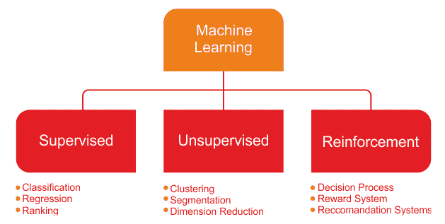

学习的类型及相关问题


# 监督学习

**监督学习**是最简单也是最广为人知的自动学习任务。它基于许多预定义的例子，其中每个输入应该属于的类别是已知的。*图 2* 显示了监督学习的典型工作流程。

一个参与者(例如，一个 ML 从业者、数据科学家、数据工程师、ML 工程师等等)执行**提取转换加载** ( **ETL** )和必要的特征工程(包括特征提取、选择等等)来获得具有特征和标签的适当数据。然后，他执行以下操作:

1.  将数据分为训练集、开发集和测试集
2.  使用训练集来训练 ML 模型

3.  验证集用于针对过拟合问题和正则化来验证训练
4.  然后，他在测试集上评估模型的性能(这是看不见的数据)
5.  如果性能不令人满意，他可以执行额外的调整，以获得基于超参数优化的最佳模型
6.  最后，他在生产就绪环境中部署了最佳模型

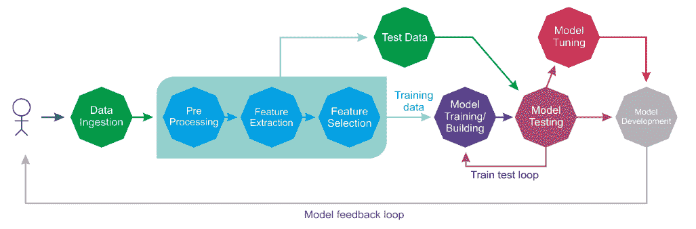

行动中的监督学习

在整个生命周期中，可能会有许多参与者(例如，数据工程师、数据科学家或 ML 工程师)独立或协作地执行每个步骤。

监督学习上下文包括**分类**和**回归**任务；分类用于预测 a 类数据点属于哪一类(**离散值**)，而回归用于预测**连续值**。换句话说，分类任务用于预测类属性的标签，而回归任务用于对类属性进行数值预测。

在监督学习的背景下，**不平衡数据**指的是分类问题，其中我们对于不同的类有不相等的实例。例如，如果我们只有两个类别的分类任务，**平衡数据**将意味着每个类别有 50%的预分类样本。

如果输入数据集有点不平衡(例如，一个类有 60%的数据点，另一个类有 40%的数据点)，学习过程将要求将输入数据集随机分成三组，其中 50%用于定型集，20%用于验证集，其余 30%用于测试集。


# 无监督学习

在**无监督学习**中，输入集在训练阶段被提供给系统。与监督学习相比，输入对象没有用它们的类别来标记。对于分类，我们假设给我们一个正确标记数据的训练数据集。不幸的是，当我们在现实世界中收集数据时，我们并不总是有这种优势。

例如，假设您在硬盘上一个拥挤的大文件夹中有大量完全合法的、非盗版的 MP3 文件。在这种情况下，如果我们不能直接访问歌曲的元数据，我们怎么可能将歌曲分组在一起呢？一种可能的方法是混合各种 ML 技术，但是集群通常是最好的解决方案。

现在，如果您可以建立一个聚类预测模型，帮助自动将相似的歌曲分组并组织到您最喜欢的类别中，如*国家*、*说唱*、*摇滚*等等，会怎么样呢？简而言之，无监督学习算法常用于聚类问题。下图向我们展示了一种用于解决这类问题的聚类技术:

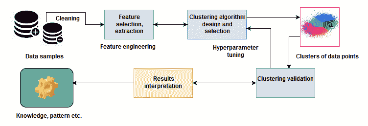Clustering techniques – an example of unsupervised learning

尽管数据点没有被标记，我们仍然可以对一组对象进行必要的特征工程和分组，从而将同一组中的对象(称为**簇**)聚集在一起。这对一个人类来说并不容易。相反，标准的方法是定义两个对象之间的相似性度量，然后寻找彼此之间比它们与其他聚类中的对象更相似的任何对象聚类。一旦我们完成了数据点(即 MP3 文件)的聚类并完成了验证，我们就知道了数据的模式(即哪种类型的 MP3 文件属于哪个组)。


# 强化学习

**强化学习**是一种人工智能方法，专注于通过系统与环境的交互来学习系统。在强化学习中，系统的参数根据从环境中获得的反馈进行调整，这反过来又对系统做出的决策提供反馈。下图显示了一个人为了到达目的地而做出的决定。

让我们举一个你从家到工作的路线的例子。在这种情况下，你每天走同样的路线上班。然而，突然有一天，你感到好奇，决定尝试不同的路线，以期找到最短的路径。尝试新路线或坚持最知名路线的两难境地是**探索与开发**的一个例子:

An agent always tries to reach the destination

我们可以再看一个例子，用一个系统来模拟一个棋手。为了提高其性能，系统利用其先前移动的结果；这样的系统被称为强化学习系统。


# 将 ML 任务放在一起

我们已经看到了 ML 算法的基本工作原理。然后，我们已经看到了什么是基本的 ML 任务，以及它们如何形成特定领域的问题。现在让我们看看如何在下图中总结 ML 任务和一些应用:

ML tasks and some use cases from different application domains

然而，上图仅列出了几个使用不同 ML 任务的用例及应用。在实践中，ML 被用在许多用例及应用中。我们将在本书中尝试涵盖其中的一些。


# 钻研深度学习

用于正常规模数据分析的简单 ML 方法不再有效，应该被更稳健的 ML 方法所取代。虽然经典的 ML 技术允许研究人员识别相关变量的组或簇，但是这些方法的准确性和有效性随着大的和高维的数据集而降低。

深度学习来了，这是过去几年人工智能最重要的发展之一。深度学习是基于一组算法的 ML 的一个分支，这些算法试图对数据中的高级抽象进行建模。


# DL 是如何让 ML 更上一层楼的？

简而言之，深度学习算法大多是一组能够更好地表示大规模数据集的人工神经网络，以便建立能够非常广泛地学习这些表示的模型。如今，它不仅限于人工神经网络，但确实有许多理论进步和软件和硬件的改进，这是我们走到今天所必需的。在这方面，Ian Goodfellow 等人(深度学习，麻省理工学院出版社，2016 年)对深度学习的定义如下:

"Deep learning is a particular kind of machine learning that achieves great power and flexibility by learning to represent the world as a nested hierarchy of concepts, with each concept defined in relation to simpler concepts, and more abstract representations computed in terms of less abstract ones."

我们来举个例子；假设我们想要开发一个预测分析模型，比如动物识别器，我们的系统必须解决两个问题:

*   若要对图像表示猫还是狗进行分类
*   把狗和猫的图像聚集在一起。

如果我们使用典型的 ML 方法来解决第一个问题，我们必须定义面部特征(耳朵、眼睛、胡须等)并编写一个方法来确定在对特定动物进行分类时哪些特征(通常是非线性的)更重要。

然而，与此同时，我们无法解决第二个问题，因为用于聚类图像的经典 ML 算法(如 **k-means** )无法处理非线性特征。深度学习算法将进一步解决这两个问题，在确定哪些特征对分类或聚类最重要后，将自动提取最重要的特征。

相反，当使用经典的 ML 算法时，我们必须手动提供这些特征。总之，深度学习工作流程如下:

*   深度学习算法将首先识别在聚类猫或狗时最相关的边缘。然后，它会尝试找到各种形状和边缘的分层组合。这一步称为 ETL。
*   经过几次迭代后，对复杂的概念和特征进行分层识别。然后，基于所识别的特征，DL 算法自动决定这些特征中的哪一个对动物分类是最重要的(统计上)。这一步是特征提取。
*   最后，它取出标签列，并使用**自编码器** ( **AEs** )进行无监督训练，以提取要重新分配给 k-means 进行聚类的潜在特征。
*   然后聚类分配硬化损失(CAH 损失)和重建损失被联合优化为最优聚类分配。深度嵌入聚类(详见 https://arxiv.org/pdf/1511.06335.pdf)就是这种方法的一个例子。我们将在[第 11 章](b458baf5-6590-4e69-84d4-8c02a898dbca.xhtml)、*讨论、当前趋势和展望*中讨论基于深度学习的聚类方法。

到目前为止，我们已经看到深度学习系统能够识别图像代表什么。计算机看到的图像不像我们看到的那样，因为它只知道每个像素的位置和颜色。使用深度学习技术，图像被分成不同的分析层。

在较低层次上，软件分析例如几个像素的网格，任务是检测一种颜色或各种细微差别。如果它发现了什么，它就通知下一级，下一级在这一点上检查给定的颜色是否属于一个更大的形式，比如一条线。这个过程继续到更高的层次，直到你理解了图像中显示的内容。下图显示了我们在图像分类系统中讨论的内容:

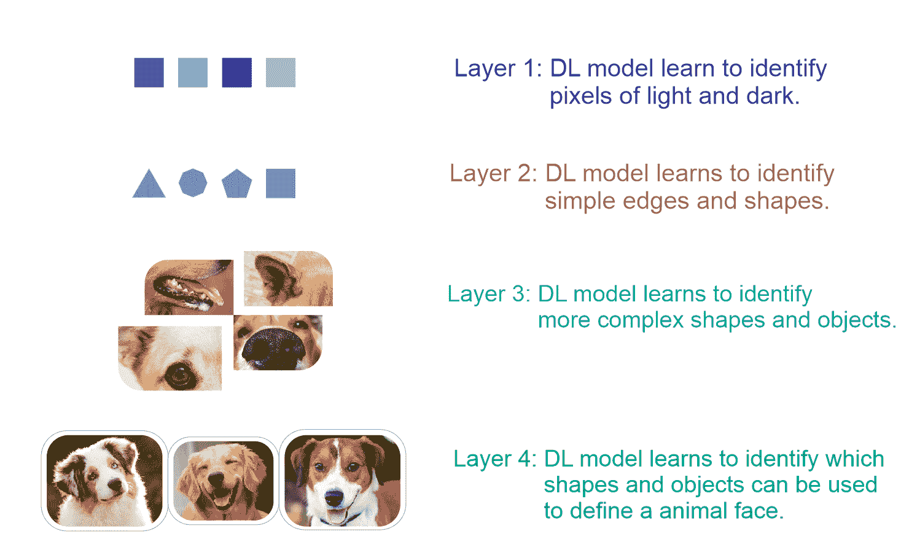

一个深度学习系统正在研究狗和猫的分类问题

更准确地说，前面的图像分类器可以逐层构建，如下所示:

*   **层 1** :算法开始从原始图像中识别暗像素和亮像素
*   **第二层**:算法然后识别边缘和形状
*   第三层:然后它学习更复杂的形状和物体
*   **第 4 层**:算法然后学习哪些物体定义了人脸

虽然这是一个非常简单的分类器，但能够做这些事情的软件现在已经很普遍了，例如在识别人脸的系统中，或者在谷歌上搜索图像的系统中。这些软件基于深度学习算法。

相反，通过使用线性 ML 算法，我们不能构建这样的应用，因为这些算法不能处理非线性图像特征。此外，使用 ML 方法，我们通常只处理几个超参数。然而，当神经网络被带到聚会上时，事情就变得太复杂了。每一层都有数百万甚至数十亿的超参数需要调整，以至于代价函数变得非凸。

另一个原因是隐藏层中使用的激活函数是非线性的，所以代价是非凸的。我们将在后面的章节中更详细地讨论这一现象，但是让我们快速地看一下人工神经网络。


# 人工神经网络

ann 致力于深度学习的概念。它们代表了人类神经系统，说明神经系统是如何由许多神经元组成的，这些神经元使用轴突相互通信。


# 生物神经元

人工神经网络的工作原理受到人脑工作方式的启发，如图 7 所示。受体接受来自内部或外部世界的刺激；然后它们将信息传递给生物*神经元*进行进一步处理。除了称为**轴突**的另一个长延伸外，还有许多树突。

在其末端，有称为**突触末端的微小结构，**用于将一个神经元连接到其他神经元的树突。生物神经元从其他神经元接收到被称为**信号**的短电脉冲，作为回应，它们触发自己的信号:

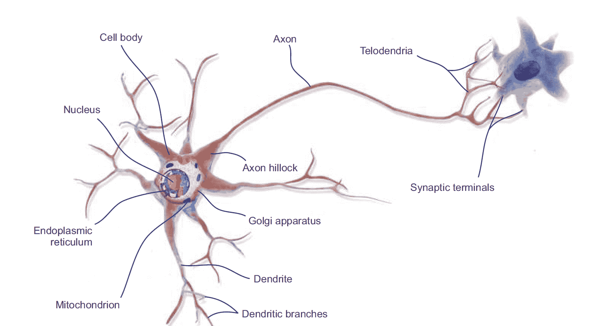Working principle of biological neurons

因此，我们可以总结出，神经元包括一个细胞体(也称为胞体)，一个或多个用于接收来自其他神经元的信号的**树突**，以及一个用于执行神经元产生的信号的**轴突**。

当一个神经元向其他神经元发送信号时，它就处于活跃状态。然而，当它从其他神经元接收信号时，它处于非活动状态。在空闲状态下，神经元在达到某个激活阈值之前积累所有接收到的信号。这一切促使研究人员引入人工神经网络。


# 人工神经网络简史

受生物神经元工作原理的启发，沃伦麦卡洛克和沃尔特皮茨在 1943 年根据神经活动的计算模型提出了第一个人工神经元模型。这个简单的生物神经元模型，也称为**人工神经元(an)，**只有一个或多个二进制(开/关)输入和一个输出。

当超过一定数量的输入有效时，An 仅激活其输出。例如，这里我们看到几个执行各种逻辑运算的人工神经网络。在这个例子中，我们假设一个神经元只有在它的至少两个输入是活动的时候才被激活:


执行简单逻辑计算的人工神经网络

这个例子听起来太琐碎了，但是即使有这样一个简化的模型，也有可能建立一个 ANs 网络。然而，这些网络也可以组合起来计算复杂的逻辑表达式。这个简化的模型启发了约翰·冯·诺依曼、马文·明斯基、弗兰克·罗森布拉特和其他许多人，他们在 1957 年提出了另一个叫做**感知器**的模型。

感知器是我们在过去 60 年中见过的最简单的人工神经网络架构之一。它基于一个稍微不同的 AN，叫做**线性阈值单元** ( **LTU** )。唯一的区别是输入和输出现在是数字，而不是二进制开/关值。每个输入连接都与一个权重相关联。LTU 计算其输入的加权和，然后将阶跃函数(类似于激活函数的作用)应用于该和，并输出结果:


左边的图表示一个 LTU，右边的图表示一个感知器

感知器的一个缺点是它的决策边界是线性的。因此，他们无法学习复杂的模式。他们也无法解决一些简单的问题，如**异或** ( **异或**)。然而，后来，通过堆叠多个感知器，称为 MLP，在某种程度上消除了感知器的局限性。


# 安是怎么学习的？

基于生物神经元的概念，出现了 ANs 这个术语和概念。类似于生物神经元，人工神经元由以下部分组成:

*   聚集来自神经元的信号的一个或多个传入连接
*   一个或多个输出连接，用于将信号传送到其他神经元
*   一个**激活功能**，它决定输出信号的数值

神经网络的学习过程被配置为*权重*的*优化*的*迭代过程*(详见下一节)。权重在每个时期被更新。一旦训练开始，目标是通过最小化损失函数来生成预测。然后在测试集上评估网络的性能。

现在我们知道了人工神经元的简单概念。然而，仅仅产生一些人工信号不足以学习一项复杂的任务。尽管如此，一种常用的监督学习算法是反向传播算法，它非常常用于训练复杂的人工神经网络。


# 人工神经网络和反向传播算法

反向传播算法旨在最小化当前输出和期望输出之间的误差。由于网络是前馈的，激活流总是从输入单元向前行进到输出单元。

成本函数的梯度被反向传播，并且网络权重被更新；整个方法可以递归地应用于任意数量的隐藏层。在这种方法中，两相之间的结合是重要的。简而言之，培训程序的基本步骤如下:

1.  用一些随机(或更高级的 XAVIER)权重初始化网络
2.  对于所有的训练案例，请遵循下面概述的向前和向后传递的步骤


# 向前和向后传球

在正向传递中，执行许多操作来获得一些预测或分数。在这样的操作中，会创建一个图形，以自顶向下的方式连接所有相关的操作。然后计算网络的误差，即预测输出和实际输出之间的差值。

另一方面，反向传递主要涉及数学运算，例如为所有微分运算(即自动微分方法)创建导数，从上到下(例如，测量损失函数以更新网络权重)，为图中的所有运算创建导数，然后在链规则中使用它们。

在此过程中，对于从输出层开始回到输入层的所有层，它显示了具有正确输入的网络层输出(误差函数)。然后，它调整当前层中的权重以最小化误差函数。这是反向传播的优化步骤。顺便说一下，有两种类型的自动微分方法:

1.  **反向模式**:相对于所有输入导出单个输出
2.  **正向模式**:针对一个输入导出所有输出

反向传播算法以这样的方式处理信息，使得网络在学习迭代期间减少全局误差；然而，这并不能保证达到全局最小值。隐藏单元的存在和输出函数的非线性意味着误差的行为非常复杂并且具有许多局部最小值。

该反向传播步骤通常使用许多训练批次执行数千次或数百万次，直到模型参数收敛到最小化成本函数的值。当验证集上的误差开始增加时，训练过程结束，因为这可能标志着阶段过度拟合的开始。


# 权重和偏差

除了神经元的状态，突触权重也被考虑，它影响网络内的连接。每一个权重都有一个用*W[ij]表示的数值，这个数值就是连接神经元 *i* 到神经元 *j* 的突触权重。*

**Synaptic weight**: This concept evolved from biology and refers to the strength or amplitude of a connection between two nodes, corresponding in biology to the amount of influence the firing of one neuron has on another.

对于每个神经元(也称为单元) *i* ，一个输入向量可以定义为*x[I]=(*x[1]*， *x [2]* ，... *x [n] ... *w [中的]* )。现在，根据神经元的位置，权重和输出函数决定了单个神经元的行为。然后在前向传播期间，隐藏层中的每个单元得到以下信号:**

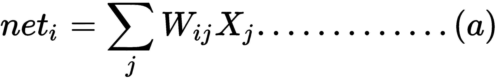

然而，在权重中，还有一种特殊类型的权重，称为*偏置*单元 *b.* 从技术上讲，偏置单元没有连接到任何先前的层，因此它们没有真正的活动。但是，偏差 *b* 值允许神经网络将激活函数向左或向右移动。现在，考虑偏置单元，修改后的网络输出可以用公式表示如下:


前面的等式表明，每个隐藏单元都将输入的总和乘以相应的权重——求和点。然后求和点的结果通过激活函数，该函数抑制输出，如下图所示:

Artificial neuron model

现在，一个棘手的问题是:我们如何初始化权重？嗯，如果我们将所有权重初始化为相同的值(例如，0 或 1)，每个隐藏神经元将获得完全相同的信号。让我们试着分解一下:

*   如果所有权重都初始化为 1，则每个单元得到的信号等于输入之和
*   如果所有的权重都是 0，这就更糟了，隐藏层中的每个神经元都将得到零信号

对于网络权值的初始化，Xavier 初始化现在被广泛使用。它类似于随机初始化，但通常效果更好，因为它可以根据输入和输出神经元的数量自动确定初始化的规模。

感兴趣的读者可以参考这份出版物了解详细信息:Xavier Glorot 和 Yoshua Bengio，*了解训练深度前馈神经网络的难度*:2010 年第 13 届^(和**人工智能和统计** ( **AISTATS** )国际会议论文集，意大利撒丁岛 Chia Laguna 度假村；JMLR 第九卷:W & CP。)

您可能想知道在训练常规 DNN(例如，MLP 或 DBN)时是否可以摆脱随机初始化。嗯，最近，一些研究人员一直在谈论随机正交矩阵初始化，它比任何用于训练 DNNs 的随机初始化都表现得更好。

当初始化偏差时，我们可以将它们初始化为零。但是对于所有的偏置，将偏置设置为小的恒定值，例如 0.01，确保所有的**整流线性单元** ( **ReLU** )单元可以传播一些梯度。然而，它既不表现良好，也没有显示出持续的改善。所以建议坚持用零。


# 重量优化

在训练开始之前，网络参数是随机设置的。然后为了优化网络权重，使用了一种叫做**梯度下降** ( **GD** )的迭代算法。使用 GD 优化，我们的网络基于训练集计算成本梯度。然后，通过迭代过程，计算误差函数 *E* 的梯度*G**。* 

在下图中，误差函数 ***E*** 的梯度 **G** 提供了当前值的误差函数具有更陡斜率的方向。由于最终目标是减少网络误差，GD 在相反的方向上小步前进 *-* **G** 。这个迭代过程被执行多次，因此误差 *E* 将向全局最小值*移动。*这样，最终目标是达到一个点 **G = 0** *，*在这个点上不可能进一步优化:

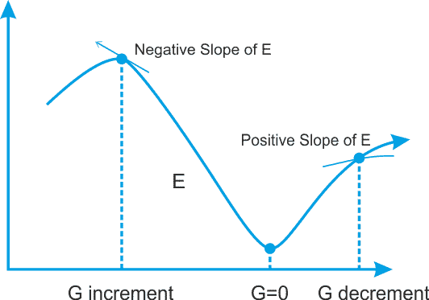Searching for the minimum for the error function E; we move in the direction in which the gradient G of E is minimal

缺点是收敛时间太长，无法满足处理大规模训练数据的需求。因此提出了一种更快的 GD 叫做**随机梯度下降** ( **SDG** )，这也是 DNN 训练中广泛使用的优化器。在 SGD 中，我们每次迭代只使用训练集中的一个训练样本来更新网络参数。

我不是说 SGD 是唯一可用的优化算法，但是现在有这么多高级优化器可用，例如，Adam、RMSProp、ADAGrad、Momentum 等等。或多或少，大多数都是 SGD 的直接或间接优化版本。

顺便说一下，术语**随机**来自于这样一个事实，即基于每次迭代的单个训练样本的梯度是真实成本梯度的随机近似。


# 激活功能

为了允许神经网络学习复杂的决策边界，我们对它的一些层应用非线性激活函数。常用的函数包括 Tanh、ReLU、softmax 及其变体。更具体地说，每个神经元接收突触权重和所连接神经元的激活值的加权和作为输入信号。为此，最广泛使用的函数之一是所谓的**s 形函数**。这是逻辑函数的特殊情况，由以下公式定义:

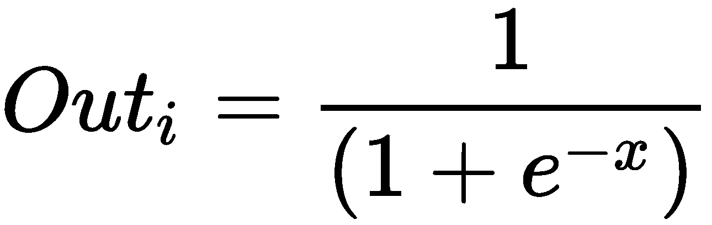

该函数的定义域包括所有实数，共定义域为( *0，1* )。这意味着从神经元输出的任何值(根据其激活状态的计算)将总是在 0 和 1 之间。如下图所示，sigmoid 函数提供了对神经元饱和率的解释，从不活动( *= 0* )到完全饱和，发生在预定的最大值( *= 1* )。

另一方面，双曲正切，或 **tanh** ，是激活函数的另一种形式。Tanh 将一个实数值压缩到范围 *[-1，1]* 。特别地，在数学上，双曲正切激活函数可以表示如下:


上述等式可以用下图表示:

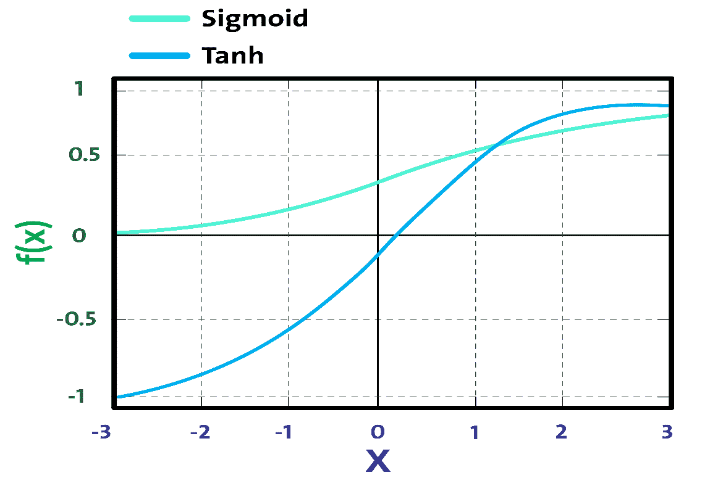

乙状结肠与双曲正切活化函数

通常，在**前馈神经网络** ( **FFNN** )的最后一级中，softmax 函数被用作决策边界。这是一种常见的情况，尤其是在解决分类问题时。在概率论中，softmax 函数的输出被压缩为在 *K* 个不同可能结果上的概率分布。然而，softmax 函数用于各种多类分类方法中，使得网络的输出跨类分布(即，类上的概率分布)，其动态范围在 *-1* 和 *1* 或 *0* 和 *1* 之间。

对于回归问题，我们不需要使用任何激活函数，因为网络会生成连续的值—概率。然而，我看到现在有人用身份激活函数来解决回归问题。我们将在后面的章节中看到这一点。

总之，选择合适的激活函数和网络权重初始化是使网络发挥最佳性能并有助于获得良好训练的两个问题。我们将在接下来的章节中讨论更多；我们将看到在哪里使用哪个激活功能。


# 神经网络架构

神经网络中有各种类型的架构。我们可以将 DL 架构分为四类:**深度神经网络** ( **DNNs** )、**卷积神经网络** ( **CNNs** )、**循环神经网络** ( **RNNs** )、以及**涌现架构** ( **EAs** )。

如今，基于这些架构，研究人员针对特定领域的用例及研究问题，提出了许多这些架构的变体。本章的以下部分将简要介绍这些体系结构。更详细的分析，以及应用的例子，将是本书后面章节的主题。


# 深度神经网络

dnn 是具有复杂和更深层次架构的神经网络，每层中有大量神经元，并且有许多连接。每一层中的计算将后续层中的表示转换成稍微抽象一些的表示。然而，我们将使用术语 DNN 来特指 MLP、**堆栈自编码器** ( **SAE** )和**深度信念网络** ( **DBNs** )。

SAE 和 dbn 使用 AEs 和**受限玻尔兹曼机器** ( **RBMs** )作为架构的构建模块。这些和 MLPs 之间的主要区别在于训练分两个阶段执行:无监督的预训练和有监督的微调。

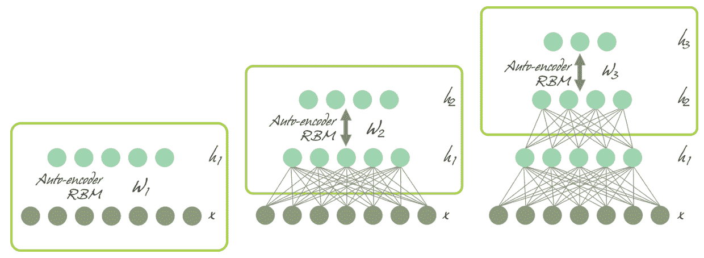

分别使用不良事件和 RBM 的严重不良事件和 DBN

在无监督的预训练中，如上图所示，各层按顺序堆叠，并以逐层的方式进行训练，如使用未标记数据的 AE 或 RBM。之后，在监督微调中，堆叠输出分类器层，并通过用标记数据进行再训练来优化完整的神经网络。


# 多层感知器

如前所述，单个感知器甚至无法逼近异或函数。为了克服这个限制，多个感知器被堆叠在一起作为多层感知器，其中各层被连接成有向图。这样，信号单向传播，从输入层到隐藏层再到输出层，如下图所示:


一种 MLP 体系结构，具有输入层、两个隐藏层和输出层

基本上，MLP 是最简单的模糊神经网络之一，至少有三层:输入层、隐藏层和输出层。在 20 世纪 80 年代，MLP 首先用反向传播算法进行训练。


# 深度信念网络

为了克服 MLPs 中的过拟合问题，Hinton 等人提出了 DBN，它使用贪婪的逐层预训练算法，通过概率生成模型初始化网络权重。

DBNs 由一个可见层和多个层组成— **隐藏单元**。最上面的两层之间具有无方向的对称连接，并形成一个关联存储器，而较低层接收来自前一层的自上而下的有方向的连接。DBN 的构造块是 RBM，如下图所示，几个 RBM 一个接一个地*堆叠*形成 dbn:

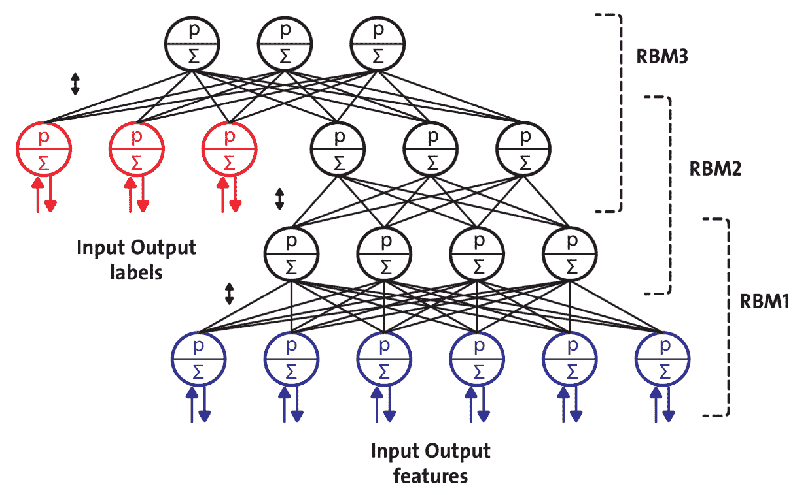

为半监督学习配置的 DBN

一个 RBM 由两层组成。第一层由可见神经元组成，第二层由隐藏神经元组成。*图 16* 显示了一个简单 RBM 的结构，其中神经元按照对称二分图排列:

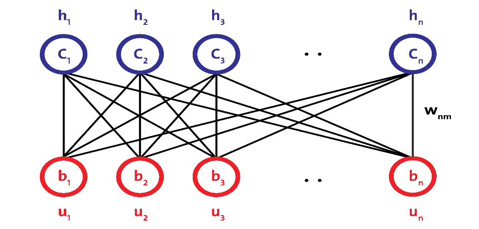

RBM 建筑

在 DBNs 中，首先使用输入数据训练 RBM，称为无监督预训练，隐藏层表示使用称为监督微调的贪婪学习方法学习的特征。尽管取得了许多成功，dbn 正在被 AEs 所取代。


# 自编码器

AE 是具有三层或更多层的网络，其中输入层和输出层具有相同数量的神经元，而那些中间层(隐藏层)具有较少数量的神经元。对网络进行训练，以在输出中为每条输入数据再现与输入中相同的活动模式。

AEs 的有用应用是用于数据可视化的数据去噪和降维。下图显示了 AE 的典型工作方式。它通过两个阶段来重构所接收的输入:编码阶段，其对应于原始输入的维度缩减，以及解码阶段，其能够从编码(压缩)表示中重构原始输入:

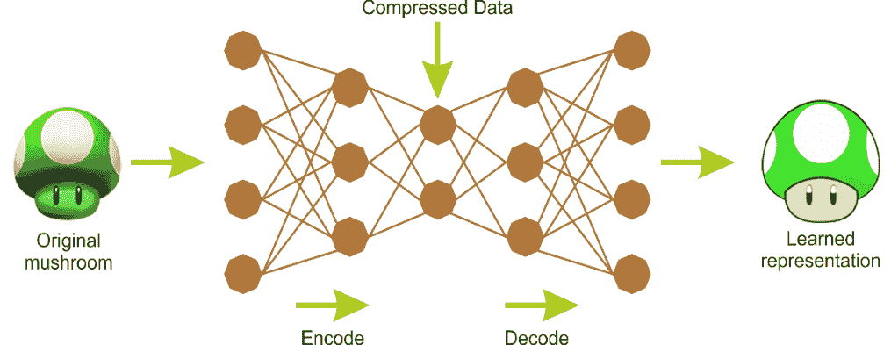Encoding and decoding phases of an AE<title>Convolutional neural networks</title> <link rel="stylesheet" href="css/style.css" type="text/css"> 

# 卷积神经网络

CNN 已经在计算机视觉(例如，图像识别)中获得了广泛的应用。在 CNN 网络中，定义卷积层(conv)的连接方案与 MLP 或 DBN 有很大不同。

重要的是，DNN 事先不知道像素是如何组织的；它不知道附近的像素是接近的。CNN 的架构嵌入了这种先验知识。较低层通常识别图像小区域中的特征，而较高层将较低层的特征组合成较大的特征。这对于大多数自然图像都很有效，使 CNN 比 DNNs 有了决定性的领先优势:

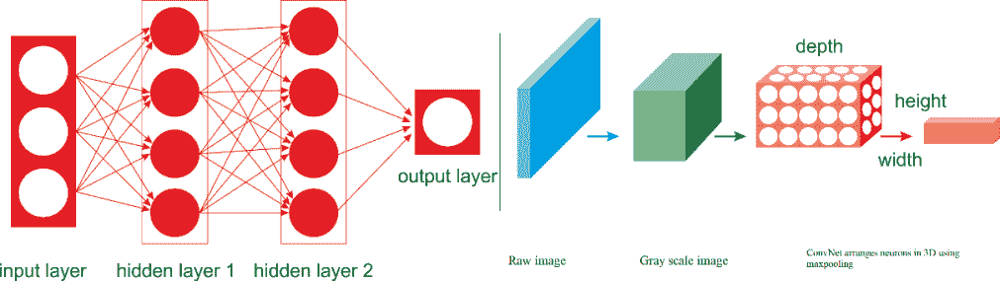A regular DNN versus a CNN

仔细看看前面的图表；左边是一个常规的三层神经网络，右边是一个 CNN 以三维(宽度、高度和深度)排列其神经元。在 CNN 架构中，几个卷积层以级联方式连接，其中每一层之后是 ReLU 层，然后是池层，然后是几个卷积层(+ReLU)，然后是另一个池层，依此类推。

每个 conv 图层的输出是由单个内核过滤器生成的一组称为特征地图的对象。然后，可以使用特征映射来定义下一层的新输入。CNN 网络中的每个神经元产生一个输出，后跟一个激活阈值，该阈值与输入成比例，不受限制。这种类型的层称为卷积层。下图是用于面部识别的 CNN 的架构示意图:

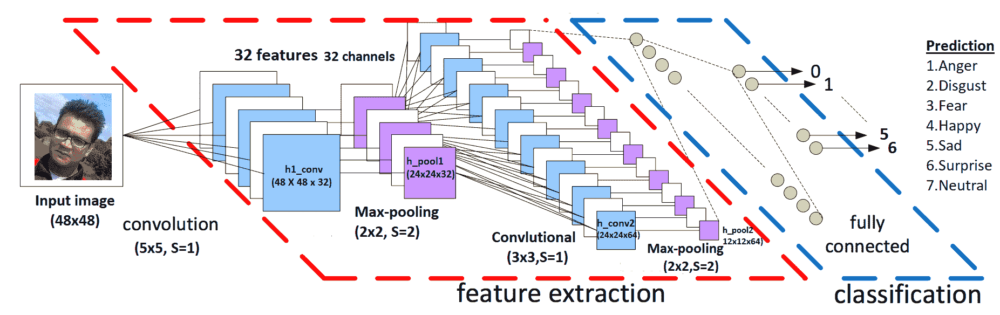

用于面部识别的 CNN 的示意性架构


# 循环神经网络

一个**循环神经网络****【RNN】**是一类**人工神经网络** ( **ANN** )其中单元之间的连接形成一个有向循环。RNN 建筑最初由 Hochreiter 和 Schmidhuber 于 1997 年构思。RNN 架构具有标准 MLPs 和附加环路(如下图所示)，因此它们可以利用 MLP 强大的非线性映射功能；它们有某种形式的记忆:

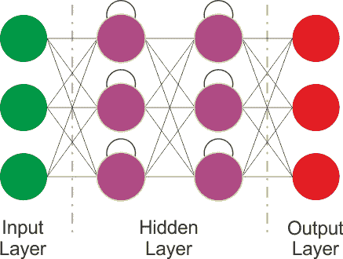RNN architecture

上图显示了一个非常基本的 RNN，具有一个输入层、两个递归层和一个输出层。然而，这种基本的 RNN 存在梯度消失和爆炸问题，不能模拟长期相关性。因此，更先进的体系结构被设计成利用输入数据的顺序信息，在诸如感知器的构建块之间具有循环连接。这些架构包括**长短期记忆** ( **LSTM** )、**门控递归单元** ( **GRUs** )、**双向 LSTM** 等变种。

因此，LSTM 和广义回归神经网络可以克服常规神经网络的缺点:梯度消失/爆炸问题和长短期依赖性。我们将在第二章中探讨这些架构。


# 新兴建筑

许多其他涌现的 DL 架构也被提出，如**深度时空神经网络** ( **DST-NNs** )、**多维循环神经网络** ( **MD-RNNs** )、以及**卷积自编码器** ( **CAEs** )。

然而，还有一些新兴的网络，如**capsnes**(这是 CNN 的改进版本，旨在消除常规 CNN 的缺点)，用于图像识别的 RNN，以及用于简单图像生成的**生成对抗网络** ( **GANs** )。除此之外，用于个性化和深度强化学习的因子分解机也在广泛使用。


# 残差神经网络

由于有时会有几百万几十亿的超参数和其他实际方面，训练更深层次的神经网络真的很难。为了克服这一限制，何等人(见提出了一个残差学习框架，以简化比以前使用的网络更深层次的网络训练。

他们还明确地将这些层重新表述为参考层输入的学习剩余函数，而不是学习未被参考的函数。这样，这些残差网络更容易优化，并且可以从显著增加的深度中获得精度。

不足之处在于，通过简单堆叠剩余块来构建网络，不可避免地限制了其优化能力。为了克服这个限制，张可等人还提出了使用多级残差网络([https://arxiv.org/abs/1608.02908](https://arxiv.org/abs/1608.02908))。


# 生成对抗网络

gan 是深度神经网络架构，由两个相互对抗的网络组成(因此得名“对抗性”)。伊恩·古德费勒等人在一篇论文中介绍了甘斯(详见[https://arxiv.org/abs/1406.2661v1](https://arxiv.org/abs/1406.2661v1))。在 GANs 中，两个主要部件是**发生器** **和鉴别器**。


生成对抗网络的工作原理

生成器将尝试从与实际对象非常相似的特定概率分布中生成数据样本。鉴别器将判断其输入是来自原始训练集还是来自生成器部分。


# 胶囊网络

CNN 在图像分类方面表现很好。然而，如果图像有旋转、倾斜或任何其他不同的方向，那么 CNN 表现出相对非常差的性能。即使是 CNN 中的池操作也不能对位置不变性有多大帮助。

CNN 的这个问题通过 Geoffrey Hinton 等人题为*胶囊之间的动态路由* (详见 https://arxiv.org/abs/1710.09829[)的论文，引导我们了解 CapsNet 的最新进展。](https://arxiv.org/abs/1710.09829)

与常规的 DNN 不同，在 CapsNets 中，我们不断地添加层，这个想法是在一个层中添加更多的层。这样，顶网就是一组嵌套的神经层。我们将在第 11 章、*讨论、当前趋势和展望*中进行更多讨论。


# DL 框架和云平台

在这一部分，我们将介绍一些最流行的深度学习框架。然后，我们将讨论一些基于云的平台，您可以在这些平台上部署/运行您的 DL 应用程序。简而言之，几乎所有的库都提供了使用图形处理器加速学习过程的可能性，都是在开放许可下发布的，并且是大学研究小组的成果。


# 深度学习框架

**TensorFlow** 是数学软件，是机器智能的开源软件库。谷歌大脑团队在 2011 年开发了它，并在 2015 年开源。TensorFlow 的最新版本(撰写本书时为 1.8 版)提供的主要功能是更快的计算速度、灵活性、可移植性、易于调试、统一的 API、GPU 计算的透明使用、易用性和可扩展性。一旦你构建了你的神经网络模型，在必要的特征工程之后，你可以简单地使用绘图或 TensorBoard 交互式地执行训练。

Keras 是一个深度学习库，位于 TensorFlow 和 Theano 之上，提供了一个受 Torch 启发的直观 API。它可能是现存的最好的 Python API。DeepLearning4J 依赖 Keras 作为其 Python API，从 Keras 导入模型，并通过 Keras 从 Theano 和 TensorFlow 导入模型。

**Theano** 也是用 Python 写的深度学习框架。它允许使用 GPU，比单个 CPU 快 24 倍。定义、优化和评估复杂的数学表达式是非常简单的。

**Neon** 是 Nirvana 开发的基于 Python 的深度学习框架。Neon 的语法类似于 Theano 的高层框架(例如 Keras)。目前，Neon 被认为是基于 GPU 实现的最快工具，尤其是对于 CNN。但是它基于 CPU 的实现相对来说比大多数其他库要差。

PyTorch 是一个巨大的 ML 生态系统，它提供了大量的算法和函数，包括 DL 和处理各种类型的多媒体数据，特别关注并行计算。Torch 是一个高度可移植的框架，支持多种平台，包括 Windows、macOS、Linux 和 Android。

Caffe ，主要由**伯克利视觉和学习中心** ( **BVLC** )开发，是一个框架，旨在因其表达、速度和模块化而脱颖而出。

**MXNet***(*[http://mxnet.io/](http://mxnet.io/))是一个深度学习框架，支持多种语言，如 R、Python、C++、Julia 等。这是有帮助的，因为如果你知道这些语言中的任何一种，你根本不需要走出你的舒适区来训练你的深度学习模型。它的后端是用 C++和 CUDA 编写的，它能够以类似于 Theano 的方式管理自己的内存。

**微软认知工具包** ( **CNTK** )是微软研究院的统一深度学习工具包，可以轻松地跨多个 GPU 和服务器训练和组合流行的模型类型。CNTK 为语音、图像和文本数据实施高效的 CNN 和 RNN 训练。它支持 cuDNN v5.1 的 GPU 加速。

DeepLearning4J 是第一个为 Java 和 Scala 编写的商业级、开源、分布式深度学习库之一。这也为 Hadoop 和 Spark 提供了集成支持。DeepLearning4 旨在分布式 GPU 和 CPU 上的商业环境中使用。

DeepLearning4J 的目标是前沿和即插即用，更多的是约定而不是配置，这使得非研究人员可以快速原型化。以下库可以与 DeepLearning4 集成，无论您是用 Java 还是 Scala 开发 ML 应用程序，都将使您的 JVM 体验更加轻松。

ND4J 就像 JVM 的 NumPy 一样。它附带了线性代数的一些基本操作，如矩阵创建、加法和乘法。另一方面，ND4S 是一个用于线性代数和矩阵操作的科学计算库。它支持基于 JVM 的语言的 n 维数组。

最后，下图显示了过去一年中 Google 关于不同 DL 框架流行程度的趋势:

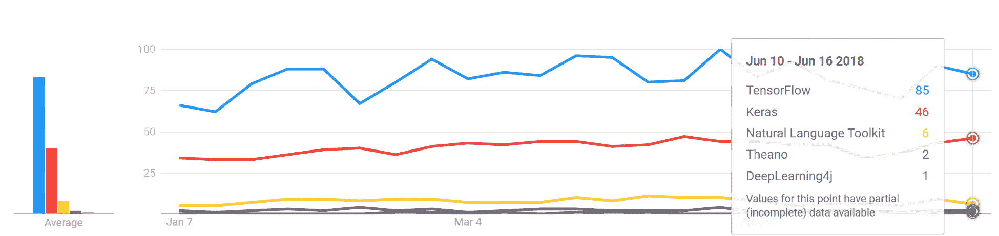

不同 DL 框架的发展趋势。张量流和 Keras 是最主要的。Theano 正在失去它的人气。另一方面，针对 JVM 的 DeepLearning4J 正在兴起。


# 面向 DL 的基于云的平台

除了前面的库，最近还有一些关于云深度学习的计划。这个想法是将深度学习能力带到拥有数百万亿个数据点和高维数据的大数据中。例如，**亚马逊 Web 服务** ( **AWS** )、微软 Azure、谷歌云平台、**英伟达 GPU 云** ( **NGC** )都提供机器和深度学习服务，这些服务都是他们公共云原生的。

2017 年 10 月，AWS 针对亚马逊**弹性计算云** ( **EC2** ) P3 实例发布深度学习**亚马逊机器图像** ( **AMIs** )。这些 ami 预装了深度学习框架，如 TensorFlow、Gluon 和 Apache MXNet，这些框架针对亚马逊 EC2 P3 实例中的 NVIDIA Volta V100 GPUs 进行了优化。

微软认知工具包是 Azure 的开源深度学习服务。与 AWS 的产品类似，它专注于可以帮助开发人员构建和部署深度学习应用程序的工具。

另一方面，NGC 为人工智能科学家和研究人员提供了 GPU 加速的容器(见[https://www . NVIDIA . com/en-us/data-center/GPU-cloud-computing/](https://www.nvidia.com/en-us/data-center/gpu-cloud-computing/))。NGC 采用了容器化的深度学习框架，如 TensorFlow、PyTorch、MXNet 等，这些框架经过英伟达的调整、测试和认证，可以在最新的英伟达 GPU 上运行。

现在我们已经对运行和部署 DL 应用程序的可用 DL 库、框架和基于云的平台有了最基本的了解，我们可以开始编码了。首先，我们将从解决著名的泰坦尼克号生存预测问题开始。然而，我们不会使用前面列出的框架；我们将使用 Apache Spark ML 库。因为我们将把 Spark 和其他 DL 库一起使用，所以了解一点 Spark 将有助于我们理解接下来的章节。


# 从灾难中深度学习——泰坦尼克号生存预测

在这一部分，我们将解决 Kaggle 上著名的泰坦尼克号生存预测问题(见[https://www.kaggle.com/c/titanic/data](https://www.kaggle.com/c/titanic/data))。任务是使用 ML 算法完成对什么样的人可能生存的分析。


# 问题描述

在深入研究编码之前，让我们先来看看这个问题的简短描述。这一段直接引自 Kaggle 泰坦尼克号生存预测页面:

“皇家邮轮泰坦尼克号的沉没是历史上最臭名昭著的海难之一。1912 年 4 月 15 日，在她的处女航中，泰坦尼克号在与冰山相撞后沉没，2224 名乘客和船员中有 1502 人遇难。这一耸人听闻的悲剧震惊了国际社会，并导致更好的船舶安全条例。海难导致如此多生命损失的原因之一是没有足够的救生艇容纳乘客和船员。虽然在沉船中幸存有一些运气成分，但一些群体比其他人更有可能幸存，如妇女、儿童和上层阶级。在这个挑战中，我们要求你完成对什么样的人可能幸存的分析。特别是，我们要求您应用机器学习的工具来预测哪些乘客在悲剧中幸存下来。”

现在，在进行更深入的研究之前，我们需要了解灾难期间泰坦尼克号上乘客的数据，以便我们可以开发一个可用于生存分析的预测模型。数据集可以从[https://github . com/rezacsedu/TitanicSurvivalPredictionDataset](https://github.com/rezacsedu/TitanicSurvivalPredictionDataset)下载。有两个`.csv`文件:

*   **训练集** ( `train.csv`):可以用来建立你的 ML 模型。该文件还包括标签，作为训练集每个乘客的*地面真相*。
*   测试集 ( `test.csv`):可以用来查看你的模型在看不见的数据上表现如何。然而，对于测试集，我们不为每个乘客提供地面实况。

简而言之，对于测试集中的每个乘客，我们必须使用训练好的模型来预测他们是否能在泰坦尼克号沉没后幸存。*表 1* 显示了训练集的元数据:

| **变量** | **定义** |
| `survival` | 两个标签:

*   *0 =否*
*   *1 =是*

 |
| `pclass` | 这是一个乘客的社会经济地位 ( **SES** )的代表，分为上层、中层和下层。特别是，*1 = 1^(ST)，*2 = 2^(nd)， *3 = 3 ^(rd) 。*** |
| `sex` | 男性或女性。 |
| `Age` | 以年表示的年龄。 |
| `sibsp` | 这表明家庭关系如下:

*   兄弟姐妹=兄弟、姐妹、继兄弟、继姐妹
*   *配偶=丈夫、妻子(情妇和未婚夫被忽略)*

 |
| `parch` | 在数据集中，家族关系定义如下:

*   *父母=母亲，父亲*
*   *孩子=女儿，儿子，继女，继子*

一些孩子只和保姆一起旅行，因此对他们来说。 |
| `ticket` | 票号。 |
| `fare` | 客票票价。 |
| 小木屋 | 船舱号。 |
| `embarked` | 三个端口:

*   C =瑟堡
*   *Q =皇后镇*
*   S =南安普敦

 |

现在的问题是:使用这些标记的数据，我们能得出一些简单的结论吗？比方说，身为女性、身在头等舱、还是个孩子，这些因素都有可能提高乘客在这场灾难中的生还几率。

要解决这个问题，可以从基本的 MLP 开始，这是最古老的深度学习算法之一。为此，我们使用基于 Spark 的`MultilayerPerceptronClassifier`。在这一点上，你可能想知道为什么我在谈论 Spark，因为它不是一个 DL 库。然而，Spark 有一个 MLP 实现，这足以满足我们的目标。

然后从下一章开始，我们将通过使用 DeepLearning4J，一个用于开发深度学习应用程序的基于 JVM 的框架，逐步开始使用更健壮的 DNN。因此，让我们看看如何配置我们的 Spark 环境。


# 配置编程环境

我假设 Java 已经安装在您的机器上，并且也设置了`JAVA_HOME`。另外，我假设您的 IDE 已经安装了 Maven 插件。如果是这样，那么只需创建一个 Maven 项目并添加项目属性，如下所示:

```
<properties>
        <project.build.sourceEncoding>UTF-8</project.build.sourceEncoding>
        <java.version>1.8</java.version>
        <jdk.version>1.8</jdk.version>
        <spark.version>2.3.0</spark.version>
</properties>
```

在前面的标记中，我指定了 Spark(也就是 2.3.0)，但是您可以调整它。然后在`pom.xml`文件中添加以下依赖项:

```
<dependencies>
        <dependency>
            <groupId>org.apache.spark</groupId>
            <artifactId>spark-core_2.11</artifactId>
            <version>${spark.version}</version>
        </dependency>
        <dependency>
            <groupId>org.apache.spark</groupId>
            <artifactId>spark-sql_2.11</artifactId>
            <version>${spark.version}</version>
        </dependency>
        <dependency>
            <groupId>org.apache.spark</groupId>
            <artifactId>spark-mllib_2.11</artifactId>
            <version>${spark.version}</version>
        </dependency>
        <dependency>
            <groupId>org.apache.spark</groupId>
            <artifactId>spark-graphx_2.11</artifactId>
            <version>${spark.version}</version>
        </dependency>
        <dependency>
            <groupId>org.apache.spark</groupId>
            <artifactId>spark-yarn_2.11</artifactId>
            <version>${spark.version}</version>
        </dependency>
        <dependency>
            <groupId>org.apache.spark</groupId>
            <artifactId>spark-network-shuffle_2.11</artifactId>
            <version>${spark.version}</version>
        </dependency>
        <dependency>
            <groupId>org.apache.spark</groupId>
            <artifactId>spark-streaming-flume_2.11</artifactId>
            <version>${spark.version}</version>
        </dependency>
        <dependency>
            <groupId>com.databricks</groupId>
            <artifactId>spark-csv_2.11</artifactId>
            <version>1.3.0</version>
        </dependency>
</dependencies>
```

然后，如果一切顺利，所有的 JAR 文件将作为 Maven 依赖项下载到项目主目录中。好吧！然后我们就可以开始写代码了。


# 要素工程和输入数据集准备

在这一小节中，我们将看到一些基本的特征工程和数据集准备，它们可以输入到 MLP 分类器中。所以让我们从创建`SparkSession`开始，它是访问 Spark 的网关:

```
SparkSession spark = SparkSession
                     .*builder*()
                     .master("local[*]")
                     .config("spark.sql.warehouse.dir", "/tmp/spark")
                     .appName("SurvivalPredictionMLP")
                     .getOrCreate();
```

那么我们来读一读训练集，一窥究竟:

```
Dataset<Row> df = spark.sqlContext()
                .read()
                .format("com.databricks.spark.csv")
                .option("header", "true")
                .option("inferSchema", "true")
                .load("data/train.csv");
df.show();
```

数据集的快照如下所示:


泰坦尼克号生存数据集的快照

现在我们可以看到，训练集既有分类特征，也有数字特征。另外，有些特性并不重要，比如`PassengerID`、`Ticket`等等。同样的情况也适用于`Name`特征，除非我们根据标题手动创建一些特征。然而，让我们保持简单。然而，有些列包含空值。因此，需要进行大量的考虑和清理。

我忽略了`PassengerId`、`Name`和`Ticket`列。除此之外，`Sex`列是分类的，所以我根据`male`和`female`对乘客进行了编码。然后`Embarked`列也被编码。我们可以将`S`编码为`0`，`C`编码为`1`，`Q`编码为`2`。

为此，我们可以为`Sex`和`Embarked`分别编写名为`normSex`和`normEmbarked`的用户定义函数(也称为 UDF)。让我们看看他们的签名:

```
private static UDF1<String,Option<Integer>> *normEmbarked*=(String d) -> {
        if (null == d)
            return Option.*apply*(null);
        else {
            if (d.equals("S"))
                return Some.apply(0);
            else if (d.equals("C"))
                return Some.apply(1);
            else
                return Some.apply(2);
        }
    };
```

因此，这个 UDF 接受一个`String`类型并编码为一个整数。现在`normSex` UDF 也有类似的工作方式:

```
private static UDF1<String, Option<Integer>> normSex = (String d) -> {
      if (null == d)
          return Option.apply(null);
      else {
        if (d.equals("male"))
            return Some.apply(0);
        else
            return Some.apply(1);
      }
    };
```

所以我们现在可以只选择有用的列，除了具有上述 UDF 的`Sex`和`Embarked`列:

```
Dataset<Row> projection = df.select(
                col("Survived"),
                col("Fare"),
                callUDF("normSex", col("Sex")).alias("Sex"),
                col("Age"),
                col("Pclass"),
                col("Parch"),
                col("SibSp"),
                 callUDF("normEmbarked",
                col("Embarked")).alias("Embarked"));
projectin.show();
```

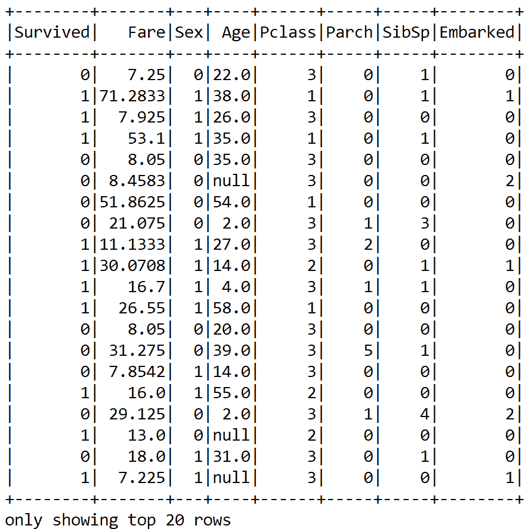

现在，我们已经能够将分类列转换为数字列；然而，正如我们所看到的，仍然存在空值。因此，我们能做什么呢？我们可以完全删除`null`值，或者对这些特定列的平均值应用一些`null`输入技术。我认为第二种方法更好。

现在，同样对于这种空值插补，我们也可以编写 UDF。然而，为此我们需要知道一些关于那些数字列的统计数据。遗憾的是，我们无法对数据帧执行汇总统计。因此，我们必须将数据帧转换成`JavaRDD<Vector>`。好吧，我们也忽略计算这个的`null`条目:

```
JavaRDD<Vector> statsDf =projection.rdd().toJavaRDD().map(row -> Vectors.*dense*( row.<Double>getAs("Fare"),
               row.isNullAt(3) ? 0d : row.Double>getAs("Age")
                  ));
```

现在让我们计算多元统计数据`summary`。`summary`统计将进一步用于计算这两个特征的相应缺失条目的`meanAge`和`meanFare`:

```
MultivariateStatisticalSummary summary = Statistics.*colStats*(statsRDD.rdd());
double meanFare = summary.mean().apply(0);
double meanAge = summary.mean().apply(1); 
```

现在让我们为`Age`和`Fare`列的空值插补创建两个额外的 UDF:

```
UDF1<String, Option<Double>> normFare = (String d) -> {
            if (null == d) {
                return Some.apply(meanFare);
            }
            else
                return Some.apply(Double.parseDouble(d));
        };
```

因此，我们定义了一个 UDF，如果数据没有条目，它将填充`meanFare`值。现在让我们为`Age`列创建另一个 UDF:

```
UDF1<String, Option<Double>> normAge = (String d) -> {
          if (null == d)
              return Some.apply(meanAge);
          else
              return Some.apply(Double.parseDouble(d));
        };
```

现在我们需要注册 UDF，如下所示:

```
spark.sqlContext().udf().register("normFare", normFare, DataTypes.DoubleType);
spark.sqlContext().udf().register("normAge", normAge, DataTypes.DoubleType);
```

因此，让我们应用前面的 UDF 进行`null`插补:

```
Dataset<Row> finalDF = projection.select(
                *col*("Survived"),
                *callUDF*("normFare",
                *col*("Fare").cast("string")).alias("Fare"),
                *col*("Sex"),
                *callUDF*("normAge",
                *col*("Age").cast("string")).alias("Age"),
                *col*("Pclass"),
                *col*("Parch"),
                *col*("SibSp"),
                *col*("Embarked"));
finalDF.show();
```


太好了！我们现在可以看到，`null`值被替换为`Age`和`Fare`列的平均值。然而，数值仍然没有缩放。因此，对它们进行缩放将是一个更好的主意。但是，为此，我们需要计算平均值和方差，然后将它们存储为模型，用于以后的缩放:

```
Vector stddev = Vectors.dense(Math.sqrt(summary.variance().apply(0)), Math.sqrt(summary.variance().apply(1)));

Vector mean = Vectors.dense(summary.mean().apply(0), summary.mean().apply(1));
StandardScalerModel scaler = new StandardScalerModel(stddev, mean);
```

然后我们需要一个数字值的编码器(也就是`Integer`；不是`BINARY`就是`Double`):

```
Encoder<Integer> integerEncoder = Encoders.INT();
Encoder<Double> doubleEncoder = Encoders.DOUBLE();
Encoders.BINARY();

Encoder<Vector> vectorEncoder = Encoders.kryo(Vector.class);
Encoders.tuple(integerEncoder, vectorEncoder);
Encoders.tuple(doubleEncoder, vectorEncoder);
```

然后我们可以创建一个由标签(即`Survived`)和特征组成的`VectorPair`。这里的编码基本上是创建一个缩放的特征向量:

```
JavaRDD<VectorPair> scaledRDD = trainingDF.toJavaRDD().map(row -> {
                VectorPair vectorPair = new VectorPair();
                vectorPair.setLable(new
                Double(row.<Integer> getAs("Survived")));

                vectorPair.setFeatures(Util.*getScaledVector*(
                                row.<Double>getAs("Fare"),
                                row.<Double>getAs("Age"),
                                row.<Integer>getAs("Pclass"),
                                row.<Integer>getAs("Sex"),
                                row.isNullAt(7) ? 0d :
                                row.<Integer>getAs("Embarked"),
                                scaler));
                return vectorPair;
        });
```

在前面的代码块中，`getScaledVector()`方法执行缩放操作。这种方法的特征如下所示:

```
public static org.apache.spark.mllib.linalg.Vector getScaledVector(double fare, 
 double age, double pclass,  double sex, double embarked, StandardScalerModel scaler) {
        org.apache.spark.mllib.linalg.Vector scaledContinous = scaler.transform(Vectors.dense(fare, age));
        Tuple3<Double, Double, Double> pclassFlat = flattenPclass(pclass);
        Tuple3<Double, Double, Double> embarkedFlat = flattenEmbarked(embarked);
        Tuple2<Double, Double> sexFlat = flattenSex(sex);

        return Vectors.dense(
                scaledContinous.apply(0),
                scaledContinous.apply(1),
                sexFlat._1(),
                sexFlat._2(),
                pclassFlat._1(),
                pclassFlat._2(),
                pclassFlat._3(),
                embarkedFlat._1(),
                embarkedFlat._2(),
                embarkedFlat._3());
    }
```

由于我们计划使用基于 Spark ML 的分类器(即 MLP 实现)，我们需要将向量的 RDD 转换为 ML 向量:

```
Dataset<Row> scaledDF = spark.createDataFrame(scaledRDD, VectorPair.class);
```

最后，让我们看看生成的数据帧是什么样子的:

```
scaledDF.show();
```

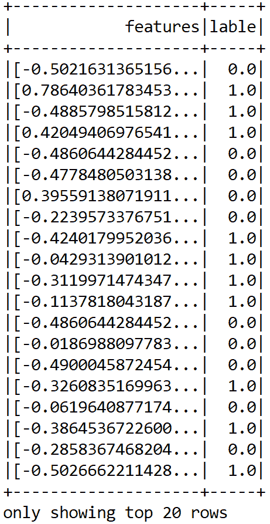

到目前为止，我们已经能够准备我们的功能。不过，这是一个基于 MLlib 的向量，所以我们需要进一步将其转换为 ML 向量:

```
Dataset<Row> scaledData2 = MLUtils.convertVectorColumnsToML(scaledDF);
```

太棒了。现在，我们已经差不多准备好了一个可以被 MLP 分类器使用的训练集。因为我们还需要评估模型的性能，所以我们可以随机拆分训练集和测试集的训练数据。让我们分配 80%用于培训，20%用于测试。这些将分别用于训练模型和评估模型:

```
Dataset<Row> data = scaledData2.toDF("features", "label");
Dataset<Row>[] datasets = data.randomSplit(new double[]{0.80, 0.20}, 12345L);

Dataset<Row> trainingData = datasets[0];
Dataset<Row> validationData = datasets[1];
```

好吧。现在我们有了训练集，我们可以在 MLP 模型上执行训练。


# 训练 MLP 分类器

在 Spark 中，MLP 是由多层组成的分类器。网络中的每一层都完全连接到下一层。输入层中的节点表示输入数据，而其他节点通过输入与节点权重和偏差的线性组合以及应用激活函数将输入映射到输出。

有兴趣的读者可以看一下[https://spark . Apache . org/docs/latest/ml-classification-regression . html #多层-感知器-分类器](https://spark.apache.org/docs/latest/ml-classification-regression.html#multilayer-perceptron-classifier)。

因此，让我们为 MLP 分类器创建层。在这个例子中，考虑到我们的数据集维度不是很高，让我们建立一个浅层网络。

让我们假设第一隐藏层中只有 18 个神经元，第二隐藏层中只有`8`个神经元就足够了。注意，输入层有`10`个输入，所以我们在输出层设置`10`个神经元和`2`个神经元，因为我们的 MLP 只会预测`2`个类。有一点非常重要——输入的数量必须等于特征向量的大小，输出的数量必须等于标签的总数:

```
int[] layers = new int[] {10, 8, 16, 2};
```

然后，我们用训练器实例化模型，并设置其参数:

```
MultilayerPerceptronClassifier mlp = new MultilayerPerceptronClassifier()
                                          .setLayers(layers)
                                          .setBlockSize(128)
                                          .setSeed(1234L)
                                          .setTol(1E-8)
                                          .setMaxIter(1000);
```

所以，你可以理解，前面的`MultilayerPerceptronClassifier()`是基于 MLP 的分类器训练器。除了具有 softmax 激活的输出层之外，每个层都具有 sigmoid 激活功能。注意，基于 Spark 的 MLP 实现只支持 minibatch GD 和 LBFGS 优化器。

简而言之，我们不能在隐藏层中使用 ReLU 或 tanh 等其他激活函数。除此之外，也不支持其他高级优化器，也不支持批处理规范化等等。这是该实现的一个严重限制。在下一章中，我们将尝试用 DL4J 来克服这一点。

我们还将迭代的收敛容差设置为一个非常小的值，以便以更多的迭代为代价获得更高的精度。我们设置了在矩阵中堆叠输入数据的块大小，以加快计算速度。

If the size of the training set is large, then the data is stacked within partitions. If the block size is more than the remaining data in a partition, then it is adjusted to the size of this data. The recommended size is between 10 and 1,000, but the default block size is 128.

最后，我们计划迭代训练 1000 次。因此，让我们开始使用训练集来训练模型:

```
MultilayerPerceptronClassificationModel model = mlp.fit(trainingData);
```


# 评估 MLP 分类器

训练完成后，我们计算测试集上的预测，以评估模型的稳健性:

```
Dataset<Row> predictions = model.transform(validationData);
```

现在，看一些样本预测怎么样？让我们观察真实标签和预测标签:

```
predictions.show();
```

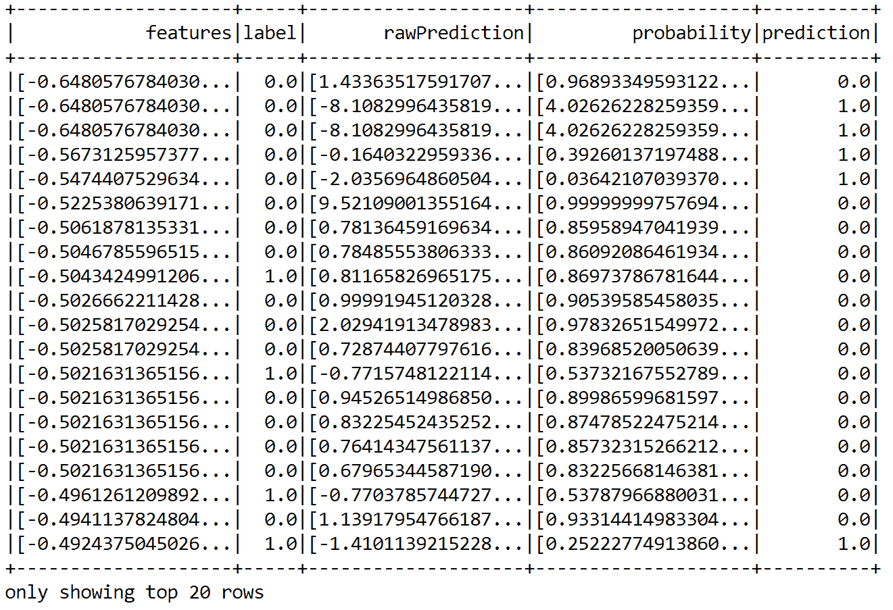

我们可以看到一些预测是正确的，但也有一些是错误的。尽管如此，通过这种方式，很难猜测性能。因此，我们可以计算精度、召回率和 f1 值等性能指标:

```
MulticlassClassificationEvaluator evaluator = new MulticlassClassificationEvaluator()
                                              .setLabelCol("label")
                                              .setPredictionCol("prediction");

MulticlassClassificationEvaluator evaluator1 = evaluator.setMetricName("accuracy");
MulticlassClassificationEvaluator evaluator2 = evaluator.setMetricName("weightedPrecision");
MulticlassClassificationEvaluator evaluator3 = evaluator.setMetricName("weightedRecall");
MulticlassClassificationEvaluator evaluator4 = evaluator.setMetricName("f1");
```

现在让我们计算分类的`accuracy`、`precision`、`recall`、`f1`度量，以及测试数据的误差:

```
double accuracy = evaluator1.evaluate(predictions);
double precision = evaluator2.evaluate(predictions);
double recall = evaluator3.evaluate(predictions);
double f1 = evaluator4.evaluate(predictions);

// Print the performance metrics
System.*out*.println("Accuracy = " + accuracy);
System.*out*.println("Precision = " + precision);
System.*out*.println("Recall = " + recall);
System.*out*.println("F1 = " + f1);

System.*out*.println("Test Error = " + (1 - accuracy));
```

```
<q>>>></q> Accuracy = 0.7796476846282568
 Precision = 0.7796476846282568
 Recall = 0.7796476846282568
 F1 = 0.7796476846282568
 Test Error = 0.22035231537174316
```

干得好！我们已经能够达到相当高的准确率，即 78%。我们仍然可以通过额外的功能工程来改进。下一节将给出更多提示！现在，在结束本章之前，让我们尝试利用训练好的模型来获得对测试集的预测。首先，我们读取测试集并创建数据帧:

```
Dataset<Row> testDF = Util.getTestDF();
```

然而，即使你看到了测试集，它也有一些空值。因此，让我们对`Age`和`Fare`列进行空值插补。如果您不喜欢使用 UDF，您可以创建一个包含您的输入计划的地图:

```
Map<String, Object> m = new HashMap<String, Object>();
m.put("Age", meanAge);
m.put("Fare", meanFare);

Dataset<Row> testDF2 = testDF.na().fill(m);
```

然后，我们再次创建一个由特征和标签组成的`vectorPair`的 RDD(目标列):

```
JavaRDD<VectorPair> testRDD = testDF2.javaRDD().map(row -> {
            VectorPair vectorPair = new VectorPair();
            vectorPair.setLable(row.<Integer>getAs("PassengerId"));
            vectorPair.setFeatures(Util.*getScaledVector*(
                    row.<Double>getAs("Fare"),
                    row.<Double>getAs("Age"),
                    row.<Integer>getAs("Pclass"),
                    row.<Integer>getAs("Sex"),
                    row.<Integer>getAs("Embarked"),
                    scaler));
            return vectorPair;
        });
```

然后我们创建一个火花数据帧:

```
Dataset<Row> scaledTestDF = spark.createDataFrame(testRDD, VectorPair.class);
```

最后，让我们将 MLib 向量转换为基于 ML 的向量:

```
Dataset<Row> finalTestDF = MLUtils.convertVectorColumnsToML(scaledTestDF).toDF("features", "PassengerId");
```

现在，让我们执行模型推理，也就是说，为`PassengerId`列创建一个预测，并显示示例`prediction`:

```
Dataset<Row> resultDF = model.transform(finalTestDF).select("PassengerId", "prediction"); 
resultDF.show();
```

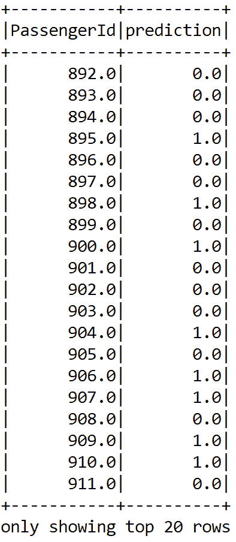

最后，让我们将结果写入 CSV 文件:

```
resultDF.write().format("com.databricks.spark.csv").option("header", true).save("result/result.csv");
```


# 常见问题(FAQ)

既然我们已经以可接受的准确度解决了巨大的生存预测问题，那么这个问题以及整个深度学习现象的其他实际方面也需要考虑。在这一部分，我们将看到一些你可能已经想到的常见问题。这些问题的答案可以在*附录 A* 中找到。

1.  使用计算异或运算的原始人工神经元绘制一个 ann:*a*⊕*b*。将这个问题正式描述为一个分类问题。为什么简单的神经元不能解决这个问题？MLP 如何通过堆叠多个感知机来解决这个问题？
2.  我们已经简要地了解了人工神经网络的历史。深度学习时代最重大的里程碑是什么？我们能用一个数字来解释时间线吗？
3.  我可以使用另一个深度学习框架来更灵活地解决这个巨大的生存预测问题吗？
4.  我可以在代码中使用`Name`作为 MLP 的一个特性吗？
5.  我理解输入层和输出层的神经元数量。但是我应该为隐藏层设置多少个神经元呢？
6.  难道不能通过交叉验证和网格搜索技术来提高预测精度吗？


# 摘要

在这一章中，我们介绍了 DL 的一些基本主题。我们从对 ML 的基本但全面的介绍开始了我们的旅程。然后我们逐渐转移到 DL 和不同的神经架构。然后，我们对最重要的 DL 框架进行了简要概述。最后，我们看到了一些与深度学习和泰坦尼克号生存预测问题相关的常见问题。

在下一章，我们将通过使用 MLP 解决巨大的生存预测问题来开始我们的 DL 之旅。然后，我们将开始开发一个使用循环 LSTM 网络的端到端癌症类型分类项目。一个非常高维的基因表达数据集将用于训练和评估模型。


# 常见问题解答

对问题 1 的回答:有许多方法可以解决这个问题:

1.  *A* ⊕ *B= (A ∨ B)∨ ( A ∧ B)*
2.  *A* ⊕ *B = (A ∨ B) ∧ (A ∨ B)*
3.  *a*⊕*b =(a∨b)∧(a∨b)*等等

如果我们采用第一种方法，得到的人工神经网络将如下所示:


现在从计算机科学文献中，我们知道只有两个输入组合和一个输出与 XOR 运算有关。对于输入(0，0)或(1，1)，网络输出为 0；对于输入(0，1)或(1，0)，它输出 1。因此，我们可以将前面的真值表正式表示如下:

| **X0** | **X1** | **Y** |
| Zero | Zero | Zero |
| Zero | one | one |
| one | Zero | one |
| one | one | Zero |

这里，每个模式被分为两类，可以用一条线 *L* 分开。它们被称为线性可分模式，如下所示:


对问题 2 的回答:ANN 和 DL 中最重要的进展可以用下面的时间线来描述。我们已经看到人工神经元和感知机分别在 1943 年和 1958 年是如何提供基础的。然后，1969 年 Minsky 等人将 XOR 公式化为一个线性不可分问题。但是后来在 1974 年，Werbos 等人演示了用于训练感知器的反向传播算法。

然而，最重要的进步发生在 20 世纪 80 年代，当时约翰·霍普菲尔德等人在 1982 年提出了霍普菲尔德网络。然后，神经网络和深度学习的教父之一 Hinton 和他的团队在 1985 年提出了 Boltzmann 机器。然而，可能最重要的进步之一发生在 1986 年，当时辛顿等人成功地训练了 MLP，而乔丹等人艾尔。提议的 rnn。同年，Smolensky 等人也提出了 RBM 的改进版本。

在 1990 年代，最重要的一年是 1997 年。Lecun 等人在 1990 年提出了 LeNet，Jordan 等人在 1997 年提出了 RNN。同年，Schuster 等人提出了 LSTM 的改进版本和原始 RNN 的改进版本，称为**双向 RNN** 。

尽管从 1997 年到 2005 年，计算技术取得了重大进步，但我们并没有经历太多的进步，直到 2006 年 Hinton 再次出击。他和他的团队提出了一个叠加多个 RBM 的 DBN。然后在 2012 年，Hinton 再次发明了 dropout，这大大改善了 DNN 中的正则化和过度拟合。

之后，Ian Goodfellow 等人推出了图像识别的重大里程碑 GANs。2017 年，Hinton 提出了 CapsNets，以克服常规 CNN 的局限性——这是迄今为止最重要的里程碑之一。

**问题 3 答案**:是的，你可以使用*深度学习框架*部分描述的其他深度学习框架。然而，由于这本书是关于使用 Java 进行深度学习的，我建议去读 DeepLearning4J。我们将在下一章中看到如何灵活地使用 DeepLearning4J 通过堆叠输入、隐藏和输出层来创建网络。

**对问题 4** 的回答:是的，可以，因为乘客的名字包含不同的头衔(例如，先生、夫人、小姐、主人等等)也可能很重要。举个例子，我们可以想象一下，作为一个女人(也就是夫人)，作为一个晚辈(比如少爷。)可能会有更高的生存机会。

甚至，在看了著名的电影《泰坦尼克号》(1997)后，我们可以想象在一段关系中，一个女孩可能有很好的生存机会，因为他的男朋友会试图拯救她！反正这只是想象，不要当真。现在，我们可以使用 Apache Spark 编写一个用户定义的函数来对此进行编码。让我们来看看以下 Java 中的 UDF:

```
private static final UDF1<String, Option<String>> getTitle = (String name) ->      {
    if(name.contains("Mr.")) { // If it has Mr.
        return Some.apply("Mr.");
    } else if(name.contains("Mrs.")) { // Or if has Mrs.
        return Some.apply("Mrs.");
    } else if(name.contains("Miss.")) { // Or if has Miss.
        return Some.apply("Miss.");
    } else if(name.contains("Master.")) { // Or if has Master.
        return Some.apply("Master.");
    } else{ // Not any.
        return Some.apply("Untitled");
    }
};
```

接下来，我们可以注册 UDF。然后我不得不注册前面的 UDF 如下:

```
spark.sqlContext().udf().register("getTitle", getTitle, DataTypes.StringType);

Dataset<Row> categoricalDF = df.select(callUDF("getTitle", col("Name")).alias("Name"), col("Sex"), 
                                       col("Ticket"), col("Cabin"), col("Embarked"));
categoricalDF.show();
```

生成的列如下所示:

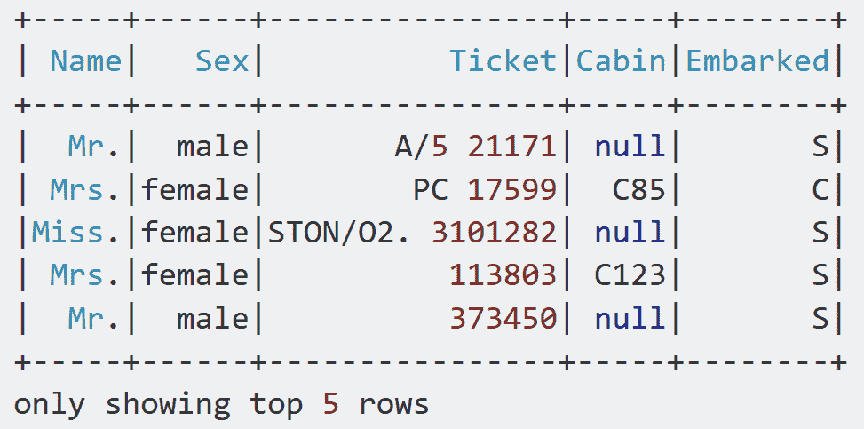

**问题 5 答案:**对于很多问题，可以只从一两个隐藏层开始。在大约相同的训练时间内，使用神经元总数相同的两个隐藏层(继续阅读以了解神经元的数量)，该设置将会工作得很好。现在让我们来看一些关于设置隐藏层数的简单估计:

*   **0** :只能表示线性可分函数
*   **1** :可以逼近任何包含从一个有限空间到另一个有限空间的连续映射的函数
*   **2** :可以表示任意精度的任意判定边界

然而，对于更复杂的问题，您可以逐渐增加隐藏层的数量，直到您开始过度适应训练集。然而，你可以试着逐渐增加神经元的数量，直到网络开始超负荷。这意味着不会导致过度拟合的隐藏神经元数量的上限是:


在前面的等式中:

*   *N[I]=输入神经元数量*
*   *N[o]=输出神经元数量*
*   *N[s]=训练数据集中的样本数*
*   *α* =任意比例因子，通常为 *2-10*

请注意，前面的等式不是来自任何研究，而是来自我个人的工作经验。

**问题 6 答案:**当然可以。我们可以交叉验证训练，并创建网格搜索技术来寻找最佳超参数。让我们试一试。

首先，我们定义了层。不幸的是，我们不能交叉验证层。很可能，这要么是一个 bug，要么是 Spark 的人故意制造的。所以我们坚持单一分层:

```
int[] layers = new int[] {10, 16, 16, 2};
```

然后，我们创建训练器，并仅设置层和种子参数:

```
MultilayerPerceptronClassifier mlp = new MultilayerPerceptronClassifier()
                     .setLayers(layers)
                     .setSeed(1234L);
```

我们在 MLP 的不同超参数中寻找最佳模型:

```
ParamMap[] paramGrid = new ParamGridBuilder() 
                    .addGrid(mlp.blockSize(), new int[] {32, 64, 128})
                    .addGrid(mlp.maxIter(), new int[] {10, 50})
                    .addGrid(mlp.tol(), new double[] {1E-2, 1E-4, 1E-6})
                    .build();
MulticlassClassificationEvaluator evaluator = new MulticlassClassificationEvaluator()
          .setLabelCol("label")
          .setPredictionCol("prediction");
```

然后，我们设置交叉验证器并执行 10 重交叉验证:

```
int numFolds = 10;
CrossValidator crossval = new CrossValidator()
          .setEstimator(mlp)
          .setEvaluator(evaluator)
          .setEstimatorParamMaps(paramGrid)
          .setNumFolds(numFolds);
```

然后，我们使用交叉验证的模型进行训练:

```
CrossValidatorModel cvModel = crossval.fit(trainingData);
```

最后，我们在测试集上评估交叉验证的模型，如下所示:

```
Dataset<Row> predictions = cvModel.transform(validationData);
```

现在，我们可以计算并显示性能指标，类似于我们之前的示例:

```
double accuracy = evaluator1.evaluate(predictions);
double precision = evaluator2.evaluate(predictions);
double recall = evaluator3.evaluate(predictions);
double f1 = evaluator4.evaluate(predictions);

// Print the performance metrics
System.out.println("Accuracy = " + accuracy);
System.out.println("Precision = " + precision);
System.out.println("Recall = " + recall);
System.out.println("F1 = " + f1);
System.out.println("Test Error = " + (1 - accuracy));
```

```
>>>Accuracy = 0.7810132575757576
 Precision = 0.7810132575757576
 Recall = 0.7810132575757576
 F1 = 0.7810132575757576
 Test Error = 0.21898674242424243
```