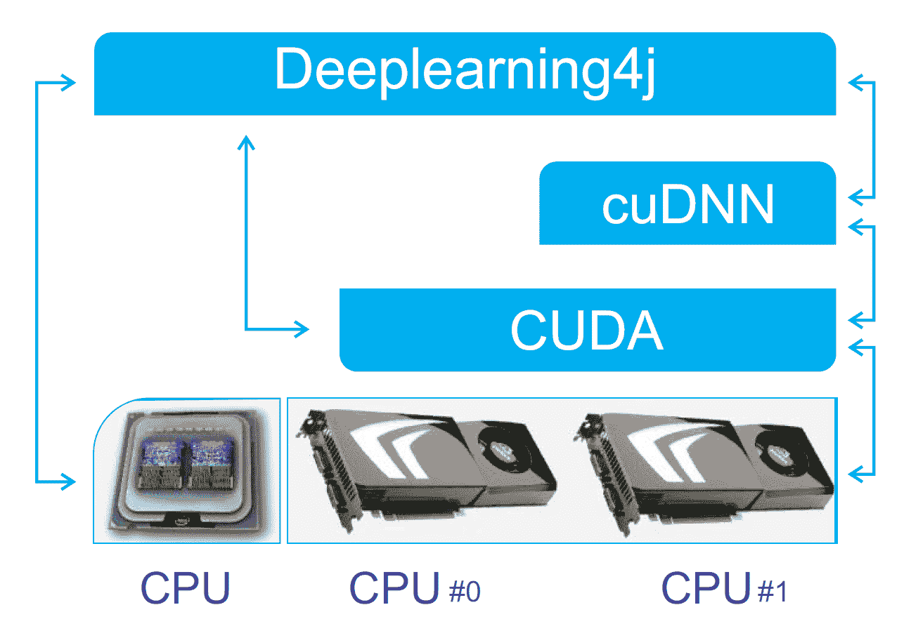
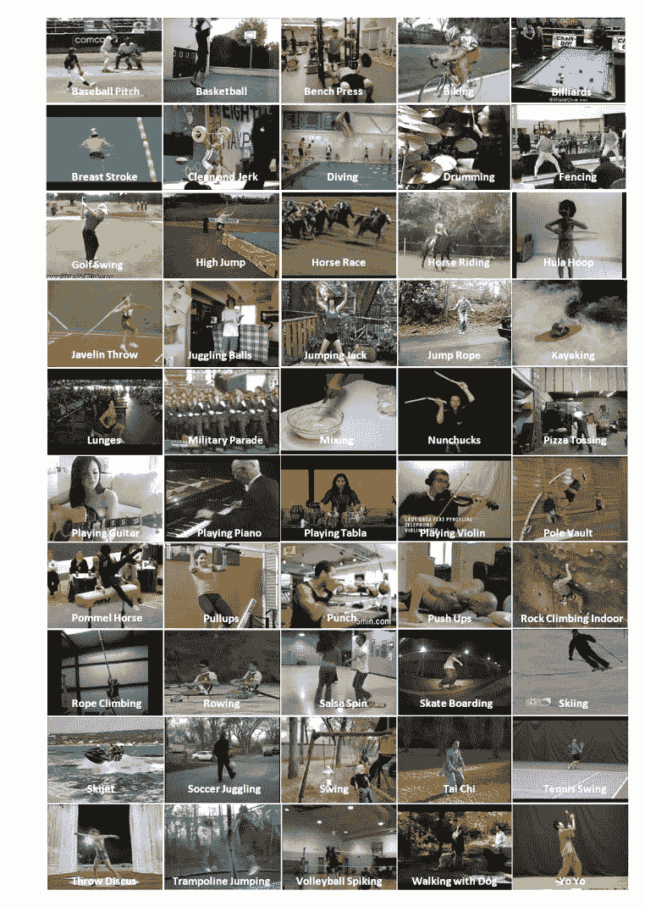
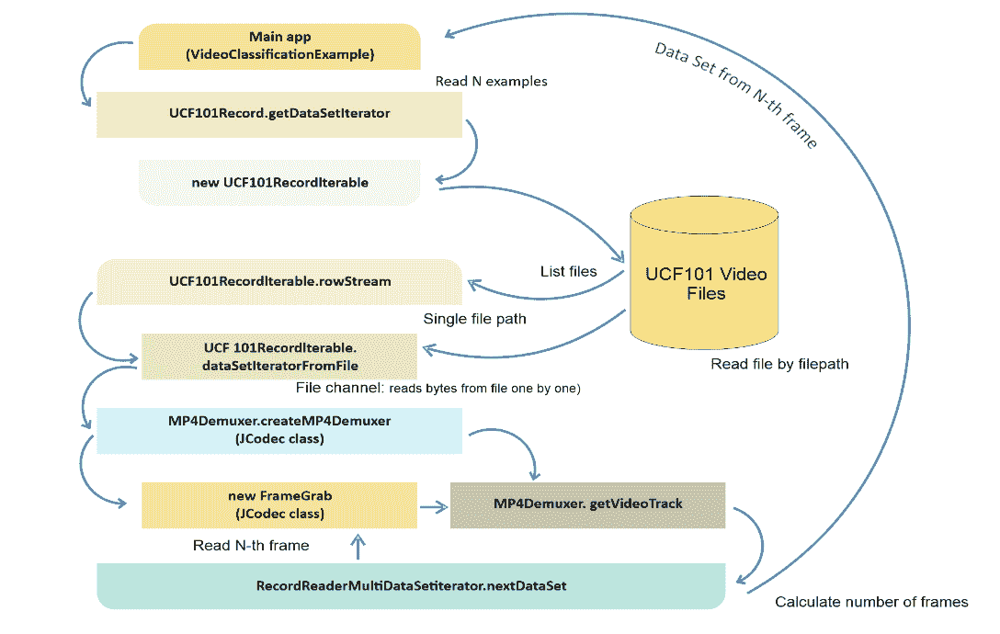
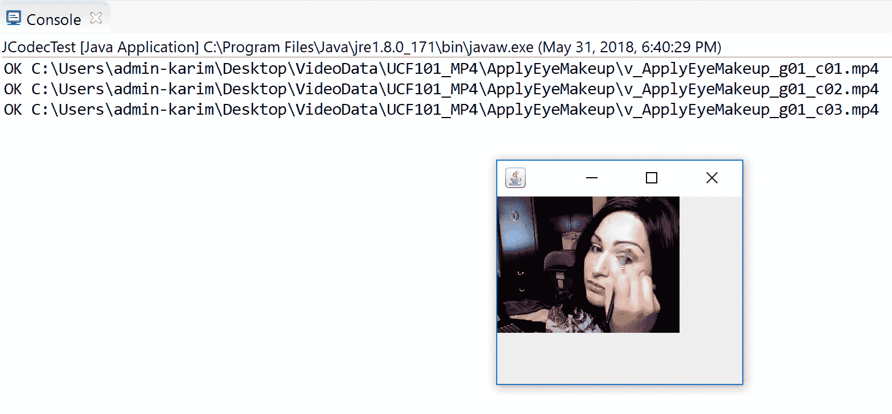
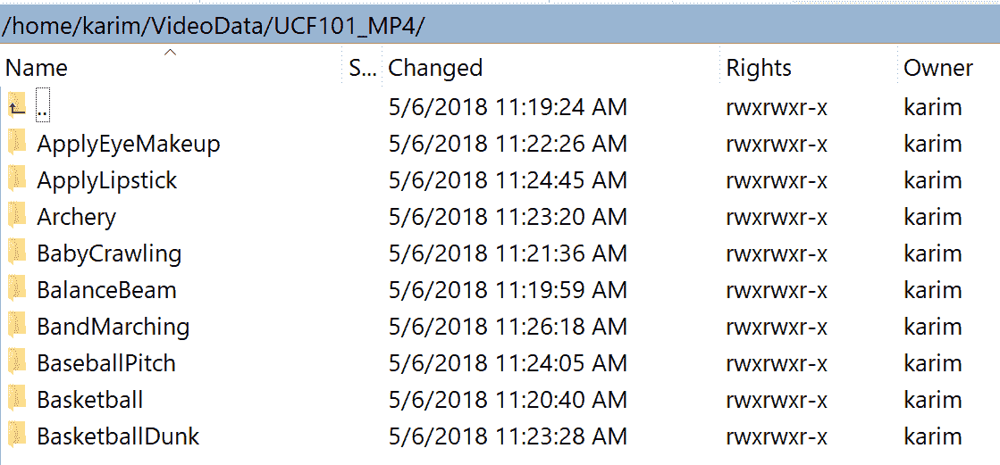
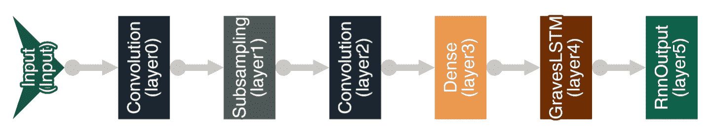
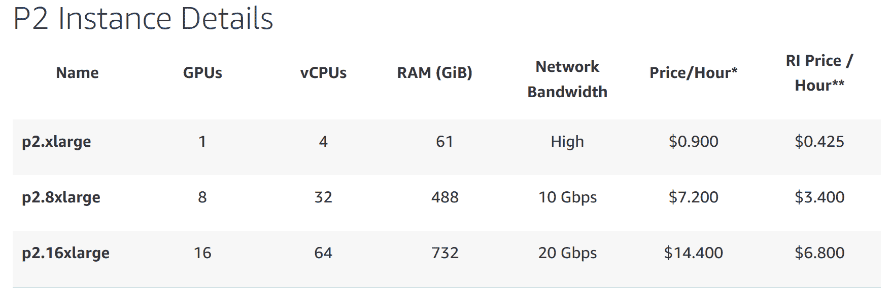
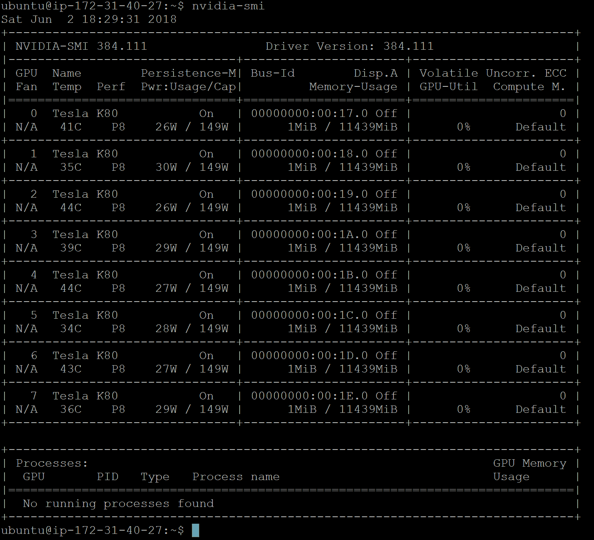
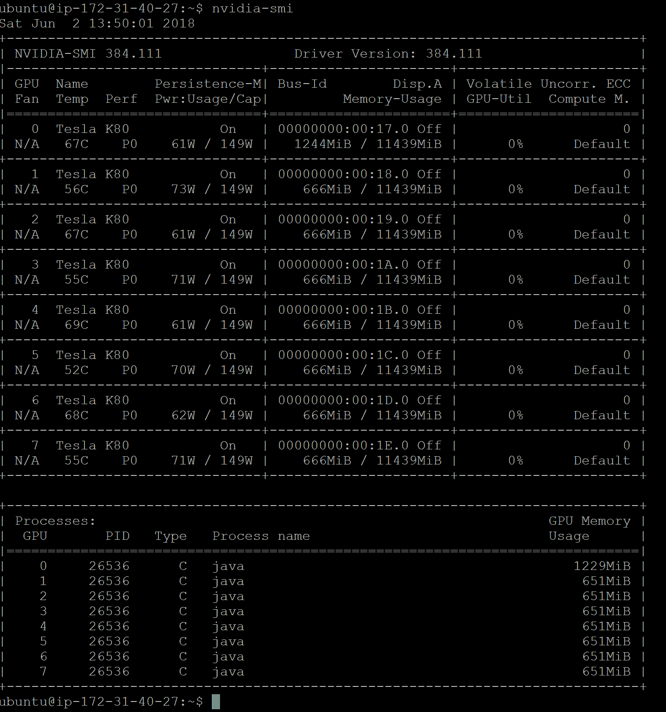

# 八、分布式深度学习——将卷积 LSTM 网络用于视频分类

到目前为止，我们已经看到了如何在数字和图像上开发基于深度学习的项目。然而，将类似的技术应用于视频剪辑，例如，用于从视频中识别人类活动，并不简单。

在本章中，我们将了解如何将深度学习方法应用于视频数据集。我们将描述如何从大量视频剪辑中处理和提取特征。然后，我们将通过在多个设备(CPU 和 GPU)上分布训练来使整个管道可扩展和更快，并并行运行它们。

我们将看到一个完整的例子，说明如何开发一个深度学习应用程序，使用 CNN 和 LSTM 网络结合**deep learning 4j**(**DL4J**)对一个大型视频数据集集合(如 UCF101 数据集)进行准确分类。这克服了独立的 CNN 或 RNN **长短期记忆** ( **LSTM** )网络的局限性。

培训将在 Amazon EC2 GPU 计算集群上进行。最终，这个端到端的项目可以被视为从视频或其他视频中识别人类活动的基础。简而言之，我们将在整个端到端项目中学习以下主题:

*   跨多个 GPU 的分布式深度学习
*   数据集收集和描述
*   使用卷积 LSTM 网络开发视频分类器
*   常见问题(FAQ)


# 跨多个 GPU 的分布式深度学习

如前所述，我们将看到一个使用卷积 LSTM 网络对来自`UCF101`数据集的大量视频剪辑进行分类的系统示例。然而，首先我们需要知道如何在多个 GPU 之间分配训练。在前面的章节中，我们讨论了一些高级技术，如网络权重初始化、批量标准化、更快的优化器、正确的激活函数等。这些当然有助于网络更快地收敛。然而，在单台机器上训练一个大型神经网络仍然需要几天甚至几周的时间。因此，这不是处理大规模数据集的可行方法。

理论上，神经网络的分布式训练主要有两种方法:数据并行和模型并行。DL4J 依靠的是数据并行，称为分布式深度学习，采用参数平均。然而，多媒体分析通常会使事情变得更加复杂，因为从单个视频剪辑中，我们可以看到成千上万的帧和图像，等等。为了解决这个问题，我们首先将计算分布在一台机器上的多个设备上，然后在多台机器上的多个设备上进行，如下所示:


跨多个设备并行执行 DL4J Java 应用程序

例如，您通常可以在单台计算机上使用 8 个 GPU 来训练神经网络，而不是在多台计算机上使用 16 个 GPU。原因很简单——多机设置中网络通信带来的额外延迟。下图显示了如何配置使用 CUDA 和 cuDNN 来控制 GPU 和 boost DNNs 的 DL4J:



DL4J 使用 CUDA 和 cuDNN 来控制 GPU 和提升 DNNs


# 使用 DL4J 在 GPU 上进行分布式培训

DL4J 既可以在分布式 GPU 上工作，也可以在本地 GPU 上工作(也就是说，有 CPU 后端的 GPU)。它允许用户在单个 GPU 上本地运行，如 Nvidia Tesla、Titan 或 GeForce GTX，以及在 Nvidia GRID GPUs 上的云中运行。我们还可以通过安装多个 GPU，在 Amazon AWS EC2 GPU 集群上执行培训。

要在 GPU 上训练一个神经网络，需要对根目录下的`pom.xml`文件做一些修改，比如属性和依赖关系管理，用于下拉 DL4j 团队提供的所需依赖关系。首先，我们处理项目属性，如下所示:

```
<properties>
        <project.build.sourceEncoding>UTF-8</project.build.sourceEncoding>
        <java.version>1.8</java.version>
        <jdk.version>1.8</jdk.version>
        <nd4j.backend>nd4j-cuda-9.0-platform</nd4j.backend>
        <nd4j.version>1.0.0-alpha</nd4j.version>
        <dl4j.version>1.0.0-alpha</dl4j.version>
        <datavec.version>1.0.0-alpha</datavec.version>
        <arbiter.version>1.0.0-alpha</arbiter.version>
        <logback.version>1.2.3</logback.version>
</properties>
```

在前面的`<properties>`标签中，正如条目所解释的，我们将使用 DL4J 1.0.0-alpha 版本，以 CUDA 9.0 平台作为后端。另外，我们计划使用 Java 8。尽管如此，还是为`logback`定义了一个额外的属性。

Logback 旨在作为流行的 log4j 项目的继承者，继承 log4j 的遗志。Logback 的体系结构足够通用，可以应用于不同的环境。目前，回退分为三个模块，回退-核心，回退-经典和回退-访问。更多信息，读者应该参考 https://logback.qos.ch/的。

我假设您已经配置了 CUDA 和 cuDNN，并相应地设置了路径。一旦我们定义了项目属性，下一个重要任务就是定义与 GPU 相关的依赖项，如下所示:

```
<dependency>
     <groupId>org.nd4j</groupId>
     <artifactId>nd4j-cuda-9.0-platform</artifactId>
     <version>${nd4j.version}</version>
</dependency>
<dependency>
      <groupId>org.deeplearning4j</groupId>
      <artifactId>deeplearning4j-cuda-9.0</artifactId>
      <version>${dl4j.version}</version>
</dependency>
```

其中，ND4J 是为 DL4J 提供动力的数值计算引擎，充当后端或它所工作的不同类型的硬件。如果你的系统安装了多个 GPU，你可以在数据并行模式下训练你的模型，这叫做**多 GPU 数据并行**。DL4J 提供了一个可以实例化的简单包装器，如下所示:

```
// ParallelWrapper will take care of load balancing between GPUs. ParallelWrapper wrapper = new ParallelWrapper.Builder(YourExistingModel)
     .prefetchBuffer(24)
     .workers(8)
     .averagingFrequency(1)
     .reportScoreAfterAveraging(true)
     .useLegacyAveraging(false)
     .build();
```

一个更具体的例子如下:

```
ParallelWrapper wrapper = new ParallelWrapper.Builder(net)            
            .prefetchBuffer(8)// DataSets prefetching options. Set to number of actual devices
            .workers(8)// set number of workers equal to number of available devices 
            .averagingFrequency(3)// rare averaging improves performance, but reduce accuracy           
            .reportScoreAfterAveraging(true) // if set TRUE, on every averaging model's score reported
            .build();
```

`ParallelWrapper`将您的现有模型作为主要参数，并通过保持工作人员数量等于或高于您机器上的 GPU 数量来进行并行训练。

在`ParallelWrapper`内，初始模型将被复制，每个工人将训练自己的模型。在`averagingFrequency(X)`中的每 *N* 次迭代后，所有模型将被平均，训练继续。现在，要使用这个功能，在`pom.xml`文件中使用下面的依赖关系:

```
<dependency>
      <groupId>org.deeplearning4j</groupId>
      <artifactId>deeplearning4j-parallel-wrapper_2.11</artifactId>
      <version>${dl4j.version}</version>
</dependency>
```

更多最新的文档，感兴趣的读者可以查看以下链接:[https://deeplearning4j.org/gpu](https://deeplearning4j.org/gpu)。

现在，我们对如何在多个 GPU 之间分配基于 DL 的训练有了理论上的理解。在下一节中，我们将很快看到一个实践示例。


# 使用卷积 LSTM 的视频分类

在本节中，我们将开始结合卷积层、最大池层、密集层和递归层来对视频剪辑的每一帧进行分类。具体来说，每个视频包含几个人的活动，这些活动持续多个帧(尽管它们在帧之间移动)，并且可能离开该帧。首先，让我们更详细地描述一下我们将在这个项目中使用的数据集。


# ucf 101–动作识别数据集

`UCF101`是一个现实动作视频的动作识别数据集，从 YouTube 收集，有 101 个动作类别，涵盖 13，320 个视频。视频是在相机运动、对象外观和姿态、对象比例、视点、杂乱背景和照明条件变化的情况下收集的。

101 个动作类别中的视频被进一步聚类成 25 个组(每个组中的剪辑具有共同的特征，例如背景和视点)，每个组中具有 4 到 7 个动作视频。有五个动作类别:人-对象交互、仅身体运动、人-人交互、演奏乐器和运动。

关于这个数据集还有一些事实:

*   视频包含不同的帧长度，每个视频片段的帧长度在 100 到 300 帧之间
*   `UCF101`采用`XVID`压缩标准(即`.avi`格式)
*   `UCF101`数据集的图片大小为 320 x 240
*   `UCF101`数据集包含不同视频文件中的不同类

数据集的概要如下:



来自`UCF50`数据集的一些随机片段(来源:[http://crcv.ucf.edu/data/UCF50.php](http://crcv.ucf.edu/data/UCF50.php)


# 预处理和特征工程

处理视频文件是一项非常具有挑战性的任务。尤其是在通过处理和互操作不同的编码来读取视频剪辑时；这是一项乏味的工作。此外，视频剪辑可能包含失真的帧，这在提取高质量特征时是一个障碍。

考虑到这些，在这一小节中，我们将看到如何通过处理视频编码问题来预处理视频剪辑，然后我们将详细描述特征提取过程。


# 解决编码问题

在 Java 中处理视频数据是一项麻烦的工作(考虑到我们没有很多像 Python 这样的库)，尤其是如果视频是以旧的`.avi`或这样的格式出现的话。我在 GitHub 上看到过一些使用 JCodec Java 库版本 0.1.5(或 0.2.3)读取和解析 MP4 格式的`UCF101`视频剪辑的博客和例子。

就连 DL4J 都依赖于 datavec-data-codec，而 data-codec 依赖于旧的 JCodec API，与新版本不兼容。不幸的是，即使是这个新版本的 JCodec 也无法读取`UCF101`视频。因此，我决定使用 FFmpeg 来处理 MP4 格式的视频。这属于 JavaCV 库，我在前面的章节中已经讨论过了。无论如何，要使用这个库，只需在`pom.xml`文件中包含以下依赖项:

```
<dependency>
       <groupId>org.bytedeco</groupId>
       <artifactId>javacv-platform</artifactId>
       <version>1.4.1</version>
</dependency>
```

由于`UCF101`是以`.avi`格式出现的，我很难用 Java 中的 JCodec 或 FFfmpeg 库来处理它们。因此，我用手工的方式把视频转换成了`MP4`格式。

为此，我写了一个 Python 脚本(名为`prepare.py`，可以在本章的代码库下找到)。这个 Python 确实下载、提取和解码了完整的`UCF101`数据集，但这可能需要几个小时，这取决于硬件配置和互联网速度。尽管放置 Python 代码与本书无关，但我还是把它放在这里，以便人们可以对它的工作原理有所了解，所以请看一下这段代码:

```
import os

ROOT = os.path.dirname(os.path.abspath(__file__))
DATA = os.path.join(ROOT, 'VideoData')
UCF_RAW = os.path.join(ROOT, 'VideoData', 'UCF101')
UCF_MP4 = os.path.join(ROOT, 'VideoData', 'UCF101_MP4')

if not os.path.isdir(UCF_MP4):
    print("Start converting UCF101 dataset to MP4...")
    filepaths = []

    for label_dir in os.listdir(os.path.join(UCF_RAW)):
        for file in os.listdir(os.path.join(UCF_RAW, label_dir)):
            filepath = (UCF_RAW, label_dir, file)
            filepaths.append(filepath)
    files_len = len(filepaths)
    os.mkdir(UCF_MP4)

    for i, (_, label_dir, file_avi) in enumerate(filepaths):
        if file_avi.endswith('.avi'):
            file_mp4 = file_avi.rstrip('.avi') + '.mp4'
            input_filepath = os.path.join(UCF_RAW, label_dir, file_avi)
            output_filepath = os.path.join(UCF_MP4, label_dir, file_mp4)

            if not os.path.isfile(output_filepath):
                output_dir = os.path.join(UCF_MP4, label_dir)
                if not os.path.isdir(output_dir):
                    os.mkdir(output_dir)
                os.system('ffmpeg -v error -i %s -strict -2 %s' % (input_filepath, output_filepath))
        print("%d of %d files converted" % (i+1, files_len))
print("Dataset ready")
```

如这段代码所示，您只需从[http://crcv.ucf.edu/data/UCF101.php](http://crcv.ucf.edu/data/UCF101.php)下载`UCF101`数据集，并将其放在`VideoData/UCF101`文件夹中。然后 Python 使用内置的 FFmpeg 包将所有的`.avi`文件转换成`.mp4`格式，一旦使用`$ python3 prepare.py`命令执行，就保存在`VideoData/UCF101_MP4`目录下。


# 数据处理工作流程

一旦文件是 MP4 格式，我们就可以开始提取特征。现在，为了处理`UCF101`数据集并提取特性，我又编写了三个 Java 类，概述如下:

*   `UCF101Reader.java` **:** 这是视频文件读取、解码和转换为 ND4J 矢量的主要入口点。它接收数据集的完整路径，并创建神经网络所需的`DataSetIterator`。此外，它生成所有类的列表，并为它们分配连续的整数。
*   使用 JCodec 读取所有的剪辑并解码。
*   这和 DL4J 提供的类似，但是一个改进的版本，在新版本的 JCodec 上运行得很好。

然后，为了准备训练和测试分割，使用了`UCF101Reader.getDataSetIterator()`方法。该方法读取每个视频剪辑，但是，首先，它根据参数和偏移值决定要读取多少个示例(视频文件)。这些参数然后被传递给`UCF101ReaderIterable`。此方法的签名如下:

```
public UCF101Reader(String dataDirectory) {
        this.dataDirectory = dataDirectory.endsWith("/") ? dataDirectory : dataDirectory + "/";
          }

public DataSetIterator getDataSetIterator(int startIdx, int nExamples, int miniBatchSize) throws Exception {
    ExistingDataSetIterator iter = new ExistingDataSetIterator(createDataSetIterable(startIdx, 
                                                               nExamples, miniBatchSize));
        return new AsyncDataSetIterator(iter,1);
    }
```

在这个方法中，`ExistingDataSetIterator`充当一个包装器，为现有的 Java `Iterable<DataSet>`和`Iterator<DataSet>`提供一个`DataSetIterator`接口。然后使用`UCF101Reader.UCF101ReaderIterable()`方法创建标签映射(类名到 int index)和逆标签映射，如下所示:

```
private UCF101RecordIterable createDataSetIterable(int startIdx, int nExamples, int miniBatchSize) 
                                                   throws IOException {
        return new UCF101RecordIterable(dataDirectory, labelMap(), V_WIDTH, V_HEIGHT,startIdx, nExamples);
                  }
```

从下面可以看出，`dataDirectory`是 MP4 格式视频的目录，(`V_WIDTH`，`V_HEIGHT`)表示视频帧的大小，`labelMap()`提供了每个视频片段的映射:

```
public static final int V_WIDTH = 320;
public static final int V_HEIGHT = 240;
public static final int V_NFRAMES = 100;
private final String dataDirectory;
private volatile Map<Integer, String> _labelMap;
```

所以，`labelMap()`的签名如下:

```
public Map<Integer, String> labelMap() throws IOException {
        if(_labelMap == null) {
            synchronized (this) {
                if(_labelMap == null) {
                    File root = new File(dataDirectory);
                    _labelMap = Files.list(root.toPath()).map(f -> f.getFileName().toString())
                            .sorted().collect(HashMap::new, (h, f) -> h.put(h.size(), f), (h, o) -> {});
                }
            }
        }
        return _labelMap;
    }
```

然后用`UCF101ReaderIterable.iterator()`创建网络需要的`DataSet`的迭代器。这个迭代器以神经网络 API`DataSetIterator`要求的形式传送给`ExistingDataSetIterator`，如下所示:

```
// The @NotNull Annotation ensures iterator() method des not return null.
@NotNull
@Override
public Iterator<DataSet> iterator() {
        return rowsStream(dataDirectory).skip(this.skip).limit(this.limit).flatMap(p -> 
               dataSetsStreamFromFile(p.getKey(), p.getValue())).iterator();
    }
```

另外，`AsyncDataSetIterator`用于在一个单独的线程中做所有的数据处理。而`UCF101ReaderIterable.rowStream()`列出所有数据集文件并创建一系列文件和相应的类标签，如下所示:

```
public static Stream<Pair<Path, String>> rowsStream(String dataDirectory) {
        try {
            List<Pair<Path, String>> files = Files.list(Paths.get(dataDirectory)).flatMap(dir -> {
                try {
                    return Files.list(dir).map(p -> Pair.of(p, dir.getFileName().toString()));
                } catch (IOException e) {
                    e.printStackTrace();
                    return Stream.empty();
                }
            }).collect(Collectors.toList());
            Collections.shuffle(files, new Random(43));
            return files.stream();
        } catch (IOException e) {
            e.printStackTrace();
            return Stream.empty();
        }
    }
```

然后，使用`UCF101ReaderIterable.dataSetStreamFromFile()`方法将底层迭代器转换成 java 流。将迭代器转换成流只是一个技术步骤。因为在 Java 中过滤一些元素，限制流中的元素数量更方便。看看这段代码！

```
private Stream<DataSet> dataSetsStreamFromFile(Path path, String label) {
        return StreamSupport.stream(Spliterators.spliteratorUnknownSize(dataSetsIteratorFromFile(path, 
                                    label), Spliterator.ORDERED), false);
    }
```

`UCF101ReaderIterable.dataSetIteratorFromFile()`方法接收视频文件路径，然后创建帧阅读器(`FrameGrab` —JCodec 类)。最后，它将帧阅读器传递给`RecordReaderMultiDataSetIterator.nextDataSet`，如下所示:

```
private Iterator<DataSet> dataSetsIteratorFromFile(Path path, String label) {
        FileChannelWrapper _in = null;
        try {
            _in = NIOUtils.readableChannel(path.toFile());
            MP4Demuxer d1 = MP4Demuxer.createMP4Demuxer(_in);
            SeekableDemuxerTrack videoTrack_ = (SeekableDemuxerTrack)d1.getVideoTrack();
            FrameGrab fg = new FrameGrab(videoTrack_, new AVCMP4Adaptor(videoTrack_.getMeta()));

            final int framesTotal = videoTrack_.getMeta().getTotalFrames();
            return Collections.singleton(recordReaderMultiDataSetIterator.nextDataSet(_in, framesTotal, 
                  fg, labelMapInversed.get(label), labelMap.size())).iterator();
        } catch(IOException | JCodecException e) {
            e.printStackTrace();
            return Collections.emptyIterator();
        }
    }
```

在前面的代码块中，`RecordReaderMultiDataSetIterator.nextDataSet()`方法用于将每个视频帧转换为与 DL4J 兼容的数据集。反过来，数据集是从帧生成的特征向量和从使用独热编码的帧标签生成的标签向量的关联。

这个逻辑基于 DL4J 的`RecordReaderMultiDataSetIterator`类，但是必要的支持来自最新的 JCodec API。然后我们使用`UCF101RecordIterable.labelToNdArray()`方法将标签编码成 ND4J `INDArray`格式:

```
private INDArray labelToNdArray(String label) {
 int maxTSLength = 1; // frames per dataset
 int labelVal = labelMapInversed.get(label);
          INDArray arr = Nd4j.*create*(new int[]{1, classesCount}, 'f');
          arr.put(0, labelVal, 1f);
 return arr;
}
```

下图描述了前面提到的工作流程步骤:



特征提取过程中的数据流


# 检查视频帧的简单用户界面

我开发了一个简单的 UI 应用程序，使用 Java Swing 来测试代码是否正确处理帧。这个 UI 读取一个 MP4 格式的输入视频文件，并像一个简单的视频播放器一样向读者逐个显示帧。UI 应用程序被命名为`JCodecTest.java`。

在`JCodecTest.java`类中，`testReadFrame()`方法利用来自`FrameGrab`类(即来自 JavaCV 库)的`getFrameFromFile()`方法，并检查每个视频剪辑的帧提取过程是否正常工作。这是签名:

```
private void testReadFrame(Consumer<Picture> consumer) throws IOException, JCodecException {
        // Read the clip sequentially one by one
        next:
        for(Iterator<Pair<Path, String>> iter = rowsStream().iterator(); iter.hasNext(); ) {
            Pair<Path, String> pair = iter.next();
            Path path = pair.getKey();
            pair.getValue();

            for(int i = 0; i < 100; i++) {
                try {
                    // Hold video frames as pictures
                    Picture picture = FrameGrab.getFrameFromFile(path.toFile(), i);
                    consumer.accept(picture);
                } catch (Throwable ex) {
                    System.out.println(ex.toString() + " frame " + i + " " + path.toString());
                    continue next;
                }
            }
            System.out.println("OK " + path.toString());
        }
    }
```

在前面的代码块中，`rowsStream()`方法如下:

```
private Stream<Pair<Path, String>> rowsStream() {
        try {
            return Files.list(Paths.get(dataDirectory)).flatMap(dir -> {
                try {
                    return Files.list(dir).map(p -> Pair.of(p, dir.getFileName().toString()));
                } catch (IOException e) {
                    e.printStackTrace();
                    return Stream.empty();
                }
            });
        } catch (IOException e) {
            e.printStackTrace();
            return Stream.empty();
        }
    }
```

要查看这种方法的有效性，读者可以执行包含`main()`方法的`JCodecTest.java`类，如下所示:

```
private String dataDirectory = "VideoData/UCF101_MP4/";
public static void main(String[] args) throws IOException, JCodecException {
        JCodecTest test = new JCodecTest();
        test.testReadFrame(new FxShow());
}
```

执行后，您将会看到如下输出，如该屏幕截图所示:



JCodecTest.java 类检查从每个视频剪辑提取帧是否正常工作


# 准备训练集和测试集

如前所述，`UCF101Reader.java`类用于提取特征并准备训练和测试集。首先，我们设置并向 Java 显示 MP4 文件的路径，如下所示:

```
String dataDirectory = "VideoData/UCF101_MP4/";// Paths to video dataset
```

需要注意的是，我在`EC2 p2.8xlarge`机器上用视频剪辑训练网络花了大约 45 个小时。然而，我第二次没有那个耐心了；因此，我通过仅利用具有 1，112 个视频剪辑的这些视频类别来执行训练:



UCF101 数据集目录结构(MP4 版)

然后，我们定义用于准备训练集和测试集的最小批量。对于我们的例子，我把 128，你可以看到:

```
private static int *miniBatchSize* = 128;
private static int *NUM_EXAMPLE* = 10;
UCF101Reader reader = new UCF101Reader(dataDirectory);
```

我们定义提取过程将从哪个文件开始的偏移量:

```
int examplesOffset = 0; // start from N-th file
```

然后我们决定使用多少样本视频剪辑来训练网络，而`UCF101Reader.fileCount()`方法返回`UCF101_MP4`目录中视频剪辑的数量。看一下这段代码行:

```
int nExamples = Math.*min*(NUM_*EXAMPLE*, reader.fileCount());
```

接下来，我们计算测试集的开始索引。我们将 80%用于培训，另外 20%用于测试。让我们看看代码:

```
int testStartIdx = examplesOffset + Math.*max*(2, (int) (0.8 * nExamples)); //80% in train, 20% in test 
int nTest = nExamples - testStartIdx + examplesOffset;
System.*out*.println("Dataset consist of " + reader.fileCount() + " video clips, use " 
                    + nExamples + " of them");
```

现在我们准备训练集。为此，`getDataSetIterator()`方法通过为除了计划用于测试集的视频剪辑之外的所有视频剪辑返回`DataSetIterator`来实现这个目的。看一下这段代码:

```
System.*out*.println("Starting training...");
DataSetIterator trainData = reader.getDataSetIterator(examplesOffset, nExamples - nTest, *miniBatchSize*);
```

然后我们准备测试集。为此，`getDataSetIterator()`方法再次通过为除了计划用于测试集的视频剪辑之外的所有视频剪辑返回`DataSetIterator`来达到目的。看一下这段代码:

```
System.out.println("Use " + String.*valueOf*(nTest) + " video clips for test"); 
DataSetIterator testData = reader.getDataSetIterator(testStartIdx, nExamples, *miniBatchSize*);
```

太棒了。到目前为止，我们已经能够准备好训练集和测试集。现在，下一步是创建网络并进行培训。


# 网络创建和培训

现在，我们开始通过结合卷积、最大池、密集(前馈)和递归(LSTM)层来创建网络，以对视频剪辑的每一帧进行分类。首先，我们需要定义一些超参数和必要的实例化，如下所示:

```
private static MultiLayerConfiguration *conf*;
private static MultiLayerNetwork *net*; 
private static String *modelPath* = "bin/ConvLSTM_Model.zip";
private static int *NUM_CLASSES*;
private static int *nTrainEpochs* = 100;
```

这里，`NUM_CLASSES`是来自`UCF101`的类的数量，计算为数据集基本目录中的目录数量:

```
*NUM_CLASSES* = reader.labelMap().size();
```

然后我们通过调用`networkTrainer()`方法开始训练。正如我之前所说，我们将结合卷积、最大池、密集(前馈)和递归(LSTM)层来对视频剪辑的每一帧进行分类。训练数据首先被馈送到卷积层(第 0 层)，然后在被输入到第二卷积层(第 2 层)之前被二次采样(第 1 层)。然后第二个卷积层馈入全连接层(第 3 层)。

要注意的是，对于第一 CNN 层，我们有 CNN 预处理器输入宽度/高度 13×18，这反映了 320×240 的图像尺寸。这样，密集层作为 LSTM 层的输入层(第 4 层，但也可以随意使用常规的 LSTM)。但是，请务必注意，密集图层输入的大小为 2，340(即 13 * 18 * 10)。

然后，递归反馈连接到 RNN 输出层，该层具有 softmax 激活函数，用于类上的概率分布。我们还使用梯度归一化处理消失和爆炸梯度问题，最后一层的反向传播是截断 BPTT。除了这些，我们使用一些其他的超参数；这些是不言自明的。下图显示了该网络设置:



网络体系结构

现在，从编码的角度来看，`networkTrainer()`方法具有以下网络配置:

```
//Set up network architecture:
 conf = new NeuralNetConfiguration.Builder()
                .seed(12345)
                .l2(0.001) //l2 regularization on all layers
                .updater(new Adam(0.001)) // we use Adam as updater
                .list()
                .layer(0, new ConvolutionLayer.Builder(10, 10)
                        .nIn(3) //3 channels: RGB
                        .nOut(30)
                        .stride(4, 4)
                        .activation(Activation.RELU)
                        .weightInit(WeightInit.RELU)
                        .build()) //Output: (130-10+0)/4+1 = 31 -> 31*31*30
                .layer(1, new SubsamplingLayer.Builder(SubsamplingLayer.PoolingType.MAX)
                        .kernelSize(3, 3)
                        .stride(2, 2).build()) //(31-3+0)/2+1 = 15
                .layer(2, new ConvolutionLayer.Builder(3, 3)
                        .nIn(30)
                        .nOut(10)
                        .stride(2, 2)
                        .activation(Activation.RELU)
                        .weightInit(WeightInit.RELU)
                        .build()) //Output: (15-3+0)/2+1 = 7 -> 7*7*10 = 490
                .layer(3, new DenseLayer.Builder()
                        .activation(Activation.RELU)
                        .nIn(2340) // 13 * 18 * 10 = 2340, see CNN layer width x height
                        .nOut(50)
                        .weightInit(WeightInit.RELU)
                        .gradientNormalization(GradientNormalization.ClipElementWiseAbsoluteValue)
                        .gradientNormalizationThreshold(10)
                        .updater(new AdaGrad(0.01))// for faster convergence
                        .build())
                .layer(4, new LSTM.Builder()
                        .activation(Activation.SOFTSIGN)
                        .nIn(50)
                        .nOut(50)
                        .weightInit(WeightInit.XAVIER)
                        .updater(new AdaGrad(0.008))
                        .gradientNormalization(GradientNormalization.ClipElementWiseAbsoluteValue)
                        .gradientNormalizationThreshold(10)
                        .build())
                .layer(5, new RnnOutputLayer.Builder(LossFunctions.LossFunction.MCXENT)
                        .activation(Activation.SOFTMAX)
                        .nIn(50)
                        .nOut(NUM_CLASSES)    
                        .weightInit(WeightInit.XAVIER)
                        .gradientNormalization(GradientNormalization.ClipElementWiseAbsoluteValue)
                        .gradientNormalizationThreshold(10)
                        .build())
                .inputPreProcessor(0, new RnnToCnnPreProcessor(UCF101Reader.V_HEIGHT, 
                                   UCF101Reader.V_WIDTH, 3))
                .inputPreProcessor(3, new CnnToFeedForwardPreProcessor(13, 18, 10))
                .inputPreProcessor(4, new FeedForwardToRnnPreProcessor())
                .pretrain(false).backprop(true)
                .backpropType(BackpropType.TruncatedBPTT)
                .tBPTTForwardLength(UCF101Reader.V_NFRAMES / 5)
                .tBPTTBackwardLength(UCF101Reader.V_NFRAMES / 5)
                .build();
```

接下来，基于前面的网络配置设置，我们创建一个`MultiLayerNetwork`并初始化它，如下所示:

```
*net* = new MultiLayerNetwork(*conf*);
*net*.init();
*net*.setListeners(new ScoreIterationListener(1));
```

然后，我们可以观察每一层的参数数量，如下所示:

```
System.*out*.println("Number of parameters in network: " + *net*.numParams());
for(int i=0; i<*net*.getnLayers(); i++){
    System.*out*.println("Layer " + i + " nParams = " + *net*.getLayer(i).numParams());
}
```

<q>> > ></q> 网络参数个数:149599
第 0 层 nParams = 9030
第 1 层 nParams = 0
第 2 层 nParams = 2710
第 3 层 nParams = 117050
第 4 层 nParams = 20350
第 5 层 nParams = 459

最后，我们使用这个训练集开始训练:

```
for (int i = 0; i < *nTrainEpochs*; i++) {
         int j = 0;
         while(trainData.hasNext()) {
               long start = System.*nanoTime*();
               DataSet example = trainData.next();
               *net*.fit(example);
               System.*out*.println(" Example " + j + " processed in " 
                                 + ((System.*nanoTime*() - start) / 1000000) + " ms");
               j++;
              }
       System.*out*.println("Epoch " + i + " complete");
}
```

我们使用`saveConfigs()`方法保存经过训练的网络和视频配置，该方法的签名非常简单，如您所见:

```
private static void saveConfigs() throws IOException {
         Nd4j.*saveBinary*(*net*.params(),new File("bin/videomodel.bin"));
         FileUtils.*writeStringToFile*(new File("bin/videoconf.json"), *conf*.toJson());
  }
```

然后，我们使用`saveNetwork()`方法保存训练好的模型，用于以后的推理目的；内容如下:

```
privates tatic void saveNetwork() throws IOException {
         File locationToSave = new File(*modelPath*);
 boolean saveUpdater = true;
         ModelSerializer.*writeModel*(*net*, locationToSave, saveUpdater);
}
```


# 性能赋值

为了评估网络性能，我编写了`evaluateClassificationPerformance()`方法，该方法采用测试集和`evalTimeSeries`评估，如下所示:

```
private static void evaluateClassificationPerformance(MultiLayerNetwork net, int testStartIdx, 
                     int nExamples, DataSetIterator testData) throws Exception {
          Evaluation evaluation = new Evaluation(*NUM_CLASSES*);
 while(testData.hasNext()) {
                DataSet dsTest = testData.next();
                INDArray predicted = net.output(dsTest.getFeatureMatrix(), false);
                INDArray actual = dsTest.getLabels(); 
                evaluation.evalTimeSeries(actual, predicted);
                 }
          System.*out*.println(evaluation.stats());
}
```

```
>>>
 Predictions labeled as 0 classified by model as 0: 493 times
 Predictions labeled as 0 classified by model as 7: 3 times
 Predictions labeled as 1 classified by model as 6: 287 times
 Predictions labeled as 1 classified by model as 7: 1 times
 Predictions labeled as 2 classified by model as 6: 758 times
 Predictions labeled as 2 classified by model as 7: 3 times
 Predictions labeled as 3 classified by model as 6: 111 times
 Predictions labeled as 3 classified by model as 7: 1 times
 Predictions labeled as 4 classified by model as 6: 214 times
 Predictions labeled as 4 classified by model as 7: 2 times
 Predictions labeled as 5 classified by model as 6: 698 times
 Predictions labeled as 5 classified by model as 7: 3 times
 Predictions labeled as 6 classified by model as 6: 128 times
 Predictions labeled as 6 classified by model as 5: 1 times
 Predictions labeled as 7 classified by model as 7: 335 times
 Predictions labeled as 8 classified by model as 8: 209 times
 Predictions labeled as 8 classified by model as 7: 2 times
 ==========================Scores===================
 # of classes: 9
 Accuracy: 0.4000
 Precision: 0.39754
 Recall: 0.4109
 F1 Score: 0.4037
 Precision, recall & F1: macro-averaged (equally weighted avg. of 9 classes)
 ======================================================
```

现在，为了更清楚地遵循上述步骤，下面是包含这些步骤的`main()`方法:

```
public static void main(String[] args) throws Exception {        
        String dataDirectory = "VideoData/UCF101_MP4/";
        UCF101Reader reader = new UCF101Reader(dataDirectory); 
        NUM_CLASSES = reader.labelMap().size();        

        int examplesOffset = 0; // start from N-th file
        int nExamples = Math.min(NUM_EXAMPLE, reader.fileCount()); // use only "nExamples" for train/test
        int testStartIdx = examplesOffset + Math.max(2, (int) (0.9 * nExamples)); //90% train, 10% in test
        int nTest = nExamples - testStartIdx + examplesOffset;
        System.out.println("Dataset consist of " + reader.fileCount() + " images, use "
                           + nExamples + " of them");        

        //Conduct learning
        System.out.println("Starting training...");       
        DataSetIterator trainData = reader.getDataSetIterator(examplesOffset, 
                                    nExamples - nTest, miniBatchSize);        
        networkTrainer(reader, trainData);

        //Save network and video configuration
        saveConfigs();

        //Save the trained model
        saveNetwork();

        //Evaluate classification performance:
        System.out.println("Use " + String.valueOf(nTest) + " images for validation");
        DataSetIterator testData = reader.getDataSetIterator(testStartIdx, nExamples, miniBatchSize);
        evaluateClassificationPerformance(net,testStartIdx,nTest, testData);        
    }
```

我们还没有达到更高的精度。这可能有很多原因。例如，我们只使用了几个类别(也就是说，101 个类别中只有 9 个)。因此，我们的模型没有获得足够的训练数据来学习。此外，大多数超参数设置得很幼稚。


# 关于 AWS 深度学习 AMI 9.0 的分布式培训

到目前为止，我们已经看到了如何在单个 GPU 上执行训练和推理。然而，为了以并行和分布式的方式使训练更快，拥有一台具有多个 GPU 的机器或服务器是一个可行的选择。实现这一点的简单方法是使用 AMAZON EC2 GPU 计算实例。

例如，P2 非常适合分布式深度学习框架，这些框架带有预装在单独的虚拟环境中的深度学习框架的最新二进制文件(MXNet、TensorFlow、Caffe、Caffe2、PyTorch、Keras、Chainer、Theano 和 CNTK)。

一个更大的优势是，它们完全配置了 NVidia CUDA 和 cuDNN。感兴趣的读者可以看看[https://aws.amazon.com/ec2/instance-types/p2/](https://aws.amazon.com/ec2/instance-types/p2/)。P2 实例的配置和定价如下:



P2 实例详细信息

对于这个项目，我决定用`p2.8xlarge`。您也可以创建它，但是要确保您已经向至少一个实例提交了增加的限制，这可能需要长达三天的时间。但是，如果你不知道如何做，只需在 AWS 上创建一个帐户并完成验证；然后转到 EC2 管理控制台。在左侧面板中，单击“限额”选项卡，这将带您进入一个页面，在该页面中，您可以通过单击“请求限额增加”链接来提交增加限额请求。

无论如何，我假设您知道这些简单的东西，所以我将继续创建一个类型为`p2.8xlarge`的实例。在左侧面板中，单击 Instances 菜单，这将带您进入以下页面:


选择深度学习 AMI

一个简单的选择是创建一个深度学习 AMI (Ubuntu)版本 9.0，它已经配置了 CUDA 和 cuDNN，可以跨八个 GPU 使用。另一个好处是它有 32 个计算核心和 488 GB 的 RAM 这对我们的数据集来说也足够了。因此，我们可以使用完整的数据集来执行训练，而不是仅使用九个类别的视频剪辑。

但是，请注意，因为我们将使用基于 JVM 的 DL4J，所以必须安装和配置 Java(必须设置`JAVA_HOME`)。首先，从 SSH 或使用 SFTP 客户端连接到您的实例。然后在 Ubuntu 上，我们可以用几个命令来完成，如下所示:

```
$ sudo apt-get install python-software-properties
$ sudo apt-get update
$ sudo add-apt-repository ppa:webupd8team/java
$ sudo apt-get update
```

然后，根据您要安装的版本，执行以下命令之一:

```
$ sudo apt-get install oracle-java8-installer
```

安装后，不要忘记设置 Java home。只需应用以下命令(我们假设 Java 是在`/usr/lib/jvm/java-8-oracle`安装的):

```
$ echo "export JAVA_HOME=/usr/lib/jvm/java-8-oracle" >> ~/.bashrc
$ echo "export PATH=$PATH:$JAVA_HOME/bin" >> ~/.bashrc
$ source ~/.bashrc
```

现在让我们来看看`Java_HOME`，如下:

```
$ echo $JAVA_HOME
```

现在，您应该在终端上观察到以下结果:

```
/usr/lib/jvm/java-8-oracle
```

最后，让我们通过发出这个命令来检查以确保 Java 已经成功安装(您可能会看到最新版本！):

```
$ java -version
```

```
>>>
 java version "1.8.0_121"
 Java(TM) SE Runtime Environment (build 1.8.0_121-b15)
 Java HotSpot(TM) 64-Bit Server VM (build 25.121-b15, mixed mode)
```

太棒了。我们已经能够在我们的实例上设置和配置 Java。然后让我们看看是否通过在终端上发出`nvidia-smi`命令来配置 GPU 驱动程序:



展示了一个 p2.8 xlarge 实例上的 Tesla K80 GPUs

正如我们所看到的，最初，没有使用 GPU，但它清楚地表明，在该实例中，安装和配置了八个 Tesla K80 GPUs。现在我们的 GPU 和机器已经完全配置好了，我们可以专注于项目了。我们将使用或多或少与以前相同的代码，但做了一些最小的修改。我们需要做的第一个改变是在我们的`main()`方法的开头添加下面一行:

```
CudaEnvironment.getInstance().getConfiguration()
       .allowMultiGPU(true) // key option enabled
       .setMaximumDeviceCache(2L * 1024L * 1024L * 1024L) // large cache
       .allowCrossDeviceAccess(true); // cross-device access for faster model averaging over a piece
```

然后，我们使用 ParallelWrapper 在八个 GPU 上执行训练，parallel wrapper 负责 GPU 之间的负载平衡。网络构建与之前相同，如下图所示:

```
*net* = new MultiLayerNetwork(*conf*);
*net*.init(); 

ParallelWrapper wrapper = new ParallelWrapper.Builder(net)
       .prefetchBuffer(8)// DataSets prefetching options. Set this with respect to number of devices
       .workers(8)// set number of workers equal to number of available devices -i.e. 8 for p2.8xlarge 
       .averagingFrequency(3)// rare averaging improves performance, but might reduce model accuracy           
       .reportScoreAfterAveraging(true) // if set TRUE, on every avg. model score will be reported 
       .build();
```

现在，我们通过拟合完整的测试集来开始培训，如下所示:

```
for (int i = 0; i < nTrainEpochs; i++) {
     wrapper.fit(trainData);
     System.out.println("Epoch " + i + " complete"); 
    }
```

这就是我们需要做的。但是，请确保在`CudaEnvironment`和`ParallelWrapper`的`VideoClassificationExample.java`文件的开头导入以下内容，如下所示:

```
import org.nd4j.jita.conf.CudaEnvironment; 
import org.deeplearning4j.parallelism.ParallelWrapper;
```

尽管如此，我仍然相信展示`main()`方法和`networkTrainer()`方法的代码会有所帮助。此外，为了避免可能的混淆，我为单个和多个 GPU 编写了两个 Java 类:

*   `VideoClassificationExample.java` **:** 针对单个 GPU 或 CPU
*   `VideoClassificationExample_MUltipleGPU.java`:对于 AWS EC2 实例上的多个 GPU

因此，后一个类有一个方法`networkTrainer()`，用于为分布式训练创建一个网络，如下所示:

```
private static void networkTrainer(UCF101Reader reader, DataSetIterator trainData) throws Exception {        
    //Set up network architecture:
    conf = new NeuralNetConfiguration.Builder()
                .seed(12345)
                .l2(0.001) //l2 regularization on all layers
                .updater(new Adam(0.001))
                .list()
                .layer(0, new ConvolutionLayer.Builder(10, 10)
                        .nIn(3) //3 channels: RGB
                        .nOut(30)
                        .stride(4, 4)
                        .activation(Activation.RELU)
                        .weightInit(WeightInit.RELU)
                        .build())   //Output: (130-10+0)/4+1 = 31 -> 31*31*30
                .layer(1, new SubsamplingLayer.Builder(SubsamplingLayer.PoolingType.MAX)
                        .kernelSize(3, 3)
                        .stride(2, 2).build())   //(31-3+0)/2+1 = 15
                .layer(2, new ConvolutionLayer.Builder(3, 3)
                        .nIn(30)
                        .nOut(10)
                        .stride(2, 2)
                        .activation(Activation.RELU)
                        .weightInit(WeightInit.RELU)
                        .build())   //Output: (15-3+0)/2+1 = 7 -> 7*7*10 = 490
                .layer(3, new DenseLayer.Builder()
                        .activation(Activation.RELU)
                        .nIn(2340) // 13 * 18 * 10 = 2340, see CNN layer width x height
                        .nOut(50)
                        .weightInit(WeightInit.RELU)
                        .gradientNormalization(GradientNormalization.ClipElementWiseAbsoluteValue)
                        .gradientNormalizationThreshold(10)
                        .updater(new AdaGrad(0.01))
                        .build())
                .layer(4, new LSTM.Builder()
                        .activation(Activation.SOFTSIGN)
                        .nIn(50)
                        .nOut(50)
                        .weightInit(WeightInit.XAVIER)
                        .updater(new AdaGrad(0.008))
                        .gradientNormalization(GradientNormalization.ClipElementWiseAbsoluteValue)
                        .gradientNormalizationThreshold(10)
                        .build())
                .layer(5, new RnnOutputLayer.Builder(LossFunctions.LossFunction.MCXENT)
                        .activation(Activation.SOFTMAX)
                        .nIn(50)
                        .nOut(NUM_CLASSES)    
                        .weightInit(WeightInit.XAVIER)
                        .gradientNormalization(GradientNormalization.ClipElementWiseAbsoluteValue)
                        .gradientNormalizationThreshold(10)
                        .build())
                .inputPreProcessor(0, new RnnToCnnPreProcessor(UCF101Reader.V_HEIGHT, 
                                   UCF101Reader.V_WIDTH, 3))
                .inputPreProcessor(3, new CnnToFeedForwardPreProcessor(13, 18, 10))
                .inputPreProcessor(4, new FeedForwardToRnnPreProcessor())
                .pretrain(false).backprop(true)
                .backpropType(BackpropType.TruncatedBPTT)
                .tBPTTForwardLength(UCF101Reader.V_NFRAMES / 5)
                .tBPTTBackwardLength(UCF101Reader.V_NFRAMES / 5)
                .build();

        net = new MultiLayerNetwork(conf);
        net.init();
        net.setListeners(new ScoreIterationListener(1));

        System.out.println("Number of parameters in network: " + net.numParams());
        for( int i=0; i<net.getnLayers(); i++ ){
            System.out.println("Layer " + i + " nParams = " + net.getLayer(i).numParams());
        }

    // ParallelWrapper will take care of load balancing between GPUs.
    ParallelWrapper wrapper = new ParallelWrapper.Builder(net)            
            .prefetchBuffer(8)// DataSets prefetching options. Set value with respect to number of devices
            .workers(8)// set number of workers equal to number of available devices 
            .averagingFrequency(3)// rare avg improves performance, but might reduce accuracy           
            .reportScoreAfterAveraging(true) // if set TRUE, on every avg. model score will be reported
            .build();

   for (int i = 0; i < nTrainEpochs; i++) {
                wrapper.fit(trainData);
                System.out.println("Epoch " + i + " complete");
        }
    }
```

现在`main()`方法如下:

```
public static void main(String[] args) throws Exception {  
        // Workaround for CUDA backend initialization
        CudaEnvironment.getInstance()
                .getConfiguration()
                .allowMultiGPU(true)
                .setMaximumDeviceCache(2L * 1024L * 1024L * 1024L)
                .allowCrossDeviceAccess(true);   

        String dataDirectory = "/home/ubuntu/UCF101_MP4/";
        UCF101Reader reader = new UCF101Reader(dataDirectory); 
        NUM_CLASSES = reader.labelMap().size();        

        int examplesOffset = 0; // start from N-th file
        int nExamples = Math.min(NUM_EXAMPLE, reader.fileCount()); // use only "nExamples" for train/test
        int testStartIdx = examplesOffset + Math.max(2, (int) (0.9 * nExamples)); //90% train, 10% in test
        int nTest = nExamples - testStartIdx + examplesOffset;

        System.out.println("Dataset consist of " + reader.fileCount() + " images, use " 
                          + nExamples + " of them");        

        //Conduct learning
        System.out.println("Starting training...");       
        DataSetIterator trainData = reader.getDataSetIterator(examplesOffset, 
                                    nExamples - nTest, miniBatchSize);        
        networkTrainer(reader, trainData);

        //Save network and video configuration
        saveConfigs();

        //Save the trained model
        saveNetwork();

        //Evaluate classification performance:
        System.out.println("Use " + String.valueOf(nTest) + " images for validation");
        DataSetIterator testData = reader.getDataSetIterator(testStartIdx, nExamples, 10);
        evaluateClassificationPerformance(net,testStartIdx,nTest, testData);        
    }

```

这就是我们在执行`VideoClassificationExample_MUltipleGPU.java`类之前所需要的。还应该注意，从终端运行独立的 Java 类并不是一个好主意。因此，我建议创建一个`fat .jar`并包含所有的依赖项。为此，使用任何 SFTP 客户端将您的代码移动到实例中。然后安装`maven`:

```
$sudo apt-get install maven
```

一旦安装了 maven，我们就可以开始创建包含所有依赖项的 fat JAR 文件，如下所示:

```
$ sudo mvn clean install
```

然后，过一会儿，会在目标目录中生成一个 fat JAR 文件。我们移动到该目录并执行 JAR 文件，如下所示:

```
$ cd target/
$ java -Xmx30g -jar VideoClassifier-0.0.1-SNAPSHOT-jar-with-dependencies.jar
```

此时，请确保您已经正确设置了所有路径，并且拥有必要的权限。我想一切都准备好了。然后，执行前面的命令将强制 DL4J 选择 BLAS、CUDA 和 cuDNN，并执行训练和其他步骤。大致来说，您应该在终端上看到以下日志:

```
ubuntu@ip-172-31-40-27:~/JavaDeepLearningDL4J/target$ java -Xmx30g -jar VideoClassifier-0.0.1-SNAPSHOT-jar-with-dependencies.jar
```

前面的命令应该开始训练，您应该在终端/命令行上观察到以下日志:

```
Dataset consist of 1112 images, use 20 of them
Starting training...
18:57:34.815 [main] INFO org.nd4j.linalg.factory.Nd4jBackend - Loaded [JCublasBackend] backend
18:57:34.844 [main] WARN org.reflections.Reflections - given scan urls are empty. set urls in the configuration
18:57:47.447 [main] INFO org.nd4j.nativeblas.NativeOpsHolder - Number of threads used for NativeOps: 32
18:57:51.433 [main] DEBUG org.nd4j.jita.concurrency.CudaAffinityManager - Manually mapping thread [28] to device [0], out of [8] devices...
18:57:51.441 [main] INFO org.nd4j.nativeblas.Nd4jBlas - Number of threads used for BLAS: 0
18:57:51.447 [main] INFO org.nd4j.linalg.api.ops.executioner.DefaultOpExecutioner - Backend used: [CUDA]; OS: [Linux]
18:57:51.447 [main] INFO org.nd4j.linalg.api.ops.executioner.DefaultOpExecutioner - Cores: [32]; Memory: [26.7GB];
18:57:51.447 [main] INFO org.nd4j.linalg.api.ops.executioner.DefaultOpExecutioner - Blas vendor: [CUBLAS]
18:57:51.452 [main] INFO org.nd4j.linalg.jcublas.ops.executioner.CudaExecutioner - Device opName: [Tesla K80]; CC: [3.7]; Total/free memory: [11995578368]
18:57:51.452 [main] INFO org.nd4j.linalg.jcublas.ops.executioner.CudaExecutioner - Device opName: [Tesla K80]; CC: [3.7]; Total/free memory: [11995578368]
18:57:51.452 [main] INFO org.nd4j.linalg.jcublas.ops.executioner.CudaExecutioner - Device opName: [Tesla K80]; CC: [3.7]; Total/free memory: [11995578368]
 18:57:51.452 [main] INFO org.nd4j.linalg.jcublas.ops.executioner.CudaExecutioner - Device opName: [Tesla K80]; CC: [3.7]; Total/free memory: [11995578368]
18:57:51.452 [main] INFO org.nd4j.linalg.jcublas.ops.executioner.CudaExecutioner - Device opName: [Tesla K80]; CC: [3.7]; Total/free memory: [11995578368]
18:57:51.452 [main] INFO org.nd4j.linalg.jcublas.ops.executioner.CudaExecutioner - Device opName: [Tesla K80]; CC: [3.7]; Total/free memory: [11995578368]
18:57:51.452 [main] INFO org.nd4j.linalg.jcublas.ops.executioner.CudaExecutioner - Device opName: [Tesla K80]; CC: [3.7]; Total/free memory: [11995578368]
18:57:51.452 [main] INFO org.nd4j.linalg.jcublas.ops.executioner.CudaExecutioner - Device opName: [Tesla K80]; CC: [3.7]; Total/free memory: [11995578368]
18:57:51.697 [main] DEBUG org.nd4j.jita.handler.impl.CudaZeroHandler - Creating bucketID: 1
18:57:51.706 [main] DEBUG org.nd4j.jita.handler.impl.CudaZeroHandler - Creating bucketID: 2
18:57:51.711 [main] DEBUG org.reflections.Reflections - going to scan these urls:
jar:file:/home/ubuntu/JavaDeepLearningDL4J/target/VideoClassifier-0.0.1-SNAPSHOT-jar-with-dependencies.jar!/.
...
```

那么训练应该开始了。现在让我们检查 DL4J 是否利用了所有的 GPU。要了解这一点，再次在终端上执行`nvidia-smi`命令，应该会显示以下内容:



显示 p2.8 xlarge 实例上 Tesla K80 GPUs 的资源使用情况

由于有许多视频剪辑，培训将需要几个小时。一旦训练完成，代码应该提供相似或稍好的分类精度。


# 常见问题(FAQ)

现在我们已经解决了视频分类问题，但准确率较低，还有这个问题的其他实际方面和整体深度学习现象也需要考虑。在这一部分，我们将看到一些你可能会想到的常见问题。这些问题的答案可以在附录 a 中找到

1.  我的机器安装了多个 GPU(例如，两个)，但 DL4J 只使用一个。我如何解决这个问题？
2.  我在 AWS 上配置了一个 p2.8 xlarge EC2 GPU 计算实例。但是，在安装和配置 CUDA 和 cuDNN 时，它显示磁盘空间不足。如何解决这个问题？
3.  我了解分布式培训是如何在 AWS EC2 AMI 实例上进行的。但是我的机器有低端的 GPU，经常在 GPU 上得到 OOP。如何解决这个问题？
4.  我可以把这个应用看作是一个视频中的人体活动识别吗？


# 摘要

在这一章中，我们开发了一个完整的深度学习应用程序，它可以对来自`UCF101`数据集的大量视频数据集进行分类。我们将 CNN-LSTM 网络与 DL4J 相结合，克服了独立 CNN 或 RNN LSTM 网络的局限性。

最后，我们看到了如何跨多个设备(CPU 和 GPU)以并行和分布式的方式执行训练。总之，这个端到端项目可以被视为从视频中识别人类活动的基础。虽然我们在训练后没有达到很高的准确率，但是在有全视频数据集和超参数调优的网络中，准确率肯定会提高。

下一章是关于设计一个由批评和奖励驱动的机器学习系统。我们将看到如何使用 DL4J、RL4J 和神经 Q 学习(充当 Q 函数)来开发一个演示 GridWorld 游戏。我们将从强化学习及其理论背景开始，这样概念更容易掌握。


# 问题的答案

**回答** **问题 1:** 这意味着训练没有被分发，这也意味着你的系统强迫你只使用一个 GPU。现在要解决这个问题，只需在您的`main()`方法的开头添加下面一行:

```
CudaEnvironment.getInstance().getConfiguration().allowMultiGPU(true);
```

**回答** **问题 2:** 嗯，这当然是一个 AWS EC2 相关的问题。不过，我会提供一个简短的解释。如果您看到默认的引导设备，它只分配了 7.7 GB 的空间，但大约 85%的空间分配给了 udev 设备，如下所示:


显示 p 2.8x 大型实例上的存储

现在，要解决这个问题，您可以在创建实例时在引导设备中指定足够的存储空间，如下所示:


增加 p 2.8x 大型实例上默认引导设备的存储

**回答** **问题 3:** 好吧，如果是这样的话，你大概可以在 CPU 而不是 GPU 上做训练。然而，如果在 GPU 上执行训练是强制性的，我推荐使用`HALF`数据类型。

如果您的机器和代码可以使用半精度数学，您可以启用它作为数据类型。这将确保 DL4J 的 GPU 内存使用量减少 2 倍。要实现这一点，只需将以下代码行添加到`main()`方法的开头(甚至在多 GPU 允许之前):

```
DataTypeUtil.setDTypeForContext(DataBuffer.Type.HALF);
```

与`float`或`double`类型相比，使用`HALF`数据类型将会使您的网络挤压精度降低。尽管如此，调整您的网络可能会更加困难。

**回答** **提问** **4:** 我们还没有能够达到很好的精度。这是本章的主要目的。所以用全视频数据集和超参数调优来训练网络后，准确率肯定会提高。

最后，老实说，如果您想将应用程序投入生产，Java 并不是完美的选择。我这样说是因为很多来自视频剪辑的高级特征提取库都是用 Python 编写的，这些库也可以使用。