# 十、使用因子分解机开发电影推荐系统

**因式分解机** ( **FM** )是一组算法，通过以监督的方式纳入**矩阵因式分解** ( **MF** )算法中不存在的二阶特征交互来增强线性模型的性能。因此，与经典的对等物**协作过滤** ( **CF** )相比，FMs 非常健壮，并且在个性化和推荐系统中越来越受欢迎，因为它们可以用于发现两种不同类型的实体之间交互的潜在特征。

在这一章中，我们将开发一个预测评级和排名的示例项目来展示它们的有效性。然而，在深入研究使用基于 RankSys 库的 FMs 的项目实现之前，我们将看到一些使用 MF 和 CF 的推荐系统的理论背景。总之，本章将涵盖以下主题:

*   推荐系统
*   矩阵分解和协同过滤方法
*   开发基于 FM 的移动推荐系统
*   常见问题。


# 推荐系统

推荐技术不过是试图预测用户可能感兴趣的项目并向目标用户推荐最佳项目的信息代理。这些技术可以根据它们使用的信息源进行分类。例如，用户特征(年龄、性别、收入和位置)、项目特征(关键词和风格)、用户项目评级(明确评级和交易数据)以及对推荐过程有用的关于用户和项目的其他信息。

因此，推荐系统；也被称为**推荐引擎** ( **RE** )是信息过滤系统的一个子类，它帮助根据用户对某个项目提供的评级来预测评级或偏好。近年来，推荐系统变得越来越流行。


# 推荐方法

有几种方法可以开发 REs 来产生一个推荐列表，例如，协作和基于内容的过滤、基于知识或基于个性的方法。


# 协同过滤方法

通过使用 CF 方法，可以基于用户过去的行为来构建 RE。对消耗的项目给出数字评级。有时，它可以基于使用一些广泛使用的数据挖掘算法(如 Apriori 或 FP-growth)购买了相同商品的其他用户所做的决定。在下图中，您可以对不同的推荐系统有所了解:

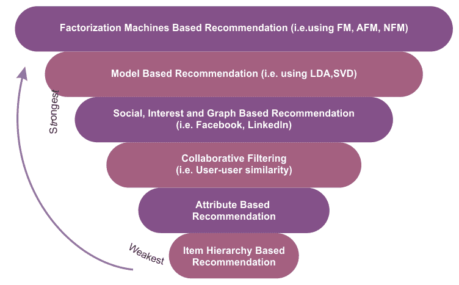

不同推荐系统的比较

尽管这些是成功的推荐系统，但是基于 CF 的方法经常遇到以下三个问题:

*   **冷启动:**有时候，当需要大量关于用户的数据来做一个更精准的推荐系统时，它们会变得卡壳。
*   **可扩展性:**使用拥有数百万用户和产品的数据集来计算推荐，通常需要大量的计算能力。
*   稀疏性:当大量商品在主要电子商务网站上出售时，众包数据集经常会出现这种情况。所有推荐数据集在某种意义上都是众包的。这是几乎所有推荐系统的普遍问题，这些推荐系统具有足够多的项目以提供给足够多的用户，并且不需要仅限于电子商务站点。

在这种情况下，活跃用户可能只对售出的全部商品中的一小部分进行评级，因此即使是最受欢迎的商品也很少有评级。因此，用户对项目矩阵变得非常稀疏。换句话说，处理大规模稀疏矩阵在计算上非常具有挑战性。

为了克服这些问题，一种特定类型的协同过滤算法使用矩阵分解，这是一种低秩矩阵近似技术。我们将在本章后面看到一个这样的例子。


# 基于内容的过滤方法

利用基于内容的过滤方法，利用项目的一系列离散特征来推荐具有相似属性的附加项目。有时，它基于项目的描述和用户偏好的配置文件。这些方法试图推荐与用户过去喜欢的或者当前正在使用的项目相似的项目。

基于内容的过滤的一个关键问题是，系统是否能够从用户对一个内容源的操作中学习用户偏好，并将其用于其他内容类型。当部署这种类型的 RE 时，它可以用于预测用户可能感兴趣的项目或项目的评级。


# 混合推荐系统

正如您所看到的，使用协作过滤和基于内容的过滤方法有几个优点和缺点。因此，为了克服这两种方法的局限性，最近的趋势表明，混合方法可能更加有效和准确。有时，诸如 FM 和**奇异值分解** ( **SVD** )的因子分解方法被用来使它们变得健壮。


# 基于模型的协同过滤

协同过滤方法分为基于内存的，如基于用户的算法和基于模型的协同过滤(推荐使用核映射)。在基于模型的协同过滤技术中，用户和产品由一小组因素描述，也称为**潜在因素** ( **LFs** )。然后使用 LFs 来预测丢失的条目。使用**交替最小二乘** ( **ALS** )算法来学习这些潜在因素。

与基于记忆的方法相比，基于模型的方法可以更好地处理原始矩阵的稀疏性。这也是可扩展的、更快的，并且可以避免过度拟合的问题。但是，由于很难向模型中添加数据，因此它不具有灵活性和适应性。现在，让我们来看看协同过滤方法中的一个重要元素，叫做效用矩阵。


# 效用矩阵

在基于协同过滤的推荐系统中，存在实体的维度:用户和项目(项目是指产品，如电影、游戏和歌曲)。作为用户，您可能对某些项目有偏好。因此，这些偏好必须从关于项目、用户或评级的数据中激发出来。这些数据通常表示为效用矩阵，例如用户-项目对。这种类型的值可以表示用户对特定项目的偏好程度。

下表显示了一个示例效用矩阵，该矩阵表示用户对电影的等级，等级为 1-5，5 为最高等级。 **HP1** 、 **HP2** 、 **HP3** 是*哈利波特 I* 、 *II* 、 *III* 、 **TW** 代表*暮光之城*、 **SW1** 、 **SW2** 、 **SW3** 的缩写；代表《星球大战》第 1 集、第 2 集和第 3 集。字母 **A** 、 **B** 、 **C** 和 **D** 代表用户:


效用矩阵(用户与电影矩阵)

用户电影对有许多空白条目。这意味着用户没有对这些电影进行评级，这增加了稀疏性。使用这个矩阵，目标是预测效用矩阵中的空白。假设我们很想知道用户 **A** 是否喜欢 **SW2** 。这很难预测，因为矩阵中没有多少数据。

因此，关于电影的其他属性，例如制片人、导演、主要演员，或者甚至他们名字的相似性，可以用于计算电影 **SW1** 和 **SW2** 的相似性。这种相似性会让我们得出结论，既然 **A** 不喜欢 **SW1** ，他们也不太可能喜欢 **SW2** 。

但是，这可能不适用于较大的数据集。因此，有了更多的数据，我们可能会观察到给 **SW1** 和 **SW2** 评分的人倾向于给他们相似的评分。最后，我们可以得出结论，A 也会给 **SW2** 一个低评分，类似于 **A** 对 **SW1** 的评分。然而，这种方法有一个严重的缺点，称为。**冷启动问题**。


# 协同过滤方法中的冷启动问题

冷启动问题这个术语听起来很搞笑，但是，顾名思义，它来源于汽车。然而，在推荐发动机中，术语“冷启动”仅仅意味着对于发动机来说还不是最佳的情况，以提供最佳可能的结果。

在协同过滤方法中，推荐系统会识别与活跃用户有共同偏好的用户，并推荐志同道合的用户喜欢的项目。由于冷启动问题，这种方法不能考虑社区中没有人评级的项目。

使用基于 CF 的方法的推荐引擎基于用户行为推荐每个项目。一个项目的用户操作越多，就越容易分辨出哪个用户会对它感兴趣，还有哪些项目与之相似。随着时间的推移，系统将能够给出越来越准确的建议。在某个阶段，当新的项目或用户被添加到用户-项目矩阵时，会出现以下问题:


用户与项目矩阵有时会导致冷启动问题

在这种情况下，RE 还没有足够的关于这个新用户或这个新项目的知识。与 FM 类似，基于内容的滤波方法是一种可以用来缓解冷启动问题的方法。


# 推荐系统中的因子分解机

在现实生活中，大多数推荐问题都假设我们有一个由(用户、项目、评分)元组集合形成的评分数据集。然而，在许多应用程序中，我们有大量的项目元数据(标签、类别和流派)可以用来进行更好的预测。

这是对功能丰富的数据集使用 FMs 的好处之一，因为有一种自然的方式可以将额外的功能包括在模型中，并且可以使用 dimensionality 参数对更高阶的交互进行建模。

一些最新类型的研究显示了哪些特征丰富的数据集提供了更好的预测:

*   何湘南和 Tat-Seng Chua，*用于稀疏预测分析的神经分解机*。在 2017 年 8 月 7 日至 11 日在日本东京新宿举行的 SIGIR 2017 年会议期间
*   、叶昊、何湘南、张汉旺、和蔡达生(2017)。*注意力因子分解机:通过注意力网络学习特征交互的权重* IJCAI，澳大利亚墨尔本，2017 年 8 月 19 日至 25 日

这些论文解释了如何将现有数据转化为功能丰富的数据集，以及如何在数据集上实施 FMs。因此，研究人员正在尝试使用 FMs 来开发更准确、更鲁棒的 REs。在下一节中，我们将开始开发使用 FMs 的电影推荐项目。为此，我们将使用 Apache Spark 和 RankSys 库。

现有的推荐算法需要*(用户，项目，评分)*元组中的消费(产品)或评分(电影)数据集。这些类型的数据集主要由 CF 算法的变体使用。CF 算法已被广泛采用，并被证明能产生良好的结果。

然而，在许多情况下，我们有大量的项目元数据(标签、类别和流派)可以用来做出更好的预测。不幸的是，CF 算法不使用这些类型的元数据。

FMs 可以利用这些功能丰富的(元)数据集。FM 可以使用这些额外的特征来对指定维度参数 *d* 的高阶交互进行建模。最重要的是，FMs 还针对处理大规模稀疏数据集进行了优化。因此，二阶 FM 模型就足够了，因为没有足够的信息来估计更复杂的相互作用:

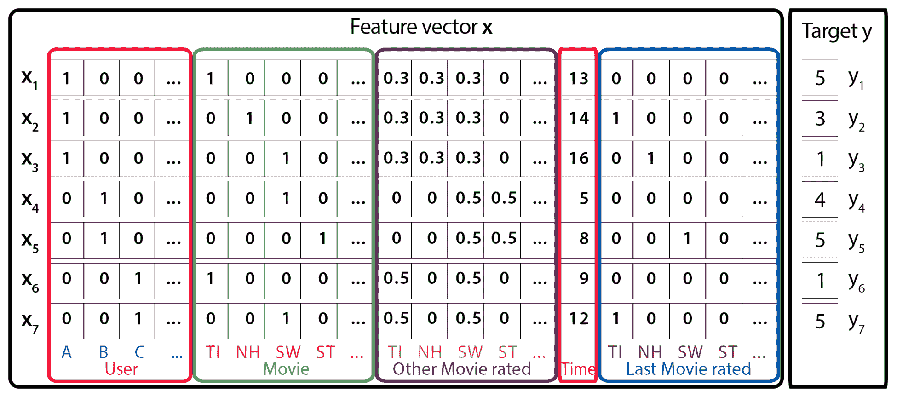

一个示例训练数据集表示具有特征向量 x 和目标 y 的个性化问题。这里，行指的是电影，而列包括导演、演员和流派信息等

我们假设一个预测问题的数据集用一个设计矩阵*x*∈ℝ*n*^(x*p*)来描述，。在上图中，第 *i ^第t13】行，x*t15】It17】∈ℝ*t19】p； *X* 的* 描述了一个具有 *p* 实值变量的案例，其中*y[I]是第*I*th 案例的预测目标。或者，我们可以将该集合描述为元组 *(x，y)* 的集合 *S* ，其中*x*∈ℝ*^p*是特征向量， *y* 是其对应的目标或标签。***

换句话说，在图 7 中，每一行都代表一个特征向量*x[I]及其对应的目标*y[I]。为了更容易理解，这些功能被分组为活动用户(蓝色)、活动项目(红色)、同一用户评价的其他电影(橙色)、以月为单位的时间(绿色)和最后评价的电影(棕色)的指示器。**

然后，FM 算法使用以下分解的交互参数对 *x* 中的 *p* 输入变量之间的所有嵌套交互(直到 d *)* 进行建模:

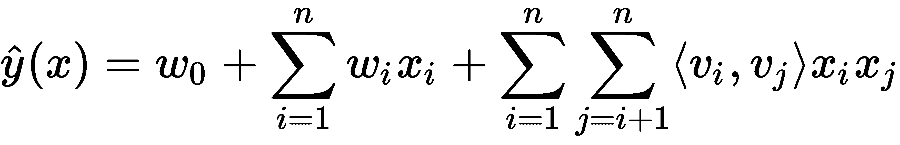

在这个等式中， *vs* 表示与每个变量(用户和项目)相关的 *k* 维潜在向量，括号运算符表示内积。这种具有数据矩阵和特征向量的表示在许多机器学习方法中是常见的，例如，在线性回归或支持向量机(SVM)中。

然而，如果你熟悉 MF 模型，前面的等式应该看起来很熟悉:它包含全局偏差以及用户/项目特定偏差，并包括用户-项目交互。现在，如果我们假设每个 *x(j)* 向量仅在位置 *u* 和 *i* 处非零，我们得到经典的 MF 模型:

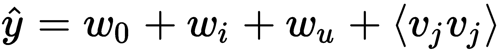

然而，FMs 也可以用于分类或回归，并且在大型稀疏数据集上比线性回归等传统算法的计算效率更高。这就是 FM 被广泛用于推荐的原因:用户数和项目数通常非常大，尽管推荐的实际数量非常小(用户不会对所有可用的项目进行评分！).


# 利用 FMs 开发电影推荐系统

在这个项目中，我们将向您展示如何从 MovieLens 1m 数据集进行排名预测。首先，我们将准备数据集。然后，我们将训练 FM 算法，它最终会预测电影的排名和评级。项目代码具有以下结构:

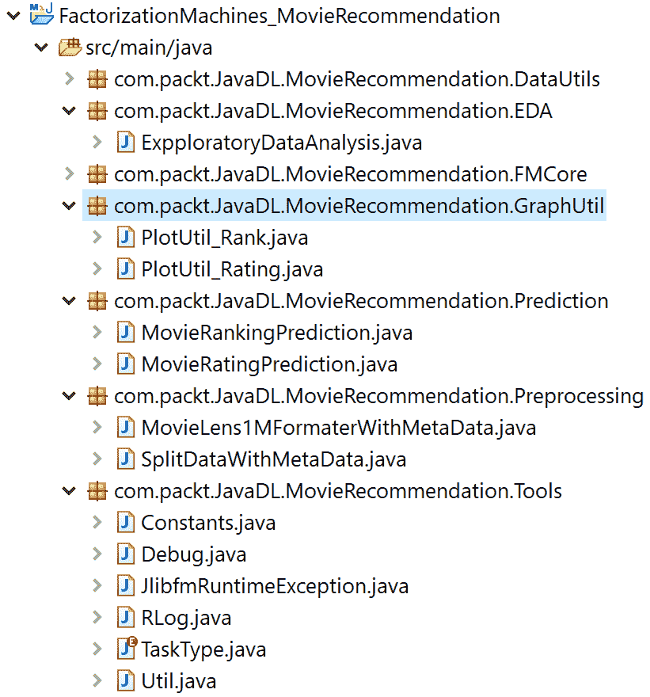

电影分级和排名预测项目结构

总之，该项目具有以下结构:

*   **EDA:** 这个包用于对 MovieLens 1M 数据集进行探索性分析。
*   **工具、FMCore 和 DataUtils:** 这些是核心 FM 库。出于这个问题的目的，我使用(但扩展了)了`RankSys`库(参见 https://github.com/RankSys/RankSys[的`GitHub`库)。](https://github.com/RankSys/RankSys)
*   **预处理:**这个包用于将`MovieLens` 1M 数据集转换成 LibFM 格式。
*   **预测:**这个包用于电影分级和排名预测。
*   GraphUtil: 这个包可视化了迭代过程中的一些性能指标。

我们将一步一步地检查所有这些包。然而，了解数据集是一项任务。


# 数据集描述和探索性分析

MovieLens 1M 小型数据集是从位于[https://grouplens.org/datasets/movielens/](https://grouplens.org/datasets/movielens/)的 MovieLens 网站下载的(并在获得必要许可的情况下使用)。我真诚地感谢 F. Maxwell Harper 和 Joseph A. Konstan 提供这些数据集供使用。该数据集发表在 *MovieLens 数据集:历史和背景*中。ACM 交互式智能系统汇刊(TiiS) 5，4，第 19 篇(2015 年 12 月)，19 页。

数据集中有三个文件:`movies.dat`、`ratings.dat`、`users.dat`，分别与电影、收视率、用户相关。这些文件包含 2000 年加入 MovieLens 的 6，040 名 MovieLens 用户对大约 3，900 部电影的 1，000，209 个匿名评级。所有评级都包含在`ratings.dat`文件中，格式如下:

```java
UserID::MovieID::Rating::Timestamp
```

描述如下:

*   `UserID`:范围在 1 到 6040 之间
*   `MovieID`:范围在 1 到 3952 之间
*   这些是按照五星级标准制作的
*   `Timestamp`:以秒为单位

请注意，每个用户至少评价了 20 部电影。另一方面，电影信息位于`movies.dat`文件中，格式如下:

```java
MovieID::Title::Genres
```

描述如下:

*   这些与 IMDb 提供的标题相同(带有发行年份)
*   这些是逗号分隔的(，)，每部电影都被分类为动作片、冒险片、动画片、儿童片、喜剧片、犯罪片、剧情片、战争片、纪录片、奇幻片、黑色电影、恐怖片、音乐剧、悬疑片、爱情片、科幻片、惊悚片和西部片

最后，用户信息在`users.dat`文件中，格式如下:

```java
UserID::Gender::Age::Occupation::Zip-code 
```

所有人口统计信息都是由用户自愿提供的，不会检查其准确性。只有提供了一些人口统计信息的用户才包含在这个数据集中。M 代表男性，F 代表女性，表示性别。年龄从以下范围中选择:

*   1:18 岁以下
*   18: 18-24
*   25: 25-34
*   35: 35-44
*   45: 45-49
*   50: 50-55
*   56: 56+

职业从以下选项中选择:

*   0:其他，或未指定
*   1:学术/教育工作者
*   2:艺术家
*   3:文书/行政
*   4:大学生/研究生
*   5:客户服务
*   6:医生/医疗保健
*   7:执行/管理人员
*   8:农民
*   9:家庭主妇
*   10: K-12 学生
*   11:律师
*   12:程序员
*   13 岁:退休
*   14:销售/营销
*   15:科学家
*   16:自营职业者
*   17:技术员/工程师
*   18:商人/工匠
*   19:失业
*   20:作家

现在我们知道了数据集，我们可以利用数据集进行探索性分析。首先，我们将创建一个 Spark 会话作为 Spark 计划的入口:

```java
SparkSession spark = new Builder()
                  .master("local[*]")
                  .config("spark.sql.warehouse.dir", "temp/")// change accordingly
                  .appName("MovieRecommendation")
                  .getOrCreate();
```

然后，我们将加载并解析`rating.dat`文件来做一些探索性的分析。以下代码行将返回 DataFrame 评级:

```java
// Read RatingsFile
Dataset<Row> df1 = spark.read()
                .format("com.databricks.spark.csv")
                .option("inferSchemea", "true")
                .option("header", "true")
                .load(ratingsFile);

Dataset<Row> ratingsDF = df1.select(df1.col("userId"), df1.col("movieId"),
                df1.col("rating"), df1.col("timestamp"));
ratingsDF.show(10);
```

输出如下所示:


接下来，我们将加载`movies.dat`并准备电影数据帧:

```java
// Read MoviesFile
Dataset<Row> df2 = spark.read()
                .format("com.databricks.spark.csv")
                .option("inferSchema", "true")
                .option("header", "true")
                .load(movieFile);

Dataset<Row> moviesDF = df2.select(df2.col("movieId"), df2.col("title"), df2.col("genres"));
moviesDF.show(10);
```

输出如下所示:

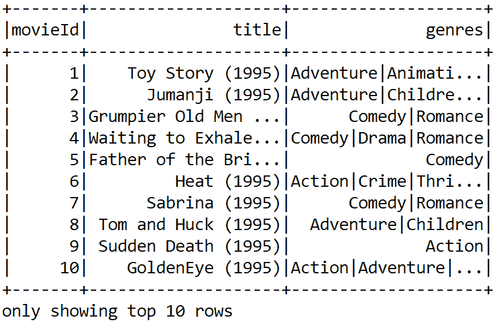

然后，我们将两个数据帧都注册为临时表，以使查询更容易。要注册这两个数据集，需要使用以下代码行:

```java
ratingsDF.createOrReplaceTempView("ratings");
moviesDF.createOrReplaceTempView("movies");
```

请注意，通过在内存中创建一个临时视图作为表，这将有助于加快内存查询。然后，我们将选择探索一些评级和电影相关的统计数据:

```java
long numberOfRatings = ratingsDF.count();
long numberOfUsers = ratingsDF.select(ratingsDF.col("userId")).distinct().count();
long numberOfMovies = ratingsDF.select(ratingsDF.col("movieId")).distinct().count();

String print = String.*format*("Got %d ratings from %d users on %d movies.", numberOfRatings, numberOfUsers, numberOfMovies);
System.*out*.println(print);
```

输出如下所示:

```java
Got 100004 ratings from 671 users on 9066 movies.
```

现在，让我们来看看最高和最低评分，以及对一部电影进行评分的用户数量。但是，您需要对我们在上一步中刚刚在内存中创建的评级表执行 SQL 查询。这里的查询很简单，类似于从 MySQL 数据库或 RDBMS 进行查询。

但是，如果您不熟悉基于 SQL 的查询，建议您查看 SQL 查询规范，了解如何使用`SELECT`从特定表中执行选择，如何使用`ORDER`执行排序，以及如何使用`JOIN`关键字执行连接操作。

如果您知道 SQL 查询，您应该通过使用复杂的 SQL 查询获得一个新的数据集，如下所示:

```java
// Get the max, min ratings along with the count of users who have rated a movie.
Dataset<Row> sqlDF = spark.sql(
                "SELECT movies.title, movierates.maxr, movierates.minr, movierates.cntu "
                        + "FROM (SELECT "
                        + "ratings.movieId, MAX(ratings.rating) AS maxr,"
                        + "MIN(ratings.rating) AS minr, COUNT(distinct userId) AS cntu "
                        + "FROM ratings "
                        + "GROUP BY ratings.movieId) movierates "
                        + "JOIN movies ON movierates.movieId=movies.movieId "
                        + "ORDER BY movierates.cntu DESC");
sqlDF.show(10);
```

输出如下所示:

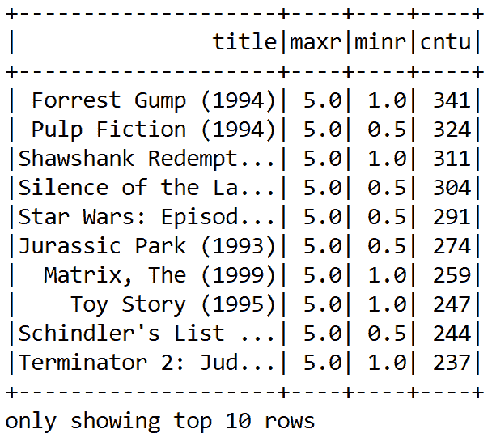

现在，为了深入了解，我们需要更多地了解用户及其评级。让我们找出前 10 名最活跃的用户，以及他们给一部电影评分的次数:

```java
// Top 10 active users and how many times they rated a movie.
Dataset<Row> mostActiveUsersSchemaRDD = spark.sql(
                "SELECT ratings.userId, count(*) AS ct "
                        + "FROM ratings "
                        + "GROUP BY ratings.userId "
                        + "ORDER BY ct DESC LIMIT 10");
mostActiveUsersSchemaRDD.show(10);
```

输出如下所示:

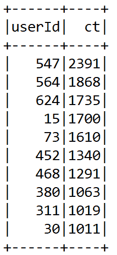

最后，让我们看看一个特定的用户，并找到用户 668 评价高于 4:

```java
// Movies that user 668 rated higher than 4
Dataset<Row> userRating = spark.sql(
                "SELECT ratings.userId, ratings.movieId, ratings.rating, movies.title "
                        + "FROM ratings JOIN movies "
                        + "ON movies.movieId=ratings.movieId "
                        + "WHERE ratings.userId=668 AND ratings.rating > 4");
userRating.show(10);
```

输出如下所示:

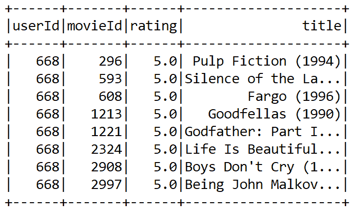<title>Movie rating prediction</title> <link rel="stylesheet" href="css/style.css" type="text/css"> 

# 电影分级预测

首先，我们使用利用`PointWiseGradientDescent`学习的 FM 算法来执行评级预测。我们从预处理和将数据转换成 LibFM 格式开始。要使用以下执行顺序运行此评级预测:

1.  第一，执行`MovieLensFormaterWithMetaData.java`；生成`LibFM`格式的`MovieLens`数据。
2.  然后，执行`SplitDataWithMetaData.java`来准备训练、测试和验证集。
3.  最后，执行；`MovieRatingPrediction.java`，也就是主类。


# 将数据集转换为 LibFM 格式

我们将要重用的基于 FM 的模型只能使用 LibFM 格式的训练数据，这或多或少与 LibSVM 相同。因此，首先，我们必须格式化 MovieLens 1M 数据集 sp，使训练数据集包含用户、电影和现有评级信息。

LibFM 格式类似于 LibSVM 格式，但有一些基本区别。更多信息，感兴趣的读者可以看看[http://www.libfm.org/libfm-1.42.manual.pdf](http://www.libfm.org/libfm-1.42.manual.pdf)。

同时，新的特征将由用户信息和电影信息产生。首先，我们将如下定义输入(这将根据用户、电影和分级进行更新)和输出文件路径:

```java
//MovieLensFormaterWithMetaData.java
private static String *inputfilepath**;* private static String *outputfilepath*;
```

然后，我们定义数据路径和输出文件夹，生成的 LibFM 格式的数据将保存在这里:

```java
String foldername = "ml-1m";
String outFolder = "outFolder";
```

然后，我们定义要由 FM 模型预测的目标列。此外，我们还删除了时间戳列:

```java
private static int *targetcolumn* = 0;
private static String *deletecolumns* = "3";
```

然后，我们设置分隔符为`::`和偏移量:

```java
private static String *separator* = "::";
private static int *offset* = 0;
```

然后，我们读取并解析用户的数据(即`users.dat`)，针对用户的流派、用户的年龄、用户的职业创建三个`Map<Integer, String>`:

```java
Set<Integer> deletecolumnsset = new HashSet<Integer>();
Map<String, Integer> valueidmap = new HashMap<String, Integer>(); 

*targetcolumn* = 2; // movielens format
String[] deletecolumnarr = *deletecolumns*.split(";"); 

for(String deletecolumn : deletecolumnarr) { 
          deletecolumnsset.add(Integer.*parseInt*(deletecolumn));
       }
*inputfilepath* = foldername + File.*separator* + "users.dat"; 
Reader fr = new FileReader(*inputfilepath*); 
BufferedReader br = new BufferedReader(fr); 

Map<Integer, String> usergenemap = new HashMap<Integer, String>();
Map<Integer, String> useragemap = new HashMap<Integer, String>();
Map<Integer, String> useroccupationmap = new HashMap<Integer, String>(); 

String line;
while (br.ready()) {
             line = br.readLine();
             String[] arr = line.split(*separator*); 
             usergenemap.put(Integer.*parseInt*(arr[0]), arr[1]); 
             useragemap.put(Integer.*parseInt*(arr[0]), arr[2]);
             useroccupationmap.put(Integer.*parseInt*(arr[0]), arr[3]);
          } 
br.close();
fr.close();
```

然后，我们解析电影数据集，为电影创建一个`Map<Integer, String>`:

```java
*inputfilepath* = foldername + File.*separator* + "movies.dat"; 
fr = new FileReader(*inputfilepath*); 
br = new BufferedReader(fr);

Map<Integer, String> moviemap = new HashMap<Integer, String>();

while (br.ready()) {
              line = br.readLine(); 
              String[] arr = line.split(*separator*); 
               moviemap.put(Integer.*parseInt*(arr[0]), arr[2]); 
}
br.close();
fr.close();
```

然后，我们解析评级数据集，为现有评级创建一个`Map<Integer, String>`。此外，我们定义了输出文件名，LibFM 格式的评级数据将保存在该文件名中:

```java
inputfilepath = foldername + File.separator + "ratings.dat";
outputfilepath = outFolder + File.separator + "ratings.libfm";
BufferedWriter writer = new BufferedWriter(new OutputStreamWriter(new FileOutputStream(outputfilepath)));

        fr = new FileReader(inputfilepath);
        br = new BufferedReader(fr);

        while(br.ready()) {
            line = br.readLine();
            String[] arr = line.split(separator);
            StringBuilder sb = new StringBuilder();
            sb.append(arr[targetcolumn]);

            int columnidx = 0;
            int userid = Integer.parseInt(arr[0]);
            int movieid = Integer.parseInt(arr[1]);

            for(int i = 0; i < arr.length; i++) {
                if(i != targetcolumn && !deletecolumnsset.contains(i)) {
                    String useroritemid = Integer.toString(columnidx) + " " + arr[i];

                    if(!valueidmap.containsKey(useroritemid)) {
                        valueidmap.put(useroritemid, offset++);
                    }

                    sb.append(" ");
                    sb.append(valueidmap.get(useroritemid));
                    sb.append(":1");

                    columnidx++;
                }
```

然后，我们开始添加属性，如性别信息、年龄、职业和电影类别信息:

```java
// Add attributes
String gender = usergenemap.get(userid);
String attributeid = "The gender information " + gender;

 if(!valueidmap.containsKey(attributeid)) {
                valueidmap.put(attributeid, offset++);
            }

            sb.append(" ");
            sb.append(valueidmap.get(attributeid));
            sb.append(":1");

            String age = useragemap.get(userid);
            attributeid = "The age information " + age;

            if(!valueidmap.containsKey(attributeid)) {
                valueidmap.put(attributeid, offset++);
            }

            sb.append(" ");
            sb.append(valueidmap.get(attributeid));
            sb.append(":1");

            String occupation = useroccupationmap.get(userid);
            attributeid = "The occupation information " + occupation;

            if(!valueidmap.containsKey(attributeid)) {
                valueidmap.put(attributeid, offset++);
            }

            sb.append(" ");
            sb.append(valueidmap.get(attributeid));
            sb.append(":1");

            String movieclassdesc = moviemap.get(movieid);
            String[] movieclassarr = movieclassdesc.split("\\|");

            for(String movieclass : movieclassarr) {
                attributeid = "The movie class information " + movieclass;
                if(!valueidmap.containsKey(attributeid)) {
                    valueidmap.put(attributeid, offset++);
                }

                sb.append(" ");
                sb.append(valueidmap.get(attributeid));
                sb.append(":1");
}
```

在前一个代码块中，`:1`；代表用户提供了分级的电影。最后，我们添加元数据信息，`userid`和`movieid`:

```java
//add metadata information, userid and movieid
sb.append("#");
sb.append(userid);
sb.append(" "+movieid);
writer.write(sb.toString());
writer.newLine();
```

现在，LibFM 格式的结果评级数据集(一旦`MovieLensFormaterWithMetaData.java`被执行)将作为`ratings.libfm`保存在`formatted_data`目录中；具有以下结构:

<title>Training and test set preparation</title> <link rel="stylesheet" href="css/style.css" type="text/css"> 

# 培训和测试集准备

既然我们已经了解了如何转换评级、电影和元数据，现在我们可以开始从 LibFM 格式的数据创建训练集、测试集和验证集。首先，我们如下设置要使用的 LibFM 文件的路径:

```java
//SplitDataWithMetaData.java
private static String *ratinglibFM* = *formattedDataPath* + "/" + "ratings.libfm"; // input
private static String *ratinglibFM_train* = *formattedDataPath* + "/" + "ratings_train.libfm"; // for traning
private static String *ratinglibFM_test* = *formattedDataPath* + "/" + "ratings_test.libfm"; // for testing
private static String *ratinglibFM_test_meta* = *formattedDataPath* +"/"+"ratings_test.libfm.meta";// metadata
private static String *ratinglibFM_valid* = *formattedDataPath* + "/" + "ratings_valid.libfm"; // validation
```

然后，我们显示输出目录来编写分割的训练、验证和测试集:

```java
private static String *formattedDataPath* = "outFolder";
```

然后，我们实例化将用于写入分割文件的`BufferedWriter`:

```java
Reader fr = new FileReader(ratinglibFM);
Random ra = new Random();

BufferedWriter trainwrite = new BufferedWriter(new OutputStreamWriter(new FileOutputStream(ratinglibFM_train)));

BufferedWriter testwrite = new BufferedWriter(new OutputStreamWriter(new FileOutputStream(ratinglibFM_test)));

BufferedWriter testmetawrite = new BufferedWriter(new OutputStreamWriter(new                       FileOutputStream(ratinglibFM_test_meta)));   

BufferedWriter validwrite = new BufferedWriter(new OutputStreamWriter(new FileOutputStream(ratinglibFM_valid)));

BufferedReader br = new BufferedReader(fr);
String line = null;
int testline = 0;

while(br.ready()) {
       line = br.readLine();
       String[] arr = line.split("#");
       String info = arr[0];

       double dvalue = ra.nextDouble();
       if(dvalue>0.9)
            {
             validwrite.write(info);
             validwrite.newLine();
            }

       else if(dvalue <= 0.9 && dvalue>0.1) {
                trainwrite.write(info);
                trainwrite.newLine();
         } else {
                testwrite.write(info);
                testwrite.newLine();
           if(arr.length==2)
                {
                testmetawrite.write(arr[1] + " " + testline);
                testmetawrite.newLine();
                testline++;
            }
         }
  }
```

最后，我们关闭文件指针来释放资源:

```java
br.close();
fr.close();

trainwrite.flush();
trainwrite.close();

testwrite.flush();
testwrite.close();

validwrite.flush();
validwrite.close();

testmetawrite.flush();
testmetawrite.close();
```

现在，以 LibFM 格式生成的评级数据集(一旦执行了`SplitDataWithMetaData.java`)将保存在`formatted_data`目录中，其格式如下:


最后，该目录(即`formatted_data`)将包含以下文件:

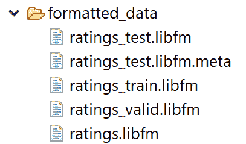

太棒了。既然我们的数据集已经准备好了，我们现在可以开始使用 FM 算法进行电影分级预测。


# 电影分级预测

既然训练、验证和评估所需的所有数据集都准备好了，我们就可以开始训练 FM 模型了。我们首先显示训练数据的文件名:

```java
final String trainFile = *formattedDataPath*+ "/" + "ratings_train.libfm";
```

然后，我们设置测试数据文件的路径:

```java
final String testFile = *formattedDataPath*+ "/" + "ratings_test.libfm";
```

然后，我们设置测试元数据文件的路径:

```java
final String testMetaFile = *formattedDataPath*+ "/" + "ratings_test.libfm.meta";
```

然后，最终预测输出文件的文件名为:

```java
final String outputFile = *formattedDataPath*+ "/" + "predict_output.txt";
```

然后，我们设置将每次迭代的日志、指标、时间等写入文件的路径(但是不要担心，我们也会以图表的形式看到它们):

```java
final String rLog = *outPut* + "/" + "metrics_logs.txt";
```

然后，我们设置 k0、k1 和 k2 的维数，使得 k0 是使用偏差，k1 是使用单向交互，k2 是双向交互的 dim:

```java
final String dimension = "1,1,8"; // tunable parameters
```

我们将对训练进行 100 次迭代:

```java
final String iterations = "100"; // tunable parameter
```

然后，我们设置 SGD 的学习速率，即优化器试图最小化错误的速率:

```java
final String learnRate = "0.01"; // tunable and learnable parameter
```

既然优化器已经知道了学习率，下一个重要的参数就是设置正则化参数来正则化训练以防止过度拟合。

基于 Java 的 FM 库需要三向正则化:偏向、单向和双向正则化。所以 FM 库接受的格式是 r0，r1，r2。这里，r0 是偏差正则化，r1 是单向正则化，r2 是双向正则化:

```java
final String regularization = "0,0,0.1";
```

然后，我们初始化双向因子初始化的标准差:

```java
final String stdDeviation = "0.1";
```

然后，我们使用；用于加载训练集和测试集的类:

```java
System.*out*.println("Loading train...t");
DataProvider train = new LibSVMDataProvider();
Properties trainproperties = new Properties();

trainproperties.put(Constants.*FILENAME*, trainFile);
train.load(trainproperties,false);

System.*out*.println("Loading test... t");
DataProvider test = new LibSVMDataProvider();
Properties testproperties = new Properties();

testproperties.put(Constants.*FILENAME*, testFile);
test.load(testproperties,false);
```

一旦加载了训练集和测试集，我们就开始创建用户项表(即主表):

```java
int num_all_attribute = Math.*max*(train.getFeaturenumber(), test.getFeaturenumber());
DataMetaInfo meta = new DataMetaInfo(num_all_attribute);
meta.debug();
Debug.*openConsole*();
```

然后，在开始训练之前，我们实例化因式分解机:

```java
FmModel fm = new FmModel();
```

然后，`init()`方法用于初始化实例化和训练以下 FM 模型参数所需的参数:

```java
public FmModel()
    {
        num_factor = 0;
        initmean = 0;
        initstdev = 0.01;
        reg0 = 0.0;
        regw = 0.0;
        regv = 0.0; 
        k0 = true;
        k1 = true;
    }
```

`init()`方法的签名如下:

```java
public void init()
    {
        w0 = 0;
        w = new double[num_attribute];
        v = new DataPointMatrix(num_factor, num_attribute);
        Arrays.fill(w, 0);
        v.init(initmean, initstdev);
        m_sum = new double[num_factor];
        m_sum_sqr = new double[num_factor];
    }
```

然后，我们设置属性的数量和主类的标准偏差:

```java
fm.num_attribute = num_all_attribute;
fm.initstdev = Double.*parseDouble*(stdDeviation);
```

然后，我们设置分解中的维数。在我们的例子中，我们有三方面的互动——用户、电影和评级:

```java
Integer[] dim = *getIntegerValues*(dimension);
assert (dim.length == 3);
fm.k0 = dim[0] != 0;
fm.k1 = dim[1] != 0;
fm.num_factor = dim[2];
```

前面的值实际上是使用`getIntegerValues()`方法解析的，该方法接受维度作为一个字符串，并使用`,`进行拆分。

最后，它只返回模型用于交互的维度的整数值。以下签名用于此目的:

```java
static public Integer[] getIntegerValues(String parameter) {
        Integer[] result = null;
        String[] strresult = Util.tokenize(parameter, ",");
        if(strresult!=null && strresult.length>0) {
            result = new Integer[strresult.length];
            for(int i=0;i<strresult.length;i++) {
                result[i] = Integer.parseInt(strresult[i]);
            }
        }
        return result;
    }
```

然后，我们将学习方法设置为**随机梯度下降** ( **SGD** ):

```java
FmLearn fml = new FmLearnSgdElement();
((FmLearnSgd) fml).num_iter = Integer.*parseInt*(iterations);

fml.fm = fm;
fml.max_target = train.getMaxtarget();
fml.min_target = train.getMintarget();
fml.meta = meta;
```

然后，我们定义要执行的任务。在我们的情况下，它是回归。但是，我们要用；`TASK_CLASSIFICATION`对于分类:

```java
fml.task = TaskType.*TASK_REGRESSION*
```

然后，我们设置正则化:

```java
Double[] reg = *getDoubleValues*(regularization);
assert ((reg.length == 3)); // should meet 3 way regularization

fm.reg0 = reg[0];
fm.regw = reg[1];
fm.regv = reg[2];
```

然后，当谈到学习率时，我们必须设置学习率(单独的，每层),这与 DL4J 库不同:

```java
FmLearnSgd fmlsgd = (FmLearnSgd) (fml);

if (fmlsgd != null) {
        Double[] lr = *getDoubleValues*(learnRate);
        assert (lr.length == 1);
        fmlsgd.learn_rate = lr[0];
        Arrays.*fill*(fmlsgd.learn_rates, lr[0]);
}
```

前面的值实际上是使用`getDoubleValues()`方法解析的，该方法接受学习率作为一个字符串，并使用`,`进行拆分。最后，它只为模型使用的学习率返回一个值。以下签名用于此目的:

```java
static public Double[] getDoubleValues(String parameter) {
        Double[] result;
        String[] strresult = Util.tokenize(parameter, ",");
        if(strresult!=null && strresult.length>0) {
            result = new Double[strresult.length];
            for(int i=0; i<strresult.length; i++) {
                result[i] = Double.parseDouble(strresult[i]);
            }
        }
        else {
            result = new Double[0];
        }
        return result;
    }
```

现在所有的超参数都设置好了，我们准备开始训练。对于这一点，不像 DL4J FM，自带 a；`learn()`学习模型的方法:

```java
fml.learn(train, test);
```

`learn()`方法是一个抽象方法，它接受训练集和测试集:

```java
//FmLearn.java
public abstract void learn(DataProvider train, DataProvider test) throws Exception;
```

的具体实施；`learn()`方法采用训练集和测试集。然后，对训练集进行洗牌，以避免训练中的偏差。然后，它使用执行预测操作；`predict()`我们一开始定义的任务类型的方法(也就是我们例子中的回归)。

最后，它在测试集上评估模型，并计算训练集和测试集的 MSE。该方法的实际实现如下:

```java
//FmLearnSgdElement.java
public void learn(DataProvider train, DataProvider test)  throws Exception{
        super.learn(train, test);
        List<Double> iterationList=new ArrayList<Double>();
        List<Double> trainList=new ArrayList<Double>();
        List<Double> testList=new ArrayList<Double>();

        // SGD
        for(int i = 0; i < num_iter; i++) {
            try
            {
                double iteration_time = Util.getusertime();
                train.shuffle();
                for(train.getData().begin(); !train.getData().end(); train.getData().next()) {
                    double p = fm.predict(train.getData().getRow(), sum, sum_sqr);
                    double mult = 0;

                    if(task == TaskType.TASK_REGRESSION) {
                        p = Math.min(max_target, p);
                        p = Math.max(min_target, p);
                        mult = -(train.getTarget()[train.getData().getRowIndex()]-p);
                    } else if(task == TaskType.TASK_CLASSIFICATION) {
                        mult = -train.getTarget()[train.getData().getRowIndex()]*
                                (1.0-1.0/(1.0+Math.exp(-train.getTarget()[train.getData()
                                .getRowIndex()]*p)));
                    }                
                    SGD(train.getData().getRow(), mult, sum);                    
                }                
                iteration_time = (Util.getusertime() - iteration_time);
                double rmse_train = evaluate(train);
                double rmse_test = evaluate(test);
                iterationList.add((double)i);
                testList.add(rmse_test);
                trainList.add(rmse_train);

                String print = String.format("#Iterations=%2d::  
                               Train_RMSE=%-10.5f  Test_RMSE=%-10.5f", i, rmse_train, rmse_test);
                Debug.println(print);
                if(log != null) {
                    log.log("rmse_train", rmse_train);
                    log.log("time_learn", iteration_time);
                    log.newLine();
                }
            }
            catch(Exception e)
            {
                throw new JlibfmRuntimeException(e);// Exception library for Java FM
            }
        }    
        PlotUtil_Rating.plot(convertobjectArraytoDouble(iterationList.toArray()),
                convertobjectArraytoDouble(testList.toArray()),
                convertobjectArraytoDouble(trainList.toArray()));

    }
```

在前面的代码块中，FM 模型执行预测操作，类似于任何其他回归算法，它考虑三向交互等，并将预测计算为概率:

```java
// FmModel.java, we create a sparse matrix 
public double predict(SparseRow x, double[] sum, double[] sum_sqr)
    {
        double result = 0;
        if(k0) {    
            result += w0;
        }
        if(k1) {
            for(int i = 0; i < x.getSize(); i++) {
                result += w[x.getData()[i].getId()] * x.getData()[i].getValue();
            }
        }
        for(int f = 0; f < num_factor; f++) {
            sum[f] = 0;
            sum_sqr[f] = 0;
            for(int i = 0; i < x.getSize(); i++) {
                double d = v.get(f,x.getData()[i].getId()) * x.getData()[i].getValue();
                sum[f] = sum[f]+d;
                sum_sqr[f] = sum_sqr[f]+d*d;
            }
            result += 0.5 * (sum[f]*sum[f] - sum_sqr[f]);
        }

        return result;
 }
```

然而，在最后，使用来自`PlotUtil_Rating`类的`plot()`方法，每个迭代的训练和测试 MSE 是可视化的。我们以后会讨论这门课。

此外，我们还初始化日志记录，以便在控制台上打印计算的结果和进度:

```java
System.*out*.println("logging to " + rLog);
RLog rlog = new RLog(rLog);
fml.log = rlog;
fml.init();
rlog.init();
fm.debug();
fml.debug();
```

最后，我们在测试集上对模型进行了评估。因为我们的任务是一个回归任务，我们为每个迭代计算回归度量，例如 RMSE:

```java
String print = String.*format*("#Iterations=%s:: Train_RMSE=%-10.5f Test_RMSE=%-10.5f", iterations, fml.evaluate(train), fml.evaluate(test));
System.*out*.println(print);
```

```java
>>> Loading train...
 Loading test...
 #attr=9794 #groups=1
 #attr_in_group[0]=9794
 logging to outFolder/output.txt
 num_attributes=9794
 use w0=true
 use w1=true
 dim v =8
 reg_w0=0.0
 reg_w=0.0
 reg_v=0.0
 init ~ N(0.0,0.1)
 num_iter=100
 task=TASK_REGRESSION
 min_target=1.0
 max_target=5.0
 learnrate=0.01
 learnrates=0.01,0.01,0.01
 #iterations=100
 #Iterations= 0:: Train_RMSE=0.92469 Test_RMSE=0.93231
 #Iterations= 1:: Train_RMSE=0.91460 Test_RMSE=0.92358
 #Iterations= 2:: Train_RMSE=0.91595 Test_RMSE=0.92535
 #Iterations= 3:: Train_RMSE=0.91238 Test_RMSE=0.92313
 ...
 #Iterations=98:: Train_RMSE=0.84275 Test_RMSE=0.88206
 #Iterations=99:: Train_RMSE=0.84068 Test_RMSE=0.87832
```

最后，我们将预测和所有相关指标保存在一个文件中:

```java
// prediction at the end
String print = String.format("#Iterations=%s::  Train_RMSE=%-10.5f  Test_RMSE=%-10.5f", iterations, fml.evaluate(train), fml.evaluate(test));
System.out.println(print);

// save prediction
Map<Integer, String> ratingsMetaData = new HashMap<>();
if(Files.exists(Paths.get(testMetaFile))) {
            BufferedReader bufferedReader = new BufferedReader(new FileReader(testMetaFile));
            String line;

            while((line = bufferedReader.readLine()) != null) {
                String[] splitLine = line.split("\\s+");
                if(splitLine.length > 0) {
                    Integer indexKey = Integer.parseInt(splitLine[2]);
                    String userIdmovieIdValue = splitLine[0] + " " +  splitLine[1];
                    ratingsMetaData.put(indexKey, userIdmovieIdValue);
                }
            }
        }

double[] pred = new double[test.getRownumber()];
fml.predict(test, pred);
Util.save(ratingsMetaData, pred, outputFile);

String FILENAME = Constants.FILENAME;
// Save the trained FM model 
fmlsgd.saveModel(FILENAME);
```

前面的代码块将生成两个名为；`predict_output.txt`和`metrics_logs.txt`分别用于写入预测结果和日志。例如，`predicted_output.txt`文件中的一个示例显示，第二列是电影 ID，第三列是 5.0 的预测分级，如下所示:

```java
1 3408 4.40
 1 2797 4.19
 1 720 4.36
 1 1207 4.66
 2 1537 3.92
 2 1792 3.39
 2 1687 3.32
 2 3107 3.55
 2 3108 3.46
 2 3255 3.65
```

另一方面，`metrics_logs.txt`显示了 RMSE、MAE、日志等指标，如下图所示:

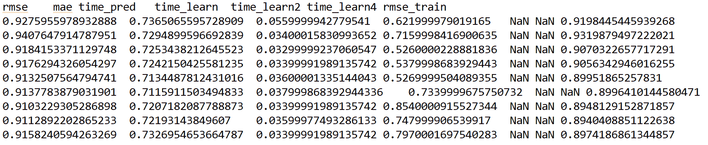

然而，由于对训练状态和预测有所了解，仅仅看到这些值是很困难的，因此，我决定绘制它们。下图显示了每个迭代的训练和测试阶段的 MSE:

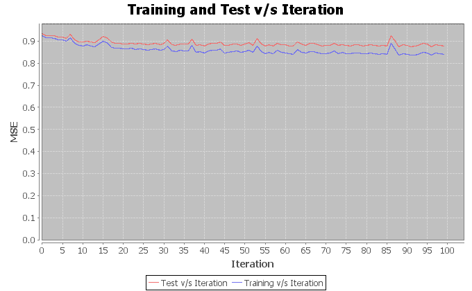

每次迭代的训练和测试 MSE(100 次迭代)

上图显示，训练和测试误差是一致的，这意味着 FM 模型没有过度拟合。该图还显示错误计数仍然很高。然后，我重复训练 1，000 次，发现错误略有减少，如下图所示:

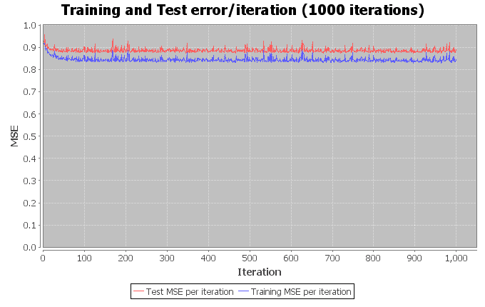

最多 1，000 次迭代的每次迭代的训练和测试 MSE

现在，为了绘制前面的图形，我写了一个；使用了的`PlotUtil_Rating.java`类中的`plot()`方法；`JFreeChart`用于绘制训练和测试错误/迭代的库:

```java
public static void plot(double[] iterationArray, double[] testArray, double[] trainArray) {
    final XYSeriesCollection dataSet = new XYSeriesCollection();
    addSeries(dataSet, iterationArray, testArray, "Test MSE per iteration");
    addSeries(dataSet, iterationArray, trainArray, "Training MSE per iteration");

    final JFreeChart chart = ChartFactory.createXYLineChart(
            "Training and Test error/iteration (1000 iterations)", // chart title
            "Iteration", // x axis label
            "MSE", // y axis label
            dataSet, // data
            PlotOrientation.VERTICAL,
            true, // include legend
            true, // tooltips
            false // urls
    );

    final ChartPanel panel = new ChartPanel(chart);
    final JFrame f = new JFrame();
    f.add(panel);
    f.setDefaultCloseOperation(WindowConstants.EXIT_ON_CLOSE);
    f.pack();
    f.setVisible(true);
}
```

而来自`XYSeries`类的`addSeries()`方法为绘图添加系列:

```java
private static void addSeries (final XYSeriesCollection dataSet, double[] x, double[] y, final String label){
    final XYSeries s = new XYSeries(label);
    for(int j = 0; j < x.length; j++ ) s.add(x[j], y[j]);
    dataSet.addSeries(s);
}
```


# 哪个更有意义；–排名或评级？

在开发电影推荐系统时，评级或排名预测更符合逻辑吗？在我看来，如果每个用户的评分足够高，分解用户-产品矩阵是最好的事情。但是，如果数据集过于稀疏，预测可能会非常不准确。

知道了这个事实，我在探索 RankSys 图书馆时发现其中一个贡献者认为排名更符合逻辑。不过，他没有提供任何解释。后来，我与一些推荐系统开发者和研究人员交谈，了解到他的意思可能是，由于一些评级和项目之间的差距，排名对预测误差不太敏感。原因是排名保留了等级，独立于绝对评级。

基于这种理解，后来，我决定在排名预测上更进一步。为此，我编写了一个名为`RankingPrediction.java`的 spate 类，用于预测测试集中每个用户的电影排名，其结构如下:

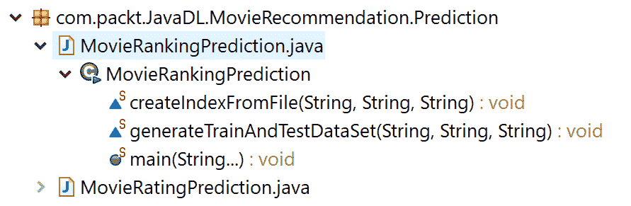

电影分级预测子项目结构

这有三种方法，如下所示:

*   `createIndexFromFile()`:该方法用于从文件中创建索引，这些文件作为方法参数本身的一个参数传递。
*   `generateTrainAndTestDataSet()`:用于将数据分成训练集和测试集，这是评估数据挖掘模型的重要部分。
*   `main()`:用于创建项目和用户的索引，用于以下操作:
    *   一组用户的索引
    *   一组项目的索引
    *   存储由`FastUserIndex`和`FastItemIndex`提供的用户和项目的偏好/评级
    *   创建将由`FMRecommender`使用的推荐界面
    *   使用因式分解机，该机器使用`RMSE-like loss`对负实例进行平衡采样

首先，我们设置输入数据文件的路径:

```java
final String folderPath = "ml-1m";
final String indexPath = "index";
final String userFileName = "users.dat";
final String moviesFileName = "movies.dat";
final String ratingsFileName = "ratings.dat";
final String encodingUTF8 = "UTF-8";

final String userDatPath = folderPath + "/" + userFileName;
final String movieDatPath = folderPath + "/" + moviesFileName;
```

然后，我们为前面提到的用户和电影索引设置路径:

```java
final String indexPath = "index";
final String userIndexPath = indexPath + "/" + "userIndex";
final String movieIndexPath = indexPath + "/" + "movieIndex";
```

然后，我们为生成的文件设置路径，在这里将生成训练集和测试集:

```java
String trainDataPath = indexPath + "/ratings_train";
String testDataPath = indexPath + "/ratings_test";
final String ratingsDatPath = folderPath + "/" + ratingsFileName;
```

然后，我们在`users.dat`文件中为所有用户创建用户索引。这里，用户在内部用从 0(包括 0)到索引用户数(不包括 0)的数字索引来表示:

```java
FastUserIndex<Long> userIndex = SimpleFastUserIndex.*load*(UsersReader.*read*(userIndexPath, *lp*));
```

在前面的代码行中，我们使用了 RankSys 库中的`SimpleFastUserIndex`类，该类帮助创建了一个由名为；`IdxIndex`。

然后，我们为`movies.dat`文件中的所有项目创建项目索引。这将为一组项目创建索引。这里，项目在内部用从 0(包括 0)到索引项目数(不包括 0)的数字索引来表示:

```java
FastItemIndex<Long> itemIndex = SimpleFastItemIndex.*load*(ItemsReader.*read*(movieIndexPath, *lp*));
```

在前面的代码行中，我们使用了 RankSys 库中的`SimpleFastItemIndex`类，它帮助我们创建了一个简单的`FastItemIndex`实现，由一个名为；`IdxIndex`。然后，我们存储`FastUserIndex`和`FastItemIndex`提供的用户和物品的偏好/评分:

```java
FastPreferenceData<Long, Long> trainData = SimpleFastPreferenceData.*load*(SimpleRatingPreferencesReader.*get*().read(trainDataPath, *lp*, *lp*), userIndex, itemIndex);

FastPreferenceData<Long, Long> testData = SimpleFastPreferenceData.*load*(SimpleRatingPreferencesReader.*get*().read(testDataPath, *lp*, *lp*), userIndex, itemIndex);
```

然后，我们调用这两种方法来创建用户和项目索引:

```java
if (!Files.*exists*(Paths.*get*(userIndexPath))) {
     *createIndexFromFile*(userDatPath, encodingUTF8, userIndexPath);
}

if (!Files.*exists*(Paths.*get*(movieIndexPath))) {
 *createIndexFromFile*(movieDatPath, encodingUTF8, movieIndexPath);
}
```

在前面的 if 语句中，我们使用如下的`createIndexFromFile()`方法从文件生成索引:

```java
static void createIndexFromFile(String fileReadPath, String encodings, String fileWritePath) throws IOException {
        BufferedReader bufferedReader = new BufferedReader(new InputStreamReader(new FileInputStream(
                        fileReadPath), Charset.forName(encodings)));
        BufferedWriter writer = new BufferedWriter(new OutputStreamWriter(
                        new FileOutputStream(fileWritePath)));

        String line;
        while((line = bufferedReader.readLine()) != null) {
            StringBuilder builder = new StringBuilder();
            String[] lineArray = line.split("::");
            builder.append(lineArray[0]);
            writer.write(builder.toString());
            writer.newLine();
        }

        writer.flush();

        bufferedReader.close();
        writer.close();
    }
```

一旦生成了索引文件，我们就开始生成训练集和测试集，如下所示:

```java
if ( !Files.*exists*(Paths.*get*(trainDataPath))) {
 *generateTrainAndTestDataSet*(ratingsDatPath, trainDataPath, testDataPath);
}
```

在这个代码块中，我们使用了；`generateTrainAndTestDataSet()`生成训练集和测试集的方法:

```java
static void generateTrainAndTestDataSet(String ratingsDatPath, String trainDataPath, String testDataPath) throws IOException {
        BufferedWriter writerTrain = new BufferedWriter(new OutputStreamWriter(
                        new FileOutputStream(trainDataPath)));

        BufferedWriter writerTest = new BufferedWriter(new OutputStreamWriter(
                        new FileOutputStream(testDataPath)));

        BufferedReader bufferedReader = new BufferedReader(new FileReader(ratingsDatPath));
        List<String> dummyData = new ArrayList<>();
        String line;

        while((line = bufferedReader.readLine()) != null) {
            String removeDots = line.replaceAll("::", "\t");
            dummyData.add(removeDots);
        }

        bufferedReader.close();

        Random generator = new Random();
        int dataSize = dummyData.size();
        int trainDataSize = (int)(dataSize * (2.0 / 3.0));
        int i = 0;

        while(i < trainDataSize){
            int random = generator.nextInt(dummyData.size()-0) + 0;
            line = dummyData.get(random);
            dummyData.remove(random);
            writerTrain.write(line);
            writerTrain.newLine();
            i++;
        }

        int j = 0;
        while(j < (dataSize - trainDataSize)){
            writerTest.write(dummyData.get(j));
            writerTest.newLine();
            j++;
        }

        writerTrain.flush();
        writerTrain.close();

        writerTest.flush();
        writerTest.close();
    }
```

前面的方法将 2/3 划分为训练集，1/3 划分为测试集。最后，关闭文件指针以释放资源。如果前面三个 If 语句成功执行，您应该会看到已经为定型集和测试集生成了两个索引文件和两个其他文件:

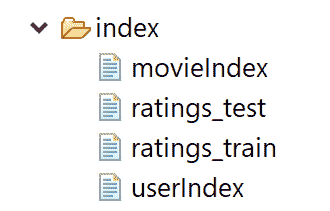

然后，我们创建一个推荐器接口，这个接口将由`FMRecommender`类使用，它生成的推荐对被推荐的项目没有任何限制:

```java
Map<String, Supplier<Recommender<Long, Long>>> recMap = new HashMap<>();
```

最后，使用偏好因子分解机来处理 RankSys 用户偏好对。然后，我们通过设置学习率、正则化和标准差来训练模型，并使用`PointWiseGradientDescent`迭代训练多达 100 次。然后，FM 使用类似 RMSE 的损失，对负面实例进行平衡采样:

```java
// Use Factorisation machine that uses RMSE-like loss with balanced sampling of negative instances:
String outFileName = "outFolder/Ranking_RMSE.txt";
recMap.put(outFileName, Unchecked.supplier(() -> {
            double negativeProp = 2.0D;

            FMData fmTrain = new OneClassPreferenceFMData(trainData, negativeProp);
            FMData fmTest = new OneClassPreferenceFMData(testData, negativeProp);

            double learnRate = 0.01D; // Learning Rate
            int numIter = 10; // Number of Iterations
            double sdev = 0.1D;
            double regB = 0.01D;

            double[] regW = new double[fmTrain.numFeatures()];
            Arrays.fill(regW, 0.01D);
            double[] regM = new double[fmTrain.numFeatures()];

            Arrays.fill(regM, 0.01D);
            int K = 100;

            // returns enclosed FM
 FM fm = new FM(fmTrain.numFeatures(), K, new Random(), sdev);
            (new PointWiseGradientDescent(learnRate, numIter, PointWiseError.rmse(), 
                                          regB, regW, regM)).learn(fm, fmTrain, fmTest);
             // From general purpose factorization machines to preference FM for user-preference  
            PreferenceFM<Long, Long> prefFm = new PreferenceFM<Long, Long>(userIndex, itemIndex, fm);

            return new FMRecommender<Long, Long>(prefFm);
        }));
```

在前面的代码块中，FM 模型使用`learn()`方法进行训练，这与前面部分中用于预测评级的`learn()`方法非常相似。然后，为了评估该模型，首先，我们设置目标用户和`SimpleRecommendationFormat`，它们位于制表符分隔的用户项得分三元组中(即，存在于原始数据集中):

```java
Set<Long> targetUsers = testData.getUsersWithPreferences().collect(Collectors.*toSet*());
//Format of the recommendation generated by the FM recommender model as <user, prediction)
RecommendationFormat<Long, Long> format = new SimpleRecommendationFormat<>(*lp*, *lp*);
Function<Long, IntPredicate> filter = FastFilters.*notInTrain*(trainData);
int maxLength = 100;
```

然后，我们调用`RecommenderRunner`接口来生成建议并根据格式打印出来:

```java
// Generate recommendations and print it based on the format.
RecommenderRunner<Long, Long> runner = new FastFilterRecommenderRunner<>(userIndex, itemIndex, targetUsers.stream(), filter, maxLength);

 recMap.forEach(Unchecked.biConsumer((name, recommender) -> {
            System.out.println("Ranking prediction is ongoing...");
            System.out.println("Result will be saved at " + name);
            try(RecommendationFormat.Writer<Long, Long> writer = format.getWriter(name)) {
                runner.run(recommender.get(), writer);
            }
        }));
```

前面的代码块将对测试集执行评估，并将建议写入我们之前指定的文本文件中:

```java
>>
 Ranking prediction is ongoing...
 Result will be saved at outFolder/Ranking_RMSE.txt
 INFO: iteration n = 1 t = 3.92s
 INFO: iteration n = 2 t = 3.08s
 INFO: iteration n = 3 t = 2.88s
 INFO: iteration n = 4 t = 2.84s
 INFO: iteration n = 5 t = 2.84s
 INFO: iteration n = 6 t = 2.88s
 INFO: iteration n = 7 t = 2.87s
 INFO: iteration n = 8 t = 2.86s
 INFO: iteration n = 9 t = 2.94s
 ...
 INFO: iteration n = 100 t = 2.87s
 Graph plotting...
```

预测已保存在 outFolder/Ranking_RMSE.txt 中

现在，让我们看看输出文件:

```java
944 2396 0.9340957389234708
 944 593 0.9299994477666256
 944 1617 0.9207678675263278
 944 50 0.9062805385053954
 944 1265 0.8740234972054955
 944 589 0.872143533435846
 944 480 0.8659624750023733
 944 2028 0.8649344355656503
 944 1580 0.8620307480644472
 944 2336 0.8576568651679782
 944 1196 0.8570902991702303
```

来自输出文件的该快照显示了用户 944 对不同电影的预测排名。现在我们可以看到，我们的 FM 模型已经预测了用户对电影的排名，检查模型在准确性和执行时间方面的性能将是有意义的。

为此，我写了一个名为`PlotUtil_Rank.java`的类。这个类接受度量类型和迭代次数，并使用`plot()`方法生成绘图:

```java
public static void plot(double[] iterationArray, double[] timeArray, String chart_type, int iter) {
        String series = null;
        String title = null;
        String x_axis = null;
        String y_axis = null;

        if(chart_type =="MSE"){        
            series = "MSE per Iteration (" + iter + " iterations)";
            title = "MSE per Iteration (" + iter + " iterations)";
            x_axis = "Iteration";
            y_axis = "MSE";
        }else {
            series = "Time per Iteration (" + iter + " iterations)";
            title = "Time per Iteration (" + iter + " iterations)";
            x_axis = "Iteration";
            y_axis = "Time";            
        }
            final XYSeriesCollection dataSet = new XYSeriesCollection();
            addSeries(dataSet, iterationArray, timeArray, series);

            final JFreeChart chart = ChartFactory.createXYLineChart(
                    title, // chart title
                    x_axis, // x axis label
                    y_axis, // y axis label
                    dataSet, // data
                    PlotOrientation.VERTICAL,
                    true, // include legend
                    true, // tooltips
                    false // urls
                    );

        final ChartPanel panel = new ChartPanel(chart);
        final JFrame f = new JFrame();
        f.add(panel);
        f.setDefaultCloseOperation(WindowConstants.EXIT_ON_CLOSE);
        f.pack();
        f.setVisible(true);
    }
```

从`PointWiseGradientDescent.java`类中进一步调用这个方法。首先，我们创建两个`Double`的`ArrayList`来保存执行时间和 MSE:

```java
//PointWiseGradientDescent.java
List<Double> timeList = new ArrayList<Double>();
List<Double> errList = new ArrayList<Double>();
```

然后，对于每一次迭代。`learn()`方法生成每次迭代的 MSE 误差和时间，并将它们放入列表:

```java
iter = t;
long time1 = System.*nanoTime*() - time0;
iterationList.add((double)iter);
timeList.add((double)time1 / 1_000_000_000.0);
errList.add(error(fm, test));
```

最后，如下调用`plot()`方法来绘制图形:

```java
PlotUtil_Rank.*plot*(convertobjectArraytoDouble(iterationList.toArray()),     convertobjectArraytoDouble(errList.toArray()), "MSE", iter); 

PlotUtil_Rank.*plot*(convertobjectArraytoDouble(iterationList.toArray()), convertobjectArraytoDouble(timeList.toArray()), "TIME", iter);
```

顺便说一下，下面代码中显示的`convertobjectArraytoDouble()`用于将对象数组转换为 doubles 类型，作为绘图的数据点:

```java
public double [] convertobjectArraytoDouble(Object[] objectArray){
 double[] doubleArray = newdouble[objectArray.length];
               //Double[ ]doubleArray=new Double();
 for(int i = 0; i < objectArray.length; i++){
                   Object object = objectArray[i]; 
                   String string = object.toString(); double dub = Double.*valueOf*(string).doubleValue();
                   doubleArray[i] = dub;
                       }
 return doubleArray;
     }
```

前面的调用应该会生成两个图形。首先，我们看到每次迭代的 MSE，下图显示了 100 次迭代的 MSE:

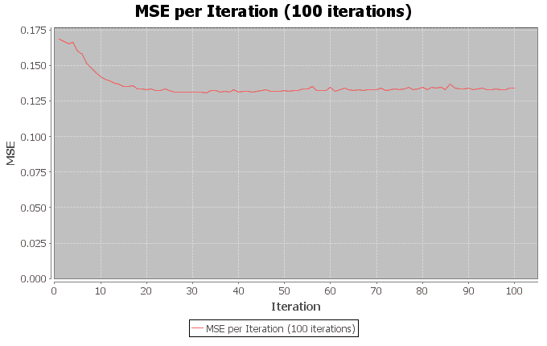

每次迭代的 MSE(最多 100 次^(到第)

然后，我们看到每次迭代的时间，下图显示了第 100 次迭代的时间:


每次迭代的时间(最多 100 次^(到第)

最后，从第二张图来看，除了每次迭代的执行时间波动很大之外，我们无法得出重要的见解。然而，在第 90 次^(到第)次迭代时，每次迭代所需的时间已经饱和。

另一方面，MSE 在第 20 次迭代之后从 0.16 急剧下降到 0.13，但是在第 25 次^(迭代之后饱和。这意味着只增加迭代次数，不会帮助我们进一步降低 MSE。因此，我建议您在改变迭代次数和其他超参数后尝试这种方法。)


# 常见问题(FAQ)

现在我们已经看到了如何开发一个电影推荐，它可以预测用户对电影的评级和排名，还有一些问题需要我们注意。此外，我们无法在本章中涵盖/讨论库，所以我建议您更仔细地阅读文档。

但是，在这一部分，我们仍然会看到一些您可能已经想到的常见问题。这些问题的答案可以在附录中找到。

1.  如何保存训练好的 FM 模型？
2.  如何从磁盘恢复已保存的 FM 模型？
3.  我可以使用 FM 算法来解决分类任务吗？
4.  给我举几个使用 FM 算法的例子。
5.  我可以使用 FM 算法进行前 N 名推荐吗？


# 摘要

在这一章中，我们看到了如何使用 FMs 开发一个电影推荐系统，FMs 是一组算法，通过以监督的方式合并矩阵分解算法中不存在的二阶特征交互来增强线性模型的性能。

然而，在深入研究使用基于 RankSys 库的 FMs 的项目实现之前，我们已经看到了使用矩阵分解和协作过滤的推荐系统的一些理论背景。由于篇幅限制，我没有更广泛地讨论这个库。然而，建议读者在 https://github.com/RankSys/RankSys 查看 GitHub 上的 API 文档。

这个项目不仅涵盖了个人用户的电影分级预测，还讨论了排名预测。因此，我们也使用 FMs 来预测电影的排名。

这差不多是我们用 Java 开发端到端项目之旅的终点。然而，我们还没有完成！在下一章，我们将讨论深度学习的一些最新趋势。然后，我们将看到一些可以使用 DL4J 库实现的新兴用例，或者至少我们会看到一些指针。


# 问题的答案

**回答问题 1** 的 **:为此，您可以通过提供输入模型文件名来调用`saveModel()`方法:**

```java
String FILENAME = Constants.FILENAME;
// Save the trained FM model 
fmlsgd.saveModel(FILENAME);
```

`saveModel()`方法如下:

```java
public void saveModel(String FILENAME) throws Exception
    {
        FILENAME = Constants.FILENAME;
        FileOutputStream fos = null;
        DataOutputStream dos = null;        
        try {      
            fos = new FileOutputStream(FILENAME);
            dos = new DataOutputStream(fos);
            dos.writeBoolean(fm.k0);
            dos.writeBoolean(fm.k1);
            dos.writeDouble(fm.w0);
            dos.writeInt(fm.num_factor);
            dos.writeInt(fm.num_attribute);
            dos.writeInt(task.ordinal());
            dos.writeDouble(max_target);
            dos.writeDouble(min_target);

            for(int i=0;i<fm.num_attribute;i++)
            {
                dos.writeDouble(fm.w[i]);
            }

            for(int i=0;i<fm.num_factor;i++)
            {
                dos.writeDouble(fm.m_sum[i]);
            }

            for(int i=0;i<fm.num_factor;i++)
            {
                dos.writeDouble(fm.m_sum_sqr[i]);
            }

            for(int i_1 = 0; i_1 < fm.num_factor; i_1++) {
                for(int i_2 = 0; i_2 < fm.num_attribute; i_2++) {                    
                    dos.writeDouble(fm.v.get(i_1,i_2));
                }
            }

            dos.flush();
        }
        catch(Exception e) {
            throw new JlibfmRuntimeException(e);
        } finally {          
             if(dos!=null)
                dos.close();
             if(fos!=null)
                fos.close();
        }
    }
```

然后，该方法将把训练模型的所有元数据(包括维度、等级、权重和属性信息)保存到磁盘上。

**回答** **问题 2** :为此，您可以调用；`therestoreModel()`方法通过提供输入模型文件名:

```java
public void restoreModel(String FILENAME) throws Exception
    {
        FILENAME = Constants.FILENAME;
        InputStream is = null;
        DataInputStream dis = null;        
        try {      
            is = new FileInputStream(FILENAME);          
            dis = new DataInputStream(is);

            fm.k0 = dis.readBoolean();
            fm.k1 = dis.readBoolean();
            fm.w0 = dis.readDouble();
            fm.num_factor = dis.readInt();
            fm.num_attribute = dis.readInt();

            if(dis.readInt() == 0)
            {
               task = TaskType.TASK_REGRESSION;
            }
            else
            {
               task = TaskType.TASK_CLASSIFICATION;
            }

            max_target = dis.readDouble();
            min_target = dis.readDouble();

            fm.w = new double[fm.num_attribute];

            for(int i=0;i<fm.num_attribute;i++)
            {
                fm.w[i] = dis.readDouble();
            }

            fm.m_sum = new double[fm.num_factor];
            fm.m_sum_sqr = new double[fm.num_factor];

            for(int i=0;i<fm.num_factor;i++)
            {
               fm.m_sum[i] = dis.readDouble();
            }

            for(int i=0;i<fm.num_factor;i++)
            {
                fm.m_sum_sqr[i] = dis.readDouble();
            }

            fm.v = new DataPointMatrix(fm.num_factor, fm.num_attribute);

            for(int i_1 = 0; i_1 < fm.num_factor; i_1++) {
                for(int i_2 = 0; i_2 < fm.num_attribute; i_2++) {        
                    fm.v.set(i_1,i_2, dis.readDouble());
                }
            }

        }
        catch(Exception e) {
            throw new JlibfmRuntimeException(e);
        } finally {          
             if(dis!=null)
                dis.close();
             if(is!=null)
                is.close();
        }
    }
```

这个方法的调用将从磁盘中恢复保存的模型，包括训练模型的所有元数据(例如，维度、等级、权重和属性信息)。

**回答** **问题 3** :是的，当然。该算法对于非常稀疏的数据集也非常有效。你只需要有整数和任务类型分类中的预测标签，也就是`task == TaskType.TASK_CLASSIFICATION`。

**对问题 4** 的回答:有几个应用了基于 FM 的方法的用例。例如:

*   从用户执行的给定点击事件序列预测用户是否将在会话中购买商品。此外，如果他/她正在购买，他/她会购买哪些商品？这个问题被称为 2015 年 RecSys 挑战赛(详见[http://2015.recsyschallenge.com/challenge.html](http://2015.recsyschallenge.com/challenge.html))。

    要查看示例解决方案，感兴趣的读者可以看看以下书名为*深度学习与 TensorFlow -第二版*的书，由 Karim 等人于 2018 年 3 月由 Packt Publishing 出版(更多信息请参见[https://www . packtpub . com/big-data-and-business-intelligence/Deep-Learning-tensor flow-Second-Edition](https://www.packtpub.com/big-data-and-business-intelligence/deep-learning-tensorflow-second-edition))。

*   *基于行为、产品和客户数据的混合推荐系统使用因式分解机*(参见 https://dl.acm.org/citation.cfm?id=2796542)。

**问题 5** 答案:是的，你可以从隐式反馈(从评论、事件、交易等等)中提取，因为将评分预测结果转换为 top-N 列表是一项琐碎的工作。然而，我不认为有任何可用的开源实现，但是你当然可以通过修改 LibFM 来使用成对排序。